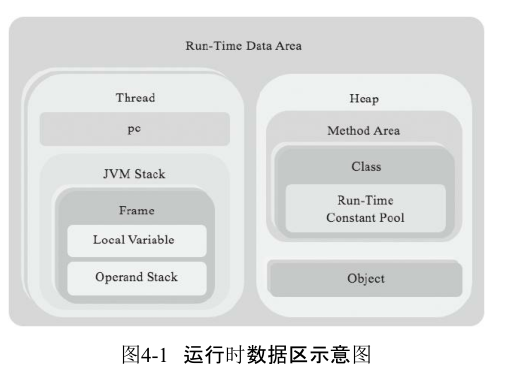
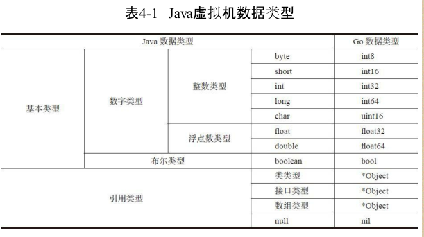

Go 手写 JVM

## 程序入口

## 运行简单的HelloWorld，

需要读取多了类，比如：

1. java.lang.Object
2. java.lang.String
3. 字符串打印到控制台还需要加载java.lang.System类

## 寻找系统中的 class信息

1. 得到用户电脑的系统变量
2. 获取得到JAVA_HOME等系统的参数变量
3. 对于不同类型的 Java 中的文件资源进行解析，如jar、 zip
4. 如果是`.class` 文件，那么就之间执行`readClass`方法。

## Class文件

### 对找到的Class文件进行解析

1. 关于 Class 文件的特点
   1. 编译一次到处运行
   2. 来源不限：网络、硬盘、数据库、或者直接生成新的 Class 文件
2. 读取`.class` 文件，将一个文件的内容读取出来
   1. **魔数：**很多文件格式都会规定满足该格式的文件以某几个固定字节开头，这几个字节主要起标识作用，叫作魔数，如果加载的`.class`文件不符合要求的格式，Java虚拟机实现就抛出`java.lang.ClassFormatError`异常
   2. **版本号：**魔数之后是`.class`文件的次版本号和主版本号
   3. **常量池**：（内容比较多）
      1. 常量池占据了class文件很大一部分数据，里面存放着各式各样的常量信息，包括数字和字符串常量、类和接口名、字段和方法名
      2. 常量池实际上也是一个表
      3. 由于常量池中存放的信息各不相同，所以每种常量的格式也不同。常量数据的第一字节是tag，用来区分常量类型。、
      4. Java虚拟机规范一共定义了14种常量
         1. CONSTANT_Integer_info：正好可以容纳一个Java的int型常量，但实际上比int更小的boolean、byte、short和char类型的常量也放在CONSTANT_Integer_info中
         2. CONSTANT_Float_info使用4字节存储IEEE754单精度浮点数常量
         3. CONSTANT_Long_info使用8字节存储整数常量
         4. CONSTANT_Double_info，使用8字节存储IEEE754双精度浮点数
         5. CONSTANT_Utf8_info常量里放的是MUTF-8编码的字符串
         6. CONSTANT_String_info常量表示java.lang.String字面量
         7. CONSTANT_Class_info常量表示类或者接口的符号引用
         8. CONSTANT_NameAndType_info给出字段或方法的名称和描述符
         9. CONSTANT_Fieldref_info表示字段符号引用，
         10. CONSTANT_Methodref_info表示普通（非接口）方法符号引用，
         11. CONSTANT_InterfaceMethodref_info表示接口方法符号引用
         12. CONSTANT_MethodType_info、CONSTANT_MethodHandle_info、CONSTANT_InvokeDynamic_info。它们是Java SE 7才添加到class文件中的，目的是支持新增的invokedynamic指令。本书不讨论invokedynamic指令，
      5. 常量池中的常量分为两类：字面量（literal）和符号引用（symbolic reference）。字面量包括数字常量和字符串常量，符号引用包括类和接口名、字段和方法信息等。除了字面量，其他常量都是通过索引直接或间接指向CONSTANT_Utf8_info常量的。
   4. **类访问标志**：指出class文件定义的是类还是接口，访问级别是public还是private，等等
   5. **常量池索引**：类访问标志之后是的常量池索引，分别给出类名和超类名
   6. **接口索引表：**类和超类索引后面是接口索引表，表中存放的也是常量池索引，给出该类实现的所有接口的名字。
   7. **字段表和方法表**：接口索引表之后是字段表和方法表，分别存储字段和方法信息。
   8. **属性表**：和常量池类似，各种属性表达的信息也各不相同，因此无法用统一的结构来定义。不同之处在于，常量是由Java虚拟机规范严格义的，共有14种。但属性是可以扩展的，不同的虚拟机实现可以定义自己的属性类型。
      1. 属性历史
         1. JDK1.0时只有6种预定义属性，
         2. JDK1.1增加了3种。
         3. J2SE 5.0增加了9种属性，主要用于支持泛型和注解。
         4. Java SE 6增加了StackMapTable属性，用于优化字节码验证。
         5. Java SE 7增加了BootstrapMethods属性，用于支持新增的invokedynamic指令。
         6. Java SE 8又增加了三种属性。
      2. 属性介绍
         1. Deprecated和Synthetic属性：仅起标记作用，不包含任何数据。这两种属性都是JDK1.1引入的
         2. SourceFile属性：是可选定长属性，只会出现在ClassFile结构中，用于指出源文件名
         3. ConstantValue属性： 是定长属性，只会出现在field_info结构中，用于表示常量表达式的值
         4. Code属性：Code是变长属性，只存在于method_info结构中。Code属性中存放字节码等方法相关信息。相比前面介绍的几种属性，Code属性比较复杂
            1. max_stack给出操作数栈的最大深度，
            2. max_locals给出局部变量表大小。
            3. 接着是字节码，存在u1表中。
            4. 最后是异常处理表和属性表。
         5. Exceptions属性：是变长属性，记录方法抛出的异常表
         6. LineNumberTable和LocalVariableTable属性：属性表存放方法的行号信息、表中存放方法的局部变量信息。这两种属性和前面介绍的SourceFile属性都属于调试信息，都不是运行时必需的

## 运行时数据区

两类：

1. 一类是多线程共享的，主要存放两类数据：
   1. 类数据。类数据存放在方法区（Method Area）中。
   2. 类实例（也就是对象）。对象数据存放在堆（Heap）中，
2. 另一类则是线程私有的。线程私有的运行时数据区则在创建线程时才创建，线程退出时销毁

3. 解析常用的数据类型

   

### 建立线程

1. 建立新的执行任务线程
2. 在线程中增加栈空间（可配置化）
3. 创建栈指针字段
4. 增加局部变量表（数组）
5. 增加操作数栈

## 指令集和解释器

​		编写一个简单的解释器，并且实现大约150条指令。在后面的章节中，会不断改进这个解释器，让它可以执行更多的指令。Java虚拟机最多只能支持256条指令。到第八版为止，Java虚拟机规范已经定义了205条指令，

​		操作数栈和局部变量表只存放数据的值，并不记录数据类型。结果就是：指令必须知道自己在操作什么类型的数据。这一点也直接反映在了操作码的助记符上。例如，iadd指令就是对int值进行加法操作；dstore指令把操作数栈顶的double值弹出，存储到局部变量表中；areturn从方法中返回引用值。也就是说，如果某类指令可以操作不同类型的变量，则助记符的第一个字母表示变量类型。

### 指令集

Java虚拟机规范把已经定义的205条指令按用途分成了11类，分别是：常量（constants）指令、加载（loads）指令、存储（stores）指令、操作数栈（stack）指令、数学（math）指令、转换（conversions）指令、比较（comparisons）指令、控制（control）指令、引用（references）指令、扩展（extended）指令和保留（reserved）指令。

### 解释器

也就是有一个方法，通过启动线程，在通过指令集，去操作变量，进行数据的运算

## 类和对象

### 方法区

1. 类信息
2. 字段信息
3. 方法信息
4. 其他信息

### 运行时常量池

1. 字面量：包括整数、浮点数和字符串字面量
2. 符号引用：包括类符号引用、字段符号引用、方法符号引用和接口方法符号引用

### 类加载器

​		Java虚拟机的类加载系统十分复杂

​		类的加载大致可以分为三个步骤：首先找到class文件并把数据读取到内存；然后解析class文件，生成虚拟机可以使用的类数据，并放入方法区；最后进行链接

​		类的链接分为验证和准备两个必要阶段：Java虚拟机规范要求在执行类的任何代码之前，对类进行严格的验证
