**在本地项目文件中使用bash**

$ git config --global user.name "你的名字"

$ git config --global user.email "你的邮箱"

**1. 初始化** 

$ git init 

$ git remote add origin https://gitee.com/xxx/xxx.git (你的远程项目地址)

**2.克隆一下**

$ git clone https://****.git (你的远程项目地址)

**3. 提交**

$ git pull origin master

$ git add .

$ git commit -m "你的第一次提交"

$ git push origin master

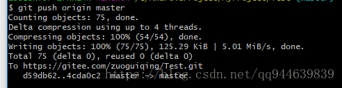

完成了第一次提交

## IDEA整合git完成代码提交到远程仓库

前提：电脑安装了git
IDEA会自动识别安装路径，如果没有识别，自己选择安装路径配置就好
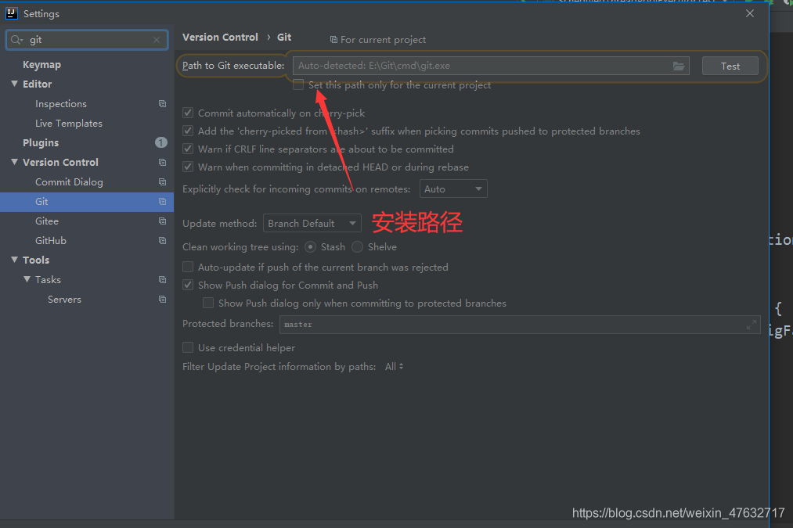
IDEA安装git插件
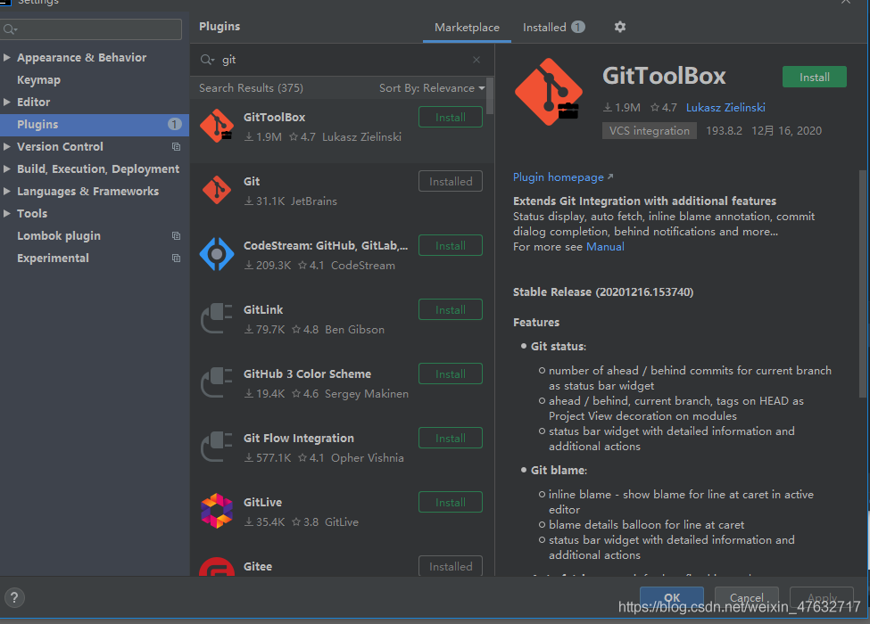

## 一、创建本地仓库

点击VCS – lmport into Version Control – Create Git Repository…
选择项目文件地址，创建本地仓库
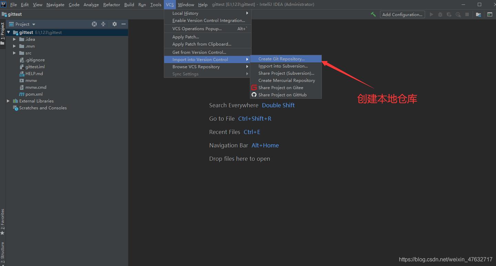

## 二、将代码提交到本地仓库

VCS – Git – Add
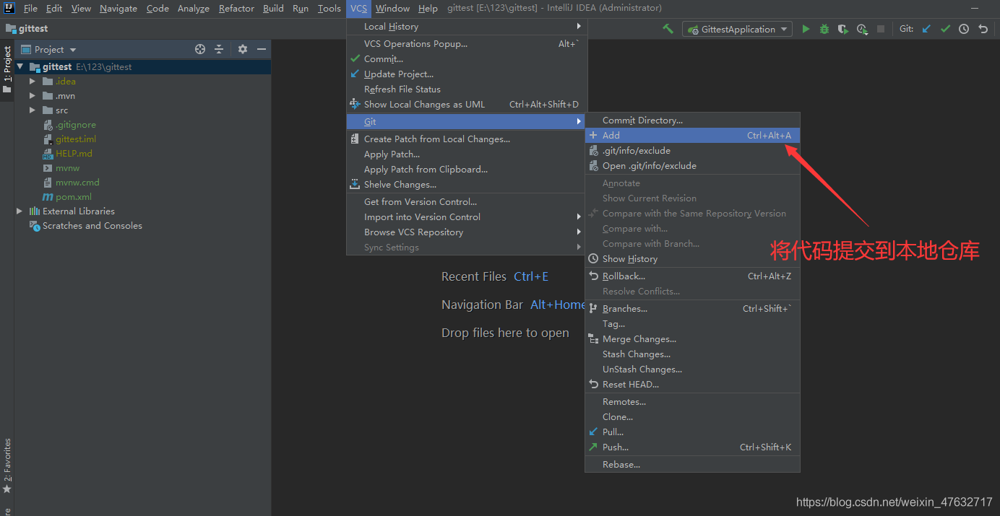

## 三、选择远程仓库地址（以gitee为例）

VCS – Git – Remote
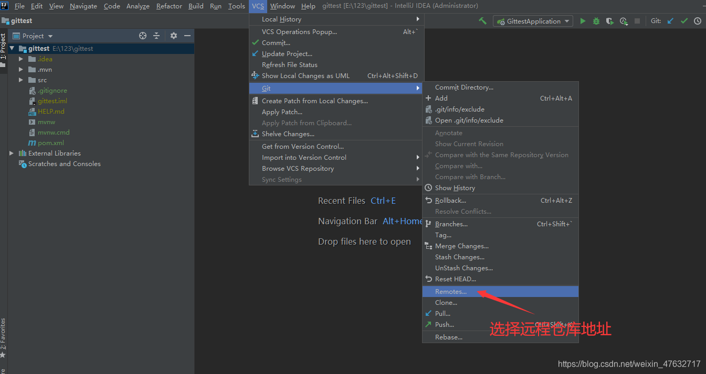
添加远程仓库地址
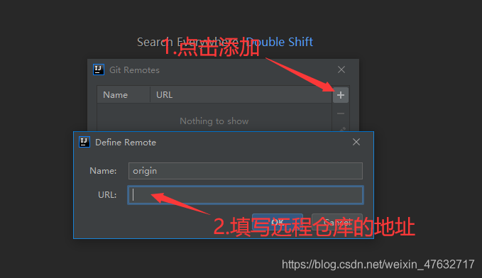
此时需要远程仓库的地址，登录gitee创建仓库、复制地址URL，填入即可

## 四、创建远程仓库、填入地址

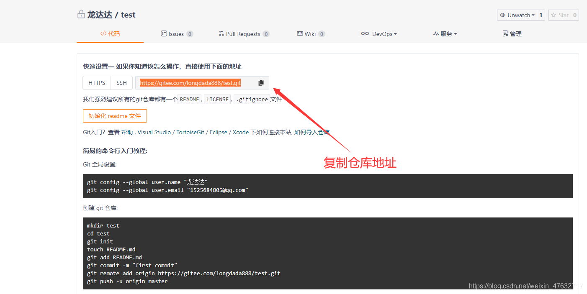
把地址填入第三步URL中，Name默认的就行
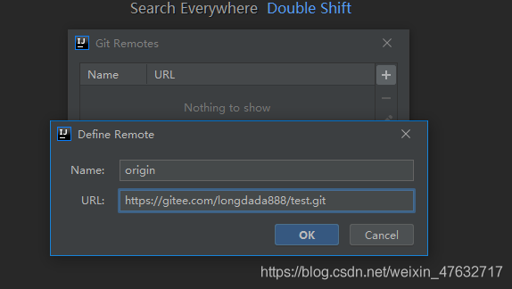
点击ok，进行密码校验（第一次需要）
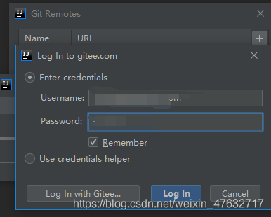

## 五、提交代码

VCS – Git – Commit Directory…
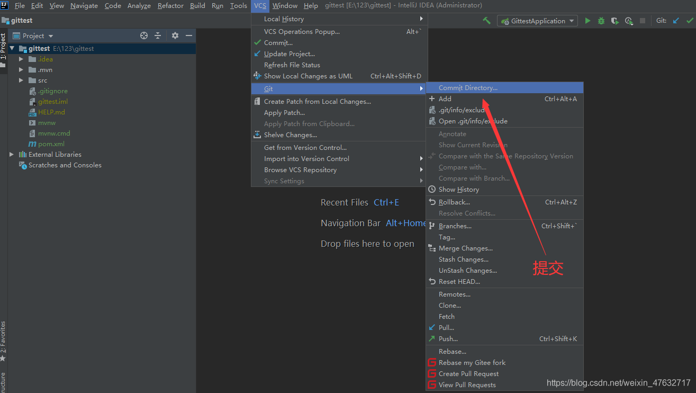

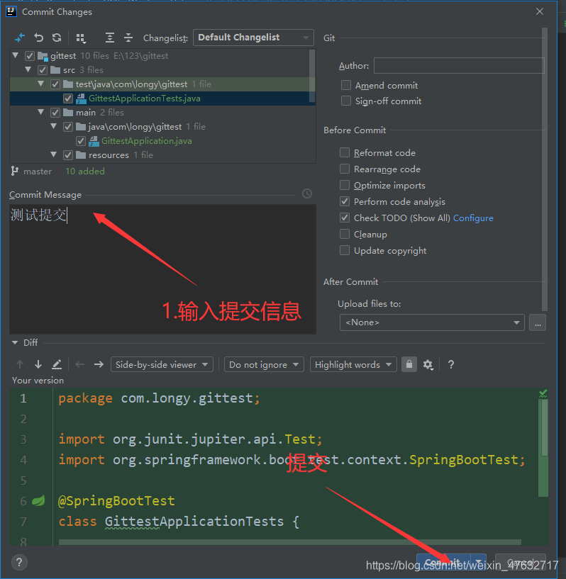

## 六、Push

VSC – Git – Push
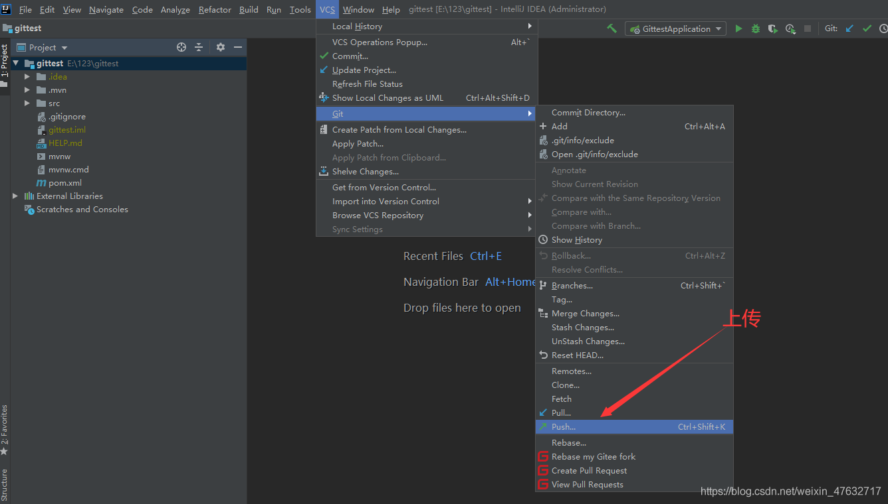
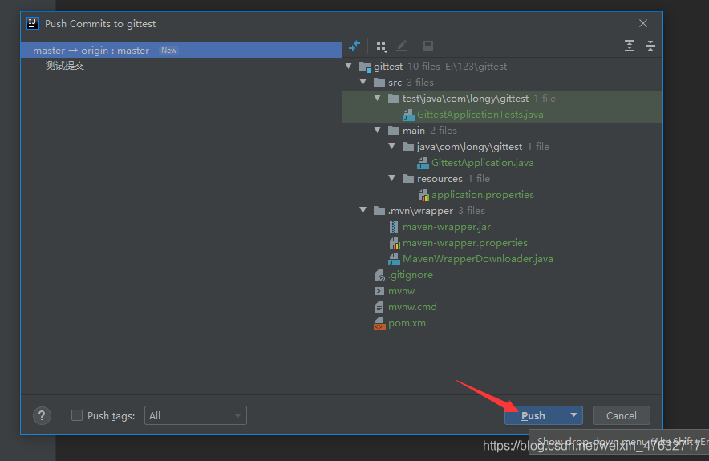
回到仓库查看，代码已经上传成功
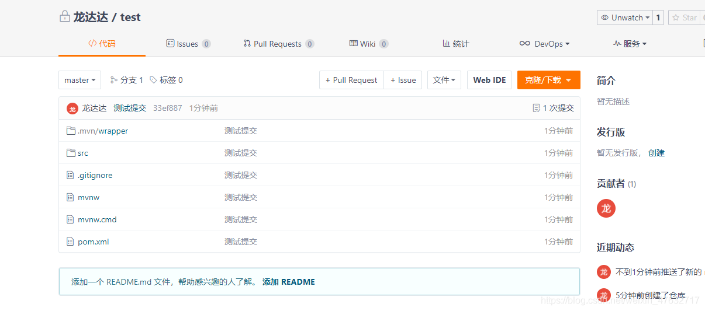
为什么写这个？
原因：记不住git命令

