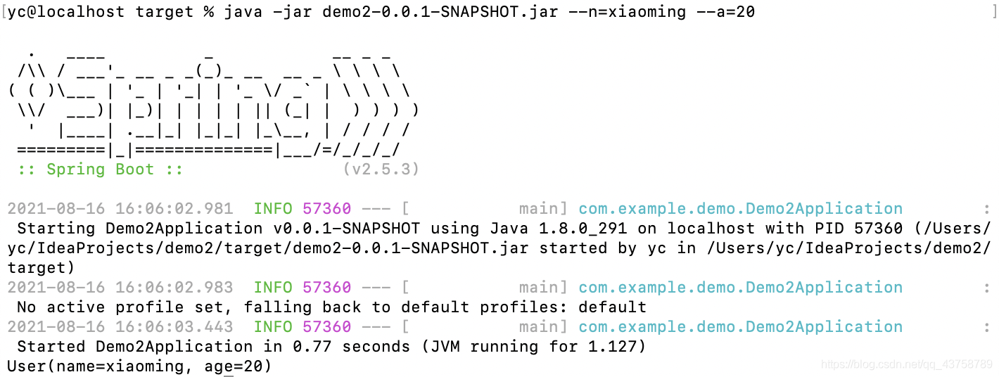

# SpringBoot CommandLine

[`CSDN`参考资料](https://blog.csdn.net/qq_43758789/article/details/119734922?ops_request_misc=&request_id=&biz_id=102&utm_term=Spring%20boot%20%E5%91%BD%E4%BB%A4%E8%A1%8C&utm_medium=distribute.pc_search_result.none-task-blog-2~all~sobaiduweb~default-0-119734922.142^v35^pc_search_result_control_group&spm=1018.2226.3001.4187)

## 概述

### 主要作用

1. 主要是在Spring boot 启动之后，完成一些定制化的任务
2. 此处也做了命令行启动的参数附加

## 命令行参数代码

### 参数实体类：

~~~java

package com.example.demo.bean;
import lombok.Data;

/**
 * @Author: yc
 * @Description:
 * @Date: 2021/08/16/11:08
 */
@Data
public class User {
    String name;
    String age;
}

~~~

### 接收参数Config

~~~java

package com.example.demo.Utils;
import com.example.demo.bean.User;
import org.springframework.boot.ApplicationArguments;
import org.springframework.context.annotation.Bean;
import org.springframework.stereotype.Component;
import java.util.List;

/**
 * @Author: yc
 * @Description:
 * @Date: 2021/08/16/11:07
 */

@Component
public class CmdConfig {

	// 将方法注入到容器中，值为返回值对象
    @Bean
    public User getUser(ApplicationArguments arguments)
    {
    	// 获取输入的参数（--n，--a）
        List<String> n = arguments.getOptionValues("n");
        List<String> a = arguments.getOptionValues("a");
        User user = new User();
        try
        {
            user.setName(n.get(0));
            user.setAge(a.get(0));
        }catch (Exception e)
        {
            System.out.println("Exception: " + e.getMessage());
        }
        return user;
    }
}

~~~

### 命令行处理类

~~~java
package com.example.demo.Utils;
import com.example.demo.bean.User;
import lombok.extern.slf4j.Slf4j;
import org.springframework.boot.CommandLineRunner;
import org.springframework.stereotype.Component;
import javax.annotation.Resource;

/**
 * @Author: yc
 * @Description:
 * @Date: 2021/08/16/11:07
 */
 
@Component
@Slf4j
public class Command implements CommandLineRunner {

	// 获取到注入的User对象
    @Resource
    private User user;

	// 重写CommandLineRunner类的run方法
    @Override
    public void run(String... args) throws Exception {
    	// 将user对象打印	
        System.out.println(user.toString());
    }
}

~~~

### SpringBoot执行类

~~~java
package com.example.demo;
import org.springframework.boot.SpringApplication;
import org.springframework.boot.autoconfigure.SpringBootApplication;

@SpringBootApplication
public class Demo2Application {
    public static void main(String[] args) {
        SpringApplication.run(Demo2Application.class, args);
    }
}

~~~

### 打包jar，并执行

~~~bash
java -jar demo2-0.0.1-SNAPSHOT.jar --n=xiaoming --a=20
~~~

## 多任务命令行代码

~~~java
@Component
@Order(value = 2)
public class MyStartupRunner1 implements CommandLineRunner{
@Override
public void run(String... strings) throws Exception {
    System.out.println(">>>>>>>>>>>>>>>服务启动执行，执行加载数据等操作 MyStartupRunner1 order 2 <<<<<<<<<<<<<");
    }
}

// 可以用来设置任务启动的顺序
@Component
@Order(value = 1)
public class MyStartupRunner2 implements CommandLineRunner {
@Override
public void run(String... strings) throws Exception {
    System.out.println(">>>>>>>>>>>>>>>服务启动执行，执行加载数据等操作 MyStartupRunner2 order 1 <<<<<<<<<<<<<");
    }
}
~~~

