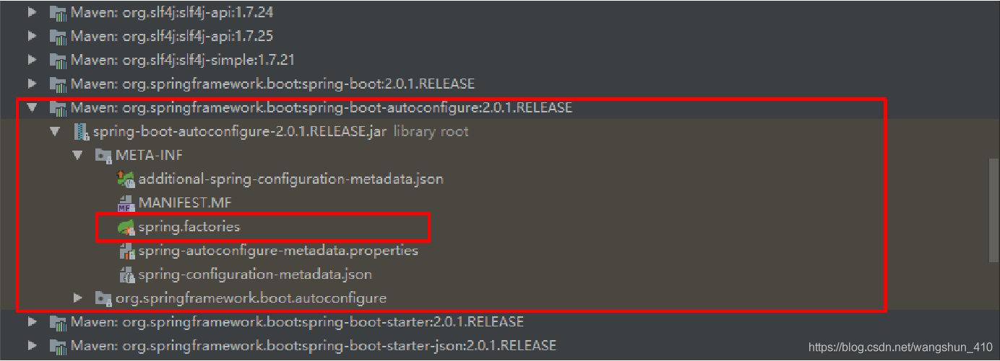
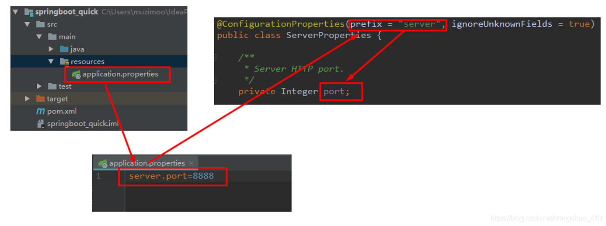
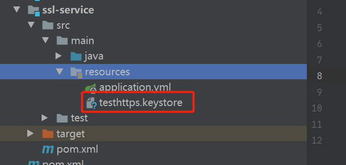

# Spring Boot

## 概述

### 谈谈你对于Spring Boot的理解？

1.  Spring Boot并不是一个新的东西，它是 Spring 开源组织下的子项目，是一个Java Web开发的脚手架工具。
2. Spring Boot的存在主要是简化了使用 Spring 的难度，简省了繁重的配置，提供了各种启动器，开发者能快速上手，快速的构建应用程序。

### Spring的缺点分析

1. 配置却是重量级的，起初的是xml配置方式，后来采用基于Java的配置，代替了xml配置，稍微有些改善
2. 依赖管理也是一件耗时耗力的事情。在环境搭建时，需要分析要导入哪些库的坐标

### Spring Boot 有哪些优点？

1. 容易上手，提升开发效率。
2. 开箱即用，远离繁琐的配置。
3. 提供了一系列大型项目通用的非业务性功能，例如：内嵌服务器、安全管理、运行数据监控、运行状况检查和外部化配置等。
4. 没有代码生成，也不需要XML配置。
5. 避免大量的 Maven 导入和各种版本冲突。

### 版本介绍

1. jdk 1.7 + springboot 1.4.0 可以运行
2. jdk 1.8 + springboot 2.0.0 
3. jdk 17 + springboot 3.0

Spring Boot 3.0.0 第一个里程碑版本 M1 发布，有两个重大的变更依赖项：

- 最低要求 Java 17；
- Java EE 迁移到了 Jakarta EE；

### Spring Boot 的核心注解是哪个？它主要由哪几个注解组成的？

启动类上面的注解是@SpringBootApplication，它也是 Spring Boot 的核心注解，主要组合包含了以下 3 个注解：

1. @SpringBootConfiguration：组合了 @Configuration 注解，实现配置文件的功能。

2. @EnableAutoConfiguration：打开自动配置的功能，也可以关闭某个自动配置的选项，如关闭数据源自动配置功能： @SpringBootApplication(exclude = { DataSourceAutoConfiguration.class })。

3. @ComponentScan：Spring组件扫描。

### SpringBoot 四大核心

+ starter
+ autoconfigure
+ CLI
+ actuator


## 配置

### 什么是 JavaConfig？

1. 面向对象的配置。由于配置被定义为 JavaConfig 中的类，因此用户可以充分利用 Java 中的面向对象功能。

2. 减少或消除 XML 配置。基于依赖注入原则的外化配置的好处已被证明。

3. 类型安全和重构友好。JavaConfig 提供了一种类型安全的方法来配置 Spring容器。


### Spring Boot 自动配置原理是什么？

+ 注解 @EnableAutoConfiguration, @Configuration, @ConditionalOnClass 就是自动配置的核心，
+ @EnableAutoConfiguration 给容器导入META-INF/spring.factories 里定义的自动配置类。
+ 筛选有效的自动配置类。每一个自动配置类结合对应的 xxxProperties.java 读取配置文件进行自动配置功能


### Spring Boot配置的加载顺序 ？

在 Spring Boot 里面，可以使用以下几种方式来加载配置。

1. properties文件；

2. YAML文件；

3. 系统环境变量；

4. 命令行参数；

加在配置文件的顺序

1. bootstrap.properties
2. application.properties 

### 什么是YAML？优缺点是什么？

​		YAML 是一种人类可读的数据序列化语言。它通常用于配置文件。如果我们想要在配置文件中添加复杂的属性，YAML 文件就更加结构化，而且更少混淆。可以看出 YAML 具有分层配置数据。

**优点：**

1. 配置有序，在一些特殊的场景下，配置有序很关键
2. 支持数组，数组中的元素可以是基本数据类型也可以是对象
3. 简洁，结构清晰，容易解读

 **缺点：**

1.  @PropertySource 注解导入自定义的 YAML 配置。

### Spring Boot是否可以使用XML配置 ?

Spring Boot 推荐使用 Java 配置而非 XML 配置，但是 Spring Boot 中也可以使用 XML 配置，通过 @ImportResource 注解可以引入一个 XML 配置。

### spring boot核心配置文件是什么？bootstrap和 application有何区别 ?

单纯做 Spring Boot 开发，可能不太容易遇到 bootstrap.properties 配置文件，但是在结合 Spring Cloud 时，这个配置就会经常遇到了，特别是在需要加载一些远程配置文件的时侯。

spring boot 核心的两个配置文件：

- bootstrap (. yml 或者 . properties)：比 applicaton 优先加载，配置在应用程序上下文的引导阶段生效。一般来说我们在 Spring Cloud Config 或者 Nacos 中会用到它。**且 boostrap 里面的属性不能被覆盖**；
- application (. yml 或者 . properties)：用于 spring boot 项目的自动化配置。


### 什么是 Spring Profiles？

Spring Profiles 允许用户根据配置文件（dev，test，prod 等）来注册 bean，方便程序配置文件或者环境的切换。


## 原理分析

### 起步依赖原理分析

#### 分析spring-boot-starter-parent

**两个重要功能：**

1. 具备版本锁定等配置
2. 起步依赖的作用就是进行依赖的传递

按住Ctrl点击pom.xml中的spring-boot-starter-parent，跳转到了spring-boot-starter-parent的pom.xml，xml配置如下（只摘抄了部分重点配置）：

```xml
<parent>
  <groupId>org.springframework.boot</groupId>
  <artifactId>spring-boot-dependencies</artifactId>
  <version>2.0.1.RELEASE</version>
  <relativePath>../../spring-boot-dependencies</relativePath>
</parent>
```

按住Ctrl点击pom.xml中的spring-boot-starter-dependencies，跳转到了spring-boot-starter-dependencies的pom.xml，xml配置如下（只摘抄了部分重点配置）：

```xml
<properties>
      <activemq.version>5.15.3</activemq.version>
      <antlr2.version>2.7.7</antlr2.version>
      <appengine-sdk.version>1.9.63</appengine-sdk.version>
      <artemis.version>2.4.0</artemis.version>
      <aspectj.version>1.8.13</aspectj.version>
      <assertj.version>3.9.1</assertj.version>
      <atomikos.version>4.0.6</atomikos.version>
      <bitronix.version>2.1.4</bitronix.version>
      <build-helper-maven-plugin.version>3.0.0</build-helper-maven-plugin.version>
      <byte-buddy.version>1.7.11</byte-buddy.version>
      ... ... ...
</properties>
<dependencyManagement>
      <dependencies>
          <dependency>
            <groupId>org.springframework.boot</groupId>
            <artifactId>spring-boot</artifactId>
            <version>2.0.1.RELEASE</version>
          </dependency>
          <dependency>
            <groupId>org.springframework.boot</groupId>
            <artifactId>spring-boot-test</artifactId>
            <version>2.0.1.RELEASE</version>
          </dependency>
          ... ... ...
    </dependencies>
</dependencyManagement>
<build>
      <pluginManagement>
        <plugins>
              <plugin>
                <groupId>org.jetbrains.kotlin</groupId>
                <artifactId>kotlin-maven-plugin</artifactId>
                <version>${kotlin.version}</version>
              </plugin>
              <plugin>
                <groupId>org.jooq</groupId>
                <artifactId>jooq-codegen-maven</artifactId>
			    <version>${jooq.version}</version>
              </plugin>
              <plugin>
                <groupId>org.springframework.boot</groupId>
                <artifactId>spring-boot-maven-plugin</artifactId>
                <version>2.0.1.RELEASE</version>
              </plugin>
             ... ... ...
        </plugins>
      </pluginManagement>
</build>
```

从上面的spring-boot-starter-dependencies的pom.xml中我们可以发现，一部分坐标的版本、依赖管理、插件管理已经定义好，所以我们的SpringBoot工程继承spring-boot-starter-parent后已经具备版本锁定等配置了。所以起步依赖的作用就是进行依赖的传递。

#### 分析spring-boot-starter-web

按住Ctrl点击pom.xml中的spring-boot-starter-web，跳转到了spring-boot-starter-web的pom.xml，xml配置如下（只摘抄了部分重点配置）：

```xml
<?xml version="1.0" encoding="UTF-8"?>
<project xsi:schemaLocation="http://maven.apache.org/POM/4.0.0 http://maven.apache.org/xsd/maven-4.0.0.xsd" xmlns="http://maven.apache.org/POM/4.0.0"
    xmlns:xsi="http://www.w3.org/2001/XMLSchema-instance">
      <modelVersion>4.0.0</modelVersion>
      <parent>
        <groupId>org.springframework.boot</groupId>
        <artifactId>spring-boot-starters</artifactId>
        <version>2.0.1.RELEASE</version>
      </parent>
      <groupId>org.springframework.boot</groupId>
      <artifactId>spring-boot-starter-web</artifactId>
      <version>2.0.1.RELEASE</version>
      <name>Spring Boot Web Starter</name>
      <dependencies>
       <dependency>
              <groupId>org.springframework.boot</groupId>
              <artifactId>spring-boot-starter</artifactId>
              <version>2.0.1.RELEASE</version>
              <scope>compile</scope>
        </dependency>
        <dependency>
              <groupId>org.springframework.boot</groupId>
              <artifactId>spring-boot-starter-json</artifactId>
              <version>2.0.1.RELEASE</version>
              <scope>compile</scope>
        </dependency>
        <dependency>
              <groupId>org.springframework.boot</groupId>
             <artifactId>spring-boot-starter-tomcat</artifactId>
              <version>2.0.1.RELEASE</version>
              <scope>compile</scope>
        </dependency>
        <dependency>
              <groupId>org.hibernate.validator</groupId>
              <artifactId>hibernate-validator</artifactId>
              <version>6.0.9.Final</version>
              <scope>compile</scope>
        </dependency>
        <dependency>
              <groupId>org.springframework</groupId>
              <artifactId>spring-web</artifactId>
              <version>5.0.5.RELEASE</version>
              <scope>compile</scope>
        </dependency>
        <dependency>
              <groupId>org.springframework</groupId>
              <artifactId>spring-webmvc</artifactId>
              <version>5.0.5.RELEASE</version>
              <scope>compile</scope>
        </dependency>
      </dependencies>
</project>
```

 

从上面的spring-boot-starter-web的pom.xml中我们可以发现，spring-boot-starter-web就是将web开发要使用的spring-web、spring-webmvc等坐标进行了“打包”，这样我们的工程只要引入spring-boot-starter-web起步依赖的坐标就可以进行web开发了，同样体现了依赖传递的作用。

 

### 自动配置原理解析

按住Ctrl点击查看启动类上的注解@SpringBootApplication

注解@SpringBootApplication的源码

```java
@Target(ElementType.TYPE)
@Retention(RetentionPolicy.RUNTIME)
@Documented
@Inherited
@SpringBootConfiguration
@EnableAutoConfiguration
@ComponentScan(excludeFilters = {
        @Filter(type = FilterType.CUSTOM, classes = TypeExcludeFilter.class),
        @Filter(type = FilterType.CUSTOM, classes = AutoConfigurationExcludeFilter.class) })
public @interface SpringBootApplication {

    /**
     * Exclude specific auto-configuration classes such that they will never be applied.
     * @return the classes to exclude
     */
    @AliasFor(annotation = EnableAutoConfiguration.class)
    Class<?>[] exclude() default {};

   ... ... ...

}
```

其中，

@SpringBootConfiguration：等同与@Configuration，既标注该类是Spring的一个配置类

@EnableAutoConfiguration：SpringBoot自动配置功能开启

按住Ctrl点击查看注解@EnableAutoConfiguration

```java
@Target(ElementType.TYPE)
@Retention(RetentionPolicy.RUNTIME)
@Documented
@Inherited
@AutoConfigurationPackage
@Import(AutoConfigurationImportSelector.class)
public @interface EnableAutoConfiguration {
    ... ... ...

}
```

其中，@Import(AutoConfigurationImportSelector.class) 导入了AutoConfigurationImportSelector类

按住Ctrl点击查看AutoConfigurationImportSelector源码

```java
public String[] selectImports(AnnotationMetadata annotationMetadata) {

       ... ... ...
        List<String> configurations = getCandidateConfigurations(annotationMetadata,
                                                                  attributes);
        configurations = removeDuplicates(configurations);

        Set<String> exclusions = getExclusions(annotationMetadata, attributes);

        checkExcludedClasses(configurations, exclusions);

        configurations.removeAll(exclusions);

        configurations = filter(configurations, autoConfigurationMetadata);

        fireAutoConfigurationImportEvents(configurations, exclusions);

        return StringUtils.toStringArray(configurations);

}


protected List<String> getCandidateConfigurations(AnnotationMetadata metadata,

            AnnotationAttributes attributes) {

        List<String> configurations = SpringFactoriesLoader.loadFactoryNames(

                getSpringFactoriesLoaderFactoryClass(), getBeanClassLoader());

        return configurations;

}
```

其中，SpringFactoriesLoader.loadFactoryNames 方法的作用就是从META-INF/spring.factories文件中读取指定类对应的类名称列表



spring.factories 文件中有关自动配置的配置信息如下：

```java
org.springframework.boot.autoconfigure.web.reactive.function.client.WebClientAutoConfiguration,\
org.springframework.boot.autoconfigure.web.servlet.DispatcherServletAutoConfiguration,\
org.springframework.boot.autoconfigure.web.servlet.ServletWebServerFactoryAutoConfiguration,\
org.springframework.boot.autoconfigure.web.servlet.error.ErrorMvcAutoConfiguration,\
org.springframework.boot.autoconfigure.web.servlet.HttpEncodingAutoConfiguration,\
org.springframework.boot.autoconfigure.web.servlet.MultipartAutoConfiguration,\
```

上面配置文件存在大量的以Configuration为结尾的类名称，这些类就是存有自动配置信息的类，而SpringApplication在获取这些类名后再加载

我们以ServletWebServerFactoryAutoConfiguration为例来分析源码：

```java
@Configuration
@AutoConfigureOrder(Ordered.HIGHEST_PRECEDENCE)
@ConditionalOnClass(ServletRequest.class)
@ConditionalOnWebApplication(type = Type.SERVLET)
@EnableConfigurationProperties(ServerProperties.class)
@Import({ ServletWebServerFactoryAutoConfiguration.BeanPostProcessorsRegistrar.class,

        ServletWebServerFactoryConfiguration.EmbeddedTomcat.class,
        ServletWebServerFactoryConfiguration.EmbeddedJetty.class,
        ServletWebServerFactoryConfiguration.EmbeddedUndertow.class })
public class ServletWebServerFactoryAutoConfiguration {
    ... ... ...

}
```

其中，

@EnableConfigurationProperties(ServerProperties.class) 代表加载ServerProperties服务器配置属性类

进入ServerProperties.class源码如下：

```java
@ConfigurationProperties(prefix = "server", ignoreUnknownFields = true)
public class ServerProperties {


    /**
     * Server HTTP port.
     */
     
    private Integer port;
   
    /**
     * Network address to which the server should bind.
     */

    private InetAddress address;

      ... ... ...

}
```

其中，

prefix = "server" 表示SpringBoot配置文件中的前缀，SpringBoot会将配置文件中以server开始的属性映射到该类的字段中。映射关系如下：




## 日志

#### 日志框架

> JUL、JCL、Logback、Log4J 常见上有很多的log框架
>
> | 日志门面 |    日志实现     |
> | :------: | :-------------: |
> |   JCL    |      log4J      |
> |  SLF4J   | log4J2 重大升级 |
>
> 目前比较流行的组合
>
> 日志门面是：SLF4J
>
> 日志实现是：Logback
>
> SpringBoot：Spring默认使用JCL，SpringBoot选用SLF4J和LogBack

#### SLF4J

以后的开发的守护，日志记录方法的调用，不应该直接用实现类，而是应该调用抽象层的方法

使用方法，只需要加入一段代码即可

~~~java
import org.slf4j.Logger;
import org.slf4j.LoggerFactory;

public class HelloWorld {
  public static void main(String[] args) {
    Logger logger = LoggerFactory.getLogger(HelloWorld.class);
    logger.info("Hello World");
  }
}
~~~

每一个日志的实现框架都有自己的配置文件


#### 遗留问题

1. 每个框架对于日志支持是不同的，所以同一个框架可能日志记录很不同，所以需要统一日志的框架，替换原先的Jar包

 


#### Spring Boot日志

​       如果我们要引入其他框架，一定要把这个框架的默认日志依赖移除掉，然后SpringBoot能够使用所有的日志，我们需要做的是只需要排除其他框架的日志框架

~~~java
Logger logger = LoggerFactory.getLogger(getClass());
//日志的级别由低到高，日志级别只会显示更高级别，SpringBoot默认使用info级别
logger.trace("这是日志");
logger.debug("这是调试");
logger.info("这是info");
logger.warn("警告");
logger.error("error");
//生成指定的log文件，可以指定完整的路径
logger.file="d:/***.log"
    //生成log到指定的文件夹（logger.path使用更多）
    logger.path=""
    //通过修改配置文件可以达到在指定位置实现日志的输出     
       
~~~

profile 

可以指定日志的功能在某些**特殊的环境**下实现

使用**Logback-spring.xml**进行日志的加载配置，然后有SpringBoot解析日志的配置


## 注解详解

**@SpringBootApplication**：申明让spring boot自动给程序进行必要的配置，这个配置等同于：@Configuration ，@EnableAutoConfiguration 和 @ComponentScan 三个配置。

**@ResponseBody**：表示该方法的返回结果直接写入HTTP response body中，一般在异步获取数据时使用，用于构建RESTful的api。在使用@RequestMapping后，返回值通常解析为跳转路径，加上@Responsebody后返回结果不会被解析为跳转路径，而是直接写入HTTP response body中。比如异步获取json数据，加上@Responsebody后，会直接返回json数据。该注解一般会配合@RequestMapping一起使用。

**@Controller**：用于定义控制器类，在spring项目中由控制器负责将用户发来的URL请求转发到对应的服务接口（service层），一般这个注解在类中，通常方法需要配合注解@RequestMapping。

**@RestController**：用于标注控制层组件(如struts中的action)是@ResponseBody和@Controller的合集。

**@RequestMapping**：提供路由信息，负责URL到Controller中的具体函数的映射。

**@EnableAutoConfiguration**：SpringBoot自动配置（auto-configuration）：尝试根据你添加的jar依赖自动配置你的Spring应用。例如，如果你的classpath下存在HSQLDB，并且你没有手动配置任何数据库连接beans，那么我们将自动配置一个内存型（in-memory）数据库”。你可以将@EnableAutoConfiguration或者@SpringBootApplication注解添加到一个@Configuration类上来选择自动配置。如果发现应用了你不想要的特定自动配置类，你可以使用@EnableAutoConfiguration注解的排除属性来禁用它们。

**@ComponentScan**：表示将该类自动发现扫描组件。个人理解相当于，如果扫描到有@Component、@Controller、@Service等这些注解的类，并注册为Bean，可以自动收集所有的Spring组件，包括@Configuration类。我们经常使用@ComponentScan注解搜索beans，并结合@Autowired注解导入。可以自动收集所有的Spring组件，包括@Configuration类。我们经常使用@ComponentScan注解搜索beans，并结合@Autowired注解导入。如果没有配置的话，Spring Boot会扫描启动类所在包下以及子包下的使用了@Service,@Repository等注解的类。

**@Configuration**：相当于传统的xml配置文件，如果有些第三方库需要用到xml文件，建议仍然通过@Configuration类作为项目的配置主类——可以使用@ImportResource注解加载xml配置文件。

**@Import**：用来导入其他配置类。

**@ImportResource**：用来加载xml配置文件。

**@Autowired**：自动导入依赖的bean

**@Service**：一般用于修饰service层的组件

**@Repository**：使用@Repository注解可以确保DAO或者repositories提供异常转译，这个注解修饰的DAO或者repositories类会被ComponetScan发现并配置，同时也不需要为它们提供XML配置项。

**@Value**：注入Spring boot application.properties配置的属性的值。示例代码：

**@Inject**：等价于默认的@Autowired，只是没有required属性；

**@Component**：泛指组件，当组件不好归类的时候，我们可以使用这个注解进行标注。

**@Bean**:相当于XML中的,放在方法的上面，而不是类，意思是产生一个bean,并交给spring管理。

**@AutoWired：**自动导入依赖的bean。byType方式。把配置好的Bean拿来用，完成属性、方法的组装，它可以对类成员变量、方法及构造函数进行标注，完成自动装配的工作。当加上（required=false）时，就算找不到bean也不报错。

**@Qualifier**：当有多个同一类型的Bean时，可以用@Qualifier(“name”)来指定。与@Autowired配合使用。@Qualifier限定描述符除了能根据名字进行注入，但能进行更细粒度的控制如何选择候选者，具体使用方式如下：

**@Resource(name=”name”,type=”type”**)：没有括号内内容的话，默认byName。与@Autowired干类似的事。

**@SpringBootApplication**：包含了@ComponentScan、@Configuration和@EnableAutoConfiguration注解。其中@ComponentScan：让spring Boot扫描到Configuration类并把它加入到程序上下文。

**@Configuration** ：等同于spring的XML配置文件；使用Java代码可以检查类型安全。

**@EnableAutoConfiguration** ：自动配置。

**@ComponentScan** ：组件扫描，可自动发现和装配一些Bean。

**@Component**可配合CommandLineRunner使用，在程序启动后执行一些基础任务。

**@RestController**：注解是@Controller和@ResponseBody的合集,表示这是个控制器bean,并且是将函数的返回值直 接填入HTTP响应体中,是REST风格的控制器。

**@PathVariable**：获取参数。

**@JsonBackReference**：解决嵌套外链问题。

**@RepositoryRestResource**：配合spring-boot-starter-data-rest使用。


## 安全

### 如何实现 Spring Boot 应用程序的安全性？

​		为了实现 Spring Boot 的安全性，我们使用 spring-boot-starter-security 依赖项，并且必须添加安全配置。它只需要很少的代码。配置类将必须扩展WebSecurityConfigurerAdapter 并覆盖其方法。


### 比较一下 Spring Security 和 Shiro 各自的优缺点 ?

​		由于 Spring Boot 官方提供了大量的非常方便的开箱即用的 Starter ，包括 Spring Security 的 Starter ，使得在 Spring Boot 中使用 Spring Security 变得更加容易，甚至只需要添加一个依赖就可以保护所有的接口，所以，如果是 Spring Boot 项目，一般选择 Spring Security 。当然这只是一个建议的组合，单纯从技术上来说，无论怎么组合，都是没有问题的。Shiro 和 Spring Security 相比，主要有如下一些特点：

1. Spring Security 是一个重量级的安全管理框架；Shiro 则是一个轻量级的安全管理框架
2. Spring Security 概念复杂，配置繁琐；Shiro 概念简单、配置简单
3. Spring Security 功能强大；Shiro 功能简单


### Spring Boot中如何解决跨域问题 ?

跨域可以在前端通过 JSONP 来解决，但是JSONP只可以发送 GET 请求，无法发送其他类型的请求，在 RESTful 风格的应用中，就显得非常鸡肋，因此我们推荐在后端通过 （CORS，Cross-origin resource sharing） 来解决跨域问题。这种解决方案并非 Spring Boot 特有的，在传统的 SSM 框架中，就可以通过 CORS 来解决跨域问题，只不过之前我们是在 XML 文件中配置 CORS ，现在可以通过实现WebMvcConfigurer接口然后重写addCorsMappings方法解决跨域问题。

```java
@Configuration
public class CorsConfig implements WebMvcConfigurer {

    @Override
    public void addCorsMappings(CorsRegistry registry) {
        registry.addMapping("/**")
                .allowedOrigins("*")
                .allowCredentials(true)
                .allowedMethods("GET", "POST", "PUT", "DELETE", "OPTIONS")
                .maxAge(3600);
    }
}

```

项目中前后端分离部署，所以需要解决跨域的问题。
我们使用cookie存放用户登录的信息，在spring拦截器进行权限控制，当权限不符合时，直接返回给用户固定的json结果。
当用户登录以后，正常使用；当用户退出登录状态时或者token过期时，由于拦截器和跨域的顺序有问题，出现了跨域的现象。
我们知道一个http请求，先走filter，到达servlet后才进行拦截器的处理，如果我们把cors放在filter里，就可以优先于权限拦截器执行。

```java
@Configuration
public class CorsConfig {

    @Bean
    public CorsFilter corsFilter() {
        CorsConfiguration corsConfiguration = new CorsConfiguration();
        corsConfiguration.addAllowedOrigin("*");
        corsConfiguration.addAllowedHeader("*");
        corsConfiguration.addAllowedMethod("*");
        corsConfiguration.setAllowCredentials(true);
        UrlBasedCorsConfigurationSource urlBasedCorsConfigurationSource = new UrlBasedCorsConfigurationSource();
        urlBasedCorsConfigurationSource.registerCorsConfiguration("/**", corsConfiguration);
        return new CorsFilter(urlBasedCorsConfigurationSource);
    }

}
```

### 什么是 CSRF 攻击？

​		CSRF 代表跨站请求伪造。这是一种攻击，迫使最终用户在当前通过身份验证的Web 应用程序上执行不需要的操作。CSRF 攻击专门针对状态改变请求，而不是数据窃取，因为攻击者无法查看对伪造请求的响应。


## 监视器

### Spring Boot 中的监视器是什么？

​		Spring boot actuator 是 spring 启动框架中的重要功能之一。Spring boot 监视器可帮助您访问生产环境中正在运行的应用程序的当前状态。有几个指标必须在生产环境中进行检查和监控。即使一些外部应用程序可能正在使用这些服务来向相关人员触发警报消息。监视器模块公开了一组可直接作为 HTTP URL 访问的REST 端点来检查状态。


### 如何在 Spring Boot 中禁用 Actuator 端点安全性？

默认情况下，所有敏感的 HTTP 端点都是安全的，只有具有 ACTUATOR 角色的用户才能访问它们。安全性是使用标准的 HttpServletRequest.isUserInRole 方法实施的。 我们可以使用来禁用安全性。只有在执行机构端点在防火墙后访问时，才建议禁用安全性。


### 我们如何监视所有 Spring Boot 微服务？

Spring Boot 提供监视器端点以监控各个微服务的度量。这些端点对于获取有关应用程序的信息（如它们是否已启动）以及它们的组件（如数据库等）是否正常运行很有帮助。但是，使用监视器的一个主要缺点或困难是，我们必须单独打开应用程序的知识点以了解其状态或健康状况。想象一下涉及 50 个应用程序的微服务，管理员将不得不击中所有 50 个应用程序的执行终端。为了帮助我们处理这种情况，我们将使用位于的开源项目。 它建立在 Spring Boot Actuator 之上，它提供了一个 Web UI，使我们能够可视化多个应用程序的度量。


## 整合第三方项目

### 什么是 Spring Data ?

​		Spring Data 是 Spring 的一个子项目。用于简化数据库访问，支持NoSQL 和 关系数据存储。其主要目标是使数据库的访问变得方便快捷。Spring Data 具有如下特点：

SpringData 项目支持 NoSQL 存储：

1. MongoDB （文档数据库）
2. Neo4j（图形数据库）
3. Redis（键/值存储）
4. Hbase（列族数据库）

SpringData 项目所支持的关系数据存储技术：

1. JDBC
2. JPA

​        Spring Data Jpa 致力于减少数据访问层 (DAO) 的开发量. 开发者唯一要做的，就是声明持久层的接口，其他都交给 Spring Data JPA 来帮你完成！Spring Data JPA 通过规范方法的名字，根据符合规范的名字来确定方法需要实现什么样的逻辑。


### 什么是 Spring Batch？

​		Spring Boot Batch 提供可重用的函数，这些函数在处理大量记录时非常重要，包括日志/跟踪，事务管理，作业处理统计信息，作业重新启动，跳过和资源管理。它还提供了更先进的技术服务和功能，通过优化和分区技术，可以实现极高批量和高性能批处理作业。简单以及复杂的大批量批处理作业可以高度可扩展的方式利用框架处理重要大量的信息。


### 前后端分离，如何维护接口文档 ?

​		前后端分离开发日益流行，大部分情况下，我们都是通过 Spring Boot 做前后端分离开发，前后端分离一定会有接口文档，不然会前后端会深深陷入到扯皮中。一个比较笨的方法就是使用 word 或者 md 来维护接口文档，但是效率太低，接口一变，所有人手上的文档都得变。在 Spring Boot 中，这个问题常见的解决方案是 Swagger ，使用 Swagger 我们可以快速生成一个接口文档网站，接口一旦发生变化，文档就会自动更新，所有开发工程师访问这一个在线网站就可以获取到最新的接口文档，非常方便。


## 自定义Starter

1. 添加配置类
2. 添加 service服务
3. 通过 AutoConfiguration 类，添加 service 的Bean到IOC容器当中
4. 添加配置文件spring.factory添加自动的一个配置路径
5. mvn install 
6. 新建项目，引用 starter 即可


## 其他

### 默认Tomcat配置

*基于 boot.2x*

一般的 spring boot 中的 tomcat 可以设置的参数有, 以下都是默认值:

~~~bash
server.tomcat.max-threads=200
server.tomcat.max-connections=8912
server.tomcat.accept-count=100
server.tomcat.max-http-form-post-size=2MB
server.tomcat.min-spare-threads=10
# 非请求超时时间
server.tomcat.connection-timeout=60000
~~~

参数说明

accept-count：最大等待数

> 官方文档的说明为：当所有的请求处理线程都在使用时，所能接收的连接请求的队列的最大长度。当队列已满时，任何的连接请求都将被拒绝。accept-count的默认值为100。
> 详细的来说：当调用HTTP请求数达到tomcat的最大线程数时，还有新的HTTP请求到来，这时tomcat会将该请求放在等待队列中，这个acceptCount就是指能够接受的最大等待数，默认100。如果等待队列也被放满了，这个时候再来新的请求就会被tomcat拒绝（connection refused）。

maxThreads：最大线程数

> 每一次HTTP请求到达[Web服务](https://so.csdn.net/so/search?q=Web服务&spm=1001.2101.3001.7020)，tomcat都会创建一个线程来处理该请求，那么最大线程数决定了Web服务容器可以同时处理多少个请求。maxThreads默认200，肯定建议增加。但是，增加线程是有成本的，更多的线程，不仅仅会带来更多的线程上下文切换成本，而且意味着带来更多的内存消耗。JVM中默认情况下在创建新线程时会分配大小为1M的线程栈，所以，更多的线程异味着需要更多的内存。线程数的经验值为：1核2g内存为200，线程数经验值200；4核8g内存，线程数经验值800。但是注意，线程数量越多，就意味着内存占用越高，同时CPU上下文切换郭跃频繁，导致系统稳定性降低

maxConnections：最大连接数

> 官方文档的说明为：这个参数是指在同一时间，tomcat能够接受的最大连接数。对于Java的阻塞式[BIO](https://so.csdn.net/so/search?q=BIO&spm=1001.2101.3001.7020)，默认值是maxthreads的值；如果在BIO模式使用定制的Executor执行器，默认值将是执行器中maxthreads的值。对于Java 新的NIO模式，maxConnections 默认值是10000。
> 对于windows上APR/native IO模式，maxConnections默认值为8192，这是出于性能原因，如果配置的值不是1024的倍数，maxConnections 的实际值将减少到1024的最大倍数。
> 如果设置为-1，则禁用maxconnections功能，表示不限制tomcat容器的连接数。
> maxConnections和accept-count的关系为：当连接数达到最大值maxConnections后，系统会继续接收连接，但不会超过acceptCount的值。

我们可以把tomcat比做一个火锅店，流程是取号、入座、叫服务员，可以做一下三个形象的类比：

- **acceptCount 最大等待数**

  > 可以类比为火锅店的排号处能够容纳排号的最大数量；排号的数量不是无限制的，火锅店的排号到了一定数据量之后，服务往往会说：已经客满。

- **maxConnections 最大连接数**

  > 可以类比为火锅店的大堂的餐桌数量，也就是可以就餐的桌数。如果所有的桌子都已经坐满，则表示餐厅已满，已 经达到了服务的数量上线，不能再有顾客进入餐厅了。

- **maxThreads：最大线程数**

  > 可以类比为厨师的个数。每一个厨师，在同一时刻，只能给一张餐桌炒菜，就像极了JVM中的一条线程


### 开发`https`接口

前言：实际工作中为了提高数据传输的安全性，采用HTTPS通讯，简单来说，HTTPS协议是由[SSL](https://so.csdn.net/so/search?q=SSL&spm=1001.2101.3001.7020)+HTTP协议构建的可进行加密传输，相比http协议安全。SSL证书需要到CA机构申请证书，仅为测试可以使用jdk生成自签证书。

#### 配置步骤如下：

1. JDK生成自签证书，以管理员身份运行CMD窗口

   ~~~bash
   命令：keytool -genkey -alias testhttps -keyalg RSA -keysize 2048 -validity 36500 -keystore  "D:/tmp/ssl/testhttps.keystore"
   ~~~

   

   > 命令解释:
   > • -genkey 表示要创建一个新的密钥。 
   >
   > • -alias 表示 keystore 的别名。 
   >
   > • -keyalg 表示使用的加密算法是 RSA。
   >
   > • -keysize 表示密钥的长度．。
   >
   > • -keystore 表示生成的密钥存放位直。 
   >
   > • -validity 表示密钥的有效时间，单位为天。
   >
   > 

2. 在springboot 中项目配置证书

   

   ~~~yml
   server:
     port: 9090
     servlet:
       context-path: /ssl-service
    
     ssl:
       key-store: classpath:testhttps.keystore  #类路径下的自签证书
       key-alias: testhttps # 证书别名
       key-store-password: 123456 #证书密码
       key-store-type: JKS # 证书类型
       enabled: true  # 开启证书验证
   ~~~

3. 编写测试接口 

   ~~~java
   
   import lombok.AllArgsConstructor;
   import lombok.Data;
   import lombok.NoArgsConstructor;
    
   @Data
   @AllArgsConstructor
   @NoArgsConstructor
   public class UserInfo {
    
       private String name;
    
       private Integer age;
    
       private String gender;
   }
   ~~~

   ~~~java
   import com.ssl.demo.entity.UserInfo;
   import org.springframework.web.bind.annotation.RequestMapping;
   import org.springframework.web.bind.annotation.RestController;
    
   @RestController
   public class UserController {
    
       @RequestMapping("getUserInfo")
       public UserInfo getUserInfo() {
           UserInfo userInfo = new UserInfo("高富帅", 20, "男");
           return userInfo;
       }
   }
   ~~~

4. 验证https访问 : 在浏览器输入：https://localhost:9090/ssl-service/getUserInfo


### 前端回显数据乱码（三种实现方式）

1. 约定传参编码格式：不管是使用httpclient，还是okhttp，都要设置传参的编码，为了统一，这里全部设置为`utf-8`

2. 修改application.properties文件，增加如下配置：

   ~~~properties
   spring.http.encoding.force=true
   spring.http.encoding.charset=UTF-8
   spring.http.encoding.enabled=true
   server.tomcat.uri-encoding=UTF-8
   ~~~

   此时拦截器中返回的中文已经不乱码了，但是controller中返回的数据依旧乱码。

3. 第三步，修改controller的@RequestMapping：修改如下：

   ~~~java
   produces="text/plain;charset=UTF-8"
       
   ~~~

4. 这种方法的弊端是限定了数据类型

5. 在`stackoverflow`上发现解决办法

   ~~~java
   @Configuration
   public class CustomMVCConfiguration extends WebMvcConfigurerAdapter {
   
       @Bean
       public HttpMessageConverter<String> responseBodyConverter() {
           StringHttpMessageConverter converter = new StringHttpMessageConverter(
                   Charset.forName("UTF-8"));
           return converter;
       }
   
       @Override
       public void configureMessageConverters(
               List<HttpMessageConverter<?>> converters) {
           super.configureMessageConverters(converters);
           converters.add(responseBodyConverter());
       }
   
       @Override
       public void configureContentNegotiation(
               ContentNegotiationConfigurer configurer) {
           configurer.favorPathExtension(false);
       }
   }
   ~~~

   

### 如何重新加载 Spring Boot 上的更改，而无需重新启动服务器？Spring Boot项目如何热部署？

​		这可以使用 DEV 工具来实现。通过这种依赖关系，您可以节省任何更改，嵌入式tomcat 将重新启动。Spring Boot 有一个开发工具（DevTools）模块，它有助于提高开发人员的生产力。Java 开发人员面临的一个主要挑战是将文件更改自动部署到服务器并自动重启服务器。开发人员可以重新加载 Spring Boot 上的更改，而无需重新启动服务器。这将消除每次手动部署更改的需要。Spring Boot 在发布它的第一个版本时没有这个功能。这是开发人员最需要的功能。DevTools 模块完全满足开发人员的需求。该模块将在生产环境中被禁用。它还提供 H2 数据库控制台以更好地测试应用程序。

```xml
<dependency>
    <groupId>org.springframework.boot</groupId>
    <artifactId>spring-boot-devtools</artifactId>
</dependency>
```


### Spring Boot 中的 starter 到底是什么?

​		首先，这个 Starter 并非什么新的技术点，基本上还是基于 Spring 已有功能来实现的。首先它提供了一个自动化配置类，一般命名为 `XXXAutoConfiguration` ，在这个配置类中通过条件注解来决定一个配置是否生效（条件注解就是 Spring 中原本就有的），然后它还会提供一系列的默认配置，也允许开发者根据实际情况自定义相关配置，然后通过类型安全的属性注入将这些配置属性注入进来，新注入的属性会代替掉默认属性。正因为如此，很多第三方框架，我们只需要引入依赖就可以直接使用了。当然，开发者也可以自定义 Starter


### spring-boot-starter-parent 有什么用 ?

我们都知道，新创建一个 Spring Boot 项目，默认都是有 parent 的，这个 parent 就是 spring-boot-starter-parent ，spring-boot-starter-parent 主要有如下作用：

1. 定义了 Java 编译版本为 1.8 。
2. 使用 UTF-8 格式编码。
3. 继承自 spring-boot-dependencies，这个里边定义了依赖的版本，也正是因为继承了这个依赖，所以我们在写依赖时才不需要写版本号。
4. 执行打包操作的配置。
5. 自动化的资源过滤。
6. 自动化的插件配置。
7. 针对 application.properties 和 application.yml 的资源过滤，包括通过 profile 定义的不同环境的配置文件，例如 application-dev.properties 和 application-dev.yml。


### Spring Boot 打成的 jar 和普通的 jar 有什么区别 ?

​		Spring Boot 项目最终打包成的 jar 是可执行 jar ，这种 jar 可以直接通过 `java -jar xxx.jar` 命令来运行，这种 jar 不可以作为普通的 jar 被其他项目依赖，即使依赖了也无法使用其中的类。

​		Spring Boot 的 jar 无法被其他项目依赖，主要还是他和普通 jar 的结构不同。普通的 jar 包，解压后直接就是包名，包里就是我们的代码，而 Spring Boot 打包成的可执行 jar 解压后，在 `\BOOT-INF\classes` 目录下才是我们的代码，因此无法被直接引用。如果非要引用，可以在 pom.xml 文件中增加配置，将 Spring Boot 项目打包成两个 jar ，一个可执行，一个可引用。


### Spring Boot 需要独立的容器运行吗？

可以不需要，内置了 Tomcat/ Jetty 等容器。


### 开启 Spring Boot 特性有哪几种方式？

1. 继承`spring-boot-starter-parent `项目

2. 导入`spring-boot-dependencies` 项目依赖


### 如何使用 Spring Boot 实现异常处理？

​		Spring 提供了一种使用 ControllerAdvice 处理异常的非常有用的方法。 我们通过实现一个 ControlerAdvice 类，来处理控制器类抛出的所有异常。


### 微服务中如何实现 session 共享 ?

​		在微服务中，一个完整的项目被拆分成多个不相同的独立的服务，各个服务独立部署在不同的服务器上，各自的 session 被从物理空间上隔离开了，但是经常，我们需要在不同微服务之间共享 session ，常见的方案就是 Spring Session + Redis 来实现 session 共享。将所有微服务的 session 统一保存在 Redis 上，当各个微服务对 session 有相关的读写操作时，都去操作 Redis 上的 session 。这样就实现了 session 共享，Spring Session 基于 Spring 中的代理过滤器实现，使得 session 的同步操作对开发人员而言是透明的，非常简便。


### Spring Boot 中如何实现定时任务 ?

​		定时任务也是一个常见的需求，Spring Boot 中对于定时任务的支持主要还是来自 Spring 框架。

​		在 Spring Boot 中使用定时任务主要有两种不同的方式，一个就是使用 Spring 中的 @Scheduled 注解，另一个则是使用第三方框架 Quartz。

​		使用 Spring 中的 @Scheduled 的方式主要通过 @Scheduled 注解来实现。

​		使用 Quartz ，则按照 Quartz 的方式，定义 Job 和 Trigger 即可。

