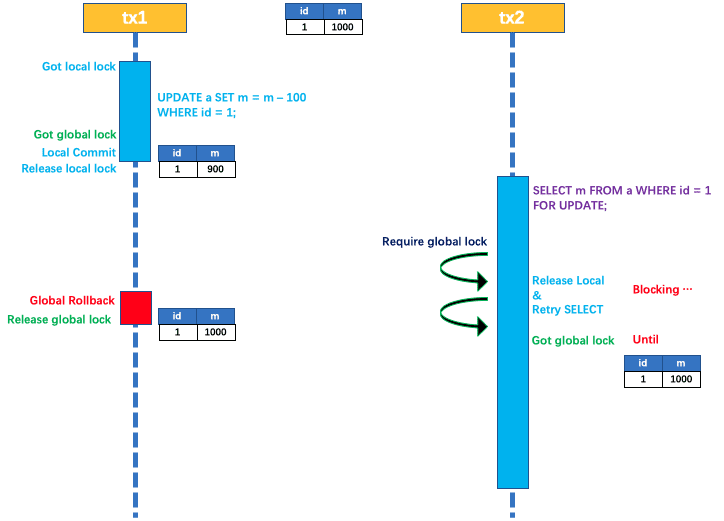
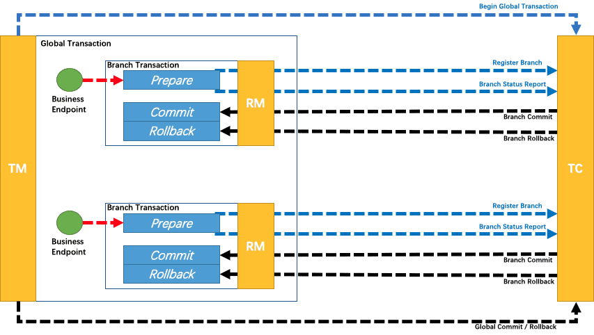

# Spring Cloud

## 概念

### 微服务框架有哪些？各有什么特点？

目前微服务的开发框架，最常用的有以下几个：

+ Spring Cloud：http://projects.spring.io/spring-cloud（现在非常流行的微服务架构）
+ Dubbo：http://dubbo.io
+ Dropwizard：http://www.dropwizard.io （关注单个微服务的开发）
+ Consul、etcd&etc.（微服务的模块）
+ K8s + istio （云原生+服务网格）

总结：目前比较流行的微服务框架就是Spring Cloud、Dubbo、K8s+Istio，但是各有优点和缺点，Spring Cloud 背靠Spring Boot，整个框架大而全，Dubbo 基于RPC远程调用，性能会比Spring Cloud更好，K8s+istio的形式，减少了业务代码和微服务治理代码的耦合性

目前最主流的应该就是Spring Cloud，但是随着业务发展，K8s+istio的形式应该会成为大型复杂系统构建的一个主流，不过大多数中小型公司来说，Spring Cloud仍然是一个主流，主要原因有如下：

+ 背靠Spring Boot，能够进行快速整合
+ 服务治理框架工具大而全
+ 学习简单，上手容易

### 什么是Spring Cloud

​		Spring Cloud是一系列框架的集合。它利用Spring Boot的开发便利性简化了分布式系统基础设施的开发，如服务发现、服务注册、配置中心、消息总线、负载均衡、 熔断器、数据监控等，他将各种经得起实际考验的服务框架组合起来，

### Spring Cloud和Spring Boot是什么关系

1. 可以基于Spring Boot 快速开发单个微服务，
2. Spring Cloud是一个基于Spring Boot实现的开发工具；
3. Spring Cloud很大的一部分是基于Spring Boot来实现，必须基于Spring Boot开发。可以单独使用Spring Boot开发项目，但是Spring Cloud离不开 Spring Boot。

### Spring Cloud相关基础服务组件

+ 服务发现——Netflix Eureka （Nacos）
+ 服务调用——Netflix Feign 
+ 熔断器——Netflix Hystrix 
+ 服务网关——Spring Cloud GateWay 
+ 分布式配置——Spring Cloud Config  （Nacos）
+ 消息总线 —— Spring Cloud Bus （Nacos）

### Spring Cloud的版本说明

Spring Cloud并没有熟悉的数字版本号，而是对应一个开发代号。

| Cloud代号 | Boot版本(train) | Boot版本(tested)      | lifecycle        |
| --------- | --------------- | --------------------- | ---------------- |
| Angle     | 1.2.x           | incompatible with 1.3 | EOL in July 2017 |
| Brixton   | 1.3.x           | 1.4.x                 | 2017-07卒        |
| Camden    | 1.4.x           | 1.5.x                 | -                |
| Dalston   | 1.5.x           | not expected 2.x      | -                |
| Edgware   | 1.5.x           | not expected 2.x      | -                |
| Finchley  | 2.0.x           | not expected 1.5.x    | -                |
| Greenwich | **2.1.x**       |                       |                  |
| Hoxton    | 2.2.x           |                       |                  |

开发代号看似没有什么规律，但实际上首字母是有顺序的，比如：Dalston版本，我们可以简称 D 版本，对应的 Edgware 版本我们可以简称 E 版本。

## Spring Cloud （一代）

> Netflix是一家美国公司，在美国、加拿大提供互联网随选流媒体播放，定制DVD、蓝光光碟在线出租业务。该公司成立于1997年，总部位于加利福尼亚州洛斯盖图，1999年开始订阅服务。2009年，该公司可提供多达10万部DVD电影，并有1千万的订户。2007年2月25日，Netflix宣布已经售出第10亿份DVD。HIS一份报告中表示，2011年Netflix网络电影销量占据美国用户在线电影总销量的45%。
> ❞

针对多种 Netflix 组件提供的开发工具包，其中包括 Eureka、Ribbon、Feign、Hystrix、Zuul、Archaius 等。

+ Netflix Eureka：一个基于 Rest 服务的服务治理组件，包括服务注册中心、服务注册与服务发现机制的* 实现，实现了云端负载均衡和中间层服务器的故障转移。
+ Netflix Ribbon：客户端负载均衡的服务调用组件。客户端负载均衡，特性有区域亲和、重试机制。
+ Netflix Hystrix：客户端容错保护，特性有服务降级、服务熔断、请求缓存、请求合并、依赖隔离。
+ Netflix Feign：基于 Ribbon 和 Hystrix 的声明式服务调用组件。声明式服务调用，本质上就是Ribbon+Hystrix
+ Netflix Zuul：微服务网关，提供动态路由，访问过滤等服务。
+ Netflix Archaius：配置管理 API，包含一系列配置管理 API，提供动态类型化属性、线程安全配置操作、轮询框架、回调机制等功能。

Spring Cloud Netflix 生态，到2020年，archaus/hystrix/ribbon/zuul/turbine等starter都会进入维护模式，进入维护模式意味着spring cloud团队不会再向这些模块中添加新的功能，但是仍然会修复安全问题和一些block级别的bug。只是没有新的功能迭代了，spring cloud netflix仍然可以继续使用。

进入维护模式的最根本原因还是Netflix对于zuul、ribbon等项目维护投入比较少、所以spring cloud 会在greenwich中把这些项目都进入到维护模式。

所以基本上现在如果构建新的微服务，基本都以springcloud alibaba为基准

**独自启动不需要依赖其它组件，单枪匹马都能干。**

+ Netflix Eureka，服务注册中心，特性有失效剔除、服务保护。
+ Dashboard，Hystrix仪表盘，监控集群模式和单点模式，其中集群模式需要收集器Turbine配合。
+ Netflix Zuul，API服务网关，功能有路由分发和过滤。
+ Config，分布式配置中心，支持本地仓库、SVN、Git、Jar包内配置等模式

## SpringCloudAlibaba（二代）

### 概述

SpringCloudAlibaba是阿里开发的一套微服务架构，目前已经纳入spring中；同Spring Cloud 一样，Spring Cloud Alibaba 也是一套微服务解决方案，包含开发分布式应用微服务的必需组件，方便开发者通过 Spring Cloud 编程模型轻松使用这些组件来开发分布式应用服务。

SpringCloudAlibaba主要阿里为了推广自家的商业服务而开发的一套微服务架构，再加上Netflix 停止了更新，所以现在更多的公司选择使用阿里系列的整体服务；

依托 Spring Cloud Alibaba，您只需要添加一些注解和少量配置，就可以将 Spring Cloud 应用接入阿里微服务解决方案，通过阿里中间件来迅速搭建分布式应用系统。


## Nacos

### 简介

用来代替SpringCloud中的三大组件的作用

1. Eureka（注册中心）

2. Config（配置中心）
3. Bus（服务总线）

重要是：**配置管理**和**服务发现**，用来管理分布式配置中心的一个实现方案，官方网站：https://nacos.io/en-us/

#### NACOS 配置中心

​		它是阿里的一个开源产品，针对微服务架构进行管理，作为配置中心进行管理，**配置主要有以下特点**，所以配置如何统一管理就是一个难题。需要Nacos去解决。每个微服务都有自己的配置中心，因为集群的产生，所以修改配置如果进入到每个程序中会比较困难，所以想法是集成一个配置中心，这样子，方便修改。对配置进行统一的管理。

+ 配置是独立于程序的只读变量
+ 配置伴随应用的整个生命周期
+ 配置可以有多种加载方式
+ 配置需要治理
  + 同一个程序在不用的环境、不同的集群，经常需要有不同的配置。

#### 主流的配置中心

config、Appollo（携程开源项目）、Nacos

**对比**：Nacos的性能是最好的，Appollo其次，Spring Cloud Config因为依赖于Git/Gitee所以性能方面会有一定的限制

Nacos特性

+ 服务发现和服务健康检查

+ 动态配置管理

+ 动态DNS服务

+ 服务和元数据管理

  **总结：**动态管理是Nacos的特性之一


### 服务发现

服务发现：因为这个系统建设在微服务体系架构中，所以需要服务之间的远程调用，为了完成一次服务，所以需要知道对方的网络位置，我们的代码可以**通过读取配置文件的方式**读取对方的网络位置。

主流的配置：Eureka、consul、Zookeeper

其中`Nacos`支持的功能是最全面的。长远来看，还会支持`SpringCloud`+`K8s`的组合，而且计划实现`Service Mesh`


## Feign

### 基本概念

- Feign是Netflix开发的声明式、模板化的HTTP客户端， Feign可以帮助我们更快捷、优雅地调用HTTP API。
- Feign支持多种注解，例如Feign自带的注解或者JAX-RS注解等。
- Spring Cloud对Feign进行了增强，使Feign支持了Spring MVC注解，并整合了Ribbon和Eureka，从而让Feign的使用更加方便。
- Spring Cloud Feign是基于Netflix feign实现，整合了Spring Cloud Ribbon和Spring Cloud Hystrix，除了提供这两者的强大功能外，还提供了一种声明式的Web服务客户端定义的方式。
- Spring Cloud Feign帮助我们定义和实现依赖服务接口的定义。在Spring Cloud feign的实现下，只需要创建一个接口并用注解方式配置它，即可完成服务提供方的接口绑定，简化了在使用Spring Cloud Ribbon时自行封装服务调用客户端的开发量。


### 工作原理


### 什么是 RPC?

​		RPC（Remote Procedure Call）—远程过程调用，它是一种通过网络从远程计算机程序上请求服务，而不需要了解底层网络技术的协议。比如两个不同的服务 A、B 部署在两台不同的机器上，那么服务 A 如果想要调用服务 B 中的某个方法该怎么办呢？使用 HTTP请求 当然可以，但是可能会比较慢而且一些优化做的并不好。 RPC 的出现就是为了解决这个问题。

### [**RPC原理是什么？**](https://snailclimb.gitee.io/javaguide/#/docs/system-design/distributed-system/rpc/服务之间的调用为啥不直接用HTTP而用RPC?id=rpc原理是什么？)

我这里这是简单的提一下，详细内容可以查看下面这篇文章：


1. 服务消费方（client）调用以本地调用方式调用服务；
2. client stub接收到调用后负责将方法、参数等组装成能够进行网络传输的消息体；
3. client stub找到服务地址，并将消息发送到服务端；
4. server stub收到消息后进行解码；
5. server stub根据解码结果调用本地的服务；
6. 本地服务执行并将结果返回给server stub；
7. server stub将返回结果打包成消息并发送至消费方；
8. client stub接收到消息，并进行解码；
9. 服务消费方得到最终结果。

下面再贴一个网上的时序图：


### [RPC 解决了什么问题？](https://snailclimb.gitee.io/javaguide/#/docs/system-design/distributed-system/rpc/服务之间的调用为啥不直接用HTTP而用RPC?id=rpc-解决了什么问题？)

从上面对 RPC 介绍的内容中，概括来讲RPC 主要解决了：**让分布式或者微服务系统中不同服务之间的调用像本地调用一样简单。**


### 常见的 RPC 框架总结?

- **RMI（JDK自带）：** JDK自带的RPC，有很多局限性，不推荐使用，而且现在已经被移除
- **Dubbo:** Dubbo是 阿里巴巴公司开源的一个高性能优秀的服务框架，使得应用可通过高性能的 RPC 实现服务的输出和输入功能，可以和 Spring框架无缝集成。目前 Dubbo 已经成为 Spring Cloud Alibaba 中的官方组件。
- **gRPC** ：gRPC是可以在任何环境中运行的现代开源高性能RPC框架。它可以通过可插拔的支持来有效地连接数据中心内和跨数据中心的服务，以实现负载平衡，跟踪，运行状况检查和身份验证。它也适用于分布式计算的最后一英里，以将设备，移动应用程序和浏览器连接到后端服务。
- **Hessian：** Hessian是一个轻量级的remotingonhttp工具，使用简单的方法提供了RMI的功能。 相比WebService，Hessian更简单、快捷。采用的是二进制RPC协议，因为采用的是二进制协议，所以它很适合于发送二进制数据。
- **Thrift：** Apache Thrift是Facebook开源的跨语言的RPC通信框架，目前已经捐献给Apache基金会管理，由于其跨语言特性和出色的性能，在很多互联网公司得到应用，有能力的公司甚至会基于thrift研发一套分布式服务框架，增加诸如服务注册、服务发现等功能。

### 既有 HTTP ,为啥用 RPC 进行服务调用?

​		RPC 只是一种概念、一种设计，就是为了解决 **不同服务之间的调用问题**, 它一般会包含有 **传输协议** 和 **序列化协议** 这两个。但是，HTTP 是一种协议，RPC框架可以使用 HTTP协议作为传输协议或者直接使用TCP作为传输协议，使用不同的协议一般也是为了适应不同的场景。

### RPC框架功能更齐全

​	成熟的 RPC框架还提供好了“服务自动注册与发现”、"智能负载均衡"、“可视化的服务治理和运维”、“运行期流量调度”等等功能，这些也算是选择 RPC 进行服务注册和发现的一方面原因吧！

## Ribbon

### Ribbon 是什么

​		Spring Cloud Ribbon 是基于 Netflix Ribbon 实现的一套**客户端负载均衡的工具**。

​		简单的说，Ribbon 是Netflix 发布的开源项目，主要功能是提供**客户端的软件负载均衡算法和服务调用**。Ribbon 客户端组件提供一系列完善的配置项，如连接超时、重试等。简单的说就是在配置文件中列出 Load Balance（简称 LB）后面所有的机器，Ribbon 会自动地帮助你基于某种规则（如简单轮询、随机连接等）去连接这些机器。我们很容易使用 Ribbon 实现自定义的负载均衡算法。

#### 官网资料

​		详细资料参考官网资料：https://github.com/Netflix/ribbon/wiki/Getting-Started

​		但不幸的是 Ribbon 目前也进入了维护模式，而提出了未来的替换方案 `SpringCloud loadBalancer`。

#### Ribbon 的作用

​		Ribbon 可以进行 LB（Load Balance，负载均衡）。所谓 负载均衡简单来说就是将用户的请求平摊地分配到过个服务上，从而达到系统的 HA（高可用）。**常见的负载均衡软件有：Nginx、LVS、硬件F5等。**

Ribbon 本地负载均衡客户端与 Nginx 服务端负载均衡的区别：

- Nginx 是服务器负载均衡，客户端所有的请求都会交给 Nginx，然后由 Nginx 实现转发请求。即负载均衡是由服务端实现的。
- Ribbon 本地负载均衡在调用微服务接口时，会在注册中心上获取注册信息服务把列表之后缓存到 JVM 本地，从而实现 RPC 远程服务调用技术。

LB 由可以分为如下两种：

- **集中式 LB**：在服务的消费方和提供方之间使用独立的 LB 设施（可以使硬件如 F5，也可以是 Nginx），由该设施负责把访问请求通过某种策略转发至服务的提供方。
- **进程内 LB**：将 LB 逻辑集成到消费方，消费方从服务注册中心获知有哪些地址可用，然后自己再从这些地址中选择出一个合适的服务器。

**Ribbon 就属于进程内 LB**，它只是一个类库，集成于消费方进程，消费方通过它来获取到服务提供方的地址。

一句话总结就是：Ribbon 可以实现负载均衡 + RestTemplate 调用。（更多关于 RestTemplate 用法可以参考[官网文档](https://docs.spring.io/spring-framework/docs/current/javadoc-api/org/springframework/web/client/RestTemplate.html)）

### Ribbon 工作原理

+ 拦截远程调用请求
+ 获取服务名称
+ 从服务中心拉取服务列表
+ IRule利用内置负载均衡规则，从列表中选择一个
+ 发起真实请求

### Ribbon 核心组件 IRule

#### IRule 简介

IRule：根据特定算法从服务列表中选取一个要访问的服务，算法类型如下：

- `com.netflix.loadbalancer.RoundRobinRule`：**轮询**
- `com.netflix.loadbalancer.RandomRule`：**随机**
- `com.netflix.loadbalancer.RetryRule`：先按照 `RoundRobinRule` 的策略获取服务，如果获取服务失败则在指定时间内进行重试，获取可用的服务
- `WeightedResponseTimeRule`：**权重**，对` RoundRobinRule` 的扩展，响应速度越快的实例选择权重越多大，越容易被选择
- `BestAvailableRule`：会先过滤掉由于多次访问故障而处于断路器跳闸状态的服务，然后选择一个并发量最小的服务
- `AvailabilityFilteringRule`：先过滤掉故障实例，再选择并发较小的实例
- `ZoneAvoidanceRule`：默认规则，复合判断 server 所在区域的性能和 server 的可用性选择服务器

1. 随机 (Random)
2. 轮询 (RoundRobin)
3. 一致性哈希 (ConsistentHash)
4. 哈希 (Hash)
5. 加权（Weighted）

#### 替换 IRule 算法

我们可以修改或指定 Ribbon 的 IRule 算法，具体步骤如下：

1、新建 MySelfRule 自定义配置类：

```java
@Configurationpublic class MySelfRule{   
    @Bean    public IRule myRule()    {        
        return new RandomRule();  
        //定义为随机    
    }
}
```

注意：官方文档明确给出了警告，该自定义配置类不能放在 `@ComponentScan` 所扫描的当前包以及子包下，否则我们自定义的这个配置类就会被所有 Ribbon 客户端所共享，达不到特殊化定制的目的了。

2、在主启动类上添加 `@RibbonClient` 注解：

```java
@SpringBootApplication@EnableEurekaClien
t@RibbonClient(name = "CLOUD-PAYMENT-SERVICE", configuration=MySelfRule.class)
public class OrderMainApplication{    
    public static void main(String[] args) {           
        SpringApplication.run(OrderMain80.class, args);    
    }
}
```

注解 `@RibbonClient` 的 name 属性值为需要调用的目标微服务的服务名称，然后通过 configuration 属性指定我们的自定义 IRule 规则的配置类。

**注意**：`spring-cloud-starter-netflix-eureka-client` 自带了 ribbon 组件 `spring-cloud-starter-netflix-ribbon`，从引入的依赖包中就可以看出。

### Ribbon 负载均衡算法

####　Ribbon 负载均衡算法的原理

我们以轮询算法为例，负载均衡算法为：实际调用服务器位置下表 = rest 接口的请求次数 % 服务器集群总数量，每次服务器重启后 rest 接口技术从 1 开始：

```java
List<ServiceInstance> instances = discoveryClient.getInstances("CLOUD-PAYMENT-SERVICE");
如：   
    List[0] instances = 127.0.0.1:8001    
    List[1] instances = 127.0.0.1:80028001 + 8002 组合成集群，它们共计2台机器，集群总数为2，所以按照轮询算法原理：
    当总请求数为1时： 1 % 2 = 1 对应下表位置为1，
    则获得服务地址为 127.0.0.1:8001当总请求数为2时： 2 % 2 = 0 对应下表位置为0，则获得服务地址为 127.0.0.1:8002以此类推......
```

#### 手写一个本地负载均衡器

LoadBalancer 接口：

```java
import org.springframework.cloud.client.ServiceInstance;
import java.util.List;
public interface LoadBalancer{    
    ServiceInstance instances(List<ServiceInstance> serviceInstances);
}
```

实现类：

```java
import org.springframework.cloud.client.ServiceInstance;
import org.springframework.stereotype.Component;
import java.util.List;
import java.util.concurrent.atomic.AtomicInteger;
@Component
public class MyLB implements LoadBalancer{    
    private AtomicInteger atomicInteger = new AtomicInteger(0);    
    public final int getAndIncrement()    {       
        int current;      
        int next;        
        do {          
            current = this.atomicInteger.get();         
            next = current >= 2147483647 ? 0 : current + 1;        }
        while(!this.atomicInteger.compareAndSet(current,next)
             );               
        System.out.println("第几次访问，次数 next: " + next);        
        return next;   
    }    
    // 负载均衡算法：rest接口第几次请求数 % 服务器集群总数量 = 实际调用服务器位置下标，每次服务重启动后rest接口计数从1开始。    
    @Override    
    public ServiceInstance instances(List<ServiceInstance> serviceInstances) {       
        int index = getAndIncrement() % serviceInstances.size();       
        return serviceInstances.get(index);   
    }
}
```

注意需要注释掉 RestTemplate 的 @LoadBalanced 注解：

```java
@Configuration
public class ApplicationContextConfig{   
    @Bean    
    //@LoadBalanced    
    public RestTemplate getRestTemplate()    {
        return new RestTemplate();   
    }
}
```


## Hystrix 熔断

### 教程路径

[hystrix 高级教程](https://blog.csdn.net/yuanshangshenghuo/article/details/107058274?ops_request_misc=%257B%2522request%255Fid%2522%253A%2522165382922716781818753690%2522%252C%2522scm%2522%253A%252220140713.130102334.pc%255Fall.%2522%257D&request_id=165382922716781818753690&biz_id=0&utm_medium=distribute.pc_search_result.none-task-blog-2~all~first_rank_ecpm_v1~rank_v31_ecpm-8-107058274-null-null.142^v11^pc_search_result_control_group,157^v12^new_style1&utm_term=hystrix%E4%BD%BF%E7%94%A8&spm=1018.2226.3001.4187)

Spring Cloud 在接口调用上，大致会经过如下几个组件配合：

`Feign` ----->`Hystrix` —>`Ribbon` —>`Http Client``（apache http components 或者 Okhttp）`

1. **接口化请求调用**当调用被`@FeignClient`注解修饰的接口时，在框架内部，将请求转换成Feign的请求实例`feign.Request`，交由Feign框架处理。

2. **Feign** ：转化请求Feign是一个http请求调用的轻量级框架，可以以Java接口注解的方式调用Http请求，封装了Http调用流程。

3. **Hystrix** ：熔断处理机制 Feign的调用关系，会被Hystrix代理拦截，对每一个Feign调用请求，Hystrix都会将其包装成`HystrixCommand`,参与Hystrix的流控和熔断规则。如果请求判断需要熔断，则Hystrix直接熔断，抛出异常或者使用`FallbackFactory`返回熔断`Fallback`结果；如果通过，则将调用请求传递给`Ribbon`组件。

4. **Ribbon**：服务地址选择 当请求传递到`Ribbon`之后,`Ribbon`会根据自身维护的服务列表，根据服务的服务质量，如平均响应时间，Load等，结合特定的规则，从列表中挑选合适的服务实例，选择好机器之后，然后将机器实例的信息请求传递给`Http Client`客户端，`HttpClient`客户端来执行真正的Http接口调用；

5. **HttpClient** ：Http客户端，真正执行Http调用根据上层`Ribbon`传递过来的请求，已经指定了服务地址，则HttpClient开始执行真正的Http请求


### 简介

​		Netflix称，在分布式环境中，不可避免会造成一些服务的失败。Hystrix库旨在控制分布式服务中提供更大容限和服务失败之间的相互关系。Hystrix通过隔离访问远程系统、服务和第三方库的点，阻止级联故障，从而使复杂的分布式系统更具弹性。

​		Hystrix源于Netflix API团队在去年启动的弹性工程项目，在此期间，Hystrix得到了不断发展，并逐渐成熟。现在，在Netflix网站中，每天有数十亿的独立线程和信号通过Hystrix进行调用，Hystrix的运行时间和弹性也得到了显著的改善。


### 什么是服务雪崩

​		多个服务之间调用的时候，假设服务A调用服务B和服务C，服务B和服务C又调用其他的服务，这就是所谓的“扇出”。如果“扇出”的链路上某个服务调用响应时间过长或者不可用，对服务A的调用就会占用越来越多的系统资源，

​		进而引起系统崩溃，所谓的 “ 雪崩效应 ”。

​		对于高流量的应用来说，单一的后端依赖可能会导致所有服务器上的所有资源都在几秒钟内饱和。比失败更糟糕的是，这些应用程序还可能导致服务之间的延迟增加，备份队列，线程和其他系统资源紧张，导致整个系统发生更多的级联故障。这些都表示需要对故障和延迟进行隔离和管理，以便单个依赖关系的失败，不能取消整个应用程序或系统。

### 什么是服务降级？

1. 什么是服务降级？当服务器压力剧增的情况下，根据实际业务情况及流量，对一些服务和页面有策略的不处理或换种简单的方式处理，从而释放服务器资源以保证核心交易正常运作或高效运作。

2. 如果还是不理解，那么可以举个例子：假如目前有很多人想要给我付钱，但我的服务器除了正在运行支付的服务之外，还有一些其它的服务在运行，比如搜索、定时任务和详情等等。然而这些不重要的服务就占用了JVM的不少内存与CPU资源，为了能把钱都收下来（钱才是目标），我设计了一个动态开关，把这些不重要的服务直接在最外层拒掉，这样处理后的后端处理收钱的服务就有更多的资源来收钱了（收钱速度更快了），这就是一个简单的服务降级的使用场景。
   1. 服务降级主要**作用在客户端**


### 服务熔断与服务降级对比

+ 服务熔断
  + 作用在服务端，正对服务突然崩掉的情况，但是保证服务器能够正常运行
+ 服务降级
  + 作用在客户端，主动调整服务器，给顾客一个提示的信息，独立于服务器的作用
  + 准备一个fallbackfactory，给用户一个反馈信息


### Hystrix的工作流程

我们先介绍下Hystrix的工作流程，

1. 当我们调用出现问题的时候，Hystrix会开启一个默认10s的时间窗口，然后在这个窗口时间内，会统计调用次数是否达到了最小请求数，如果没有达到就会重制统计信息，
2. 如果达到了，就会计算统计失败占所有请求的百分比，判断是否到达阈值，如果达到，就会跳闸，不再请求对应服务，
3. 如果失败占所有请求的百分比未达到阈值，然后重置统计信息。
4. 如果跳闸，则会开启一个活动窗口，默认是5s，每隔5s 会让一个请求通过，到达那个有问题的服务，看看是否还有问题，如果没问题就重置断路器，如果有问题，继续每5s通过一个请求来验证。

### Hystrix的常用的配置选项有哪些？

整个流程，有一些参数我们是可以根据业务来改动：

1. 当出现错误的时候，会开启一个默认10s的窗口，这个10s我们是可以配置的
2. 再就是这个最小请求数
3. 再就是错误请求占比阈值
4. 发生跳闸，然后每隔默认5s来放一个请求探测对方服务，其中这个5s的活动窗口我们是可以配置的。


### 流量监控

1. Netflix开源了Hystrix组件，实现了断路器模式，SpringCloud对这一组件进行了整合。
2. 主要功能分为4大板块隔离、限流、熔断、降级。我们常用的是`请求熔断`和`服务降级`。
3. 涉及注解`@EnableHystrix`和`@Hystrixcommand(fallbackMethod="xxx")`
4. Feign默认集成了Hystrix。RestTemplate、springCloud GateWay在时候的时候都会考虑集成Hystrix。
5. `服务熔断`，指的是服务故障，再让新的请求去访问根本没有意义，这个时候选择暂时断开请求。
6. 服务熔断依靠hystrix的断路器，它有`全开`、`半开`、`关闭`3种状态。
7. `服务降级`，指断路打开后，为了避免连锁故障，使用 fallback 方法返回当前不可用的友好提示。
8. 总而言之，hystrix它是为了解决，由于单个服务故障，导致其他依赖服务不可用的`“雪崩”效应`。比如有服务A，假设A1·A100都依赖了A，假如A出现了问题，那A1·A100这100个服务也跟着出现了问题


## Gateway

### 网关基本概念

#### 网关介绍

API 网关出现的原因是微服务架构的出现，不同的微服务一般会有不同的网络地址，而外部客户端可能需要调用多个服务的接口才能完成一个业务需求，如果让客户端直接与各个微服务通信，会有以下的问题：

1. 客户端会多次请求不同的微服务，增加了客户端的复杂性。
2. 存在跨域请求，在一定场景下处理相对复杂。
3. 认证复杂，每个服务都需要独立认证。
4. 难以重构，随着项目的迭代，可能需要重新划分微服务。例如，可能将多个服务合并成一个或者将一个服务拆分成多个。如果客户端直接与微服务通信，那么重构将会很难实施。
5. 某些微服务可能使用了防火墙 / 浏览器不友好的协议，直接访问会有一定的困难。

以上这些问题可以借助 API 网关解决。API 网关是介于客户端和服务器端之间的中间层，所有的外部请求都会先经过 API 网关这一层。也就是说，API 的实现方面更多的考虑业务逻辑，而安全、性能、监控可以交由 API 网关来做，这样既提高业务灵活性又不缺安全性

#### Spring Cloud Gateway

​		**Spring cloud gateway**是spring官方基于Spring 5.0、Spring Boot2.0和Project Reactor等技术开发的网关，Spring Cloud Gateway旨在为微服务架构提供简单、有效和统一的API路由管理方式，Spring Cloud Gateway作为Spring Cloud生态系统中的网关，目标是替代Netflix Zuul，其不仅提供统一的路由方式，并且还基于Filer链的方式提供了网关基本的功能，例如：安全、监控/埋点、限流等。


#### Gateway核心概念

​		网关提供API全托管服务，丰富的API管理功能，辅助企业管理大规模的API，以降低管理成本和安全风险，包括协议适配、协议转发、安全策略、防刷、流量、监控日志等贡呢。一般来说网关对外暴露的URL或者接口信息，我们统称为路由信息。如果研发过网关中间件或者使用过Zuul的人，会知道网关的核心是Filter以及Filter Chain（Filter责任链）。Sprig Cloud Gateway也具有路由和Filter的概念。下面介绍一下Spring Cloud Gateway中几个重要的概念。

1. 路由。路由是网关最基础的部分，路由信息有一个ID、一个目的URL、一组断言和一组Filter组成。如果断言路由为真，则说明请求的URL和配置匹配
2. 断言。Java8中的断言函数。Spring Cloud Gateway中的断言函数输入类型是Spring5.0框架中的ServerWebExchange。Spring Cloud Gateway中的断言函数允许开发者去定义匹配来自于http request中的任何信息，比如请求头和参数等。
3. 过滤器。一个标准的Spring webFilter。Spring cloud gateway中的filter分为两种类型的Filter，分别是Gateway Filter和Global Filter。过滤器Filter将会对请求和响应进行修改处理

​		如上图所示，Spring cloud Gateway发出请求。然后再由Gateway Handler Mapping中找到与请求相匹配的路由，将其发送到Gateway web handler。Handler再通过指定的过滤器链将请求发送到我们实际的服务执行业务逻辑，然后返回。


## 限流算法

### 计数器算法

特点：简单粗暴，比如限流qps为100，算法的实现思路就是从第一个请求进来开始计时，在接下去的1s内，每来一个请求，就把计数加1，如果累加的数字达到了100，那么后续的请求就会被全部拒绝。等到1s结束后，把计数恢复成0，重新开始计数
弊端：在单位时间1s内的前10ms，已经通过了100个请求，那后面的990ms，只能眼巴巴的把请求拒绝，我们把这种现象称为“突刺现象”

### 漏桶算法
**特点**：为了消除"突刺现象"，不管上面流量多大，下面流出的速度始终保持不变。不管服务调用方多么不稳定，通过漏桶算法进行限流，每10毫秒处理一次请求。处理的速度是固定的，请求进来的速度是未知的，可能突然进来很多请求，没来得及处理的请求就先放在桶里，既然是个桶，肯定是有容量上限，如果桶满了，那么新进来的请求就丢弃
**弊端：**无法应对短时间的突发流量
	

### 令牌桶算法

**特点：**令牌桶算法是对漏桶算法的一种改进，桶算法能够限制请求调用的速率，支持突发流量，也可以按照一定速率执行

**流程**

1. 存在一个桶，用来存放固定数量的令牌

2. 以一定的速率往桶中放令牌

3. 只有拿到令牌，才有机会继续执行，否则选择选择等待可用的令牌、或者直接拒绝。

4. 放令牌这个动作是持续不断的进行，如果桶中令牌数达到上限，就丢弃令牌

5. 这时进来的请求就可以直接拿到令牌执行

6. 只有桶中没有令牌时，请求才会进行等待，最后相当于以一定的速率执行。

   

## Sleuth + Zipkin

链路追踪

# Seata 是什么?

Seata 是一款开源的分布式事务解决方案，致力于提供高性能和简单易用的分布式事务服务。**Seata 将为用户提供了 AT、TCC、SAGA 和 XA 事务模式**，为用户打造一站式的分布式解决方案。实现了强一致性，现实中应用并不是很多

## AT 模式

## 前提

- 基于支持本地 ACID 事务的关系型数据库。
- Java 应用，通过 JDBC 访问数据库。

## 整体机制

两阶段提交协议的演变：

- 一阶段：业务数据和回滚日志记录在同一个本地事务中提交，释放本地锁和连接资源。
- 二阶段：
  - 提交异步化，非常快速地完成。
  - 回滚通过一阶段的回滚日志进行反向补偿。

### 写隔离

- 一阶段本地事务提交前，需要确保先拿到 **全局锁** 。
- 拿不到 **全局锁** ，不能提交本地事务。
- 拿 **全局锁** 的尝试被限制在一定范围内，超出范围将放弃，并回滚本地事务，释放本地锁。

以一个示例来说明：

两个全局事务 tx1 和 tx2，分别对 a 表的 m 字段进行更新操作，m 的初始值 1000。

tx1 先开始，开启本地事务，拿到本地锁，更新操作 m = 1000 - 100 = 900。本地事务提交前，先拿到该记录的 **全局锁** ，本地提交释放本地锁。 tx2 后开始，开启本地事务，拿到本地锁，更新操作 m = 900 - 100 = 800。本地事务提交前，尝试拿该记录的 **全局锁** ，tx1 全局提交前，该记录的全局锁被 tx1 持有，tx2 需要重试等待 **全局锁** 。


tx1 二阶段全局提交，释放 **全局锁** 。tx2 拿到 **全局锁** 提交本地事务。


如果 tx1 的二阶段全局回滚，则 tx1 需要重新获取该数据的本地锁，进行反向补偿的更新操作，实现分支的回滚。

此时，如果 tx2 仍在等待该数据的 **全局锁**，同时持有本地锁，则 tx1 的分支回滚会失败。分支的回滚会一直重试，直到 tx2 的 **全局锁** 等锁超时，放弃 **全局锁** 并回滚本地事务释放本地锁，tx1 的分支回滚最终成功。

因为整个过程 **全局锁** 在 tx1 结束前一直是被 tx1 持有的，所以不会发生 **脏写** 的问题。

### 读隔离

在数据库本地事务隔离级别 **读已提交（Read Committed）** 或以上的基础上，Seata（AT 模式）的默认全局隔离级别是 **读未提交（Read Uncommitted）** 。

如果应用在特定场景下，必需要求全局的 **读已提交** ，目前 Seata 的方式是通过 SELECT FOR UPDATE 语句的代理。



SELECT FOR UPDATE 语句的执行会申请 **全局锁** ，如果 **全局锁** 被其他事务持有，则释放本地锁（回滚 SELECT FOR UPDATE 语句的本地执行）并重试。这个过程中，查询是被 block 住的，直到 **全局锁** 拿到，即读取的相关数据是 **已提交** 的，才返回。

出于总体性能上的考虑，Seata 目前的方案并没有对所有 SELECT 语句都进行代理，仅针对 FOR UPDATE 的 SELECT 语句。

## 工作机制

以一个示例来说明整个 AT 分支的工作过程。

业务表：`product`

| Field | Type         | Key  |
| ----- | ------------ | ---- |
| id    | bigint(20)   | PRI  |
| name  | varchar(100) |      |
| since | varchar(100) |      |

AT 分支事务的业务逻辑：

```sql
update product set name = 'GTS' where name = 'TXC';
```

### 一阶段

过程：

1. 解析 SQL：得到 SQL 的类型（UPDATE），表（product），条件（where name = 'TXC'）等相关的信息。
2. 查询前镜像：根据解析得到的条件信息，生成查询语句，定位数据。

```sql
select id, name, since from product where name = 'TXC';
```

得到前镜像：

| id   | name | since |
| ---- | ---- | ----- |
| 1    | TXC  | 2014  |

1. 执行业务 SQL：更新这条记录的 name 为 'GTS'。
2. 查询后镜像：根据前镜像的结果，通过 **主键** 定位数据。

```sql
select id, name, since from product where id = 1;
```

得到后镜像：

| id   | name | since |
| ---- | ---- | ----- |
| 1    | GTS  | 2014  |

1. 插入回滚日志：把前后镜像数据以及业务 SQL 相关的信息组成一条回滚日志记录，插入到 `UNDO_LOG` 表中。

```json
{	"branchId": 641789253,	"undoItems": [{		"afterImage": {			"rows": [{				"fields": [{					"name": "id",					"type": 4,					"value": 1				}, {					"name": "name",					"type": 12,					"value": "GTS"				}, {					"name": "since",					"type": 12,					"value": "2014"				}]			}],			"tableName": "product"		},		"beforeImage": {			"rows": [{				"fields": [{					"name": "id",					"type": 4,					"value": 1				}, {					"name": "name",					"type": 12,					"value": "TXC"				}, {					"name": "since",					"type": 12,					"value": "2014"				}]			}],			"tableName": "product"		},		"sqlType": "UPDATE"	}],	"xid": "xid:xxx"}
```

1. 提交前，向 TC 注册分支：申请 `product` 表中，主键值等于 1 的记录的 **全局锁** 。
2. 本地事务提交：业务数据的更新和前面步骤中生成的 UNDO LOG 一并提交。
3. 将本地事务提交的结果上报给 TC。

### 二阶段-回滚

1. 收到 TC 的分支回滚请求，开启一个本地事务，执行如下操作。
2. 通过 XID 和 Branch ID 查找到相应的 UNDO LOG 记录。
3. 数据校验：拿 UNDO LOG 中的后镜与当前数据进行比较，如果有不同，说明数据被当前全局事务之外的动作做了修改。这种情况，需要根据配置策略来做处理，详细的说明在另外的文档中介绍。
4. 根据 UNDO LOG 中的前镜像和业务 SQL 的相关信息生成并执行回滚的语句：

```sql
update product set name = 'TXC' where id = 1;
```

1. 提交本地事务。并把本地事务的执行结果（即分支事务回滚的结果）上报给 TC。

### 二阶段-提交

1. 收到 TC 的分支提交请求，把请求放入一个异步任务的队列中，马上返回提交成功的结果给 TC。
2. 异步任务阶段的分支提交请求将异步和批量地删除相应 UNDO LOG 记录。

## 附录

## 回滚日志表

UNDO_LOG Table：不同数据库在类型上会略有差别。

以 MySQL 为例：

| Field         | Type         |
| ------------- | ------------ |
| branch_id     | bigint PK    |
| xid           | varchar(100) |
| context       | varchar(128) |
| rollback_info | longblob     |
| log_status    | tinyint      |
| log_created   | datetime     |
| log_modified  | datetime     |

```sql
-- 注意此处0.7.0+ 增加字段 contextCREATE TABLE `undo_log` (  `id` bigint(20) NOT NULL AUTO_INCREMENT,  `branch_id` bigint(20) NOT NULL,  `xid` varchar(100) NOT NULL,  `context` varchar(128) NOT NULL,  `rollback_info` longblob NOT NULL,  `log_status` int(11) NOT NULL,  `log_created` datetime NOT NULL,  `log_modified` datetime NOT NULL,  PRIMARY KEY (`id`),  UNIQUE KEY `ux_undo_log` (`xid`,`branch_id`)) ENGINE=InnoDB AUTO_INCREMENT=1 DEFAULT CHARSET=utf8;
```

## TCC 模式

回顾总览中的描述：一个分布式的全局事务，整体是 **两阶段提交** 的模型。全局事务是由若干分支事务组成的，分支事务要满足 **两阶段提交** 的模型要求，即需要每个分支事务都具备自己的：

- 一阶段 prepare 行为
- 二阶段 commit 或 rollback 行为



根据两阶段行为模式的不同，我们将分支事务划分为 **Automatic (Branch) Transaction Mode** 和 **Manual (Branch) Transaction Mode**.

AT 模式（[参考链接 TBD](https://seata.io/zh-cn/docs/overview/what-is-seata.html)）基于 **支持本地 ACID 事务** 的 **关系型数据库**：

- 一阶段 prepare 行为：在本地事务中，一并提交业务数据更新和相应回滚日志记录。
- 二阶段 commit 行为：马上成功结束，**自动** 异步批量清理回滚日志。
- 二阶段 rollback 行为：通过回滚日志，**自动** 生成补偿操作，完成数据回滚。

相应的，TCC 模式，不依赖于底层数据资源的事务支持：

- 一阶段 prepare 行为：调用 **自定义** 的 prepare 逻辑。
- 二阶段 commit 行为：调用 **自定义** 的 commit 逻辑。
- 二阶段 rollback 行为：调用 **自定义** 的 rollback 逻辑。

所谓 TCC 模式，是指支持把 **自定义** 的分支事务纳入到全局事务的管理中。

## Saga 模式

Saga模式是SEATA提供的长事务解决方案，在Saga模式中，业务流程中每个参与者都提交本地事务，当出现某一个参与者失败则补偿前面已经成功的参与者，一阶段正向服务和二阶段补偿服务都由业务开发实现。


理论基础：Hector & Kenneth 发表论⽂ Sagas （1987）

## 适用场景：

- 业务流程长、业务流程多
- 参与者包含其它公司或遗留系统服务，无法提供 TCC 模式要求的三个接口

## 优势：

- 一阶段提交本地事务，无锁，高性能
- 事件驱动架构，参与者可异步执行，高吞吐
- 补偿服务易于实现

## 缺点：

- 不保证隔离性（应对方案见[用户文档](https://seata.io/zh-cn/docs/user/saga.html)）


# Sentinel

## Sentinel 是什么？

随着微服务的流行，服务和服务之间的稳定性变得越来越重要。Sentinel 以流量为切入点，从流量控制、熔断降级、系统负载保护等多个维度保护服务的稳定性。

Sentinel 具有以下特征:

- **丰富的应用场景**：Sentinel 承接了阿里巴巴近 10 年的双十一大促流量的核心场景，例如秒杀（即突发流量控制在系统容量可以承受的范围）、消息削峰填谷、集群流量控制、实时熔断下游不可用应用等。
- **完备的实时监控**：Sentinel 同时提供实时的监控功能。您可以在控制台中看到接入应用的单台机器秒级数据，甚至 500 台以下规模的集群的汇总运行情况。
- **广泛的开源生态**：Sentinel 提供开箱即用的与其它开源框架/库的整合模块，例如与 Spring Cloud、Dubbo、gRPC 的整合。您只需要引入相应的依赖并进行简单的配置即可快速地接入 Sentinel。
- **完善的 SPI 扩展点**：Sentinel 提供简单易用、完善的 SPI 扩展接口。您可以通过实现扩展接口来快速地定制逻辑。例如定制规则管理、适配动态数据源等。

Sentinel 的主要特性：


Sentinel 的开源生态：


Sentinel 分为两个部分:

- 核心库（Java 客户端）不依赖任何框架/库，能够运行于所有 Java 运行时环境，同时对 Dubbo / Spring Cloud 等框架也有较好的支持。
- 控制台（Dashboard）基于 Spring Boot 开发，打包后可以直接运行，不需要额外的 Tomcat 等应用容器。
- 、

### Sentinel 为什么可以对我们的业务进行限流，原理是什么

​		我们在访问web应用时，在web应用内部会有一个拦截器，这个拦截器会对请求的url进行拦截，拦截到请求以后，读取sentinel 控制台的流控规则，基于流控规则对流量进行限流操作。


### Sentinel 和 hystix 区别？

1. hystix用线程池实现县城隔离，任何时刻大于线程池最大线程数的线程自然会被隔离，优点是支持异步、隔离性强（暂时不理解为啥隔离性强），缺点是一个service一个线程池，线程池相对更消耗资源，service多的话线程池也多扛不住啊;
2. sentinel基于信号量（计数器），来个请求信号量减一，优点是相比线程池轻量级，性能好，service多也无妨，缺点是不能异步。
   

## Quick Start

### 1.1 公网 Demo

如果希望最快的了解 Sentinel 在做什么，我们可以通过 [Sentinel 新手指南](https://github.com/alibaba/Sentinel/wiki/新手指南#公网-demo) 来运行一个例子，并且能在云上控制台上看到最直观的监控和流控效果等。

### 1.2 手动接入 Sentinel 以及控制台

下面的例子将展示应用如何三步接入 Sentinel。同时，Sentinel 也提供所见即所得的控制台，可以实时监控资源以及管理规则。

#### STEP 1. 在应用中引入Sentinel Jar包

如果应用使用 pom 工程，则在 `pom.xml` 文件中加入以下代码即可：

```xml
<dependency>    <groupId>com.alibaba.csp</groupId>    <artifactId>sentinel-core</artifactId>    <version>1.8.0</version></dependency>
```

> 注意: 从 Sentinel 1.5.0 开始仅支持 JDK 1.7 或者以上版本。Sentinel 1.5.0 之前的版本最低支持 JDK 1.6。

如果您未使用依赖管理工具，请到 [Maven Center Repository](https://mvnrepository.com/artifact/com.alibaba.csp/sentinel-core) 直接下载 JAR 包。

#### STEP 2. 定义资源

接下来，我们把需要控制流量的代码用 Sentinel API `SphU.entry("HelloWorld")` 和 `entry.exit()` 包围起来即可。在下面的例子中，我们将 `System.out.println("hello world");` 这端代码作为资源，用 API 包围起来（埋点）。参考代码如下:

```
public static void main(String[] args) {    initFlowRules();    while (true) {        Entry entry = null;        try {	    entry = SphU.entry("HelloWorld");            /*您的业务逻辑 - 开始*/            System.out.println("hello world");            /*您的业务逻辑 - 结束*/	} catch (BlockException e1) {            /*流控逻辑处理 - 开始*/	    System.out.println("block!");            /*流控逻辑处理 - 结束*/	} finally {	   if (entry != null) {	       entry.exit();	   }	}    }}
```

完成以上两步后，代码端的改造就完成了。当然，我们也提供了 [注解支持模块](https://github.com/alibaba/Sentinel/wiki/注解支持)，可以以低侵入性的方式定义资源。

#### STEP 3. 定义规则

接下来，通过规则来指定允许该资源通过的请求次数，例如下面的代码定义了资源 `HelloWorld` 每秒最多只能通过 20 个请求。

```
private static void initFlowRules(){    List<FlowRule> rules = new ArrayList<>();    FlowRule rule = new FlowRule();    rule.setResource("HelloWorld");    rule.setGrade(RuleConstant.FLOW_GRADE_QPS);    // Set limit QPS to 20.    rule.setCount(20);    rules.add(rule);    FlowRuleManager.loadRules(rules);}
```

完成上面 3 步，Sentinel 就能够正常工作了。更多的信息可以参考 [使用文档](https://github.com/alibaba/Sentinel/wiki/如何使用)。

#### STEP 4. 检查效果

Demo 运行之后，我们可以在日志 `~/logs/csp/${appName}-metrics.log.xxx` 里看到下面的输出:

```
|--timestamp-|------date time----|-resource-|p |block|s |e|rt1529998904000|2018-06-26 15:41:44|HelloWorld|20|0    |20|0|01529998905000|2018-06-26 15:41:45|HelloWorld|20|5579 |20|0|7281529998906000|2018-06-26 15:41:46|HelloWorld|20|15698|20|0|01529998907000|2018-06-26 15:41:47|HelloWorld|20|19262|20|0|01529998908000|2018-06-26 15:41:48|HelloWorld|20|19502|20|0|01529998909000|2018-06-26 15:41:49|HelloWorld|20|18386|20|0|0
```

其中 `p` 代表通过的请求, `block` 代表被阻止的请求, `s` 代表成功执行完成的请求个数, `e` 代表用户自定义的异常, `rt` 代表平均响应时长。

可以看到，这个程序每秒稳定输出 "hello world" 20 次，和规则中预先设定的阈值是一样的。

更详细的说明可以参考: [如何使用](https://github.com/alibaba/Sentinel/wiki/如何使用)

更多的例子可以参考: [Sentinel Examples](https://github.com/alibaba/Sentinel/tree/master/sentinel-demo)

#### STEP 5. 启动 Sentinel 控制台

您可以参考 [Sentinel 控制台文档](https://github.com/alibaba/Sentinel/wiki/控制台) 启动控制台，可以实时监控各个资源的运行情况，并且可以实时地修改限流规则。


## 详细文档

请移步 [Wiki](https://github.com/alibaba/Sentinel/wiki/主页)，查阅详细的文档、示例以及[使用说明](https://github.com/alibaba/Sentinel/wiki/如何使用)。若您希望从其它熔断降级组件（如 Hystrix）迁移或进行功能对比，可以参考 [迁移指南](https://github.com/alibaba/Sentinel/wiki/Guideline:-从-Hystrix-迁移到-Sentinel)。

Please refer to [README](https://github.com/alibaba/Sentinel) for README in English。

与 Sentinel 相关的生态（包括社区用户实现的扩展、整合、示例以及文章）可以参见 [Awesome Sentinel](https://github.com/alibaba/Sentinel/blob/master/doc/awesome-sentinel.md)，欢迎补充！

如果您正在使用 Sentinel，欢迎在 [Wanted: Who is using Sentinel](https://github.com/alibaba/Sentinel/issues/18) 留言告诉我们您的使用场景，以便我们更好地去改进。

## 交流与反馈

您可以通过 [GitHub Issues](https://github.com/alibaba/Sentinel/issues) 反馈 bugs、提出建议或者参与讨论，也可以通过[公共邮箱](https://github.com/alibaba/Sentinel/wiki/sentinel@linux.alibaba.com)联系我们。

也欢迎加钉钉群参与相关讨论：

- Sentinel 开源讨论群（1群，已满）：21977771
- Sentinel 开源讨论群（2群）：30150716

## 贡献

我们随时都欢迎开发者来贡献！详情请参考 [开源贡献指南](https://github.com/alibaba/Sentinel/wiki/开源贡献指南)。

如果您是初次贡献，可以先从 [good first issue](https://github.com/alibaba/Sentinel/issues?q=is%3Aissue+is%3Aopen+label%3A"good+first+issue") 中认领一个比较简单的任务来快速参与社区贡献。

## Who is using

以下是部分使用 Sentinel 的企业列表。若您的公司也在使用 Sentinel，欢迎在 [这里](https://github.com/alibaba/Sentinel/issues/18) 进行登记，告诉我们您的使用场景，以便我们更好地去改进 :)

              


# Stream

### 简介

Spring Cloud Stream 是一个用来为微服务应用构建消息驱动能力的框架。它可以基于 Spring Boot 来创建独立的、可用于生产的 Spring 应用程序。Spring Cloud Stream 为一些供应商的消息中间件产品提供了个性化的自动化配置实现，并引入了发布-订阅、消费组、分区这三个核心概念。通过使用 Spring Cloud Stream，可以有效简化开发人员对消息中间件的使用复杂度，让系统开发人员可以有更多的精力关注于核心业务逻辑的处理。但是目前 Spring Cloud Stream 只支持 RabbitMQ 和 Kafka 的自动化配置。

### 快速搭建

首先，我们通过一个简单的示例对 Spring Cloud Stream 有一个初步的认识。我们中间件使用 RabbitMQ，创建 spring-cloud-stream 模块

#### 2.1 引入依赖

编辑 pom.xml 文件，引入 Spring Cloud Stream 对 RabbitMQ 支持的 spring-cloud-starter-stream-rabbit 依赖，该依赖包是 Spring Cloud Stream 对 RabbitMQ 支持的封装，其中包含了对 RabbitMQ 的自动化配置等内容。

```html
<?xml version="1.0" encoding="UTF-8"?><project xmlns="http://maven.apache.org/POM/4.0.0"         xmlns:xsi="http://www.w3.org/2001/XMLSchema-instance"         xsi:schemaLocation="http://maven.apache.org/POM/4.0.0 http://maven.apache.org/xsd/maven-4.0.0.xsd">    <parent>        <artifactId>spring-cloud-components</artifactId>        <groupId>com.geny</groupId>        <version>1.0-SNAPSHOT</version>    </parent>    <modelVersion>4.0.0</modelVersion>    <artifactId>spring-cloud-stream</artifactId>    <dependencies>     <dependency>            <groupId>org.springframework.boot</groupId>            <artifactId>spring-boot-starter-web</artifactId>        </dependency>        <dependency>            <groupId>org.springframework.cloud</groupId>            <artifactId>spring-cloud-starter-stream-rabbit</artifactId>        </dependency>    </dependencies>    <build>        <plugins>            <plugin>               <groupId>org.springframework.boot</groupId>                <artifactId>spring-boot-maven-plugin</artifactId>            </plugin>        </plugins>    </build></project>
```

#### 2.2 配置文件

配置 RabbitMQ 的相关信息

```yaml
server:  port: 9898spring:  application:    name: spring-cloud-stream  rabbitmq:    host: 192.168.174.128    port: 5672    username: guest    password: guest  cloud:    stream:      bindings:        myInput:          #指定输入通道对应的主题名          destination: minestream        myOutput:          destination: minestream
```

这里通过 spring.cloud.stream.bindings.*.destination 的配置，让输入通道和输出通道对应到同一个主题上。

#### 2.3 创建消息通道绑定的接口

创建 StreamClient 接口，通过 @Input和 @Output注解定义输入通道和输出通道，另外，@Input 和 @Output 注解都还有一个 value 属性，该属性可以用来设置消息通道的名称，这里指定的消息通道名称分别是 myInput 和 myOutput。如果直接使用两个注解而没有指定具体的 value 值，则会默认使用方法名作为消息通道的名称。

```java
public interface StreamClient {    String INPUT = "myInput";   String OUTPUT = "myOutput";    @Input(StreamClient.INPUT)    SubscribableChannel input();    @Output(StreamClient.OUTPUT)    MessageChannel output();}
```

当定义输出通道的时候，需要返回 MessageChannel 接口对象，该接口定义了向消息通道发送消息的方法；定义输入通道时，需要返回 SubscribableChannel 接口对象，该接口集成自 MessageChannel 接口，它定义了维护消息通道订阅者的方法。

在完成了消息通道绑定的定义后，这些用于定义绑定消息通道的接口则可以被 @EnableBinding 注解的 value 参数指定，从而在应用启动的时候实现对定义消息通道的绑定，Spring Cloud Stream 会为其创建具体的实例，而开发者只需要通过注入的方式来获取这些实例并直接使用即可。下面就来创建用于接收来自 RabbitMQ 消息的消费者 StreamReceiver

#### 2.4 创建消费者

创建用于接收来自 RabbitMQ 消息的消费者 StreamReceiver 类

```java
@Component@EnableBinding(value = {StreamClient.class})public class StreamReceiver {    private Logger logger = LoggerFactory.getLogger(StreamReceiver.class);    @StreamListener(StreamClient.INPUT)    public void receive(String message) {        logger.info("StreamReceiver: {}", message);    }}
```

@EnableBinding 注解用来指定一个或多个定义了 @Input 或 @Output 注解的接口，以此实现对消息通道（Channel）的绑定。上面我们通过 @EnableBinding(value = {StreamClient.class}) 绑定了 StreamClient 接口，该接口是我们自己实现的对输入输出消息通道绑定的定义

@StreamListener，主要定义在方法上，作用是将被修饰的方法注册为消息中间件上数据流的事件监听器，注解中的属性值对应了监听的消息通道名。上面我们将 receive 方法注册为 myInput 消息通道的监听处理器，当我们往这个消息通道发送信息的时候，receiver 方法会执行。

#### 2.5 启动类

创建启动类，在启动类添加一个接口，使用上面定义的消息通道绑定接口 StreamClient 向被监听的消息通道发送消息，具体如下：

```java
@SpringBootApplication@RestControllerpublic class StreamApplication {    public static void main(String[] args) {        SpringApplication.run(StreamApplication.class,args);    }    @Autowired    private StreamClient streamClient;    @GetMapping("send")    public void send() {        streamClient.output().send(MessageBuilder.withPayload("Hello World...").build());    }}
```

#### 2.6 验证

启动 StreamApplication，访问 http://localhost:9898/send 接口发送消息，通过控制台，可以看到，消息已成功被接收


我们看一下 RabbitMQ 的界面


可以看到有个 minestream.anonymous...的队列，点击进入，可以看到该队列绑定了 minestream 这个 Exchange


点击 Exchanges，可以看到有我们定义的 myInput，myOutput，还有一个是配置文件里让 myInput 和 myOutput 都指向的 minestream，正是有这个配置，StreamClient 发送的消息才会发送到 StreamReceiver 监听的消息通道上去。


### 发布-订阅模式

Spring Cloud Stream 中的消息通信方式遵循了发布-订阅模式，当一条消息被投递到消息中间件后，它会通过共享的 Topic 主题进行广播，消息消费者在订阅的主题中收到它并触发自身的业务逻辑处理。所以这里就会有个问题，下面把 spring-cloud-stream 的端口号修改下，这里修改为 9899，然后再启动一个实例，访问 http://localhost:9898/send 发送消息，通过控制台查看：

**端口号 9898 的实例日志：**


**端口号 9899 的实例日志：**


可以看到，两个实例都接收到了消息，再看下 RabbitMQ 的 Queues，可以看到这里有两个 minestream.anonymous...的队列都绑定了 minestream 这个 Exchange。


这显然是不合适的，我们只希望在集群的时候，只有其中一台获取到消息，并进行相应的业务逻辑处理，那要怎么办呢？Spring Cloud Stream 提供了消费组的概念。

### 消费组

在现实的业务场景中，每一个微服务应用为了实现高可用和负载均衡，都会集群部署，按照上面我们启动了两个应用的实例，消息被重复消费了两次。为解决这个问题，Spring Cloud Stream 中提供了消费组，通过配置 spring.cloud.stream.bindings.myInput.group 属性为应用指定一个组名，下面修改下配置文件，修改如下：

```yaml
server:  port: 9898spring:  application:    name: spring-cloud-stream  rabbitmq:    host: 192.168.174.128    port: 5672    username: guest    password: guest  cloud:    stream:      bindings:        myInput:          #指定输入通道对应的主题名          destination: minestream          #指定该应用实例属于 stream 消费组          group: stream        myOutput:          destination: minestream
```


再次启动两个实例，先看下 RabbitMQ 的界面，可以看到现在只有 minestream.stream 这一个队列了，说明两个实例监听这一个队列


访问 http://localhost:9898/send 接口发送消息，为了方便查看后台日志，先把日志清空

**端口号 9898 的实例日志：**


**端口号 9899 的实例日志：**


可以看到，只有其中一个接收到了消息，这就达到了目的。

### 消息分区

通过消费组的设置，虽然能保证同一消息只被一个消费者进行接收和处理，但是对于特殊业务情况，除了要保证单一实例消费之外，还希望那些具备相同特征的消息都能被同一个实例消费，这个就可以使用 Spring Cloud Stream 提供的消息分区功能了。

Spring Cloud Stream 实现消息分区只需要在配置文件里进行相应的配置即可，修改 StreamApplication 的配置文件如下：

```yaml
server:  port: 9898spring:  application:    name: spring-cloud-stream  rabbitmq:    host: 192.168.174.128    port: 5672    username: guest    password: guest  cloud:    stream:      bindings:        myInput:          #指定输入通道对应的主题名          destination: minestream          #指定该应用实例属于 stream 消费组          group: stream          consumer:            #通过该参数开启消费者分区功能            partitioned: true        myOutput:          #指定输出通道对应的主题名          destination: minestream          producer:            #通过该参数指定了分区键的表达式规则，可以根据实际的输出消息规则配置 SpEL 来生成合适的分区键            partitionKeyExpression: payload            partitionCount: 2      #该参数指定了当前消费者的总实例数量      instance-count: 2      #该参数设置了当前实例的索引号，从 0 开始，最大值为 spring.cloud.stream.instance-count 参数 - 1      instance-index: 0
```

每个参数的说明，上面注释的很详细，启动多个实例只需要修改端口号和 instance-index 的值即可，到这里消息分区配置就完成了，可以看到 RabbitMQ 的队列里已经生成了两个名为 minestream.stream-* 的队列


访问 http://localhost:9898/send 接口发送消息，多发送几次，查看控制台日志：

**端口号 9898 的实例日志：**


**端口号 9899 的实例日志：**


可以看到发送的同一个消息，都被其中一个实例接收消费了，说明消息分区也已配置成功了。


# SpringSecurity在单机环境下使用

## 参考

来源于黑马程序员： [手把手教你精通新版SpringSecurity](https://www.bilibili.com/video/BV1EE411u7YV?p=33)

## 技术选型

SpringBoot2.1.3，SpringSecurity，MySQL，mybatis，jsp

## 初步整合认证第一版

### 创建工程并导入jar包

先只导入SpringBoot

```xml
<parent>   
    <groupId>org.springframework.boot</groupId>   
    <artifactId>spring-boot-starter-parent</artifactId>  
    <version>2.1.3.RELEASE</version>    
    <relativePath/>
</parent>
<dependencies> 
    <dependency> 
        <groupId>org.springframework.boot</groupId>  
        <artifactId>spring-boot-starter-web</artifactId>  
    </dependency>
</dependencies>
```

### 提供处理器

```java
@Controller@RequestMapping("/product")
public class ProductController {    
    @RequestMapping   
    @ResponseBody	
    public String hello(){    
        return "success";  
    }
}
```

### 编写启动类

```java
@SpringBootApplication
public class SecurityApplication {  
    public static void main(String[] args) {  
        SpringApplication.run(SecurityApplication.class, args); 
    }
}
```


## 整合认证第三版【数据库认证】

### 数据库环境准备

依然使用security_authority数据库，sql语句在第一天资料里。

### 导入数据库操作相关jar包

```xml
<!--MySQL驱动包--><dependency>    <groupId>mysql</groupId>    <artifactId>mysql-connector-java</artifactId>    <version>5.1.47</version></dependency><!--springboot启动类--><dependency>    <groupId>tk.mybatis</groupId>    <artifactId>mapper-spring-boot-starter</artifactId>    <version>2.1.5</version></dependency><!--导入通用Mapper--><dependency>    <groupId>tk.mybatis</groupId>    <artifactId>mapper-spring-boot-starter</artifactId>    <version>2.1.5</version></dependency>
```

### 在配置文件中添加数据库操作相关配置


### 在启动类上添加扫描dao接口包注解


### 创建用户pojo对象

这里直接实现SpringSecurity的用户对象接口，并添加角色集合私有属性。注意接口属性都要标记不参与json的处理

```java
@Datapublic class SysRole implements GrantedAuthority {    private Integer id;    private String roleName;    private String roleDesc;}
```


### 创建角色pojo对象

这里直接使用SpringSecurity的角色规范，我们实现UserDetails的类型

```java
@Datapublic class SysUser implements UserDetails {    private Integer id;    private String username;    private String password;    private Integer status;    private List<SysRole> roles;        @JsonIgnore    @Override    public Collection<? extends GrantedAuthority> getAuthorities() {        return roles;    }    @Override    public String getPassword() {        return password;    }    @Override    public String getUsername() {        return username;    }    @JsonIgnore    @Override    public boolean isAccountNonExpired() {        return true;    }    @JsonIgnore    @Override    public boolean isAccountNonLocked() {        return true;    }    @JsonIgnore    @Override    public boolean isCredentialsNonExpired() {        return true;    }    @JsonIgnore    @Override    public boolean isEnabled() {        return true;    }}
```

### 提供角色mapper接口

```java
public interface RoleMapper extends Mapper<SysRole> {    @Select("SELECT r.id, r.role_name roleName, r.role_desc roleDesc " +    "FROM sys_role r, sys_user_role ur " +    "WHERE r.id=ur.rid AND ur.uid=#{uid}")    public List<SysRole> findByUid(Integer uid);}
```

### 提供用户mapper接口

这里就用到了Mybatis的一对多进行操作

```java
public interface UserMapper extends Mapper<SysUser> {    @Select("select * from sys_user where username = #{username}")    @Results({            @Result(id = true, property = "id", column = "id"),            @Result(property = "roles", column = "id", javaType = List.class,                many = @Many(select = "com.itheima.mapper.RoleMapper.findByUid"))    })    public SysUser findByName(String username);}
```

### 提供认证service接口

```java
@Service@Transactionalpublic class UserServiceImpl implements UserService {    @Autowired    private UserMapper userMapper;    @Override    public UserDetails loadUserByUsername(String s) throws UsernameNotFoundException {    	return userMapper.findByUsername(s);    }}
```

### 在启动类中把加密对象放入IOC容器

```java
@SpringBootApplication@MapperScan("com.itheima.mapper")public class SecurityApplication {    public static void main(String[] args) {    	SpringApplication.run(SecurityApplication.class, args);    }    @Bean    public BCryptPasswordEncoder passwordEncoder(){    	return new BCryptPasswordEncoder();    }}
```

### 修改配置类

```java
@Configuration@EnableWebSecurity@EnableGlobalMethodSecurity(securedEnabled=true)public class WebSecurityConfig extends WebSecurityConfigurerAdapter {    @Autowired    private UserService userService;    @Bean    public BCryptPasswordEncoder passwordEncoder(){        return new BCryptPasswordEncoder();    }    //指定认证对象的来源    public void configure(AuthenticationManagerBuilder auth) throws Exception {        auth.userDetailsService(userService).passwordEncoder(passwordEncoder());    }    //SpringSecurity配置信息    public void configure(HttpSecurity http) throws Exception {        http.authorizeRequests()                .antMatchers("/login.jsp", "failer.jsp", "/css/**", "/img/**", "/plugins/**").permitAll()                .antMatchers("/product").hasAnyRole("USER")                .anyRequest().authenticated()                .and()                .formLogin()                .loginPage("/login.jsp")                .loginProcessingUrl("/login")                .successForwardUrl("/index.jsp")                .failureForwardUrl("/failer.jsp")                .and()                .logout()                .logoutSuccessUrl("/logout")                .invalidateHttpSession(true)                .logoutSuccessUrl("/login.jsp")                .and()                .csrf()                .disable();    }}
```

大功告成尽管测试，注意还是用插件启动项目，使用数据库表中的用户名和密码。

### 整合实现授权功能

在启动类上添加开启方法级的授权注解


### 在产品处理器类上添加注解

要求产品列表功能必须具有ROLE_ADMIN角色才能访问！


### 重启项目测试

再次访问产品列表发现权限不足


### 指定自定义异常页面

编写异常处理器拦截403异常

```java
@ControllerAdvicepublic class HandleControllerException {    @ExceptionHandler(RuntimeException.class)    public String exceptionHandler(RuntimeException e){    	if(e instanceof AccessDeniedException){            //如果是权限不足异常，则跳转到权限不足页面！            return "redirect:/403.jsp";    	}        //其余的异常都到500页面！        return "redirect:/500.jsp";    }}
```

再次测试产品列表就可以到自定义异常页面了


# SpringSecurity在分布式环境下的使用

## 参考

来源于黑马程序员： [手把手教你精通新版SpringSecurity](https://www.bilibili.com/video/BV1EE411u7YV?p=43)

## 分布式认证概念说明

分布式认证，即我们常说的单点登录，简称SSO，指的是在多应用系统的项目中，用户只需要登录一次，就可以访
问所有互相信任的应用系统。

## 分布式认证流程图

首先，我们要明确，在分布式项目中，每台服务器都有各自独立的session，而这些session之间是无法直接共享资
源的，所以，session通常不能被作为单点登录的技术方案。最合理的单点登录方案流程如下图所示：


**总结一下，单点登录的实现分两大环节：**

- **用户认证：**这一环节主要是用户向认证服务器发起认证请求，认证服务器给用户返回一个成功的令牌token，
  主要在认证服务器中完成，即图中的A系统，注意A系统只能有一个。
- **身份校验：**这一环节是用户携带token去访问其他服务器时，在其他服务器中要对token的真伪进行检验，主
  要在资源服务器中完成，即图中的B系统，这里B系统可以有很多个。

## JWT介绍

### 概念说明

从分布式认证流程中，我们不难发现，这中间起最关键作用的就是token，token的安全与否，直接关系到系统的
健壮性，这里我们选择使用JWT来实现token的生成和校验。
JWT，全称JSON Web Token，官网地址https://jwt.io，是一款出色的分布式身份校验方案。可以生成token，也可以解析检验token。

### JWT生成的token由三部分组成

- **头部**：主要设置一些规范信息，签名部分的编码格式就在头部中声明。
- **载荷**：token中存放有效信息的部分，比如用户名，用户角色，过期时间等，但是不要放密码，会泄露！
- **签名**：将头部与载荷分别采用base64编码后，用“.”相连，再加入**盐**，最后使用头部声明的编码类型进行编
  码，就得到了签名。【通过随机盐在进行加密】

### JWT生成token的安全性分析

从JWT生成的token组成上来看，要想避免token被伪造，主要就得看签名部分了，而签名部分又有三部分组成，其中头部和载荷的base64编码，几乎是透明的，毫无安全性可言，那么最终守护token安全的重担就落在了加入的盐上面了！

试想：如果生成token所用的盐与解析token时加入的盐是一样的。岂不是类似于中国人民银行把人民币防伪技术
公开了？大家可以用这个盐来解析token，就能用来伪造token。这时，我们就需要对盐采用非对称加密的方式进行加密，以达到生成token与校验token方所用的盐不一致的安全效果！

## 非对称加密RSA介绍

- **基本原理：**同时生成两把密钥：私钥和公钥，私钥隐秘保存，公钥可以下发给信任客户端
- **私钥加密**，持有私钥或公钥才可以解密
- **公钥加密**，持有私钥才可解密
- **优点**：安全，难以破解
- **缺点**：算法比较耗时，为了安全，可以接受
- **历史**：三位数学家Rivest、Shamir 和 Adleman 设计了一种算法，可以实现非对称加密。这种算法用他们三
  个人的名字缩写：RSA。

【总结】：也就是说，我们加密信息的时候，使用的是公钥，而验证token真伪的时候，使用的是公钥

## JWT相关工具类

### jar包 

```xml
<dependency>    <groupId>io.jsonwebtoken</groupId>    <artifactId>jjwt-api</artifactId>    <version>0.10.7</version></dependency><dependency>    <groupId>io.jsonwebtoken</groupId>    <artifactId>jjwt-impl</artifactId>    <version>0.10.7</version>    <scope>runtime</scope></dependency><dependency>    <groupId>io.jsonwebtoken</groupId>    <artifactId>jjwt-jackson</artifactId>    <version>0.10.7</version>    <scope>runtime</scope></dependency>
```

### 载荷对象

```java
/*** 为了方便后期获取token中的用户信息，将token中载荷部分单独封装成一个对象*/@Datapublic class Payload<T> {}
```

### JWT工具类

```java
/** * 生成token以及校验token相关方法 */public class JwtUtils {    private static final String JWT_PAYLOAD_USER_KEY = "user";    /**     * 私钥加密token     *     * @param userInfo   载荷中的数据     * @param privateKey 私钥     * @param expire     过期时间，单位分钟     * @return JWT     */    public static String generateTokenExpireInMinutes(Object userInfo, PrivateKey privateKey, int expire) {        return Jwts.builder()                .claim(JWT_PAYLOAD_USER_KEY, JsonUtils.toString(userInfo))                .setId(createJTI())                .setExpiration(DateTime.now().plusMinutes(expire).toDate())                .signWith(privateKey, SignatureAlgorithm.RS256)                .compact();    }    /**     * 私钥加密token     *     * @param userInfo   载荷中的数据     * @param privateKey 私钥     * @param expire     过期时间，单位秒     * @return JWT     */    public static String generateTokenExpireInSeconds(Object userInfo, PrivateKey privateKey, int expire) {        return Jwts.builder()                .claim(JWT_PAYLOAD_USER_KEY, JsonUtils.toString(userInfo))                .setId(createJTI())                .setExpiration(DateTime.now().plusSeconds(expire).toDate())                .signWith(privateKey, SignatureAlgorithm.RS256)                .compact();    }    /**     * 公钥解析token     *     * @param token     用户请求中的token     * @param publicKey 公钥     * @return Jws<Claims>     */    private static Jws<Claims> parserToken(String token, PublicKey publicKey) {        return Jwts.parser().setSigningKey(publicKey).parseClaimsJws(token);    }    private static String createJTI() {        return new String(Base64.getEncoder().encode(UUID.randomUUID().toString().getBytes()));    }    /**     * 获取token中的用户信息     *     * @param token     用户请求中的令牌     * @param publicKey 公钥     * @return 用户信息     */    public static <T> Payload<T> getInfoFromToken(String token, PublicKey publicKey, Class<T> userType) {        Jws<Claims> claimsJws = parserToken(token, publicKey);        Claims body = claimsJws.getBody();        Payload<T> claims = new Payload<>();        claims.setId(body.getId());        claims.setUserInfo(JsonUtils.toBean(body.get(JWT_PAYLOAD_USER_KEY).toString(), userType));        claims.setExpiration(body.getExpiration());        return claims;    }    /**     * 获取token中的载荷信息     *     * @param token     用户请求中的令牌     * @param publicKey 公钥     * @return 用户信息     */    public static <T> Payload<T> getInfoFromToken(String token, PublicKey publicKey) {        Jws<Claims> claimsJws = parserToken(token, publicKey);        Claims body = claimsJws.getBody();        Payload<T> claims = new Payload<>();        claims.setId(body.getId());        claims.setExpiration(body.getExpiration());        return claims;    }}
```

### RSA工具类

非对称加密工具列

```java
public class RsaUtils {    private static final int DEFAULT_KEY_SIZE = 2048;    /**     * 从文件中读取公钥     *     * @param filename 公钥保存路径，相对于classpath     * @return 公钥对象     * @throws Exception     */    public static PublicKey getPublicKey(String filename) throws Exception {        byte[] bytes = readFile(filename);        return getPublicKey(bytes);    }    /**     * 从文件中读取密钥     *     * @param filename 私钥保存路径，相对于classpath     * @return 私钥对象     * @throws Exception     */    public static PrivateKey getPrivateKey(String filename) throws Exception {        byte[] bytes = readFile(filename);        return getPrivateKey(bytes);    }    /**     * 获取公钥     *     * @param bytes 公钥的字节形式     * @return     * @throws Exception     */    private static PublicKey getPublicKey(byte[] bytes) throws Exception {        bytes = Base64.getDecoder().decode(bytes);        X509EncodedKeySpec spec = new X509EncodedKeySpec(bytes);        KeyFactory factory = KeyFactory.getInstance("RSA");        return factory.generatePublic(spec);    }    /**     * 获取密钥     *     * @param bytes 私钥的字节形式     * @return     * @throws Exception     */    private static PrivateKey getPrivateKey(byte[] bytes) throws NoSuchAlgorithmException, InvalidKeySpecException {        bytes = Base64.getDecoder().decode(bytes);        PKCS8EncodedKeySpec spec = new PKCS8EncodedKeySpec(bytes);        KeyFactory factory = KeyFactory.getInstance("RSA");        return factory.generatePrivate(spec);    }    /**     * 根据密文，生存rsa公钥和私钥,并写入指定文件     *     * @param publicKeyFilename  公钥文件路径     * @param privateKeyFilename 私钥文件路径     * @param secret             生成密钥的密文     */    public static void generateKey(String publicKeyFilename, String privateKeyFilename, String secret, int keySize) throws Exception {        KeyPairGenerator keyPairGenerator = KeyPairGenerator.getInstance("RSA");        SecureRandom secureRandom = new SecureRandom(secret.getBytes());        keyPairGenerator.initialize(Math.max(keySize, DEFAULT_KEY_SIZE), secureRandom);        KeyPair keyPair = keyPairGenerator.genKeyPair();        // 获取公钥并写出        byte[] publicKeyBytes = keyPair.getPublic().getEncoded();        publicKeyBytes = Base64.getEncoder().encode(publicKeyBytes);        writeFile(publicKeyFilename, publicKeyBytes);        // 获取私钥并写出        byte[] privateKeyBytes = keyPair.getPrivate().getEncoded();        privateKeyBytes = Base64.getEncoder().encode(privateKeyBytes);        writeFile(privateKeyFilename, privateKeyBytes);    }    private static byte[] readFile(String fileName) throws Exception {        return Files.readAllBytes(new File(fileName).toPath());    }    private static void writeFile(String destPath, byte[] bytes) throws IOException {        File dest = new File(destPath);        if (!dest.exists()) {            dest.createNewFile();        }        Files.write(dest.toPath(), bytes);    }}
```

## SpringSecurity+JWT+RSA分布式认证思路分析

SpringSecurity主要是通过过滤器来实现功能的！我们要找到SpringSecurity实现认证和校验身份的过滤器！
回顾集中式认证流程

### 用户认证

使用UsernamePasswordAuthenticationFilter过滤器中attemptAuthentication方法实现认证功能，该过滤
器父类中successfulAuthentication方法实现认证成功后的操作。

### 身份校验

使用BasicAuthenticationFilter过滤器中doFilterInternal方法验证是否登录，以决定能否进入后续过滤器。
分析分布式认证流程

### 用户认证

由于，分布式项目，多数是前后端分离的架构设计，我们要满足可以接受异步post的认证请求参数，需要修
改UsernamePasswordAuthenticationFilter过滤器中attemptAuthentication方法，让其能够接收请求体。

另外，默认successfulAuthentication方法在认证通过后，是把用户信息直接放入session就完事了，现在我
们需要修改这个方法，在认证通过后生成token并返回给用户。

### 身份校验

原来BasicAuthenticationFilter过滤器中doFilterInternal方法校验用户是否登录，就是看session中是否有用
户信息，我们要修改为，验证用户携带的token是否合法，并解析出用户信息，交给SpringSecurity，以便于
后续的授权功能可以正常使用。

## SpringSecurity+JWT+RSA分布式认证实现

### 创建父工程并导入jar包

```xml
<?xml version="1.0" encoding="UTF-8"?><project xmlns="http://maven.apache.org/POM/4.0.0"         xmlns:xsi="http://www.w3.org/2001/XMLSchema-instance"         xsi:schemaLocation="http://maven.apache.org/POM/4.0.0 http://maven.apache.org/xsd/maven-4.0.0.xsd">    <modelVersion>4.0.0</modelVersion>    <groupId>com.itheima</groupId>    <artifactId>springboot_security_jwt_rsa_parent</artifactId>    <packaging>pom</packaging>    <version>1.0-SNAPSHOT</version>    <modules>        <module>heima_common</module>        <module>heima_auth_server</module>        <module>heima_source_product</module>    </modules>    <parent>        <groupId>org.springframework.boot</groupId>        <artifactId>spring-boot-starter-parent</artifactId>        <version>2.1.3.RELEASE</version>        <relativePath/>    </parent></project>
```

## 通用模块

创建通用子模块并导入JWT相关jar包

```xml
<?xml version="1.0" encoding="UTF-8"?><project xmlns="http://maven.apache.org/POM/4.0.0"         xmlns:xsi="http://www.w3.org/2001/XMLSchema-instance"         xsi:schemaLocation="http://maven.apache.org/POM/4.0.0 http://maven.apache.org/xsd/maven-4.0.0.xsd">    <parent>        <artifactId>springboot_security_jwt_rsa_parent</artifactId>        <groupId>com.itheima</groupId>        <version>1.0-SNAPSHOT</version>    </parent>    <modelVersion>4.0.0</modelVersion>    <artifactId>heima_common</artifactId>    <dependencies>        <dependency>            <groupId>io.jsonwebtoken</groupId>            <artifactId>jjwt-api</artifactId>            <version>0.10.7</version>        </dependency>        <dependency>            <groupId>io.jsonwebtoken</groupId>            <artifactId>jjwt-impl</artifactId>            <version>0.10.7</version>            <scope>runtime</scope>        </dependency>        <dependency>            <groupId>io.jsonwebtoken</groupId>            <artifactId>jjwt-jackson</artifactId>            <version>0.10.7</version>            <scope>runtime</scope>        </dependency>        <!--jackson包-->        <dependency>            <groupId>com.fasterxml.jackson.core</groupId>            <artifactId>jackson-databind</artifactId>            <version>2.9.9</version>        </dependency>        <!--日志包-->        <dependency>            <groupId>org.springframework.boot</groupId>            <artifactId>spring-boot-starter-logging</artifactId>        </dependency>        <dependency>            <groupId>joda-time</groupId>            <artifactId>joda-time</artifactId>        </dependency>        <dependency>            <groupId>org.projectlombok</groupId>            <artifactId>lombok</artifactId>        </dependency>        <dependency>            <groupId>org.springframework.boot</groupId>            <artifactId>spring-boot-starter-test</artifactId>        </dependency>    </dependencies></project>
```

### 导入工具类

工具类如下


### Payload.java

```java
/** * 为了方便后期获取token中的用户信息，将token中载荷部分单独封装成一个对象 */@Datapublic class Payload<T> {    private String id;    private T userInfo;    private Date expiration;}
```

### JsonUtil.java

```java
public class JsonUtils {    public static final ObjectMapper mapper = new ObjectMapper();    private static final Logger logger = LoggerFactory.getLogger(JsonUtils.class);    public static String toString(Object obj) {        if (obj == null) {            return null;        }        if (obj.getClass() == String.class) {            return (String) obj;        }        try {            return mapper.writeValueAsString(obj);        } catch (JsonProcessingException e) {            logger.error("json序列化出错：" + obj, e);            return null;        }    }    public static <T> T toBean(String json, Class<T> tClass) {        try {            return mapper.readValue(json, tClass);        } catch (IOException e) {            logger.error("json解析出错：" + json, e);            return null;        }    }    public static <E> List<E> toList(String json, Class<E> eClass) {        try {            return mapper.readValue(json, mapper.getTypeFactory().constructCollectionType(List.class, eClass));        } catch (IOException e) {            logger.error("json解析出错：" + json, e);            return null;        }    }    public static <K, V> Map<K, V> toMap(String json, Class<K> kClass, Class<V> vClass) {        try {            return mapper.readValue(json, mapper.getTypeFactory().constructMapType(Map.class, kClass, vClass));        } catch (IOException e) {            logger.error("json解析出错：" + json, e);            return null;        }    }    public static <T> T nativeRead(String json, TypeReference<T> type) {        try {            return mapper.readValue(json, type);        } catch (IOException e) {            logger.error("json解析出错：" + json, e);            return null;        }    }}
```

### jwtUitls.java

```java
public class JwtUtils {    private static final String JWT_PAYLOAD_USER_KEY = "user";    /**     * 私钥加密token     *     * @param userInfo   载荷中的数据     * @param privateKey 私钥     * @param expire     过期时间，单位分钟     * @return JWT     */    public static String generateTokenExpireInMinutes(Object userInfo, PrivateKey privateKey, int expire) {        return Jwts.builder()                .claim(JWT_PAYLOAD_USER_KEY, JsonUtils.toString(userInfo))                .setId(createJTI())                .setExpiration(DateTime.now().plusMinutes(expire).toDate())                .signWith(privateKey, SignatureAlgorithm.RS256)                .compact();    }    /**     * 私钥加密token     *     * @param userInfo   载荷中的数据     * @param privateKey 私钥     * @param expire     过期时间，单位秒     * @return JWT     */    public static String generateTokenExpireInSeconds(Object userInfo, PrivateKey privateKey, int expire) {        return Jwts.builder()                .claim(JWT_PAYLOAD_USER_KEY, JsonUtils.toString(userInfo))                .setId(createJTI())                .setExpiration(DateTime.now().plusSeconds(expire).toDate())                .signWith(privateKey, SignatureAlgorithm.RS256)                .compact();    }    /**     * 公钥解析token     *     * @param token     用户请求中的token     * @param publicKey 公钥     * @return Jws<Claims>     */    private static Jws<Claims> parserToken(String token, PublicKey publicKey) {        return Jwts.parser().setSigningKey(publicKey).parseClaimsJws(token);    }    private static String createJTI() {        return new String(Base64.getEncoder().encode(UUID.randomUUID().toString().getBytes()));    }    /**     * 获取token中的用户信息     *     * @param token     用户请求中的令牌     * @param publicKey 公钥     * @return 用户信息     */    public static <T> Payload<T> getInfoFromToken(String token, PublicKey publicKey, Class<T> userType) {        Jws<Claims> claimsJws = parserToken(token, publicKey);        Claims body = claimsJws.getBody();        Payload<T> claims = new Payload<>();        claims.setId(body.getId());        claims.setUserInfo(JsonUtils.toBean(body.get(JWT_PAYLOAD_USER_KEY).toString(), userType));        claims.setExpiration(body.getExpiration());        return claims;    }    /**     * 获取token中的载荷信息     *     * @param token     用户请求中的令牌     * @param publicKey 公钥     * @return 用户信息     */    public static <T> Payload<T> getInfoFromToken(String token, PublicKey publicKey) {        Jws<Claims> claimsJws = parserToken(token, publicKey);        Claims body = claimsJws.getBody();        Payload<T> claims = new Payload<>();        claims.setId(body.getId());        claims.setExpiration(body.getExpiration());        return claims;    }}
```

### RsaUtils.java

```java
public class RsaUtils {    private static final int DEFAULT_KEY_SIZE = 2048;    /**     * 从文件中读取公钥     *     * @param filename 公钥保存路径，相对于classpath     * @return 公钥对象     * @throws Exception     */    public static PublicKey getPublicKey(String filename) throws Exception {        byte[] bytes = readFile(filename);        return getPublicKey(bytes);    }    /**     * 从文件中读取密钥     *     * @param filename 私钥保存路径，相对于classpath     * @return 私钥对象     * @throws Exception     */    public static PrivateKey getPrivateKey(String filename) throws Exception {        byte[] bytes = readFile(filename);        return getPrivateKey(bytes);    }    /**     * 获取公钥     *     * @param bytes 公钥的字节形式     * @return     * @throws Exception     */    private static PublicKey getPublicKey(byte[] bytes) throws Exception {        bytes = Base64.getDecoder().decode(bytes);        X509EncodedKeySpec spec = new X509EncodedKeySpec(bytes);        KeyFactory factory = KeyFactory.getInstance("RSA");        return factory.generatePublic(spec);    }    /**     * 获取密钥     *     * @param bytes 私钥的字节形式     * @return     * @throws Exception     */    private static PrivateKey getPrivateKey(byte[] bytes) throws NoSuchAlgorithmException, InvalidKeySpecException {        bytes = Base64.getDecoder().decode(bytes);        PKCS8EncodedKeySpec spec = new PKCS8EncodedKeySpec(bytes);        KeyFactory factory = KeyFactory.getInstance("RSA");        return factory.generatePrivate(spec);    }    /**     * 根据密文，生存rsa公钥和私钥,并写入指定文件     *     * @param publicKeyFilename  公钥文件路径     * @param privateKeyFilename 私钥文件路径     * @param secret             生成密钥的密文     */    public static void generateKey(String publicKeyFilename, String privateKeyFilename, String secret, int keySize) throws Exception {        KeyPairGenerator keyPairGenerator = KeyPairGenerator.getInstance("RSA");        SecureRandom secureRandom = new SecureRandom(secret.getBytes());        keyPairGenerator.initialize(Math.max(keySize, DEFAULT_KEY_SIZE), secureRandom);        KeyPair keyPair = keyPairGenerator.genKeyPair();        // 获取公钥并写出        byte[] publicKeyBytes = keyPair.getPublic().getEncoded();        publicKeyBytes = Base64.getEncoder().encode(publicKeyBytes);        writeFile(publicKeyFilename, publicKeyBytes);        // 获取私钥并写出        byte[] privateKeyBytes = keyPair.getPrivate().getEncoded();        privateKeyBytes = Base64.getEncoder().encode(privateKeyBytes);        writeFile(privateKeyFilename, privateKeyBytes);    }    private static byte[] readFile(String fileName) throws Exception {        return Files.readAllBytes(new File(fileName).toPath());    }    private static void writeFile(String destPath, byte[] bytes) throws IOException {        File dest = new File(destPath);        if (!dest.exists()) {            dest.createNewFile();        }        Files.write(dest.toPath(), bytes);    }}
```

### 在通用子模块中编写测试类生成rsa公钥和私钥

```java
public class RsaUtilsTest {    private String publicFile = "D:\\auth_key\\rsa_key.pub";    private String privateFile = "D:\\auth_key\\rsa_key";    @Test    public void generateKey() throws Exception {    	RsaUtils.generateKey(publicFile, privateFile, "heima", 2048);    }}
```

执行后查看D:\auth_key目录发现私钥和公钥文件生成成功


## 认证服务

创建认证服务工程并导入jar包

```xml
<?xml version="1.0" encoding="UTF-8"?><project xmlns="http://maven.apache.org/POM/4.0.0"         xmlns:xsi="http://www.w3.org/2001/XMLSchema-instance"         xsi:schemaLocation="http://maven.apache.org/POM/4.0.0 http://maven.apache.org/xsd/maven-4.0.0.xsd">    <parent>        <artifactId>springboot_security_jwt_rsa_parent</artifactId>        <groupId>com.itheima</groupId>        <version>1.0-SNAPSHOT</version>    </parent>    <modelVersion>4.0.0</modelVersion>    <artifactId>heima_auth_server</artifactId>    <dependencies>        <dependency>            <groupId>org.springframework.boot</groupId>            <artifactId>spring-boot-starter-web</artifactId>        </dependency>        <dependency>            <groupId>org.springframework.boot</groupId>            <artifactId>spring-boot-starter-security</artifactId>        </dependency>        <dependency>            <groupId>com.itheima</groupId>            <artifactId>heima_common</artifactId>            <version>1.0-SNAPSHOT</version>        </dependency>        <dependency>            <groupId>mysql</groupId>            <artifactId>mysql-connector-java</artifactId>            <version>5.1.47</version>        </dependency>        <dependency>            <groupId>org.mybatis.spring.boot</groupId>            <artifactId>mybatis-spring-boot-starter</artifactId>            <version>2.1.0</version>        </dependency>    </dependencies></project>
```

### 创建认证服务配置文件

```yaml
server:  port: 9001spring:  datasource:    driver-class-name: com.mysql.jdbc.Driver    url: jdbc:mysql:///security_authority    username: root    password: rootmybatis:  type-aliases-package: com.itheima.domain  configuration:    map-underscore-to-camel-case: truelogging:  level:    com.itheima: debugrsa:  key:    pubKeyFile: D:\auth_key\id_key_rsa.pub    priKeyFile: D:\auth_key\id_key_rsa
```

### 提供解析公钥和私钥的配置类

```java
@Data@ConfigurationProperties(prefix = "heima.key")public class RsaKeyProperties {    private String pubKeyPath;    private String priKeyPath;    private PublicKey publicKey;    private PrivateKey privateKey;    @PostConstruct    public void loadKey() throws Exception {        publicKey = RsaUtils.getPublicKey(pubKeyPath);        privateKey = RsaUtils.getPrivateKey(priKeyPath);    }}
```

### 创建认证服务启动类

```java
@SpringBootApplication@MapperScan("com.itheima.mapper")@EnableConfigurationProperties(RsaKeyProperties.class)public class AuthApplication {    public static void main(String[] args) {    	SpringApplication.run(AuthApplication.class, args);    }}
```

### 将上面集中式案例中数据库认证相关代码复制到认证服务中

需要复制的代码如果所示：


注意这里要去掉mapper中继承的通用mapper接口，处理器类上换成@RestController，这里前后端绝对分离，不能再跳转页面了，要返回数据。

```java
public class JwtLoginFilter extends UsernamePasswordAuthenticationFilter {    private AuthenticationManager authenticationManager;    private RsaKeyProperties prop;    public JwtLoginFilter(AuthenticationManager authenticationManager, RsaKeyProperties prop) {        this.authenticationManager = authenticationManager;        this.prop = prop;    }    public Authentication attemptAuthentication(HttpServletRequest request, HttpServletResponse response) throws AuthenticationException {        try {            SysUser sysUser = new ObjectMapper().readValue(request.getInputStream(), SysUser.class);            UsernamePasswordAuthenticationToken authRequest = new UsernamePasswordAuthenticationToken(sysUser.getUsername(), sysUser.getPassword());            return authenticationManager.authenticate(authRequest);        }catch (Exception e){            try {                response.setContentType("application/json;charset=utf-8");                response.setStatus(HttpServletResponse.SC_UNAUTHORIZED);                PrintWriter out = response.getWriter();                Map resultMap = new HashMap();                resultMap.put("code", HttpServletResponse.SC_UNAUTHORIZED);                resultMap.put("msg", "用户名或密码错误！");                out.write(new ObjectMapper().writeValueAsString(resultMap));                out.flush();                out.close();            }catch (Exception outEx){                outEx.printStackTrace();            }            throw new RuntimeException(e);        }    }    public void successfulAuthentication(HttpServletRequest request, HttpServletResponse response, FilterChain chain, Authentication authResult) throws IOException, ServletException {        SysUser user = new SysUser();        user.setUsername(authResult.getName());        user.setRoles((List<SysRole>) authResult.getAuthorities());        String token = JwtUtils.generateTokenExpireInMinutes(user, prop.getPrivateKey(), 24 * 60);        response.addHeader("Authorization", "Bearer "+token);        try {            response.setContentType("application/json;charset=utf-8");            response.setStatus(HttpServletResponse.SC_OK);            PrintWriter out = response.getWriter();            Map resultMap = new HashMap();            resultMap.put("code", HttpServletResponse.SC_OK);            resultMap.put("msg", "认证通过！");            out.write(new ObjectMapper().writeValueAsString(resultMap));            out.flush();            out.close();        }catch (Exception outEx){            outEx.printStackTrace();        }    }}
```

### 编写检验token过滤器

```java
public class JwtVerifyFilter extends BasicAuthenticationFilter {    private RsaKeyProperties prop;    public JwtVerifyFilter(AuthenticationManager authenticationManager, RsaKeyProperties prop) {        super(authenticationManager);        this.prop = prop;    }    public void doFilterInternal(HttpServletRequest request, HttpServletResponse response, FilterChain chain) throws IOException, ServletException {        String header = request.getHeader("Authorization");        if (header == null || !header.startsWith("Bearer ")) {            //如果携带错误的token，则给用户提示请登录！            chain.doFilter(request, response);            response.setContentType("application/json;charset=utf-8");            response.setStatus(HttpServletResponse.SC_FORBIDDEN);            PrintWriter out = response.getWriter();            Map resultMap = new HashMap();            resultMap.put("code", HttpServletResponse.SC_FORBIDDEN);            resultMap.put("msg", "请登录！");            out.write(new ObjectMapper().writeValueAsString(resultMap));            out.flush();            out.close();        } else {            //如果携带了正确格式的token要先得到token            String token = header.replace("Bearer ", "");            //验证tken是否正确            Payload<SysUser> payload = JwtUtils.getInfoFromToken(token, prop.getPublicKey(), SysUser.class);            SysUser user = payload.getUserInfo();            if(user!=null){                UsernamePasswordAuthenticationToken authResult = new UsernamePasswordAuthenticationToken(user.getUsername(), null, user.getAuthorities());                SecurityContextHolder.getContext().setAuthentication(authResult);                chain.doFilter(request, response);            }        }    }}
```

### 编写SpringSecurity配置类

```java
@Configuration@EnableWebSecurity@EnableGlobalMethodSecurity(securedEnabled=true)public class WebSecurityConfig extends WebSecurityConfigurerAdapter {    @Autowired    private UserService userService;    @Autowired    private RsaKeyProperties prop;    @Bean    public BCryptPasswordEncoder passwordEncoder(){        return new BCryptPasswordEncoder();    }    //指定认证对象的来源    public void configure(AuthenticationManagerBuilder auth) throws Exception {        auth.userDetailsService(userService).passwordEncoder(passwordEncoder());    }    //SpringSecurity配置信息    public void configure(HttpSecurity http) throws Exception {        http.csrf()            .disable()            .authorizeRequests()            .antMatchers("/product").hasAnyRole("USER")            .anyRequest()            .authenticated()            .and()            .addFilter(new JwtLoginFilter(super.authenticationManager(), prop))            .addFilter(new JwtVerifyFilter(super.authenticationManager(), prop))            .sessionManagement().sessionCreationPolicy(SessionCreationPolicy.STATELESS);    }}
```

### 启动测试认证服务

认证请求


认证通过结果


token在Headers中：


验证认证请求


## 资源服务

### 说明

资源服务可以有很多个，这里只拿产品服务为例，记住，资源服务中只能通过公钥验证认证。不能签发token！

### 创建产品服务并导入jar包

根据实际业务导包即可，咱们就暂时和认证服务一样了。

```xml
<?xml version="1.0" encoding="UTF-8"?><project xmlns="http://maven.apache.org/POM/4.0.0"         xmlns:xsi="http://www.w3.org/2001/XMLSchema-instance"         xsi:schemaLocation="http://maven.apache.org/POM/4.0.0 http://maven.apache.org/xsd/maven-4.0.0.xsd">    <parent>        <artifactId>springboot_security_jwt_rsa_parent</artifactId>        <groupId>com.itheima</groupId>        <version>1.0-SNAPSHOT</version>    </parent>    <modelVersion>4.0.0</modelVersion>    <artifactId>heima_source_product</artifactId>    <dependencies>        <dependency>            <groupId>org.springframework.boot</groupId>            <artifactId>spring-boot-starter-web</artifactId>        </dependency>        <dependency>            <groupId>org.springframework.boot</groupId>            <artifactId>spring-boot-starter-security</artifactId>        </dependency>        <dependency>            <groupId>com.itheima</groupId>            <artifactId>heima_common</artifactId>            <version>1.0-SNAPSHOT</version>        </dependency>        <dependency>            <groupId>mysql</groupId>            <artifactId>mysql-connector-java</artifactId>            <version>5.1.47</version>        </dependency>        <dependency>            <groupId>org.mybatis.spring.boot</groupId>            <artifactId>mybatis-spring-boot-starter</artifactId>            <version>2.1.0</version>        </dependency>    </dependencies></project>
```

### 编写产品服务配置文件

切记这里只能有公钥地址！

```yaml
server:  port: 9002spring:  datasource:    driver-class-name: com.mysql.jdbc.Driver    url: jdbc:mysql:///security_authority    username: root    password: rootmybatis:  type-aliases-package: com.itheima.domain  configuration:    map-underscore-to-camel-case: truelogging:  level:    com.itheima: debugrsa:  key:    pubKeyFile: D:\auth_key\id_key_rsa.pub
```

### 编写读取公钥的配置类

```java
@ConfigurationProperties("rsa.key")public class RsaKeyProperties {    private String pubKeyFile;    private PublicKey publicKey;    @PostConstruct    public void createRsaKey() throws Exception {        publicKey = RsaUtils.getPublicKey(pubKeyFile);    }    public String getPubKeyFile() {        return pubKeyFile;    }    public void setPubKeyFile(String pubKeyFile) {        this.pubKeyFile = pubKeyFile;    }    public PublicKey getPublicKey() {        return publicKey;    }    public void setPublicKey(PublicKey publicKey) {        this.publicKey = publicKey;    }}
```

### 编写启动类

```java
@SpringBootApplication@MapperScan("com.itheima.mapper")@EnableConfigurationProperties(RsaKeyProperties.class)public class AuthSourceApplication {    public static void main(String[] args) {        SpringApplication.run(AuthSourceApplication.class, args);    }}
```

### 复制认证服务中，用户对象，角色对象和校验认证的接口

这时目录结构如图：


复制认证服务中SpringSecurity配置类做修改，去掉“增加自定义认证过滤器”即可！

```java
@Configuration@EnableWebSecurity@EnableGlobalMethodSecurity(securedEnabled=true)public class WebSecurityConfig extends WebSecurityConfigurerAdapter {    @Autowired    private RsaKeyProperties prop;    //SpringSecurity配置信息    public void configure(HttpSecurity http) throws Exception {        http.csrf()            .disable()            .authorizeRequests()            .antMatchers("/product").hasAnyRole("USER")            .anyRequest()            .authenticated()            .and()            .addFilter(new JwtVerifyFilter(super.authenticationManager(), prop))            .sessionManagement().sessionCreationPolicy(SessionCreationPolicy.STATELESS);    }}
```

### 编写产品处理器

```java
@RestController@RequestMapping("/product")public class ProductController {    @GetMapping    public String findAll(){    	return "产品测试成功！";    }}
```

### 启动产品服务做测试

携带token


在产品处理器上添加访问需要ADMIN角色

```java
@RestController@RequestMapping("/product")public class ProductController {    @Secured("ROLE_ADMIN")    @GetMapping    public String findAll(){    	return "产品测试成功！";    }}
```

重启测试权限不足


在数据库中手动给用户添加ADMIN角色


重新认证获取新token再测试OK了！


# Spring Session

​		就是当Web服务器接收到http请求后，当请求进入对应的Filter进行过滤，将原本需要由web服务器创建会话的过程转交给Spring-Session进行创建，本来创建的会话保存在Web服务器内存中，通过Spring-Session创建的会话信息可以保存第三方的服务中，如：redis,mysql等。Web服务器之间通过连接第三方服务来共享数据，实现Session共享！


# 其他问题

### 什么是Spring Cloud

​		Spring Cloud是一系列框架的有序集合。它利用Spring Boot的开发便利性巧妙地简化了分布式系统基础设施的开发，如**服务发现注册、配置中心、智能路由、消息总线、负载均衡、断路器、数据监控**等，都可以用Spring Boot的开发风格做到一键启动和部署。Spring Cloud并没有重复制造轮子，它只是将各家公司开发的比较成熟、经得起实际考验的服务框架组合起来，通过Spring Boot风格进行再封装屏蔽掉了复杂的配置和实现原理，最终给开发者留出了一套简单易懂、易部署和易维护的分布式系统开发工具包。

### Spring Cloud整体架构


### 主要项目

​       Spring Cloud的子项目，大致可分成两类，一类是对现有成熟框架"Spring Boot化"的封装和抽象，也是数量最多的项目；第二类是开发了一部分分布式系统的基础设施的实现，如Spring Cloud Stream扮演的就是kafka, ActiveMQ这样的角色。

#### Spring Cloud Config

集中配置管理工具，分布式系统中统一的外部配置管理，默认使用Git来存储配置，可以支持客户端配置的刷新及加密、解密操作。

#### Spring Cloud Netflix

Netflix OSS 开源组件集成，包括Eureka、Hystrix、Ribbon、Feign、Zuul等核心组件。

- Eureka：服务治理组件，包括服务端的注册中心和客户端的服务发现机制；
- Ribbon：负载均衡的服务调用组件，具有多种负载均衡调用策略；
- Hystrix：服务容错组件，实现了断路器模式，为依赖服务的出错和延迟提供了容错能力；
- Feign：基于Ribbon和Hystrix的声明式服务调用组件；
- Zuul：API网关组件，对请求提供路由及过滤功能。

#### Spring Cloud Bus

用于传播集群状态变化的消息总线，使用轻量级消息代理链接分布式系统中的节点，可以用来动态刷新集群中的服务配置。

#### Spring Cloud Consul

基于Hashicorp Consul的服务治理组件。

#### Spring Cloud Security

安全工具包，对Zuul代理中的负载均衡OAuth2客户端及登录认证进行支持。

#### Spring Cloud Sleuth

Spring Cloud应用程序的分布式请求链路跟踪，支持使用Zipkin、HTrace和基于日志（例如ELK）的跟踪。

#### Spring Cloud Stream

轻量级事件驱动微服务框架，可以使用简单的声明式模型来发送及接收消息，主要实现为Apache Kafka及RabbitMQ。

#### Spring Cloud Task

用于快速构建短暂、有限数据处理任务的微服务框架，用于向应用中添加功能性和非功能性的特性。

#### Spring Cloud Zookeeper

基于Apache Zookeeper的服务治理组件。

#### Spring Cloud Gateway

API网关组件，对请求提供路由及过滤功能。

#### Spring Cloud OpenFeign

基于Ribbon和Hystrix的声明式服务调用组件，可以动态创建基于Spring MVC注解的接口实现用于服务调用，在Spring Cloud 2.0中已经取代Feign成为了一等公民。

### 使用 Spring Boot 开发分布式微服务时，我们面临以下问题

1. 与分布式系统相关的复杂性-这种开销包括网络问题，延迟开销，带宽问题，安全问题。
2. 服务发现-服务发现工具管理群集中的流程和服务如何查找和互相交谈。它涉及一个服务目录，在该目录中注册服务，然后能够查找并连接到该目录中的服务。
3. 冗余-分布式系统中的冗余问题。
4. 负载平衡 --负载平衡改善跨多个计算资源的工作负荷，诸如计算机，计算机集群，网络链路，中央处理单元，或磁盘驱动器的分布。
5. 性能-问题 由于各种运营开销导致的性能问题。
6. 部署复杂性-Devops 技能的要求。

### 服务注册和发现是什么意思？Spring Cloud 如何实现？

​		当我们开始一个项目时，我们通常在属性文件中进行所有的配置。随着越来越多的服务开发和部署，添加和修改这些属性变得更加复杂。有些服务可能会下降，而某些位置可能会发生变化。手动更改属性可能会产生问题。 Eureka 服务注册和发现可以在这种情况下提供帮助。由于所有服务都在 Eureka 服务器上注册并通过调用 Eureka 服务器完成查找，因此无需处理服务地点的任何更改和处理。

### Spring Cloud 和dubbo区别?

1. 服务调用方式 dubbo是RPC springcloud Rest Api
2. 注册中心,dubbo 是zookeeper springcloud是eureka，也可以是zookeeper
3. 服务网关,dubbo本身没有实现，只能通过其他第三方技术整合，springcloud有Zuul路由网关，作为路由服务器，进行消费者的请求分发,springcloud支持断路器，与git完美集成配置文件支持版本控制，事物总线实现配置文件的更新与服务自动装配等等一系列的微服务架构要素。

### 负载平衡的意义什么？

​		在计算中，负载平衡可以改善跨计算机，计算机集群，网络链接，中央处理单元或磁盘驱动器等多种计算资源的工作负载分布。负载平衡旨在优化资源使用，最大化吞吐量，最小化响应时间并避免任何单一资源的过载。使用多个组件进行负载平衡而不是单个组件可能会通过冗余来提高可靠性和可用性。负载平衡通常涉及专用软件或硬件，例如多层交换机或域名系统服务器进程。

### 什么是 Hystrix？它如何实现容错？

​		Hystrix 是一个延迟和容错库，旨在隔离远程系统，服务和第三方库的访问点，当出现故障是不可避免的故障时，停止级联故障并在复杂的分布式系统中实现弹性。

​		通常对于使用微服务架构开发的系统，涉及到许多微服务。这些微服务彼此协作。

思考以下微服务


​		假设如果上图中的微服务 9 失败了，那么使用传统方法我们将传播一个异常。但这仍然会导致整个系统崩溃。

​		随着微服务数量的增加，这个问题变得更加复杂。微服务的数量可以高达 1000.这是 hystrix 出现的地方 我们将使用 Hystrix 在这种情况下的 Fallback 方法功能。我们有两个服务 employee-consumer 使用由 employee-consumer 公开的服务。

简化图如下所示


​		现在假设由于某种原因，employee-producer 公开的服务会抛出异常。我们在这种情况下使用 Hystrix 定义了一个回退方法。这种后备方法应该具有与公开服务相同的返回类型。如果暴露服务中出现异常，则回退方法将返回一些值。

### 什么是 Hystrix 断路器？我们需要它吗？

​		由于某些原因，employee-consumer 公开服务会引发异常。在这种情况下使用Hystrix 我们定义了一个回退方法。如果在公开服务中发生异常，则回退方法返回一些默认值。


​		如果 firstPage method() 中的异常继续发生，则 Hystrix 电路将中断，并且员工使用者将一起跳过 firtsPage 方法，并直接调用回退方法。 断路器的目的是给第一页方法或第一页方法可能调用的其他方法留出时间，并导致异常恢复。可能发生的情况是，在负载较小的情况下，导致异常的问题有更好的恢复机会 。

[外链图片转存失败,源站可能有防盗链机制,建议将图片保存下来直接上传(img-nMSJX6ml-1582105816943)(https://user-gold-cdn.xitu.io/2019/12/30/16f55fbfd4e33ae7?imageView2/0/w/1280/h/960/format/webp/ignore-error/1)]

### 什么是 Netflix Feign？它的优点是什么？

Feign 是受到 Retrofit，JAXRS-2.0 和 WebSocket 启发的 java 客户端联编程序。

Feign 的第一个目标是将约束分母的复杂性统一到 http apis，而不考虑其稳定性。

在 employee-consumer 的例子中，我们使用了 employee-producer 使用 REST模板公开的 REST 服务。

但是我们必须编写大量代码才能执行以下步骤

（1）使用功能区进行负载平衡。

（2）获取服务实例，然后获取基本 URL。

（3）利用 REST 模板来使用服务。 前面的代码如下

```java
@Controllerpublic class ConsumerControllerClient {@Autowiredprivate LoadBalancerClient loadBalancer;public void getEmployee() throws RestClientException, IOException {	ServiceInstance serviceInstance=loadBalancer.choose("employee-producer");	System.out.println(serviceInstance.getUri());	String baseUrl=serviceInstance.getUri().toString();	baseUrl=baseUrl+"/employee";	RestTemplate restTemplate = new RestTemplate();	ResponseEntity<String> response=null;	try{		response=restTemplate.exchange(baseUrl,					HttpMethod.GET, getHeaders(),String.class);	}	catch (Exception ex)		{		System.out.println(ex);	}	System.out.println(response.getBody());}
```

之前的代码，有像 NullPointer 这样的例外的机会，并不是最优的。我们将看到如何使用 Netflix Feign 使呼叫变得更加轻松和清洁。如果 Netflix Ribbon 依赖关系也在类路径中，那么 Feign 默认也会负责负载平衡。

### 什么是 Spring Cloud Bus？我们需要它吗？

考虑以下情况：我们有多个应用程序使用 Spring Cloud Config 读取属性，而Spring Cloud Config 从 GIT 读取这些属性。

下面的例子中多个员工生产者模块从 Employee Config Module 获取 Eureka 注册的财产。


如果假设 GIT 中的 Eureka 注册属性更改为指向另一台 Eureka 服务器，会发生什么情况。在这种情况下，我们将不得不重新启动服务以获取更新的属性。

还有另一种使用执行器端点/刷新的方式。但是我们将不得不为每个模块单独调用这个 url。例如，如果 Employee Producer1 部署在端口 8080 上，则调用 http：// localhost：8080 / refresh。同样对于 Employee Producer2 http：//localhost：8081 / refresh 等等。这又很麻烦。这就是 Spring Cloud Bus 发挥作用的地方。


Spring Cloud Bus 提供了跨多个实例刷新配置的功能。因此，在上面的示例中，如果我们刷新 Employee Producer1，则会自动刷新所有其他必需的模块。如果我们有多个微服务启动并运行，这特别有用。这是通过将所有微服务连接到单个消息代理来实现的。无论何时刷新实例，此事件都会订阅到侦听此代理的所有微服务，并且它们也会刷新。可以通过使用端点/总线/刷新来实现对任何单个实例的刷新。

### Spring Cloud断路器的作用

当一个服务调用另一个服务由于网络原因或自身原因出现问题，调用者就会等待被调用者的响应 当更多的服务请求到这些资源导致更多的请求等待，发生连锁效应（雪崩效应）

断路器有完全打开状态:一段时间内 达到一定的次数无法调用 并且多次监测没有恢复的迹象 断路器完全打开 那么下次请求就不会请求到该服务

半开:短时间内 有恢复迹象 断路器会将部分请求发给该服务，正常调用时 断路器关闭

关闭：当服务一直处于正常状态 能正常调用

### 什么是Spring Cloud Config?

在分布式系统中，由于服务数量巨多，为了方便服务配置文件统一管理，实时更新，所以需要分布式配置中心组件。在Spring Cloud中，有分布式配置中心组件spring cloud config ，它支持配置服务放在配置服务的内存中（即本地），也支持放在远程Git仓库中。在spring cloud config 组件中，分两个角色，一是config server，二是config client。

使用：

1. 添加pom依赖
2. 配置文件添加相关配置
3. 启动类添加注解@EnableConfigServer

### 什么是Spring Cloud Gateway?

Spring Cloud Gateway是Spring Cloud官方推出的第二代网关框架，取代Zuul网关。网关作为流量的，在微服务系统中有着非常作用，网关常见的功能有路由转发、权限校验、限流控制等作用。

使用了一个RouteLocatorBuilder的bean去创建路由，除了创建路由RouteLocatorBuilder可以让你添加各种predicates和filters，predicates断言的意思，顾名思义就是根据具体的请求的规则，由具体的route去处理，filters是各种过滤器，用来对请求做各种判断和修改。


