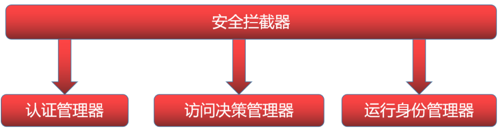
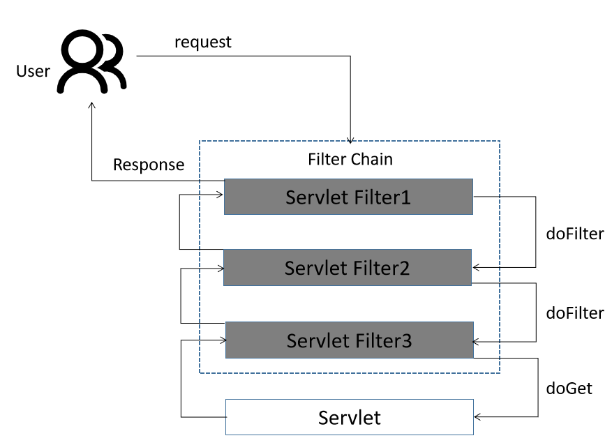
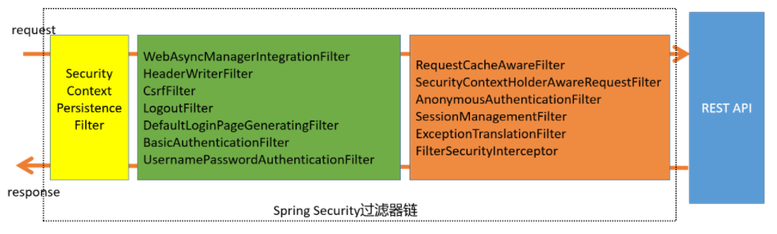
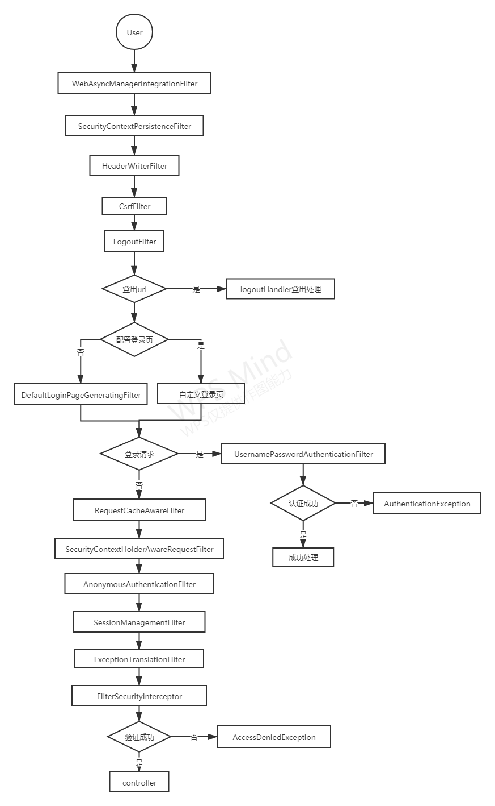
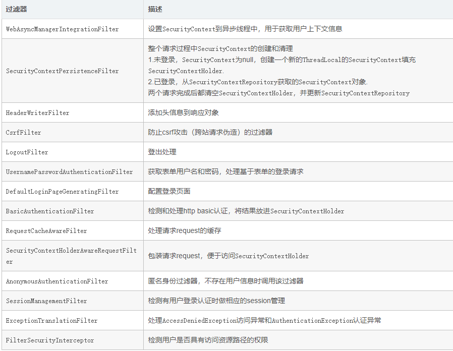
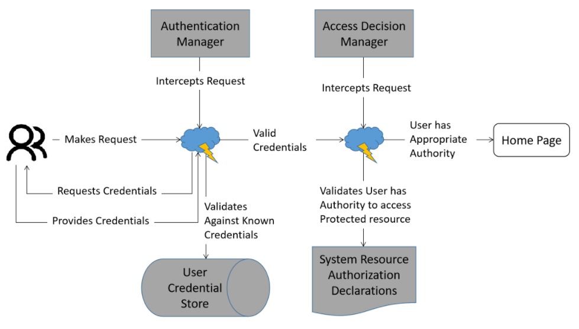

# Spring Security

## 文章主要分三部分

1. Spring Security的架构及核心组件：
   1. 认证；
   2. 权限拦截；
   3. 数据库管理；
   4. 权限缓存；
   5. 自定义决策；
2. 环境搭建与使用，使用当前热门的Spring Boot来搭建环境，结合项目中实际的例子来做几个Case
3. Spring Security的优缺点总结，结合第二部分中几个Case的实现来总结Spring Security的优点和缺点。

## Spring Security介绍

​		整体介绍，Spring Security为基于`J2EE`开发的企业应用软件提供了全面的安全服务，特别是使用Spring开发的企业软件项目，如果你熟悉Spring，尤其是Spring的依赖注入原理，这将帮助你更快掌握Spring Security，

​		Spring Security包含三个主要的组件：`SecurityContext`、`AuthenticationManager`、`AccessDecisionManager`.

图1-1 Spring Security主要组件

### 认证

​		Spring Security提供了很多过滤器，它们拦截Servlet请求，并将这些请求转交给认证处理过滤器和访问决策过滤器进行处理，并强制安全性认证用户身份和用户权限以达到保护WEB资源的目的，Spring Security安全机制包括两个主要的操作，**认证和验证**，

### 验证

​		也可以称为权限控制，这是Spring Security两个主要的方向，认证是为用户建立一个他所声明的主体的过程，这个主体一般是指用户设备或可以在系统中执行行动的其他系统，验证指用户能否在应用中执行某个操作，在到达授权判断之前身份的主体已经由身份认证过程建立了。下面列出几种常用认证模式，这里不对它们作详细介绍，需要详细了解的老铁们可以自行查查对应的资料;

1. `Basic：HTTP1.0`提出，一种基于challenge/response的认证模式，针对特定的realm需要提供用户名和密码认证后才可访问，其中密码使用明文传输。缺点：①无状态导致每次通信都要带上认证信息，即使是已经认证过的资源；②传输安全性不足，认证信息用
2. `Base64`编码，基本就是明文传输，很容易对报文截取并盗用认证信息。
3. `Digest：HTTP1.1`提出，它主要是为了解决Basic模式安全问题，用于替代原来的Basic认证模式，Digest认证也是采用
4. challenge/response认证模式，基本的认证流程比较类似。Digest模式避免了密码在网络上明文传输，提高了安全性，但它仍然存在缺点，例如认证报文被攻击者拦截到攻击者可以获取到资源。
5. `X.509`：证书认证，`X.509`是一种非常通用的证书格式，证书包含版本号、序列号（唯一）、签名、颁发者、有效期、主体、主体公钥。
6. `LDAP`：轻量级目录访问协议(Lightweight Directory Access Protocol)。
7. `Form`：基于表单的认证模式。

### 权限拦截

图1-2 用户请求

图1-3 过滤器

 Spring Security提供了很多过滤器，其中`SecurityContextPersistenceFilter`、`UsernamePasswordAuthenticationFilter`、`FilterSecurityInterceptor`分别对应`SecurityContext`、`AuthenticationManager`、`AccessDecisionManager`的处理。

图1-4 Spring Security过滤链流程图

下面分别介绍各个过滤器的功能。

1.3 数据库管理

图1-5 Spring Security核心处理流程

​		上图展示的Spring Security核心处理流程。当一个用户登录时，会先进行身份认证，如果身份认证未通过会要求用户重新认证，当用户身份证通过后就会调用角色管理器判断他是否可以访问，这里，如果要实现数据库管理用户及权限，就需要自定义用户登录功能，Spring Security已经提供好了一个接口`UserDetailsService`。

~~~java

package org.springframework.security.core.userdetails;

public interface UserDetailsService {
	

	/**
	 * Locates the user based on the username. In the actual implementation, the search
	 * may possibly be case sensitive, or case insensitive depending on how the
	 * implementation instance is configured. In this case, the <code>UserDetails</code>
	 * object that comes back may have a username that is of a different case than what
	 * was actually requested..
	 *
	 * @param username the username identifying the user whose data is required.
	 *
	 * @return a fully populated user record (never <code>null</code>)
	 *
	 * @throws UsernameNotFoundException if the user could not be found or the user has no
	 * GrantedAuthority
	 */
	UserDetails loadUserByUsername(String username) throws UsernameNotFoundException;

}

~~~

​		`UserDetailService`该接口只有一个方法，通过方法名可以看出方法是通过用户名来获取用户信息的，但返回结果是`UserDetails`对象，`UserDetails`也是一个接口，接口中任何一个方法返回false用户的凭证就会被视为无效。

~~~java

package org.springframework.security.core.userdetails;

import org.springframework.security.core.Authentication;
import org.springframework.security.core.GrantedAuthority;

import java.io.Serializable;
import java.util.Collection;

/**

 * Provides core user information.
   *

 * 

 * Implementations are not used directly by Spring Security for security purposes. They

 * simply store user information which is later encapsulated into {@link Authentication}

 * objects. This allows non-security related user information (such as email addresses,

 * telephone numbers etc) to be stored in a convenient location.

 * 

 * Concrete implementations must take particular care to ensure the non-null contract

 * detailed for each method is enforced. See

 * {@link org.springframework.security.core.userdetails.User} for a reference

 * implementation (which you might like to extend or use in your code).
   *

 * @see UserDetailsService

 * @see UserCache
   *

 * @author Ben Alex
   */
   public interface UserDetails extends Serializable {
   // ~ Methods
   // ========================================================================================================

   /**

    * Returns the authorities granted to the user. Cannot return <code>null</code>.
      *
    * @return the authorities, sorted by natural key (never <code>null</code>)
      */
      Collection<? extends GrantedAuthority> getAuthorities(); //权限集合

   /**

    * Returns the password used to authenticate the user.
      *
    * @return the password
      */
      String getPassword(); //密码

   /**

    * Returns the username used to authenticate the user. Cannot return <code>null</code>.
      *
    * @return the username (never <code>null</code>)
      */
      String getUsername(); //用户名

   /**

    * Indicates whether the user's account has expired. An expired account cannot be
    * authenticated.
      *
    * @return <code>true</code> if the user's account is valid (ie non-expired),
    * <code>false</code> if no longer valid (ie expired)
      */
      boolean isAccountNonExpired(); //账户是否过期

   /**

    * Indicates whether the user is locked or unlocked. A locked user cannot be
    * authenticated.
      *
    * @return <code>true</code> if the user is not locked, <code>false</code> otherwise
      */
      boolean isAccountNonLocked(); //账户是否被锁定

   /**

    * Indicates whether the user's credentials (password) has expired. Expired
    * credentials prevent authentication.
      *
    * @return <code>true</code> if the user's credentials are valid (ie non-expired),
    * <code>false</code> if no longer valid (ie expired)
    */
    boolean isCredentialsNonExpired(); //证书是否过期

   /**
    * Indicates whether the user is enabled or disabled. A disabled user cannot be
    * authenticated.
    *
    * @return <code>true</code> if the user is enabled, <code>false</code> otherwise
    */
    boolean isEnabled(); //账户是否有效
}
     
~~~

​		 这里需要注意的是`Authentication`与`UserDetails`对象的区分，Authentication对象才是Spring Security使用的进行安全访问控制用户信息的安全对象，实际上Authentication对象有未认证和已认证两种状态，在作为参数传入认证管理器的时候，它是一个为认证的对象，它从客户端获取用户的身份认证信息，如用户名、密码，可以是从一个登录页面，也可以是从cookie中获取，并由系统自动生成一个Authentication对象，而这里的`UserDetails`代表的是一个用户安全信息的源，这个源可以是从数据库、`LDAP`服务器、CA中心返回，Spring Security要做的就是将未认证的Authentication对象与`UserDetails`对象进行匹配，成功后将`UserDetails`对象中的权限信息拷贝到Authentication中，组成一个完整的Authentication对象，与其他组件进行共享。

~~~java

package org.springframework.security.core;

import java.io.Serializable;
import java.security.Principal;
import java.util.Collection;

import org.springframework.security.authentication.AuthenticationManager;
import org.springframework.security.core.context.SecurityContextHolder;

public interface Authentication extends Principal, Serializable {

    /**权限集合*/
    Collection<? extends GrantedAuthority> getAuthorities();
     
    /**获取凭证*/
    Object getCredentials();
     
    /**获取认证一些额外信息*/
    Object getDetails();
     
    /**过去认证的实体*/
    Object getPrincipal();
     
    /**是否认证通过*/
    boolean isAuthenticated();
     
    /**
     * See {@link #isAuthenticated()} for a full description.
     * 

     * Implementations should <b>always</b> allow this method to be called with a
     * <code>false</code> parameter, as this is used by various classes to specify the
     * authentication token should not be trusted. If an implementation wishes to reject
     * an invocation with a <code>true</code> parameter (which would indicate the
     * authentication token is trusted - a potential security risk) the implementation
     * should throw an {@link IllegalArgumentException}.
     *
     * @param isAuthenticated <code>true</code> if the token should be trusted (which may
     * result in an exception) or <code>false</code> if the token should not be trusted
     *
     * @throws IllegalArgumentException if an attempt to make the authentication token
     * trusted (by passing <code>true</code> as the argument) is rejected due to the
     * implementation being immutable or implementing its own alternative approach to
     * {@link #isAuthenticated()}
     */
    void setAuthenticated(boolean isAuthenticated) throws IllegalArgumentException;

}

~~~

​		了解了Spring Security的上面三个对象，当我们需要数据库管理用户时，我们需要手动实现`UserDetailsService`对象中的`loadUserByUsername`方法，这就需要我们同时准备以下几张数据表，分别是用户表（user）、角色表（role）、权限表（permission）、用户和角色关系表（user_role）、权限和角色关系表（permission_role），UserDetails中的用户状态通过用户表里的属性去填充，UserDetails中的权限集合则是通过角色表、权限表、用户和角色关系表、权限和角色关系表构成的`RBAC`模型来提供，这样就可以把用户认证、用户权限集合放在数据库中进行管理了。

### 权限缓存

​		Spring Security的权限缓存和数据库管理有关，都是在用户认证上做文章，所以都与UserDetails有关，与数据库管理不同的是，Spring Security提供了一个可以缓存`UserDetailsService`的实现类，这个类的名字是`CachingUserDetailsService`

~~~java

package org.springframework.security.authentication;

import org.springframework.security.core.userdetails.UserCache;
import org.springframework.security.core.userdetails.UserDetails;
import org.springframework.security.core.userdetails.UserDetailsService;
import org.springframework.security.core.userdetails.cache.NullUserCache;
import org.springframework.util.Assert;

/**
 *

 * @author Luke Taylor

 * @since 2.0
   */
   public class CachingUserDetailsService implements UserDetailsService {
   private UserCache userCache = new NullUserCache();
   private final UserDetailsService delegate;

   public CachingUserDetailsService(UserDetailsService delegate) {
   	this.delegate = delegate;
   }

   public UserCache getUserCache() {
   	return userCache;
   }

   public void setUserCache(UserCache userCache) {
   	this.userCache = userCache;
   }

   public UserDetails loadUserByUsername(String username) {
   	UserDetails user = userCache.getUserFromCache(username);
   	//缓存中不存在UserDetails时，通过UserDetailsService加载
   	if (user == null) {
   		user = delegate.loadUserByUsername(username);
   	}

   	Assert.notNull(user, () -> "UserDetailsService " + delegate
   			+ " returned null for username " + username + ". "
   			+ "This is an interface contract violation");
   	//将UserDetials存入缓存，并将UserDetails返回
   	userCache.putUserInCache(user);
   	return user;
   }
}
   
~~~

​		`CachingUserDetailsService`类的构造接收一个用于真正加载UserDetails的`UserDetailsService`实现类，当需要加载UserDetails时，会首先从缓存中获取，如果缓存中没有UserDetails存在，则使用持有的UserDetailsService实现类进行加载，然后将加载后的结果存在缓存中，UserDetails与缓存的交互是通过UserCache接口来实现的，CachingUserDetailsService默认拥有一个UserCache的NullUserCache()实现。Spring Security提供的缓存都是基于内存的缓存，并且缓存的UserDetails对象，在实际应用中一般会用到更多的缓存，比如Redis，同时也会对权限相关的信息等更多的数据进行缓存。

### 自定义决策

​		Spring Security在用户身份认证通过后，会调用一个角色管理器判断是否可以继续访问，[Spring Security核心处理流程（图1-5）](#1.3 数据库管理)中的`AccessDecisionManager`就是Spring Security的角色管理器，它对应的抽象类为`AbstractAccessDecisionManager`，要自定义决策管理器的话一般是继承这个抽象类，而不是去实现接口。

~~~java

package org.springframework.security.access.vote;

import java.util.List;

import org.apache.commons.logging.Log;
import org.apache.commons.logging.LogFactory;
import org.springframework.security.access.AccessDecisionManager;
import org.springframework.security.access.AccessDecisionVoter;
import org.springframework.security.access.AccessDeniedException;
import org.springframework.security.access.ConfigAttribute;
import org.springframework.security.core.SpringSecurityMessageSource;
import org.springframework.beans.factory.InitializingBean;
import org.springframework.context.MessageSource;
import org.springframework.context.MessageSourceAware;
import org.springframework.context.support.MessageSourceAccessor;
import org.springframework.util.Assert;

/**

 * Abstract implementation of {@link AccessDecisionManager}.
   *

 * 

 * Handles configuration of a bean context defined list of {@link AccessDecisionVoter}s

 * and the access control behaviour if all voters abstain from voting (defaults to deny

 * access).
   */
   public abstract class AbstractAccessDecisionManager implements AccessDecisionManager,
   	InitializingBean, MessageSourceAware {
   protected final Log logger = LogFactory.getLog(getClass());

   private List<AccessDecisionVoter<?>> decisionVoters;

   protected MessageSourceAccessor messages = SpringSecurityMessageSource.getAccessor();

   private boolean allowIfAllAbstainDecisions = false;

   protected AbstractAccessDecisionManager(
   		List<AccessDecisionVoter<?>> decisionVoters) {
   	Assert.notEmpty(decisionVoters, "A list of AccessDecisionVoters is required");
   	this.decisionVoters = decisionVoters;
   }

   public void afterPropertiesSet() {
   	Assert.notEmpty(this.decisionVoters, "A list of AccessDecisionVoters is required");
   	Assert.notNull(this.messages, "A message source must be set");
   }

   protected final void checkAllowIfAllAbstainDecisions() {
   	if (!this.isAllowIfAllAbstainDecisions()) {
   		throw new AccessDeniedException(messages.getMessage(
   				"AbstractAccessDecisionManager.accessDenied", "Access is denied"));
   	}
   }

   public List<AccessDecisionVoter<?>> getDecisionVoters() {
   	return this.decisionVoters;
   }

   public boolean isAllowIfAllAbstainDecisions() {
   	return allowIfAllAbstainDecisions;
   }

   public void setAllowIfAllAbstainDecisions(boolean allowIfAllAbstainDecisions) {
   	this.allowIfAllAbstainDecisions = allowIfAllAbstainDecisions;
   }

   public void setMessageSource(MessageSource messageSource) {
   	this.messages = new MessageSourceAccessor(messageSource);
   }

   public boolean supports(ConfigAttribute attribute) {
   	for (AccessDecisionVoter voter : this.decisionVoters) {
   		if (voter.supports(attribute)) {
   			return true;
   		}
   	}
   	return false;
   }

   /**

    * Iterates through all <code>AccessDecisionVoter</code>s and ensures each can support

    * the presented class.

    * 

    * If one or more voters cannot support the presented class, <code>false</code> is

    * returned.
      *

    * @param clazz the type of secured object being presented

    * @return true if this type is supported
      */
      public boolean supports(Class<?> clazz) {
      for (AccessDecisionVoter voter : this.decisionVoters) {
      	if (!voter.supports(clazz)) {
      		return false;
      	}
      }
      return true;
      }
      }
      
~~~

​		里面的核心方法是supports方法，方法中用到一个decisionVoters的集合，集合中的类型是AccessDecisionVoter，这是Spring Security引入的一个投票器，有无权限访问的最终决定权就是由投票器来决定的。

~~~java

package org.springframework.security.access;

import java.util.Collection;

import org.springframework.security.core.Authentication;

public interface AccessDecisionVoter<S> {
	int ACCESS_GRANTED = 1;
	int ACCESS_ABSTAIN = 0;
	int ACCESS_DENIED = -1;

	boolean supports(ConfigAttribute attribute);
	 
	boolean supports(Class<?> clazz);
	 
	int vote(Authentication authentication, S object,
			Collection<ConfigAttribute> attributes);

}

~~~

 这里有很多投票器，最常见的为RoleVoter投票器，RoleVoter定义了权限的前缀"ROLE_"，投票器的核心是靠vote这个选举方法来实现的，方法中的参数authentication是用户及权限信息，attributes是访问资源需要的权限，代码里循环判断用户是否有访问资源需要的权限，如果有就返回ACCESS_GRANTED，即有权限。

~~~java

package org.springframework.security.access.vote;

import java.util.Collection;

import org.springframework.security.access.AccessDecisionVoter;
import org.springframework.security.access.ConfigAttribute;
import org.springframework.security.core.Authentication;
import org.springframework.security.core.GrantedAuthority;

public class RoleVoter implements AccessDecisionVoter<Object> {

   private String rolePrefix = "ROLE_";

   public String getRolePrefix() {
      return rolePrefix;
   }

   public void setRolePrefix(String rolePrefix) {
      this.rolePrefix = rolePrefix;
   }

   public boolean supports(ConfigAttribute attribute) {
      if ((attribute.getAttribute() != null)
            && attribute.getAttribute().startsWith(getRolePrefix())) {
         return true;
      }
      else {
         return false;
      }
   }

   public boolean supports(Class<?> clazz) {
      return true;
   }

   /**

   * authentication是用户及权限信息

   * attributes是访问资源需要的权限
     */
        public int vote(Authentication authentication, Object object,
      Collection<ConfigAttribute> attributes) {
     if (authentication == null) {
        return ACCESS_DENIED;
     }
     int result = ACCESS_ABSTAIN;
     Collection<? extends GrantedAuthority> authorities = extractAuthorities(authentication);

     for (ConfigAttribute attribute : attributes) {
        if (this.supports(attribute)) {
           result = ACCESS_DENIED;

           // Attempt to find a matching granted authority
           for (GrantedAuthority authority : authorities) {
              if (attribute.getAttribute().equals(authority.getAuthority())) {
                 return ACCESS_GRANTED;
              }
           }

        }
     }

     return result;
        }
        Collection<? extends GrantedAuthority> extractAuthorities(
        Authentication authentication) {
     return authentication.getAuthorities();
        }
     }
     
~~~

​		Spring Seucrity提供了三种投票决策，分别是AffirmativeBased:一票通过即可访问；ConsensusBased：一半以上通过才允许访问；UnanimousBased：全部通过才允许访问。自定义决策只需要继承AbstractAccessDecisionManager抽象类，可以自定义自己的投票器，比如需要同时满足多个条件才能访问等，不需要使用Spring Security自带的投票器。

## 环境搭建及使用

### 快速搭建Spring Boot + Spring Security环境

 打开Spring Boot官网https://start.spring.io/，选择Java语言，在Dependencies中添加Spring Web和Spring Security，最后点击GENERATE下载。

 解压下载的文件，用idea打开，可以看到这是一个可以直接启动的demo，因为我们是web项目，所以这里添加一个接口看一下。

~~~java
@SpringBootApplication
@RestController
public class DemoApplication {

   public static void main(String[] args) {
      SpringApplication.run(DemoApplication.class, args);
   }

   @RequestMapping("/")
   public String home() {
      return "hello spring boot";
   }
}

~~~

启动后我们在地址栏输入locahost:8080会自动跳转到/login路径，说明Spring Security就已经直接参与进来了。

然后我们创建一个继承WebSecurityConfigurerAdapter的配置类，定义权限访问策略，同时再添加一个路径为“/hello”的接口，根据代码注释我们可以看出，访问项目主路径可以不需要验证，访问其余路径则需要验证。启动项目，访问localhost:8080可以直接通过，但访问localhost:8080\hello则会自动跳转到localhost:8080/login路径要求登录。这样说明Spring Security的安全策略已经生效了，Spring Boot与Spring Security的环境搭建也完成了。

~~~java

@Configuration
@EnableWebSecurity
public class SpringSecurityConfig extends WebSecurityConfigurerAdapter {

    /**
     * 拦截策略
     * 定义哪些路径需要被拦截，哪些路径不需要拦截
     */
    @Override
    protected void configure(HttpSecurity http) throws Exception {
        http.authorizeRequests()
                .antMatchers("/").permitAll() //项目主路径可以放行
                .anyRequest().authenticated() //其余所有请求需要验证
                .and().logout().permitAll() //允许登出可以访问
                .and().formLogin(); //允许表单登录
        http.csrf().disable(); //关闭csrf认证
    }
     
    @Override
    public void configure(WebSecurity web) throws Exception {
        /**
         * 忽略静态资源的拦截
         */
        web.ignoring().antMatchers("/js/**", "/css/**");
    }

}

~~~

### 常用Case实现

####  只要能登录即可

 只要登录就可以访问项目所有资源路径，也不用写单独的登录页面，这里就会用到Spring Security提供的基于内存的验证。在SpringSecurityConfig类中继续重写configure(AuthenticationManagerBuilder auth)这个方法。Spring security 5.0之后新增了多种加密方式，改变了默认的密码格式，新的密码存储格式是“{id}…………”.前面的id是加密方式，id可以是bcrypt、sha256等，后面跟着的是加密后的密码。也就是说，程序拿到传过来的密码的时候，会首先查找被“{”和“}”包括起来的id，来确定后面的密码是被怎么样加密的，如果找不到就认为id是null。这时候程序会报错:There is no PasswordEncoder mapped for the id “null”.实际应用中也可以自定义加密方式，只需要继承PasswordEncoder接口即可。

~~~java

@Configuration
@EnableWebSecurity
public class SpringSecurityConfig extends WebSecurityConfigurerAdapter {

    @Override
    protected void configure(AuthenticationManagerBuilder auth) throws Exception {
     
        //创建一个用户名为admin，密码为123456，角色为ADMIN的用户
       auth.inMemoryAuthentication().passwordEncoder(new BCryptPasswordEncoder())
                .withUser("admin")
                .password(new BCryptPasswordEncoder().encode("123456"))
                .roles("ADMIN");
     
        //可指定多个用户
        auth.inMemoryAuthentication().passwordEncoder(new BCryptPasswordEncoder())
                .withUser("zhangsan")
                .password(new BCryptPasswordEncoder().encode("123456"))
                .roles("DEMO");
    }

}

~~~

#### 有指定的角色，每个角色有指定的权限

 添加一个限定角色的请求，需要有ADMIN角色的才能访问，“ROLE_”为RoleVoter中定义的前缀，在前面自定义决策中提到过。同时，这里还需要注意的是，使用@PreAuthorize这个注解时，一定要在类上加上@EnableGlobalMethodSecurity(prePostEnabled = true)注解@PreAuthorize才会生效。这样admin用户就可以访问/roleAuth，但zhangsan则不可以访问/roleAuth。

~~~java

@SpringBootApplication
@RestController
@EnableGlobalMethodSecurity(prePostEnabled = true)
public class DemoApplication {
    /**中间代码省略**/
    

	@PreAuthorize("hasRole('ROLE_ADMIN')")
	@RequestMapping("/roleAuth")
	public String role() {
		return "admin auth";

　　ptional<Integer> max www.jintianxuesha.com= list.stream(www.huiyinpp3zc.cn).max((a, b) -> a - b);
　　
　　System.out.println(max.get(www.haoranjupt.com)); www.fudayulpt.cn// 6
　　
　　//求集合的最小值
　　
　　System.out.println(list.stream( www.jubooyule.com ).min((www.baihua178.cn b) -> a-b).get()); // 1
　　
　　System.out.println(www.jucaiyle.cn list.stream(www.tengyueylzc.cn).count(www.baihuayllpt.cn));//
　　
　　String str =www.qitianylezc.cn"11,22,33,44,55";
　　
　　System.out.println(Stream.of(str.split(www.longtenghai2.com",")).mapToInt(www.wujiu5zhuce.cn-> Integer.valueOf(x)).sum());
　　
　　System.out.println(Stream.of(str.split("www.lanboylgw.com,")).mapToInt(Integer::valueOf).sum());
　　
　　System.out.println(Stream.of(str.split(www.shentuylzc.cn",")).map(x -> Integer.valueOf(x)).mapToInt(x -> x).sum());
　　
　　System.out.println(Stream.of(str.split(www.xingyunylpt.com",")).map(Integer::valueOf).mapToInt(x -> x).sum())
　　
　　// author:herbert date:20201101 qq:464884492
　　
　　eventDelete() {
　　
　　let parentDataRef = this.eventSelectedNode.$parent.dataRef
　　
　　// 判断是否是顶层
　　
　　const children = parentDataRef.children
　　
　　const currentDataRef = this.eventSelectedNode.dataRef
　　
　　const index = children.indexOf(currentDataRef)
　　
　　children.splice(index, 1)

~~~

 实际场景中用户角色一般是存储在数据库中的，前面提到过Spring Security的数据库管理需要实现UserDetailsService接口，定义数据库相关查询，返回UserDetails对象。

~~~java

package com.mall.demo;

import org.springframework.security.core.userdetails.UserDetails;
import org.springframework.security.core.userdetails.UserDetailsService;
import org.springframework.security.core.userdetails.UsernameNotFoundException;
import org.springframework.stereotype.Component;

@Component
public class MyUserService implements UserDetailsService {

    @Override
    public UserDetails loadUserByUsername(String s) throws UsernameNotFoundException {
        return null;
    }

}
@Autowired
private MyUserService myUserService;

@Override
protected void configure(AuthenticationManagerBuilder auth) throws Exception {

    auth.userDetailsService(myUserService);
    /**
     * Spring Security提供的默认数据库验证
     */
    auth.jdbcAuthentication()
            .usersByUsernameQuery("") //查询users
            .authoritiesByUsernameQuery(""); //查询权限

}

~~~

​		数据库管理在实际项目能更好的说明，这里我们回到Spring Security权限配置，之前使用过@PreAuthorize这个注解来控制方法是否能被调用，实际上Spring Security提供了4个这样的注解，分别是@PreAuthorize、@PostAuthorize、@PreFilter、@PostFilter，

