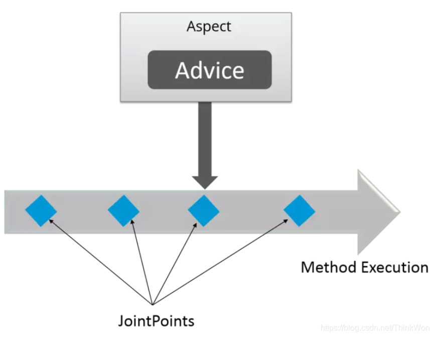
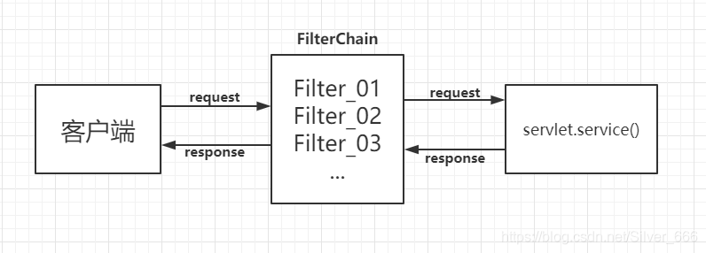
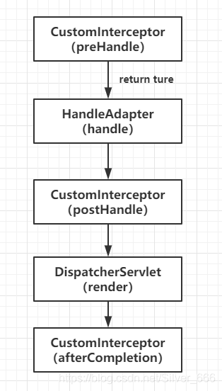
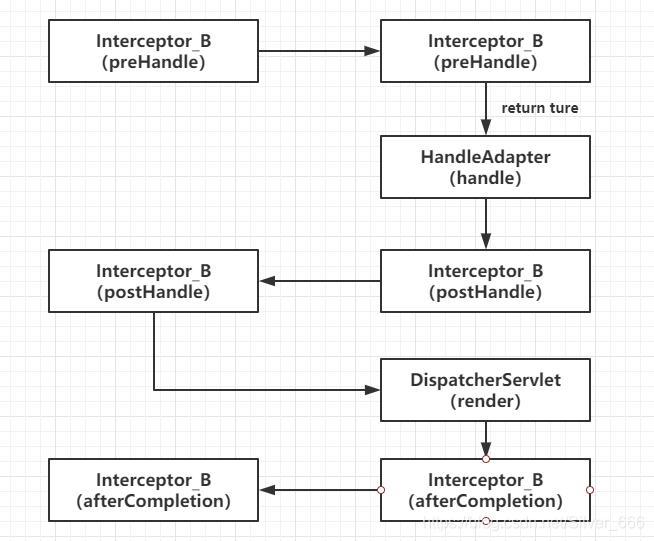
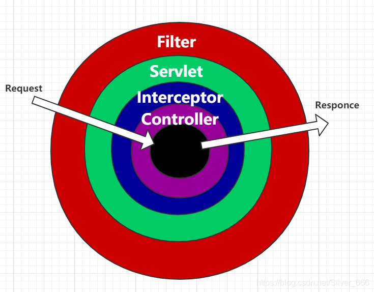

# Spring

## Spring概述

### 谈谈你对于Spring的理解？

1. Spring是一个应用在JavaEE开发的最热门的开源框架，目前也是Java开发工作必备的技术之一
2. 底层原理是使用反射对 Java 对象进行托管，也就是我们熟称的IOC容器，然后让程序员能够集中精力在业务逻辑上面，优点是提供了一站式开发框架，缺点是框架大而全，入门的基础会比较难
3. Spring是一个底层基建，再此之上衍生出了一系列Spring家族开发框架，如：SpringMVC（基于model-veiw-controller的开发模式）、SpringBoot（微服务开发脚手架）、Spring Cloud（微服务智力框架），其他还有Spring Security、Spring Cache等等
4. 总结一下，Spring是我们目前Java程序员必备的开发技能之一，学号Spring，能够有效提高我们开发的效率

### Spring的4种关键策略？

​		Spring是**一个轻量级Java开发框架**，目的是为了解决企业级应用开发的业务逻辑层和其他各层的耦合问题。它是一个分层的JavaSE/JavaEE full-stack（一站式）轻量级开源框架，为开发Java应用程序提供全面的基础架构支持。

为了降低Java开发的复杂性，Spring采取了以下**4种关键策略**

- 基于POJO的轻量级和最小侵入性编程；
- 通过依赖注入和面向接口实现松耦合；
- 基于切面和惯例进行声明式编程；
- 通过切面和模板减少样板式代码。

### Spring 的优缺点是什么？

**优点**

- 方便解耦，简化开发，IOC实现对象的托管

- AOP编程的支持，可以方便的实现对程序进行权限拦截、运行监控等功能。

- 声明式事务的支持，只需要通过配置就可以完成对事务的管理，而无需手动编程。

- 方便程序的测试，Spring对Junit4支持，可以通过注解方便的测试Spring程序。

- 方便集成各种优秀框架，其内部提供了对各种优秀框架的直接支持（如：Struts、Hibernate、MyBatis等）。

- 降低JavaEE API的使用难度，Spring对JavaEE开发中非常难用的一些API（JDBC、JavaMail、远程调用等），都提供了封装。

**缺点**

- Spring明明一个很轻量级的框架，却给人感觉大而全
- Spring依赖反射，反射影响性能
- 使用门槛升高，入门Spring需要较长时间

### Spring 有哪些应用场景

**应用场景**：JavaEE 企业应用开发，包括 SSH、SSM 等

**Spring价值**：

- Spring 是非侵入式的框架，目标是使应用程序代码对框架依赖最小化；
- Spring 提供一个一致的编程模型，使应用直接使用POJO开发，与运行环境隔离开来；
- Spring 推动应用设计风格向面向对象和面向接口开发转变，提高了代码的重用性和可测试性；

### Spring 由哪些模块组成？

Spring 总共大约有 20 个模块， 由 1300 多个不同的文件构成。 而这些组件被分别整合在

+ `核心容器（Core Container)`

+  `AOP（Aspect Oriented Programming）` 、
+ `数据访问与集成（Data Access/Integeration）` 、
+  `Web`、 
+ `消息（Messaging）` 、
+  `Test`

等 6 个模块中。 以下是 Spring 5 的模块结构图：


- **spring core：**提供了框架的基本组成部分，包括控制反转（Inversion of Control，IOC）和依赖注入（Dependency Injection，DI）功能。
- **spring beans：**提供了BeanFactory，是工厂模式的一个经典实现，Spring将管理对象称为Bean。
- **spring context：**构建于 core 封装包基础上的 context 封装包，提供了一种框架式的对象访问方法。
- **spring jdbc：**提供了一个JDBC的抽象层，消除了烦琐的JDBC编码和数据库厂商特有的错误代码解析， 用于简化JDBC。
- **spring aop：**提供了面向切面的编程实现，让你可以自定义拦截器、切点等。
- **spring Web：**提供了针对 Web 开发的集成特性，例如文件上传，利用 servlet listeners 进行 ioc 容器初始化和针对 Web 的 ApplicationContext。
- **spring test：**主要为测试提供支持的，支持使用JUnit或TestNG对Spring组件进行单元测试和集成测试。

### Spring 框架中都用到了哪些设计模式？

1. 工厂模式：BeanFactory就是简单工厂模式的体现，用来创建对象的实例；
2. 单例模式：Bean默认为单例模式。
3. 代理模式：Spring的AOP功能用到了JDK的动态代理和CGLIB字节码生成技术；
4. 模板方法：用来解决代码重复的问题。比如. RestTemplate, JmsTemplate, JpaTemplate。
5. 观察者模式：定义对象键一种一对多的依赖关系，当一个对象的状态发生改变时，所有依赖于它的对象都会得到通知被制动更新，如Spring中listener的实现–ApplicationListener。

### 详细讲解一下spring context 模块

​		这是基本的Spring模块，提供spring 框架的基础功能，BeanFactory 是任何以spring为基础的应用的核心。Spring 框架建立在此模块之上，它使Spring成为一个容器。

​		Bean 工厂是工厂模式的一个实现，提供了控制反转功能，用来把应用的配置和依赖从真正的应用代码中分离。最常用的就是org.springframework.beans.factory.xml.XmlBeanFactory ，它根据XML文件中的定义加载beans。该容器从XML 文件读取配置元数据并用它去创建一个完全配置的系统或应用。

### Spring 应用程序有哪些不同组件？

Spring 应用一般有以下组件：

- 接口 - 定义功能。
- Bean 类 - 它包含属性，setter 和 getter 方法，函数等。
- Bean 配置文件 - 包含类的信息以及如何配置它们。
- Spring 面向切面编程（AOP） - 提供面向切面编程的功能。
- 用户程序 - 它使用接口。

### 使用 Spring 有哪些方式？

使用 Spring 有以下方式：

- 作为一个成熟的 Spring Web 应用程序。
- 作为第三方 Web 框架，使用 Spring Frameworks 中间层。
- 作为企业级 Java Bean，它可以包装现有的 POJO（Plain Old Java Objects）。
- 用于远程使用。

## Spring控制反转(IOC)

### 什么是Spring IOC 容器？

​		控制反转即IoC (Inversion of Control)，它把传统上由程序代码直接操控的对象的调用权交给容器，通过容器来实现对象组件的装配和管理。所谓的“控制反转”概念就是对组件对象控制权的转移，从程序代码本身转移到了外部容器。

​		Spring IOC 负责创建对象，管理对象（通过依赖注入（DI），装配对象，配置对象，并且管理这些对象的整个生命周期。

### 控制反转(IoC)有什么作用

- 管理对象的创建和依赖关系的维护。
- 解耦，由容器去维护具体的对象
- 托管了类的产生过程，最直接的例子就是代理，应用程序则无需去关心类是如何完成代理的

### `IOC`的优点是什么？

- `IOC` 或 依赖注入把应用的代码量降到最低。
- 它使应用容易测试，单元测试不再需要单例和JNDI查找机制。
- 最小的代价和最小的侵入性使松散耦合得以实现。
- `IOC`容器支持加载服务时的饿汉式初始化和懒加载。

### Spring IoC 的实现机制

Spring 中的 IoC 的实现原理就是工厂模式加反射机制。

示例：

```java
interface Fruit {
   public abstract void eat();
 }

class Apple implements Fruit {
    public void eat(){
        System.out.println("Apple");
    }
}

class Orange implements Fruit {
    public void eat(){
        System.out.println("Orange");
    }
}

class Factory {
    public static Fruit getInstance(String ClassName) {
        Fruit f=null;
        try {
            f=(Fruit)Class.forName(ClassName).newInstance();
        } catch (Exception e) {
            e.printStackTrace();
        }
        return f;
    }
}

class Client {
    public static void main(String[] a) {
        Fruit f=Factory.getInstance("io.github.dunwu.spring.Apple");
        if(f!=null){
            f.eat();
        }
    }
}
```


### Spring 的 IoC支持哪些功能

Spring 的 IoC 设计支持以下功能：

- 依赖注入
- 依赖检查
- 自动装配
- 支持集合
- 指定初始化方法和销毁方法
- 支持回调某些方法（但是需要实现 Spring 接口，略有侵入）


​       其中，最重要的就是依赖注入，从 XML 的配置上说，即 ref 标签。对应 Spring RuntimeBeanReference 对象。对于 IoC 来说，最重要的就是容器。容器管理着 Bean 的生命周期，控制着 Bean 的依赖注入。


### `BeanFactory` 和 `ApplicationContext` 有什么区别？

​		BeanFactory和ApplicationContext是Spring的两大核心接口，都可以当做Spring的容器。其中ApplicationContext是BeanFactory的子接口。

1、**依赖关系**

BeanFactory：是Spring里面最底层的接口，**包含了各种Bean的定义，读取bean配置文档，管理bean的加载、实例化，控制bean的生命周期，维护bean之间的依赖关系。**

ApplicationContext接口作为BeanFactory的派生，除了提供BeanFactory所具有的功能外，还提供了更完整的框架功能：

- **继承MessageSource，因此支持国际化。**
- **统一的资源文件访问方式。**
- **提供在监听器中注册bean的事件。**
- **同时加载多个配置文件。**
- **载入多个（有继承关系）上下文 ，使得每一个上下文都专注于一个特定的层次，比如应用的web层。**

2、**加载方式**

​		**BeanFactroy**采用的是延迟加载形式来注入Bean的，即只有在使用到某个Bean时(调用getBean())，才对该Bean进行加载实例化。这样，我们就不能发现一些存在的Spring的配置问题。如果Bean的某一个属性没有注入，BeanFacotry加载后，直至第一次使用调用getBean方法才会抛出异常。

​		**ApplicationContext，它是在容器启动时，一次性创建了所有的Bean**。这样，在容器启动时，我们就可以发现Spring中存在的配置错误，这样有利于检查所依赖属性是否注入。 ApplicationContext启动后预载入所有的单实例Bean，通过预载入单实例bean ,确保当你需要的时候，你就不用等待，因为它们已经创建好了。

​		相对于基本的BeanFactory，ApplicationContext 唯一的不足是占用内存空间。当应用程序配置Bean较多时，程序启动较慢。

3、**创建方式**

​		**BeanFactory通常以编程的方式被创建，ApplicationContext还能以声明的方式创建，如使用ContextLoader。**

4、**注册方式**

​		BeanFactory和ApplicationContext都支持BeanPostProcessor、BeanFactoryPostProcessor的使用，但两者之间的区别是：BeanFactory需要手动注册，而ApplicationContext则是自动注册。

5、**小结**

**说了这么多，不知道你有没有理解Spring IoC？ 这里小结一下：IoC 在 Spring 里，只需要低级容器就可以实现，2 个步骤：**

1. **加载配置文件，解析成 BeanDefinition 放在 Map 里。**
2. **调用 getBean 的时候，从 BeanDefinition 所属的 Map 里，拿出 Class 对象进行实例化，同时，如果有依赖关系，将递归调用 getBean 方法 —— 完成依赖注入。**

**上面就是 Spring 低级容器（BeanFactory）的 IoC。**

​		至于高级容器 ApplicationContext，他包含了低级容器的功能，当他执行 spring 的 refresh()  方法的时候，将刷新整个容器的 Bean。同时其作为高级容器，包含了太多的功能。一句话，他不仅仅是 IoC。他支持不同信息源头，支持 BeanFactory 工具类，支持层级容器，支持访问文件资源，支持事件发布通知，支持接口回调等等。


### 什么是Spring的依赖注入？

​		**控制反转IoC是一个很大的概念，可以用不同的方式来实现。其主要实现方式有两种：依赖注入和依赖查找**

​		依赖注入：相对于IoC而言，依赖注入(DI)更加准确地描述了IoC的设计理念。所谓依赖注入（Dependency Injection），即**组件之间的依赖关系由容器在应用系统运行期来决定，也就是由容器动态地将某种依赖关系的目标对象实例注入到应用系统中的各个关联的组件之中。组件不做定位查询，只提供普通的Java方法让容器去决定依赖关系**。


### 依赖注入的基本原则

​		依赖注入的基本原则是**：应用组件不应该负责查找资源或者其他依赖的协作对象。配置对象的工作应该由IoC容器负责**，“查找资源”的逻辑应该从应用组件的代码中抽取出来，交给IoC容器负责。容器全权负责组件的装配，它会把符合依赖关系的对象通过属性（JavaBean中的setter）或者是构造器传递给需要的对象。


### 依赖注入有什么优势

​		依赖注入之所以更流行是因为它是一种更可取的方式：**让容器全权负责依赖查询，受管组件只需要暴露JavaBean的setter方法或者带参数的构造器或者接口，使容器可以在初始化时组装对象的依赖关系**。


### 有哪些不同类型的依赖注入实现方式？

​		依赖注入是时下最流行的IoC实现方式，依赖注入分为接口注入（Interface Injection），Setter方法注入（Setter Injection）和构造器注入（Constructor Injection）三种方式。其中**接口注入由于在灵活性和易用性比较差，现在从Spring4开始已被废弃**。

​		**构造器依赖注入**：构造器依赖注入通过容器触发一个类的构造器来实现的，该类有一系列参数，每个参数代表一个对其他类的依赖。

​		**Setter方法注入**：Setter方法注入是容器通过调用无参构造器或无参static工厂 方法实例化bean之后，调用该bean的setter方法，即实现了基于setter的依赖注入。

### 构造器依赖注入和 Setter方法注入的区别

| **构造函数注入**           | **setter** **注入**        |
| -------------------------- | -------------------------- |
| 没有部分注入               | 有部分注入                 |
| 不会覆盖 setter 属性       | 会覆盖 setter 属性         |
| 任意修改都会创建一个新实例 | 任意修改不会创建一个新实例 |
| 适用于设置很多属性         | 适用于设置少量属性         |

两种依赖方式都可以使用，构造器注入和Setter方法注入。最好的解决方案是用构造器**参数实现强制依赖，setter方法实现可选依赖**。


## Spring Beans

### 什么是 Spring beans？

​		Spring beans 是那些形成Spring应用的主干的java对象。它们被Spring IOC容器初始化，装配，和管理。这些beans通过容器中配置的元数据创建。比如，以XML文件中 的形式定义。

### 一个 Spring Bean 定义 包含什么？

​		一个Spring Bean 的定义包含容器必知的所有配置元数据，包括如何创建一个bean，它的生命周期详情及它的依赖。

### 如何给 Spring 容器提供配置元数据？Spring有几种配置方式

这里有三种重要的方法给Spring 容器提供配置元数据。

- XML配置文件。
- 基于注解的配置。
- 基于java的配置。

### Spring 配置文件包含了哪些信息

​		Spring配置文件是个XML 文件，这个文件包含了类信息，描述了如何配置它们，以及如何相互调用。

### Spring基于xml注入bean的几种方式

1. Set方法注入；
2. 构造器注入：①通过index设置参数的位置；②通过type设置参数类型；
3. 静态工厂注入；
4. 实例工厂；

### 你怎样定义类的作用域？

​		当定义一个 在Spring里，我们还能给这个bean声明一个作用域。它可以通过bean 定义中的scope属性来定义。如，当Spring要在需要的时候每次生产一个新的bean实例，bean的scope属性被指定为prototype。另一方面，一个bean每次使用的时候必须返回同一个实例，**这个bean的scope 属性 必须设为 singleton。**

### 解释Spring支持的几种bean的作用域

Spring框架支持以下五种bean的作用域：

- **singleton :** bean在每个Spring ioc 容器中只有一个实例。
- **prototype**：一个bean的定义可以有多个实例。
- **request**：每次http请求都会创建一个bean，该作用域仅在基于web的Spring ApplicationContext情形下有效。
- **session**：在一个HTTP Session中，一个bean定义对应一个实例。该作用域仅在基于web的Spring ApplicationContext情形下有效。
- **global-session**：在一个全局的HTTP Session中，一个bean定义对应一个实例。该作用域仅在基于web的Spring ApplicationContext情形下有效。

**注意：** 缺省的Spring bean 的作用域是Singleton。使用 prototype 作用域需要慎重的思考，因为频繁创建和销毁 bean 会带来很大的性能开销。

### Spring框架中的单例bean是线程安全的吗？

​		不是，Spring框架中的单例bean不是线程安全的。

​		spring 中的 bean 默认是单例模式，spring 框架并没有对单例 bean 进行多线程的封装处理。

​		实际上大部分时候 spring bean **无状态**的（比如 dao 类），所有某种程度上来说 bean 也是安全的，但如果 bean 有状态的话（比如 view model 对象），那就要开发者自己去保证线程安全了，最简单的就是改变 bean 的作用域，把“singleton”变更为“prototype”，这样请求 bean 相当于 new Bean()了，所以就可以保证线程安全了。

### Spring如何处理线程并发问题？

​		在一般情况下，只有无状态的Bean才可以在多线程环境下共享，在Spring中，绝大部分Bean都可以声明为singleton作用域，**因为Spring对一些Bean中非线程安全状态采用ThreadLocal进行处理，解决线程安全问题。**

​		ThreadLocal和线程同步机制都是为了解决多线程中相同变量的访问冲突问题。同步机制采用了“时间换空间”的方式，仅提供一份变量，不同的线程在访问前需要获取锁，没获得锁的线程则需要排队。而ThreadLocal采用了“空间换时间”的方式。

### Spring框架中bean的生命周期

​		在传统的Java应用中，bean的生命周期很简单。使用Java关键字new进行bean实例化，然后该bean就可以使用了。一旦该bean不再被使用，则由Java自动进行垃圾回收。相比之下，Spring容器中的bean的生命周期就显得相对复杂多了。正确理解Spring bean的生命周期非常重要，因为你或许要利用Spring提供的扩展点来自定义bean的创建过程。下图展示了bean装载到Spring应用上下文中的一个典型的生命周期过程。


​		bean在Spring容器中从创建到销毁经历了若干阶段，每一阶段都可以针对Spring如何管理bean进行个性化定制。

​		正如你所见，在bean准备就绪之前，bean工厂执行了若干启动步骤。

我们对上图进行详细描述：

1. SpringBean的实例化
2. Bean的属性注入；
3. Bean是否实现么某些接口？
   1. 如果bean实现了`BeanNameAware`接口，Spring将bean的ID传递给setBean-Name()方法；
   2. 如果bean实现了`BeanFactoryAware`接口，Spring将调用setBeanFactory()方法，将BeanFactory容器实例传入；
   3. 如果bean实现了`ApplicationContextAware`接口，Spring将调用`setApplicationContext()`方法，将bean所在的应用上下文的引用传入进来；
4. 如果继承`BeanPostProcessor`，执行初始化之前的方法；
5. 执行`Bean`的初始化方法
6. 如果继承`BeanPostProcessor`，执行初始化之后的方法；

此时，bean已经准备就绪，可以被应用程序使用了，它们将一直驻留在应用上下文中，直到该应用上下文被销毁；

​		如果bean实现了DisposableBean接口，Spring将调用它的destroy()接口方法。同样，如果bean使用destroy-method声明了销毁方法，该方法也会被调用。


### 哪些是重要的bean生命周期方法？ 你能重载它们吗？

​		有两个重要的bean 生命周期方法，第一个是setup ， 它是在容器加载bean的时候被调用。第二个方法是 teardown 它是在容器卸载类的时候被调用。

​		bean 标签有两个重要的属性（init-method和destroy-method）。用它们你可以自己定制初始化和注销方法。它们也有相应的注解（@PostConstruct和@PreDestroy）。


### 什么是Spring的内部bean？什么是Spring inner beans？

​		在Spring框架中，当一个bean仅被用作另一个bean的属性时，它能被声明为一个内部bean。内部bean可以用setter注入“属性”和构造方法注入“构造参数”的方式来实现，内部bean通常是匿名的，**它们的Scope一般是prototype**。

### 在 Spring中如何注入一个java集合？

Spring提供以下几种集合的配置元素：

类型用于注入一列值，允许有相同的值。

类型用于注入一组值，不允许有相同的值。

类型用于注入一组键值对，键和值都可以为任意类型。

类型用于注入一组键值对，键和值都只能为String类型。

### 什么是bean装配？

​		装配，或bean 装配是指在Spring 容器中把bean组装到一起，前提是容器需要知道bean的依赖关系，如何通过依赖注入来把它们装配到一起。

### 解释不同方式的自动装配，spring 自动装配 bean 有哪些方式？

​		在spring中，对象无需自己查找或创建与其关联的其他对象，由容器负责把需要相互协作的对象引用赋予各个对象，使用autowire来配置自动装载模式。

在Spring框架xml配置中共有5种自动装配：

- no：默认的方式是不进行自动装配的，通过手工设置ref属性来进行装配bean。
- byName：通过bean的名称进行自动装配，如果一个bean的 property 与另一bean 的name 相同，就进行自动装配。
- byType：通过参数的数据类型进行自动装配。
- constructor：利用构造函数进行装配，并且构造函数的参数通过byType进行装配。
- autodetect：自动探测，如果有构造方法，通过 construct的方式自动装配，否则使用 byType的方式自动装配。

### 使用 @Autowired 注解自动装配的过程是怎样的？

​		使用@Autowired注解来自动装配指定的bean。在使用@Autowired注解之前需要在Spring配置文件进行配置，<context:annotation-config />。

​		在启动spring IoC时，容器自动装载了一个AutowiredAnnotationBeanPostProcessor后置处理器，**当容器扫描到@Autowied、@Resource或@Inject时，就会在IoC容器自动查找需要的bean，并装配给该对象的属性。**在使用@Autowired时，首先在容器中查询对应类型的bean：

- 如果查询结果刚好为一个，就将该bean装配给@Autowired指定的数据；
- 先通过ByType的方式来查找，如果查询的结果不止一个，那么@Autowired会根据名称来查找；
- 如果上述查找的结果为空，那么会抛出异常。解决方法时，使用required=false。


### 自动装配有哪些局限性？

自动装配的局限性是：

**重写**：你仍需用 和 配置来定义依赖，意味着总要重写自动装配。

**基本数据类型**：你不能自动装配简单的属性，如基本数据类型，String字符串，和类。

**模糊特性**：自动装配不如显式装配精确，如果有可能，建议使用显式装配。


### 你可以在Spring中注入一个null 和一个空字符串吗？

可以。


### 循环依赖

从字面上来理解就是A依赖B的同时B也依赖了A，通常情况下，循环依赖会有三种情况

1. A依赖B，B依赖A
2. A依赖B，B依赖C，C依赖A
3. A依赖于A

Spring解决循环依赖是有前置条件的

1. 出现循环依赖的Bean必须要是单例
2. 依赖注入的方式不能全是构造器注入的方式（很多博客上说，只能解决setter方法的循环依赖，这是错误的）

梳理一下Spring解决循环依赖的流程

+ 一级缓存：Map<String, Object> singletonObjects，初始化完成的**成熟Bean**
  + singletonFactories，用于存储在spring内部所使用的beanName->对象工厂的引用，一旦最终对象被创建(通过objectFactory.getObject())，此引用信息将删除
+ 二级缓存：Map<String, Object> earlySingletonObjects
  + earlySingletonObjects，用于存储在创建Bean早期对创建的原始bean的一个引用，注意这里是**原始bean**，即使用工厂方法或构造方法创建出来的对象，一旦对象最终创建好，此引用信息将删除
+ 三级缓存：Map<String, ObjectFactory<?>> singletonFactories，一二级缓存都没有目标Bean，那么就会由**代理工厂创建目标Bean**，从而完成依赖注入的过程


~~~
1. 类 A 与 B 中属性相互引用，造成循环依赖
2. A 实例化完成，将自己提前曝光到 singletonFactories（三级缓存） 缓存中
3. A 实例进行依赖注入，发现自己依赖对象 B，就尝试获取 B 实例引用
4. B 此时还没初始化，先进行实例化并将自己曝光到 singletonFactories 缓存中
5. B 实例进行依赖注入，发现自己依赖对象 A，就尝试获取 A 实例引用
6. 由于 A 实例尚未初始化完成，从 singletonObjects 中获取不到，从 earlySingletonObjects 中获取也没有
	，最后从 singletonFactories 中获取到
7. A 实例从 singletonFactories 中删除，添加到 earlySingletonObjects 缓存中去
8. B 实例拿到 A 实例引用后顺利完成依赖注入及初始化，并将自己从 singletonFactories 缓存中删除，
	添加到 singletonObjects 缓存中
9. A 实例获取 B 实例引用后，A 实例也能继续完成依赖注入及后续初始化操作
10. A 是从 earlySingletonObjects 中删除，添加到 singletonObjects 缓存中
~~~

### 三级缓存为什么要使用工厂而不是直接使用引用？直接通过二级缓存不行吗？

如果要使用二级缓存解决循环依赖，意味着所有Bean在实例化后就要完成AOP代理，这样违背了Spring设计的原则，Spring在设计之初就是通过AnnotationAwareAspectJAutoProxyCreator这个后置处理器来在Bean生命周期的最后一步来完成AOP代理，而不是在实例化后就立马进行AOP代理。


## Spring注解

### 什么是基于Java的Spring注解配置? 给一些注解的例子

​		基于Java的配置，允许你在少量的Java注解的帮助下，进行你的大部分Spring配置而非通过XML文件。

​		以@Configuration 注解为例，它用来标记类可以当做一个bean的定义，被Spring IOC容器使用。

​		另一个例子是@Bean注解，它表示此方法将要返回一个对象，作为一个bean注册进Spring应用上下文。

```java
@Configuration
public class StudentConfig {
    @Bean
    public StudentBean myStudent() {
        return new StudentBean();
    }
}
```


### 怎样开启注解装配？

​		注解装配在默认情况下是不开启的，为了使用注解装配，我们必须在Spring配置文件中配置 `<context:annotation-config/>`元素。

### @Component, @Controller, @Repository, @Service 有何区别？

​		@Component：这将 java 类标记为 bean。它是任何 Spring 管理组件的通用构造型。spring 的组件扫描机制现在可以将其拾取并将其拉入应用程序环境中。

​		@Controller：这将一个类标记为 Spring Web MVC 控制器。标有它的 Bean 会自动导入到 IoC 容器中。

​		@Service：此注解是组件注解的特化。它不会对 @Component 注解提供任何其他行为。您可以在服务层类中使用 @Service 而不是 		@Component，因为它以更好的方式指定了意图。

​		@Repository：这个注解是具有类似用途和功能的 @Component 注解的特化。它为 DAO 提供了额外的好处。它将 DAO 导入 IoC 容器，并使未经检查的异常有资格转换为 Spring DataAccessException。

### @Required 注解有什么作用

这个注解表明bean的属性必须在配置的时候设置，通过一个bean定义的显式的属性值或通过自动装配，若@Required注解的bean属性未被设置，容器将抛出BeanInitializationException。示例：

```java
public class Employee {
    private String name;
    @Required
    public void setName(String name){
        this.name=name;
    }
    public string getName(){
        return name;
    }
}
```

### @Autowired 注解有什么作用

​		@Autowired默认是按照类型装配注入的，默认情况下它要求依赖对象必须存在（可以设置它required属性为false）。@Autowired 注解提供了更细粒度的控制，包括在何处以及如何完成自动装配。它的用法和@Required一样，修饰setter方法、构造器、属性或者具有任意名称和/或多个参数的PN方法。

```java
public class Employee {
    private String name;
    @Autowired
    public void setName(String name) {
        this.name=name;
    }
    public string getName(){
        return name;
    }
}
```

### @Autowired和@Resource之间的区别

@Autowired可用于：构造函数、成员变量、Setter方法

@Autowired和@Resource之间的区别

- @Autowired默认是按照类型装配注入的，默认情况下它要求依赖对象必须存在（可以设置它required属性为false）。
- @Resource默认是按照名称来装配注入的，只有当找不到与名称匹配的bean才会按照类型来装配注入。

### @Qualifier 注解有什么作用

​		当您创建多个相同类型的 bean 并希望仅使用属性装配其中一个 bean 时，您可以使用@Qualifier 注解和 @Autowired 通过指定应该装配哪个确切的 bean 来消除歧义。

### @RequestMapping 注解有什么用？

@RequestMapping 注解用于将特定 HTTP 请求方法映射到将处理相应请求的控制器中的特定类/方法。此注释可应用于两个级别：

- 类级别：映射请求的 URL
- 方法级别：映射 URL 以及 HTTP 请求方法


## Spring AOP

### 谈谈你对与AOP的理解？

1. Aop产生的一个场景：当程序中有需要有一个新增加的公共行为或者逻辑时，我们可以将这部分的代码抽取出来，作为一个重用的模块，通过AOP的方式减少系统中的重复代码。同时可以避免对原来的代码进行修改
2. Aop：是简称面向切面编程，是作为面向对象的一个补充，主要的实现方法是：容器启动的时候，通过代理模式，生成一个代理对象，这个代理对象包含了原生对象的方法属性，同时也包含了我们自定义的增强方法。Spring中Aop的使用主要是通过注解的方式，不涉及对原来代码的修改。
3. Aop主要使用的场景是：权限认证、日志、事务处理这些通常与业务相关性不太大的场景

### Spring AOP and AspectJ AOP 有什么区别？AOP 有哪些实现方式？

AOP代理主要分为静态代理和动态代理。静态代理的代表为AspectJ；动态代理则以Spring AOP为代表。

1. AspectJ 是静态代理的增强，所谓静态代理，就是AOP框架会在编译阶段生成AOP代理类，因此也称为编译时增强，静态代理有更好的性能，但是AspectJ需要特定的编译器进行处理

2. Spring AOP使用的动态代理，所谓的动态代理就是说AOP框架不会去修改字节码，而是每次运行时在内存中临时为方法生成一个AOP对象，这个AOP对象包含了目标对象的全部方法，并且在特定的切点做了增强处理，并回调原对象的方法。

### JDK动态代理和CGLIB动态代理的区别

Spring AOP中的动态代理主要有两种方式，JDK动态代理和CGLIB动态代理，JDK 的代理性能通常会比 CGLIB 好一些

- **JDK动态代理只提供接口的代理，因为Java是单继承的，JDK在实现代理的时候已经默认继承了一个代理类，所以Java动态代理必须没有继承其他类**
- **如果代理类没有实现 InvocationHandler 接口，那么Spring AOP会选择使用CGLIB来动态代理目标类**。CGLIB（Code Generation Library），是一个代码生成的类库，可以在运行时动态的生成指定类的一个子类对象，并覆盖其中特定方法并添加增强代码，从而实现AOP。CGLIB是通过继承的方式做的动态代理，**因此如果某个类被标记为final**，那么它是无法使用CGLIB做动态代理的。

### 如何理解 Spring 中的代理？

+ 将 Advice 应用于目标对象后创建的对象称为代理。在客户端对象的情况下，目标对象和代理对象是相同的。
+ Advice + Target Object = Proxy

### Spring在运行时通知对象

​		通过在代理类中包裹切面，Spring在运行期把切面织入到Spring管理的bean中。代理封装了目标类，并拦截被通知方法的调用，再把调用转发给真正的目标bean。当代理拦截到方法调用时，在调用目标bean方法之前，会执行切面逻辑。

​		直到应用需要被代理的bean时，Spring才创建代理对象。如果使用的是ApplicationContext的话，在ApplicationContext从BeanFactory中加载所有bean的时候，Spring才会创建被代理的对象。因为Spring运行时才创建代理对象，所以我们不需要特殊的编译器来织入SpringAOP的切面。

### Spring只支持方法级别的连接点

​		因为Spring基于动态代理，所以Spring只支持方法连接点。Spring缺少对字段连接点的支持，而且它不支持构造器连接点。方法之外的连接点拦截功能，我们可以利用Aspect来补充。

### 在Spring AOP 中，关注点和横切关注的区别是什么？在 spring aop 中 concern 和 cross-cutting concern 的不同之处

​		关注点（concern）是应用中一个模块的行为，一个关注点可能会被定义成一个我们想实现的一个功能。

​		横切关注点（cross-cutting concern）是一个关注点，此关注点是整个应用都会使用的功能，并影响整个应用，比如日志，安全和数据传输，几乎应用的每个模块都需要的功能。因此这些都属于横切关注点。

### Spring通知有哪些类型？

​		在AOP术语中，切面的工作被称为通知，实际上是程序执行时要通过SpringAOP框架触发的代码段。

Spring切面可以应用5种类型的通知：

1. 前置通知（Before）：在目标方法被调用之前调用通知功能；
2. 后置通知（After）：在目标方法完成之后调用通知，此时不会关心方法的输出是什么；
3. 返回通知（After-returning ）：在目标方法成功执行之后调用通知；
4. 异常通知（After-throwing）：在目标方法抛出异常后调用通知；
5. 环绕通知（Around）：通知包裹了被通知的方法，在被通知的方法调用之前和调用之后执行自定义的行为。

### 什么是切面 Aspect？

aspect 由 pointcount 和 advice 组成，切面是通知和切点的结合。 它既包含了横切逻辑的定义, 也包括了连接点的定义. Spring AOP 就是负责实施切面的框架, 它将切面所定义的横切逻辑编织到切面所指定的连接点中.
AOP 的工作重心在于如何将增强编织目标对象的连接点上, 这里包含两个工作:

- 如何通过 pointcut 和 advice 定位到特定的 joinpoint 上
- 如何在 advice 中编写切面代码.

可以简单地认为, 使用 @Aspect 注解的类就是切面.



### 解释基于XML Schema方式的切面实现

在这种情况下，切面由常规类以及基于XML的配置实现。

### 解释基于注解的切面实现

在这种情况下(基于@AspectJ的实现)，涉及到的切面声明的风格与带有java5标注的普通java类一致。

### 有几种不同类型的自动代理？

`BeanNameAutoProxyCreator`

`DefaultAdvisorAutoProxyCreator`

`Metadata autoproxying`

### Aop 对比 过滤器 和 拦截器

#### 1. 过滤器（Filter）

##### 1.1 简介

*过滤器拦截的是URL*

Java的过滤器能够为我们提供系统级别的过滤，也就是说，能过滤所有的web请求，这一点，是拦截器无法做到的。

Spring中自定义过滤器（Filter）一般只有一个方法，返回值是void，当请求到达web容器时，会探测当前请求地址是否配置有过滤器，有则调用该过滤器的方法（可能会有多个过滤器），然后才调用真实的业务逻辑，至此过滤器任务完成。过滤器并没有定义业务逻辑执行前、后等，仅仅是请求到达就执行。

请求执行流程如下图：



##### 1.2 应用场景

- 自动登录
- 统一设置编码格式
- 访问权限控制
- 敏感字符过滤等

##### 1.3 源码分析

```java
public interface Filter {

    public void init(FilterConfig filterConfig) throws ServletException;

    public void doFilter(ServletRequest request, ServletResponse response,
            FilterChain chain) throws IOException, ServletException;

    public void destroy();
}
```

​		过滤器方法的入参有request，response，FilterChain，其中FilterChain是过滤器链，使用比较简单，而request，response则关联到请求流程，因此可以对请求参数做过滤和修改，同时FilterChain过滤链执行完，并且完成业务流程后，会返回到过滤器，此时也可以对请求的返回数据做处理（如果Filter的urlPatterns设置为“/*”的话，doFilter()方法会执行两次，向服务器发起请求执行一次，服务器返回结果再执行一次）。

**urlPatterns**
配置要拦截的资源

1. 以指定资源匹配。例如`"/index.jsp"`
2. 以目录匹配。例如`"/servlet/*"`
3. 以后缀名匹配。例如`"*.jsp"`
4. 通配符，拦截所有web资源。`"/*"`

#### 2. 拦截器（Interceptor）

##### 2.1 简介

*拦截器只能拦截部分web请求（URL）。（拦截器是基于反射机制实现的，拦截的对象只能是实现了接口的类，而不能拦截url这种连接）*

Java里的拦截器提供的是非系统级别的拦截，也就是说，就覆盖面来说，拦截器不如过滤器强大，但是更有针对性。Java中的拦截器是基于Java反射机制实现的，更准确的划分，是基于JDK实现的动态代理。

**单个拦截器执行流程：**



1. 程序先执行preHandle()方法，如果该方法的返回值为true，则程序会继续向下执行处理器中的方法，否则将不再向下执行。
2. 在业务处理器（即控制器Controller类）处理完请求后，会执行postHandle()方法，然后会通过DispatcherServlet向客户端返回响应。
3. 在DispatcherServlet处理完请求后，才会执行afterCompletion()方法。

**多个拦截器执行流程：**



1. 当有多个拦截器同时工作时，它们的preHandle()方法会按照配置文件中拦截器的配置顺序执行，而它们的postHandle()方法和afterCompletion()方法则会按照配置顺序的反序执行。

##### 2.2 应用场景

- 日志记录：记录请求信息的日志
- 权限检查：如登录检查
- 性能检测：检测方法的执行时间

##### 2.2 源码分析

```java
public interface HandlerInterceptor {
    default boolean preHandle(HttpServletRequest request, HttpServletResponse response, Object handler) throws Exception {
        return true;
    }

    default void postHandle(HttpServletRequest request, HttpServletResponse response, Object handler, @Nullable ModelAndView modelAndView) throws Exception {
    }

    default void afterCompletion(HttpServletRequest request, HttpServletResponse response, Object handler, @Nullable Exception ex) throws Exception {
    }
}
1234567891011
```

1. preHandle() 方法：该方法会在控制器方法前执行，其返回值表示是否中断后续操作。当其返回值为true时，表示继续向下执行；当其返回值为false时，会中断后续的所有操作（包括调用下一个拦截器和控制器类中的方法执行等）。
2. postHandle()方法：该方法会在控制器方法调用之后，且解析视图之前执行。可以通过此方法对请求域中的模型和视图做出进一步的修改。
3. afterCompletion()方法：该方法会在整个请求完成，即视图渲染结束之后执行。可以通过此方法实现一些资源清理、记录日志信息等工作。

在Spring框架中，我们可以直接继承HandlerInterceptorAdapter.java这个抽象类，来实现我们自己的拦截器。

#### 3. 面向切面编程（AOP）

##### 3.1 简介

*面向切面拦截的是类的元数据（包、类、方法名、参数等）*

相对于拦截器更加细致，而且非常灵活，拦截器只能针对URL做拦截，而AOP针对具体的代码，能够实现更加复杂的业务逻辑。

AOP是对OOP的一种补充和完善，将代码中重复的工作抽取出来成为一个切面，减少代码的耦合性，例如事务、日志。

##### 3.2 应用场景

- 事务控制
- 异常处理
- 打印日志等

#####  3.3 AOP术语

1. 方面（Aspect）：一个关注点的模块化，这个关注点实现可能另外横切多个对象。事务管理是J2EE应用中一个很好的横切关注点例子。方面用Spring的Advisor或拦截器实现。
2. 连接点（Joinpoint）：程序执行过程中明确的点，如方法的调用或特定的异常被抛出。
3. 通知（Advice）：在特定的连接点，AOP框架执行的动作。各种类型的通知包括“around”、“before”和“throws”通知。通知类型将在下面讨论。许多AOP框架包括Spring都是以拦截器做通知模型，维护一个“围绕”连接点的拦截器链。
4. 切入点（Pointcut）：指定一个通知将被引发的一系列连接点的集合。AOP框架必须允许开发者指定切入点，例如，使用正则表达式。
5. 引入（Introduction）：添加方法或字段到被通知的类。Spring允许引入新的接口到任何被通知的对象。例如，你可以使用一个引入使任何对象实现IsModified接口，来简化缓存。
6. 目标对象（Target Object）：包含连接点的对象，也被称作被通知或被代理对象。
7. AOP代理（AOP Proxy）：AOP框架创建的对象，包含通知。在Spring中，AOP代理可以是JDK动态代理或CGLIB代理。
8. 编织（Weaving）：组装方面来创建一个被通知对象。这可以在编译时完成（例如使用AspectJ编译器），也可以在运行时完成。Spring和其他纯Java AOP框架一样，在运行时完成织入。

**各种通知类型包括：**

1. Around通知：包围一个连接点的通知，如方法调用。这是最强大的通知。Aroud通知在方法调用前后完成自定义的行为，它们负责选择继续执行连接点或通过返回它们自己的返回值或抛出异常来短路执行。
2. Before通知：在一个连接点之前执行的通知，但这个通知不能阻止连接点前的执行（除非它抛出一个异常）。
3. AfterThrowing通知：在方法抛出异常时执行的通知。Spring提供强制类型的Throws通知，因此你可以书写代码捕获感兴趣的异常（和它的子类），不需要从Throwable或Exception强制类型转换。
4. AfterReturning通知：在连接点正常完成后执行的通知，例如，一个方法正常返回，没有抛出异常。

如同AspectJ，Spring提供所有类型的通知，推荐使用最为合适的通知类型来实现需要的行为。例如，如果只是需要用一个方法的返回值来更新缓存，最好实现一个AfterReturning通知，而不是Around通知，虽然Around通知也能完成同样的事情。使用最合适的通知类型使编程模型变得简单，代码可读性更高，并能减少潜在错误。

#### 4. 三者对比

​		三者功能类似，但各有优势，从过滤器 –> 拦截器 –> AOP，拦截规则越来越细致，执行顺序依次是过滤器、拦截器、切面。一般情况下数据被过滤的时机越早对服务的性能影响越小，因此我们在编写相对比较公用的代码时，优先考虑过滤器，然后是拦截器，最后是aop。比如权限校验，一般情况下，所有的请求都需要做登陆校验，此时就应该使用过滤器在最顶层做校验；日志记录，一般日志只会针对部分逻辑做日志记录，而且牵扯到业务逻辑完成前后的日志记录，因此使用过滤器不能细致地划分模块，此时应该考虑拦截器，然而拦截器也是依据URL做规则匹配，因此相对来说不够细致，因此我们会考虑到使用AOP实现，AOP可以针对代码的方法级别做拦截，很适合日志功能。



Spring的拦截器与Servlet的Filter有相似之处，比如二者都是AOP编程思想的体现，都能实现权限检查、日志记录等。不同的是：

1. 使用范围不同：Filter是Servlet规范规定的，只能用于Web程序中。而拦截器既可以用于Web程序，也可以用于Application、Swing程序中。
2. 规范不同：Filter是在Servlet规范中定义的，是Servlet容器支持的。而拦截器是在Spring容器内的，是Spring框架支持的。
3. 使用的资源不同：同其他的代码块一样，拦截器也是一个Spring的组件，归Spring管理，配置在Spring文件中，因此能使用Spring里的任何资源、对象，例如Service对象、数据源、事务管理等，通过IOC注入到拦截器即可；而Filter则不能。
4. 深度不同：
   - Filter在只在Servlet前后起作用。实际上Filter和Servlet极其相似，区别只是Filter不能直接对用户生成响应。实际上Filter里doFilter()方法里的代码就是从多个Servlet的service()方法里抽取的通用代码，通过使用Filter可以实现更好的复用。Filter是一个可以复用的代码片段，可以用来转换Http请求、响应和头信息。Filter不像Servlet，它不能产生一个请求或者响应，它只是修改对某一资源的请求，或者修改从某一资源的响应。
   - 而拦截器能够深入到方法前后、异常抛出前后等，因此拦截器的使用具有更大的弹性。所以在Spring构架的程序中，要优先使用拦截器。
   - AOP相对于拦截器更加细致，而且非常灵活，拦截器只能针对URL做拦截，而AOP针对具体的代码，能够实现更加复杂的业务逻辑。


## Spring 事务

### Spring支持的事务管理类型， spring 事务实现方式有哪些？

Spring支持两种类型的事务管理：

**编程式事务管理**：这意味你通过编程的方式管理事务，给你带来极大的灵活性，但是难维护。

**声明式事务管理**：这意味着你可以将业务代码和事务管理分离，你只需用注解和XML配置来管理事务。

### Spring 事务的运行原理

​        Spring事务的本质其实就是**数据库对事务的支持，没有数据库的事务支持，spring是无法提供事务功能的。**对于纯JDBC操作数据库，想要用到事务，可以按照以下步骤进行：

1. 获取连接 Connection con = DriverManager.getConnection()
2. 开启事务con.setAutoCommit(true/false);
3. 执行CRUD
4. 提交事务/回滚事务 con.commit() / con.rollback();
5. 关闭连接 conn.close();
6. 使用Spring的事务管理功能后，我们可以不再写步骤 2 和 4 的代码，而是由Spirng 自动完成。

​        Spring事务处理模块是通过AOP功能来实现声明式事务处理的，具体操作（比如事务实行的配置和读取，事务对象的抽象），用TransactionProxyFactoryBean接口来使用AOP功能，生成proxy代理对象，通过TransactionInterceptor完成对代理方法的拦截，将事务处理的功能编织到拦截的方法中。说得更详细一点：

1. Spring事务处理模块是通过AOP功能为没有编写事务代码但加上了@Transactional注解的类生成代理。
2. 生成代理的过程中会读取@Transactional注解中的配置，比如传播行为、隔离级别、事务超时等。
3. 生成的代理会拦截目标对象的外部方法调用，自动开启事务、自动提交事务或回滚。


### Spring事务的实现方式和实现原理

​		Spring事务的本质其实就是数据库对事务的支持，没有数据库的事务支持，spring是无法提供事务功能的。真正的数据库层的事务提交和回滚是通过binlog或者redo log实现的。

### 说一下Spring的事务传播行为

spring事务的传播行为说的是，当多个事务同时存在的时候，spring如何处理这些事务的行为。

1. PROPAGATION_REQUIRED：如果当前没有事务，就创建一个新事务，如果当前存在事务，就加入该事务，该设置是最常用的设置。
2. PROPAGATION_SUPPORTS：支持当前事务，如果当前存在事务，就加入该事务，如果当前不存在事务，就以非事务执行。
3. PROPAGATION_MANDATORY：支持当前事务，如果当前存在事务，就加入该事务，如果当前不存在事务，就抛出异常。
4. PROPAGATION_REQUIRES_NEW：创建新事务，无论当前存不存在事务，都创建新事务。
5. PROPAGATION_NOT_SUPPORTED：以非事务方式执行操作，如果当前存在事务，就把当前事务挂起。
6. PROPAGATION_NEVER：以非事务方式执行，如果当前存在事务，则抛出异常。
7. PROPAGATION_NESTED：如果当前存在事务，则在嵌套事务内执行。如果当前没有事务，则按REQUIRED属性执行。

### 说一下 spring 的事务隔离级别？

spring 有五大隔离级别，默认值为 ISOLATION_DEFAULT（使用数据库的设置），其他四个隔离级别和数据库的隔离级别一致：

1. ISOLATION_DEFAULT：用底层数据库的设置隔离级别，数据库设置的是什么我就用什么；
2. ISOLATION_READ_UNCOMMITTED：未提交读，最低隔离级别、事务未提交前，就可被其他事务读取（会出现幻读、脏读、不可重复读）；
3. ISOLATION_READ_COMMITTED：提交读，一个事务提交后才能被其他事务读取到（会造成幻读、不可重复读），SQL server 的默认级别；
4. ISOLATION_REPEATABLE_READ：可重复读，保证多次读取同一个数据时，其值都和事务开始时候的内容是一致，禁止读取到别的事务未提交的数据（会造成幻读），MySQL 的默认级别；
5. ISOLATION_SERIALIZABLE：序列化，代价最高最可靠的隔离级别，该隔离级别能防止脏读、不可重复读、幻读。

### Spring框架的事务管理有哪些优点？

- 为不同的事务API 如 JTA，JDBC，Hibernate，JPA 和JDO，提供一个不变的编程模式。
- 为编程式事务管理提供了一套简单的API而不是一些复杂的事务API
- 支持声明式事务管理。
- 和Spring各种数据访问抽象层很好得集成。


### 你更倾向用那种事务管理类型？

​		大多数Spring框架的用户选择声明式事务管理，因为它对应用代码的影响最小，因此更符合一个无侵入的轻量级容器的思想。声明式事务管理要优于编程式事务管理，虽然比编程式事务管理（这种方式允许你通过代码控制事务）少了一点灵活性。唯一不足地方是，最细粒度只能作用到方法级别，无法做到像编程式事务那样可以作用到代码块级别。


### Spring事务失效的几种情况

spring事务的原理是AOP，进行了切面增强，那么失效的根本原因是这个AOP不起作用！常见情况如下几种

1. 发生是调用，类里面使用this调用本类发方法（this通常省略），此时这个this对象不是代理类，而是UserService对象本身！
   解决办法很简单，让那个this变成UserService的代理类即可！
2. 方法不是public修饰的
   @Transactional 只能用于public 的方法否者事务不会生效，如果要用在非public 方法上，可以开启
   AspectJ 代理模式
3. 数据库不支持事务
   InnoDB支持事务，MyISAM不支持，这一点是非常之重要。事务是一种高级的处理方式，如在一些列增删改中只要哪个出错还可以回滚还原，而MyISAM就不可以了。
   链接: 了解数据库存储引擎.
4. 没有被spring管理
   链接: 了解spring事务管理.

5. 异常被catch掉，事务不会回滚（或者抛出的异常没有被定义，默认为RuntimeExcelption）

6. 多线程情况下，开启了新的线程去执行数据库操作，那么这个情况下，两个线程获取得到的数据库操作对象肯定不同，那么Transactional也会失效x
