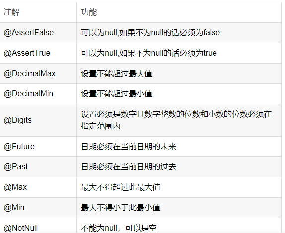
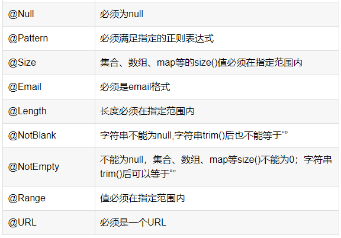

# Validation

## 数据校验

[csdn](https://blog.csdn.net/justry_deng/article/details/86571671?ops_request_misc=%257B%2522request%255Fid%2522%253A%2522165975534216782395336876%2522%252C%2522scm%2522%253A%252220140713.130102334.pc%255Fblog.%2522%257D&request_id=165975534216782395336876&biz_id=0&utm_medium=distribute.pc_search_result.none-task-blog-2~blog~first_rank_ecpm_v1~hot_rank-13-86571671-null-null.nonecase&utm_term=java%20%E6%95%B0%E6%8D%AE%E6%A0%A1%E9%AA%8C&spm=1018.2226.3001.4450)

## 说明

### 准备工作

~~~xml
        <dependency>
            <groupId>org.springframework.boot</groupId>
            <artifactId>spring-boot-starter-validation</artifactId>
        </dependency>
~~~

### 注解简单说明

注：此表格只是简单的对注解功能的说明，并没有对每一个注解的属性进行说明

### Validated 与 Valid

@Valid注解与@Validated注解功能大部分类似；两者的不同主要在于:

+ @Valid属于javax下的，
  + @Valid支持嵌套校验
  + @Valid不支持分组
+ @Validated属于spring下；、
  + 而@Validated不支持嵌套校验，
  + @Validated支持分组

## 案例

### 单独校验

~~~java
@RestController
@Validated
public class PingController {

    @GetMapping("/getUser")
    public String getUserStr(@NotNull(message = "name 不能为空") String name,
                             @Max(value = 99, message = "不能大于99岁") Integer age) {
        return "name: " + name + " ,age:" + age;
    }
}

~~~

### 实体类参数校验

~~~java
@Data
public class UserInfo {
    @NotNull(message = "username cannot be null")
    private String name;

    @NotNull(message = "sex cannot be null")
    private String sex;

    @Max(value = 99L)
    private Integer age;
}

~~~

~~~java
@PostMapping("/getUserInfo")
public String getUserInfo(@Validated @RequestBody UserInfo user) {
    return user.toString();
}
~~~

异常显示

~~~json
{
    "timestamp": "2022-08-11T02:52:32.035+0000",
    "status": 400,
    "error": "Bad Request",
    "errors": [
        {
            "codes": [
                "NotNull.userInfo.sex",
                "NotNull.sex",
                "NotNull.java.lang.String",
                "NotNull"
            ],
            "arguments": [
                {
                    "codes": [
                        "userInfo.sex",
                        "sex"
                    ],
                    "arguments": null,
                    "defaultMessage": "sex",
                    "code": "sex"
                }
            ],
            "defaultMessage": "sex cannot be null",
            "objectName": "userInfo",
            "field": "sex",
            "rejectedValue": null,
            "bindingFailure": false,
            "code": "NotNull"
        }
    ],
    "message": "Validation failed for object='userInfo'. Error count: 1",
    "path": "/getUserInfo"
}
~~~

### 参数分组校验

​		用同一个实体类去接收多个controller的参数，但是不同controller所需要的参数又有些许不同。比如有一个/setUser接口不需要id参数，而/getUser接口又需要该参数，这种时候就可以使用参数分组来实现。

不同的接口，针对同一种数据，进行不同的校验

+ 实体类

~~~java
package com.krest.validation.entity;

import com.krest.validation.group.GroupA;
import lombok.Data;

import javax.validation.constraints.Max;
import javax.validation.constraints.NotNull;

@Data
public class UserInfoGroup {
    @NotNull(groups = {GroupA.class}, message = "id cannot be null")
    private Integer id;

    @NotNull(message = "username cannot be null")
    private String name;

    @NotNull(message = "sex cannot be null")
    private String sex;

    @Max(value = 99L)
    private Integer age;
}

~~~

+ 调用接口

~~~java
    // 其中 Default 为 javax.validation.groups 中的类，
    // 表示参数类中其他没有分组的参数，
    // 如果没有，getUser接口的参数校验就只会有标记了GroupA的参数校验生效。
    @PostMapping("/getUserGroup")
    public String getUserStr(@RequestBody @Validated({GroupA.class, Default.class}) UserInfoGroup user) {
        return "name: " + user.getName() + ", age:" + user.getAge();
    }

    @PostMapping("/setUser")
    public String setUser(@RequestBody @Validated UserInfoGroup user) {
        return "name: " + user.getName() + ", age:" + user.getAge();
    }
~~~

### 级联校验

当参数bean中的属性又是一个复杂数据类型或者是一个集合的时候，如果需要对其进行进一步的校验.

+ 实体类

~~~java

@Data
public class UserInfo {
    @NotNull( groups = {GroupA.class}, message = "id cannot be null")
    private Integer id;

    @NotNull(message = "username cannot be null")
    private String name;
    
    //对UserInfo进一步校验 
    //这里只能使用@Valid，不能用 @Validated。但valid不支持分组校验，
    //想要支持分组校验可以使用自定义参数校验。
    @NotEmpty
    private List<@NotNull @Valid UserInfo> parents;
}
~~~

+ 调用接口

~~~java
    @PostMapping("/getUserGroup")
    public String getUserStr(@RequestBody @Validated({GroupA.class, Default.class}) UserInfoGroup user) {
        return "name: " + user.getName() + ", age:" + user.getAge();
    }

    @PostMapping("/setUser")
    public String setUser(@RequestBody @Validated UserInfoGroup user) {
        return "name: " + user.getName() + ", age:" + user.getAge();
    }
~~~

### 自定义参数校验

虽然JSR303和Hibernate Validtor 已经提供了很多校验注解，但是当面对复杂参数校验时，还是不能满足我们的要求，这时候我们就需要自定义校验注解。
举例：自定义一个List数组中不能含有null元素的注解。

自定义注解
message、groups、payload属性都需要定义在参数校验注解中不能缺省。

~~~java
@Target({ElementType.ANNOTATION_TYPE, ElementType.METHOD, ElementType.FIELD})
@Retention(RetentionPolicy.RUNTIME)
@Documented
//此处指定了注解的实现类为ListNotHasNullValidatorImpl
@Constraint(validatedBy = ListNotHasNullValidatorImpl.class)
public @interface ListNotHasNull {

    /**
     * 添加value属性，可以作为校验时的条件,若不需要，可去掉此处定义
     */
    int value() default 0;

    String message() default "List集合中不能含有null元素";

    Class<?>[] groups() default {};

    Class<? extends Payload>[] payload() default {};

    /**
     * 定义List，为了让Bean的一个属性上可以添加多套规则
     */
    @Target({METHOD, FIELD, ANNOTATION_TYPE, CONSTRUCTOR, PARAMETER})
    @Retention(RUNTIME)
    @Documented
    @interface List {
        ListNotHasNull[] value();
    }
}

~~~

~~~java
package com.krest.validation.anno;

import javax.validation.ConstraintValidator;
import javax.validation.ConstraintValidatorContext;
import java.util.List;

public class ListNotHasNullValidatorImpl implements ConstraintValidator<ListNotHasNull, List> {
    private int value;

    @Override
    public void initialize(ListNotHasNull constraintAnnotation) {
        //传入value 值，可以在校验中使用
        this.value = constraintAnnotation.value();
    }

    public boolean isValid(List list, ConstraintValidatorContext constraintValidatorContext) {
        for (Object object : list) {
            if (object == null) {
                //如果List集合中含有Null元素，校验失败
                return false;
            }
        }
        return true;
    }
}

~~~

### 统一异常捕获

如果有很多使用这种参数验证的controller方法，我们希望在一个地方对ConstraintViolationException异常进行统一处理，可以使用统一异常捕获，这需要借助@ControllerAdvice注解来实现，当然在springboot中我们就用@RestControllerAdvice（内部包含@ControllerAdvice和@ResponseBody的特性）

当参数校验异常的时候，该统一异常处理类在控制台打印信息的同时把bad request的字符串和HttpStatus.BAD_REQUEST所表示的状态码400返回给调用方（用@ResponseBody注解实现，表示该方法的返回结果直接写入HTTP response body 中）。其中：
~~~java
@ControllerAdvice：控制器增强，使@ExceptionHandler、@InitBinder、@ModelAttribute注解的方法应用到所有的 @RequestMapping注解的方法。
@ExceptionHandler：异常处理器，此注解的作用是当出现其定义的异常时进行处理的方法，此例中处理ValidationException异常。
~~~

### 校验模式

1. 普通模式（默认是这个模式）: 会校验完所有的属性，然后返回所有的验证失败信息
2. 快速失败模式: 只要有一个验证失败，则返回
   如果想要配置第二种模式，需要添加如下配置类：

~~~java
import org.hibernate.validator.HibernateValidator;
import org.springframework.context.annotation.Bean;
import org.springframework.context.annotation.Configuration;
import javax.validation.Validation;
import javax.validation.Validator;
import javax.validation.ValidatorFactory;

@Configuration
public class ValidatorConf {
    @Bean
    public Validator validator() {
        ValidatorFactory validatorFactory = Validation.byProvider( HibernateValidator.class )
                .configure()
                .failFast( true )
                .buildValidatorFactory();
        Validator validator = validatorFactory.getValidator();

        return validator;
    }
}
~~~

