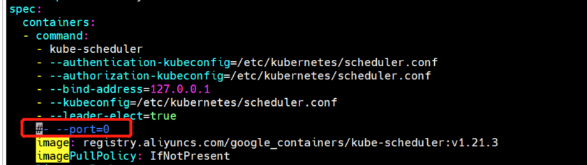
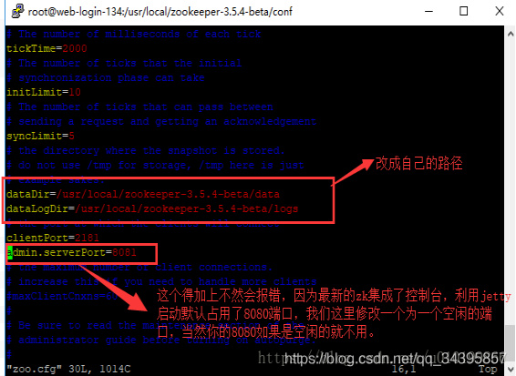
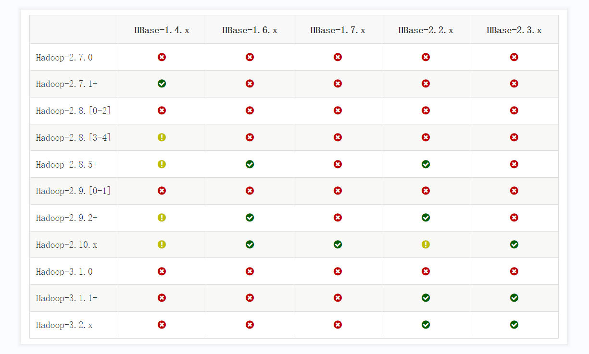
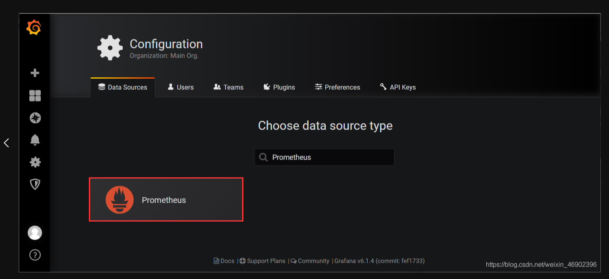
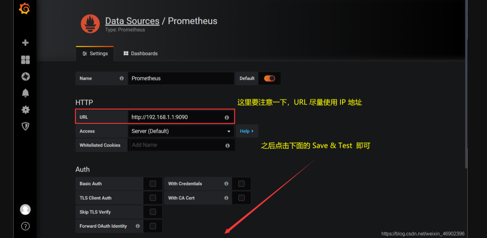
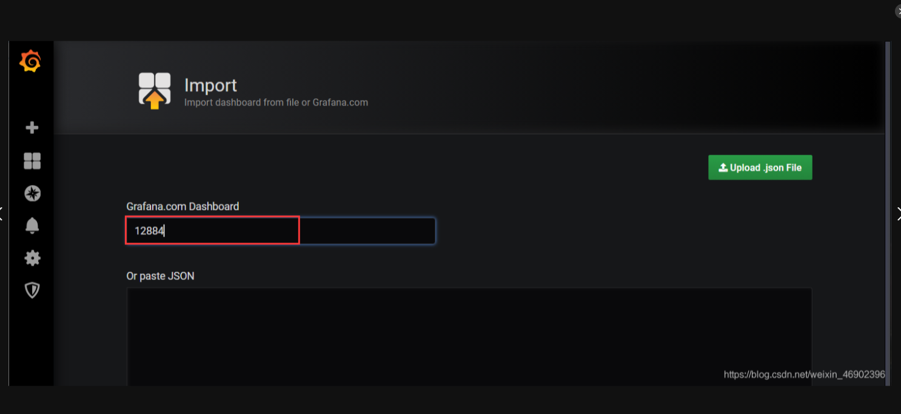
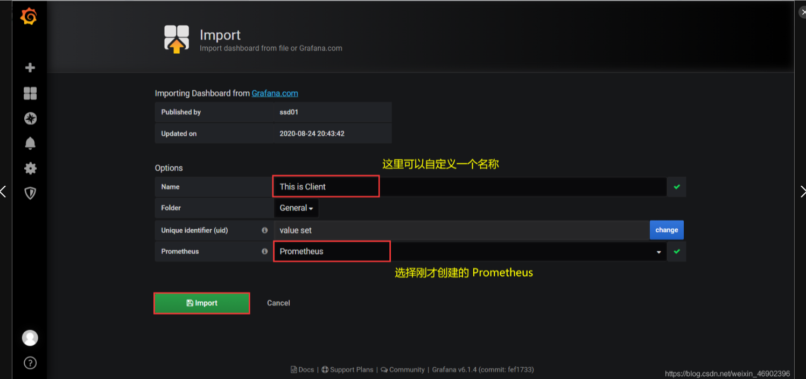
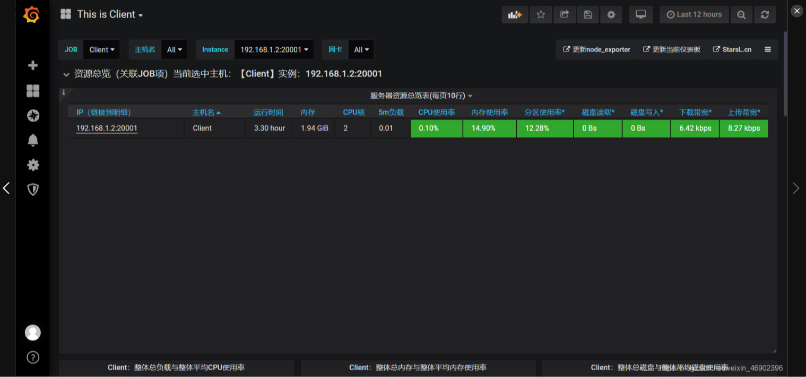
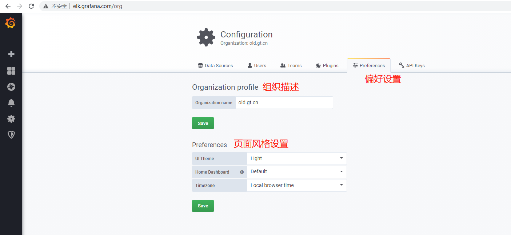

# 文件下载地址

+ [北京理工大学开源软件镜像服务](https://mirror.bit.edu.cn/web/)

# Github 加速

1. 打开网站 http://tool.chinaz.com/dns/，在A类型中填写`github.com`,再点击`监测按钮`
2. 复制下面任意一个`ip`
3. 打开电脑文件`C:\Windows\System32\drivers\etc`下的`host`文件
4. 在`host`文件的最后一刚加入刚才复制的IP

~~~bash
20.205.243.166         github.com
~~~

5.  `win+R` 打开`cmd `命窗口，执行命令`ipconfig/flushdns`

~~~bash
ipconfig/flushdns
~~~


# 服务器选择

+ CPU：如果是计算密集型，那么就需要选择高频的CPU
+ 内存
  + mysql innodb会将索引放在内存中，所以mysql也会比较吃内存

# 同步服务时间

~~~shell
# 开启时间同步。
yum install -y chrony
systemctl enable chronyd
systemctl start chronyd
timedatectl set-ntp true

# 设置时区
timedatectl set-timezone Asia/Shanghai
~~~


# 修改主机名

查看当前的主机名

~~~bash
[root@sxl133 Desktop]# hostname
sxl133
~~~

在命令行中输入

~~~bash
 hostnamectl set-hostname XXX
 XXX为你想更改的名字
~~~

最后关机重启即可

# 增加主机和IP的映射

~~~bash
vim /etc/hosts

192.168.160.161 k8s-1
192.168.160.162 k8s-2
192.168.160.163 k8s-3
~~~

这样局域网内就可以通过主机名互相访问了，当然局域网内的主机hosts文件都得添加映射关系


# 修改固定Ip

~~~bash
vi /etc/sysconfig/network-scripts/ifcfg-ens33 
~~~


配置，然后重新重启网路

~~~bash
IPADDR=192.168.160.171
NETMASK=255.255.255.0
GATEWAY=192.168.160.2
DNS1=8.8.8.8
BOOTPROTO=static

nmcli connection reload
nmcli connection up ens33
~~~


# 停止服务

~~~bash
 netstat -anp | grep 2181

 kill -9 进程号
~~~


# 防火墙

centOS6及以前版本使用命令：

~~~bash
systemctl stop iptables.service
~~~

centOS7关闭防火墙命令：

~~~bash
systemctl stop firewalld.service

#不过，关闭防火墙会导致服务器有一定风险，所以建议是单独开放服务端口：
firewall-cmd --zone=public --add-port=8089/tcp --permanent

#查询端口号8089 是否开启：
firewall-cmd --query-port=8089/tcp

#重启防火墙：
firewall-cmd --reload
# 查看firewall防火墙状态
systemctl status firewalld
# 查看firewall防火墙开放端口
firewall-cmd --list-ports
#禁止firewall开机启动 
systemctl disable firewalld.service

~~~


# Yum锁定

~~~bash
rm -f /var/run/yum.pid
yum clean all
~~~


# 删除软件

+ 查看Linux自带Java软件：rpm -qa | grep java
+ 查看安装的文件夹：rpm -qal | grep postgres
+ 逐个删除自带软件：rpm -e --nodeps  软件名称
+ 查找存在的文件夹 如： find / -name mysql 然后逐个删除

# xsync分发脚本

1. 在用的家目录/home/atguigu下创建bin文件夹

   ~~~bash
   [atguigu@hadoop102 ~]$ mkdir bin
   ~~~

2. 在/home/atguigu/bin目录下创建xsync文件，以便全局调用

   ~~~bash
   [atguigu@hadoop102 ~]$ cd /home/atguigu/bin
   [atguigu@hadoop102 ~]$ vim xsync
   ~~~

3. 在该文件中编写如下代码

   ~~~shell
   #!/bin/bash
   #1. 判断参数个数
   if [ $# -lt 1 ]
   then
     echo Not Enough Arguement!
     exit;
   fi
   #2. 遍历集群所有机器
   for host in mgr1 mgr2 mgr3 
   do
     echo ====================  $host  ====================
     #3. 遍历所有目录，挨个发送
     for file in $@
     do
       #4 判断文件是否存在
       if [ -e $file ]
       then
         #5. 获取父目录
         pdir=$(cd -P $(dirname $file); pwd)
         #6. 获取当前文件的名称
         fname=$(basename $file)
         ssh $host "mkdir -p $pdir"
         rsync -av $pdir/$fname $host:$pdir
       else
         echo $file does not exists!
       fi
     done
   done
   ~~~

4. 修改脚本xsync具有执行权限

   ~~~bash
   chmod +x xsync
   ~~~

5. 测试脚本

   ~~~bash
   [atguigu@hadoop102 bin]$ xsync xsync
   ~~~

6. 全局生效

   ~~~bin
   sudo cp /home/krest/bin/xsync /bin/xsync
   
   sudo ./bin/xsync /etc/profile.d/my_env.sh
   
   [atguigu@hadoop103 bin]$ source /etc/profile
   [atguigu@hadoop104 opt]$ source /etc/profile
   ~~~

   

~~~my_env.sh
vi /etc/profile.d/my_env.sh


export JAVA_HOME=/usr/local/software/jdk8
export PATH=$JAVA_HOME/bin:$PATH
export CLASSPATH=.:$JAVA_HOME/lib/dt.jar:$JAVA_HOME/lib/tools.jar
source /opt/rh/devtoolset-9/enable


export GOROOT=/usr/local/software/go
export GOPATH=/usr/local/software/data/go
export PATH=$PATH:$GOROOT/bin:$GOPATH
# 开启 Go moudles 特性
export GO111MODULE="on"
# 安装 Go 模块时，国内代理服务器设置
export GOPROXY=https://goproxy.cn,direct

export NODE_HOME=/usr/local/software/node14
export PATH=$PATH:$NODE_HOME/bin
export NODE_PATH=$NODE_HOME/lib/node_mudules
export PATH NODE_HOME NODE_PATH

export MAVEN_HOME=/usr/local/software/maven/
export PATH=${PATH}:${MAVEN_HOME}/bin
~~~


# SSH无密登录配置

说明：这里面只配置了hadoop102、hadoop103到其他主机的无密登录；因为hadoop102未外配置的是NameNode，hadoop103配置的是ResourceManager，都要求对其他节点无密访问。

1. hadoop102上生成公钥和私钥：

   ~~~bash
   [atguigu@hadoop102 .ssh]$ ssh-keygen -t rsa
   # 然后敲（三个回车），就会生成两个文件id_rsa（私钥）、id_rsa.pub（公钥）
   ~~~

2. 将hadoop102公钥拷贝到要免密登录的目标机器上

   ~~~bash
   ssh-copy-id mgr1
   ssh-copy-id mgr2
   ssh-copy-id mgr3
   ~~~

3. hadoop103上生成公钥和私钥：

   ~~~bash
   [atguigu@hadoop103 .ssh]$ ssh-keygen -t rsa
   # 然后敲（三个回车），就会生成两个文件id_rsa（私钥）、id_rsa.pub（公钥）
   ~~~

4. 将hadoop103公钥拷贝到要免密登录的目标机器上

   ~~~bash
   [atguigu@hadoop103 .ssh]$ ssh-copy-id hadoop102
   [atguigu@hadoop103 .ssh]$ ssh-copy-id hadoop103
   [atguigu@hadoop103 .ssh]$ ssh-copy-id hadoop104
   ~~~

# 设置开机启动

以`nginx`为例

+ 新建一个系统服务文件：

  ~~~bash
  cd /lib/systemd/system   //存放由操作系统管理的启动程序
  vim nginx.service     //创建一个nginx服务文件
  
  ~~~

+ 内容如下

  ~~~txt
  [Unit]
  Description=nginx
  After=network.target
  
  [Service]
  Type=forking
  ExecStart=/usr/local/nginx/sbin/nginx
  ExecReload=/usr/local/nginx/sbin/nginx -s reload
  ExecStop=/usr/local/nginx/sbin/nginx -s stop
  PrivateTmp=true
  
  [Install]
  WantedBy=multi-user.target
  ~~~

+ 重载系统服务

  ~~~bash
  # 重新加载配置
  systemctl daemon-reload
  ~~~

+ 设置开机启动

  ~~~bash
  systemctl [操作] nginx.service/nginx
  
  systemctl stop nginx        #停止
  systemctl restart nginx    #重启
  systemctl status nginx     #状态
  systemctl enable nginx     #允许开机自动启动
  systemctl disable nginx    #禁止开机自动启动(默认)
  ~~~


# 7z 使用

~~~bash
安装 yum install p7zip -y

解压7z：使用方法：7za x file.7z

解压出来就是文件夹.
~~~

## 查找指令

~~~shell
find / -name a* 查找根目录a开头的文件

find /etc/ -size +50k 查找etc下面文件大于50k的

find / -user lq 查找系统中属主(用户)为lq的内容

find / -type f 查找系统中的所有文本文件
~~~


# 集群脚本示例

## 集群服务启动

~~~bash
[atguigu@hadoop102 bin]$ vim lg.sh
~~~

~~~shell
#!/bin/bash
for i in hadoop102 hadoop103; do
    echo "========== $i =========="
    ssh $i "cd /opt/module/applog/; java -jar gmall2020.jar >/dev/null 2>&1 &"
done 
~~~

注：

1. /opt/module/applog/为jar包及配置文件所在路径
2. /dev/null代表Linux的空设备文件，所有往这个文件里面写入的内容都会丢失，俗称“黑洞”。
   1. 标准输入0：从键盘获得输入 /proc/self/fd/0 
   2. 标准输出1：输出到屏幕（即控制台） /proc/self/fd/1
   3. 错误输出2：输出到屏幕（即控制台） /proc/self/fd/2

~~~bash
[atguigu@hadoop102 bin]$ chmod 777 lg.sh
~~~

## 集群查看脚本

~~~bash
[atguigu@hadoop102 bin]$ chmod 777 lg.sh
~~~

~~~shell
#! /bin/bash
 
for i in mgr1 mgr2 mgr3
do
    echo --------- $i ----------
    ssh $i "$*"
done
~~~

~~~bash
[atguigu@hadoop102 bin]$ chmod 777 xcall
[atguigu@hadoop102 bin]$ xcall.sh jps


sudo cp /home/krest/bin/xcall /bin/xcsll

sudo ./bin/xsync /etc/profile.d/my_env.sh

[atguigu@hadoop103 bin]$ source /etc/profile
[atguigu@hadoop104 opt]$ source /etc/profile
~~~


# JDK

## 安装

+ java -version，查看当前是否有jdk版本

+ 查看Linux自带Java软件：rpm -qa | grep java

+ 逐个删除自带软件：rpm -e --nodeps  软件名称

+ 上传JDK安装包

+ 解压到对应的文件夹

+ 修改系统环境配置文件：vim /etc/profile

  ~~~bash
  export JAVA_HOME=/usr/local/software/jdk8
  export PATH=$JAVA_HOME/bin:$PATH
  export CLASSPATH=.:$JAVA_HOME/lib/dt.jar:$JAVA_HOME/lib/tools.jar
  ~~~

+ 使配置生效：source /etc/profile

# Python3 

## Linux安装

~~~bash
1.在机器上随便找一个目录,下载python插件
 
    wget https://www.python.org/ftp/python/3.7.0/Python-3.7.0.tgz(看是否能直接在机器上下载,不 
    可以的话就只能在window下载上传了)
 
2.解压压缩包
    
    tar -zxvf Python-3.7.0.tgz
 
3.进入目录
   
   cd Python-3.7.0
 
4.创建安装目录
 
    mkdir /usr/local/python3
 
5.安装到指定目录
 
    ./configure --prefix=/usr/local/python3 --enable-optimizations
    (--enable-optimizations 加了这个参数编译会比较久,这个是参数是性能优化相关)
 
6. 编译(这一步比较久,大概要20分钟)
 
   make && make install
 
7.成功后创建软连接即可全局使用python3了
 
  cd /usr/local/python3
  ln -s /usr/local/python3/bin/python3 /usr/bin/python
  ln -s /usr/local/python3/bin/pip3 /usr/bin/pip
  
 如果 /usr/bin/python  /usr/bin/pip 存在，就使用 rm 指令删除
 
8.可以查看pip和python的版本
 
  python -V 
  pip -V
~~~

## 相关异常

安装完python3.7版本之后,yum命令会报错(因为yum是用python2写的)


~~~bash
1.编辑这两个文件
 
  vim /usr/libexec/urlgrabber-ext-down
  vim /usr/bin/yum
 
2.编辑第一行(让yum命令指向python2版本就行)
  #!/usr/bin/python 改成 #!/usr/bin/python2.7
~~~


# Maven

## Linux 安装

下载

~~~bash
wget https://archive.apache.org/dist/maven/maven-3/3.3.9/binaries/apache-maven-3.3.9-bin.tar.gz
~~~

解压缩maven
~~~bash
tar -zxvf apache-maven-3.3.9-bin.tar.gz
~~~

添加环境变量

~~~bash
vim /etc/profile

export MAVEN_HOME=/usr/local/module/maven-3.3.9/
export PATH=${PATH}:${MAVEN_HOME}/bin

~~~

验证结果

~~~bash
mvn -version
~~~

本地仓库

~~~bash
mkdir -p /usr/local/module/data/mvnRepo
~~~

修改配置

~~~bash
vim /usr/local/maven/apache-maven-3.3.9/conf/settings.xml


<mirror>
  <id>aliyunmaven</id>
  <mirrorOf>*</mirrorOf>
  <name>阿里云公共仓库</name>
  <url>https://maven.aliyun.com/repository/public</url>
</mirror>
<mirror>
    <id>nexus-163</id>
    <mirrorOf>*</mirrorOf>
    <name>Nexus 163</name>
    <url>http://mirrors.163.com/maven/repository/maven-public/</url>
</mirror>
<mirror>
    <id>nexus-tencentyun</id>
    <mirrorOf>*</mirrorOf>
    <name>Nexus tencentyun</name>
    <url>http://mirrors.cloud.tencent.com/nexus/repository/maven-public/</url>
</mirror> 
<!-- java1.8版本 --> 
<profile>
      <id>jdk-1.8</id>
      <activation>
	    <activeByDefault>true</activeByDefault>
        <jdk>1.8</jdk>
      </activation>
      <properties>
        <maven.compiler.source>1.8</maven.compiler.source>
		<maven.compiler.target>1.8</maven.compiler.target>
		<maven.compiler.compilerVersion>1.8</maven.compiler.compilerVersion>
      </properties>
</profile>
~~~


# Golang

## 安装

下载 [网址](https://studygolang.com/dl)

~~~bash
wget https://dl.google.com/go/go1.20.7.linux-amd64.tar.gz
~~~

解压

~~~bash
tar -xzf go1.20.7.linux-amd64.tar.gz
~~~

配置环境

~~~bash
vi /etc/profile.d/my_env.sh

export GOROOT=/usr/local/software/go
export GOPATH=/usr/local/software/data/go
export PATH=$PATH:$GOROOT/bin:$GOPATH
# 开启 Go moudles 特性
export GO111MODULE="on"
# 安装 Go 模块时，国内代理服务器设置
export GOPROXY=https://goproxy.cn,direct 


source /etc/profile.d/my_env.sh
~~~


# GRPC

+ [官方文档](https://grpc.io/docs/languages/go/)

~~~
-- 生成 proto 实体类
protoc.exe --java_out="D:\test"  --proto_path=. testService.proto

--  生成rpc调用类
protoc.exe --plugin=protoc-gen-grpc-java=D:/Temp/protoc-gen-grpc-java-1.26.0-windows-x86_64.exe --grpc-java_out="D:/Temp" --proto_path="D:/Temp"  helloworld.proto
-- . 代表当前文件夹
protoc.exe --plugin=protoc-gen-grpc-java=protoc-gen-grpc-java.exe --grpc-java_out=. --proto_path=. helloworld.proto

-- go 生成Grpc 
go install google.golang.org/protobuf/cmd/protoc-gen-go@latest
go install google.golang.org/grpc/cmd/protoc-gen-go-grpc@latest
protoc --go_out=. --go-grpc_out=.  .\hello.proto
~~~

 注意  需要和 protoc-gen-grpc-java 的 版本保存一致

~~~xml
<dependency>
    <groupId>io.grpc</groupId>
    <artifactId>grpc-all</artifactId>
    <version>1.54.1</version>
</dependency>
~~~

~~~proto
syntax = "proto3";


option java_multiple_files = true;
// 为了实现不同语言之间的远程调用，需要go和java的包路径也保持一致 
option go_package="./";
package com.krest.grpc.proto;


message GrpcRequest {
  string msg=1;
}

message GrpcResponse {
  string returninfo = 1;
}

service grpcService {
  rpc greet(GrpcRequest) returns (GrpcResponse);
}
~~~


# Node.js

## 安装

下载

~~~bash
wget https://registry.npmmirror.com/-/binary/node/v14.18.1/node-v14.18.1-linux-x64.tar.xz

~~~

解压

~~~bash
tar -xvf node-v14.18.1-linux-x64.tar.xz

mv node-v14.18.1-linux-x64 node14
~~~


## 配置环境

~~~bash
vi /etc/profile.d/my_env.sh

export NODE_HOME=/usr/local/software/node14
export PATH=$PATH:$NODE_HOME/bin
export NODE_PATH=$NODE_HOME/lib/node_mudules
export PATH NODE_HOME NODE_PATH

source /etc/profile.d/my_env.sh
~~~


## 淘宝镜像

~~~bash
npm config set registry https://registry.npm.taobao.org

npm config get registry

npm install -g cnpm --registry=https://registry.npm.taobao.org

~~~


# Git

## 安装

+  yum -y install git 
+ git version

## 配置

配置用户名和用户邮件.(邮箱不一定要真实存在,一定保证要有的).

+ git config --global user.name "XXXX"
+ git config --global user.email  "XXXXXXXXXX@qq.com"  
+ git config --global user.password tianshan
+ git config --list (查看是否配置成功)


# PGSql-14

## 查看是否安装

~~~bash
rpm -qa | grep postgres    检查PostgreSQL 是否已经安装
rpm -qal | grep postgres   检查PostgreSQL 安装位置
~~~

## 安装

~~~bash
#Install the repository RPM: 下载资源文件
sudo dnf install -y https://download.postgresql.org/pub/repos/yum/reporpms/EL-8-x86_64/pgdg-redhat-repo-latest.noarch.rpm

#Disable the built-in PostgreSQL module: 去掉原有的数据库文件
sudo dnf -qy module disable postgresql

#Install PostgreSQL: 安装数据库
sudo dnf install -y postgresql14-server

#Optionally initialize the database and enable automatic start:
sudo /usr/pgsql-14/bin/postgresql-14-setup initdb
sudo systemctl enable postgresql-14
sudo systemctl start postgresql-14
~~~


# Mysql 单节点

## yum安装5.7

+ 下载 mysql的yum仓库文件包

  ~~~bash
  wget http://repo.mysql.com/yum/mysql-5.7-community/el/7/x86_64/mysql57-community-release-el7-10.noarch.rpm
  rpm -ivh mysql57-community-release-el7-10.noarch.rpm
  ~~~

+ 安裝Mysql

  ~~~bash
  sudo yum -y install mysql-community-server
  ~~~

+ 如果报错：MySQL 5.7 Community Server“ 的 GPG 密钥已安装，但是不适用于此软件包

  ~~~bash
  rpm --import https://repo.mysql.com/RPM-GPG-KEY-mysql-2022
  ~~~

+ .启动mysql

  ~~~bash
  systemctl enable mysqld
  systemctl start mysqld
  systemctl status mysqld
  ~~~

+ 查看密码

  ~~~bash
  cat /var/log/mysqld.log |grep password
  ~~~

  + 登陆 mysql -u root -p

+ 修改密码

  ~~~bash
  SET PASSWORD = PASSWORD('root');
  alter user 'root'@'localhost' identified by 'Bob.123456';
  FLUSH PRIVILEGES;                                 
  ~~~

+ 远程登陆

  ~~~bash
  use mysql;   #选择访问mysql库
  update user set host = '%' where user = 'root'; #使root能再任何host访问
  FLUSH PRIVILEGES;    #刷新
  ~~~

## yum 安装mysql8.0.33

~~~bash

wget https://repo.mysql.com//mysql80-community-release-el7-7.noarch.rpm
rpm -ivh mysql80-community-release-el7-7.noarch.rpm

yum -y install mysql mysql-server mysql-devel
或者
yum -y install mysql-server


systemctl daemon-reload
systemctl start mysqld.service
netstat -lnp|grep 3306
systemctl restart mysqld.service

 
// 重新加载
systemctl daemon-reload
// 启动
systemctl start mysqld.service
// 重启
systemctl restart mysqld.service
// 停止
systemctl stop mysqld.service
// 查看启动状态
systemctl status mysqld.service
// 加入开机启动
systemctl enable mysqld.service
// 取消开机启动
systemctl disable mysqld.service


# 查看临时密码
/var/log/mysqld.log

mysql -uroot -p
ALTER USER 'root'@'localhost' IDENTIFIED BY 'Bob.123456';
FLUSH PRIVILEGES;   
~~~


## 设置密码策略

由于MySQL密码策略，此密码必须足够复杂

~~~bash
mysql> set global validate_password_length=4;
mysql> set global validate_password_policy=0;

mysql> set password=password("000000");
mysql> use mysql;
mysql> update user set host="%" where user="root";
mysql> flush privileges;
mysql> quit;
~~~

# MGR 集群

## 条件准备：

1. 三台虚拟机
2. Mysql， 版本在5.7.17之上，但是推荐mysql的版本在8以上

## 准备工作：

1. 设置mysql的server uuid 避免一样
2. 添加 host 配置信息
3. 安装 mysql

~~~bash
修改mysql server uuid 
cd /var/lib/mysql/
vi auto.cnf 
然后进行修改
~~~

## 开始安装 mgr1

### 配置说明

~~~ini
开始搭建系统
vim /etc/my.cnf 
# 禁用密码校验
validate-password=OFF
# Group Replication
# 服务 ID
server_id=100 
# 全局事务
gtid_mode=ON
# 强制 GTID 的一致性
enforce_gtid_consistency=ON
# 将 master.info 元数据保存在系统表中
master_info_repository=TABLE
# 将 relay.info 元数据保存在系统表中
relay_log_info_repository=TABLE
# 禁用二进制日志事件校验
binlog_checksum=NONE
# 级联复制
log_slave_updates=ON
# 开启二进制日志记录
log_bin=binlog
# 以行的格式记录
binlog_format=ROW
# 使用哈希算法将其编码为散列
transaction_write_set_extraction=XXHASH64
# 加入的组名
loose-group_replication_group_name="ce9be252-2b71-11e6-b8f4-00212844f856"
# 不自动启用组复制集群
loose-group_replication_start_on_boot =OFF
# 以本机端口 33061 接受来自组中成员的传入连接
loose-group_replication_local_address='mgr3:33061'
# 组中成员访问表
loose-group_replication_group_seeds="mgr1:33061, mgr2:33061, mgr3:33061"
# 不启用引导组
loose-group_replication_bootstrap_group=OFF
# 設置Ip白名單
loose-group_replication_ip_whitelist='mgr1,mgr2,mgr3'
# 自动尝试连入集群的次数，
group_replication_autorejoin_tries=3
# 尝试间隔5s（group_replication_member_expel_timeout），如果设置为0，表示禁用尝试。
group_replication_member_expel_timeout=5
# 网络分区时，少数派状等待此时长后，状态变为Error，回滚pending事务
group_replication_unreachable_majority_timeout=5
~~~

### 配置信息

~~~ini
开始搭建系统
vim /etc/my.cnf 


validate-password=OFF
server_id=101
gtid_mode=ON
enforce_gtid_consistency=ON
master_info_repository=TABLE
relay_log_info_repository=TABLE
binlog_checksum=NONE
log_slave_updates=ON
log_bin=binlog
binlog_format=ROW
transaction_write_set_extraction=XXHASH64
loose-group_replication_group_name="ce9be252-2b71-11e6-b8f4-00212844f856"
loose-group_replication_start_on_boot =OFF
loose-group_replication_local_address="mgr1:33061"
loose-group_replication_group_seeds="mgr1:33061, mgr2:33061, mgr3:33061"
loose-group_replication_bootstrap_group=OFF
loose-group_replication_ip_whitelist='mgr1,mgr2,mgr3'
report_host=mgr1
report_port=3306
group_replication_unreachable_majority_timeout=5


# 需要在 Mysql8 以上才能使用
group_replication_autorejoin_tries=3
group_replication_member_expel_timeout=20
~~~

### 指令执行

~~~bash
# 重启Mysql, 每次修改配置文件都需要重启
systemctl restart mysqld
mysql -u root -pBob.123456
# 停掉日志记录
set SQL_LOG_BIN=0;
# 生成帐号
grant replication slave on *.* to repl@'%' identified by '123456';
flush privileges;

set SQL_LOG_BIN=1;  
# 生成组
change master to master_user='repl',master_password='123456' for channel 'group_replication_recovery'; 
# 安装插件
install PLUGIN group_replication SONAME 'group_replication.so';

show plugins;
# 开启组复制
set global group_replication_bootstrap_group=ON;
start group_replication;
set global group_replication_bootstrap_group=OFF;

# 查看组成员、組复制配置信息
select * from performance_schema.replication_group_members;
show variables like 'group_replication%';
~~~

## 开始安装Mgr2、Mgr3

### 配置说明

~~~ini
开始搭建系统
vim /etc/my.cnf 


validate-password=OFF
server_id=101
gtid_mode=ON
enforce_gtid_consistency=ON
master_info_repository=TABLE
relay_log_info_repository=TABLE
binlog_checksum=NONE
log_slave_updates=ON
log_bin=binlog
binlog_format=ROW
transaction_write_set_extraction=XXHASH64
loose-group_replication_group_name="ce9be252-2b71-11e6-b8f4-00212844f856"
loose-group_replication_start_on_boot =OFF
loose-group_replication_local_address="mgr2:33061"
loose-group_replication_group_seeds="mgr1:33061, mgr2:33061, mgr3:33061"
loose-group_replication_bootstrap_group=OFF
loose-group_replication_ip_whitelist='mgr1,mgr2,mgr3'
report_host=mgr2
report_port=3306


~~~

### 指令执行

~~~bash
重启 MySQL 服务
systemctl restart mysqld
用户授权
mysql -u root -pBob.123456
# 停掉日志记录
set SQL_LOG_BIN=0;
grant replication slave on *.* to repl@'%' identified by '123456';
flush privileges;
# 开启日志记录
set SQL_LOG_BIN=1; 
# 构建 group replication 集群
change master to master_user='repl',master_password='123456' for channel 'group_replication_recovery';
安装 group replication 插件
install PLUGIN group_replication SONAME 'group_replication.so';
 
把实例添加到之前的复制组
set global group_replication_allow_local_disjoint_gtids_join=ON;
start group_replication;

~~~

## 验证

~~~bash

系统查看
# 根据只读方式查看是否为主节点，从节点为只读模式
# read_only OFF 代表此节点为主节点
show variables like '%read_only'; 

验证高可用，停止插件，然后查看节点的只读状态
STOP GROUP_REPLICATION;
show variables like '%read_only';


数据验证
create database test;
use test;
create table t1 (id int primary key,name varchar(20));
insert into t1 values (1,'man');
select * from t1;
show binlog events;
~~~

## 扩展

~~~bash
扩展：扩展-multi-primary 多主模式
1. 该模式启用需设置两个参数
# 这个参数很好理解，就是关闭单 master 模式
group_replication_single_primary_mode=0
# 这个参数设置多主模式下各个节点严格一致性检查
group_replication_enforce_update_everywhere_checks=1
2. 默认启动的都是单 master 模式，其他节点都设置了 read_only、super_read_only 这两个参
数，需要修改这两个配置
3. 完成上面的配置后就可以执行多点写入了，多点写入会存在冲突检查，这耗损性能挺大的，官方建议采用网络分区功能，在程序端把相同的业务定位到同一节点，尽量减少冲突发生几率。由单主模式修改为多主模式方法

~~~

# ProxySql

## 说明

+ 1.XX版本在读负载均衡时可能存在问题，最好使用2.XX以上的版本
+ 该部署流程实现最起码需要存在2个以上的mysql节点，并且配置了MGR才可以

## 安装

~~~bin
//配置yum源
[root@xian ~]# cat <<EOF | tee /etc/yum.repos.d/proxysql.repo
[proxysql_repo]
name= ProxySQL
baseurl=http://repo.proxysql.com/ProxySQL/proxysql-2.0.x/centos/7
gpgcheck=1
gpgkey=http://repo.proxysql.com/ProxySQL/repo_pub_key
EOF
[proxysql_repo]
name= ProxySQL
baseurl=http://repo.proxysql.com/ProxySQL/proxysql-2.0.x/centos/7
gpgcheck=1
gpgkey=http://repo.proxysql.com/ProxySQL/repo_pub_key

[root@xian ~]# yum -y install proxysql
[root@xian ~]# systemctl start proxysql
[root@xian ~]# chkconfig proxysql on
Note: Forwarding request to 'systemctl enable proxysql.service'.
[root@xian ~]# ss -antl
State       Recv-Q Send-Q Local Address:Port               Peer Address:Port              
LISTEN      0      128     *:9000                *:*                  
LISTEN      0      128     *:6032                *:*                  
LISTEN      0      128     *:6033                *:*                  
LISTEN      0      128     *:6033                *:*                  
LISTEN      0      128     *:6033                *:*                  
LISTEN      0      128     *:6033                *:*                  
LISTEN      0      128     *:22                  *:*                  
LISTEN      0      100    127.0.0.1:25                  *:*                  
LISTEN      0      80     :::3306               :::*                  
LISTEN      0      128    :::22                 :::*                  
LISTEN      0      100       ::1:25                 :::*                  

~~~

当 ProxySQL 启动后，将监听两个端口：

admin管理接口，默认端口为6032。该端口用于查看、配置ProxySQL
接收SQL语句的接口，默认端口为6033，这个接口类似于MySQL的3306端口

ProxySQL 的 admin 管理接口是一个使用 MySQL 协议的接口，所以，可以直接使用 mysql 客户端、navicat 等工具去连接这个管理接口，其默认的用户名和密码均为 admin

例如，使用 mysql 客户端去连接 ProxySQL 的管理接口：

~~~bin
[root@xian ~]# mysql -uadmin -padmin -h127.0.0.1 -P6032
mysql: [Warning] Using a password on the command line interface can be insecure.
Welcome to the MySQL monitor.  Commands end with ; or \g.
Your MySQL connection id is 1
Server version: 5.5.30 (ProxySQL Admin Module)

Copyright (c) 2000, 2020, Oracle and/or its affiliates. All rights reserved.

Oracle is a registered trademark of Oracle Corporation and/or its
affiliates. Other names may be trademarks of their respective
owners.

Type 'help;' or '\h' for help. Type '\c' to clear the current input statement.

mysql> mysql> show databases;
+-----+---------------+-------------------------------------+
| seq | name          | file                                |
+-----+---------------+-------------------------------------+
| 0   | main          |                                     |
| 2   | disk          | /var/lib/proxysql/proxysql.db       |
| 3   | stats         |                                     |
| 4   | monitor       |                                     |
| 5   | stats_history | /var/lib/proxysql/proxysql_stats.db |
+-----+---------------+-------------------------------------+
5 rows in set (0.00 sec)
~~~

## 添加帐号

~~~bin
添加管理员帐户

mysql> select @@admin-admin_credentials;
+---------------------------+
| @@admin-admin_credentials |
+---------------------------+
| admin:admin               |
+---------------------------+
1 row in set (0.00 sec)

//设置管理员帐号myadmin,密码yei123!
mysql> set admin-admin_credentials='admin:admin;myadmin:yei123!';
Query OK, 1 row affected (0.00 sec)

mysql> select @@admin-admin_credentials;
+-----------------------------+
| @@admin-admin_credentials   |
+-----------------------------+
| admin:admin;myadmin:yei123! |
+-----------------------------+
1 row in set (0.00 sec)

mysql> load admin variables to runtime;
Query OK, 0 rows affected (0.00 sec)

mysql> save admin variables to disk;   
Query OK, 35 rows affected (0.00 sec)

修改后，就可以使用该用户名和密码连接管理接口

[root@xian ~]# mysql -u myadmin -p yei123! -hmgr1 -P6032
mysql: [Warning] Using a password on the command line interface can be insecure.
Welcome to the MySQL monitor.  Commands end with ; or \g.
Your MySQL connection id is 2
Server version: 5.5.30 (ProxySQL Admin Module)

Copyright (c) 2000, 2020, Oracle and/or its affiliates. All rights reserved.

Oracle is a registered trademark of Oracle Corporation and/or its
affiliates. Other names may be trademarks of their respective
owners.

Type 'help;' or '\h' for help. Type '\c' to clear the current input statement.

mysql>

所有的配置操作都是在修改main库中对应的表

mysql> select * from global_variables where variable_name='admin-admin_credentials'; 
+-------------------------+-----------------------------+
| variable_name           | variable_value              |
+-------------------------+-----------------------------+
| admin-admin_credentials | admin:admin;myadmin:yei123! |
+-------------------------+-----------------------------+
1 row in set (0.01 sec)

~~~

必须要区分admin管理接口的用户名和mysql_users中的用户名

admin管理接口的用户是连接到管理接口(默认端口6032)上用来管理、配置ProxySQL的
mysql_users表中的用户名是应用程序连接ProxySQL(默认端口6033)，以及ProxySQL连接后端MySQL Servers使用的用户。它的作用是发送、路由SQL语句，类似于MySQL Server的3306端口。所以，这个表中的用户必须已经在后端MySQL Server上存在且授权了
admin管理接口的用户必须不能存在于mysql_users中，这是出于安全的考虑，防止通过admin管理接口用户猜出mysql_users中的用户

## 启动

~~~bin
systemctl start proxysql
~~~

## 规划读写组

| 默认的写组 | 后备的写组 | 读组 | 离线组 |
| ---------- | ---------- | ---- | ------ |
| 10         | 20         | 30   | 40     |

## 配置ProxySQL

在MGR主节点执行下面SQL语句，创建视图提供给ProxySQL判断该节点状态

~~~sql
USE sys;

DELIMITER $$

CREATE FUNCTION IFZERO(a INT, b INT)
RETURNS INT
DETERMINISTIC
RETURN IF(a = 0, b, a)$$

CREATE FUNCTION LOCATE2(needle TEXT(10000), haystack TEXT(10000), offset INT)
RETURNS INT
DETERMINISTIC
RETURN IFZERO(LOCATE(needle, haystack, offset), LENGTH(haystack) + 1)$$

CREATE FUNCTION GTID_NORMALIZE(g TEXT(10000))
RETURNS TEXT(10000)
DETERMINISTIC
RETURN GTID_SUBTRACT(g, '')$$

CREATE FUNCTION GTID_COUNT(gtid_set TEXT(10000))
RETURNS INT
DETERMINISTIC
BEGIN
  DECLARE result BIGINT DEFAULT 0;
  DECLARE colon_pos INT;
  DECLARE next_dash_pos INT;
  DECLARE next_colon_pos INT;
  DECLARE next_comma_pos INT;
  SET gtid_set = GTID_NORMALIZE(gtid_set);
  SET colon_pos = LOCATE2(':', gtid_set, 1);
  WHILE colon_pos != LENGTH(gtid_set) + 1 DO
     SET next_dash_pos = LOCATE2('-', gtid_set, colon_pos + 1);
     SET next_colon_pos = LOCATE2(':', gtid_set, colon_pos + 1);
     SET next_comma_pos = LOCATE2(',', gtid_set, colon_pos + 1);
     IF next_dash_pos < next_colon_pos AND next_dash_pos < next_comma_pos THEN
       SET result = result +
         SUBSTR(gtid_set, next_dash_pos + 1,
                LEAST(next_colon_pos, next_comma_pos) - (next_dash_pos + 1)) -
         SUBSTR(gtid_set, colon_pos + 1, next_dash_pos - (colon_pos + 1)) + 1;
     ELSE
       SET result = result + 1;
     END IF;
     SET colon_pos = next_colon_pos;
  END WHILE;
  RETURN result;
END$$

CREATE FUNCTION gr_applier_queue_length()
RETURNS INT
DETERMINISTIC
BEGIN
  RETURN (SELECT sys.gtid_count( GTID_SUBTRACT( (SELECT
Received_transaction_set FROM performance_schema.replication_connection_status
WHERE Channel_name = 'group_replication_applier' ), (SELECT
@@global.GTID_EXECUTED) )));
END$$

CREATE FUNCTION gr_member_in_primary_partition()
RETURNS VARCHAR(3)
DETERMINISTIC
BEGIN
  RETURN (SELECT IF( MEMBER_STATE='ONLINE' AND ((SELECT COUNT(*) FROM
performance_schema.replication_group_members WHERE MEMBER_STATE != 'ONLINE') >=
((SELECT COUNT(*) FROM performance_schema.replication_group_members)/2) = 0),
'YES', 'NO' ) FROM performance_schema.replication_group_members JOIN
performance_schema.replication_group_member_stats USING(member_id));
END$$

CREATE VIEW gr_member_routing_candidate_status AS SELECT
sys.gr_member_in_primary_partition() as viable_candidate,
IF( (SELECT (SELECT GROUP_CONCAT(variable_value) FROM
performance_schema.global_variables WHERE variable_name IN ('read_only',
'super_read_only')) != 'OFF,OFF'), 'YES', 'NO') as read_only,
sys.gr_applier_queue_length() as transactions_behind, Count_Transactions_in_queue as 'transactions_to_cert' from performance_schema.replication_group_member_stats;$$

DELIMITER ;
~~~


到各个节点检查视图是否创建成功

~~~sql
mysql> SELECT * FROM sys.gr_member_routing_candidate_status;
+------------------+-----------+---------------------+----------------------+
| viable_candidate | read_only | transactions_behind | transactions_to_cert |
+------------------+-----------+---------------------+----------------------+
| YES              | NO        |                   0 |                    0 |
+------------------+-----------+---------------------+----------------------+
1 row in set (0.00 sec)
~~~


在MGR主节点执行下面SQL语句,创建监控用户用于ProxySQL监控数据库状态

~~~sql
create user 'monitor'@'%' identified by 'monitor';
grant select on sys.* to 'monitor'@'%';
~~~


在MGR主节点创建用户，用于ProxySQL访问

~~~sql
create user 'proxysql'@'%' identified by 'proxysql';
grant all on *.* to 'proxysql'@'%';
~~~


在ProxySQL节点，连接ProxySQL的Admin管理接口

~~~sql
mysql -uadmin -padmin --prompt='proxysql> ' -P6032 -h127.0.0.1
~~~


在mysql_servers添加后端节点

~~~sql
insert into mysql_servers(hostgroup_id,hostname,port,weight,max_connections,max_replication_lag,comment) values (10,'192.168.160.128',3306,1,3000,10,'mgr_node1');
insert into mysql_servers(hostgroup_id,hostname,port,weight,max_connections,max_replication_lag,comment) values (10,'192.168.160.146',3306,1,3000,10,'mgr_node2');
insert into mysql_servers(hostgroup_id,hostname,port,weight,max_connections,max_replication_lag,comment) values (10,'192.168.160.147',3306,1,3000,10,'mgr_node3');

select * from mysql_servers;
~~~

~~~sql
# 将mysql_servers表加载到runtime
LOAD mysql users TO RUNTIME;
LOAD mysql servers TO RUNTIME;
# 将mysql_servers表保存到磁盘
SAVE mysql servers TO DISK;
~~~

~~~sql
# 设置监控用户账户密码
proxysql> set mysql-monitor_username='monitor';
proxysql> set mysql-monitor_password='monitor';
# 加载到runtime
proxysql> LOAD mysql variables TO RUNTIME;
# 保存到磁盘中
proxysql> SAVE mysql variables TO DISK;
~~~

~~~sql
#设置提供访问 mgr集群 的用户
insert into mysql_users(username,password,active,default_hostgroup,transaction_persistent)values('proxysql','proxysql',1,10,1);
select * from mysql_users;
# 加载到runtime
load mysql users to runtime;
# 保存到磁盘中
save mysql users to disk;
~~~

~~~sql
# 配置mysql_group_replication_hostgroups表
insert into mysql_group_replication_hostgroups(writer_hostgroup,backup_writer_hostgroup,reader_hostgroup,offline_hostgroup,active,max_writers,writer_is_also_reader,max_transactions_behind)  values(10,20,30,40,1,1,0,0);
select * from mysql_group_replication_hostgroups;

# 加载到runtime
load mysql servers to runtime;
# 保存到磁盘中
save mysql servers to disk;
~~~


~~~sql
# 设置读写分离规则
insert into mysql_query_rules(rule_id,active,match_digest,destination_hostgroup,apply)values(1,1,'^SELECT.*FOR UPDATE$',10,1);
insert into mysql_query_rules(rule_id,active,match_digest,destination_hostgroup,apply)values(2,1,'^SELECT',30,1);
select * from mysql_query_rules;

proxysql> load mysql query rules to runtime;
proxysql> save mysql query rules to disk;
~~~


## 查看相关状态
### 查看后端节点健康状态

~~~sql
proxysql>  SELECT * FROM monitor.mysql_server_connect_log ORDER BY time_start_us DESC LIMIT 10 ;
proxysql>  SELECT * FROM monitor.mysql_server_ping_log ORDER BY time_start_us DESC LIMIT 10;

# 查看MGR配置
proxysql> select * from mysql_group_replication_hostgroups\G
*************************** 1. row ***************************
       writer_hostgroup: 10  # 写组
backup_writer_hostgroup: 20  # 后备写组
       reader_hostgroup: 30  # 读组
      offline_hostgroup: 40  # 下线组
                 active: 1   # 是否启用
            max_writers: 1   # 最多的写节点个数
  writer_is_also_reader: 0   # 决定一个节点升级为写节点(放进writer_hostgroup)后是否仍然保留在reader_hostgroup组中提供读服务。如果mgr多主模式需要设置为1
max_transactions_behind: 0   #  该字段决定最多延后写节点多少个事务
                comment: NULL # 注释
1 row in set (0.00 sec)

# 查看MGR相关的监控指标
MySQL [(none)]> select * from mysql_server_group_replication_log desc limit 10;

proxysql> select * from mysql_server_group_replication_log group by hostname;
+-----------------+------+------------------+-----------------+------------------+-----------+---------------------+-------+
| hostname        | port | time_start_us    | success_time_us | viable_candidate | read_only | transactions_behind | error |
+-----------------+------+------------------+-----------------+------------------+-----------+---------------------+-------+
| 192.168.160.128 | 3306 | 1683597644641467 | 2550            | YES              | NO        | 0                   | NULL  |
| 192.168.160.146 | 3306 | 1683597644642388 | 3956            | YES              | YES       | 0                   | NULL  |
| 192.168.160.147 | 3306 | 1683597644642843 | 2472            | YES              | YES       | 0                   | NULL  |
+-----------------+------+------------------+-----------------+------------------+-----------+---------------------+-------+
3 rows in set (0.00 sec)
~~~


## 测试

### 测试读场景

~~~sql
[root@localhost ~]> for i in `seq 1 10`; do mysql -uproxysql -pproxysql -hmgr1 -P6033 -e 'select * from performance_schema.global_variables where variable_name="server_id";' ; done  | grep server
mysql: [Warning] Using a password on the command line interface can be insecure.
server_id       53
mysql: [Warning] Using a password on the command line interface can be insecure.
server_id       53
mysql: [Warning] Using a password on the command line interface can be insecure.
server_id       52
mysql: [Warning] Using a password on the command line interface can be insecure.
server_id       53
mysql: [Warning] Using a password on the command line interface can be insecure.
server_id       52
mysql: [Warning] Using a password on the command line interface can be insecure.
server_id       52
mysql: [Warning] Using a password on the command line interface can be insecure.
server_id       52
mysql: [Warning] Using a password on the command line interface can be insecure.
server_id       52
mysql: [Warning] Using a password on the command line interface can be insecure.
server_id       53
mysql: [Warning] Using a password on the command line interface can be insecure.
server_id       52
~~~


可以看到读组默认都到了52和53上

### 测试写场景

~~~sql
[root@localhost ~]# for i in `seq 1 10`; do mysql -uproxysql -pproxysql -h192.168.240.54 -P6033 -e 'select * from performance_schema.global_variables where variable_name="server_id" for update;' ; done  | grep server
mysql: [Warning] Using a password on the command line interface can be insecure.
server_id       51
mysql: [Warning] Using a password on the command line interface can be insecure.
server_id       51
mysql: [Warning] Using a password on the command line interface can be insecure.
server_id       51
mysql: [Warning] Using a password on the command line interface can be insecure.
server_id       51
mysql: [Warning] Using a password on the command line interface can be insecure.
server_id       51
mysql: [Warning] Using a password on the command line interface can be insecure.
server_id       51
mysql: [Warning] Using a password on the command line interface can be insecure.
server_id       51
mysql: [Warning] Using a password on the command line interface can be insecure.
server_id       51
mysql: [Warning] Using a password on the command line interface can be insecure.
server_id       51
mysql: [Warning] Using a password on the command line interface can be insecure.
server_id       51

~~~

for update请求都到了51节点上


### 测试插入

因为只有主可写，所以只要正常插入没问题，则表示插入操作自动路由到写节点

~~~sql
[root@localhost ~]# for i in `seq 1 10`; do mysql -uproxysql -pproxysql -h192.168.240.54 -P6033 -e "insert into mgr_test.t values($i)" ; done
mysql: [Warning] Using a password on the command line interface can be insecure.
mysql: [Warning] Using a password on the command line interface can be insecure.
mysql: [Warning] Using a password on the command line interface can be insecure.
mysql: [Warning] Using a password on the command line interface can be insecure.
mysql: [Warning] Using a password on the command line interface can be insecure.
mysql: [Warning] Using a password on the command line interface can be insecure.
mysql: [Warning] Using a password on the command line interface can be insecure.
mysql: [Warning] Using a password on the command line interface can be insecure.
mysql: [Warning] Using a password on the command line interface can be insecure.
mysql: [Warning] Using a password on the command line interface can be insecure.
~~~


进入数据库从节点查看表

~~~sql
mysql> select * from mgr_test.t;
+----+
| id |
+----+
|  1 |
|  2 |
|  3 |
|  4 |
|  5 |
|  6 |
|  7 |
|  8 |
|  9 |
| 10 |
+----+

10 rows in set (0.00 sec)
~~~


### 测试MGR故障转移

~~~sql
down掉主节点

mysqladmin  shutdown
1
执行写入操作

[root@localhost ~]# for i in `seq 11 20`; do mysql -uproxysql -pproxysql -h192.168.240.54 -P6033 -e "insert into mgr_test.t values($i)" ; done
mysql: [Warning] Using a password on the command line interface can be insecure.
mysql: [Warning] Using a password on the command line interface can be insecure.
mysql: [Warning] Using a password on the command line interface can be insecure.
mysql: [Warning] Using a password on the command line interface can be insecure.
mysql: [Warning] Using a password on the command line interface can be insecure.
mysql: [Warning] Using a password on the command line interface can be insecure.
mysql: [Warning] Using a password on the command line interface can be insecure.
mysql: [Warning] Using a password on the command line interface can be insecure.
mysql: [Warning] Using a password on the command line interface can be insecure.
mysql: [Warning] Using a password on the command line interface can be insecure.

能正常继续写入,进入ProxySQL管理节点查看节点状态

[root@localhost ~]# mysql -uadmin -padmin -P6032 -h127.0.0.1 -e "select hostgroup_id, hostname, port,status from runtime_mysql_servers;"
+--------------+----------------+------+---------+
| hostgroup_id | hostname       | port | status  |
+--------------+----------------+------+---------+
| 10           | 192.168.240.53 | 3306 | ONLINE  |
| 30           | 192.168.240.52 | 3306 | ONLINE  |
| 20           | 192.168.240.51 | 3306 | SHUNNED |
+--------------+----------------+------+---------+
可以看到51节点已经状态为SHUNNED，被避开了

现在启动51节点的MySQL
mysqld --daemonize

进入51节点数据库中启动组复制
stop group_replication;
CHANGE MASTER TO MASTER_USER='rpl_user', MASTER_PASSWORD='Hal@123' FOR CHANNEL 'group_replication_recovery';
start group_replication;
再次查看组成员状态

[root@localhost ~]# mysql -uadmin -padmin -P6032 -h127.0.0.1 -e "select hostgroup_id, hostname, port,status from runtime_mysql_servers;"
+--------------+----------------+------+--------+
| hostgroup_id | hostname       | port | status |
+--------------+----------------+------+--------+
| 10           | 192.168.240.53 | 3306 | ONLINE |
| 30           | 192.168.240.51 | 3306 | ONLINE |
| 30           | 192.168.240.52 | 3306 | ONLINE |
+--------------+----------------+------+--------+

可以看到已经自动上线了
~~~

## 远程链接方式

~~~sql
6033 可操作MGR数据库的帐号和密码
~~~


# Mysql-Router

## 概述

+ 可以事项故障迁移 和 读写分离的负载均衡
+ 但是针对MGR的单主模式支持不是很好，不能够将写库重新加入到服务列表当中

## 下载安装

~~~bash
wget https://dev.mysql.com/get/Downloads/MySQL-Router/mysql-router-8.0.11-linux-glibc2.12-x86-64bit.tar.gz
tar -zxvf mysql-router-8.0.11-linux-glibc2.12-x86-64bit.tar.gz
cp -rf mysql-router-2.1.4-linux-glibc2.12-x86-64bit /usr/local/mysql-router 
mkdir /usr/local/mysql-router/conf/
~~~


## 配置文件

~~~ini
[DEFAULT]
logging_folder=/usr/local/mysql-router/log
runtime_folder=/usr/local/mysql-router/run
data_folder=/usr/local/mysql-router/data
connect_timeout=30
read_timeout=30

[logger]
level=INFO

[routing:failover]
bind_address=0.0.0.0
bind_port=7001
max_connections=1024
mode=read-write
# 可用的支持写操作的主库，或者主库共用的VIP
destinations=mgr1:3306,mgr2:3306,mgr3:3306
routing_strategy=first-available


# 读写分离配置
[routing:balancing] 
bind_address=0.0.0.0
# 端口7002 
bind_port=7002
max_connections=1024 
mode=read-only
destinations=mgr1:3306,mgr2:3306,mgr3:3306
~~~


## 环境变量

~~~bash
改一下环境变量：

echo "export PATH=$PATH:/usr/local/mysql-router/bin/" >> /etc/profile
source /etc/profile

验证安装配置是否成功：
mysqlrouter -V
MySQL Router v8.0.11 on Linux (64-bit) (GPL community edition)

chown -R mysql: /usr/local/mysql-router

~~~

## 启动

~~~bash
/usr/local/mysql-router/bin/mysqlrouter -c /usr/local/mysql-router/conf/mysqlrouter.ini &
netstat -ntpl|grep mysqlrouter
# 可以看到7001和7002端口已经被使用；

[root@mgr1 conf]# netstat -ntpl|grep mysqlrouter
tcp        0      0 0.0.0.0:7001            0.0.0.0:*               LISTEN      38133/mysqlrouter   
tcp        0      0 0.0.0.0:7002            0.0.0.0:*               LISTEN      38133/mysqlrouter   
[2]+  退出 1                /usr/local/mysql-router/bin/mysqlrouter -c /usr/local/mysql-router/conf/mysqlrouter.ini
~~~


## 测试

~~~bash
 mysql -uroot -pBob.123456 -h mgr1 -P 7001 -e "select * from performance_schema.replication_group_members\G"
 mysql -uroot -pBob.123456 -hmgr1 -P 7001 -e "INSERT INTO mgr_test.t (id) VALUES('27');"

先测试写端口7001：
mysql -uroot -pBob.123456 -hmgr1 -P 7001 -e "select @@hostname"
mgr1，因为写的话read-write里面的两个主机，首先访问第一个，只有第一个故障才会访问第二个；

再测试读：
mysql -uroot -pBob.123456 -hmgr1 -P 7002 -e "select @@hostname"
轮询显示mgr1和mgr2。

fail-over测试,
从库failover：重新拉起后可以自动加入轮询；
mgr2上执行pkill mysql 
mysql -umonitor -pmonitor -h 192.168.1.99 -P 7002 -e "select @@hostname"
只得到mgr3
重启mgr2上的mysql再次执行
mysql -umonitor -pmonitor -h 192.168.1.99 -P 7002 -e "select @@hostname"可轮询。

主库failover
mgr1上pkill mysql
mysql -umonitor -pmonitor -h 192.168.1.99 -P 7001 -e "select @@hostname"
得到mgr2，但是如果执行：
mysql -umonitor -pmonitor -h 192.168.1.99 -P 7001 -e "create database xxxx"
就会报错：The MySQL server is running with the --super-read-only option so it cannot execute this statement
说明备份主库不能是read-only，否则主库切换之后会报错，MGR单主模式不行。
~~~


## 官方配置文件

~~~ini
[DEFAULT]
logging_folder=/opt/routers/myrouter/log
runtime_folder=/opt/routers/myrouter/run
data_folder=/opt/routers/myrouter/data
keyring_path=/opt/routers/router/data/keyring
master_key_path=/opt/routers/myrouter/mysqlrouter.key
connect_timeout=30
read_timeout=30

[logger]
level = INFO

[metadata_cache:mycluster]
router_id=5
bootstrap_server_addresses=mysql://localhost:3310,mysql://localhost:3320,mysql://localhost:3330
user=mysql_router5_6owf3spq1c6n
metadata_cluster=mycluster
ttl=5

[routing:mycluster_default_rw]
bind_address=0.0.0.0
bind_port=6446
destinations=metadata-cache://mycluster/default?role=PRIMARY
routing_strategy=round-robin
protocol=classic

[routing:mycluster_default_ro]
bind_address=0.0.0.0
bind_port=6447
destinations=metadata-cache://mycluster/default?role=SECONDARY
routing_strategy=round-robin
protocol=classic

[routing:mycluster_default_x_rw]
bind_address=0.0.0.0
bind_port=64460
destinations=metadata-cache://mycluster/default?role=PRIMARY
routing_strategy=round-robin
protocol=x

[routing:mycluster_default_x_ro]
bind_address=0.0.0.0
bind_port=64470
destinations=metadata-cache://mycluster/default?role=SECONDARY
routing_strategy=round-robin
protocol=x
~~~


# Sharding Proxy(5.0.0)

## 安装

1. 下载sharding proxy从官网，如果是链接Mysql，同样需要下载Mysql驱动
2. 文件解压后，路径名会太长导致报错，所以要修改文件夹
3. 删除start.bat/start.sh中的JVM配置，因为如果保留，会报错

## 配置

### server.yml

~~~yml
rules:
  - !AUTHORITY
    users:
      - root@%:root
      - sharding@:sharding
    provider:
      type: ALL_PRIVILEGES_PERMITTED
#  - !TRANSACTION
#    defaultType: XA
#    providerType: Atomikos

props:
  max-connections-size-per-query: 1
  kernel-executor-size: 16
  proxy-frontend-flush-threshold: 128
  proxy-opentracing-enabled: false
  proxy-hint-enabled: false
  sql-show: true
  check-table-metadata-enabled: false
  show-process-list-enabled: false
#    # Proxy backend query fetch size. A larger value may increase the memory usage of ShardingSphere Proxy.
#    # The default value is -1, which means set the minimum value for different JDBC drivers.
  proxy-backend-query-fetch-size: -1
  check-duplicate-table-enabled: false
  sql-comment-parse-enabled: false
#  proxy-frontend-executor-size: 0 # Proxy frontend executor size. The default value is 0, which means let Netty decide.
#    # Available options of proxy backend executor suitable: OLAP(default), OLTP. The OLTP option may reduce time cost of writing packets to client, but it may increase the latency of SQL execution
#    # if client connections are more than proxy-frontend-netty-executor-size, especially executing slow SQL.
#  proxy-backend-executor-suitable: OLAP
#  proxy-frontend-max-connections: 0 # Less than or equal to 0 means no limitation.
  sql-federation-enabled: false

~~~

### conifg-sharding.yml

~~~yml

schemaName: sharding_db2
dataSources:
  ds_0:
    url: jdbc:mysql://192.168.160.151:3306/ds0?serverTimezone=GMT%2B8&allowPublicKeyRetrieval=true&useSSL=true
    username: root
    password: Bob.123456
    connectionTimeoutMilliseconds: 30000
    idleTimeoutMilliseconds: 60000
    maxLifetimeMilliseconds: 1800000
    maxPoolSize: 50
    minPoolSize: 1
  ds_1:
    url: jdbc:mysql://192.168.160.151:3306/ds1?serverTimezone=GMT%2B8&allowPublicKeyRetrieval=true&useSSL=true
    username: root
    password: Bob.123456
    connectionTimeoutMilliseconds: 30000
    idleTimeoutMilliseconds: 60000
    maxLifetimeMilliseconds: 1800000
    maxPoolSize: 50
    minPoolSize: 1
rules:
- !SHARDING
  tables:
    t_order:
      actualDataNodes: ds_${0..1}.t_order
      databaseStrategy:
        standard:
          shardingColumn: order_id
          shardingAlgorithmName: t_order_inline
      keyGenerateStrategy:
        column: order_id
        keyGeneratorName: snowflake
    t_order_item:
      actualDataNodes: ds_${0..1}.t_order_item
      # 分库分表采用同一个字段，保证了可以进行 join 查询
      databaseStrategy:
        standard:
          shardingColumn: order_id
          shardingAlgorithmName: t_order_inline
      keyGenerateStrategy:
        column: order_item_id
        keyGeneratorName: snowflake
  shardingAlgorithms:
    # 分库的字段计算规则
    database_inline:
      type: INLINE
      props:
        algorithm-expression: ds_${user_id % 2}
    t_order_inline:
      type: INLINE
      props:
        algorithm-expression: ds_${order_id % 2}
    t_order_item_inline:
      type: INLINE
      props:
        algorithm-expression: ds_${order_item_id % 2}
  keyGenerators:
    snowflake:
      type: SNOWFLAKE
      props:
        worker-id: 123
~~~


## 启动

~~~shell
# 启动端口位置
start.bat 3366
~~~


# MongDB

## 安装

~~~bash

[bigdata@linux ~]$ wget https://fastdl.mongodb.org/linux/mongodb-linux-x86_64-rhel62-3.4.3.tgz
#  将压缩包解压到指定目录
[bigdata@linux backup]$ tar -xf mongodb-linux-x86_64-rhel62-3.4.3.tgz -C ~/
# 将解压后的文件移动到最终的安装目录
[bigdata@linux ~]$ mv mongodb-linux-x86_64-rhel62-3.4.3/ /usr/local/mongodb
#  在安装目录下创建data文件夹用于存放数据和日志
[bigdata@linux mongodb]$ mkdir /usr/local/module/mongodb/data/
#  在data文件夹下创建db文件夹，用于存放数据
[bigdata@linux mongodb]$ mkdir /usr/local/module/mongodb/data/db/
# 在data文件夹下创建logs文件夹，用于存放日志
[bigdata@linux mongodb]$ mkdir /usr/local/module/mongodb/data/logs/
# 在logs文件夹下创建log文件
[bigdata@linux mongodb]$ touch /usr/local/module/mongodb/data/logs/ mongodb.log
#  在data文件夹下创建mongodb.conf配置文件
[bigdata@linux mongodb]$ touch /usr/local/module/mongodb/data/mongodb.conf
# 在mongodb.conf文件中输入如下内容
[bigdata@linux mongodb]$ vim ./data/mongodb.conf

#数据库路径
dbpath=/usr/local/module/mongodb/data/db/

#日志输出文件路径
logpath=/usr/local/module/mongodb/data/logs/mongodb.log

#错误日志采用追加模式
logappend=true

#启用日志文件，默认启用
journal=true

#这个选项可以过滤掉一些无用的日志信息，若需要调试使用请设置为false
quiet=true

#端口号 默认为27017
port=27017

#允许远程访问
bind_ip=0.0.0.0

#开启子进程
fork=true

#开启认证，必选先添加用户，先不开启（不用验证账号密码）
#auth=true
~~~

## 启动

~~~bash
 启动MongoDB服务器
[bigdata@linux mongodb]$ sudo /usr/local/module/mongodb/bin/mongod -config /usr/local/module/mongodb/data/mongodb.conf
// 访问MongoDB服务器
[bigdata@linux mongodb]$ /usr/local/module/mongodb/bin/mongo
// 停止MongoDB服务器
[bigdata@linux mongodb]$ sudo /usr/local/module/mongodb/bin/mongod -shutdown -config /usr/local/module/mongodb/data/mongodb.conf
~~~


## 用户管理

~~~bash
# 创建超级管理员用户
use admin
db.createUser({user:'admin',pwd:'admin123', roles:[{role:'root', db:'admin'}]}) 
# 创建用户管理员账户（能查询其他库集合，但不能查询集合内容
use admin
db.createUser({user:'admin',pwd:'admin123', roles:[{role:'userAdminAnyDatabase', db:'admin'}]}) 
# 创建访问任意库读写的账户
use admin
db.createUser({user:'admin',pwd:'admin123', roles:[{role:'readWriteAnyDatabase', db:'admin'}]}) 
# 创建用于备份时的用户，如若是恢复权限，则将backup换为restore即可
use admin
db.createUser({user:'admin',pwd:'admin123', roles:[{role:'backup',db:'admin'}]}) 
# 创建只对test库有读写权限的用户
use test
db.createUser({user:'admin',pwd:'admin123', roles:[{role:'readWrite',db:'test'}]}) 
# 更新用户角色，修改用户权限，不会覆盖原权限信息，只新增权限：
use test
db.updateUser("admin",{roles:[{role:"readWrite",db:"admin"}]})
# 更新用户密码
use test
db.changeUserPassword("admin","admin123456")
# 删除用户
use test
db.dropUser({'admin'}) 
# 查看所有用户
use test
show users

# 获取数据库认证
use admin
db.auth("admin", "admin123")
db.auth("krest", "Bob.131452")
~~~

示例

~~~bash
创建管理员权限
mongo 
use admin
db.createUser({ user: "root", pwd: "root", roles: [{ role: "root", db: "admin" }] })            #创建管理员用户
db.auth("root", "root") 如果返回1，则表示成功。
exit
修改mongo配置
sudo vi /etc/mongod.conf 修改为#security:为security: authorization: enabled 
systemctl  restart mongo

创建数据库用户，拥有有读写权限
mongo -u root -p root
use test
db.createUser({user:'admin',pwd:'admin123', roles:[{role:'readWrite',db:'test'}]}) 
exit

验证数据库
mongo
use test
db.auth("admin","admin123")
db.test.insert({"m":"2"})
db.test.find({})

~~~


## 基本操作

~~~bash
// 1.数据库的切换：use  数据库名
use my_test
// 2.创建集合：db.集合名.insert({_id:'1001'})  --- 在向集合中插入文档时就已经创建了集合
db.admin.insert({
   _id:'1005',
     userName: '鲁肃',
     password: '123456',
     address: '镇江'
})
db.student.insert({
   _id:'s101',
     sname: '张三',
     ssex: '男',
     sage: 21
})
// 3.查询集合：db.集合名.find({})  --- 若find不带参数表示查询所有文档
db.admin.find()
// 4. 统计集合中文档的数量 ：db.集合名.find().count()
db.admin.find().count()
// 5.更新集合中的文档：db.集合名.update({条件},{$set:{key:value}})
db.admin.update({_id:'1004'},{$set:{password:'aaaa'}})
// 6. 删除属性(key)：db.集合名.update({条件},{$unset:{key:value}}
db.admin.update({_id:'1003'},{$unset:{address:'南京'}})
// 7. 增加属性：db.集合名.update({条件},{$set:{key:value}}
db.admin.update({_id:'1003'},{$set:{hobby:['下棋','骑马','KTV']}})
// 8. 删除文档：db.集合名.remove({条件})
db.admin.remove({_id:'1005'})
db.student.find()
//9. 删除集合：db.集合名.drop()


//创建一个数组：保存若干对象
var arr = []
for(let i=1;i<=2000;i++)
{
    arr.push({
             _id:'100'+i,
             title: 'A0'+i,
             num: i
        })
}
//将数组arr中的元素插入到集合numbers中
db.numbers.insert(arr)
db.numbers.find()
// 10. 查询numbers集合中num值等于500的文档(记录)
db.numbers.find({num:500})
// 11. 查询numbers集合中num值大于500的文档
db.numbers.find({num:{$gt:500}})
// 12. 查询numbers集合中num值小于500的文档
db.numbers.find({num:{$lt:500}})
// 13. 查询numbers集合中num值小于40,小于50的文档
db.numbers.find({num:{$gt:40,$lt:50}})
//14. 用limit设置显示数据的上限
db.numbers.find().limit(15)  //表示最多显示15条记录
//15. 分页显示：skip(index)---进行定位
db.numbers.find().skip(0).limit(10)  //从索引为0的记录开始连续显示10条记录
db.numbers.find().skip(10).limit(10)
db.numbers.find().skip(20).limit(10)
~~~


# ES

## 修改配置文件

~~~bash
vi config/elasticsearch.yml 
~~~

~~~yml
# 设置跨域
http.cors.enabled: true
http.cors.allow-origin: "*"
# 端口
http.port: 9200
# 设置外网访问
network.host: 0.0.0.0
network.bind_host: 172.27.27.82
# 设置集群名称
cluster.name: elasticsearch
~~~


## 启动指令

~~~bash
# 前台启动
./bin/elasticsearch

# 后台启动
./bin/elasticsearch -d
~~~


## 常见启动错误

**第一种：**

~~~bash
max virtual memory areas vm.max_map_count [65530] likely too low, increase to at least [262144]
~~~

~~~bash
原因：最大虚拟内存太小
解决方案：
切换到root用户下，修改配置文件sysctl.conf
vi /etc/sysctl.conf
添加下面配置：
vm.max_map_count=655360
并执行命令：
sysctl -p
~~~

**第二种**

~~~bash
 ERROR: bootstrap checks failed：max file descriptors [4096] for elasticsearch process likely too low, increase to at least [65536]
~~~

~~~bash
原因：无法创建本地文件问题,用户最大可创建文件数太小
解决方案：
切换到root用户，编辑limits.conf配置文件， 添加类似如下内容：
vi /etc/security/limits.conf
添加如下内容：
* soft nofile 65536
* hard nofile 131072
* soft nproc 2048
* hard nproc 4096
备注：* 代表Linux所有用户名称(比如hadoop)
保存、退出、重新系统 登录才可生效
~~~


**第三种**

~~~bash
ERROR: bootstrap checks failed   system call filters failed to install; check the logs and fix your configuration or disable 
system call filters at your own risk 
~~~

~~~bash
原因：因为Centos6不支持SecComp，而ES5.2.1默认bootstrap.system_call_filter为true进行检测，所以导致检测失败，失败后直接导致ES不能启动。
详见 ：https://github.com/elastic/elasticsearch/issues/22899
解决方案：在elasticsearch.yml中配置bootstrap.system_call_filter为false，注意要在Memory下面
bootstrap.memory_lock: false
bootstrap.system_call_filter: false
~~~

**第四种**

~~~bash
Caused by: java.lang.IllegalStateException: Failed to create node environment
~~~

~~~bash
 
1.Failed to create node environment
2.Caused by: java.nio.file.AccessDeniedException:Caused by: java.nio.file.AccessDeniedException: /usr/share/elasticsearch/data/nodes/0
 
需要说明如果是在实体运行就需要把对应的文件夹加上权限
如果是通过docker容器 需要把对应的容器卷加上权限 否则es无法创建node
chmod 777 需要将 /usr/share/elasticsearch/data/nodes 
~~~

**第五种**

~~~bash
can not run elasticsearch as root
~~~

~~~bash
1、创建用户：elsearch
[root@iZbp1bb2egi7w0ueys548pZ bin]# adduser elsearch
2、创建用户密码，需要输入两次（可以不添加密码，直接执行余下步骤）
[root@iZbp1bb2egi7w0ueys548pZ bin]# passwd elsearch
3、将对应的文件夹权限赋给该用户
[root@iZbp1bb2egi7w0ueys548pZ local]# chown -R elsearch elasticsearch-6.0.0
4、切换至elasticsearch用户
[root@iZbp1bb2egi7w0ueys548pZ etc]# su elsearch
5、进入启动目录启动 /usr/local/elasticsearch-6.0.0/bin  使用后台启动方式：./elasticsearch -d
[elasticsearch@vmt10003 bin]$ ./elasticsearch -d
6、启动后测试
输入curl ip:9200,如果返回一个json数据说明启动成功
~~~

# ES-head-master

## 修改配置

修改Gruntfile.js（根目录下）

~~~js
connect: {
			server: {
				options: {
					hostname:'*',
					port: 9100,
					base: '.',
					keepalive: true
				}
			}
		}
~~~

修改_site目录下的app.js

~~~bash
this.base_uri = this.config.base_uri || this.prefs.get("app-base_uri") || "http://192.168.148.133:9200";
#将原来的localhost改为服务器ip
~~~

### 启动

~~~bash
npm run start
~~~

# Redis

## 安装

+ 生成文件夹

  ~~~bash
  mkdir redis
  ~~~

+ Redis 是基于 C语言编写的，所有还需要安装 Redis 所需要的 `gcc` 依赖：

  ~~~bash
  yum install -y  tcl
  yum install -y  cpp
  yum install -y binutils
  yum install -y  glibc
  yum install -y  glibc-kernheaders
  yum install -y  glibc-common
  yum install -y  glibc-devel
  yum install -y  gcc
  yum install -y  make
  yum -y install centos-release-scl
  yum -y install devtoolset-9-gcc devtoolset-9-gcc-c++ devtoolset-9-binutils
   
  scl enable devtoolset-9 bash
  ~~~

+ 上传Redis安装包

+ 解压

  ~~~bash
   tar -zxvf redis-6.0.9.tar.gz
  ~~~

+ 运行编译命令：make

## 修改配置文件

+ cp redis.conf redis.conf.bck

+ vi redis.conf

  ~~~conf
  # 监听地址，默认是 127.0.0.1，会导致只能在本地访问。修改成 0.0.0.0 则可以在任意 IP 访问，生产环境不要设置 0.0.0.0
  bind 0.0.0.0
  # 守护进程，修改为 yes 后即可后台运行
  daemonize yes
  # 密码，设置后访问 redis 必须输入密码
  requirepass Bob.131452
  # 监听端口
  port 16379
  # 工作目录，默认是当前目录，也就是运行 redis-server 时的命令，日志、持久化等文件会保存在这个目录
  dir .
  # 数据库数量，设置为1，代表只使用1个库，默认有16个库，编号0~15
  databases 1
  # 设置 redis 能够使用的最大内存
  maxmemory 256mb
  # 日志文件，默认为空，不记录日志，可以指定日志文件名
  logfile "redis.log"
  
  ~~~

+ RDB 配置

  ~~~
  # 时间策略：当满足每900s/300s/60s内至少1/10/10000次写操作，则会触发bgsave命令进行持久化，三个策略中只需要满足其中任何一条即可持久化
  save 900 1
  save 300 10
  save 60 10000
  # 文件名称
  dbfilename dump.rdb
  # 文件保存路径
  dir /home/redis/data/
  # 如果持久化出错，主进程是否停止写入：是为了保证数据的一致性，工作进程（子进程）持久化出错后，主进程停止写入请求
  stop-writes-on-bgsave-error yes
  # 是否压缩
  rdbcompression yes
  # 导入时是否检查
  rdbchecksum yes
  ~~~

+ AOF 配置

  ~~~bash
  # 是否开启aof
  appendonly yes
  # 文件名称
  appendfilename "appendonly.aof"
  # 同步方式
  appendfsync everysec
   
  # aof重写操作是否同步，yes则不进行同步，no则同步
  no-appendfsync-on-rewrite no
   
  # 重写触发配置
  auto-aof-rewrite-percentage 100 # 当前AOF文件大小是上次日志重写时的AOF文件大小两倍时，发生BGREWRITEAOF操作。
  auto-aof-rewrite-min-size 64mb # 当前AOF文件执行BGREWRITEAOF命令的最小值，避免刚开始启动Reids时由于文件尺寸较小导致频繁的BGREWRITEAOF。
   
  # 加载aof时如果有错如何处理，忽略最后一条可能存在问题的指令
  aof-load-truncated yes
  # Redis4.0新增RDB-AOF混合持久化格式。
  aof-use-rdb-preamble no
  ~~~

  


## 启动

+ 指令

  ~~~bash
   ./usr/local/moudle/redis/src/redis-server /usr/local/moudle/redis/redis.conf
  ~~~

+ 查看 redis 是否后台运行成功

  ~~~bash
  ps -ef | grep redis
  ~~~

## 设置开机启动

+ 新建一个系统服务文件：

  ~~~bash
  vi /etc/systemd/system/redis.service
  ~~~

+ 内容如下

  ~~~txt
  [Unit]
  Description=redis-server
  After=network.target
  
  [Service]
  Type=forking
  ExecStart=/usr/local/module/redis/src/redis-server /usr/local/module/redis/redis.conf
  PrivateTmp=true
  
  [Install]
  WantedBy=multi-user.target
  ~~~

+ 重载系统服务

  ~~~bash
  systemctl daemon-reload
  ~~~

+ 设置开机启动

  ~~~bash
  systemctl enable redis
  ~~~

+ 控制 Redis 服务

  ~~~bash
  systemctl start redis
  systemctl status redis
  systemctl stop redis
  systemctl restart redis
  ~~~


# NFS

~~~bash
## 安装nfs-server
# 在每个机器。
yum install -y nfs-utils


# 在master 执行以下命令 
echo "/nfs/data/ *(insecure,rw,sync,no_root_squash)" > /etc/exports

# 执行以下命令，启动 nfs 服务;创建共享目录
mkdir -p /nfs/data

# 在master执行
systemctl enable rpcbind
systemctl enable nfs-server
systemctl start rpcbind
systemctl start nfs-server
# 使配置生效
exportfs -r
#检查配置是否生效
exportfs


# 在客户端执行
# 客户端不需要开启NFS服务，因为不共享目录。
systemctl enable rpcbind
systemctl restart rpcbind 

showmount -e 192.168.160.161
mkdir -p /nfs/data
mount -t nfs 192.168.160.161:/nfs/data /nfs/data


# 但当系统重启时候，挂载会消失。
# 如果需要永久挂载，可以添加如下内容到 /etc/fstab 文件中，但是如此的话，只能在主节点写入文件, rw是读写模式，ro是只读模式
vi /etc/fstab
# device                                   mountpoint             fs-type     options      dump   fsckorder
192.168.160.161:/nfs/data  /nfs/data    nfs          rw              0         0


~~~


# GlusterFS

## 安装

### 环境安装

~~~bash
# 三台服务 k8s-1 k8s-2 k8s-3

# 通过命令查询gfs可安装的版本
yum search centos-release-gluster

# 下载所要安装版本的yum源 
yum -y install centos-release-gluster9

# 安装 server
 yum -y install glusterfs-server 

# 开启和查看gfs服务
systemctl enable glusterd
systemctl start glusterd
systemctl status glusterd

# 安装后检查服务状况
glusterfs -V
# 查看端口
netstat  -lntup | grep gluster
# 查看进程
ps -ef | grep gluster


# 配置文件检查
md5sum /etc/glusterfs/glusterd.vol 

# 查看节点状态
gluster peer status


~~~

### 配置信任池

~~~bash
# 在gfsserver1服务器上配置信任主机池，其他服务器不用操作，集群配置自动同步，注意不用加gfserver1的节点，执行以下命令：
gluster peer probe k8s-2
gluster peer probe k8s-3

# 移除信任节点
gluster peer detach HOSTNAME
~~~


### 创建卷

~~~bash
mkdir -p /data/br1
# 创建复制卷，有三种类型分布式卷、复制卷、条带卷
gluster volume create volume_name replica 3 k8s-1:/data/br1 k8s-2:/data/br1 k8s-3:/data/br1 force
# volume create: volume_name: success: please start the volume to access data

# 查看复制卷的信息
gluster volume info volume_name 

# 输出信息 
Volume Name: volume_name
Type: Replicate
Volume ID: 91a0c64a-bdef-4091-adef-e73d35584228
Status: Created
Snapshot Count: 0
Number of Bricks: 1 x 3 = 3
Transport-type: tcp
Bricks:
Brick1: k8s-1:/data/br1
Brick2: k8s-2:/data/br1
Brick3: k8s-3:/data/br1
Options Reconfigured:
cluster.granular-entry-heal: on
storage.fips-mode-rchecksum: on
transport.address-family: inet
nfs.disable: on
performance.client-io-threads: off


# 启动复制卷(启动复制卷后，即可进行挂载)
gluster volume start volume_name

gluster volume info volume_name 
# 输出信息
Volume Name: volume_name
Type: Replicate
Volume ID: 91a0c64a-bdef-4091-adef-e73d35584228
Status: Started
Snapshot Count: 0
Number of Bricks: 1 x 3 = 3
Transport-type: tcp
Bricks:
Brick1: k8s-1:/data/br1
Brick2: k8s-2:/data/br1
Brick3: k8s-3:/data/br1
Options Reconfigured:
cluster.granular-entry-heal: on
storage.fips-mode-rchecksum: on
transport.address-family: inet
nfs.disable: on
performance.client-io-threads: off


# 列出所有的卷
gluster volume list

gluster volume status all	
~~~


### 调优（可不执行）

~~~bash
# 开启 指定 volume 的配额
$ gluster volume quota k8s-volume enable

# 限制 指定 volume 的配额
$ gluster volume quota k8s-volume limit-usage / 1TB

# 设置 cache 大小, 默认32MB
$ gluster volume set k8s-volume performance.cache-size 4GB

# 设置 io 线程, 太大会导致进程崩溃
$ gluster volume set k8s-volume performance.io-thread-count 16

# 设置 网络检测时间, 默认42s
$ gluster volume set k8s-volume network.ping-timeout 10

# 设置 写缓冲区的大小, 默认1M
$ gluster volume set k8s-volume performance.write-behind-window-size 1024MB
~~~


## 异常处理

### 节点disconnected

~~~bash
# 问题
[root@k8s-2 ~]# gluster peer status 
Number of Peers: 1

Hostname: 192.168.160.154
Uuid: 6d43d64c-99dc-4281-a7d1-4d44708ede36
State: Peer in Cluster (Disconnected)
Other names:
k8s-3
[root@k8s-2 ~]# rm -rf /var/lib/glusterd/peers/6d43d64c-99dc-4281-a7d1-4d44708ede36
[root@k8s-2 ~]# gluster peer status 
Number of Peers: 1

Hostname: 192.168.160.154
Uuid: 6d43d64c-99dc-4281-a7d1-4d44708ede36
State: Peer in Cluster (Disconnected)
Other names:
k8s-3

# 处理节点的配置文件，然后重启
 rm -rf /var/lib/glusterd/peers/f9824e5f-191a-4e3e-afe4-f48d976e9ab9
 systemctl restart glusterd
~~~


## 卸载

~~~bash
yum remove -y centos-release-gluster glusterfs-server 
~~~


# Heketi

[参考](https://blog.csdn.net/weixin_45692576/article/details/122063551?ops_request_misc=%257B%2522request%255Fid%2522%253A%2522168550569916782427467886%2522%252C%2522scm%2522%253A%252220140713.130102334..%2522%257D&request_id=168550569916782427467886&biz_id=0&utm_medium=distribute.pc_search_result.none-task-blog-2~all~sobaiduend~default-1-122063551-null-null.142^v88^control_2,239^v2^insert_chatgpt&utm_term=kubesphere%20heketi&spm=1018.2226.3001.4187)

实现[k8s](https://so.csdn.net/so/search?q=k8s&spm=1001.2101.3001.7020)动态供给glusterfs存储需要用到Heketi 服务

在k8s官方文档中写到，要使用glusterfs作为后端动态供给存储，在存储类中要配置heketi的接口，并不是直接配置glusterfs的，所以我们需要安装Heketi 服务。Heketi 服务的安装方式分为3种，OpenShift集群安装、Standalone独立单机安装、Kubernetes安装 ，我们采用Standalone独立单机安装方式。

## 安装

~~~bash
# 在线yum安装heketi服务端和客户端工具，heketi 也是在glusterfs源里面的，如果没有glusterfs源,参考上面的配置glusterfs的yum源
yum install  heketi heketi-client
~~~

## 创建heketi用户并配置免密登录

创建免密登录的用户，因为官网要求heketi主机要能免密登录到glusterfs的主机上，这里我不在创建一个heketi用户，直接使用root用户，如果是非root用户，需要有sudo权限。

~~~bash

#建议使用root用户做免密登录
ssh-keygen -t rsa
ssh-copy-id -i ~/.ssh/id_rsa.pub root@192.168.160.152
ssh-copy-id -i ~/.ssh/id_rsa.pub root@192.168.160.153
ssh-copy-id -i ~/.ssh/id_rsa.pub root@192.168.160.154

~~~

### 修改配置文件

~~~bash
vim /etc/heketi/heketi.json
~~~

~~~json
{
  "_port_comment": "Heketi Server Port Number",
  "port": "7080",      #Heketi服务端口，默认是8080，可以自定义

  "_use_auth": "Enable JWT authorization. Please enable for deployment",
  "use_auth": true,   true,	#是否使用JWT authorization，设置为true

  "_jwt": "Private keys for access",
  "jwt": {
    "_admin": "Admin has access to all APIs",
    "admin": {
      "key": "bob.123456"     #配置admin的密码
    },
    "_user": "User only has access to /volumes endpoint",
    "user": {
      "key": "bob.123456"     #配置普通账号的密码
    }
  },

  "_glusterfs_comment": "GlusterFS Configuration",
  "glusterfs": {
    "_executor_comment": [
      "Execute plugin. Possible choices: mock, ssh",
      "mock: This setting is used for testing and development.",
      "      It will not send commands to any node.",
      "ssh:  This setting will notify Heketi to ssh to the nodes.",
      "      It will need the values in sshexec to be configured.",
      "kubernetes: Communicate with GlusterFS containers over",
      "            Kubernetes exec api."
    ],
    "executor": "ssh",    #命令执行器配置为ssh

    "_sshexec_comment": "SSH username and private key file information",
    "sshexec": {              #命令执行器为ssh方式，改下面这段
      "keyfile": "/root/.ssh/id_rsa",      #ssh的密钥
      "user": "root",           #ssh的用户，我使用的是root用户            
      "port": "22",             #ssh的端口     
      "fstab": "/etc/fstab"     #存储挂载点的fstab文件，保持默认即可
    },

    "_kubeexec_comment": "Kubernetes configuration",
    "kubeexec": {         #命令执行器没有用到kubernetes，不用改
      "host" :"https://kubernetes.host:8443",
      "cert" : "/path/to/crt.file",
      "insecure": false,
      "user": "kubernetes username",
      "password": "password for kubernetes user",
      "namespace": "OpenShift project or Kubernetes namespace",
      "fstab": "Optional: Specify fstab file on node.  Default is /etc/fstab"
    },

    "_db_comment": "Database file name",
    "db": "/var/lib/heketi/heketi.db",  #heketi数据库文件，保持默认

    "_loglevel_comment": [
      "Set log level. Choices are:",
      "  none, critical, error, warning, info, debug",
      "Default is warning"
    ],
    "loglevel" : "warning"             #定义日志几级别
  }
}

~~~

### 启动heketi服务

~~~bash
vim /usr/lib/systemd/system/heketi.service
User=root	#改为root

systemctl daemon-reload 
systemctl start  heketi
systemctl enable heketi
systemctl status heketi

# 测试
curl http://192.168.160.152:7080/hello
Hello from Heketi

~~~

### 配置hekeit-cli客户端工具的环境变量

~~~bash
#永久设置环境变量
echo 'export HEKETI_CLI_SERVER=http://192.168.160.152:7080' >> ~/.bash_profile	
echo 'export HEKETI_CLI_USER=admin'  >> ~/.bash_profile							
echo 'export HEKETI_CLI_KEY=bob.123456'  >> ~/.bash_profile		

#立即生效
source  ~/.bash_profile															

~~~

### 集群

#### 指令设置

~~~bash
##集群显示信息
heketi-cli --user admin --secret bob.123456 --server http://192.168.160.152:7080 cluster list

##集群建立
heketi-cli --user admin --secret 123456 --server http://192.168.56.101:8080 --json  cluster create

[root@localhost ~]# heketi-cli --user admin --secret 123456 --server http://192.168.56.101:8080 --json  cluster create
{"id":"2bfe06768a30c3e464065a86494f663a","nodes":[],"volumes":[],"block":true,"file":true,"blockvolumes":[]}

##节点加入
heketi-cli --user admin --secret 123456 --server http://192.168.56.101:8080 --json node add --cluster "2bfe06768a30c3e464065a86494f663a" --management-host-name 192.168.56.101  --storage-host-name 192.168.56.101  --zone 1 
heketi-cli --user admin --secret 123456 --server http://192.168.56.101:8080 --json node add --cluster "2bfe06768a30c3e464065a86494f663a" --management-host-name 192.168.56.102  --storage-host-name 192.168.56.102  --zone 1 
heketi-cli --user admin --secret 123456 --server http://192.168.56.101:8080 --json node add --cluster "2bfe06768a30c3e464065a86494f663a" --management-host-name 192.168.56.103  --storage-host-name 192.168.56.103  --zone 1 

##节点加入后查看
heketi-cli --user admin --secret bob.123456 --server http://192.168.160.152:7080 node list

[root@localhost ~]# heketi-cli --user admin --secret 123456 --server http://192.168.160.152:7080 node list
Id:3128158ceb40e97d51a23fbe3e652bcf     Cluster:1b56e0fcb89e80705840bdfe5e863535
Id:3e6c3bc3c079015e239bfdf2f3b03726     Cluster:1b56e0fcb89e80705840bdfe5e863535
Id:6df7f798e29c049b40e03f9c20d4eb19     Cluster:1b56e0fcb89e80705840bdfe5e863535

##磁盘设备加入
heketi-cli --user admin --secret 123456 --server http://192.168.56.101:8080 device add --name "/dev/sdb" --node 3128158ceb40e97d51a23fbe3e652bcf --destroy-existing-data
heketi-cli --user admin --secret 123456 --server http://192.168.56.101:8080 device add --name "/dev/sdb" --node 3e6c3bc3c079015e239bfdf2f3b03726 --destroy-existing-data
heketi-cli --user admin --secret 123456 --server http://192.168.56.101:8080 device add --name "/dev/sdb" --node 6df7f798e29c049b40e03f9c20d4eb19 --destroy-existing-data

##集群信息查看
heketi-cli --user admin --secret bob.123456 --server http://192.168.160.152:7080 topology info

##删除磁盘设备
要先device disable,然后device remove然后device delete

##删除集群（需要先删除磁盘）
heketi-cli --user admin --secret bob.123456 --server http://192.168.160.152:7080 --json  cluster delete 2bfe06768a30c3e464065a86494f663a

~~~

####  topology文件

官网说必须向Heketi提供关于系统拓扑结构的信息。这允许Heketi决定使用哪些节点、磁盘和集群。

  可以使用命令行客户端创建一个集群，然后向该集群添加节点，然后向每个节点添加磁盘。如果使用命令行，这个过程可能相当乏味。因此，命令行客户端支持使用拓扑文件将这些信息加载到Heketi，该拓扑文件描述集群、集群节点和每个节点上的磁盘信息。

  编写topology文件，这个拓扑文件是一个JSON格式的文件，描述要添加到Heketi的集群、节点和磁盘 [官网示例](https://github.com/heketi/heketi/blob/master/client/cli/go/topology-sample.json)

vi topology.json

~~~json
{
    "clusters": [
        {
            "nodes": [
                {
                    "node": {
                        "hostnames": {
                            "manage": [
                                "192.168.160.152"
                            ],
                            "storage": [
                                "192.168.160.152"
                            ]
                        },
                        "zone": 1
                    },
                    "devices": [
                        "/dev/sdb"
                    ]
                },
                {
                    "node": {
                        "hostnames": {
                            "manage": [
                                "192.168.160.153"
                            ],
                            "storage": [
                                "192.168.160.153"
                            ]
                        },
                        "zone": 1
                    },
                    "devices": [
                        "/dev/sdb"
                    ]
                },
                {
                    "node": {
                        "hostnames": {
                            "manage": [
                                "192.168.160.154"
                            ],
                            "storage": [
                                "192.168.160.154"
                            ]
                        },
                        "zone": 1
                    },
                    "devices": [
                        "/dev/sdb"
                    ]
                }
            ]
        }
    ]
}
~~~

通过拓扑文件加载glusterfs节点到Heketi

~~~bash

[root@gluster1]# heketi-cli topology load --json=/etc/heketi/topology.json --server=http://192.168.160.152:7080 --user=admin --secret=bob.123456
	Found node 192.168.54.52 on cluster f5dca07fd4e2edbe2e0b0ce5161a1cf7
		Adding device /dev/vdb ... OK
	Found node 192.168.54.53 on cluster f5dca07fd4e2edbe2e0b0ce5161a1cf7
		Adding device /dev/vdb ... OK
	Found node 192.168.54.54 on cluster f5dca07fd4e2edbe2e0b0ce5161a1cf7
		Found device /dev/vdb

~~~

查看结果

~~~
heketi-cli cluster info 1b56e0fcb89e80705840bdfe5e863535 
~~~

## 挂载Kubesphere

~~~yml
apiVersion: v1
kind: Secret
metadata:
  name: heketi-secret
  namespace: kube-system
data:
  # base64 encoded password. E.g.: echo -n "abc.123456" | base64
  key: Ym9iLjEyMzQ1Ng==		#这个是heketi服务的admin用户密码bob.123456，仅密码而已
type: kubernetes.io/glusterfs
~~~

~~~yml
vi glusterfs-storageclass.yaml	

apiVersion: storage.k8s.io/v1
kind: StorageClass
metadata:
  name: glusterfs-storageclass						#存储名称
provisioner: kubernetes.io/glusterfs				#指定存储类的provisioner，这个provisioner是k8s内置的驱动程序
reclaimPolicy: Retain								#pvc删除，pv采用何种方式处理，这里是保留
volumeBindingMode: Immediate						#卷的绑定模式，表示创建pvc立即绑定pv
allowVolumeExpansion: true							#是否运行卷的扩容，配置为true才能实现扩容pvc
parameters:											#glusterfs的配置参数
  resturl: "http://192.168.160.152:7080"			    #heketi服务的地址和端口
  clusterid: "a798fd7cb1147f6387d2c5477084163e"		#集群id，在heketi服务其上执行heketi-cli cluster list能看到
  restauthenabled: "true"							#Gluster REST服务身份验证布尔值，用于启用对 REST 服务器的身份验证
  restuser: "admin"									#heketi的用户admin
  secretNamespace: "kube-system"						#secret所属的密码空间
  secretName: "heketi-secret"						#secret，使用secret存储了heketi的用户admin的登陆密码
  volumetype: "replicate:3"                         #挂载类型，三个副本，生产常用
~~~

~~~yml
apiVersion: storage.k8s.io/v1
kind: StorageClass
metadata:
  name: glusterfs-storageclass
provisioner: kubernetes.io/glusterfs
reclaimPolicy: Retain
volumeBindingMode: Immediate
allowVolumeExpansion: true
parameters:
  resturl: "http://192.168.160.152:7080"
  clusterid: "1b56e0fcb89e80705840bdfe5e863535"
  restauthenabled: "true"
  restuser: "admin"
  secretNamespace: "kube-system"
  secretName: "heketi-secret"
  volumetype: "replicate:3"
~~~

~~~bash
#创建成功
kubectl apply -f glusterfs-storageclass.yaml

~~~

查看存储类型，可以使用如下命令进行查看，如果显示创建成功，在kubesphere界面也能看到相应的存储类型。

~~~bash
[root@master /]# kubectl  get sc
NAME                          PROVISIONER               RECLAIMPOLICY   VOLUMEBINDINGMODE      ALLOWVOLUMEEXPANSION   AGE
glusterfs (default)           kubernetes.io/glusterfs   Delete          Immediate              true                   5h27m
glusterfs-storageclass        kubernetes.io/glusterfs   Retain          Immediate              true                   4h21m
glusterfs-test-storageclass   kubernetes.io/glusterfs   Retain          Immediate              true                   3h44m
local (default)               openebs.io/local          Delete          WaitForFirstConsumer   false                  20d


~~~


## 常用指令

~~~bash
# 列出volume 
heketi-cli volume list

# 列出集群信息
heketi-cli cluster list


# 列出节点Node信息
heketi-cli node list

# 列出集群信息
heketi-cli cluster info <集群ID>
heketi-cli topology info 拓扑信息

# 挂载
mount -t glusterfs -o <mount option>,log-level=WARNING <nodeip>:<vol_name> /tmp/data/
mount -t glusterfs <nodeip>:<vol_name> /tmp/data/

# 删除volume
heketi-cli volume delete <volume id>

# 扩展
heketi-cli volume expand --volume=<volum-id> --expland-size=4

# 创建卷
# 创建一个1G的磁盘，副本数为2，时间大概2-3分钟。更多用法可以用heketi-cli volume create -h查看
heketi-cli volume create --size=1 --replica=2 

Name: vol_adf27fe83b028ab6d7b0fde93a749d20                                    # 这个名字记下
S
Size: 6000
V
Volume Id: adf27fe83b028ab6d7b0fde93a749d20
C
Cluster Id: 5ff75a20c566d3ff520026a2bcfbd359
M
Mount: 172.17.1.1:vol_adf27fe83b028ab6d7b0fde93a749d20
M
Mount Options: backup-volfile-servers=172.17.1.1

#mount -t glusterfs -o backup-volfile-servers=glusterfs-bj-ali-bgp2,log-level=WARNING glusterfs-bj-ali-bgp1:/vol_adf27fe83b028ab6d7b0fde93a749d20 /data/loki


# 删除集群
删除device-->删除node-->删除-->删除cluster集群

heketi-cli  --user admin --secret 123456 device disable deviceID
heketi-cli  --user admin --secret 123456 device remove deviceID
heketi-cli  --user admin --secret 123456 device delete deviceID
heketi-cli device remove 

# heketi-cli topology info | grep Size | awk '{print $1}' | cut -d: -f 2 |xargs -i heketi-cli device delete {}
heketi-cli node list|awk '{print $1}' | cut -d: -f 2 |xargs -i heketi-cli node delete {}
heketi-cli cluster delete <cluster ID>


# 创建heketi-ui
docker pull orachide/heketi-ui
docker run -d -e HEKETI_SERVER_URL="http://192.168.160.152:7080" -e HEKETI_SERVER_USER="admin" -e HEKETI_SERVER_SECRET="bob.123456" -p 3000:3000 orachide/heketi-ui
 
~~~


# kubeSphere

[示例地址](https://blog.csdn.net/networken/article/details/109010032?ops_request_misc=%257B%2522request%255Fid%2522%253A%2522168542922916800197027617%2522%252C%2522scm%2522%253A%252220140713.130102334..%2522%257D&request_id=168542922916800197027617&biz_id=0&utm_medium=distribute.pc_search_result.none-task-blog-2~all~sobaiduend~default-1-109010032-null-null.142^v88^control_2,239^v2^insert_chatgpt&utm_term=kuberkey&spm=1018.2226.3001.4187)

## 下载KK

~~~bash
# 关闭SELinux
# 1、临时关闭：输入命令 setenforce 0，重启系统后还会开启。
# 2、永久关闭：输入命令 vim /etc/selinux/config，将 SELINUX=enforcing 改为 SELINUX=disabled，然后保存退出。
sed -i 's/SELINUX=enforcing/SELINUX=disabled/g' /etc/selinux/config


# 关闭 swap 分区
# 临时关闭
swapoff -a

# 永久关闭  
vim /etc/fstab 
#注释下面这行,或使用 sed 命令注释 sed -ri 's/.*swap.*/#&/' /etc/fstab
#/dev/mapper/centos-swap swap                    swap    defaults        0 0

# 查看是否关闭成功
free -m
# 若都显示 0 则表示关闭成功，需要重启服务器生效，可以使用 reboot 或 shutdown -r now 命令重启
[root@node2 ~]# free -m
              total        used        free      shared  buff/cache   available
Mem:           3770         305        3115          11         350        3242
Swap:             0           0           0


export KKZONE=cn
curl -sfL https://get-kk.kubesphere.io | VERSION=v3.0.7 sh -
# 如果下载不了，可以从github下载，然后同步到服务器当中

tar -zxvf kubekey-v3.0.7-linux-amd64.tar.gz
mv kk /usr/local/bin/


# 查看kubekey版本
kk version
# 查看kubekey支持的kubernertes版本
kk version --show-supported-k8s


~~~

## 安装

### glusterFS持久化配置

~~~yml
apiVersion: v1
kind: Secret
metadata:
  name: heketi-secret
  namespace: kube-system
type: kubernetes.io/glusterfs
data:
  key: "Ym9iLjEyMzQ1Ng=="
---
apiVersion: storage.k8s.io/v1
kind: StorageClass
metadata:
  annotations:
    storageclass.beta.kubernetes.io/is-default-class: "true"
    storageclass.kubesphere.io/supported-access-modes: '["ReadWriteOnce","ReadOnlyMany","ReadWriteMany"]'
  name: glusterfs
parameters:
  clusterid: "1b56e0fcb89e80705840bdfe5e863535"
  gidMax: "50000"
  gidMin: "40000"
  restauthenabled: "true"
  resturl: "http://192.168.160.152:7080" 
  restuser: admin
  secretName: heketi-secret
  secretNamespace: kube-system
  volumetype: "replicate:3"
provisioner: kubernetes.io/glusterfs
reclaimPolicy: Delete
volumeBindingMode: Immediate
allowVolumeExpansion: true
~~~


### 高可用集群

~~~bash
kk create config --with-kubesphere v3.3.2 --with-kubernetes v1.22.12 -f config-sample.yaml
~~~

~~~yml
apiVersion: kubekey.kubesphere.io/v1alpha1
kind: Cluster
metadata:
  name: sample
spec:
  hosts:
  - {name: k8s-1, address: 192.168.160.161, internalAddress: 192.168.160.161, user: root, password: "123456"}
  - {name: k8s-2, address: 192.168.160.162, internalAddress: 192.168.160.162, user: root, password: "123456"}
  - {name: k8s-3, address: 192.168.160.163, internalAddress: 192.168.160.163, user: root, password: "123456"}
  roleGroups:
    etcd:
    - k8s-1
    control-plane:
    - k8s-1
    worker:
    - k8s-[2:3]
  controlPlaneEndpoint:
    ##Internal loadbalancer for apiservers
    internalLoadbalancer: haproxy
    domain: lb.kubesphere.local
    address: ""      # The IP address of your load balancer.
    port: 6443
  kubernetes:
    version: v1.20.6
    imageRepo: kubesphere
    clusterName: cluster.local
  network:
    plugin: calico
    kubePodsCIDR: 10.233.64.0/18
    kubeServiceCIDR: 10.233.0.0/18
  registry:
    registryMirrors: []
    insecureRegistries: []
  addons: []

~~~

~~~bash
# 仅安装 k8s
./kk create cluster -f config-sample.yaml 
# k8s kubesphere 一起安装
kk create cluster -f config-sample.yaml --with-kubernetes v1.20.4 --with-kubesphere v3.1.0
~~~

### 问题点

kubectl get cs 显示 scheduler  显示不健康

处理方案

~~~bash
查看contriller-manager和scheduler配置文件是否禁用非安全端口。文件路径在/etc/kubernetes/manifests
将 --port=0 注释掉
~~~



然后重启

~~~bash
systemctl restart kubelet
~~~


### 相关指令

~~~bash
# 创建完成后查看节点状态
kubectl get nodes -o wide


# 查看所有pod状态
kubectl get pods -A

# 查看多有pod的详细信息
kubectl get pods -A -o wide

# 查看pod节点上的标签：
kubectl get pods --show-labels -A

# 查看节点状态信息：
kubectl get cs

# 查看子命令帮助信息
kubectl get --help
 
# 列出默认namespace中的所有pod
kubectl get pods
 
# 列出指定namespace中的所有pod
kubectl get pods --namespace=test
 
# 列出所有namespace中的所有pod
kubectl get pods --all-namespaces
 
# 列出所有pod并显示详细信息
kubectl get pods -o wide
kubectl get replicationcontroller web
kubectl get -k dir/
kubectl get -f pod.yaml -o json
kubectl get rc/web service/frontend pods/web-pod-13je7
kubectl get pods/app-prod-78998bf7c6-ttp9g --namespace=test -o wide
kubectl get -o template pod/web-pod-13je7 --template={{.status.phase}}
 
# 列出该namespace中的所有pod包括未初始化的
kubectl get pods,rc,services --include-uninitialized

# 查看某个空间先 pod 的
kubectl -n 命名空间 describe pod pod名称

# 删除某个 pod
kubectl delete pod PODNAME --force --grace-period=0 -n namespace

~~~

### kubekey集群维护

~~~bash
# 添加节点
kk add nodes -f config-sample.yaml

# 删除节点
kk delete node <nodeName> -f config-sample.yaml

# 删除集群
kk delete cluster
kk delete cluster -f config-sample.yaml

# 集群升级
kk upgrade [--with-kubernetes version] [--with-kubesphere version]
kk upgrade [--with-kubernetes version] [--with-kubesphere version] [(-f | --file) path]
~~~


## 插件

### 应用商店

### 持久化存储卷

### Devops

#### 注意事项

注意事项

1. 起码的服务器配置 4核心 8G内存 8G硬盘，内存和硬盘可以通过配置减小，但是CPU核心数貌似不行
2. kubesuphere 的jenkins需要使用分布式云存储，本地存储会存在问题
3. glusterFS 貌似对于它的支持不太友好？

#### 配置Maven

1. 使用admin登录
2. 进入集群管理
3. 进入配置中心
4. 找到ks-devops-agent配置项
5. 点击修改配置项 produce
6. 在mirrors中加入以下内容

~~~xml
<mirror>
  <id>aliyunmaven</id>
  <mirrorOf>*</mirrorOf>
  <name>阿里云公共仓库</name>
  <url>https://maven.aliyun.com/repository/public</url>
</mirror>

~~~

#### 添加环境变量

~~~bash
# 镜像仓库地址
REGISTRY

# 命名空间
DOCKERHUB_NAMESPACE

# 应用名称
APP_NAME
~~~

#### 流水线文件

**创建DockerFile**

~~~bash
FROM java:8u92-jre-alpine
WORKDIR /home
COPY target/*.jar /home
ENTRYPOINT java -jar *.jar --spring.cloud.nacos.discovery.server-addr=nacos.produce:8848
~~~

**创建Git仓库凭证**

~~~bash
gitee-ssh
~~~

**创建Docker仓库凭证**

~~~
aliyun-docker
~~~

**Jenkins file**

~~~pipeline
pipeline {
  agent {
    node {
      label 'maven'
    }

  }
  stages {
    stage('拉取代码') {
      agent none
      steps {
        git(url: 'git@gitee.com:krest202/consumer.git', credentialsId: 'gitee-ssh', branch: 'master', changelog: true, poll: false)
        sh 'ls'
      }
    }

    stage('构建Jar') {
      agent none
      steps {
        container('maven') {
          sh 'mvn -Dmaven.test.skip=true clean package'
        }

      }
    }

    stage('镜像操作') {
      agent none
      steps {
        container('maven') {
          sh '''docker build -f Dockerfile -t $REGISTRY/$DOCKERHUB_NAMESPACE/$APP_NAME:SNAPSHOT-$BUILD_NUMBER .
'''
          withCredentials([usernamePassword(credentialsId : 'aliyun-docker' ,passwordVariable : 'DOCKER_PASSWORD' ,usernameVariable : 'DOCKER_USERNAME' ,)]) {
            sh '''echo "$DOCKER_PASSWORD" | docker login $REGISTRY -u "$DOCKER_USERNAME" --password-stdin
'''
            sh '''docker push $REGISTRY/$DOCKERHUB_NAMESPACE/$APP_NAME:SNAPSHOT-$BUILD_NUMBER
'''
          }
        }
      }
    }
  }
}
~~~


# Nginx 

## 安装

安装环境

~~~bash
#安装gcc
yum install gcc-c++
 
#安装PCRE pcre-devel
yum install -y pcre pcre-devel
 
#安装zlib
yum install -y zlib zlib-devel
 
#安装Open SSL
yum install -y openssl openssl-devel
~~~

下载nginx安装包

~~~bash
wget http://nginx.org/download/nginx-1.23.0.tar.gz 
~~~

安装

~~~bash
mv nginx-1.23.0 nginx
# 编译 执行命令 考虑到后续安装ssl证书 添加两个模块  如不需要直接执行./configure即可
./configure --with-http_stub_status_module --with-http_ssl_module
#执行make命令(要是执行不成功请检查最开始安装的四个依赖有没有安装成功)
make
#执行make install命令
make install
~~~

## 操作

~~~bash
cd /usr/local/nginx/sbin
# 默认配置文件启动
./nginx

# 指定配置文件启动
./nginx -c  /usr/local/nginx/conf/nginx.conf
~~~

localhost：80

停止重启nginx

~~~bash
cd /usr/local/nginx/sbin
# 停止指令
./nginx -s stop
# 或
./nginx -s quit

# 重启命令
./nginx -s reload

# 查看nginx进程
ps -ef|grep nginx
~~~

## 开机启动

~~~shell
cd /lib/systemd/system   //存放由操作系统管理的启动程序
vim nginx.service     //创建一个nginx服务文件


[Unit]
Description=nginx
After=network.target

[Service]
Type=forking
ExecStart=/usr/local/nginx/sbin/nginx
ExecReload=/usr/local/nginx/sbin/nginx -s reload
ExecStop=/usr/local/nginx/sbin/nginx -s stop
PrivateTmp=true

[Install]
WantedBy=multi-user.target


# 重新加载配置
systemctl daemon-reload
创建好这个服务文件后，启动nginx就可以在任何目录中使用
systemctl [操作] nginx.service/nginx

systemctl stop nginx        #停止
systemctl restart nginx    #重启
systemctl status nginx     #状态
systemctl enable nginx     #允许开机自动启动
systemctl disable nginx    #禁止开机自动启动(默认)

~~~


# Tomcat

## 安装

+ 上传tomcat文件

+ 解压：tar  -zxvf apache-tomcat-9.0.48.tar.gz

+ 修改文件名称

  ~~~bash
  mv apache-tomcat-9.0.48 tomcat9
  ~~~

+ 启动 tomcat

  ~~~bash
  cd tomcat/bin
  ./startup.sh
  ~~~

+ 修改配置文件

  ~~~bash
  cd /usr/local/software/tomcat9/conf
  
  vi server.xml
  /8005 修改为9905
  /8080 修改为8002
  /8009 修改为9909
  修改完后保存，重启tomcat服务
  ~~~

+ 重新启动访问：http://192.168.160.128:8002/

## 开机启动

~~~shell
cd /lib/systemd/system   //存放由操作系统管理的启动程序
vim tomcat.service     //创建一个tomcat服务文件


[Unit]
Description=Apache Tomcat 8
After=syslog.target network.target

[Service]
Type=forking
ExecStart=/usr/local/tomcat/bin/startup.sh
ExecReload=/bin/kill -s HUP $MAINPID
ExecStop=/usr/local/tomcat/bin/shutdown.sh
PrivateTmp=true

[Install]
WantedBy=multi-user.target


# 重新加载配置
systemctl daemon-reload
# 系统指令
systemctl stop tomcat       #停止
systemctl restart tomcat    #重启
systemctl status tomcat     #状态
systemctl enable tomcat     #允许开机自动启动
systemctl disable tomcat    #禁止开机自动启动(默认)
~~~


# Keepalived

## 功能

可以实现服务的高可用，自动进行主备切换，一般来说配置是一主一从的主备切换

**非抢占模式下：**当master机器出现故障时，keepalived第一时间收回虚拟IP地址并分配给slave机器，此时相当于slave机器升级为master机器,此时用户只需要记住keepalived的虚拟IP地址即可

## 架构说明

1. Nginx+keepalived 双机主从模式：即前端使用两台服务器，一台主服务器和一台热备服务器，正常情况下，主服务器绑定一个公网虚拟IP，提供负载均衡服务，热备服务器处于空闲状态；当主服务器发生故障时，热备服务器接管主服务器的公网虚拟IP，提供负载均衡服务；但是热备服务器在主机器不出现故障的时候，永远处于浪费状态，对于服务器不多的网站，该方案不经济实惠。
2. Nginx+keepalived 双机主主模式：即前端使用两台负载均衡服务器，互为主备，且都处于活动状态，同时各自绑定一个公网虚拟IP，提供负载均衡服务；当其中一台发生故障时，另一台接管发生故障服务器的公网虚拟IP（这时由非故障机器一台负担所有的请求）。这种方案，经济实惠，非常适合于当前架构环境。

## 准备工作

~~~bash
临时关闭：
[root@localhost ~]# getenforce Enforcing
[root@localhost ~]# setenforce 0
[root@localhost ~]# getenforce
Permissive

永久关闭：
[root@localhost ~]# vim /etc/sysconfig/selinux
SELINUX=enforcing 改为 SELINUX=disabled

sed -i "s/^SELINUX=.*/SELINUX=disabled/g" /etc/selinux/config
然后重启

~~~

## 安装配置（双主）

以`keepalived+nginx`为例

~~~bash
# 安装
yum -y install keepalived

# 配置
vim etc/keepalived/keepalived.conf

~~~

### 主机配置文件

~~~conf
# 修改 Keepalived 配置文件，将原本的 keepalived.conf 文件备份，新建 keepalived.conf 文件加入如下内容
mv /etc/keepalived/keepalived.conf /etc/keepalived/keepalived.conf.bak
vim /etc/keepalived/keepalived.conf


# 注意：这个是 master(主机) 的配置文件
! Configuration File for keepalived		# 这一行为注释
global_defs { 
  notification_email {
      clevercode@qq.com
      clevercode1@qq.com
      clevercode2@qq.com
  }
  notification_email_from root
  smtp_server 127.0.0.1
  smtp_connect_timeout 30
  router_id nginx01							# router_id 机器标识，通常使用 hostname，相对具有唯一性，和备机区分开，不能使用同一个标识
}


vrrp_script chk_nginx {						# 定义一个检测脚本，在global_defs之外配置
  script "/etc/keepalived/check_nginx.sh"	# 自己写的监测脚本
  interval 2								# 每2s监测一次
  weight 10									# 该参数用于指定当监测失效时，该设备的优先级会减少的值，该值为负表示减少
  fall 2       								# 尝试两次都成功才成功
  rise 2        							# 尝试两次都失败才失败
}


vrrp_instance VI_1 {		# 定义一个vrrp_install实例，名称为VI_1
	state MASTER			# 表示该实例的角色状态，有MASTER和BACKUP两种主备状态
	interface ens33			# 对外提供服务的网络接口，注意修改为自己的网卡名称，如 ens33,eth0,eth1
	virtual_router_id 51	# 虚拟路由ID标识，主备服务器配置中相同实例的ID必须一致
	priority 100			# priority表示实例优先级，数字越大，优先级越高。master 的优先级必须大于 backup
	advert_int 1			# 设定 master 与 backup 负载均衡器之间同步检查的时间间隔，默认是秒
	
	authentication {		# 权限认证配置
		auth_type PASS		# 主要有 PASS 和 AH 两种
		auth_pass 1111		# 验证密码，同一个 vrrp_instance 下 MASTER 和 BACKUP 密码必须相同
	}
	
	virtual_ipaddress {
		192.168.160.160		# 虚拟IP地址；可以配置多个IP，每个IP占一行。注意，这里的IP就是在工作中访问 zabbix server 需要和域名绑定的ip
	}
	
	track_script {			# 调用自定义的脚本
        chk_nginx
    }	
   # notify_master "/etc/keepalived/notify.sh master 172.16.159.140"
   # notify_backup "/etc/keepalived/notify.sh backup 172.16.159.140"
   # notify_fault  "/etc/keepalived/notify.sh fault 172.16.159.140"

}

vrrp_instance VI_2 {
    state BACKUP
    interface eth0
    virtual_router_id 52
    priority 70
    advert_int 1
    authentication {
        auth_type PASS
        auth_pass 1111
    }
    virtual_ipaddress {
        192.168.160.160
    }
   # notify_master "/etc/keepalived/notify.sh master 172.16.159.140"
   # notify_backup "/etc/keepalived/notify.sh backup 172.16.159.140"
   # notify_fault  "/etc/keepalived/notify.sh fault 172.16.159.140"
}
~~~

### 备机配置文件

~~~conf
# 注意：这个是 master(备机) 的配置文件
mv /etc/keepalived/keepalived.conf /etc/keepalived/keepalived.conf.bak

vim /etc/keepalived/keepalived.conf

! Configuration File for keepalived			# 这一行为注释
global_defs { 
  notification_email {
      clevercode@qq.com
      clevercode1@qq.com
      clevercode2@qq.com
  }
  notification_email_from root
  smtp_server 127.0.0.1
  smtp_connect_timeout 30
  router_id nginx02						# router_id 机器标识，通常使用 hostname，相对具有唯一性，和主机区分开，不能使用同一个标识
}

vrrp_script chk_nginx {						# 定义一个检测脚本，在global_defs之外配置
  script "/etc/keepalived/check_nginx.sh"	# 自己写的监测脚本
  interval 2								# 每2s监测一次
  weight 10									# 该参数用于指定当监测失效时，该设备的优先级会减少的值，该值为负表示减少
  fall 2        							# 尝试两次都成功才成功
  rise 2        							# 尝试两次都失败才失败
}

vrrp_instance VI_1 {		# 定义一个vrrp_install实例，名称为VI_1
	state BACKUP			# 表示该实例的角色状态，有MASTER和BACKUP两种主备状态
	interface ens33			# 对外提供服务的网络接口，注意修改为自己的网卡名称，如 ens33,eth0,eth1
	virtual_router_id 51	# 虚拟路由ID标识，主备服务器配置中相同实例的ID必须一致
	priority 70 			# priority表示实例优先级，数字越大，优先级越高。master 的优先级必须大于 backup
	advert_int 1			# 设定 master 与 backup 负载均衡器之间同步检查的时间间隔，默认是秒
	
	authentication {		# 权限认证配置
		auth_type PASS		# 主要有 PASS 和 AH 两种
		auth_pass 1111		# 验证密码，同一个 vrrp_instance 下 MASTER 和 BACKUP 密码必须相同
	}
	
	virtual_ipaddress {
		192.168.160.160  	# 虚拟IP地址；可以配置多个IP，每个IP占一行。注意，这里的IP就是在工作中访问需要和域名绑定的ip
	}
	
	track_script {			# 调用自定义的脚本
        chk_nginx
    }
	
   # notify_master "/etc/keepalived/notify.sh master 172.16.159.140"
   # notify_backup "/etc/keepalived/notify.sh backup 172.16.159.140"
   # notify_fault  "/etc/keepalived/notify.sh fault 172.16.159.140"
}

vrrp_instance VI_2 {
    state MASTER
    interface eth0
    virtual_router_id 52
    priority 100
    advert_int 1
    authentication {
        auth_type PASS
        auth_pass 1111
    }
    virtual_ipaddress {
        192.168.160.160
    }
    	
   # notify_master "/etc/keepalived/notify.sh master 172.16.159.140"
   # notify_backup "/etc/keepalived/notify.sh backup 172.16.159.140"
   # notify_fault  "/etc/keepalived/notify.sh fault 172.16.159.140"
}
~~~


### Nginx 服务检查脚本

~~~shell
vi /etc/keepalived/check_nginx.sh
chmod +777 /etc/keepalived/check_nginx.sh
~~~

~~~
如果抓取得到的服务个数 等于0，那么执行重启命令，重启之后，如果服务数量等于0，那么说明重启失败，那么返回0即可
~~~

版本一 nginx停止，keepalive 仍然存活

~~~shell
#!/bin/bash
A=`ps -C nginx --no-header |wc -l`        
if [ $A -eq 0 ];then                            
    systemctl start nginx
	if [ `ps -C nginx --no-header |wc -l` -eq 0 ];then
		exit 1
	else
		exit 0
	fi
else
	exit 0
fi
~~~

版本二 nginx停止，keepalived 同样停止活动

~~~shell
#!/bin/bash
counter=`ps -C nginx --no-header |wc -l`
echo "$counter"
if [ ${counter} -eq 0 ]; then
    systemctl start nginx
    # sleep 2 不能停止 2s, 否则脚本执行不成功
    if [ `ps -C nginx --no-header |wc -l` -eq 0 ]; then
        # /etc/init.d/keepalived stop
        systemctl stop keepalived
    fi
fi
~~~


### 备机切换脚本

~~~shell
# 指定当切换到 backup 时，执行的脚本，切换到 backup 时将 master 的 server 关掉
#!/bin/bash
sshpass -p 0 ssh -o StrictHostKeyChecking=no root@192.168.169.151 "nginx -s stop"
nginx
~~~

### 修改 nginx 配置文件（非必须）

~~~cnf
server {
	listen       80;
	server_name  192.168.169.200;	# 这里是使用虚拟 IP 访问

	location / {
		proxy_pass  http://192.168.169.150:8080;
	}	
}
~~~

## 配置通知提醒脚本

~~~shel
vi /etc/keepalived/notify.sh

chmod +777 /etc/keepalived/notify.sh
~~~


~~~shell
#!/bin/bash

SMS_LIST="18688888881 18688888882 18688888883"
host_name=`hostname`
notify ( ) {
  local now_time=$(date "+%Y-%m-%d %H:%M:%S")
  #记录日志
  echo $now_time keepalived ${host_name} change $1 >> /etc/keepalived/notify.log
  #发送告警短信
  for i in $SMS_LIST
  do
       #python /etc/keepalived/sendsms.py $i keepalived "${now_time} ${host_name} change $1"
       echo $now_time $i keepalived "${host_name} change $1" >> /etc/keepalived/notify.log
  done
}
case "$1" in
    master)
       notify master
    exit 0
    ;;
    backup)
       notify backup
    exit 0
    ;;
    fault)
       notify fault
    exit 0
    ;;
    *)
      echo 'Usage: `basename $0` {master|backup|fault}'
    exit 1
    ;;
esac
~~~


## 启动

~~~bash
# 启动 keepalived
systemctl restart keepalived.service
systemctl enable keepalived.service


# master 查看虚拟 IP 地址
ip a
~~~

## 日志

查看keepalived日志

~~~bash
默认日志存放在系统日志：/var/log/messages下
cat /var/log/messages

Sep 20 11:34:38 localhost Keepalived[10493]: Starting Keepalived v1.2.12 (09/18,2019)
Sep 20 11:34:38 localhost Keepalived[10494]: Starting Healthcheck child process, pid=10496
Sep 20 11:34:38 localhost Keepalived[10494]: Starting VRRP child process, pid=10497
Sep 20 11:34:38 localhost Keepalived_vrrp[10497]: Netlink reflector reports IP 172.16.159.142 added
Sep 20 11:34:38 localhost Keepalived_vrrp[10497]: Netlink reflector reports IP fe80::250:56ff:fe32:5998 added
Sep 20 11:34:38 localhost Keepalived_vrrp[10497]: Registering Kernel netlink reflector
Sep 20 11:34:38 localhost Keepalived_vrrp[10497]: Registering Kernel netlink command channel
Sep 20 11:34:38 localhost Keepalived_vrrp[10497]: Registering gratuitous ARP shared channel
Sep 20 11:34:38 localhost Keepalived_vrrp[10497]: Opening file '/etc/keepalived/keepalived.conf'.
Sep 20 11:34:38 localhost Keepalived_vrrp[10497]: Configuration is using : 65592 Bytes
Sep 20 11:34:38 localhost Keepalived_vrrp[10497]: Using LinkWatch kernel netlink reflector...
Sep 20 11:34:38 localhost Keepalived_vrrp[10497]: VRRP sockpool: [ifindex(2), proto(112), unicast(0), fd(10,11)]
Sep 20 11:34:38 localhost Keepalived_healthcheckers[10496]: Netlink reflector reports IP 172.16.159.142 added

~~~


# Docker

## 安装

卸载旧版本

~~~bahs
yum remove docker \
                  docker-client \
                  docker-client-latest \
                  docker-common \
                  docker-latest \
                  docker-latest-logrotate \
                  docker-logrotate \
                  docker-selinux \
                  docker-engine-selinux \
                  docker-engine \
                  docker-ce

~~~

首先需要大家虚拟机联网，安装yum工具

~~~bash
yum install -y yum-utils \
           device-mapper-persistent-data \
           lvm2 --skip-broken
~~~

然后更新本地镜像源：

~~~bash
# 设置docker镜像源
yum-config-manager \
    --add-repo \
    https://mirrors.aliyun.com/docker-ce/linux/centos/docker-ce.repo
    
sed -i 's/download.docker.com/mirrors.aliyun.com\/docker-ce/g' /etc/yum.repos.d/docker-ce.repo
yum makecache fast

~~~

下载安装

~~~bash
yum install -y docker-ce

docker -v
~~~

启动docker：

~~~bash
systemctl start docker  # 启动docker服务

systemctl status docker
systemctl enable docker

systemctl stop docker  # 停止docker服务

systemctl restart docker  # 重启docker服务

~~~

配置镜像加速

~~~bash
sudo mkdir -p /etc/docker

sudo tee /etc/docker/daemon.json <<-'EOF'
{
  "registry-mirrors": ["https://akchsmlh.mirror.aliyuncs.com"]
}
EOF

##重新加载文件
sudo systemctl daemon-reload

##重启docker
sudo systemctl restart docker
~~~


## 异常

### WARNING: IPv4 forwarding is disabled. Networking will not work.

导致容器内网络与服务器网络不通

~~~bash
vim /etc/sysctl.conf

# 在该文件中新增一行：
net.ipv4.ip_forward=1

# 然后重启network服务，命令行执行：
systemctl restart network && systemctl restart docker

# 验证 返回net.ipv4.ip_forward = 1，就是成功
sysctl net.ipv4.ip_forward
~~~


# Etcd

## 单节点

地址

~~~bash
https://github.com/etcd-io/etcd/releases/download/v3.4.3/etcd-v3.4.3-linux-amd64.tar.gz
~~~

解压

~~~bash
tar xzvf etcd-v3.4.3-linux-amd64.tar.gz
~~~

切换至etcd根目录，运行查看命令ls，里面会有一些文档和2个二进制文件etcd和etcdctl。etcd是server端，etcdctl是客户端 

~~~bash
cd etcd-v3.4.3-linux-amd64 && ls
~~~

.将etcd和etcdctl二进制文件复制到/usr/local/bin目录，why?这样系统中可以直接调用etcd/etcdctl这两个程序。

~~~bash
 cp etcd etcdctl /usr/local/bin
~~~

查看etcd版本。

~~~bash
 etcd --version
~~~

注：注意：etct3.4.3默认使用v3命令一下配置步骤可省略，之前版本此步骤不可少，例如：v3.3.10

编辑环境变量。

```cobol
vi /etc/profile
```


最后一行指定etcdctl命令的版本为v3。

```cobol
export ETCDCTL_API=3
```


新环境变量。

```cobol
source /etc/profile
```

## 测试

输入命令etcd，即可启动一个单节点的etcd服务,ctrl+c即可停止服务 。

> Etcd服务启动成功后，控制台会输出很多信息，重要的几个参数说明如下：
>      1.name表示节点名称，默认为default。
>      2.data-dir 保存日志和快照的目录，默认为当前工作目录default.etcd/目录下。
>      3.在http://localhost:2380和集群中其他节点通信。
>      4.在http://localhost:2379提供客户端交互。
>      5.heartbeat为100ms，该参数的作用是leader多久发送一次心跳到followers，默认值是          100ms。
>      6.election为1000ms，该参数的作用是重新投票的超时时间，如果follow在该时间间隔没          有收到心跳包，会触发重新投票，默认为1000ms。
>      7.snapshot count为10000，该参数的作用是指定有多少事务被提交时，触发截取快照保         存到磁盘。
>      8.集群和每个节点都会生成一个uuid。
>      9.启动的时候会运行raft，选举出leader
>
>   请注意，采用这种方式启动的etcd只是一个程序，如果启动etcd的窗口被关闭的话则etcd便会被关闭，所以如果要长期使用的话最好是为etcd开启一个服务，在后台运行。

## 创建一个etcd服务

 /etc目录是整个Linux系统的中心，其中包含所有系统管理和维护方面的配置文件，所以etcd的配置也放在这里。

~~~bash
 mkdir -p /var/lib/etcd/ && mkdir -p /etc/etcd/
~~~

创建etcd配置文件。

~~~bash
vim /etc/etcd/etcd.conf
~~~

~~~bash
# 节点名称
ETCD_NAME="etcd0"
# 指定数据文件存放位置
ETCD_DATA_DIR="/var/lib/etcd/"
~~~

创建systemd配置文件。

~~~bash
 vim /etc/systemd/system/etcd.service
~~~

~~~bash
[Unit]
Description=Etcd Server
After=network.target
After=network-online.target
Wants=network-online.target
 
[Service]
User=root
Type=notify
WorkingDirectory=/var/lib/etcd/
## 根据实际情况修改EnvironmentFile和ExecStart这两个参数值
## 1.EnvironmentFile即配置文件的位置，注意“-”不能少
EnvironmentFile=-/etc/etcd/etcd.conf
## 2.ExecStart即etcd启动程序位置
ExecStart=/usr/local/bin/etcd
Restart=on-failure
LimitNOFILE=65536
 
[Install]
WantedBy=multi-user.target
~~~

启动/停止/查看etcd服务

~~~bash
重新加载systemd服务
systemctl daemon-reload

设置开机自启动
systemctl enable etcd 

.启动etcd
systemctl start etcd

查看etcd运行状态
systemctl status etcd

停止服务
systemctl stop etcd
~~~

 至此单机版etcd安装及测试成功成功，但如果启动失败，可通过如下两个命令查看原因 systemctl status etcd.service  
详细查看命令：journalctl -xe

## 基本使用

~~~bash
帮助命令
etcdctl -h

put：指定某个键的值。
etcdctl put /testdir/testkey "Hello world"

获取指定键的值。
etcdctl get /testdir/testkey

清空数据
etcdctl del / --prefix
  
  
删除所有/test前缀的节点
etcdctl del /test --prefix      

~~~


# Rabbit MQ

## 安装

上传安装文件

~~~bash
erlang-21.3.8.18-1.el7.x86_64.rpm
rabbitmq-server-3.8.8-1.el7.noarch.rpm
~~~

安装erlang

~~~bash
# 解压
rpm -Uvh erlang-21.3.8.18-1.el7.x86_64.rpm

# 安装
yum install -y erlang


erl -v
~~~

安装RabbitMQ

~~~bash
yum install -y socat

# 解压
rpm -Uvh rabbitmq-server-3.8.8-1.el7.noarch.rpm

# 安装
yum install -y rabbitmq-server
~~~

启动

~~~bash
systemctl start rabbitmq-server

systemctl status rabbitmq-server

# 设置rabbitmq服务开机自启动
systemctl enable rabbitmq-server

# 关闭rabbitmq服务
systemctl stop rabbitmq-server

# 重启rabbitmq服务
systemctl restart rabbitmq-server

~~~

安装web端

~~~bash
# 默认情况下，rabbitmq没有安装web端的客户端软件，需要安装才可以生效
# 打开RabbitMQWeb管理界面插件
rabbitmq-plugins enable rabbitmq_management

~~~

然后我们打开浏览器，访问`服务器公网ip:15672`（注意打开阿里云安全组以及防火墙的15672端口），就可以看到管理界面

`rabbitmq`有一个默认的账号密码`guest`，但该情况仅限于本机localhost进行访问，所以需要添加一个远程登录的用户

~~~bash
# 添加用户
rabbitmqctl add_user krest 123456

# 设置用户角色,分配操作权限
rabbitmqctl set_user_tags krest administrator

# 为用户添加资源权限(授予访问虚拟机根节点的所有权限)
rabbitmqctl set_permissions -p / krest ".*" ".*" ".*"

~~~

**角色有四种**：

- `administrator`：可以登录控制台、查看所有信息、并对rabbitmq进行管理
- `monToring`：监控者；登录控制台，查看所有信息
- `policymaker`：策略制定者；登录控制台指定策略
- `managment`：普通管理员；登录控制

其他指令：

~~~bash
# 修改密码
rabbitmqctl change_ password 用户名 新密码

# 删除用户
rabbitmqctl delete_user 用户名

# 查看用户清单
rabbitmqctl list_users

~~~

## 自定义用户名密码

~~~bash
 krest 123456
~~~


# Rocket MQ

## 安装

安装 nameServer

Rocekt 的安装颇为繁琐，这里采用docker的方式进行启动和使用

~~~bash
# 搜索/拉取镜像
docker search rocketmq
docker pull rocketmqinc/rocketmq:4.4.0

# 创建一个数据目录
mkdir -p /usr/local/software/data/rocketmq/nameserver/logs
mkdir -p /usr/local/software/data/rocketmq/nameserver/store
mkdir -p /usr/local/software/data/rocketmq/broker/logs
mkdir -p /usr/local/software/data/rocketmq/broker/store
mkdir -p /usr/local/software/data/rocketmq/broker/


# 增加 broker 配置文件
vi /usr/local/software/data/rocketmq/broker/bocker.cnf

brokerClusterName = DefaultCluster
brokerName = broker-a
brokerId = 0
deleteWhen = 04
fileReservedTime = 48
brokerRole = ASYNC_MASTER
flushDiskType = ASYNC_FLUSH
brokerIP1 = 192.168.160.128


# 运行 nameserver
docker run -d \
--restart=always \
--name rmqnamesrv \
--privileged=true \
-p 9876:9876  \
-v /usr/local/software/data/rocketmq/nameserver/logs:/root/logs \
-v /usr/local/software/data/rocketmq/nameserver/store:/root/store \
-e "MAX_POSSIBLE_HEAP=100000000" rocketmqinc/rocketmq:4.4.0 sh mqnamesrv

~~~

安装 broker

创建broker.conf配置文件，我的目录是/opt/docker/rocketmq/broker.conf，文件内容如下

~~~
vi /usr/local/software/data/rocketmq/bocker.cnf

brokerClusterName = DefaultCluster
brokerName = broker-a
brokerId = 0
deleteWhen = 04
fileReservedTime = 48
brokerRole = ASYNC_MASTER
flushDiskType = ASYNC_FLUSH
brokerIP1 = 192.168.160.128

~~~

创建broker配置文件挂载文件夹

~~~bash
docker run -d \
--restart=always \
-p 10911:10911 \
-p 10909:10909  \
-v /usr/local/software/data/rocketmq/broker/logs:/root/logs \
-v /usr/local/software/data/rocketmq/broker/store:/root/store  \
-v /usr/local/software/data/rocketmq/broker/bocker.cnf:/opt/rocketmq-4.4.0/conf/broker.conf \
--name rmqbroker \
--link rmqnamesrv:namesrv \
-e "NAMESRV_ADDR=namesrv:9876" \
-e "MAX_POSSIBLE_HEAP=200000000" \
rocketmqinc/rocketmq:4.4.0 sh mqbroker \
-c /opt/rocketmq-4.4.0/conf/broker.conf
~~~

启动web容器、

~~~bash
docker run -d \
--restart=always \
-e "JAVA_OPTS=-Drocketmq.namesrv.addr=192.168.160.128:9876  -Dcom.rocketmq.sendMessageWithVIPChannel=false" \
-p 8081:8080 \
-t pangliang/rocketmq-console-ng
~~~

访问路径 ： http://192.168.160.128:8081/


# Canal

### 地址

+ [canal-github](https://github.com/alibaba/canal)

### 版本特色

1. canal 1.1.x 版本（[release_note](https://github.com/alibaba/canal/releases)）,性能与功能层面有较大的突破,重要提升包括:
   + 整体性能测试&优化,提升了150%. 
   + 原生支持prometheus监控 
   + 原生支持kafka消息投递 
   + 原生支持aliyun rds的binlog订阅 (解决自动主备切换/oss binlog离线解析) 
   + 原生支持docker镜像 
2. canal 1.1.4版本，迎来最重要的WebUI能力，引入canal-admin工程，支持面向WebUI的canal动态管理能力，支持配置、任务、日志等在线白屏运维能力，具体文档：[Canal Admin Guide](

# Zookeeper

## 安装（单节点）环境配置

~~~bash
// 通过wget下载zookeeper安装包
[bigdata@linux ~]$ wget https://mirror.bit.edu.cn/apache/zookeeper/zookeeper-3.7.1/apache-zookeeper-3.7.1.tar.gz
// 将zookeeper解压到安装目录
[bigdata@linux ~]$ tar xf zookeeper-3.4.10.tar.gz –C ./cluster
// 进入zookeeper安装目录
[bigdata@linux cluster]$ cd zookeeper-3.4.10/
// 创建data数据目录
[bigdata@linux zookeeper-3.4.10]$ mkdir data/
// 复制zookeeper配置文件
[bigdata@linux zookeeper-3.4.10]$ cp ./conf/zoo_sample.cfg ./conf/zoo.cfg   
// 修改zookeeper配置文件
[bigdata@linux zookeeper-3.4.10]$ vim conf/zoo.cfg
#将数据目录地址修改为创建的目录
dataDir=/usr/local/software/zookeeper/data
dataLogDir=/usr/local/software/zookeeper/logs


// 启动Zookeeper服务
[bigdata@linux zookeeper-3.4.10]$ bin/zkServer.sh start
// 查看Zookeeper服务状态
[bigdata@linux zookeeper-3.4.10]$ bin/zkServer.sh status
ZooKeeper JMX enabled by default
Using config: /usr/local/zookeeper/bin/zkServer.sh /usr/local/zookeeper/bin/conf/zoo.cfg
Mode: standalone
// 关闭Zookeeper服务
[bigdata@linux zookeeper-3.4.10]$ bin/zkServer.sh stop
~~~





# Kafka

## 安装

上传kafka安装文件

解压文件：

~~~bash
 tar -zxvf kafka_2.11-2.1.0.tgz 
~~~

修改server.properties文件

~~~bash
vim server.properties
~~~

修改 zookeeper.perproties

~~~properties
dataDir=/opt/monitor/kafka/kafka_data/zookeeper  #zookeeper数据目录  (可以修改可以不修改)
clientPort=2181
maxClientCnxns=100
tickTimes=2000
initLimit=10
syncLimit=5
admin.enableServer=false
~~~

## 启动

kafka中自带了zookeeper组件

### zookeeper

~~~bash
bin/zookeeper-server-start.sh config/zookeeper.properties
bin/zookeeper-server-start.sh -daemon  config/zookeeper.properties          #建议使用这种方式，不需要启动多个窗口
~~~

### kafka

~~~bash
bin/kafka-server-start.sh config/server.properties

bin/kafka-server-start.sh -daemon  config/server.properties                 #建议使用这种方式，不需要启动多个窗口
~~~

## 操作

### 创建topic

~~~bash
bin/kafka-topics.sh --create --zookeeper localhost:2181 --replication-factor 1 --partitions 1 --topic demo
~~~

### 查询topic列表

~~~bash
-- 新版
bin/kafka-topics.sh --list --zookeeper hadoop100:2181
或者 
-- 老版
bin/kafka-topics.sh --list --bootstrap-server hadoop100:2181 
bin/kafka-topics.sh --zookeeper localhost:2181 --describe --topic demo
~~~

### 删除topic

~~~bash
bin/kafka-topics.sh --zookeeper localhost:2181 --delete --topic demo
~~~


### 启动生产者

~~~bash
bin/kafka-console-producer.sh --broker-list localhost:9092 --topic demo
bin/kafka-console-producer.sh --broker-list 192.168.113.xxx:9092 --topic prometheusMonitor_event
bin/kafka-console-producer.sh --broker-list 192.168.xxx.xxx:9092 --topic zabbixVm
~~~


### 启动消费者

旧版本

~~~bash
bin/kafka-console-consumer.sh --zookeeper localhost:2181 --topic demo --from-beginning
~~~

新版本

~~~bash
bin/kafka-console-consumer.sh --bootstrap-server localhost:9092 --topic demo --from-beginning
bin/kafka-console-consumer.sh --bootstrap-server 192.168.xxx.xxx:9092 --topic 名称 --from-beginning
~~~

### 查看kafka生产最大位置偏移量

~~~bash
bin/kafka-run-class.sh kafka.tools.GetOffsetShell --broker-list localhost:9092 --topic demo --time -1
~~~

### 消费消息查看

~~~bash
(1)、topic: redis_event

./kafka-console-consumer.sh --bootstrap-server 192.168.xxx.xxx:9092 --topic redis_event --from-beginning 

（2）、topic: zabbixVm 
./kafka-console-consumer.sh --bootstrap-server 192.168.xxx.xxx:9092 --topic zabbixVm #查看最新的数据
~~~

# Apisix

## 概诉

整体的核心实现是 Nginx+Lua，可以实现热加载，可以提供一些网关功能，但是整体相对于Gateway仍然比较偏弱，倒是觉得可以提到Nginx，毕竟热加载+高性能也是一个不错的点


# Hive 环境搭建

## 安装

~~~bash
# 上传解压安装包
cd /export/server/
tar zxvf apache-hive-3.1.2-bin.tar.gz
mv apache-hive-3.1.2-bin hive

#解决hadoop、hive之间guava版本差异
cd /export/server/hive
rm -rf lib/guava-19.0.jar
cp /export/server/hadoop-3.1.4/share/hadoop/common/lib/guava-27.0-jre.jar ./lib/

#添加mysql jdbc驱动到hive安装包lib/文件下
mysql-connector-java-5.1.32.jar

#修改hive环境变量文件 添加Hadoop_HOME
cd /export/server/hive/conf/
mv hive-env.sh.template hive-env.sh
vim hive-env.sh
export HADOOP_HOME=/export/server/hadoop-3.1.4
export HIVE_CONF_DIR=/export/server/hive/conf
export HIVE_AUX_JARS_PATH=/export/server/hive/lib

#新增hive-site.xml 配置mysql等相关信息
vim hive-site.xml

#初始化metadata
cd /export/server/hive
bin/schematool -initSchema -dbType mysql -verbos
#初始化成功会在mysql中创建74张表
~~~

## 修改配置

Hive-site.xml 

~~~ xml

<configuration>
    <!-- 存储元数据mysql相关配置 -->
    <property>
        <name>javax.jdo.option.ConnectionURL</name>
        <value> jdbc:mysql://node1:3306/hive?createDatabaseIfNotExist=true&amp;useSSL=false&amp;useUnicode=true&amp;characterEncoding=UTF-8</value>
    </property>

    <property>
        <name>javax.jdo.option.ConnectionDriverName</name>
        <value>com.mysql.jdbc.Driver</value>
    </property>

    <property>
        <name>javax.jdo.option.ConnectionUserName</name>
        <value>root</value>
    </property>

    <property>
        <name>javax.jdo.option.ConnectionPassword</name>
        <value>hadoop</value>
    </property>

    <!-- H2S运行绑定host -->
    <property>
        <name>hive.server2.thrift.bind.host</name>
        <value>node1</value>
    </property>

    <!-- 远程模式部署metastore 服务地址 -->
    <property>
        <name>hive.metastore.uris</name>
        <value>thrift://node1:9083</value>
    </property>

    <!-- 关闭元数据存储授权  -->
    <property>
        <name>hive.metastore.event.db.notification.api.auth</name>
        <value>false</value>
    </property>

    <!-- 关闭元数据存储版本的验证 -->
    <property>
        <name>hive.metastore.schema.verification</name>
        <value>false</value>
    </property>
</configuration>
~~~


## 启动指令


hive经过发展，推出了第二代客户端beeline，但是beeline客户端不是直接访问metastore服务的，而是**需要单独启动hiveserver2服务**。在hive运行的服务器上，首先启动metastore服务，然后启动hiveserver2服务。

~~~bash
nohup /usr/local/krest/hive/bin/hive --service metastore &
nohup /usr/local/krest/hive/bin/hive --service hiveserver2 &
~~~


# Hadoop环境搭建

## 搭建虚拟机环境

~~~bash
# 查看是否能够上网
ping www.baidu.com

# 安装基本工具
 yum install -y epel-release
 
 # 安装网络工具
 yum install -y net-tools
 # 安装编辑工具
 yum install -y vim
 
 # 设置防火墙 关闭开机启动
systemctl stop firewalld
systemctl disable firewalld.service

# 批量卸载，卸载虚拟机自带JDK
 rpm -qa | grep -i java | xargs -n1 rpm -e --nodeps
# rpm -qa：查询所安装的所有rpm软件包
# grep -i：忽略大小写
# xargs -n1：表示每次只传递一个参数
# rpm -e --nodeps：强制卸载软件

# 单独卸载删除旧的 jdk
yum list installed | grep java

yum -y remove java-1.7.0-openjdk.x86_64
yum -y remove java-1.7.0-openjdk-headless.x86_64
yum -y remove java-1.8.0-openjdk.x86_64
yum -y remove java-1.8.0-openjdk-headless.x86_64
yum -y remove javamail.noarch
yum -y remove javapackages-tools.noarch
yum -y remove javassist.noarch
yum -y remove python-javapackages.noarch
yum -y remove tzdata-java.noarch

# 下载JDK
wget --no-check-certificate https://repo.huaweicloud.com/java/jdk/8u151-b12/jdk-8u151-linux-x64.tar.gz
# 解压
tar -zxvf jdk-8u151-linux-x64.tar.gz
# .移动并重命名JDK包。
mv jdk1.8.0_151/ /usr/java8
# 配置Java环境变量。
echo 'export JAVA_HOME=/usr/java8' >> /etc/profile
echo 'export PATH=$PATH:$JAVA_HOME/bin' >> /etc/profile
source /etc/profile

# 查看是否安装成功
java -version
~~~


## 安装 Hadoop

~~~bash
# 添加 hostname 配置
vim /etc/hosts

192.168.160.129 hadoop100
192.168.160.130 hadoop101
192.168.160.131 hadoop102
192.168.160.132 hadoop103


# 下载hadoop
wget --no-check-certificate https://repo.huaweicloud.com/apache/hadoop/common/hadoop-3.1.3/hadoop-3.1.3.tar.gz

# 解压
tar -zxvf hadoop-3.1.3.tar.gz -C /opt/
mv /opt/hadoop-3.1.3 /opt/hadoop

# 添加配置环境
echo 'export HADOOP_HOME=/opt/hadoop/' >> /etc/profile
echo 'export PATH=$PATH:$HADOOP_HOME/bin' >> /etc/profile
echo 'export PATH=$PATH:$HADOOP_HOME/sbin' >> /etc/profile
source /etc/profile    

# 查看是否安装成功
hadoop version
~~~


## 配置 hadoop

Hadoop官方网站： http://hadoop.apache.org/

Hadoop运行模 式包括：本地模式 、伪分布式模式以及完全分布式模式

+ 本地模式：单机运行，只是用来演示一下官方案例。 生产环境不用。
+ 伪分布式模式： 也是单机运行，但是具备 Hadoop集群的所有功能。一台服务器模拟一个分布式的环境 。个别缺钱的公司用来测试，生产环境不用。
+ 完全分布式模式： 多台服务器组成分布式环境。 生产环境使用。


### SSH 登陆

系统之间，需要相互配置这个ssh登陆信息

~~~bash
# 生成密钥
ssh-keygen -t rsa

# 分发密钥到其他机器
ssh-copy-id hadoop100
ssh-copy-id hadoop101
ssh-copy-id hadoop102

# 配置本机
cat id_rsa.pub >> authorized_keys
~~~


### 编写集群分发脚本 xsync

~~~bash
vi ./bin/xsync 
~~~


~~~shell
#!/bin/bash

#1. 判断参数个数
if [ $# -lt 1 ]
then
        echo Not Enough Arguement!
        exit;
fi

#2. 遍历集群所有机器
for host in hadoop102 hadoop103 hadoop104
do
        echo ==================== $host ====================
        #3. 遍历所有目录，挨个发送

        for file in $@
        do
                #4. 判断文件是否存在
                if [ -e $file ]
                        then
                                #5. 获取父目录
                                pdir=$(cd -P $(dirname $file); pwd)

                                #6. 获取当前文件的名称
                                fname=$(basename $file)
                                ssh $host "mkdir -p $pdir"
                                rsync -av $pdir/$fname $host:$pdir
                        else
                                echo $file does not exists!
                fi
        done
done

~~~


~~~bash
# 增加执行权限
chmod +x xsync 

# 让环境变量生效
source /etc/profile
~~~


## 集群配置

### 配置说明

|      | hadoop100              | hadoop101                        | hadoop102                   |
| ---- | ---------------------- | -------------------------------- | --------------------------- |
| HDFS | **NameNode**、DataNode | DataNode                         | SecondaryNameNode、DataNode |
| YARN | NodeManager            | **ResourceManager、**NodeManager | NodeManager                 |

### 自定义配置文件

+ core-site.xml：hadoop-3.1.3/etc/hadoop/core-site.xml 

  ~~~xml
  <configuration>
  <!--指定NameNode的地址-->
  <property>
          <name>fs.defaultFS</name>
          <value>hdfs://hadoop102:8020</value>
  </property>
  
  <!--指定hadoop数据的存储目录-->
  <property>
          <name>hadoop.tmp.dir</name>
          <value>/opt/module/hadoop-3.1.3/data</value>
  </property>
  
  <!--配置HDFS网页登录使用的静态用户为Tom -->
  <property>
          <name>hadoop.http.staticuser.user</name>
  		<value>root</value>
  </property>
  </configuration>
  
  ~~~

+ hdfs-site.xml：hadoop-3.1.3//hadoop/hdfs-site.xml 

  ~~~xml
  <configuration>
          <!--nn web端访问地址-->
          <property>
                  <name>dfs.namenode.http-address</name>
                  <value>hadoop102:9870</value>
          </property>
          <!--2nn web端访问地址-->
          <property>
                  <name>dfs.namenode.secondary.http-address</name>
                  <value>hadoop104:9868</value>
          </property>
          <property>
                  <name>dfs.webhdfs.enabled</name>
                  <value>true</value>
      </property>
  </configuration>
  
  ~~~

+ yarn-site.xml：hadoop-3.1.3/etc/hadoop/yarn-site.xml 

  ~~~xml
  <configuration>
          <!--指定MR走shuffle -->
          <property>
                  <name>yarn.nodemanager.aux-services</name>
                  <value>mapreduce_shuffle</value>
          </property>
          <!--指定ResourceManager的地址-->
          <property>
                  <name>yarn.resourcemanager.hostname</name>
                  <value>hadoop103</value>
          </property>
          <!--环境变量的继承-->
          <property>
                  <name>yarn.nodemanager.env-whitelist</name>
                  <value>JAVA_HOME,HADOOP_COMMON_HOME,HADOOP_HDFS_HOME,HADOOP_CONF_DIR,CLASSPATH_PREPEND_DISTCACHE,HADOOP_YARN_HOME,HADOOP_MAPRED_HOME</value>
          </property>
  </configuration>
  
  ~~~

+ mapred-site.xml：hadoop-3.1.3/etc/hadoop/mapred-site.xml 

  ~~~xml
  <configuration>
      <!--指定MapReduce程序运行在Yarn上-->
      <property>
          <name>mapreduce.framework.name</name>
          <value>yarn</value>
      </property>
  </configuration>
  
  ~~~

  

### 配置工作节点

~~~
 vim /opt/module/hadoop-3.1.3/etc/hadoop/workers 

hadoop102
hadoop103
hadoop104


# 增加用户
vi /etc/profile

export HDFS_NAMENODE_USER=root
export HDFS_DATANODE_USER=root
export HDFS_SECONDARYNAMENODE_USER=root
export YARN_RESOURCEMANAGER_USER=root
export YARN_NODEMANAGER_USER=root

source /etc/profile
~~~


### 启动命令

~~~
hadoop namenode -format
# 在 dfs 上启动该服务
start-dfs.sh
# 在 yarn 上启动资源服务
start-yarn.sh

# 刪除旧资源
rm -rf /usr/local/krest/hadoop/logs/
rm -rf /usr/local/krest/data/hadoop/
~~~


### 终止命令

~~~bash
stop-dfs.sh
stop-yarn.sh
~~~


### 配置历史服务器

vim etc/hadoop/mapred-site.xml 

~~~xml
<property>
    <name>mapreduce.jobhistory.address</name>
    <value>hadoop100:10020</value>
</property>
<!--历史服务器web端地址-->
<property>
    <name>mapreduce.jobhistory.webapp.address</name>
    <value>hadoop100:19888</value>
</property>
~~~

分发配置

xsync etc/

启动历史服务器

~~~bash
mapred --daemon start historyserver
~~~

查看服务是否启动

jps

http://hadoop100:19888/jobhistory

停止历史服务

~~~bash
mapred --daemon stop historyserver
~~~


## 配置日志的聚集

~~~bash
 vim etc/hadoop/yarn-site.xml
~~~

~~~xml
<!--开启日志聚集功能-->
<property>
    <name>yarn.log-aggregation-enable</name>
    <value>true</value>
</property>
<!--设置日志聚集服务器地址-->
<property>
    <name>yarn.log.server.url</name>
    <value>http://hadoop100:19888/jobhistory/logs</value>
</property>
<!--设置日志保留时间为7天-->
<property>
    <name>yarn.log-aggregation.retain-seconds</name>
    <value>604800</value>
</property>
~~~


### 编写常用脚本

#### 添加配置

`ERROR: but there is no YARN_RESOURCEMANAGER_USER defined. Aborting operation.`

#### 启动服务脚本

**将start-dfs.sh，stop-dfs.sh两个文件顶部添加以下参数**

~~~sh
HDFS_NAMENODE_USER=root
HDFS_DATANODE_USER=root
HDFS_SECONDARYNAMENODE_USER=root
YARN_RESOURCEMANAGER_USER=root
YARN_NODEMANAGER_USER=root
~~~


~~~bash
 cd /home/Tom/bin/
 vim myhadoop.sh 
~~~

~~~sh
#!/bin/bash

if [ $# -lt 1 ]
then
        echo "No Args Input..."
        exit ;
fi

case $1 in
"start")
        echo " =================== 启动hadoop集群==================="
        echo " ---------------启动hdfs ---------------"
        ssh hadoop100 "/usr/local/krest/hadoop/sbin/start-dfs.sh"
        echo " ---------------启动yarn ---------------"
        ssh hadoop101 "/usr/local/krest/hadoop/sbin/start-yarn.sh"
        echo " ---------------启动historyserver ---------------"
        ssh hadoop100 "/usr/local/krest/hadoop/bin/mapred --daemon start historyserver"
;;
"stop")
        echo " =================== 关闭hadoop集群==================="
        echo " ---------------关闭historyserver ---------------"
        ssh hadoop100 "/usr/local/krest/hadoop/bin/mapred --daemon stop historyserver"
        echo " ---------------关闭yarn ---------------"
        ssh hadoop101 "/usr/local/krest/hadoop/sbin/stop-yarn.sh"
        echo " ---------------关闭hdfs ---------------"
        ssh hadoop100 "/usr/local/krest/hadoop/sbin/stop-dfs.sh"
;;
*)
        echo "Input Args Error..."
;;
esac

~~~

~~~bash
chmod +x myhadoop.sh 
~~~


#### 查看状态脚本

~~~sh
vim jpsall.sh 
~~~

~~~shell
#!/bin/bash

for host in hadoop102 hadoop103 hadoop104
do
        echo =============== $host ===============
        ssh $host jps
done

~~~

~~~sh
chmod +x jpsall.sh 
~~~


## Bug踩坑

### **启动集群**

如果集群是第一次启动 ，需要在 hadoop102节点格式化 NameNode（注意格式化 NameNode会产生新的集群 id导致 NameNode和 DataNode的集群 id不一致，集群找不到已往数据。 如果集群在运行过程中报错，需要重新格式化 NameNode的话， 一定要先停止 namenode和 datanode进程， 并且要删除所有机器的 data和 logs目录，然后再进行格式化。

### 启动 dfs与yarn

需要自己设置的集群节点启动才可以，并非当前每一个节点都行

### SSH Jps 不生效

`bash: jps: command not found`

在用户`~/.bashrc`这个文件配置JAVA环境变量

~~~sh
vim ~/.bashrc
~~~

~~~shell
export JAVA_HOME=/usr/local/krest/java8
export PATH=$PATH:$JAVA_HOME/bin
~~~

再执行命令`source ~/.bashrc`激活文件# 

~~~sh
source ~/.bashrc
~~~


### SSH 执行start-yarn指令不成功

~~~sh
# 将start-dfs.sh，stop-dfs.sh两个文件顶部添加以下参数

HDFS_NAMENODE_USER=root
HDFS_DATANODE_USER=root
HDFS_SECONDARYNAMENODE_USER=root
YARN_RESOURCEMANAGER_USER=root
YARN_NODEMANAGER_USER=root

# start-yarn.sh，stop-yarn.sh顶部也需添加以下
YARN_RESOURCEMANAGER_USER=root
HADOOP_SECURE_DN_USER=yarn
YARN_NODEMANAGER_USER=root
~~~


# Hbase



## 基本安装部署

+  Zookeeper 正常部署

+ Hadoop 正常部署

+ HBase的解压

  + 解压 Hbase 到指定目录

  ~~~bash
  [atguigu@hadoop102 software]$ tar -zxvf hbase-2.4.11-bin.tar.gz -C 
  /opt/module/
  [atguigu@hadoop102 software]$ mv /opt/module/hbase-2.4.11
  /opt/module/hbase
  ~~~

  + 配置环境变量

  ~~~bash
  [atguigu@hadoop102 ~]$ sudo vim /etc/profile.d/my_env.sh
  
  #HBASE_HOME
  export HBASE_HOME=/opt/module/hbase
  export PATH=$PATH:$HBASE_HOME/bin
  ~~~

  + 使用 source 让配置的环境变量生效

  ~~~bash
  [atguigu@hadoop102 module]$ source /etc/profile.d/my_env.sh
  ~~~

+ HBase的配置文件

  + hbase-env.sh 修改内容，可以添加到最后：

  ~~~sh
  export HBASE_MANAGES_ZK=false
  ~~~

  + hbase-site.xml 修改内容

  ~~~xml
  <?xml version="1.0"?>
  <?xml-stylesheet type="text/xsl" href="configuration.xsl"?>
  <configuration>
      <property>
          <name>hbase.zookeeper.quorum</name>
          <value>hadoop102,hadoop103,hadoop104</value>
          <description>The directory shared by RegionServers.
          </description>
      </property>
      <!-- <property>-->
      <!-- <name>hbase.zookeeper.property.dataDir</name>-->
      <!-- <value>/export/zookeeper</value>-->
      <!-- <description> 记得修改 ZK 的配置文件 -->
      <!-- ZK 的信息不能保存到临时文件夹-->
      <!-- </description>-->
      <!-- </property>-->
      <property>
       	<name>zookeeper.session.timeout</name>
       	<value>240000</value>
      <!--默认: 180000 ：zookeeper 会话超时时间，单位是毫秒 -->
      </property>
      <property>
          <name>hbase.rootdir</name>
          <value>hdfs://hadoop102:8020/hbase</value>
          <description>The directory shared by RegionServers.
          </description>
      </property>
      <property>
          <name>hbase.cluster.distributed</name>
          <value>true</value>
      </property>
  </configuration> 	
  ~~~

+ regionservers

  ~~~txt
  hadoop102
  hadoop103
  hadoop104
  ~~~

+ 解决 HBase 和 Hadoop 的 log4j 兼容性问题，修改 HBase 的 jar 包，使用 Hadoop 的 jar 包

  ~~~bash
  [atguigu@hadoop102 hbase]$ mv /opt/module/hbase/lib/client-facingthirdparty/slf4j-reload4j-1.7.33.jar /opt/module/hbase/lib/clientfacing-thirdparty/slf4j-reload4j-1.7.33.jar.bak
  ~~~

+  HBase 远程发送到其他集群

  ~~~bash
  [atguigu@hadoop102 module]$ xsync hbase/
  ~~~

+ 服务的启动

  + 单点启动

  ~~~bash
  [atguigu@hadoop102 hbase]$ bin/hbase-daemon.sh start master
  [atguigu@hadoop102 hbase]$ bin/hbase-daemon.sh start regionserver
  ~~~

  + 群启

  ~~~bash
  [atguigu@hadoop102 hbase]$ bin/start-hbase.sh
  ~~~

  + 对应的停止服务

  ~~~bash
  [atguigu@hadoop102 hbase]$ bin/stop-hbase.sh
  ~~~

+ 查看HBase 页面：启动成功后，可以通过“host:port”的方式来访问 HBase 管理页面，例如：

## 高可用（可选）

在 HBase 中 HMaster 负责监控 HRegionServer 的生命周期，均衡 RegionServer 的负载，如果 HMaster 挂掉了，那么整个 HBase 集群将陷入不健康的状态，并且此时的工作状态并不会维持太久。所以 HBase 支持对 HMaster 的高可用配置

+ 关闭HBase **集群（如果没有开启则跳过此步）**

  ~~~bash
  [atguigu@hadoop102 hbase]$ bin/stop-hbase.sh
  ~~~

+ 在conf目录下创建backup-masters文件

  ~~~bash
  [atguigu@hadoop102 hbase]$ touch conf/backup-masters
  ~~~

+ 在backup-masters文件中配置高可用HMaster节点

  ~~~bash
  [atguigu@hadoop102 hbase]$ echo hadoop103 > conf/backup-masters
  ~~~

+ 将整个conf目录scp到其他节点

  ~~~bash
  [atguigu@hadoop102 hbase]$ xsync conf
  ~~~

+ 重启 hbase,打开页面测试查看


## 查看页面

http://hadoop100:16010

## 简单使用

### HBase Shell 操作

实际开发中使用 shell 的机会不多，所有丰富的使用方法到 API 中介绍。

~~~bash
# 进入客户端
[atguigu@hadoop102 hbase]$ bin/hbase shell
# help 能够展示 HBase 中所有能使用的命令，主要使用的命令有 namespace 命令空间相关，
hbase:001:0> help
hbase:002:0> help 'create_namespace'
# 创建命名空间 bigdata
hbase:003:0> create_namespace 'bigdata'
# 查看所有的命名空间
hbase:004:0> list_namespace
~~~

####  DDL

~~~bash
# 创建表 在 bigdata 命名空间中创建表格 student，两个列族。info 列族数据维护的版本数为 5 个，如果不写默认版本数为 1。
hbase:005:0> create 'bigdata:student', {NAME => 'info', VERSIONS => 5}, {NAME => 'msg'}
# 如果创建表格只有一个列族，没有列族属性，可以简写。
# 如果不写命名空间，使用默认的命名空间 default。
hbase:009:0> create 'student1','info'

# 查看表有两个命令：list 和 describe
# list：查看所有的表名
hbase:013:0> list
# describe：查看一个表的详情
hbase:014:0> describe 'student1'

# 修改表
hbase:015:0> alter 'student1', {NAME => 'f1', VERSIONS => 3}
# 删除信息使用特殊的语法
hbase:015:0> alter 'student1', NAME => 'f1', METHOD => 'delete'
hbase:016:0> alter 'student1', 'delete' => 'f1'

# 删除表 shell 中删除表格,需要先将表格状态设置为不可用。
hbase:017:0> disable 'student1'
hbase:018:0> drop 'student1'
~~~


#### DML

**写入数据** 

在 HBase 中如果想要写入数据，只能添加结构中最底层的 cell。可以手动写入时间戳指定 cell 的版本，推荐不写默认使用当前的系统时间。

~~~bash
hbase:019:0> put 'bigdata:student','1001','info:name','zhangsan'
hbase:020:0> put 'bigdata:student','1001','info:name','lisi'
hbase:021:0> put 'bigdata:student','1001','info:age','18'
~~~

**读取数据** 

读取数据的方法有两个：get 和 scan。

get 最大范围是一行数据，也可以进行列的过滤，读取数据的结果为多行 cell。

~~~bash
hbase:022:0> get 'bigdata:student','1001'
hbase:023:0> get 'bigdata:student','1001' , {COLUMN => 'info:name'}
~~~

也可以修改读取 cell 的版本数，默认读取一个。最多能够读取当前列族设置的维护版本数。

~~~bash
hbase:024:0>get 'bigdata:student','1001' , {COLUMN => 'info:name', VERSIONS => 6}
~~~

scan 是扫描数据，能够读取多行数据，不建议扫描过多的数据，推荐使用 startRow 和stopRow 来控制读取的数据，默认范围左闭右开。

~~~bash
hbase:025:0> scan 'bigdata:student',{STARTROW => '1001',STOPROW => '1002'}
~~~

**删除数据** 

+ 删除数据的方法有两个：delete 和 deleteall。
+ delete 表示删除一个版本的数据，即为 1 个 cell，不填写版本默认删除最新的一个版本。

~~~bash
hbase:026:0> delete 'bigdata:student','1001','info:name'
~~~

deleteall 表示删除所有版本的数据，即为当前行当前列的多个 cell。（执行命令会标记数据为要删除，不会直接将数据彻底删除，删除数据只在特定时期清理磁盘时进行）

~~~bash
hbase:027:0> deleteall 'bigdata:student','1001','info:name'
~~~

#### **预分区**

每一个 region 维护着 startRow 与 endRowKey，如果加入的数据符合某个 region 维护的rowKey 范围，则该数据交给这个 region 维护。那么依照这个原则，我们可以将数据所要投放的分区提前大致的规划好，以提高 HBase 性能。

### 异常

如果Hbase报异常，可能是Zookeeper内部的Hbase信息没有清空

**手动设定预分区** 

~~~bash
create 'staff1','info', SPLITS => ['1000','2000','3000','4000']
~~~

**生成 16 进制序列预分区** 

~~~bash
create 'staff2','info',{NUMREGIONS => 15, SPLITALGO => 'HexStringSplit'}
~~~

**按照文件中设置的规则预分区** 

创建 splits.txt 文件内容如下：

~~~txt
aaaa
bbbb
cccc
dddd
~~~

然后执行：

~~~bash
create 'staff3', 'info',SPLITS_FILE => 'splits.txt'
~~~

### 关联Hive使用

如果大量的数据已经存放在 HBase 上面，需要对已经存在的数据进行数据分析处理，那么 Phoenix 并不适合做特别复杂的 SQL 处理，此时可以使用 hive 映射 HBase 的表格，之后写 HQL 进行分析处理

在 hive-site.xml 中添加 zookeeper 的属性，如下

~~~xml
<property>
	<name>hive.zookeeper.quorum</name>
	<value>hadoop102,hadoop103,hadoop104</value>
</property>
<property>
	<name>hive.zookeeper.client.port</name>
	<value>2181</value>
</property>
~~~

# Phoenix

## **Phoenix** **部署**

（1）上传并解压 tar 包

~~~bash
[atguigu@hadoop102 software]$ tar -zxvf phoenix-hbase-2.4-5.1.2-bin.tar.gz -C /opt/module/
[atguigu@hadoop102 module]$ mv phoenix-hbase-2.4-5.1.2-bin/ phoenix
~~~

（2）复制 server 包并拷贝到各个节点的 hbase/lib

~~~bash
[atguigu@hadoop102 module]$ cd /opt/module/phoenix/
[atguigu@hadoop102 phoenix]$ cp phoenix-server-hbase-2.4-5.1.2.jar /opt/module/hbase/lib/
[atguigu@hadoop102 phoenix]$ xsync /opt/module/hbase/lib/ phoenixserver-hbase-2.4-5.1.2.jar
~~~

配置环境变量

~~~bash
#phoenix
export PHOENIX_HOME=/opt/module/phoenix
export PHOENIX_CLASSPATH=$PHOENIX_HOME
export PATH=$PATH:$PHOENIX_HOME/bin
~~~

（4）重启 HBase

~~~bash
[atguigu@hadoop102 ~]$ stop-hbase.sh
[atguigu@hadoop102 ~]$ start-hbase.sh
~~~

（5）连接 Phoenix

~~~bash
[atguigu@hadoop101 phoenix]$ /opt/module/phoenix/bin/sqlline.py hadoop102,hadoop103,hadoop104:2181
~~~

### Phoenix Shell 操作

~~~bash
# 显示所有表
!table 或 !tables

# 创建表
CREATE TABLE IF NOT EXISTS student(
id VARCHAR primary key,
name VARCHAR,
age BIGINT,
addr VARCHAR);

# 在 phoenix 中，表名等会自动转换为大写，若要小写，使用双引号，如"us_population"。
# 指定多个列的联合作为 RowKey
CREATE TABLE IF NOT EXISTS student1 (
    id VARCHAR NOT NULL,
    name VARCHAR NOT NULL,
    age BIGINT,
    addr VARCHAR
CONSTRAINT my_pk PRIMARY KEY (id, name));
# 注：Phoenix 中建表，会在 HBase 中创建一张对应的表。为了减少数据对磁盘空间的占用，Phoenix 默认会对 HBase 中的列名做编码处理。


# 插入数据
upsert into student values('1001','zhangsan', 10, 'beijing');

# 查询记录
select * from student;
select * from student where id='1001';

# 删除记录
delete from student where id='1001';
# 删除表
drop table student;
# 退出命令行
!quit
~~~

## 其他

### 表映射

默认情况下，HBase 中已存在的表，通过 Phoenix 是不可见的。如果要在 Phoenix 中操作 HBase 中已存在的表，可以在 Phoenix 中进行表的映射。映射方式有两种：视图映射和表映射

（1）启动 HBase Shell

~~~bash
[atguigu@hadoop102 ~]$ /opt/module/hbase/bin/hbase shell
~~~

（2）创建 HBase 表 test

~~~bash
hbase(main):001:0> create 'test','info1','info2'
~~~

（3）视图映射

Phoenix 创建的视图是只读的，所以只能用来做查询，无法通过视图对数据进行修改等

操作。在 phoenix 中创建关联 test 表的视图

~~~bash
0: jdbc:phoenix:hadoop101,hadoop102,hadoop103> 
create view "test"(id varchar primary key,"info1"."name" varchar, "info2"."address" varchar);
~~~

删除视图

~~~bash
0: jdbc:phoenix:hadoop101,hadoop102,hadoop103> drop view "test";
~~~

（4）表映射

在 Pheonix 创建表去映射 HBase 中已经存在的表，是可以修改删除 HBase 中已经存在的数据的。而且，删除 Phoenix 中的表，那么 HBase 中被映射的表也会被删除。注：进行表映射时，不能使用列名编码，需将 column_encoded_bytes 设为 0。

~~~bash
0: jdbc:phoenix:hadoop101,hadoop102,hadoop103> 
create table "test"(id varchar primary key,"info1"."name" varchar, "info2"."address" varchar) column_encoded_bytes=0;
~~~

###  数字类型说明 

HBase 中的数字，底层存储为补码，而 Phoenix 中的数字，底层存储为在补码的基础上，将符号位反转。故当在 Phoenix 中建表去映射 HBase 中已存在的表，当 HBase 中有数字类型的字段时，会出现解析错误的现象。

Hbase 演示：

~~~bash
create 'test_number','info'
put 'test_number','1001','info:number',Bytes.toBytes(1000)
scan 'test_number',{COLUMNS => 'info:number:toLong'}
~~~

phoenix 演示：

~~~bash
create view "test_number"(id varchar primary key,"info"."number" bigint);
select * from "test_number";
~~~

解决上述问题的方案有以下两种：

（1）Phoenix 种提供了 unsigned_int，unsigned_long 等无符号类型，其对数字的编码解码方式和 HBase 是相同的，如果无需考虑负数，那在 Phoenix 中建表时采用无符号类型是最合适的选择。

phoenix 演示：

~~~bash
drop view "test_number";
create view "test_number"(id varchar primary key,"info"."number" unsigned_long);
select * from "test_number";
~~~

（2）如需考虑负数的情况，则可通过 Phoenix 自定义函数，将数字类型的最高位，即符号位反转即可，自定义函数可参考如下链接：

https://phoenix.apache.org/udf.html。

## Phoenix 索引

### Phoenix **二级索引**

#### 二级索引配置文件

添加如下配置到 HBase 的 HRegionserver 节点的 hbase-site.xml。

~~~xml
<!-- phoenix regionserver 配置参数-->
<property>
	<name>hbase.regionserver.wal.codec</name>
	<value>org.apache.hadoop.hbase.regionserver.wal.IndexedWALEditCodec</value>
</property>
~~~

#### 全局索引

Global Index 是默认的索引格式，创建全局索引时，会在 HBase 中建立一张新表。也就是说索引数据和数据表是存放在不同的表中的，因此全局索引适用于多读少写的业务场景。写数据的时候会消耗大量开销，因为索引表也要更新，而索引表是分布在不同的数据节点上的，跨节点的数据传输带来了较大的性能消耗。 在读数据的时候 Phoenix 会选择索引表来降低查询消耗的时间。

**创建单个字段的全局索引。**

~~~bash
CREATE INDEX my_index ON my_table (my_col);
#例如
0: jdbc:phoenix:hadoop102,hadoop103,hadoop104> 
create index my_index on student1(age);

#删除索引
DROP INDEX my_index ON my_table
0: jdbc:phoenix:hadoop102,hadoop103,hadoop104> drop index my_index on student1;
~~~

查看二级索引是否有效，可以使用 explainPlan 执行计划，有二级索引之后会变成范围扫描

~~~bash
0: jdbc:phoenix:hadoop102,hadoop103,hadoop104> explain select id,name from student1 where age = 10;
~~~

如果想查询的字段不是索引字段的话索引表不会被使用，也就是说不会带来查询速度的提升。

~~~bash
0: jdbc:phoenix:hadoop102,hadoop103,hadoop104> explain select id,name,addr from student1 where age = 10;
~~~

若想解决上述问题，可采用如下方案：

（1）使用包含索引 

（2）使用本地索引

#### 包含索引

创建携带其他字段的全局索引（本质还是全局索引）。

~~~bash
CREATE INDEX my_index ON my_table (v1) INCLUDE (v2);
# 先删除之前的索引：
0: jdbc:phoenix:hadoop102,hadoop103,hadoop104> drop index my_index on student1;
#创建包含索引
0: jdbc:phoenix:hadoop102,hadoop103,hadoop104> 
create index my_index on student1(age) include (addr);

之后使用执行计划查看效果
0: jdbc:phoenix:hadoop102,hadoop103,hadoop104> explain select id,name,addr from student1 where age = 10;
~~~

#### 本地索引

Local Index 适用于写操作频繁的场景。索引数据和数据表的数据是存放在同一张表中（且是同一个 Region），避免了在写操作的时候往不同服务器的索引表中写索引带来的额外开销。my_column 可以是多个。

~~~bash
CREATE LOCAL INDEX my_index ON my_table (my_column);
# 本地索引会将所有的信息存在一个影子列族中，虽然读取的时候也是范围扫描，但是没有全局索引快，优点在于不用写多个表了。
#删除之前的索引
0: jdbc:phoenix:hadoop102,hadoop103,hadoop104> drop index my_index on student1;
#创建本地索引
0: jdbc:phoenix:hadoop102,hadoop103,hadoop104> CREATE LOCAL INDEX my_index ON student1 (age,addr);
#使用执行计划
0: jdbc:phoenix:hadoop102,hadoop103,hadoop104> explain select id,name,addr from student1 where age = 10;
~~~

# Prometheus + Grafana 

## 原文地址

+ [安装配置](https://blog.csdn.net/weixin_46902396/article/details/118637402?ops_request_misc=%257B%2522request%255Fid%2522%253A%2522168497589516800211535132%2522%252C%2522scm%2522%253A%252220140713.130102334..%2522%257D&request_id=168497589516800211535132&biz_id=0&utm_medium=distribute.pc_search_result.none-task-blog-2~all~top_positive~default-1-118637402-null-null.142^v87^control_2,239^v2^insert_chatgpt&utm_term=%E6%99%AE%E7%BD%97%E7%B1%B3%E4%BF%AE%E6%96%AF&spm=1018.2226.3001.4187)

## Prometheus(数据收集)

### 概述

Prometheus（普罗米修斯）是一套开源的监控&报警&时间序列数据库的组合，由 SoundCloud 公司开发。

Prometheus 基本原理是通过 HTTP 协议周期性抓取被监控组件的状态，这样做的好处是任意组件只要提供 HTTP 接口就可以接入监控系统，不需要任何 SDK 或者其他的集成过程。这样做非常适合虚拟化环境比如 VM 或者 Docker 。

Prometheus 应该是为数不多的适合 Docker、Mesos、Kubernetes 环境的监控系统之一。

### 优势

1. 易于管理：
   + Prometheus核心部分只有一个单独的二进制文件，不存在任何的第三方依赖（数据库，缓存等等）；
   + 唯一需要的就是本地磁盘，因此不会有潜在级联故障的风险。
2. 强大的查询语言 PromQL：
   + Prometheus 内置一个强大的数据查询语言 PromQL，通过 PromQL 可以实现对监控数据的查询、聚合。
   + 同时 PromQL 也被应用于数据可视化（如 Grafana）以及告警中。
3. 高效：
   + 对于监控系统而言，大量的监控任务必然导致有大量的数据产生。而 Prometheus 可以高效的处理这些数据。
4. 可扩展：
   + Prometheus 支持联邦集群，可以让多个 Prometheus 实例产生一个逻辑集群；
   + 当单实例 Prometheus 处理的任务量过大时，通过使用功能分区（sharding）+ 联邦集群（federation）可以对其进行扩展。
5. 易于集成：
   + 目前官网提供了多种语言的客户端 SDK，基于这些 SDK 可以快速让应用程序纳入到监控系统中，同时还支持与其它的监控系统集成。
6. 可视化：
   + Prometheus Server 自带一个 UI，通过这个 UI 可以方便对数据进行查询和图形化展示；
   + 同时还可以对接 Grafana 可视化工具展示精美监控指标。

### 安装

~~~shell
# 下载
[root@Prometheus ~]# wget https://github.com/prometheus/prometheus/releases/download/v2.16.0/prometheus-2.16.0.linux-amd64.tar.gz
[root@Prometheus ~]# tar xf prometheus-2.16.0.linux-amd64.tar.gz
[root@Prometheus ~]# mv prometheus-2.16.0.linux-amd64 /usr/local/prometheus

# 配置
[root@Prometheus ~]# useradd -s /sbin/nologin prometheus
[root@Prometheus ~]# chown -R prometheus:prometheus /usr/local/prometheus/

# 开机启动文件
[root@Prometheus ~]# vim /usr/lib/systemd/system/prometheus.service
[Unit]
Description=prometheus
After=network.target 

[Service]
User=prometheus
Group=prometheus
WorkingDirectory=/usr/local/prometheus
ExecStart=/usr/local/prometheus/prometheus
[Install]
WantedBy=multi-user.target

# 启动
[root@Prometheus ~]# systemctl daemon-reload
[root@Prometheus ~]# systemctl enable --now prometheus								# 启动并开启自启		
~~~

当启动 Prometheus 后，便可以通过 `9090` 端口来访问 Prometheus 自带的 UI 界面


## influxdb(数据存储)

### 概述

- 默认情况下 Prometheus 会将采集的数据存储到本机的 `/usr/local/prometheus/data` 目录，存储数据的大小受限和扩展不便；
- 所以这里使用 `influxdb` 作为后端的数据库来存储数据。

### 安装

~~~bash
# 下载安装
[root@Prometheus ~]# wget https://dl.influxdata.com/influxdb/releases/influxdb-1.7.8.x86_64.rpm
[root@Prometheus ~]# yum -y localinstall influxdb-1.7.8.x86_64.rpm
[root@Prometheus ~]# cp /etc/influxdb/influxdb.conf /etc/influxdb/influxdb.conf.default
[root@Prometheus ~]# systemctl enable --now influxdb

# 验证
[root@Prometheus ~]# influx
Connected to http://localhost:8086 version 1.7.8
InfluxDB shell version: 1.7.8
> create database prometheus;
> exit

~~~

### 配置Prometheus

~~~bash
[root@Prometheus ~]# vim /usr/local/prometheus/prometheus.yml
在最后面添加：
remote_write:
  - url: "http://localhost:8086/api/v1/prom/write?db=prometheus"
remote_read:
  - url: "http://localhost:8086/api/v1/prom/read?db=prometheus"

# 重启
[root@Prometheus ~]# systemctl restart prometheus									# 重启 Prometheus
~~~


## Node_Exporter(系统监控)

### 概述

- 因为 Prometheus 并不能直接监控服务，其主要任务负责数据的收集，存储并对外提供数据查询支持；
- 因此，为了能够监控到某些东西，如：主机的 CPU 使用率，我们需要使用到 Exporter。

### 安装

~~~bash
[root@Client ~]# wget https://github.com/prometheus/node_exporter/releases/download/v0.18.1/node_exporter-0.18.1.linux-amd64.tar.gz
[root@Client ~]# tar xf node_exporter-0.18.1.linux-amd64.tar.gz
[root@Client ~]# mv node_exporter-0.18.1.linux-amd64 /usr/local/exporter/

# 配置开机启动
[root@Client ~]# vim /usr/lib/systemd/system/node_exporter.service
[Unit]
Description=node_exporter
After=network.target 

[Service]
User=prometheus
Group=prometheus
ExecStart=/usr/local/exporter/node_exporter \
          --web.listen-address=:20001 \
          --collector.systemd \
          --collector.systemd.unit-whitelist=(sshd|nginx).service \
          --collector.processes
[Install]
WantedBy=multi-user.target

# 重置系统配置
[root@Client ~]# systemctl daemon-reload
[root@Client ~]# systemctl enable --now node_exporter


~~~

当启动 `node_exporter` 服务后，便可以通过 `20001` 端口来访问 Client 的监控指标。


### 配置 Promehtues

~~~bash
# 修改配置
[root@Prometheus ~]# vim /usr/local/prometheus/prometheus.yml
- job_name: "Client"
  static_configs:
  - targets:
    - "192.168.1.2:20001"
    
# 重启
[root@Prometheus ~]# systemctl restart prometheus

~~~


## Grafana(图表展示)

### 概述

- 在 Prometheus 中，我们可以使用 Web 界面进行数据的查询和展示，但是展示效果不是很好；
- 所以我们这里使用 Grafana 来配合 Prometheus 使用。

### 安装

~~~bash
[root@Grafana ~]# wget https://dl.grafana.com/oss/release/grafana-6.1.4-1.x86_64.rpm
[root@Grafana ~]# yum -y localinstall grafana-6.1.4-1.x86_64.rpm
[root@Grafana ~]# systemctl enable --now grafana-server
[root@Grafana ~]# netstat -anpt | grep 3000
~~~


## 配置 Grafana 的 Web 界面










### 修改主题

> [Grafana](https://so.csdn.net/so/search?q=Grafana&spm=1001.2101.3001.7020)可视化工具-之修改主题
> Grafana默认主题是黑色，将它修改成白色，其它需要第三方支撑

##### 修改配置文件

~~~bash
[root@showdocserver opt]# vim /etc/grafana/grafana.ini
\# Default UI theme ("dark" or "light")
;default_theme = dark
~~~

### 页面修改




# Superset

### docker启动

~~~bash
docker pull amancevice/superset:0.37.2
~~~

创建存储superset数据配置所需文件夹

```cobol
mkdir -p /opt/module/docker/superset/conf 
mkdir -p /opt/module/docker/superset/data
```

创建superset容器

~~~bash
docker run --name superset -u 0 -d -p 8088:8088 \
	-v /opt/module/docker/superset/conf:/etc/superset \
	-v /opt/module/docker/superset/data:/var/lib/superset amancevice/superset:0.37.2
~~~


初始化superset数据库

~~~bash
docker exec -it superset superset db upgrade
~~~


 创建superset管理员用户

~~~bash
docker exec -it superset superset fab create-admin
~~~


初始化superset

```csharp
docker exec -it superset superset init 
```

开启服务

```scss
docker exec -it superset superset run --with-threads --reload --debugger
```

浏览器地址栏输入 IP:8088

~~~bash
docker start superset
docker stop superset

~~~

