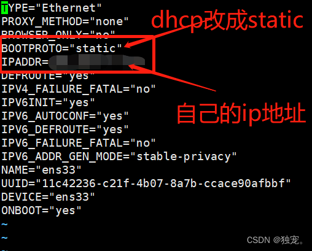
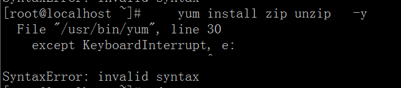
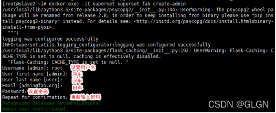

# 修改主机名

查看当前的主机名

~~~bash
[root@sxl133 Desktop]# hostname
sxl133
~~~

在命令行中输入

~~~bash
 hostnamectl set-hostname XXX
 XXX为你想更改的名字
~~~

最后关机重启即可

# 增加主机和IP的映射

~~~bash
vim /etc/hosts
192.168.1.101  centos7
~~~

这样局域网内就可以通过主机名互相访问了，当然局域网内的主机hosts文件都得添加映射关系


# 修改固定Ip

~~~bash
vi /etc/sysconfig/network-scripts/ifcfg-ens33 
~~~



配置，然后重新重启网路

~~~bash
IPADDR=192.168.160.129
NETMASK=255.255.255.0
GATEWAY=192.168.160.2
DNS1=8.8.8.8
BOOTPROTO=static

nmcli connection reload
nmcli connection up ens33
~~~


# 停止服务

~~~bash
 netstat -anp | grep 2181

 kill -9 进程号
~~~


# 防火墙

centOS6及以前版本使用命令：

~~~bash
systemctl stop iptables.service
~~~

centOS7关闭防火墙命令：

~~~bash
systemctl stop firewalld.service

#不过，关闭防火墙会导致服务器有一定风险，所以建议是单独开放服务端口：
firewall-cmd --zone=public --add-port=8089/tcp --permanent

#查询端口号8089 是否开启：
firewall-cmd --query-port=8089/tcp

#重启防火墙：
firewall-cmd --reload
# 查看firewall防火墙状态
systemctl status firewalld
# 查看firewall防火墙开放端口
firewall-cmd --list-ports
#禁止firewall开机启动 
systemctl disable firewalld.service

~~~


# Yum锁定

~~~bash
rm -f /var/run/yum.pid
yum clean all
~~~


# 删除软件

+ 查看Linux自带Java软件：rpm -qa | grep java
+ 逐个删除自带软件：rpm -e --nodeps  软件名称
+ 查找存在的文件夹 如： find / -name mysql，然后逐个删除

# xsync分发脚本

1. 在用的家目录/home/atguigu下创建bin文件夹

   ~~~bash
   [atguigu@hadoop102 ~]$ mkdir bin
   ~~~

2. 在/home/atguigu/bin目录下创建xsync文件，以便全局调用

   ~~~bash
   [atguigu@hadoop102 ~]$ cd /home/atguigu/bin
   [atguigu@hadoop102 ~]$ vim xsync
   ~~~

3. 在该文件中编写如下代码

   ~~~shell
   #!/bin/bash
   #1. 判断参数个数
   if [ $# -lt 1 ]
   then
     echo Not Enough Arguement!
     exit;
   fi
   #2. 遍历集群所有机器
   for host in hadoop102 hadoop103 hadoop104
   do
     echo ====================  $host  ====================
     #3. 遍历所有目录，挨个发送
     for file in $@
     do
       #4 判断文件是否存在
       if [ -e $file ]
       then
         #5. 获取父目录
         pdir=$(cd -P $(dirname $file); pwd)
         #6. 获取当前文件的名称
         fname=$(basename $file)
         ssh $host "mkdir -p $pdir"
         rsync -av $pdir/$fname $host:$pdir
       else
         echo $file does not exists!
       fi
     done
   done
   ~~~

4. 修改脚本xsync具有执行权限

   ~~~bash
   chmod +x xsync
   ~~~

5. 测试脚本

   ~~~bash
   [atguigu@hadoop102 bin]$ xsync xsync
   ~~~

# SSH无密登录配置

说明：这里面只配置了hadoop102、hadoop103到其他主机的无密登录；因为hadoop102未外配置的是NameNode，hadoop103配置的是ResourceManager，都要求对其他节点无密访问。

1. hadoop102上生成公钥和私钥：

   ~~~bash
   [atguigu@hadoop102 .ssh]$ ssh-keygen -t rsa
   # 然后敲（三个回车），就会生成两个文件id_rsa（私钥）、id_rsa.pub（公钥）
   ~~~

2. 将hadoop102公钥拷贝到要免密登录的目标机器上

   ~~~bash
   [atguigu@hadoop102 .ssh]$ ssh-copy-id hadoop102
   [atguigu@hadoop102 .ssh]$ ssh-copy-id hadoop103
   [atguigu@hadoop102 .ssh]$ ssh-copy-id hadoop104
   ~~~

3. hadoop103上生成公钥和私钥：

   ~~~bash
   [atguigu@hadoop103 .ssh]$ ssh-keygen -t rsa
   # 然后敲（三个回车），就会生成两个文件id_rsa（私钥）、id_rsa.pub（公钥）
   ~~~

4. 将hadoop103公钥拷贝到要免密登录的目标机器上

   ~~~bash
   [atguigu@hadoop103 .ssh]$ ssh-copy-id hadoop102
   [atguigu@hadoop103 .ssh]$ ssh-copy-id hadoop103
   [atguigu@hadoop103 .ssh]$ ssh-copy-id hadoop104
   ~~~

# 集群脚本示例

## 集群服务启动

~~~bash
[atguigu@hadoop102 bin]$ vim lg.sh
~~~

~~~shell
#!/bin/bash
for i in hadoop102 hadoop103; do
    echo "========== $i =========="
    ssh $i "cd /opt/module/applog/; java -jar gmall2020.jar >/dev/null 2>&1 &"
done 
~~~

注：

1. /opt/module/applog/为jar包及配置文件所在路径
2. /dev/null代表Linux的空设备文件，所有往这个文件里面写入的内容都会丢失，俗称“黑洞”。
   1. 标准输入0：从键盘获得输入 /proc/self/fd/0 
   2. 标准输出1：输出到屏幕（即控制台） /proc/self/fd/1
   3. 错误输出2：输出到屏幕（即控制台） /proc/self/fd/2

~~~bash
[atguigu@hadoop102 bin]$ chmod 777 lg.sh
~~~

## 集群查看脚本

~~~bash
[atguigu@hadoop102 bin]$ chmod 777 lg.sh
~~~

~~~shell
#! /bin/bash
 
for i in hadoop102 hadoop103 hadoop104
do
    echo --------- $i ----------
    ssh $i "$*"
done
~~~

~~~bash
[atguigu@hadoop102 bin]$ chmod 777 xcall
[atguigu@hadoop102 bin]$ xcall.sh jps
~~~


# JDK

## 安装

+ java -version，查看当前是否有jdk版本

+ 查看Linux自带Java软件：rpm -qa | grep java

+ 逐个删除自带软件：rpm -e --nodeps  软件名称

+ 上传JDK安装包

+ 解压到对应的文件夹

+ 修改系统环境配置文件：vim /etc/profile

  ~~~bash
  export JAVA_HOME=/usr/local/software/jdk8
  export PATH=$JAVA_HOME/bin:$PATH
  export CLASSPATH=.:$JAVA_HOME/lib/dt.jar:$JAVA_HOME/lib/tools.jar
  ~~~

+ 使配置生效：source /etc/profile

# Python3 

## Linux安装

~~~bash
1.在机器上随便找一个目录,下载python插件
 
    wget https://www.python.org/ftp/python/3.7.0/Python-3.7.0.tgz(看是否能直接在机器上下载,不 
    可以的话就只能在window下载上传了)
 
2.解压压缩包
    
    tar -zxvf Python-3.7.0.tgz
 
3.进入目录
   
   cd Python-3.7.0
 
4.创建安装目录
 
    mkdir /usr/local/python3
 
5.安装到指定目录
 
    ./configure --prefix=/usr/local/python3 --enable-optimizations
    (--enable-optimizations 加了这个参数编译会比较久,这个是参数是性能优化相关)
 
6. 编译(这一步比较久,大概要20分钟)
 
   make && make install
 
7.成功后创建软连接即可全局使用python3了
 
  cd /usr/local/python3
  ln -s /usr/local/python3/bin/python3 /usr/bin/python
  ln -s /usr/local/python3/bin/pip3 /usr/bin/pip
  
 如果 /usr/bin/python  /usr/bin/pip 存在，就使用 rm 指令删除
 
8.可以查看pip和python的版本
 
  python -V 
  pip -V
~~~

## 相关异常

安装完python3.7版本之后,yum命令会报错(因为yum是用python2写的)



~~~bash
1.编辑这两个文件
 
  vim /usr/libexec/urlgrabber-ext-down
  vim /usr/bin/yum
 
2.编辑第一行(让yum命令指向python2版本就行)
  #!/usr/bin/python 改成 #!/usr/bin/python2.7
~~~


# Maven

## 安装

下载

~~~bash
wget https://archive.apache.org/dist/maven/maven-3/3.3.9/binaries/apache-maven-3.3.9-bin.tar.gz
~~~

解压缩maven
~~~bash
tar -zxvf apache-maven-3.3.9-bin.tar.gz
~~~

添加环境变量

~~~bash
vim /etc/profile

export MAVEN_HOME=/usr/local/software/maven/
export PATH=${PATH}:${MAVEN_HOME}/bin

~~~

验证结果

~~~bash
mvn -version
~~~

本地仓库

~~~bash
mkdir -p /usr/local/software/data/mvnRepo
~~~

修改配置

~~~bash
vim /usr/local/maven/apache-maven-3.3.9/conf/settings.xml


<mirror>
  <id>aliyunmaven</id>
  <mirrorOf>*</mirrorOf>
  <name>阿里云公共仓库</name>
  <url>https://maven.aliyun.com/repository/public</url>
</mirror>
<mirror>
    <id>nexus-163</id>
    <mirrorOf>*</mirrorOf>
    <name>Nexus 163</name>
    <url>http://mirrors.163.com/maven/repository/maven-public/</url>
</mirror>
<mirror>
    <id>nexus-tencentyun</id>
    <mirrorOf>*</mirrorOf>
    <name>Nexus tencentyun</name>
    <url>http://mirrors.cloud.tencent.com/nexus/repository/maven-public/</url>
</mirror> 
<!-- java1.8版本 --> 
<profile>
      <id>jdk-1.8</id>
      <activation>
	    <activeByDefault>true</activeByDefault>
        <jdk>1.8</jdk>
      </activation>

      <properties>
        <maven.compiler.source>1.8</maven.compiler.source>
		<maven.compiler.target>1.8</maven.compiler.target>
		<maven.compiler.compilerVersion>1.8</maven.compiler.compilerVersion>
      </properties>
</profile>
~~~


# Golang

## 安装

下载 [网址](https://studygolang.com/dl)

~~~bash
wget https://dl.google.com/go/go1.17.8.linux-amd64.tar.gz
~~~

解压

~~~bash
tar -xzf go1.18.10.linux-arm64.tar.gz
~~~

配置环境

~~~bash
vi /etc/profile

export GOROOT=/usr/local/software/go
export GOPATH=/usr/local/software/data/go
export PATH=$PATH:$GOROOT/bin:$GOPATH
# 开启 Go moudles 特性
export GO111MODULE="on"
# 安装 Go 模块时，国内代理服务器设置
export GOPROXY=https://goproxy.cn,direct 
~~~


# Node.js

## 安装

下载

~~~bash
wget https://registry.npmmirror.com/-/binary/node/v14.18.1/node-v14.18.1-linux-x64.tar.xz

~~~

解压

~~~bash
tar -xvf node-v14.18.1-linux-x64.tar.xz

mv node-v14.18.1-linux-x64 node14
~~~


## 配置环境

~~~bash
vi /etc/profile

export NODE_HOME=/usr/local/software/node14
export PATH=$PATH:$NODE_HOME/bin
export NODE_PATH=$NODE_HOME/lib/node_mudules
export PATH NODE_HOME NODE_PATH

source /etc/profile
~~~


## 淘宝镜像

~~~bash
npm config set registry https://registry.npm.taobao.org

npm config get registry

npm install -g cnpm --registry=https://registry.npm.taobao.org

~~~


# Git

## 安装

+  yum -y install git 
+ git version

## 配置

配置用户名和用户邮件.(邮箱不一定要真实存在,一定保证要有的).

+ git config --global user.name "XXXX"
+ git config --global user.email  "XXXXXXXXXX@qq.com"  
+ git config --global user.password tianshan
+ git config --list (查看是否配置成功)


# Mysql

## yum安装5.7

+ 下载 mysql的yum仓库文件包

  ~~~bash
  wget http://repo.mysql.com/yum/mysql-5.7-community/el/7/x86_64/mysql57-community-release-el7-10.noarch.rpm
  rpm -ivh mysql57-community-release-el7-10.noarch.rpm
  ~~~

+ 安裝Mysql

  ~~~bash
  sudo yum -y install mysql-community-server
  ~~~

+ 如果报错：MySQL 5.7 Community Server“ 的 GPG 密钥已安装，但是不适用于此软件包

  ~~~bash
  rpm --import https://repo.mysql.com/RPM-GPG-KEY-mysql-2022
  ~~~

+ .启动mysql

  ~~~bash
  systemctl enable mysqld
  systemctl start mysqld
  systemctl status mysqld
  ~~~

+ 查看密码

  ~~~bash
  cat /var/log/mysqld.log |grep password
  ~~~

+ 登陆 mysql -u root -p

+ 修改密码

  ~~~bash
  SET PASSWORD = PASSWORD('root');
  alter user 'root'@'localhost' identified by 'Bob.123456';
  FLUSH PRIVILEGES;                                 
  ~~~

+ 远程登陆

  ~~~bash
  use mysql;   #选择访问mysql库
  update user set host = '%' where user = 'root'; #使root能再任何host访问
  FLUSH PRIVILEGES;    #刷新
  ~~~

## 设置密码策略

由于MySQL密码策略，此密码必须足够复杂

~~~bash
mysql> set global validate_password_length=4;
mysql> set global validate_password_policy=0;

mysql> set password=password("000000");
mysql> use mysql;
mysql> update user set host="%" where user="root";
mysql> flush privileges;
mysql> quit;
~~~


# MongDB

## 安装

~~~bash

[bigdata@linux ~]$ wget https://fastdl.mongodb.org/linux/mongodb-linux-x86_64-rhel62-3.4.3.tgz
#  将压缩包解压到指定目录
[bigdata@linux backup]$ tar -xf mongodb-linux-x86_64-rhel62-3.4.3.tgz -C ~/
# 将解压后的文件移动到最终的安装目录
[bigdata@linux ~]$ mv mongodb-linux-x86_64-rhel62-3.4.3/ /usr/local/mongodb
#  在安装目录下创建data文件夹用于存放数据和日志
[bigdata@linux mongodb]$ mkdir /usr/local/mongodb/data/
#  在data文件夹下创建db文件夹，用于存放数据
[bigdata@linux mongodb]$ mkdir /usr/local/mongodb/data/db/
# 在data文件夹下创建logs文件夹，用于存放日志
[bigdata@linux mongodb]$ mkdir /usr/local/mongodb/data/logs/
# 在logs文件夹下创建log文件
[bigdata@linux mongodb]$ touch /usr/local/mongodb/data/logs/ mongodb.log
#  在data文件夹下创建mongodb.conf配置文件
[bigdata@linux mongodb]$ touch /usr/local/mongodb/data/mongodb.conf
# 在mongodb.conf文件中输入如下内容
[bigdata@linux mongodb]$ vim ./data/mongodb.conf

#数据库路径
dbpath=/usr/local/mongdb-5/data/db
#日志输出文件路径
logpath=/usr/local/mongdb-5/data/log/mongodb.log
#错误日志采用追加模式
logappend=true
#启用日志文件，默认启用
journal=true
#这个选项可以过滤掉一些无用的日志信息，若需要调试使用请设置为false
quiet=true
#端口号 默认为27017
port=27017
#允许远程访问
bind_ip=0.0.0.0
#开启子进程
fork=true
#开启认证，必选先添加用户，先不开启（不用验证账号密码）
#auth=true
~~~

## 启动

~~~bash
 启动MongoDB服务器
[bigdata@linux mongodb]$ sudo /usr/local/mongodb/bin/mongod -config /usr/local/mongodb/data/mongodb.conf
// 访问MongoDB服务器
[bigdata@linux mongodb]$ /usr/local/mongodb/bin/mongo
// 停止MongoDB服务器
[bigdata@linux mongodb]$ sudo /usr/local/mongodb/bin/mongod -shutdown -config /usr/local/mongodb/data/mongodb.conf
~~~


## 基本操作

~~~bash
// 1.数据库的切换：use  数据库名
use my_test
// 2.创建集合：db.集合名.insert({_id:'1001'})  --- 在向集合中插入文档时就已经创建了集合
db.admin.insert({
   _id:'1005',
     userName: '鲁肃',
     password: '123456',
     address: '镇江'
})
db.student.insert({
   _id:'s101',
     sname: '张三',
     ssex: '男',
     sage: 21
})
// 3.查询集合：db.集合名.find({})  --- 若find不带参数表示查询所有文档
db.admin.find()
// 4. 统计集合中文档的数量 ：db.集合名.find().count()
db.admin.find().count()
// 5.更新集合中的文档：db.集合名.update({条件},{$set:{key:value}})
db.admin.update({_id:'1004'},{$set:{password:'aaaa'}})
// 6. 删除属性(key)：db.集合名.update({条件},{$unset:{key:value}}
db.admin.update({_id:'1003'},{$unset:{address:'南京'}})
// 7. 增加属性：db.集合名.update({条件},{$set:{key:value}}
db.admin.update({_id:'1003'},{$set:{hobby:['下棋','骑马','KTV']}})
// 8. 删除文档：db.集合名.remove({条件})
db.admin.remove({_id:'1005'})
db.student.find()
//9. 删除集合：db.集合名.drop()


//创建一个数组：保存若干对象
var arr = []
for(let i=1;i<=2000;i++)
{
    arr.push({
             _id:'100'+i,
             title: 'A0'+i,
             num: i
        })
}
//将数组arr中的元素插入到集合numbers中
db.numbers.insert(arr)
db.numbers.find()
// 10. 查询numbers集合中num值等于500的文档(记录)
db.numbers.find({num:500})
// 11. 查询numbers集合中num值大于500的文档
db.numbers.find({num:{$gt:500}})
// 12. 查询numbers集合中num值小于500的文档
db.numbers.find({num:{$lt:500}})
// 13. 查询numbers集合中num值小于40,小于50的文档
db.numbers.find({num:{$gt:40,$lt:50}})
//14. 用limit设置显示数据的上限
db.numbers.find().limit(15)  //表示最多显示15条记录
//15. 分页显示：skip(index)---进行定位
db.numbers.find().skip(0).limit(10)  //从索引为0的记录开始连续显示10条记录
db.numbers.find().skip(10).limit(10)
db.numbers.find().skip(20).limit(10)
~~~


# ES

## 修改配置文件

~~~bash
vi config/elasticsearch.yml 
~~~

~~~yml
# 设置跨域
http.cors.enabled: true
http.cors.allow-origin: "*"
# 端口
http.port: 9200
# 设置外网访问
network.host: 0.0.0.0
network.bind_host: 172.27.27.82
# 设置集群名称
cluster.name: elasticsearch
~~~


## 启动指令

~~~bash
# 前台启动
./bin/elasticsearch

# 后台启动
./bin/elasticsearch -d
~~~


## 常见启动错误

**第一种：**

~~~bash
max virtual memory areas vm.max_map_count [65530] likely too low, increase to at least [262144]
~~~

~~~bash
原因：最大虚拟内存太小
解决方案：
切换到root用户下，修改配置文件sysctl.conf
vi /etc/sysctl.conf
添加下面配置：
vm.max_map_count=655360
并执行命令：
sysctl -p
~~~

**第二种**

~~~bash
 ERROR: bootstrap checks failed：max file descriptors [4096] for elasticsearch process likely too low, increase to at least [65536]
~~~

~~~bash
原因：无法创建本地文件问题,用户最大可创建文件数太小
解决方案：
切换到root用户，编辑limits.conf配置文件， 添加类似如下内容：
vi /etc/security/limits.conf
添加如下内容：
* soft nofile 65536
* hard nofile 131072
* soft nproc 2048
* hard nproc 4096
备注：* 代表Linux所有用户名称(比如hadoop)
保存、退出、重新系统 登录才可生效
~~~


**第三种**

~~~bash
ERROR: bootstrap checks failed   system call filters failed to install; check the logs and fix your configuration or disable 
system call filters at your own risk 
~~~

~~~bash
原因：因为Centos6不支持SecComp，而ES5.2.1默认bootstrap.system_call_filter为true进行检测，所以导致检测失败，失败后直接导致ES不能启动。
详见 ：https://github.com/elastic/elasticsearch/issues/22899
解决方案：在elasticsearch.yml中配置bootstrap.system_call_filter为false，注意要在Memory下面
bootstrap.memory_lock: false
bootstrap.system_call_filter: false
~~~

**第四种**

~~~bash
Caused by: java.lang.IllegalStateException: Failed to create node environment
~~~

~~~bash
 
1.Failed to create node environment
2.Caused by: java.nio.file.AccessDeniedException:Caused by: java.nio.file.AccessDeniedException: /usr/share/elasticsearch/data/nodes/0
 
需要说明如果是在实体运行就需要把对应的文件夹加上权限
如果是通过docker容器 需要把对应的容器卷加上权限 否则es无法创建node
chmod 777 需要将 /usr/share/elasticsearch/data/nodes 
~~~

**第五种**

~~~bash
can not run elasticsearch as root
~~~

~~~bash
1、创建用户：elsearch
[root@iZbp1bb2egi7w0ueys548pZ bin]# adduser elsearch
2、创建用户密码，需要输入两次（可以不添加密码，直接执行余下步骤）
[root@iZbp1bb2egi7w0ueys548pZ bin]# passwd elsearch
3、将对应的文件夹权限赋给该用户
[root@iZbp1bb2egi7w0ueys548pZ local]# chown -R elsearch elasticsearch-6.0.0
4、切换至elasticsearch用户
[root@iZbp1bb2egi7w0ueys548pZ etc]# su elsearch
5、进入启动目录启动 /usr/local/elasticsearch-6.0.0/bin  使用后台启动方式：./elasticsearch -d
[elasticsearch@vmt10003 bin]$ ./elasticsearch -d
6、启动后测试
输入curl ip:9200,如果返回一个json数据说明启动成功
~~~

# ES-head-master

## 修改配置

修改Gruntfile.js（根目录下）

~~~js
connect: {
			server: {
				options: {
					hostname:'*',
					port: 9100,
					base: '.',
					keepalive: true
				}
			}
		}
~~~

修改_site目录下的app.js

~~~bash
this.base_uri = this.config.base_uri || this.prefs.get("app-base_uri") || "http://192.168.148.133:9200";
#将原来的localhost改为服务器ip
~~~

### 启动

~~~bash
npm run start
~~~

# Redis

## 安装

+ 生成文件夹

  ~~~bash
  mkdir redis
  ~~~

+ Redis 是基于 C语言编写的，所有还需要安装 Redis 所需要的 `gcc` 依赖：

  ~~~bash
  yum install -y  tcl
  yum install -y  cpp
  yum install -y binutils
  yum install -y  glibc
  yum install -y  glibc-kernheaders
  yum install -y  glibc-common
  yum install -y  glibc-devel
  yum install -y  gcc
  yum install -y  make
  ~~~

+ 上传Redis安装包

+ 解压

  ~~~bash
   tar -zxvf redis-6.0.9.tar.gz
  ~~~

+ 运行编译命令：make

## 修改配置文件

+ cp redis.conf redis.conf.bck

+ vi redis.conf

  ~~~conf
  # 监听地址，默认是 127.0.0.1，会导致只能在本地访问。修改成 0.0.0.0 则可以在任意 IP 访问，生产环境不要设置 0.0.0.0
  bind 0.0.0.0
  # 守护进程，修改为 yes 后即可后台运行
  daemonize yes
  # 密码，设置后访问 redis 必须输入密码
  requirepass 123456
  # 监听端口
  port 6379
  # 工作目录，默认是当前目录，也就是运行 redis-server 时的命令，日志、持久化等文件会保存在这个目录
  dir .
  # 数据库数量，设置为1，代表只使用1个库，默认有16个库，编号0~15
  databases 1
  # 设置 redis 能够使用的最大内存
  maxmemory 256mb
  # 日志文件，默认为空，不记录日志，可以指定日志文件名
  logfile "redis.log"
  
  ~~~

+ RDB 配置

  ~~~
  # 时间策略：当满足每900s/300s/60s内至少1/10/10000次写操作，则会触发bgsave命令进行持久化，三个策略中只需要满足其中任何一条即可持久化
  save 900 1
  save 300 10
  save 60 10000
  # 文件名称
  dbfilename dump.rdb
  # 文件保存路径
  dir /home/redis/data/
  # 如果持久化出错，主进程是否停止写入：是为了保证数据的一致性，工作进程（子进程）持久化出错后，主进程停止写入请求
  stop-writes-on-bgsave-error yes
  # 是否压缩
  rdbcompression yes
  # 导入时是否检查
  rdbchecksum yes
  ~~~

+ AOF 配置

  ~~~bash
  # 是否开启aof
  appendonly yes
  # 文件名称
  appendfilename "appendonly.aof"
  # 同步方式
  appendfsync everysec
   
  # aof重写操作是否同步，yes则不进行同步，no则同步
  no-appendfsync-on-rewrite no
   
  # 重写触发配置
  auto-aof-rewrite-percentage 100 # 当前AOF文件大小是上次日志重写时的AOF文件大小两倍时，发生BGREWRITEAOF操作。
  auto-aof-rewrite-min-size 64mb # 当前AOF文件执行BGREWRITEAOF命令的最小值，避免刚开始启动Reids时由于文件尺寸较小导致频繁的BGREWRITEAOF。
   
  # 加载aof时如果有错如何处理，忽略最后一条可能存在问题的指令
  aof-load-truncated yes
  # Redis4.0新增RDB-AOF混合持久化格式。
  aof-use-rdb-preamble no
  ~~~

  


## 启动

+ 指令

  ~~~bash
   ./usr/local/redis/src/redis-server /usr/local/redis/redis.conf
  ~~~

+ 查看 redis 是否后台运行成功

  ~~~bash
  ps -ef | grep redis
  ~~~

## 设置开机启动

+ 新建一个系统服务文件：

  ~~~bash
  vi /etc/systemd/system/redis.service
  ~~~

+ 内容如下

  ~~~txt
  [Unit]
  Description=redis-server
  After=network.target
  
  [Service]
  Type=forking
  ExecStart=/usr/local/software/redis/src/redis-server /usr/local/software/redis/redis.conf
  PrivateTmp=true
  
  [Install]
  WantedBy=multi-user.target
  ~~~

+ 重载系统服务

  ~~~bash
  systemctl daemon-reload
  ~~~

+ 设置开机启动

  ~~~bash
  systemctl enable redis
  ~~~

+ 控制 Redis 服务

  ~~~bash
  systemctl start redis
  systemctl status redis
  systemctl stop redis
  systemctl restart redis
  ~~~


# Nginx 

## 安装

安装环境

~~~bash
#安装gcc
yum install gcc-c++
 
#安装PCRE pcre-devel
yum install -y pcre pcre-devel
 
#安装zlib
yum install -y zlib zlib-devel
 
#安装Open SSL
yum install -y openssl openssl-devel
~~~

下载nginx安装包

~~~bash
wget http://nginx.org/download/nginx-1.23.0.tar.gz 
~~~

安装

~~~bash
mv nginx-1.23.0 nginx
# 编译 执行命令 考虑到后续安装ssl证书 添加两个模块  如不需要直接执行./configure即可
./configure --with-http_stub_status_module --with-http_ssl_module
#执行make命令(要是执行不成功请检查最开始安装的四个依赖有没有安装成功)
make
#执行make install命令
make install
~~~

## 操作

~~~bash
cd /usr/local/nginx/sbin
# 默认配置文件启动
./nginx

# 指定配置文件启动
./nginx -c  /usr/local/nginx/conf/nginx.conf
~~~

localhost：80

停止重启nginx

~~~bash
cd /usr/local/nginx/sbin
# 停止指令
./nginx -s stop
# 或
./nginx -s quit

# 重启命令
./nginx -s reload

# 查看nginx进程
ps -ef|grep nginx
~~~

## 设置开机自启动nginx

~~~bash
#编辑
vim /etc/rc.local
 
#最底部增加这一行
/usr/local/nginx/sbin/nginx -c /usr/local/nginx/conf/nginx.conf

# 添加可执行权限
chmod +x /etc/rc.d/rc.local
~~~

## 配置nginx.conf

~~~bash
# 打开配置文件
vi /usr/local/nginx/conf/nginx.conf
~~~


# Tomcat

## 安装

+ 上传tomcat文件

+ 解压：tar  -zxvf apache-tomcat-9.0.48.tar.gz

+ 修改文件名称

  ~~~bash
  mv apache-tomcat-9.0.48 tomcat9
  ~~~

+ 启动 tomcat

  ~~~bash
  cd tomcat/bin
  ./startup.sh
  ~~~

+ 修改配置文件

  ~~~bash
  cd /usr/local/software/tomcat9/conf
  
  vi server.xml
  /8005 修改为9905
  /8080 修改为8002
  /8009 修改为9909
  修改完后保存，重启tomcat服务
  ~~~

+ 重新启动访问：http://192.168.160.128:8002/


# Docker

## 安装

卸载旧版本

~~~bahs
yum remove docker \
                  docker-client \
                  docker-client-latest \
                  docker-common \
                  docker-latest \
                  docker-latest-logrotate \
                  docker-logrotate \
                  docker-selinux \
                  docker-engine-selinux \
                  docker-engine \
                  docker-ce

~~~

首先需要大家虚拟机联网，安装yum工具

~~~bash
yum install -y yum-utils \
           device-mapper-persistent-data \
           lvm2 --skip-broken
~~~

然后更新本地镜像源：

~~~bash
# 设置docker镜像源
yum-config-manager \
    --add-repo \
    https://mirrors.aliyun.com/docker-ce/linux/centos/docker-ce.repo
    
sed -i 's/download.docker.com/mirrors.aliyun.com\/docker-ce/g' /etc/yum.repos.d/docker-ce.repo
yum makecache fast

~~~

下载安装

~~~bash
yum install -y docker-ce

docker -v
~~~

启动docker：

~~~bash
systemctl start docker  # 启动docker服务

systemctl status docker
systemctl enable docker

systemctl stop docker  # 停止docker服务

systemctl restart docker  # 重启docker服务

~~~

配置镜像加速

~~~bash
sudo mkdir -p /etc/docker

sudo tee /etc/docker/daemon.json <<-'EOF'
{
  "registry-mirrors": ["https://akchsmlh.mirror.aliyuncs.com"]
}
EOF

##重新加载文件
sudo systemctl daemon-reload

##重启docker
sudo systemctl restart docker
~~~


## 异常

### WARNING: IPv4 forwarding is disabled. Networking will not work.

导致容器内网络与服务器网络不通

~~~bash
vim /etc/sysctl.conf

# 在该文件中新增一行：
net.ipv4.ip_forward=1

# 然后重启network服务，命令行执行：
systemctl restart network && systemctl restart docker

# 验证 返回net.ipv4.ip_forward = 1，就是成功
sysctl net.ipv4.ip_forward
~~~


# Rabbit MQ

## 安装

上传安装文件

~~~bash
erlang-21.3.8.18-1.el7.x86_64.rpm
rabbitmq-server-3.8.8-1.el7.noarch.rpm
~~~

安装erlang

~~~bash
# 解压
rpm -Uvh erlang-23.2.7-2.el7.x86_64.rpm

# 安装
yum install -y erlang


erl -v
~~~

安装RabbitMQ

~~~bash
yum install -y socat

# 解压
rpm -Uvh rabbitmq-server-3.8.8-1.el7.noarch.rpm

# 安装
yum install -y rabbitmq-server
~~~

启动

~~~bash
systemctl start rabbitmq-server

systemctl status rabbitmq-server

# 设置rabbitmq服务开机自启动
systemctl enable rabbitmq-server

# 关闭rabbitmq服务
systemctl stop rabbitmq-server

# 重启rabbitmq服务
systemctl restart rabbitmq-server

~~~

安装web端

~~~bash
# 默认情况下，rabbitmq没有安装web端的客户端软件，需要安装才可以生效
# 打开RabbitMQWeb管理界面插件
rabbitmq-plugins enable rabbitmq_management

~~~

然后我们打开浏览器，访问`服务器公网ip:15672`（注意打开阿里云安全组以及防火墙的15672端口），就可以看到管理界面

`rabbitmq`有一个默认的账号密码`guest`，但该情况仅限于本机localhost进行访问，所以需要添加一个远程登录的用户

~~~bash
# 添加用户
rabbitmqctl add_user krest 123456

# 设置用户角色,分配操作权限
rabbitmqctl set_user_tags krest administrator

# 为用户添加资源权限(授予访问虚拟机根节点的所有权限)
rabbitmqctl set_permissions -p / krest ".*" ".*" ".*"

~~~

**角色有四种**：

- `administrator`：可以登录控制台、查看所有信息、并对rabbitmq进行管理
- `monToring`：监控者；登录控制台，查看所有信息
- `policymaker`：策略制定者；登录控制台指定策略
- `managment`：普通管理员；登录控制

其他指令：

~~~bash
# 修改密码
rabbitmqctl change_ password 用户名 新密码

# 删除用户
rabbitmqctl delete_user 用户名

# 查看用户清单
rabbitmqctl list_users

~~~


# Rocket MQ

## 安装

安装 nameServer

Rocekt 的安装颇为繁琐，这里采用docker的方式进行启动和使用

~~~bash
# 搜索/拉取镜像
docker search rocketmq
docker pull rocketmqinc/rocketmq:4.4.0

# 创建一个数据目录
mkdir -p /usr/local/software/data/rocketmq/nameserver/logs
mkdir -p /usr/local/software/data/rocketmq/nameserver/store
mkdir -p /usr/local/software/data/rocketmq/broker/logs
mkdir -p /usr/local/software/data/rocketmq/broker/store
mkdir -p /usr/local/software/data/rocketmq/broker/


# 增加 broker 配置文件
vi /usr/local/software/data/rocketmq/broker/bocker.cnf

brokerClusterName = DefaultCluster
brokerName = broker-a
brokerId = 0
deleteWhen = 04
fileReservedTime = 48
brokerRole = ASYNC_MASTER
flushDiskType = ASYNC_FLUSH
brokerIP1 = 192.168.160.128


# 运行 nameserver
docker run -d \
--restart=always \
--name rmqnamesrv \
--privileged=true \
-p 9876:9876  \
-v /usr/local/software/data/rocketmq/nameserver/logs:/root/logs \
-v /usr/local/software/data/rocketmq/nameserver/store:/root/store \
-e "MAX_POSSIBLE_HEAP=100000000" rocketmqinc/rocketmq:4.4.0 sh mqnamesrv

~~~

安装 broker

创建broker.conf配置文件，我的目录是/opt/docker/rocketmq/broker.conf，文件内容如下

~~~
vi /usr/local/software/data/rocketmq/bocker.cnf

brokerClusterName = DefaultCluster
brokerName = broker-a
brokerId = 0
deleteWhen = 04
fileReservedTime = 48
brokerRole = ASYNC_MASTER
flushDiskType = ASYNC_FLUSH
brokerIP1 = 192.168.160.128

~~~

创建broker配置文件挂载文件夹

~~~bash
docker run -d \
--restart=always \
-p 10911:10911 \
-p 10909:10909  \
-v /usr/local/software/data/rocketmq/broker/logs:/root/logs \
-v /usr/local/software/data/rocketmq/broker/store:/root/store  \
-v /usr/local/software/data/rocketmq/broker/bocker.cnf:/opt/rocketmq-4.4.0/conf/broker.conf \
--name rmqbroker \
--link rmqnamesrv:namesrv \
-e "NAMESRV_ADDR=namesrv:9876" \
-e "MAX_POSSIBLE_HEAP=200000000" \
rocketmqinc/rocketmq:4.4.0 sh mqbroker \
-c /opt/rocketmq-4.4.0/conf/broker.conf
~~~

启动web容器、

~~~bash
docker run -d \
--restart=always \
-e "JAVA_OPTS=-Drocketmq.namesrv.addr=192.168.160.128:9876  -Dcom.rocketmq.sendMessageWithVIPChannel=false" \
-p 8081:8080 \
-t pangliang/rocketmq-console-ng
~~~

访问路径 ： http://192.168.160.128:8081/


# Canal

### 地址

+ [canal-github](https://github.com/alibaba/canal)

### 版本特色

1. canal 1.1.x 版本（[release_note](https://github.com/alibaba/canal/releases)）,性能与功能层面有较大的突破,重要提升包括:
   + 整体性能测试&优化,提升了150%. 
   + 原生支持prometheus监控 
   + 原生支持kafka消息投递 
   + 原生支持aliyun rds的binlog订阅 (解决自动主备切换/oss binlog离线解析) 
   + 原生支持docker镜像 
2. canal 1.1.4版本，迎来最重要的WebUI能力，引入canal-admin工程，支持面向WebUI的canal动态管理能力，支持配置、任务、日志等在线白屏运维能力，具体文档：[Canal Admin Guide](

# Zookeeper

## 安装（单节点）环境配置

~~~bash
// 通过wget下载zookeeper安装包
[bigdata@linux ~]$ wget http://mirror.bit.edu.cn/apache/zookeeper/zookeeper-3.4.10/zookeeper-3.4.10.tar.gz 
// 将zookeeper解压到安装目录
[bigdata@linux ~]$ tar –xf zookeeper-3.4.10.tar.gz –C ./cluster
// 进入zookeeper安装目录
[bigdata@linux cluster]$ cd zookeeper-3.4.10/
// 创建data数据目录
[bigdata@linux zookeeper-3.4.10]$ mkdir data/
// 复制zookeeper配置文件
[bigdata@linux zookeeper-3.4.10]$ cp ./conf/zoo_sample.cfg ./conf/zoo.cfg   
// 修改zookeeper配置文件
[bigdata@linux zookeeper-3.4.10]$ vim conf/zoo.cfg
dataDir=/home/bigdata/cluster/zookeeper-3.4.10/data  #将数据目录地址修改为创建的目录
// 启动Zookeeper服务
[bigdata@linux zookeeper-3.4.10]$ bin/zkServer.sh start
// 查看Zookeeper服务状态
[bigdata@linux zookeeper-3.4.10]$ bin/zkServer.sh status
ZooKeeper JMX enabled by default
Using config: /usr/local/zookeeper/bin/zkServer.sh /usr/local/zookeeper/bin/conf/zoo.cfg
Mode: standalone
// 关闭Zookeeper服务
[bigdata@linux zookeeper-3.4.10]$ bin/zkServer.sh stop
~~~


# Kafka

## 安装

上传kafka安装文件

解压文件：

~~~bash
 tar -zxvf kafka_2.11-2.1.0.tgz 
~~~

修改server.properties文件

~~~bash
vim server.properties
~~~

修改 zookeeper.perproties

~~~properties
dataDir=/opt/monitor/kafka/kafka_data/zookeeper  #zookeeper数据目录  (可以修改可以不修改)
clientPort=2181
maxClientCnxns=100
tickTimes=2000
initLimit=10
syncLimit=5
admin.enableServer=false
~~~

## 启动

kafka中自带了zookeeper组件

### zookeeper

~~~bash
bin/zookeeper-server-start.sh config/zookeeper.properties
bin/zookeeper-server-start.sh -daemon  config/zookeeper.properties          #建议使用这种方式，不需要启动多个窗口
~~~

### kafka

~~~bash
bin/kafka-server-start.sh config/server.properties

bin/kafka-server-start.sh -daemon  config/server.properties                 #建议使用这种方式，不需要启动多个窗口
~~~

## 操作

### 创建topic

~~~bash
bin/kafka-topics.sh --create --zookeeper localhost:2181 --replication-factor 1 --partitions 1 --topic demo

bin/kafka-topics.sh --create --zookeeper localhost:2181  --topic demo
bin/kafka-topics.sh --create --bootstrap-server hadoop100:2181  --replication-factor 1 --partitions 1  --topic demo
~~~

### 查询topic列表

~~~bash
bin/kafka-topics.sh --list --zookeeper hadoop100:2181
或者 
bin/kafka-topics.sh --list --bootstrap-server hadoop100:2181 
bin/kafka-topics.sh --zookeeper localhost:2181 --describe --topic demo
~~~

### 删除topic

~~~bash
bin/kafka-topics.sh --zookeeper localhost:2181 --delete --topic demo
~~~


### 启动生产者

~~~bash
bin/kafka-console-producer.sh --broker-list localhost:9092 --topic demo
bin/kafka-console-producer.sh --broker-list 192.168.113.xxx:9092 --topic prometheusMonitor_event
bin/kafka-console-producer.sh --broker-list 192.168.xxx.xxx:9092 --topic zabbixVm
~~~


### 启动消费者

旧版本

~~~bash
bin/kafka-console-consumer.sh --zookeeper localhost:2181 --topic demo --from-beginning
~~~

新版本

~~~bash
bin/kafka-console-consumer.sh --bootstrap-server localhost:9092 --topic demo --from-beginning
bin/kafka-console-consumer.sh --bootstrap-server 192.168.xxx.xxx:9092 --topic 名称 --from-beginning
~~~

### 查看kafka生产最大位置偏移量

~~~bash
bin/kafka-run-class.sh kafka.tools.GetOffsetShell --broker-list localhost:9092 --topic demo --time -1
~~~

### 消费消息查看

~~~bash
(1)、topic: redis_event

./kafka-console-consumer.sh --bootstrap-server 192.168.xxx.xxx:9092 --topic redis_event --from-beginning 

（2）、topic: zabbixVm 
./kafka-console-consumer.sh --bootstrap-server 192.168.xxx.xxx:9092 --topic zabbixVm #查看最新的数据
~~~


# Hive 环境搭建

## 安装

~~~bash
# 上传解压安装包
cd /export/server/
tar zxvf apache-hive-3.1.2-bin.tar.gz
mv apache-hive-3.1.2-bin hive

#解决hadoop、hive之间guava版本差异
cd /export/server/hive
rm -rf lib/guava-19.0.jar
cp /export/server/hadoop-3.1.4/share/hadoop/common/lib/guava-27.0-jre.jar ./lib/

#添加mysql jdbc驱动到hive安装包lib/文件下
mysql-connector-java-5.1.32.jar

#修改hive环境变量文件 添加Hadoop_HOME
cd /export/server/hive/conf/
mv hive-env.sh.template hive-env.sh
vim hive-env.sh
export HADOOP_HOME=/export/server/hadoop-3.1.4
export HIVE_CONF_DIR=/export/server/hive/conf
export HIVE_AUX_JARS_PATH=/export/server/hive/lib

#新增hive-site.xml 配置mysql等相关信息
vim hive-site.xml

#初始化metadata
cd /export/server/hive
bin/schematool -initSchema -dbType mysql -verbos
#初始化成功会在mysql中创建74张表
~~~

## 修改配置

Hive-site.xml 

~~~ xml

<configuration>
    <!-- 存储元数据mysql相关配置 -->
    <property>
        <name>javax.jdo.option.ConnectionURL</name>
        <value> jdbc:mysql://node1:3306/hive?createDatabaseIfNotExist=true&amp;useSSL=false&amp;useUnicode=true&amp;characterEncoding=UTF-8</value>
    </property>

    <property>
        <name>javax.jdo.option.ConnectionDriverName</name>
        <value>com.mysql.jdbc.Driver</value>
    </property>

    <property>
        <name>javax.jdo.option.ConnectionUserName</name>
        <value>root</value>
    </property>

    <property>
        <name>javax.jdo.option.ConnectionPassword</name>
        <value>hadoop</value>
    </property>

    <!-- H2S运行绑定host -->
    <property>
        <name>hive.server2.thrift.bind.host</name>
        <value>node1</value>
    </property>

    <!-- 远程模式部署metastore 服务地址 -->
    <property>
        <name>hive.metastore.uris</name>
        <value>thrift://node1:9083</value>
    </property>

    <!-- 关闭元数据存储授权  -->
    <property>
        <name>hive.metastore.event.db.notification.api.auth</name>
        <value>false</value>
    </property>

    <!-- 关闭元数据存储版本的验证 -->
    <property>
        <name>hive.metastore.schema.verification</name>
        <value>false</value>
    </property>
</configuration>
~~~


## 启动指令


hive经过发展，推出了第二代客户端beeline，但是beeline客户端不是直接访问metastore服务的，而是**需要单独启动hiveserver2服务**。在hive运行的服务器上，首先启动metastore服务，然后启动hiveserver2服务。

~~~bash
nohup /export/server/hive/bin/hive --service metastore &
nohup /export/server/hive/bin/hive --service hiveserver2 &
~~~


# Hadoop环境搭建

## 搭建虚拟机环境

~~~bash
# 查看是否能够上网
ping www.baidu.com

# 安装基本工具
 yum install -y epel-release
 
 # 安装网络工具
 yum install -y net-tools
 # 安装编辑工具
 yum install -y vim
 
 # 设置防火墙 关闭开机启动
systemctl stop firewalld
systemctl disable firewalld.service

# 批量卸载，卸载虚拟机自带JDK
 rpm -qa | grep -i java | xargs -n1 rpm -e --nodeps
# rpm -qa：查询所安装的所有rpm软件包
# grep -i：忽略大小写
# xargs -n1：表示每次只传递一个参数
# rpm -e --nodeps：强制卸载软件

# 单独卸载删除旧的 jdk
yum list installed | grep java

yum -y remove java-1.7.0-openjdk.x86_64
yum -y remove java-1.7.0-openjdk-headless.x86_64
yum -y remove java-1.8.0-openjdk.x86_64
yum -y remove java-1.8.0-openjdk-headless.x86_64
yum -y remove javamail.noarch
yum -y remove javapackages-tools.noarch
yum -y remove javassist.noarch
yum -y remove python-javapackages.noarch
yum -y remove tzdata-java.noarch

# 下载JDK
wget --no-check-certificate https://repo.huaweicloud.com/java/jdk/8u151-b12/jdk-8u151-linux-x64.tar.gz
# 解压
tar -zxvf jdk-8u151-linux-x64.tar.gz
# .移动并重命名JDK包。
mv jdk1.8.0_151/ /usr/java8
# 配置Java环境变量。
echo 'export JAVA_HOME=/usr/java8' >> /etc/profile
echo 'export PATH=$PATH:$JAVA_HOME/bin' >> /etc/profile
source /etc/profile

# 查看是否安装成功
java -version
~~~


## 安装 Hadoop

~~~bash
# 添加 hostname 配置
vim /etc/hosts

192.168.160.129 hadoop100
192.168.160.130 hadoop101
192.168.160.131 hadoop102
192.168.160.132 hadoop103


# 下载hadoop
wget --no-check-certificate https://repo.huaweicloud.com/apache/hadoop/common/hadoop-3.1.3/hadoop-3.1.3.tar.gz

# 解压
tar -zxvf hadoop-3.1.3.tar.gz -C /opt/
mv /opt/hadoop-3.1.3 /opt/hadoop

# 添加配置环境
echo 'export HADOOP_HOME=/opt/hadoop/' >> /etc/profile
echo 'export PATH=$PATH:$HADOOP_HOME/bin' >> /etc/profile
echo 'export PATH=$PATH:$HADOOP_HOME/sbin' >> /etc/profile
source /etc/profile    

# 查看是否安装成功
hadoop version
~~~


## 配置 hadoop

Hadoop官方网站： http://hadoop.apache.org/

Hadoop运行模 式包括：本地模式 、伪分布式模式以及完全分布式模式

+ 本地模式：单机运行，只是用来演示一下官方案例。 生产环境不用。
+ 伪分布式模式： 也是单机运行，但是具备 Hadoop集群的所有功能。一台服务器模拟一个分布式的环境 。个别缺钱的公司用来测试，生产环境不用。
+ 完全分布式模式： 多台服务器组成分布式环境。 生产环境使用。


### SSH 登陆

系统之间，需要相互配置这个ssh登陆信息

~~~bash
# 生成密钥
ssh-keygen -t rsa

# 分发密钥到其他机器
ssh-copy-id hadoop100
ssh-copy-id hadoop101
ssh-copy-id hadoop102

# 配置本机
cat id_rsa.pub >> authorized_keys
~~~


### 编写集群分发脚本 xsync

~~~bash
vi ./bin/xsync 
~~~


~~~shell
#!/bin/bash

#1. 判断参数个数
if [ $# -lt 1 ]
then
        echo Not Enough Arguement!
        exit;
fi

#2. 遍历集群所有机器
for host in hadoop102 hadoop103 hadoop104
do
        echo ==================== $host ====================
        #3. 遍历所有目录，挨个发送

        for file in $@
        do
                #4. 判断文件是否存在
                if [ -e $file ]
                        then
                                #5. 获取父目录
                                pdir=$(cd -P $(dirname $file); pwd)

                                #6. 获取当前文件的名称
                                fname=$(basename $file)
                                ssh $host "mkdir -p $pdir"
                                rsync -av $pdir/$fname $host:$pdir
                        else
                                echo $file does not exists!
                fi
        done
done

~~~


~~~bash
# 增加执行权限
chmod +x xsync 

# 让环境变量生效
source /etc/profile
~~~


## 集群配置

### 配置说明

|      | hadoop100              | hadoop101                        | hadoop102                   |
| ---- | ---------------------- | -------------------------------- | --------------------------- |
| HDFS | **NameNode**、DataNode | DataNode                         | SecondaryNameNode、DataNode |
| YARN | NodeManager            | **ResourceManager、**NodeManager | NodeManager                 |

### 自定义配置文件

+ core-site.xml：hadoop-3.1.3/etc/hadoop/core-site.xml 

  ~~~xml
  <configuration>
  <!--指定NameNode的地址-->
  <property>
          <name>fs.defaultFS</name>
          <value>hdfs://hadoop102:8020</value>
  </property>
  
  <!--指定hadoop数据的存储目录-->
  <property>
          <name>hadoop.tmp.dir</name>
          <value>/opt/module/hadoop-3.1.3/data</value>
  </property>
  
  <!--配置HDFS网页登录使用的静态用户为Tom -->
  <property>
          <name>hadoop.http.staticuser.user</name>
  		<value>root</value>
  </property>
  </configuration>
  
  ~~~

+ hdfs-site.xml：hadoop-3.1.3//hadoop/hdfs-site.xml 

  ~~~xml
  <configuration>
          <!--nn web端访问地址-->
          <property>
                  <name>dfs.namenode.http-address</name>
                  <value>hadoop102:9870</value>
          </property>
          <!--2nn web端访问地址-->
          <property>
                  <name>dfs.namenode.secondary.http-address</name>
                  <value>hadoop104:9868</value>
          </property>
          <property>
                  <name>dfs.webhdfs.enabled</name>
                  <value>true</value>
      </property>
  </configuration>
  
  ~~~

+ yarn-site.xml：hadoop-3.1.3/etc/hadoop/yarn-site.xml 

  ~~~xml
  <configuration>
          <!--指定MR走shuffle -->
          <property>
                  <name>yarn.nodemanager.aux-services</name>
                  <value>mapreduce_shuffle</value>
          </property>
          <!--指定ResourceManager的地址-->
          <property>
                  <name>yarn.resourcemanager.hostname</name>
                  <value>hadoop103</value>
          </property>
          <!--环境变量的继承-->
          <property>
                  <name>yarn.nodemanager.env-whitelist</name>
                  <value>JAVA_HOME,HADOOP_COMMON_HOME,HADOOP_HDFS_HOME,HADOOP_CONF_DIR,CLASSPATH_PREPEND_DISTCACHE,HADOOP_YARN_HOME,HADOOP_MAPRED_HOME</value>
          </property>
  </configuration>
  
  ~~~

+ mapred-site.xml：hadoop-3.1.3/etc/hadoop/mapred-site.xml 

  ~~~xml
  <configuration>
      <!--指定MapReduce程序运行在Yarn上-->
      <property>
          <name>mapreduce.framework.name</name>
          <value>yarn</value>
      </property>
  </configuration>
  
  ~~~

  

### 配置工作节点

~~~
 vim /opt/module/hadoop-3.1.3/etc/hadoop/workers 

hadoop102
hadoop103
hadoop104


# 增加用户
vi /etc/profile

export HDFS_NAMENODE_USER=root
export HDFS_DATANODE_USER=root
export HDFS_SECONDARYNAMENODE_USER=root
export YARN_RESOURCEMANAGER_USER=root
export YARN_NODEMANAGER_USER=root

source /etc/profile
~~~


### 启动命令

~~~
hadoop namenode -format
# 在 dfs 上启动该服务
start-dfs.sh
# 在 yarn 上启动资源服务
start-yarn.sh

# 刪除旧资源
rm -rf /usr/local/krest/hadoop/logs/
rm -rf /usr/local/krest/data/hadoop/
~~~


### 终止命令

~~~bash
stop-dfs.sh
stop-yarn.sh
~~~


### 配置历史服务器

vim etc/hadoop/mapred-site.xml 

~~~xml
<property>
    <name>mapreduce.jobhistory.address</name>
    <value>hadoop100:10020</value>
</property>
<!--历史服务器web端地址-->
<property>
    <name>mapreduce.jobhistory.webapp.address</name>
    <value>hadoop100:19888</value>
</property>
~~~

分发配置

xsync etc/

启动历史服务器

~~~bash
mapred --daemon start historyserver
~~~

查看服务是否启动

jps

http://hadoop100:19888/jobhistory

停止历史服务

~~~bash
mapred --daemon stop historyserver
~~~


## 配置日志的聚集

~~~bash
 vim etc/hadoop/yarn-site.xml
~~~

~~~xml
<!--开启日志聚集功能-->
<property>
    <name>yarn.log-aggregation-enable</name>
    <value>true</value>
</property>
<!--设置日志聚集服务器地址-->
<property>
    <name>yarn.log.server.url</name>
    <value>http://hadoop100:19888/jobhistory/logs</value>
</property>
<!--设置日志保留时间为7天-->
<property>
    <name>yarn.log-aggregation.retain-seconds</name>
    <value>604800</value>
</property>
~~~


### 编写常用脚本

#### 添加配置

`ERROR: but there is no YARN_RESOURCEMANAGER_USER defined. Aborting operation.`

#### 启动服务脚本

**将start-dfs.sh，stop-dfs.sh两个文件顶部添加以下参数**

~~~sh
HDFS_NAMENODE_USER=root
HDFS_DATANODE_USER=root
HDFS_SECONDARYNAMENODE_USER=root
YARN_RESOURCEMANAGER_USER=root
YARN_NODEMANAGER_USER=root
~~~


~~~bash
 cd /home/Tom/bin/
 vim myhadoop.sh 
~~~

~~~sh
#!/bin/bash

if [ $# -lt 1 ]
then
        echo "No Args Input..."
        exit ;
fi

case $1 in
"start")
        echo " =================== 启动hadoop集群==================="
        echo " ---------------启动hdfs ---------------"
        ssh hadoop100 "/usr/local/krest/hadoop/sbin/start-dfs.sh"
        echo " ---------------启动yarn ---------------"
        ssh hadoop101 "/usr/local/krest/hadoop/sbin/start-yarn.sh"
        echo " ---------------启动historyserver ---------------"
        ssh hadoop100 "/usr/local/krest/hadoop/bin/mapred --daemon start historyserver"
;;
"stop")
        echo " =================== 关闭hadoop集群==================="
        echo " ---------------关闭historyserver ---------------"
        ssh hadoop100 "/usr/local/krest/hadoop/bin/mapred --daemon stop historyserver"
        echo " ---------------关闭yarn ---------------"
        ssh hadoop101 "/usr/local/krest/hadoop/sbin/stop-yarn.sh"
        echo " ---------------关闭hdfs ---------------"
        ssh hadoop100 "/usr/local/krest/hadoop/sbin/stop-dfs.sh"
;;
*)
        echo "Input Args Error..."
;;
esac

~~~

~~~bash
chmod +x myhadoop.sh 
~~~


#### 查看状态脚本

~~~sh
vim jpsall.sh 
~~~

~~~shell
#!/bin/bash

for host in hadoop102 hadoop103 hadoop104
do
        echo =============== $host ===============
        ssh $host jps
done

~~~

~~~sh
chmod +x jpsall.sh 
~~~


## Bug踩坑

### **启动集群**

如果集群是第一次启动 ，需要在 hadoop102节点格式化 NameNode（注意格式化 NameNode会产生新的集群 id导致 NameNode和 DataNode的集群 id不一致，集群找不到已往数据。 如果集群在运行过程中报错，需要重新格式化 NameNode的话， 一定要先停止 namenode和 datanode进程， 并且要删除所有机器的 data和 logs目录，然后再进行格式化。

### 启动 dfs与yarn

需要自己设置的集群节点启动才可以，并非当前每一个节点都行

### SSH Jps 不生效

`bash: jps: command not found`

在用户`~/.bashrc`这个文件配置JAVA环境变量

~~~sh
vim ~/.bashrc
~~~

~~~shell
export JAVA_HOME=/usr/local/krest/java8
export PATH=$PATH:$JAVA_HOME/bin
~~~

再执行命令`source ~/.bashrc`激活文件# 

~~~sh
source ~/.bashrc
~~~


### SSH 执行start-yarn指令不成功

~~~sh
# 将start-dfs.sh，stop-dfs.sh两个文件顶部添加以下参数

HDFS_NAMENODE_USER=root
HDFS_DATANODE_USER=root
HDFS_SECONDARYNAMENODE_USER=root
YARN_RESOURCEMANAGER_USER=root
YARN_NODEMANAGER_USER=root

# start-yarn.sh，stop-yarn.sh顶部也需添加以下
YARN_RESOURCEMANAGER_USER=root
HADOOP_SECURE_DN_USER=yarn
YARN_NODEMANAGER_USER=root
~~~


# HBASE

## 基本安装部署

+  Zookeeper 正常部署

+ Hadoop 正常部署

+ HBase的解压

  + 解压 Hbase 到指定目录

  ~~~bash
  [atguigu@hadoop102 software]$ tar -zxvf hbase-2.4.11-bin.tar.gz -C 
  /opt/module/
  [atguigu@hadoop102 software]$ mv /opt/module/hbase-2.4.11
  /opt/module/hbase
  ~~~

  + 配置环境变量

  ~~~bash
  [atguigu@hadoop102 ~]$ sudo vim /etc/profile.d/my_env.sh
  
  #HBASE_HOME
  export HBASE_HOME=/opt/module/hbase
  export PATH=$PATH:$HBASE_HOME/bin
  ~~~

  + 使用 source 让配置的环境变量生效

  ~~~bash
  [atguigu@hadoop102 module]$ source /etc/profile.d/my_env.sh
  ~~~

+ HBase的配置文件

  + hbase-env.sh 修改内容，可以添加到最后：

  ~~~sh
  export HBASE_MANAGES_ZK=false
  ~~~

  + hbase-site.xml 修改内容

  ~~~xml
  <?xml version="1.0"?>
  <?xml-stylesheet type="text/xsl" href="configuration.xsl"?>
  <configuration>
      <property>
          <name>hbase.zookeeper.quorum</name>
          <value>hadoop102,hadoop103,hadoop104</value>
          <description>The directory shared by RegionServers.
          </description>
      </property>
      <!-- <property>-->
      <!-- <name>hbase.zookeeper.property.dataDir</name>-->
      <!-- <value>/export/zookeeper</value>-->
      <!-- <description> 记得修改 ZK 的配置文件 -->
      <!-- ZK 的信息不能保存到临时文件夹-->
      <!-- </description>-->
      <!-- </property>-->
      <property>
          <name>hbase.rootdir</name>
          <value>hdfs://hadoop102:8020/hbase</value>
          <description>The directory shared by RegionServers.
          </description>
      </property>
      <property>
          <name>hbase.cluster.distributed</name>
          <value>true</value>
      </property>
  </configuration> 	
  ~~~

+ regionservers

  ~~~txt
  hadoop102
  hadoop103
  hadoop104
  ~~~

+ 解决 HBase 和 Hadoop 的 log4j 兼容性问题，修改 HBase 的 jar 包，使用 Hadoop 的 jar 包

  ~~~bash
  [atguigu@hadoop102 hbase]$ mv /opt/module/hbase/lib/client-facingthirdparty/slf4j-reload4j-1.7.33.jar /opt/module/hbase/lib/clientfacing-thirdparty/slf4j-reload4j-1.7.33.jar.bak
  ~~~

+  HBase 远程发送到其他集群

  ~~~bash
  [atguigu@hadoop102 module]$ xsync hbase/
  ~~~

+ 服务的启动

  + 单点启动

  ~~~bash
  [atguigu@hadoop102 hbase]$ bin/hbase-daemon.sh start master
  [atguigu@hadoop102 hbase]$ bin/hbase-daemon.sh start regionserver
  ~~~

  + 群启

  ~~~bash
  [atguigu@hadoop102 hbase]$ bin/start-hbase.sh
  ~~~

  + 对应的停止服务

  ~~~bash
  [atguigu@hadoop102 hbase]$ bin/stop-hbase.sh
  ~~~

+ 查看HBase 页面：启动成功后，可以通过“host:port”的方式来访问 HBase 管理页面，例如：

## 高可用（可选）

在 HBase 中 HMaster 负责监控 HRegionServer 的生命周期，均衡 RegionServer 的负载，如果 HMaster 挂掉了，那么整个 HBase 集群将陷入不健康的状态，并且此时的工作状态并不会维持太久。所以 HBase 支持对 HMaster 的高可用配置

+ 关闭HBase **集群（如果没有开启则跳过此步）**

  ~~~bash
  [atguigu@hadoop102 hbase]$ bin/stop-hbase.sh
  ~~~

+ 在conf目录下创建backup-masters文件

  ~~~bash
  [atguigu@hadoop102 hbase]$ touch conf/backup-masters
  ~~~

+ 在backup-masters文件中配置高可用HMaster节点

  ~~~bash
  [atguigu@hadoop102 hbase]$ echo hadoop103 > conf/backup-masters
  ~~~

+ 将整个conf目录scp到其他节点

  ~~~bash
  [atguigu@hadoop102 hbase]$ xsync conf
  ~~~

+ 重启 hbase,打开页面测试查看


# Superset-docker

~~~bash
docker pull amancevice/superset:0.37.2
~~~

创建存储superset数据配置所需文件夹

```cobol
mkdir -p /opt/module/docker/superset/conf 
mkdir -p /opt/module/docker/superset/data
```

创建superset容器

~~~bash
docker run --name superset -u 0 -d -p 8088:8088 \
	-v /opt/module/docker/superset/conf:/etc/superset \
	-v /opt/module/docker/superset/data:/var/lib/superset amancevice/superset:0.37.2
~~~


初始化superset数据库

~~~bash
docker exec -it superset superset db upgrade
~~~


 创建superset管理员用户

~~~bash
docker exec -it superset superset fab create-admin
~~~



初始化superset

```csharp
docker exec -it superset superset init 
```

开启服务

```scss
docker exec -it superset superset run --with-threads --reload --debugger
```

浏览器地址栏输入 IP:8088

~~~bash
docker start superset
docker stop superset

~~~

