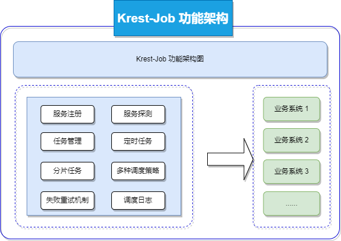
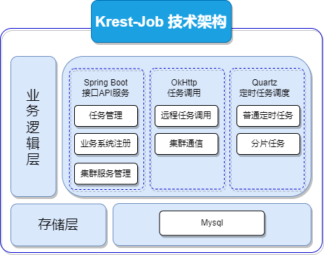
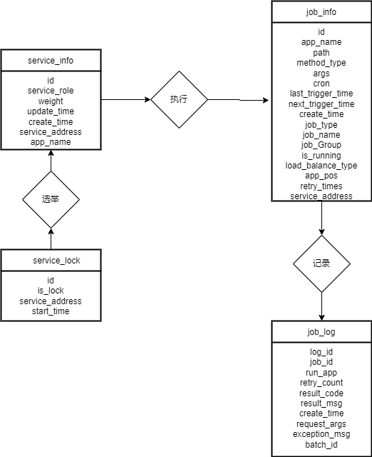
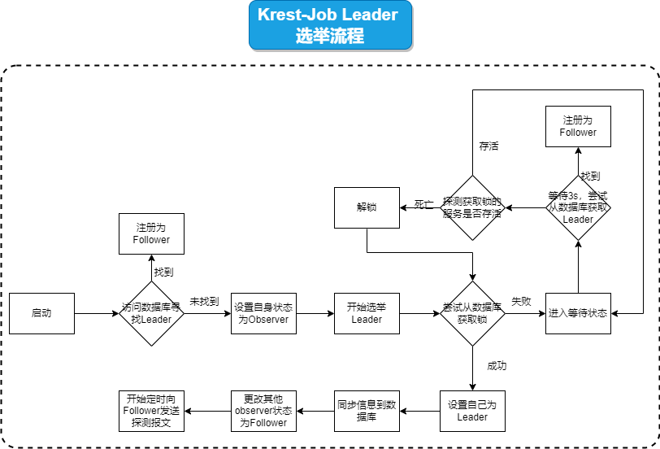
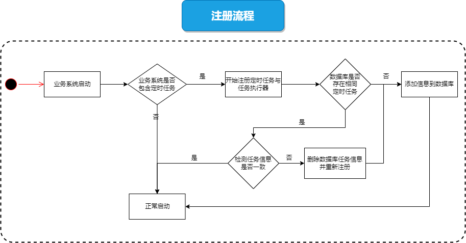
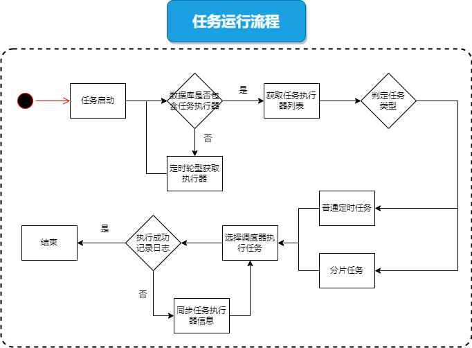
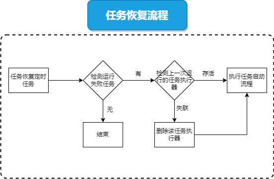
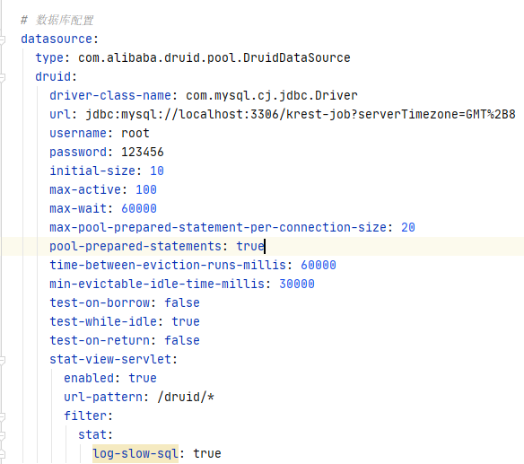
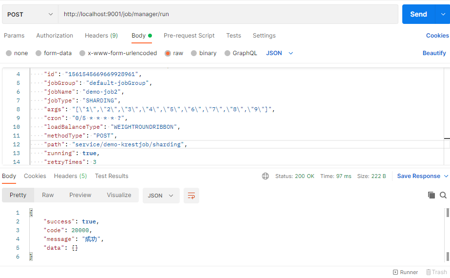

# Krest-Job（分布式任务调度框架）

## 说明

1. [Krest-Job：项目GitHub地址](https://github.com/krest32/krest-job)
2. 框架为自研，已在企业内部上线，
3. 仓库代码为早期版本的实例代码
4. 文档在持续更新中....

## 概述

### 编写目的

1. 介绍产品的特性与功能
2. 介绍产品的设计原理
3. 产品的简单使用示例

### 使用范围

1. Krest-Job 目前支持Java语言

### 功能特性

1. 分布式任务调度功能，支持普通任务调度与分片式任务调度
2. 普通任务调度策略支持：随机、轮询、权重
3. 分片任务调度调度策略支持：权重
4. 任务调度日志持久化
5. 任务调度失败后，自动重试机制
6. Krest-Job支持单体、集群两种部署模式，集群模式下，可保证服务高可用


## 架构设计

### 功能架构图



### 技术架构图




### 数据库ER视图



## 工作原理说明

### 高可用实现

说明：Krest-Job 集群模式下的两种角色

+ Leader的节点，只存在一个，负责集群内的任务管理：如任务的失败重试、任务调度功能等。
+ 除了Leader节点外，其他节点均为Follower，负责任务的实际调度工作、调度的日志记录

此处主要说明的是Leader节点的选举流程

1. Kest-Job的所有数据记录在Mysql当中，当服务启动时，会链接数据库，寻找当前角色为Leader 的节点，并且把自己的角色定义为Follower，定时发送心态

2. 如果不存在Leader节点，那么集群开始选举流程

3. 集群通过Mysql实现分布式锁，每个节点都会去抢占这个锁，集群中有且只有一个节点能够占有该锁，当该节点占有分布式锁之后，会更新数据库的状态为Leader，同时向集群中的其他节点广播消息

4. 为了避免占用该分布式锁的服务在同步消息的过程中挂掉，集群中其他的节点会对锁进行监测，超过一定时间，其他节点会向占有锁的服务发送心跳包，如果未收到心跳包，其他服务会将分布式锁进行释放，同时集群重新进入到选举状态，直到选举出新的Leader服务

   

**集群Leader选举流程图如下**




### 业务系统注册

定时任务注册到Krest-Job需要在Pom文件中导入krest-job-starter，该Jar支持SpringBoot，可以通过配置文件与注解的方式，实现业务系统任务的注册，具体流程如下：

1. 业务系统启动时，krest-job-starter 会自动解析添加注解的接口，同时从配置文件中读取Krest-Job的集群配置信息
2. 在加载Bean的过程中，krest-job-starter 会发送 Http 请求到Krest-Job中，进行注册
3. Krest-Job 收到注册信息会，会将任务的信息写入到数据库中，同时业务系统会作为一个执行器资源写入到数据库当中

**业务系统注册流程图如下：**





### 任务执行流程

Krest-Job 对任务的管理，通过Http请求进行实现，具体的任务调度，则使用Quartz框架进行管理。具体流程如下

1. 当需要去启动某个任务时，Leader节点会通过负载均衡选择一个Follower节点，Follower节点会将定时任务写入到服务的定时任务调度线程池，Leader节点同时更新数据到数据库中
2. 当任务到达需要执行的时间，Follower节点会通过负载均衡策略，选择合适的业务系统来执行定时任务，并且完成任务日志的记录，且最终写入到数据库当中

说明：

1. 普通定时任务默认的负载均衡策略是：随机
2. 分片任务任务的负载均衡策略是：权重





### 容错机制

任务进入自动恢复流程的判定规则：

1. 定时任务处于启动状态
2. 根据`cron`表达式解析并计算下一次任务运行的时间，对比上一次任务的执行时间是否正确，如果不正确，就发送探测报文到数据库记录的任务执行器，判断执行器是否存活





## 模块介绍

~~~bash
|-- admin 服务端
|-- core 核心工具包
|-- common 公用工具包
|-- demo 示例模块代码
|-- starter 客户端启动依赖
~~~

## 快速开始介绍

#### 添加数据库脚本

使用`sql\krest-job.sql`生成数据库

#### 配置 `Admin`数据库



#### 业务系统添加依赖

~~~xml
<dependency>
    <groupId>com.krest</groupId>
    <artifactId>krest-job-starter</artifactId>
    <version>1.0-SNAPSHOT</version>
</dependency>
~~~


#### 业务系统增加krest-job配置

~~~yml
# 配置服务的基本信息
krest:
  job:
    # 服务注册中心ip与port
    admin_address:
      - http://localhost:9001
      - http://localhost:9002
      - http://localhost:9004
    # 本机的 app 信息：权重、业务系统名称、业务系统地址
    weight: 1
    client_app_name: ${spring.application.name}
    client_address: http://localhost:8001
~~~


#### 编写接口方法（包含注解详解）

示例：

```java
import com.alibaba.fastjson.JSONObject;
import com.krest.job.common.balancer.LoadBalancerType;
import com.krest.job.common.entity.*;
import com.krest.job.core.annotation.KrestJobExecutor;
import com.krest.job.core.annotation.KrestJobhandler;
import com.krest.job.spring.starter.KrestJobService;
import lombok.extern.slf4j.Slf4j;
import org.springframework.beans.factory.annotation.Autowired;
import org.springframework.web.bind.annotation.*;

@KrestJobhandler /*添加 @KrestJobhandler 的接口，会被作为 JobHandler 注册到 admin 中 */
@RequestMapping(value = "/service")
@RestController
@Slf4j
public class DemoController {

    @Autowired
    KrestJobService krestJobService;

    /**
     * 注册定时任务类型
     * jobName：任务名称(同一个业务系统中需要保证唯一)
     * path: 远程调用的路径地址
     * method: 调用的方法类型，目前仅支持 Post
     * jobType: 任务类型：分片任务、普通定时任务
     * loadBalancerType ：负载均衡策略，支持：随机、轮询、权重
     */
    @KrestJobExecutor(
            jobName = "demo-job2",
            path = "service/demo-krestjob/sharding",
            method = MethodType.POST,
            jobType = JobType.SHARDING)
    @PostMapping("demo-krestjob/sharding")/* 目前仅支持 post 方法接口*/
    public String demoShardingJob(@RequestBody String requestStr) throws InterruptedException {
        System.out.println(requestStr);
        KrestJobRequest krestJobRequest = JSONObject.parseObject(requestStr, KrestJobRequest.class);
        ShardingJob shardingJob = JSONObject.parseObject(krestJobRequest.getArgs(), ShardingJob.class);

        log.info("demo2 执行分片任务- total sharding: {}, local sharding id :{}, weight:{}"
                , shardingJob.getTotalSharding(), shardingJob.getShardingId(), shardingJob.getWeight());

        String responseStr = JSONObject.toJSONString(
                new KrestJobResponse(krestJobRequest.getId(),
                        200, true, "success",
                        null, null));
        log.info("request data : {} ", shardingJob.getData());
        Thread.sleep(3000);

        return responseStr;
    }

    @KrestJobExecutor(
            jobName = "demo-job3",
            path = "service/demo-krestjob-post",
            method = MethodType.POST,
            loadBalancerType = LoadBalancerType.WEIGHTROUNDRIBBON)
    @PostMapping("demo-krestjob-post")
    public String demoNormalJob(@RequestBody String requestStr) {
        KrestJobRequest krestJobRequest = JSONObject.parseObject(requestStr, KrestJobRequest.class);
        log.info("demo2 执行任务 post 任务");
        log.info(krestJobRequest.toString());
        String responseStr = JSONObject.toJSONString(
                new KrestJobResponse(krestJobRequest.getId(),
                        200, true, "success",
                        null, null));
        log.info("request data : {} ", requestStr);

        return responseStr;
    }
}

```

### 示例： 任务调用截图



### 示例：分片任务启动报文

~~~json
{
    "appName": "demo-spring-krest-job",
    "createTime": "2022-07-03 16:49:47",
    "id": "1543439397951193088",
    "jobGroup": "default-jobGroup",
    "jobName": "demo-job2",
    "jobType": "SHARDING",
    "args": "[\"1\",\"2\",\"3\",\"4\",\"5\",\"6\",\"7\",\"8\",\"9\"]",
    "cron": "0/5 * * * * ?",
    "loadBalanceType": "WEIGHTROUNDRIBBON",
    "methodType": "POST",
    "path": "service/demo-krestjob/sharding",
    "running": true,
    "retryTimes": 3
}
~~~


### 示例：普通Post任务启动报文

~~~json
{
    "appName": "demo-spring-krest-job",
    "createTime": "2022-06-28 21:33:59",
    "id": "1543439397951193089",
    "args": "from server",
    "jobGroup": "default-jobGroup",
    "cron": "0/5 * * * * ?",
    "jobName": "demo-job3",
    "jobType": "NORMAL",
    "loadBalanceType": "WEIGHTROUNDRIBBON",
    "methodType": "POST",
    "retryTimes": 3,
    "path": "service/demo-krestjob-post",
    "running": true
}
~~~

## 示例:数据库内容记录

### Krest-job 集群启动

~~~
id                 |app_name    |service_address          |create_time        |update_time        |weight|service_role|
-------------------+------------+-------------------------+-------------------+-------------------+------+------------+
1561544928045617152|admin-server|http://10.187.28.101:9001|2022-08-22 10:44:57|2022-08-22 10:44:57|      |LEADER      |
1561544954461315072|admin-server|http://10.187.28.101:9002|2022-08-22 10:45:03|                   |      |FOLLOWER    |
1561544974921138176|admin-server|http://10.187.28.101:9004|2022-08-22 10:45:08|                   |      |FOLLOWER    |
~~~


### 业务系统启动

~~~
id                 |app_name             |service_address          |create_time        |update_time        |weight|service_role|
-------------------+---------------------+-------------------------+-------------------+-------------------+------+------------+
1561544928045617152|admin-server         |http://10.187.28.101:9001|2022-08-22 10:44:57|2022-08-22 10:44:57|      |LEADER      |
1561544954461315072|admin-server         |http://10.187.28.101:9002|2022-08-22 10:45:03|                   |      |FOLLOWER    |
1561544974921138176|admin-server         |http://10.187.28.101:9004|2022-08-22 10:45:08|                   |      |FOLLOWER    |
1561545663797903360|demo-spring-krest-job|http://localhost:8001    |2022-08-22 10:47:53|2022-08-22 10:48:20|1     |JOBHANDLER  |
1561545701055852544|demo-spring-krest-job|http://localHost:8002    |2022-08-22 10:48:01|2022-08-22 10:48:20|2     |JOBHANDLER  |
~~~


### 任务注册信息

~~~
id                 |app_name             |path                          |method_type|args|cron|last_trigger_time|next_trigger_time|create_time        |job_type|job_name |job_Group       |is_running|load_balance_type|app_pos|retry_times|service_address|
-------------------+---------------------+------------------------------+-----------+----+----+-----------------+-----------------+-------------------+--------+---------+----------------+----------+-----------------+-------+-----------+---------------+
1561545669669928960|demo-spring-krest-job|service/demo-krestjob-post    |POST       |    |    |                 |                 |2022-08-22 10:47:54|NORMAL  |demo-job3|default-jobGroup|         0|WEIGHTROUNDRIBBON|      0|           |               |
1561545669669928961|demo-spring-krest-job|service/demo-krestjob/sharding|POST       |    |    |                 |                 |2022-08-22 10:47:54|SHARDING|demo-job2|default-jobGroup|         0|RANDOM           |      0|           |               |
~~~


### 任务调用日志

~~~
log_id             |job_id             |run_app                                             |retry_count|result_code|result_msg |create_time        |request_args             |exception_msg|batch_id           |
-------------------+-------------------+----------------------------------------------------+-----------+-----------+-----------+-------------------+-------------------------+-------------+-------------------+
1561547119716257792|1561545669669928960|http://localHost:8002/service/demo-krestjob-post    |          0|200        |           |2022-08-22 10:53:40|from server              |             |1561547119716257793|
1561547140138323968|1561545669669928960|http://localHost:8002/service/demo-krestjob-post    |          0|200        |           |2022-08-22 10:53:45|from server              |             |1561547140138323969|
1561547161248256000|1561545669669928960|http://localhost:8001/service/demo-krestjob-post    |          0|200        |           |2022-08-22 10:53:50|from server              |             |1561547161248256001|
1561547182093946880|1561545669669928960|http://localHost:8002/service/demo-krestjob-post    |          0|200        |           |2022-08-22 10:53:55|from server              |             |1561547182093946881|
1561547203082244096|1561545669669928960|http://localHost:8002/service/demo-krestjob-post    |          0|200        |           |2022-08-22 10:54:00|from server              |             |1561547203082244097|
1561547224116678656|1561545669669928960|http://localhost:8001/service/demo-krestjob-post    |          0|200        |           |2022-08-22 10:54:05|from server              |             |1561547224116678657|
1561547245100781568|1561545669669928960|http://localHost:8002/service/demo-krestjob-post    |          0|200        |           |2022-08-22 10:54:10|from server              |             |1561547245100781569|
1561547266101661696|1561545669669928960|http://localHost:8002/service/demo-krestjob-post    |          0|200        |           |2022-08-22 10:54:15|from server              |             |1561547266101661697|
1561547287001878528|1561545669669928960|http://localhost:8001/service/demo-krestjob-post    |          0|200        |           |2022-08-22 10:54:20|from server              |             |1561547287001878529|
1561547307935649792|1561545669669928960|http://localHost:8002/service/demo-krestjob-post    |          0|200        |           |2022-08-22 10:54:25|from server              |             |1561547307935649793|
1561547307935649795|1561545669669928961|http://localhost:8001/service/demo-krestjob/sharding|          0|200        |           |2022-08-22 10:54:25|["1","2","3"]            |             |1561547307935649794|
1561547307935649796|1561545669669928961|http://localHost:8002/service/demo-krestjob/sharding|          0|200        |responseStr|2022-08-22 10:54:25|["4","5","6","7","8","9"]|             |1561547307935649794|
1561547329032998913|1561545669669928961|http://localhost:8001/service/demo-krestjob/sharding|          0|200        |           |2022-08-22 10:54:30|["1","2","3"]            |             |1561547329032998912|
1561547329032998914|1561545669669928961|http://localHost:8002/service/demo-krestjob/sharding|          0|200        |responseStr|2022-08-22 10:54:30|["4","5","6","7","8","9"]|             |1561547329032998912|
1561547329163022336|1561545669669928960|http://localHost:8002/service/demo-krestjob-post    |          0|200        |           |2022-08-22 10:54:30|from server              |             |1561547329163022337|
1561547349916438529|1561545669669928961|http://localhost:8001/service/demo-krestjob/sharding|          0|200        |           |2022-08-22 10:54:35|["1","2","3"]            |             |1561547349916438528|
1561547349916438530|1561545669669928960|http://localhost:8001/service/demo-krestjob-post    |          0|200        |           |2022-08-22 10:54:35|from server              |             |1561547349916438531|
1561547349916438532|1561545669669928961|http://localHost:8002/service/demo-krestjob/sharding|          0|200        |responseStr|2022-08-22 10:54:35|["4","5","6","7","8","9"]|             |1561547349916438528|
1561547370921512961|1561545669669928961|http://localhost:8001/service/demo-krestjob/sharding|          0|200        |           |2022-08-22 10:54:40|["1","2","3"]            |             |1561547370921512960|
1561547370921512962|1561545669669928961|http://localHost:8002/service/demo-krestjob/sharding|          0|200        |responseStr|2022-08-22 10:54:40|["4","5","6","7","8","9"]|             |1561547370921512960|
1561547371051536384|1561545669669928960|http://localHost:8002/service/demo-krestjob-post    |          0|200        |           |2022-08-22 10:54:40|from server              |             |1561547371051536385|
1561547392069193728|1561545669669928960|http://localHost:8002/service/demo-krestjob-post    |          0|200        |           |2022-08-22 10:54:45|from server              |             |1561547392069193729|
~~~


### 重试日志

情况说明：任务启动，但没有业务系统执行，系统会自动进行重试

~~~
log_id             |job_id             |run_app|retry_count|result_code|result_msg|create_time        |request_args                         |exception_msg                        |batch_id|
-------------------+-------------------+-------+-----------+-----------+----------+-------------------+-------------------------------------+-------------------------------------+--------+
1561543537155641344|1544687011770261505|       |          3|           |          |2022-08-22 10:39:25|["1","2","3","4","5","6","7","8","9"]|does not exit service for running job|        |
1561543554444562432|1544687011770261504|       |          3|           |          |2022-08-22 10:39:30|from server                          |does not exit service for running job|        |
1561543597805326336|1544687011770261505|       |          3|           |          |2022-08-22 10:39:40|["1","2","3","4","5","6","7","8","9"]|does not exit service for running job|        |
1561543681192235008|1544687011770261505|       |          3|           |          |2022-08-22 10:40:00|["1","2","3","4","5","6","7","8","9"]|does not exit service for running job|        |
1561543681519390720|1544687011770261504|       |          3|           |          |2022-08-22 10:40:00|from server                          |does not exit service for running job|        |
1561543764554027008|1544687011770261505|       |          3|           |          |2022-08-22 10:40:20|["1","2","3","4","5","6","7","8","9"]|does not exit service for running job|        |
1561543765330022400|1544687011770261504|       |          3|           |          |2022-08-22 10:40:20|from server                          |does not exit service for running job|        |
~~~

