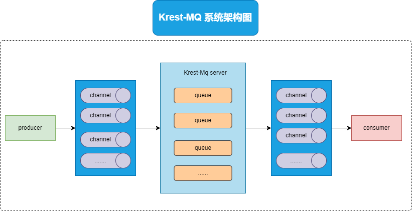
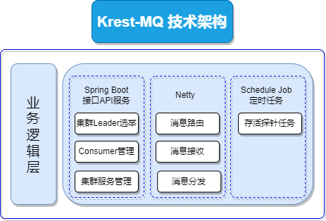
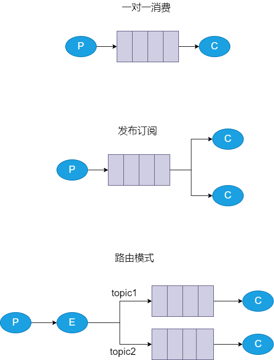
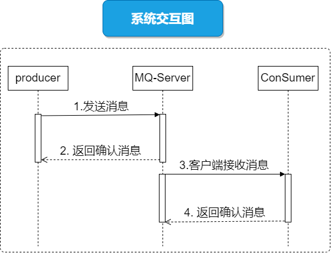
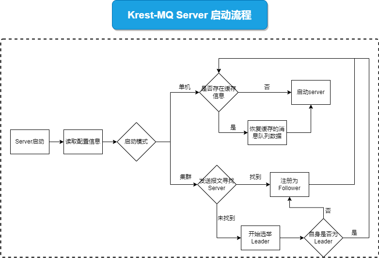
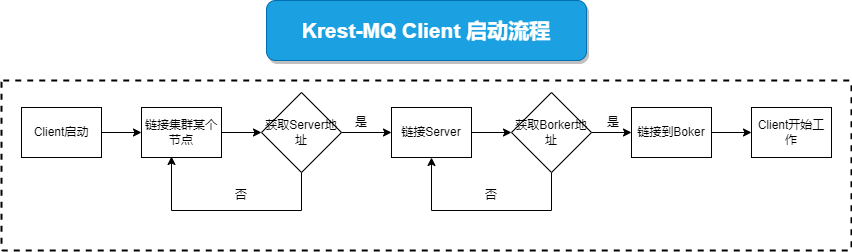
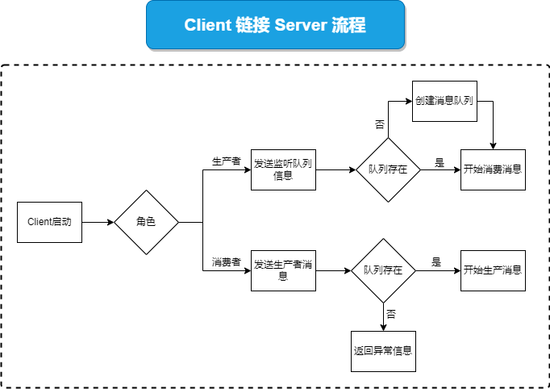
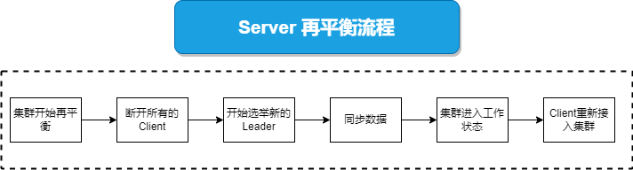

# Krest-MQ（消息队列）

## 必读：说明

1. [Krest-MQ：项目GitHub地址](https://github.com/krest32/krest-mq)
2. 请注意：本项目还在测试阶段
3. 文档在持续更新中....
4. 项目中有不完善的地方，欢迎批评和指正，[请点击联系方式](https://witerk.top/#/README)

## 需求介绍

### [编写目的](http://localhost:3000/#/./docs/14.个人开源项目/docs/Krest-Job/1.Krest-Job?id=编写目的)

1. 熟悉项目设计流程
2. 熟悉消息队列的工作流程
3. 作为框架最终验收的唯一标准
4. 方便读者了解到这个系统的架构

### [范围](http://localhost:3000/#/./docs/14.个人开源项目/docs/Krest-Job/1.Krest-Job?id=范围)

1. Krest-Job 目前仅支持Java客户端

## 架构图设计

### 系统架构图

### 技术架构图

### 工作模式

目前提供了3种工作模式

### 系统交互图

## 系统流程图

### Server 启动流程

恢复缓存数据说明：

1. Server 启动先会读取队列信息的持久化文件，获取得到队列的信息，包含
   1. 消息队列名称
   2. 消息队列类型
   3. 消息偏移量
2. 然后根据配置的缓存文件位置逐个读取缓存文件中的消息信息
3. 每个消息会包含一个消息ID，这个消息ID逐渐递增，通过比较偏移量，得到需要恢复缓存消息的位置

### Client启动流程

说明：

1. MQ 集群只有在工作状态下才能够接入 Client
2. Client 会不断重试，直到重新链接到 Server

### Client链接Server流程

说明：

1. 创建消息队列只能够由消费者来创建，一个消息队列，如果没有消费者，那么就没有存在的意义

### 集群再平衡流程

说明：

1. `Server`的再平衡分为两个阶段
   1. 选举`Server`，同步集群内的信息：每个`Serve`都会存在一个`Kid`，`Server`会推荐`Kid`最大的`Server`作为`Leader`，但是如果集群内存在多个`Server`，而所有`Server`集体重启的时候，可能会存在脑裂现象，所以每个`Follower`都会保存一份`Leader`信息，一旦`Leader`信息不一致时，就会促发集群的重新选举
   2. 同步集群内的`Message`数据：这个步骤需要在集群选举`Leader`之后，用户可以配置一个副本数量上限，然后选取`Message Id`最大的队列作为源数据，同步该队列到其他`Follower`上，当副本数量大于配置值，`Leader`会删除多余的副本

## 特性

1. 消费者与生产者对应关系
   1. 一对一
   2. 多对多
2. 消费者与队列关系
   1. 单点消费（随机推送）
   2. 广播模式（集群广播）
3. 消息推送模式：
   1. `Server` 主动 `Push` 机制
   2. 基于`Ack`的 客户端 `Pull` 机制
4. 队列支持类型
   1. 普通临时队列
   2. 普通持久化队列
   3. 延时（持久化）队列，
5. 延时队列
   1. 每个消息可以指定自己的超时时间
   2. 先过期的消息会优先从队列取出
6. `Ack`模式下，消息的重复消费（延时队列不支持）
   1. 使用方式：只要不返回`Ack`确认标志，该消息就可以一直被重复消费

7. 消息的有序性
   1. 采用单线程的方式将消息放入到队列中，所以队列的消息是有序的

8. 失败重连
   1. 客户端与服务端采用`Tcp`传输模式，当链接断开时，自动触发重连机制

9. 消息发送失败后的重试机制
   1. `Ack`模式下，发送失败后，尝试重新发送，重试上限次数可自定义
   2. 如果消费者不存在，`Server`会进入等待状态，该等待时间可自定义
   3. 注意：集群广播中，由于单点失败，可能会重复广播，导致某些节点重复消费
10. 基于`Protobuf`二进制，自定义消息的传递格式
11. 数据持久化机制
    1. 消息可持久化
    2. `Server`重启后，消息不丢失
    3. 消费者连接`Server`以后，自动推送积压消息
    4. 可设置缓存文件的大小
    5. 持久化机制：同步( 暂时不支持异步）
    6. 持久化消息超过设定的持久化最大值以后，程序自动覆盖最旧的缓存消息文件
12. 自定义 `Spring Starter` 整合 `Spring Boot`
13. 自定义 `KrestMQTemplate` 用于操作 `MQ`，简化发送消息的流程
14. 集群模式
    1. 高可用：
       + `queue` 的副本机制，可自定义副本数，集群会将为每个queue创建响应的副本到不同的机器
       + 客户端失败重连：某个 server 奔溃掉， 客户端可以链接集群中的 其他 server，继续正常工作
    2. 动态扩展
       + 集群针对`queue`进行备份，每个节点的 `queue`可能是不同的，而非节点，所以集群可以进行动态的横向扩展queue，而不影响工作效率，但是需要注意每个queue的名字需要是唯一的，否则会发生异常
    3. 高度承受消息积压的能力：
       + 因为每个节点的`queue`可能是不同的，所以集群承受消息积压的能力也会比较高
    4. 高效的同步策略
       + 采用 `Udp` 传输模式，可以高效传输数据
       + 主动更新+被动复制，保证消息不丢失

## 待修复

1. 消息队列的创建有消费者完成，如果生产者传递消息的队列不存在，会返回异常

