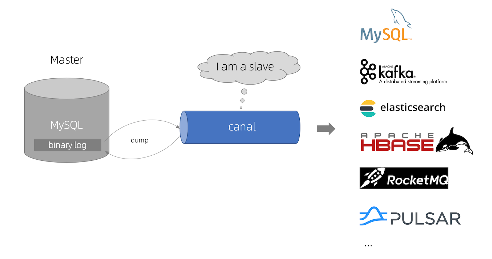

# Canal

## 相关

### 地址

+ [canal-github](https://github.com/alibaba/canal)

### 版本特色

1. canal 1.1.x 版本（[release_note](https://github.com/alibaba/canal/releases)）,性能与功能层面有较大的突破,重要提升包括:
   + 整体性能测试&优化,提升了150%. 
   + 原生支持prometheus监控 
   + 原生支持kafka消息投递 
   + 原生支持aliyun rds的binlog订阅 (解决自动主备切换/oss binlog离线解析) 
   + 原生支持docker镜像 
2. canal 1.1.4版本，迎来最重要的WebUI能力，引入canal-admin工程，支持面向WebUI的canal动态管理能力，支持配置、任务、日志等在线白屏运维能力，具体文档：[Canal Admin Guide](https://github.com/alibaba/canal/wiki/Canal-Admin-Guide)

## 概述

### 什么是canal

1. canal是用java开发的基于数据库增量日志解析，提供增量数据订阅&消费的中间件。目前，canal主要支持了MySQL的binlog解析，解析完成后才利用canal client 用来处理获得的相关数据。（数据库同步需要阿里的otter中间件，基于canal）
2. 起源：早期，阿里巴巴B2B公司因为存在杭州和美国双机房部署，存在跨机房同步的业务需求。不过早期的数据库同步业务，主要是基于trigger的方式获取增量变更，不过从2010年开始，阿里系公司开始逐步的尝试基于数据库的日志解析，获取增量变更进行同步，由此衍生出了增量订阅&消费的业务，从此开启了一段新纪元。

### 使用场景

1. 阿里otter（阿里用于进行异地数据库之间的同步框架中间件的一部分，这是原始场景

2. 更新缓存：如果有大量的请求发送到mysql的话，mysql查询速度慢，QPS上不去，光查mysql可能会瘫痪，那就可以在前面加个缓存，这个缓存有2个主要的问题。一是缓存没有怎么办，二是数据不一致怎么办。对于第一个问题查缓存没有就差mysql，mysql再往缓存中写一份。对于第二个问题，如果数据库修改了，那就采用异步的方式进行修改，启动一个canal服务，监控mysql，只要一有变化就同步缓存，这样mysql和缓存就能达到最终的一致性。

![[外链图片转存失败,源站可能有防盗链机制,建议将图片保存下来直接上传(img-P4MRL3pv-1612757904184)(assets/1610588585694.png)]](img/watermark,type_ZmFuZ3poZW5naGVpdGk,shadow_10,text_aHR0cHM6Ly9ibG9nLmNzZG4ubmV0L3dlaXhpbl80Mzc4NjI1NQ==,size_16,color_FFFFFF,t_70-16687002102283.png)

3. 抓取业务数据新增变化表，用于制作拉链表：做拉链表是需要有增加时间和修改时间的，需要数据今天新增和变化的数据，如果时间不全就没办法知道哪些是修改的。可以通过canal把变化的抽到自己的表里，以后数据就从这个表出。
4. 取业务表的新增变化数据，用于制作实时统计

##  工作原理

### Mysql 主备原理

![[外链图片转存失败,源站可能有防盗链机制,建议将图片保存下来直接上传(img-AYNMkES5-1612757904186)(assets/1610588660766.png)]](img/watermark,type_ZmFuZ3poZW5naGVpdGk,shadow_10,text_aHR0cHM6Ly9ibG9nLmNzZG4ubmV0L3dlaXhpbl80Mzc4NjI1NQ==,size_16,color_FFFFFF,t_70-16687003315186.png)

 首先了解一下mysql主备复制原理：

1. master主库将改变记录，发送到二进制文件（binary log）中
2. slave从库向mysql Master发送dump协议，将master主库的binary log events拷贝到它的中继日志（relay log）
3. slave从库读取并重做中继日志中的事件，将改变的数据同步到自己的数据库

### Canal 工作原理  

1. 把自己伪装成slave，从master复制数据。
2. 读取binlog是需要master授权的，因为binlog是加密的，授权分用户名密码才能读。
3. master授权后不知道读他的binlog的是从机还是canal，他的所有传输协议都符合从机的标准，所以master一直以为是从机读的。

![[外链图片转存失败,源站可能有防盗链机制,建议将图片保存下来直接上传(img-Dsi3tRlj-1612757904195)(assets/1610590410151.png)]](img/watermark,type_ZmFuZ3poZW5naGVpdGk,shadow_10,text_aHR0cHM6Ly9ibG9nLmNzZG4ubmV0L3dlaXhpbl80Mzc4NjI1NQ==,size_16,color_FFFFFF,t_70-16687004344739.png)

## 架构设计

个人理解，数据增量订阅与消费应当有如下几个点：

1. 增量订阅和消费模块应当包括binlog日志抓取，binlog日志解析，事件分发过滤（EventSink），存储（EventStore）等主要模块。
2. 如果需要确保HA可以采用Zookeeper保存各个子模块的状态，让整个增量订阅和消费模块实现无状态化，当然作为consumer(客户端)的状态也可以保存在zk之中。
3. 整体上通过一个Manager System进行集中管理，分配资源。

### canal 模块

#### 说明

- server代表一个canal运行实例，对应于一个jvm
- instance对应于一个数据队列 （1个server对应1..n个instance)

#### instance模块

- eventParser (数据源接入，模拟slave协议和master进行交互，协议解析)
- eventSink (Parser和Store链接器，进行数据过滤，加工，分发的工作)
- eventStore (数据存储)
- metaManager (增量订阅&消费信息管理器)

#### EventParser

整个parser过程大致可分为几部：

1. Connection获取上一次解析成功的位置（如果第一次启动，则获取初始制定的位置或者是当前数据库的binlog位点）
2. Connection建立连接，发生BINLOG_DUMP命令
3. Mysql开始推送Binary Log
4. 接收到的Binary Log通过Binlog parser进行协议解析，补充一些特定信息
5. 传递给EventSink模块进行数据存储，是一个阻塞操作，直到存储成功
6. 存储成功后，定时记录Binary Log位置

#### EventSink设计

说明：

- 数据过滤：支持通配符的过滤模式，表名，字段内容等
- 数据路由/分发：解决1:n (1个parser对应多个store的模式)
- 数据归并：解决n:1 (多个parser对应1个store)
- 数据加工：在进入store之前进行额外的处理，比如join

**1.数据1:n业务 ：**

为了合理的利用数据库资源， 一般常见的业务都是按照schema进行隔离，然后在mysql上层或者dao这一层面上，进行一个数据源路由，屏蔽数据库物理位置对开发的影响，阿里系主要是通过cobar/tddl来解决数据源路由问题。 所以，一般一个数据库实例上，会部署多个schema，每个schema会有由1个或者多个业务方关注。

**2.数据n:1业务：**

同样，当一个业务的数据规模达到一定的量级后，必然会涉及到水平拆分和垂直拆分的问题，针对这些拆分的数据需要处理时，就需要链接多个store进行处理，消费的位点就会变成多份，而且数据消费的进度无法得到尽可能有序的保证。 所以，在一定业务场景下，需要将拆分后的增量数据进行归并处理，比如按照时间戳/全局id进行排序归并.

#### EventStore设计

目前实现了Memory内存、本地file存储以及持久化到zookeeper以保障数据集群共享。Memory内存的RingBuffer设计：

定义了3个cursor

- Put : Sink模块进行数据存储的最后一次写入位置
- Get : 数据订阅获取的最后一次提取位置
- Ack : 数据消费成功的最后一次消费位置

实现说明：

- Put/Get/Ack cursor用于递增，采用long型存储
- buffer的get操作，通过取余或者与操作。(与操作： cusor & (size – 1) , size需要为2的指数，效率比较高)

#### Instance设计

instance代表了一个实际运行的数据队列，包括了EventPaser,EventSink,EventStore等组件。抽象了CanalInstanceGenerator，主要是考虑配置的管理方式：

1. manager方式： 和你自己的内部web console/manager系统进行对接。(alibaba内部使用方式)

2. spring方式：基于spring xml + properties进行定义，构建spring配置.
   + spring/memory-instance.xml 所有的组件(parser , sink , store)都选择了内存版模式，记录位点的都选择了memory模式，重启后又会回到初始位点进行解析。特点：速度最快，依赖最少
   + spring/file-instance.xml 所有的组件(parser , sink , store)都选择了基于file持久化模式，注意，不支持HA机制.支持单机持久化
   + spring/default-instance.xml 所有的组件(parser , sink , store)都选择了持久化模式，目前持久化的方式主要是写入zookeeper，保证数据集群共享. 支持HA
   + spring/group-instance.xml 主要针对需要进行多库合并时，可以将多个物理instance合并为一个逻辑instance，提供客户端访问。场景：分库业务。 比如产品数据拆分了4个库，每个库会有一个instance，如果不用group，业务上要消费数据时，需要启动4个客户端，分别链接4个instance实例。使用group后，可以在canal server上合并为一个逻辑instance，只需要启动1个客户端，链接这个逻辑instance即可.

#### Server设计

server代表了一个canal的运行实例，为了方便组件化使用，特意抽象了Embeded(嵌入式) / Netty(网络访问)的两种实现：

- Embeded : 对latency和可用性都有比较高的要求，自己又能hold住分布式的相关技术(比如failover)
- Netty : 基于netty封装了一层网络协议，由canal server保证其可用性，采用的pull模型，当然latency会稍微打点折扣，不过这个也视情况而定。

### 数据格式

canal采用protobuff:

~~~protobuf
Entry
    Header
        logfileName [binlog文件名]
        logfileOffset [binlog position]
        executeTime [发生的变更]
        schemaName
        tableName
        eventType [insert/update/delete类型]
    entryType   [事务头BEGIN/事务尾END/数据ROWDATA]
    storeValue  [byte数据,可展开，对应的类型为RowChange]   
RowChange
    isDdl       [是否是ddl变更操作，比如create table/drop table]
    sql     [具体的ddl sql]
    rowDatas    [具体insert/update/delete的变更数据，可为多条，1个binlog event事件可对应多条变更，比如批处理]
        beforeColumns [Column类型的数组]
        afterColumns [Column类型的数组]     
Column
    index      
    sqlType     [jdbc type]
    name        [column name]
    isKey       [是否为主键]
    updated     [是否发生过变更]
    isNull      [值是否为null]
    value       [具体的内容，注意为文本]
~~~

### 工作示例

比如数据库中的表：

~~~sql
mysql> select * from person;
+----+------+------+------+
| id | name | age  | sex  |
+----+------+------+------+
|  1 | zzh  |   10 | m    |
|  3 | zzh3 |   12 | f    |
|  4 | zzh4 |    5 | m    |
+----+------+------+------+
3 rows in set (0.00 sec)
~~~

更新一条数据（update person set age=15 where id=4）：

~~~sql
****************************************************
* Batch Id: [2] ,count : [3] , memsize : [165] , Time : 2016-09-07 15:54:18
* Start : [mysql-bin.000003:6354:1473234846000(2016-09-07 15:54:06)]
* End : [mysql-bin.000003:6550:1473234846000(2016-09-07 15:54:06)]
****************************************************
================> binlog[mysql-bin.000003:6354] , executeTime : 1473234846000 , delay : 12225ms
 BEGIN ----> Thread id: 67
----------------> binlog[mysql-bin.000003:6486] , name[canal_test,person] , eventType : UPDATE , executeTime : 1473234846000 , delay : 12225ms
id : 4    type=int(11)
name : zzh4    type=varchar(100)
age : 15    type=int(11)    update=true
sex : m    type=char(1)
----------------
 END ----> transaction id: 308
================> binlog[mysql-bin.000003:6550] , executeTime : 1473234846000 , delay : 12240ms
~~~

## 高可用

### 概述

1. 一个总的canal服务器进程，每一个instance就是一个线程，单独对应一个mysql服务器的binlog。再起一个canal服务的话，对于同一个mysql服务器不能做负载均衡，数据分片等。有两个canal服务器都监控一个或多个mysql服务器的binlog，这两个canal服务同时只能有一个提供服务，当提供服务的这个宕机时，zookeeper能知道，zookeeper就通知另一个canal服务器让他提供服务。当原来宕机的那个再启动起来时，是抢占模式的，谁抢到就谁上，没抢到就standy模式。canal本身就是一个工具不存数据，宕机了就宕机，只有还有另外一个能提供服务就行，所以没有什么同步问题（不像数据库有同步问题）。因为启动canal服务是需要消耗资源的，不想redis高可用占资源太少了。canal的standy资源也不能给少了，要双份资源，就看企业在意不在意，服务核心不核心。
2. maxwell和canal非常像，maxwell连高可用机制都没提供，倒了就再起。其实很多软件都是不提供高可用方案的，如果怕他倒的话，可以用Keepalived，这个机制很简单就是做心跳监测，可以给任何进程做一个心跳检测，可以一直检测他在不在进程列表里，如果宕了进程没了他会有一系列触发操作，可以在他里面写一个shell，如还有一个备机，要是这个挂了就在备机启动。或者自己手工在restart，这是一种通用型方案。Keepalived和maxwell是完全没有耦合关系的，maxwell完全不知道Keepalived的存在，Keepalived是从外围的观察者观察这个进程，不像zookeeper，是需要向它注册的。

### 详解

canal的HA分为两部分，canal server和canal client分别有对应的ha实现：

- canal server: 为了减少对mysql dump的请求，不同server上的instance要求同一时间只能有一个处于running，其他的处于standby状态.
- canal client: 为了保证有序性，一份instance同一时间只能由一个canal client进行get/ack/rollback操作，否则客户端接收无法保证有序。

整个HA机制的控制主要是依赖了zookeeper的几个特性，watcher和EPHEMERAL节点(和session生命周期绑定)

Canal Server:

大致步骤：

1. canal server要启动某个canal instance时都先向zookeeper进行一次尝试启动判断 (实现：创建EPHEMERAL节点，谁创建成功就允许谁启动)
2. 创建zookeeper节点成功后，对应的canal server就启动对应的canal instance，没有创建成功的canal instance就会处于standby状态
3. 一旦zookeeper发现canal server A创建的节点消失后，立即通知其他的canal server再次进行步骤1的操作，重新选出一个canal server启动instance.
4. canal client每次进行connect时，会首先向zookeeper询问当前是谁启动了canal instance，然后和其建立链接，一旦链接不可用，会重新尝试connect.
5. Canal Client的方式和canal server方式类似，也是利用zokeeper的抢占EPHEMERAL节点的方式进行控制.

## 总结

这里总结了一下Canal的一些点，仅供参考：

1. 原理：模拟mysql slave的交互协议，伪装自己为mysql slave，向mysql master发送dump协议；mysql master收到dump请求，开始推送binary log给slave(也就是canal)；解析binary log对象(原始为byte流)
2. 重复消费问题：在消费端解决。
3. 采用开源的open-replicator来解析binlog
4. canal需要维护EventStore，可以存取在Memory, File, zk
5. canal需要维护客户端的状态，同一时刻一个instance只能有一个消费端消费
6. 数据传输格式：protobuff
7. 支持binlog format 类型:statement, row, mixed. 多次附加功能只能在row下使用，比如otter
8. binlog position可以支持保存在内存，文件，zk中
9. instance启动方式：rpc/http; 内嵌
10. 有ACK机制
11. 无告警，无监控，这两个功能都需要对接外部系统
12. 方便快速部署。
