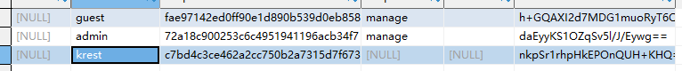

# Shiro

## 概述

### 什么是shiro
Apache Shiro 是Java 的一个安全框架。Shiro 可以非常容易的开发出足够好的应用，其不仅可以用在JavaSE 环境，也可以用在JavaEE 环境。Shiro 可以帮助我们完成：认证、授权、加密、会话管理、与Web 集成、缓存等。

### 为什么要学shiro

1. 既然shiro将安全认证相关的功能抽取出来组成一个框架，使用shiro就可以非常快速的完成认证、授权等功能的开发，降低系统成本。

2. shiro使用广泛，shiro可以运行在web应用，非web应用，集群分布式应用中越来越多的用户开始使用shiro。
3. java领域中spring security(原名Acegi)也是一个开源的权限管理框架，但是spring security依赖spring运行，而shiro就相对独立，最主要是因为shiro使用简单、灵活，所以现在越来越多的用户选择shiro。
4. 但是Github Star shiro 3.8K 而Spring Security 6.9K

### 基本功能

1. Authentication：身份认证/登录，验证用户是不是拥有相应的身份；

2. Authorization：授权，即权限验证，验证某个已认证的用户是否拥有某个权限；
   1. 即判断用户是否能做事情，
   2. 常见的如：验证某个用户是否拥有某个角色。或者细粒度的验证某个用
      户对某个资源是否具有某个权限；

3. Session Manager：会话管理，即用户登录后就是一次会话，在没有退出之前，它的所有信息都在会话中；会话可以是普通JavaSE环境的，也可以是如Web环境的；
4. Cryptography：加密，保护数据的安全性，如密码加密存储到数据库，而不是明文存储；
5. Web Support：Web 支持，可以非常容易的集成到Web 环境；
6. Caching：缓存，比如用户登录后，其用户信息、拥有的角色/权限不必每次去查，这样可以提高效率；
7. Concurrency：shiro 支持多线程应用的并发验证，即如在一个线程中开启另一个线程，能 把权限自动传播过去；
8. Testing：提供测试支持；
9. Run As：允许一个用户假装为另一个用户（如果他们允许）的身份进行访问；
10. Remember Me：记住我，这个是非常常见的功能，即一次登录后，下次再来的话不用登录了。

注意：Shiro 不会去维护用户、维护权限；这些需要我们自己去设计/提供；然后通过 相应的接口注入给Shiro即可。关于设计，后面的ssm集成shiro里面去说哦

### 架构说明

1. Subject
   Subject即主体，外部应用与subject进行交互，subject记录了当前操作用户，将用户的概念理解为当前操作的主体，可能是一个通过浏览器请求的用户，也可能是一个运行的程序。 Subject在shiro中是一个接口，接口中定义了很多认证授相关的方法，外部程序通过subject进行认证授，而subject是通过SecurityManager安全管理器进行认证授权

2. SecurityManager
   SecurityManager即安全管理器，对全部的subject进行安全管理，它是shiro的核心，负责对所有的subject进行安全管理。通过SecurityManager可以完成subject的认证、授权等，实质上SecurityManager是通过Authenticator进行认证，通过Authorizer进行授权，通过SessionManager进行会话管理等。
   SecurityManager是一个接口，继承了Authenticator, Authorizer, SessionManager这三个接口。

3. Authenticator
   Authenticator即认证器，对用户身份进行认证，Authenticator是一个接口，shiro提供ModularRealmAuthenticator实现类，通过ModularRealmAuthenticator基本上可以满足大多数需求，也可以自定义认证器。

4. Authorizer
   Authorizer即授权器，用户通过认证器认证通过，在访问功能时需要通过授权器判断用户是否有此功能的操作权限。

5. realm
   Realm即领域，相当于datasource数据源，securityManager进行安全认证需要通过Realm获取用户权限数据，比如：如果用户身份数据在数据库那么realm就需要从数据库获取用户身份信息。
   注意：不要把realm理解成只是从数据源取数据，在realm中还有认证授权校验的相关的代码。

6. sessionManager
   sessionManager即会话管理，shiro框架定义了一套会话管理，它不依赖web容器的session，所以shiro可以使用在非web应用上，也可以将分布式应用的会话集中在一点管理，此特性可使它实现单点登录。

7. SessionDAO
   SessionDAO即会话dao，是对session会话操作的一套接口，比如要将session存储到数据库，可以通过jdbc将会话存储到数据库。

8. CacheManager
   CacheManager即缓存管理，将用户权限数据存储在缓存，这样可以提高性能。

9. Cryptography
   Cryptography即密码管理，shiro提供了一套加密/解密的组件，方便开发。比如提供常用的散列、加/解密等功能。

### shiro的一些jar包说明

1. shiro-all 是shiro的所有功能jar包
2. shiro-core 是shiro的基本功能包
3. shiro-web 和web集成的包
4. shiro-spring shrio和spring集成的包

## 示例测试

### 认证的实现

~~~java
import org.apache.shiro.SecurityUtils;
import org.apache.shiro.authc.AuthenticationToken;
import org.apache.shiro.authc.IncorrectCredentialsException;
import org.apache.shiro.authc.UnknownAccountException;
import org.apache.shiro.authc.UsernamePasswordToken;
import org.apache.shiro.mgt.DefaultSecurityManager;
import org.apache.shiro.realm.text.IniRealm;
import org.apache.shiro.subject.Subject;

public class ShiroAuthenticatorTest {
    public static void main(String[] args){
        // 1、创建安全管理器对象
        DefaultSecurityManager securityManager = new DefaultSecurityManager();
        // 2、给安全管理器设置realm
        securityManager.setRealm(new IniRealm("classpath:shiro.ini"));
        // 3、给全局安全工具类SecurityUtils设置安全管理器
        SecurityUtils.setSecurityManager(securityManager);
        // 4、拿到当前的subject
        Subject subject = SecurityUtils.getSubject();
        // 5、创建令牌
        AuthenticationToken token = new UsernamePasswordToken("christy","123456");

        try {
            // 6、用户认证
            System.out.println("认证状态："+subject.isAuthenticated());
            subject.login(token);
            System.out.println("认证状态："+subject.isAuthenticated());
        } catch (UnknownAccountException e){
            e.printStackTrace();
            System.out.println("认证失败：用户不存在！");
        } catch (IncorrectCredentialsException e){
            e.printStackTrace();
            System.out.println("认证失败：密码不正确！");
        } catch (Exception e){
            e.printStackTrace();
        }
    }
}

~~~

~~~bash
认证的几种状态
UnknownAccountException：用户名错误
IncorrectCredentialsException：密码错误
DisabledAccountException：账号被禁用
LockedAccountException：账号被锁定
ExcessiveAttemptsException：登录失败次数过多
ExpiredCredentialsException：凭证过期
~~~

### Relam实现认证

**Realm的继承关系如下**

上面我们实现了简单的认证并且分析了认证的基本流程，通常情况下shiro的认证都是通过自定义relam来实现的

~~~java
@Bean
public ShiroFilterFactoryBean shiroFilterFactoryBean(@Qualifier("securityManager") DefaultWebSecurityManager securityManager){
    ShiroFilterFactoryBean factoryBean = new ShiroFilterFactoryBean();
    factoryBean.setSecurityManager(securityManager);
    Map<String,String> map = new HashMap<String, String>();
    //登录状态下才可以访问main页面，manage权限可访问manage页面，admin角色可访问admin页面
    map.put("/main", "authc");
    map.put("/manage","perms[manage]");
    map.put("/admin", "roles[admin]");
    factoryBean.setFilterChainDefinitionMap(map);
    //未登录状态下访问将跳转至login页面
    factoryBean.setLoginUrl("/login");
    //无授限状态下访问将请求unauthor
    factoryBean.setUnauthorizedUrl("/unauthor");
    return factoryBean;
}
~~~

### 加密策略

#### 自带加密

1.  实际应用中用户的密码并不是明文存储在数据库中的，而是采用一种加密算法将密码加密后存储在数据库中。Shiro中提供了一整套的加密算法，并且提供了随机盐。shiro使用指定的加密算法将用户密码和随机盐进行加密，并按照指定的散列次数将散列后的密码存储在数据库中。由于随机盐每个用户可以不同，这就极大的提高了密码的安全性。
2. 也就是即便密码相同，但是生成的密文却不同

3. 代码示例

~~~java
@Override
public void createAccount(Account account) {
    //随机生成salt值，并通过用户注册的密码和salt值经两次md5算法生成真实存储的密码
    String salt = new SecureRandomNumberGenerator().nextBytes().toString();
    String password = new SimpleHash("md5", account.getPassword(), salt, 2).toString();
    account.setPassword(password);
    account.setSalt(salt);
    mapper.insert(account);
}
~~~

#### 自定义加密

### 授权

#### 授权方式

1. 基于资源的访问控制
2. 基于角色的访问控制

#### 编码方式

1. 编程式

~~~java
Subject subject = SecurityUtils.getSubject();
if(subject.hasRole("admin")) {
	//有权限
} else {
	//无权限
}

~~~

2. 注解式

~~~java
@RequiresRoles("admin")
public void hello() {
	//有权限
}
~~~

3. 标签式

~~~html
JSP/GSP 标签：在JSP/GSP 页面通过相应的标签完成：
<shiro:hasRole name="admin">
	<!— 有权限—>
</shiro:hasRole>
注意: Thymeleaf 中使用shiro需要额外集成!
~~~

