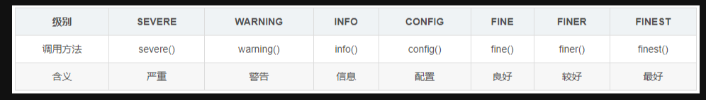
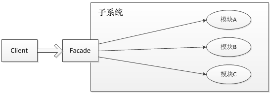

# 日志

## JDK日志

从jdk1.4起，JDK开始自带一套日志系统。JDK Logger最大的优点就是不需要任何类库的支持，只要有Java的运行环境就可以使用。相对于其他的日志框架，JDK自带的日志可谓是鸡肋，无论易用性，功能还是扩展性都要稍逊一筹，所以在商业系统中很少直接使用。

JDK默认的logging配置文件为：$JAVA_HOME/jre/lib/logging.properties，可以使用系统属性java.util.logging.config.file指定相应的配置文件对默认的配置文件进行覆盖，比如， java -Djava.util.logging.config.file=myfile

JDK Logging把日志分为如下七个级别，等级依次降低。

### 示例1

如果将级别设置为INFO，则INFO后面的不会输出。info前面的全部输出。通过控制级别达到控制输出的目的。

~~~java
import java.util.logging.Level;
import java.util.logging.Logger;
 
public class LogJDKTest {
       private static Logger log = Logger.getLogger(LogJDKTest.class.toString());
 
       public static void main(String[] args) {
              // all→finest→finer→fine→config→info→warning→server→off
              // 级别依次升高，后面的日志级别会屏蔽之前的级别
              log.setLevel(Level.INFO);
              log.finest("finest");
              log.finer("finer");
              log.fine("fine");
              log.config("config");
              log.info("info");
              log.warning("warning");
              log.severe("server");
       }
}
~~~

 控制台输出：

~~~java
六月 23, 2021 11:07:29 上午 com.test.log.LogJDKTest main
信息: info
六月 23, 2021 11:07:29 上午 com.test.log.LogJDKTest main
警告: warning
六月 23, 2021 11:07:29 上午 com.test.log.LogJDKTest main
严重: server
~~~

### 示例2

1. JDK log默认会有一个控制台输出，它有两个参数，第一个参数设置输出级别，第二个参数设置输出的字符串。

2. 同时也可以设置多个输出（Hander），每个输出设置不用的level，然后通过addHandler添加到了log中。

注意：为log设置级别与为每个handler设置级别的意义是不同的。

~~~java
import java.util.logging.ConsoleHandler;
import java.util.logging.Handler;
import java.util.logging.Level;
import java.util.logging.Logger;
 
public class LogJDKTest {
    public static Logger log = Logger.getLogger(LogJDKTest.class.toString());
    static {
        Handler console = new ConsoleHandler();
        console.setLevel(Level.SEVERE);
        log.addHandler(console);
        Handler console2 = new ConsoleHandler();
        console2.setLevel(Level.INFO);
        log.addHandler(console2);
    }
    public static void main(String[] args) {
        // all→finest→finer→fine→config→info→warning→server→off
        // 级别依次升高，后面的日志级别会屏蔽之前的级别
        log.setLevel(Level.INFO);
        log.finest("finest");
        log.finer("finer");
        log.fine("fine");
        log.config("config");
        log.info("info");
        log.warning("warning");
        log.severe("server");
    }
}
~~~

控制台输出：

~~~java
六月 23, 2021 11:09:03 上午 com.middleware.test.log.LogJDKTest main
信息: info
六月 23, 2021 11:09:03 上午 com.middleware.test.log.LogJDKTest main
警告: warning
六月 23, 2021 11:09:03 上午 com.middleware.test.log.LogJDKTest main
严重: server
六月 23, 2021 11:09:03 上午 com.middleware.test.log.LogJDKTest main
严重: server
~~~

all，则所有的信息都会被输出，如果设为off，则所有的信息都不会输出。

## log4j1

Apache的一个开放源代码项目，通过使用Log4j，我们可以控制日志信息输送的目的地是控制台、文件、GUI组件、甚至是套接口服务 器、NT的事件记录器、UNIX Syslog守护进程等；用户也可以控制每一条日志的输出格式；通过定义每一条日志信息的级别，用户能够更加细致地控制日志的生成过程。这些可以通过一个 配置文件来灵活地进行配置，而不需要修改程序代码。

导入maven

~~~xml
<dependency>
    <groupId>log4j</groupId>
    <artifactId>log4j</artifactId>
    <version>1.2.17</version>
</dependency>
~~~

在resources同级创建并设置log4j.properties

~~~
### 设置###
log4j.rootLogger = debug,stdout,D,E
 
### 输出信息到控制抬 ###
log4j.appender.stdout = org.apache.log4j.ConsoleAppender
log4j.appender.stdout.Target = System.out
log4j.appender.stdout.layout = org.apache.log4j.PatternLayout
log4j.appender.stdout.layout.ConversionPattern = [%-5p] %d{yyyy-MM-dd HH:mm:ss,SSS} method:%l%n%m%n
 
### 输出DEBUG 级别以上的日志到=E://logs/error.log ###
log4j.appender.D = org.apache.log4j.DailyRollingFileAppender
log4j.appender.D.File = E://logs/log.log
log4j.appender.D.Append = true
log4j.appender.D.Threshold = DEBUG
log4j.appender.D.layout = org.apache.log4j.PatternLayout
log4j.appender.D.layout.ConversionPattern = %-d{yyyy-MM-dd HH:mm:ss}  [ %t:%r ] - [ %p ]  %m%n
 
### 输出ERROR 级别以上的日志到=E://logs/error.log ###
log4j.appender.E = org.apache.log4j.DailyRollingFileAppender
log4j.appender.E.File =E://logs/error.log
log4j.appender.E.Append = true
log4j.appender.E.Threshold = ERROR
log4j.appender.E.layout = org.apache.log4j.PatternLayout
log4j.appender.E.layout.ConversionPattern = %-d{yyyy-MM-dd HH:mm:ss}  [ %t:%r ] - [ %p ]  %m%n
~~~

设置日志内容

~~~java
import org.apache.log4j.Logger;
 
public class TestLog4j {
    private static Logger logger = Logger.getLogger(TestLog4j.class);
 
    public static void main(String[] args) {
        // 记录debug级别的信息
        logger.debug("This is debug message.");
        // 记录info级别的信息
        logger.info("This is info message.");
        // 记录error级别的信息
        logger.error("This is error message.");
    }
}
~~~

输出结果

~~~
[DEBUG] 2021-06-23 12:00:46,717 method:com.middleware.test.log.TestLog4j.main(TestLog4j.java:11)
This is debug message.
[INFO ] 2021-06-23 12:00:46,719 method:com.middleware.test.log.TestLog4j.main(TestLog4j.java:13)
This is info message.
[ERROR] 2021-06-23 12:00:46,719 method:com.middleware.test.log.TestLog4j.main(TestLog4j.java:15)
This is error message.
~~~

## log4j2

### 简介

Apache Log4j 2是 Log4j(1) 的升级版，比它的祖先 Log4j 1.x 有了很大的改进，和logback对比有很大的改进。Log4j2是目前Java世界中最好的日志组件，相比其他日志组件使用更加广泛，性能更加优异，除了内部设计的调整外，主要有以下几点的大升级：

- 更简化的配置
- 更强大的参数格式化
- 最夸张的异步性能

Log4j 2中，分为**API(log4j-api）**和**实现(log4j-core)**两个模块。API 和slf4j 是一个类型，属于日志抽象/门面，而实现部分，才是Log4j 2的核心。

- org.apache.logging.log4j » log4j-api
- org.apache.logging.log4j » log4j-core

### 性能

#### 最强的异步性能

这个特性，算是Log4j2最强之处了。log4j2 在目前JAVA中的日志框架里，异步日志的性能是最高的，没有之一。

先来看一下，几种日志框架benchmark对比结果（log4j2官方测试结果）：

从图上可以看出，log4j2的异步（全异步，非混合模式）下的性能，远超log4j1和logback，简直吊打。压力越大的情况下，吞吐上的差距就越大。**在64线程测试下，log4j2的吞吐达到了180w+/s，而logback/log4j1只有不到20w，相差近十倍**

#### 零GC

从2.6版本开始（2016年），log4j2 默认就以零GC模式运行了。什么叫零GC呢？就是不会由于log4j2而导致GC。

log4j中**各种Message对象，字符串数组，字节数组等全部复用**，不重复创建，大大减少了无用对象的创建，从而做到“零GC”。

从Log4j从2.6版本开始，默认情况下，Log4j以无垃圾模式运行，其中重用对象和缓从区，并且尽可能不分配临时对象，还有一个低垃圾模式，他并不是完全无垃圾，但不使用ThreadLocal字段。

log4j在2.6版本中，无垃圾模式通过重用ThreadLocal字段中的对象来实现，部分通过在将文本转化为字节时重用缓冲区来实现。 

#### 更高性能 I/O 写入的支持

log4j 还提供了一个MemoryMappedFileAppender，I/O部分使用MemoryMappedFile来实现，可以得到极高的I/O性能。**不过在使用MemoryMappedFileAppender之前，得确定你足够了解MemoryMappedFile的相关知识，否则不要轻易使用呦。**

### 简单使用

依赖

~~~xml
<dependency>
    <groupId>org.apache.logging.log4j</groupId>
    <artifactId>log4j-api</artifactId>
    <version>2.14.1</version>
</dependency>

<dependency>
    <groupId>org.apache.logging.log4j</groupId>
    <artifactId>log4j-core</artifactId>
    <version>2.14.1</version>
</dependency>
~~~

代码

~~~java
import org.apache.logging.log4j.LogManager;
import org.apache.logging.log4j.Logger;
 
public class LoggerTest {
 
    public static void main(String argv[]) {
        Logger logger = LogManager.getLogger(LogManager.ROOT_LOGGER_NAME);
 
        logger.trace("trace level");
        logger.debug("debug level");
        logger.info("info level");
        logger.warn("warn level");
        logger.error("error level");
        logger.fatal("fatal level");
 
        logger.error("字符串拼接一：{},记录main执行：","logger");
        logger.error("字符串拼接二：","logger");
 
    }
}
~~~

log4j2.xml

~~~xml
<?xml version="1.0" encoding="UTF-8"?>
<Configuration xmlns:xi="http://www.w3.org/2001/XInclude"
               status="warn" name="XInclude">
    <Properties>
      <Property name="PATTERN" value="%d{yyyy-MM-dd HH:mm:ss.SSS} %5p [%t] %-40.40c{1.} : %m%n"/>
    </Properties>
    <Appenders>
      		<!-- 输出到控制台，仅在本地开发环境使用 -->
          <Console name="Console" target="SYSTEM_OUT">
            <PatternLayout pattern="${PATTERN}"/>
          </Console>
	      	<!--输出到日志文件，滚动分割日志文件，自动打包gz-->
          <RollingFile name="File" fileName="logs/app.log" filePattern="logs/archives/app-%d{yyyy-MM-dd}-%i.log.gz">
              <PatternLayout pattern="${PATTERN}"/>
              <Policies>
                	<!--默认一天一个文件-->
                  <TimeBasedTriggeringPolicy />
                  <!--一天内大于size就单独分隔-->
                  <SizeBasedTriggeringPolicy size="1 GB"/>
              </Policies>
          </RollingFile>
    </Appenders>
    <Loggers>
      	<!-- 添加你的自定义logger，一般用于区分包名的日志，不同包名不同的级别/appender -->
      	<!-- additivity 意思是，调用完当前appender，是否继续调用parent logger appender，默认true-->
      	<Logger name="your logger/package name" level="debug" additivity="false"/>
	      <!--默认的Root Logger 级别-->
        <Root level="INFO">
          	<!--这里需要区分下环境（配合maven profile之类的）-->
          	<!-- 开发环境使用Console Appender，生产环境使用File Appender -->
            <AppenderRef ref="Console"/>
	          <AppenderRef ref="File"/>
        </Root>
    </Loggers>
</Configuration>
~~~

全异步配置

推荐配置**log4j2** **全异步（all async），在你的启动脚本中增加一个系统变量的配置：**

~~~
-Dlog4j2.contextSelector=org.apache.logging.log4j.core.async.AsyncLoggerContextSelector
~~~

## logBack

### 概述

logback作为log4j1.x的继承者，重构优化了log4j1.x存在的一些问题，logback分为3各模块：

- `logback-core`: 基础模块。
- `logback-classic`： log4j1.x的改进版本， 原生实现SLF4J。
- `logback-access`：集成Tomcat和Jetty等容器， 提供Http访问日志功能。

### 模块

+ logback-core：其它两个模块的基础模块
+  logback-classic：它是log4j的一个改良版本，同时它完整实现了slf4j API使你可以很方便地更换成其它日志系统如log4j或JDK14 Logging
+  logback-access：访问模块与Servlet容器集成提供通过Http来访问日志的功能

### logback取代log4j的理由：

1. 更快的实现：Logback的内核重写了，在一些关键执行路径上性能提升10倍以上。而且logback不仅性能提升了，初始化内存加载也更小了。
2. 非常充分的测试：Logback经过了几年，数不清小时的测试。Logback的测试完全不同级别的。
3. Logback-classic非常自然实现了SLF4j：Logback-classic实现了SLF4j。在使用SLF4j中，你都感觉不到logback-classic。而且因为logback-classic非常自然地实现了slf4j ， 所 以切换到log4j或者其他，非常容易，只需要提供成另一个jar包就OK，根本不需要去动那些通过SLF4JAPI实现的代码。
4. 非常充分的文档 官方网站有两百多页的文档。
5. 自动重新加载配置文件，当配置文件修改了，Logback-classic能自动重新加载配置文件。扫描过程快且安全，它并不需要另外创建一个扫描线程。这个技术充分保证了应用程序能跑得很欢在JEE环境里面。
6. Lilith是log事件的观察者，和log4j的chainsaw类似。而lilith还能处理大数量的log数据 。
7. 谨慎的模式和非常友好的恢复，在谨慎模式下，多个FileAppender实例跑在多个JVM下，能 够安全地写道同一个日志文件。RollingFileAppender会有些限制。Logback的FileAppender和它的子类包括 RollingFileAppender能够非常友好地从I/O异常中恢复。
8. 配置文件可以处理不同的情况，开发人员经常需要判断不同的Logback配置文件在不同的环境下（开发，测试，生产）。而这些配置文件仅仅只有一些很小的不同，可以通过,和来实现，这样一个配置文件就可以适应多个环境。
9. Filters（过滤器）有些时候，需要诊断一个问题，需要打出日志。在log4j，只有降低日志级别，不过这样会打出大量的日志，会影响应用性能。在Logback，你可以继续 保持那个日志级别而除掉某种特殊情况，如alice这个用户登录，她的日志将打在DEBUG级别而其他用户可以继续打在WARN级别。要实现这个功能只需加4行XML配置。可以参考MDCFIlter 。
10. SiftingAppender（一个非常多功能的Appender）：它可以用来分割日志文件根据任何一个给定的运行参数。如，SiftingAppender能够区别日志事件跟进用户的Session，然后每个用户会有一个日志文件。
11. 自动压缩已经打出来的log：RollingFileAppender在产生新文件的时候，会自动压缩已经打出来的日志文件。压缩是个异步过程，所以甚至对于大的日志文件，在压缩过程中应用不会受任何影响。
12. 堆栈树带有包版本：Logback在打出堆栈树日志时，会带上包的数据。
13. 自动去除旧的日志文件：通过设置TimeBasedRollingPolicy或者SizeAndTimeBasedFNATP的maxHistory属性，你可以控制已经产生日志文件的最大数量。如果设置maxHistory 12，那那些log文件超过12个月的都会被自动移除。

## slf4j

### 概述

slf4j是门面模式的典型应用，因此在讲slf4j前，我们先简单回顾一下门面模式，门面模式，其核心为外部与一个子系统的通信必须通过一个统一的外观对象进行，使得子系统更易于使用。用一张图来表示门面模式的结构为：

门面模式的核心为Facade即门面对象，门面对象核心为几个点：

- 知道所有子角色的功能和责任
- 将客户端发来的请求委派到子系统中，没有实际业务逻辑
- 不参与子系统内业务逻辑的实现

### 使用

slf4j全称为Simple Logging Facade for JAVA，java简单日志门面。类似于Apache Common-Logging，是对不同日志框架提供的一个门面封装，可以在部署的时候不修改任何配置即可接入一种日志实现方案。但是，他在编译时静态绑定真正的Log库。使用SLF4J时，如果你需要使用某一种日志实现，那么你必须选择正确的SLF4J的jar包的集合（各种桥接包）。

我们为什么要使用slf4j，举个例子：

1. 我们自己的系统中使用了logback这个日志系统
2. 我们的系统使用了A.jar，A.jar中使用的日志系统为log4j
3. 我们的系统又使用了B.jar，B.jar中使用的日志系统为slf4j-simple

这样，我们的系统就不得不同时支持并维护logback、log4j、slf4j-simple三种日志框架，非常不便。

印日志而不需要关心如何打印日志，slf4j或者commons-logging就是这种适配层，slf4j是本文研究的对象。

从上面的描述，我们必须清楚地知道一点：slf4j只是一个日志标准，并不是日志系统的具体实现。理解这句话非常重要，slf4j只做两件事情：

1. 提供日志接口
2. 提供获取具体日志对象的方法

slf4j-simple、logback都是slf4j的具体实现，log4j并不直接实现slf4j，但是有专门的一层桥接slf4j-log4j12来实现slf4j。

为了更理解slf4j，我们先看例子，再读源码，相信读者朋友会对slf4j有更深刻的认识。

### 代码

~~~xml
        <dependency>
            <groupId>org.slf4j</groupId>
            <artifactId>slf4j-api</artifactId>
            <version>1.7.30</version>
        </dependency>

~~~

~~~java
public class HelloSlf4j {

    public static void main(String[] args) {
        Logger logger = LoggerFactory.getLogger(HelloSlf4j.class);
        logger.info("Hello World info");
    }
}

~~~

### 源码

点开方法getLogger()，可以直观看到[LoggerFactory](https://so.csdn.net/so/search?q=LoggerFactory&spm=1001.2101.3001.7020)使用静态工厂创建Logger。通过以下方法，逐步点击，报错也很容易找到，可以在bind()方法看到打印的异常日志信息。

~~~java
private final static void bind() {
        try {
            Set<URL> staticLoggerBinderPathSet = null;
            // skip check under android, see also
            // http://jira.qos.ch/browse/SLF4J-328
            if (!isAndroid()) {
                staticLoggerBinderPathSet = findPossibleStaticLoggerBinderPathSet();
                reportMultipleBindingAmbiguity(staticLoggerBinderPathSet);
            }
            // the next line does the binding
            StaticLoggerBinder.getSingleton();
            INITIALIZATION_STATE = SUCCESSFUL_INITIALIZATION;
            reportActualBinding(staticLoggerBinderPathSet);
        } catch (NoClassDefFoundError ncde) {
            String msg = ncde.getMessage();
            if (messageContainsOrgSlf4jImplStaticLoggerBinder(msg)) {
                INITIALIZATION_STATE = NOP_FALLBACK_INITIALIZATION;
                Util.report("Failed to load class "org.slf4j.impl.StaticLoggerBinder".");
                Util.report("Defaulting to no-operation (NOP) logger implementation");
                Util.report("See " + NO_STATICLOGGERBINDER_URL + " for further details.");
            } else {
                failedBinding(ncde);
                throw ncde;
            }
        } catch (java.lang.NoSuchMethodError nsme) {
            String msg = nsme.getMessage();
            if (msg != null && msg.contains("org.slf4j.impl.StaticLoggerBinder.getSingleton()")) {
                INITIALIZATION_STATE = FAILED_INITIALIZATION;
                Util.report("slf4j-api 1.6.x (or later) is incompatible with this binding.");
                Util.report("Your binding is version 1.5.5 or earlier.");
                Util.report("Upgrade your binding to version 1.6.x.");
            }
            throw nsme;
        } catch (Exception e) {
            failedBinding(e);
            throw new IllegalStateException("Unexpected initialization failure", e);
        } finally {
            postBindCleanUp();
        }
    }

~~~

进一步分析绑定方法findPossibleStaticLoggerBinderPathSet()，可以发现在当前ClassPath下查询了所有该路径的资源“org/slf4j/impl/StaticLoggerBinder.class”，这里可能没有加载到任何文件，也可能绑定多个，对没有绑定和绑定多个的场景进行了友好提示。这里通过路径加载资源的目的主要用来对加载的各种异常场景提示。

再往下代码StaticLoggerBinder.getSingleton()才是实际的绑定，并且获取StaticLoggerBinder的实例。这里如果反编译，你会发现根本没有这个类StaticLoggerBinder。

如果没有加载到文件，正如上边demo执行的结果一样，命中NoSuchMethodError异常，并打印没有绑定场景的提示信息。

方法findPossibleStaticLoggerBinderPathSet()的源码如下，可以发现类加载器通过路径获取URL资源。

~~~java
ClassLoader loggerFactoryClassLoader = LoggerFactory.class.getClassLoader();
Enumeration<URL> paths;
if (loggerFactoryClassLoader == null) {
    paths = ClassLoader.getSystemResources(STATIC_LOGGER_BINDER_PATH);
} else {
    paths = loggerFactoryClassLoader.getResources(STATIC_LOGGER_BINDER_PATH);
}

~~~

## 对比

### logback对比log4j2

#### 性能对比图

从上图可以得出两个结论：

1. log4j2 全面优于 logback, log4j2性能是 logback的两倍
2. 随着线程数量的增加， 日志输出能力并不会线性增加，在增加到约两倍于CPU核数的时候， 日志性能达到比较高的一个值。

> tips:
>
> ​	已知的影响效率的是，打出方法名称和行号都会显著降低日志输出效率， 如我们单单去掉 行号，在单线程情况下， log4j2 的性能相差一倍多

## 最佳实践

1. 滚动日志，永远不让磁盘满
   + 根据运行环境要求， 配置最大日志数量
   + 根据运行环境要求， 配置日志文件最大大小
2. 日志如何使用才方便统计和定位问题
   + 统一日志格式，比如统一先打印方法名称，再打印参数列表
   + 写好要打印参数的 toString方法
3. 日志如何配置性能才比较高
   + 日志配置应该遵循结构清晰，尽量简化的原则，能不让框架计算的，尽量不让框架计算， 比如方法名，行号等
4. 全公司，或者个人使用习惯统一，这样有助于后续的日志收集、分析和统计
5. 日志打印

> 必须使用参数格式化的形式，不能使用String拼接的形式，否者占用空间，影响性能，使用[]进行参数变量的隔离
>
> log.debug("Process trade with id:[{}] and symbol:[{}]", id, symbol)
>
> 反例
>
> 在某些业务流程里，为了留根或追溯问题，需要完整的打印入参，一般是把入参给用JSON/XML序列化后用**debug**级别打印：
>
> logger.debug("入参报文：{}",JSON.toJSONString(policyDTO));
>
> 我们期望的结果是info级别下，连序列化都不执行。这里可以通过`isDebugEnable`来判断当前配置下debug级别是否可以输出：
>
> if(logger.isDebugEnabled()){
>     logger.debug("入参报文：{}",JSON.toJSONString(policyDTO));
> }

6. Error，如果有Throwable信息，需要记录完成的堆栈信息

>log.error("获取用户[{}]的用户信息时出错", userName, e)
>
>说明：如果进行了抛出异常操作，请不要记录error日志，由最终方进行处理
>
>范例
>
>try{
>
>}catch(Exception e){
>
>​	log.error(e.getMsg, e)
>
>​	throw new Exception(e)
>
>}

7. Trace:特别详细的系统运行完成信息，业务代码中，不要使用（除非有特殊的用意，否则请用Debug代替）

> 规范示例
>
> public void method(){
>
> ​	boolean debug = log.isDebugEnabled();
>
> ​	if（debug）{
>
> ​		log.debug("...")	
>
> ​	}
>
> ​	try{
>
> ​		if(debug){
>
> ​			log.debug("...")	
>
> ​		}
>
> ​	}
>
> }