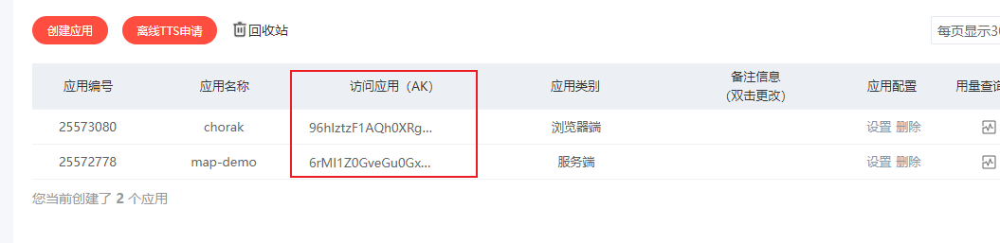
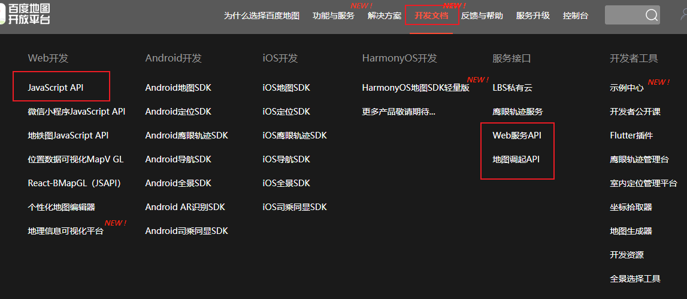

# 百度地图

## 使用场景

1. 周边设施
2. 社交娱乐
3. 电商购物
4. 交通出行
5. 生活服务

## 技术介绍

1. 高德地图
2. 百度地图
3. 腾讯地图
4. 搜狗地图
5. 其中最常用的是高德（阿里）和百度

## 技术使用

简单应用：定位、交通、路线规划

百度地图api：https://lbsyun.baidu.com/

1. 注册开发者，生成AK密钥

2. 入门小案例

## 简单实用

1. 地图显示
2. 坐标点添加
3. 路径查询
4. 根据Ip 查询地址
5. 根据地址查询天气
6. 鹰眼定位：电子围栏-功能、轨迹上传
