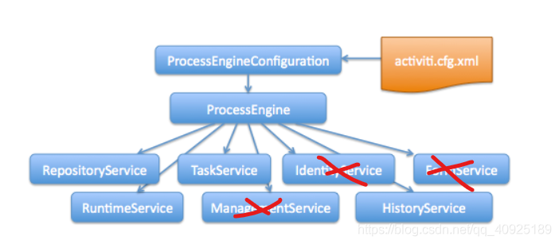
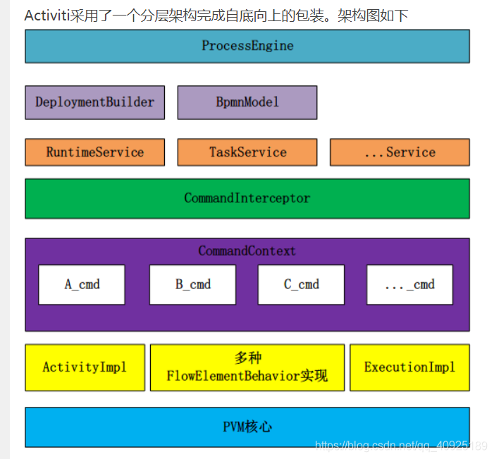
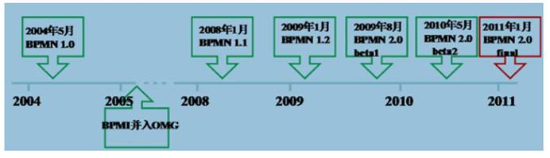
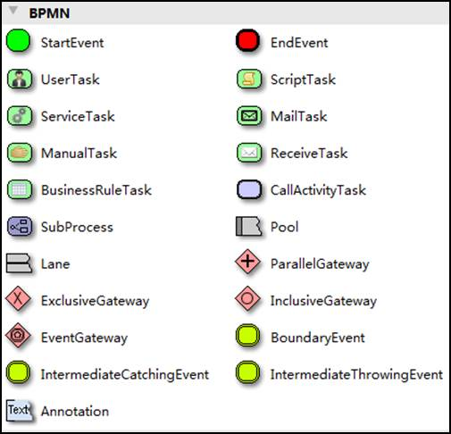

# Activi7

## 资料阅读

[osworkflow、jbpm、activiti、flowable、camunda开源流程引擎哪个好](https://blog.csdn.net/wxz258/article/details/116405594?ops_request_misc=&request_id=&biz_id=102&utm_term=%E6%B5%81%E7%A8%8B%E5%BC%95%E6%93%8E%E5%AF%B9%E6%AF%94&utm_medium=distribute.pc_search_result.none-task-blog-2~all~sobaiduweb~default-7-116405594.nonecase&spm=1018.2226.3001.4187)

## 简介

### Activiti7是什么？
Activiti7只是对BPMN2.0规范实现的一个java框架而已，他是一个工作流程控制和管理框架，就是来处理系统中的业务流程的，对整个业务系统起到辅助和支持作用。一般有两种存在方式，一种是和业务代码耦合在一块，另一种是依靠activiti7做成单独的微服务，实现功能的复用，成为真正的工作流“引擎”。

之所以将他称之为工作流引擎，我想有两个原因，第一activiti7是用来处理业务流程的，这些业务流程统称为工作流；第二，引擎的原因是他对代码对了高度封装，完全屏蔽掉了底层，暴露出很简单的操作API，只需要简单操作(实则底层做了大量工作)就能完成复杂的业务流程处理，就像发动机引擎一样，内部实现很复杂，但是用户使用起来确很简单，所以称之为引擎。

### 为什么要用它？或者说他解决了什么问题？

1. 工作流引擎本身的目的就是为了辅助业务系统，处理复杂的业务流程，实现流程自动化处理，减轻开发人员的负担，提高企业运作效率，为企业赋能。对于开发人员来说，无论多么复杂的业务流程，只要是用BPMN2.0规范画的业务流程图，用activiti7都可以轻松应对，甚至有时当业务流程发生改变后，都不需要改原来的代码。这一切都源于BPMN2.0规范和acitivit7代码的高度封装屏蔽了底层的实现。

2. 什么场景下适合使用工作流引擎？
   1. 如果要做的是事需要多个节点参与，即需要走一个流程的时候，可以使用工作流引擎，因为他就是专门对流程进行处理、控制和管理的。
   2. 如果业务流程可能会发生改变，要用工作流引擎，可以做到基本不用修改原来的代码。就从这一点来说，开发人员都要选择使用它。
   3. 如果业务流程很复杂，要用工作流引擎，可以化繁为简，使代码变得简单。

### 要学习他的什么？

愚以为学习activiti7要重点关注以下几点，就算是基本完成activiti7的学习了：

1. 熟悉 BPMN2.0规范并会画图。
2. 熟悉activiti7的工作流程。
3. 熟悉activiti7的API。
4. 熟悉activiti7生成的数据表及其字段的含义。
5. 熟悉activiti7的基本操作流程。
   1. 画业务流程图——对业务流程进行建模
   2. 部署流程图给activiti（解析xml，并保存到数据库中）
   3. 启动流程
   4. 查询待办任务
   5. 办理任务（④、⑤可能会循环好几遍）
   6. 流程结束

### activiti7和activiti6的区别：

大部分的功能都是一样的，不同点是：activiti6是28张数据表，activiti7是25张，少了用户和组的三张表。相应的服务接口也少了俩：IdentityService和FormService。另外activiti7中对activiti6的API再次进行了封装，使得用户操作代码更简洁了，并新增加了分布式和云部署的功能，核心没变。

### 支持的数据库：

默认内置的内存数据库h2，mysql，oracle，postGreSql，db2

### 操作api架构图

前面也说了，activiti7和activiti6相比核心没变。一个默认在类路径下的配置文件activiti.cfg.xml，和配置文件对应的配置类ProcessEngineConfiguration，配置文件用于将配置类的属性信息在外部配置，配置类用于将配置文件的内容封装成java代码。一个核心流程引擎对象ProcessEngine，根据配置类的信息来创建和初始化。由ProcessEngine对象的getXXXService方法获取各种操作service对象，结构很清晰。

### 整体架构图

中间有一个命令拦截器CommandInterceptor，用于对上层的操作拦截并转化为底层可识别的命令，作用有点类似于业务网关，或者语言解释器。

### 用activiti开发工作流的一个基本开发模式

1. 功能复用：对于像查询待办任务、已办任务、抄送我的、我发起的流程、流程部署、流程挂起与激活、生成流程图等这样的可以复用的功能，使用一套代码即可，提供统一的接口或service。

2. 功能不复用：但是对于启动流程、完成任务这样的功能，因为每个流程的参数或流程变量不一样，并且任务完成之后做的回调事情也不一样，如果不能复用，则每一个流程都单独开发这样的功能。

   > 目前采用的方式是：对于启动流程、完成任务抽象出一个interface，让不同的流程service实现各自不同的操作；创建一个简单工厂，根据流程类型实例化不同的流程service；对外只暴露出启动流程和完成任务两个接口，前端传递不同的流程类型，执行不同的service操作。

3. 数据表扩展：如果activiti提供的数据表无法满足业务需求，可以建立关联表，辅助业务运行。

这样基本可以实现，即使当流程发生改动的时候，也只需要对启动流程、完成任务这样单独的功能，改动很少的代码就可以应对改动了。如果流程图是一条直线，删除其中的几个节点后，甚至都不需要改动代码。

## BPMN

BPM（Business Process Management），即业务流程管理，是一种规范化的构造端到端的业务流程，以持续的提高组织业务效率。常见商业管理教育如EMBA、MBA等均将BPM包含在内。

### BPM软件
BPM软件就是根据企业中业务环境的变化，推进人与人之间、人与系统之间以及系统与系统之间的整合及调整的经营方法与解决方案的IT工具。

通过BPM软件对企业内部及外部的业务流程的整个生命周期进行建模、自动化、管理监控和优化，使企业成本降低，利润得以大幅提升。

BPM软件在企业中应用领域广泛，凡是有业务流程的地方都可以BPM软件进行管理，比如企业人事办公管理、采购流程管理、公文审批流程管理、财务管理等。

### BPMN

BPMN（Business Process Model AndNotation）- 业务流程模型和符号 是由BPMI（BusinessProcess Management Initiative）开发的一套标准的业务流程建模符号，使用BPMN提供的符号可以创建业务流程。

2004年5月发布了BPMN1.0规范.BPMI于2005年9月并入OMG（The Object Management Group对象管理组织)组织。OMG于2011年1月发布BPMN2.0的最终版本。

具体发展历史如下:
****

BPMN 是目前被各 BPM 厂商广泛接受的 BPM 标准。Activiti 就是使用 BPMN 2.0 进行流程建模、流程执行管理。它包括很多的建模符号，比如：

Event：用一个圆圈表示，它是流程中运行过程中发生的事情。

活动用圆角矩形表示，一个流程由一个活动或多个活动组成

Bpmn图形其实是通过xml表示业务流程，上边的.bpmn文件使用文本编辑器打开：

## 使用步骤

1. 部署activiti：Activiti是一个工作流引擎（其实就是一堆jar包API），业务系统访问(操作)activiti的接口，就可以方便的操作流程相关数据，这样就可以把工作流环境与业务系统的环境集成在一起。
2. 流程定义：使用activiti流程建模工具(activity-designer)定义业务流程(.bpmn文件) 。.bpmn文件就是业务流程定义文件，通过xml定义业务流程。
3. 流程定义部署：activiti部署业务流程定义（.bpmn文件）。使用activiti提供的api把流程定义内容存储起来，在Activiti执行过程中可以查询定义的内容。Activiti执行把流程定义内容存储在数据库中
4. 启动一个流程实例：流程实例也叫：ProcessInstance，启动一个流程实例表示开始一次业务流程的运行。在员工请假流程定义部署完成后，如果张三要请假就可以启动一个流程实例，如果李四要请假也启动一个流程实例，两个流程的执行互相不影响。
5. 用户查询待办任务(Task)：因为现在系统的业务流程已经交给activiti管理，通过activiti就可以查询当前流程执行到哪了，当前用户需要办理什么任务了，这些activiti帮我们管理了，而不需要开发人员自己编写在sql语句查询。
6. 用户办理任务：用户查询待办任务后，就可以办理某个任务，如果这个任务办理完成还需要其它用户办理，比如采购单创建后由部门经理审核，这个过程也是由activiti帮我们完成了。
7. 流程结束：当任务办理完成没有下一个任务结点了，这个流程实例就完成了。

## 入门操作

[教程](https://andyoung.blog.csdn.net/article/details/118198535?spm=1001.2101.3001.6650.5&utm_medium=distribute.pc_relevant.none-task-blog-2%7Edefault%7ECTRLIST%7ERate-5-118198535-blog-116106944.pc_relevant_recovery_v2&depth_1-utm_source=distribute.pc_relevant.none-task-blog-2%7Edefault%7ECTRLIST%7ERate-5-118198535-blog-116106944.pc_relevant_recovery_v2&utm_relevant_index=10)

## 流程实例

### 概念

初始化概念

+ 流程定义：ProceddDefinition
+ 文件：bpmn.xml
+ 例子：出差流程

流程：

1. 流程示例：processIntance
2. 参与者：汪洋
3. OA系统填写出差单：单号9001
4. 发起一个出差流程

OA系统（可能存在的表单信息）：

1. 请假
2. 出差
3. 报销
4. 离职

OA系统需要与流程系统进行关联，使用 busId 
