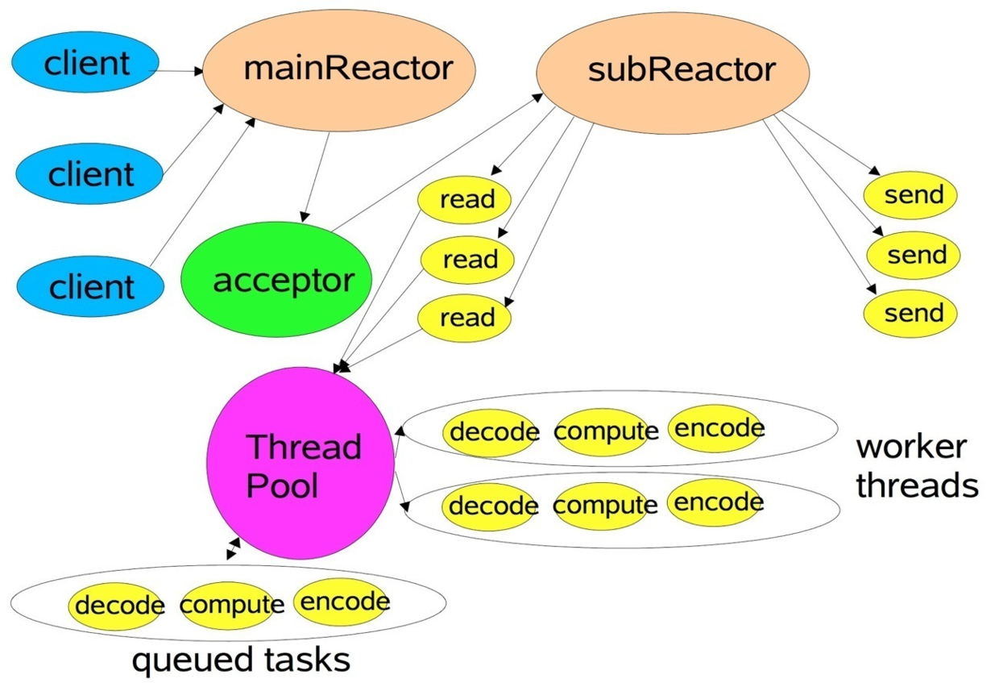

# Netty

## Netty简介

### 什么是Netty？

Netty是 一个异步事件驱动的网络应用程序框架，用于快速开发可维护的高性能协议服务器和客户端。

### JDK原生NIO程序的问题

JDK原生也有一套网络应用程序API，但是存在一系列问题，主要如下：

- NIO的类库和API繁杂，使用麻烦

- 需要具备其它的额外技能，例如熟悉Java多线程编程，网路编程非常熟悉，才能编写出高质量的NIO程序

- 可靠性能力补齐，开发工作量和难度都非常大（系统的稳定性）。例如客户端面临断连重连、网络闪断、半包读写、失败缓存、网络拥塞和异常码流的处理等等，NIO编程的特点是功能开发相对容易，但是可靠性能力补齐工作量和难度都非常大

- JDK NIO的BUG，例如臭名昭著的 epoll bug，它会导致Selector空轮询，最终导致CPU 100%

  了解：官方声称在`JDK1.6`版本的 update18 修复了该问题，但是直到 JDK1.7 版本该问题仍旧存在，只不过该bug发生概率降低了，它并没有被根本解决

### Netty的特点

Netty的对JDK自带的NIO的API进行封装，解决上述问题，主要优点有：

- 设计优雅：适用于各种传输类型的统一API - 阻塞和非阻塞Socket 基于灵活且可扩展的事件模型，可以清晰地分离关注点 高度可定制的线程模型 - 单线程，一个或多个线程池 真正的无连接数据报套接字支持（自3.1起）
- 高性能 、高吞吐、低延迟、低消耗
- 最小化不必要的内存复制
- 安全 完整的SSL / TLS和StartTLS支持
- 高并发：Netty 是一款基于 NIO（Nonblocking IO，非阻塞IO）开发的网络通信框架，对比于 BIO（Blocking I/O，阻塞IO），他的并发性能得到了很大提高。
- 传输快：Netty 的传输依赖于零拷贝特性，尽量减少不必要的内存拷贝，实现了更高效率的传输。
- 封装好：Netty 封装了 NIO 操作的很多细节，提供了易于使用调用接口。
- 社区活跃，不断更新 社区活跃，版本迭代周期短，发现的BUG可以被及时修复，同时，更多的新功能会被加入
- 使用方便 详细记录的Javadoc，用户指南和示例 没有其他依赖项，JDK 5（Netty 3.x）或6（Netty 4.x）就足够了

### Netty 高性能表现在哪些方面？

+ IO 线程模型：通过多线程事件驱动模式，在应用层实现异步非阻塞（异步事件驱动）架构，用最少的资源做更多的事。
+ 内存零拷贝：尽量减少不必要的内存拷贝，实现了更高效率的传输。
+ 内存池设计：申请的内存可以重用，主要指直接内存。内部实现是用一颗二叉查找树管理内存分配情况。 （具体请参考尼恩稍后的手写内存池）
+ 对象池设计：Java对象可以重用，主要指Minior GC非常频繁的对象，如ByteBuffer。并且，对象池使用无锁架构，性能非常高。 （具体请参考尼恩稍后的手写对象池）
+ mpsc无锁编程：串形化处理读写, 避免使用锁带来的性能开销。
+ 高性能序列化协议：支持 protobuf 等高性能序列化协议。


### Netty常见使用场景

- 高性能的`RPC`框架必不可少，典型的应用有：
  - 阿里分布式服务框架`Dubbo`用于实现各进程节点之间的内部通信。
  - 还有 RocketMQ 也是使用 Netty 作为通讯的基础。

- 游戏行业，`Netty`作为高性能的基础通信组件，它本身提供了`TCP/UDP`和`HTTP`协议栈。 非常方便定制和开发私有协议栈，账号登录服务器
- 大数据领域 
  - 经典的`Hadoop`的高性能通信和序列化组件`Avro`的`RPC`框架，默认采用`Netty`进行跨界点通信，


## Netty设计

#### I/O复用模型

`Netty`的非阻塞`I/O`的实现关键是基于`I/O`复用模型，这里用`Selector`对象表示：


​		

​		`Netty`的`I/O`线程`NioEventLoop`由于聚合了多路复用器`Selector`，可以同时并发处理成百上千个客户端连接。当线程从某客户端Socket通道进行读写数据时，若没有数据可用时，该线程可以进行其他任务。线程通常将非阻塞 `I/O` 的空闲时间用于在其他通道上执行 `I/O` 操作，所以单独的线程可以管理多个输入和输出通道。

​		由于读写操作都是非阻塞的，这就可以充分提升 `I/O` 线程的运行效率，避免由于频繁I/O阻塞导致的线程挂起，一个 `I/O` 线程可以并发处理N个客户端连接和读写操作。


#### 基于buffer

​		传统的`I/O`是面向字节流或字符流的，以流式的方式顺序地从一个`Stream` 中读取一个或多个字节, 因此也就不能随意改变读取指针的位置。在NIO中, 抛弃了传统的` I/O`流, 而是引入了`Channel`和`Buffer`的概念. 在NIO中, 只能从Channel中读取数据到Buffer中或将数据 Buffer 中写入到 Channel。

​		基于`buffer`操作不像传统`I/O`的顺序操作,  NIO 中可以随意地读取任意位置的数据


### 线程模型

#### 事件驱动模型

通常，我们设计一个事件处理模型的程序有两种思路

- 轮询方式：线程不断轮询访问相关事件发生源有没有发生事件，如果有发生事件，就调用事件处理逻辑。
- 事件驱动方式：发生事件，主线程把事件放入事件队列，在另外线程不断循环消费事件列表中的事件，调用事件对应的处理逻辑处理事件。它其实是设计模式中**观察者模式**的思路。

可以看出，相对传统轮询模式，事件驱动有如下优点：

- 可扩展性好，分布式的异步架构，事件处理器之间高度解耦，可以方便扩展事件处理逻辑
- 高性能，基于队列暂存事件，能方便并行异步处理事件

### Reactor详解

常见的Reactor模型有三种：单线程模型、多线程模型、主从多线程模型

Reactor线程模型中的3个重要组件

+ Reactor：负责将IO事件派发给对应的Handler
+ Acceptor：用于处理客户端链接请求
+ Handlers：处理非阻塞的IO读写任务

**单线程单Reactor模型：**

handler的执行是串行化的，如果其中一个Handler的处理线程阻塞会导致其他的业务处理阻塞，而Handler和Reactor在同一个线程中执行，从而导致无法接受新的请求

**多线程单Reactor模型：**

也就是在业务处理的地方加入线程池，实现异步处理，这样Reactor和Handler就在不同的线程中来执行，但是所有的IO操作都在一个线程中，包括accepter()\read()、connect()等操作，但是当高并发请求过来的时候，会导致性能瓶颈。

+ 当一个Nio线程处理成百上千的链路时，性能上无法支撑，即便NIO线程的CPU负载达到100%，也无法满足海量消息的读取和发送
+ 当NIO的线程负载过重，也会导致处理变慢，客户端链接超时，超时之后往往会进行重发，这样加重了NIO线程的负载，导致大量消息积压和处理超时

**主从多线程Reactor模型**

主要角色：

+ Main Reactor：负责接受客户端的链接请求，并将具体的IO处理请求转发给SubReactor，其中Sub Reactor 可以有多个
+ Accetpor：请求接受则，类似与服务器，并不真正负责链接请求的建立，只是将请求委托给Main Reactor线程池来实现，起到一个转发的作用
+ Sub Reactor负责数据的读写，在NIO中通常注册通道的读事件和写事件


#### Reactor主从线程模型

​		Reactor模型，即`I/O`多路复用统一监听事件，服务端程序处理传入多路请求，并将它们同步分派给请求对应的处理线，收到事件后分发给某线程。

Reactor模型中有2个关键组成：

- Reactor 在一个单独的线程中运行，负责监听和分发事件，分发给适当的处理程序来对IO事件做出反应。 
- Handlers 处理程序执行I/O事件要完成的实际事件，Reactor通过调度适当的处理程序来响应I/O事件，处理程序执行非阻塞操作


取决于Reactor的数量和Hanndler线程数量的不同，Reactor模型有3个变种

- 单Reactor单线程
- 单Reactor多线程
- 主从Reactor多线程


#### Netty线程模型

​		Netty主要**基于主从Reactors多线程模型**（如下图）做了一定的修改，其中主从Reactor多线程模型有多个Reactor：MainReactor和SubReactor：

- MainReactor负责客户端的连接请求，并将请求转交给SubReactor
- SubReactor负责相应通道的IO读写请求
- 非IO请求（具体逻辑处理）的任务则会直接写入队列，等待worker threads进行处理

这里引用Doug Lee大神的Reactor介绍：[Scalable IO in Java](http://gee.cs.oswego.edu/dl/cpjslides/nio.pdf)里面关于主从Reactor多线程模型的图



​		特别说明的是： 虽然Netty的线程模型基于主从Reactor多线程，借用了`MainReactor`和`SubReactor`的结构，但是实际实现上，`SubReactor`和`Worker`线程在同一个线程池中：

```
EventLoopGroup bossGroup = new NioEventLoopGroup();
EventLoopGroup workerGroup = new NioEventLoopGroup();
ServerBootstrap server = new ServerBootstrap();
server.group(bossGroup, workerGroup).channel(NioServerSocketChannel.class)
```

上面代码中的bossGroup 和workerGroup是Bootstrap构造方法中传入的两个对象，这两个group均是线程池

- bossGroup线程池则只是在bind某个端口后，获得其中一个线程作为MainReactor，专门处理端口的accept事件，**每个端口对应一个boss线程**

- workerGroup线程池会被各个SubReactor和worker线程充分利用

  

#### 异步处理

Netty中的I/O操作是异步的，包括bind、write、connect等操作会简单的返回一个ChannelFuture，调用者并不能立刻获得结果，通过Future-Listener机制，用户可以方便的主动获取或者通过通知机制获得IO操作结果。当future对象刚刚创建时，处于非完成状态，调用者可以通过返回的ChannelFuture来获取操作执行的状态，注册监听函数来执行完成后的操，常见有如下操作：

- 通过isDone方法来判断当前操作是否完成
- 通过isSuccess方法来判断已完成的当前操作是否成功
- 通过getCause方法来获取已完成的当前操作失败的原因
- 通过isCancelled方法来判断已完成的当前操作是否被取消
- 通过addListener方法来注册监听器，当操作已完成(isDone方法返回完成)，将会通知指定的监听器；如果future对象已完成，则理解通知指定的监听器

例如下面的的代码中绑定端口是异步操作，当绑定操作处理完，将会调用相应的监听器处理逻辑

```java
    serverBootstrap.bind(port).addListener(future -> {
        if (future.isSuccess()) {
            System.out.println(new Date() + ": 端口[" + port + "]绑定成功!");
        } else {
            System.err.println("端口[" + port + "]绑定失败!");
        }
    });
```

相比传统阻塞I/O，执行I/O操作后线程会被阻塞住, 直到操作完成；异步处理的好处是不会造成线程阻塞，线程在I/O操作期间可以执行别的程序，在高并发情形下会更稳定和更高的吞吐量。


### 零拷贝

#### 传统意义的拷贝

是在发送数据的时候，传统的实现方式是：

1. `File.read(bytes)`
2. `Socket.send(bytes)`

这种方式需要四次数据拷贝和四次上下文切换：

1. 数据从磁盘读取到内核的 read buffer（读缓存区）
2. 数据从内核（读缓存区）拷贝到用户缓冲区
3. 数据从用户缓冲区拷贝到内核的socket缓存区
4. 数据从socket缓存区拷贝到网卡接口（硬件）的缓冲区


#### **零拷贝的概念**

明显上面的第二步和第三步是没有必要的，通过 Java 的 FileChannel.transferTo 方法，可以避免上面两次多余的拷贝（当然这需要底层操作系统支持）

1. 调用`transferTo`,数据从磁盘拷贝到内核`read buffer`
2. 接着从内核read buffer将数据拷贝到网卡接口buffer

上面的两次操作都不需要CPU参与，所以就达到了零拷贝。


#### Netty中的零拷贝

主要体现在三个方面：

1. ByteBuffer

   Netty发送和接收消息主要使用 ByteBuffer，ByteBuffer使用对外内存（DirectMemory）直接进行Socket读写。

   原因：如果使用传统的堆内存进行 Socket 读写，JVM会将堆内存 buffer 拷贝一份到直接内存中然后再写入 socket ，多了一次缓冲区的内存拷贝。DirectMemory可以直接发送到网卡接口

2. Composite Buffers

   传统的 ByteBuffer，如果需要将两个ByteBuffer中的数据组合到一起，我们需要首先创建一个size=size1+size2大小的新的数组，然后将两个数组中的数据拷贝到新的数组中。但是使用Netty提供的组合ByteBuf，就可以避免这样的操作，因为CompositeByteBuf并没有真正将多个Buffer组合起来，而是保存了它们的引用，从而避免了数据的拷贝，实现了零拷贝。

3. 对于FileChannel.transferTo的使用

   Netty中使用了FileChannel的transferTo方法，该方法依赖于操作系统实现零拷贝.


## Netty架构设计

### 功能特性


- 传输服务 支持BIO和NIO
- 容器集成 支持OSGI、JBossMC、Spring、Guice容器
- 协议支持 HTTP、Protobuf、二进制、文本、WebSocket等一系列常见协议都支持。 还支持通过实行编码解码逻辑来实现自定义协议
- Core核心 可扩展事件模型、通用通信API、支持零拷贝的ByteBuf缓冲对象

### 模块组件

#### （引导类）Bootstrap、ServerBootstrap

Bootstrap意思是引导，一个Netty应用通常由一个Bootstrap开始，主要作用是配置整个Netty程序，串联各个组件，Netty中Bootstrap类是客户端程序的启动引导类，ServerBootstrap是服务端启动引导类。

#### （异步通信信号）Future、ChannelFuture

​		在Netty中所有的IO操作都是异步的，不能立刻得知消息是否被正确处理，但是可以过一会等它执行完成或者直接注册一个监听，具体的实现就是通过Future和ChannelFutures，他们可以注册一个监听，当操作执行成功或失败时监听会自动触发注册的监听事件。

#### （数据通信组件）Channel

Netty网络通信的组件，能够用于执行网络I/O操作。 Channel为用户提供：

- 当前网络连接的通道的状态（例如是否打开？是否已连接？）
- 网络连接的配置参数 （例如接收缓冲区大小）
- 提供异步的网络I/O操作(如建立连接，读写，绑定端口)，异步调用意味着任何I / O调用都将立即返回，并且不保证在调用结束时所请求的I / O操作已完成。调用立即返回一个ChannelFuture实例，通过注册监听器到ChannelFuture上，可以I / O操作成功、失败或取消时回调通知调用方。
- 支持关联I/O操作与对应的处理程序

不同协议、不同的阻塞类型的连接都有不同的 Channel 类型与之对应，下面是一些常用的 Channel 类型

- NioSocketChannel，异步的客户端 TCP Socket 连接
- NioServerSocketChannel，异步的服务器端 TCP Socket 连接
- NioDatagramChannel，异步的 UDP 连接
- NioSctpChannel，异步的客户端 Sctp 连接
- NioSctpServerChannel，异步的 Sctp 服务器端连接 这些通道涵盖了 UDP 和 TCP网络 IO以及文件 IO.

#### （连接器）Selector

Netty基于Selector对象实现I/O多路复用，通过 Selector, 一个线程可以监听多个连接的Channel事件, 当向一个Selector中注册Channel 后，Selector 内部的机制就可以自动不断地查询(select) 这些注册的Channel是否有已就绪的I/O事件(例如可读, 可写, 网络连接完成等)，这样程序就可以很简单地使用一个线程高效地管理多个 Channel 。

#### （事件处理线程）NioEventLoop

NioEventLoop中维护了一个线程和任务队列，支持异步提交执行任务，线程启动时会调用NioEventLoop的run方法，执行I/O任务和非I/O任务：

- I/O任务 即selectionKey中ready的事件，如accept、connect、read、write等，由processSelectedKeys方法触发。
- 非IO任务 添加到taskQueue中的任务，如register0、bind0等任务，由runAllTasks方法触发。

两种任务的执行时间比由变量ioRatio控制，默认为50，则表示允许非IO任务执行的时间与IO任务的执行时间相等。

#### （事件处理线程池）NioEventLoopGroup

NioEventLoopGroup，主要管理eventLoop的生命周期，可以理解为一个线程池，内部维护了一组线程，每个线程(NioEventLoop)负责处理多个Channel上的事件，而一个Channel只对应于一个线程。


#### （通道处理器）ChannelHandler

ChannelHandler是一个接口，处理I / O事件或拦截I / O操作，并将其转发到其ChannelPipeline(业务处理链)中的下一个处理程序。

ChannelHandler本身并没有提供很多方法，因为这个接口有许多的方法需要实现，方便使用期间，可以继承它的子类：

- ChannelInboundHandler用于处理入站I / O事件
- ChannelOutboundHandler用于处理出站I / O操作

或者使用以下适配器类：

- ChannelInboundHandlerAdapter用于处理入站I / O事件
- ChannelOutboundHandlerAdapter用于处理出站I / O操作
- ChannelDuplexHandler用于处理入站和出站事件


#### （通道上下文）ChannelHandlerContext

保存Channel相关的所有上下文信息，同时关联一个ChannelHandler对象


#### （通道处理器列表）ChannelPipline

保存ChannelHandler的List，用于处理或拦截Channel的入站事件和出站操作。 ChannelPipeline实现了一种高级形式的拦截过滤器模式，使用户可以完全控制事件的处理方式，以及Channel中各个的ChannelHandler如何相互交互。

下图引用Netty的Javadoc4.1中ChannelPipline的说明，描述了ChannelPipeline中ChannelHandler通常如何处理I/O事件。 I/O事件由ChannelInboundHandler或ChannelOutboundHandler处理，并通过调用ChannelHandlerContext中定义的事件传播方法（例如ChannelHandlerContext.fireChannelRead（Object）和ChannelOutboundInvoker.write（Object））转发到其最近的处理程序。

```
                                                 I/O Request
                                            via Channel or
                                        ChannelHandlerContext
                                                      |
  +---------------------------------------------------+---------------+
  |                           ChannelPipeline         |               |
  |                                                  \|/              |
  |    +---------------------+            +-----------+----------+    |
  |    | Inbound Handler  N  |            | Outbound Handler  1  |    |
  |    +----------+----------+            +-----------+----------+    |
  |              /|\                                  |               |
  |               |                                  \|/              |
  |    +----------+----------+            +-----------+----------+    |
  |    | Inbound Handler N-1 |            | Outbound Handler  2  |    |
  |    +----------+----------+            +-----------+----------+    |
  |              /|\                                  .               |
  |               .                                   .               |
  | ChannelHandlerContext.fireIN_EVT() ChannelHandlerContext.OUT_EVT()|
  |        [ method call]                       [method call]         |
  |               .                                   .               |
  |               .                                  \|/              |
  |    +----------+----------+            +-----------+----------+    |
  |    | Inbound Handler  2  |            | Outbound Handler M-1 |    |
  |    +----------+----------+            +-----------+----------+    |
  |              /|\                                  |               |
  |               |                                  \|/              |
  |    +----------+----------+            +-----------+----------+    |
  |    | Inbound Handler  1  |            | Outbound Handler  M  |    |
  |    +----------+----------+            +-----------+----------+    |
  |              /|\                                  |               |
  +---------------+-----------------------------------+---------------+
                  |                                  \|/
  +---------------+-----------------------------------+---------------+
  |               |                                   |               |
  |       [ Socket.read() ]                    [ Socket.write() ]     |
  |                                                                   |
  |  Netty Internal I/O Threads (Transport Implementation)            |
  +-------------------------------------------------------------------+
```

入站事件由自下而上方向的入站处理程序处理，如图左侧所示。 入站Handler处理程序通常处理由图底部的I / O线程生成的入站数据。 通常通过实际输入操作（例如SocketChannel.read（ByteBuffer））从远程读取入站数据。

出站事件由上下方向处理，如图右侧所示。 出站Handler处理程序通常会生成或转换出站传输，例如write请求。 I/O线程通常执行实际的输出操作，例如SocketChannel.write（ByteBuffer）。

在 Netty 中每个 Channel 都有且仅有一个 ChannelPipeline 与之对应, 它们的组成关系如下:


一个 Channel 包含了一个 ChannelPipeline, 而 ChannelPipeline 中又维护了一个由 ChannelHandlerContext 组成的双向链表, 并且每个 ChannelHandlerContext 中又关联着一个 ChannelHandler。入站事件和出站事件在一个双向链表中，入站事件会从链表head往后传递到最后一个入站的handler，出站事件会从链表tail往前传递到最前一个出站的handler，两种类型的handler互不干扰。


### 工作原理架构

初始化并启动Netty服务端过程如下：

```java
public static void main(String[] args) {
    // 创建mainReactor
    NioEventLoopGroup boosGroup = new NioEventLoopGroup();
    // 创建工作线程组
    NioEventLoopGroup workerGroup = new NioEventLoopGroup();

    final ServerBootstrap serverBootstrap = new ServerBootstrap();
    serverBootstrap 
        // 组装NioEventLoopGroup 
        .group(boosGroup, workerGroup)
        // 设置channel类型为NIO类型
        .channel(NioServerSocketChannel.class)
        // 设置连接配置参数
        .option(ChannelOption.SO_BACKLOG, 1024)
        .childOption(ChannelOption.SO_KEEPALIVE, true)
        .childOption(ChannelOption.TCP_NODELAY, true)
        // 配置入站、出站事件handler
        .childHandler(new ChannelInitializer<NioSocketChannel>() {
            @Override
            protected void initChannel(NioSocketChannel ch) {
                // 配置入站、出站事件channel
                ch.pipeline().addLast(...);
                ch.pipeline().addLast(...);
            }
        });

    // 绑定端口
    int port = 8080;
    serverBootstrap.bind(port).addListener(future -> {
        if (future.isSuccess()) {
            System.out.println(new Date() + ": 端口[" + port + "]绑定成功!");
        } else {
            System.err.println("端口[" + port + "]绑定失败!");
        }
    });
}
```

基本过程如下：

- 1 初始化创建2个NioEventLoopGroup，其中boosGroup用于Accetpt连接建立事件并分发请求， workerGroup用于处理I/O读写事件和业务逻辑
- 2 基于ServerBootstrap(服务端启动引导类)，配置EventLoopGroup、Channel类型，连接参数、配置入站、出站事件handler
- 3 绑定端口，开始工作

结合上面的介绍的Netty Reactor模型，介绍服务端Netty的工作架构图：


​		server端包含1个Boss NioEventLoopGroup和1个Worker NioEventLoopGroup，NioEventLoopGroup相当于1个事件循环组，这个组里包含多个事件循环NioEventLoop，每个NioEventLoop包含1个selector和1个事件循环线程。

每个 Boss NioEventLoop 循环执行的任务包含3步：

- 轮询accept事件
- 处理accept I/O事件，与Client建立连接，生成NioSocketChannel，并将NioSocketChannel注册到某个Worker NioEventLoop的Selector上 *3 处理任务队列中的任务，runAllTasks。任务队列中的任务包括用户调用eventloop.execute或schedule执行的任务，或者其它线程提交到该eventloop的任务。


每个Worker NioEventLoop循环执行的任务包含3步：

- 轮询read、write事件；
- 处I/O事件，即read、write事件，在 NioSocketChannel 可读、可写事件发生时进行处理
- 处理任务队列中的任务，runAllTasks。

其中任务队列中的task有3种典型使用场景

- 用户程序自定义的普通任务

```java
ctx.channel().eventLoop().execute(new Runnable() {
    @Override
    public void run() {
        //...
    }
});
```

- 非当前reactor线程调用channel的各种方法 例如在推送系统的业务线程里面，根据用户的标识，找到对应的channel引用，然后调用write类方法向该用户推送消息，就会进入到这种场景。最终的write会提交到任务队列中后被异步消费。
- 用户自定义定时任务

```java
ctx.channel().eventLoop().schedule(new Runnable() {
    @Override
    public void run() {

    }
}, 60, TimeUnit.SECONDS);
```


## 总结

现在稳定推荐使用的主流版本还是Netty4，Netty5 中使用了 ForkJoinPool，增加了代码的复杂度，但是对性能的改善却不明显，所以这个版本不推荐使用，官网也没有提供下载链接。

Netty 入门门槛相对较高，其实是因为这方面的资料较少，并不是因为他有多难，大家其实都可以像搞透 Spring 一样搞透 Netty。在学习之前，建议先理解透整个框架原理结构，运行过程，可以少走很多弯路。


# Netty 常见面试题

## 谈谈你对于Netty的理解？

1. Netty是 一个异步事件驱动的网络应用程序框架，用于快速开发高性能服务器和客户端，支持多种传输协议，提供高性能的数据传输服务,
2. 使用场景可以是：高性能Rpc框架、游戏行业、大数据领域
3. 高性能的原因主要有：
   1. IO 线程模型：通过多线程Reactor反应器模式，在应用层实现异步非阻塞（异步事件驱动）架构，用最少的资源做更多的事。
   2. 内存零拷贝：尽量减少不必要的内存拷贝，实现了更高效率的传输。
   3. 内存池设计：申请的内存可以重用，主要指直接内存。具体实现是通过一颗二叉查找树管理内存分配情况。 
   4. 对象池设计：Java对象可以重用，主要指Minior GC非常频繁的对象，如ByteBuffer。并且，对象池使用无锁架构，性能非常高。 
   5. 无锁编程：串形化处理读写, 避免使用锁带来的性能开销。
   6. 高性能序列化协议：支持 protobuf 等高性能序列化协议。

## NIO的组成？

+ Buffer：与Channel进行交互，数据是从Channel读入缓冲区，从缓冲区写入Channel中的
+ flip方法 ： 反转此缓冲区，将position给limit，然后将position置为0，其实就是切换读写模式
+ clear方法 ：清除此缓冲区，将position置为0，把capacity的值给limit。
+ rewind方法 ： 重绕此缓冲区，将position置为0
+ DirectByteBuffer可减少一次系统空间到用户空间的拷贝。但Buffer创建和销毁的成本更高，不可控，通常会用内存池来提高性能。直接缓冲区主要分配给那些易受基础系统的本机I/O 操作影响的大型、持久的缓冲区。如果数据量比较小的中小应用情况下，可以考虑使用heapBuffer，由JVM进行管理。
+ Channel：表示 IO 源与目标打开的连接，是双向的，但不能直接访问数据，只能与Buffer 进行交互。通过源码可知，FileChannel的read方法和write方法都导致数据复制了两次！
+ Selector可使一个单独的线程管理多个Channel，open方法可创建Selector，register方法向多路复用器器注册通道，可以监听的事件类型：读、写、连接、accept。注册事件后会产生一个SelectionKey：它表示SelectableChannel 和Selector 之间的注册关系，wakeup方法：使尚未返回的第一个选择操作立即返回，唤醒的原因是：注册了新的channel或者事件；channel关闭，取消注册；优先级更高的事件触发（如定时器事件），希望及时处理。
+ Selector在Linux的实现类是EPollSelectorImpl，委托给EPollArrayWrapper实现，其中三个native方法是对epoll的封装，而EPollSelectorImpl. implRegister方法，通过调用epoll_ctl向epoll实例中注册事件，还将注册的文件描述符(fd)与SelectionKey的对应关系添加到fdToKey中，这个map维护了文件描述符与SelectionKey的映射。
+ fdToKey有时会变得非常大，因为注册到Selector上的Channel非常多（百万连接）；过期或失效的Channel没有及时关闭。fdToKey总是串行读取的，而读取是在select方法中进行的，该方法是非线程安全的。
+ Pipe：两个线程之间的单向数据连接，数据会被写到sink通道，从source通道读取
+ NIO的服务端建立过程：Selector.open()：打开一个Selector；ServerSocketChannel.open()：创建服务端的Channel；bind()：绑定到某个端口上。并配置非阻塞模式；register()：注册Channel和关注的事件到Selector上；select()轮询拿到已经就绪的事件

## TCP 粘包/拆包的原因及解决方法？

​		TCP是以流的方式来处理数据，一个完整的包可能会被TCP拆分成多个包进行发送，也可能把小的封装成一个大的数据包发送。

TCP粘包/分包的原因：

​		应用程序写入的字节大小大于套接字发送缓冲区的大小，会发生拆包现象，而应用程序写入数据小于套接字缓冲区大小，网卡将应用多次写入的数据发送到网络上，这将会发生粘包现象；

​		进行MSS大小的TCP分段，当TCP报文长度-TCP头部长度>MSS的时候将发生拆包太网帧的payload（净荷）大于MTU（1500字节）进行ip分片。

解决方法

+ 消息定长：FixedLengthFrameDecoder类

+ 包尾增加特殊字符分割：

  - 行分隔符类：LineBasedFrameDecoder

  - 或自定义分隔符类 ：DelimiterBasedFrameDecoder


+ 将消息分为消息头和消息体：LengthFieldBasedFrameDecoder类。分为有头部的拆包与粘包、长度字段在前且有头部的拆包与粘包、多扩展头部的拆包与粘包。


## 什么是 Netty 的零拷贝？

Netty 的零拷贝主要包含三个方面：

- Netty 的接收和发送 ByteBuffer 采用 DIRECT BUFFERS，使用堆外直接内存进行 Socket 读写，不需要进行字节缓冲区的二次拷贝。如果使用传统的堆内存（HEAP BUFFERS）进行 Socket 读写，JVM 会将堆内存 Buffer 拷贝一份到直接内存中，然后才写入 Socket 中。相比于堆外直接内存，消息在发送过程中多了一次缓冲区的内存拷贝。
- Netty 提供了组合 Buffer 对象，可以聚合多个 ByteBuffer 对象，用户可以像操作一个 Buffer 那样方便的对组合 Buffer 进行操作，避免了传统通过内存拷贝的方式将几个小 Buffer 合并成一个大的 Buffer。
- Netty 的文件传输采用了 transferTo 方法，它可以直接将文件缓冲区的数据发送到目标 Channel，避免了传统通过循环 write 方式导致的内存拷贝问题。


## Netty 中有哪种重要组件？

- Channel：Netty 网络操作抽象类，它除了包括基本的 I/O 操作，如 bind、connect、read、write 等。
- EventLoop 与 EventLoopGroup
  + EventLoop 定义了Netty的核心抽象，用来处理连接的生命周期中所发生的事件，在内部，将会为每个Channel分配一个EventLoop。
  + EventLoopGroup 是一个 EventLoop 池，包含很多的 EventLoop。
  + Netty 为每个 Channel 分配了一个 EventLoop，用于处理用户连接请求、对用户请求的处理等所有事件。EventLoop 本身只是一个线程驱动，在其生命周期内只会绑定一个线程，让该线程处理一个 Channel 的所有 IO 事件。
  + 一个 Channel 一旦与一个 EventLoop 相绑定，那么在 Channel 的整个生命周期内是不能改变的。一个 EventLoop 可以与多个 Channel 绑定。即 Channel 与 EventLoop 的关系是 n:1，而 EventLoop 与线程的关系是 1:1。
- ServerBootstrap 与 Bootstrap
   Bootstarp 和 ServerBootstrap 被称为引导类，指对应用程序进行配置，并使他运行起来的过程。Netty处理引导的方式是使你的应用程序和网络层相隔离。
  - Bootstrap 是客户端的引导类，Bootstrap 在调用 bind()（连接UDP）和 connect()（连接TCP）方法时，会新创建一个 Channel，仅创建一个单独的、没有父 Channel 的 Channel 来实现所有的网络交换。
  - ServerBootstrap 是服务端的引导类，ServerBootstarp 在调用 bind() 方法时会创建一个 ServerChannel 来接受来自客户端的连接，并且该 ServerChannel 管理了多个子 Channel 用于同客户端之间的通信。

- ChannelFuture：Netty 框架中所有的 I/O 操作都为异步的，因此我们需要 ChannelFuture 的 addListener()注册一个 ChannelFutureListener 监听事件，当操作执行成功或者失败时，监听就会自动触发返回结果。
- ChannelHandler：充当了所有处理入站和出站数据的逻辑容器。ChannelHandler 主要用来处理各种事件，这里的事件很广泛，比如可以是连接、数据接收、异常、数据转换等。
- ChannelPipeline：为 ChannelHandler 链提供了容器，当 channel 创建时，就会被自动分配到它专属的 ChannelPipeline，这个关联是永久性的。

## Netty 发送消息有几种方式？

Netty 有两种发送消息的方式：

- 直接写入 Channel 中，消息从 ChannelPipeline 当中尾部开始移动；
- 写入和 ChannelHandler 绑定的 ChannelHandlerContext 中，消息从 ChannelPipeline 中的下一个 ChannelHandler 中移动。

## 默认情况 Netty 起多少线程？何时启动？

Netty 默认是 CPU 处理器数的两倍，bind 完之后启动。

## 如何选择序列化协议？

具体场景

1. 对于公司间的系统调用，如果性能要求在100ms以上的服务，基于XML的SOAP协议是一个值得考虑的方案。 
2. 基于Web browser的Ajax，以及Mobile app与服务端之间的通讯，JSON协议是首选。对于性能要求不太高，或者以动态类型语言为主，或者传输数据载荷很小的的运用场景，JSON也是非常不错的选择。 
3. 对于调试环境比较恶劣的场景，采用JSON或XML能够极大的提高调试效率，降低系统开发成本。 
4. 当对性能和简洁性有极高要求的场景，Protobuf，Thrift，Avro之间具有一定的竞争关系。 对于T级别的数据的持久化应用场景，Protobuf和Avro是首要选择。如果持久化后的数据存储在hadoop子项目里，Avro会是更好的选择。

## 为什么Netty默认线程池的参数是CPU核心数的两倍？

1. 提升性能的两个核心指标是
   1. 降低延迟
   2. 提高吞吐量
2. 在同等条件下，延迟越短吞吐量越大，所以提醒性能的目标就是降低延迟，提高吞吐量
   1. 降低延迟就是提高CPU的处理能力
   2. 提高吞吐量就是提高IO的读写效率
3. CPU密集型任务最好是线程数等同于核心数，但是往往会设置核心数+1，为的是当某个线程阻塞时，仍然可以高效利用CPU核心
4. 对于IO密集性任务来说，假设CPU计算和IO操作的耗时比例是1:1，那么线程数是2合适，如果耗时是1:2，那么线程数是3最合适，所以最佳线程数=1+（IO耗时/CPU耗时），默认线程池的大小=CPU核数*（1+（IO耗时/CPU计算耗时））
5. Netty中默认的（IO耗时/CPU耗时） =1，所以Netty默认的线线程池大小为CPU核数的2倍，而Netty的任务主要还是IO密集型的任务，所以这样设计，还是比较合适的
6. 现实场景中，通常要去压测，然后对压测结果进行微调，通常要保证生产环境是压测环境的75%，一般来说，使用Netty的默认配置来说就好了，因为提高吞吐量，不能仅仅依赖线程池的大小，还可以有缓存、微服务拆分等手段


## Netty 的无锁化设计体现在哪？

1. 当accept事件触发时，事件会被注册到WorkerEventLoopGroup 中的一个NioEventLoop 上；
2. 由于每个请求的Channel都只与一个NioEventLoop绑定，所以说 Channel 生命周期的所有事件处理都是线程独立的，不同的 NioEventLoop 线程之间不会发生任何交集；
3. NioEventLoop 完成数据读取后，会调用绑定的 ChannelPipeline 进行事件传播，数据在传播过程中由具体的ChannelHandler处理，整个过程是串行化执行，没有线程安全问题。

## Netty 支持哪些心跳类型设置？

服务器监听信道，如果 **5s** 内没有客户端发过来的包，就认为客户端挂掉了，释放该信道。

客户端和服务器建立连接后，在空闲时间（没有读写请求）每隔**4s**向服务器发送一个数据包，证明自己还“活着”。

- readerIdleTime：为读超时时间（即测试端一定时间内未接受到被测试端消息）。
- writerIdleTime：为写超时时间（即测试端一定时间内向被测试端发送消息）。
- allIdleTime：所有类型的超时时间。


## Netty 和 Tomcat 的区别？

- 作用不同：Tomcat 是 Servlet 容器，可以视为 Web 服务器，而 Netty 是异步事件驱动的网络应用程序框架和工具用于简化网络编程，例如TCP和UDP套接字服务器。
- 协议不同：Tomcat 是基于 http 协议的 Web 服务器，而 Netty 能通过编程自定义各种协议，因为 Netty 本身自己能编码/解码字节流，所有 Netty 可以实现，HTTP 服务器、FTP 服务器、UDP 服务器、RPC 服务器、WebSocket 服务器、Redis 的 Proxy 服务器、MySQL 的 Proxy 服务器等等。

## Netty 设计模式

+ Builder：构造器模式：
+ ServerBootstrap：责任链设计模式：
+ pipeline：事件传播工厂模式：
+ 创建 channel
+ 适配器模式：HandlerAdapter


## NIOEventLoopGroup源码？

1. **NioEventLoopGroup** 内部维护一个类型为 EventExecutor children [], 默认大小是处理器核数 * 2, 这样就构成了一个线程池。
2. 线程启动时调用SingleThreadEventExecutor的构造方法，执行NioEventLoop类的run方法，首先会调用hasTasks()方法判断当前taskQueue是否有元素。如果taskQueue中有元素，执行 selectNow() 方法，最终执行selector.selectNow()，该方法会立即返回。如果taskQueue没有元素，执行 select(oldWakenUp) 方法
3. select ( oldWakenUp) 方法解决了 Nio 中的 bug，selectCnt 用来记录selector.select方法的执行次数和标识是否执行过selector.selectNow()，若触发了epoll的空轮询bug，则会反复执行selector.select(timeoutMillis)，变量selectCnt 会逐渐变大，当selectCnt 达到阈值（默认512），则执行rebuildSelector方法，进行selector重建，解决cpu占用100%的bug。
4. rebuildSelector方法先通过openSelector方法创建一个新的selector。然后将old selector的selectionKey执行cancel。最后将old selector的channel重新注册到新的selector中。rebuild后，需要重新执行方法selectNow，检查是否有已ready的selectionKey。
5. 接下来调用processSelectedKeys 方法（处理I/O任务），当selectedKeys != null时，调用processSelectedKeysOptimized方法，迭代 selectedKeys 获取就绪的 IO 事件的selectkey存放在数组selectedKeys中, 然后为每个事件都调用 processSelectedKey 来处理它，processSelectedKey 中分别处理OP_READ；OP_WRITE；OP_CONNECT事件。
6. 最后调用runAllTasks方法（非IO任务），该方法首先会调用fetchFromScheduledTaskQueue方法，把scheduledTaskQueue中已经超过延迟执行时间的任务移到taskQueue中等待被执行，然后依次从taskQueue中取任务执行，每执行64个任务，进行耗时检查，如果已执行时间超过预先设定的执行时间，则停止执行非IO任务，避免非IO任务太多，影响IO任务的执行。
7. 每个NioEventLoop对应一个线程和一个Selector，NioServerSocketChannel会主动注册到某一个NioEventLoop的Selector上，NioEventLoop负责事件轮询。
8. Outbound 事件都是请求事件, 发起者是 Channel，处理者是 unsafe，通过 Outbound 事件进行通知，传播方向是 tail到head。Inbound 事件发起者是 unsafe，事件的处理者是 Channel, 是通知事件，传播方向是从头到尾。
9. 内存管理机制，首先会预申请一大块内存Arena，Arena由许多Chunk组成，而每个Chunk默认由2048个page组成。Chunk通过AVL树的形式组织Page，每个叶子节点表示一个Page，而中间节点表示内存区域，节点自己记录它在整个Arena中的偏移地址。当区域被分配出去后，中间节点上的标记位会被标记，这样就表示这个中间节点以下的所有节点都已被分配了。大于8k的内存分配在poolChunkList中，而PoolSubpage用于分配小于8k的内存，它会把一个page分割成多段，进行内存分配。
10. ByteBuf的特点：支持自动扩容（4M），保证put方法不会抛出异常、通过内置的复合缓冲类型，实现零拷贝（zero-copy）；不需要调用flip()来切换读/写模式，读取和写入索引分开；方法链；引用计数基于AtomicIntegerFieldUpdater用于内存回收；PooledByteBuf采用二叉树来实现一个内存池，集中管理内存的分配和释放，不用每次使用都新建一个缓冲区对象。UnpooledHeapByteBuf每次都会新建一个缓冲区对象。

