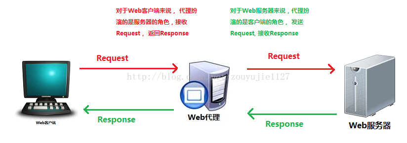
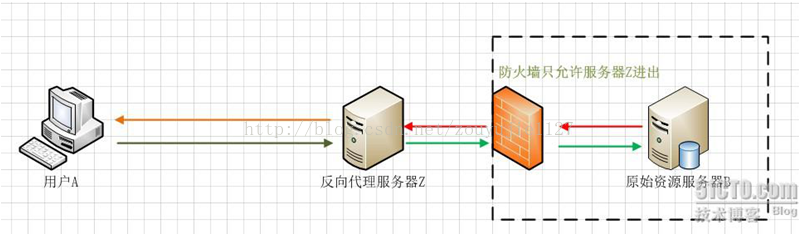
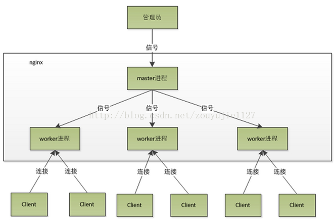
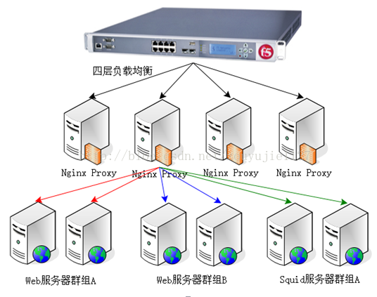
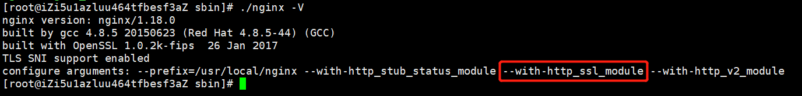
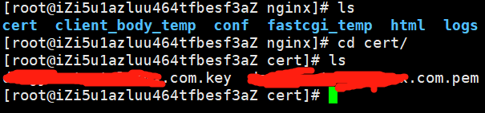
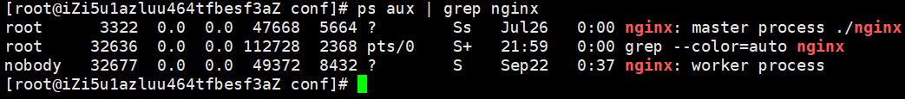

# Nginx

## 概念

​		Nginx是一款是由俄罗斯的程序设计师Igor Sysoev所开发高性能的Web和反向代理服务器，也是一个 IMAP/POP3/SMTP代理服务器。在高连接并发的情况下，Nginx是Apache服务器不错的替代品。


**代理服务器**

​		一般是指局域网内部的机器通过代理服务器发送请求到互联网上的服务器。

​		代理服务器一般作用在客户端。应用比如：GoAgent，FQ神器.

 

 **一个完整的代理请求过程为**

​		客户端首先与代理服务器创建连接，接着根据代理服务器所使用的代理协议，请求对目标服务器创建连接、或者获得目标服务器的指定资源。 Web代理（proxy）服务器是网络的中间实体。 代理位于Web客户端和Web服务器之间，扮演“中间人”的角色。HTTP的代理服务器即是Web服务器又是Web客户端。

​		代理服务器是介于客户端和Web服务器之间的另一台服务器，有了它之后，浏览器不是直接到Web服务器去取回网页而是向代理服务器发出请求，信号会先送到代理服务器，由代理服务器来取回浏览器所需要的信息并传送给你的浏览器。

**正向代理** ：

​		是一个位于客户端和原始服务器(origin server)之间的服务器，为了从原始服务器取得内容，客户端向代理发送一个请求并指定目标(原始服务器)，然后代理向原始服务器转交请求并将获得的内容返回给客户端。客户端必须要进行一些特别的设置才能使用正向代理。

**反向代理**：

​		在服务器端接受客户端的请求，然后把请求分发给具体的服务器进行处理，然后再将服务器的响应结果反馈给客户端。Nginx就是其中的一种反向代理服务器软件。

**区别：**

​		反向代理正好与正向代理相反，对于客户端而言代理服务器就像是原始服务器，并且客户端不需要进行任何特别的设置。客户端向反向代理的命名空间(name-space)中的内容发送普通请求，接着反向代理将判断向何处(原始服务器)转交请求，并将获得的内容返回给客户端。

 

​		用户A始终认为它访问的是原始服务器B而不是代理服务器Z，但实用际上反向代理服务器接受用户A的应答，从原始资源服务器B中取得用户A的需求资源，然后发送给用户A。由于防火墙的作用，只允许代理服务器Z访问原始资源服务器B。尽管在这个虚拟的环境下，防火墙和反向代理的共同作用保护了原始资源服务器B，但用户A并不知情。 

## Nginx的应用现状

```bash
Nginx 已经在俄罗斯最大的门户网站── Rambler Media上运行了3年时间，
同时俄罗斯超过20%的虚拟主机平台采用Nginx作为反向代理服务器。在国
内，已经有 淘宝、新浪博客、新浪播客、网易新闻、六间房、56.com、Discuz!、
水木社区、豆瓣、YUPOO、海内、迅雷在线 等多家网站使用 Nginx 作为
Web服务器或反向代理服务器。
```

## Nginx的特点

- 跨平台：Nginx 可以在大多数 Unix like OS编译运行，而且也有Windows的移植版本。
- 配置异常简单：非常容易上手。
- 非阻塞、高并发连接：数据复制时，磁盘I/O的第一阶段是非阻塞的。官方测试能够支撑5万并发连接，在实际生产环境中跑到2～3万并发连接数.(这得益于Nginx使用了最新的epoll模型)
- 事件驱动：通信机制采用epoll模型，支持更大的并发连接。


## Nginx的事件处理机制

对于一个基本的web服务器来说，事件通常有三种类型，网络事件、信号、定时器。 

首先看一个请求的基本过程：建立连接---接收数据---发送数据 。

再次看系统底层的操作 ：上述过程（建立连接---接收数据---发送数据）在系统底层就是读写事件。

1. 如果采用阻塞调用的方式，当读写事件没有准备好时，必然不能够进行读写事件，那么久只好等待，等事件准备好了，才能进行读写事件。那么请求就会被耽搁 。阻塞调用会进入内核等待，cpu就会让出去给别人用了，对单线程的worker来说，显然不合适，当网络事件越多时，大家都在等待呢，cpu空闲下来没人用，cpu利用率自然上不去了，更别谈高并发了 。

2. 既然没有准备好阻塞调用不行，那么采用非阻塞方式。非阻塞就是，事件，马上返回EAGAIN， 告诉你，事件还没准备好呢，你慌什么，过会再来吧。好吧，你过一会，再来检查一下事件，直到事件准备好了为止，在这期间，你就可以先去做其它事情，然后再 来看看事件好了没。虽然不阻塞了，但你得不时地过来检查一下事件的状态，你可以做更多的事情了，但带来的开销也是不小的 

**小结：**非阻塞通过不断检查事件的状态来判断是否进行读写操作，这样带来的开销很大。 

3. 因此才有了异步非阻塞的事件处理机制。具体到系统调用就是像select/poll/epoll/kqueue这样的系统调用。他们提供了一种机制，让你可以同时监控多个事件，调用他们是阻塞的，但可以设置超时时间，在超时时间之内，如果有事件准备好了，就返回。这种机制解决了我们上面两个问题。 

4. 与多线程的比较：

​       与多线程相比，这种事件处理方式是有很大的优势的，不需要创建线程，每个请求占用的内存也很少，没有上下文切换，事件处理非常的轻量级。并发数再多也不会导致无谓的资源浪费（上下文切换）。

**小结：**通过异步非阻塞的事件处理机制，Nginx实现由进程循环处理多个准备好的事件，从而实现高并发和轻量级。 


## Nginx的不为人知的特点

1. nginx代理和后端web服务器间无需长连接；

2. 接收用户请求是异步的，即先将用户请求全部接收下来，再一次性发送后后端web服务器，极大的减轻后端web服务器的压力

3. 发送响应报文时，是边接收来自后端web服务器的数据，边发送给客户端的

4. 网络依赖型低。NGINX对网络的依赖程度非常低，理论上讲，只要能够ping通就可以实施负载均衡，而且可以有效区分内网和外网流量

5. 支持服务器检测。NGINX能够根据应用服务器处理页面返回的状态码、超时信息等检测服务器是否出现故障，并及时返回错误的请求重新提交到其它节点上


## Nginx的内部(进程)模型



​		nginx是以多进程的方式来工作的，当然nginx也是支持多线程的方式的，只是我们主流的方式还是多进程的方式，也是nginx的默认方式。nginx采用多进程的方式有诸多好处 .

1. nginx在启动后，会有一个master进程和多个worker进程。master进程主要用来管理worker进程，包含：接收来自外界的信号，向各worker进程发送信号，监控 worker进程的运行状态,当worker进程退出后(异常情况下)，会自动重新启动新的worker进程。而基本的网络事件，则是放在worker进程中来处理了 。多个worker进程之间是对等的，他们同等竞争来自客户端的请求，各进程互相之间是独立的 。一个请求，只可能在一个worker进程中处理，一个worker进程，不可能处理其它进程的请求。 worker进程的个数是可以设置的，一般我们会设置与机器cpu核数一致， 。

2. Master接收到信号的流程：首先master进程在接到信号后，会先重新加载配置文件，然后再启动新的进程，并向所有老的进程发送信号，告诉他们可以光荣退休了。新的进程在启动后，就开始接收新的请求，而老的进程在收到来自master的信号后，就不再接收新的请求，并且在当前进程中的所有未处理完的请求处理完成后，再退出 .

3.  worker进程又是如何处理请求的呢？我们前面有提到，worker进程之间是平等的，每个进程，处理请求的机会也是一样的。当我们提供80端口的http服务时，一个连接请求过来，每个进程都有可能处理这个连接，怎么做到的呢？首先，每个worker进程都是从master进程fork过来，在master进程里面，先建立好需要listen的socket之后，然后再fork出多个worker进程，这样每个worker进程都可以去accept这个socket。一般来说，当一个连接进来后，所有在accept在这个socket上面的进程，都会收到通知，而只有一个进程可以accept这个连接，其它的则accept失败，这是所谓的惊群现象。当然，nginx也不会视而不见，所以nginx提供了一个accept_mutex这个东西，从名字上，我们可以看这是一个加在accept上的一把共享锁。有了这把锁之后，同一时刻，就只会有一个进程在accpet连接，这样就不会有惊群问题了。accept_mutex是一个可控选项，我们可以显示地关掉，默认是打开的。当一个worker进程在accept这个连接之后，就开始读取请求，解析请求，处理请求，产生数据后，再返回给客户端，最后才断开连接，这样一个完整的请求就是这样的了。我们可以看到，一个请求，完全由worker进程来处理，而且只在一个worker进程中处理。

4. nginx采用这种进程模型有什么好处呢？采用独立的进程，可以让互相之间不会影响，一个进程退出后，其它进程还在工作，服务不会中断，master进程则很快重新启动新的worker进程。当然，worker进程的异常退出，肯定是程序有bug了，异常退出，会导致当前worker上的所有请求失败，不过不会影响到所有请求，所以降低了风险。当然，好处还有很多，大家可以慢慢体会。
5. 有人可能要问了，nginx采用多worker的方式来处理请求，每个worker里面只有一个主线程，那能够处理的并发数很有限啊，多少个worker就能处理多少个并发，何来高并发呢？非也，这就是nginx的高明之处，nginx采用了异步非阻塞的方式来处理请求，也就是说，nginx是可以同时处理成千上万个请求的 。


## Nginx是如何处理一个请求

​		首先，nginx在启动时，会解析配置文件，得到需要监听的端口与ip地址，然后在nginx的master进程里面，先初始化好这个监控的socket(创建socket，设置addrreuse等选项，绑定到指定的ip地址端口，再listen)，然后再fork(一个现有进程可以调用fork函数创建一个新进程。由fork创建的新进程被称为子进程 )出多个子进程出来，然后子进程会竞争accept新的连接。此时，客户端就可以向nginx发起连接了。当客户端与nginx进行三次握手，与nginx建立好一个连接后，此时，某一个子进程会accept成功，得到这个建立好的连接的socket，然后创建nginx对连接的封装，即ngx_connection_t结构体。接着，设置读写事件处理函数并添加读写事件来与客户端进行数据的交换。最后，nginx或客户端来主动关掉连接，到此，一个连接就寿终正寝了。 

​		当然，nginx也是可以作为客户端来请求其它server的数据的（如upstream模块），此时，与其它server创建的连接，也封装在ngx_connection_t中。作为客户端，nginx先获取一个ngx_connection_t结构体，然后创建socket，并设置socket的属性（ 比如非阻塞）。然后再通过添加读写事件，调用connect/read/write来调用连接，最后关掉连接，并释放ngx_connection_t。 


**说明**：

​		nginx在实现时，是通过一个连接池来管理的，每个worker进程都有一个独立的连接池，连接池的大小是worker_connections。这里的连接池里面保存的其实不是真实的连接，它只是一个worker_connections大小的一个ngx_connection_t结构的数组。并且，nginx会通过一个链表free_connections来保存所有的空闲ngx_connection_t，每次获取一个连接时，就从空闲连接链表中获取一个，用完后，再放回空闲连接链表里面。 

​		在这里，很多人会误解worker_connections这个参数的意思，认为这个值就是nginx所能建立连接的最大值。其实不然，这个值是表示每个worker进程所能建立连接的最大值，所以，一个nginx能建立的最大连接数，应该是worker_connections * worker_processes。当然，这里说的是最大连接数，对于HTTP请求本地资源来说，能够支持的最大并发数量是worker_connections * worker_processes，而如果是HTTP作为反向代理来说，最大并发数量应该是worker_connections * worker_processes/2。因为作为反向代理服务器，每个并发会建立与客户端的连接和与后端服务的连接，会占用两个连接。 


## Nginx典型的应用场景



​		负载均衡技术在现有网络结构之上提供了一种廉价、有效、透明的方法，来扩展网络设备和服务器的带宽、增加吞吐量、加强网络数据处理能力、提高网络的 灵活性和可用性。它有两方面的含义：首先，大量的并发访问或数据流量分担到多台节点设备上分别处理，减少用户等待响应的时间；其次，单个重负载的运算分担 到多台节点设备上做并行处理，每个节点设备处理结束后，将结果汇总，返回给用户，系统处理能力得到大幅度提高 


## Nginx的应用

1. 到官网下载Windows版本，下载地址：http://nginx.org/en/download.html

2. 解压到磁盘任一目录

3. 修改配置文件：具体参考备注。

4. 启动服务：直接运行nginx.exe，缺点控制台窗口关闭，服务关闭。守护进程的方式启动：start nginx.exe

5. 停止服务：nginx -s stop

   重新加载配置：nginx -s reload

## Nginx常见配置说明

~~~properties
worker_processes 8;
\#nginx进程数，建议设置为等于CPU总核心数
worker_connections 65535;
\#单个进程最大连接数（最大连接数=连接数*进程数）
client_header_buffer_size 32k; #上传文件大小限制
large_client_header_buffers 4 64k; #设定请求缓
client_max_body_size 8m; #设定请求缓
autoindex on; #开启目录列表访问，合适下载服务器，默认关闭。
tcp_nopush on; #防止网络阻塞
tcp_nodelay on; #防止网络阻塞
keepalive_timeout 120; #长连接超时时间，单位是秒
gzip on; #开启gzip压缩输出
gzip_min_length 1k; #最小压缩文件大小
gzip_buffers 4 16k; #压缩缓冲区
gzip_http_version 1.0; #压缩版本（默认1.1，前端如果是squid2.5请使用1.0）
gzip_comp_level 2; #压缩等级
upstream blog.ha97.com {
    \#upstream的负载均衡，weight是权重，可以根据机器配置定义权重。weigth参数表示权值，权值越高被分配到的几率越大。
    server 192.168.80.121:80 weight=3;
    server 192.168.80.122:80 weight=2;
    server 192.168.80.123:80 weight=3;
}
\#虚拟主机的配置
server
{
    \#监听端口
    listen 80;
    \#域名可以有多个，用空格隔开
    server_name [www.ha97.com](www.ha97.com) ha97.com;
    index index.html index.htm index.php;
    root /data/www/ha97;
    location ~ .*.(php|php5)?$
{
    fastcgi_pass 127.0.0.1:9000;
    fastcgi_index index.php;
    include fastcgi.conf;
}
~~~


# 最佳实践

## 资料

[CSDN资料](https://blog.csdn.net/m0_67322837/article/details/124982861?utm_medium=distribute.pc_relevant.none-task-blog-2~default~baidujs_title~default-0-124982861-blog-83036650.pc_relevant_sortByStrongTime&spm=1001.2101.3001.4242.1&utm_relevant_index=3)

## 前端（动静分离）

1. 将前端打包好的项目文件 放入到 nginx 当中
   1. 前后端分离以后，动静分离用的也就比较少了

2. `http`下添加配置
3. 访问 `localhost:84`

~~~conf
  server {
        listen       84;
        server_name  localhost;
        location / {
            # 定义源文件路径
            root   vite-app1;
        	# 定义首页面文件
        	index  index.html index.htm;
        }
        # 下面这些可以不要
        error_page   500 502 503 504  /50x.html;
        location = /50x.html {
            root   html;
        }
    }
~~~


## 反向代理

1. 在 `http`下添加 server 配置如下
2. 访问`localhost:9002`+对应路径即可

~~~conf
	server{
		listen			9002;
		server_name localhost;
		
		root   html;
		
		location ~ /demo/	{
			proxy_pass http://localhost:8001;
		}
        location ~ /demo2/	{
            proxy_pass http://localhost:8001;
		}
	}
~~~


## 负载均衡

1. 如果服务死掉，nginx 会自动将死掉的服务从负载均衡列表中剔除掉
2. 死亡重新重活的服务，也会被重新添加到负载均衡列表
3. 在 http 节点下进行配置
4. 每个配置也会有自己定制的参数，下面的内容仅仅作为简单的示例

### 测试

1. 请求头未丢失
2. cookies 也没有丢失

备注： 看起来高版本的 nginx 已经不会引起 cookies 丢失了

### 其他配置说明

~~~conf
down 表示单前的server暂时不参与负载
weight 默认为1.weight越大，负载的权重就越大。
max_fails ：允许请求失败的次数默认为1.当超过最大次数时，返回proxy_next_upstream 模块定义的错误
fail_timeout:max_fails 次失败后，暂停的时间。
backup： 其它所有的非backup机器down或者忙的时候，请求backup机器。所以这台机器压力会最轻
~~~

~~~
location /weatherforecast/ {
  proxy_pass http://testloadbalance;
  # deny all 放在前面，就所有不能访问，deny all 会覆盖下面配置
  #deny all; 
  allow  223.88.45.26;
  # deny all 放在后面，被上面allow进行覆盖
  deny all; 
}
~~~


### 轮询

1. 配置完毕
2. 访问 `localhost:85`

~~~conf
    upstream myapp1 {   
        server 127.0.0.1:8001; 
        server 127.0.0.1:8002; 
        server 127.0.0.1:8003; 
    }

    server {
        listen 85; # nginx监听的端口

        location / {
        	# 使用myapp1分配规则，即刚自定义添加的upstream节点
        	# 将所有请求转发到myapp1服务器组中配置的某一台服务器上
            proxy_pass http://myapp1; 
            # proxy_set_header Host $host;作用：把原http请求的Header中的Host字段也放到转发的请求里。
            # 若不加这一行，nginx转发的请求头里就没有该域名，就不会把cookie放置到该域名里了
            proxy_set_header Host $host;
        }
    }
~~~


### 权重

1. 配置完毕
2. 访问 `localhost:85`


~~~conf
    #定义负载均衡设备的 ip及设备状态 
    upstream myapp1 {   
        server 127.0.0.1:8001 weight=1; 
        server 127.0.0.1:8002 weight=2; 
        server 127.0.0.1:8003 weight=3; 
    }

    server {
        listen 85; # nginx监听的端口

        location / {
        	# 使用myapp1分配规则，即刚自定义添加的upstream节点
        	# 将所有请求转发到myapp1服务器组中配置的某一台服务器上
            proxy_pass http://myapp1; 
            # proxy_set_header Host $host;作用：把原http请求的Header中的Host字段也放到转发的请求里。
            # 若不加这一行，nginx转发的请求头里就没有该域名，就不会把cookie放置到该域名里了
            proxy_set_header Host $host;
        }
    }

~~~


### 最少链接

1. 配置完毕
2. 访问 `localhost:85`

~~~conf
    upstream myapp1 {   
        least_conn;
        server 127.0.0.1:8001; 
        server 127.0.0.1:8002; 
        server 127.0.0.1:8003; 
    }

    server {
        listen 85; # nginx监听的端口

        location / {
        	# 使用myapp1分配规则，即刚自定义添加的upstream节点
        	# 将所有请求转发到myapp1服务器组中配置的某一台服务器上
            proxy_pass http://myapp1; 
            # proxy_set_header Host $host;作用：把原http请求的Header中的Host字段也放到转发的请求里。
            # 若不加这一行，nginx转发的请求头里就没有该域名，就不会把cookie放置到该域名里了
            proxy_set_header Host $host;
        }
    }
~~~


### `ip_hash`

1. 配置完毕
2. 访问 `localhost:85`

~~~conf
    upstream myapp1 {   
        ip_hash;
        server 127.0.0.1:8001; 
        server 127.0.0.1:8002; 
        server 127.0.0.1:8003; 
    }

    server {
        listen 85; # nginx监听的端口

        location / {
        	# 使用myapp1分配规则，即刚自定义添加的upstream节点
        	# 将所有请求转发到myapp1服务器组中配置的某一台服务器上
            proxy_pass http://myapp1; 
            # proxy_set_header Host $host;作用：把原http请求的Header中的Host字段也放到转发的请求里。
            # 若不加这一行，nginx转发的请求头里就没有该域名，就不会把cookie放置到该域名里了
            proxy_set_header Host $host;
        }
    }
~~~


### `backup`

被标记为 `backup` 的服务，除非以上两台不可用，否则它不会被启用

~~~conf
upstream backend {
    server backend1.example.com weight=5;
    server backend2.example.com;
    server 192.0.0.1 backup;
}
~~~


### 随机

~~~conf
upstream backend {
    random;
    server backend1.example.com weight=5;
    server backend2.example.com;
    server 192.0.0.1 backup;
}
~~~


## 配置 https

+ [csdn 資料](https://blog.csdn.net/u012486840/article/details/120940761?ops_request_misc=%257B%2522request%255Fid%2522%253A%2522166019024816782246489999%2522%252C%2522scm%2522%253A%252220140713.130102334..%2522%257D&request_id=166019024816782246489999&biz_id=0&utm_medium=distribute.pc_search_result.none-task-blog-2~all~top_click~default-2-120940761-null-null.142^v40^pc_rank_34_1,185^v2^control&utm_term=nginx%20https&spm=1018.2226.3001.4187)

+ nginx配置HTTPS前置条件

```
服务器上已经安装nginx服务，已经具备http访问；
nginx服务器是否已经安装ssl模块得支持；
是否已经拥有ssl证书，如果没有可以去阿里云或者腾讯云免费申请；
```

+ 证书申请
  + 证书申请前往阿里云SSL证书申请，选择免费证书申请即可

+ nginx SSL模块是否支持
  + 查看nginx是否安装http_ssl_module模块

```bash
./nginx -V
```



如果看到我上图标记得 configure arguments: --with-http_ssl_module, 则已安装（可以直接跳过nginx安装ssl支持步骤，进入 nginx.conf 配置）。

+ nginx安装

  + 下载地址：http://nginx.org/en/download.html 这里下载nginx-1.18.0稳定版tar.gz

  + 下载tar包到服务器目录

    ~~~bash
    wget http://nginx.org/download/nginx-1.18.0.tar.gz
    ~~~

  +  解压安装包
    ~~~bash
    tar -zxvf nginx-1.18.0.tar.gz
    ~~~

  + 配置ssl模块

    ~~~bash
    cd nginx-1.18.0
    ./configure --prefix=/usr/local/nginx --with-http_ssl_module
    ~~~

  + 接下来执行命令编译

  + 使用 make 命令编译（使用make install会重新安装nginx），此时当前目录会出现 objs 文件夹。用新的 nginx 文件覆盖当前的 nginx 文件。

    ~~~bash
    cp ./objs/nginx /usr/local/nginx/sbin/
    ~~~

  + 再次查看安装的模块

    ~~~bash
    ./nginx -V
    nginx version: nginx/1.18.0
    …
    configure arguments: –with-http_ssl_module
    ~~~

  + `ssl` 证书部署

    + 下载申请好的 ssl 证书文件压缩包到本地并解压（这里是用的 pem 与 key 文件，文件名可以更改）。
      在 nginx 目录新建 cert 文件夹存放证书文件。

      ~~~bash
       cd /usr/local/nginx
       mkdir cert
      ~~~

    + 将我们申请得这两个文件上传至服务器的 cert 目录里。
      

  + nginx.conf 

    + 编辑 /usr/local/nginx/conf/nginx.conf 配置文件：
      + 配置 https server。
      + 注释掉之前的 http server 配置，新增 https server：

    ~~~properties
     server {
            listen       443 ssl;
            server_name witerk.top;
    
            ssl_certificate      ../cert/8276605_witerk.top.pem;
            ssl_certificate_key  ../cert/8276605_witerk.top.key;
    
            ssl_session_cache    shared:SSL:1m;
            ssl_session_timeout  5m;
    	ssl_protocols TLSv1.2;
    ssl_prefer_server_ciphers on;
    ssl_ciphers ECDHE-ECDSA-AES128-GCM-SHA256:ECDHE-RSA-AES128-GCM-SHA256:ECDHE-ECDSA-AES256-GCM-SHA384:ECDHE-RSA-AES256-GCM-SHA384:ECDHE-ECDSA-CHACHA20-POLY1305:ECDHE-RSA-CHACHA20-POLY1305:DHE-RSA-AES128-GCM-SHA256:DHE-RSA-AES256-GCM-SHA384;
    }
    
    ~~~
    
  + 将 http 重定向 https
  
    ~~~properties
    server {
        listen 80;
        server_name witerk.top;
        #将请求转成https
        rewrite ^(.*)$ https://$host$1 permanent;
    }
    ~~~
  
  + 重启 nginx
  
    ~~~BASH
    /usr/local/nginx/sbin/nginx -c /usr/local/nginx/conf/nginx.conf
    ~~~
  
  + 如果 80 端口被占用，可以通过kill命令来进行结束进程：
  
    + 查看端口使用`netstat -lntp`
  

    ~~~BASH
    [root@iZi5u1azluu464tfbesf3aZ conf]# netstat -lntp
    Active Internet connections (only servers)
    Proto Recv-Q Send-Q Local Address           Foreign Address         State       PID/Program name    
    tcp        0      0 0.0.0.0:80              0.0.0.0:*               LISTEN      3322/nginx: master  
    tcp        0      0 0.0.0.0:22              0.0.0.0:*               LISTEN      2310/sshd                  
    tcp        0      0 0.0.0.0:443             0.0.0.0:*               LISTEN      3322/nginx: master  
    ~~~
  
  + 查看nginx 进程命令
  
  + ps aux | grep nginx
  
  + 
  
    ~~~BASH
    kill -9 3322
    ~~~
  
    

##  nginx 权限
