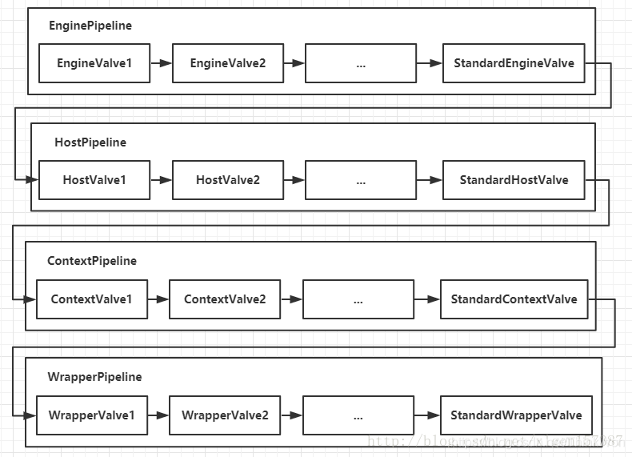
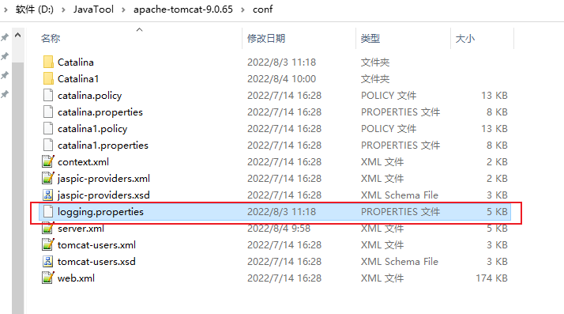

# Tomcat

## Tomcat是什么？

​		Tomcat 服务器Apache软件基金会项目中的一个核心项目，是一个免费的开放源代码的Web 应用服务器，属于轻量级应用服务器，在中小型系统和并发访问用户不是很多的场合下被普遍使用，是开发和调试的首选。


## 版本问题

### Tomcat 10 

​		从Tomcat的官方文档可以看到，Tomcat 10有一个大的变动：jar包从 `javax.*` 变成了 `jakarta.*`，这就要求从Tomcat 9 等 迁移到Tomcat 10的时候，要么做一些代码改动，要么借助Tomcat官网提供的[迁移工具](https://github.com/apache/tomcat-jakartaee-migration)将编译好的war变更成用`jakarta`的。

​		从这个迁移工具的[github文档](https://github.com/apache/tomcat-jakartaee-migration)来看，这个工具还处于开发过程中。通过它可以将用Java 8 编写的运行在Tomcat 9 上的web application自动转换成使用Jakarta 9 并可以运行在 Tomcat 10上。

**直接下载迁移工具**
从[Tomcat Migration Tool](https://tomcat.apache.org/download-migration.cgi)下载迁移工具。

准备迁移，通过如下命令即可：

~~~bash
java -jar jakartaee-migration-*-shaded.jar <source> <destination>
~~~

其中，<source> 是准备进行迁移的文件，<destination> 是迁移完成后保存下来后的文件。比如：

~~~bash
java -jar target/jakartaee-migration-0.0.2-shaded.jar E:/tmp/Web.war E:/tmp/migrated/WebNew.war
~~~


## Tomcat的默认端口

1. 找到Tomcat目录下的conf文件夹
2. 进入conf文件夹里面找到server.xml文件
3. 打开server.xml文件
4. 在server.xml文件里面找到下列信息
5. 把Connector标签的8080端口改成你想要的端口

```xml
<Service name="Catalina">
<Connector port="8080" protocol="HTTP/1.1" 
               connectionTimeout="20000" 
               redirectPort="8443" />
```

## tomcat 有哪几种Connector 运行模式(优化)？

下面，我们先大致了解Tomcat Connector的三种运行模式。

- BIO：同步并阻塞 一个线程处理一个请求。Tomcat7或以下，在Linux系统中默认使用这种方式。
- NIO：同步非阻塞IO,利用Java的异步IO处理，可以通过少量的线程处理大量的请求，可以复用同一个线程处理多个connection(多路复用)。Tomcat8在Linux系统中默认使用这种方式。Tomcat7必须修改Connector配置来启动。
- APR：异步非阻塞，即Apache Portable Runtime，从操作系统层面解决io阻塞问题。


## Tomcat有几种部署方式？

1. 利用Tomcat的自动部署：把web应用拷贝到`webapps`目录。Tomcat在启动时会加载目录下的应用，并将编译后的结果放入work目录下。

2. 使用`Manager App`控制台部署。在tomcat主页点击`Manager App`进入应用管理控制台，可以指定一个web应用的路径或war文件。

3. 修改`conf/server.xml`文件部署。修改`conf/server.xml`文件，增加Context节点可以部署应用。

4. 增加自定义的Web部署文件。在`conf/Catalina/localhost/ `路径下增加 `xyz.xml`文件，内容是Context节点，可以部署应用。


## tomcat容器是如何创建servlet类实例？用到了什么原理？

1. 当容器启动时，会读取在webapps目录下所有的web应用中的web.xml文件，然后对 **xml文件进行解析，并读取servlet注册信息**。然后，将每个应用中注册的servlet类都进行加载，并通过 **反射的方式实例化**。（有时候也是在第一次请求时实例化）
2. 在servlet注册时加上1如果为正数，则在一开始就实例化，如果不写或为负数，则第一次请求实例化。


## Tomcat工作模式

Tomcat作为servlet容器，有三种工作模式：

1. 独立的servlet容器，servlet容器是web服务器的一部分；

2. 进程内的servlet容器，servlet容器是作为web服务器的插件和java容器的实现，web服务器插件在内部地址空间打开一个jvm使得java容器在内部得以运行。反应速度快但伸缩性不足；

3. 进程外的servlet容器，servlet容器运行于web服务器之外的地址空间，并作为web服务器的插件和java容器实现的结合。反应时间不如进程内但伸缩性和稳定性比进程内优；

进入Tomcat的请求可以根据Tomcat的工作模式分为如下两类：

1. Tomcat作为应用程序服务器：请求来自于前端的web服务器，这可能是Apache, IIS, Nginx等；

2. Tomcat作为独立服务器：请求来自于web浏览器；

# Tomcat 架构

​		面试时问到Tomcat相关问题的几率并不高，正式因为如此，很多人忽略了对Tomcat相关技能的掌握，下面这一篇文章整理了Tomcat相关的系统架构，介绍了Server、Service、Connector、Container之间的关系，各个模块的功能，可以说把这几个掌握住了，Tomcat相关的面试题你就不会有任何问题了！

学了本章之后你应该明白的是：

- Server、Service、Connector、Container四大组件之间的关系和联系，以及他们的主要功能点；
- Tomcat执行的整体架构，请求是如何被一步步处理的；
- Engine、Host、Context、Wrapper相关的概念关系；
- Container是如何处理请求的；
- Tomcat用到的相关设计模式；

## Tomcat顶层架构

​		俗话说，站在巨人的肩膀上看世界，一般学习的时候也是先总览一下整体，然后逐个部分个个击破，最后形成思路，了解具体细节，Tomcat的结构很复杂，但是 Tomcat 非常的模块化，找到了 Tomcat 最核心的模块，问题才可以游刃而解，了解了 Tomcat 的整体架构对以后深入了解 Tomcat 来说至关重要！

先上一张Tomcat的顶层结构图（图A），如下：


​		Tomcat中最顶层的容器是Server，代表着整个服务器，从上图中可以看出，一个Server可以包含至少一个Service，即可以包含多个Service，用于具体提供服务。

Service主要包含两个部分：Connector和Container。从上图中可以看出 Tomcat 的心脏就是这两个组件，他们的作用如下：

- Connector用于处理连接相关的事情，并提供Socket与Request请求和Response响应相关的转化;

- Container用于封装和管理Servlet，以及具体处理Request请求；

  

​        一个Tomcat中只有一个Server，一个Server可以包含多个Service，一个Service只有一个Container，但是可以有多个Connectors，这是因为一个服务可以有多个连接，如同时提供Http和Https链接，也可以提供向相同协议不同端口的连接，示意图如下（Engine、Host、Context下面会说到）：


​		多个 Connector 和一个 Container 就形成了一个 Service，有了 Service 就可以对外提供服务了，但是 Service 还要一个生存的环境，必须要有人能够给她生命、掌握其生死大权，那就非 Server 莫属了！所以整个 Tomcat 的生命周期由 Server 控制。

​		另外，上述的包含关系或者说是父子关系，都可以在tomcat的conf目录下的server.xml配置文件中看出，下图是删除了注释内容之后的一个完整的server.xml配置文件（Tomcat版本为8.0）


​		详细的配置文件内容可以到Tomcat官网查看：[Tomcat配置文件](http://tomcat.apache.org/tomcat-8.0-doc/index.html)

​		上边的配置文件，还可以通过下边的一张结构图更清楚的理解：


​		Server标签设置的端口号为8005，shutdown=”SHUTDOWN” ，表示在8005端口监听“SHUTDOWN”命令，如果接收到了就会关闭Tomcat。一个Server有一个Service，当然还可以进行配置，一个Service有多个Connector，Service左边的内容都属于Container的，Service下边是Connector。

### Tomcat顶层架构小结

1. Tomcat中只有一个Server，一个Server可以有多个Service，一个Service可以有多个Connector和一个Container；
2. Server掌管着整个Tomcat的生死大权；
3. Service 是对外提供服务的；
4. Connector用于接受请求并将请求封装成Request和Response来具体处理；
5. Container用于封装和管理`Servlet`，以及具体处理request请求；

​        知道了整个Tomcat顶层的分层架构和各个组件之间的关系以及作用，对于绝大多数的开发人员来说Server和Service对我们来说确实很远，而我们开发中绝大部分进行配置的内容是属于Connector和Container的，所以接下来介绍一下Connector和Container。

## Connector和Container的微妙关系

​		**由上述内容我们大致可以知道一个请求发送到Tomcat之后，首先经过Service然后会交给我们的Connector，Connector用于接收请求并将接收的请求封装为Request和Response来具体处理，Request和Response封装完之后再交由Container进行处理，Container处理完请求之后再返回给Connector，最后在由Connector通过Socket将处理的结果返回给客户端，这样整个请求的就处理完了！**

​		Connector最底层使用的是Socket来进行连接的，Request和Response是按照HTTP协议来封装的，所以Connector同时需要实现`TCP/IP`协议和`HTTP`协议！

​		Tomcat既然需要处理请求，那么肯定需要先接收到这个请求，接收请求这个东西我们首先就需要看一下Connector！

**Connector架构分析**

Connector用于接受请求并将请求封装成Request和Response，然后交给Container进行处理，Container处理完之后在交给Connector返回给客户端。

因此，我们可以把Connector分为四个方面进行理解：

1. Connector如何接受请求的？
2. 如何将请求封装成Request和Response的？
3. 封装完之后的Request和Response如何交给Container进行处理的？
4. Container处理完之后如何交给Connector并返回给客户端的？

首先看一下Connector的结构图（图B），如下所示：


​		Connector就是使用ProtocolHandler来处理请求的，不同的ProtocolHandler代表不同的连接类型，比如：Http11Protocol使用的是普通Socket来连接的，Http11NioProtocol使用的是NioSocket来连接的。

其中ProtocolHandler由包含了三个部件：Endpoint、Processor、Adapter。

1. Endpoint用来处理底层Socket的网络连接，Processor用于将Endpoint接收到的Socket封装成Request，Adapter用于将Request交给Container进行具体的处理。
2. Endpoint由于是处理底层的Socket网络连接，因此Endpoint是用来实现TCP/IP协议的，而Processor用来实现HTTP协议的，Adapter将请求适配到Servlet容器进行具体的处理。
3. Endpoint的抽象实现AbstractEndpoint里面定义的Acceptor和AsyncTimeout两个内部类和一个Handler接口。Acceptor用于监听请求，AsyncTimeout用于检查异步Request的超时，Handler用于处理接收到的Socket，在内部调用Processor进行处理。

至此，我们应该很轻松的回答1，2，3的问题了，但是4还是不知道，那么我们就来看一下Container是如何进行处理的以及处理完之后是如何将处理完的结果返回给Connector的？

## Container架构分析

Container用于封装和管理Servlet，以及具体处理Request请求，在Container内部包含了4个子容器，结构图如下（图C）：


4个子容器的作用分别是：

1. Engine：引擎，用来管理多个站点，一个Service最多只能有一个Engine；
2. Host：代表一个站点，也可以叫虚拟主机，通过配置Host就可以添加站点；
3. Context：代表一个应用程序，对应着平时开发的一套程序，或者一个WEB-INF目录以及下面的`web.xml`文件；
4. Wrapper：每一Wrapper封装着一个`Servlet`；

下面找一个Tomcat的文件目录对照一下，如下图所示：


Context和Host的区别是Context表示一个应用，我们的Tomcat中默认的配置下`webapps`下的每一个文件夹目录都是一个Context，其中ROOT目录中存放着主应用，其他目录存放着子应用，而整个`webapps`就是一个Host站点。

我们访问应用Context的时候，如果是ROOT下的则直接使用域名就可以访问，例如：[www.baidu.com](www.baidu.com)，如果是Host（`webapps`）下的其他应用，则可以使用[www.baidu.com/docs](www.baidu.com/docs)进行访问，当然默认指定的根应用（ROOT）是可以进行设定的，只不过Host站点下默认的主应用是ROOT目录下的。

看到这里我们知道Container是什么，但是还是不知道Container是如何进行请求处理的以及处理完之后是如何将处理完的结果返回给Connector的？别急！下边就开始探讨一下Container是如何进行处理的！

### Container如何处理请求的

Container处理请求是使用Pipeline-Valve管道来处理的！（Valve是阀门之意）

Pipeline-Valve是**责任链模式**，责任链模式是指在一个请求处理的过程中有很多处理者依次对请求进行处理，每个处理者负责做自己相应的处理，处理完之后将处理后的结果返回，再让下一个处理者继续处理。


但是！Pipeline-Valve使用的责任链模式和普通的责任链模式有些不同！区别主要有以下两点：

- 每个Pipeline都有特定的Valve，而且是在管道的最后一个执行，这个Valve叫做BaseValve，BaseValve是不可删除的；
- 在上层容器的管道的BaseValve中会调用下层容器的管道。

我们知道Container包含四个子容器，而这四个子容器对应的BaseValve分别在：StandardEngineValve、StandardHostValve、StandardContextValve、StandardWrapperValve。

Pipeline的处理流程图如下（图D）：



- Connector在接收到请求后会首先调用最顶层容器的Pipeline来处理，这里的最顶层容器的Pipeline就是`EnginePipeline`（Engine的管道）；
  - 在Engine的管道中依次会执行`EngineValve1`、`EngineValve2`等等，最后会执行`StandardEngineValve`，在`StandardEngineValve`中会调用Host管道，然后再依次执行Host的`HostValve1`、`HostValve2`等，最后在执行`StandardHostValve`，然后再依次调用Context的管道和Wrapper的管道，最后执行到`StandardWrapperValve`。
- 当执行到`StandardWrapperValve`的时候，会在`StandardWrapperValve`中创建`FilterChain`，并调用其`doFilter`方法来处理请求，这个`FilterChain`包含着我们配置的与请求相匹配的Filter和`Servlet`，其`doFilter`方法会依次调用所有的Filter的`doFilter`方法和`Servlet`的service方法，这样请求就得到了处理！
- 当所有的Pipeline-Valve都执行完之后，并且处理完了具体的请求，这个时候就可以将返回的结果交给Connector了，Connector在通过Socket的方式将结果返回给客户端。

## 总结

​		至此，我们已经对Tomcat的整体架构有了大致的了解，从图A、B、C、D可以看出来每一个组件的基本要素和作用。我们在脑海里应该有一个大概的轮廓了！如果你面试的时候，让你简单的聊一下Tomcat，上面的内容你能脱口而出吗？当你能够脱口而出的时候，面试官一定会对你刮目相看的！


# 最佳实践

## 登陆用户

详细配置

~~~xml
<role rolename="admin"/>
<role rolename="manager-gui"/>
<role rolename="admin-gui"/>
<user username="my" password="my" roles="admin,manager-gui,admin-gui"/>
~~~


## 配置详解

### `HTTP` 连接器

+ `allowTrace`：是否允许HTTP的TRACE方法，默认为false
+ emptySessionPath：如果设置为true，用户的所有路径都将设置为/，默认为false。
+ enableLookups：调用request、getRemoteHost()执行DNS查询，以返回远程主机的主机名，如果设置为false，则直接返回`IP`地址。
+ `maxPostSize`：指定POST方式请求的最大量，没有指定默认为2097152。
+ `protocol`：值必须为`HTTP1.1`，如果使用AJP处理器，该值必须为AJP/1.3
+ `proxyName`：如这个连接器正在一个代理配置中被使用，指定这个属性，在`request.getServerName()`时返回
+ `redirectPort`：如连接器不支持`SSL`请求，如收到`SSL`请求，Catalina容器将会自动重定向指定的端口号，让其进行处理。
+ `scheme`：设置协议的名字，在`request.getScheme()`时返回，SSL连接器设为”https”，默认为”http”
+ `secure`：在`SSL`连接器可将其设置为true，默认为false
+ `URIEncoding`：用于解码URL的字符编码，没有指定默认值为`ISO-8859-1`
+ `useBodyEncodingForURI`：主要用于`Tomcat4.1.x`中，指示是否使用在`contentType`中指定的编码来取代
+ `URIEncoding`，用于解码URI查询参数，默认为false
+ `xpoweredBy`：为true时，Tomcat使用规范建议的报头表明支持`Servlet`的规范版本，默认为false
+ `acceptCount`：当所有的可能处理的线程都正在使用时，在队列中排队请求的最大数目。当队列已满，任何接收到的请求都会被拒绝，默认值为10
+ `bufferSize`：设由连接器创建输入流缓冲区的大小，以字节为单位。默认情况下，缓存区大的大小为2048字节
+ `compressableMimeType`：MIME的列表，默认以逗号分隔。默认值是text/html，text/xml，text/plain
+ `compression`：指定是否对响应的数据进行压缩。off：表示禁止压缩、on：表示允许压缩（文本将被压缩）、
+ `force`：表示所有情况下都进行压缩，默认值为off
+ `connectionTimeout`：设置连接的超时值，以毫秒为单位。默认值为60000=60秒
+ `disableUploadTimeOut`：允许`Servlet`容器，正在执行使用一个较长的连接超时值，以使`Servlet`有较长的时间来完成它的执行，默认值为false
+ `maxHttpHeaderSize`：HTTP请求和响应头的最大量，以字节为单位，默认值为4096字节
+ `maxKeepAliveRequest`：服务器关闭之前，客户端发送的流水线最大数目。默认值为100
+ `maxSpareThreads`：允许存在空闲线程的最大数目，默认值为50
+ `minSpareThreads`：设当连接器第一次启协创建线程的数目，确保至少有这么多的空闲线程可用。默认值为4
+ `port`：服务端套接字监听的TCP端口号，默认值为8080（必须）
+ `socketBuffer`：设Socket输出缓冲区的大小（以字节为单位），-1表示禁止缓冲，默认值为9000字节
+ `toNoDelay`：为true时，可以提高性能。默认值为true
+ `threadPriority`：设`JVM`中请求处理线程优先级。默认值为NORMAL-PRIORITY

### `Host`标签

+ appBase：设定应用程序的基目录，绝对路径或相对于%CATALINA_HOME%的路径名
+ autoDeploy：指示Tomcat运行时，如有新的WEB程序加开appBase指定的目录下，是否为自动布署，默认值为true
+ className：实现了org.apache.catalina.Host接口的类，标准实现类为org.apache.catalina.core.StandardHost类
+ deployOnStartup：Tomcat启动时，是否自动部署appBase属性指定目录下所有的WEB应用程序，默认值为true
+ name：虚拟主机的网络名（必须）

### `Context`标签

+ className：实现了org.apache.catalina.Context接口的类，标准实现类org.apache.catalina.core.StandardContext类
+ cookies：是否将Cookie应用于Session，默认值为true
+ crossContext：是否允许跨域访问，为true时，在程序内调用ServletContext.getContext()方法将返回一个虚拟主机上其它web程序的请求调度器。默认值为false，调 径用getContext()返回为null
+ docBase：绝对路径或相对于Host的appBase 属性的相对路径
+ privileged：为true，允许Web应用程序使用容器的Servlet
+ path：指定上下文路径。一个虚拟主机中，上下文路径必须唯一
+ reloadable：为true，Tomcat运行时，如果WEB-INF/classes和WEB-INF/lib目录中有改变，Tomcat会自动重新加载该WEB应用程序。虽方便，但开销也大，默认值为false，我们在调用可以打开，发布后再关闭。
+ cacheMaxSize：静态资源缓存最大值，以KB为单位，默认值为10240KB
+ cachingAllowed：是否允许静态资源缓存，默认为true
+ caseSensitive：默认为true,资源文件名大小写敏感，如果为false大小写不敏感
+ unpackWAR：默认为true
+ workDir：为WEB应用程序内部的Servlet指定临时读写的目录路径名。如没有设置，则Tomcat会在%CATALINA_HOME%/work目录下提供一个合适的目录

## 单一端口

特点：

1. 单一端口启动多个`war`，`war`包可以存在到不同的文件路径
2. 自动配置`war`解压路径（前置 `url` 的路径）

~~~xml
 <Service name="Catalina">
          <!-- 虚拟容器的启动端口 -->
          <Connector port="8443" protocol="HTTP/1.1" connectionTimeout="20000" redirectPort="8443" />
          <Engine name="Catalina" defaultHost="localhost">
               <Realm className="org.apache.catalina.realm.LockOutRealm">
                    <Realm className="org.apache.catalina.realm.UserDatabaseRealm" resourceName="UserDatabase" />
               </Realm>
               <!-- 基本定义内容 -->
               <Host name="localhost" appBase="webapps" unpackWARs="true" autoDeploy="true">
                    <Valve className="org.apache.catalina.valves.AccessLogValve" directory="logs" prefix="localhost_access_log" suffix=".txt" pattern="%h %l %u %t &quot;%r&quot; %s %b" />
                    <!-- 前置路径、war包的存放位置 -->
                    <Context path="/demo" reloadable="true" docBase="../wars/helloworld-1.0.war"/>
                    <Context path="/front" reloadable="true" docBase="../wars/decision-tdm-assist-front-1.0.0-RELEASE.war"/>
                    <Context path="/assist" reloadable="true" docBase="../wars/decision-tdm-assist-proxy-1.0.0-RELEASE.war"/>
                    <Context path="/mock" reloadable="true" docBase="../wars/decision-tdm-assist-mock-1.0.0-RELEASE.war"/>
                    <Context path="/group-api" reloadable="true" docBase="../wars/prod-tdm-gateway-groupA.war"/>
                    <Context path="/base-api" reloadable="true" docBase="../wars/prod-tdm-server.war"/>
               </Host>
          </Engine>
     </Service>
~~~


## 多端口启动

特点：

1. 多个端口启动不同的`war`
2. 但是配置前置路径`context` 标签

~~~xml
  <Service name="Catalina">
          <!-- 虚拟容器的启动端口 -->
          <Connector port="8443" protocol="HTTP/1.1" connectionTimeout="20000" redirectPort="8443" />
          <Engine name="Catalina" defaultHost="localhost">
               <Realm className="org.apache.catalina.realm.LockOutRealm">
                    <Realm className="org.apache.catalina.realm.UserDatabaseRealm" resourceName="UserDatabase" />
               </Realm>
               <!-- 基本定义内容 -->
               <Host name="localhost" appBase="webapps" unpackWARs="true" autoDeploy="true">
                    <Valve className="org.apache.catalina.valves.AccessLogValve" directory="logs" prefix="localhost_access_log" suffix=".txt" pattern="%h %l %u %t &quot;%r&quot; %s %b" />
                    <!-- 前置路径、war包的存放位置 -->
                    <Context path="/demo" reloadable="true" docBase="../wars/helloworld-1.0.war" />
                    <Context path="/front" reloadable="true" docBase="../wars/decision-tdm-assist-front-1.0.0-RELEASE.war" />
                    <Context path="/assist" reloadable="true" docBase="../wars/decision-tdm-assist-proxy-1.0.0-RELEASE.war" />
                    <Context path="/mock" reloadable="true" docBase="../wars/decision-tdm-assist-mock-1.0.0-RELEASE.war" />
                    <Context path="/group-api" reloadable="true" docBase="../wars/prod-tdm-gateway-groupA.war" />
                    <Context path="/base-api" reloadable="true" docBase="../wars/prod-tdm-server.war" />
               </Host>
          </Engine>
     </Service>
     <!-- 第二个端口启动 -->
     <Service name="Catalina1">
          <Connector port="8001" protocol="HTTP/1.1" connectionTimeout="20000" redirectPort="8443" />
          <Engine name="Catalina1" defaultHost="localhost">
               <Realm className="org.apache.catalina.realm.LockOutRealm">
                    <Realm className="org.apache.catalina.realm.UserDatabaseRealm" resourceName="UserDatabase" />
               </Realm>
               <Host name="localhost" appBase="webapps1" unpackWARs="true" autoDeploy="true">
                    <Context path="/mock" docBase="D:\JavaTool\apache-tomcat-9.0.65\war\helloworld-1.0.war" reloadable="true"></Context>
                    <Valve className="org.apache.catalina.valves.AccessLogValve" directory="logs" prefix="localhost_access_log" suffix=".txt" pattern="%h %l %u %t &quot;%r&quot; %s %b" />
               </Host>
          </Engine>
     </Service>
~~~

增加对应的配置文件


## 日志窗口中文乱码

1. 配置文件



2. 修改为`java console log` 编码为`GBK`


## 作为前端页面的服务器

​		可以做到类似 nginx 的前端页面的应用服务器的效果，

端口直接访问的方式

1. 将页面放在 Root 目录下，但是这样就不能访问Tomcat 的管理页面了

2. 修改Server.xml配置，后期同样不能访问tomcat页了

   ~~~xml
   <Context path="" docBase="..\webapps\test" debug="0" reloadable="true">
   ~~~

   

## 配置`Https`

omcat证书配置
首先，要实现https，就必须先具有tomcat证书。我们在安装tomcat的时候，肯定都先安装了JAVA，而JAVA中有自带的证书生成工具keytool，今天，我们就使用keytool来生成tomcat的证书。
执行命令：

~~~java
keytool 
    -genkeypair 
    -alias 'tomcat' 
    -keyalg 'RSA' 
    -keystore '/usr/local/tomcat/conf/tomcat.keystore'
~~~


### tomcat支持https配置

​		接下来，我们还要配置tomcat使用该证书，并开放8443端口，支持https。打开tomcat的主配置文件，找到8080端口的connector元素，在下面添加如下内容：

~~~xml
<Connector port="8443" 
           protocol="HTTP/1.1" 
           SSLEnabled="true" 
           connectionTimeout="20000" 
           redirectPort="8443" 
           keystoreFile="d:/Tool/apache-tomcat-9.0.48/keystore/krest.keystore"
           keystorePass="123456"
~~~

将配置的证书进行安装即可

### 注意

`JDK`自己生成的证书，版本需要对应起来，否则会爆出异常


## 配置多个 Host

~~~xml
<Host name="pzz.com"  appBase="/var/www/">
        <Context path="" docBase="/var/www/tomcat1" />
</Host>
<Host name="zzp.com"  appBase="/var/www/">
        <Context path="" docBase="/var/www/tomcat2" />
</Host>

~~~


### 效果检验

下面，我们就来检验一下刚才我们配置的结果。首先，修改本地的hosts文件，使得pzz.com和zzp.com两个域名都指向我们的虚拟机IP地址。接下来，我们尝试用域名访问我们的Tomcat虚拟机，结果如下：


## 指定 JDK 版本

+ `windows` 下 `catalina.bat` 与 `setclasspath.bat`

~~~bash
set "JAVA_HOME=C:\Program Files\java\jdk1.8.0_181"
~~~


+ `linux` 下 `catalina.sh` 与 `setclasspath.sh`

~~~bash
export JAVA_HOME=/usr/local/java/jdk-11.0.16
export JRE_HOME=/usr/local/java/jdk-11.0.16
~~~


## 性能调优

### 概述

- 增加JVM堆内存大小
- 修复JRE内存泄漏
- 线程池设置
- 压缩
- 其它选项

### 对内存

+ `tomcat server folder\bin\catalina.sh`
+ `\tomcat server folder\bin\catalina.bat`

~~~conf
JAVA_OPTS="-Djava.awt.headless=true -Dfile.encoding=UTF-8
-server -Xms1024m -Xmx1024m
-XX:NewSize=512m -XX:MaxNewSize=512m -XX:PermSize=512m
-XX:MaxPermSize=512m -XX:+DisableExplicitGC"
-Xms – 指定初始化时化的栈内存
-Xms – 指定初始化时化的栈内存
-Xmx – 指定最大栈内存
~~~


### 解决`JRE`内存泄露

​		性能表现不佳的另一个主要原因是内存泄漏，正如我之前说过：始终使用最新的tomcat服务器以获得更好的性能和可伸缩性。现在，这句话变成真的。如果我们使用最新的tomcat版本6.0.26及以上就可以解决这个错误，因为它包含了一个监听器来处理`JRE`和`PermGen`的内存泄漏。使用的监听器是，

~~~conf
<Listener className="org.apache.catalina.core.JreMemoryLeakPreventionListener" />
~~~


### 线程池设置

​		线程池指定Web请求负载的数量，因此，为获得更好的性能这部分应小心处理。可以通过调整连接器属性`maxThreads`完成设置。`maxThreads`的值应该根据流量的大小，如果值过低，将有没有足够的线程来处理所有的请求，请求将进入等待状态，只有当一个的处理线程释放后才被处理；如果设置的太大，Tomcat的启动将花费更多时间。因此它取决于我们给`maxThreads`设置一个正确的值。

~~~xml
<Connector port="8080" address="localhost"
maxThreads="250" maxHttpHeaderSize="8192"
emptySessionPath="true" protocol="HTTP/1.1"
enableLookups="false" redirectPort="8181" acceptCount="100"
connectionTimeout="20000" disableUploadTimeout="true" />
~~~

​		在上述配置中，`maxThreads`值设定为“250”，这指定可以由服务器处理的并发请求的最大数量。如果没有指定，这个属性的默认值为“200”。任何多出的并发请求将收到“拒绝连接”的错误提示，直到另一个处理请求进程被释放。错误看起来如下，


### 压缩

~~~Xml
<Connector port="8080" protocol="HTTP/1.1"
connectionTimeout="20000"
redirectPort="8181" compression="500"
compressableMimeType="text/html,text/xml,text/plain,application/octet-stream" />
~~~

​		在前面的配置中，当文件的大小大于等于`500bytes`时才会压缩。如果当文件达到了大小但是却没有被压缩，那么设置属性`compression="on"`。否则`Tomcat`默认设置是`off`。接下来我们将看看如何调优数据库。


### 其他选项

- 开启浏览器的缓存，这样读取存放在webapps文件夹里的静态内容会更快，大大推动整体性能。
- 每当开机时，Tomcat服务器应当自动地重启。
- 一般情况下`HTTPS`请求会比HTTP请求慢。如果你想要更好的安全性，即使慢一点我们还是要选择`HTTPS`。

### 设置`TOMCAT`启用`GZIP`压缩

+ HTTP 压缩可以大大提高浏览网站的速度，它的原理是，在客户端请求服务器对应资源后，从服务器端将资源文件压缩，再输出到客户端，由客户端的浏览器负责解压缩并浏览。 
+ 相对于普通的浏览过程`HTML`、`CSS`、`Javascript` 、 `Text` ，它可以节省40%左右的流量。更为重要的是，它可以对动态生成的，包括`CGI`、`PHP `, `JSP `, `ASP `, `Servlet`,`SHTML`等输出的网页也能进行压缩，压缩效率也很高。
+ 相关配置
  + `compression="on"` 打开压缩功能
  + `compressionMinSize="50"` 启用压缩的输出内容大小，默认为`2KB`
  + `noCompressionUserAgents="gozilla, traviata"` 对于以下的浏览器，不启用压缩
  + `compressableMimeType="text/html,text/xml,text/javascript,text/css,text/plain"`　哪些资源类型需要压缩

~~~xml
<Connector port="80" protocol="HTTP/1.1"
connectionTimeout="20000"
redirectPort="8443" executor="tomcatThreadPool" URIEncoding="utf-8"
compression="on"
compressionMinSize="50" noCompressionUserAgents="gozilla, traviata"
compressableMimeType="text/html,text/xml,text/javascript,text/css,text/plain" />
~~~

备注：如果发现内容没有被压缩，可以考虑调整`compressionMinSize`大小，如果请求资源小于这个数值，则不会启用压缩。