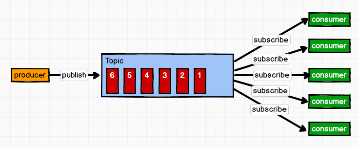
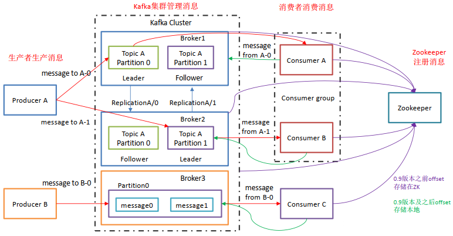
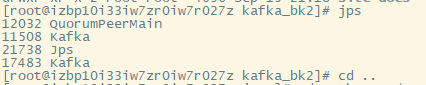
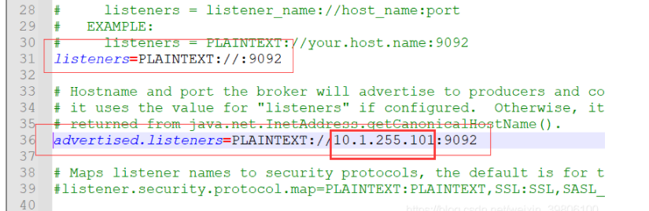
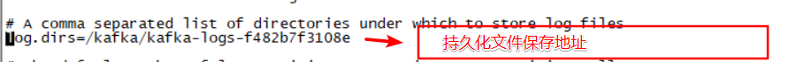
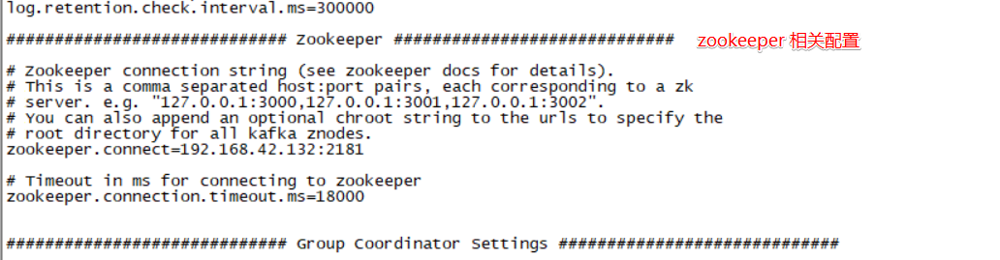
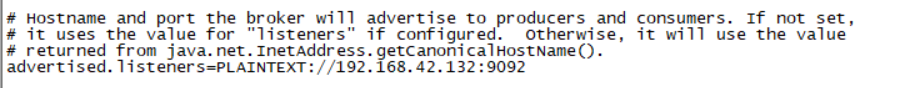
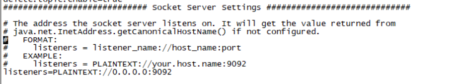

# Kafka

## 简介

### 介绍

​		Kafka是一种消息队列，主要用来处理大量数据状态下的消息队列，一般用来做日志的处理。既然是消息队列，那么`Kafka`也就拥有消息队列的相应的特性了。

### 消费模式

​		Kafka的消费模式主要有两种：一种是一对一的消费，也即点对点的通信，即一个发送一个接收。第二种为一对多的消费，即一个消息发送到消息队列，消费者根据消息队列的订阅拉取消息消费。

**一对一**


​		消息生产者发布消息到Queue队列中，通知消费者从队列中拉取消息进行消费。**消息被消费之后则删除**，Queue支持多个消费者，但对于一条消息而言，只有一个消费者可以消费，即一条消息只能被一个消费者消费。


**一对多**




​		这种模式也称为发布/订阅模式，即利用Topic存储消息，消息生产者将消息发布到Topic中，同时有多个消费者订阅此topic，消费者可以从中消费消息，注意发布到Topic中的消息会被多个消费者消费，**消费者消费数据之后，数据不会被清除**，Kafka会默认保留一段时间，然后再删除。


### Kafka的基础架构




Kafka像其他`Mq`一样，也有自己的基础架构，主要存在生产者Producer、Kafka集群Broker、消费者Consumer、注册消息`Zookeeper`.

1. 基本名词

   + `Broker kafka`集群有多个Broker组成

   + `topic`：不同的数据分为不同的topic

   + `producer`： 消息生产者

   + `consunmer`：消息的消费者

   + `partition`：每个topic 可以拆分多个partition，每个消息都有一个递增的id


2. 流程

   + producer选择一个topic，生产消息，消息分配策略将消息追加该topic下的某个partition。

   + consumer选择一个topic，通过offset执行从哪个位置开始消费消息，消费完之后保留id，然后下次从这个id开始继续消费

   + 不管消息是否有被消费过，它依然会保留在kafka当中

   + kafka消息的默认生命周期是7*24小时，时间一到，kafka会从磁盘当中删除数据


3. 备份策略
   + 备份以partition作为单位，一般是：1个leader和n 个 follows，leader接受读写请求，follower被动赋值leader，leader和follower会在集群中进行打散，从而保证集群的高可用


4. 其他

   + 理论上消费这可以通过修改偏离量读取到任意位置的数据

   + 每个consumer都会保留着自己的offset，互不干扰，不存在线程安全问题

   + 每个topic中有多个partition，partition会被均匀的分配到集群的每个server上，生产、消费消息的时候，会被路由到指定的partition，减少单台服务器的压力，增加了系统并行的能力

   + 每个topic保留的消息可能非常巨大，通过partition将消息切分成多个子消息，通过负载均衡将partition分配到不同的server，这样，当机器负载满的时候，可以用过扩容将消息重新均匀分配

   + 持久化灵活，可以指定对应的时间端保存消息


5. 消费组

   + 每个consummer都有对应的group，group之间是订阅发布的模式，每个group之间是独立消费的，互不影响，同时一个消息在每个group之间，仅仅被消费一次，每个consumer都会将自己标记consumer group名称，之后，系统会将consumer group 按照名称分组，将消息复制分发给每个分组，每个分组只能有要给consumer消费这条消息

   + 两种极端的情况
     + 当所有的consumer的consumer group相同时，系统就会变成队列模式
     + 当所有的consumer的consumer group不同时，每个组里只有要给consumer，系统变为发布订阅


6. 使用场景

   + 日志搜集，给到`hadoop`、`hbase`、`solr`

   + 消息系统：缓存消息

   + 用户活动跟踪：记录监控工作

   + 运营指标


## Kafka特点

- 高吞吐量、低延迟：kafka每秒可以处理几十万条消息，它的延迟最低只有几毫秒，每个topic可以分多个partition, consumer group 对partition进行consume操作。
- 可扩展性：kafka集群支持热扩展
- 持久性、可靠性：消息被持久化到本地磁盘，并且支持数据备份防止数据丢失
- 容错性：允许集群中节点失败（若副本数量为n,则允许n-1个节点失败）
- 高并发：支持数千个客户端同时读写


## 使用场景

- 日志收集：一个公司可以用Kafka可以收集各种服务的log，通过kafka以统一接口服务的方式开放给各种consumer，例如`hadoop`、`HBase`、`Solr`等。
- 消息系统：解耦和生产者和消费者、缓存消息等。
- 用户活动跟踪：Kafka经常被用来记录web用户或者`app`用户的各种活动，如浏览网页、搜索、点击等活动，这些活动信息被各个服务器发布到kafka的topic中，然后订阅者通过订阅这些topic来做实时的监控分析，或者装载到`hadoop`、数据仓库中做离线分析和挖掘。
- 运营指标：Kafka也经常用来记录运营监控数据。包括收集各种分布式应用的数据，生产各种操作的集中反馈，比如报警和报告。
- 流式处理：比如spark streaming和 `Flink`

## 普通安装Kafka

#### 1. 下载Kafka

~~~bash
https://www.apache.org/dyn/closer.cgi?path=/kafka/2.8.0/kafka_2.13-2.8.0.tgz
下载 解压
tar -xxvzf 文件名称
~~~

#### 2. 修改配置文件

`server.properties`

~~~properties
// 每个节点的id不一样 
broker.id=0
// 配置数据存放的位置，主要以log的形式
log.dirs=/usr/local/java/kafka/data/kafka
// 配置端口号
listeners=PLAINTEXT://:9092
// 配置开启远程连接

~~~


#### 3. 启动指令

用守护线程的方式来进行启动

~~~
./bin/kafka-server-start.sh -daemon config/server.properties
~~~


#### 4. 查看运行状态

~~~bash
jps
~~~



#### 5 . 验证集群是否启动成功

~~~bash
bin/kafka-topics.sh --bootstarp-server node1.itcast.cn:9002 --list
~~~


#### 6. 远程连接

Kafka在Linux本机是连接正常的，后面排查得知，Kafka默认只能支持本机访问，要远程访问需修改配置
`config/server.properties`，取消如下两行注释，并把`localhost`改成访问本机的`IP`地址。




## Docker启动

~~~bash
# 查找镜像
docker search kafka

# 拉取镜像
docker pull wurstmeister/kafka
docker pull wurstmeister/zookeeper 

121.196.111.229

# 运行镜像
# 首先需要启动zookeeper，如果不先启动，启动kafka没有地方注册消息
docker run -it --name zookeeper -p 12181:2181 -d wurstmeister/zookeeper:latest

# 启动kafka容器，注意需要启动三台,注意端口的映射，都是映射到9092
# 第一台
docker run -it --name kafka01 -p 19092:9092 -d -e KAFKA_BROKER_ID=0 -e KAFKA_ZOOKEEPER_CONNECT=0.0.0.0:2181 -e KAFKA_ADVERTISED_LISTENERS=PLAINTEXT://121.196.111.229:19092 -e KAFKA_LISTENERS=PLAINTEXT://0.0.0.0:9092 wurstmeister/kafka:latest
# 第二台
docker run -it --name kafka02 -p 19093:9092 -d -e KAFKA_BROKER_ID=1 -e KAFKA_ZOOKEEPER_CONNECT=121.196.111.229:12181 -e KAFKA_ADVERTISED_LISTENERS=PLAINTEXT://121.196.111.229:19093 -e KAFKA_LISTENERS=PLAINTEXT://0.0.0.0:9092 wurstmeister/kafka:latest
# 第三台
docker run -it --name kafka03 -p 19094:9092 -d -e KAFKA_BROKER_ID=2 -e KAFKA_ZOOKEEPER_CONNECT=121.196.111.229:12181 -e KAFKA_ADVERTISED_LISTENERS=PLAINTEXT://121.196.111.229:19094 -e KAFKA_LISTENERS=PLAINTEXT://0.0.0.0:9092 wurstmeister/kafka:latest
~~~


## 相关配置

~~~bash
# 运行镜像
# 配置项 KAFKA_BROKER_ID=0  brokerid 集群的话，每个id需要不同
# 配置项 KAFKA_ZOOKEEPER_CONNECT zookeeper链接地址
# 
docker run  
-d --name kafka 
-p 9092:9092 
-e KAFKA_BROKER_ID=0 
-e KAFKA_ZOOKEEPER_CONNECT=0.0.0.0:2181 
-e KAFKA_ADVERTISED_LISTENERS=PLAINTEXT://192.168.42.132:9092 
-e KAFKA_LISTENERS=PLAINTEXT://0.0.0.0:9092 
-t wurstmeister/kafka
~~~


1. 持久化目录



2. zookeeper配置



3. ADVERTISED_LISTENERS：

   ~~~
   # 节点的主机名会通知给生产者和消费者。如果没有设置，它将会使用"host.name"的值（前提是设置了host.name）。
   # 否则他会使用java.net.InetAddress.getCanonicalHostName()的返回值
   ~~~



4. KAFKA_LISTENERS：




## 指令

~~~bash
cd opt/kafka
# 启动指令
bin/kafka-server-start.sh -daemon config/server.properties
~~~

进入Kafka bin所在目录

```
Rcd /opt/kafka/bin
```

查看topic列表

```bash
kafka-topics.sh --list --zookeeper 172.17.0.2:2181
```

操作 topic

```bash
# zookeeper 链接地址
# replication-factor 副本数量（副本数量不能超过brokers）
# partitions 分区数量
# 创建topic
kafka-topics.sh --create --zookeeper 172.17.0.2:2181 --replication-factor 1 --partitions 1 --topic test1

# 删除
kafka-topics.sh --delete --zookeeper 172.17.0.2:2181 --topic test1

# 查询
kafka-topics.sh --describe --zookeeper 172.17.0.2:2181 --topic test1
```

查看集群的状态

~~~
./kafka-topics.sh --zookeeper 127.0.0.1:2181 --topic "test1" --describe        
~~~


生产消息

```bash
# 链接本机的kafka
kafka-console-producer.sh --broker-list localhost:9092 --topic test1
```

消费消息

```bash
# 连接本机kafka
kafka-console-consumer.sh --bootstrap-server localhost:9092 --topic test1 --from-beginning
```


## SpringBoot 简单整合

### 消息发送

依赖

~~~xml
    <dependencies>
        <!-- spring boot 启动依赖 -->
        <dependency>
            <groupId>org.springframework.boot</groupId>
            <artifactId>spring-boot-starter-web</artifactId>
        </dependency>
        <dependency>
            <groupId>org.springframework.boot</groupId>
            <artifactId>spring-boot-starter-test</artifactId>
        </dependency>
        <dependency>
            <groupId>org.projectlombok</groupId>
            <artifactId>lombok</artifactId>
        </dependency>
        <!--   kafka依赖     -->
        <dependency>
            <groupId>org.springframework.kafka</groupId>
            <artifactId>spring-kafka</artifactId>
        </dependency>
        <dependency>
            <groupId>org.apache.kafka</groupId>
            <artifactId>kafka-clients</artifactId>
        </dependency>
    </dependencies>
~~~

配置文件 application.properties

~~~properties
server.port=8011
# 服务名
spring.application.name=service11-kafka

# 环境设置：dev_conf、test_conf、prod_conf
spring.profiles.active=dev

# kafka生产者
spring.kafka.producer.bootstrap-servers=192.168.42.132:9092

#x kafka消费者
spring.kafka.consumer.client-id=my
spring.kafka.consumer.group-id=group.demo
spring.kafka.consumer.bootstrap-servers=192.168.42.132:9092
~~~

发送（需要提前建立topic）

~~~java
@Api(tags = "kafka测试")
@RequestMapping("/app/kafka")
@RestController
public class KafkaController {

    @Autowired
    private KafkaTemplate kafkaTemplate;

    private static final String topic = "test1";
    
    @ApiOperation("消息发送方")
    @GetMapping("send/{input}")
    public R sendToKafka(@PathVariable String input){
        kafkaTemplate.send(topic,input);
        return R.ok();
    }
}
~~~

消费

~~~java
@Component
public class kafkaListener {

    @KafkaListener(id = "my", topics = "test1",groupId = "group.demo")
    public void KafkaListener(String input){
        System.out.println("kafka消息："+input);
    }
}
~~~

### 事务

开启配置

~~~properties
spring.kafka.producer.transaction-id-prefix=kafka_tx.
~~~

controller 第一种方案

~~~java
	@ApiOperation("消息发送方")
    @GetMapping("send/{input}")
    @Transactional //开启事务
    public R sendToKafka(@PathVariable String input){
        // 事务支持方法
        kafkaTemplate.executeInTransaction(t ->{
           t.send(topic,input);
           if("error".equals(input)){
               throw new RuntimeException("input error");
           }
           t.send(topic,input+"anthor");
           return true;
        });

        return R.ok();
    }
~~~

第二种（使用注解）

~~~java
 	@ApiOperation("测试事务")
    @GetMapping("Transactional/{input}")
    @Transactional(rollbackFor = RuntimeException.class)
    public R Transactional(@PathVariable String input){
        // 事务支持
        kafkaTemplate.send(topic,input);
        if("error".equals(input)){
            throw new RuntimeException("input error");
        }
        kafkaTemplate.send(topic,input+"anthor");
        return R.ok();
    }

~~~

### 传递对象

方式一：直接传递对象

配置

```properties
spring.kafka.producer.key-serializer=org.apache.kafka.common.serialization.StringSerializer
spring.kafka.producer.value-serializer=org.springframework.kafka.support.serializer.JsonSerializer
```

发送方

```java
@ApiOperation("测试发送对象")
@PostMapping("sendObject")
public R sendObject(@RequestBody User user) {
    kafkaTemplate.send(topic,user);
    return R.ok();
}
```

接收方

~~~java
@Component
public class kafkaListener {

    @KafkaListener(id = "my", topics = "test1",groupId = "group.demo")
    public void KafkaListener(String output){
        User user = JSON.parseObject(output, User.class);
        System.out.println("kafka消息："+user.getName());
    }
}
~~~


方式二：通过Json字符串进行转换（不需要添加上面的配置文件）

~~~java
 	@ApiOperation("测试发送对象")
    @PostMapping("sendObject")
    public R sendObject(@RequestBody User user) {
        // 事务支持
        kafkaTemplate.send(topic,user);
        return R.ok();
    }
~~~

接收

~~~java
@Component
public class kafkaListener {

    @KafkaListener(id = "my", topics = "test1",groupId = "group.demo")
    public void KafkaListener(String output){
        User user = JSON.parseObject(output, User.class);
        System.out.println("kafka消息："+user.getName());
    }
}
~~~


## 面试题相关

### 什么是Kafka?

Apache Kafka是由Apache开发的一种发布订阅消息系统，它是一个分布式的、分区的和可复制的提交日志服务。

### Kafka有什么优点和缺点？

**优点：**

1. 支持跨数据中心的消息复制；
2. 单机吞吐量：十万级，最大的优点，就是吞吐量高; 
3. Topic 数量都吞吐量的影响：topic 从几十个到几百个的时候，吞吐量会大幅度下降。所以在同等机器下，kafka尽量保证topic数量不要过多。如果要支撑大规模 Topic ，需要增加更多的机器资源; 
4. 时效性：ms级; 
5. 可用性：非常高，kafka是分布式的，一个数据多个副本，少数机器宕机，不会丢失数据，不会导致不可用; 
6. 消息可靠性：经过参数优化配置，消息可以做到0丢失; 
7. 功能支持：功能较为简单，主要支持简单的MQ功能，在大数据领域的实时计算以及日志采集被大规模使用。

**缺点：** 

1. 由于是批量发送，数据并非真正的实时； 仅支持统一分区内消息有序，无法实现全局消息有序； 
2. 有可能消息重复消费； 
3. 依赖`zookeeper`进行元数据管理，等等。

### Kafka性能很好，体现在哪里？

1. 顺序读写 
2. 零拷贝 
3. 分区 
4. 批量发送 
5. 数据压缩 

### 什么是传统的消息传递方法?

传统的消息传递方法包括两种： 

1. 排队：在队列中，一组用户可以从服务器中读取消息，每条消息都发送给其中一个人。 
2. 发布-订阅：在这个模型中，消息被广播给所有的用户。

### 请说明Kafka相对传统技术有什么优势?

1. 快速：单一的Kafka代理可以处理成千上万的客户端，每秒处理数兆字节的读写操作。 
2. 可伸缩：在一组机器上对数据进行分区 
3. 简化，以支持更大的数据 
4. 持久：消息是持久性的，并在集群中进 
5. 行复制，以防止数据丢失。 
6. 设计：它提供了容错保证和持久性

### Kafka 与 Zookeeper 的关系

1. Zookeeper 是一个开放源码的、高性能的协调服务，它用于 Kafka 的分布式应用。 kafka 不可能越过 Zookeeper 使用，直接联系Kafka broker。一旦 Zookeeper 停止工作，它就不能服务客户端请求。 
2. Zookeeper 主要用于在集群中不同节点之间进行通信
3. 在Kafka中，它被用于提交偏移量，因此如果节点在任何情况下都失败了，它都可以从之前提交的偏移量中获，除此之外，它还执行其他活动，如: leader检测、分布式同步、配置管理、识别新节点何时离开或连接、集群、节点实时状态等等。
3. 但是在Kafka 3.x 版本以后，去掉了 zk ，貌似在集群延展性以及单集群可承载的分区数量得到了大幅度的提升


### Kafka的用户如何消费信息?

​		在Kafka中传递消息是通过使用`sendfile API`完成的。它支持将字节从套接口转移到磁盘，通过内核空间保存副本，并在内核用户之间调用内核。


### 如何提高远程用户的吞吐量?

如果用户位于与broker不同的数据中心，则可能需要调优套接口缓冲区大小，以对长网络延迟进行摊销。


### 在数据制作过程中，你如何能从Kafka得到准确的信息?

在数据中，为了精确地获得Kafka的消息，你必须遵循两件事: 

1. 在数据消耗期间避免重复，
2. 在数据生产过程中避免重复。 

这里有两种方法，可以在数据生成时准确地获得一个语义: 

​		每个分区使用一个单独的写入器，每当你发现一个网络错误，检查该分区中的最后一条消息，以查看您的最后一次写入是否成功 ，在消息中包含一个主键(UUID或其他)，并在用户中进行反复制


### 什么是`ISR`？

1. `众所周知，`kafka`中一个`topic`可以分为多个`Partition`，每个`partition`又有多个副本，对于每个`topic的`partition`而言，有一个`leader`副本，其余的都是`follower`，
2. `leader`负责读与写，`follower`同步`leader`的数据。
3. 当`leader`挂掉的时候，由`controller`主持在剩余`follower`中选举出一个`leader`但是这个剩余`follower`有一个条件，就是`follower`必须在`ISR`列表中。`ISR （IN-SYNC Replication）` 维护了与`leader`信息一致的`follower`的信息
4. 当leader挂掉的时候 就从这个`ISR`中选举
5. 那么问题来了，这个`ISR`是由`leader`维护，`leader`挂了`ISR`怎么办呢？没有关系，`ZK`中存储了这个`ISR`！


### 如何减少`ISR`（中断服务子程序）中的扰动? broker什么时候离开`ISR`?

​		`ISR`是一组与leaders完全同步的消息副本，也就是说`ISR`中包含了所有提交的消息。`ISR`应该总是包含所有的副本，直到出现真正的故障。如果一个副本从leader中脱离出来，将会从`ISR`中删除。


### Kafka为什么需要复制?

​		Kafka的信息复制确保了任何已发布的消息不会丢失，并且可以在机器错误、程序错误或更常见些的软件升级中使用。


### 如果副本在ISR中停留了很长时间表明什么?

​		如果一个副本在ISR中保留了很长一段时间，那么它就表明，跟踪器无法像在leader收集数据那样快速地获取数据。


### 有可能在生产后发生消息偏移吗?

​		在大多数队列系统中，作为生产者的类无法做到这一点，它的作用是触发并忘记消息。broker将完成剩下的工作，比如使用id进行适当的元数据处理、偏移量等。 

​		作为消息的用户，你可以从Kafka broker中获得补偿。如果你注视SimpleConsumer类，你会注意到它会获取包括偏移量作为列表的MultiFetchResponse对象。此外，当你对Kafka消息进行迭代时，你会拥有包括偏移量和消息发送的MessageAndOffset对象。


### 数据传输的事务定义有哪三种？

1. 最多一次：消息不会被重复发送，最多被传输一次，但也有可能一次不传输
2. 最少一次: 消息不会被漏发送，最少被传输一次，但也有可能被重复传输.
3. 精确的一次（Exactly once）: 不会漏传输也不会重复传输,每个消息都传输被一次而且仅仅被传输一次，这是大家所期望的


### Kafka判断一个节点是否还活着有哪两个条件？

1. 节点必须可以维护和`ZooKeeper`的连接，`Zookeeper`通过心跳机制检查每个节点的连接

2. 如果节点是个`follower`,他必须能及时的同步leader的写操作，延时不能太久


### producer是否直接将数据发送到broker的leader(主节点)？

​		producer直接将数据发送到broker的leader(主节点)，不需要在多个节点进行分发，为了帮助producer做到这点，所有的Kafka节点都可以及时的告知:哪些节点是活动的，目标topic目标分区的leader在哪。这样producer就可以直接将消息发送到目的地了。


### Kafa consumer是否可以消费指定分区消息？

​		Kafa consumer消费消息时，向broker发出"fetch"请求去消费特定分区的消息，consumer指定消息在日志中的偏移量（offset），就可以消费从这个位置开始的消息，customer拥有了offset的控制权，可以向后回滚去重新消费之前的消息，这是很有意义的


### Kafka消息是采用Pull模式，还是Push模式？

​		Kafka最初考虑的问题是，customer应该从brokes拉取消息还是brokers将消息推送到consumer，也就是pull还push。在这方面，Kafka遵循了一种大部分消息系统共同的传统的设计：**producer将消息推送到broker，consumer从broker拉取消息**，一些消息系统比如Scribe和Apache Flume采用了push模式，将消息推送到下游的consumer。这样做有好处也有坏处：由broker决定消息推送的速率，对于不同消费速率的consumer就不太好处理了。消息系统都致力于让consumer以最大的速率最快速的消费消息，但不幸的是，push模式下，当broker推送的速率远大于consumer消费的速率时，consumer恐怕就要崩溃了。最终Kafka还是选取了传统的pull模式 


​		Pull模式的另外一个好处是consumer可以自主决定是否批量的从broker拉取数据。Push模式必须在不知道下游consumer消费能力和消费策略的情况下决定是立即推送每条消息还是缓存之后批量推送。如果为了避免consumer崩溃而采用较低的推送速率，将可能导致一次只推送较少的消息而造成浪费。Pull模式下，consumer就可以根据自己的消费能力去决定这些策略 


​		Pull有个缺点是，如果broker没有可供消费的消息，将导致consumer不断在循环中轮询，直到新消息到t达。为了避免这点，Kafka有个参数可以让consumer阻塞知道新消息到达(当然也可以阻塞知道消息的数量达到某个特定的量这样就可以批量发


### Kafka存储在硬盘上的消息格式是什么？

消息由一个固定长度的头部和可变长度的字节数组组成。头部包含了一个版本号和CRC32校验码。

+ 消息长度: 4 bytes (value: 1+4+n)
+ 版本号: 1 byte
+ CRC校验码: 4 bytes
+ 具体的消息: n bytes


### Kafka高效文件存储设计特点：

1. Kafka把topic中一个parition大文件分成多个小文件段，通过多个小文件段，就容易定期清除或删除已经消费完文件，减少磁盘占用。
2. 通过索引信息可以快速定位message和确定response的最大大小。
3. 过index元数据全部映射到memory，可以避免segment file的IO磁盘操作。
4. 通过索引文件稀疏存储，可以大幅降低index文件元数据占用空间大小。


### Kafka 与传统消息系统之间有三个关键区别

1. Kafka 持久化日志，这些日志可以被重复读取和无限期保留
2. Kafka 是一个分布式系统：它以集群的方式运行，可以灵活伸缩，在内部通过复制数据提升容错能力和高可用性
3. Kafka 支持实时的流式处理


### Kafka创建Topic时如何将分区放置到不同的Broker中

1. 副本因子不能大于 Broker 的个数；
2. 第一个分区（编号为0）的第一个副本放置位置是随机从 brokerList 选择的；
3. 其他分区的第一个副本放置位置相对于第0个分区依次往后移。也就是如果我们有5个 Broker，5个分区，假设第一个分区放在第四个 Broker 上，那么第二个分区将会放在第五个 Broker 上；第三个分区将会放在第一个 Broker 上；第四个分区将会放在第二个 Broker 上，依次类推；
4. 剩余的副本相对于第一个副本放置位置其实是由 nextReplicaShift 决定的，而这个数也是随机产生的


### Kafka新建的分区会在哪个目录下创建

​		在启动 Kafka 集群之前，我们需要配置好 log.dirs 参数，其值是 Kafka 数据的存放目录，这个参数可以配置多个目录，目录之间使用逗号分隔，通常这些目录是分布在不同的磁盘上用于提高读写性能。 当然我们也可以配置 log.dir 参数，含义一样。只需要设置其中一个即可。 如果 log.dirs 参数只配置了一个目录，那么分配到各个 Broker 上的分区肯定只能在这个目录下创建文件夹用于存放数据。 但是如果 log.dirs 参数配置了多个目录，那么 Kafka 会在哪个文件夹中创建分区目录呢？答案是：Kafka 会在含有分区目录最少的文件夹中创建新的分区目录，分区目录名为 Topic名+分区ID。注意，是分区文件夹总数最少的目录，而不是磁盘使用量最少的目录！也就是说，如果你给 log.dirs 参数新增了一个新的磁盘，新的分区目录肯定是先在这个新的磁盘上创建直到这个新的磁盘目录拥有的分区目录不是最少为止。


### partition的数据如何保存到硬盘

​		topic中的多个partition以文件夹的形式保存到broker，每个分区序号从0递增， 且消息有序 Partition文件下有多个segment（xxx.index，xxx.log） segment 文件里的 大小和配置文件大小一致可以根据要求修改 默认为1g 如果大小大于1g时，会滚动一个新的segment并且以上一个segment最后一条消息的偏移量命名


### kafka的ack机制

request.required.acks有三个值 0 1 -1
0：生产者不会等待broker的ack，这个延迟最低但是存储的保证最弱当server挂掉的时候就会丢数据
1：服务端会等待ack值 leader副本确认接收到消息后发送ack但是如果leader挂掉后他不确保是否复制完成新leader也会导致数据丢失
-1：同样在1的基础上 服务端会等所有的follower的副本受到数据后才会受到leader发出的ack，这样数据不会丢失


### Kafka的消费者如何消费数据

​		消费者每次消费数据的时候，消费者都会记录消费的物理偏移量（offset）的位置 等到下次消费时，他会接着上次位置继续消费。同时也可以按照指定的offset进行重新消费。


### 消费者负载均衡策略

结合consumer的加入和退出进行再平衡策略。


### kafka消息数据是否有序？

​		消费者组里某具体分区是有序的，所以要保证有序只能建一个分区，但是实际这样会存在性能问题，具体业务具体分析后确认。


### kafaka生产数据时数据的分组策略,生产者决定数据产生到集群的哪个partition中

​		每一条消息都是以（key，value）格式 Key是由生产者发送数据传入 所以生产者（key）决定了数据产生到集群的哪个partition

### kafka consumer 什么情况会触发再平衡reblance?

1. 一旦消费者加入或退出消费组，导致消费组成员列表发生变化，消费组中的所有消费者都要执行再平衡。
2. 订阅主题分区发生变化，所有消费者也都要再平衡。


### 描述下kafka consumer 再平衡步骤?

1. 关闭数据拉取线程，情空队列和消息流，提交偏移量；
2. 释放分区所有权，删除zk中分区和消费者的所有者关系；
3. 将所有分区重新分配给每个消费者，每个消费者都会分到不同分区；
4. 将分区对应的消费者所有关系写入ZK，记录分区的所有权信息；
5. 重启消费者拉取线程管理器，管理每个分区的拉取线程。

