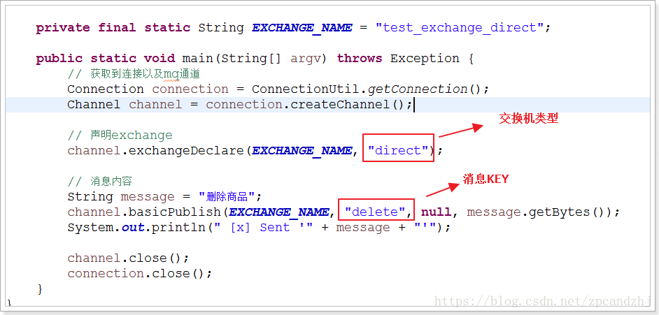

# Rabbit MQ


## 什么是RabbitMQ？

RabbitMQ是一款开源的，Erlang编写的，基于AMQP协议的消息中间件

## rabbitmq 的使用场景

1. 服务间异步通信

2. 顺序消费

3. 定时任务

4. 请求削峰

## AMPQ

1. 虚拟主机，每一个项目或者每一个业务访问一个虚拟主机，之间有权限管理

## RabbitMQ工作流程

新建主机→绑定用户->生产者绑定server连接到对应的主机->将对应的消息发布到消息队列当中->消费者获取消息

> 1. 程序中导入依赖
>
> ```xml
>         <dependency>
>             <groupId>com.rabbitmq</groupId>
>             <artifactId>amqp-client</artifactId>
>             <version>3.4.1</version>
>         </dependency>
> ```
>
> 1. 建立链接的工具
>
> ```java
> package RabbitMQ.utils;
> 
> import com.rabbitmq.client.Connection;
> import com.rabbitmq.client.ConnectionFactory;
> 
> public class ConnectionUtil {
>     public static Connection getConnection() throws Exception {
>         //定义连接工厂
>         ConnectionFactory factory = new ConnectionFactory();
>         //设置服务地址
>         factory.setHost("192.168.254.134");
>         //端口
>         factory.setPort(5672);
>         //设置账号信息，用户名、密码、vhost
>         factory.setVirtualHost("ems");
>         factory.setUsername("ems");
>         factory.setPassword("123");
>         // 通过工程获取连接
>         Connection connection = factory.newConnection();
>         return connection;
>     }
> }
> ```
>
> 1. 通道绑定消息队发送消息
>
> ```java
> package RabbitMQ;
> 
> import RabbitMQ.utils.ConnectionUtil;
> import com.rabbitmq.client.Channel;
> import com.rabbitmq.client.Connection;
> import org.junit.Test;
> 
> public class Povider {
> 
>     @Test
>     public void SendMassage() throws Exception {
>         Connection connection = ConnectionUtil.getConnection();
>         Channel channel = connection.createChannel();
>         //消息通道绑定队列的设置
>         //参数1 队列的名字，没有则自动创建
>         //参数2 定义队列是否持久化，true持久化，flase不持久化
>         //参数3 是不独占队列？true 独占
>         //参数4 是否在消费完成之后自动删除队列，true 自动删除
>         //参数5 附加参数
>         channel.queueDeclare("hello",false,false,false,null);
> 
>         //参数 1 交换机名称
>         //参数 2 队列名称
>         //参数3 传递消息的额外设置
>         //参数4 消息内容，需要时Byte形式
>         channel.basicPublish("","hello",null,"hello MQ".getBytes());
> 
>         channel.close();
>         connection.close();
>     }
> }
> ```
>
> 1. 获取消息
>
> ```java
> package RabbitMQ;
> 
> import RabbitMQ.utils.ConnectionUtil;
> import com.rabbitmq.client.Channel;
> import com.rabbitmq.client.Connection;
> import com.rabbitmq.client.QueueingConsumer;
> import org.junit.Test;
> 
> public class Consumer {
> 
>     @Test
>     public void getMassage() throws Exception {
>         Connection connection = ConnectionUtil.getConnection();
>         Channel channel = connection.createChannel();
> 
>         // 声明队列
>         channel.queueDeclare("hello", false, false, false, null);
> 
>         // 定义队列的消费者
>         QueueingConsumer consumer = new QueueingConsumer(channel);
> 
>         // 监听队列
>         //参数1 队列名
>         //参数2 是否开启自动确认机制
>         //参数3 消费消息时的回调接口，获取一个consumer的对象
>         channel.basicConsume("hello", true, consumer);
> 
>         // 获取消息，一直循环监听获取消息
>         while (true) {
>             QueueingConsumer.Delivery delivery = consumer.nextDelivery();
>             String message = new String(delivery.getBody());
>             System.out.println(" [x] Received '" + message + "'");
>         }
>     }
> }
> ```

## RabbitMQ基本概念

- Broker： 简单来说就是消息队列服务器实体
- Exchange： 消息交换机，它指定消息按什么规则，路由到哪个队列
- Queue： 消息队列载体，每个消息都会被投入到一个或多个队列
- Binding： 绑定，它的作用就是把exchange和queue按照路由规则绑定起来
- Routing Key： 路由关键字，exchange根据这个关键字进行消息投递
- VHost： vhost 可以理解为虚拟 broker ，即 mini-RabbitMQ server。其内部均含有独立的 queue、exchange 和 binding 等，但最最重要的是，其拥有独立的权限系统，可以做到 vhost 范围的用户控制。当然，从 RabbitMQ 的全局角度，vhost 可以作为不同权限隔离的手段（一个典型的例子就是不同的应用可以跑在不同的 vhost 中）。
- Producer： 消息生产者，就是投递消息的程序
- Consumer： 消息消费者，就是接受消息的程序
- Channel： 消息通道，在客户端的每个连接里，可建立多个channel，每个channel代表一个会话任务

由Exchange、Queue、RoutingKey三个才能决定一个从Exchange到Queue的唯一的线路。

## RabbitMQ的工作模式

**一.simple模式（即最简单的收发模式）**


1. 消息产生消息，将消息放入队列

2. 消息的消费者(consumer) 监听 消息队列,如果队列中有消息,就消费掉,消息被拿走后,自动从队列中删除(隐患 消息可能没有被消费者正确处理,已经从队列中消失了,造成消息的丢失，这里可以设置成手动的ack,但如果设置成手动ack，处理完后要及时发送ack消息给队列，否则会造成内存溢出)。

**二.work工作模式(资源的竞争)**


1. 消息产生者将消息放入队列消费者可以有多个,消费者1,消费者2同时监听同一个队列,消息被消费。C1 C2共同争抢当前的消息队列内容,谁先拿到谁负责消费消息(隐患：高并发情况下,默认会产生某一个消息被多个消费者共同使用,可以设置一个开关(syncronize) 保证一条消息只能被一个消费者使用)。

**三.publish/subscribe发布订阅(共享资源)**


1. 每个消费者监听自己的队列；

2. 生产者将消息发给broker，由交换机将消息转发到绑定此交换机的每个队列，每个绑定交换机的队列都将接收到消息。

**四.routing路由模式**


1. 消息生产者将消息发送给交换机按照路由判断,路由是字符串(info) 当前产生的消息携带路由字符(对象的方法),交换机根据路由的key,只能匹配上路由key对应的消息队列,对应的消费者才能消费消息;

2. 根据业务功能定义路由字符串

3. 从系统的代码逻辑中获取对应的功能字符串,将消息任务扔到对应的队列中。

4. 业务场景:error 通知;EXCEPTION;错误通知的功能;传统意义的错误通知;客户通知;利用key路由,可以将程序中的错误封装成消息传入到消息队列中,开发者可以自定义消费者,实时接收错误;

**五.topic 主题模式(路由模式的一种)**


1. 星号井号代表通配符

2. 星号代表多个单词,井号代表一个单词

3. 路由功能添加模糊匹配

4. 消息产生者产生消息,把消息交给交换机

5. 交换机根据key的规则模糊匹配到对应的队列,由队列的监听消费者接收消息消费


## 如何保证RabbitMQ消息的顺序性？

​		拆分多个 queue，每个 queue 一个 consumer，就是多一些 queue 而已，确实是麻烦点；或者就一个 queue 但是对应一个 consumer，然后这个 consumer 内部用内存队列做排队，然后分发给底层不同的 worker 来处理。

## 消息如何分发？

​		若该队列至少有一个消费者订阅，消息将以循环（round-robin）的方式发送给消费者。每条消息只会分发给一个订阅的消费者（前提是消费者能够正常处理消息并进行确认）。通过路由可实现多消费的功能

## 消息怎么路由？

​		消息提供方->路由->一至多个队列消息发布到交换器时，消息将拥有一个路由键（routing key），在消息创建时设定。通过队列路由键，可以把队列绑定到交换器上。消息到达交换器后，RabbitMQ 会将消息的路由键与队列的路由键进行匹配（针对不同的交换器有不同的路由规则）；

常用的交换器主要分为一下三种：

+ fanout：如果交换器收到消息，将会广播到所有绑定的队列上

+ direct：如果路由键完全匹配，消息就被投递到相应的队列

+ topic：可以使来自不同源头的消息能够到达同一个队列。 使用 topic 交换器时，可以使用通配符

## 消息基于什么传输？

​		由于 TCP 连接的创建和销毁开销较大，且并发数受系统资源限制，会造成性能瓶颈。RabbitMQ 使用信道的方式来传输数据。信道是建立在真实的 TCP 连接内的虚拟连接，且每条 TCP 连接上的信道数量没有限制。


## 如何保证消息不被重复消费？或者说，如何保证消息消费时的幂等性？

​		保证消息的唯一性，就算是多次传输，不要让消息的多次消费带来影响；保证消息等幂性；比如：在写入消息队列的数据做唯一标示，消费消息时，根据唯一标识判断是否消费过；


## 如何确保消息正确地发送至 RabbitMQ？ 如何确保消息接收方消费了消息？

**发送方确认模式**

​		将信道设置成 confirm 模式（发送方确认模式），则所有在信道上发布的消息都会被指派一个唯一的 ID。一旦消息被投递到目的队列后，或者消息被写入磁盘后（可持久化的消息），信道会发送一个确认给生产者（包含消息唯一 ID）。如果 RabbitMQ 发生内部错误从而导致消息丢失，会发送一条 nack（notacknowledged，未确认）消息。

​		发送方确认模式是异步的，生产者应用程序在等待确认的同时，可以继续发送消息。当确认消息到达生产者应用程序，生产者应用程序的回调方法就会被触发来处理确认消息。

**接收方确认机制**

​		消费者接收每一条消息后都必须进行确认（消息接收和消息确认是两个不同操作）。只有消费者确认了消息，RabbitMQ 才能安全地把消息从队列中删除。

​		这里并没有用到超时机制，RabbitMQ 仅通过 Consumer 的连接中断来确认是否需要重新发送消息。也就是说，只要连接不中断，RabbitMQ 给了 Consumer 足够长的时间来处理消息。保证数据的最终一致性；

下面罗列几种特殊情况

- 如果消费者接收到消息，在确认之前断开了连接或取消订阅，RabbitMQ 会认为消息没有被分发，然后重新分发给下一个订阅的消费者。（可能存在消息重复消费的隐患，需要去重）
- 如果消费者接收到消息却没有确认消息，连接也未断开，则 RabbitMQ 认为该消费者繁忙，将不会给该消费者分发更多的消息。


## 如何保证RabbitMQ消息的可靠传输？

消息不可靠的情况可能是消息丢失，劫持等原因；丢失又分为：生产者丢失消息、消息列表丢失消息、消费者丢失消息；

1. **生产者丢失消息**：从生产者弄丢数据这个角度来看，RabbitMQ提供transaction和confirm模式来确保生产者不丢消息；

   ​		transaction机制就是说：发送消息前，开启事务（channel.txSelect()）,然后发送消息，如果发送过程中出现什么异常，事务就会回滚（channel.txRollback()）,如果发送成功则提交事务（channel.txCommit()）。然而，这种方式有个缺点：吞吐量下降；

   ​		confirm模式用的居多：一旦channel进入confirm模式，所有在该信道上发布的消息都将会被指派一个唯一的ID（从1开始），一旦消息被投递到所有匹配的队列之后；

   ​		rabbitMQ就会发送一个ACK给生产者（包含消息的唯一ID），这就使得生产者知道消息已经正确到达目的队列了；如果rabbitMQ没能处理该消息，则会发送一个Nack消息给你，你可以进行重试操作。

2. **消息队列丢数据**：消息持久化。

   ​		处理消息队列丢数据的情况，一般是开启持久化磁盘的配置。

   ​		这个持久化配置可以和confirm机制配合使用，你可以在消息持久化磁盘后，再给生产者发送一个Ack信号。这样，如果消息持久化磁盘之前，rabbitMQ阵亡了，那么生产者收不到Ack信号，生产者会自动重发。

   ​		那么如何持久化呢？这里顺便说一下吧，其实也很容易，就下面两步

   1. 将queue的持久化标识durable设置为true,则代表是一个持久的队列

   2. 发送消息的时候将deliveryMode=2

      这样设置以后，即使rabbitMQ挂了，重启后也能恢复数据

3. **消费者丢失消息**：消费者丢数据一般是因为采用了自动确认消息模式，改为手动确认消息即可！

   ​		消费者在收到消息之后，处理消息之前，会自动回复RabbitMQ已收到消息；

   ​		如果这时处理消息失败，就会丢失该消息；

   ​		解决方案：处理消息成功后，手动回复确认消息。


## 为什么不应该对所有的 message 都使用持久化机制？

​		首先，必然导致性能的下降，因为写磁盘比写 RAM 慢的多，message 的吞吐量可能有 10 倍的差距。

​		其次，message 的持久化机制用在 RabbitMQ 的内置 cluster 方案时会出现“坑爹”问题。矛盾点在于，若 message 设置了 persistent 属性，但 queue 未设置 durable 属性，那么当该 queue 的 owner node 出现异常后，在未重建该 queue 前，发往该 queue 的 message 将被 blackholed ；若 message 设置了 persistent 属性，同时 queue 也设置了 durable 属性，那么当 queue 的 owner node 异常且无法重启的情况下，则该 queue 无法在其他 node 上重建，只能等待其 owner node 重启后，才能恢复该 queue 的使用，而在这段时间内发送给该 queue 的 message 将被 blackholed 。

​		所以，是否要对 message 进行持久化，需要综合考虑性能需要，以及可能遇到的问题。若想达到 100,000 条/秒以上的消息吞吐量（单 RabbitMQ 服务器），则要么使用其他的方式来确保 message 的可靠 delivery ，要么使用非常快速的存储系统以支持全持久化（例如使用 SSD）。另外一种处理原则是：仅对关键消息作持久化处理（根据业务重要程度），且应该保证关键消息的量不会导致性能瓶颈。


## 如何保证高可用的？RabbitMQ 的集群

RabbitMQ 是比较有代表性的，因为是基于主从（非分布式）做高可用性的，我们就以 RabbitMQ 为例子讲解第一种 MQ 的高可用性怎么实现。RabbitMQ 有三种模式：单机模式、普通集群模式、镜像集群模式。

**单机模式**，就是 Demo 级别的，一般就是你本地启动了玩玩儿的?，没人生产用单机模式

**普通集群模式**，意思就是在多台机器上启动多个 RabbitMQ 实例，每个机器启动一个。你创建的 queue，只会放在一个 RabbitMQ 实例上，但是每个实例都同步 queue 的元数据（元数据可以认为是 queue 的一些配置信息，通过元数据，可以找到 queue 所在实例）。你消费的时候，实际上如果连接到了另外一个实例，那么那个实例会从 queue 所在实例上拉取数据过来。这方案主要是提高吞吐量的，就是说让集群中多个节点来服务某个 queue 的读写操作。

**镜像集群模式**：这种模式，才是所谓的 RabbitMQ 的高可用模式。跟普通集群模式不一样的是，在镜像集群模式下，你创建的 queue，无论元数据还是 queue 里的消息都会存在于多个实例上，就是说，每个 RabbitMQ 节点都有这个 queue 的一个完整镜像，包含 queue 的全部数据的意思。然后每次你写消息到 queue 的时候，都会自动把消息同步到多个实例的 queue 上。RabbitMQ 有很好的管理控制台，就是在后台新增一个策略，这个策略是镜像集群模式的策略，指定的时候是可以要求数据同步到所有节点的，也可以要求同步到指定数量的节点，再次创建 queue 的时候，应用这个策略，就会自动将数据同步到其他的节点上去了。这样的话，好处在于，你任何一个机器宕机了，没事儿，其它机器（节点）还包含了这个 queue 的完整数据，别的 consumer 都可以到其它节点上去消费数据。坏处在于，第一，这个性能开销也太大了吧，消息需要同步到所有机器上，导致网络带宽压力和消耗很重！RabbitMQ 一个 queue 的数据都是放在一个节点里的，镜像集群下，也是每个节点都放这个 queue 的完整数据。


## 如何解决消息队列的延时以及过期失效问题？消息队列满了以后该怎么处理？有几百万消息持续积压几小时，说说怎么解决？

消息积压处理办法：临时紧急扩容：

​		先修复 consumer 的问题，确保其恢复消费速度，然后将现有 cnosumer 都停掉。 新建一个 topic，partition 是原来的 10 倍，临时建立好原先 10 倍的 queue 数量。 然后写一个临时的分发数据的 consumer 程序，这个程序部署上去消费积压的数据，消费之后不做耗时的处理，直接均匀轮询写入临时建立好的 10 倍数量的 queue。 接着临时征用 10 倍的机器来部署 consumer，每一批 consumer 消费一个临时 queue 的数据。这种做法相当于是临时将 queue 资源和 consumer 资源扩大 10 倍，以正常的 10 倍速度来消费数据。 等快速消费完积压数据之后，得恢复原先部署的架构，重新用原先的 consumer 机器来消费消息。 MQ中消息失效：假设你用的是 RabbitMQ，RabbtiMQ 是可以设置过期时间的，也就是 TTL。如果消息在 queue 中积压超过一定的时间就会被 RabbitMQ 给清理掉，这个数据就没了。那这就是第二个坑了。这就不是说数据会大量积压在 mq 里，而是大量的数据会直接搞丢。我们可以采取一个方案，就是批量重导，这个我们之前线上也有类似的场景干过。就是大量积压的时候，我们当时就直接丢弃数据了，然后等过了高峰期以后，比如大家一起喝咖啡熬夜到晚上12点以后，用户都睡觉了。这个时候我们就开始写程序，将丢失的那批数据，写个临时程序，一点一点的查出来，然后重新灌入 mq 里面去，把白天丢的数据给他补回来。也只能是这样了。假设 1 万个订单积压在 mq 里面，没有处理，其中 1000 个订单都丢了，你只能手动写程序把那 1000 个订单给查出来，手动发到 mq 里去再补一次。

​		mq消息队列块满了：如果消息积压在 mq 里，你很长时间都没有处理掉，此时导致 mq 都快写满了，咋办？这个还有别的办法吗？没有，谁让你第一个方案执行的太慢了，你临时写程序，接入数据来消费，消费一个丢弃一个，都不要了，快速消费掉所有的消息。然后走第二个方案，到了晚上再补数据吧。


## 设计MQ思路

比如说这个消息队列系统，我们从以下几个角度来考虑一下：

首先这个 mq 得支持可伸缩性吧，就是需要的时候快速扩容，就可以增加吞吐量和容量，那怎么搞？设计个分布式的系统呗，参照一下 kafka 的设计理念，broker -> topic -> partition，每个 partition 放一个机器，就存一部分数据。如果现在资源不够了，简单啊，给 topic 增加 partition，然后做数据迁移，增加机器，不就可以存放更多数据，提供更高的吞吐量了？

其次你得考虑一下这个 mq 的数据要不要落地磁盘吧？那肯定要了，落磁盘才能保证别进程挂了数据就丢了。那落磁盘的时候怎么落啊？顺序写，这样就没有磁盘随机读写的寻址开销，磁盘顺序读写的性能是很高的，这就是 kafka 的思路。

其次你考虑一下你的 mq 的可用性啊？这个事儿，具体参考之前可用性那个环节讲解的 kafka 的高可用保障机制。多副本 -> leader & follower -> broker 挂了重新选举 leader 即可对外服务。

能不能支持数据 0 丢失啊？可以的，参考我们之前说的那个 kafka 数据零丢失方案。

# 使用

### 添加用户

#### 4.1.添加admin用户


#### 4.2.用户角色

1、超级管理员(administrator)

可登陆管理控制台，可查看所有的信息，并且可以对用户，策略(policy)进行操作。

2、监控者(monitoring)
可登陆管理控制台，同时可以查看rabbitmq节点的相关信息(进程数，内存使用情况，磁盘使用情况等)

3、策略制定者(policymaker)
可登陆管理控制台, 同时可以对policy进行管理。但无法查看节点的相关信息(上图红框标识的部分)。

4、普通管理者(management)
仅可登陆管理控制台，无法看到节点信息，也无法对策略进行管理。

5、其他
无法登陆管理控制台，通常就是普通的生产者和消费者。

#### 4.3.创建Virtual Hosts


选中Admin用户，设置权限：

看到权限已加：


#### 4.4.管理界面中的功能


### 学习五种队列


#### 导入my-rabbitmq项目

项目下载地址：
https://download.csdn.net/download/zpcandzhj/10585077


#### 简单队列

5.2.1.图示


P：消息的生产者
C：消息的消费者
红色：队列

生产者将消息发送到队列，消费者从队列中获取消息。
5.2.2.导入RabbitMQ的客户端依赖

```
<dependency>
   <groupId>com.rabbitmq</groupId>
   <artifactId>amqp-client</artifactId>
   <version>3.4.1</version>
</dependency>
```

添加配置

~~~
##RabbitMQ
#连接地址
spring.rabbitmq.host=192.168.254.134
####端口号
spring.rabbitmq.port=15672
####账号
spring.rabbitmq.username=root
####密码
spring.rabbitmq.password=123456
### 地址
spring.rabbitmq.virtual-host= /admin_host
####开启消费者重试
spring.rabbitmq.listener.simple.retry.enabled=true
####最大重试次数
spring.rabbitmq.listener.simple.retry.max-attempts=5
####重试间隔次数
spring.rabbitmq.listener.simple.retry.initial-interval: 3000
~~~


5.2.3.获取MQ的连接

```bash
package com.zpc.rabbitmq.util;
import com.rabbitmq.client.ConnectionFactory;
import com.rabbitmq.client.Connection;

public class ConnectionUtil {

    public static Connection getConnection() throws Exception {
        //定义连接工厂
        ConnectionFactory factory = new ConnectionFactory();
        //设置服务地址
        factory.setHost("localhost");
        //端口
        factory.setPort(5672);
        //设置账号信息，用户名、密码、vhost
        factory.setVirtualHost("testhost");
        factory.setUsername("admin");
        factory.setPassword("admin");
        // 通过工程获取连接
        Connection connection = factory.newConnection();
        return connection;
    }
}
```

5.2.4.生产者发送消息到队列

```bash
package com.zpc.rabbitmq.simple;

import com.zpc.rabbitmq.util.ConnectionUtil;

import com.rabbitmq.client.Channel;
import com.rabbitmq.client.Connection;

public class Send {

    private final static String QUEUE_NAME = "q_test_01";

    public static void main(String[] argv) throws Exception {
        // 获取到连接以及mq通道
        Connection connection = ConnectionUtil.getConnection();
        // 从连接中创建通道
        Channel channel = connection.createChannel();
        // 声明（创建）队列
        channel.queueDeclare(QUEUE_NAME, false, false, false, null);
        // 消息内容
        String message = "Hello World!";
        channel.basicPublish("", QUEUE_NAME, null, message.getBytes());
        System.out.println(" [x] Sent '" + message + "'");
        //关闭通道和连接
        channel.close();
        connection.close();
    }
}

```

5.2.5.管理工具中查看消息


点击上面的队列名称，查询具体的队列中的信息：

5.2.6.消费者从队列中获取消息

```bash
package com.zpc.rabbitmq.simple;

import com.zpc.rabbitmq.util.ConnectionUtil;

import com.rabbitmq.client.Channel;
import com.rabbitmq.client.Connection;
import com.rabbitmq.client.QueueingConsumer;

public class Recv {

    private final static String QUEUE_NAME = "q_test_01";

    public static void main(String[] argv) throws Exception {

        // 获取到连接以及mq通道
        Connection connection = ConnectionUtil.getConnection();
        // 从连接中创建通道
        Channel channel = connection.createChannel();
        // 声明队列
        channel.queueDeclare(QUEUE_NAME, false, false, false, null);

        // 定义队列的消费者
        QueueingConsumer consumer = new QueueingConsumer(channel);

        // 监听队列
        channel.basicConsume(QUEUE_NAME, true, consumer);

        // 获取消息
        while (true) {
            QueueingConsumer.Delivery delivery = consumer.nextDelivery();
            String message = new String(delivery.getBody());
            System.out.println(" [x] Received '" + message + "'");
        }
    }
}
```

#### Work模式


5.3.1.图示


一个生产者、2个消费者。

一个消息只能被一个消费者获取。

消费者1

```bash
package com.zpc.rabbitmq.work;

import com.rabbitmq.client.Channel;
import com.rabbitmq.client.Connection;
import com.rabbitmq.client.QueueingConsumer;
import com.zpc.rabbitmq.util.ConnectionUtil;

public class Recv {

    private final static String QUEUE_NAME = "test_queue_work";

    public static void main(String[] argv) throws Exception {

        // 获取到连接以及mq通道
        Connection connection = ConnectionUtil.getConnection();
        Channel channel = connection.createChannel();

        // 声明队列
        channel.queueDeclare(QUEUE_NAME, false, false, false, null);

        // 同一时刻服务器只会发一条消息给消费者
        //channel.basicQos(1);

        // 定义队列的消费者
        QueueingConsumer consumer = new QueueingConsumer(channel);
        // 监听队列，false表示手动返回完成状态，true表示自动
        channel.basicConsume(QUEUE_NAME, true, consumer);

        // 获取消息
        while (true) {
            QueueingConsumer.Delivery delivery = consumer.nextDelivery();
            String message = new String(delivery.getBody());
            System.out.println(" [y] Received '" + message + "'");
            //休眠
            Thread.sleep(10);
            // 返回确认状态，注释掉表示使用自动确认模式
            //channel.basicAck(delivery.getEnvelope().getDeliveryTag(), false);
        }
    }
}
```

消费者2

```bash
package com.zpc.rabbitmq.work;

import com.rabbitmq.client.Channel;
import com.rabbitmq.client.Connection;
import com.rabbitmq.client.QueueingConsumer;
import com.zpc.rabbitmq.util.ConnectionUtil;

public class Recv2 {

    private final static String QUEUE_NAME = "test_queue_work";

    public static void main(String[] argv) throws Exception {

        // 获取到连接以及mq通道
        Connection connection = ConnectionUtil.getConnection();
        Channel channel = connection.createChannel();

        // 声明队列
        channel.queueDeclare(QUEUE_NAME, false, false, false, null);

        // 同一时刻服务器只会发一条消息给消费者
        //channel.basicQos(1);

        // 定义队列的消费者
        QueueingConsumer consumer = new QueueingConsumer(channel);
        // 监听队列，false表示手动返回完成状态，true表示自动
        channel.basicConsume(QUEUE_NAME, true, consumer);

        // 获取消息
        while (true) {
            QueueingConsumer.Delivery delivery = consumer.nextDelivery();
            String message = new String(delivery.getBody());
            System.out.println(" [x] Received '" + message + "'");
            // 休眠1秒
            Thread.sleep(1000);
            //下面这行注释掉表示使用自动确认模式
            //channel.basicAck(delivery.getEnvelope().getDeliveryTag(), false);
        }
    }
}

```

5.3.4.生产者
向队列中发送100条消息。

```bash
package com.zpc.rabbitmq.work;

import com.zpc.rabbitmq.util.ConnectionUtil;

import com.rabbitmq.client.Channel;
import com.rabbitmq.client.Connection;

public class Send {

    private final static String QUEUE_NAME = "test_queue_work";

    public static void main(String[] argv) throws Exception {
        // 获取到连接以及mq通道
        Connection connection = ConnectionUtil.getConnection();
        Channel channel = connection.createChannel();

        // 声明队列
        channel.queueDeclare(QUEUE_NAME, false, false, false, null);

        for (int i = 0; i < 100; i++) {
            // 消息内容
            String message = "" + i;
            channel.basicPublish("", QUEUE_NAME, null, message.getBytes());
            System.out.println(" [x] Sent '" + message + "'");

            Thread.sleep(i * 10);
        }

        channel.close();
        connection.close();
    }
}
```

5.3.5.测试
测试结果：
1、消费者1和消费者2获取到的消息内容是不同的，同一个消息只能被一个消费者获取。
2、消费者1和消费者2获取到的消息的数量是相同的，一个是消费奇数号消息，一个是偶数。

- 其实，这样是不合理的，因为消费者1线程停顿的时间短。应该是消费者1要比消费者2获取到的消息多才对。
  RabbitMQ 默认将消息顺序发送给下一个消费者，这样，每个消费者会得到相同数量的消息。即轮询（round-robin）分发消息。
- 怎样才能做到按照每个消费者的能力分配消息呢？联合使用 Qos 和 Acknowledge 就可以做到。
  basicQos 方法设置了当前信道最大预获取（prefetch）消息数量为1。消息从队列异步推送给消费者，消费者的 ack 也是异步发送给队列，从队列的视角去看，总是会有一批消息已推送但尚未获得 ack 确认，Qos 的 prefetchCount 参数就是用来限制这批未确认消息数量的。设为1时，队列只有在收到消费者发回的上一条消息 ack 确认后，才会向该消费者发送下一条消息。prefetchCount 的默认值为0，即没有限制，队列会将所有消息尽快发给消费者。
- 2个概念
- 轮询分发 ：使用任务队列的优点之一就是可以轻易的并行工作。如果我们积压了好多工作，我们可以通过增加工作者（消费者）来解决这一问题，使得系统的伸缩性更加容易。在默认情况下，RabbitMQ将逐个发送消息到在序列中的下一个消费者(而不考虑每个任务的时长等等，且是提前一次性分配，并非一个一个分配)。平均每个消费者获得相同数量的消息。这种方式分发消息机制称为Round-Robin（轮询）。
- 公平分发 ：虽然上面的分配法方式也还行，但是有个问题就是：比如：现在有2个消费者，所有的奇数的消息都是繁忙的，而偶数则是轻松的。按照轮询的方式，奇数的任务交给了第一个消费者，所以一直在忙个不停。偶数的任务交给另一个消费者，则立即完成任务，然后闲得不行。而RabbitMQ则是不了解这些的。这是因为当消息进入队列，RabbitMQ就会分派消息。它不看消费者为应答的数目，只是盲目的将消息发给轮询指定的消费者。

为了解决这个问题，我们使用basicQos( prefetchCount = 1)方法，来限制RabbitMQ只发不超过1条的消息给同一个消费者。当消息处理完毕后，有了反馈，才会进行第二次发送。
还有一点需要注意，使用公平分发，必须关闭自动应答，改为手动应答。

#### Work模式的“能者多劳”

打开上述代码的注释：

```bash
// 同一时刻服务器只会发一条消息给消费者
channel.basicQos(1);

123
//开启这行 表示使用手动确认模式
channel.basicAck(delivery.getEnvelope().getDeliveryTag(), false);

123
```

同时改为手动确认：

```bash
// 监听队列，false表示手动返回完成状态，true表示自动
channel.basicConsume(QUEUE_NAME, false, consumer);
```

测试：
消费者1比消费者2获取的消息更多。

#### 消息的确认模式

消费者从队列中获取消息，服务端如何知道消息已经被消费呢？

模式1：自动确认
只要消息从队列中获取，无论消费者获取到消息后是否成功消息，都认为是消息已经成功消费。
模式2：手动确认
消费者从队列中获取消息后，服务器会将该消息标记为不可用状态，等待消费者的反馈，如果消费者一直没有反馈，那么该消息将一直处于不可用状态。

手动模式：


自动模式：


#### 订阅模式


图示


解读：
1、1个生产者，多个消费者
2、每一个消费者都有自己的一个队列
3、生产者没有将消息直接发送到队列，而是发送到了交换机
4、每个队列都要绑定到交换机
5、生产者发送的消息，经过交换机，到达队列，实现，一个消息被多个消费者获取的目的
注意：一个消费者队列可以有多个消费者实例，只有其中一个消费者实例会消费


消息的生产者（看作是后台系统）
向交换机中发送消息。

```bash
package com.zpc.rabbitmq.subscribe;

import com.zpc.rabbitmq.util.ConnectionUtil;

import com.rabbitmq.client.Channel;
import com.rabbitmq.client.Connection;

public class Send {

    private final static String EXCHANGE_NAME = "test_exchange_fanout";

    public static void main(String[] argv) throws Exception {
        // 获取到连接以及mq通道
        Connection connection = ConnectionUtil.getConnection();
        Channel channel = connection.createChannel();

        // 声明exchange
        //参数1 交换机的名称 参数2 （写死的），代表广播类型
        // 如果没后，就会自动创建
        channel.exchangeDeclare(EXCHANGE_NAME, "fanout");

        // 消息内容
        String message = "Hello World!";
        
        //参数1：交换机名称
        //参数2：路由的配置
        //参数3：交换机的配置
        //参数4：交换机的发布内容
        channel.basicPublish(EXCHANGE_NAME, "", null, message.getBytes());
        System.out.println(" [x] Sent '" + message + "'");

        channel.close();
        connection.close();
    }
}
```

注意：消息发送到没有队列绑定的交换机时，消息将丢失，因为，交换机没有存储消息的能力，消息只能存在在队列中。

5.6.3.消费者1（看作是前台系统）

```bash
package com.zpc.rabbitmq.subscribe;

import com.rabbitmq.client.Channel;
import com.rabbitmq.client.Connection;
import com.rabbitmq.client.QueueingConsumer;

import com.zpc.rabbitmq.util.ConnectionUtil;

public class Recv {

    private final static String QUEUE_NAME = "test_queue_work1";

    private final static String EXCHANGE_NAME = "test_exchange_fanout";

    public static void main(String[] argv) throws Exception {

        // 获取到连接以及mq通道
        Connection connection = ConnectionUtil.getConnection();
        Channel channel = connection.createChannel();

        // 声明队列
        channel.queueDeclare(QUEUE_NAME, false, false, false, null);

        // 队列绑定到交换机
        
        channel.queueBind(QUEUE_NAME, EXCHANGE_NAME, "");

        // 同一时刻服务器只会发一条消息给消费者
        channel.basicQos(1);

        // 定义队列的消费者
        QueueingConsumer consumer = new QueueingConsumer(channel);
        // 监听队列，手动返回完成
        channel.basicConsume(QUEUE_NAME, false, consumer);

        // 获取消息
        while (true) {
            QueueingConsumer.Delivery delivery = consumer.nextDelivery();
            String message = new String(delivery.getBody());
            System.out.println(" [Recv] Received '" + message + "'");
            Thread.sleep(10);

            channel.basicAck(delivery.getEnvelope().getDeliveryTag(), false);
        }
    }
}
```

消费者2（看作是搜索系统）

```bash
package com.zpc.rabbitmq.subscribe;

import com.rabbitmq.client.Channel;
import com.rabbitmq.client.Connection;
import com.rabbitmq.client.QueueingConsumer;

import com.zpc.rabbitmq.util.ConnectionUtil;

public class Recv2 {

    private final static String QUEUE_NAME = "test_queue_work2";

    private final static String EXCHANGE_NAME = "test_exchange_fanout";

    public static void main(String[] argv) throws Exception {

        // 获取到连接以及mq通道
        Connection connection = ConnectionUtil.getConnection();
        Channel channel = connection.createChannel();

        // 声明队列
        channel.queueDeclare(QUEUE_NAME, false, false, false, null);

        // 绑定队列到交换机
        channel.queueBind(QUEUE_NAME, EXCHANGE_NAME, "");

        // 同一时刻服务器只会发一条消息给消费者
        channel.basicQos(1);

        // 定义队列的消费者
        QueueingConsumer consumer = new QueueingConsumer(channel);
        // 监听队列，手动返回完成
        channel.basicConsume(QUEUE_NAME, false, consumer);

        // 获取消息
        while (true) {
            QueueingConsumer.Delivery delivery = consumer.nextDelivery();
            String message = new String(delivery.getBody());
            System.out.println(" [Recv2] Received '" + message + "'");
            Thread.sleep(10);

            channel.basicAck(delivery.getEnvelope().getDeliveryTag(), false);
        }
    }
}
```

5.6.5.测试
测试结果：
同一个消息被多个消费者获取。一个消费者队列可以有多个消费者实例，只有其中一个消费者实例会消费到消息。

在管理工具中查看队列和交换机的绑定关系：


#### 路由模式


5.7.1.图示


5.7.2.生产者

5.7.3.消费者1(假设是前台系统)

5.7.4.消费2（假设是搜索系统）


#### 题模式（通配符模式）


5.8.1.图示

同一个消息被多个消费者获取。一个消费者队列可以有多个消费者实例，只有其中一个消费者实例会消费到消息。

5.8.2.生产者

```bash
package com.zpc.rabbitmq.topic;

import com.rabbitmq.client.Channel;
import com.rabbitmq.client.Connection;

import com.zpc.rabbitmq.util.ConnectionUtil;

public class Send {

    private final static String EXCHANGE_NAME = "test_exchange_topic";

    public static void main(String[] argv) throws Exception {
        // 获取到连接以及mq通道
        Connection connection = ConnectionUtil.getConnection();
        Channel channel = connection.createChannel();

        // 声明exchange
        channel.exchangeDeclare(EXCHANGE_NAME, "topic");

        // 消息内容
        String message = "Hello World!!";
        channel.basicPublish(EXCHANGE_NAME, "routekey.1", null, message.getBytes());
        System.out.println(" [x] Sent '" + message + "'");

        channel.close();
        connection.close();
    }
}
```

消费者1（前台系统）

```bash
package com.zpc.rabbitmq.topic;

import com.rabbitmq.client.Channel;
import com.rabbitmq.client.Connection;
import com.rabbitmq.client.QueueingConsumer;

import com.zpc.rabbitmq.util.ConnectionUtil;

public class Recv {

    private final static String QUEUE_NAME = "test_queue_topic_work_1";

    private final static String EXCHANGE_NAME = "test_exchange_topic";

    public static void main(String[] argv) throws Exception {

        // 获取到连接以及mq通道
        Connection connection = ConnectionUtil.getConnection();
        Channel channel = connection.createChannel();

        // 声明队列
        channel.queueDeclare(QUEUE_NAME, false, false, false, null);

        // 绑定队列到交换机
        channel.queueBind(QUEUE_NAME, EXCHANGE_NAME, "routekey.*");

        // 同一时刻服务器只会发一条消息给消费者
        channel.basicQos(1);

        // 定义队列的消费者
        QueueingConsumer consumer = new QueueingConsumer(channel);
        // 监听队列，手动返回完成
        channel.basicConsume(QUEUE_NAME, false, consumer);

        // 获取消息
        while (true) {
            QueueingConsumer.Delivery delivery = consumer.nextDelivery();
            String message = new String(delivery.getBody());
            System.out.println(" [Recv_x] Received '" + message + "'");
            Thread.sleep(10);

            channel.basicAck(delivery.getEnvelope().getDeliveryTag(), false);
        }
    }
}
```

消费者2（搜索系统）

```bash
package com.zpc.rabbitmq.topic;

import com.zpc.rabbitmq.util.ConnectionUtil;

import com.rabbitmq.client.Channel;
import com.rabbitmq.client.Connection;
import com.rabbitmq.client.QueueingConsumer;

public class Recv2 {

    private final static String QUEUE_NAME = "test_queue_topic_work_2";

    private final static String EXCHANGE_NAME = "test_exchange_topic";

    public static void main(String[] argv) throws Exception {

        // 获取到连接以及mq通道
        Connection connection = ConnectionUtil.getConnection();
        Channel channel = connection.createChannel();

        // 声明队列
        channel.queueDeclare(QUEUE_NAME, false, false, false, null);

        // 绑定队列到交换机
        channel.queueBind(QUEUE_NAME, EXCHANGE_NAME, "*.*");

        // 同一时刻服务器只会发一条消息给消费者
        channel.basicQos(1);

        // 定义队列的消费者
        QueueingConsumer consumer = new QueueingConsumer(channel);
        // 监听队列，手动返回完成
        channel.basicConsume(QUEUE_NAME, false, consumer);

        // 获取消息
        while (true) {
            QueueingConsumer.Delivery delivery = consumer.nextDelivery();
            String message = new String(delivery.getBody());
            System.out.println(" [Recv2_x] Received '" + message + "'");
            Thread.sleep(10);

            channel.basicAck(delivery.getEnvelope().getDeliveryTag(), false);
        }
    }
}
```

### Spring-Rabbit

#### Spring项目

#### 简介


#### 使用

消费者

```bash
package com.zpc.rabbitmq.spring;

/**
 * 消费者
 *
 * @author Evan
 */
public class Foo {

    //具体执行业务的方法
    public void listen(String foo) {
        System.out.println("\n消费者： " + foo + "\n");
    }
}
```

生产者

```bash
package com.zpc.rabbitmq.spring;

import org.springframework.amqp.rabbit.core.RabbitTemplate;
import org.springframework.context.support.AbstractApplicationContext;
import org.springframework.context.support.ClassPathXmlApplicationContext;

public class SpringMain {
    public static void main(final String... args) throws Exception {
        AbstractApplicationContext ctx = new ClassPathXmlApplicationContext(
                "classpath:spring/rabbitmq-context.xml");
        //RabbitMQ模板
        RabbitTemplate template = ctx.getBean(RabbitTemplate.class);
        //发送消息
        template.convertAndSend("Hello, 鸟鹏!");
        Thread.sleep(1000);// 休眠1秒
        ctx.destroy(); //容器销毁
    }
}
```

配置文件
定义连接工厂

```bash
<!-- 定义RabbitMQ的连接工厂 -->
<rabbit:connection-factory id="connectionFactory"
   host="127.0.0.1" port="5672" username="admin" password="admin"
   virtual-host="testhost" />
```

定义模板（可以指定交换机或队列）

```bash
<rabbit:template id="amqpTemplate" connection-factory="connectionFactory" exchange="fanoutExchange" />

```

定义队列、交换机、以及完成队列和交换机的绑定

```bash
<!-- 定义队列，自动声明 -->
<rabbit:queue name="zpcQueue" auto-declare="true"/>

<!-- 定义交换器，把Q绑定到交换机，自动声明 -->
<rabbit:fanout-exchange name="fanoutExchange" auto-declare="true">
   <rabbit:bindings>
      <rabbit:binding queue="zpcQueue"/>
   </rabbit:bindings>
</rabbit:fanout-exchange>
```

定义监听

```bash
<rabbit:listener-container connection-factory="connectionFactory">
   <rabbit:listener ref="foo" method="listen" queue-names="zpcQueue" />
</rabbit:listener-container>

<bean id="foo" class="com.zpc.rabbitmq.spring.Foo" />
```

定义管理，用于管理队列、交换机等：

```bash
<!-- MQ的管理，包括队列、交换器等 -->
<rabbit:admin connection-factory="connectionFactory" />
```

完整配置文件rabbitmq-context.xml

```bash
<beans xmlns="http://www.springframework.org/schema/beans"
   xmlns:xsi="http://www.w3.org/2001/XMLSchema-instance" xmlns:rabbit="http://www.springframework.org/schema/rabbit"
   xsi:schemaLocation="http://www.springframework.org/schema/rabbit
   http://www.springframework.org/schema/rabbit/spring-rabbit-1.4.xsd
   http://www.springframework.org/schema/beans
   http://www.springframework.org/schema/beans/spring-beans-4.1.xsd">

   <!-- 定义RabbitMQ的连接工厂 -->
   <rabbit:connection-factory id="connectionFactory"
      host="127.0.0.1" port="5672" username="admin" password="admin"
      virtual-host="testhost" />

   <!-- 定义Rabbit模板，指定连接工厂以及定义exchange -->
   <rabbit:template id="amqpTemplate" connection-factory="connectionFactory" exchange="fanoutExchange" />
   <!-- <rabbit:template id="amqpTemplate" connection-factory="connectionFactory"
      exchange="fanoutExchange" routing-key="foo.bar" /> -->

   <!-- MQ的管理，包括队列、交换器等 -->
   <rabbit:admin connection-factory="connectionFactory" />

   <!-- 定义队列，自动声明 -->
   <rabbit:queue name="zpcQueue" auto-declare="true"/>
   
   <!-- 定义交换器，把Q绑定到交换机，自动声明 -->
   <rabbit:fanout-exchange name="fanoutExchange" auto-declare="true">
      <rabbit:bindings>
         <rabbit:binding queue="zpcQueue"/>
      </rabbit:bindings>
   </rabbit:fanout-exchange>
   
<!--   <rabbit:topic-exchange name="myExchange">
      <rabbit:bindings>
         <rabbit:binding queue="myQueue" pattern="foo.*" />
      </rabbit:bindings>
   </rabbit:topic-exchange> -->

   <!-- 队列监听 -->
   <rabbit:listener-container connection-factory="connectionFactory">
      <rabbit:listener ref="foo" method="listen" queue-names="zpcQueue" />
   </rabbit:listener-container>

   <bean id="foo" class="com.zpc.rabbitmq.spring.Foo" />

</beans>
```

#### 持久化交换机和队列


持久化：将交换机或队列的数据保存到磁盘，服务器宕机或重启之后依然存在。
非持久化：将交换机或队列的数据保存到内存，服务器宕机或重启之后将不存在。

非持久化的性能高于持久化。

如何选择持久化？非持久化？ – 看需求。

### Spring集成RabbitMQ一个完整案例

创建三个系统A,B,C
A作为生产者，B、C作为消费者(B,C作为web项目启动)
项目下载地址：https://download.csdn.net/download/zpcandzhj/10585077

#### 在A系统中发送消息到交换机

导入依赖

```bash
<?xml version="1.0" encoding="UTF-8"?>
<project xmlns="http://maven.apache.org/POM/4.0.0" xmlns:xsi="http://www.w3.org/2001/XMLSchema-instance"
   xsi:schemaLocation="http://maven.apache.org/POM/4.0.0 http://maven.apache.org/xsd/maven-4.0.0.xsd">
   <modelVersion>4.0.0</modelVersion>

   <groupId>com.zpc</groupId>
   <artifactId>myrabbitA</artifactId>
   <version>0.0.1-SNAPSHOT</version>
   <packaging>jar</packaging>
   <name>myrabbit</name>

   <dependencies>
      <dependency>
         <groupId>org.springframework.amqp</groupId>
         <artifactId>spring-rabbit</artifactId>
         <version>1.4.0.RELEASE</version>
      </dependency>

      <dependency>
         <groupId>com.alibaba</groupId>
         <artifactId>fastjson</artifactId>
         <version>1.2.47</version>
      </dependency>
   </dependencies>
</project>

1234567891011121314151617181920212223242526
```

7.1.2.队列和交换机的绑定关系

实现：

1. 在配置文件中将队列和交换机完成绑定
2. 可以在管理界面中完成绑定
   1. 绑定关系如果发生变化，需要修改配置文件，并且服务需要重启
   2. b)管理更加灵活
   3. c)更容易对绑定关系的权限管理，流程管理

本例选择第2种方式

配置

rabbitmq-context.xml

```bash
<beans xmlns="http://www.springframework.org/schema/beans"
   xmlns:xsi="http://www.w3.org/2001/XMLSchema-instance" xmlns:rabbit="http://www.springframework.org/schema/rabbit"
   xsi:schemaLocation="http://www.springframework.org/schema/rabbit
   http://www.springframework.org/schema/rabbit/spring-rabbit-1.4.xsd
   http://www.springframework.org/schema/beans
   http://www.springframework.org/schema/beans/spring-beans-4.1.xsd">

   <!-- 定义RabbitMQ的连接工厂 -->
   <rabbit:connection-factory id="connectionFactory"
      host="127.0.0.1" port="5672" username="admin" password="admin"
      virtual-host="testhost" />

   <!-- MQ的管理，包括队列、交换器等 -->
   <rabbit:admin connection-factory="connectionFactory" />

   <!-- 定义交换器，暂时不把Q绑定到交换机，在管理界面去绑定 -->
   <!--<rabbit:topic-exchange name="topicExchange" auto-declare="true" ></rabbit:topic-exchange>-->
   <rabbit:direct-exchange name="directExchange" auto-declare="true" ></rabbit:direct-exchange>
   <!--<rabbit:fanout-exchange name="fanoutExchange" auto-declare="true" ></rabbit:fanout-exchange>-->

   <!-- 定义Rabbit模板，指定连接工厂以及定义exchange(exchange要和上面的一致) -->
   <!--<rabbit:template id="amqpTemplate" connection-factory="connectionFactory" exchange="topicExchange" />-->
   <rabbit:template id="amqpTemplate" connection-factory="connectionFactory" exchange="directExchange" />
   <!--<rabbit:template id="amqpTemplate" connection-factory="connectionFactory" exchange="fanoutExchange" />-->
</beans>

1234567891011121314151617181920212223242526
```

7.1.4.消息内容
方案：
1、消息内容使用对象做json序列化发送
a)数据大
b)有些数据其他人是可能用不到的
2、发送特定的业务字段，如id、操作类型

7.1.5.实现
生产者MsgSender.java：

```bash
package com.zpc.myrabbit;

import com.alibaba.fastjson.JSON;
import org.springframework.amqp.rabbit.core.RabbitTemplate;
import org.springframework.context.support.AbstractApplicationContext;
import org.springframework.context.support.ClassPathXmlApplicationContext;

import java.text.SimpleDateFormat;
import java.util.Date;
import java.util.HashMap;
import java.util.Map;


/**
 * 消息生产者
 */
public class MsgSender {
    public static void main(String[] args) throws Exception {
        AbstractApplicationContext ctx = new ClassPathXmlApplicationContext(
                "classpath:spring/rabbitmq-context.xml");
        //RabbitMQ模板
        RabbitTemplate template = ctx.getBean(RabbitTemplate.class);

        String date = new SimpleDateFormat("yyyy-MM-dd HH:mm:ss").format(new Date());//24小时制
        //发送消息
        Map<String, Object> msg = new HashMap<String, Object>();
        msg.put("type", "1");
        msg.put("date", date);
        template.convertAndSend("type2", JSON.toJSONString(msg));
        Thread.sleep(1000);// 休眠1秒
        ctx.destroy(); //容器销毁
    }
}

12345678910111213141516171819202122232425262728293031323334
```

#### 在B系统接收消息

7.2.1.导入依赖

```bash
<?xml version="1.0" encoding="UTF-8"?>
<project xmlns="http://maven.apache.org/POM/4.0.0" xmlns:xsi="http://www.w3.org/2001/XMLSchema-instance"
         xsi:schemaLocation="http://maven.apache.org/POM/4.0.0 http://maven.apache.org/xsd/maven-4.0.0.xsd">
    <modelVersion>4.0.0</modelVersion>

    <groupId>com.zpc</groupId>
    <artifactId>myrabbitB</artifactId>
    <version>0.0.1-SNAPSHOT</version>
    <packaging>war</packaging>

    <name>myrabbit</name>
    <properties>
        <spring.version>4.1.3.RELEASE</spring.version>
        <fastjson.version>1.2.46</fastjson.version>
    </properties>

    <dependencies>
        <dependency>
            <groupId>com.rabbitmq</groupId>
            <artifactId>amqp-client</artifactId>
            <version>3.4.1</version>
        </dependency>
        <dependency>
            <groupId>org.springframework.amqp</groupId>
            <artifactId>spring-rabbit</artifactId>
            <version>1.4.0.RELEASE</version>
        </dependency>
        <dependency>
            <groupId>org.springframework</groupId>
            <artifactId>spring-webmvc</artifactId>
            <version>${spring.version}</version>
        </dependency>
        <dependency>
            <groupId>com.alibaba</groupId>
            <artifactId>fastjson</artifactId>
            <version>1.2.47</version>
        </dependency>
    </dependencies>

    <build>
        <finalName>${project.artifactId}</finalName>
        <plugins>
            <!-- web层需要配置Tomcat插件 -->
            <plugin>
                <groupId>org.apache.tomcat.maven</groupId>
                <artifactId>tomcat7-maven-plugin</artifactId>
                <configuration>
                    <path>/testRabbit</path>
                    <uriEncoding>UTF-8</uriEncoding>
                    <port>8081</port>
                </configuration>
            </plugin>
        </plugins>
    </build>
</project>
```

7.2.2.配置

```bash
<beans xmlns="http://www.springframework.org/schema/beans"
   xmlns:xsi="http://www.w3.org/2001/XMLSchema-instance" xmlns:rabbit="http://www.springframework.org/schema/rabbit"
   xsi:schemaLocation="http://www.springframework.org/schema/rabbit
   http://www.springframework.org/schema/rabbit/spring-rabbit-1.4.xsd
   http://www.springframework.org/schema/beans
   http://www.springframework.org/schema/beans/spring-beans-4.1.xsd">

   <!-- 定义RabbitMQ的连接工厂 -->
   <rabbit:connection-factory id="connectionFactory"
      host="127.0.0.1" port="5672" username="admin" password="admin"
      virtual-host="testhost" />

   <!-- MQ的管理，包括队列、交换器等 -->
   <rabbit:admin connection-factory="connectionFactory" />

   <!-- 定义B系统需要监听的队列，自动声明 -->
   <rabbit:queue name="q_topic_testB" auto-declare="true"/>

   <!-- 队列监听 -->
   <rabbit:listener-container connection-factory="connectionFactory">
      <rabbit:listener ref="myMQlistener" method="listen" queue-names="q_topic_testB" />
   </rabbit:listener-container>

   <bean id="myMQlistener" class="com.zpc.myrabbit.listener.Listener" />
</beans>

1234567891011121314151617181920212223242526
```

7.2.3.具体处理逻辑

```java
public class Listener {
    //具体执行业务的方法
    public void listen(String msg) {
        System.out.println("\n消费者B开始处理消息： " + msg + "\n");
    }
}

1234567
```

7.2.4.在界面管理工具中完成绑定关系
选中定义好的交换机(exchange)

1）direct

2）fanout

3）topic


#### 在C系统中接收消息

（和B系统配置差不多，无非是Q名和Q对应的处理逻辑变了）

7.3.1.配置

```java
<beans xmlns="http://www.springframework.org/schema/beans"
   xmlns:xsi="http://www.w3.org/2001/XMLSchema-instance" xmlns:rabbit="http://www.springframework.org/schema/rabbit"
   xsi:schemaLocation="http://www.springframework.org/schema/rabbit
   http://www.springframework.org/schema/rabbit/spring-rabbit-1.4.xsd
   http://www.springframework.org/schema/beans
   http://www.springframework.org/schema/beans/spring-beans-4.1.xsd">

   <!-- 定义RabbitMQ的连接工厂 -->
   <rabbit:connection-factory id="connectionFactory"
      host="127.0.0.1" port="5672" username="admin" password="admin"
      virtual-host="testhost" />

   <!-- MQ的管理，包括队列、交换器等 -->
   <rabbit:admin connection-factory="connectionFactory" />

   <!-- 定义C系统需要监听的队列，自动声明 -->
   <rabbit:queue name="q_topic_testC" auto-declare="true"/>

   <!-- 队列监听 -->
   <rabbit:listener-container connection-factory="connectionFactory">
      <rabbit:listener ref="myMQlistener" method="listen" queue-names="q_topic_testC" />
   </rabbit:listener-container>

   <bean id="myMQlistener" class="com.zpc.myrabbit.listener.Listener" />
</beans>

```

7.3.2.处理业务逻辑

```java
public class Listener {

    //具体执行业务的方法
    public void listen(String msg) {
        System.out.println("\n消费者C开始处理消息： " + msg + "\n");
    }
}

```

7.3.3.在管理工具中绑定队列和交换机
见7.2.4

7.3.4.测试
分别启动B,C两个web应用，然后运行A的MsgSender主方法发送消息，分别测试fanout、direct、topic三种类型

### Springboot集成RabbitMQ

- springboot集成RabbitMQ非常简单，如果只是简单的使用配置非常少，springboot提供了spring-boot-starter-amqp对消息各种支持。
  代码下载地址：https://download.csdn.net/download/zpcandzhj/10585077

#### 8.1.简单队列

1、配置pom文件，主要是添加spring-boot-starter-amqp的支持

```bash
<dependency>
   <groupId>org.springframework.boot</groupId>
   <artifactId>spring-boot-starter-amqp</artifactId>
</dependency>

```

2、配置application.properties文件
配置rabbitmq的安装地址、端口以及账户信息

```bash
spring.application.name=spirng-boot-rabbitmq
spring.rabbitmq.host=127.0.0.1
spring.rabbitmq.port=5672
spring.rabbitmq.username=admin
spring.rabbitmq.password=admin
```

3、配置队列

```bash
package com.zpc.rabbitmq;

import org.springframework.amqp.core.Queue;
import org.springframework.context.annotation.Bean;
import org.springframework.context.annotation.Configuration;

@Configuration
public class RabbitConfig {
    @Bean
    public Queue queue() {
        return new Queue("q_hello");
    }
}
```

4、发送者

```bash
package com.zpc.rabbitmq;

import org.springframework.amqp.core.AmqpTemplate;
import org.springframework.beans.factory.annotation.Autowired;
import org.springframework.stereotype.Component;

import java.text.SimpleDateFormat;
import java.util.Date;

@Component
public class HelloSender {
    @Autowired
    private AmqpTemplate rabbitTemplate;

    public void send() {
        String date = new SimpleDateFormat("yyyy-MM-dd HH:mm:ss").format(new Date());//24小时制
        String context = "hello " + date;
        System.out.println("Sender : " + context);
        //简单对列的情况下routingKey即为Q名
        //注意队列中生产者无法创造队列，必须有消费者来创造
        this.rabbitTemplate.convertAndSend("q_hello", context);
    }
}
```

5、接收者

```bash
package com.zpc.rabbitmq;

import org.springframework.amqp.rabbit.annotation.RabbitHandler;
import org.springframework.amqp.rabbit.annotation.RabbitListener;
import org.springframework.stereotype.Component;

@Component
@RabbitListener(queuesToDeclare =@Queue(value = "q_hello"))  //用来声明队列的属性，持久化、自动删除等，默认非独占、持久化
public class HelloReceiver {

    @RabbitHandler //代表从队列中拿到消息后，使用这个方法来处理
    public void process(String hello) {
        System.out.println("Receiver  : " + hello);
    }
}
```

6、测试

```bash
package com.zpc.rabbitmq;

import org.junit.Test;
import org.junit.runner.RunWith;
import org.springframework.beans.factory.annotation.Autowired;
import org.springframework.boot.test.context.SpringBootTest;
import org.springframework.test.context.junit4.SpringRunner;

@RunWith(SpringRunner.class)
@SpringBootTest
public class RabbitMqHelloTest {

    @Autowired
    private HelloSender helloSender;

    @Test
    public void hello() throws Exception {
        helloSender.send();
    }
}
```

#### 8.2.多对多使用（Work模式）

注册两个Receiver:

```bash
package com.zpc.rabbitmq;

import org.springframework.amqp.rabbit.annotation.RabbitHandler;
import org.springframework.amqp.rabbit.annotation.RabbitListener;
import org.springframework.stereotype.Component;

@Component
public class HelloReceiver2 {

	//注解可以还可以放在方法上面
    @RabbitListener(queuesToDeclare =@Queue(value = "q_hello"))  //用来声明队列的属性，持久化、自动删除等，默认非独占、持久化
    public void process(String hello) {
        System.out.println("Receiver2  : " + hello);
    }
    
 	//注解可以还可以放在方法上面
    @RabbitListener(queuesToDeclare =@Queue(value = "q_hello"))  //用来声明队列的属性，持久化、自动删除等，默认非独占、持久化
    public void process(String hello) {
        System.out.println("Receiver1  : " + hello);
    }

}

@Test
public void oneToMany() throws Exception {
    for (int i=0;i<100;i++){
        helloSender.send(i);
        Thread.sleep(300);
    }
}

public void send(int i) {
    String date = new SimpleDateFormat("yyyy-MM-dd HH:mm:ss").format(new Date());//24小时制
    String context = "hello " + i + " " + date;
    System.out.println("Sender : " + context);
    //简单对列的情况下routingKey即为Q名
    this.rabbitTemplate.convertAndSend("q_hello", context);
}

```

#### 8.3.Topic Exchange（主题模式）

- topic 是RabbitMQ中最灵活的一种方式，可以根据routing_key自由的绑定不同的队列

首先对topic规则配置，这里使用两个队列(消费者)来演示。
1)配置队列，绑定交换机

```bash
package com.zpc.rabbitmq.topic;

import org.springframework.amqp.core.Binding;
import org.springframework.amqp.core.BindingBuilder;
import org.springframework.amqp.core.Queue;
import org.springframework.amqp.core.TopicExchange;
import org.springframework.context.annotation.Bean;
import org.springframework.context.annotation.Configuration;

@Configuration
public class TopicRabbitConfig {

    final static String message = "q_topic_message";
    final static String messages = "q_topic_messages";

    @Bean
    public Queue queueMessage() {
        return new Queue(TopicRabbitConfig.message);
    }

    @Bean
    public Queue queueMessages() {
        return new Queue(TopicRabbitConfig.messages);
    }

    /**
     * 声明一个Topic类型的交换机
     * @return
     */
    @Bean
    TopicExchange exchange() {
        return new TopicExchange("mybootexchange");
    }

    /**
     * 绑定Q到交换机,并且指定routingKey
     * @param queueMessage
     * @param exchange
     * @return
     */
    @Bean
    Binding bindingExchangeMessage(Queue queueMessage, TopicExchange exchange) {
        return BindingBuilder.bind(queueMessage).to(exchange).with("topic.message");
    }

    @Bean
    Binding bindingExchangeMessages(Queue queueMessages, TopicExchange exchange) {
        return BindingBuilder.bind(queueMessages).to(exchange).with("topic.#");
    }
}
```

2)创建2个消费者
q_topic_message 和q_topic_messages

```bash
package com.zpc.rabbitmq.topic;

import org.springframework.amqp.rabbit.annotation.RabbitHandler;
import org.springframework.amqp.rabbit.annotation.RabbitListener;
import org.springframework.stereotype.Component;

@Component
@RabbitListener(queues = "q_topic_message")
public class Receiver1 {

    @RabbitHandler
    public void process(String hello) {
        System.out.println("Receiver1  : " + hello);
    }
}

package com.zpc.rabbitmq.topic;

import org.springframework.amqp.rabbit.annotation.RabbitHandler;
import org.springframework.amqp.rabbit.annotation.RabbitListener;
import org.springframework.stereotype.Component;

@Component
@RabbitListener(queues = "q_topic_messages")
public class Receiver2 {

    @RabbitHandler
    public void process(String hello) {
        System.out.println("Receiver2 : " + hello);
    }
}

```

3)消息发送者（生产者）

```bash
package com.zpc.rabbitmq.topic;

import org.springframework.amqp.core.AmqpTemplate;
import org.springframework.beans.factory.annotation.Autowired;
import org.springframework.stereotype.Component;

@Component
public class MsgSender {

    @Autowired
    private AmqpTemplate rabbitTemplate;

    public void send1() {
        String context = "hi, i am message 1";
        System.out.println("Sender : " + context);
        this.rabbitTemplate.convertAndSend("mybootexchange", "topic.message", context);
    }


    public void send2() {
        String context = "hi, i am messages 2";
        System.out.println("Sender : " + context);
        this.rabbitTemplate.convertAndSend("mybootexchange", "topic.messages", context);
    }
}

```

send1方法会匹配到topic.#和topic.message，两个Receiver都可以收到消息，发送send2只有topic.#可以匹配所有只有Receiver2监听到消息。
4)测试

```bash
package com.zpc.rabbitmq.topic;

import org.junit.Test;
import org.junit.runner.RunWith;
import org.springframework.beans.factory.annotation.Autowired;
import org.springframework.boot.test.context.SpringBootTest;
import org.springframework.test.context.junit4.SpringRunner;

@RunWith(SpringRunner.class)
@SpringBootTest
public class RabbitTopicTest {

    @Autowired
    private MsgSender msgSender;

    @Test
    public void send1() throws Exception {
        msgSender.send1();
    }

    @Test
    public void send2() throws Exception {
        msgSender.send2();
    }
}

```

#### 8.4.Fanout Exchange（订阅模式）

- Fanout 就是我们熟悉的广播模式或者订阅模式，给Fanout交换机发送消息，绑定了这个交换机的所有队列都收到这个消息。
  1)配置队列，绑定交换机

```bash
package com.zpc.rabbitmq.fanout;

import org.springframework.amqp.core.Binding;
import org.springframework.amqp.core.BindingBuilder;
import org.springframework.amqp.core.FanoutExchange;
import org.springframework.amqp.core.Queue;
import org.springframework.context.annotation.Bean;
import org.springframework.context.annotation.Configuration;

@Configuration
public class FanoutRabbitConfig {

	//创建三个队列
    @Bean
    public Queue aMessage() {
        return new Queue("q_fanout_A");
    }

    @Bean
    public Queue bMessage() {
        return new Queue("q_fanout_B");
    }

    @Bean
    public Queue cMessage() {
        return new Queue("q_fanout_C");
    }

	//创建交换机
    @Bean
    FanoutExchange fanoutExchange() {
        return new FanoutExchange("mybootfanoutExchange");
    }
    

	//队列绑定绑定交换机
    @Bean
    Binding bindingExchangeA(Queue aMessage, FanoutExchange fanoutExchange) {
        return BindingBuilder.bind(aMessage).to(fanoutExchange);
    }

    @Bean
    Binding bindingExchangeB(Queue bMessage, FanoutExchange fanoutExchange) {
        return BindingBuilder.bind(bMessage).to(fanoutExchange);
    }

    @Bean
    Binding bindingExchangeC(Queue cMessage, FanoutExchange fanoutExchange) {
        return BindingBuilder.bind(cMessage).to(fanoutExchange);
    }
}
```

2）创建3个消费者

```bash
package com.zpc.rabbitmq.fanout;

import org.springframework.amqp.rabbit.annotation.RabbitHandler;
import org.springframework.amqp.rabbit.annotation.RabbitListener;
import org.springframework.stereotype.Component;

@Component
@RabbitListener(queues = "q_fanout_A")
public class ReceiverA {

    @RabbitHandler
    public void process(String hello) {
        System.out.println("AReceiver  : " + hello + "/n");
    }
}


package com.zpc.rabbitmq.fanout;

import org.springframework.amqp.rabbit.annotation.RabbitHandler;
import org.springframework.amqp.rabbit.annotation.RabbitListener;
import org.springframework.stereotype.Component;

@Component
@RabbitListener(queues = "q_fanout_B")
public class ReceiverB {

    @RabbitHandler
    public void process(String hello) {
        System.out.println("BReceiver  : " + hello + "/n");
    }
}


package com.zpc.rabbitmq.fanout;

import org.springframework.amqp.rabbit.annotation.RabbitHandler;
import org.springframework.amqp.rabbit.annotation.RabbitListener;
import org.springframework.stereotype.Component;

@Component
@RabbitListener(queues = "q_fanout_C")
public class ReceiverC {

    @RabbitHandler
    public void process(String hello) {
        System.out.println("CReceiver  : " + hello + "/n");
    }
}


```

3）生产者

```bash
package com.zpc.rabbitmq.fanout;

import org.springframework.amqp.core.AmqpTemplate;
import org.springframework.beans.factory.annotation.Autowired;
import org.springframework.stereotype.Component;

@Component
public class MsgSenderFanout {

    @Autowired
    private AmqpTemplate rabbitTemplate;

    public void send() {
        String context = "hi, fanout msg ";
        System.out.println("Sender : " + context);
        this.rabbitTemplate.convertAndSend("mybootfanoutExchange","", context);
    }
}

```

4）测试

```bash
package com.zpc.rabbitmq.fanout;

import org.junit.Test;
import org.junit.runner.RunWith;
import org.springframework.beans.factory.annotation.Autowired;
import org.springframework.boot.test.context.SpringBootTest;
import org.springframework.test.context.junit4.SpringRunner;

@RunWith(SpringRunner.class)
@SpringBootTest
public class RabbitFanoutTest {

    @Autowired
    private MsgSenderFanout msgSender;

    @Test
    public void send1() throws Exception {
        msgSender.send();
    }
}
```

结果如下，三个消费者都收到消息：
AReceiver : hi, fanout msg
CReceiver : hi, fanout msg
BReceiver : hi, fanout msg

### 解决分布式事务原理方案

#### 项目说明：

模拟外卖案例，用户下单之后，调用订单服务，然后订单服务间消息发给派送服务通知外卖人员送餐，订单系统与派单系统采用MQ异步通讯。

1. 确保生产者一定要将数据投递到MQ服务器中
   - 生产者采用confirm，确认应答机制
   - 如果失败，生产者进行重试。
2. MQ消费者消息能够正常消费消息。
   - 采用手动ACK模式，使用补偿机制，注意幂等性问题。
3. 采用补单机制。
   - 在创建一个补单消费者进行监听，如果订单创建后，又回滚了(数据不一致)，此时需要将订单进行补偿。
   - 交换机采用路由键模式，补单队列和派但队列都绑定同一个路由键。

#### **订单服务**

**配置交换机，可以配置多个**

```java
package com.gpdi.order.config;
import org.springframework.amqp.core.DirectExchange;
import org.springframework.context.annotation.Bean;
import org.springframework.context.annotation.Configuration;

/**
 * @Author Lxq
 * @Date 2020/3/7 13:59
 * @Version 1.0
 * 消息交换机配置，可以配置多个
 */


@Configuration
public class ExchangeConfig {

    private final String EXCHANGE_ORDER_DISPATCH = "order-dispatch";

    @Bean
   public DirectExchange directExchange() {
    DirectExchange directExchange = new DirectExchange(EXCHANGE_ORDER_DISPATCH, true, false);
        return directExchange;
    }
}
```

**配置队列信息**

```java
package com.gpdi.order.config;
import org.springframework.amqp.core.Queue;
import org.springframework.context.annotation.Bean;
import org.springframework.context.annotation.Configuration;
import java.util.HashMap;
import java.util.Map;

/**
 * @Author Lxq
 * @Date 2020/3/7 14:06
 * @Version 1.0
 * 配置队列，这里只使用第一个
 */

@Configuration
public class QueueConfig {


    /*对列名称*/
    public static final String QUEUE_NAME1 = "dispatch-queue";
    public static final String QUEUE_NAME2 = "second-queue";
    public static final String QUEUE_NAME3 = "third-queue";


    @Bean
    public Queue DispatchQueue() {
        /**
         durable="true" 持久化消息队列 ， rabbitmq重启的时候不需要创建新的队列
         auto-delete 表示消息队列没有在使用时将被自动删除 默认是false
         exclusive  表示该消息队列是否只在当前connection生效,默认是false
         */
        return new Queue(QUEUE_NAME1,true,false,false);
    }


    @Bean
    public Queue SecondQueue() {
        return new Queue(QUEUE_NAME2,true,false,false);
    }
    @Bean
    public Queue ThirdQueue() {
        // 配置 自动删除
        Map<String, Object> arguments = new HashMap<>();
        arguments.put("x-message-ttl", 60000);//60秒自动删除
        return new Queue(QUEUE_NAME3,true,false,true,arguments);
    }

}
```

**将配置的交换机和队列进行绑定**

```java
package com.gpdi.order.config;

import org.springframework.amqp.core.Binding;
import org.springframework.amqp.core.BindingBuilder;
import org.springframework.beans.factory.annotation.Autowired;
import org.springframework.context.annotation.Bean;
import org.springframework.context.annotation.Configuration;


/**
 * @Author Lxq
 * @Date 2020/3/7 14:10
 * @Version 1.0
 * 将交换机和队列进行绑定
 */
@Configuration
public class RabbitMqConfig {

    /**
     * key: queue在该direct-exchange中的key值，当消息发送给direct-exchange中指定key为设置值时，
     * 消息将会转发给queue参数指定的消息队列
     */
    /** 队列key*/
    public static final String ROUTING_KEY_ORDER_DISPATCH = "order-dispatch-key";

    @Autowired
    private QueueConfig queueConfig;

    @Autowired
    private ExchangeConfig exchangeConfig;

    /**
     * 将消息队列和交换机进行绑定,指定队列ROUTING_KEY_ORDER_DISPATCH
     */

    @Bean
    public Binding bindingDispatch(){
        return BindingBuilder.bind(queueConfig.DispatchQueue())
                .to(exchangeConfig.directExchange())
                .with(ROUTING_KEY_ORDER_DISPATCH);
    }
}
```

新建两个表，一个订单表（存放下单信息），一个本地信息表（关联订单表，存放订单状态，是否发送给mq）

```
DROP TABLE IF EXISTS `tb_order`;
CREATE TABLE `tb_order`  (
  `id` bigint(20) NOT NULL AUTO_INCREMENT COMMENT '订单编号',
  `user_id` int(11) DEFAULT NULL COMMENT '用户编号',
  `order_content` varchar(255) CHARACTER SET utf8 COLLATE utf8_general_ci DEFAULT NULL COMMENT '订单内容',
  `create_time` datetime(0) DEFAULT NULL COMMENT '订单时间',
  PRIMARY KEY (`id`) USING BTREE
) ENGINE = InnoDB AUTO_INCREMENT = 22 CHARACTER SET = utf8 COLLATE = utf8_general_ci COMMENT = '订单表' ROW_FORMAT = Dynamic;


SET FOREIGN_KEY_CHECKS = 1;
DROP TABLE IF EXISTS `tb_message`;
CREATE TABLE `tb_message`  (
  `id` bigint(20) NOT NULL AUTO_INCREMENT COMMENT '消息编号',
  `msg_content` varchar(255) CHARACTER SET utf8 COLLATE utf8_general_ci DEFAULT NULL COMMENT '消息内容',
  `msg_status` int(255) DEFAULT NULL COMMENT '消息状态',
  `create_time` datetime(0) DEFAULT NULL COMMENT '创建时间',
  PRIMARY KEY (`id`) USING BTREE
) ENGINE = InnoDB AUTO_INCREMENT = 22 CHARACTER SET = utf8 COLLATE = utf8_general_ci COMMENT = '本地消息表' ROW_FORMAT = Dynamic;
```

 **订单核心代码**

```java
package com.gpdi.order.service;

import com.alibaba.fastjson.JSONObject;
import com.baomidou.mybatisplus.core.conditions.query.QueryWrapper;
import com.gpdi.order.dao.MessageMapper;
import com.gpdi.order.dao.OrderMapper;
import com.gpdi.order.domain.Message;
import com.gpdi.order.domain.Order;
import org.springframework.amqp.rabbit.connection.CorrelationData;
import org.springframework.amqp.rabbit.core.RabbitTemplate;
import org.springframework.beans.factory.annotation.Autowired;
import org.springframework.lang.Nullable;
import org.springframework.stereotype.Service;
import org.springframework.transaction.annotation.Transactional;
import javax.annotation.PostConstruct;
import java.text.SimpleDateFormat;
import java.util.Date;


/*
 * @Author Lxq
 * @Date 2020/3/7 15:56
 * @Version 1.0
 */

@Service
@Transactional(rollbackFor = Exception.class)
public class OrderServiceImpl implements OrderService {


    @Autowired
    private RabbitTemplate rabbitTemplate;

    @Autowired
    private OrderMapper orderMapper;


    @Autowired
    private MessageMapper messageMapper;


    @PostConstruct
    public void setUP() {

       // Mq的确认回执
        rabbitTemplate.setConfirmCallback(new RabbitTemplate.ConfirmCallback() {

            @Override
            public void confirm(@Nullable CorrelationData correlationData, boolean ack, @Nullable String cause) {

                if (!ack) {
                    //mq没有接收到消息
                    //ToDo 忽略或者重新发送消息
                    return;

                }

                // 修改本地消息表
                int i = messageMapper.updateById(Long.valueOf(correlationData.getId()));

                if (i > 0){
                    System.out.println("消息发送成功");
                }
            }
        });
    }

    @Override
   public void createOrder(String order) {
        SimpleDateFormat sdf = new SimpleDateFormat("yyyy-MM-dd HH:mm:ss");
        Order content = new Order();
        content.setUserId(1);
        content.setOrderContent(order);
        content.setCreateTime(sdf.format(new Date()));
        orderMapper.insert(content);
        System.out.println(content.getId());

        //存放到本地消息表
        Message message = new Message();
        message.setId(content.getId());
        message.setMsgContent(content.getOrderContent());
        message.setMsgStatus(0);
        message.setCreateTime(sdf.format(new Date()));
        messageMapper.insert(message);
        sendMessage(message);

    }

    @Override
    public void sendMessage(Message message) {
        rabbitTemplate.convertAndSend("order-dispatch", "order-dispatch-key", JSONObject.toJSONString(message),

                new CorrelationData(String.valueOf(message.getId())));
    }
}
```

 **派送订单核心代码**

```java
package com.gpdi.dispatch.service;
import com.rabbitmq.client.Channel;
import org.springframework.amqp.rabbit.annotation.RabbitListener;
import org.springframework.amqp.support.AmqpHeaders;
import org.springframework.messaging.handler.annotation.Header;
import org.springframework.stereotype.Component;
import java.io.IOException;


/**
 * @Author Lxq
 * @Date 2020/3/7 17:43
 * @Version 1.0
 * 消费者
 */

@Component
public class OrderDispatchConsumer {


   @RabbitListener(queues = "dispatch-queue")
    public void messageConsumer(String message, Channel channel, @Header(AmqpHeaders.DELIVERY_TAG) long tag) throws IOException {

        try {
            // 收到MQ消息

           System.out.println(message);

       	    // 插入到派送单中


   		      //todo
            // 给MQ回执

         channel.basicAck(tag,false);

        } catch (Exception e) {
            // 重新发一次
           channel.basicNack(tag, false, true);


        }

    }
}
```

 
