# Recoket MQ

## 安装

### 安装流程

流程 启动server-> 启动broker -> 启动控制台

1.拉取镜像

~~~sh
docker pull rocketmqinc/rocketmq:4.4.0
~~~

2.创建nameSrv数据挂载文件夹

~~~
mkdir -p /usr/data/rocketMQ/data/namesrv/logs
mkdir -p /usr/data/rocketMQ/data/namesrv/store
~~~

3.运行NameSrv容器

~~~sh

docker run -d -p 9876:9876 
-v /usr/data/rocketMQ/data/namesrv/logs:/root/logs  
-v /usr/data/rocketMQ/data/namesrv/store:/root/store 
--name rmqnamesrv -e "MAX_POSSIBLE_HEAP=100000000" 
rocketmqinc/rocketmq:4.4.0 sh mqnamesrv

# 启动指令
           

docker run -d -p 9876:9876 -v /usr/data/rocketMQ/data/namesrv/logs:/root/logs  -v /usr/data/rocketMQ/data/namesrv/store:/root/store --name rmqnamesrv -e "MAX_POSSIBLE_HEAP=100000000" rocketmqinc/rocketmq:4.4.0 sh mqnamesrv

~~~

4.创建broker配置文件挂载文件夹

~~~
mkdir -p /usr/data/rocketMQ/data/broker/logs
mkdir -p /usr/data/rocketMQ/data/broker/store
mkdir -p /usr/data/rocketMQ/data/broker/conf
~~~

5.切换到conf文件下创建broker.conf

~~~sh
cd  /usr/data/rocketMQ/data/broker/conf
touch broker.conf
~~~

6.在broker.conf文件下添加如下内容

~~~conf
brokerClusterName = DefaultCluster
brokerName = broker-a
brokerId = 0
deleteWhen = 04
fileReservedTime = 48
brokerRole = ASYNC_MASTER
flushDiskType = ASYNC_FLUSH
brokerIP1 = 192.168.42.132
~~~

7.运行broker容器

~~~sh
docker run -d -p 10911:10911 
		-p 10909:10909 
		-v /usr/data/rocketMQ/data/broker/logs:/root/logs 
		-v /usr/data/rocketMQ/data/broker/store:/root/store  
		-v /usr/data/rocketMQ/data/broker/conf/broker.conf:/opt/rocketmq-4.4.0/conf/broker.conf 
		--name rmqbroker 
		--link rmqnamesrv:namesrv 
		-e "NAMESRV_ADDR=namesrv:9876" 
		-e "MAX_POSSIBLE_HEAP=200000000" 
		rocketmqinc/rocketmq:4.4.0 sh mqbroker 
		-c /opt/rocketmq-4.4.0/conf/broker.conf

            
docker run -d -p 10911:10911 -p 10909:10909 -v /usr/data/rocketMQ/data/broker/logs:/root/logs -v /usr/data/rocketMQ/data/broker/store:/root/store  -v /usr/data/rocketMQ/data/broker/conf/broker.conf:/opt/rocketmq-4.4.0/conf/broker.conf --name rmqbroker --link rmqnamesrv:namesrv -e "NAMESRV_ADDR=namesrv:9876" -e "MAX_POSSIBLE_HEAP=200000000" rocketmqinc/rocketmq:4.4.0 sh mqbroker -c /opt/rocketmq-4.4.0/conf/broker.conf

~~~

8.安装控制台

~~~
docker pull pangliang/rocketmq-console-ng
~~~

9.启动新容器

~~~sh
docker run -e "JAVA_OPTS=-Drocketmq.namesrv.addr={本地外网 IP}:9876  
		-Dcom.rocketmq.sendMessageWithVIPChannel=false" 
		-p 8081:8080 
		-t pangliang/rocketmq-console-ng      
        
docker run -d -e "JAVA_OPTS=-Drocketmq.namesrv.addr=192.168.42.132:9876  -Dcom.rocketmq.sendMessageWithVIPChannel=false" -p 8081:8080 -t pangliang/rocketmq-console-ng                           
~~~

### 启动流程

流程 启动server-> 启动broker -> 启动控制台

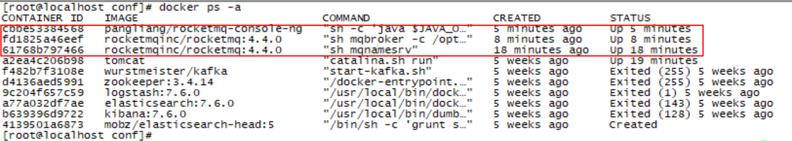

~~~
docker start 61
docker start fd
docker start cb
~~~

### 可能出现的错误

~~~
iptables: No chain/target/match by that name

解决方法：
service docker restart  
重启docker后:
iptables -L
可以看到iptables里面多出了Chain Docker的选项。  
经验为：在启动firewalld之后，iptables被激活，此时没有docker chain，重启docker后被加入到iptable里面。
~~~

## 业务使用

### 依赖选择

第一种：此种方式需要进行大量的配置及实例化操作，并不能够达到快速集成、方便使用的目的。

~~~XML
<dependency>
    <groupId>org.apache.rocketmq</groupId>
    <artifactId>rocketmq-client</artifactId>
    <version>4.3.0</version>
</dependency>
~~~

**第二种（推荐）**：

~~~xml
<!--add dependency in pom.xml-->
<dependency>
    <groupId>org.apache.rocketmq</groupId>
    <artifactId>rocketmq-spring-boot-starter</artifactId>
    <version>${RELEASE.VERSION}</version>
</dependency>
~~~

## 内容学习

### 作用

+ 解耦

  系统的耦合性越高，容错性就越低。以电商为例，用户创建完订单后，如果耦合调用库存系统、物流系统、支付系统，任何一个系统出现故障或者因为升级等原因暂时不可用，都回造成下单的异常，影响用户的体验。

+ 流量削峰
  应用系统如果遇到系统请求流量瞬间猛增，有可能会将系统压垮。如果有消息队列，遇到此情况，可以将大量请求存储起来，将一瞬间的峰值请求分散到一段时间进行处理，这样可以大大提高系统的稳定性

+ 异步
  用户调用一个接口的时候，可能该接口调用了别的方法。例如：用户注册的时候，后台可能需要调用：查询数据库，插入数据库，发送邮件等等…

### 概述

​		RocketMQ作为一款纯java、分布式、队列模型的开源消息中间件，支持事务消息、顺序消息、批量消息、定时消息、消息回溯等。

​		Apache Alibaba RocketMQ 是一个消息中间件。消息中间件中有两个角色：消息生产者和消息消费者。RocketMQ 里同样有这两个概念，消息生产者负责创建消息并发送到 RocketMQ 服务器，RocketMQ 服务器会将消息持久化到磁盘，消息消费者从 RocketMQ 服务器拉取消息并提交给应用消费。

#### 角色组成

+ producer集群：拥有相同的producerGroup,一般来讲，Producer不必要有集群的概念，这里的集群仅仅在RocketMQ的分布式事务中有用到
+ Name Server集群：提供topic的路由信息，路由信息数据存储在内存中，broker会定时的发送路由信息到nameserver中的每一个机器，来进行更新，节点之间无任何信息同步，所以name server集群可以简单理解为无状态（实际情况下可能存在每个nameserver机器上的数据有短暂的不一致现象，但是通过定时更新，大部分情况下都是一致的）
+ broker集群：一个集群有一个统一的名字，即brokerClusterName，默认是DefaultCluster。一个集群下有多个master，每个master下有多个slave。master和slave算是一组，拥有相同的brokerName,不同的brokerId，master的brokerId是0，而slave则是大于0的值。master和slave之间可以进行同步复制或者是异步复制。
+ consumer集群：拥有相同的consumerGroup。
  

### 特性

#### 订阅与发布

消息的发布是指某个生产者向某个topic发送消息；消息的订阅是指某个消费者关注了某个topic中带有某些tag的消息，进而从该topic消费数据。

#### 消息顺序

消息有序指的是一类消息消费时，能按照发送的顺序来消费。例如：一个订单产生了三条消息分别是订单创建、订单付款、订单完成。消费时要按照这个顺序消费才能有意义，但是同时订单之间是可以并行消费的。RocketMQ可以严格的保证消息有序。顺序消息分为全局顺序消息与分区顺序消息，全局顺序是指某个Topic下的所有消息都要保证顺序；部分顺序消息只要保证每一组消息被顺序消费即可。

+ 全局顺序：
  + 对于指定的一个Topic，所有消息按照严格的先入先出（FIFO）的顺序进行发布和消费。
  + 适用场景：性能要求不高，所有的消息严格按照FIFO 原则进行消息发布和消费的场景；
+ 分区顺序
  + 对于指定的一个Topic，所有消息根据 sharding key 进行区块分区。同一个分区内的消息按照严格的FIFO顺序进行发布和消费。Sharding key是顺序消息中用来区分不同分区的关键字段，和普通消息的Key是完全不同的概念。
  + 适用场景：性能要求高，以sharding key作为分区字段，在同一个区块中严格的按照FIFO原则进行消息发布和消费的场景。

#### 消息过滤

RocketMQ的消费者可以根据Tag进行消息过滤，也支持自定义属性过滤。消息过滤目前是在Broker端实现的，优点是减少了对于Consumer无用消息的网络传输，缺点是增加了Broker的负担、而且实现相对复杂。

#### 消息可靠性

RocketMQ支持消息的高可靠，影响消息可靠性的几种情况：

+ Broker非正常关闭；
+ Broker异常Crash；
+ OS Crash；
+ 机器掉电，但是能立即恢复供电情况；
+ 机器无法开机（可能是cpu、主板、内存等关键设备损坏）；
+ 磁盘设备损坏；

1、2、3、4 四种情况都属于硬件资源可立即恢复情况，RocketMQ在这四种情况下能保证消息不丢，或者丢失少量数据（依赖刷盘方式是同步还是异步）。5、6属于单点故障，且无法恢复，一旦发生，在此单点上的消息全部丢失。RocketMQ在这两种情况下，通过异步复制，可保证99%的消息不丢，但是仍然会有极少量的消息可能丢失。通过同步双写技术可以完全避免单点，同步双写势必会影响性能，适合对消息可靠性要求极高的场合，例如与Money相关的应用。注：RocketMQ从3.0版本开始支持同步双写。

#### 至少一次

​		至少一次(At least Once)指每个消息必须投递一次。Consumer先Pull消息到本地，消费完成后，才向服务器返回ack，如果没有消费一定不会ack消息，所以RocketMQ可以很好的支持此特性。

####  回溯消费

​		回溯消费是指Consumer已经消费成功的消息，由于业务上需求需要重新消费，要支持此功能，Broker在向Consumer投递成功消息后，消息仍然需要保留。并且重新消费一般是按照时间维度，例如由于Consumer系统故障，恢复后需要重新消费1小时前的数据，那么Broker要提供一种机制，可以按照时间维度来回退消费进度。RocketMQ支持按照时间回溯消费，时间维度精确到毫秒。

#### 事务消息

RocketMQ事务消息（Transactional Message）是指应用本地事务和发送消息操作可以被定义到全局事务中，要么同时成功，要么同时失败。RocketMQ的事务消息提供类似X/Open XA的分布事务功能，通过事务消息能达到分布式事务的最终一致。

#### 定时消息

定时消息（延迟队列）是指消息发送到broker后，不会立即被消费，等待特定时间投递给真正的topic。broker有配置项messageDelayLevel，默认值为“1s 5s 10s 30s 1m 2m 3m 4m 5m 6m 7m 8m 9m 10m 20m 30m 1h 2h”，18个level。可以配置自定义messageDelayLevel。注意，messageDelayLevel是broker的属性，不属于某个topic。发消息时，设置delayLevel等级即可：msg.setDelayLevel(level)。level有以下三种情况：

+ level == 0，消息为非延迟消息；
+ 1 <= level <= maxLevel，消息延迟特定时间，例如level == 1，延迟1s；
+ level > maxLevel，则leve l== maxLevel，例如level == 20，延迟2h。

定时消息会暂存在名为SCHEDULE_TOPIC_XXXX的topic中，并根据delayTimeLevel存入特定的queue，queueId = delayTimeLevel – 1，即一个queue只存相同延迟的消息，保证具有相同发送延迟的消息能够顺序消费。broker会调度地消费SCHEDULE_TOPIC_XXXX，将消息写入真实的topic。需要注意的是，定时消息会在第一次写入和调度写入真实topic时都会计数，因此发送数量、tps都会变高。

### 优势

目前主流的 MQ 主要是 RocketMQ、kafka、RabbitMQ，其主要优势有：

1. 支持事务型消息（消息发送和 DB 操作保持两方的最终一致性，RabbitMQ 和 Kafka 不支持）
2. 支持结合 RocketMQ 的多个系统之间数据最终一致性（多方事务，二方事务是前提）
3. 支持 18 个级别的延迟消息（RabbitMQ 和 Kafka 不支持）
4. 支持指定次数和时间间隔的失败消息重发（Kafka 不支持，RabbitMQ 需要手动确认）
5. 支持 Consumer 端 Tag 过滤，减少不必要的网络传输（RabbitMQ 和 Kafka 不支持）
6. 支持重复消费（RabbitMQ 不支持，Kafka 支持）

#### 消息重试

Consumer消费消息失败后，要提供一种重试机制，令消息再消费一次。Consumer消费消息失败通常可以认为有以下几种情况：

+ 由于消息本身的原因，例如反序列化失败，消息数据本身无法处理（例如话费充值，当前消息的手机号被注销，无法充值）等。这种错误通常需要跳过这条消息，再消费其它消息，而这条失败的消息即使立刻重试消费，99%也不成功，所以最好提供一种定时重试机制，即过10秒后再重试。
+ 由于依赖的下游应用服务不可用，例如db连接不可用，外系统网络不可达等。遇到这种错误，即使跳过当前失败的消息，消费其他消息同样也会报错。这种情况建议应用sleep 30s，再消费下一条消息，这样可以减轻Broker重试消息的压力。

RocketMQ会为每个消费组都设置一个Topic名称为“%RETRY%+consumerGroup”的重试队列（这里需要注意的是，这个Topic的重试队列是针对消费组，而不是针对每个Topic设置的），用于暂时保存因为各种异常而导致Consumer端无法消费的消息。考虑到异常恢复起来需要一些时间，会为重试队列设置多个重试级别，每个重试级别都有与之对应的重新投递延时，重试次数越多投递延时就越大。RocketMQ对于重试消息的处理是先保存至Topic名称为“SCHEDULE_TOPIC_XXXX”的延迟队列中，后台定时任务按照对应的时间进行Delay后重新保存至“%RETRY%+consumerGroup”的重试队列中。

#### 消息重投

生产者在发送消息时，同步消息失败会重投，异步消息有重试，oneway没有任何保证。消息重投保证消息尽可能发送成功、不丢失，但可能会造成消息重复，消息重复在RocketMQ中是无法避免的问题。消息重复在一般情况下不会发生，当出现消息量大、网络抖动，消息重复就会是大概率事件。另外，生产者主动重发、consumer负载变化也会导致重复消息。如下方法可以设置消息重试策略：

+ retryTimesWhenSendFailed:同步发送失败重投次数，默认为2，因此生产者会最多尝试发送retryTimesWhenSendFailed + 1次。不会选择上次失败的broker，尝试向其他broker发送，最大程度保证消息不丢。超过重投次数，抛出异常，由客户端保证消息不丢。当出现RemotingException、
+ MQClientException和部分MQBrokerException时会重投。
+ retryTimesWhenSendAsyncFailed:异步发送失败重试次数，异步重试不会选择其他broker，仅在同一个broker上做重试，不保证消息不丢。
  retryAnotherBrokerWhenNotStoreOK:消息刷盘（主或备）超时或slave不可用（返回状态非SEND_OK），是否尝试发送到其他broker，默认false。十分重要消息可以开启。

#### 流量控制

生产者流控，因为broker处理能力达到瓶颈；消费者流控，因为消费能力达到瓶颈。

生产者流控：

+ commitLog文件被锁时间超过osPageCacheBusyTimeOutMills时，参数默认为1000ms，返回流控。
+ 如果开启：
  + transientStorePoolEnable == true
  + 并且broker为异步刷盘的主机，且transientStorePool中资源不足，拒绝当前send请求，返回流控。
  + broker每隔10ms检查send请求队列头部请求的等待时间，如果超过waitTimeMillsInSendQueue，默认200ms，拒绝当前send请求，返回流控。
  + broker通过拒绝send 请求方式实现流量控制。

注意，生产者流控，不会尝试消息重投。

消费者流控：

+ 消费者本地缓存消息数超过pullThresholdForQueue时，默认1000。
+ 消费者本地缓存消息大小超过pullThresholdSizeForQueue时，默认100MB。
+ 消费者本地缓存消息跨度超过consumeConcurrentlyMaxSpan时，默认2000。
+ 消费者流控的结果是降低拉取频率。

#### 死信队列

死信队列用于处理无法被正常消费的消息。当一条消息初次消费失败，消息队列会自动进行消息重试；达到最大重试次数后，若消费依然失败，则表明消费者在正常情况下无法正确地消费该消息，此时，消息队列 不会立刻将消息丢弃，而是将其发送到该消费者对应的特殊队列中。RocketMQ将这种正常情况下无法被消费的消息称为死信消息（Dead-Letter Message），将存储死信消息的特殊队列称为死信队列（Dead-Letter Queue）。在RocketMQ中，可以通过使用console控制台对死信队列中的消息进行重发来使得消费者实例再次进行消费。

### 性能表现在哪

1. 吞吐量
2. 时效性,多少时间内能够处理的请求数
3. 消息的可靠性

### 版本依赖关系

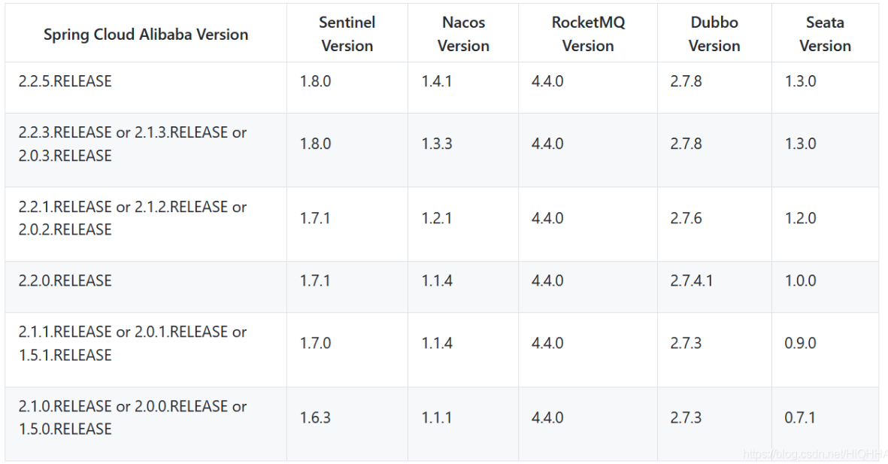

### RocketMQ 设计

#### 消息存储

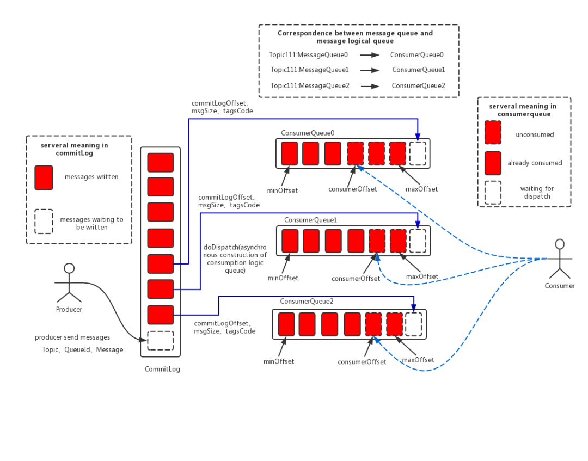

消息存储是RocketMQ中最为复杂和最为重要的一部分，接下来分别从RocketMQ的消息存储整体架构、RocketMQ中两种不同的刷盘方式来展开叙述。

**消息存储整体架构**

消息存储架构图中最重要的三个跟消息存储相关的文件构成

+ CommitLog
  + 消息主体以及元数据的存储主体，存储Producer端写入的消息主体内容,消息内容不是定长的。单个文件大小默认1G, 文件名长度为20位，左边补零，剩余为起始偏移量，比如00000000000000000000代表了第一个文件，起始偏移量为0，文件大小为1G=1073741824；当第一个文件写满了，第二个文件为00000000001073741824，起始偏移量为1073741824，以此类推。消息主要是顺序写入日志文件，当文件满了，写入下一个文件
+ ConsumeQueue
  + 消息消费队列，引入的目的主要是提高消息消费的性能，由于RocketMQ是基于主题topic的订阅模式，消息消费是针对主题进行的，如果要遍历commitlog文件中根据topic检索消息是非常低效的。Consumer即可根据ConsumeQueue来查找待消费的消息。
  + 其中，ConsumeQueue（逻辑消费队列）作为消费消息的索引，保存了指定Topic下的队列消息在CommitLog中的起始物理偏移量offset，消息大小size和消息Tag的HashCode值。consumequeue文件可以看成是基于topic的commitlog索引文件，故consumequeue文件夹的组织方式如下：topic/queue/file三层组织结构，具体存储路径为：$HOME/store/consumequeue/{topic}/{queueId}/{fileName}。
  + 同样consumequeue文件采取定长设计，每一个条目共20个字节，分别为8字节的commitlog物理偏移量、4字节的消息长度、8字节tag hashcode，单个文件由30W个条目组成，可以像数组一样随机访问每一个条目，每个ConsumeQueue文件大小约5.72M；
+ IndexFile
  + IndexFile（索引文件）提供了一种可以通过key或时间区间来查询消息的方法。Index文件的存储位置是：{fileName}，文件名fileName是以创建时的时间戳命名的，固定的单个IndexFile文件大小约为400M，一个IndexFile可以保存 2000W个索引，IndexFile的底层存储设计为在文件系统中实现HashMap结构，故rocketmq的索引文件其底层实现为hash索引。

在RocketMQ的消息存储整体架构图中可以看出，RocketMQ采用的是混合型的存储结构，即为Broker单个实例下所有的队列共用一个日志数据文件（即为CommitLog）来存储。

RocketM	Q的混合型存储结构(多个Topic的消息实体内容都存储于一个CommitLog中)针对Producer和Consumer分别采用了数据和索引部分相分离的存储结构，Producer发送消息至Broker端，然后Broker端使用同步或者异步的方式对消息刷盘持久化，保存至CommitLog中。只要消息被刷盘持久化至磁盘文件CommitLog中，那么Producer发送的消息就不会丢失。正因为如此，Consumer也就肯定有机会去消费这条消息。

当无法拉取到消息后，可以等下一次消息拉取，同时服务端也支持长轮询模式，如果一个消息拉取请求未拉取到消息，Broker允许等待30s的时间，只要这段时间内有新消息到达，将直接返回给消费端。这里，RocketMQ的具体做法是，使用Broker端的后台服务线程—ReputMessageService不停地分发请求并异步构建ConsumeQueue（逻辑消费队列）和IndexFile（索引文件）数据。

#### 消息刷盘

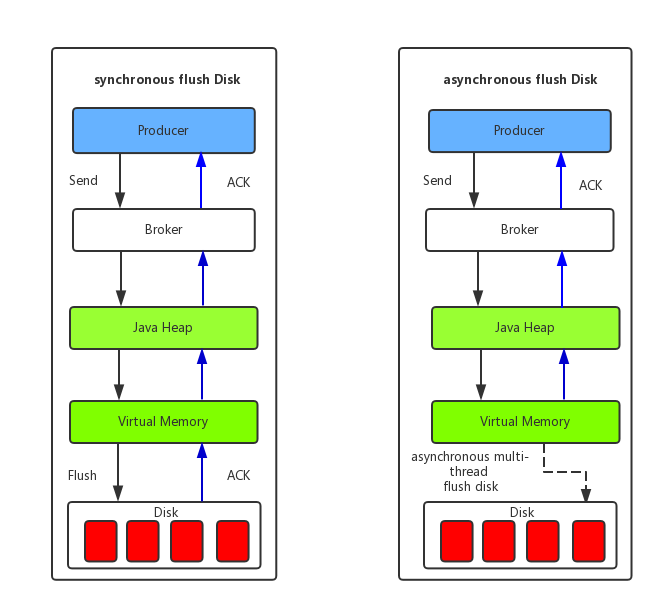

+ 同步刷盘
  + 只有在消息真正持久化至磁盘后RocketMQ的Broker端才会真正返回给Producer端一个成功的ACK响应。同步刷盘对MQ消息可靠性来说是一种不错的保障，但是性能上会有较大影响，一般适用于金融业务应用该模式较多。
+ 异步刷盘
  + 能够充分利用OS的PageCache的优势，只要消息写入PageCache即可将成功的ACK返回给Producer端。消息刷盘采用后台异步线程提交的方式进行，降低了读写延迟，提高了MQ的性能和吞吐量。

### RocketMQ 技术架构

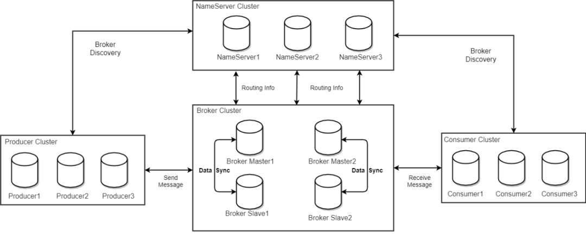

RocketMQ架构上主要分为四部分，如上图所示:

+ Producer：
  + 消息发布的角色，支持分布式集群方式部署。Producer通过MQ的负载均衡模块选择相应的Broker集群队列进行消息投递，投递的过程支持快速失败并且低延迟。
+ NameServer：
  + NameServer是一个非常简单的Topic路由注册中心，其角色类似Dubbo中的zookeeper，支持Broker的动态注册与发现。
  + 主要包括两个功能：Broker管理，NameServer接受Broker集群的注册信息并且保存下来作为路由信息的基本数据。然后提供心跳检测机制，检查Broker是否还存活；路由信息管理，每个NameServer将保存关于Broker集群的整个路由信息和用于客户端查询的队列信息。然后Producer和Conumser通过NameServer就可以知道整个Broker集群的路由信息，从而进行消息的投递和消费。NameServer通常也是集群的方式部署，各实例间相互不进行信息通讯。
  + Broker是向每一台NameServer注册自己的路由信息，所以每一个NameServer实例上面都保存一份完整的路由信息。当某个NameServer因某种原因下线了，Broker仍然可以向其它NameServer同步其路由信息，Producer,Consumer仍然可以动态感知Broker的路由的信息。
+ BrokerServer：
  + Broker主要负责消息的存储、投递和查询以及服务高可用保证，为了实现这些功能，Broker包含了以下几个重要子模块。
+ Remoting Module：
  + 整个Broker的实体，负责处理来自clients端的请求。
+ Client Manager：
  + 负责管理客户端(Producer/Consumer)和维护Consumer的Topic订阅信息。
+ Store Service：
  + 提供方便简单的API接口处理消息存储到物理硬盘和查询功能。
+ HA Service：
  + 高可用服务，提供Master Broker 和 Slave Broker之间的数据同步功能。
+ Index Service：
  + 根据特定的Message key对投递到Broker的消息进行索引服务，以提供消息的快速查询。

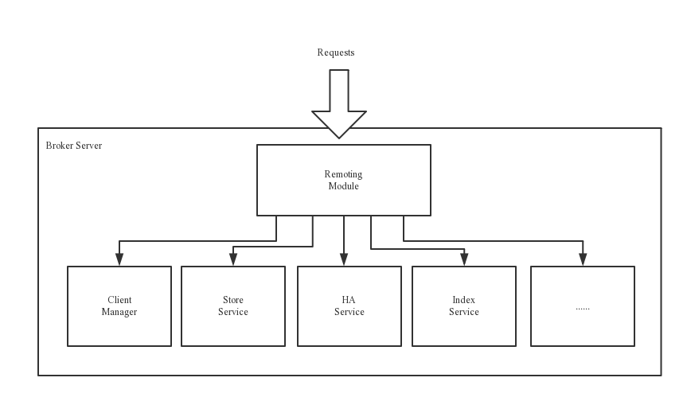

### RocketMQ 部署架构

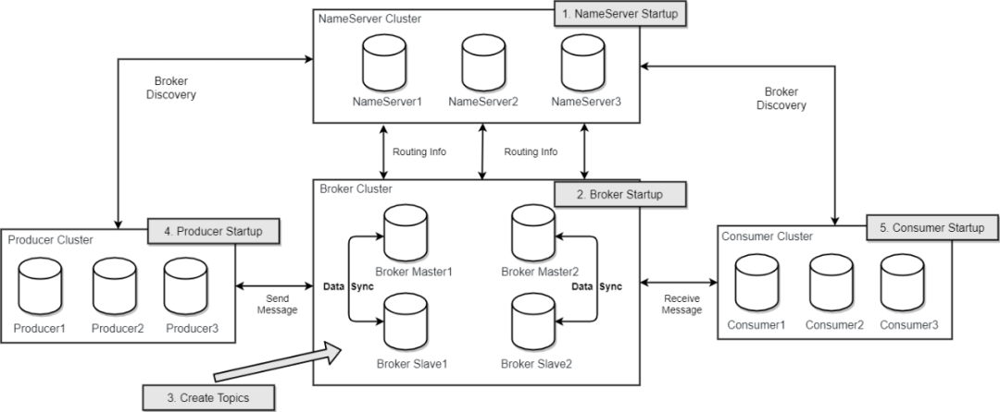

RocketMQ 网络部署特点

+ NameServer是一个几乎无状态节点，可集群部署，节点之间无任何信息同步。
+ Broker部署相对复杂，Broker分为Master与Slave，一个Master可以对应多个Slave，但是一个Slave只能对应一个Master，Master与Slave 的对应关系通过指定相同的BrokerName，不同的BrokerId 来定义，BrokerId为0表示Master，非0表示Slave。
+ Master也可以部署多个。每个Broker与NameServer集群中的所有节点建立长连接，定时注册Topic信息到所有NameServer。注意：当前RocketMQ版本在部署架构上支持一Master多Slave，但只有BrokerId=1的从服务器才会参与消息的读负载。
+ Producer与NameServer集群中的其中一个节点（随机选择）建立长连接，定期从NameServer获取Topic路由信息，并向提供Topic 服务的Master建立长连接，且定时向Master发送心跳。Producer完全无状态，可集群部署。
+ Consumer与NameServer集群中的其中一个节点（随机选择）建立长连接，定期从NameServer获取Topic路由信息，并向提供Topic服务的Master、Slave建立长连接，且定时向Master、Slave发送心跳。
+ Consumer既可以从Master订阅消息，也可以从Slave订阅消息，消费者在向Master拉取消息时，Master服务器会根据拉取偏移量与最大偏移量的距离（判断是否读老消息，产生读I/O），以及从服务器是否可读等因素建议下一次是从Master还是Slave拉取。

结合部署架构图，描述集群工作流程：

+ 启动NameServer，NameServer起来后监听端口，等待Broker、Producer、Consumer连上来，相当于一个路由控制中心。
+ Broker启动，跟所有的NameServer保持长连接，定时发送心跳包。心跳包中包含当前Broker信息(IP+端口等)以及存储所有Topic信息。注册成功后，NameServer集群中就有Topic跟Broker的映射关系。
+ 收发消息前，先创建Topic，创建Topic时需要指定该Topic要存储在哪些Broker上，也可以在发送消息时自动创建Topic。
+ Producer发送消息，启动时先跟NameServer集群中的其中一台建立长连接，并从NameServer中获取当前发送的Topic存在哪些Broker上，轮询从队列列表中选择一个队列，然后与队列所在的Broker建立长连接从而向Broker发消息。
+ Consumer跟Producer类似，跟其中一台NameServer建立长连接，获取当前订阅Topic存在哪些Broker上，然后直接跟Broker建立连接通道，开始消费消息。

### RocketMQ 集群部署

#### 单Master模式

这种方式风险较大，一旦Broker重启或者宕机时，会导致整个服务不可用。不建议线上环境使用,可以用于本地测试。

+ 优点：本地开发测试，配置简单，同步刷盘消息不会丢失。
+ 缺点：不可靠，如果宕机会导致服务不可用。

#### 多Master模式

一个集群无Slave，全是Master，例如2个Master或者3个Master，这种模式的优缺点如下：

+ 优点：配置简单，单个Master宕机或重启维护对应用无影响，在磁盘配置为RAID10时，即使机器宕机不可恢复情况下，由于RAID10磁盘非常可靠，消息也不会丢（异步刷盘丢失少量消息，同步刷盘一条不丢），性能最高；
+ 缺点：单台机器宕机期间，这台机器上未被消费的消息在机器恢复之前不可订阅，消息实时性会受到影响。

#### 多Master多Slave模式（异步）

每个Master配置一个Slave，有多对Master-Slave，HA采用异步复制方式，主备有短暂消息延迟（毫秒级），这种模式的优缺点如下：

+ 优点：即使磁盘损坏，消息丢失的非常少，且消息实时性不会受影响，同时Master宕机后，消费者仍然可以从Slave消费，而且此过程对应用透明，不需要人工干预，性能同多Master模式几乎一样；
+ 缺点：Master宕机，磁盘损坏情况下会丢失少量消息。

#### 多Master多Slave模式（同步）

每个Master配置一个Slave，有多对Master-Slave，HA采用同步双写方式，即只有主备都写成功，才向应用返回成功，这种模式的优缺点如下：

+ 优点：数据与服务都无单点故障，Master宕机情况下，消息无延迟，服务可用性与数据可用性都非常高；
+ 缺点：性能比异步复制模式略低（大约低10%左右），发送单个消息的RT会略高，且目前版本在主节点宕机后，备机不能自动切换为主机。

#### DLedger 集群模式

RocketMQ-on-DLedger Group 是指一组相同名称的 Broker，至少需要 3 个节点，通过 Raft 自动选举出一个 Leader，其余节点 作为 Follower，并在 Leader 和 Follower 之间复制数据以保证高可用。

RocketMQ-on-DLedger Group 能自动容灾切换，并保证数据一致。RocketMQ-on-DLedger Group 是可以水平扩展的，也即可以部署任意多个 RocketMQ-on-DLedger Group 同时对外提供服务。

+ 优点：多节点（至少三个）组成集群，其中一个为 Leader 节点，其余为 Follower 节点组成高可用，能够自动容灾切换。
+ 缺点：集群成本增加(同一个group最少新增一台机器)、RocketMQ4.5及以后版本才支持。

## 面试内容

### Rocket MQ 的组成部分？

RocketMQ主要有四大核心组成部分：**NameServer**、**Broker**、**Producer**以及**Consumer**四部分

**1. 名字服务NameServer**：

主要负责对于源数据的管理，包括了对于Topic和路由信息的管理

~~~bash
1.生产者或消费者能够通过名字服务查找各主题相应的Broker IP列表。
2.多个Namesrv实例组成集群，但相互独立，没有信息交换。
注意:Broker向NameServer发心跳时，会带上当前自己所负责的所有Topic信息，如果Topic个数太多（万级别），
会导致一次心跳中，Topic的数据就几十M，网络情况差的话，网络传输失败，心跳失败，导致NameServer误认为Broker心跳失败

~~~

**2. 代理服务器Broker Server**

消息中转角色，负责存储消息、转发消息

~~~bash
1.Broker是具体提供业务的服务器，单个Broker节点与所有的NameServer节点保持长连接及心跳，并会定时将Topic信息注册到NameServer
2.代理服务器在RocketMQ系统中负责接收从生产者发送来的消息并存储、同时为消费者的拉取请求作准备
~~~

**3.生产者Producer**

消息生产者，负责产生消息，一般由业务系统负责产生消息

~~~bash
1.一个消息生产者会把业务应用系统里产生的消息发送到broker服务器。
2.RocketMQ提供多种发送方式，同步发送、异步发送、顺序发送、单向发送。
3.同步和异步方式均需要Broker返回确认信息，单向发送不需要。
~~~

**4. 消费者Consumer**

消息消费者，负责消费消息，一般是后台系统负责异步消费

~~~bash
Consumer也由用户部署，支持PUSH和PULL两种消费模式，支持集群消费和广播消息，提供实时的消息订阅机制
~~~

**5. 消息内容Message**

消息系统所传输信息的物理载体，生产和消费数据的最小单位，每条消息必须属于一个主题

~~~bash
1.RocketMQ中每个消息拥有唯一的Message ID，且可以携带具有业务标识的Key。
2.系统提供了通过Message ID和Key查询消息的功能。
~~~

**6. 消息主题Topic**
表示一类消息的集合，每个主题包含若干条消息，每条消息只能属于一个主题

~~~bash
是RocketMQ进行消息订阅的基本单位
~~~

**7. 标签Tag**

为消息设置的标志，用于同一主题下区分不同类型的消息

~~~bash
1.标签能够有效地保持代码的清晰度和连贯性，并优化RocketMQ提供的查询系统
2.消费者可以根据Tag实现对不同子主题的不同消费逻辑，实现更好的扩展性。
~~~

**8. 消息队列MessageQueue**

主题被划分为一个或多个子主题，即消息队列

### NameServer是怎么感知到Broker宕机？

​		Broker会定时（30s）向NameServer发送心跳，然后NameServer会定时（10s）运行一个任务，去检查一下各个Broker的最近一次心跳时间，如果某个Broker超过120s都没发送心跳了，那么就认为这个Broker已经挂掉了。

### RocketMQ有哪些容错机制？

​		**基于Dledger实现RocketMQ高可用自动切换**
​		RocketMQ 4.5之后支持了一种叫做Dledger机制，基于Raft协议实现的一个机制。我们可以让一个Master Broker对应多个Slave Broker， 一旦Master Broker宕机了，在多个Slave中通过Dledger技术将一个Slave Broker选为新的Master Broker对外提供服务。在生产环境中可以是用Dledger机制实现自动故障切换，只要10秒或者几十秒的时间就可以完成。

###  Producer发送消息到Broker，是否有一定的规则？

​		一般是负载均衡做随机选择，但也可以走其他策略，比如根据某个字段来hash

### 生产者发送消息的方式？

+ 同步发送：同步发送指消息发送方发出数据后会在收到接收方发回响应之后才发下一个数据包。一般用于重要通知消息，例如重要通知邮件、营销短信。
+ 异步发送：异步发送指发送方发出数据后，不等接收方发回响应，接着发送下个数据包，一般用于可能链路耗时较长而对响应时间敏感的业务场景，例如用户视频上传后通知启动转码服务。
+ 单向发送：单向发送是指只负责发送消息而不等待服务器回应且没有回调函数触发，适用于某些耗时非常短但对可靠性要求并不高的场景，例如日志收集

### 消费者消费模式有几种？

+ 集群消费
  消费者的一种消费模式。一个 Consumer Group 中的各个 Consumer 实例分摊去消费消息，即一条消息只会投递到一个 Consumer Group 下面的一个实例。
+ 广播消费
  消费者的一种消费模式。消息将对一 个Consumer Group 下的各个 Consumer 实例都投递一遍。即即使这些 Consumer 属于同一个Consumer Group ，消息也会被 Consumer Group 中的每个 Consumer 都消费一次。

### 消费者获取消息有几种模式？

消费者获取消息有两种模式：推送模式和拉取模式。
1. PushConsumer
推送模式（虽然 RocketMQ 使用的是长轮询）的消费者。消息的能及时被消费。使用非常简单，内部已处理如线程池消费、流控、负载均衡、异常处理等等的各种场景。
2. PullConsumer
拉取模式的消费者。应用主动控制拉取的时机，怎么拉取，怎么消费等。主动权更高。但要自己处理各种场景。

### 可靠消息传递

#### 产生问题的原因

1. 生产阶段，Producer 新建消息，然后通过网络将消息投递给 MQ Broker
2. 存储阶段，消息将会存储在 Broker 端磁盘中
3. 消息阶段， Consumer 将会从 Broker 拉取消息

**总结：**以上任一阶段都可能会丢失消息，我们只要找到这三个阶段丢失消息原因，采用合理的办法避免丢失，就可以彻底解决消息丢失的问题。

#### 解决方案

##### 1. 生产阶段Ack

​		生产者（Producer） 通过网络发送消息给 Broker，当 Broker 收到之后，将会返回确认响应信息给 Producer。所以生产者只要接收到返回的确认响应，就代表消息在生产阶段未丢失。

RocketMQ 发送消息示例代码如下：

~~~JAva
DefaultMQProducer mqProducer=new DefaultMQProducer("test");
// 设置 nameSpace 地址
mqProducer.setNamesrvAddr("namesrvAddr");
mqProducer.start();
Message msg = new Message("test_topic" /* Topic */,
        "Hello World".getBytes(RemotingHelper.DEFAULT_CHARSET) /* Message body */
);
// 发送消息到一个Broker
try {
    SendResult sendResult = mqProducer.send(msg);
} catch (RemotingException e) {
    e.printStackTrace();
} catch (MQBrokerException e) {
    e.printStackTrace();
} catch (InterruptedException e) {
    e.printStackTrace();
}
~~~

send 方法是一个同步操作，只要这个方法不抛出任何异常，就代表消息已经发送成功。

消息发送成功仅代表消息已经到了 Broker 端，Broker 在不同配置下，可能会返回不同响应状态:

~~~
SendStatus.SEND_OK
SendStatus.FLUSH_DISK_TIMEOUT
SendStatus.FLUSH_SLAVE_TIMEOUT
SendStatus.SLAVE_NOT_AVAILABLE
~~~

##### 2. Broker 存储阶段Ack

​		默认情况下，消息只要到了 Broker 端，将会优先保存到内存中，然后立刻返回确认响应给生产者。随后 Broker 定期批量的将一组消息从内存异步刷入磁盘。

​		这种方式减少 I/O 次数，可以取得更好的性能，但是如果发生机器掉电，异常宕机等情况，消息还未及时刷入磁盘，就会出现丢失消息的情况。若想保证 Broker 端不丢消息，保证消息的可靠性，我们需要将消息保存机制修改为**同步刷盘**方式，即消息存储磁盘成功，才会返回响应。

修改 Broker 端配置如下：

~~~
默认情况为 ASYNC_FLUSH
flushDiskType = SYNC_FLUSH
~~~

**集群部署**

1. 为了保证可用性，Broker 通常采用一主（master）多从（slave）部署方式。为了保证消息不丢失，消息还需要复制到 slave 节点。默认方式下，消息写入 master成功，就可以返回确认响应给生产者，接着消息将会异步复制到 slave 节点。

~~~
注：master 配置：flushDiskType = SYNC_FLUSH
~~~

2. 此时若 master 突然宕机且不可恢复，那么还未复制到 slave的消息将会丢失。为了进一步提高消息的可靠性，我们可以采用同步的复制方式，master节点将会同步等待 slave 节点复制完成，才会返回确认响应。

   Broker master 节点 同步复制配置如下：

~~~conf
默认为 ASYNC_MASTER
brokerRole=SYNC_MASTER
~~~

​		如果 slave节点未在指定时间内同步返回响应，生产者将会收到SendStatus.FLUSH_SLAVE_TIMEOUT 返回状态。

3. **小节**：结合生产阶段与存储阶段，若需要**严格保证消息不丢失**，broker 需要采用如下配置：

~~~
## master 节点配置
flushDiskType = SYNC_FLUSH
brokerRole=SYNC_MASTER

## slave 节点配置
brokerRole=slave
flushDiskType = SYNC_FLUSH
~~~

##### 3. 消费阶段Ack

​		消费者从 broker 拉取消息，然后执行相应的业务逻辑。一旦执行成功，返回 `ConsumeConcurrentlyStatus.CONSUME_SUCCESS`状态给 Broker。如果 Broker 未收到消费确认响应或收到其他状态，消费者下次还会再次拉取到该条消息，进行重试。这样的方式有效避免了消费者消费过程发生异常，或者消息在网络传输中丢失的情况。

消息消费的代码如下：

~~~java
// 实例化消费者
DefaultMQPushConsumer consumer = new DefaultMQPushConsumer("test_consumer");

// 设置NameServer的地址
consumer.setNamesrvAddr("namesrvAddr");

// 订阅一个或者多个Topic，以及Tag来过滤需要消费的消息
consumer.subscribe("test_topic", "*");
// 注册回调实现类来处理从broker拉取回来的消息
consumer.registerMessageListener(new MessageListenerConcurrently() {
    @Override
    public ConsumeConcurrentlyStatus consumeMessage(List<MessageExt> msgs, ConsumeConcurrentlyContext context) {
        // 执行业务逻辑
        // 标记该消息已经被成功消费
        return ConsumeConcurrentlyStatus.CONSUME_SUCCESS;
    }
});
// 启动消费者实例
consumer.start();
~~~

### 消息的重复消费

#### 造成重复消费的原因

1. 当系统的调用链路比较长的时候，比如系统A调用系统B，系统B再把消息发送到RocketMQ中，在系统A调用系统B的时候，如果系统B处理成功，但是迟迟没有将调用成功的结果返回给系统A的时候，系统A就会尝试重新发起请求给系统B，造成系统B重复处理，发起多条消息给RocketMQ造成重复消费；
2. 在系统B发送给RocketMQ的时候，也有可能会发生和上面一样的问题，消息发送超时，结果系统B重试，导致RocketMQ接收到了重读消息；
3. 当RocketMQ成功接收到消息，并将消息交给消费者处理，如果消费者消费完成后还没来得及提交CONSUME_SUCCESS给RocketMQ，自己宕机或者重启了，那么RocketMQ没有接收到CONSUME_SUCCESS，就会认为消费失败了，会重发消息给消费者再次消费；

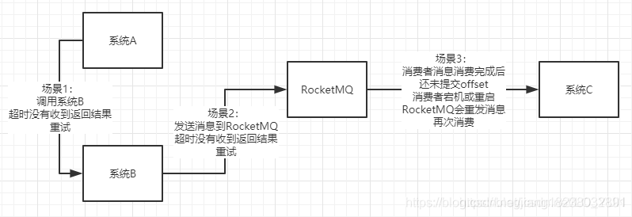

#### 解决方案

##### 生产者端

1. RocketMQ支持消息查询的功能，只要去RocketMQ查询一下是否已经发送过该条消息就可以了，不存在则发送，存在则不发送，也就是message.setKeys()；
2. 引入Redis，在发送消息到RocketMQ成功之后，向Redis中插入一条数据，如果发送重试，则先去Redis查询一个该条消息是否已经发送过了，存在的话就不重复发送消息了；

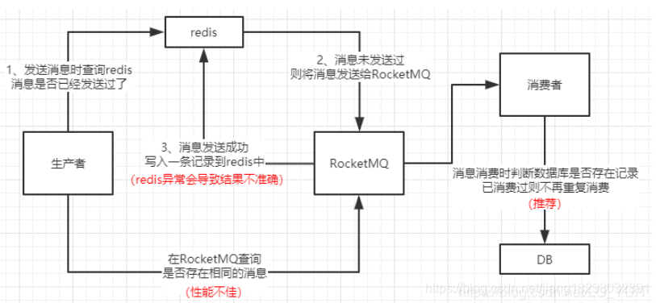

**缺点**
方法一：RocketMQ消息查询的性能不是特别好，如果在高并发的场景下，每条消息在发送到RocketMQ时都去查询一下，可能会影响接口的性能；

方法二：在一些极端的场景下，Redis也无法保证消息发送成功之后，就一定能写入Redis成功，比如写入消息成功而Redis此时宕机，那么再次查询Redis判断消息是否已经发送过，是无法得到正确结果的；

**示例代码**

~~~java
public class MQProducer {
    public static void main(String[] args) throws MQClientException {
        //创建生产者
        DefaultMQProducer producer=new DefaultMQProducer("rmq-group");
        //设置NameServer地址
        producer.setNamesrvAddr("192.168.138.187:9876;192.168.138.188:9876");
        //设置生产者实例名称
        producer.setInstanceName("producer");
        //启动生产者
        producer.start();
        try {
            //发送消息
            for (int i=0;i<1;i++){
                Thread.sleep(1000); //每秒发送一次
                //创建消息
                Message msg = new Message("wn04", // topic 主题名称
                        "TagA", // tag 临时值
                        ("w-"+i).getBytes()// body 内容
                );
                //消息的唯一標識
                msg.setKeys(System.currentTimeMillis() + "");
                //发送消息
                SendResult sendResult=producer.send(msg);
                System.out.println(sendResult.toString());
            }
        } catch (Exception e) {
            e.printStackTrace();
        }
        producer.shutdown();
    }

}

~~~

##### 消费者端

1. 建立一个消息表，拿到这个消息做数据库的insert操作。给这个消息做一个唯一主键（primary key）或者唯一约束，那么就算出现重复消费的情况，就会导致主键冲突。
2. 拿到这个消息做redis的set的操作.redis就是天然幂等性

**示例代码**

~~~java
public class MQConsumer {

    //保存标识的集合
    static private Map<String, String> logMap = new HashMap<>();

    public static void main(String[] args) throws MQClientException {
        //创建消费者
        DefaultMQPushConsumer consumer=new DefaultMQPushConsumer("rmq-group");
        //设置NameServer地址
        consumer.setNamesrvAddr("192.168.138.187:9876;192.168.138.188:9876");
        //设置消费者实例名称
        consumer.setInstanceName("consumer");
        //订阅topic
        consumer.subscribe("wn04","TagA");
        //监听消息
        consumer.registerMessageListener(new MessageListenerConcurrently() {
            @Override
            public ConsumeConcurrentlyStatus consumeMessage(List<MessageExt> list, ConsumeConcurrentlyContext consumeConcurrentlyContext) {
                String key = null;
                String msgId = null;
                try {
                    for (MessageExt msg : list) {
                        key = msg.getKeys();
                        //判断集合当中有没有存在key,存在就不需要重试,不存在先存key再回来重试后消费消息
                        if (logMap.containsKey(key)) {
                            // 无需继续重试。
                            System.out.println("key:"+key+",无需重试...");
                            return ConsumeConcurrentlyStatus.CONSUME_SUCCESS;
                        }
                        msgId = msg.getMsgId();
                        System.out.println("key:" + key + ",msgid:" + msgId + "---" + new String(msg.getBody()));
                        //模拟异常
                        int i = 1 / 0;
                    }
                } catch (Exception e) {
                    //e.printStackTrace();
                    //重试
                    return ConsumeConcurrentlyStatus.RECONSUME_LATER;
                } finally {
                    //保存key
                    logMap.put(key, msgId);
                }

                return ConsumeConcurrentlyStatus.CONSUME_SUCCESS;
            }
        });
        consumer.start();
        System.out.println("Consumer Started...");

    }
}

~~~

### 分布式事务

#### 事务消息

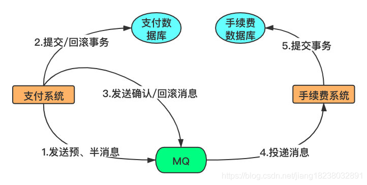

1. 首先我们将会发送一个半(half) 消息到 MQ 中，通知其开启一个事务。这里半消息并不是说消息内容不完整，实际上它包含所有完整的消息内容。这个半消息与普通的消息唯一的区别在于，在事物提交之前，这个消息对消费者来说是不可见的，消费者不会消费这个消息。

2. 一旦半消息发送成功，我们就可以执行数据库事务。然后根据事务的执行结果再决定提交或回滚事务消息。

3. 如果事务提交成功，将会发送确认消息至 MQ，手续费系统就可以成功消费到这条消息。

4. 如果事务被回滚，将会发送回滚通知至 MQ，然后 MQ 将会删除这条消息。对于手续费系统来说，都不会知道这条消息的存在。
5. 这就解决了要么都成功，要么都失败的一致性要求。

**其他**：

实际上面的流程还是存在问题，如果我们提交/回滚事务消息失败怎么办？

​		对于这个问题，RocketMQ 给出一种事务反查的机制。我们需要需要注册一个回调接口，用于反查本地事务状态。

​		RocketMQ 若未收到提交或回滚的请求，将会定期去反查回调接口，然后可以根据反查结果决定回滚还是提交事务。

#### 整体流程

RocketMQ 事务消息流程整体如下：

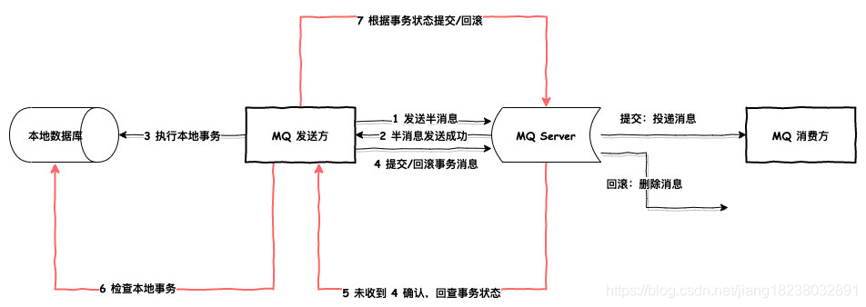

#### 示例代码

~~~java
public class TransactionMQProducerExample {
    public static void main(String[] args) throws MQClientException, InterruptedException, UnsupportedEncodingException {
        TransactionMQProducer producer = new TransactionMQProducer("test_transaction_producer");
        // 不定义将会使用默认的
        ExecutorService executorService =
                new ThreadPoolExecutor(2, 5, 100,
                        TimeUnit.SECONDS, new ArrayBlockingQueue<Runnable>(2000), 
                                       new ThreadFactory() {
                    @Override
                    public Thread newThread(Runnable r) {
                        Thread thread = new Thread(r);
                        thread.setName("client-transaction-msg-check-thread");
                        return thread;
                    }
                });
        producer.setExecutorService(executorService);
        TransactionListener transactionListener = new TransactionListenerImpl();
        producer.setTransactionListener(transactionListener);
        // 改成自己的地址
        producer.setNamesrvAddr("127.0.0.1:9876");
        producer.start();

        Order order = new Order("66666", "books");

        Message msg =
                new Message("transaction_tp",
                        JSON.toJSONString(order).getBytes(RemotingHelper.DEFAULT_CHARSET));
        // 发送半消息
        SendResult sendResult = producer.sendMessageInTransaction(msg, null);
        System.out.println(sendResult.getSendStatus());
        producer.shutdown();
    }

    public static class TransactionListenerImpl implements TransactionListener {

        /**
         * 半消息发送成功将会自动执行该逻辑
         *
         * @param msg
         * @param arg
         * @return
         */
        @Override
        public LocalTransactionState executeLocalTransaction(Message msg, Object arg) {
            // 执行本地事务
            Order order = null;
            try {
                order = JSON.parseObject(new String(msg.getBody(),
                        RemotingHelper.DEFAULT_CHARSET), Order.class);
                boolean isSuccess = updateOrder(order);
                if (isSuccess) {
                    // 本地事务执行成功，提交半消息
                    System.out.println("本地事务执行成功，提交事务事务消息");
                    return LocalTransactionState.COMMIT_MESSAGE;
                } else {
                    // 本地事务执行成功，回滚半消息
                    System.out.println("本地事务执行失败，回滚事务消息");
                    return LocalTransactionState.ROLLBACK_MESSAGE;
                }
            } catch (Exception e) {
                System.out.println("本地事务执行异常");
            }
            // 异常情况返回未知状态
            return LocalTransactionState.UNKNOW;
        }

        /**
         * 更新订单
         * 这里模拟数据库更新，返回事务执行成功
         *
         * @param order
         * @return
         */
        private boolean updateOrder(Order order) throws InterruptedException {
            TimeUnit.SECONDS.sleep(1);
            return true;
        }

        /***
         * 若提交/回滚事务消息失败，rocketmq 自动反查事务状态
         * @param msg
         * @return
         */
        @Override
        public LocalTransactionState checkLocalTransaction(MessageExt msg) {
            try {
                Order order = JSON.parseObject(new String(msg.getBody(),
                        RemotingHelper.DEFAULT_CHARSET), Order.class);
                boolean isSuccess = queryOrder(order.getOrderId());
                if (isSuccess) {
                    // 本地事务执行成功，提交半消息
                    return LocalTransactionState.COMMIT_MESSAGE;
                } else {
                    // 本地事务执行成功，回滚半消息
                    return LocalTransactionState.ROLLBACK_MESSAGE;
                }

            } catch (Exception e) {
                System.out.println("查询失败");
            }
            // 异常情况返回未知状态
            return LocalTransactionState.UNKNOW;
        }

        /**
         * 查询订单状态
         * 模拟返回查询成功
         *
         * @param orderId
         * @return
         */
        private boolean queryOrder(String orderId) throws InterruptedException {
            TimeUnit.SECONDS.sleep(1);
            return true;
        }
    }

    @Data
    public static class Order {
        private String orderId;

        private String goods;

        public Order(String orderId, String goods) {
            this.orderId = orderId;
            this.goods = goods;
        }
    }
}

~~~

### 消息堆积

#### 问题原因

1. producer生产速率过快，什么场景呢，比如producer故障，比如DOS攻击，比如业务高峰（超过企业预估的，例如                        12306订票，双十一下单，这些一开始的时候都有超过预期的情况）。
2. Broker消息堆积，比如Broker的性能瓶颈，Broker同步策略导致消息堆积等      
3. Consumer本身已经拉取消息的堆积。consumer消息拉取超过一定量之后会暂停消息拉取，一方面是消费者本身消费能力的现在，另一方面是由于消费端过多的消息容易造成GC频繁。

**总结**一般情况下我们都可以通过限流和扩容来达到快速处理堆积的消息的目标。

#### 解决问题

1. 判断是否存在消息堆积场景
   + producer发送消息的速率监控
   + producer发送消息的maxOffset与consumer消费消息的currOffset的差异值与给定的消息堆积数值告警值对比，如果差异   		值大于数据告警值，则存在消息堆积，否则不存在消息堆积。
   + consumer消费消息的速率监控

2. 消息堆积场景
    消息堆积的处理策略整体上说就是生产者producer限流，RocketMQ扩容，消费者consumer扩容，具体要根据监控指标来判断。通过监控差异值的变化我们可以获取消息堆积的具体场景，主要有这么几种情况。
   + 差异值呈现增大趋势--producer消息的发送速度大于consumer的消息消费速度
     prducer 发送速率增大，RocketMQ性能平稳，consumer消费速率增大。这种情况确实是业务量上涨，消费端消费能力不足照成的。此时需要可以采取的方式包括生产者限流紧急情况可以采用生产者熔断，消费者扩容的方式解决，具体要看业务的容忍度。比如说12306的抢票，我们紧急限流一段时间其实对整体业务影响不大；如果是双十一的下单期间，紧急限流下单业务，那么后果就不敢设想了，业务影响可能是以亿来计算的，这个时候就需要消费者扩容，提高消费者的消费能力。
     备注：如果消费者扩容一段时间后消息阻塞没有明显的下降趋势，那么就必须采取生产者限流，因为此时的问题极大的可能性是消费者应用故障，比如程序故障，代码缺陷等情况导致的本身消费能力不够。具体表现就是物理你怎么扩容，服务端的服务器的性能消耗都很大。	
   + 如果差异值呈现平稳趋势或者下降趋势---producer消息发送速率等于consumer消息的消费速度
     这种情况其实就是RocketMQ发挥优势的最佳场景之一-------消息削峰。可以谨慎观察，RocketMQ本身的服务性能，必要的时候可以对RocketMQ 进行扩容，提高消息堆积能力。
   + 差异值呈现增大趋势----producer的生产速率无明显增加，consumer的消费速率无明显增加。
     这种情况基本上是可以确定是RocketMQ本身的故障照成的，比如Broker故障，比如Broker的GC频率过高导致消息推送，copy性能降低，集群内部网络故障，等等。此时主要是监控RocketMQ服务器性能。
   + 差异值呈现增大趋势----producer生产速率正常，RocketMQ服务器性能正常，consumer消费速率降低。

### 顺序消费消息

#### 顺序消费原理

1. 消息的有序性是指消息的消费顺序能够严格保存与消息的发送顺序一致。例如，一个订单产生了3条消息，分别是订单创建、订单付款和订单完成。在消息消费时，同一条订单要严格按照这个顺序进行消费，否则业务会发生混乱。同时，不同订单之间的消息又是可以并发消费的，比如可以先执行第三个订单的付款，再执行第二个订单的创建。
2. RocketMQ采用了局部顺序一致性的机制，实现了单个队列中的消息严格有序。也就是说，如果想要保证顺序消费，必须将一组消息发送到同一个队列中，然后再由消费者进行注意消费。
3. RocketMQ推荐的顺序消费解决方案是：安装业务划分不同的队列，然后将需要顺序消费的消息发往同一队列中即可，不同业务之间的消息仍采用并发消费。这种方式在满足顺序消费的同时提高了消息的处理速度，在一定程度上避免了消息堆积问题。

# 源码

## 原理图

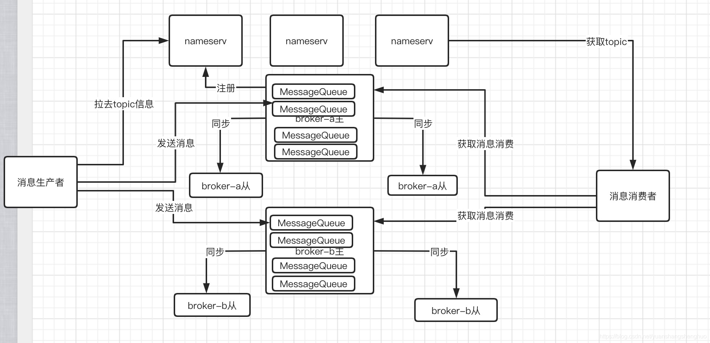

## 生产者

### 启动代码

~~~java
  public static void main(String[] args) throws MQClientException, InterruptedException {

        DefaultMQProducer producer = new DefaultMQProducer("producerGroup1");
        producer.setNamesrvAddr("127.0.0.1:9876");
        producer.start();
        for (int i = 0; i < 1000; i++) {
            try {

                Message msg = new Message("TopicTest" /* Topic */,
                    "TagA" /* Tag */,
                    ("Hello RocketMQ " + i).getBytes(RemotingHelper.DEFAULT_CHARSET) /* Message body */
                );
               SendResult sendResult = producer.send(msg);
               Thread.sleep(1000);

                System.out.printf("%s%n", sendResult);
            } catch (Exception e) {
                e.printStackTrace();
                Thread.sleep(1000);
            }
        }
        producer.shutdown();
    }
~~~

### 创建生产者

1. 也就是一个线程池，然后绑定 NameSever 端口
2. 然后启动线程池

~~~java
DefaultMQProducer producer = new DefaultMQProducer("please_rename_unique_group_name");

public DefaultMQProducer(final String producerGroup) {
    this(null, producerGroup, null);
}

public DefaultMQProducer(final String namespace, final String producerGroup, RPCHook rpcHook) {
    this.namespace = namespace;
    this.producerGroup = producerGroup;
    defaultMQProducerImpl = new DefaultMQProducerImpl(this, rpcHook);
}

public DefaultMQProducerImpl(final DefaultMQProducer defaultMQProducer, RPCHook rpcHook) {
    this.defaultMQProducer = defaultMQProducer;
    this.rpcHook = rpcHook;
    // 容量5000的阻塞队列
    this.asyncSenderThreadPoolQueue = new LinkedBlockingQueue<Runnable>(50000);
    // 异步发送信息的线程池
    this.defaultAsyncSenderExecutor = new ThreadPoolExecutor(
        Runtime.getRuntime().availableProcessors(),
        Runtime.getRuntime().availableProcessors(),
        1000 * 60,
        TimeUnit.MILLISECONDS,
        this.asyncSenderThreadPoolQueue,
        new ThreadFactory() {
            private AtomicInteger threadIndex = new AtomicInteger(0);
            @Override
            public Thread newThread(Runnable r) {
                return new Thread(r, "AsyncSenderExecutor_" + this.threadIndex.incrementAndGet());
            }
        });
}
~~~

~~~java
producer.setNamesrvAddr("127.0.0.1:9876");
producer.start();

// 启动生产者
public void start() throws MQClientException {
    this.setProducerGroup(withNamespace(this.producerGroup));
    this.defaultMQProducerImpl.start();
    if (null != traceDispatcher) {
        try {
            traceDispatcher.start(this.getNamesrvAddr(), this.getAccessChannel());
        } catch (MQClientException e) {
            log.warn("trace dispatcher start failed ", e);
        }
    }
}

@Override
public void start(String nameSrvAddr, AccessChannel accessChannel) throws MQClientException {
    if (isStarted.compareAndSet(false, true)) {
        traceProducer.setNamesrvAddr(nameSrvAddr);
        traceProducer.setInstanceName(TRACE_INSTANCE_NAME + "_" + nameSrvAddr);
        traceProducer.start();
    }
    this.accessChannel = accessChannel;
    // 启动一个线程
    this.worker = new Thread(new AsyncRunnable(), "MQ-AsyncTraceDispatcher-Thread-" + dispatcherId);
    this.worker.setDaemon(true);
    this.worker.start();
    this.registerShutDownHook();
}
~~~

