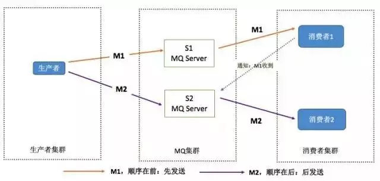

# 消息队列

## 概述

​		消息队列是在消息的传输过程中保存消息的容器，消息队列中间件是分布式系统中重要的组件，主要解决应用耦合，异步消息，流量削锋等问题。实现高性能，高可用，可伸缩和最终一致性架构。是大型分布式系统不可缺少的中间件。

​		目前在生产环境，使用较多的消息队列有ActiveMQ，RabbitMQ，ZeroMQ，Kafka，MetaMQ，RocketMQ等。

## 应用场景

1. 异步处理
2. 应用解耦
3. 流量削锋
4. 消息通讯

## 消息队列有什么优缺点？

优点上面已经说了，就是**在特殊场景下有其对应的好处**，**解耦**、**异步**、**削峰**。

缺点有以下几个：

**系统可用性降低**

​		本来系统运行好好的，现在你非要加入个消息队列进去，那消息队列挂了，你的系统不是呵呵了。因此，系统可用性会降低；

**系统复杂度提高**

​		加入了消息队列，要多考虑很多方面的问题，比如：一致性问题、如何保证消息不被重复消费、如何保证消息可靠性传输等。因此，需要考虑的东西更多，复杂性增大。

**一致性问题**

​		A 系统处理完了直接返回成功了，人都以为你这个请求就成功了；但是问题是，要是 BCD 三个系统那里，BD 两个系统写库成功了，结果 C 系统写库失败了，咋整？你这数据就不一致了。

## 使用示例

### 电商系统

1. 应用将主干逻辑处理完成后，写入消息队列。消息发送是否成功可以开启消息的确认模式。（消息队列返回消息接收成功状态后，应用再返回，这样保障消息的完整性）
2. 扩展流程（发短信，配送处理）订阅队列消息。采用推或拉的方式获取消息并处理。
3. 消息将应用解耦的同时，带来了数据一致性问题，可以采用最终一致性方式解决。比如主数据写入数据库，扩展应用根据消息队列，并结合数据库方式实现基于消息队列的后续处理。

### 日志收集系统

分为Zookeeper注册中心，日志收集客户端，Kafka集群和 Storm 集群（其他）四部分组成。

- Zookeeper注册中心，提出负载均衡和地址查找服务；
- 日志收集客户端，用于采集应用系统的日志，并将数据推送到 kafka 队列；
- Kafka集群：接收，路由，存储，转发等消息处理；
- Storm集群：采用拉的方式消费队列中的数据；

## 常用消息队列对比

### ActiveMQ

**优点**

+ 单机吞吐量：万级
+ topic数量都吞吐量的影响：
+ 时效性：ms级
+ 可用性：高，基于主从架构实现高可用性
+ 消息可靠性：有较低的概率丢失数据
+ 功能支持：MQ领域的功能极其完备

**缺点:**

+ 官方社区现在对ActiveMQ 5.x维护越来越少，较少在大规模吞吐的场景中使用。

### RabbitMQ

2007年发布，是一个在AMQP(高级消息队列协议)基础上完成的，可复用的企业消息系统，是当前最主流的消息中间件之一。

**RabbitMQ优点**：

+ 由于erlang语言的特性，mq 性能较好，高并发；
+ 吞吐量到万级，MQ功能比较完备 
+ 健壮、稳定、易用、跨平台、支持多种语言、文档齐全；
+ 开源提供的管理界面非常棒，用起来很好用 
+ 社区活跃度高；

**RabbitMQ缺点：**

+ erlang开发，很难去看懂源码，基本职能依赖于开源社区的快速维护和修复bug，不利于做二次开发和维护。
+ RabbitMQ 确实吞吐量会低一些，这是因为他做的实现机制比较重。 
+ 需要学习比较复杂的接口和协议，学习和维护成本较高。

### Kafka

​		号称大数据的杀手锏，谈到大数据领域内的消息传输，则绕不开[Kafka](https://so.csdn.net/so/search?q=Kafka&spm=1001.2101.3001.7020)，这款为大数据而生的消息中间件，以其百万级TPS的吞吐量名声大噪，迅速成为大数据领域的宠儿，在数据采集、传输、存储的过程中发挥着举足轻重的作用。Apache Kafka它最初由LinkedIn公司基于独特的设计实现为一个分布式的提交日志系统，之后成为Apache项目的一部分。

**优点**

+ 性能卓越，单机写入TPS约在百万条/秒，最大的优点，就是吞吐量高。
+ 时效性：ms级
+ 可用性：非常高，kafka是分布式的，一个数据多个副本，少数机器宕机，不会丢失数据，不会导致不可用
+ 消费者采用Pull方式获取消息, 消息有序, 通过控制能够保证所有消息被消费且仅被消费一次;
+ 有优秀的第三方Kafka Web管理界面Kafka-Manager；
+ 在日志领域比较成熟，被多家公司和多个开源项目使用；
+ 功能支持：功能较为简单，主要支持简单的MQ功能，在大数据领域的实时计算以及日志采集被大规模使用

**缺点：**

+ Kafka单机超过64个队列/分区，Load会发生明显的飙高现象，队列越多，load越高，发送消息响应时间变长
+ 使用短轮询方式，实时性取决于轮询间隔时间；
+ 消费失败不支持重试；
+ 支持消息顺序，但是一台代理宕机后，就会产生消息乱序；
+ 社区更新较慢；

### Recoke MQ

​		RocketMQ出自 阿里公司的开源产品，用 Java 语言实现，在设计时参考了 Kafka，并做出了自己的一些改进。在阿里集团被广泛应用在订单，交易，充值，流计算，消息推送，日志流式处理，binglog分发等场景。

**优点：**

+ 单机吞吐量：十万级
+ 可用性：非常高，分布式架构
+ 消息可靠性：经过参数优化配置，消息可以做到0丢失
+ 功能支持：MQ功能较为完善，还是分布式的，扩展性好
+ 支持10亿级别的消息堆积，不会因为堆积导致性能下降
+ 源码是java，我们可以自己阅读源码，定制自己公司的MQ，可以掌控 

**缺点：**

+ 支持的客户端语言不多，目前是java及c++，其中c++不成熟；
+ 社区活跃度一般， 没有在 mq 核心中去实现JMS等接口，有些系统要迁移需要修改大量代码 

### Redis

1. List 实现简单的订阅发布功能

2. Zset多了一个分值属性，可以存储时间戳，以此来实现延迟消息队列

3. Redis 5.0 以后，通过 Stream 实现了消息队列功能

   ​		Stream的消费模型借鉴了kafka的消费分组的概念，它弥补了Redis Pub/Sub不能持久化消息的缺陷。但是它又不同于kafka，kafka的消息可以分 partition，而Stream不行。如果非要分parition的话，得在客户端做，提供不同的Stream名称，对消息进行hash取模来选择往哪个Stream里塞。**所以最终的结果还是Redis作为消息队列的功能目前不够完善**

## MQ 有哪些常见问题？如何解决这些问题？

MQ 的常见问题有：

1. 消息的顺序问题
2. 消息的重复问题

**消息的顺序问题**

消息有序指的是可以按照消息的发送顺序来消费。

假如生产者产生了 2 条消息：M1、M2，假定 M1 发送到 S1，M2 发送到 S2，如果要保证 M1 先于 M2 被消费，怎么做？

解决方案：

（1）保证生产者 - MQServer - 消费者是一对一对一的关系

缺陷：

- 并行度就会成为消息系统的瓶颈（吞吐量不够）
- 更多的异常处理，比如：只要消费端出现问题，就会导致整个处理流程阻塞，我们不得不花费更多的精力来解决阻塞的问题。 （2）通过合理的设计或者将问题分解来规避。
- 不关注乱序的应用实际大量存在
- 队列无序并不意味着消息无序 所以从业务层面来保证消息的顺序而不仅仅是依赖于消息系统，是一种更合理的方式。

**消息的重复问题**

​		消费端处理消息的业务逻辑保持幂等性。只要保持幂等性，不管来多少条重复消息，最后处理的结果都一样。保证每条消息都有唯一编号且保证消息处理成功与去重表的日志同时出现。利用一张日志表来记录已经处理成功的消息的 ID，如果新到的消息 ID 已经在日志表中，那么就不再处理这条消息。

## 总结

**Kafka**

​		Kafka主要特点是基于Pull的模式来处理消息消费，追求高吞吐量，一开始的目的就是用于日志收集和传输，适合产生大量数据的互联网服务的数据收集业务。

​		大型公司建议可以选用，如果有日志采集功能，肯定是首选kafka了。

**RocketMQ**

​		天生为金融互联网领域而生，对于可靠性要求很高的场景，尤其是电商里面的订单扣款，以及业务削峰，在大量交易涌入时，后端可能无法及时处理的情况。

​		RoketMQ在稳定性上可能更值得信赖，这些业务场景在阿里双11已经经历了多次考验，如果你的业务有上述并发场景，建议可以选择RocketMQ。

**RabbitMQ**

​		RabbitMQ：结合erlang语言本身的并发优势，性能较好，社区活跃度也比较高，但是不利于做二次开发和维护。不过，RabbitMQ的社区十分活跃，可以解决开发过程中遇到的bug。如果你的数据量没有那么大，小公司优先选择功能比较完备的RabbitMQ。

​		如果业务量不是很大，那么Rabiit MQ的界面会更加友好，适合中小公司去进行选择