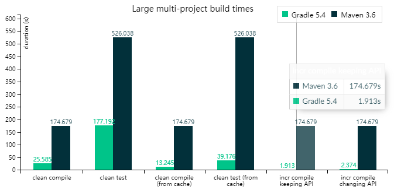
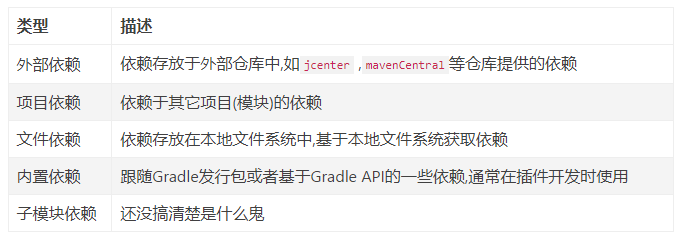
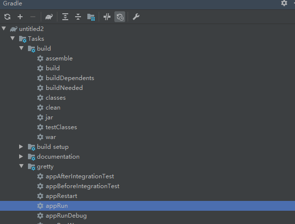
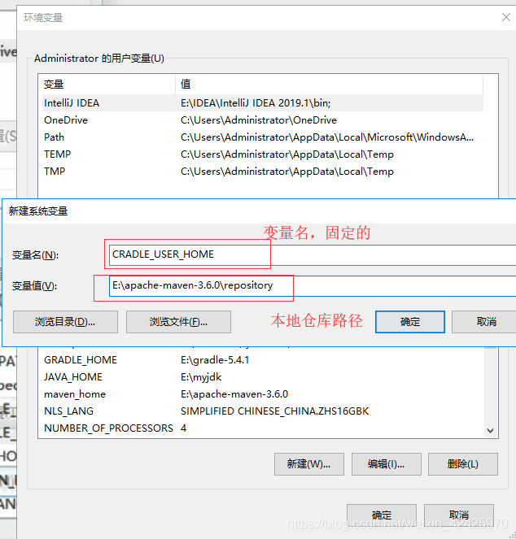
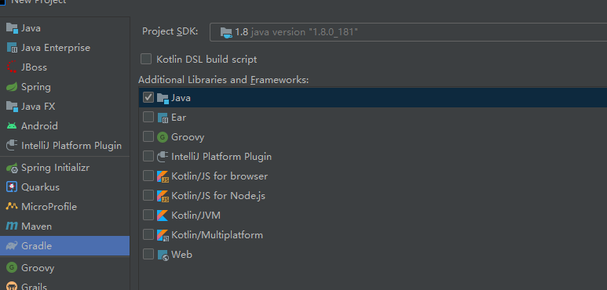
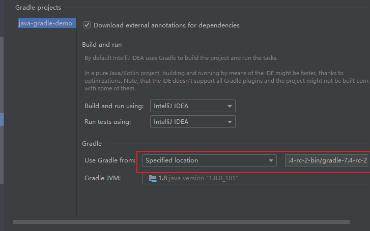
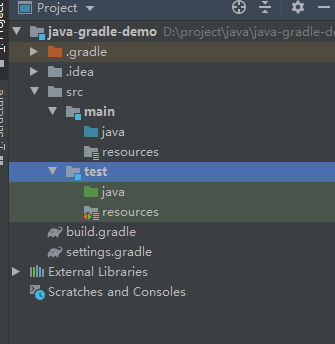

# Gradle

## 参考资料

+ [Gradle idea 安装配置](https://blog.csdn.net/qq_40859560/article/details/129624046?ops_request_misc=&request_id=&biz_id=102&utm_term=gradle%20idea&utm_medium=distribute.pc_search_result.none-task-blog-2~all~sobaiduweb~default-0-129624046.142^v80^insert_down1,201^v4^add_ask,239^v2^insert_chatgpt&spm=1018.2226.3001.4187)
+ [gradle使用教程，一篇就够](https://www.jianshu.com/p/7ccdca8199b8)

## 介绍

### 概念

如果你Maven已经非常熟悉了，可能不太愿意使用gradle，因为貌似没有必要。但是既然gradle出现了，就说明有很多人对Maven还是有一定的意见。因此在这里我来总结一下gradle相比maven的优势。

+ 首先第一点也就是最重要的一点就是**速度**。gradle使用构建缓存、守护进程等方式提高编译速度。结果就是gradle的编译速度要远超maven，平均编译速度比Maven快好几倍，而且项目越大，这个差距就越明显。图中是大型多模块项目Maven和Gradle编译时间的对比，来自gradle官网



+ 第二点就是灵活性，gradle要比Maven灵活太多，虽然有时候灵活并不是一件好事情。但是大部分情况下，灵活一点可以极大的方便我们。Maven死板的XML文件方式做起事情来非常麻烦。很多Maven项目都通过执行外部脚本的方式来完成一些需要灵活性的工作。而在gradle中配置文件就是构建脚本，构建脚本就是编程语言（groovy编程语言），完全可以自给自足，无需外部脚本。
+ 第三点就是gradle DSL带来的简洁性。完成同样的功能，gradle脚本的长度要远远短于maven配置文件的长度。虽然很多人都说XML维护起来不麻烦，但是我觉得，维护一个光是依赖就有几百行的XML文件，不见得就比gradle脚本简单。

也许是因为我上面说的原因，也许有其他原因，不得不承认的一件事情就是gradle作为一个新兴的工具已经有了广泛的应用。spring等项目已经从Maven切换到了gradle。开发安卓程序也只支持gradle了。因此不管是否现在需要将项目从maven切换到gradle，但是至少学习gradle是一件必要的事情。


Gradle是继Maven之后的新一代构建工具，它采用基于groovy的DSL语言作为脚本，相比传统构建工具通过XML来配置而言，最直观上的感受就是脚本更加的简洁、优雅。如果你之前对Maven有所了解，那么可以很轻易的转换到Gradle，它采用了同Maven一致的目录结构，可以与Maven一样使用Maven中央仓库以及各类仓库的资源，并且Gradle默认也内置了脚本转换命令可以方便的将POM转换为gradle.build。

### 标准结构

Gradle遵循COC(convention over configuration约定优于配置)的理念,默认情况下提供了与maven相同的项目结构配置，大体结构如下

```groovy
project root
src/main/java(测试)
src/main/resources
src/test/java(测试源码目录)
src/test/resources(测试资源目录)
src/main/webapp(web工程)
```

### 非标准结构配置

在一些老项目上,可能目录结构并不是标准结构,然而一般开发人员又不好进行结构调整.此时可以通过配置sourceSet来指定目录结构


```groovy
sourceSets {
    main {
        java {
            srcDir 'src/java'
        }
        resources {
            srcDir 'src/resources'
        }
    }
}
```

或者采用如下写法也是可以的

```groovy
sourceSets {
    main.java.srcDirs = ['src/java']
    main.resources.srcDirs = ['src/resources']
}
```

当然如果你的资源目录与源码目录相同这样就比较....了,但你仍然可以按照如下方式搭配include和exclude进行指定

```groovy
sourceSets {
  main {
    java {
      //your java source paths and exclusions go here...
    }

    resources {
      srcDir 'main/resources'
      include '**/*.properties'
      include '**/*.png'


      srcDir 'src'
      include '**/Messages*.properties'
      exclude '**/*.java'
    }
  }
}
```

## 依赖

### 依赖管理

下面来看看gradle的依赖管理功能，这也算是我们使用构建工具的主要目的之一了。这点也是gradle相较maven的优势之一了。相较于maven一大串的XML配置，gradle的依赖项仅需一行。

~~~gradle
dependencies {
    testImplementation 'junit:junit:4.13'
    implementation 'com.google.code.gson:gson:2.8.6'
}
~~~

这里推荐一下Jetbrains的package search网站，是寻找maven和gradle依赖包的最佳网站，可以非常轻松的搜索和使用依赖项。


package search网站

gradle依赖的粒度控制相较于Maven也更加精细，maven只有compile、provided、test、runtime四种scope，而gradle有以下几种scope：

+ implementation，默认的scope。implementation的作用域会让依赖在编译和运行时均包含在内，但是不会暴露在类库使用者的编译时。举例，如果我们的类库包含了gson，那么其他人使用我们的类库时，编译时不会出现gson的依赖。
+ api，和implementation类似，都是编译和运行时都可见的依赖。但是api允许我们将自己类库的依赖暴露给我们类库的使用者。
+ compileOnly和runtimeOnly，这两种顾名思义，一种只在编译时可见，一种只在运行时可见。而runtimeOnly和Maven的provided比较接近。
+ testImplementation，这种依赖在测试编译时和运行时可见，类似于Maven的test作用域。
+ testCompileOnly和testRuntimeOnly，这两种类似于compileOnly和runtimeOnly，但是作用于测试编译时和运行时。

通过简短精悍的依赖配置和多种多样的作用与选择，Gradle可以为我们提供比Maven更加优秀的依赖管理功能。


#### 采用变量统一控制版本号

```groovy
dependencies {
    def bootVersion = "1.3.5.RELEASE"
    compile     "org.springframework.boot:spring-boot-starter-web:${bootVersion}",  
                "org.springframework.boot:spring-boot-starter-data-jpa:${bootVersion}",
                "org.springframework.boot:spring-boot-starter-tomcat:${bootVersion}"
}
```

#### 自动获取最新版本依赖

如果你想某个库每次构建时都检查是否有新版本，那么可以采用+来让Gradle在每次构建时都检查并应用最新版本的依赖。当然也可以采用1.x,2.x的方式来获取某个大版本下的最新版本。

```groovy
dependencies {
    compile     "org.springframework.boot:spring-boot-starter-web:+"
}
```

#### 依赖的坐标

> 仓库中构件（jar包）的坐标是由configurationName "group:name:version:classifier@extension"组成的字符串构成，如同Maven中的GAV坐标，Gradle可借由此来定位你想搜寻的jar包。

在gradle中可以通过以下方式来声明依赖:

```groovy
testCompile group: 'junit', name: 'junit', version: '4.0'
```

### 依赖的分类



#### 外部依赖

可以通过如下方式声明外部依赖，Gradle支持通过map方式或者`g:a:v`的简写方式传入依赖描述，这些声明依赖会去配置的`repository`查找。

```groovy
dependencies {
 // 采用map方式传入单个
  compile group: 'commons-lang', name: 'commons-lang', version: '2.6'
 // 采用map方式传入多个
  compile(
      [group: 'org.springframework', name: 'spring-core', version: '2.5'],
      [group: 'org.springframework', name: 'spring-aop', version: '2.5']
  )
  // 采用简写方式声明
  compile 'org.projectlombok:lombok:1.16.10' 
  // 采用简写方式传入多个 
  compile 'org.springframework:spring-core:2.5',
          'org.springframework:spring-aop:2.5'

}
```

#### 项目依赖

此类依赖多见于多模块项目，书写方式如下，其中`:`是基于跟项目的相对路径描述符。

```groovy
 compile project(':project-foo')
```

#### 文件依赖

依赖存在于本地文件系统中，举个栗子，如oracle的OJDBC驱动，中央仓库中没有又没有自建私服此时需要放到项目lib下进行手工加载那么便可采用此种方式，可以通过`FileCollection`接口及其子接口提供的方法加载这些依赖(支持文件通配符)

```groovy
dependencies {
   // 指定多个依赖
   compile files('hibernate.jar', 'libs/spring.jar')

   // 读取lib文件夹下的全部文件作为项目依赖
   compile fileTree('libs')

   // 根据指定基准目录\包含\排除条件加载依赖
   compile fileTree(dir:'libs',include:'spring*.jar',exclude:'hibernate*.jar')
 }
```

#### 内置依赖

跟随Gradle发行包或者基于Gradle API的一些依赖，通常在插件开发时使用，当前提供了如下三种

```groovy
 dependencies {
   // 加载Gradle自带的groovy作为依赖
   compile localGroovy()

   // 使用Gradle API作为依赖
   compile gradleApi()

   /使用 Gradle test-kit API 作为依赖
   testCompile gradleTestKit()
 }
```

#### 子模块依赖

简单来说就是声明`依赖的依赖`或者`依赖的传递依赖`，一般情况下如果依赖的库并未用构建工具构建（尤其是一些上古时代的老库），那么Gradle是无法透过源文件去查找该库的传递性依赖的，通常而言，一个模块采用XML(POM文 件)来描述库的元数据和它的传递性依赖。Gradle可以借由此方式提供相同的能力，当然这种方式也会可以改写原有的传递性依赖。这里让`druid`连接池依赖了`ptj.tiger`的一个库。

```groovy
dependencies {
    // 让ptj.tiger作为druid的传递性依赖
    compile module("com.alibaba:druid:1.0.26") {
            dependency("cn.pkaq:ptj.tiger:+")
    }

    runtime module("org.codehaus.groovy:groovy:2.4.7") {
        // 停用groovy依赖的commons-cli库的依赖传递
        dependency("commons-cli:commons-cli:1.0") {
            transitive = false
        }
        // 让groovy依赖的ant模块的依赖ant-launcher停用传递性依赖并依赖ant-junit..........
        module(group: 'org.apache.ant', name: 'ant', version: '1.9.6') {
            dependencies "org.apache.ant:ant-launcher:1.9.6@jar",
                         "org.apache.ant:ant-junit:1.9.6"
        }
    }
 }
```


### 传递依赖

传递依赖特性可以轻松地通过transitive参数进行开启或关闭，上面的示例中如果要忽略[com.android.support-v4](https://links.jianshu.com/go?to=http%3A%2F%2Fcom.android.support-v4)的传递性依赖可以采用指定 transitive = false 的方式来关闭依赖传递特性，也可以采用添加@jar的方式忽略该依赖的所有传递性依赖。

```groovy
 compile('com.android.support:support-v4:23.1.1'){
        transitive = false
 }
```

```groovy
 compile 'com.android.support:support-v4:23.1.1'@jar
```

当然,你也可以全局性的关闭依赖的传递特性。

```groovy
 configurations.all {
   transitive = false
}
```


### 排除依赖

有些时候你可能需要排除一些传递性依赖中的某个模块，此时便不能靠单纯的关闭依赖传递特性来解决了。这时exclude就该登场了，如果说@jar彻底的解决了传递问题，那么exclude则是部分解决了传递问题。然而实际上exclude肯能还会用的频率更更频繁一些，比如下面几种情况。

可以通过configuration配置或者在依赖声明时添加exclude的方式来排除指定的引用。

exclude可以接收group和module两个参数，这两个参数可以单独使用也可以搭配使用，具体理解如下:

```groovy
compile('com.github.nanchen2251:CompressHelper:1.0.5'){
        //com.android.support:appcompat-v7:23.1.1
        exclude group: 'com.android.support'//排除组织依赖
        exclude module: 'appcompat-v7'//排除模块依赖
 }
```

### 强制使用版本

当然，有时候你可能仅仅是需要强制使用某个统一的依赖版本，而不是排除他们，那么此时force就该登场了。指定force = true属性可以冲突时优先使用该版本进行解决。

```groovy
compile('com.github.nanchen2251:CompressHelper:1.0.5'){
        force = true
 }
```

全局配置强制使用某个版本的依赖来解决依赖冲突中出现的依赖

```groovy
configurations.all {
   resolutionStrategy {
       force 'com.github.nanchen2251:CompressHelper:1.0.5'
   }
}
```

另一个例子

```groovy
//解决冲突 同一版本
configurations.all {
    resolutionStrategy.eachDependency { DependencyResolveDetails details ->
        def requested = details.requested
        if (requested.group == 'com.android.support') {
            if (requested.name.startsWith("support-")||
                    requested.name.startsWith("animated")||
                    requested.name.startsWith("cardview")||
                    requested.name.startsWith("design")||
                    requested.name.startsWith("gridlayout")||
                    requested.name.startsWith("recyclerview")||
                    requested.name.startsWith("transition")||
                    requested.name.startsWith("appcompat")) {
                details.useVersion '25.0.0'
            }
        }
    }
}
```


## 任务和插件

gradle的配置文件是一个groovy脚本文件，在其中我们可以以编程方式自定义一些构建任务。因为使用了编程方式，所以这带给了我们极大的灵活性和便捷性。打个比方，现在有个需求，要在打包出jar的时候顺便看看jar文件的大小。在gradle中仅需在构建脚本中编写几行代码即可。而在Maven中则需要编写Maven插件，复杂程度完全不在一个水平。

当然，Maven发展到现在，已经存在了大量的插件，提供了各式各样的功能可以使用。但是在灵活性方面还是无法和Gradle相比。而且Gradle也有插件功能，现在发展也十分迅猛，存在了大量非常好用的插件，例如gretty插件。gretty原来是社区插件，后来被官方吸收为官方插件，可以在Tomcat和jetty服务器上运行web项目，比Maven的相关插件功能都强大。

虽然gradle可以非常灵活的编写自定义脚本任务，但是其实一般情况下我们不需要编写构建脚本，利用现有的插件和任务即可完成相关功能。在IDEA里，也可以轻松的查看当前gradle项目中有多少任务，基本任务如build、test等Maven和Gradle都是相通的。




## 基本使用

### 历程

1. 2000年使用Ant
2. 2004年使用maven
3. 2012年基于ant盒maven产生么Gradle

Gradle的特点是抛弃了Xml的各种繁琐配置，面向Java应用为主，基于Groovy语言进行编排

### 流程

1. 安装
2. 与idea集成
3. Groovy语言简单链接
4. Gradle仓库
5. Gradle入门案例
6. Gradle创建Java Web应用，并在tomcat下运行
7. Gradle创建多模块应用

### 安装

下载地址：[https://services.gradle.org/distributions/]


环境变量


测试：打开cmd，输入gradle -v，测试下安装成功了没


### 使用本地maven仓库的jar包

1. 找到本地maven仓库

   根据实际情况，复制自己的本地maven仓库地址

   

2. 配置环境变量

   我的电脑 -> 右键 -> 属性 -> 高级系统设置 -> 环境变量

   新建环境变量 GRADLE_USER_HOME 值是复制的本地资源仓库的路径（注意：环境变量名是固定的，必须这样写）

   

   

3. 修改配置build.[gradle](https://so.csdn.net/so/search?q=gradle&spm=1001.2101.3001.7020)

~~~groovy
   /**
    * 指定所使用的仓库，mavenCentral()表示使用中央仓库，
    * 此刻项目中所需要的jar包都会默认从中央仓库下载到本地指定目录
    * 配置mavenLocal()表示引入jar包的时候，先从本地仓库中找，没有再去中央仓库下载
    */
   repositories {
       mavenLocal()
       mavenCentral()
   }
~~~

   

### 配置镜像

在gradle中配置下载镜像需要在.gradle文件夹中直接新建一个init.gradle初始化脚本，脚本文件内容如下。这样一来，gradle下载镜像的时候就会使用这里配置的镜像源下载，速度会快很多。再加上gradle wrapper在中国设置了CDN，现在使用gradle的速度应该会很快。

~~~groovy
allprojects {
   repositories {
       maven {
           url "https://maven.aliyun.com/repository/public"
       }
       maven {
           url "https://maven.aliyun.com/repository/jcenter"
       }
       maven {
           url "https://maven.aliyun.com/repository/spring"
       }
       maven {
           url "https://maven.aliyun.com/repository/spring-plugin"
       }
       maven {
           url "https://maven.aliyun.com/repository/gradle-plugin"
       }
       maven {
           url "https://maven.aliyun.com/repository/google"
       }
       maven {
           url "https://maven.aliyun.com/repository/grails-core"
       }
       maven {
           url "https://maven.aliyun.com/repository/apache-snapshots"
       }
   }
}
~~~

当然，如果你有代理的话，其实我推荐你直接为gradle设置全局代理。因为gradle脚本实在是太灵活了，有些脚本中可能依赖了github或者其他地方的远程脚本。这时候上面设置的下载镜像源就不管用了。

所以有条件还是干脆直接使用全局代理比较好。设置方式很简单，在.gradle文件夹中新建gradle.properties文件，内容如下。中间几行即是设置代理的配置项。当然其他几行我也建议你设置一下，把gradle运行时的文件编码设置为UTF8，增加跨平台兼容性。

~~~groovy
org.gradle.jvmargs=-Xmx4g -XX:MaxPermSize=512m -XX:+HeapDumpOnOutOfMemoryError -Dfile.encoding=UTF-8
systemProp.http.proxyHost=127.0.0.1
systemProp.http.proxyPort=10800
systemProp.https.proxyHost=127.0.0.1
systemProp.https.proxyPort=10800
systemProp.file.encoding=UTF-8
org.gradle.warning.mode=all
~~~


### 新建项目

1. 选择Gradle



2. 配置Idea的Gradle



3. Gradle的项目结构



4. 问题记录：Could not find method testCompile() for arguments

   ​	最近在学习gradle，我使用的是ide的gradle创建的java项目，ide的gradle是很老的版本，需要修改 testImplementation

~~~groovy
   dependencies {
       testImplementation group: 'junit', name: 'junit', version: '4.12'
   }
~~~


5. 配置文件（因为版本的不同，所以Gradle的配置会有一些差异）

~~~groovy
   plugins {
       id 'java'
   }
   
   sourceCompatibility = 1.8
   
   group 'org.example'
   version '1.0-SNAPSHOT'
   
   /**
    * 指定仓库的路径
    */
   repositories {
       /**
        * 表示使用中央仓库，mavenCentral()表示从中央仓库中下载到本地
        */
       mavenLocal()
       mavenCentral()
   }
   
   /**
    * 所有的jar包坐标，都在如下中进行配置
    * 每个坐标包含三个元素：group、name、version
    * testImplementation 在测试的时候起作用，相当于是作用域
    */
   dependencies {
       testImplementation group: 'junit', name: 'junit', version: '4.12'
       implementation group: 'org.springframework', name: 'spring-context', version: '5.3.15'
       implementation group: 'org.wso2.identity.apps', name: 'org.wso2.identity.apps.common.server.feature', version: '1.2.786', ext: 'pom'
   }
   
~~~

   


## 基本语法

### 简单使用

~~~
println "hello"  打印

def i=19
println i

def list = ['a','b']
list<<'c'
println list.get(2)


def map = ['key1':'value1']
map.key2 = 'value2'
println map.get('key2')
~~~


### 闭包

闭包就是一段代码块，主要是包闭包当成参数来使用

如一：

~~~groovy
 def b1 = {
    println "hello bi"
}

def method (Closure closure){
    closure()
}

method(b1)
~~~

如二：

~~~groovy
def b2 = {
    v ->
        println "hello ${v}"
}

def method(Closure closure){
    closure("xiao");
}


method(b2)

~~~


