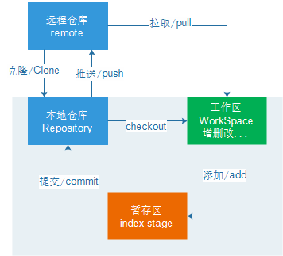
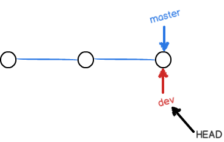
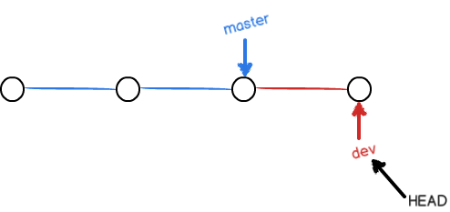

# GIT

## 版本控制

在介绍Git之前，我们先了解一下什么是版本控制，具体可参考一下文章

+ [版本控制](https://blog.csdn.net/ThinkWon/article/details/101449228)

## 概述

### 历史（了解即可）

​		同生活中的许多伟大事件一样，Git 诞生于一个极富纷争大举创新的年代。Linux 内核开源项目有着为数众广的参与者。绝大多数的 Linux 内核维护工作都花在了提交补丁和保存归档的繁琐事务上（1991－2002年间）。到 2002 年，Linux系统已经发展了十年了，代码库之大让Linus很难继续通过手工方式管理了，于是整个项目组开始启用分布式版本控制系统 BitKeeper 来管理和维护代码。

​		到 2005 年的时候，开发 BitKeeper 的商业公司同 Linux 内核开源社区的合作关系结束，他们收回了免费使用 BitKeeper 的权力。这就迫使 Linux 开源社区（特别是 Linux的缔造者 Linus Torvalds ）不得不吸取教训，只有开发一套属于自己的版本控制系统才不至于重蹈覆辙。他们对新的系统订了若干目标：

+ 速度
+ 简单的设计
+ 对非线性开发模式的强力支持（允许上千个并行开发的分支）
+ 完全分布有能力高效管理类似 Linux 内核一样的超大规模项目（速度和数据量）

### 基本概念

**Git**是一款免费、开源的**分布式版本控制系统**，用于敏捷高效地处理任何或小或大的项目。

Git是一个开源的分布式版本控制系统，可以有效、高速的处理从很小到非常大的项目版本管理。Git 是 Linus Torvalds 为了帮助管理 Linux 内核开发而开发的一个开放源码的版本控制软件。

[官网地址](https://git-scm.com/)

### 特点

**优点**：

+ 适合分布式开发，强调个体；
+ 公共服务器压力和数据量都不会太大
+ 速度快、灵活；
+ 任意两个开发者之间可以很容易的解决冲突；
+ 离线工作。

**缺点**：

+ 代码保密性差，一旦开发者把整个库克隆下来就可以完全公开所有代码和版本信息；
+ 权限控制不友好；如果需要对开发者限制各种权限的建议使用SVN。

## 工作流程

一般工作流程如下：

1. 从远程仓库中克隆 Git 资源作为本地仓库；
2. 从本地仓库中checkout代码然后进行代码修改；
3. 在提交本地仓库前先将代码提交到暂存区；
4. 提交修改，提交到本地仓库；本地仓库中保存修改的各个历史版本；
5. 在需要和团队成员共享代码时，可以将修改代码push到远程仓库。

Git 的工作流程图如下：


## 核心概念

### 工作区、暂存区、版本库、远程仓库

Git和其他版本控制系统如SVN的一个不同之处就是有暂存区的概念。



+ **Workspace**： 工作区，就是你平时存放项目代码的地方
+ **Index / Stage**： 暂存区，用于临时存放你的改动，事实上它只是一个文件，保存即将提交到文件列表信息
+ **Repository**： 仓库区（或版本库），就是安全存放数据的位置，这里面有你提交到所有版本的数据。其中HEAD指向最新放入仓库的版本
+ **Remote**： 远程仓库，托管代码的服务器，可以简单的认为是你项目组中的一台电脑用于远程数据交换

### 分支

+ 每次的提交Git都把它们串成一条时间线，这条时间线就是一个分支。截止到目前，只有一条时间线，在Git里这个分支叫主分支，即master分支。HEAD指针严格来说不是指向提交，而是指向master，master才是指向提交的。
+ 一开始的时候，master分支是一条线，Git用master指向最新的提交，再用HEAD指向master，就能确定当前分支，以及当前分支的提交点：
+ 每次提交，master分支都会向前移动一步，这样随着不断提交，master分支的线也越来越长。
+ 当我们创建新的分支，例如dev时，Git新建了一个指针叫dev，指向master相同的提交，再把HEAD指向dev，就表示当前分支在dev上：



+ Git创建一个分支很快，因为除了增加一个dev指针，改改HEAD的指向，工作区的文件都没有任何变化！
+ 不过切换到了dev分，对工作区的修改和提交就是针对dev分支了，比如新提交一次后，dev指针往前移动一步，而master指针不变：



+ 假如我们在dev上的工作完成了，就可以把dev合并到master上。Git怎么合并呢？最简单的方法，就是直接把master指向dev的当前提交，就完成了合并：
+ 所以Git合并分支也很快！就改改指针，工作区内容也不变！
+ 合并完分支后，甚至可以删除dev分支。删除dev分支就是把dev指针给删掉，删掉后就剩下了一条master分支：


### 远程仓库

远程仓库分为公有远程仓库和私有远程仓库。

#### 公有远程仓库

本质和本地仓库无异，只是这个仓库①不在本地②大家可能都知道③需要将代码共享到远程仓库④可以被其他人克隆同步代码等。

一般情况下在企业中会有一个搭建在公司的远程仓库，可以让本公司内部的开发人员同步开发。而业界最富盛名的远程仓库则为github；它上面存放了非常多的开源组织、个人、企业等的开放源码库，任何都可以从上面获取源码。

#### 私有远程仓库

远程仓库实际上和本地仓库一样，纯粹为了7x24小时开机并交换大家的修改。GitHub就是一个免费托管开源代码的远程仓库。但是对于某些视源代码如生命的商业公司来说，既不想公开源代码，又舍不得给GitHub交保护费，那就只能自己搭建一台Git服务器作为私有仓库使用。

#### GitHub远程仓库

在本地创建了一个Git仓库，又想让其他人来协作开发，此时就可以把本地仓库同步到远程仓库，同时还增加了本地仓库的一个备份。

常用的远程仓库就是github：https://github.com/

Github支持两种同步方式“https”和“ssh”。如果使用https很简单基本不需要配置就可以使用，但是每次提交代码和下载代码时都需要输入用户名和密码。而且如果是公司配置的私有git服务器一般不提供https方式访问。


### 忽略文件

在工程中，并不是所有文件都需要保存到版本库中的，例如“target”目录及目录下的文件就可以忽略。

Git忽略文件详解可参考[Git忽略文件.gitignore详解](https://blog.csdn.net/ThinkWon/article/details/101447866)

## 常用Git命令

经常使用 Git ，但是很多命令还是记不住。但要熟练掌握，恐怕要记住40~60个命令，所以整理了一份常用Git命令清单。可以参考[常用Git命令](https://blog.csdn.net/ThinkWon/article/details/101450420)

```
1. git init # 初始化仓库
2. git add .(文件name) # 添加文件到暂存区
3. git commit -m "first commit" # 添加文件到本地仓库并提交描述信息
4. git remote add origin 远程仓库地址 # 链接远程仓库，创建主分支
5. git pull origin master --allow-unrelated-histories # 把本地仓库的变化连接到远程仓库主分支
6. git push -u origin master # 把本地仓库的文件推送到远程仓库
```

~~~bash

查看所有本地分支：git branch
查看所有远程分支：git branch -r
查看所有本地和远程分支：git branch -a


# 在本地当前分支的基础上，新建一个新分支

# 如果觉得之前的分⽀名不合适，可以为新建的分⽀重命名，重命名分⽀名为 daily/0.0.1
git branch -m daily/0.0.0 daily/0.0.1

# 切换并新增分支
git checkout -b 8.24


# 切换分支。
git checkout 9.1


# 撤销工作区修改(尚未add，尚未commit)
git checkout -- readme.txt

# 删除本地分支
git branch -d 分支名 

撤销暂存区修改(已经add，尚未commit)
git reset HEAD readme.txt, 再git checkout -- readme.txt

# 添加分支
# create a new repository on the command line
git branch -M main
git remote add origin https://github.com/krest32/git-flow.git
git push -u origin main

# 删除分支
git branch -d <local_branch>

# push an existing repository from the command line
git remote add origin https://github.com/krest32/git-flow.git
git branch -M main
git push -u origin main


# git pull时可以加上--rebase参数, 使之不产生Merge点, 保证了代码的整洁,
git pull –rebase

# git config
git config user.name gafish
git config user.email gafish@qqqq.com

# 查看文件 本地仓库的文件 修改的文件 新增的文件
git status 

# 添加文件到本地仓库
git add

# “文件路径”，不删除物理文件，仅将该文件从缓存中删除；
git rm --cached xxx
# “文件路径”，不仅将该文件从缓存中删除，还会将物理文件删除（不会回收到垃圾桶）。
git rm --f 


# 存储代码
git stash
# 查看存储代码
git stash list 
# 使用存储
git stash apply n


# commit 回退
git log --pretty=oneline
# 回退并且删除改动代码
git reset --hard 提交id
# 回退但是不删除改动代码
# HEAD^的意思是上一个版本，也可以写成HEAD~1
# 如果你进行了2次commit，想都撤回，可以使用HEAD~2
git reset --soft HEAD^
~~~


# 对比SVN

SVN是**集中式版本控制系统**，而Git是**分布式版本控制系统**，Git与SVN的区别可参考[Git与SVN的区别](

## SVN

​		SVN是集中式版本控制系统，版本库是集中放在中央服务器的，而干活的时候，用的都是自己的电脑，所以首先要从中央服务器哪里得到最新的版本，然后干活，干完后，需要把自己做完的活推送到中央服务器。集中式版本控制系统是必须联网才能工作，如果在局域网还可以，带宽够大，速度够快，如果在互联网下，如果网速慢的话，就郁闷了;

集中管理方式在一定程度上看到其他开发人员在干什么，而管理员也可以很轻松掌握每个人的开发权限。

但是相较于其优点而言，集中式版本控制工具缺点很明显：

1. 服务器单点故障
2. 容错性差


## SVN的区别

​		Git不仅仅是个版本控制系统，它也是个内容管理系统(CMS),工作管理系统等。如果你是一个具有使用SVN背景的人，你需要做一定的思想转换，来适应Git提供的一些概念和特征。

Git 与 SVN 区别点：

1. Git是分布式的，SVN不是：这是Git和其它非分布式的版本控制系统，例如SVN，CVS等，最核心的区别。 Git把内容按元数据方式存储，而SVN是按文件：所有的资源控制系统都是把文件的元信息隐藏在一个类似.svn,.cvs等的文件夹里。
2. Git分支和SVN的分支不同：分支在SVN中一点不特别，就是版本库中的另外的一个目录。
3. Git没有一个全局的版本号，而SVN有：目前为止这是跟SVN相比GIT缺少的最大的一个特征。
4. Git的内容完整性要优于SVN：Git的内容存储使用的是SHA-1哈希算法。这能确保代码内容的完整性，确保在遇到磁盘故障和网络问题时降低对版本库的破坏。
