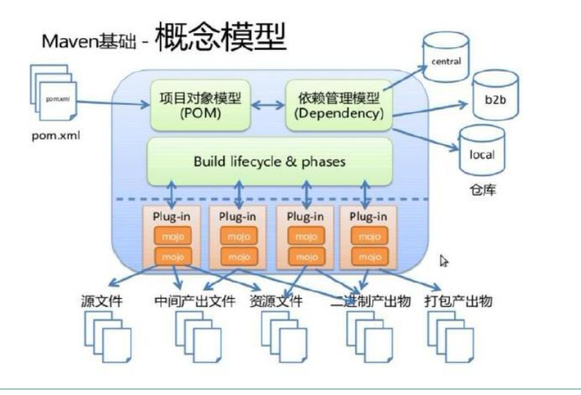
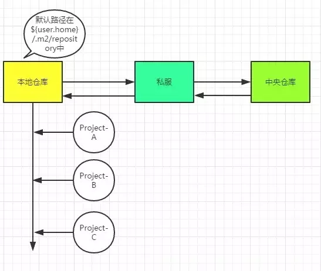
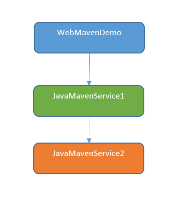
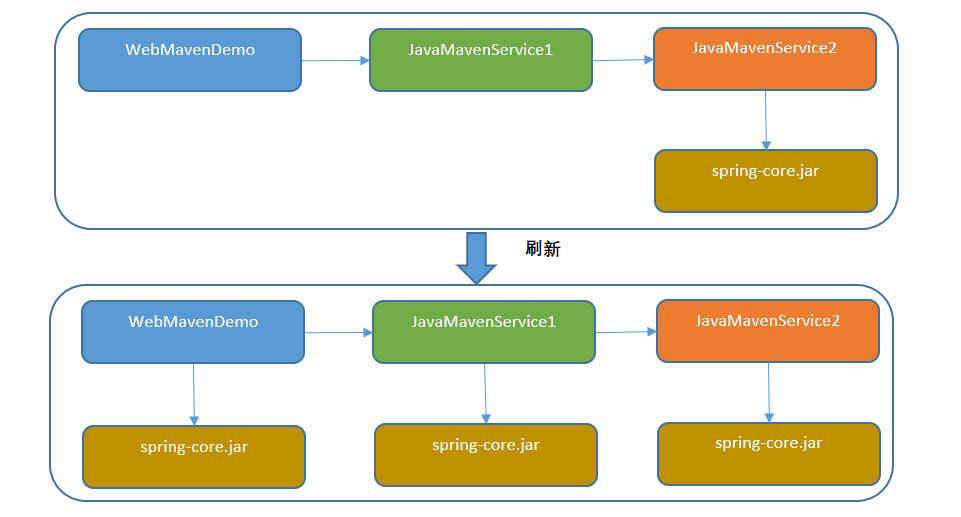
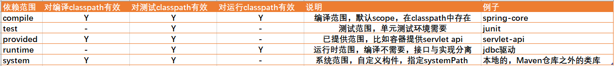

# Maven

## 前言

​		在Java项目开发中，项目的编译、测试、打包等是比较繁琐的，属于重复劳动的工作，浪费人力和时间成本。以往开发项目时，程序员往往需要花较多的精力在引用jar包搭建项目环境上，跨部门甚至跨人员之间的项目结构都有可能不一样。Maven的仓库管理、依赖管理、继承和聚合等特性为项目的构建提供了一整套完善的解决方案。

## 什么是Maven

​		介绍中我们可以看到Apache Maven是一个项目管理工具，它基于项目对象模型(POM)的概念，通过一小段描述信息来管理项目的构建、报告和文档。

## Maven的作用

传统方式管理jar包依赖的问题：

1. jar包冲突
2. jar包依赖
3. jar包体积过大
4. jar包在不同阶段无法个性化配置

使用maven方式管理jar包依赖的好处：

1. 解决jar包冲突
2. 解决jar包依赖问题
3. jar包不用再每个项目保存，只需要放在仓库即可
4. maven可以指定jar包的依赖范围

## Maven标准目录结构

若要使用Maven，那么项目的目录结构必须符合Maven的规范，其目录结构如下：

```bash
project
	src
		main	项目主代码和资源
			java	项目的Java源代码
			resources	项目的资源文件
			webapp	web项目资源文件(可无)
		test	单元测试代码和资源
			java	测试的Java源代码
			resources	测试的资源文件(可无)
			
	target		打包输出目录(可无)
		classes	编译输出目录
		test-classes	测试编译输出目录
		
	pom.xml	
```

## 生命周期

1. **核心功能**：一件构建
2. 项目构建一般有5个过程（**默认生命周期**）
   1. 编译：`mvn compile`
   2. 测试：`mvn test `（包含了compile的命令）
   3. 打包:   `mvn packeage `（包含了test compile的命令）
   4. 安装:   `mvn install` （包含了test compile package 命令）
   5. 发布:   `mvn deploy`（执行前，需要对项目进行一些配置，同时执行mvn clean，用来清除之前的测试配置信息）
3. 所以maven的生命周期就是上面的几个过程

## Maven 概念模型图

1. POM.xml 有三类信息：项目自身信息、项目依赖信息（导入的Jar包信息）、运行环境信息（jdk、tomcat）
2. 依赖管理模型

3. 一键构建
   1. 默认生命周期：compile、test、 package、install、deploy
   2. 每一个够将项目的命令都对应了Maven底层的一个插件

## Maven的几个核心概念

### POM：

​		POM(Project Object Model)项目对象模型，一个项目所有的配置都放在POM文件中：定义项目的类型、名字、管理依赖关系，定制插件的行为等等。Maven通过pom.xml文件来管理依赖和管理项目的构建生命周期，而项目构建的生命周期是依靠一个个的插件完成的。



### Maven仓库

​		Maven管理资源的位置。仓库里面包含依赖（jar包）和插件（plug-in）。Maven仓库分为本地仓库和远程仓库，而远程仓库又包括私服和中央仓库。

​		Maven仓库 ----本地仓库 ----远程仓库 --------私服 --------中央仓库 --------其他公共库

#### 本地仓库

用户自己电脑上的仓库，直接从本地获取。

##### 私服

​		私服是一种特殊的远程仓库，搭建在局域网内的仓库，私服代理广域网的仓库，提供给局域网内的用户使用，可用减少局域网内的用户与外界仓库的传输，每一个jar包只需要拉取一次就可以提供给局域网内所有的用户使用，并且也更加稳定。

##### 中央仓库

​		Maven官方提供的远程仓库，里面拥有最全的jar包资源，Maven首先从本地仓库中寻找项目所需的jar包，若本地仓库没有，再到Maven的中央仓库下载所需jar包。地址是：http://repo1.maven.org/maven2/。



### 坐标

在Maven中，坐标是jar包的唯一标识，Maven通过坐标在仓库中找到项目所需的jar包。

```xml
<dependency>
    <groupId>org.springframework.boot</groupId>
    <artifactId>spring-boot-starter-web</artifactId>
    <version>2.1.6.RELEASE</version>
</dependency>
```

`groupId`、`artifactId`、`versioin`简称GAV(Maven坐标)，是用来唯一标识jar包的。

- `groupId`：公司或组织域名倒序
- `artifactId`：模块名
- version：版本号
- packaging：项目的打包方式(`pom`/`jar`/`war`，默认jar)

最新最全的Maven依赖项版本查询网站：`http://mvnrepository.com/`

**Maven工程的坐标与仓库中路径的关系：**

Maven坐标和仓库对应的映射关系：

```
[groupId][artifactId][version][artifactId]-[version].jar
```

对应本地仓库目录：

```
org\springframework\spring-core\4.3.4.RELEASE\spring-core-4.3.4.RELEASE.jar
```

### 依赖传递

​		如果我们的项目引用了一个Jar包，而该Jar包又引用了其他Jar包，那么在默认情况下项目编译时，Maven会把直接引用和简洁引用的Jar包都下载到本地。

​		传递性依赖机制能够大大的简化依赖声明，而且大部分情况下我们只需要关心项目的直接依赖是什么，而**不用考虑这些直接依赖会引入什么传递性依赖**，但是当出现冲突了，则需要很清楚传递性依赖是从什么依赖路径引入的。



`WebMavenDemo`项目依赖`JavaMavenService1`，`JavaMavenService1`项目依赖`JavaMavenService2`

`pom.xml`文件配置好依赖关系后，必须首先`mvn install`后，依赖的jar包才能使用。

- `WebMavenDemo的pom.xml`文件想能编译通过，`JavaMavenService1`必须`mvn install`
- `JavaMavenService`的`pom.xml`文件想能编译通过，`JavaMavenService2`必须`mvn install`



为`JavaMavenService2`中增加了一个`spring-core.jar`包后，会惊喜的发现依赖的两个项目都自动的增加了这个jar包，这就是依赖的传递性。

> 注意：非compile范围的依赖是不能传递的。

### 依赖冲突

Maven依赖规则和怎么解决依赖冲突问题可以参考[Maven依赖冲突](https://blog.csdn.net/ThinkWon/article/details/101483020)

- [路径相同先声明优先](https://blog.csdn.net/ThinkWon/article/details/101483020#_11)
- [统一管理依赖的版本](https://blog.csdn.net/ThinkWon/article/details/101483020#_21)

### 依赖范围

依赖范围就是控制依赖在不同阶段的作用。**不同的依赖会使用不同的classpath**，在Maven中依赖的域有这几个：import、provided、runtime、compile、system、test。默认取值为compile。



### 可选依赖和依赖排除

#### 可选依赖

```xml
<dependency>
    <groupId>org.springframework.boot</groupId>
    <artifactId>spring-boot-starter-web</artifactId>
    <version>2.1.6.RELEASE</version>
    <!-- 不可以向下传递依赖 -->
    <optional>true</optional>
</dependency>
```

在导入一个依赖的时候，是否需要把这个依赖向下传递

false：可以向下传递（默认值）

true：不可以向下传递

#### 排除依赖

如果我们只想下载直接引用的Jar包，那么需要在pom.xml中做如下配置：(将需要排除的Jar包的坐标写在中)

```xml
<dependency>  
    <groupId>org.springframework.boot</groupId>  
    <artifactId>spring-boot-starter-web</artifactId>  
    <!-- 去掉springboot默认配置的logback依赖 -->  
    <exclusions>
        <exclusion>  
            <groupId>org.springframework.boot</groupId>  
            <artifactId>spring-boot-starter-logging</artifactId>  
        </exclusion>  
    </exclusions>  
</dependency> 
```

### 聚合

1. 什么是聚合？

   将多个项目同时运行就称为聚合。聚合的作用，是为了简化构建项目的过程。一次性构建多个项目！

2. 如何实现聚合？

   只需在pom中作如下配置即可实现聚合

```xml
<modules>
	<module>nacos-config-example</module>
	<module>nacos-discovery-example</module>
	<module>nacos-gateway-example</module>
</modues>
```

### 继承

1. 什么是继承？

   在聚合多个项目时，如果这些被聚合的项目中需要引入相同的Jar，那么可以将这些Jar写入父pom中，各个子项目继承该pom即可。

   继承的作用，为了简化pom.xml配置，简化groupId，artifactId， version ，还可以锁定子工程依赖版本。

2. 如何实现继承？

- 父pom配置：将需要继承的Jar包的坐标放入标签即可。

```xml
<dependencyManagement>
    <dependencies>
        <dependency>
            <groupId>com.google.guava</groupId>
            <artifactId>guava</artifactId>
            <version>28.0-jre</version>
        </dependency>
    </dependencies>
</dependencyManagement>
```

- 子pom配置：

```xml
<parent>
    <groupId>父pom所在项目的groupId</groupId>
    <artifactId>父pom所在项目的artifactId</artifactId>
    <version>父pom所在项目的版本号</version>
</parent>
```

### 生命周期

Maven有三套相互独立的生命周期，请注意这里说的是“三套”，而且“相互独立”，初学者容易将Maven的生命周期看成一个整体，其实不然。这三套生命周期分别是：

**① Clean Lifecycle 在进行真正的构建之前进行一些清理工作。** Clean生命周期一共包含了三个阶段：

- pre-clean 执行一些需要在clean之前完成的工作
- clean 移除所有上一次构建生成的文件
- post-clean 执行一些需要在clean之后立刻完成的工作

**② Default Lifecycle 构建的核心部分，编译，测试，打包，部署等等。**

- validate
- generate-sources
- process-sources
- generate-resources
- process-resources 复制并处理资源文件，至目标目录，准备打包
- compile 编译项目的源代码
- process-classes
- generate-test-sources
- process-test-sources
- generate-test-resources
- process-test-resources 复制并处理资源文件，至目标测试目录
- test-compile 编译测试源代码
- process-test-classes
- test 使用合适的单元测试框架运行测试。这些测试代码不会被打包或部署
- prepare-package
- package 接受编译好的代码，打包成可发布的格式，如 JAR
- pre-integration-test
- integration-test
- post-integration-test
- verify
- install 将包安装至本地仓库，以让其它项目依赖。
- deploy 将最终的包复制到远程的仓库，以让其它开发人员与项目共享

**总结**：不论你要执行生命周期的哪一个阶段，maven都是从这个生命周期的开始执行

**插件**：每个阶段都有插件（plugin）。插件的职责就是执行它对应的命令。

**③ Site Lifecycle 生成项目报告，站点，发布站点。**

- pre-site 执行一些需要在生成站点文档之前完成的工作
- site 生成项目的站点文档
- post-site 执行一些需要在生成站点文档之后完成的工作，并且为部署做准备
- site-deploy 将生成的站点文档部署到特定的服务器上

## Maven常用操作

### 手动安装Maven依赖

像Oracle驱动包在Maven中心仓库是找不到的，需要到Oracle官网下载，然后手动安装Maven依赖，具体操作可以参考[手动安装Maven依赖](https://blog.csdn.net/ThinkWon/article/details/101483478)

### 部署jar包到远程仓库

部署jar包到远程仓库主要包括两个部分：远程仓库认证，部署jar包到远程仓库

具体操作可以参考[Maven部署jar包到远程仓库](https://blog.csdn.net/ThinkWon/article/details/101483769)

### 构建多模块Maven项目

#### `dependencyManagement`

在项目开发过程中，有时一个项目下面包含了几个子模块，在多模块的情况，`POM`的配置应该要注意写什么呢？我们通过一个例子来说明下。 有这样一个工程，里面有A模块、B模块和C模块，A模块需要引入`junit`和`log4j`库，配置如下：

```xml
<dependency>
    <groupId>junit</groupId>
    <artifactid>junit</artifactId>
    <version>4.11</version>
</dependency>
<dependency>
    <groupId>log4j</groupId>
    <artifactid>log4j</artifactId>
    <version>1.2.16</version>
</dependency>
```

此时B模块也需要引入这两个库，配置如下：

```xml
<dependency>
    <groupId>junit</groupId>
    <artifactid>junit</artifactId>
    <version>4.12</version>
    <scope>test</scope>
</dependency>
<dependency>
    <groupId>log4j</groupId>
    <artifactid>log4j</artifactId>
    <version>1.2.17</version>
</dependency>
```

​		会发现A模块和B模块对`junit`和`log4j`库依赖的版本是不同的，出现这种情况是十分危险的，因为依赖不同版本的库可能会造成很多未知的风险。怎么解决不同模块之间对同一个库的依赖版本一样呢？Maven提供了优雅的解决办法，使用继承机制以及`dependencyManagement`元素来解决这个问题。 如果你在父模块中配置dependencies，那么所有的子模块都自动继承，不仅达到了依赖一致的目的，还省了大段的代码，但这样来做会存在问题的。比如B模块需要`spring-aop`模块，但是C模块不需要`spring-aop`模块，如果用dependencies在父类中统一配置，C模块中也会包含有`spring-aop`模块，不符合我们的要求。但是用`dependencyManagement`就没有这样的问题。`dependencyManagement`只会影响现有依赖的配置，但不会引入依赖。*这样我们在父模块中的配置可以更改为如下所示：

```xml
<!-- dependencyManagement只会影响现有依赖的配置，但不会引入依赖。 -->
<dependencyManagement>
    <dependencies>
        <dependency>
            <groupId>junit</groupId>
            <artifactId>junit</artifactId>
            <version>4.12</version>
            <scope>test</scope>
        </dependency>
        <dependency>
            <groupId>log4j</groupId>
            <artifactId>log4j</artifactId>
            <version>1.2.17</version>
        </dependency>
    </dependencies>
</dependencyManagement>
```

这段配置不会给任何子模块引入依赖，如果某个子模块需要`junit`和`log4j`，只需要这样配置即可：

```xml
<dependencies>
    <dependency>
        <groupId>junit</groupId>
        <artifactId>junit</artifactId>
    </dependency>
    <dependency>
        <groupId>log4j</groupId>
        <artifactId>log4j</artifactId>
    </dependency>
</dependencies>
```

**在多模块Maven项目中，使用`dependencyManagement`能够有效地帮我们维护依赖一致性。**

#### `pluginManagement`

上面介绍了在多模块中对依赖库的管理，接下来介绍下对插件的管理。与`dependencyManagement`类似，我们可以使用`pluginManagement`元素管理插件。一个常见的用法就是我们希望项目所有模块的使用compiler插件的时候，都是用`jdk1.8`，以及指定Java源文件编码为`UTF-8`，这时可以在父模块的`POM`中如下配置`pluginManagement`：

```xml
<build>
    <pluginManagement>
        <plugins>
            <plugin>
                <groupId>org.apache.maven.plugins</groupId>
                <artifactId>maven-compiler-plugin</artifactId>
                <version>3.8.1</version>
                <configuration>
                    <source>1.8</source>
                    <target>1.8</target>
                    <encoding>UTF-8</encoding>
                </configuration>
            </plugin>
        </plugins>
    </pluginManagement>
</build>
```

这段配置会被应用到所有子模块的compiler插件中，因为Maven内置了compiler插件与生命周期的绑定，因此子模块不需要任何`maven-compiler-plugin`的配置了。

## Maven常用命令

| 命令        | 说明                                                         |
| ----------- | ------------------------------------------------------------ |
| mvn clean   | 清除原来的编译结果                                           |
| mvn compile | 编译                                                         |
| mvn test    | 运行测试代码，mvn test -`Dtest`=类名 //单独运行测试类        |
| mvn package | 打包项目，mvn package -`Dmaven.test.skip`=true //打包时不执行测试 |
| mvn install | 将项目打包并安装到本地仓库                                   |
| mvn deploy  | 发布到本地仓库或者服务器                                     |

## Maven常用插件

Maven本质上是一个插件框架，它的核心并不执行任何具体的构建任务，所有这些任务都交给插件来完成。下面说几个常用的插件：

**maven-compiler-plugin(编译插件)**

用来编译Java代码，在对Java代码进行编译的时候，可以指定使用哪个JDK版本来进行编译，配置如下所示：

```xml
<plugin>
    <groupId>org.apache.maven.plugins</groupId>
    <artifactId>maven-compiler-plugin</artifactId>
    <version>3.8.1</version>
    <configuration>
    	<!-- 源代码使用jdk1.8支持的特性 -->
        <source>1.8</source> 
        <!-- 使用jdk1.8编译目标代码 -->
        <target>1.8</target> 
        	   <!-- 传递参数 -->
               <compilerArgs> 
                    <arg>-parameters</arg>
                    <arg>-Xlint:unchecked</arg>
                    <arg>-Xlint:deprecation </arg>
              </compilerArgs>
    </configuration>
</plugin>
```

**maven-resources-plugin(资源插件)**

Maven区别对待Java代码和资源文件，maven-resources-plugin则用来处理资源文件。默认的主资源文件目录是src/main/resources，很多时候会需要添加额外的资源文件目录，这个时候就可以通过配置maven-resources-plugin来实现，配置如下所示：

```xml
<plugin>
    <groupId>org.apache.maven.plugins</groupId>
    <artifactId>maven-resources-plugin</artifactId>
    <version>3.1.0</version>
    <executions>
        <execution>
        	<!-- 与Maven编译生命周期绑定在一起 -->
            <phase>compile</phase> 
        </execution>
    </executions>
</plugin>
```

**maven-surefire-plugin(测试插件)**

`Maven2/3`中用于执行测试的插件不是maven-test-plugin，而是maven-surefire-plugin，其实在大部分情况下，只要你的测试类遵循通用的命令约定（以Test结尾，以`TestCase`结尾、或者Test开头），就几乎不用知晓该插件的存在。但是当你想要跳过测试、排除某些测试类、或者使用一些`TestNG`特性的时候，就要用到了maven-surefire-plugin的一些配置选项了，配置如下所示：

```xml
<plugin>
    <groupId>org.apache.maven.plugins</groupId>
    <artifactId>maven-surefire-plugin</artifactId>
    <version>2.22.2</version>
    <configuration>
    	<!-- 跳过测试 -->
        <skipTests>true</skipTests> 
    </configuration>
</plugin>
```

**maven-clean-plugin(清除插件)**

主要作用就是清理构建目录下的全部内容，有些项目，构建时需要清理构建目录以外的文件，比如指定的库文件，这时候就需要配置来实现了，配置如下所示：

```xml
<plugin>
    <groupId>org.apache.maven.plugins</groupId>
    <artifactId>maven-clean-plugin</artifactId>
    <version>3.1.0</version>
    <configuration>
        <!--<skip>true</skip>-->
        <!--<failOnError>false</failOnError>-->
        <!--当配置true时,只清理filesets里的文件,构建目录中得文件不被清理.默认是flase.-->
        <excludeDefaultDirectories>false</excludeDefaultDirectories>
        <filesets>
            <fileset>
                <!--要清理的目录位置-->
                <directory>${basedir}/logs</directory>
                <!--是否跟随符号链接 (symbolic links)-->
                <followSymlinks>false</followSymlinks>
             </fileset>
        </filesets>
    </configuration>
</plugin>
```

**maven-war-plugin(打包插件)**

主要作用就是用来打包的，在打包的时候经常需要排除一些文件，就需要对warSourceExcludes进行配置了，配置如下所示：

```xml
<plugin>
    <artifactId>maven-war-plugin</artifactId>
    <version>3.2.3</version>
    <configuration>
        <warSourceExcludes>WEB-INF/lib/**</warSourceExcludes>
    </configuration>
</plugin>
```

## Maven Idea配置详解

```xml
<project xmlns="http://maven.apache.org/POM/4.0.0"
    xmlns:xsi="http://www.w3.org/2001/XMLSchema-instance"
    xsi:schemaLocation="http://maven.apache.org/POM/4.0.0http://maven.apache.org/maven-v4_0_0.xsd">
    <!--父项目的坐标。如果项目中没有规定某个元素的值，那么父项目中的对应值即为项目的默认值。 坐标包括group ID，artifact ID和 version。-->
    <parent>
        <!--被继承的父项目的构件标识符-->
        <artifactId />
        <!--被继承的父项目的全球唯一标识符-->
        <groupId />
        <!--被继承的父项目的版本-->
        <version />
        <!-- 父项目的pom.xml文件的相对路径。相对路径允许你选择一个不同的路径。默认值是../pom.xml。Maven首先在构建当前项目的地方寻找父项 目的pom，其次在文件系统的这个位置（relativePath位置），然后在本地仓库，最后在远程仓库寻找父项目的pom。-->
        <relativePath />
    </parent>
    <!--声明项目描述符遵循哪一个POM模型版本。模型本身的版本很少改变，虽然如此，但它仍然是必不可少的，这是为了当Maven引入了新的特性或者其他模型变更的时候，确保稳定性。-->
    <modelVersion>4.0.0</modelVersion>
    <!--项目的全球唯一标识符，通常使用全限定的包名区分该项目和其他项目。并且构建时生成的路径也是由此生成， 如com.mycompany.app生成的相对路径为：/com/mycompany/app-->
    <groupId>cn.erhuowang</groupId>
    <!-- 构件的标识符，它和group ID一起唯一标识一个构件。换句话说，你不能有两个不同的项目拥有同样的artifact ID和groupID；在某个 特定的group ID下，artifact ID也必须是唯一的。构件是项目产生的或使用的一个东西，Maven为项目产生的构件包括：JARs，源 码，二进制发布和WARs等。-->
    <artifactId>erhuowang-maven2</artifactId>
    <!--项目产生的构件类型，例如jar、war、ear、pom。插件可以创建他们自己的构件类型，所以前面列的不是全部构件类型-->
    <packaging>war</packaging>
    <!--项目当前版本，格式为:主版本.次版本.增量版本-限定版本号-->
    <version>1.0-SNAPSHOT</version>
    <!--项目的名称, Maven产生的文档用-->
    <name>erhuo-maven</name>
    <!--项目主页的URL, Maven产生的文档用-->
    <url>http://erhuowang.cn</url>
    <!-- 项目的详细描述, Maven 产生的文档用。  当这个元素能够用HTML格式描述时（例如，CDATA中的文本会被解析器忽略，就可以包含HTML标 签）， 不鼓励使用纯文本描述。如果你需要修改产生的web站点的索引页面，你应该修改你自己的索引页文件，而不是调整这里的文档。-->
    <description>A maven project to study maven.</description>
    <!--描述了这个项目构建环境中的前提条件。-->
    <prerequisites>
        <!--构建该项目或使用该插件所需要的Maven的最低版本-->
        <maven />
    </prerequisites>
    <!--项目名称和URL-->
    <issueManagement>
        <!--项目名字，-->
        <system>erhuowang</system>
        <!--该项目使用的URL-->
        <url>http://erhuowang.cn</url>
    </issueManagement>
    <!--项目持续集成信息-->
    <ciManagement>
        <!--持续集成系统的名字，例如continuum-->
        <system />
        <!--该项目使用的持续集成系统的URL（如果持续集成系统有web接口的话）。-->
        <url />
        <!--构建完成时，需要通知的开发者/用户的配置项。包括被通知者信息和通知条件（错误，失败，成功，警告）-->
        <notifiers>
            <!--配置一种方式，当构建中断时，以该方式通知用户/开发者-->
            <notifier>
                <!--传送通知的途径-->
                <type />
                <!--发生错误时是否通知-->
                <sendOnError />
                <!--构建失败时是否通知-->
                <sendOnFailure />
                <!--构建成功时是否通知-->
                <sendOnSuccess />
                <!--发生警告时是否通知-->
                <sendOnWarning />
                <!--不赞成使用。通知发送到哪里-->
                <address />
                <!--扩展配置项-->
                <configuration />
            </notifier>
        </notifiers>
    </ciManagement>
    <!--项目创建年份，4位数字。当产生版权信息时需要使用这个值。-->
    <inceptionYear />
    <!--项目相关邮件列表信息-->
    <mailingLists>
        <!--该元素描述了项目相关的所有邮件列表。自动产生的网站引用这些信息。-->
        <mailingList>
            <!--邮件的名称-->
            <name>Demo</name>
            <!--发送邮件的地址或链接，如果是邮件地址，创建文档时，mailto: 链接会被自动创建-->
            <post>chaibozhou@163.com</post>
            <!--订阅邮件的地址或链接，如果是邮件地址，创建文档时，mailto: 链接会被自动创建-->
            <subscribe>chaibozhou@163.com</subscribe>
            <!--取消订阅邮件的地址或链接，如果是邮件地址，创建文档时，mailto: 链接会被自动创建-->
            <unsubscribe>chaibozhou@163.com</unsubscribe>
            <!--你可以浏览邮件信息的URL-->
            <archive>chaibozhou@163.com</archive>
        </mailingList>
    </mailingLists>
    <!--项目开发者列表-->
    <developers>
        <!--某个项目开发者的信息-->
        <developer>
            <!--SCM里项目开发者的唯一标识符-->
            <id>HELLO WORLD</id>
            <!--项目开发者的全名-->
            <name>chaimm</name>
            <!--项目开发者的email-->
            <email>chaibozhou@163.com</email>
            <!--项目开发者的主页的URL-->
            <url />
            <!--项目开发者在项目中扮演的角色，角色元素描述了各种角色-->
            <roles>
                <role>Project Manager</role>
                <role>Architect</role>
            </roles>
            <!--项目开发者所属组织-->
            <organization>demo</organization>
            <!--项目开发者所属组织的URL-->
            <organizationUrl>http://erhuowang.cn</organizationUrl>
            <!--项目开发者属性，如即时消息如何处理等-->
            <properties>
                <dept>No</dept>
            </properties>
            <!--项目开发者所在时区， -11到12范围内的整数。-->
            <timezone>-5</timezone>
        </developer>
    </developers>
    <!--项目的其他贡献者列表-->
    <contributors>
        <!--项目的其他贡献者。参见developers/developer元素-->
        <contributor>
            <name />
            <email />
            <url />
            <organization />
            <organizationUrl />
            <roles />
            <timezone />
            <properties />
        </contributor>
    </contributors>
    <!--该元素描述了项目所有License列表。 应该只列出该项目的license列表，不要列出依赖项目的 license列表。如果列出多个license，用户可以选择它们中的一个而不是接受所有license。-->
    <licenses>
        <!--描述了项目的license，用于生成项目的web站点的license页面，其他一些报表和validation也会用到该元素。-->
        <license>
            <!--license用于法律上的名称-->
            <name>Apache 2</name>
            <!--官方的license正文页面的URL-->
            <url>http://www.baidu.com/erhuwoang/LICENSE-2.0.txt</url>
            <!--项目分发的主要方式：    
              repo，可以从Maven库下载    
              manual， 用户必须手动下载和安装依赖-->
            <distribution>repo</distribution>
            <!--关于license的补充信息-->
            <comments>A business-friendly OSS license</comments>
        </license>
    </licenses>
    <!--SCM(Source Control Management)标签允许你配置你的代码库，供Maven web站点和其它插件使用。-->
    <scm>
        <!--SCM的URL,该URL描述了版本库和如何连接到版本库。欲知详情，请看SCMs提供的URL格式和列表。该连接只读。-->
        <connection>     
            scm:svn:http://svn.baidu.com/banseon/maven/banseon/banseon-maven2-trunk(dao-trunk)      
        </connection>
        <!--给开发者使用的，类似connection元素。即该连接不仅仅只读-->
        <developerConnection>     
            scm:svn:http://svn.baidu.com/banseon/maven/banseon/dao-trunk      
        </developerConnection>
        <!--当前代码的标签，在开发阶段默认为HEAD-->
        <tag />
        <!--指向项目的可浏览SCM库（例如ViewVC或者Fisheye）的URL。-->
        <url>http://svn.baidu.com/banseon</url>
    </scm>
    <!--描述项目所属组织的各种属性。Maven产生的文档用-->
    <organization>
        <!--组织的全名-->
        <name>demo</name>
        <!--组织主页的URL-->
        <url>http://www.erhuowang.cn</url>
    </organization>
    <!--构建项目需要的信息-->
    <build>
        <!--该元素设置了项目源码目录，当构建项目的时候，构建系统会编译目录里的源码。该路径是相对于pom.xml的相对路径。-->
        <sourceDirectory />
        <!--该元素设置了项目脚本源码目录，该目录和源码目录不同：绝大多数情况下，该目录下的内容 会被拷贝到输出目录(因为脚本是被解释的，而不是被编译的)。-->
        <scriptSourceDirectory />
        <!--该元素设置了项目单元测试使用的源码目录，当测试项目的时候，构建系统会编译目录里的源码。该路径是相对于pom.xml的相对路径。-->
        <testSourceDirectory />
        <!--被编译过的应用程序class文件存放的目录。-->
        <outputDirectory />
        <!--被编译过的测试class文件存放的目录。-->
        <testOutputDirectory />
        <!--使用来自该项目的一系列构建扩展-->
        <extensions>
            <!--描述使用到的构建扩展。-->
            <extension>
                <!--构建扩展的groupId-->
                <groupId />
                <!--构建扩展的artifactId-->
                <artifactId />
                <!--构建扩展的版本-->
                <version />
            </extension>
        </extensions>
        <!--当项目没有规定目标（Maven2 叫做阶段）时的默认值-->
        <defaultGoal />
        <!--这个元素描述了项目相关的所有资源路径列表，例如和项目相关的属性文件，这些资源被包含在最终的打包文件里。-->
        <resources>
            <!--这个元素描述了项目相关或测试相关的所有资源路径-->
            <resource>
                <!-- 描述了资源的目标路径。该路径相对target/classes目录（例如${project.build.outputDirectory}）。举个例 子，如果你想资源在特定的包里(org.apache.maven.messages)，你就必须该元素设置为org/apache/maven /messages。然而，如果你只是想把资源放到源码目录结构里，就不需要该配置。-->
                <targetPath />
                <!--是否使用参数值代替参数名。参数值取自properties元素或者文件里配置的属性，文件在filters元素里列出。-->
                <filtering />
                <!--描述存放资源的目录，该路径相对POM路径-->
                <directory />
                <!--包含的模式列表，例如**/*.xml.-->
                <includes />
                <!--排除的模式列表，例如**/*.xml-->
                <excludes />
            </resource>
        </resources>
        <!--这个元素描述了单元测试相关的所有资源路径，例如和单元测试相关的属性文件。-->
        <testResources>
            <!--这个元素描述了测试相关的所有资源路径，参见build/resources/resource元素的说明-->
            <testResource>
                <targetPath />
                <filtering />
                <directory />
                <includes />
                <excludes />
            </testResource>
        </testResources>
        <!--构建产生的所有文件存放的目录-->
        <directory />
        <!--产生的构件的文件名，默认值是${artifactId}-${version}。-->
        <finalName />
        <!--当filtering开关打开时，使用到的过滤器属性文件列表-->
        <filters />
        <!--子项目可以引用的默认插件信息。该插件配置项直到被引用时才会被解析或绑定到生命周期。给定插件的任何本地配置都会覆盖这里的配置-->
        <pluginManagement>
            <!--使用的插件列表 。-->
            <plugins>
                <!--plugin元素包含描述插件所需要的信息。-->
                <plugin>
                    <!--插件在仓库里的group ID-->
                    <groupId />
                    <!--插件在仓库里的artifact ID-->
                    <artifactId />
                    <!--被使用的插件的版本（或版本范围）-->
                    <version />
                    <!--是否从该插件下载Maven扩展（例如打包和类型处理器），由于性能原因，只有在真需要下载时，该元素才被设置成enabled。-->
                    <extensions />
                    <!--在构建生命周期中执行一组目标的配置。每个目标可能有不同的配置。-->
                    <executions>
                        <!--execution元素包含了插件执行需要的信息-->
                        <execution>
                            <!--执行目标的标识符，用于标识构建过程中的目标，或者匹配继承过程中需要合并的执行目标-->
                            <id />
                            <!--绑定了目标的构建生命周期阶段，如果省略，目标会被绑定到源数据里配置的默认阶段-->
                            <phase />
                            <!--配置的执行目标-->
                            <goals />
                            <!--配置是否被传播到子POM-->
                            <inherited />
                            <!--作为DOM对象的配置-->
                            <configuration />
                        </execution>
                    </executions>
                    <!--项目引入插件所需要的额外依赖-->
                    <dependencies>
                        <!--参见dependencies/dependency元素-->
                        <dependency>    
       ......    
      </dependency>
                    </dependencies>
                    <!--任何配置是否被传播到子项目-->
                    <inherited />
                    <!--作为DOM对象的配置-->
                    <configuration />
                </plugin>
            </plugins>
        </pluginManagement>
        <!--使用的插件列表-->
        <plugins>
            <!--参见build/pluginManagement/plugins/plugin元素-->
            <plugin>
                <groupId />
                <artifactId />
                <version />
                <extensions />
                <executions>
                    <execution>
                        <id />
                        <phase />
                        <goals />
                        <inherited />
                        <configuration />
                    </execution>
                </executions>
                <dependencies>
                    <!--参见dependencies/dependency元素-->
                    <dependency>    
      ......    
     </dependency>
                </dependencies>
                <goals />
                <inherited />
                <configuration />
            </plugin>
        </plugins>
    </build>
    <!--在列的项目构建profile，如果被激活，会修改构建处理-->
    <profiles>
        <!--根据环境参数或命令行参数激活某个构建处理-->
        <profile>
            <!--构建配置的唯一标识符。即用于命令行激活，也用于在继承时合并具有相同标识符的profile。-->
            <id />
            <!--自动触发profile的条件逻辑。Activation是profile的开启钥匙。profile的力量来自于它    
   能够在某些特定的环境中自动使用某些特定的值；这些环境通过activation元素指定。activation元素并不是激活profile的唯一方式。-->
            <activation>
                <!--profile默认是否激活的标志-->
                <activeByDefault />
                <!--当匹配的jdk被检测到，profile被激活。例如，1.4激活JDK1.4，1.4.0_2，而!1.4激活所有版本不是以1.4开头的JDK。-->
                <jdk />
                <!--当匹配的操作系统属性被检测到，profile被激活。os元素可以定义一些操作系统相关的属性。-->
                <os>
                    <!--激活profile的操作系统的名字-->
                    <name>Windows XP</name>
                    <!--激活profile的操作系统所属家族(如 'windows')-->
                    <family>Windows</family>
                    <!--激活profile的操作系统体系结构 -->
                    <arch>x86</arch>
                    <!--激活profile的操作系统版本-->
                    <version>5.1.2600</version>
                </os>
                <!--如果Maven检测到某一个属性（其值可以在POM中通过${名称}引用），其拥有对应的名称和值，Profile就会被激活。如果值    
    字段是空的，那么存在属性名称字段就会激活profile，否则按区分大小写方式匹配属性值字段-->
                <property>
                    <!--激活profile的属性的名称-->
                    <name>mavenVersion</name>
                    <!--激活profile的属性的值-->
                    <value>2.0.3</value>
                </property>
                <!--提供一个文件名，通过检测该文件的存在或不存在来激活profile。missing检查文件是否存在，如果不存在则激活    
    profile。另一方面，exists则会检查文件是否存在，如果存在则激活profile。-->
                <file>
                    <!--如果指定的文件存在，则激活profile。-->
                    <exists>/usr/local/hudson/hudson-home/jobs/maven-guide-zh-to-production/workspace/</exists>
                    <!--如果指定的文件不存在，则激活profile。-->
                    <missing>/usr/local/hudson/hudson-home/jobs/maven-guide-zh-to-production/workspace/</missing>
                </file>
            </activation>
            <!--构建项目所需要的信息。参见build元素-->
            <build>
                <defaultGoal />
                <resources>
                    <resource>
                        <targetPath />
                        <filtering />
                        <directory />
                        <includes />
                        <excludes />
                    </resource>
                </resources>
                <testResources>
                    <testResource>
                        <targetPath />
                        <filtering />
                        <directory />
                        <includes />
                        <excludes />
                    </testResource>
                </testResources>
                <directory />
                <finalName />
                <filters />
                <pluginManagement>
                    <plugins>
                        <!--参见build/pluginManagement/plugins/plugin元素-->
                        <plugin>
                            <groupId />
                            <artifactId />
                            <version />
                            <extensions />
                            <executions>
                                <execution>
                                    <id />
                                    <phase />
                                    <goals />
                                    <inherited />
                                    <configuration />
                                </execution>
                            </executions>
                            <dependencies>
                                <!--参见dependencies/dependency元素-->
                                <dependency>    
         ......    
        </dependency>
                            </dependencies>
                            <goals />
                            <inherited />
                            <configuration />
                        </plugin>
                    </plugins>
                </pluginManagement>
                <plugins>
                    <!--参见build/pluginManagement/plugins/plugin元素-->
                    <plugin>
                        <groupId />
                        <artifactId />
                        <version />
                        <extensions />
                        <executions>
                            <execution>
                                <id />
                                <phase />
                                <goals />
                                <inherited />
                                <configuration />
                            </execution>
                        </executions>
                        <dependencies>
                            <!--参见dependencies/dependency元素-->
                            <dependency>    
        ......    
       </dependency>
                        </dependencies>
                        <goals />
                        <inherited />
                        <configuration />
                    </plugin>
                </plugins>
            </build>
            <!--模块（有时称作子项目） 被构建成项目的一部分。列出的每个模块元素是指向该模块的目录的相对路径-->
            <modules />
            <!--发现依赖和扩展的远程仓库列表。-->
            <repositories>
                <!--参见repositories/repository元素-->
                <repository>
                    <releases>
                        <enabled />
                        <updatePolicy />
                        <checksumPolicy />
                    </releases>
                    <snapshots>
                        <enabled />
                        <updatePolicy />
                        <checksumPolicy />
                    </snapshots>
                    <id />
                    <name />
                    <url />
                    <layout />
                </repository>
            </repositories>
            <!--发现插件的远程仓库列表，这些插件用于构建和报表-->
            <pluginRepositories>
                <!--包含需要连接到远程插件仓库的信息.参见repositories/repository元素-->
                <pluginRepository>
                    <releases>
                        <enabled />
                        <updatePolicy />
                        <checksumPolicy />
                    </releases>
                    <snapshots>
                        <enabled />
                        <updatePolicy />
                        <checksumPolicy />
                    </snapshots>
                    <id />
                    <name />
                    <url />
                    <layout />
                </pluginRepository>
            </pluginRepositories>
            <!--该元素描述了项目相关的所有依赖。 这些依赖组成了项目构建过程中的一个个环节。它们自动从项目定义的仓库中下载。要获取更多信息，请看项目依赖机制。-->
            <dependencies>
                <!--参见dependencies/dependency元素-->
                <dependency>    
     ......    
    </dependency>
            </dependencies>
            <!--不赞成使用. 现在Maven忽略该元素.-->
            <reports />
            <!--该元素包括使用报表插件产生报表的规范。当用户执行“mvn site”，这些报表就会运行。 在页面导航栏能看到所有报表的链接。参见reporting元素-->
            <reporting>    
    ......    
   </reporting>
            <!--参见dependencyManagement元素-->
            <dependencyManagement>
                <dependencies>
                    <!--参见dependencies/dependency元素-->
                    <dependency>    
      ......    
     </dependency>
                </dependencies>
            </dependencyManagement>
            <!--参见distributionManagement元素-->
            <distributionManagement>    
    ......    
   </distributionManagement>
            <!--参见properties元素-->
            <properties />
        </profile>
    </profiles>
    <!--模块（有时称作子项目） 被构建成项目的一部分。列出的每个模块元素是指向该模块的目录的相对路径-->
    <modules />
    <!--发现依赖和扩展的远程仓库列表。-->
    <repositories>
        <!--包含需要连接到远程仓库的信息-->
        <repository>
            <!--如何处理远程仓库里发布版本的下载-->
            <releases>
                <!--true或者false表示该仓库是否为下载某种类型构件（发布版，快照版）开启。 -->
                <enabled />
                <!--该元素指定更新发生的频率。Maven会比较本地POM和远程POM的时间戳。这里的选项是：always（一直），daily（默认，每日），interval：X（这里X是以分钟为单位的时间间隔），或者never（从不）。-->
                <updatePolicy />
                <!--当Maven验证构件校验文件失败时该怎么做：ignore（忽略），fail（失败），或者warn（警告）。-->
                <checksumPolicy />
            </releases>
            <!-- 如何处理远程仓库里快照版本的下载。有了releases和snapshots这两组配置，POM就可以在每个单独的仓库中，为每种类型的构件采取不同的 策略。例如，可能有人会决定只为开发目的开启对快照版本下载的支持。参见repositories/repository/releases元素 -->
            <snapshots>
                <enabled />
                <updatePolicy />
                <checksumPolicy />
            </snapshots>
            <!--远程仓库唯一标识符。可以用来匹配在settings.xml文件里配置的远程仓库-->
            <id>banseon-repository-proxy</id>
            <!--远程仓库名称-->
            <name>banseon-repository-proxy</name>
            <!--远程仓库URL，按protocol://hostname/path形式-->
            <url>http://192.168.1.169:9999/repository/</url>
            <!-- 用于定位和排序构件的仓库布局类型-可以是default（默认）或者legacy（遗留）。Maven 2为其仓库提供了一个默认的布局；然 而，Maven 1.x有一种不同的布局。我们可以使用该元素指定布局是default（默认）还是legacy（遗留）。-->
            <layout>default</layout>
        </repository>
    </repositories>
    <!--发现插件的远程仓库列表，这些插件用于构建和报表-->
    <pluginRepositories>
        <!--包含需要连接到远程插件仓库的信息.参见repositories/repository元素-->
        <pluginRepository>    
   ......    
  </pluginRepository>
    </pluginRepositories>

    <!--该元素描述了项目相关的所有依赖。 这些依赖组成了项目构建过程中的一个个环节。它们自动从项目定义的仓库中下载。要获取更多信息，请看项目依赖机制。-->
    <dependencies>
        <dependency>
            <!--依赖的group ID-->
            <groupId>org.apache.maven</groupId>
            <!--依赖的artifact ID-->
            <artifactId>maven-artifact</artifactId>
            <!--依赖的版本号。 在Maven 2里, 也可以配置成版本号的范围。-->
            <version>3.8.1</version>
            <!-- 依赖类型，默认类型是jar。它通常表示依赖的文件的扩展名，但也有例外。一个类型可以被映射成另外一个扩展名或分类器。类型经常和使用的打包方式对应， 尽管这也有例外。一些类型的例子：jar，war，ejb-client和test-jar。如果设置extensions为 true，就可以在 plugin里定义新的类型。所以前面的类型的例子不完整。-->
            <type>jar</type>
            <!-- 依赖的分类器。分类器可以区分属于同一个POM，但不同构建方式的构件。分类器名被附加到文件名的版本号后面。例如，如果你想要构建两个单独的构件成 JAR，一个使用Java 1.4编译器，另一个使用Java 6编译器，你就可以使用分类器来生成两个单独的JAR构件。-->
            <classifier></classifier>
            <!--依赖范围。在项目发布过程中，帮助决定哪些构件被包括进来。欲知详情请参考依赖机制。    
                - compile ：默认范围，用于编译      
                - provided：类似于编译，但支持你期待jdk或者容器提供，类似于classpath      
                - runtime: 在执行时需要使用      
                - test:    用于test任务时使用      
                - system: 需要外在提供相应的元素。通过systemPath来取得      
                - systemPath: 仅用于范围为system。提供相应的路径      
                - optional:   当项目自身被依赖时，标注依赖是否传递。用于连续依赖时使用-->
            <scope>test</scope>
            <!--仅供system范围使用。注意，不鼓励使用这个元素，并且在新的版本中该元素可能被覆盖掉。该元素为依赖规定了文件系统上的路径。需要绝对路径而不是相对路径。推荐使用属性匹配绝对路径，例如${java.home}。-->
            <systemPath></systemPath>
            <!--当计算传递依赖时， 从依赖构件列表里，列出被排除的依赖构件集。即告诉maven你只依赖指定的项目，不依赖项目的依赖。此元素主要用于解决版本冲突问题-->
            <exclusions>
                <exclusion>
                    <artifactId>spring-core</artifactId>
                    <groupId>org.springframework</groupId>
                </exclusion>
            </exclusions>
            <!--可选依赖，如果你在项目B中把C依赖声明为可选，你就需要在依赖于B的项目（例如项目A）中显式的引用对C的依赖。可选依赖阻断依赖的传递性。-->
            <optional>true</optional>
        </dependency>
    </dependencies>
    <!--不赞成使用. 现在Maven忽略该元素.-->
    <reports></reports>
    <!--该元素描述使用报表插件产生报表的规范。当用户执行“mvn site”，这些报表就会运行。 在页面导航栏能看到所有报表的链接。-->
    <reporting>
        <!--true，则，网站不包括默认的报表。这包括“项目信息”菜单中的报表。-->
        <excludeDefaults />
        <!--所有产生的报表存放到哪里。默认值是${project.build.directory}/site。-->
        <outputDirectory />
        <!--使用的报表插件和他们的配置。-->
        <plugins>
            <!--plugin元素包含描述报表插件需要的信息-->
            <plugin>
                <!--报表插件在仓库里的group ID-->
                <groupId />
                <!--报表插件在仓库里的artifact ID-->
                <artifactId />
                <!--被使用的报表插件的版本（或版本范围）-->
                <version />
                <!--任何配置是否被传播到子项目-->
                <inherited />
                <!--报表插件的配置-->
                <configuration />
                <!--一组报表的多重规范，每个规范可能有不同的配置。一个规范（报表集）对应一个执行目标 。例如，有1，2，3，4，5，6，7，8，9个报表。1，2，5构成A报表集，对应一个执行目标。2，5，8构成B报表集，对应另一个执行目标-->
                <reportSets>
                    <!--表示报表的一个集合，以及产生该集合的配置-->
                    <reportSet>
                        <!--报表集合的唯一标识符，POM继承时用到-->
                        <id />
                        <!--产生报表集合时，被使用的报表的配置-->
                        <configuration />
                        <!--配置是否被继承到子POMs-->
                        <inherited />
                        <!--这个集合里使用到哪些报表-->
                        <reports />
                    </reportSet>
                </reportSets>
            </plugin>
        </plugins>
    </reporting>
    <!-- 继承自该项目的所有子项目的默认依赖信息。这部分的依赖信息不会被立即解析,而是当子项目声明一个依赖（必须描述group ID和 artifact ID信息），如果group ID和artifact ID以外的一些信息没有描述，则通过group ID和artifact ID 匹配到这里的依赖，并使用这里的依赖信息。-->
    <dependencyManagement>
        <dependencies>
            <!--参见dependencies/dependency元素-->
            <dependency>    
    ......    
   </dependency>
        </dependencies>
    </dependencyManagement>
    <!--项目分发信息，在执行mvn deploy后表示要发布的位置。有了这些信息就可以把网站部署到远程服务器或者把构件部署到远程仓库。-->
    <distributionManagement>
        <!--部署项目产生的构件到远程仓库需要的信息-->
        <repository>
            <!--是分配给快照一个唯一的版本号（由时间戳和构建流水号）？还是每次都使用相同的版本号？参见repositories/repository元素-->
            <uniqueVersion />
            <id>banseon-maven2</id>
            <name>banseon maven2</name>
            <url>file://${basedir}/target/deploy</url>
            <layout />
        </repository>
        <!--构件的快照部署到哪里？如果没有配置该元素，默认部署到repository元素配置的仓库，参见distributionManagement/repository元素-->
        <snapshotRepository>
            <uniqueVersion />
            <id>banseon-maven2</id>
            <name>Banseon-maven2 Snapshot Repository</name>
            <url>scp://svn.baidu.com/banseon:/usr/local/maven-snapshot</url>
            <layout />
        </snapshotRepository>
        <!--部署项目的网站需要的信息-->
        <site>
            <!--部署位置的唯一标识符，用来匹配站点和settings.xml文件里的配置-->
            <id>banseon-site</id>
            <!--部署位置的名称-->
            <name>business api website</name>
            <!--部署位置的URL，按protocol://hostname/path形式-->
            <url>     
                scp://svn.baidu.com/banseon:/var/www/localhost/banseon-web      
            </url>
        </site>
        <!--项目下载页面的URL。如果没有该元素，用户应该参考主页。使用该元素的原因是：帮助定位那些不在仓库里的构件（由于license限制）。-->
        <downloadUrl />
        <!--如果构件有了新的group ID和artifact ID（构件移到了新的位置），这里列出构件的重定位信息。-->
        <relocation>
            <!--构件新的group ID-->
            <groupId />
            <!--构件新的artifact ID-->
            <artifactId />
            <!--构件新的版本号-->
            <version />
            <!--显示给用户的，关于移动的额外信息，例如原因。-->
            <message />
        </relocation>
        <!-- 给出该构件在远程仓库的状态。不得在本地项目中设置该元素，因为这是工具自动更新的。有效的值有：none（默认），converted（仓库管理员从 Maven 1 POM转换过来），partner（直接从伙伴Maven 2仓库同步过来），deployed（从Maven 2实例部 署），verified（被核实时正确的和最终的）。-->
        <status />
    </distributionManagement>
    <!--以值替代名称，Properties可以在整个POM中使用，也可以作为触发条件（见settings.xml配置文件里activation元素的说明）。格式是<name>value</name>。-->
    <properties />
</project>    
```
