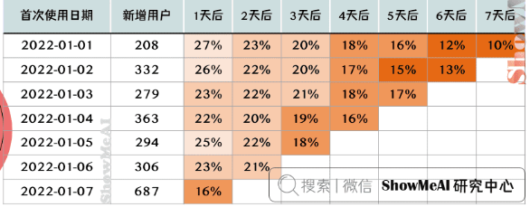
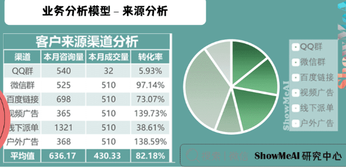

# 人工职能

## 数据分析

### 概念

+ **方差**（Variance）：方差和标准差是**度量数据离散程度**时，最重要、最常用的指标。方差，是每个数据值与全体数据值的平均数之差的平方值的平均数，

+ **标准差**（Standard Deviation）：又称**均方差**，是方差的算术平方根。计算所有数值相对均值的偏离量，反映**数据在均值附近的波动程度**，比方差更方便直观。

+ **离散系数**（Coefficient of Variation）：又称变异系数，为标准差与平均值之比，用于比较不同样本数据的离散程度。离散系数大，说明数据的离散程度大；离散系数小，说明数据的离散程度也小。

+ **偏度**（Skewness）：用来评估一组数据分布呈现的**对称程度**。

  - 当 偏度系数**等于0**时，分布是**对称**的
  - 当 偏度系数**大于0**时，分布呈**正偏态（右偏）**
  - 当 偏度系数**小于0**时，分布呈**负偏态（左偏）**

  

+ **峰度**（Kurtosis）：用来评估一组数据的分布形状的**高低程度**的指标。

- 当 峰度系数**等于0**时，是**正态分布**
- 当 峰度系数**大于0**时，分布**形态陡峭**，数据分布更集中
- 当 峰度系数**小于0**时，分布**形态平缓**，数据分布更分散

**其他数据分布图**——**分位数**是观察数据分布的最简单有效的方法，但分位数只能用于观察单一属性的数据分布。**散点图**可以用来观察双变量的数据分布，**聚类**可以用来观察更多变量的数据分布。通过观察数据的分布，采用合理的指标，使数据的分析更全面，避免得出像平均工资这类偏离事实的的分析结果。

+ **线性回归**
  + 回归分析中，只包括**一个自变量和一个因变量**，且二者的关系可用一条直线近似表示，这种回归分析称为**一元线性回归**分析。
  + 如果回归分析中包括**两个或两个以上的自变量**，且因变量和自变量之间是线性关系，则称为**多元线性回归**分析。
+ 方差分析
  + **单因素方差分析**：**一项试验只有一个影响因素**，或者存在多个影响因素时，只分析一个因素与响应变量的关系。
  + **多因素有交互方差分析**：**一项实验有多个影响因素**，分析多个影响因素与响应变量的关系，同时考虑多个影响因素之间的关系。

+ 常见业务目标
  + **描述性分析**：分析和描述数据的特征：描述性分析是处理信息汇总的好方法，与视觉分析相结合，可以提供全面的数据结构，并通过仪表板展示所得到的结论。企业中通过分析KPI来评估绩效的做法，就是描述性分析的常见应用之一。
  + **预测分析**：预测未来的结果：预测分析是一个复杂的领域，需要较大大规模的历史数据，并借助技术进步（尤其是机器学习）构建高并发的预测模型，以获得有关未来的预测性洞察。
  + **诊断分析**：透过数据诊断实际问题：通过诊断分析，可以对数据进行批判性思考，判断实际存在的问题，并进一步优化管理或减少损失。物流企业使用诊断分析可以减少物流延迟，电商企业可以借助诊断分析更新营销策略，降本提效。
  + **规范分析**：数据分析的集大成者：规范分析结合了上述所有分析技术，可以帮助公司在数据结论的基础上制定相关决策。需要注意的是，使用规范分析的必要基础是足够大的数据规模、数量使用AI技术，也因此常被应用于大型互联网公司（如Google）和金融机构。
+ 常见业务指标
  + **虚荣指标**（Vanity Metrics）：**让人感觉良好，却是肤浅甚至带有欺诈性的**。例如，只关注网站的访问量（PV、UV），却忽略跳离率、用户浏览时间等数据指标时，就很容易掉进虚荣指标带来的陷阱。
  + **有效指标**（Clarity Metrics）：**指那些真正能带来效益的指标**。例如，转化率、留存率、日活跃人数占比等，可以更好地洞察产品和用户行为的实际走向。
    + **跳离率**（Bounce Rate）：对于内容产品，当访客点击你的网页时，有多少人会马上关闭，百分比是多少。
    + **转化率**（Conversion Rate）：当产品推广时，转化率是注册人数和访客人数比例，表示有多少访客真正变成网站的注册用户。
    + **留存率**（Retention Rate）：对于新用户，用于测试新用户在某段时间内开始使用产品，经过一段时间后，继续使用产品的用户的比例。
    + **活跃度**也是一个有效的度量。 对于社交网站来说，日活跃用户人数（Daily Active Users, DAU）占比是一个关键的指标。

### 指标案例

案例：在一次云产品宣讲会（活动）中，举办方对产品的重大更新做了全方位的演示和讲解，希望通过线下的互动和线上的直播，来吸引更多的用户使用产品。

#### 明确分析目标

如果目标是对活动效益进行评价，你作为一名数据分析人员，会怎么做？

思路：对于该场景，可以使用同期群分析，按照与会人员是否注册，把与会人员细分为未注册人员（潜在用户）和已注册人员（老用户）。

- 活动结束后，有些未注册用户转化成为新用户。吸引新用户注册的动力可能有多种，最常见的是免费试用。后续可以追踪不同来源用户的产品使用行为。
- 老用户是产品的粉丝，是付费用户，能够为公司带来收益。已付费的用户可能会流失，也有可能更依赖产品、更加频繁地使用产品。
- 注意！分析用户行为时，应该意识到，有些用户虽然不能带来直接的收益，但可以带来更多用户，从而间接为公司创造收益。

#### 设计分析指标

**思路**：将人的行为作为出发点，从『定量数据』和『定性数据』两个角度来设计指标。为了分析活动获得的效益，可以制定以下关键指标：

+ **参与度（Engagement）：衡量有多少人参加此次活动，用于评价活动的影响力**

  - 总人数、老用户人数、潜在用户人数。	

  - 参与活动之后，有多少用户注册了（免费版或试用版）。

+ **观察新用户的行为：转化率可以评价活动效益，留存率可以评估新用户对产品的粘性**：与会的、未注册的人员，是产品的潜在用户。不管采用『免费试用』还是『购买+赠送』等推广方法，只要用户注册，就可以认为是完成了一次转化。

  - 新用户的转化率（Conversion Rate）：参与活动之后注册为新用户的比例，转化率越高，说明产品对用户的吸引力越高，活动获得的效益越好。

  - 新用户的来源：对新用户的来源和转化路径进行分析，有助于确定哪些来源带来了更多有效的转化。

  - 新用户的转化路径（转化漏斗）：通过免费试用（Free Trial）注册的新用户，其转化路径的数据指标依次为『新试用（New Trial）』『次日活跃（Activated Trial）』『7日活跃（Activated Trial in 7 days）』。

  - 新用户的留存率：在连续的计费周期内，同期新用户中仍然活跃的用户所占的比例 。

+ **观察老用户行为：忠诚度与老用户用量**：老用户是指在参加活动之前，已经注册的用户，这批用户是产品的忠实粉丝。分析老用户的行为，也能评估活动效益的。忠诚度是指用户使用产品的频繁程度，以及对产品及服务的依赖程度。如果此次活动促使老用户更频繁地使用产品（即老用户的用量增加），则说明举办此次活动提升了老用户的忠诚度，带来了效益的增加。

  - 老用户的用量增长：参与活动之后，老用户的用量与前一个付费周期的用量相比，是增是减。

  - 用量增长的用户占比：参与活动之后，用量增长的用户占比。

考虑一些特殊情况，有多少老用户被召回，有多少老用户流失：

+ 僵尸账户激活（New billed Customers）：有多少老用户离开之后，重新为产品或服务付费。

- 付费用户流失（Churned Customers）：用户在一个付费周期内，不再付费购买产品或服务。

+ **观察产品的用量：服务类型**：产品的用量，也是一个评价活动效益的有效指标。而用户使用产品这一行为，实际上在消费产品提供的服务。增加『服务类型』这一维度，可以评估用量的增长是否与本次活动有关——对比总用量、与活动主题相关的用量。

  - 如果与主题相关的用量增长较大，总的用量增长较平缓，那么说明此次活动促进了用量的增长。

  - 如果与主题相关的用量增长平缓，总的用量增长也平缓，那么说明此次活动对用量的增长没有作用。

**注意**！**对比要有可比**。在比对数据的处理上，应剔除新用户对数据的影响。以活动的举办时间为分割点，只比对老用户在前 N（1-3）个付费周期内和后 N（1-3）个付费周期内的用量。为了更精确地计算用量，应该避免个别因素的影响，可以使用2-3个付费周期内用量的均值。

**老用户的用量增长分析**：

- 用量增长的老用户占比
- 在参加活动之后，老用户消费的用量增加多少，增长的比例是多少
- 每位用户的平均用量

**与活动主题相关的用量增长分析**：

- 用量增长的老用户占比（与活动相关）
- 在参加活动之后，老用户消费的用量增加多少，增长的比例是多少（与活动相关）
- 每位用户的平均用量（与活动相关）

#### 按需调整

要注意，数据分析应结合业务，根据面临的主要问题，设置关键的数据指标，以回答决策中遇到的难题。例如：

- 当产品没有知名度时，网站的访问量可以作为一个关键指标。
- 当有了大量的用户基数时，可以把注册人数（或试用人数）作为关键指标。
- 当注册人数增加到一定程度时，可以把转化率（即，免费用户转化为付费用户）作为关键指标。

### 网站分析常用数据指标

#### 网站流量指标

- **页面浏览**量(Page View，PV）：访客每打开一个页面就被记录一次。
- **独立访客数量**（Unique Visitors，UV）：一天之内网站的唯一访客数量。
- **重复访客数量**（Repeat Visitors，RV）：一天之内，重复访问网站的访客。
- **访客访问的页面浏览量**（Page Views per User）：平均每个访客访问的页面数量，指标高的话，说明用户黏性高，也就是说，访客显示出对网站感兴趣、愿意长时间停留。

#### 用户行为指标

- **跳出率**：表示用户只浏览一个页面便离开了网站，跳出率显示了访客对网站的兴趣程度：跳出率越低说明访客对网站越感兴趣。
- **平均访问时长**：是指每次访问的停留时长，该指标越大，则说明访客停留在网页上的时间越长，对网站越感兴趣。
- **平均访问页数**：是指每次访问浏览的页面数量，该指标越大，则说明访客对网站越感兴趣。

#### 转化指标

- **转化次数**：是指访客到达转化目标页面的次数，转化表示访客做了网站管理者希望访客做的事，与网站运营者期望达到的推广目的有关。
- **转化率**：是指访问转化的效率，转化率=转化次数/访问次数，转化率越高，说明网站的推广效果越好。
- **转化路径**：路径是指访客在抵达您设置的目标页面前所经过的一系列中间页面，转化即指潜在客户完成一次您期望的行动，与您的推广目的和对推广效果的定义密切相关。通过对转化路径的跟踪，您可以了解访客对转化各个步骤的访问情况。

#### 留存指标

- **留存人数**：注册用户在第一次访问网站之后，在下一个周期内继续使用网站的人数。
- **留存率**（Retention Rate）：在下一个周期内继续使用网站的人数，占当期注册用户的比例，留存率越高，说明用户对网站的黏性越高。

#### 来源分析

- **来源**：访客以哪些方式访问网站，直接访问，或搜索引擎。
- **搜索词分析**：在各类搜索引擎上通过哪些搜索词找到并访问了网站。

#### 访客属性分析

- 访客的年龄
- 访客的地域
- 老访客/新访客

### 数据清洗与预处理

#### 数据规整

##### 量纲

**所谓量纲，简单来说，就是说数据的单位**。有些数据是有量纲的，比如身高；而有些数据是没有量纲的，例如，男女比例。不同评价指标往往具有不同的量纲，数据之间的差别可能很大，不进行处理会影响到数据分析的结果。

#####  数据标准化

为了消除指标之间的量纲和取值范围差异对数据分析结果的影响，需要对数据进行标准化处理。就是说，**把数据按照比例进行缩放，使之落入一个特定的区域，便于进行综合分析**。

##### 数据归一化

归一化是数据标准化中最简单的方式，目的是把数变为【0,1】之间的小数，把有量纲的数据转换为无量纲的纯数量。**归一化能够避免值域和量纲对数据的影响，便于对数据进行综合分析**。

#### 异常值检测与分析

异常值在统计学上的全称是疑似异常值，也称作**离群点**(outlier)，异常值的分析也称作离群点分析。

**异常值分析是检验数据中是否存在不合常理的数据**，在数据分析中，既不能忽视异常值的存在，也不能简单地把异常值从数据分析中剔除。重视异常值的出现，分析其产生的原因，常常成为发现新问题进而改进决策的契机。

#####  离群点检测

+ 描述性分析方法：在数据处理过程中，可以对数据做一个描述性分析，进而查看哪些数据是不合理的。常用的统计量是最大值和最小值，用来判断变量的取值是否超出了合理的范围。例如，客户年龄的最大值是199，该值存在异常。
+ Z-Score方法
+ IQR异常检测：四分位点内距（Inter-Quartile Range，IQR），是指在第75个百分点与第25个百分点的差值，或者说，上四分位数与下四分位数之间的差。

#### 异常值处理

在数据处理时，异常值的处理方法，需视具体情况而定。有时，异常值也可能是正常的值，只不过异常的大或小，所以，很多情况下，要先分析异常值出现的可能原因，再判断如何处理异常值。处理的异常值的常用方法有：

- 删除含有异常值的记录。
- 插补，把异常值视为缺失值，使用缺失值的处理方法进行处理，好处是利用现有数据对异常值进行替换，或插补。
- 不处理，直接在含有异常值的数据集上进行数据分析。

### 业务分析模型

#### AB测试

**AB测试**，简单来说，就是为同一个产品目标制定两个方案（比如两个页面一个用红色的按钮、另一个用蓝色的按钮），让一部分用户使用A方案，另一部分用户使用B方案，然后通过日志记录用户的使用情况，并通过结构化的日志数据分析相关指标，如点击率、转化率等，从而得出那个方案更符合预期设计目标，并最终将全部流量切换至符合目标的方案。

####  RFM分析

RFM模型是衡量客户价值和客户创利能力的重要工具和手段，是最流行、最简单、最有效的客户细分方法之一。

- **Recency 最近一次消费**：用户最近一次消费距离现在的时间。例如，1周前消费过的用户比1年前消费过的用户价值大。
- **Frequency 消费频率**：用户在统计周期内购买商品的次数。例如，购买频率高的用户价值比偶尔来一次的客户价值大。
- **Monetary 消费金额**：用户在统计周期内消费的总金额。例如，消费越多的用户价值越大。

####  漏斗分析 / AARRR

**漏斗分析模**型是一套流程式分析模型，已经广泛应用于流量监控、产品目标转化等日常欻据运营与数据分析中，可以帮助我们把握每个转化节点的效率，能够直观的发现问题所在，从而优化整个业务流程。

**AARRR**是一个产品的生命增长周期，描述了不同阶段的用户参与行为的深度，即： 

+ **Acquisition**（获取用户）、 
+ **Activation**（激发活跃）、
+ **Retention**（提高留存）、 
+ **Revenue**（增加收入）、
+  **Referral**（传播推荐）。

它能通过层与层之间用户的转化数，即转换率，来定位问题出在哪。

#### 同期群分析

**同期群分析**，是通过分析性质完全一样的、可对比群体随时间的变化，来分析哪些因素影响用户的留存。只用简单的个图表，就直接描述了用户在一段时间周期的留存或流失变化情况。在数据运营领域十分重要，互联网运营特别需要仔细洞察留存情况。

#### 对比分析

**对比分析**主要是指将两个相互联系的指标数据进行比较，从数量上展示和说明研究对象的规模大小，水平高低，速度快慢等相对数值，通过相同维度下的指标对比，可以发现，找出业务在不同阶段的问题。常见的对比方法包括时间对比，空间对比，标准对比。

**时间对比**

最常用的就是同比和环比，通过时间周期的数据对比，了解目前数据水平的高低。

- **同比**：对比上一个周期的相同时段做比较。例如，今年6月比去年6月。
- **环比**：联系两个时长相等的时段做比较例如，今年6月比去年5月。

**标准对比**

通过目前数据与设定的目标计划之间的对比，了解目前发展进程，完成进度等，了解差距后可以及时调整策略。例如：在图表中设置目标值、平均值、中位数等标准，与实际数据形成标准对比，分析数据情况。

**空间对比**

在相同时间范围内与不同空间指标数据进行对比例如：各省份订单销售数据的差别对比，可以得出产品的优势地区重点突破，平衡人力物力等

#### 来源分析

以网站来举例，**来源**是指访问我们网站的用户是如何到达我们的网站的。

要想深入分析**不同渠道**、**不同阶段效果**，可以通过 SEM 付费搜索等来源渠道和用户所在地区进行交叉分析，得出不同区域的获客详细信息。维度越细，分析结果也越有价值，从而指导网站的优化，最终达到提升用户转化率的目的。

#### 细分分析

- **多层钻取**：**将每层数据进行嵌套，点击不同维度数据，进行细分分析**，通过多层钻取，直接在图表中点击查看细分数据，每层数据均可选择适合的图表类型进行展。
- **聚焦下钻**：对于数据中的一些重点数据，进行聚焦分析，在整体分析中，想要查看特别关注的部分数据详情，可以使用聚焦及下钻的功能，进行自由分析。

#### 用户分析

常用的用户分析方法包括：**活跃分析**，**留存分析**，**用户分群**，**用户画像**，**用户细查**等。

以『**活跃分析**』为例，可以将用户活跃细分为浏览活跃、互动活跃、交易活跃等，通过活跃行为的细分，掌握关键行为指标。然后，通过用户行为事件序列，对用户属性进行分群，观察分群用户的访问、浏览、注册、互动、交易等行为，从而真正把握不同用户类型的特点，提供有针对性的产品和服务。

####  聚类分析

**聚类分析是将数据分为相对同质的群组的分析方法**。网站分析中的聚类主要分为：**用户聚类**、**页面或内容聚类**或**来源聚类**。用户聚类主要体现为用户分群，用户标签法页面聚类则主要是相似、相关页面分组，来源聚类主要包括渠道、关键词等。

## 机器学习

### 概念

#### 基本概念

**机器学习（Machine learning）是人工智能的子集，是实现人工智能的一种途径，但并不是唯一的途径**。它是一门专门研究计算机怎样模拟或实现人类的学习行为，以获取新的知识或技能，重新组织已有的知识结构使之不断改善自身的性能的学科。大概在上世纪80年代开始蓬勃发展，诞生了一大批数学统计相关的机器学习模型。

**深度学习（Deep learning）是机器学习的子集，灵感来自人脑，由人工神经网络（ANN）组成，它模仿人脑中存在的相似结构**。在深度学习中，学习是通过相互关联的「神经元」的一个深层的、多层的「网络」来进行的。「深度」一词通常指的是神经网络中隐藏层的数量。大概在2012年以后爆炸式增长，广泛应用在很多的场景中。

**机器学习研究的是计算机怎样模拟人类的学习行为，以获取新的知识或技能，并重新组织已有的知识结构，使之不断改善自身**。从实践的意义上来说，机器学习是在大数据的支撑下，通过各种算法让机器对数据进行深层次的统计分析以进行「自学」，使得人工智能系统获得了归纳推理和决策能力

#### 机器学习三要素

机器学习三要素包括**数据**、**模型**、**算法**。

+ **数据驱动**：数据驱动指的是我们基于客观的量化数据，通过主动数据的采集分析以支持决策。与之相对的是经验驱动，比如我们常说的「拍脑袋」。

+ **模型**：在AI数据驱动的范畴内，模型指的是基于数据X做决策Y的假设函数，可以有不同的形态，计算型和规则型等。

  **算法**：指学习模型的具体计算方法。统计学习基于训练数据集，根据学习策略，从假设空间中选择最优模型，最后需要考虑用什么样的计算方法求解最优模型。通常是一个最优化的问题。

#### 发展历程

人工智能一词最早出现于1956年，用于探索一些问题的有效解决方案。1960年，美国国防部借助「神经网络」这一概念，训练计算机模仿人类的推理过程。

2010年之前，谷歌、微软等科技巨头改进了机器学习算法，将查询的准确度提升到了新的高度。而后，随着数据量的增加、先进的算法、计算和存储容量的提高，机器学习得到了更进一步的发展。

#### 核心技术

- **分类**：应用以分类数据进行模型训练，根据模型对新样本进行精准分类与预测。
  - 构建用户画像
  - 情感分析
  - 用户行为分析
  - 图像识别分类
- **聚类**：从海量数据中识别数据的相似性与差异性，并按照最大共同点聚合为多个类别。
  - 市场细分
  - 模式识别
  - 空间数据分析
  - 图像处理分析
- **异常检测**：对数据点的分布规律进行分析，识别与正常数据及差异较大的离群点。
  - 日常运行监控
  - 风险识别
  - 舞弊检测
- **回归**：根据对已知属性值数据的训练，为模型寻找最佳拟合参数，基于模型预测新样本的输出值。
  - 趋势预测
  - 价格预测
  - 流量预测

#### 基本流程

机器学习工作流（WorkFlow）包含数据**预处理**（Processing）、**模型学习**（Learning）、**模型评估**（Evaluation）、**新样本预测**（Prediction）几个步骤。

- **数据预处理**：输入（未处理的数据 + 标签）→处理过程（特征处理+幅度缩放、特征选择、维度约减、采样）→输出（测试集 + 训练集）。
- **模型学习**：模型选择、交叉验证、结果评估、超参选择。
- **模型评估**：了解模型对于数据集测试的得分。
- **新样本预测**：预测测试集。

#### 应用场景

作为一套数据驱动的方法，机器学习已广泛应用于数据挖掘、计算机视觉、自然语言处理、生物特征识别、搜索引擎、医学诊断、检测信用卡欺诈、证券市场分析、DNA序列测序、语音和手写识别和机器人等领域。

- **智能医疗**：智能假肢、外骨骼、医疗保健机器人、手术机器人、智能健康管理等。
- **人脸识别**：门禁系统、考勤系统、人脸识别防盗门、电子护照及身份证，还可以利用人脸识别系统和网络，在全国范围内搜捕逃犯。
- **机器人的控制领域**：工业机器人、机械臂、多足机器人、扫地机器人、无人机等。

#### 基本名词

- **监督学习**（**Supervised Learning**）：训练集有标记信息，学习方式有分类和回归。
- **无监督学习**（**Unsupervised Learning**）：训练集没有标记信息，学习方式有聚类和降维。
- **强化学习**（**Reinforcement Learning**）：有延迟和稀疏的反馈标签的学习方式。
- **示例/样本**：上面一条数据集中的一条数据。
- **属性/特征**：「色泽」「根蒂」等。
- **属性空间/样本空间/输入空间X**：由全部属性张成的空间。
- **特征向量**：空间中每个点对应的一个坐标向量。
- **标记**：关于示例结果的信息，如（（色泽=青绿，根蒂=蜷缩，敲声=浊响），好瓜），其中「好瓜」称为标记。
- **分类**：若要预测的是离散值，如「好瓜」，「坏瓜」，此类学习任务称为分类。
- **假设**：学得模型对应了关于数据的某种潜在规律。
- **真相**：潜在规律自身。
- **学习过程**：是为了找出或逼近真相。
- **泛化能力**：学得模型适用于新样本的能力。一般来说，训练样本越大，越有可能通过学习来获得具有强泛化能力的模型。

### 算法分类

#### 依托的问题场景

机器学习最主要的类别有：监督学习、无监督学习和强化学习。

1. **监督学习**：从给定的训练数据集中学习出一个函数，当新的数据到来时，可以根据这个函数预测结果。监督学习的训练集要求是包括输入和输出，也可以说是特征和目标。训练集中的目标是由人标注的。常见的监督学习算法包括回归分析和统计分类。
2. **无监督学习**：与监督学习相比，训练集没有人为标注的结果。常见的无监督学习算法有生成对抗网络（GAN）、聚类。
3. **强化学习**：通过观察来学习做成如何的动作。每个动作都会对环境有所影响，学习对象根据观察到的周围环境的反馈来做出判断。

#### 分类问题

分类问题是机器学习非常重要的一个组成部分。它的目标是根据已知样本的某些特征，判断一个新的样本属于哪种已知的样本类。分类问题可以细分如下：

- **二分类问题**：表示分类任务中有两个类别新的样本属于哪种已知的样本类。
- **多类分类**（Multiclass classification）问题：表示分类任务中有多类别。
- **多标签分类**（Multilabel classification）问题：给每个样本一系列的目标标签。

了解更多机器学习分类算法：[**KNN算法**](https://www.showmeai.tech/article-detail/187)、[**逻辑回归算法**](https://www.showmeai.tech/article-detail/188)、[**朴素贝叶斯算法**](https://www.showmeai.tech/article-detail/189)、[**决策树模型**](https://www.showmeai.tech/article-detail/190)、[**随机森林分类模型**](https://www.showmeai.tech/article-detail/191)、[**GBDT模型**](https://www.showmeai.tech/article-detail/193)、[**XGBoost模型**](https://www.showmeai.tech/article-detail/194)、[**支持向量机模型**](https://www.showmeai.tech/article-detail/196)等。

#### 回归问题

了解更多机器学习回归算法：[**决策树模型**](https://www.showmeai.tech/article-detail/190)、[**随机森林分类模型**](https://www.showmeai.tech/article-detail/191)、[**GBDT模型**](https://www.showmeai.tech/article-detail/193)、[**回归树模型**](https://www.showmeai.tech/article-detail/192)、[**支持向量机模型**](https://www.showmeai.tech/article-detail/196)等。

#### 聚类问题

了解更多机器学习聚类算法：[**聚类算法**](https://www.showmeai.tech/article-detail/197)。

#### 降维问题

了解更多机器学习降维算法：[**PCA降维算法**](https://www.showmeai.tech/article-detail/198)。

### 模型评估与选择

#### 机器学习与数据拟合

机器学习最典型的监督学习为分类与回归问题。分类问题中，我们学习出来一条「决策边界」完成数据区分；在回归问题中，我们学习出拟合样本分布的曲线。

#### 训练集与数据集

我们以房价预估为例，讲述一下涉及的概念。

- **训练集**（Training Set）：帮助训练模型，简单的说就是通过训练集的数据让确定拟合曲线的参数。
- **测试集**（Test Set）：为了测试已经训练好的模型的精确度。

当然，test set这并不能保证模型的正确性，只是说相似的数据用此模型会得出相似的结果。因为在训练模型的时候，参数全是根据现有训练集里的数据进行修正、拟合，有可能会出现过拟合的情况，即这个参数仅对训练集里的数据拟合比较准确，这个时候再有一个数据需要利用模型预测结果，准确率可能就会很差。

#### 经验误差

在训练集的数据上进行学习。模型在训练集上的误差称为「经验误差」（Empirical Error）。但是经验误差并不是越小越好，因为我们希望在新的没有见过的数据上，也能有好的预估结果。

#### 过拟合

过拟合，指的是模型在训练集上表现的很好，但是在交叉验证集合测试集上表现一般，也就是说模型对未知样本的预测表现一般，泛化（Generalization）能力较差。

**如何防止过拟合呢**？一般的方法有Early Stopping、数据集扩增（Data Augmentation）、正则化、Dropout等。

- **正则化**：指的是在目标函数后面添加一个正则化项，一般有L1正则化与L2正则化。L1正则是基于L1范数，即在目标函数后面加上参数的L1范数和项，即参数绝对值和与参数的积项。
- **数据集扩增**：即需要得到更多的符合要求的数据，即和已有的数据是独立同分布的，或者近似独立同分布的。一般方法有：从数据源头采集更多数据、复制原有数据并加上随机噪声、重采样、根据当前数据集估计数据分布参数，使用该分布产生更多数据等。
- **DropOut**：通过修改神经网络本身结构来实现的。

#### 偏差

**偏差**（**Bias**），**它通常指的是模型拟合的偏差程度**。给定无数套训练集而期望拟合出来的模型就是平均模型。偏差就是真实模型和平均模型的差异。

简单模型是一组直线，平均之后得到的平均模型是一条直的虚线，与真实模型曲线的差别较大（灰色阴影部分较大）。因此，**简单模型通常高偏差** 。复杂模型是一组起伏很大波浪线，平均之后最大值和最小组都会相互抵消，和真实模型的曲线差别较小，因此复杂模型通常低偏差（见黄色曲线和绿色虚线几乎重合）。

#### 方差

**方差（Variance），它通常指的是模型的平稳程度（简单程度）**。简单模型的对应的函数如出一辙，都是水平直线，而且平均模型的函数也是一条水平直线，因此简单模型的方差很小，并且对数据的变动不敏感。

复杂模型的对应的函数千奇百怪，毫无任何规则，但平均模型的函数也是一条平滑的曲线，因此复杂模型的方差很大，并且对数据的变动很敏感。

#### 偏差与方差的平衡

##### 回归问题

关于模型「好坏」的判断，不仅取决于算法和数据，还取决于当前任务需求。**回归问题常用的性能度量指标有：平均绝对误差、均方误差、均方根误差、R平方等**。

- **平均绝对误差**（**Mean Absolute Error，MAE**），又叫平均绝对离差，是所有标签值与回归模型预测值的偏差的绝对值的平均。
- **平均绝对百分误差**（**Mean Absolute Percentage Error，MAPE**）是对MAE的一种改进，考虑了绝对误差相对真实值的比例。
- **均方误差**（**Mean Square Error，MSE**）相对于平均绝对误差而言，均方误差求的是所有标签值与回归模型预测值的偏差的平方的平均。
- **均方根误差**（**Root-Mean-Square Error，RMSE**），也称标准误差，是在均方误差的基础上进行开方运算。RMSE会被用来衡量观测值同真值之间的偏差。
- **R平方，决定系数**，反映因变量的全部变异能通过目前的回归模型被模型中的自变量解释的比例。比例越接近于1，表示当前的回归模型对数据的解释越好，越能精确描述数据的真实分布。

##### 分类问题

**分类问题常用的性能度量指标包括错误率（Error Rate）、精确率（Accuracy）、查准率（Precision）、查全率（Recall）、F1、ROC曲线、AUC曲线和R平方等**。

- **错误率**：分类错误的样本数占样本总数的比例。
- **精确率**：分类正确的样本数占样本总数的比例。
- **查准率**（也称准确率），即在检索后返回的结果中，真正正确的个数占你认为是正确的结果的比例。
- **查全率**（也称召回率），即在检索结果中真正正确的个数，占整个数据集（检索到的和未检索到的）中真正正确个数的比例。
- **F1**是一个综合考虑查准率与查全率的度量，其基于查准率与查全率的调和平均定义：即：F1度量的一般形式-Fβ，能让我们表达出对查准率、查全率的不同偏好。
- **ROC曲线（Receiver Operating Characteristic Curve）全称是「受试者工作特性曲线」**。综合考虑了概率预测排序的质量，体现了学习器在不同任务下的「期望泛化性能」的好坏。ROC曲线的纵轴是「真正例率」（TPR），横轴是「假正例率」（FPR）。
- **AUC（Area Under ROC Curve）是ROC曲线下面积，代表了样本预测的排序质量**。

##### 评估方法

#### 性能度量指标

**性能度量是衡量模型泛化能力的数值评价标准，反映了当前问题（任务需求）**。使用不同的性能度量可能会导致不同的评判结果。

## 深度学习

### 概念

为什么深度学习能够如此有效呢？要回答这个问题，可以从数据量说起。如下图，横轴画一条直线，绘制出所有任务的数据量(Amount of Data)；竖轴画出机器学习算法的性能(Performance)，例如垃圾邮件过滤、广告点击预测、自动驾驶时位置判断等任务的准确率。

一个传统机器学习算法的性能，作为数据量的函数，是一条曲线。如图中所示，一开始，算法性能会随着数据的增多而上升；但一段变化后，它的性能就会达到瓶颈而难以提升。过去十年，我们遇到的很多问题只有相对较少的数据量。但假设横轴拉得很长很长，算法将不知道如何处理规模巨大的数据。

**数字化社会带来了巨大的数据量提升**。相比于传统机器学习模型，深度学习神经网络更能在海量数据上发挥作用。

因此，想获得较好的性能体现，需要具备以下两个条件：

- 需要训练一个**规模足够大的神经网络**，以发挥数据规模巨大的优点
- 需要**海量的数据**支撑

**神经网络：** 它从信息处理角度对人脑神经元网络进行抽象， 建立某种简单模型，按不同的连接方式组成不同的网络。神经网络是一种运算模型，由大量神经元之间相互联接构成。学习如何构建和训练神经网络是入门的重要一步。

**神经元：** 神经元模型是一个包含输入，输出与计算功能的模型。

**前向传播和反向传播：** 它是神经网络的基本运行方式，前向传播用于计算输出，反向传播用于更新网络参数。

**激活函数：** 激活函数决定神经元的输出。学习不同的激活函数以及它们的作用。

**损失函数：** 损失函数用于衡量模型的预测与实际结果之间的差异。了解不同的损失函数和它们的适用场景。

**优化算法：** 优化算法用于更新神经网络的参数以最小化损失函数。了解常用的优化算法，如随机梯度下降法（SGD）和Adam。

### 神级网络

神经网络的类型，实际神经网络有着不同的结构，而这些典型的结构，也适用于不同的场景，例如：

+ 对于房地产和在线广告来说，可能是相对标准一些的神经网络(比如**全连接的前馈神经网络**，或者wide&deep这种组合网络)。

+ 对于图像应用，我们经常在神经网络上使用卷积(**Convolutional Neural Network**)，通常缩写为CNN。

  + 对于序列数据(例如音频和文本，含有时间成分)，经常使用RNN，一种**（循环）递归神经网络**(**Recurrent Neural Network**)。
  + 音频随时间播放，所以音频被表示为一维时间序列(**one-dimensional time series**，或称**one-dimensional temporal sequence**)

  - 语言(英语的字母或汉语的汉字)都是逐个出现的，所以语言最自然的表达方式也是序列数据，通常此类问题会使用更复杂的RNNs结构。

+ 对于更复杂的应用(比如自动驾驶)，其中的图片任务可以使用CNN卷积神经网络结构。但是雷达信息却需要使用不同的网络结构，这些结构可能是定制的、复杂的或混合的神经网络结构。

### 深度学习实践

