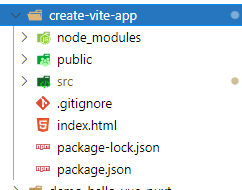

# Vue

## 版本问题

### GitHub Star

+ Vue2 197K
+ Vue3 30 K

### 兼用性

+ Vue 3 不再兼容 IE
+ Vue 2 可以兼容IE

所以根据需求选择 Vue 版本

### Vue3相对于vue2的优缺点

#### 优点:

+ 性能提升，主要体现在打包体积（减少了40%左右），渲染速度（快了55%），更新速度（100%）及内存使用（减少了50%）几方面。
+ 由于增加了composition api，更加支持Ts，使得代码相对于Vue2更利于维护。

#### 缺点：

+ 就目前来说用户数量和社区活跃度没有vue2高，有一定的学习成本（包括学习ts）

### vue2和vue3双向数据绑定原理发生了改变

`vue2`的双向数据绑定是利用`ES5`的一个API`Object.definePropert()` 对数据进行劫持，结合发布订阅模式的方式来实现的。
 `vue3`中使用了`ES6`的`Proxy` API对数据代理。
 相比`vue2.x`，使用`proxy`的优势如下：

- `defineProperty`只能监听某个属性，不能对全对象监听
- 可以省去`for in`，闭包等内容来提升效率(直接绑定整个对象即可)
- 可以监听数组，不用再去单独的对数组做特异性操作`vue3.x`可以检测到数组内部数据的变化。

### vue2和vue3定义数据变量和方法的改变

在`vue2`中定义数据变量是`data(){}`，创建的方法要在`methods:{}`中。
 而在`vue3`中直接在`setup(){}`中，在这里面定义的变量和方法因为最终要在模板中使用，所以最后都得  `return`。
 如：

~~~vue

~~~

### vue2和vue3生命周期钩子函数的不同

`vue2`中的生命周期

- `beforeCreate`   组件创建之前
- `created`   组件创建之后
- `beforeMount`  组价挂载到页面之前执行
- `mounted` 组件挂载到页面之后执行
- `beforeUpdate`  组件更新之前
- `updated`  组件更新之后

`vue3`中的生命周期

- `setup`  开始创建组件
- `onBeforeMount`  组价挂载到页面之前执行
- `onMounted` 组件挂载到页面之后执行
- `onBeforeUpdate`  组件更新之前
- `onUpdated`  组件更新之后

而且`Vue3.x` 生命周期在调用前需要先进行引入。如：

~~~vue
import {
 reactive,
 toRefs,
 onMounted,
 onBeforeMount,
 onBeforeUpdate,
 onUpdated,
} from "vue";
~~~

来一个总的生命周期对比，这样更便于记忆

~~~bash
Vue2--------------vue3
beforeCreate  -> setup()
created       -> setup()
beforeMount   -> onBeforeMount
mounted       -> onMounted
beforeUpdate  -> onBeforeUpdate
updated       -> onUpdated
beforeDestroy -> onBeforeUnmount
destroyed     -> onUnmounted
activated     -> onActivated
deactivated   -> onDeactivated
errorCaptured -> onErrorCaptured

~~~

除了这些钩子函数外，`Vue3.x`还增加了`onRenderTracked` 和`onRenderTriggered`函数。

### vue3中新加入了TypeScript和PWA的支持

## 自我总结

1.  在部分的语法上面还是有一些差别的，具体要看到底是Vue 2.0，还是 Vue 3.0
2.  组件的集成方面也有问题，具体的使用方法根据不同的要求进行使用
3. 目前最优的选择是
   1. vite + vue3
   2. nuxt + vue2.0
4.  但是 Github 上面来说 Vue2 仍然是主流
5.  最近更新时间，所以 Vue3 要时刻关注
   1.  Vue2 2021 6. 1
   2.  Vue3 2022.5.20

# Vue-vite 使用

## Vite

### 概念

1. 首先，vite为什么叫做vite，vite实际上是法语中快的意思，所以顾名思义，这个工具给我们带来的就是更快的开发体验，它实际上是一个面向现代浏览器，基于ECMA标准的ES module实现的一个更轻更快的web应用开发工具
2. 之所以是面向现代浏览器，而不顾之前的浏览器，是因为vite本身是一个web应用开发者工具，而对于开发者来说，一般都是使用比较先进的浏览器来进行开发，所以我们可以直接使用一些现代浏览器支持的特性，而不考虑去兼容一些老的浏览器
3. 而现代浏览器支持的特性中，在vite中最为重要的一个，就是ES module。由于vite是面向现代浏览器的，所以它利用浏览器去解析imports，在服务器端按需编译返回，跳过打包过程。同时支持Vue文件和HMR（热更新），针对生产环境可以使用rollup打包。
4. 此外要注意的一点是，vite仅支持vue3.0+的项目，也即是说我们无法在其中使用vue2.x

### 安装 Vite

1. 全局安装 vite

   ~~~bash
   npm install -g create-vite-app
   ~~~

2. 创建项目

   ~~~bash
   create-vite-app  create-vite-app vue3-vite-demo
   ~~~

3. 安装成功

## Route

### 概念

1. 路由的作用：为了实现SPA（single page web application）应用
2. vue-router的理解：vue的一个插件库，专门用来实现SPA应用
3. SPA应用的理解：单页Web应用；整个应用只有一个完整的页面；点击页面中的导航链接不会刷新页面，只会做页面的局部更新；数据需要通过ajax获取。

### 安装 Router（Vue3版本）

1. 查看 Router 版本

   ~~~bash
   $ npm info vue-router versions
   ~~~

2. 安装 Router

   ~~~bash
   npm install vue-router
   ~~~

3. 创建以下目录

   ~~~bash
   - src
     |- router
     ||- index.js
     |- views
        |- home.vue
        |- about.vue
   ~~~

4. main.js

   ~~~js
   import { createApp } from 'vue'
   import App from './App.vue'
   import './index.css'
   // 导入router
   import router from "./router";
   
   createApp(App).use(router).mount('#app')
   
   ~~~

5. App.vue

   ~~~vue
   <template>  
     <!-- 使用 Router -->
     <router-view />
   </template>
   
   
   
   ~~~

6. home.vue、about.vue

   ~~~vue
   <template>
     

       <h1>首页</h1>
     

   </template>
   
   
   
   
   
   ~~~

7. index.js

   ~~~js
   import { createRouter, createWebHistory } from "vue-router";
   
   import About from "../views/about.vue";
   import Error from "../views/error404.vue";
   
   // 历史记录
   const routerHistory = createWebHistory();
   const router = createRouter({
     history: routerHistory,
     // 注册路由
     routes: [
       {
         path: "/",
         redirect: "/home",
       },
       {
         path: "/home",
         component: () => import("../views/home.vue"),
       },
       {
         path: "/about",
         component: About,
       },
   
       {
         path: "/404",
         component: Error,
       },
         // 没有定义的路由跳转到 404
       {
         path: "/:pathMatch(.*)",
         redirect: "/404",
       },
     ],
   });
   
   export default router;
   
   ~~~
   
   

### 路由跳转

#### 方式一：

页面路由跳转

~~~html
<template>
  

    <h1>订单页面</h1>
    
<router-link to="/about">Go to About</router-link>

    
<router-link to="/404">Go to 404</router-link>

  

</template>
~~~

#### 方式二：

编程式页面跳转，跳转到指定页面

~~~vue
<template>
  

    <h1>订单页面</h1>
    <button @click="clickbutton()">跳转按钮</button>
  

</template>

~~~

### 获取路由列表

1. js 获取路有对象

~~~vue
// 获取 routes 对象
  computed: {
    routes() {
        // 过滤掉没有子列表的routes
        this.$router.options.routes = this.$router.options.routes.filter(item => item.children)
        console.log(this.$router.options.routes);
        return this.$router.options.routes
    },
  },
~~~

2. 页面中显示

~~~vue
<template>
  

    <h1>首页</h1>
    <button @click="clickbutton()">跳转 order</button>
    

      <button v-if="!route.hidden" @click="toWeb(route.path)">
        Go to {{ route.name }}
      </button>
    

  

</template>
~~~

3. method 方法

~~~vue
    toWeb(path) {
      console.log(path)
      this.$router.push({ path });
    },
~~~

4. 页面总体展示

~~~vue
<template>
  

    <h1>首页</h1>
    <button @click="clickbutton()">跳转 order</button>
    

      <button v-if="!route.hidden" @click="toWeb(route.path)">
        Go to {{ route.name }}
      </button>
    

  

</template>

~~~

### 路由嵌套

1. 可以一个页面，显示多种页面类型
2. 实现了页面的布局

~~~js
//  vue3 router 路由
import { createRouter, createWebHistory } from "vue-router";

// 导入路由组件
import About from "../views/about.vue";
import Home from "../views/home.vue";
import Welcome from "../views/welcome.vue";
import Error from "../views/404.vue";
import Order from "../views/order/order.vue";

// 创建路由对象
const routerHistory = createWebHistory();
const router = createRouter({
  history: routerHistory,
  // 注册路由
  routes: [
    {
      path: "/",
      id: 0,
      name: "index",
      redirect: "/home",
      hidden: true,
    },
    // 嵌套路由
    {
      path: "/home",
      id: 1,
      name: "home",
      redirect: "/welcome",
      component: Home,
      children: [
        {
          path: "/welcome",
          id: 0,
          name: "welcome",
          hidden: false,
          component: Welcome,
        },
        {
          path: "/about",
          id: 1,
          name: "about",
          component: About,
        },
        // 测试路由跳转
        {
          path: "/order",
          id: 2,
          name: "order",
          component: Order,
        },
        {
          path: "/order/:id",
          id: 3,
          name: "orde_id",
          component: Order,
          hidden: true,
        },
      ],
    },

    // 错误页面设置
    {
      path: "/404",
      id: 2,
      name: "error",
      component: Error,
      hidden: true,
    },
    // 没有定义的路由跳转到 404
    {
      path: "/:pathMatch(.*)",
      id: 3,
      name: "all_error",
      //访问主页的时候 重定向到index页面
      redirect: "/404",
      hidden: true,
    },
  ],
});

export default router;

~~~

### 侧边栏路由

1. 需要结合 element+ 中的

~~~vue
<template>
<!-- 整体页面布局 -->
<el-container class="home-contianer">
    <!-- 头部页面布局 -->
    <el-header>
        <h3>页面头部区域</h3>
    </el-header>

    <!-- 内容区域 -->
    <el-container>
        <el-aside>
            <h1 align="center">菜单栏</h1>
            <!-- 迭代循环 routes ， 
             unique-opened 仅打开一个列表，
              :collapse-transition="iscollapse"
             route与 :index 实现 route 跳转的功能-->
            <el-menu active-text-color="#ffd04b" :unique-opened="true" :router="true" @open="handleOpen" @close="handleClose">
                <!-- 一级菜单列表 -->
                <el-sub-menu v-for="item in router" :key="item.path" :index="item.path + ''">
                    <!-- 显示节点的名称，此处可以增加图标 -->
                    <template #title>
                        {{ item.name }}
                    </template>
                    <!-- 二级菜单列表-->
                    <el-menu-item v-for="subItem in item.children" :key="subItem.id" :index="subItem.path + ''">
                        <template #title>
                            {{ subItem.name }}</template>
                    </el-menu-item>
                </el-sub-menu>
            </el-menu>
        </el-aside>
        <!-- 进入home页面中，然后在main区域：展示welcome页面 -->
        <el-main>
            <!-- 主内容区域 -->
            <h1>内容区域</h1>
            <router-view></router-view>
        </el-main>
    </el-container>
</el-container>
</template>

~~~

## Less

### 概念

1. less作为一门CSS扩展语言，也就是说CSS预处理器。（Leaner Style Sheets）简称less，它只不过是为css新增这些的功能，比如说：变量、函数、作用域等等。它的优点是：更具有维护性、扩展性等，可以降低了维护的成本，根据按这样的话，那么less可以让我们写更少的代码做更多的事情。
2. 和css相比下，css的语法非常简单，而且对开发者来说要求比较低，比较合适小白者，但是遇到有些问题，比如没有这种变量、函数等等，的确还不如less的扩展性，需要写大量的代码，但是看眼中的确没有逻辑的代码，CSS冗余度是比较高的。不方便维护，不利于复用，而且没有计算的能力。
3. 如果对css有基础的话，less很容易上手的。因为css和less区别不大的，反正可以通过编译生成浏览器能识别的css文件。

### 安装 less

1. Vite 提供了对 .scss, .[sass](https://so.csdn.net/so/search?q=sass&spm=1001.2101.3001.7020), .less, .styl 和 .stylus 文件的内置支持。没有必要为它们安装特定的 Vite 插件，但必须安装相应的预处理器依赖：

   ~~~bash
   # .scss and .sass
   npm install -D sass
   
   # .less
   npm install -D less
   
   # .styl and .stylus
   npm install -D stylus
   
   ~~~

### 使用

通过 `
   
   ~~~

   

## Element Plus

### 概述

+ Element UI 主要是为了使用 Vue2
+ Element plus 主要是为了配合 Vue3，同时集合了 TS 的语法，所以是最新的，而且 Element+ 发布时间也只在 2022 年 2月份，是一个比较新的东西了

[官方文档路径](https://element-plus.gitee.io/zh-CN/guide/installation.html)

### 安装

1.  环境支持

   + Element Plus 可以在支持 [ES2018](https://caniuse.com/?feats=mdn-javascript_builtins_regexp_dotall,mdn-javascript_builtins_regexp_lookbehind_assertion,mdn-javascript_builtins_regexp_named_capture_groups,mdn-javascript_builtins_regexp_property_escapes,mdn-javascript_builtins_symbol_asynciterator,mdn-javascript_functions_method_definitions_async_generator_methods,mdn-javascript_grammar_template_literals_template_literal_revision,mdn-javascript_operators_destructuring_rest_in_objects,mdn-javascript_operators_spread_spread_in_destructuring,promise-finally) 和 [ResizeObserver](https://caniuse.com/resizeobserver) 的浏览器上运行。 如果您确实需要支持旧版本的浏览器，请自行添加 [Babel](https://babeljs.io/) 和相应的 Polyfill 。
   + 由于 Vue 3 不再支持 IE11，Element Plus 也不再支持 IE 浏览器。

2. 版本：Element Plus 目前还处于快速开发迭代中。

3. 安装

   ~~~bash
   # NPM
   $ npm install element-plus --save
   
   # Yarn
   $ yarn add element-plus
   
   # pnpm
   $ pnpm install element-plus
   ~~~

4. Main.js 中修改

   ~~~js
   import { createApp } from "vue";
   import App from "./App.vue";
   
   // 导入 element plus
   import ElementPlus from "element-plus";
   import "element-plus/dist/index.css";
   // 引入全局樣式
   import "./assets/css/global.css";
   
   
   const app = createApp(App);
   // store.use(ElementPlus);
   app.use(ElementPlus)
   app.mount("#app");
   ~~~

### Vuex 中使用 ElementPalus

Store.js

~~~js
//store.js:
import { createStore } from "vuex";
// 导入 element plus 组件
import { ElMessage } from "element-plus";

const store = createStore({
    state() {
        return {
            msg: "store msg default string",
        };
    },
    // 获取 state 的状态
    getters: {
        // 获取Msg
        getMsg(state) {
            return state.msg;
        },
    },
    //   执行的方法
    mutations: {
        errorMsgInfo(state, msg) {
            state.msg = msg;
            ElMessage.error(state.msg);
        },
        successMsgInfo(state, msg) {
            state.msg = msg;
            ElMessage.success(state.msg);
        },
    },
});

export default store;
~~~

## Vue组件

### 自定义vue组件

#### 定义Demo组件

~~~vue
<template>
  

    <h1>自定义组件：{{ msg }}</h1>
    <h1>对象：{{ obj.id }}</h1>
  

</template>

~~~

#### 使用组件

~~~vue
<template>
  <Demo :msg="msg" :obj="user"></Demo>
</template>

~~~

# Vue-Nuxt

### 概念

1. nuxt是一个专注于ui渲染的应用[框架](https://so.csdn.net/so/search?q=框架&spm=1001.2101.3001.7020),你可以使用Nuxt创建一个灵活的应用框架，你可以基于它初始化新项目的基础结构代码
   使用nuxt你可以快速搭建一个项目,而省略了繁琐的[webpack](https://so.csdn.net/so/search?q=webpack&spm=1001.2101.3001.7020) babel sass vue-loader等等配置,同时nuxt还提供了服务器端渲染功能,
   所以nuxt提供的是一种快速搭建项目的能力,
2. 注意事项：nuxt 仅支持 vue 2.0 版本

# 面试题

### vue 生命周期

~~~bash
beforeCreate 实例化之前这里能拿到this，但是还不能拿到data里面的数据
created  实例化之后
beforeMount()
mounted() $el
beforeUpdate
updated

beforeDestroy 清除定时/移除监听事件
destroyed

// 被keep-alive 包裹的
// keep-alive 标签 include exclude max
activated() {},
deactivated() {},

// 父子
父beforeCreate->父created->父beforeMount->子beforeCreate->子created->子beforeMount->子mounted->父mounted。

// 离开页面：实例销毁 --> DOM卸载
parent  beforeDestroy
child   beforeDestroy
child   destroyed
parent  destroyed

~~~

### 动态组件

~~~bash
// component 动态组件，通过is设置要显示的组件
<component is="UserInfo" >
~~~

### 递归组件

就是给组件设置`name`，之后就可以在当前组件去递归使用组件

### Vue 组件间的传值的几种方式

~~~bash
// Vue组件间的传值的几种方式
1. props/emit
2. $attrs/$listeners // $attrs 除了父级作用域 props、class、style 之外的属性
// $listeners 父组件里面的所有的监听方法
3. $refs/$parent/$children/$root/
4. vuex
5. 事件总线，通过new Vue去实现 / mitt <==> vue3
6. provide/inject
    // 父组件
    props: {},
    provide() {
        name: this.name,
        user: this.user
    }
    // 子组件
    props: {},
    inject: ['user']
7. 本地存储、全局变量

~~~

### watch、mixins、组件顺序、组件配置

~~~bash
export default {
  name: "MyComponentName",
  mixins: [tableMixin],
  components: {},
  inject: ["xxx"],
  // props: ['value', 'visible'],
  props: {
    id: String,
    type: {
      // required: true,
      type: String,
      default: "warning",
      validator(val) {
        return ["primary", "warning", "danger", "success", "info"].includes(
          val
        );
      },
    },
    list: {
      type: Array,
      default: () => [],
    },
  },
  data() {
    return {
      name: "张三",
      user: { name: "张三", age: 18 },
      loading: true,

      // vue2
      obj: {
        name: "李四~",
      },
      // vue2 会进行深度合并
      // obj  {"name":"李四~","age":19}

      // vue3 { name: "李四~" }
    };
  },
  // provide 不支持响应式，想支持响应式的话我们要传对象
  provide() {
    return {
      userName: this.name,
      user: this.user,
    };
  },
  computed: {
    // fullName() {
    //   return 'xxxxx'
    // }
    fullName: {
      get() {
        return this.$store.state.userName;
        // return '李四'
      },
      set(val) {
        this.$store.commit("SET_NAME", val);
      },
    },
  },

  watch: {
    // name(value) {
    //   this.handlerName()
    // }
    // name: {
    //   immediate: true,
    //   deep: true, //
    //   handler(val, oldValue) {
    //     this.handlerName()
    //   },
    // },
    // this.obj.name = 'xxxx' 这样不会执行
    // this.obj = {name: 'xxx'} 这样才会执行
    // obj(value) {
    //   console.log(' value: ', value)
    // }
    //  和上面等价
    // obj: {
    //   handler(value) {
    //     console.log(" value: ", value)
    //   },
    // },
    // this.obj.name = 'xxxx' 这样去修改也能监听
    // obj: {
    //   deep: true, // 深度监听
    //   immediate: true, // 第一次就用执行这个方法，可以理解为在 created 的时候会执行 handler
    //   handler(value) {
    //     console.log(" value: ", value)
    //   },
    // },
    //
    // obj: {
    //   deep: true, // 深度监听
    //   immediate: true, // 第一次就用执行这个方法，可以理解为在 created 的时候会执行 handler
    //   handler: 'handlerName',
    // },
    // ==》
    // obj: 'handlerName'
    // '$route.path': {},
    // 'obj.a' : {}
  },

  beforeCreate() {
    console.log("this", this);
  },
  mounted() {
    // this.handlerName()
    this.fullName = "xxxx";

    //  this.fullName '李四'
  },

  methods: {
    handlerName() {
      this.obj.name = "xxxx";
    },
  },
};

~~~

