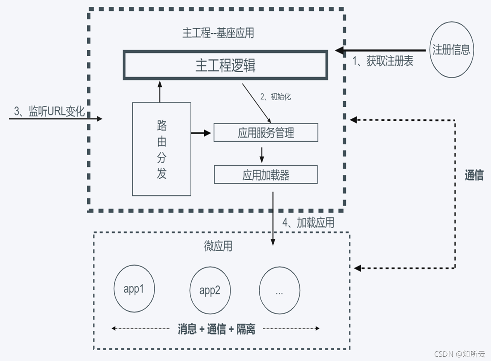

# 微前端

### 什么是微前端

1. 它于2016年首次出现，将后端的微服务的概念扩展到前端世界
2. 微服务：微服务是面向服务架构（SOA）的一种变体，把应用程序设计成一系列松耦合的细粒度服务，并通过轻量级的通信协议组织起来具体地，将应用构建成一组小型服务。这些服务都能够独立部署、独立扩展，每个服务都具有稳固的模块边界，甚至允许使用不同的编程语言来编写不同服务，也可以由不同的团队来管理
3. 一种由地理交付多个前端应用组成整体的架构风格。具体的将前端应用分解成一些更小更简单的能够独立开发、测试、部署的小块，而在用户看来仍然是内聚的单个产品

### 使用微前端能带来什么

​		当下前端领域，基于 vue、react、angular 的单页应用（spa）开发模式已经成为业界主流。随着时间推移以及应用的功能丰富，应用开始变得庞大臃肿，逐渐成为一个巨石应用，难以维护不说，每次开发、上线新需求时还需要花费不少的时间来构建项目，而且有可能改一处而动全身，对开发人员的开发效率和体验都造成了不好的影响。因此将一个巨石应用拆分为多个子应用势在必行

1. 拆分和细化：基于业务来拆分应用。每个应用都有一个自己的仓库，独立开发、独立部署、独立访问、独立维护，还可以根据团队的特点自主选择适合自己的技术栈，极大的提升了开发人员的效率和体验，甚至隔壁团队误发布了一个半成品或有问题的特性也无关紧要。如果一个微前端已经准备好发布了，它就应该随时可发布，并且只由开发维护它的团队来定
2. 整合历史系统：在不少的业务中，或多或少会存在一些历史项目，介于日常运营，这些系统需要结合到新框架中来使用还不能抛弃，对此我们也没有理由浪费时间和精力重写旧的逻辑。而微前端可以将这些系统进行整合，在基本不修改来逻辑的同时来同时兼容新老两套系统并行运行
3. 技术栈无关：通过基座应用，可以融合vue，react，angla，或者js开发的子项目

### 微前端由哪些模块组成

​		当下微前端主要采用的是组合式应用路由方案，该方案的核心是“主从”思想，即包括一个基座（MainApp）应用和若干个微（MicroApp）应用，基座应用大多数是一个前端SPA项目，主要负责应用注册，路由映射，消息下发等，而微应用是独立前端项目，这些项目不限于采用React，Vue，Angular或者JQuery开发，每个微应用注册到基座应用中，由基座进行管理，但是如果脱离基座也是可以单独访问，基本的流程如下图所示：

作为微前端的基座应用，是整个应用的入口，负责承载当前微应用的展示和对其他路由微应用的转发，对于当前微应用的展示，一般是由以下几步构成：

1. 作为一个SPA的基座应用，本身是一套纯前端项目，要想展示微应用的页面除了采用iframe之外，要能先拉取到微应用的页面内容， 这就需要远程拉取机制。
2. 远程拉取机制通常会采用fetch API来首先获取到微应用的HTML内容，然后通过解析将微应用的JavaScript和CSS进行抽离，采用eval方法来运行JavaScript，并将CSS和HTML内容append到基座应用中留给微应用的展示区域，当微应用切换走时，同步卸载这些内容，这就构成的当前应用的展示流程。

对于路由分发而言，以采用vue-router开发的基座SPA应用来举例，主要是下面这个流程：

1. 当浏览器的路径变化后，vue-router会监听hashchange或者popstate事件，从而获取到路由切换的时机。
2. 最先接收到这个变化的是基座的router，通过查询注册信息可以获取到转发到那个微应用，经过一些逻辑处理后，采用修改hash方法或者pushState方法来路由信息推送给微应用的路由，微应用可以是手动监听hashchange或者popstate事件接收，或者采用React-router，vue-router接管路由，后面的逻辑就由微应用自己控制。

### 微前端常用的技术方案

#### iframe

​		iframe 作为一项非常古老的技术，也可以用于实现微前端。通过 iframe，我们可以很方便的将一个应用嵌入到另一个应用中，而且两个应用之间的 css 和 javascript 是相互隔离的，不会互相干扰。
**优点：**

1. 实现简单；
2. css 和 js 天然隔离，互不干扰；
3. 完全技术栈无关；
4. 多个子应用可以并存；
5. 不需要对现有应用进行改造；

**缺点**：

1. 用户体验不好，每次切换应用时，浏览器需要重新加载页面；
2. UI 不同步，DOM 结构不共享；
3. 全局上下文完全隔离，内存变量不共享，子应用之间通信、数据同步过程比较复杂；
4. 对 SEO 不友好；
5. 子应用切换时可能需要重新登录，体验不好；

#### single-spa

​		最早的微前端框架，兼容多种前端技术栈

​		iframe 模式尽管可以实现微前端，但是体验不好。我们每次切换回已经访问过的子应用时，都需要重新加载子应用，对性能有很大的影响。
​		我们知道，现在前端应用开发的主流模式为基于 vue / react/ angular 的单页应用开发模式。在这种模式下，我们需要维护一个路由注册表，每个路由对应各自的页面组件 url。切换路由时，如果是一个新的页面，需要动态获取路由对应的 js 脚本，然后执行脚本并渲染出对应的页面；如果是一个已经访问过的页面，那么直接从缓存中获取已缓存的页面方法，执行并渲染出对应的页面。
那么，微前端也有没有类似的实现方案，来获得和单页应用一样的用户体验呢？

​		答案是有的。 single-spa 提供了新的技术方案，可以帮忙我们实现类似单页应用的体验。
​		在 single-spa 方案中，应用被分为两类：基座应用和子应用。其中，子应用就是文章上面描述的需要聚合的子应用；而基座应用，是另外的一个单独的应用，用于聚合子应用。
​		和单页应用的实现原理类似，single-spa 会在基座应用中维护一个路由注册表，每个路由对应一个子应用。基座应用启动以后，当我们切换路由时，如果是一个新的子应用，会动态获取子应用的 js 脚本，然后执行脚本并渲染出相应的页面；如果是一个已经访问过的子应用，那么就会从缓存中获取已经缓存的子应用，激活子应用并渲染出对应的页面。
**优点**

1. 切换应用时，浏览器不用重载页面，提供和单页应用一样的用户体验；
2. 完全技术栈无关；
3. 多个子应用可并存；
4. 生态丰富；

**缺点**：

1. 需要对原有应用进行改造，应用要兼容接入 sing-spa 和独立使用；
2. 有额外的学习成本；
3. 使用复杂，关于子应用加载、应用隔离、子应用通信等问题，需要框架使用者自己实现；
4. 子应用间相同资源重复加载；
5. 启动应用时，要先启动基座应用；

#### qiankun

​		基于Single-Spa，阿里系开源微前端框架

​		和 single-spa 一样，qiankun 也能给我们提供类似单页应用的用户体验。qiankun 是在 single-spa 的基础上做了二次开发，在框架层面解决了使用 single-spa 时需要开发人员自己编写子应用加载、通信、隔离等逻辑的问题，是一种比 single-spa 更优秀的微前端方案。

**优点**：

1. 切换应用时，浏览器不用重载页面，提供和单页应用一样的用户体验；
2. 相比 single-spa，解决了子应用加载、应用隔离、子应用通信等问题，使用起来相对简单；
3. 完全和技术栈无关；
4. 多个子应用可并存；

**缺点**：

1. 需要对原有应用进行改造，应用要兼容接入 qiankun 和独立使用；
2. 有额外的学习成本；
3. 相同资源重复加载；
4. 启动应用时，要先启动基座应用；

#### webpack5

​		新发布的 webpack5，提供了一个新的特性 - module federation。基于这个特性，我们可以在一个 javascript 应用中动态加载并运行另一个 javascript 应用的代码，并实现应用之间的依赖共享。

​		通过 module federation，我们可以在一个应用里面动态渲染另一个应用的页面，这样也就实现了多个子应用的聚合。

#### Web Component

​		基于 Web Component 的 Shadow Dom 能力，我们也可以实现微前端，将多个子应用聚合起来。
​		const shadow = document.querySelector(’#hostElement’).attachShadow({mode: ‘open’}); // url 为应用的地址，基于 fetch，我们可以获取到应用的 html 模板，添加到指定节点下 fetch(url).then(res => { shadow.innerHTML = res });

**优点：**

1. 实现简单；
2. css 和 js 天然隔离，互不干扰；
3. 完全技术栈无关；
4. 多个子应用可以并存；
5. 不需要对现有应用进行改造；

缺点：

1. 主要是浏览器兼容性问题；
2. 开发成本较高；

#### 总结

​		不是所有的项目都适合使用微前端，需要开发者自己去判断，一般使用微前端，就要基座应用和子应用有独立部署能力，当发现使用微前端反而使开发效率变低，那么就不适合使用微前端

# Single-Spa

+ [csdn资料地址](https://blog.csdn.net/qq_36162529/article/details/121645138?ops_request_misc=%257B%2522request%255Fid%2522%253A%2522165426832716781483713339%2522%252C%2522scm%2522%253A%252220140713.130102334.pc%255Fall.%2522%257D&request_id=165426832716781483713339&biz_id=0&utm_medium=distribute.pc_search_result.none-task-blog-2~all~first_rank_ecpm_v1~times_rank-4-121645138-null-null.142^v11^pc_search_result_control_group,157^v13^new_style&utm_term=single-spa+%E6%98%AF%E4%BB%80%E4%B9%88%EF%BC%9F&spm=1018.2226.3001.4187)
+ [Github](https://github.com/single-spa/single-spa)

### 概念性东西：
2018年single-spa诞生了，single-spa是一个用于前端微服务化的js前端解决方案（本身没有处理样式隔离，js执行隔离），实现了路由劫持和应用加载

2019年qiankun基于single-spa，提供了更加开箱即用的API（single-spa + sandbox + import-html-entry）做到了与技术栈无关、并且接入简单

总结：子应用可以独立构建，运行时动态加载，主子应用完全解耦，与技术栈无关，靠的是协议接入，子应用必须导出bootstrap、mount、unmount方法。

### 这不是iframe吗？

如果使用iframe，iframe中的子应用切换路由时用户刷新页面就尴尬了。

### 应用通信：
1、基于URL来进行数据传递，但是传递消息能力弱

2、基于CustomEvent实现通信

3、使用全局变量、Redux进行通信

### 公共依赖：
1、CDN - externals

2、webpack 联邦模块

### single-spa实现例子：