# Java基础知识

## Java概述

###  何为编程

​		人类将需解决的问题的思路、方法、和手段通过计算机能够理解的形式告诉计算机，使得计算机能够根据人的指令去工作，完成特定的任务。这种交流的过程就是编程。


###  什么是`Java`

1. Java 是一门面向对象编程语言，吸收了 C++ 语言的各种优点，还摒弃了 C++ 里难以理解的多继承、指针等概念，
2. Java 语言具有功能强大和简单易用两个特征。
3. Java 语言作为静态面向对象编程语言的代表，极好地实现了面向对象理论，允许程序员以优雅的思维方式进行复杂的编程 。


### 对比`Python`

1. Python 是动态语言，更加灵活，在运维、自动化测试中使用比较多，
2. 当然机器学习和人工智能AI中也是一个不错的选择，但这方面的工作需要有学历要求（硕士）；
3. 作为辅佐的脚本语言也是不错的，但是Python的性能会比较低，不适合生产场合


### 对比`Golang`

1. 性能更高：协程，也是go最有特色的一个特征，同时节省CPU和内存等资源。
2. 可扩展性：随着同时任务数量的增加，企业应用程序应该能够自动扩展其计算能力。Go代码可以自动扩展到多个核心。另一方面，Java并不总是具有足够的可扩展性。垃圾收集期间，所有线程都被阻塞，并且垃圾收集时间可能会扩大到几分钟，从而降低Java的可伸缩性。
3. 安全成本：`Golang`带有内置的错误类型，任何偏离标准的编程会导致自动提示。它会导致错误和安全漏洞的机会减少，从而影响程序的性能。
4. 目前在字节、滴滴等大平台已经有大量被使用的案例，所以 `Golang` 也会越来越热门，所以我们可以使用它作为第二语言进行使用
5. Go 语言组件框架较少，更加适合基础服务或者简单服务的开发，构建大型应用方面，Java 语言更加适合，所以 `Go`更加应该是C 或者 C++ 的替代品，而且现在看来也是这个方向


### `Java`和`C++`的区别

- 都是面向对象的语言，都支持封装、继承和多态
- Java 不提供指针来直接访问内存，程序内存更加安全
- Java 的类是单继承的，C++ 支持多重继承；虽然`Java`的类不可以多继承，但是接口可以多实现。
- Java 有自动内存管理机制，不需要程序员手动释放无用内存


### `jdk1.5`之后的三大版本

- `Java SE`（标准版）：它允许开发和部署在桌面、服务器、嵌入式环境和实时环境中使用的 Java 应用程序。并为`Java EE` 和`Java ME`提供基础。
- `Java EE`（企业版）：`Java EE` 以前称为 `J2EE`。企业版本帮助开发和部署可移植、健壮、可伸缩且安全的服务器端Java 应用程序。
- `Java ME`（微型版）：Java ME 以前称为 `J2ME`。`Java ME` 为在移动设备和嵌入式设备上运行的应用程序提供一个健壮且灵活的环境。


### `JVM`、`JRE`和`JDK`的关系

**JVM：**是Java虚拟机，Java程序需要运行在虚拟机上，不同的平台有不同的虚拟机，是Java实现多平台运行的基础。

**JRE：**包括Java虚拟机和Java程序所需的核心类库等。核心类库主要是java.lang包：包含了运行Java程序必不可少的系统类，如果想要运行一个开发好的Java程序，计算机中只需要安装JRE即可。

**JDK：**是提供给Java开发人员使用的，其中包含了Java的**开发工具**，也包括了JRE和JVM。

总结：`JDK`>`JRE`>`JVM`

有些生产服务器不允许装 JDK，仅仅安装 JRE 保证程序的运行即可


### 什么是跨平台性？原理是什么

​		所谓跨平台性，是指java语言编写的程序，一次编译后，可以在多个系统平台上运行。

​		实现原理：Java程序是通过java虚拟机在系统平台上运行的，只要该系统可以安装相应的java虚拟机，该系统就可以运行java程序。


### Java语言有哪些特点

+ 简单易学（Java语言的语法与 C 语言和 C++ 语言很接近）
+ 面向对象（封装，继承，多态）
+ 平台无关性（Java 虚拟机实现平台无关性）

+ 支持网络编程并且很方便（Java语言诞生本身就是为简化网络编程设计的）

+ 支持多线程（多线程机制使应用程序在同一时间并行执行多项任）

+ 健壮性（ Java 语言的强类型机制、异常处理、垃圾的自动收集等）

+ 安全性


### 为什么说 Java 语言“编译与解释并存”？

+ 编译型语言（如C# / C / C++ / Go）是指编译器针对特定的操作系统将源代码一次性翻译成可被该平台执行的机器码；
+ 解释型语言（如Java / Python）是指解释器对源程序逐行解释成特定平台的机器码并立即执行。
+ Java 通过编译器先编译成 .class 文件，再解释成 Java 执行器可运行的语言


### 什么是字节码？采用字节码的最大好处是什么

**字节码**：

​		Java源代码经过编译器编译后产生的文件（即扩展为.class的文件 > 一种十六进制的文件），只面向虚拟机。在一定程度上解决了传统解释型语言执行效率低的问题，同时又保留了解释型语言可移植的特点。所以Java程序运行时比较高效。

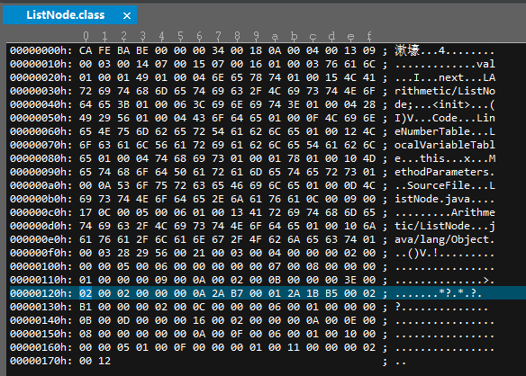


**Java执行顺序**：

```java
	Java源代码 -> 
    编译器 -> 
    jvm可执行的Java字节码 -> 
    jvm -> 
    jvm中解释器 -> 
    机器可执行的二进制机器码 -> 
    程序运行。
```


### Oracle JDK 和 Open JDK 的对比

1. `Oracle JDK`版本将每三年发布一次，而`Open JDK`版本每三个月发布一次；
2. `Open JDK` 是一个参考模型并且是完全开源的，而`Oracle JDK`是`Open JDK`的一个实现，并不是完全开源的；
3. `Oracle JDK `比 `Open JDK` 更稳定，但`Oracle JDK`有更多的类和一些错误修复。如果开发企业/商业软件，建议选择`Oracle JDK`。
4. 在响应性和`JVM`性能方面，`Oracle JDK`与`Open JDK`相比提供了更好的性能；
5. `Oracle JDK`不会为即将发布的版本提供长期支持，用户每次都必须通过更新到最新版本获得支持来获取最新版本；
6. `Oracle JDK`根据二进制代码许可协议获得许可，而`Open JDK`根据`GPL v2`许可获得许可。


### Java 1.8的新特性？

比较重要的新特性

1. `Lambda`表达式
2. `CompletableFuture`
3. 并行流和串行流
4. 元空间的加入
5. 新的时间包


#### 1. Lambda表达式

为了支持函数式编程，Java 8引入了Lambda表达式

~~~java
Arrays.asList( "a", "b", "d" ).forEach( e -> System.out.println( e ) );
~~~

Lambda表达式的优点很明显，在代码层次上来说，使代码变得非常的简洁。缺点也很明显，代码不易读

**优点：**

1. 代码简洁，开发迅速
2. 方便函数式编程
3. 非常容易进行并行计算
4. Java 引入 Lambda，改善了集合操作

**缺点：**

1. 代码可读性变差
2. 在非并行计算中，很多计算未必有传统的 for 性能要高
3. 不容易进行调试


#### 2. 重复注解

如定时任务在不同的时间进行执行

~~~java
@Schedule(dayOfMonth="last")
@Schedule(dayOfWeek="Fri", hour="23")
public void doPeriodicCleanup() { ... }
~~~


#### 3. 接口static和Default方法

~~~java
public interface Interface1 {
	
    void method1(String str);
    
	//a default method
	default void log(String str){
		System.out.println("I1 logging::"+str);
	}
}
~~~


#### 4. `CompletableFuture`（重点了解）

​		在Java 8中, 新增加了一个包含50个方法左右的类: `CompletableFuture`，提供了非常强大的Future的扩展功能，可以帮助我们简化异步编程的复杂性，提供了函数式编程的能力，可以通过回调的方式处理计算结果，并且提供了转换和组合`CompletableFuture`的方法。


#### 5. JVM堆内存分布的优化

​		`JDK8 HotSpot JVM` 将移除永久区，使用本地内存来存储类元数据信息并称之为：元空间（`MetaSpace`)


#### 6. Stream 流

特性：

1. stream不会储存数据，只是对原有数据源做计算操作。
2. stream具有惰性计算的特点，只有当执行终端操作时才会执行前面的中间操作。
3. 由第一条可接着分析：stream不是数据结构，它没有内部储存，只是通过操作《管道》从源数据中抓取元素
4. Stream 在操作大量数据的时候，性能提升明显，
5. 充分利用Lambda，简化代码

串行流：在一个线程上执行一个内容

~~~java
Arrays.asList("a1", "a2", "a3")
        .stream()
        .findFirst()
        .ifPresent(System.out::println);
~~~


**并行流：**就是把一个内容分成多个数据快，并用不同的线程分别处理每个数据块的流。并行流能够在多个线程上执行操作。主要是为了解决处理大量元素时的性能问题。

~~~java
Arrays.asList("a1", "a2", "a3")
        .stream()
        .findFirst()
        .parallel()
        .ifPresent(System.out::println);
--------------------------------------------------------------------
Arrays.asList("a1", "a2", "a3")
        .parallelStream()
        .findFirst()
        .ifPresent(System.out::println);
————————————————

并行流：就是把一个内容分成多个数据快，并用不同的线程分别处理每个数据块的流。并行流能够在多个线程上执行操作。
主要是为了解决处理大量元素时的性能问题。
~~~


#### 7. 新的时间包

Java 8 包含了全新的时间日期`API`，这些功能都放在了`java.time`包下。主要有如下一些方法：

~~~java
LocalDate，LocalTime，LocalDateTime ： 时间
Instant ： 时间戳（以Unix元年：1970年1月一日 00:00:00到某个时间时间的毫秒值）
Duration ： 计算两个“时间”之间的间隔
Period ： 计算两个“日期”之间的间隔
TemporalAdjust ：时间校正器
DateTimeFormatter ：格式化时间/日期
ZonedDate，ZonedTime，ZonedDateTime ： 时区
~~~


### 为什么固守 Java 8？

到2020年3月份，Java 14就要来了。 但是在这么多的版本中，只有**Java 8, Java 11** 和未来的**Java 17 是长期支持版本**。 

| 版本    | 重要特性                                                     |
| :------ | :----------------------------------------------------------- |
| Java 9  | **模块化系统**， Java Shell : 交互式命令行控制台             |
| Java 10 | **局部变量类型推导**                                         |
| Java 11 | 各种加强：Stream 、String、Collection 标准化的 HTTP Client、ZGC |
| Java 12 | Switch表达式扩展                                             |
| Java 13 | 重新实现Socket API文本块(多行字符串)                         |

注意：

1. Java 9 引入了模块化系统，这是个看起来很美的特性，可是对程序员来说，这是一个破坏性的更新，因为JDK做了模块化，但是很多第三方库没有做模块化， 如果想让自己的项目也模块化，很有可能是一次不断填坑的经历，尤其在使用第三方库的时候。 
2. Java 11 的 ZGC 是个有吸引力的特性，它的设计目标是：支持TB级内存容量，GC 暂停时间低（<10ms），对整个程序吞吐量的影响小于 15%，如果真的实现了，程序员就可以可劲儿造对象，而不用考虑 GC 了，可惜这仍然是个实验性质的版本。 
3. 如果要升级 JDK 11，考虑更多的应该是 GC 性能上将近 16% 的优化
4. 版本兼容性问题，类似WebSphere这样的程序，Spring 仅支持 1.5 版本，所以在选择上面，JDK 11 虽然可能会仅仅会位于第二推荐位，JDK 8，依旧是首选


### JDK 17

#### 新特性

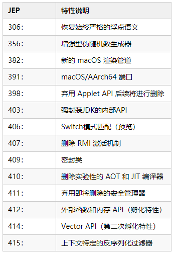

​		JDK 17 这个版本提供了 14 个增强功能，另外在性能、稳定性和安全性上面也得到了大量的提升，以及还有一些孵化和预览特性，有了这些新变化，Java 会进一步提高开发人员的生产力。

#### GC 对比

基于 OptaPlanner 用例，这些基准测试表明：

- 对于 G1（默认），Java 17 比 Java 11 快 8.66%，比 Java 16 快 2.41%
- 对于 ParallelGC，Java 17 比 Java 11 快 6.54%，比 Java 16 快 0.37%
- Parallel GC 比 G1 快 16.39%

简而言之，最新的 JDK 更快，高吞吐量垃圾回收器比低延迟垃圾回收器更快。

因此，Java 17 带来的性能提升非常值得升级，更重要的是它可以免费商用，而且还是 LTS 版本。


### JDK 19（202209发布)

​		Java 开发工具包19（JDK 19）将于今年 9 月发布，现已功能完善，目前处于第二阶段。该版本的七项功能包括**结构化并发、记录模式、外部函数和内存 API 的预览，以及对开源 Linux/RISC-V 指令集架构 (ISA)** 的支持。

下面对新特性作简短的介绍：

1. 记录模式 （预览版）：使用 记录模式 增强 Java 编程语言以解构记录值，可以嵌套记录模式和类型模式，实现强大的、声明性的和可组合的数据导航和处理形式。这是一个预览语言功能。
2. Linux/RISC-V 移植：将 JDK 移植到 Linux/RISC-V，目前仅支持 RISC-V 的 RV64GV 配置（包含向量指令的通用 64 位 ISA）。将来可能会考虑支持其他 RISC-V 配置，例如通用 32 位配置 (RV32G)。
3. 外部函数和内存 API （预览版）：引入一个 API，Java 程序可以通过该 API 与 Java 运行时之外的代码和数据进行互操作。通过该 API 可有效地调用外部函数（ JVM 之外的代码）和安全地访问外部内存（不受 JVM 管理的内存），使得 Java 程序能够调用本机库并处理本机数据，而不会出现 JNI 的脆弱性和危险。这是个预览版 API 。
4. 虚拟线程（预览版）：将虚拟线程引入 Java 平台。虚拟线程是轻量级线程，可显著地减少编写、维护和观察高吞吐量并发应用程序的工作量。这是一个预览 API
5. Vector API （第四次孵化）：引入一个 API 来表达在运行时能够可靠编译的向量计算，在支持的 CPU 架构上优化向量指令，从而实现优于标量计算的性能。
6. Switch 模式匹配（第三预览版）：用 switch 表达式和语句的模式匹配，以及对模式语言的扩展来增强 Java 编程语言。将模式匹配扩展到 switch 中，允许针对一些模式测试表达式，这样就可以简明而安全地表达复杂的面向数据的查询。该特性最早在 Java 17 中作为预览版出现， Java 19 为第三次预览。
7. 结构化并发（孵化阶段）：引入用于结构化并发的 API 来简化多线程编程，结构化并发将不同线程中运行的多个任务视为单个工作单元，从而简化错误处理、提高可靠性并增强可观察性。这是一个孵化阶段的 API。


## Java基础语法

### 数据类型

#### Java基本数据类型

**定义**：Java语言是强类型语言，对于每一种数据都定义了明确的具体的数据类型，在内存中分配了不同大小的内存空间。

**分类**

- 基本数据类型
  - 数值型
    - 整数类型
      - byte 1字节 = 8位
      - short 2字节 = 16位
      - int 4字节 = 32位
      - long 8字节 = 64位
    - 浮点类型
      - float 4字节 = 32位
      - double 8字节 = 64位
  - 字符型
    - char 2字节 = 16位
  - 布尔型
    - boolean 1位
- 引用数据类型
  - 类(class)
  - 接口(interface)
  - 数组([])


#### switch 是否能作用在 String 上，可以使用Long么？

1. 在 Java 5 以前，switch (expr) 中，expr 只能是 byte、short、char、int。

2. 从 Java5 开始，Java 中引入了枚举类型，expr 也可以是 enum 类型，

3. 从 Java 7 开始，expr 还可以是字符串（String），**但是长整型（long）在目前所有的**版本中都是不可以的。

   + swtich（）里面必须是int和enum--即枚举类型，short、 char 或者 byte他会自动转换为int。而**long不能自动转换为int..**

     **因为long比int范围大..可能会丢失精度..**


#### 最有效率计算 2 乘以 8

​		2 << 3（左移 3 位相当于乘以 2 的 3 次方，右移 3 位相当于除以 2 的 3 次方）。因为CPU直接支持位运算，效率最高。


#### `Math.round`(11.5) 与 `Math.round`(-11.5)

​		`Math.round`(11.5)的返回值是 12，

​		`Math.round`(-11.5)的返回值是-11。

​		四舍五入的原理是在参数上加 0.5 然后进行下取整。


#### ` float f = 3.4`是否正确

​		不正确。3.4 是双精度数，需要强制类型转换float f =(float)3.4;  或者写成 float f =3.4F。

​		双精度的数字会比单精度的数字更加精确，Java默认小数是Double，但是计算机在计算的时候，单精度的数字会更快一些。


#### short `s1 = 1; s1 = s1 + 1`;有错吗? short s1 = 1; s1 += 1; 有错吗

​		对于 short `s1` = 1; `s1 = s1 + 1`;由于 1 是 int 类型，因此 s1+1 运算结果也是 int型，需要强制转换类型才能赋值给 short 型。

​		而 `short s1 = 1; s1 += 1`;可以正确编译，因为 `s1+= 1`;相当于 `s1 = (short(s1 + 1)` 其中有隐含的强制类型转换。


#### null 是什么？

​		null不是一个合法的Object实例，它仅仅表明该引用类型目前没有指向任何对象，所以编辑器没有分配内存。


#### 不可变类的理解

​		不可变类（immutable class）是指当创建了这个类的实例后，就不允许修改它的值了，也就是说一个对象被创建以后，在整个生命周期内，它的成员变量就不能被修改了。有点类似与常量（`const`）不允许别的程序进行修改。

1. Java类库中，所有基本类型的包装类都是不可变类（Byte、Boolean、Short、Char、Integer、Float、Long、Double），
2. 此外String也是不可变类。


### 编码

#### Java语言采用的编码方案

​		Java语言采用Unicode编码标准，Unicode（标准码）。

​		它为每个字符制订了一个唯一的数值，因此在任何的语言、平台、程序都可以放心的使用。方便所有平台进行使用，能够代表人和语言，进行转化


### 注释

#### Java注释

**定义**

​		用于解释说明程序的文字

**分类**

- 单行注释
  格式： // 注释文字
- 多行注释
  格式： /* 注释文字 */
- 文档注释
  格式：/* 注释文字 */


**作用**

​		在程序中，尤其是复杂的程序中，适当地加入注释可以增加程序的可读性，有利于程序的修改、调试和交流。注释的内容在程序编译的时候会被忽视，不会产生目标代码，注释的部分不会对程序的执行结果产生任何影响。养成注释的习惯是编程的一个重要的过程。

​		注意事项：多行和文档注释都不能嵌套使用。


### 访问修饰符

#### public、private、protected、默认的区别

**定义**：

​		Java中，可以使用访问修饰符来保护对类、变量、方法和构造方法的访问。Java 支持 4 种不同的访问权限。


**分类**

+ private : 在同一类内可见。使用对象：变量、方法。 
+ default  在同一包内可见，不使用任何修饰符。使用对象：类、接口、变量、方法
+ protected : 对同一包内的类和所有子类可见。使用对象：变量、方法。
+ public : 对所有类可见。使用对象：类、接口、变量、方法


### 运算符

#### & 和 &&的区别

​		& 运算符有两种用法：(1)按位与；(2)逻辑与。

​		&& 之所以称为短路运算，是因为如果&&左边的表达式的值是 false，右边的表达式会被直接短路掉，不会进行运算。

​		注意：逻辑或运算符（|）和短路或运算符（||）的差别也是如此。


#### 计算2*8最快的方式

​		左移运算 2>>3，位运算是最快的


### 数组

#### 定义

​		数组是一种线性表数据结构，在内存中是一组连续的存储单元，利用指针来进行寻址，一个数组一般有两个重要的参数：数组的起始指针和数组的长度。数组用于储存多个**相同类型**数据。组成数组的各个变量称为数组的元素，用于区分数组的各个元素的数字编号称为下标。


**线性表**

线性表就是数据排成一条线一样的结构，每个线性表的数据最多只有前后两个方向。

例如：数组，链表，队列，栈 等都是线性表结构。


### 关键字

#### Java 有没有 goto

​		goto 是 Java 中的保留字，但是目前几乎不会使用，所以不必要太关心


#### final 有什么用？

用于修饰类、属性和方法；

- 被`final`修饰的类不可以被继承
- 被`final`修饰的方法不可以被重写
- 被`final`修饰的变量不可以被改变，被`final`修饰不可变的是变量的引用，而不是引用指向的内容，引用指向的内容是可以改变的


#### `final` 、`finally`、`finalize`区别

- final 可以修饰**类、变量、方法**，修饰类表示该类不能被继承、修饰方法表示该方法不能被重写、修饰变量不能被重新赋值。
- finally 一般作用在 try-catch 代码块中，在处理异常的时候，通常我们将一定要执行的代码方法 finally 代码块中，表示不管是否出现异常，该代码块都会执行。
- finalize 是一个方法，属于Object类的一个方法，而Object类是所有类的父类，该方法一般由垃圾回收器来调用，当我们调用`System.gc() `方法的时候，由垃圾回收器调用`finalize()`，回收垃圾，一个对象是否可回收的最后判断。


#### `this`关键字的用法

this的用法在`java`中大体可以分为3种：

1. 普通的直接引用，`this`相当于是指向当前对象本身。

2. 形参与成员名字重名，用this来区分：

```java
public Person(String name, int age) {
    this.name = name;
    this.age = age;
}
```

3. 引用本类的构造函数

```java
class Person{
    private String name;
    private int age;
    public Person() {}
    public Person(String name) {
        this.name = name;
    }
    public Person(String name, int age) {
        this(name);
        this.age = age;
    }
}
```


#### `super`关键字的三种用法

1. 普通的直接引用与this类似，super相当于是指向当前对象的父类的引用，这样就可以用`super.xxx`来引用父类的成员。

2. 子类中的成员变量或方法与父类中的成员变量或方法同名时，用super进行区分

```java
class Person{    
    protected String name;     
    public Person(String name) {
        this.name = name;    
    }
}
class Student extends Person{    
    private String name;    
    public Student(String name, String name1) {        
        super(name);        
        this.name = name1;    
    }    
    public void getInfo(){        
        System.out.println(this.name);      //Child        
        System.out.println(super.name);     //Father    
    }
}
public class Test {    
    public static void main(String[] args) {       
        Student s1 = new Student("Father","Child");      
        s1.getInfo();    
    }
}
```

3. 引用父类构造函数

- super（参数）：调用父类中的某一个构造函数（应该为构造函数中的第一条语句）。
- this（参数）：调用本类中另一种形式的构造函数（应该为构造函数中的第一条语句）。


#### `this`与`super`的区别

- super:　它引用当前对象的直接父类中的成员
- this：它代表当前对象名
- super()和this()类似,区别是，super()在子类中调用父类的构造方法，this()在本类内调用本类的其它构造方法。
- super()和this()均需放在构造方法内第一行。
- 尽管可以用this调用一个构造器，但却不能调用两个。
- this和super不能同时出现在一个构造函数里面。
- this()和super()都指的是对象，所以，均不可以在static环境中使用。
- 从本质上讲，this是一个指向本对象的指针, 然而super是一个Java关键字。


#### static存在的主要意义

​		static的主要意义是在于创建独立于具体对象的域变量或者方法。**以致于即使没有创建对象，也能使用属性和调用方法**！

​		static关键字还有一个比较关键的作用就是 **用来形成静态代码块以优化程序性能**。static块可以置于类中的任何地方，类中可以有多个static块。在类初次被加载的时候，会按照static块的顺序来执行每个static块，并且只会执行一次。

​		**为什么说static块可以用来优化程序性能**，是因为它的特性:只会在类加载的时候执行一次。因此，很多时候会将一些只需要进行一次的初始化操作都放在static代码块中进行。


#### static的独特之处

1. 被static修饰的变量或者方法是独立于该类的任何对象，这些变量和方法**不属于任何一个实例对象，而是被类的实例对象所共享**。

2. 该类被第一次加载的时候，就会去加载被static修饰的部分，而且只在类第一次使用时加载并进行初始化。

3. static变量值在类加载的时候分配空间，以后创建类对象的时候不会重新分配。赋值的话，是可以任意赋值的！

4. 被static修饰的变量或者方法是优先于对象存在的，也就是说当一个类加载完毕之后，即便没有创建对象，也可以去访问。


#### static应用场景

​		因为static是被类的实例对象所共享，因此如果**某个成员变量是被所有对象所共享的，那么这个成员变量就应该定义为静态变量**。因此比较常见的static应用场景有：

1. 修饰成员变量 

2. 修饰成员方法

3. 静态代码块

4. 修饰类【只能修饰内部类也就是静态内部类】

5. 静态导包


#### static注意事项

1. 静态只能访问静态。 
2. 非静态既可以访问非静态的，也可以访问静态的。


### 流程控制语句

#### break ,continue ,return 的区别及作用

+ break 跳出总上一层循环，不再执行循环(结束当前的循环体)

+ continue 跳出本次循环，继续执行下次循环(结束正在执行的循环 进入下一个循环条件)

+ return 程序返回，不再执行下面的代码(结束当前的方法 直接返回)


#### 在 Java 中，如何跳出当前的多重嵌套循环

​		在Java中，要想跳出多重循环，可以在外面的循环语句前定义一个标号，然后在里层循环体的代码中使用带有标号的break 语句，即可跳出外层循环。例如：

```java
public static void main(String[] args) {    
    ok:    
    for (int i = 0; i < 10; i++) {       
        for (int j = 0; j < 10; j++) {            
            System.out.println("i=" + i + ",j=" + j);            
            if (j == 5) {                
                break ok;            
            }        
        }    
    }
}
```


### 枚举

#### 产生原因

​		在`JDK1.5`之前，例如，想定义一个Color类，它只能有RED、GREEN、BLUE 3种值，其他的任何值都是非法的，那么`JDK1.5`之前虽然可以构造这样的代码，但是要做很多的工作，就可能带来很多不安全的问题。而`JDK1.5`之后引入的枚举类型就能解决这些问题。

所以枚举的原因是：

1. 枚举本身线程安全，可以用于单例
2. 将有限的常量固定下来，避免其他人非法创建值
3. 每一个常量可以附带信息和行为，封装性好方便使用
4. 枚举需要的内容空间很小，如果使用枚举集合，会非常高效

#### 使用方法

是`JDK1.5`才加入的新特性，`enum` 定义的枚举类默认继承了` java.lang.Enum`，而不是继承 Object 类

当批量定义常量的时候，可以使用枚举,

同时，在枚举中还可以定义普通方法、抽象方法

枚举类的所有实例都必须放在第一行展示，不需使用 new 关键字，不需显式调用构造器。**自动添加 public static final 修饰**

~~~Java
enum Season {    
    SPRRING,    
    SUMMER,    
    AUTUM,    
    WINTER
}
public static void main(String[] args) {        
    System.out.println(Season.SPRRING);
}
~~~


~~~java
package com.mikan;
/**
 * @author Mikan
 * @date 2015-08-29 12:06
 */
public enum Operator {
 
    ADD {
        @Override
        public int calculate(int a, int b) {
            return a + b;
        }
    },
    SUBTRACT {
        @Override
        public int calculate(int a, int b) {
            return a - b;
        }
    },
    MULTIPLY {
        @Override
        public int calculate(int a, int b) {
            return a * b;
        }
    },
    DIVIDE {
        @Override
        public int calculate(int a, int b) {
            if (b == 0) {
                throw new IllegalArgumentException("divisor must not be 0");
            }
            return a / b;
        }
    };
    public abstract int calculate(int a, int b);
}
~~~

### String

#### String str = new String("ab") 创建了几个对象？

+ 2个
  1. 堆空间“ab”对象	
  1. 字符串常量池“ab”对象


#### String str = new String("a") + new String("b") 创建了几个对象？

5个

1. 堆空间“a”
2. 字符串常量池“a”
3. StringBuilder 对象，负责append操作
4. 堆空间“b”
5. 字符串常量池“b”

但是注意，常量池中不会有”ab“，而且不同版本的`JDK`，结果也会有所不用

#### intern()

1. 一个native方法：类似于一个字符串的比较方法。
2. 会先检查字符串常量池中是否包含该字符，如果包含，那么就返回一个引用，如果不包含，那么就创建一个字符，然后返回该字符的引用，
3. 因为涉及了字符串常量池使用String引用，所以节省了内存空间，避免了堆空间和常量池出现重复的字符串

实例一

~~~java
String str = new String("1")+new String("1"); // 这个时候字符串常量池没有"11"
str.intern(); // 此时常量池包含了"11"的内存地址，所以str2经过两次指针指向，最终到了str上面，所以str==str2--》true
String str2= "11";
System.out.println(str == str2);  // 返回了true->JDK7 和 JDK8
~~~

示例二

~~~java
String str = new String("1")+new String("1"); // 这个时候字符串常量池没有"11"
String str2= "11"; // 常量池有了"11"
str.intern(); // 此时常量池包含了"11"的内存地址
String str3= str.intern(); // 使用的是"11",而非堆空间的"11"引用地址
System.out.println(str == str2);  // 返回了false
System.out.println(str3 == str2);  // 返回了true
~~~


#### `String` 的性能为何比 `StringBuilder `慢？

1. `StringBuilder`继承了`AbstractStringBuilder`，会自动追加容量，所以存在缓存区

2. 如果 Append 的字符变大，每次扩容的数量也会变大，由于底层并非Final 数组，所以使用上也会更加的效率高一些

3. StringBuilder 比 String 性能高就是基于自动扩容的数组容量

   

#### `G1` 的 String 去重操作

**原因：**

​		大型应用中String对象占到25%，有的甚至占用到50%，所以对于String的非常有必要，经过去重以后，避免浪费内存。许多大规模的Java应用的瓶颈在于内存，测试表明，堆上存在重复的String对象必然是一种内存的浪费。这个项目将在G1垃圾收集器中实现自动持续对重复的String对象进行去重，这样就能避免浪费内存。

**实现：**

+ 当垃圾收集器工作的时候，会访问堆上存活的对象。对每一个访问的对象都会检查是否是候选的要去重的string对象。
+ 如果是，把这个对象的一个引用插入到队列中等待后续的处理。一个去重的线程在后台运行，处理这个队列。处理队列的一-个元素意味着从队列删除这个元素，然后尝试去重它引用的String对象。
+ 使用一个hashtable来 记录所有的被String对象使用的不重复的char数组。当去重的时候，会查这个hashtable,来看堆上是否已经存在一个一模一样的char数组。
+ 如果存在，String对象会被调整引用那个数组，释放对原来的数组的引用，最终会被垃圾收集器回收掉。
+ 如果查找失败，char数组会被插入到hashtable， 这样以后的时候就可以共享这个数组了

**命令行选项：**

+ UseStringDeduplication (bool) :开启String去重，默认是不开启的，需要手动开启。
+ PrintStringDedupl icationStatistics (bool) :打印详细的去重统计信息
+ StringDedupl icationAgeThreshold (uintx) :达到这个年龄的String对象被认为是去重的候选对象


## 面向对象

### 面向对象概述

#### 面向对象和面向过程的区别

**面向过程**：

​		优点：性能比面向对象高，面向对象中类调用时需要实例化，开销比较大，比较消耗资源；比如单片机、嵌入式开发、Linux/Unix等一般采用面向过程开发，性能是最重要的因素。

​		缺点：没有面向对象易维护、易复用、易扩展

**面向对象**：

​		优点：易维护、易复用、易扩展，由于面向对象有封装、继承、多态性的特性，可以设计出低耦合的系统，使系统更加灵活、更加易于维护，面向对象的底层其实还是面向过程，把面向过程抽象成类，然后封装，

​		缺点：性能比面向过程低

**对比：**

蛋炒饭和盖浇饭大家喜欢吃哪个？

做法相信大家都大概知道一些，蛋炒饭的做法大概是：

+ 鸡蛋炒熟并铲碎
+ 隔夜饭翻炒热
+ 加入鸡蛋
+ 继续翻炒，让蛋和饭充分混合

盖浇饭的做法大概是：

+ 炒好需要的菜，如青椒肉丝
+ 将青椒肉丝盖在饭上
+ 别说我炒菜不放油和调料啊，省略了省略了

从上面的例子可以看出来，蛋炒饭可以粗略的看做为面向过程，而盖浇饭可以粗略的看做为面向对象。面向对象可以看作是多个面向过程的组合


### 面向对象三大特性

#### 面向对象的特征有哪些方面

**面向对象的特征主要有以下几个方面**：

​		**抽象**：包括数据抽象和行为抽象两方面。抽象只关注对象有哪些属性和行为，并不关注这些行为的细节是什么。

​		**封装**：封装把一个对象的属性私有化，同时提供一些可以被外界访问的属性的方法。

​		**继承**：继承是使用已存在的类的定义作为基础建立新类的技术，新类的定义可以增加新的数据或新的功能，也可以用父类的功能，但不能选择性地继承父类。通过使用继承我们能够非常方便地复用以前的代码。

​		关于继承如下 4 点请记住：

​		1. 子类拥有父类非 private 的属性和方法。

​		2. 子类可以拥有自己属性和方法，即子类可以对父类进行扩展。

​		3. 子类可以用自己的方式实现父类的方法。（以后介绍）。

​		4. 无法继承父类的构造方法。

​		**多态**：所谓多态就是指程序中定义的引用变量所指向的具体类型和通过该引用变量发出的方法调用在编程时并不确定，而是在程序运行期间才确定，即一个引用变量到底会指向哪个类的实例对象，该引用变量发出的方法调用到底是哪个类中实现的方法，必须在由程序运行期间才能决定。

​		在Java中有**两种形式可以实现多态**：继承（多个子类对同一方法的重写）和接口（实现接口并覆盖接口中同一方法）。


#### 为什么Java语言不支持多重继承?

1. 产生二义性

2. 多重继承会使类型转换、构造方法的调用顺序变得复杂，会影响到性能


#### 什么是多态机制？

​		所谓多态就是不修改程序代码就可以改变程序运行时所绑定的具体代码，让程序可以选择多个运行状态，这就是多态性。

​		**多态分为编译时多态和运行时多态。其中编辑时多态是静态的，主要是指方法的重载，**它是根据参数列表的不同来区分不同的函数，通过编辑之后会变成两个不同的函数，在运行时谈不上多态。而运行时多态是动态的，它是通过动态绑定来实现的，也就是我们所说的多态性。


**Java语言是如何实现多态的？**

​		Java实现多态有三个必要条件：继承、重写、向上转型。

> 1. 继承：在多态中必须存在有继承关系的子类和父类。
>
> 2. 重写：子类对父类中某些方法进行重新定义，在调用这些方法时就会调用子类的方法。
>
> 3. 向上转型：在多态中需要将子类的引用赋给父类对象，只有这样该引用才能够具备技能调用父类的方法和子类的方法。

​        只有满足了上述三个条件，我们才能够在同一个继承结构中使用统一的逻辑实现代码处理不同的对象，从而达到执行不同的行为。对于Java而言，它多态的实现机制遵循一个原则：当超类对象引用变量引用子类对象时，被引用对象的类型而不是引用变量的类型决定了调用谁的成员方法，但是这个被调用的方法必须是在超类中定义过的，也就是说被子类覆盖的方法。


#### 面向对象六大基本原则

- 单一职责原则；类的功能要单一
- 开放封闭原则：一个模块对于拓展是开放的，对于修改是封闭的，
- 里式替换原则：子类可以替换父类出现在父类能够出现的任何地方。
- 依赖倒置原则：高层次的模块不应该依赖于低层次的模块。抽象不应该依赖于具体实现。
- 接口分离原则：设计时采用多个与特定客户类有关的接口比采用一个通用的接口要好。
- 迪莱米法则：最少知道原则


#### Integer缓存池

​	`	Integer` 缓存是 ` JDK5`中引入的一个有助于节省内存、提高性能的特性。Integer中有个静态内部类`IntegerCache`，里面有个`cache`,也就是`Integer`常量池，常量池的大小为一个字节（-128~127）

​		实际上在 Java 5 中引入这个特性的时候，范围是固定的 -128 至 +127。后来在`JDK 6` 后，最大值映射到 `java.lang.Integer.IntegerCache.high`，可以使用` JVM` 的启动参数设置最大值。（通过` JVM `的启动参数 -`XX:AutoBoxCacheMax=size` 修改）

​		Byte，Short，Long 的缓存池范围默认都是: -128 到 127。可以看出，Byte的所有值都在缓存区中，用它生成的相同值对象都是相等的。所有整型（Byte，Short，Long）的比较规律与Integer是一样的。

​		同时Character 对象也有`CharacterCache` 缓存 池，范围是 0 到 127。

​		除了 Integer 可以通过参数改变范围外，其它的都不行。

#### Integer 缓存池有了解过么？使用了什么设计模式？

**缓存策略**：虚拟机将创建在一定范围内（-128到127）的整数缓存到一个对象数组，以便进行重用。

缓存：先查缓存，查到了则从缓存中取，没有则重新创建。

缓存策略有啥好处啊：减少系统创建对象实例的开销——**享元模式。**

缓存机制不仅应用于Integer还应用于其他数据类型。


### 类与接口

#### 抽象类和接口的对比

​		抽象类是用来捕捉子类的通用特性的。接口是抽象方法的集合。

​		从设计层面来说，抽象类是对类的抽象，是一种模板设计，接口是行为的抽象，是一种行为的规范。

**相同点**

- 接口和抽象类都不能实例化
- 都位于继承的顶端，用于被其他实现或继承
- 都包含抽象方法，其子类都必须覆写这些抽象方法

**不同点**

| 参数       | 抽象类                                                       | 接口                                                         |
| ---------- | ------------------------------------------------------------ | ------------------------------------------------------------ |
| 声明       | 抽象类使用abstract关键字声明                                 | 接口使用interface关键字声明                                  |
| 实现       | 子类使用extends关键字来继承抽象类。如果子类不是抽象类的话，它需要提供抽象类中所有声明的方法的实现 | 子类使用implements关键字来实现接口。它需要提供接口中所有声明的方法的实现 |
| 构造器     | 抽象类可以有构造器                                           | 接口不能有构造器                                             |
| 访问修饰符 | 抽象类中的方法可以是任意访问修饰符                           | 接口方法默认修饰符是public。并且不允许定义为 private 或者 protected |
| 多继承     | 一个类最多只能继承一个抽象类                                 | 一个类可以实现多个接口                                       |
| 字段声明   | 抽象类的字段声明可以是任意的                                 | 接口的字段默认都是 static 和 final 的                        |

**备注**：Java8中接口中引入默认方法和静态方法，以此来减少抽象类和接口之间的差异。

​		接口和抽象类各有优缺点，在接口和抽象类的选择上，必须遵守这样一个原则：

- 行为模型应该总是通过接口而不是抽象类定义，所以通常是优先选用接口，尽量少用抽象类。
- 选择抽象类的时候通常是如下情况：需要定义子类的行为，又要为子类提供通用的功能。


#### 普通类和抽象类有哪些区别？

- 普通类不能包含抽象方法，抽象类可以包含抽象方法。
- 抽象类不能直接实例化，普通类可以直接实例化。
- 总结：
  - 接口定义行为，决定子类是否需要有这个功能，对于子类的实现不做任何规定
  - 抽象类的功能会更加完善，定义一个抽象类的成本会更高一些。
  - 同时接口的变量默认被public static final 进行修饰


#### 抽象类能使用 final 修饰吗？

​		不能，定义抽象类就是让其他类继承的，如果定义为 final 该类就不能被继承，这样彼此就会产生矛盾，所以 final 不能修饰抽象类。


#### 对象实例与对象引用有何不同？

1. 对象实例在堆内存中，对象引用指向对象实例（对象引用存放在栈内存中）
2. 一个对象引用可以指向0个或1个对象（一根绳子可以不系气球，也可以系一个气球）;一个对象可以有n个引用指向它（可以用n条绳子系住一个气球）


#### 说说 API与SPI有什么不同？

API是一个具体的实现某种功能功能的方法实现，如前端调用的往往就是一个API接口

SPI是定义一种执行的规范，里面有对于方法的定义，却不包含对于方案的实现

### 变量与方法

#### 成员变量与局部变量的区别有哪些？

变量：在程序执行的过程中，在某个范围内其值可以发生改变的量。从本质上讲，变量其实是内存中的一小块区域

成员变量：方法外部，类内部定义的变量

局部变量：类的方法中的变量。

**成员变量和局部变量的区别**

1. **作用域**

   + 成员变量：针对整个类有效。

   + 局部变量：只在某个范围内有效。(一般指的就是方法,语句体内)


2. **存储位置**

   + 成员变量：随着对象的创建而存在，随着对象的消失而消失，存储在堆内存中。

   + 局部变量：在方法被调用，或者语句被执行的时候存在，存储在栈内存中。当方法调用完，或者语句结束后，就自动释放。


3. **生命周期**

   + 成员变量：随着对象的创建而存在，随着对象的消失而消失

   + 局部变量：当方法调用完，或者语句结束后，就自动释放。


4. **初始值**

   + 成员变量：有默认初始值。


   + 局部变量：没有默认初始值，使用前必须赋值。


5. **使用原则**
+ 在使用变量时需要遵循的原则为：就近原则。首先在局部范围找，有就使用；接着在成员位置找。


#### 在Java中定义一个不做事且没有参数的构造方法的作用

​		Java程序在执行子类的构造方法之前，如果没有用`super()`来调用父类特定的构造方法，则会调用父类中“没有参数的构造方法”。因此，如果父类中只定义了有参数的构造方法，而在子类的构造方法中又没有用super()来调用父类中特定的构造方法，则编译时将发生错误，因为Java程序在父类中找不到没有参数的构造方法可供执行。解决办法是在父类里加上一个不做事且没有参数的构造方法。


#### 在调用子类构造方法之前会先调用父类没有参数的构造方法，其目的是？

​		帮助子类做初始化工作。


#### 一个类的构造方法的作用是什么？若一个类没有声明构造方法，改程序能正确执行吗？为什么？

​		主要作用是完成对类对象的初始化工作。可以执行。因为一个类即使没有声明构造方法也会有默认的不带参数的构造方法。


#### 构造方法有哪些特性？

1. 名字与类名相同；

2. 没有返回值，但不能用void声明构造函数；

3. 生成类的对象时自动执行，无需调用。


#### 静态变量和实例变量区别

+ 静态变量： 静态变量由于不属于任何实例对象，属于类的，所以在内存中只会有一份，在类的加载过程中，`JVM`只为静态变量分配一次内存空间。
+ 实例变量： 每次创建对象，都会为每个对象分配成员变量内存空间，实例变量是属于实例对象的，在内存中，创建几次对象，就有几份成员变量。


#### 静态变量与普通变量区别

​		static变量也称作静态变量，

​		静态变量和非静态变量的区别是：静态变量被所有的对象所共享，在内存中只有一个副本，它当且仅当在类初次加载时会被初始化。而非静态变量是对象所拥有的，在创建对象的时候被初始化，存在多个副本，各个对象拥有的副本互不影响。

​		还有一点就是static成员变量的初始化顺序按照定义的顺序进行初始化。


#### 静态方法和实例方法有何不同？

静态方法和实例方法的区别主要体现在两个方面：

1. 在外部调用静态方法时，可以使用"类名.方法名"的方式，也可以使用"对象名.方法名"的方式。而实例方法只有后面这种方式。也就是说，调用静态方法可以无需创建对象。
2. 静态方法在访问本类的成员时，只允许访问静态成员（即静态成员变量和静态方法），而不允许访问实例成员变量和实例方法；实例方法则无此限制


#### 在一个静态方法内调用一个非静态成员为什么是非法的？

​		由于静态方法可以不通过对象进行调用，因此在静态方法里，不能调用其他非静态变量，也不可以访问非静态变量成员。


#### 静态变量、构造方法、成员变量三者的加载顺序？

​		静态成员变量 -> 成员变量 -> 构造方法

​		详细的先后顺序：父类静态变量、父类静态代码块、子类静态变量、子类静态代码块、父类非静态变量、父类非静态代码块、父类构造函数、子类非静态变量、子类非静态代码块、子类构造函数


#### 什么是方法的返回值？返回值的作用是什么？

​		方法的返回值是指我们获取到的某个方法体中的代码执行后产生的结果。返回值的作用:接收出结果，使得它可以用于其他的操作！


### 内部类

#### 什么是内部类？

​		在Java中，可以将一个类的定义放在另外一个类的定义内部，这就是**内部类**。内部类本身就是类的一个属性，与其他属性定义方式一致。


#### 内部类的分类有哪些

内部类可以分为四种：**成员内部类、局部内部类、匿名内部类和静态内部类**。


##### 静态内部类

定义在类内部的静态类，就是静态内部类。

```java
public class Outer {   
    private static int radius = 1;    
    static class StaticInner {       
        public void visit() {            
            System.out.println("visit outer static  variable:" + radius);        
        }    
    }
}
```

静态内部类可以访问外部类所有的静态变量，而不可访问外部类的非静态变量；静态内部类的创建方式，`new 外部类.静态内部类()`，如下：

```java
Outer.StaticInner inner = new Outer.StaticInner();inner.visit();
```


##### 成员内部类

定义在类内部，成员位置上的非静态类，就是成员内部类，也是普通内部类。

```java
public class Outer {    
    private static  int radius = 1;    
    private int count =2;         
    class Inner {        
        public void visit() {            
            System.out.println("visit outer static  variable:" + radius);            
            System.out.println("visit outer   variable:" + count);        
        }    
    }
}
```

成员内部类可以访问外部类所有的变量和方法，包括静态和非静态，私有和公有。成员内部类依赖于外部类的实例，它的创建方式`外部类实例.new 内部类()`，如下：

```java
Outer outer = new Outer();Outer.Inner inner = outer.new Inner();inner.visit();
```


##### 局部内部类

定义在方法中的内部类，就是局部内部类。

```java
public class Outer {    
    private  int out_a = 1;    
    private static int STATIC_b = 2;    
    public void testFunctionClass(){        
        int inner_c =3;        
        class Inner {            
            private void fun(){                
                System.out.println(out_a);                
                System.out.println(STATIC_b);                
                System.out.println(inner_c);            
            }        
        }        
        Inner  inner = new Inner();        
        inner.fun();    
    }    
    public static void testStaticFunctionClass(){        
        int d =3;        
        class Inner {            
            private void fun(){                
                // System.out.println(out_a); 
                编译错误，定义在静态方法中的局部类不可以访问外部类的实例变量                
                    System.out.println(STATIC_b);                
                System.out.println(d);            
            }        
        }        
        Inner  inner = new Inner();        
        inner.fun();    
    }
}
```

定义在实例方法中的局部类可以访问外部类的所有变量和方法，定义在静态方法中的局部类只能访问外部类的静态变量和方法。局部内部类的创建方式，在对应方法内，`new 内部类()`，如下：

```java
 public static void testStaticFunctionClass(){    
     class Inner {  }    
     Inner  inner = new Inner(); 
 }
```


##### 匿名内部类

匿名内部类就是没有名字的内部类，日常开发中使用的比较多。

```java
public class Outer {    
    private void test(final int i) {        
        new Service() {            
            public void method() {                
                for (int j = 0; j < i; j++) {                    
                    System.out.println("匿名内部类" );                
                }            
            }        
        }.method();    
    } 
} //匿名内部类必须继承或实现一个已有的接口 
interface Service{    
    void method();
}
```


除了没有名字，匿名内部类还有以下特点：

- 匿名内部类必须继承一个抽象类或者实现一个接口。
- 匿名内部类不能定义任何静态成员和静态方法。
- 当所在的方法的形参需要被匿名内部类使用时，必须声明为 final。
- 匿名内部类不能是抽象的，它必须要实现继承的类或者实现的接口的所有抽象方法。

匿名内部类创建方式：

```java
new 类/接口{ 
//匿名内部类实现部分
}
```


#### 内部类的优点

我们为什么要使用内部类呢？因为它有以下优点：

- 一个内部类对象可以访问创建它的外部类对象的内容，包括私有数据！
- 内部类不为同一包的其他类所见，具有很好的封装性；
- 内部类有效实现了“多重继承”，优化 java 单继承的缺陷。
- 匿名内部类可以很方便的定义回调。


#### 内部类有哪些应用场景

1. 一些多算法场合
2. 解决一些非面向对象的语句块。
3. 适当使用内部类，使得代码更加灵活和富有扩展性。
4. 当某个类除了它的外部类，不再被其他的类使用时。


#### 局部内部类和匿名内部类访问局部变量的时候，为什么变量必须要加上final？

先看这段代码：

```java
public class Outer {    
    void outMethod(){        
        final int a =10;        
        class Inner {            
            void innerMethod(){                
                System.out.println(a);            
            }        
        }    
    }
}
```


​		以上例子，为什么要加final呢？是因为**生命周期不一致**， 局部变量直接存储在栈中，当方法执行结束后，非final的局部变量就被销毁。而局部内部类对局部变量的引用依然存在，如果局部内部类要调用局部变量时，就会出错。加了final，可以确保局部内部类使用的变量与外层的局部变量区分开，解决了这个问题。


#### 内部类相关，看程序说出运行结果

```java
public class Outer {    
    private int age = 12;    
    class Inner {        
        private int age = 13;       
        public void print() {            
            int age = 14;            
            System.out.println("局部变量：" + age);           
            System.out.println("内部类变量：" + this.age);            
            System.out.println("外部类变量：" + Outer.this.age);        
        }    
    }    
    public static void main(String[] args) {        
        Outer.Inner in = new Outer().new Inner();       
        in.print();    
    }
}
```

运行结果：

```java
局部变量：14内部类变量：13外部类变量：12
```


#### 内部类与内存泄漏

##### 避免内存泄漏

那么我们在日常开发中怎么合理的使用内部类来避免产生内存泄露呢？这里给出一点我个人的理解：

1. 能用静态内部类就尽量使用静态内部类，静态内部类的对象创建不依赖外部类对象，即静态内部对象不会持有外部类对象的引用，自然不会因为静态内部类对象而导致内存泄露，所以如果你的内部类中不需要访问外部类中的一些非 `static` 成员，那么请把这个内部类改造成静态内部类；

2. 对于一些自定义类的对象，慎用 `static` 关键字修饰（除非这个类的对象的声明周期确实应该很长），我们已经知道，JVM 在进行垃圾回收时会将 `static` 关键字修饰的一些静态字段作为 “root” 来进行存活对象的查找，所以程序中 `static` 修饰的对象越多，对应的 “root” 也就越多，每一次 JVM 能回收的对象就越少。
   当然这并不是建议你不使用 `static` 关键字，只是在使用这个关键字之前可以考虑一下这个对象使用 `static` 关键字修饰对程序的执行确实更有利吗？

3. 为某些组件（大型）提供一个当这个大型组件需要被回收的时候用于合理处理其中的一些小组件的方法，在这个方法中，确保正确的处理一些需要处理的对象（将某些引用置为 null、释放一些其他（CPU…）资源）。


### 重写与重载

#### 构造器是否可被重写

​		构造器不能被继承，因此不能被重写，但可以被重载。


#### 重载（Overload）和重写（Override）的区别。重载的方法能否根据返回类型进行区分？

方法的重载和重写都是实现多态的方式，区别在于前者实现的是编译时的多态性，而后者实现的是运行时的多态性。

**重载**：发生在同一个类中，方法名相同参数列表不同（参数类型不同、个数不同、顺序不同），与方法返回值和访问修饰符无关，即重载的方法不能根据返回类型进行区分

**重写**：发生在父子类中，方法名、参数列表必须相同，返回值小于等于父类，抛出的异常小于等于父类，访问修饰符大于等于父类（里氏代换原则）；如果父类方法访问修饰符为private则子类中就不是重写。


### 对象相等判断

#### == 和 `equals` 的区别是什么

​		**==** : 它的作用是判断两个对象的地址是不是相等。(基本数据类型 == 比较的是值，引用数据类型 == 比较的是内存地址)

​		**equals()** : 它的作用也是判断两个对象是否相等。但它一般有两种使用情况：

​		情况1：类没有覆盖 equals() 方法。则通过 equals() 比较该类的两个对象时，等价于通过“==”比较这两个对象。

​		情况2：类覆盖了 equals() 方法。一般，我们都覆盖 equals() 方法来两个对象的内容相等；若它们的内容相等，则返回 true (即，认为这两个对象相等)。

**举个例子：**

```java
public class test1 {    
    public static void main(String[] args) {        
        String a = new String("ab"); // a 为一个引用        
        String b = new String("ab"); // b为另一个引用,对象的内容一样        
        String aa = "ab"; // 放在常量池中        
        String bb = "ab"; // 从常量池中查找        
        if (aa == bb) // true            
            System.out.println("aa==bb");        
        if (a == b) // false，非同一对象            
            System.out.println("a==b");        
        if (a.equals(b)) // true            
            System.out.println("aEQb");        
        if (42 == 42.0) { // true            
            System.out.println("true");        
        }    
    }
}
```

**说明：**

- String中的equals方法是被重写过的，因为object的equals方法是比较的对象的内存地址，而String的equals方法比较的是对象的值。
- 当创建String类型的对象时，虚拟机会在常量池中查找有没有已经存在的值和要创建的值相同的对象，如果有就把它赋给当前引用。如果没有就在常量池中重新创建一个String对象。


#### `hashCode` 与 equals (重要)

1. `HashSet`如何检查重复

2. 两个对象的 `hashCode() `相同，则 equals() 也一定为 true，对吗？

3. `hashCode`和equals方法的关系，**面试官可能会问你：“你重写过 `hashcode` 和 equals 么，为什么重写equals时必须重写`hashCode`方法？”**


##### hashCode()介绍

​		hashCode() 的作用是获取哈希码，也称为散列码；**调用了Native 方法**，实际上是返回一个int整数。这个哈希码的作用是确定该对象在哈希表中的索引位置。hashCode() 定义在JDK的`Object.java`中，这就意味着Java中的任何类都包含有hashCode()函数。

​		散列表存储的是键值对(key-value)，它的特点是：能根据“键”快速的检索出对应的“值”。这其中就利用到了散列码！（可以快速找到所需要的对象）


##### 为什么要有 hashCode

**我们以“HashSet 如何检查重复”为例子来说明为什么要有 hashCode**：

​		当你把对象加入 HashSet 时，HashSet 会先计算对象的 hashcode 值来判断对象加入的位置，同时也会与其他已经加入的对象的 hashcode 值作比较，如果没有相符的hashcode，HashSet会假设对象没有重复出现。但是如果发现有相同 hashcode 值的对象，这时会调用 equals()方法来检查 hashcode 相等的对象是否真的相同。如果两者相同，HashSet 就不会让其加入操作成功。如果不同的话，就会重新散列到其他位置。（摘自我的Java启蒙书《Head first java》第二版）。这样我们就大大减少了 equals 的使用次数，相应就大大提高了执行速度。


##### 为什么equals()方法要重写？

​		判断两个对象在逻辑上是否相等，如根据类的成员变量来判断两个类的实例是否相等，而继承Object中的equals方法只能判断两个引用变量是否是同一个对象。这样我们往往需要重写equals()方法。我们向一个没有重复对象的集合中添加元素时，集合中存放的往往是对象，我们需要先判断集合中是否存在已知对象，这样就必须重写equals方法。


#####  hashCode()与equals()的相关规定

1. 如果两个对象相等，则hashcode一定也是相同的

2. 两个对象相等，对两个对象分别调用equals方法都返回true

3. 两个对象有相同的hashcode值，它们也不一定是相等的

**因此，equals 方法被覆盖过，则 hashCode 方法也必须被覆盖**

​		hashCode() 的默认行为是对堆上的对象产生独特值。如果没有重写 hashCode()，则该 class 的两个对象无论如何都不会相等（即使这两个对象指向相同的数据）


##### 重写HashCode与内存泄漏（待完善）

​		如果我们将对象的属性值参与了hashCode的运算中，在进行删除的时候，就不能对其属性值进行修改，会出现严重的问题。

​		经过查阅资料及求助于各大搜索引擎发现，这种问题在设计层面竟然没有好的办法可以规避。出问题的点就在：**重写hashcode方法后，修改成员字段数值会影响hashcode值，进而影响到对象在哈希表中的位置，致使remove方法无法找到原来的对象，但是，对象有在哈希表中有引用，hash对象又没有被释放。**垃圾回收器发现其还有引用，又不会回收该对象。于是，内存泄漏了。

　　总结：重写hashcode方法的类对象，在放入hash表后，一定要谨慎操作对象字段属性值。如果要修改，先从哈希表中删除该对象，修改后再放入哈希表。


#### 对象相等与引用相等有什么不同？

​		对象的相等 比的是内存中存放的内容是否相等而 引用相等 比较的是他们指向的内存地址是否相等。


### 值传递


#### 为什么 Java 中只有值传递

​		**按值调用(call by value)表示方法接收的是调用者提供的值，而按引用调用（call by reference)表示方法接收的是调用者提供的变量地址。一个方法可以修改传递引用所对应的变量值，而不能修改传递值调用所对应的变量值。** 它用来描述各种程序设计语言（不只是Java）中方法参数传递方式。

​		**Java程序设计语言总是采用按值调用。也就是说，方法得到的是所有参数值的一个拷贝，也就是说，方法不能修改传递给它的任何参数变量的内容。**

#### 值传递和引用传递有什么区别

值传递：指的是在方法调用时，传递的参数是按值的拷贝传递，传递的是值的拷贝，也就是说传递后就互不相关了。

引用传递：指的是在方法调用时，传递的参数是按引用进行传递，其实传递的引用的地址，也就是变量所对应的内存空间的地址。传递的是值的引用，也就是说传递前和传递后都指向同一个引用（也就是同一个内存空间）。


### Java包

#### JDK 中常用的包有哪些

- `java.lang`：这个是系统的基础类；
- `java.io`：这里面是所有输入输出有关的类，比如文件操作等；
- `java.nio`：为了完善 io 包中的功能，提高 io 包中性能而写的一个新包；
- `java.net`：这里面是与网络有关的类；
- `java.util`：这个是系统辅助类，特别是集合类；
- `java.sql`：这个是数据库操作的类。


#### import java和`javax`有什么区别

​		刚开始的时候` JavaAPI `所必需的包是 java 开头的包，`javax `当时只是扩展 `API `包来说使用。然而随着时间的推移，javax 逐渐的扩展成为 Java API 的组成部分。但是，将扩展从 javax 包移动到 java 包将是太麻烦了，最终会破坏一堆现有的代码。因此，最终决定 javax 包将成为标准API的一部分。

​		所以，实际上java和javax没有区别。这都是一个名字。


## IO流

### 什么是IO？

+ IO，Input/Output 简写，是指内存和外设之间的数据复制的过程. 输入是指数据从外设复制到内存中, 输出则是指数据从内存复制到外设.
+ 根据外设种类可以分为磁盘IO和网络IO， 因为外设的数据读写速率较低以及 IO 会涉及到系统调用以及中断，所以通常都会比较耗时。在程序优化时思路之一就是减少 IO 。

### java 中 IO 流分为几种?

- 按照流的流向分，可以分为输入流和输出流；
- 按照操作单元划分，可以划分为字节流和字符流；
- 按照流的角色划分为节点流和处理流。

​	    Java Io流共涉及40多个类，这些类看上去很杂乱，但实际上很有规则，而且彼此之间存在非常紧密的联系， Java I0流的40多个类都是从如下4个抽象类基类中派生出来的。

- InputStream/Reader: 所有的输入流的基类，前者是字节输入流，后者是字符输入流。
- OutputStream/Writer: 所有输出流的基类，前者是字节输出流，后者是字符输出流。

按操作方式分类结构图：


### 什么是缓冲区？有什么作用？

1. 缓冲区就是一段特殊的内存区域，很多情况下当程序需要**频繁地操作一个资源（如文件或数据库）**则性能会很低，为了提升性能将一部分数据暂时读写到缓存区，以后直接从此区域中读写数据，这样就显著提升了性能。
2. **对于 Java 字符流的操作都是在缓冲区操作的**，所以如果我们想在字符流操作中主动将缓冲区刷新到文件则可以使用 flush() 方法操作。


### `BIO`、`NIO`、`AIO` 有什么区别?

简答

- `BIO`：Block IO 同步阻塞式 IO，就是我们平常使用的传统 IO，它的特点是模式简单使用方便，并发处理能力低。
- `NIO`：Non IO 同步非阻塞 IO，是传统 IO 的升级，客户端和服务器端通过 Channel（通道）通讯，实现了多路复用。
- `AIO`：Asynchronous IO 是 NIO 的升级，也叫 `NIO2`，实现了异步非堵塞 IO ，异步 IO 的操作基于事件和回调机制。

详细回答

- **BIO:** 同步阻塞I/O模式，数据的读取写入必须阻塞在一个线程内等待其完成。在活动连接数不是特别高（小于单机1000）的情况下，这种模型是比较不错的，可以让每一个连接专注于自己的 I/O 并且编程模型简单，也不用过多考虑系统的过载、限流等问题。线程池本身就是一个天然的漏斗，可以缓冲一些系统处理不了的连接或请求。但是，当面对十万甚至百万级连接的时候，传统的 BIO 模型是无能为力的。因此，我们需要一种更高效的 I/O 处理模型来应对更高的并发量。
- **NIO:** NIO是一种同步非阻塞的I/O模型，在Java 1.4 中引入了NIO框架，对应 java.nio 包，提供了 Channel , Selector，Buffer等抽象。NIO中的N可以理解为Non-blocking，不单纯是New。它支持面向缓冲的，基于通道的I/O操作方法。 NIO提供了与传统BIO模型中的 `Socket` 和 `ServerSocket` 相对应的 `SocketChannel` 和 `ServerSocketChannel` 两种不同的套接字通道实现,两种通道都支持阻塞和非阻塞两种模式。阻塞模式使用就像传统中的支持一样，比较简单，但是性能和可靠性都不好；非阻塞模式正好与之相反。对于低负载、低并发的应用程序，可以使用同步阻塞I/O来提升开发速率和更好的维护性；对于高负载、高并发的（网络）应用，应使用 NIO 的非阻塞模式来开发
- **AIO:** AIO 也就是 NIO 2。在 Java 7 中引入了 NIO 的改进版 NIO 2,它是异步非阻塞的IO模型。异步 IO 是基于事件和回调机制实现的，也就是应用操作之后会直接返回，不会堵塞在那里，当后台处理完成，操作系统会通知相应的线程进行后续的操作。AIO 是异步IO的缩写，虽然 NIO 在网络操作中，提供了非阻塞的方法，但是 NIO 的 IO 行为还是同步的。对于 NIO 来说，我们的业务线程是在 IO 操作准备好时，得到通知，接着就由这个线程自行进行 IO 操作，IO操作本身是同步的。查阅网上相关资料，我发现就目前来说 AIO 的应用还不是很广泛，Netty 之前也尝试使用过 AIO，不过又放弃了。

### NIO和BIO到底有什么区别？有什么关系？
+ NIO 是以块的方式处理数据，BIO 是以字节流或者字符流的形式去处理数据。
+ NIO 是通过缓存区和通道的方式处理数据，BIO 是通过InputStream和OutputStream流的方式处理数据。
+ NIO 的通道是双向的，BIO 流的方向只能是单向的。
+ NIO 采用的多路复用的同步非阻塞 IO 模型，BIO 采用的是普通的同步阻塞IO模型。
+ NIO 的效率比 BIO 要高，NIO 适用于网络 IO，BIO 适用于文件IO。

1. **BIO** 方式适用于连接数目比较小且固定的架构，这种方式对服务器资源要求比较高，并发局限于应用中，JDK1.4以前的唯一选择。

2. **NIO** 方式适用于连接数目多且连接比较短（轻操作）的架构，比如聊天服务器，弹幕系统，服务器间通讯等。JDK1.4 开始支持。


### 字符流和字节流有什么区别？

​		**字节流没有缓冲区，是直接输出的**，而字符流是输出到缓冲区的。因此在输出时，字节流不调用colse()方法时，信息已经输出了，而字符流只有在调用close()方法关闭缓冲区时，信息才输出。要想字符流在未关闭时输出信息，则需要手动调用flush()方法。

​		底层设备永远只接受字节数据，有时候要写字符串到底层设备，需要将字符串转成字节再进行写入。字符流是字节流的包装，字符流则是直接接受字符串，它内部将串转成字节，再写入底层设备，这为我们向IO设别写入或读取字符串提供了一点点方便。


### 只要一读取键盘录入，就用这句话

~~~java
BufferedReader bufr = new BufferedReader(new InputStreamReader(System.in));
BufferedWriter bufw = new BufferedWriter(new OutputStreamWriter(System.out));
~~~


### 多路复用 `I/O` 模型

​		多路复用 `I/O` 模型是目前使用得比较多的模型。在多路复用 `I/O`模型中，会有一个线程不断去轮询多个 `socket` 的状态，只有当 `socket` 真正有读写事件时，才真正调用实际的 `I/O` 读写操作。因为在多路复用 IO 模型中，只需要使用一个线程就可以管理多个`socket`，系统不需要建立新的进程或者线程，也不必维护这些线程和进程，并且只有在真正有socket 读写事件进行时，才会使用 I/O 资源，所以它大大减少了资源占用。

​		多路复用 `I/O` 模式，通过一个线程就可以管理多个 `socket`，只有当 `socket` 真正有读写事件发生才会占用资源来进行实际的读写操作。因此，多路复用 IO 比较适合连接数比较多的情况。

​		另外多路复用 `I/O` 为何比非阻塞 `I/O` 模型的效率高，是因为在非阻塞 `I/O` 中，不断地询问 `socket` 状态是通过用户线程去进行的，而在多路复用 `I/O` 中，轮询每个 socket 状态是内核在进行的，这个效率要比用户线程要高的多。

​		不过要注意的是，多路复用 `I/O` 模型是通过轮询的方式来检测是否有事件到达，并且对到达的事件 逐一进行响应。因此对于多路复用 `I/O` 模型来说， 一旦事件响应体很大，那么就会导致后续的事件 迟迟得不到处理，并且会影响新的事件轮询。


### Files的常用方法都有哪些？

- Files. exists()：检测文件路径是否存在。
- Files. createFile()：创建文件。
- Files. createDirectory()：创建文件夹。
- Files. delete()：删除一个文件或目录。
- Files. copy()：复制文件。
- Files. move()：移动文件。
- Files. size()：查看文件个数。
- Files. read()：读取文件。
- Files. write()：写入文件。

### Linux IO基础原理

应用程序的I/O读写，依赖于底层操作系统的I/O读写，它是通过操作系统的两大系统调用Read/Write实现的。在Linux操作系统中设置了唯一的一个内核缓冲区，并为每个上层应用程序设置一个用户缓冲区，当应用程序进行数据读取时，内核将数据从内核缓冲区复制到用户缓冲区，当应用程序进行数据写入时，内核将数据从用户缓冲区复制到内核缓冲区，设置缓冲区的目的是减少性能消耗，因为直接对外部设备进行IO 读写会造成操作系统中断，操作系统频繁访问外部设备会，会造成不必要的性能开销。

### Linux IO模型

 根据阻塞/非阻塞、同步/异步常用的Linux IO模型有五种：同步阻塞IO、同步非阻塞IO、IO多路复用、信号驱动IO和异步IO，除了异步IO其余的四种IO模型都是同步IO。

1. 阻塞/非阻塞是指在应用程序进行系统调用后，是否需要等待内核IO操作彻底完成，如果需要等待内核IO操作彻底完成则为阻塞IO，如果不需要等待内核IO操作彻底完成则为非阻塞IO。阻塞/非阻塞指的是应用程序线程的阻塞状态。
2. 同步/异步是指在应用程序进行系统调用后，是否需要等待内核在内核缓冲区和用户缓冲区复制数据完成，如果需要等待则为同步IO，如果不需要等待则为异步IO。同步IO的IO请求发起者是应用程序，内核是被动接收方；异步IO的IO请求发起者是内核，内核完成IO操作后通知应用程序。

#### 同步阻塞IO

应用程序进行Read系统调用，操作系统收到Read系统调用请求，经过两个阶段：等待数据准备好、内核将数据从内核缓冲区复制到用户缓冲区，这两个阶段完成后调用返回，应用程序解除阻塞。

1. 优点：模型简单
2. 缺点：一个连接需要一个线程处理，高并发场景下内存、线程切换资源消耗高

#### 同步非阻塞IO

同步非阻塞IO,并不是java中的NIO，java的NIO是IO多路复用模型。

应用程序进行Read系统调用，操作系统收到Read系统调用请求，进入第一个阶段：等待数据准备好，在这个阶段系统调用会立刻返回一个错误状态，不会阻塞，应用程序需要不断轮询着去请求直到内核缓冲区数据准备好，当进入第二个阶段：内核将数据从内核缓冲区拷贝到用户缓冲区，这个阶段应用程序的调用会被阻塞，直到拷贝完成，应用程序的系统调用返回。同步非阻塞IO在内核将数据从内核缓冲区拷贝到用户缓冲区也会阻塞。

1. 优点：非阻塞，实时性高
2. 缺点：应用程序需要不断轮询内核，占用CPU时间，效率低。

####  IO多路复用   

主要用于解决同步非阻塞IO模型轮询内核问题，JAVA NIO是采用IO多路复用模型。

首先将Socket连接注册到选择器上。应用程序进行就绪查询系统调用，会被阻塞，直到连接就绪，调用才会返回就绪的连接。连接就绪一般是指内核缓冲区中的数据准备好。接下来使用就绪的连接进行Read系统调用，会被阻塞直到内核将内核缓冲区的数据拷贝到用户缓冲区，才会返回。

1. 优点：使用一个线程可以处理多个连接
2. 缺点：由于有两次阻塞的系统调用，当并发较低时，可能性能会比多线程+同步阻塞IO差。

IO多路复用的实现机制有三种：select、poll、epoll。

1. select：它可以监视readfds、writefds和acceptfds三种文件描述符fd，文件描述符fd可以理解为打开的文件或者socket连接,当进行select系统调用时候会被阻塞，直到有数据可读、可写、出现异常或者select调用超时才会返回。当select调用正常返回后，轮询查询fd集合可以得到就绪的fd，然后使用的就绪的fd连接进行IO操作。
   1. 优点：跨平台好
   2. 缺点：
      1. 每次调用select都需要将用户空间的fd集合拷贝到内核空间，拷贝操作会随着fd增多性能变差；
      2. 获取就绪的fd需要轮询fd集合，时间复杂度为o(n)，随着fd增多性能变差；
      3. 单个进程默认可以同时操作的最大fd数是1024，虽然可以通过修改宏定义调大这个值，但是随着fd增多性能会变差。
2. poll：poll和select类似，也是需要将用户空间中的数据拷贝到内核空间，需要轮询fd集合查找就绪fd，会随着fd增多性能变差。它有一点与select不同，它使用了链表存储fd，单个进程同时处理的fd数没有限制，但是随着fd增多性能会变差。
3. epoll：首先将用户空间中的fd集合拷贝到共享内存，用户空间和内核空间都可以访问共享内存，避免他们之间的拷贝操作带来的性能消耗。接下来通过epoll_create系统调用创建epoll对象，它是保存在内核空间的红黑树。然后通过epoll_ctl系统调用来操作epoll对象，进行添加、修改或者删除连接fd，并注册监听事件，当事件触发后会通过回调函数将fd保存在就绪fd链表中。在通过epoll_wait调用返回链表中就绪的fd。
   1. 优点：使用共享内存，避免在用户空间和内核空间数据拷贝带来的性能消耗；使用监听通知机制代替轮询fd集合，时间复杂度为o(1)，不会随着fd增多影响性能。没有单进程操作的最大fd数限制，最大允许为操作系统的最大文件句柄数，1G内存大约为10万文件句柄。
   2.  单机百万连接，三种实现机制的区别：
      1. select: 单个进程默认处理1000个左右的连接，不修改宏定义需要1000个进程；
      2. poll: 虽然没有最大fd数量限制，但是100万个fd在进行复制和轮询消耗严重；
      3. epoll: 1G内存一般可以同时处理10万连接，需要16G内存即可实现百万连接；
4. 在目前的JDK实现中，优先选择epoll实现。

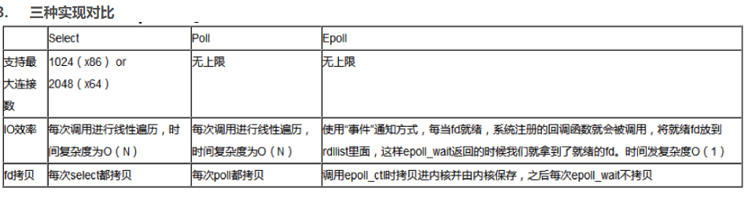

#### 信号驱动IO

应该程序进行Read系统调用，不会阻塞，立即返回，操作系统收到系统调用请求后，等待内核缓冲区数据准备好后，通过信号通知应用程序，应用程序再进行Read系统调用，内核将内核缓冲区中的数据拷贝到用户缓冲区，调用完成。

1. 优点：在等待内核缓冲区数据准备好过程中应用程序不会阻塞，当准备好后，通知应用程序，不用像同步非阻塞IO一样去轮询内核。
2. 缺点：依据是同步IO，因为在内核将内核缓冲区数据拷贝到用户缓冲区过程中，应用程序会阻塞。


#### 异步IO

应用程序进行Read系统调用，不会阻塞，立即返回。操作系统收到系统调用请求后，等待内核数据准备好，内核将内核缓冲区数据拷贝到用户缓冲区，完成后通过信号或者应用程序注册的回调函数通知应用程序，完成调用。

1. 优点：在内核将内核缓冲区数据拷贝到用户缓冲区过程应用程序也不会阻塞，是真正的异步IO。
2. 缺点：异步IO还不是太成熟，底层依旧使用epoll机制，没有很好的实现异步IO，性能没有明显提升。 

​      

## 序列化与反序列化

### 概念

序列化：是把对象的状态信息转化为可存储或传输的形式过程，也就是把对象转化为字节序列 的过程称为对象的序列化

反序列化：是序列化的逆向过程，把字节数组反序列化为对象，把字节序列恢复为对象的过程 成为对象的反序列化

### 什么情况下需要序列化

1. 当你想把的内存中的对象状态保存到一个文件中或者数据库中时候；
2. 当你想用套接字在网络上传送对象的时候；
3. 当你想通过RMI传输对象的时候；

(老实说，上面的几种，我可能就用过存数据库的)

### 什么是Java序列化，如何实现Java序列化？

1. 序列化就是一种用来处理对象流的机制，将对象的内容进行流化。可以对流化后的对象进行读写操作，可以将流化后的对象传输于网络之间。**序列化是为了解决在对象流读写操作时所引发的问题**
2. 序列化的实现：将需要被序列化的类实现Serialize接口，没有需要实现的方法，此接口只是为了标注对象，且告诉JVM该对象可被序列化的。

### 如何实现序列化

实现Serializable接口即可

~~~java
public class Stock implements Serializable {
    private static final long serialVersionUID = 1L;
}
~~~

### serialVersionUID 的作用

​		Java 的序列化机制是通过判断类的 `serialVersionUID` 来验证版本一致性的。在进行反序列化 时，`JVM` 会把传来的字节流中的 `serialVersionUID` 与本地相应实体类的 `serialVersionUID` 进行比较，如果相同就认为是一致的，可以进行反序列化，否则就会出现序列化版本不一致的 异常，即是`InvalidCastException`。

​		文件流中的 `class` 和` classpath` 中的 `class`，也就是修改过后的 class，二者理论上是不同的，出于安全机制考虑，程序抛出了错误，并且拒绝载入。、如果没有为 指定的class配置`serialVersionUID`，那么java编译器会自动给这个class进行一个摘要算法， 类似于指纹算法，只要这个文件有任何改动，得到的`UID`就会截然不同的，可以保证在这么 多类中，这个编号是唯一的。所以，由于没有显指定 `serialVersionUID`，编译器又为我们生成了一个 `UID`，当然和前面保存在文件中的那个不会一样了，于是就出现了 2 个序列化版本号 不一致的错误。因此，只要我们自己指定了`serialVersionUID`，就可以在序列化后，去添加一个字段，或者方法，而不会影响到后期的还原，还原后的对象照样可以使用，而且还多了方法或者属性可以用。

### **Transient**

​		Transient 关键字的作用是控制变量的序列化，在变量声明前加上该关键字，可以阻止该变量被序列化到文件中，在被反序列化后，transient 变量的值被设为初始值，如 

+ int 型的是 0，
+ 对象型的是 null。

### 简单总结

1. Java序列化只是针对对象的状态进行保存，至于对象中的方法，序列化不关心
2. 当一个父类实现了序列化，那么子类会自动实现序列化，不需要显示实现序列化接口
3. 当一个对象的实例变量引用了其他对象，序列化这个对象的时候会自动把引用的对象也进行序列化（实现深度克隆）
4. 当某个字段被申明为transient后，默认的序列化机制会忽略这个字段
5. 被申明为 transient 的字段，如果需要序列化，可以添加两个私有方法：writeObject 和 readObject

### 分布式架构下序列化技术

​		初步了解了Java序列化的知识以后，我们又得回到分布式架构中，了解序列化的发展过程

#### 了解序列化的发展

​		随着分布式架构、微服务架构的普及。服务与服务之间的通信成了最基本的需求。这个时候， 我们不仅需要考虑通信的性能，也需要考虑到语言多元化问题，所以，对于序列化来说，如何去提升序列化性能以及解决跨语言问题，就成了一个重点考虑 的问题。由于Java本身提供的序列化机制存在两个问题

1. 序列化的数据比较大，传输效率低
2. 其他语言无法识别和对接

+ 第一阶段：基于XML格式编码的对象序列化机制成为了主流，一方面解决了多语言兼容问题，另一方面比二进制的序列化方式更容易理解。以至于基于`XML`的`SOAP` 协议及对应的`WebService`框架在很长一段时间内成为各个主流开发语言的必备的技术。
+ 第二阶段：再到后来，基于 JSON 的简单文本格式编码的 HTTP REST 接口又基本上取代了复杂的 Web Service 接口，成为分布式架构中远程通信的首要选择。
+ 第三阶段：但是 `JSON` 序列化存储占用的空间大、性能低等问题，同时移动客户端应用需要更高效的传输数据来提升用户体验。在这种情况下与语言无关并且高效的二进制编码协议就成为了大家追求的热点技术之一。
  1. 首先诞生的 一个开源的二进制序列化框架-`MessagePack`。
  1. 它比 `google` 的 `Protocol Buffer`s 出现得还要早。


## 反射

### 自定义注解

+ 注解+反射，是框架设计的灵魂
+ 注解本身没有任何意义，需要加上注解的解析程序，才能够为注解提供灵魂，完整的程序框架体系，从而实现更加复杂的功能

~~~java
@Target(value = ElementType.METHOD)    // 表示只能用在方法上，可以定义数组
//设置注解信息的生命周期
@Target(value = {ElementType.METHOD,ElementType.TYPE})@Retention(value = RetentionPolicy.RUNTIME)  
public @interface MyAnno {   
    //定义变量，设置默认值。    
    //如果只有一个参数，一般定义成value    
    String value() default "";    
    String StudentName() default "";    
    int age() default 0;    
    String[] arr() default {"清华大学","北京大学"};
}
// 然后通过注解，可以给注解程序赋值
@MyAnno(age = 19,arr = {"南京大学"},StudentName = "Marry")    
public static int[] sortIntByBubbling(int[] arr ){
    
}
~~~


### 什么是反射机制？

​		JAVA反射机制是在运行状态中，对于任意一个类，都能够知道这个类的所有属性和方法；对于任意一个对象，都能够调用它的任意一个方法和属性；这种动态获取的信息以及动态调用对象的方法的功能称为`java`语言的反射机制。

静态编译和动态编译

- **静态编译：**在编译时确定类型，绑定对象
- **动态编译：**运行时确定类型，绑定对象


### 反射机制优缺点

- **优点：** 运行期类型的判断，动态加载类，提高代码灵活度。
- **缺点：** 性能瓶颈：反射相当于一系列解释操作，通知 `JVM` 要做的事情，性能比直接的`Java`代码要慢很多。


### 反射机制的应用场景有哪些？

​		反射是框架设计的灵魂。实际上有很多设计、开发都与反射机制有关，例如模块化的开发，通过反射去调用对应的字节码；动态代理设计模式也采用了反射机制，还有我们日常使用的 Spring／Hibernate 等框架也大量使用到了反射机制。

举例：

1. 我们在使用`JDBC`连接数据库时使用`Class.forName()`通过反射加载数据库的驱动程序；
2. `Spring`框架也用到很多反射机制，最经典的就是`xml`的配置模式。


### Java获取反射的三种方法

1.通过new对象实现反射机制 

2.通过路径实现反射机制 

3.通过类名实现反射机制

```java
public class Student {    
    private int id;    
    String name;    
    protected boolean sex;    
    public float score;
}

public class Get {    
    //获取反射机制三种方式    
    public static void main(String[] args) throws ClassNotFoundException {        
        //方式一(通过建立对象)        
        Student stu = new Student();        
        Class classobj1 = stu.getClass();       
        System.out.println(classobj1.getName());        
        
        //方式二（所在通过路径-相对路径）        
        Class classobj2 = Class.forName("fanshe.Student");        
        System.out.println(classobj2.getName());        
        
        //方式三（通过类名）        
        Class classobj3 = Student.class;       
        System.out.println(classobj3.getName());    
    }
}
```


### 如何提高反射效率

- 尽量不要`getMethods()`后再遍历筛选，而直接用`getMethod(methodName)`来根据方法名获取方法。
- 需要多次动态创建一个类的实例的时候，使用有缓存的写法，可是使用Hashmap之类的数据存储功能

```java
void createInstance(String className){    
    cachedClass = cache.get(className);    
    if (cachedClass == null) {        
        // Class.forName耗时        
        cachedClass = Class.forName(className);        
        cache.set(className, cachedClass);    
    }    
    return cachedClass.newInstance();
}
```

- 使用高性能的反射库，比自己写缓存效果好，如joor，或者apache的commons相关工具类。
- 使用高版本JDK也很重要，反射性能一直在提高。


## 常用API

### Date相关

1. java.util.Date类表示特定的日期和时间，精确到毫秒

【构造方法】

```java 
  Date date = new Date();    
//返回当前时间，默认的输出格式为
Tue Aug 13 21:33:30 CST 2019   
    三种时间标准   
    CST---Central Standard Time   
    GMT---Greenwich Mean Time  
    UTC---Coordinated Universal Time 
```

【常用方法】

```java
getTime()方法  
    //返回从1970年1月1日 00:00:00 GMT到此Date之间的毫秒数before(Date date)   
    //判断是否在指定日期之前，即是否小于指定日期after(Date date)      
    //判断是否在指定日期之后，即是否大于指定日期Date类中的大部分方法已过时， 
    //如果需要获取和设置日期和时间，推荐使用Calendar类
```

1. Date类有三个子类，都位于java.sql包中

   java.sql.Date //日期，YYYY-MM-DD
   java.sql.Time //时间，HH:mm:ss
   java.sql.Timestamp //时间戳，YYYY-MM-DD HH:mm:ss.SSS，精确到毫秒

### Calendar类

- 日期时间操作的抽象类

1. java.util.Calendar类是表示日期时间的抽象类，精确到毫秒，通过工厂方法创建

   Calendar c = Calendar.getInstance();

2. 该抽象类的具体子类为GregorianCalendar，提供了世界上大多数国家使用的标准日历

3. 该类提供的常量和方法—参见API文档

~~~java
void set(int year, int month, int date) //设置日期
void set(int year, int month, int date, int hourOfDay, int minute, int second) //设置日期时间

int get(Calendar.YEAR); //返回年份
int get(Calendar.MONTH); //返回月份，需要加1
int get(Calendar.DAY_OF_YEAR); //返回是本年的第几天
int get(Calendar.DAY_OF_MONTH); //返回是本月的第几天
int get(Calendar.DAY_OF_WEEK); //返回是本周的第几天 周日(1) 周一(2) 周六(7)
int get(Calendar.HOUR); //返回小时数
int get(Calendar.MINUTE); //返回分钟数
int get(Calendar.SECOND); //返回秒数

void add(int field, int amount); //给指定字段添加或减去amount个时间单位
~~~

【Calendar类和Date类之间的转换】

```java
 Calendar --> Date       Date getTime() 
 Date --> Calendar       void setTime(Date date)
```

###   DateFormat类

- 日期格式的抽象类

1. java.text.DateFormat类是表示日期时间格式的抽象类，提供基于默认或给定语言环境和多种格式化风格的时间日期

   DateFormat df = new SimpleDateFormat(String pattern); //yyyy年MM月dd日 HH时mm分ss秒

2. DateFormat抽象类最常见的具体子类为SimpleDateFormat

   日期和时间模式：y(年) M(月) d(日) H(时) M(分) d(秒) S(毫秒)

【Date类和String类之间的转换】

```
 Date parse(String source)            // String --> Date   
 String format(Date date)    	          // Date --> String 
```


### 日期的格式化方式

#### 1. 菜鸟实现

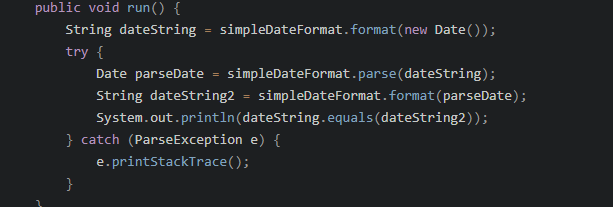

#### 2. LocalDateTime

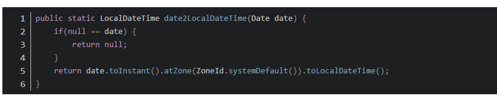

#### 3. common-lang3老鸟实现

相信大家在项目开发过程中都多少使用过common-lang3中的一些API，都非常简单实用。在时间格式化方面，也给我们提供了非常好用的工具类DateFormatUtils。这也是我最推荐的方式。首先需要在项目中引入common-lang3的依赖。

    <dependency>
        <groupId>org.apache.commons</groupId>
        <artifactId>commons-lang3</artifactId>
        <version>3.11</version>
    </dependency>

~~~java
Date now = new Date(); // 创建一个Date对象，获取当前时间
String strDateFormat = "yyyy-MM-dd HH:mm:ss";
String result  = DateFormatUtils.format(now,strDateFormat);
System.out.println("DateFormatUtils:"+result);
~~~

**好处：**

1. 线程安全
2. 简单高效
3. 占用更小的内存

DateFormatUtils.format的内部实现中，是通过FastDateFormat进行时间格式化，而且对FastDateFormat对象进行了缓存处理，保证相同模式的格式化类型下不用重复生成FastDateFormat对象。

#### 总结

1. SimpleDateFormat时间格式化主要的问题是非线程安全，多线程情况下会出现问题，通过跟踪源码说明了SimpleDateFormat非线程安全的原因，并提供了相应的解决方案。
2. java8下推荐的采用DateTimeFormatter进行时间格式化的使用方式，并提供了date到LocalDateTime、LocalDate的转换方式。
3. 采用common-lang3中的DateFormatUtils实现时间格式化是最推荐的，线程安全、API简单高效、占用内存低。并推荐了通过继承DateFormatUtils对象封装自己的时间工具类DateUtils方式。

## 日志

### 常用的日志框架

` Java Logging API]（Oracle）`—— Java默认的日志框架

 `Log4j（Apache）`——开源日志框架

`Logback`（`Logback` Project）——开源项目，被设计成`Log4j`版本1的后续版本

`tinylog（tinylog）`——轻量级开源logger

### 日志输出级别

ERROR 为严重错误 主要是程序的错误

WARN 为一般警告，比如session丢失

INFO 为一般要显示的信息，比如登录登出

DEBUG 为程序的调试信息


### Log4j2 漏洞

#### 原理

原理就是**`JNDI`代码注入**。通过`log4j2`调用`JNDI`服成功的上传了自己的代码到用户服务中

#### 漏洞补救

1. `log4j2.formatMsgNoLookups=true`按照官方`api`解释说明，当这个值为true时，就不执行`lookup`了。

2. 防火墙，禁止应用服务访问奇怪的`ip`

#### 漏洞解决

1. 升级到`2.17.1`


### SLF4J日志门面

 简单日志门面(Simple Logging Facade For Java) SLF4J主要是为了给Java日志访问提供一套标准、规范的API框架，其主要意义在于提供接口，具体的实现可以交由其他日志框架，例如log4j和logback等。 当然slf4j自己也提供了功能较为简单的实现，但是一般很少用到。对于一般的Java项目而言，日志框架 会选择slf4j-api作为门面，配上具体的实现框架（log4j、logback等），中间使用桥接器完成桥接。官方网站： https://www.slf4j.org/

SLF4J是目前市面上最流行的日志门面。现在的项目中，基本上都是使用SLF4J作为我们的日志系统。

SLF4J日志门面主要提供两大功能：

1. 日志框架的绑定
2. 日志框架的桥接

### 我们为什么要使用日志门面：

1. 面向接口开发，不再依赖具体的实现类。减少代码的耦合
2. 项目通过导入不同的日志实现类，可以灵活的切换日志框架
3. 统一API，方便开发者学习和使用
4. 统一配置便于项目日志的管理

### SLF4J原理解析

1. SLF4J通过LoggerFactory加载日志具体的实现对象。
2. LoggerFactory在初始化的过程中，会通过performInitialization()方法绑定具体的日志实现。
3. 在绑定具体实现的时候，通过类加载器，加载org/slf4j/impl/StaticLoggerBinder.class
4. 所以，只要是一个日志实现框架，在org.slf4j.impl包中提供一个自己的StaticLoggerBinder类，在其中提供具体日志实现的LoggerFactory就可以被SLF4J所加载


###  `SpringBoot` 日志

#### 1. 日志框架

JUL、JCL、Logback、Log4J 常见上有很多的log框架

目前比较流行的组合

日志门面是：`SLF4J`

日志实现是：`Logback`

`SpringBoot`：`Spring`默认使用`JCL`，`SpringBoot`选用`SLF4J`和`LogBack`

#### 2. `SLF4J`

1. 以后的开发的守护，日志记录方法的调用，不应该直接用实现类，而是应该调用抽象层的方法

2. 使用方法，只需要加入一段代码即可

~~~java
import org.slf4j.Logger;
import org.slf4j.LoggerFactory;

public class HelloWorld {  
    public static void main(String[] args) {   
        Logger logger = LoggerFactory.getLogger(HelloWorld.class);    
        logger.info("Hello World");  
    }
}
~~~


每一个日志的实现框架都有自己的配置文件

#### 3. 遗留问题

每个框架对于日志支持是不同的，所以同一个框架可能日志记录很不同，所以需要统一日志的框架，替换原先的Jar包

  

#### 4. Spring Boot日志

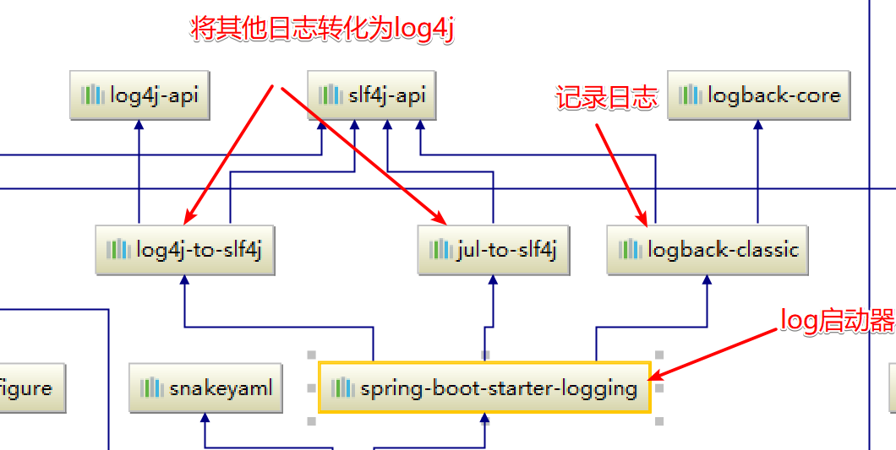 

​		如果我们要引入其他框架，一定要把这个框架的默认日志依赖移除掉，然后SpringBoot能够使用所有的日志，我们需要做的是只需要排除其他框架的日志框架

~~~java
Logger logger = LoggerFactory.getLogger(getClass());		
//日志的级别由低到高，日志级别只会显示更高级别，SpringBoot默认使用info级别        
logger.trace("这是日志");        
logger.debug("这是调试");        
logger.info("这是info");        
logger.warn("警告");        
logger.error("error");		
//生成指定的log文件，可以指定完整的路径		
logger.file="d:/***.log"        
//生成log到指定的文件夹（logger.path使用更多）        
logger.path=""       	
//通过修改配置文件可以达到在指定位置实现日志的输出            
~~~

profile 

可以指定日志的功能在某些**特殊的环境**下实现

使用**Logback-spring.xml**进行日志的加载配置，然后有SpringBoot解析日志的配置


#### 5. SpringBoot日志替换

可以切换日志的记录方式


# Java异常

## Java异常架构与异常关键字

### Java异常简介

​		Java异常是Java提供的一种识别及响应错误的一致性机制。异常能清晰的回答what, where, why这3个问题：异常类型回答了“什么”被抛出，异常堆栈跟踪回答了“在哪”抛出，异常信息回答了“为什么”会抛出。

### Java异常架构

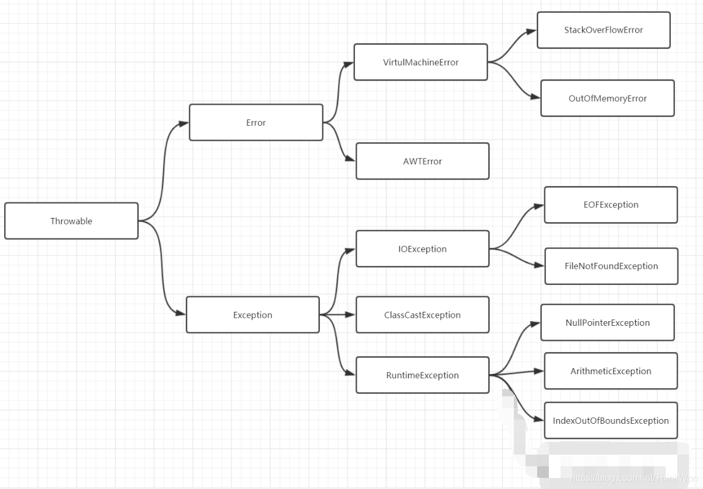

#### 1. Throwable

Throwable 是 Java 语言中所有错误与异常的超类。

Throwable 包含两个子类：Error（错误）和 Exception（异常），它们通常用于指示发生了异常情况。

Throwable 包含了其线程创建时线程执行堆栈的快照，它提供了 printStackTrace() 等接口用于获取堆栈跟踪数据等信息。


#### 2. Error（错误）

**定义**：Error 类及其子类。程序中无法处理的错误，表示运行应用程序中出现了严重的错误。

**特点**：此类错误一般表示代码运行时 JVM 出现问题。通常有 Virtual MachineError（虚拟机运行错误）、NoClassDefFoundError（类定义错误）等。**比如 OutOfMemoryError：内存不足错误；StackOverflowError：**栈溢出错误。此类错误发生时，JVM 将终止线程。

这些错误是不受检异常，非代码性错误。因此，当此类错误发生时，应用程序不应该去处理此类错误。按照Java惯例，我们是不应该实现任何新的Error子类的！


#### 3. Exception（异常）

​		程序本身可以捕获并且可以处理的异常。Exception 这种异常又分为两类：运行时异常和编译时异常。

##### 运行时异常

​		**定义**：RuntimeException 类及其子类，表示 JVM 在运行期间可能出现的异常。

​		**特点**：Java 编译器不会检查它。此类异常属于不受检异常，一般是由程序逻辑错误引起的，在程序中可以选择捕获处理，也可以不处理。虽然 Java 编译器不会检查运行时异常，但是我们也可以通过 throws 进行声明抛出，也可以通过 try-catch 对它进行捕获处理

​		RuntimeException 异常会由 Java 虚拟机自动抛出并自动捕获（**就算我们没写异常捕获语句运行时也会抛出错误**！！），此类异常的出现绝大数情况是代码本身有问题应该从逻辑上去解决并改进代码。


##### 编译时异常

**定义**: Exception 中除 RuntimeException 及其子类之外的异常。

​		**特点**: Java 编译器会检查它。如果程序中出现此类异常，

该异常我们必须手动在代码里添加捕获语句来处理该异常**。

##### 详解`EOFException` 

​		最近线上的系统被检测出有错误日志，领导让我检查下问题，我就顺便了解了下这个异常。了解一个类，当然是先去看他的API，EOFException的API如下：

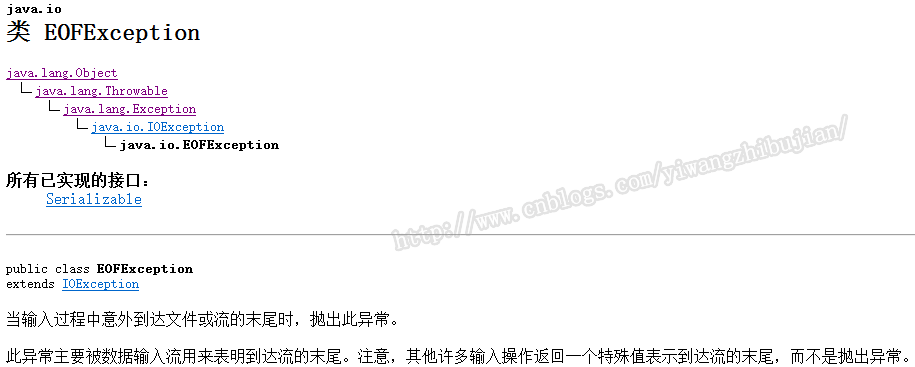

　　通过这个API，我们可以得出以下信息：

- 这是一个IO异常的子类，名字也是END OF FILE的缩写，当然也表示流的末尾
- 它在表明一个信息，流已经到末尾了，而大部分做法是以特殊值的形式返回给我们，而不是抛异常

　　也就是说这个异常是被主动抛出来的，而不是底层或者编译器返回给我的，就像NullPointerException或IndexOutOfBoundsException一样。

　　我们先来看`InputStream`，这个输入流，当读到了结尾会怎么样，看看API介绍：

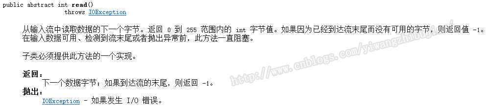

　　可以看到如果到达流的末尾，那么会返回-1，也就是说我们可以根据这个-1来判断是否到达流的末尾。

　　同样的我们看一下输入流的包装类BufferedReader，它有一个读一行的方法：

 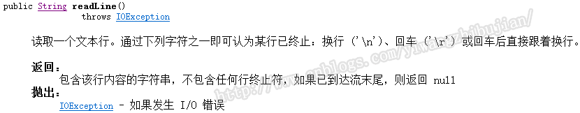

　　也可以发现当读到流的末尾，通过返回值null来告诉我们到达流的末尾了，也就是说通过返回一个不可能的值来表示到达流的末尾。

​		对于这种异常的一般解决方法就是，捕获，可以记录日志，也可以不做处理，捕获异常以后，把之前读到的数据进行后续的处理就可以了，因为那就是所以的数据。还有就是如果打算记录日志，不要把它的堆栈信息打印出来，容易给人以错觉。毕竟`EOFException`实质上只是一个消息而已。

　　当然抛异常的做法还是有一些偏激，但是当`ObjectInputStream`在不知道读取对象数量的情况下，确实无法判断是否读完，除非你把之前写入对象流的数量记录下来。所以说出现这个异常时就认真分析一下，这个异常是不是代表一个信息。


#### 4. 受检异常与非受检异常

​		Java 的所有异常可以分为受检异常（checked exception）和非受检异常（unchecked exception）。

##### 受检异常

​		编译器要求必须处理的异常。正确的程序在运行过程中，经常容易出现的、符合预期的异常情况。一旦发生此类异常，就必须采用某种方式进行处理。**除 RuntimeException 及其子类外，其他的 Exception 异常都属于受检异常**。编译器会检查此类异常，也就是说当编译器检查到应用中的某处可能会此类异常时，将会提示你处理本异常——要么使用try-catch捕获，要么使用方法签名中用 throws 关键字抛出，否则编译不通过。

##### 非受检异常

​		编译器不会进行检查并且不要求必须处理的异常，也就说当程序中出现此类异常时，即使我们没有try-catch捕获它，也没有使用throws抛出该异常，编译也会正常通过。**该类异常包括运行时异常（RuntimeException极其子类）和错误（Error）。**


### Java异常关键字

• **try** – 用于监听。将要被监听的代码(可能抛出异常的代码)放在try语句块之内，当try语句块内发生异常时，异常就被抛出。

 • **catch** – 用于捕获异常。catch用来捕获try语句块中发生的异常。

 • **finally** – finally语句块总是会被执行。它主要用于回收在try块里打开的物力资源(如数据库连接、网络连接和磁盘文件)。

 • **throw** – 用于抛出异常。

 • **throws** – 用在方法签名中，用于声明该方法可能抛出的异常。


## Java异常处理

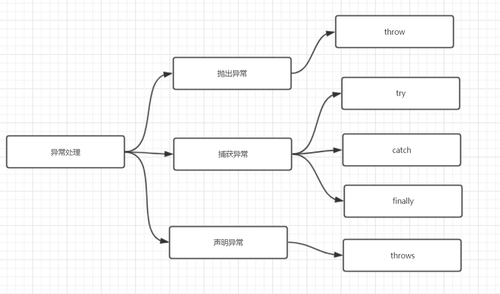

​		Java 通过面向对象的方法进行异常处理，一旦方法抛出异常，系统自动根据该异常对象寻找合适异常处理器（Exception Handler）来处理该异常，把各种不同的异常进行分类，并提供了良好的接口。在 Java 中，每个异常都是一个对象，它是 Throwable 类或其子类的实例。当一个方法出现异常后便抛出一个异常对象，该对象中包含有异常信息，调用这个对象的方法可以捕获到这个异常并可以对其进行处理。Java 的异常处理是通过 5 个关键词来实现的：try、catch、throw、throws 和 finally。

​		在Java应用中，异常的处理机制分为声明异常，抛出异常和捕获异常。

### 声明异常

​		通常，应该捕获那些知道如何处理的异常，将不知道如何处理的异常继续传递下去。传递异常可以在方法签名处使用 **throws** 关键字声明可能会抛出的异常。

注意

- 非检查异常（Error、RuntimeException 或它们的子类）不可使用 throws 关键字来声明要抛出的异常。
- 一个方法出现编译时异常，就需要 try-catch/ throws 处理，否则会导致编译错误。

### 抛出异常

​		如果你觉得解决不了某些异常问题，且不需要调用者处理，那么你可以抛出异常。

​		throw关键字作用是在方法内部抛出一个`Throwable`类型的异常。任何Java代码都可以通过throw语句抛出异常。

### 捕获异常

​		程序通常在运行之前不报错，但是运行后可能会出现某些未知的错误，但是还不想直接抛出到上一级，那么就需要通过try…catch…的形式进行异常捕获，之后根据不同的异常情况来进行相应的处理。

### 如何选择异常类型

​		可以根据下图来选择是捕获异常，声明异常还是抛出异常

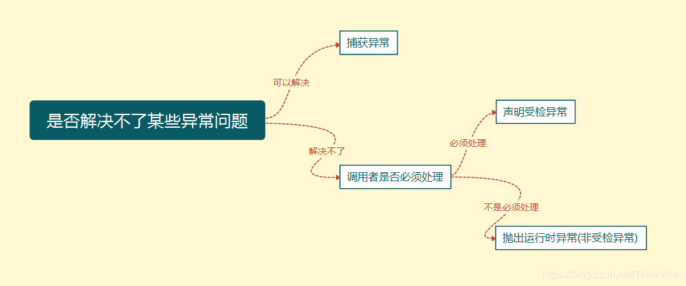

### 常见异常处理方式

#### 直接抛出异常

​		通常，应该捕获那些知道如何处理的异常，将不知道如何处理的异常继续传递下去。传递异常可以在方法签名处使用 **throws** 关键字声明可能会抛出的异常。

```java
private static void readFile(String filePath) throws IOException {    
    File file = new File(filePath);    
    String result;    
    BufferedReader reader = new BufferedReader(new FileReader(file));   
    while((result = reader.readLine())!=null) {        
        System.out.println(result);   
    }    
    reader.close();
}
```

#### 封装异常再抛出

​		有时我们会从 catch 中抛出一个异常，目的是为了改变异常的类型。多用于在多系统集成时，当某个子系统故障，异常类型可能有多种，可以用统一的异常类型向外暴露，不需暴露太多内部异常细节。

```java
private static void readFile(String filePath) throws MyException {        
    try {       
        // code   
    } catch (IOException e) {       
        MyException ex = new MyException("read file failed.");       
        ex.initCause(e);        
        throw ex;    
    }
}
```

#### 捕获异常

在一个 try-catch 语句块中可以捕获多个异常类型，并对不同类型的异常做出不同的处理

```java
private static void readFile(String filePath) {   
    try {        
        // code   
    } catch (FileNotFoundException e) {       
        // handle FileNotFoundException    
    } catch (IOException e){        
        // handle IOException    
    }
}
```

同一个 catch 也可以捕获多种类型异常，用 | 隔开

``` java
private static void readFile(String filePath) {    
    try {       
        // code    
    } catch (FileNotFoundException | UnknownHostException e) {        
        // handle FileNotFoundException or UnknownHostException    
    } catch (IOException e){       
        // handle IOException   
    }
}
```

#### 自定义异常

​		习惯上，定义一个异常类应包含两个构造函数，一个无参构造函数和一个带有详细描述信息的构造函数（`Throwable` 的 `toString` 方法会打印这些详细信息，调试时很有用）

```java
public class MyException extends Exception {    
    public MyException(){ }    
    public MyException(String msg){       
        super(msg);   
    }    
    // ...
}
```

#### try-catch-finally

​		当方法中发生异常，异常处之后的代码不会再执行，如果之前获取了一些本地资源需要释放，则需要在方法正常结束时和 catch 语句中都调用释放本地资源的代码，显得代码比较繁琐，finally 语句可以解决这个问题。

```java
private static void readFile(String filePath) throws MyException {    
    File file = new File(filePath);    
    String result;   
    BufferedReader reader = null;   
    try {        
        reader = new BufferedReader(new FileReader(file));        
        while((result = reader.readLine())!=null) {            
            System.out.println(result);        
        }    
    } catch (IOException e) {       
        System.out.println("readFile method catch block.");        
        MyException ex = new MyException("read file failed.");       
        ex.initCause(e);        
        throw ex;    
    } finally {        
        System.out.println("readFile method finally block.");        
        if (null != reader) {           
            try {               
                reader.close();            
            } catch (IOException e) {               
                e.printStackTrace();           
            }       
        }    
    }
}
```

​		调用该方法时，读取文件时若发生异常，代码会进入 catch 代码块，之后进入 finally 代码块；若读取文件时未发生异常，则会跳过 catch 代码块直接进入 finally 代码块。所以无论代码中是否发生异常，fianlly 中的代码都会执行。

若 catch 代码块中包含 return 语句，finally 中的代码还会执行吗？将以上代码中的 catch 子句修改如下：

```java 
catch (IOException e) {   
    System.out.println("readFile method catch block.");    
    return;
}
```

调用 readFile 方法，观察当 catch 子句中调用 return 语句时，finally 子句是否执行

```
readFile method catch block.readFile method finally block.
```

可见，即使 catch 中包含了 return 语句，finally 子句依然会执行。若 finally 中也包含 return 语句，finally 中的 return 会覆盖前面的 return.

#### try-with-resource

上面例子中，finally 中的 close 方法也可能抛出` IOException`, 从而覆盖了原始异常。JAVA 7 提供了更优雅的方式来实现资源的自动释放，自动释放的资源需要是实现了 `AutoCloseable` 接口的类。

```java
private  static void tryWithResourceTest(){    
    try (Scanner scanner = new Scanner(new FileInputStream("c:/abc"),"UTF-8"))
    {       
        // code   
    } catch (IOException e){      
        // handle exception    
    }
}
```

try 代码块退出时，会自动调用 `scanner.close` 方法，和把 `scanner.close` 方法放在 finally 代码块中不同的是，若 `scanner.close `抛出异常，则会被抑制，抛出的仍然为原始异常。被抑制的异常会由 `addSusppressed` 方法添加到原来的异常，如果想要获取被抑制的异常列表，可以调用 `getSuppressed` 方法来获取。


## Java异常常见面试题

### 1. Error 和 Exception 区别是什么？

​		Error 类型的错误通常为虚拟机相关错误，如系统崩溃，内存不足，堆栈溢出等，编译器不会对这类错误进行检测，JAVA 应用程序也不应对这类错误进行捕获，一旦这类错误发生，通常应用程序会被终止，仅靠应用程序本身无法恢复；

​		Exception 类的错误是可以在应用程序中进行捕获并处理的，通常遇到这种错误，应对其进行处理，使应用程序可以继续正常运行。


### 2. 运行时异常和一般异常(受检异常)区别是什么？

​		运行时异常包括 `RuntimeException` 类及其子类，表示 `JVM` 在运行期间可能出现的异常。 Java 编译器不会检查运行时异常。

​		受检异常是Exception 中除 `RuntimeException` 及其子类之外的异常。 Java 编译器会检查受检异常。

​		**RuntimeException异常和受检异常之间的区别**：是否强制要求调用者必须处理此异常，如果强制要求调用者必须进行处理，那么就使用受检异常，否则就选择非受检异常(RuntimeException)。一般来讲，如果没有特殊的要求，我们建议使用RuntimeException异常。


### 3. JVM 是如何处理异常的？

​		在一个方法中如果发生异常，这个方法会创建一个异常对象，并转交给 JVM，该异常对象包含异常名称，异常描述以及异常发生时应用程序的状态。创建异常对象并转交给 JVM 的过程称为抛出异常。可能有一系列的方法调用，最终才进入抛出异常的方法，这一系列方法调用的有序列表叫做调用栈。

​		JVM 会顺着调用栈去查找看是否有可以处理异常的代码，如果有，则调用异常处理代码。当 JVM 发现可以处理异常的代码时，会把发生的异常传递给它。如果 JVM 没有找到可以处理该异常的代码块，JVM 就会将该异常转交给默认的异常处理器（默认处理器为 JVM 的一部分），默认异常处理器打印出异常信息并终止应用程序。


### 4. throw 和 throws 的区别是什么？

​		Java 中的异常处理除了包括捕获异常和处理异常之外，还包括声明异常和拋出异常，可以通过 throws 关键字在方法上声明该方法要拋出的异常，或者在方法内部通过 throw 拋出异常对象。

**throws 关键字和 throw 关键字在使用上的几点区别如下**：

- throw 关键字用在**方法内部**，只能用于抛出一种异常，用来抛出方法或代码块中的异常，受查异常和非受查异常都可以被抛出。
- throws 关键字用在**方法声明**上，可以抛出多个异常，用来标识该方法可能抛出的异常列表。一个方法用 throws 标识了可能抛出的异常列表，调用该方法的方法中必须包含可处理异常的代码，否则也要在方法签名中用 throws 关键字声明相应的异常。


### 5. final、finally、finalize 有什么区别？

- final可以修饰类、变量、方法，修饰类表示该类不能被继承、修饰方法表示该方法不能被重写、修饰变量表示该变量是一个常量不能被重新赋值。

- finally一般作用在try-catch代码块中，在处理异常的时候，通常我们将一定要执行的代码方法finally代码块中，表示不管是否出现异常，该代码块都会执行，一般用来存放一些关闭资源的代码。

- finalize是一个方法，属于Object类的一个方法，而Object类是所有类的父类，Java 中允许使用 finalize()方法在垃圾收集器将对象从内存中清除出去之前做必要的清理工作。

  

### 6. NoClassDefFoundError 和 ClassNotFoundException 区别？

​		NoClassDefFoundError 是一个 Error 类型的异常，是由 JVM 引起的，不应该尝试捕获这个异常。

​		引起该异常的原因是 JVM 或 ClassLoader 尝试加载某类时在内存中找不到该类的定义，该动作发生在运行期间，即编译时该类存在，但是在运行时却找不到了，可能是变异后被删除了等原因导致；

​		ClassNotFoundException 是一个受查异常，需要显式地使用 try-catch 对其进行捕获和处理，或在方法签名中用 throws 关键字进行声明。当使用 Class.forName, ClassLoader.loadClass 或 ClassLoader.findSystemClass 动态加载类到内存的时候，通过传入的类路径参数没有找到该类，就会抛出该异常；另一种抛出该异常的可能原因是某个类已经由一个类加载器加载至内存中，另一个加载器又尝试去加载它。


### 7. try-catch-finally 中哪个部分可以省略？

答：catch 可以省略

**原因**

​		更为严格的说法其实是：try只适合处理运行时异常，try+catch适合处理运行时异常+普通异常。也就是说，如果你只用try去处理普通异常却不加以catch处理，编译是通不过的，因为编译器硬性规定，普通异常如果选择捕获，则必须用catch显示声明以便进一步处理。而运行时异常在编译时没有如此规定，所以catch可以省略，你加上catch编译器也觉得无可厚非。

​		理论上，编译器看任何代码都不顺眼，都觉得可能有潜在的问题，所以你即使对所有代码加上try，代码在运行期时也只不过是在正常运行的基础上加一层皮。但是你一旦对一段代码加上try，就等于显示地承诺编译器，对这段代码可能抛出的异常进行捕获而非向上抛出处理。如果是普通异常，编译器要求必须用catch捕获以便进一步处理；如果运行时异常，捕获然后丢弃并且+finally扫尾处理，或者加上catch捕获以便进一步处理。

​		至于加上finally，则是在不管有没捕获异常，都要进行的“扫尾”处理。


### 8. try-catch-finally 中，如果 catch 中 return 了，finally 还会执行吗？

​		答：会执行，在 return 前执行。

​		**注意**：在 finally 中改变返回值的做法是不好的，因为如果存在 finally 代码块，try中的 return 语句不会立马返回调用者，而是记录下返回值待 finally 代码块执行完毕之后再向调用者返回其值，然后如果在 finally 中修改了返回值，就会返回修改后的值。显然，在 finally 中返回或者修改返回值会对程序造成很大的困扰，C#中直接用编译错误的方式来阻止程序员干这种龌龊的事情，Java 中也可以通过提升编译器的语法检查级别来产生警告或错误。

**代码示例1：**

```java
public static int getInt() {    
    int a = 10;    
    try {        
        System.out.println(a / 0);        
        a = 20;    
    } catch (ArithmeticException e) {       
        a = 30;        
        return a;        
        /*         
        * return a 在程序执行到这一步的时候，这里不是return a 而是 return 30；这个返回路径就形成了         
        * 但是呢，它发现后面还有finally，所以继续执行finally的内容，a=40        
        * 再次回到以前的路径,继续走return 30，形成返回路径之后，这里的a就不是a变量了，而是常量30         
        */    
    } finally {        
        a = 40;    
    }    
    return a;
}
```

执行结果：30

**代码示例2：**

```java
public static int getInt() {    
    int a = 10;    
    try {        
        System.out.println(a / 0);        
        a = 20;    
    } catch (ArithmeticException e) {        
        a = 30;        
        return a;    
    } finally {        
        a = 40;        
        //如果这样，就又重新形成了一条返回路径，由于只能通过1个return返回，所以这里直接返回40        
        return a;     
    }
}
```

执行结果：40


### 10. 常见的 RuntimeException 有哪些？

- ClassCastException(类转换异常)
- IndexOutOfBoundsException(数组越界)
- NullPointerException(空指针)
- ArrayStoreException(数据存储异常，操作数组时类型不一致)
- 还有IO操作的BufferOverflowException异常


### 11. Java常见异常有哪些

java.lang.IllegalAccessError：违法访问错误。当一个应用试图访问、修改某个类的域（Field）或者调用其方法，但是又违反域或方法的可见性声明，则抛出该异常。

java.lang.InstantiationError：实例化错误。当一个应用试图通过Java的new操作符构造一个抽象类或者接口时抛出该异常.

java.lang.OutOfMemoryError：内存不足错误。当可用内存不足以让Java虚拟机分配给一个对象时抛出该错误。

java.lang.StackOverflowError：堆栈溢出错误。当一个应用递归调用的层次太深而导致堆栈溢出或者陷入死循环时抛出该错误。

java.lang.ClassCastException：类造型异常。假设有类A和B（A不是B的父类或子类），O是A的实例，那么当强制将O构造为类B的实例时抛出该异常。该异常经常被称为强制类型转换异常。

java.lang.ClassNotFoundException：找不到类异常。当应用试图根据字符串形式的类名构造类，而在遍历CLASSPAH之后找不到对应名称的class文件时，抛出该异常。

java.lang.ArithmeticException：算术条件异常。譬如：整数除零等。

java.lang.ArrayIndexOutOfBoundsException：数组索引越界异常。当对数组的索引值为负数或大于等于数组大小时抛出。

java.lang.IndexOutOfBoundsException：索引越界异常。当访问某个序列的索引值小于0或大于等于序列大小时，抛出该异常。

java.lang.InstantiationException：实例化异常。当试图通过newInstance()方法创建某个类的实例，而该类是一个抽象类或接口时，抛出该异常。

java.lang.NoSuchFieldException：属性不存在异常。当访问某个类的不存在的属性时抛出该异常。

java.lang.NoSuchMethodException：方法不存在异常。当访问某个类的不存在的方法时抛出该异常。

java.lang.NullPointerException：空指针异常。当应用试图在要求使用对象的地方使用了null时，抛出该异常。譬如：调用null对象的实例方法、访问null对象的属性、计算null对象的长度、使用throw语句抛出null等等。

java.lang.NumberFormatException：数字格式异常。当试图将一个String转换为指定的数字类型，而该字符串确不满足数字类型要求的格式时，抛出该异常。

java.lang.StringIndexOutOfBoundsException：字符串索引越界异常。当使用索引值访问某个字符串中的字符，而该索引值小于0或大于等于序列大小时，抛出该异常。

## Java异常处理最佳实践

在 Java 中处理异常并不是一个简单的事情。不仅仅初学者很难理解，即使一些有经验的开发者也需要花费很多时间来思考如何处理异常，包括需要处理哪些异常，怎样处理等等。这也是绝大多数开发团队都会制定一些规则来规范进行异常处理的原因。而团队之间的这些规范往往是截然不同的。

本文给出几个被很多团队使用的异常处理最佳实践。

### 1. 在 finally 块中清理资源或者使用 try-with-resource 语句

当使用类似InputStream这种需要使用后关闭的资源时，一个常见的错误就是在try块的最后关闭资源。

```java
public void doNotCloseResourceInTry() {    
    FileInputStream inputStream = null;    
    try {        
        File file = new File("./tmp.txt");        
        inputStream = new FileInputStream(file);        
        // use the inputStream to read a file       
        // do NOT do this        
        inputStream.close();    
    } catch (FileNotFoundException e) {       
        log.error(e);   
    } 
    catch (IOException e) {        
        log.error(e);   
    }
}
```

问题就是，只有没有异常抛出的时候，这段代码才可以正常工作。try 代码块内代码会正常执行，并且资源可以正常关闭。但是，使用 try 代码块是有原因的，一般调用一个或多个可能抛出异常的方法，而且，你自己也可能会抛出一个异常，这意味着代码可能不会执行到 try 代码块的最后部分。结果就是，你并没有关闭资源。

所以，你应该把清理工作的代码放到 finally 里去，或者使用 try-with-resource 特性。

#### 1.1 使用 finally 代码块

与前面几行 try 代码块不同，finally 代码块总是会被执行。不管 try 代码块成功执行之后还是你在 catch 代码块中处理完异常后都会执行。因此，你可以确保你清理了所有打开的资源。

```java
public void closeResourceInFinally() {    
    FileInputStream inputStream = null;    
    try {        
        File file = new File("./tmp.txt");        
        inputStream = new FileInputStream(file);        
        // use the inputStream to read a file    
    } catch (FileNotFoundException e) {        
        log.error(e);    
    } finally {        
        if (inputStream != null) {            
            try {                
                inputStream.close();            
            } catch (IOException e) {                
                log.error(e);            
            }        
        }    
    }
}
```

#### 1.2 Java 7 的 try-with-resource 语法

如果你的资源实现了 AutoCloseable 接口，你可以使用这个语法。大多数的 Java 标准资源都继承了这个接口。当你在 try 子句中打开资源，资源会在 try 代码块执行后或异常处理后自动关闭。

```java
public void automaticallyCloseResource() {    
    File file = new File("./tmp.txt");    
    try (
        FileInputStream inputStream = new FileInputStream(file);
    ) 
    {        
        // use the inputStream to read a file    
    } catch (FileNotFoundException e) {        
        log.error(e);    
    } catch (IOException e) {        
        log.error(e);    
    }
}
```

### 2. 优先明确的异常

你抛出的异常越明确越好，永远记住，你的同事或者几个月之后的你，将会调用你的方法并且处理异常。

因此需要保证提供给他们尽可能多的信息。这样你的 API 更容易被理解。你的方法的调用者能够更好的处理异常并且避免额外的检查。

因此，总是尝试寻找最适合你的异常事件的类，例如，抛出一个 `NumberFormatException` 来替换一个` IllegalArgumentException` 。避免抛出一个不明确的异常。

```java
public void doNotDoThis() throws Exception {    ...}
public void doThis() throws NumberFormatException {    ...}
```

### 3. 对异常进行文档说明

当在方法上声明抛出异常时，也需要进行文档说明。目的是为了给调用者提供尽可能多的信息，从而可以更好地避免或处理异常。 在 `Javadoc` 添加 @throws 声明，并且描述抛出异常的场景。

```java
public void doSomething(String input) throws MyBusinessException {    ...}
```


### 4. 使用描述性消息抛出异常

在抛出异常时，需要尽可能精确地描述问题和相关信息，这样无论是打印到日志中还是在监控工具中，都能够更容易被人阅读，从而可以更好地定位具体错误信息、错误的严重程度等。

但这里并不是说要对错误信息长篇大论，因为本来 Exception 的类名就能够反映错误的原因，因此只需要用一到两句话描述即可。

如果抛出一个特定的异常，它的类名很可能已经描述了这种错误。所以，你不需要提供很多额外的信息。一个很好的例子是 `NumberFormatException` 。当你以错误的格式提供 String 时，它将被` java.lang.Long` 类的构造函数抛出。

```java
try {    
    new Long("xyz");
    } catch (NumberFormatException e) {    
    log.error(e);
}
```

### 5. 优先捕获最具体的异常

大多数 `IDE` 都可以帮助你实现这个最佳实践。当你尝试首先捕获较不具体的异常时，它们会报告无法访问的代码块。

但问题在于，只有匹配异常的第一个 catch 块会被执行。 因此，如果首先捕获 `IllegalArgumentException` ，则永远不会到达应该处理更具体的 `NumberFormatException` 的 catch 块，因为它是` IllegalArgumentException `的子类。

总是优先捕获最具体的异常类，并将不太具体的 catch 块添加到列表的末尾。

你可以在下面的代码片断中看到这样一个 try-catch 语句的例子。 第一个 catch 块处理所有 `NumberFormatException` 异常，第二个处理所有非` NumberFormatException `异常的`IllegalArgumentException `异常。

```java
public void catchMostSpecificExceptionFirst() {    
    try {        
        doSomething("A message");   
    } catch (NumberFormatException e) {       
        log.error(e);    
    } catch (IllegalArgumentException e) {        
        log.error(e)    
    }
}
```

### 6. 不要捕获` Throwable` 类

`Throwable `是所有异常和错误的超类。你可以在 catch 子句中使用它，但是你永远不应该这样做！

如果在 catch 子句中使用 `Throwable` ，它不仅会捕获所有异常，也将捕获所有的错误。`JVM` 抛出错误，指出不应该由应用程序处理的严重问题。 典型的例子是` OutOfMemoryError` 或者 `StackOverflowError` 。两者都是由应用程序控制之外的情况引起的，无法处理。

所以，最好不要捕获 `Throwable `，除非你确定自己处于一种特殊的情况下能够处理错误。

```java
public void doNotCatchThrowable() {   
    try {        
        // do something   
    } catch (Throwable t) {        
        // don't do this!    
    }
}
```

### 7. 不要忽略异常

很多时候，开发者很有自信不会抛出异常，因此写了一个catch块，但是没有做任何处理或者记录日志。

```java
public void doNotIgnoreExceptions() {    
    try {        
        // do something    
    } catch (NumberFormatException e) {       
        // this will never happen    
    }
}
```

但现实是经常会出现无法预料的异常，或者无法确定这里的代码未来是不是会改动(删除了阻止异常抛出的代码)，而此时由于异常被捕获，使得无法拿到足够的错误信息来定位问题。

合理的做法是至少要记录异常的信息。

```java
public void logAnException() {    
    try {        
        // do something    
    } catch (NumberFormatException e) {        
        log.error("This should never happen: " + e);    
    }
}
```

### 8. 不要记录并抛出异常

这可能是本文中最常被忽略的最佳实践。可以发现很多代码甚至类库中都会有捕获异常、记录日志并再次抛出的逻辑。如下：

```java
try {    
	new Long("xyz");
} catch (NumberFormatException e) {    
    log.error(e);    
    throw e;
}
```

这个处理逻辑看着是合理的。但这经常会给同一个异常输出多条日志。如下：

```java
17:44:28,945 ERROR TestExceptionHandling:65 - 
    java.lang.NumberFormatException: For input string: "xyz"Exception in thread "main" 
    java.lang.NumberFormatException: For input string: "xyz"at 
        java.lang.NumberFormatException.forInputString(NumberFormatException.java:65)at 
        java.lang.Long.parseLong(Long.java:589)at 
        java.lang.Long.(Long.java:965)at com.stackify.example.TestExceptionHandling.
        logAndThrowException(TestExceptionHandling.java:63)at
        com.stackify.example.TestExceptionHandling.main(TestExceptionHandling.java:58)
```

如上所示，后面的日志也没有附加更有用的信息。如果想要提供更加有用的信息，那么可以将异常包装为自定义异常。

```java
public void wrapException(String input) throws MyBusinessException {    
    try {        
        // do something    
    } catch (NumberFormatException e) {       
        throw new MyBusinessException("A message that describes the error.", e);    
    }
}
```

因此，仅仅当想要处理异常时才去捕获，否则只需要在方法签名中声明让调用者去处理。

### 9. 包装异常时不要抛弃原始的异常

捕获标准异常并包装为自定义异常是一个很常见的做法。这样可以添加更为具体的异常信息并能够做针对的异常处理。 在你这样做时，请确保将原始异常设置为原因（注：参考下方代码 NumberFormatException e 中的原始异常 e ）。Exception 类提供了特殊的构造函数方法，它接受一个 Throwable 作为参数。否则，你将会丢失堆栈跟踪和原始异常的消息，这将会使分析导致异常的异常事件变得困难。

```java
public void wrapException(String input) throws MyBusinessException {    
	try {        
        // do something    
    } catch (NumberFormatException e) {        
        throw new MyBusinessException("A message that describes the error.", e);    
    }
}
```

### 10. 不要使用异常控制程序的流程

​		不应该使用异常控制应用的执行流程，例如，本应该使用if语句进行条件判断的情况下，你却使用异常处理，这是非常不好的习惯，会严重影响应用的性能。

### 11. 使用标准异常

​		如果使用内建的异常可以解决问题，就不要定义自己的异常。Java API 提供了上百种针对不同情况的异常类型，在开发中首先尽可能使用 Java API 提供的异常，如果标准的异常不能满足你的要求，这时候创建自己的定制异常。尽可能得使用标准异常有利于新加入的开发者看懂项目代码。

### 12. 异常会影响性能

​		异常处理的性能成本非常高，每个 Java 程序员在开发时都应牢记这句话。创建一个异常非常慢，抛出一个异常又会消耗1~5ms，当一个异常在应用的多个层级之间传递时，会拖累整个应用的性能。

- 仅在异常情况下使用异常；
- 在可恢复的异常情况下使用异常；

尽管使用异常有利于 Java 开发，但是在应用中最好不要捕获太多的调用栈，因为在很多情况下都不需要打印调用栈就知道哪里出错了。因此，异常消息应该提供恰到好处的信息。


### 13. 总结

综上所述，当你抛出或捕获异常的时候，有很多不同的情况需要考虑，而且大部分事情都是为了改善代码的可读性或者 API 的可用性。

异常不仅仅是一个错误控制机制，也是一个通信媒介。因此，为了和同事更好的合作，一个团队必须要制定出一个最佳实践和规则，只有这样，团队成员才能理解这些通用概念，同时在工作中使用它。

### 异常处理-阿里巴巴Java开发手册

1. 【强制】Java 类库中定义的可以通过预检查方式规避的`RuntimeException`异常不应该通过catch 的方式来处理，比如：`NullPointerException`，`IndexOutOfBoundsException`等等。 说明：无法通过预检查的异常除外，比如，在解析字符串形式的数字时，可能存在数字格式错误，不得不通过catch `NumberFormatException`来实现。 正例：if (obj != null) {…} 反例：try {` obj.method`(); } catch (`NullPointerException` e) {…}
2. 【强制】异常不要用来做流程控制，条件控制。 说明：异常设计的初衷是解决程序运行中的各种意外情况，且异常的处理效率比条件判断方式要低很多。
3. 【强制】catch时请分清稳定代码和非稳定代码，稳定代码指的是无论如何不会出错的代码。对于非稳定代码的catch尽可能进行区分异常类型，再做对应的异常处理。 说明：对大段代码进行try-catch，使程序无法根据不同的异常做出正确的应激反应，也不利于定位问题，这是一种不负责任的表现。 正例：用户注册的场景中，如果用户输入非法字符，或用户名称已存在，或用户输入密码过于简单，在程序上作出分门别类的判断，并提示给用户。
4. 【强制】捕获异常是为了处理它，不要捕获了却什么都不处理而抛弃之，如果不想处理它，请将该异常抛给它的调用者。最外层的业务使用者，必须处理异常，将其转化为用户可以理解的内容。
5. 【强制】有try块放到了事务代码中，catch异常后，如果需要回滚事务，一定要注意手动回滚事务。
6. 【强制】finally块必须对资源对象、流对象进行关闭，有异常也要做try-catch。 说明：如果JDK7及以上，可以使用try-with-resources方式。
7. 【强制】不要在finally块中使用return。 说明：try块中的return语句执行成功后，并不马上返回，而是继续执行finally块中的语句，如果此处存在return语句，则在此直接返回，无情丢弃掉try块中的返回点。 反例：

```java
private int x = 0;public int checkReturn() {    
    try {        
        // x等于1，此处不返回        
        return ++x;    } 
    finally {        
        // 返回的结果是2       
        return ++x;    
    }
}
```

1. 【强制】捕获异常与抛异常，必须是完全匹配，或者捕获异常是抛异常的父类。 说明：如果预期对方抛的是绣球，实际接到的是铅球，就会产生意外情况。
2. 【强制】在调用RPC、二方包、或动态生成类的相关方法时，捕捉异常必须使用Throwable类来进行拦截。 说明：通过反射机制来调用方法，如果找不到方法，抛出NoSuchMethodException。什么情况会抛出NoSuchMethodError呢？二方包在类冲突时，仲裁机制可能导致引入非预期的版本使类的方法签名不匹配，或者在字节码修改框架（比如：ASM）动态创建或修改类时，修改了相应的方法签名。这些情况，即使代码编译期是正确的，但在代码运行期时，会抛出NoSuchMethodError。
3. 【推荐】方法的返回值可以为null，不强制返回空集合，或者空对象等，必须添加注释充分说明什么情况下会返回null值。 说明：本手册明确防止NPE是调用者的责任。即使被调用方法返回空集合或者空对象，对调用者来说，也并非高枕无忧，必须考虑到远程调用失败、序列化失败、运行时异常等场景返回null的情况。
4. 【推荐】防止NPE，是程序员的基本修养，注意NPE产生的场景： 1） 返回类型为基本数据类型，return包装数据类型的对象时，自动拆箱有可能产生NPE。 反例：public int f() { return Integer对象}， 如果为null，自动解箱抛NPE。 2） 数据库的查询结果可能为null。 3） 集合里的元素即使isNotEmpty，取出的数据元素也可能为null。 4） 远程调用返回对象时，一律要求进行空指针判断，防止NPE。 5） 对于Session中获取的数据，建议进行NPE检查，避免空指针。 6） 级联调用obj.getA().getB().getC()；一连串调用，易产生NPE。 正例：使用JDK8的Optional类来防止NPE问题。
5. 【推荐】定义时区分unchecked / checked 异常，避免直接抛出new RuntimeException()，更不允许抛出Exception或者Throwable，应使用有业务含义的自定义异常。推荐业界已定义过的自定义异常，如：DAOException / ServiceException等。
6. 【参考】对于公司外的`http/api`开放接口必须使用“错误码”；而应用内部推荐异常抛出；跨应用间RPC调用优先考虑使用Result方式，封装isSuccess()方法、“错误码”、“错误简短信息”。 说明：关于RPC方法返回方式使用Result方式的理由： 1）使用抛异常返回方式，调用方如果没有捕获到就会产生运行时错误。 2）如果不加栈信息，只是new自定义异常，加入自己的理解的error message，对于调用端解决问题的帮助不会太多。如果加了栈信息，在频繁调用出错的情况下，数据序列化和传输的性能损耗也是问题。
7. 【参考】避免出现重复的代码（Don’t Repeat Yourself），即DRY原则。 说明：随意复制和粘贴代码，必然会导致代码的重复，在以后需要修改时，需要修改所有的副本，容易遗漏。必要时抽取共性方法，或者抽象公共类，甚至是组件化。 正例：一个类中有多个public方法，都需要进行数行相同的参数校验操作，这个时候请抽取： private boolean checkParam(DTO dto) {…}


