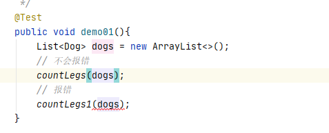
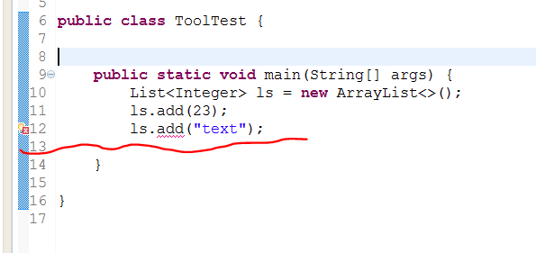

# JAVA 泛型


## 前言

​		Java 泛型（generics）是 JDK 5 中引入的一个新特性, 泛型提供了编译时类型安全检测机制，该机制允许开发者在编译时检测到非法的类型。

​		泛型的本质是参数化类型，也就是说所操作的数据类型被指定为一个参数。


## 泛型带来的好处

​		在没有泛型的情况的下，通过对类型 Object 的引用来实现参数的“任意化”，“任意化”带来的缺点是要做显式的强制类型转换，而这种转换是要求开发者对实际参数类型可以预知的情况下进行的。对于强制类型转换错误的情况，编译器可能不提示错误，在运行的时候才出现异常，这是本身就是一个安全隐患。

​		那么泛型的好处就是在编译的时候能够检查类型安全，并且所有的强制转换都是自动和隐式的。

```java
public class GlmapperGeneric<T> {
	private T t;
    public void set(T t) { 
    	this.t = t; 
    }
    public T get() { 
    	return t; 
    }
  
    public static void main(String[] args) {
        // do nothing
    }

  /**
    * 不指定类型
    */
  public void noSpecifyType(){
    GlmapperGeneric glmapperGeneric = new GlmapperGeneric();
    glmapperGeneric.set("test");
    // 需要强制类型转换
    String test = (String) glmapperGeneric.get();
    System.out.println(test);
  }

  /**
    * 指定类型
    */
  public void specifyType(){
    GlmapperGeneric<String> glmapperGeneric = new GlmapperGeneric();
    glmapperGeneric.set("test");
    // 不需要强制类型转换
    String test = glmapperGeneric.get();
    System.out.println(test);
  }
}
```

​		上面这段代码中的 specifyType 方法中 省去了强制转换，可以在编译时候检查类型安全，可以用在类，方法，接口上。


## 泛型中通配符

​		我们在定义泛型类，泛型方法，泛型接口的时候经常会碰见很多不同的通配符，比如 T，E，K，V 等等，这些通配符又都是什么意思呢？


### 常用的 T，E，K，V，？

​		本质上这些个都是通配符，没啥区别，只不过是编码时的一种约定俗成的东西。比如上述代码中的 T ，我们可以换成 A-Z 之间的任何一个 字母都可以，并不会影响程序的正常运行，但是如果换成其他的字母代替 T ，在可读性上可能会弱一些。**通常情况下，T，E，K，V，？ 是这样约定的：**

- ？ 表示不确定的 java 类型
- T (type) 表示具体的一个java类型
- K V (key value) 分别代表java键值中的Key Value
- E (element) 代表Element


### ？ **无界通配符**

我有一个父类 Animal 和几个子类，如狗、猫等，现在我需要一个动物的列表，我的第一个想法是像这样的：

```java
List<Animal> listAnimals
```

但是老板的想法确实这样的：

```java
List<? extends Animal> listAnimals
```

为什么要使用通配符而不是简单的泛型呢？通配符其实在声明局部变量时是没有什么意义的，但是当你为一个方法声明一个参数时，它是非常重要的。

```java
static int countLegs (List<? extends Animal > animals ) {
    int retVal = 0;
    for ( Animal animal : animals )
    {
        retVal += animal.countLegs();
    }
    return retVal;
}

static int countLegs1 (List< Animal > animals ){
    int retVal = 0;
    for ( Animal animal : animals )
    {
        retVal += animal.countLegs();
    }
    return retVal;
}

public static void main(String[] args) {
    List<Dog> dogs = new ArrayList<>();
 	// 不会报错
    countLegs( dogs );
	// 报错
    countLegs1(dogs);
}
```

​		

​		当调用 countLegs1 时，就会飘红，



​		所以，对于不确定或者不关心实际要操作的类型，可以使用无限制通配符（尖括号里一个问号，即 <?> ），表示可以持有任何类型。像 countLegs 方法中，限定了上届，但是不关心具体类型是什么，所以对于传入的 Animal 的所有子类都可以支持，并且不会报错。而 countLegs1 就不行。


### 上界通配符 < ? extends E>

> 上届：用 extends 关键字声明，表示参数化的类型可能是所指定的类型，或者是此类型的子类。

在类型参数中使用 extends 表示这个泛型中的参数必须是 E 或者 E 的子类，这样有两个好处：

- 如果传入的类型不是 E 或者 E 的子类，编译不成功
- 泛型中可以使用 E 的方法，要不然还得强转成 E 才能使用

```java
private <K extends A, E extends B> E test(K arg1, E arg2){
    E result = arg2;
    arg2.compareTo(arg1);
    //.....
    return result;
}

```

> 类型参数列表中如果有多个类型参数上限，用逗号分开


### 下界通配符 < ? super E>

> 下界: 用 super 进行声明，表示参数化的类型可能是所指定的类型，或者是此类型的父类型，直至 Object

​		在类型参数中使用 super 表示这个泛型中的参数必须是 E 或者 E 的父类。

```java
private <T> void test(List<? super T> dst, List<T> src){
    for (T t : src) {
        dst.add(t);
    }
}

public static void main(String[] args) {
    List<Dog> dogs = new ArrayList<>();
    List<Animal> animals = new ArrayList<>();
    new Test3().test(animals,dogs);
}

// Dog 是 Animal 的子类
class Dog extends Animal {

}
```

​		dst 类型 “大于等于” src 的类型，这里的“大于等于”是指 dst 表示的范围比 src 要大，因此装得下 dst 的容器也就能装 src 。


### ？ 和 T 的区别

？和 T 都表示不确定的类型，区别在于我们可以对 T 进行操作，但是对 ？ 不行，比如如下这种 ：

```java
// 可以
T t = operate();

// 不可以
？ car = operate();
复制代码
```

简单总结下：

​		T 是一个 确定的 类型，通常用于泛型类和泛型方法的定义，？是一个 不确定 的类型，通常用于泛型方法的调用代码和形参，不能用于定义类和泛型方法。


#### 区别1：通过 T 来 确保 泛型参数的一致性

```java
// 通过 T 来 确保 泛型参数的一致性
public <T extends Number> void
test(List<T> dest, List<T> src)

//通配符是 不确定的，所以这个方法不能保证两个 List 具有相同的元素类型
public void
test(List<? extends Number> dest, List<? extends Number> src)
```

​		像下面的代码中，约定的 T 是 Number 的子类才可以，但是申明时是用的 String ，所以就会飘红报错。

​		不能保证两个 List 具有相同的元素类型的情况

```java
GlmapperGeneric<String> glmapperGeneric = new GlmapperGeneric<>();
List<String> dest = new ArrayList<>();
List<Number> src = new ArrayList<>();
glmapperGeneric.testNon(dest,src);
```

​		上面的代码在编译器并不会报错，但是当进入到 testNon 方法内部操作时（比如赋值），对于 dest 和 src 而言，就还是需要进行类型转换。


#### 区别2：类型参数可以多重限定而通配符不行

​		使用 & 符号设定多重边界（Multi Bounds)，指定泛型类型 T 必须是 MultiLimitInterfaceA 和 MultiLimitInterfaceB 的共有子类型，此时变量 t 就具有了所有限定的方法和属性。对于通配符来说，因为它不是一个确定的类型，所以不能进行多重限定。


#### 区别3：通配符可以使用超类限定而类型参数不行

类型参数 T 只具有 一种 类型限定方式：

```java
T extends A
```


但是通配符 ? 可以进行 两种限定：

```java
? extends A
? super A
```

### `Class<T>` 和 `Class<?>` 区别

​		前面介绍了 ？ 和 T 的区别，那么对于，`Class<T>` 和 `<Class<?>` 又有什么区别呢？最常见的是在反射场景下的使用，这里以用一段发射的代码来说明下。

```java
// 通过反射的方式生成  multiLimit 
// 对象，这里比较明显的是，我们需要使用强制类型转换
MultiLimit multiLimit = (MultiLimit)
Class.forName("com.glmapper.bridge.boot.generic.MultiLimit").newInstance();
```

​		对于上述代码，在运行期，如果反射的类型不是 MultiLimit 类，那么一定会报 java.lang.ClassCastException 错误。对于这种情况，则可以使用下面的代码来代替，使得在在编译期就能直接 检查到类型的问题：`Class<T>` 在实例化的时候，T 要替换成具体类。`Class<?> `它是个通配泛型，? 可以代表任何类型，所以主要用于声明时的限制情况。比如，我们可以这样做申明：

```
// 可以
public Class<?> clazz;
// 不可以，因为 T 需要指定类型
public Class<T> clazzT;
```


所以当不知道定声明什么类型的 Class 的时候可以定义一 个Class<?>。

那如果也想 `public Class<T> clazzT;` 这样的话，就必须让当前的类也指定 T ，

```java
public class Test3<T> {
    public Class<?> clazz;
    // 不会报错
    public Class<T> clazzT;
```


## 泛型擦除(类型擦除)

### 概念

​		泛型是 Java 1.5 版本才引进的概念，在这之前是没有泛型的概念的，但显然，泛型代码能够很好地和之前版本的代码很好地兼容。这是因为，泛型信息只存在于代码编译阶段，在进入 JVM 之前，与泛型相关的信息会被擦除掉，专业术语叫做类型擦除。通俗地讲，泛型类和普通类在 java 虚拟机内是没有什么特别的地方。回顾文章开始时的那段代码

~~~java
List<String> l1 = new ArrayList<String>();
List<Integer> l2 = new ArrayList<Integer>();
System.out.println(l1.getClass() == l2.getClass());
~~~

​			打印的结果为 true 是因为 `List<String>`和 `List<Integer>`在 jvm 中的 Class 都是 List.class。泛型信息被擦除了。可能同学会问，那么类型 String 和 Integer 怎么办？答案是泛型转译。


​		我们现在可以下结论了，在泛型类被类型擦除的时候，之前泛型类中的类型参数部分如果没有指定上限，如 `<T>`则会被转译成普通的 Object 类型，如果指定了上限如 `<T extends String>`则类型参数就被替换成类型上限。


### 局限性

类型擦除，是泛型能够与之前的 java 版本代码兼容共存的原因。但也因为类型擦除，它会抹掉很多继承相关的特性，这是它带来的局限性。

理解类型擦除有利于我们绕过开发当中可能遇到的雷区，同样理解类型擦除也能让我们绕过泛型本身的一些限制。比如



正常情况下，因为泛型的限制，编译器不让最后一行代码编译通过，因为类似不匹配，但是，基于对类型擦除的了解，利用反射，我们可以绕过这个限制。

~~~java
public interface List<E> extends Collection<E>{	
	 boolean add(E e);
}
~~~

上面是 List 和其中的 add() 方法的源码定义。

因为 E 代表任意的类型，所以类型擦除时，add 方法其实等同于

~~~java
boolean add(Object obj);
~~~

那么，利用反射，我们绕过编译器去调用 add 方法。

~~~java
public class ToolTest {
	public static void main(String[] args) {
		List<Integer> ls = new ArrayList<>();
		ls.add(23);
//		ls.add("text");
		try {
			Method method = ls.getClass().getDeclaredMethod("add",Object.class);
			method.invoke(ls,"test");
			method.invoke(ls,42.9f);
		} catch (NoSuchMethodException e) {
			// TODO Auto-generated catch block
			e.printStackTrace();
		} catch (SecurityException e) {
			// TODO Auto-generated catch block
			e.printStackTrace();
		} catch (IllegalAccessException e) {
			// TODO Auto-generated catch block
			e.printStackTrace();
		} catch (IllegalArgumentException e) {
			// TODO Auto-generated catch block
			e.printStackTrace();
		} catch (InvocationTargetException e) {
			// TODO Auto-generated catch block
			e.printStackTrace();
		}
		
		for ( Object o: ls){
			System.out.println(o);
		}
	}
}
~~~

打印结果

~~~java
23
test
42.9
~~~

可以看到，利用类型擦除的原理，用反射的手段就绕过了正常开发中编译器不允许的操作限制。


### 注意事项

+ 泛型类或者泛型方法中，不接受 8 种基本数据类型。
