# Shell

## 资料入口

1. [shell 入门到实战](https://blog.csdn.net/weixin_42313749/article/details/120524768?ops_request_misc=%257B%2522request%255Fid%2522%253A%2522165243315116782184698466%2522%252C%2522scm%2522%253A%252220140713.130102334..%2522%257D&request_id=165243315116782184698466&biz_id=0&utm_medium=distribute.pc_search_result.none-task-blog-2~all~top_positive~default-1-120524768-null-null.142)
2. [shell学习笔记](https://blog.csdn.net/qq_41488943/article/details/105232770?utm_medium=distribute.pc_relevant.none-task-blog-OPENSEARCH-4.channel_param&depth_1-utm_source=distribute.pc_relevant.none-task-blog-OPENSEARCH-4.channel_param#12_shell_8)
3. [sehll 基础练习](https://blog.csdn.net/nplbnb12/article/details/79325820?ops_request_misc=%257B%2522request%255Fid%2522%253A%2522165243698716782388091543%2522%252C%2522scm%2522%253A%252220140713.130102334.pc%255Fall.%2522%257D&request_id=165243698716782388091543&biz_id=0&utm_medium=distribute.pc_search_result.none-task-blog-2~all~first_rank_ecpm_v1~rank_v31_ecpm-4-79325820-null-null.142^v9^pc_search_result_cache,157^v4^control&utm_term=shell+%E7%BB%83%E4%B9%A0&spm=1018.2226.3001.4187)
4. [shell编程100例](https://blog.csdn.net/yugemengjing/article/details/82469785)

## 概述

### 什么是Shell？

​		什么是shell呢？**shell是用C语言编写的程序**，它是用户使用 Linux 的桥梁。Shell既是一种命令语言，又是一种程序设计语言。简单来说Shell 是指一种应用程序，这个应用程序提供了一个界面，用户通过这个界面访问操作系统内核的服务。也可以这样认为，linux中的shell就是linux内核的一个外层保护工具，并负责完成用户与内核之间的交互

### shell脚本

​		shell脚本就是一种专门使用shell编写的脚本程序，它虽然没有C++、Java、Python等一系列高级语言功能强大，但是在服务器运维领域以及嵌入式开发领域，shell脚本具有举足轻重的地位。

​		shell脚本编程如同其他编程语言的一样，只要有一个能编写代码的文本编辑器和一个能解释执行的脚本解释器就可以运行了，而linux下的shell种类众多，常用的用：

+ Bourne Shell（/usr/bin/sh或/bin/sh）
+ Bourne Again Shell（/bin/bash）
+ C Shell（/usr/bin/csh）
+ K Shell（/usr/bin/ksh）
+ Shell for Root（/sbin/sh）
  … …

​        在诸多linux发行版系统中，最常用的就是Bash，就是Bourne Again Shell，因为其能工提供环境变量以配置用户shell环境，支持历史记录、内置算数功能、支持通配符表达式等高效性能，将linux常用命令进行的简化，被广泛应用于Debian系列的linux发行版中。


### 运行shell脚本

运行shell脚本的方法有两种：

- 作为可执行程序运行
- 作为解释器参数运行

shell脚本编写如下，并将其保存为test.sh，进入存放此文件目录

```shell
#!/bin/bash
echo "Hello World"
```

当作为可执行程序运行时候

~~~bash
chmod +x test.sh	# 赋予可执行权限
./test.sh		    # 执行程序
~~~

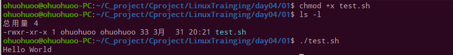

当作为解释器参数运行时

~~~bash
/bin/sh test.sh		# 执行命令
/bin/php test.php	# 执行命令
~~~


### shell注释

单行注释：和python注释相同，以`#`号开头作为单行注释

~~~bash
# 这是一个注释
# author：ohuohuoo
# date：`date`
~~~

多行注释：如果在开发过程中，，遇到大段的代码需要临时注释起来，过一会儿又取消注释，可以将其定义为一个花括号的注释函数，也可以用多行注释

~~~bash
:<<EOF
注释内容...
注释内容...
注释内容...
EOF

# EOF可以换成其他符号
:<<E！
注释内容...
注释内容...
注释内容...
！

~~~


### shell编写的基本步骤

- 建立shell文件
- 赋予shell文件可执行程序权限（使用chmod命令修改权限）
- 执行shell文件（直接运行赋予权限后的二进制文件）


## shell变量
###  命名变量
shell编程中，定义变量是直接定义的，没有明确的数据类型，shel允许用户建立变量存储数据，但是将认为赋给变量的值都解释为一串字符，如下

~~~bash
cout=1			# 定义变量		
name="ohuohuo"	 # 定义变量
echo $cout		 # 取变量值
echo $name	     # 取变量值
~~~


shell中，英文符号"$"用于取变量值

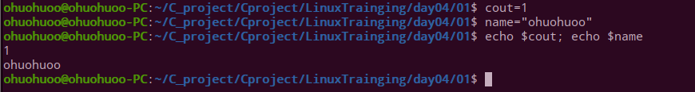

**注意点：**shell编程的变量名的命名和其他语言一样，需要遵循一定的规则，规则如下

1. 命名只能使用英文字母，数字和下划线，首个字符不能以数字开头
2. 中间不能有空格，可以使用下划线（_）
3. 不能使用标点符号
4. 不能使用bash里的关键字（可用help命令查看保留关键字）

如下所示：

有效的命令

~~~bash
NAME
LIBRARY_PATH
_var
var2
~~~


无效的命名

~~~bash
?var=123
user*name=ohuohuo
~~~


如果在变量中使用系统命令，需要加上 " `"符号（ESC键下方），如下所示

~~~bash
DATE1=`date`	
DATE2=$(date)
~~~

两者功能相同

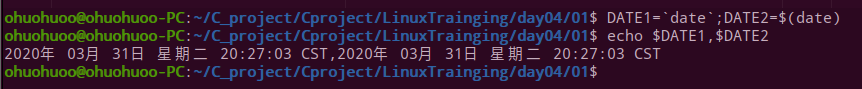


### 使用变量

使用变量的时，用英文符号`"$"`取变量值，对于较长的变量名，建议加上`{ }`花括号，帮助解释器识别变量的边界，如下

~~~bash
name="test_name"
echo "My name is ${name}and you"
~~~

加上方括号时即所有便后面的语句不留空格，shell也会自动识别边界，默认添加一个空格

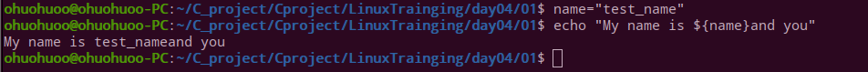


此外，已经定义过的变量，可以二次定义并重新被赋值覆盖上一次的变量值，这点如同其他语言

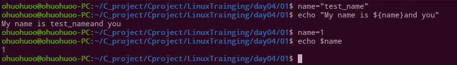


### 变量类型

shell编程中也同样存在变量类型，在运行shell时会同时存在三种变量

1. 局部变量：在脚本或命令中定义，仅在当前shell实例中有效，其他shell启动的程序不能访问局部变量
2. 环境变量：所有的程序，包括shell启动的程序，都能访问环境变量，必要的时候shell脚本也可以定义环境变量
3. shell变量：由shell程序设置的特殊变量。shell变量中有一部分是环境变量，有一部分是局部变量，不同类型的变量保证了shell的正常运行

### 变量操作

​		shell中的变量，默认为可读可写类型，如果想要其只可读，如同url一样，需要将其声明为**只读类型变量（**如同`const`），使用`readonly`命令，如下脚本

~~~bash
#!/bin/bash
Url="http://www.baidu.com"
readonly Url
Url="http://www.csnd.net"
~~~

这样的话，这句就会报错，提示`/bin/sh: NAME: This variable is read only.`此变量为只读变量

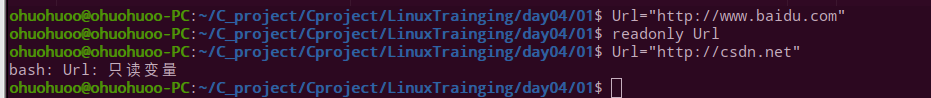

如果想要**删除变量**，使用`unset`命令解除命令赋值，但是`unset`不能删除可读变量，如下所示

~~~bash
#!/bin/sh
name="ohuohuo"
Url="http://www.baidu.com"
readonly Url	# 设置可读变量
unset name		# 可以被删除
unset Url		# 不可被删除
echo $name		# 不被打印出
echo $Url		# 打印出
~~~

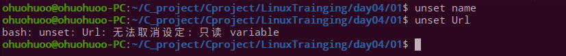

## shell 变量

### 字符串类型

在shell中字符串是shell编程中最常用最有用的数据类型，字符串可以用单引号，也可以用双引号，也可以不用引号。

使用单引号

~~~bash
str='this is a string'
~~~

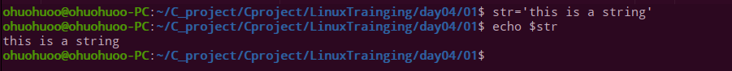

使用单引号的不足：

- 单引号里的任何字符都会原样输出，单引号字符串中的变量是无效的
- 单引号字串中不能出现单独一个的单引号（对单引号使用转义符后也不行），但可成对出现，作为字符串拼接使用。

使用双引号

~~~bash
name="ohouhuoo"
str="please input your \"$name"\"
echo -e $str
~~~

输出结果如下图:

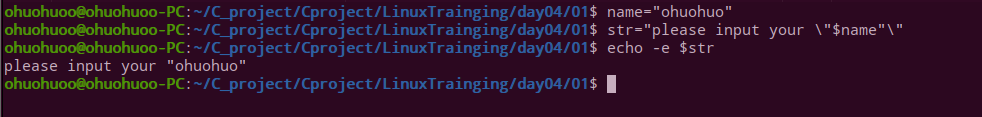


使用双引号的优势：

- 可以在双引号中使用变量
- 可以在双引号中使用转移字符

由此可见，双引号较单引号而言有更强大的优势

### 字符串操作

**取字符串长度**：在对变量进行取值时，使用" # "符号对字符串进行取值

~~~bash
string="abcd"
echo ${#string} # 输出 4
~~~

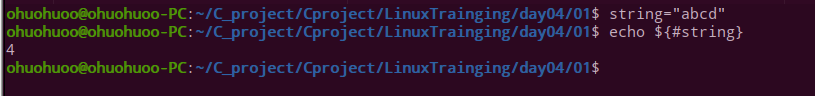

**提取子字符串**：使用字符串的截取命令，用于提取部分字符串

~~~bash
string="this is a test"
echo ${string:2:6} # 表示从第3个字符开始截取
~~~

上式输出结果为`is is`，如下图

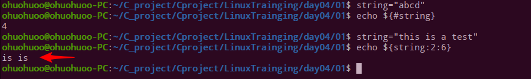

**查找字符串**：用于查找字符的位置，输出结果为字符在字符串中所占的数据位置，如果查找多个字符，那哪个字母先出现就计算哪个，如下查找`it`中`i`和`t`两个字符，`t`先出现，输出为1

~~~bash
string="this is a test"
echo `expr index "$string" it`  # 输出 1
~~~

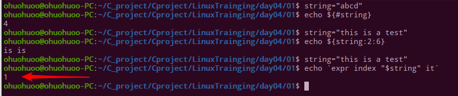


## shell数组

​		在bash下，仅仅支持一维数组，并且没有限定数组的大小，不支持多维数组。类似于 C 语言，数组元素的下标由 0 开始编号（上述字符串也是这样）。获取数组中的元素要利用下标，下标可以是整数或算术表达式，其值应大于或等于 0。

### 定义数组

在 Shell 中，用括号`()`来定义表示数组，数组中元素用"空格"符号分割开。定义数组的一般形式为：

~~~bash
# 一般定义
array_name=(value1 value2 value3 value4)

# 多级定义
array_test=(
value1 
value2 
value3 
value4
)

# 
array_text[0]=value0
array_text[1]=value1
array_text[3]=value3
... 
...

~~~

三种定义形式均可

###  数组操作

**读取数组**：和读取变量名相同，使用`$`符号，需要加上下标名

~~~bash
valuen=${array_name[n]}
echo ${array_name[@]} # 读取所有
~~~

**获取数组长度**：获取数组长度的方法与获取字符串长度的方法相同，如所示

~~~bash
# 取得数组元素的个数
length=${#array_name[@]}	# 从头到尾取
# 或者
length=${#array_name[*]}	# 取所有
# 取得数组单个元素的长度
lengthn=${#array_name[n]}	# 取特定
~~~


## shell传递参数

在执行 Shell 脚本时，向脚本传递参数，脚本内获取参数的格式为：`$n`。**n** 代表一个数字，1 为执行脚本的第一个参数，2 为执行脚本的第二个参数，以此类推……，脚本编写如下,保存为test.sh

~~~bash
echo "传递参数实例！";
echo "执行的文件名：$0";
echo "第一个参数为：$1";
echo "第二个参数为：$2";
echo "第三个参数为：$3";

~~~

执行脚本如下

~~~bash
chmod +x test.sh
./test.sh 1 2 3
~~~

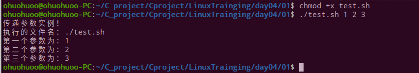

在使用shell传递参数的时候，常常需要用到以下的几个字符来处理参数


## shell运算符

### 运算符种类

与其他编程语言相同的是，shell同样支持多种运算符：

+ 算数运算符
+ 关系运算符
+ 布尔运算符
+ 逻辑运算符
+ 字符串运算符
+ 文件测试运算符

shell想要使用这些运算符，需要结合其他命令和工具来使用（因为shell中不支持简单的数学运算），如使用算符运算符就需要搭配的常用的工具有两种

+ awk
+ expr（使用频繁）

运算规则注意点：

+ 表达式和运算符之间必须要有空格，例如 3+2 是不对的，必须写成 3 + 2
+ 完整的表达式要被 两个" ` "包含（在 Esc 键下边那个键）

如下实例：

~~~shell
#!/bin/bash
val=`expr 3 + 2`
echo "两数之和为 : $val"
~~~

执行脚本后，输出结果为：

~~~bash
两数之和为 : 5
~~~


### 算数运算符

shell支持的常用的如下表，举例中这里假定变量 a 为 10，变量 b 为 20，

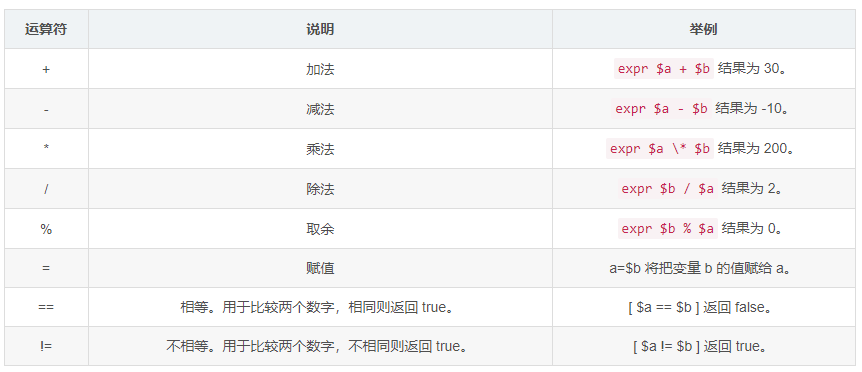


**需要注意的点：**

在windows系统中乘号(*)前边必须加反斜杠()才能实现乘法运算；

### 关系运算符

shell中的关系运算符和其他编程语言不同，shell中使用特殊的字符表示关系运算符，并且只支持数字，不支持字符串，除非字符串是数字，下表为常用关系运算符，同样指定a为10，b为20

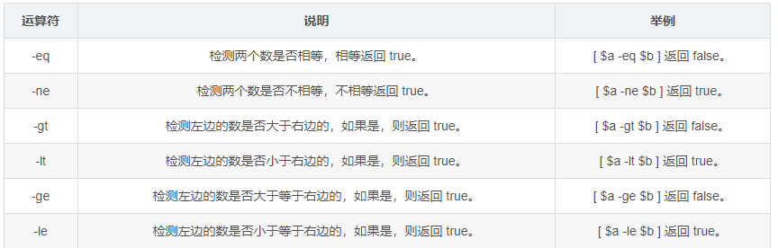

脚本编写如下：

~~~shell
#!/bin/bash

a=10
b=20

if [ $a -eq $b ]
then
   echo "$a -eq $b : a 等于 b"
else
   echo "$a -eq $b: a 不等于 b"
fi
if [ $a -ne $b ]
then
   echo "$a -ne $b: a 不等于 b"
else
   echo "$a -ne $b : a 等于 b"
fi 

~~~

将脚本执行结果如下:

~~~bash
10 -eq 20: a 不等于 b
10 -ne 20: a 不等于 b
~~~

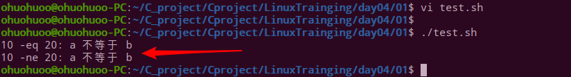

**需要注意的点：**

运算符和数之间必须要用空格隔开


### 布尔运算符

shell中的布尔运算符使用如下表，同样指定a为10，b为20

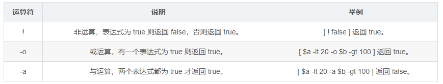

脚本编写如下

~~~shell
#!/bin/bash

a=10
b=20

if [ $a != $b ]
then
   echo "$a != $b : a 不等于 b"
else
   echo "$a == $b: a 等于 b"
fi 

~~~

执行脚本，结果如下：

~~~bash
10 != 20 : a 不等于 b
~~~

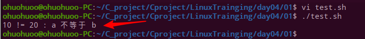

#### 逻辑运算符

shell中的逻辑运算符和其他编程语言有类似的地方，如下表。假定变量 a 为 10，变量 b 为 20


编写脚本如下：

~~~shell
#!/bin/bash

a=10
b=20

if [[ $a -lt 100 && $b -gt 100 ]]
then
   echo "返回 true"
else
   echo "返回 false"
fi 
~~~

执行脚本，结果如下：

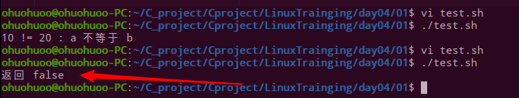

需要注意的点：

这里使用两层的[ ]符号，将两次关系运算的结果保存在条件句中


### 字符串运算符

shell中常用的字符串运算符如下表。假定变量 a 为 “abc”，变量 b 为 “efg”

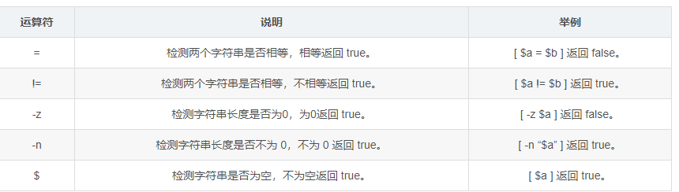

编写脚本如下

~~~shell
#!/bin/bash

a="abc"
b="efg"

if [ $a != $b ]
then
   echo "$a != $b : a 等于 b"
else
   echo "$a != $b: a 不等于 b"
fi 

~~~

执行脚本，结果输出如下

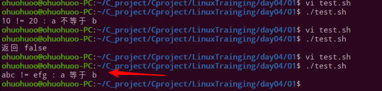

### 文件测试运算符

shell中的文件测试运算符用于检测在类unix系统中，文件的各种属性，如下表

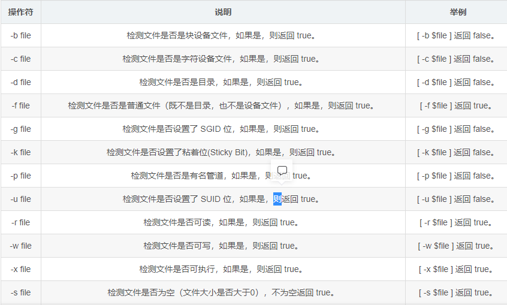


编写脚本如下

```shell
#!/bin/bash

file="/var/www/test/test.sh"
if [ -r $file ]
then
   echo "文件可读"
else
   echo "文件不可读"
fi    

```

执行脚本，结果输出如下

~~~bash
文件可读
~~~

## shell编程中的命令

### echo命令

echo命令在shell中用于字符串的输出，调用的格式：

~~~bash
echo string
~~~

echo命令还可显示复杂的输出格式

显示普通的字符串

~~~bash
echo "this is a test"
~~~


显示转义字符

~~~bash
echo "\this is a test\"
~~~


显示变量

~~~bash
name="ohuohuo"
echo "you name is $name"
~~~


显示换行

~~~bash
echo -e "Right!\n " # -e 表示开启转义
echo "this is other line"
~~~


显示结果定向重定向至文件

~~~bash
echo "this is a test" > testfile
~~~


显示command命令执行结果

~~~bash
echo `date`
~~~

echo命令还有其他使用规则，经常使用就可熟练掌握

### printf命令

shell中的printf命令如同C语言中一样，调用格式也大抵相同，只是有一点点不同。与echo命令打印字符串不同的是，printf不会自动调价换行符号，可以手动添加

printf命令的语法：

~~~bash
printf format-string [arguments...]
~~~


参数说明：

1. format-string：格式控制字符串
2. arguments：参数列表

举例如下

~~~bash
$ echo "Hello, Shell"	# 输入
Hello, Shell		   # 输出
$ printf "Hello, Shell\n" # 输入
Hello, Shell			# 输出
~~~

printf命令可以较为强大的使用转义字符，shell中常用的转义字符如下表示所示

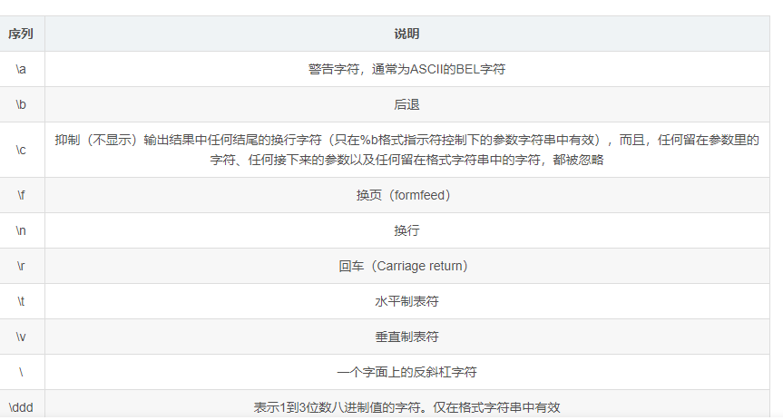

### test命令

shell中的 test 命令用于检查某个条件是否成立，它可以进行数值、字符和文件三个方面的测试

**数值测试命令表**

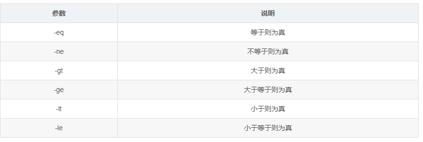

应用举例如下:

~~~bash
#！/bin/bash
num1=100
num2=100
if test $[num1] -eq $[num2]
then
    echo '两个数相等！'
else
    echo '两个数不相等！'
fi
~~~


输出结果:

~~~bash
两个字符串不相等!
~~~


## shell流程控制

shell作为一种脚本语言，也有着自己的流程控制，而shell中的流程控制主要由条件、循环组成

### if else条件

shell中的if else条件具有一定的模版。其调用格式为：

- if - then - fi：

调用格式如下:

~~~bash
if condition
then
    command1 
    command2
    ...
    commandN 
fi

# 写成单行
if condition;then command1; command2;fi

~~~

**如果存在不满足的条件的情况**

~~~bash
if condition
then
    command1 
    command2
    ...
    commandN
else
    command
fi

~~~

**在多层嵌套条件情况**

~~~~bash
if condition1
then
    command1
elif condition2 
then 
    command2
else
    commandN
fi
~~~~

应用举例：

~~~bash
num1=$[6]
num2=$[8]
if test $[num1] -eq $[num2]
then
    echo '两个数字相等!'
else
    echo '两个数字不相等!'
fi
~~~

执行脚本，结果输出如下

~~~bash
两个数字相等!
~~~

### case条件

shell中case语句为多功能选择语句，与其他语言相通的是，可以用case语句匹配一个值与一个模式，如果匹配成功，执行相匹配的命令。case语句调用格式如下：

~~~bash
case 值 in
模式1)
    command1
    command2
    ...
    commandN
    ;;
模式2）
    command1
    command2
    ...
    commandN
    ;;
esac

~~~


需要注意的点：

- 取值后面需要加上in
- 每一模式必须以右括号结束
- 每个模式结束后使用`;;`符号结尾
- 如果没有找到对应的模式。以`*`结尾，并跳出case
- case需要搭配`esac`结尾，与C语言中的switch … case语句类似

脚本举例如下

~~~bash
echo '输入 1 到 4 之间的数字:'
echo '你输入的数字为:'
read num
case $num in
    1)  echo '你选择了 1'
    ;;
    2)  echo '你选择了 2'
    ;;
    3)  echo '你选择了 3'
    ;;
    4)  echo '你选择了 4'
    ;;
    *)  echo '你没有输入 1 到 4 之间的数字'
    ;;
esac

~~~

执行脚本，运行如下

~~~bash
输入 1 到 5 之间的数字:4
你输入的数字为 4!
输入 1 到 5 之间的数字:8
你输入的数字不是 1 到 5 之间的! 游戏结束

~~~

case中想要跳出循环有两个命令：break和continu

- break命令：允许跳出所有循环（中止执行后面所有的循环）

  - 使用举例

  ~~~bash
  #!/bin/bash
  while :
  do
      echo -n "输入 1 到 5 之间的数字:"
      read num
      case $num in
          1|2|3|4|5) echo "你输入的数字为 $num!"
          ;;
          *) echo "你输入的数字不是 1 到 5 之间的! 游戏结束"
              break
          ;;
      esac
  done
  
  ~~~

  - 执行输出如下

  ~~~bash
  输入 1 到 5 之间的数字:3
  你输入的数字为 3!
  输入 1 到 5 之间的数字:7
  你输入的数字不是 1 到 5 之间的! 游戏结束
  
  ~~~

- contimue：shell中的continue命令与break命令类似，只有一点差别，它不会跳出所有循环，仅仅跳出当前循环。这一点和其他类型的语言相同

- 应用举例，同样的将上式修改如下

  ~~~bash
  #!/bin/bash
  while :
  do
      echo -n "输入 1 到 5 之间的数字: "
      read num
      case $num in
          1|2|3|4|5) echo "你输入的数字为 $num!"
          ;;
          *) echo "你输入的数字不是 1 到 5 之间的!"
              continue
              echo "游戏结束"
          ;;
      esac
  done
  
  ~~~

  执行脚本，结果输出如下

  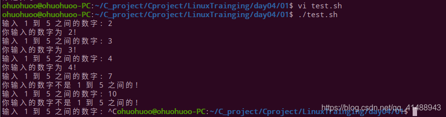

  

### for循环

shell中的for循环调用格式和python中的for循环有点类似，也是有模板的：

~~~bash
for var in item1 item2 ... itemN
do
    command1
    command2
    ...
    commandN
done

# 写成一行同样使用分号将语句分开 

~~~

需要注意的是：

- `in`列表中可以包含替换、字符串和文件名等
- `in`列表是可选的，如果默认不适用，将会循环使用命令行中的位置参数

应用脚本编写如下

~~~bash
for num in 1 2 3 4 5
do
    echo "The value is: $num"
done

~~~

输出结果如下:

~~~bash
The value is: 1
The value is: 2
The value is: 3
The value is: 4
The value is: 5

~~~

### while循环

shell中的while循环用于不断执行一系列命令，也用于从输入文件中读取数据，调用格式如下

~~~bash
while condition
do
    command
done

~~~

应用脚本编写如下：

~~~bash
#!/bin/bash
num=1
while(( $num<=5 ))
do
    echo $num
    let "num++"
done
~~~

执行脚本，结果运行如下

~~~bash
1
2
3
4
5

~~~

只需要知道shell中while循环的格式，同样可以做到和C语言中一样， 使用while循环进行判定或者判断键盘循环，甚至无限循环等，如下使用while循环读取键盘操作

~~~bash
echo '按下 <Q> 退出'
echo -n '输入你最喜欢的歌名: '
while read SONG
do
    echo "啊！$SONG 真是一首好歌"
done

~~~

执行脚本，运行结果如下

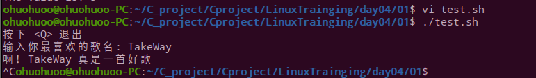


### until循环

until 循环执行一系列命令直至条件为 true 时停止。until 循环与 while 循环在处理方式上刚好相反。一般 while 循环优于 until 循环，但在某些时候—也只是极少数情况下，until 循环更加有用。until循环调用格式：

~~~bash
until condition
do
    command
done

~~~


`condition` 一般为条件表达式，如果返回值为 false，则继续执行循环体内的语句，否则跳出循环，脚本编写如下

~~~ bash
#!/bin/bash

a=0
until [ ! $a -lt 5 ]
do
   echo $a
   a=`expr $a + 1`
done

~~~


执行脚本，结果输出如下：

~~~bash
0
1
2
3
4
5
~~~


## shell函数

###  定义函数

linux中的shell同样可以定义函数，然后在函数中调用执行相关的shell命令，完成功能，shell中的函数调用格式如下：

~~~bash
[ function ] funname [()]
{
    action;
    [return int;]
}
~~~

参数说明：

+ function fun () 表示有返回参数的函数（如同C语言中的有返回类型的函数（int，char等））
+ fun() 表示无返回参数的函数（类似于C语言中的void类型函数）
+ 使用return可以返回参数值（一般为数值n），如果不使用，将默认以最后一条命令运行的结果作为返回值

脚本应用举例如下

~~~bash
#!/bin/bash

FunReturn(){
    echo "两个数字进行相加运算..."
    echo "输入第一个数字: "
    read num
    echo "输入第二个数字: "
    read anothernum
    echo "两个数字分别为 $num 和 $anothernum !"
    return $(($num+$anothernum))	# 分别返回数值
}
FunReturn		# 调用函数
echo "输入的两个数字之和为 $? !" # 使用通配符获取上一条指令的返回值

~~~

执行脚本，运行如下

~~~bash
两个数字进行相加运算...
输入第一个数字: 
1
输入第二个数字: 
2
两个数字分别为 1 和 2 !
输入的两个数字之和为 3 !

~~~

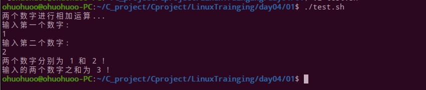


需要注意的是：

所有的函数在使用前必须定义，这是因为shell解释器是顺序逐层执行的，当shell解释器发现定义的函数时，才会找到其对应的功能，进而执行。

### 参数定义

此外想要使用shell函数传递参数时，需要在函数体的内部，通过 $n 的形式来获取参数的值，与其他语言不同的是，这不是在定义函数的时候就给定参数，而是在函数体中获取到的参数，例如，$1表示第一个参数，$2表示第二个参数，参数调用列表如下

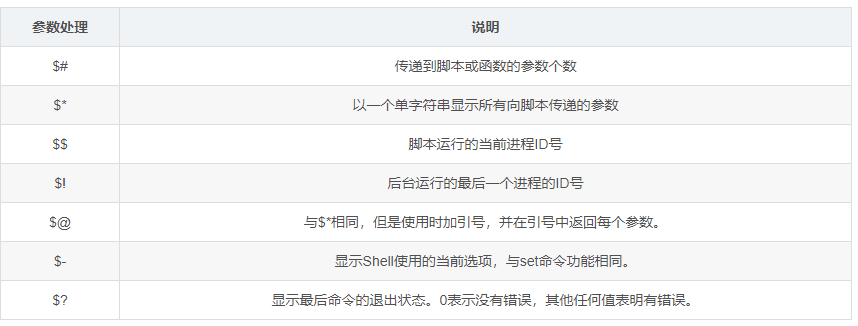

应用脚本举例：

~~~bash
#!/bin/bash
FunParam(){
    echo "输入第一个参数 $1 !"
    echo "输入第二个参数 $2 !"
    echo "输入第十个个参数 $10 !"
    echo "参数总数共 $# 个!"
    echo "作为一个字符串输出所有参数 $* !"
}
FunParam 1 2 3 4 5 6 7 8 9 10

~~~

执行脚本如下

~~~bash
第一个参数为 1 !
第二个参数为 2 !
第十个参数为 10 !
参数总数有 10 个!
作为一个字符串输出所有参数 1 2 3 4 5 6 7 8 9 10！
~~~

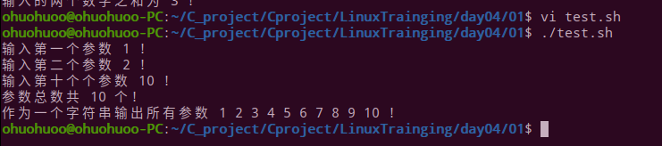

## shell重定向

- 在之前的学习笔记中，归纳了linux中重定向的使用，这里不再赘述
- [linux中的重定向](https://blog.csdn.net/qq_41488943/article/details/105214966)

## 编程实战

### shell 脚本实战之 系统备份脚本 —案例

**Tar工具全备、增量备份网站，Shell脚本实现自动打包备份**

~~~bash
#!/bin/bash
#Auto Backup Linux System Files
#by author rivers on 2021-09-28

SOURCE_DIR=(
    $*
)
TARGET_DIR=/data/backup/
YEAR=`date +%Y`
MONTH=`date +%m`
DAY=`date +%d`
WEEK=`date +%u`
A_NAME=`date +%H%M`
FILES=system_backup.tgz
CODE=$?
if
    [ -z "$*" ]；then
    echo -e "\033[32mUsage:\nPlease Enter Your Backup Files or Directories\n--------------------------------------------\n\nUsage: { $0 /boot /etc}\033[0m"
    exit
fi
#Determine Whether the Target Directory Exists
if
    [ ! -d $TARGET_DIR/$YEAR/$MONTH/$DAY ]；then
    mkdir -p $TARGET_DIR/$YEAR/$MONTH/$DAY
    echo -e "\033[32mThe $TARGET_DIR Created Successfully !\033[0m"
fi
#EXEC Full_Backup Function Command
Full_Backup()
{
if
    [ "$WEEK" -eq "7" ]；then
    rm -rf $TARGET_DIR/snapshot
    cd $TARGET_DIR/$YEAR/$MONTH/$DAY ；tar -g $TARGET_DIR/snapshot -czvf $FILES ${SOURCE_DIR[@]}
    [ "$CODE" == "0" ]&&echo -e  "--------------------------------------------\n\033[32mThese Full_Backup System Files Backup Successfully !\033[0m"
fi
}
#Perform incremental BACKUP Function Command
Add_Backup()
{
   if
        [ $WEEK -ne "7" ]；then
        cd $TARGET_DIR/$YEAR/$MONTH/$DAY ；tar -g $TARGET_DIR/snapshot -czvf $A_NAME$FILES ${SOURCE_DIR[@]}
        [ "$CODE" == "0" ]&&echo -e  "-----------------------------------------\n\033[32mThese Add_Backup System Files $TARGET_DIR/$YEAR/$MONTH/$DAY/${YEAR}_$A_NAME$FILES Backup Successfully !\033[0m"
   fi
}
sleep 3 
Full_Backup；Add_Backup

~~~

### shell 脚本 实战 之收集系统信息 —案例

**Shell脚本实现服务器信息自动收集**

~~~bash
cat <<EOF
++++++++++++++++++++++++++++++++++++++++++++++
++++++++Welcome to use system Collect+++++++++
++++++++++++++++++++++++++++++++++++++++++++++
EOF
ip_info=`ifconfig |grep "Bcast"|tail -1 |awk '{print $2}'|cut -d: -f 2`
cpu_info1=`cat /proc/cpuinfo |grep 'model name'|tail -1 |awk -F: '{print $2}'|sed 's/^ //g'|awk '{print $1,$3,$4,$NF}'`
cpu_info2=`cat /proc/cpuinfo |grep "physical id"|sort |uniq -c|wc -l`
serv_info=`hostname |tail -1`
disk_info=`fdisk -l|grep "Disk"|grep -v "identifier"|awk '{print $2,$3,$4}'|sed 's/,//g'`
mem_info=`free -m |grep "Mem"|awk '{print "Total",$1,$2"M"}'`
load_info=`uptime |awk '{print "Current Load: "$(NF-2)}'|sed 's/\,//g'`
mark_info='BeiJing_IDC'
echo -e "\033[32m-------------------------------------------\033[1m"
echo IPADDR:${ip_info}
echo HOSTNAME:$serv_info
echo CPU_INFO:${cpu_info1} X${cpu_info2}
echo DISK_INFO:$disk_info
echo MEM_INFO:$mem_info
echo LOAD_INFO:$load_info
echo -e "\033[32m-------------------------------------------\033[0m"
echo -e -n "\033[36mYou want to write the data to the databases? \033[1m" ；read ensure

if      [ "$ensure" == "yes" -o "$ensure" == "y" -o "$ensure" == "Y" ];then
        echo "--------------------------------------------"
        echo -e  '\033[31mmysql -uaudit -p123456 -D audit -e ''' "insert into audit_system values('','${ip_info}','$serv_info','${
cpu_info1} X${cpu_info2}','$disk_info','$mem_info','$load_info','$mark_info')" ''' \033[0m '
        mysql -uroot -p123456 -D test -e "insert into audit_system values('','${ip_info}','$serv_info','${cpu_info1} X${cpu_info2}
','$disk_info','$mem_info','$load_info','$mark_info')"
else
        echo "Please wait，exit......"
        exit
fi


~~~

###  shell 脚本实战 之 一键部署 lnmp 架构 — 案例

**批量部署lnmp 架构**

~~~bash
[root@web-server01~/script]# vim lnmp.sh 
#!/bin/bash
#install lnmp
#by author rivers on 2021-9-28

# nginx 环境准备
Nginx_url=https://nginx.org/download/nginx-1.20.1.tar.gz
Nginx_prefix=/usr/local/nginx

# mysql 环境准备
Mysql_version=mysql-5.5.20.tar.gz
Mysql_dir=mysql-5.5.20
Mysql_url=https://downloads.mysql.com/archives/get/p/23/file/mysql-5.5.20.tar.gz
Mysql_prefix=/usr/local/mysql/

# php 环境准备
Php_version=php-7.2.10.tar.gz
Php_prefix=/usr/local/php-7.2.10/


function nginx_install(){

if [[ "$1" -eq "1" ]];then
        if [ $? -eq 0 ];then
                make && make install
        fi

fi
}


function mysql_install(){
if [[ "$1" -eq "2" ]];then
-DMYSQL_UNIX_ADDR=/tmp/mysql.sock \
-DMYSQL_DATADIR=/data/mysql \
-DSYSCONFDIR=/etc \
-DMYSQL_USER=mysql \
-DMYSQL_TCP_PORT=3306 \
-DWITH_XTRADB_STORAGE_ENGINE=1 \
-DWITH_INNOBASE_STORAGE_ENGINE=1 \
-DWITH_PARTITION_STORAGE_ENGINE=1 \
-DWITH_BLACKHOLE_STORAGE_ENGINE=1 \
-DWITH_MYISAM_STORAGE_ENGINE=1 \
-DWITH_READLINE=1 \
-DENABLED_LOCAL_INFILE=1 \
-DWITH_EXTRA_CHARSETS=1 \
-DDEFAULT_CHARSET=utf8 \
-DDEFAULT_COLLATION=utf8_general_ci \
-DEXTRA_CHARSETS=all \
                echo -e "\033[32mThe $Mysql_dir Server Install Success !\033[0m"
        else
                echo -e "\033[32mThe $Mysql_dir Make or Make install ERROR,Please Check......"
                exit 0
fi
/bin/cp support-files/my-small.cnf  /etc/my.cnf
/bin/cp support-files/mysql.server /etc/init.d/mysqld
chmod +x /etc/init.d/mysqld
chkconfig --add mysqld
chkconfig mysqld on
fi
}


function php_install(){
if [[ "$1" -eq "3" ]];then
        if [ $? -eq 0 ];then
                make ZEND_EXTRA_LIBS='-liconv' && make install
if [[ "$1" -eq "3" ]];then
 wget $Php_url && tar xf $Php_version && cd $Php_dir && yum install   bxml2* bzip2* libcurl*  libjpeg* libpng* freetype* gmp* libm
crypt* readline* libxslt* -y && ./configure --prefix=$Php_prefix --disable-fileinfo --enable-fpm --with-config-file-path=/etc --wi
  -config-file-scan-dir=/etc/php.d --with-openssl --with-zlib --with-curl --enable-ftp --with-gd --with-xmlrpc --with-jpeg-dir --w
ith-png-dir --with-freetype-dir --enable-gd-native-ttf --enable-mbstring --with-mcrypt=/usr/local/libmcrypt --enable-zip --enable-
mysqlnd --with-mysqli=mysqlnd --with-pdo-mysql=mysqlnd --with-mysql-sock=/var/lib/mysql/mysql.sock --without-pear --enable-bcmath
        if [ $? -eq 0 ];then
                make ZEND_EXTRA_LIBS='-liconv' && make install
                echo -e "\n\033[32m-----------------------------------------------\033[0m"
                echo -e "\033[32mThe $Php_version Server Install Success !\033[0m"
        else
                echo -e "\033[32mThe $Php_version Make or Make install ERROR,Please Check......"
                exit 0
        fi
fi
}


PS3="Please enter you select install menu:"
select i in nginx mysql php quit
do
"lnmp.sh" 113L, 3516C written                                                                                   
[root@web-server01~/script]# vim lnmp.sh 
chkconfig --add mysqld
chkconfig mysqld on
fi
}


function php_install(){
if [[ "$1" -eq "3" ]];then
        if [ $? -eq 0 ];then
                make ZEND_EXTRA_LIBS='-liconv' && make install
                echo -e "\n\033[32m-----------------------------------------------\033[0m"
                echo -e "\033[32mThe $Php_version Server Install Success !\033[0m"
        else
                echo -e "\033[32mThe $Php_version Make or Make install ERROR,Please Check......"
                exit 0
        fi
fi
}


PS3="Please enter you select install menu:"
select i in nginx mysql php quit
do

case $i in
        nginx)
        nginx_install 1
        ;;
        mysql)
        mysql_install 2
        ;;
        php)
        php_install 3
        ;;
        quit)
        exit
esac
done
~~~


## 总结

shell 是我们工作中很重要的一部分，在工作中充当着重要的角色。企业生产环境中，服务器规模成百上千，如果依靠人工去维护和管理是非常吃力的，基于Shell编程脚本管理和维护服务器变得简单、从容，而且对企业自动化运维之路的建设起到极大的推动作用。

所以，不管是你看到哪里的书籍、资料、还是视频，每个老师讲的侧重点都不一样，但是基础是一样的，要想学号shell，需要反复动手写，思考，理解shell 的精髓，才能掌握shell ,写好shell。
