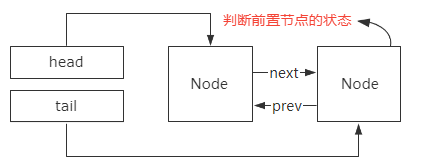
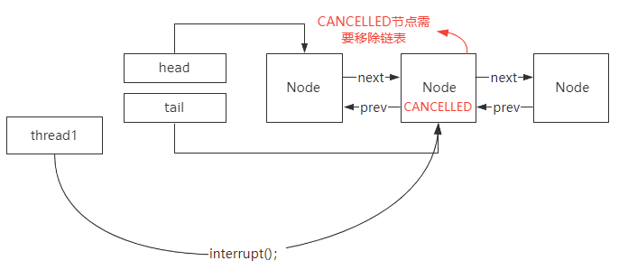
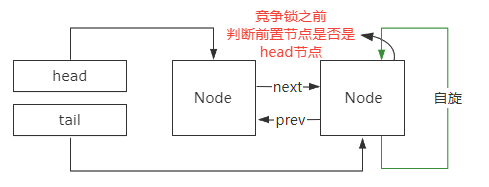

# AQS

## 基本原理

​		AQS的设计是基于模板方法模式的，也就是说，使用者需要继承AQS并重写指定的方法，随后将AQS组合在自定义同步组件的实现中，并调用AQS提供的模板方法，而这些模板方法将会调用使用者重写的方法。

### State

~~~java

private volatile int state;
//    AQS使用一个int的成员变量来表示同步状态。

protected final void setState(int newState) {
    state = newState;
}
//  setState方法用来设置同步状态

protected final int getState() {
    return state;
}
//  getState方法用来获取同步状态

protected final boolean compareAndSetState(int expect, int update) {
    // See below for intrinsics setup to support this
    return unsafe.compareAndSwapInt(this, stateOffset, expect, update);
}
//  compareAndSetState方法使用CAS操作来讲同步状态设置为给定的值
~~~

###  同步队列

​		最开始就提到过AQS内部维护着一个FIFO的队列。而AQS就是依赖这个同步队列来完成同步状态的管理，当前线程获取同步状态失败时，同步器会将当前线程以及等待状态等信息构造成一个节点Node，并将其加入同步队列，同时会阻塞当前线程，当同步状态释放时，会把首节点中的线程唤醒，使其再次尝试获取同步状态。

#### **同步队列中节点属性**

~~~java
// 共享锁对应的节点
static final Node SHARED = new Node();
    因为如果是共享锁，线程可以被多个线程获得。所以将这个属性定义为一个常量。

// 独占锁对应的节点
static final Node EXCLUSIVE = null;
    独占锁因为只能对一个线程获得，所以设置为null，当某个线程获得锁时，将该线程对应的赋予这个属性

// 节点的等待状态
volatile int waitStatus;
~~~

#### **节点的等待状态有4个**

1. CANCELLED：值为1，由于在同步队列中等待的线程等待超时或被中断，需要从同步队列中取消等待，节点进入该状态将不会变化
2. SINGAL：值为-1，后继节点的线程处于等待状态，当前节点如果释放了同步状态，将会通知后继节点，使后继节点得以运行
3. CONDITION：值为-2，节点在等待队列中（这个在Condition的博客里会讲到），节点线程等待在Condition上，当其他线程对Condition调用了singal后，该节点会从等待队列转移到同步队列，加入到对同步状态的获取中去
4. PROPAGEATE：值为-3，表示下一次共享式同步状态获取将会无条件被传播下去

~~~java

//前驱节点，当节点加入同步队列时被设置（尾部添加）
volatile Node prev;
    同步队列中某个节点的前驱节点

//后继节点
volatile Node next;
    同步队列中某个节点的后继节点

//等待队列的后继节点。如果当前节点是共享的，那么这个字段将是一个SHARED常量
Node nextWaiter;
    这个是等待队列的后继节点（不是同步队列）

//获取同步状态的线程
volatile Thread thread;
    当前获取到同步状态的线程
~~~

​		节点时构成同步队列的基础，AQS拥有首节点和尾节点，没有成功获取到同步状态的节点会加入到同步队列的尾部，同步队列的结构如下图所示

​		同步器AQS包含两个节点类型的引用，一个指向头结点，一个指向尾节点。

#### **同步队列的操作**

1. 将节点加入到同步队列：当一个线程成功获取了同步状态（或者锁），其他线程将无法获取到同步状态，转而被构造成节点并加入到同步队列中，而这个加入队列的过程必须要保证线程安全。AQS提供了一个基于CAS的设置尾节点的方法：compareAndSerTail，它需要传递当前线程认为的尾节点和当前节点，只有设置成功后，当前节点才正式与之前的尾节点建立关联。

2. 将节点设置为首节点：同步队列遵循FIFO，首节点是获取同步状态成功的节点，首节点的线程在释放同步状态时，会唤醒后继节点，而后继节点将会在获取同步状态成功时将自己设置为首节点。

3. 设置首节点是通过成功获取同步状态的线程完成的，由于只有一个线程能成功获取到同步状态，因此设置头节点并不需要使用CAS来保证，它只需要将首节点设置为原首节点的后继节点并断开原首节点的next引用即可。

## ReentrantLock

### 成员变量`sync`

ReentrantLock中有一个`Sync`类型的成员变量`sync`。

~~~java
private final Sync sync;
~~~

Sync的定义

~~~java
abstract static class Sync extends AbstractQueuedSynchronizer {
        //...
}
~~~

Sync是一个继承自AQS的抽象类，只实现了一部分的抽象方法。它有两个子类:

`NonfairSync`:用于实现非公平锁

~~~java
/**
* Sync object for non-fair locks
*/
static final class NonfairSync extends Sync {
        private static final long serialVersionUID = 7316153563782823691L;

        /**
         * Performs lock.  Try immediate barge, backing up to normal
         * acquire on failure.
         */
        final void lock() {
            if (compareAndSetState(0, 1))
                setExclusiveOwnerThread(Thread.currentThread());
            else
                acquire(1);
        }

        protected final boolean tryAcquire(int acquires) {
            return nonfairTryAcquire(acquires);
        }
    }

~~~

`FairSync`:用于实现公平锁

~~~java
/**
* Sync object for fair locks
*/
static final class FairSync extends Sync {
        private static final long serialVersionUID = -3000897897090466540L;

        final void lock() {
            acquire(1);
        }

        /**
         * Fair version of tryAcquire.  Don't grant access unless
         * recursive call or no waiters or is first.
         */
        protected final boolean tryAcquire(int acquires) {
            final Thread current = Thread.currentThread();
            int c = getState();
            if (c == 0) {
                if (!hasQueuedPredecessors() &&
                    compareAndSetState(0, acquires)) {
                    setExclusiveOwnerThread(current);
                    return true;
                }
            }
            else if (current == getExclusiveOwnerThread()) {
                int nextc = c + acquires;
                if (nextc < 0)
                    throw new Error("Maximum lock count exceeded");
                setState(nextc);
                return true;
            }
            return false;
        }
    }

~~~

在Sync的子类实现中，主要用到了`getState()`、`setState(int newState)`、`compareAndSetState(int expect,int update)`方法。

~~~java
protected final int getState() {
        return state;
    }

~~~

~~~java
protected final void setState(int newState) {
        state = newState;
    }

~~~

~~~java
protected final boolean compareAndSetState(int expect, int update) {
        // See below for intrinsics setup to support this
        return unsafe.compareAndSwapInt(this, stateOffset, expect, update);
    }

~~~

### 通过`CAS`来实现同步操作。

在使用ReentrantLock时，默认是`非公平锁`

~~~java
public ReentrantLock() {
        sync = new NonfairSync();
    }

~~~

~~~java
public ReentrantLock(boolean fair) {
        sync = fair ? new FairSync() : new NonfairSync();
    }

~~~

### CLH队列锁

`CLH`队列锁即Craig, Landin, and Hagersten (CLH) locks。

CLH队列锁也是一种基于`链表`的可扩展、高性能、公平的自旋锁，申请线程仅仅在本地变量上自旋，它不断轮询前驱的状态，假设发现前驱释放了锁就结束自旋。

## 自定义锁

### 自定义不可重入锁

下面基于AQS实现一个自定义的锁

1. 定义一个类实现`Lock`接口

~~~java
public class CustomLock implements Lock {
    
    @Override
    public void lock() {

    }

    @Override
    public void lockInterruptibly() throws InterruptedException {

    }

    @Override
    public boolean tryLock() {
        return false;
    }

    @Override
    public boolean tryLock(long time, TimeUnit unit) throws InterruptedException {
        return false;
    }

    @Override
    public void unlock() {

    }

    @Override
    public Condition newCondition() {
        return null;
    }
}

~~~

可以看到，实现Lock后，生成的默认方法如上。

2. 定义一个静态内部类继承自AQS,并实现`tryAcquire`、`tryRelease`、`isHeldExclusively`方法

~~~java
private static class Sync extends AbstractQueuedSynchronizer {
        @Override
        protected boolean tryAcquire(int arg) {
            if (compareAndSetState(0, 1)) {
                setExclusiveOwnerThread(Thread.currentThread());
                return true;
            }
            return false;
        }

        @Override
        protected boolean tryRelease(int arg) {
            if (getState() == 0) {
                throw new IllegalMonitorStateException();
            }
            setExclusiveOwnerThread(null);
            setState(0);
            return true;
        }

        @Override
        protected boolean isHeldExclusively() {
            return getState() == 1;
        }

        Condition newCondition() {
            return new ConditionObject();
        }
    }

~~~

3. 定义Sync类型的变量，并具体实现Lock接口定义的方法

~~~java
private Sync sync = new Sync();

@Override
    public void lock() {
        System.out.println(Thread.currentThread().getName() + " ready get lock");
        sync.acquire(1);
        System.out.println(Thread.currentThread().getName() + " already got lock");
    }

    @Override
    public void lockInterruptibly() throws InterruptedException {
        sync.acquireInterruptibly(1);
    }

    @Override
    public boolean tryLock() {
        return sync.tryAcquire(1);
    }

    @Override
    public boolean tryLock(long time, TimeUnit unit) throws InterruptedException {
        return sync.tryAcquireNanos(1, unit.toNanos(time));
    }

    @Override
    public void unlock() {
        System.out.println(Thread.currentThread().getName() + " ready release lock");
        sync.release(1);
        System.out.println(Thread.currentThread().getName() + " already released lock");
    }

    @Override
    public Condition newCondition() {
        return sync.newCondition();
    }

~~~

4. 使用

~~~java
Lock lock = new CustomLock();
try{
    lock.lock();
    //执行具体的业务
}
catch(Exception e){
    e.printStackTrace();
}
finally{
    lock.unlock();
}

~~~

### 自定义可重入锁

~~~java
public class Demo2 implements Lock {

    private Sync sync = new Sync();

    @Override
    public void lock() {
        System.out.println(Thread.currentThread().getName() + " ready get lock");
        sync.acquire(1);
        System.out.println(Thread.currentThread().getName() + " already got lock");
    }

    @Override
    public void lockInterruptibly() throws InterruptedException {
        sync.acquireInterruptibly(1);
    }

    @Override
    public boolean tryLock() {
        return sync.tryAcquire(1);
    }

    @Override
    public boolean tryLock(long time, TimeUnit unit) throws InterruptedException {
        return sync.tryAcquireNanos(1, unit.toNanos(time));
    }

    @Override
    public void unlock() {
        System.out.println(Thread.currentThread().getName() + " ready release lock");
        sync.release(1);
        System.out.println(Thread.currentThread().getName() + " already released lock");
    }

    @Override
    public Condition newCondition() {
        return sync.newCondition();
    }

    private static class Sync extends AbstractQueuedSynchronizer {
        @Override
        protected boolean tryAcquire(int arg) {
            if (compareAndSetState(0, 1)) {
                setExclusiveOwnerThread(Thread.currentThread());
                return true;
            } else if (getExclusiveOwnerThread() == Thread.currentThread()) {
                setState(getState() + 1);
                return true;
            }
            return false;
        }

        @Override
        protected boolean tryRelease(int arg) {
            if (getExclusiveOwnerThread() != Thread.currentThread()) {
                throw new IllegalMonitorStateException();
            }
            if (getState() == 0) {
                throw new IllegalMonitorStateException();
            }
            setState(getState() - 1);
            if (getState() == 0) {
                setExclusiveOwnerThread(null);
            }
            return true;
        }

        @Override
        protected boolean isHeldExclusively() {
            return getState() > 0;
        }

        Condition newCondition() {
            return new ConditionObject();
        }
    }
}

~~~

## 其他

### AQS为什么使用双端队列？

首先，双向链表的特点是它有两个指针，一个指针指向前置节点，一个指针指向后继节点。所以，双向链表可以支持 常量O(1) 时间复杂度的情况下找到前驱结点，基于这样的特点。双向链表在插入和删除操作的时候，要比单向链表简单、高效。

因此，从双向链表的特性来看，我认为AQS使用双向链表有三个方面的考虑。

+ 第一个方面，没有竞争到锁的线程加入到阻塞队列，并且阻塞等待的前提是，当前线程所在节点的前置节点是正常状态，这样设计是为了避免链表中存在异常线程导致无法唤醒后续线程的问题。所以线程阻塞之前需要判断前置节点的状态，如果没有指针指向前置节点，就需要从head节点开始遍历，性能非常低。

  

+ 第二个方面，在Lock接口里面有一个，lockInterruptibly()方法，这个方法表示处于锁阻塞的线程允许被中断。也就是说，**没有竞争到锁的线程加入到同步队列等待以后，是允许外部线程通过interrupt()方法触发唤醒并中断的。**这个时候，被中断的线程的状态会修改成CANCELLED。被标记为CANCELLED状态的线程，是不需要去竞争锁的，但是它仍然存在于双向链表里面。意味着在后续的锁竞争中，需要把这个节点从链表里面移除，否则会导致锁阻塞的线程无法被正常唤醒。在这种情况下，如果是单向链表，就需要从Head节点开始往下逐个遍历，找到并移除异常状态的节点。同样效率也比较低，还会导致锁唤醒的操作和遍历操作之间的竞争。

  

+ 第三个方面，为了避免线程阻塞和唤醒的开销，所以刚加入到链表的线程，首先会**通过自旋的方式尝试去竞争锁。但是实际上按照公平锁的设计，只有头节点的下一个节点才有必要去竞争锁，后续的节点竞争锁的意义不大**。否则，就会造成羊群效应，也就是大量的线程在阻塞之前尝试去竞争锁带来比较大的性能开销。所以为了避免这个问题，加入到链表中的节点在尝试竞争锁之前，需要判断前置节点是不是头节点，如果不是头节点，就没必要再去触发锁竞争的动作。所以这里会涉及到前置节点的查找，如果是单向链表，那么这个功能的实现会非常复杂。

  
