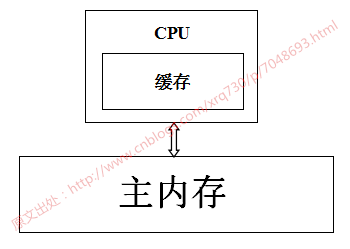
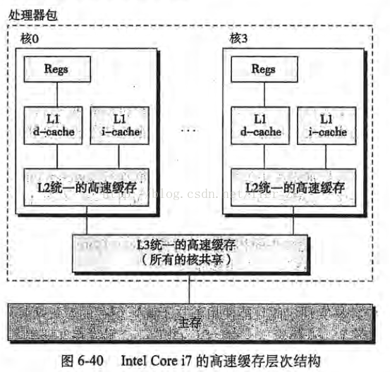

## volatile的用法


volatile通常被比喻成"轻量级的synchronized"，也是Java并发编程中比较重要的一个关键字。和synchronized不同，volatile是一个变量修饰符，只能用来修饰变量。无法修饰方法及代码块等。

volatile的用法比较简单，只需要在声明一个可能被多线程同时访问的变量时，使用volatile修饰就可以了。

如以下代码，是一个比较典型的使用双重锁校验的形式实现单例的，其中使用volatile关键字修饰可能被多个线程同时访问到的singleton。

```java
public class Singleton {
    private volatile static Singleton singleton;

    private Singleton() {
    }

    public static Singleton getSingleton() {
        if (singleton == null) {
            synchronized (Singleton.class) {
                if (singleton == null) {
                    singleton = new Singleton();
                }
            }
        }
        return singleton;
    }

}
```

### 原理

1. 为了提高处理器的执行速度，在处理器和内存之间增加了多级缓存来提升。但是由于引入了多级缓存，就存在缓存数据不一致问题。但是，对于volatile变量，当对volatile变量进行写操作的时候，JVM会向处理器发送一条lock前缀的指令，将这个缓存中的变量回写到系统主存中。
2. 但是就算写回到内存，如果其他处理器缓存的值还是旧的，再执行计算操作就会有问题，所以在多处理器下，为了保证各个处理器的缓存是一致的，就会实现缓存一致性协议
3. 缓存一致性协议：每个处理器通过嗅探在总线上传播的数据来检查自己缓存的值是不是过期了，当处理器发现自己缓存行对应的内存地址被修改，就会将当前处理器的缓存行设置成无效状态，当处理器要对这个数据进行修改操作的时候，会强制重新从系统内存里把数据读到处理器缓存里。
4. 所以，如果一个变量被volatile所修饰的话，在每次数据变化之后，其值都会被强制刷入主存。而其他处理器的缓存由于遵守了缓存一致性协议，也会把这个变量的值从主存加载到自己的缓存中。这就保证了一个volatile在并发编程中，其值在多个缓存中是可见的。

### 可见性

1. 可见性是指当多个线程访问同一个变量时，一个线程修改了这个变量的值，其他线程能够立即看得到修改的值。
2. Java内存模型规定了所有的变量都存储在主内存中，每条线程还有自己的工作内存，**线程的工作内存中保存了该线程中是用到的变量的主内存副本拷贝**，线程对变量的所有操作都必须在工作内存中进行，而不能直接读写主内存。不同的线程之间也无法直接访问对方工作内存中的变量，线程间变量的传递均需要自己的工作内存和主存之间进行数据同步进行。所以，就可能出现线程1改了某个变量的值，但是线程2不可见的情况。
3. 前面的关于volatile的原理中介绍过了，Java中的volatile关键字提供了一个功能，那就是被其修饰的变量在被修改后可以立即同步到主内存，被其修饰的变量在每次是用之前都从主内存刷新。因此，可以使用volatile来保证多线程操作时变量的可见性。

### 有序性

1. 有序性即程序执行的顺序按照代码的先后顺序执行。
2. 除了引入了时间片以外，由于处理器优化和指令重排等，CPU还可能对输入代码进行乱序执行，比如load->add->save 有可能被优化成load->save->add 。这就是可能存在有序性问题。
3. 而volatile除了可以保证数据的可见性之外，还有一个强大的功能，那就是他可以禁止指令重排优化等。
4. 普通的变量仅仅会保证在该方法的执行过程中所依赖的赋值结果的地方都能获得正确的结果，而不能保证变量的赋值操作的顺序与程序代码中的执行顺序一致。
5. volatile可以禁止指令重排，这就保证了代码的程序会严格按照代码的先后顺序执行。这就保证了有序性。被volatile修饰的变量的操作，会严格按照代码顺序执行，load->add->save 的执行顺序就是：load、add、save。

### 原子性

1. 线程是CPU调度的基本单位。CPU有时间片的概念，会根据不同的调度算法进行线程调度。当一个线程获得时间片之后开始执行，在时间片耗尽之后，就会失去CPU使用权。所以在多线程场景下，由于时间片在线程间轮换，就会发生原子性问题。
2. 为了保证原子性，需要通过字节码指令monitorenter和monitorexit，但是volatile和这两个指令之间是没有任何关系的。
3. 所以，volatile是不能保证原子性的。

在以下两个场景中可以使用volatile来代替synchronized：

1、运算结果并不依赖变量的当前值，或者能够确保只有单一的线程会修改变量的值。

2、变量不需要与其他状态变量共同参与不变约束。

除以上场景外，都需要使用其他方式来保证原子性，如synchronized或者concurrent包。

我们来看一下volatile和原子性的例子：

```java
public class Test {

    public volatile int inc = 0;

    public void increase() {
        inc++;
    }

    public static void main(String[] args) {
        final Test test = new Test();
        for (int i = 0; i < 10; i++) {
            new Thread() {
                public void run() {
                    for (int j = 0; j < 1000; j++)
                        test.increase();
                };
            }.start();
        }

        while (Thread.activeCount() > 1) // 保证前面的线程都执行完
            Thread.yield();
        System.out.println(test.inc);
    }
}
```

		以上代码比较简单，就是创建10个线程，然后分别执行1000次i++操作。正常情况下，程序的输出结果应该是10000，但是，多次执行的结果都小于10000。这其实就是volatile无法满足原子性的原因。


## **CPU缓存**

**CPU缓存的出现主要是为了解决CPU运算速度与内存读写速度不匹配的矛盾**，因为CPU运算速度要比内存读写速度快得多，举个例子：

- 一次主内存的访问通常在几十到几百个时钟周期
- 一次L1高速缓存的读写只需要1~2个时钟周期
- 一次L2高速缓存的读写也只需要数十个时钟周期

这种访问速度的显著差异，导致CPU可能会花费很长时间等待数据到来或把数据写入内存。

基于此，现在CPU大多数情况下读写都不会直接访问内存（CPU都没有连接到内存的管脚），取而代之的是CPU缓存，CPU缓存是位于CPU与内存之间的临时存储器，它的容量比内存小得多但是交换速度却比内存快得多。而缓存中的数据是内存中的一小部分数据，但这一小部分是短时间内CPU即将访问的，当CPU调用大量数据时，就可先从缓存中读取，从而加快读取速度。

按照读取顺序与CPU结合的紧密程度，CPU缓存可分为：

- 一级缓存：简称L1 Cache，位于CPU内核的旁边，是与CPU结合最为紧密的CPU缓存
- 二级缓存：简称L2 Cache，分内部和外部两种芯片，内部芯片二级缓存运行速度与主频相同，外部芯片二级缓存运行速度则只有主频的一半
- 三级缓存：简称L3 Cache，部分高端CPU才有

每一级缓存中所存储的数据全部都是下一级缓存中的一部分，这三种缓存的技术难度和制造成本是相对递减的，所以其容量也相对递增。

当CPU要读取一个数据时，首先从一级缓存中查找，如果没有再从二级缓存中查找，如果还是没有再从三级缓存中或内存中查找。一般来说每级缓存的命中率大概都有80%左右，也就是说全部数据量的80%都可以在一级缓存中找到，只剩下20%的总数据量才需要从二级缓存、三级缓存或内存中读取。

 

**使用CPU缓存带来的问题**

用一张图表示一下CPU-->CPU缓存-->主内存数据读取之间的关系：



当系统运行时，CPU执行计算的过程如下：

1. 程序以及数据被加载到主内存
2. 指令和数据被加载到CPU缓存
3. CPU执行指令，把结果写到高速缓存
4. 高速缓存中的数据写回主内存

如果服务器是单核CPU，那么这些步骤不会有任何的问题，但是如果服务器是多核CPU，那么问题来了，以Intel Core i7处理器的高速缓存概念模型为例（图片摘自《深入理解计算机系统》）：



试想下面一种情况：

1. 核0读取了一个字节，根据局部性原理，它相邻的字节同样被被读入核0的缓存
2. 核3做了上面同样的工作，这样核0与核3的缓存拥有同样的数据
3. 核0修改了那个字节，被修改后，那个字节被写回核0的缓存，但是该信息并没有写回主存
4. 核3访问该字节，由于核0并未将数据写回主存，数据不同步

为了解决这个问题，CPU制造商制定了一个规则：**当一个CPU修改缓存中的字节时，服务器中其他CPU会被通知，它们的缓存将视为无效**。于是，在上面的情况下，核3发现自己的缓存中数据已无效，核0将立即把自己的数据写回主存，然后核3重新读取该数据。