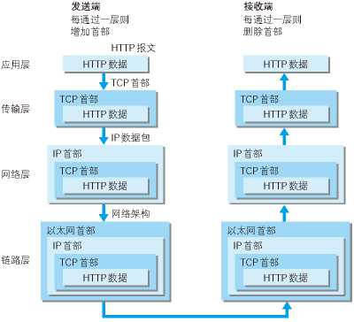
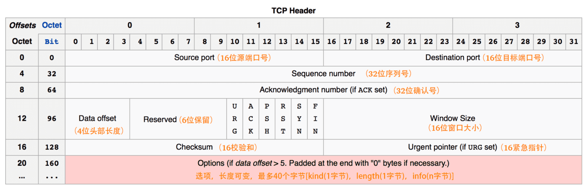

# 网络编程-TCP/IP

## 计算机网络体系结构

​		在计算机网络的基本概念中，分层次的体系结构是最基本的。

### `IP`

- `IP`地址用来标识一台计算机；
-  端口是虚拟的概念，用来区分应用程序；通过端口，可以在一个主机上运行多个网络应用程序。端口的表示是一个16位的二进制整数，2个字节，对应十进制的0~65535。

### `URI=URL+URN`?

URI：`Uniform Resource Identifier` ，统一资源标志符。
URL：`Uniform Resource Locator`，统一资源定位符。
URN：`Uniform Resource Name`，统一资源命名。

### 端口

- `cmd`查看所有端口：`netstat -ano`
- 查看具体程序：使用任务管理器查看 `PID`

### 网络协议

​		网络中交换数据，就必须遵守一些事先约定好的规则，比如交换数据的格式、应答信息。这些规则被称为网络协议。

####  SOAP协议简介

​		[SOAP](https://so.csdn.net/so/search?q=SOAP&spm=1001.2101.3001.7020)（Simple Object Accrss Protocol，简单对象访问协议）是一种简单的基于XML的协议，可以使应用程序在分散或分布式的环境中通过HTTP来交换信息。SOAP基于[XML](https://so.csdn.net/so/search?q=XML&spm=1001.2101.3001.7020)语言和XSD标准，其定义了一套编码规则。

## 网络协议分层

### 概念

- 简化问题难度和复杂度。由于各层之间独立，对于问题进行分割。
- 灵活性好。当其中一层的技术变化时，只要层间接口关系保持不变，其他层不受影响。
- 易于实现和维护。
- 促进标准化工作。分开后，每层功能可以相对简单地被描述。
- 为了使不同体系结构的计算机网络都能互联，国际标准化组织 ISO 提出了标准框架，简称为OSI。


​		`OSI `的七层协议体系结构的概念清楚，并且理论也较完整，但它既复杂又不实用，

​		`TCP/IP `体系结构则不同，但它现在却得到了非常广泛的应用。`TCP/IP `是一个四层体系结构，它包含应用层，运输层，网际层和网络接口层，不过从实质上讲，`TCP/IP` 只有最上面的三层，因为最下面的网络接口层并没有什么具体内容，因此在学习计算机网络的原理时往往采用折中的办法，即综合 `OSI `和` TCP/IP `的优点，采用一种只有五层协议的体系结构，这样既简洁又能将概念阐述清楚。

四层协议，五层协议和七层协议的关系如下：

- `TCP/IP`是一个四层的体系结构，主要包括：应用层、运输层、网际层和网络接口层。
- 五层协议的体系结构主要包括：应用层、运输层、网络层，数据链路层和物理层。
- `OSI`七层协议模型主要包括是：应用层（Application）、表示层（Presentation）、会话层（Session）、运输层（Transport）、网络层（Network）、数据链路层（Data Link）、物理层（Physical）。


注：五层协议的体系结构只是为了介绍网络原理而设计的，实际应用还是 `TCP/IP` 四层体系结构。


### 五层协议

#### 应用层

​		应用层( `application-layer` ）的任务是通过应用进程间的交互来完成特定网络应用。应用层协议定义的是应用进程（进程：主机中正在运行的程序）间的通信和交互的规则。

#### 运输层 `TCP/UDP`

​		**运输层(`transport layer`)的就是负责向两台主机进程之间的通信提供通用的数据传输服务**。应用进程利用该服务传送应用层报文。

运输层主要使用一下两种协议

1. 传输控制协议-TCP：提供面向连接的，可靠的数据传输服务。
2. 用户数据协议-UDP：提供无连接的，尽最大努力的数据传输服务（不保证数据传输的可靠性）。

|              | UDP                                        | TCP                                    |
| ------------ | ------------------------------------------ | -------------------------------------- |
| 是否连接     | 无连接                                     | 面向连接                               |
| 是否可靠     | 不可靠传输，不使用流量控制和拥塞控制       | 可靠传输，使用流量控制和拥塞控制       |
| 连接对象个数 | 支持一对一，一对多，多对一和多对多交互通信 | 只能是一对一通信                       |
| 传输方式     | 面向报文                                   | 面向字节流                             |
| 首部开销     | 首部开销小，仅8字节                        | 首部最小20字节，最大60字节             |
| 场景         | 适用于实时应用（IP电话、视频会议、直播等） | 适用于要求可靠传输的应用，例如文件传输 |


**每一个应用层（`TCP/IP`参考模型的最高层）协议一般都会使用到两个传输层协议之一：**

运行在`TCP协议`上的协议：

- `HTTP（Hypertext Transfer Protocol，超文本传输协议）`，主要用于普通浏览。
- `HTTPS（HTTP over SSL，安全超文本传输协议）`,`HTTP`协议的安全版本。
- `FTP（File Transfer Protocol，文件传输协议）`，用于文件传输。
- `POP3（Post Office Protocol, version 3，邮局协议）`，收邮件用。
- `SMTP（Simple Mail Transfer Protocol，简单邮件传输协议）`，用来发送电子邮件。
- `TELNET（Teletype over the Network，网络电传）`，通过一个`终端（terminal）`登陆到网络。
- `SSH（Secure Shell，用于替代安全性差的TELNET）`，用于加密安全登陆用。

运行在`UDP协议`上的协议：

- `BOOTP（Boot Protocol，启动协议）`，应用于无盘设备。
- `NTP（Network Time Protocol，网络时间协议）`，用于网络同步。
- `DHCP（Dynamic Host Configuration Protocol，动态主机配置协议）`，动态配置`IP`地址。

运行在`TCP`和`UDP`协议上：

- `DNS（Domain Name Service，域名服务）`，用于完成地址查找，邮件转发等工作。


#### 网络层

​		**网络层的任务就是选择合适的网间路由和交换结点，确保计算机通信的数据及时传送**。在发送数据时，网络层把运输层产生的报文段或用户数据报封装成分组和包进行传送。在` TCP/IP` 体系结构中，由于网络层使用 `IP `协议，因此分组也叫` IP` 数据报 ，简称数据报。

​		互联网是由大量的异构（`heterogeneous`）网络通过路由器（router）相互连接起来的。互联网使用的网络层协议是无连接的网际协议（`Intert Prococol`）和许多路由选择协议，因此互联网的网络层也叫做网际层或` IP `层。


#### 数据链路层

​		**数据链路层(data link layer)通常简称为链路层。两台主机之间的数据传输，总是在一段一段的链路上传送的，这就需要使用专门的链路层的协议。**

​		在两个相邻节点之间传送数据时，数据链路层将网络层交下来的 IP 数据报组装成帧，在两个相邻节点间的链路上传送帧。每一帧包括数据和必要的控制信息（如同步信息，地址信息，差错控制等）。

​		在接收数据时，控制信息使接收端能够知道一个帧从哪个比特开始和到哪个比特结束。

​		一般的web应用的通信传输流是这样的：



​		发送端在层与层之间传输数据时，每经过一层时会被打上一个该层所属的首部信息。反之，接收端在层与层之间传输数据时，每经过一层时会把对应的首部信息去除。


#### 物理层

​		**在物理层上所传送的数据单位是比特。 物理层(physical layer)的作用是实现相邻计算机节点之间比特流的透明传送，尽可能屏蔽掉具体传输介质和物理设备的差异。**使其上面的数据链路层不必考虑网络的具体传输介质是什么。“透明传送比特流”表示经实际电路传送后的比特流没有发生变化，对传送的比特流来说，这个电路好像是看不见的。

### `TCP/IP` 协议族

​		在互联网使用的各种协议中最重要和最著名的就是 `TCP/IP` 两个协议。现在人们经常提到的 `TCP/IP` 并不一定是单指 `TCP` 和 `IP` 这两个具体的协议，而往往是表示互联网所使用的整个 `TCP/IP` 协议族。


​		互联网协议套件（英语：Internet Protocol Suite，缩写`IPS`）是一个网络通讯模型，以及一整个网络传输协议家族，为网际网络的基础通讯架构。它常被通称为TCP/IP协议族（英语：`TCP/IP Protocol Suite`，或`TCP/IP Protocols`），简称`TCP/IP`。因为该协定家族的两个核心协定：`TCP（传输控制协议）和IP（网际协议）`，为该家族中最早通过的标准。

划重点：

```
TCP（传输控制协议）和IP（网际协议）` 是最先定义的两个核心协议，所以才统称为`TCP/IP协议族
```

## 三次握手四次挥手

​		TCP是一种面向连接的、可靠的、基于字节流的传输层通信协议，在发送数据前，通信双方必须在彼此间建立一条连接。所谓的“连接”，其实是客户端和服务端保存的一份关于对方的信息，如ip地址、端口号等。

​		TCP可以看成是一种字节流，它会处理IP层或以下的层的丢包、重复以及错误问题。在连接的建立过程中，双方需要交换一些连接的参数。这些参数可以放在TCP头部。

​		一个TCP连接由一个4元组构成，分别是两个IP地址和两个端口号。一个TCP连接通常分为三个阶段：连接、数据传输、退出（关闭）。**通过三次握手建立一个链接，通过四次挥手来关闭一个连接**。

​		**当一个连接被建立或被终止时，交换的报文段只包含TCP头部，而没有数据**。

#### TCP报文的头部结构

在了解TCP连接之前先来了解一下TCP报文的头部结构。



上图中有几个字段需要重点介绍下：

（1）序号：seq序号，占32位，用来标识从TCP源端向目的端发送的字节流，发起方发送数据时对此进行标记。

（2）确认序号：ack序号，占32位，只有ACK标志位为1时，确认序号字段才有效，ack=seq+1。

（3）标志位：共6个，即URG、ACK、PSH、RST、SYN、FIN等，具体含义如下：

- ACK：确认序号有效。
- FIN：释放一个连接。
- PSH：接收方应该尽快将这个报文交给应用层。
- RST：重置连接。
- SYN：发起一个新连接。
- URG：紧急指针（urgent pointer）有效。

需要注意的是：

- 不要将确认序号ack与标志位中的ACK搞混了。
- 确认方ack=发起方seq+1，两端配对。


#### 三次握手

**概念：**

三次握手的本质是确认通信双方收发数据的能力

**流程：**

1. 我让信使运输一份信件给对方，**对方收到了，那么他就知道了我的发件能力和他的收件能力是可以的**。

2. 他给我回信，**我若收到了，我便知我的发件能力和他的收件能力是可以的，并且他的发件能力和我的收件能力是可以**。

3. 然而此时他还不知道他的发件能力和我的收件能力到底可不可以，于是我最后回馈一次，**他若收到了，他便清楚了他的发件能力和我的收件能力是可以的**。


- `第一次握手`：客户端要向服务端发起连接请求，首先客户端随机生成一个起始序列号ISN(比如是100)，那客户端向服务端发送的报文段包含SYN标志位(也就是SYN=1)，序列号seq=100。
- `第二次握手`：服务端收到客户端发过来的报文后，发现SYN=1，知道这是一个连接请求，于是将客户端的起始序列号100存起来，并且随机生成一个服务端的起始序列号(比如是300)。然后给客户端回复一段报文，回复报文包含`SYN`和`ACK`标志(也就是`SYN`=1,`ACK`=1)、序列号seq=300、确认号`ack`=101(客户端发过来的序列号+1)。
- `第三次握手`：客户端收到服务端的回复后发现ACK=1并且ack=101,于是知道服务端已经收到了序列号为100的那段报文；同时发现SYN=1，知道了服务端同意了这次连接，于是就将服务端的序列号300给存下来。然后客户端再回复一段报文给服务端，报文包含ACK标志位(ACK=1)、ack=301(服务端序列号+1)、seq=101(第一次握手时发送报文是占据一个序列号的，所以这次seq就从101开始，需要注意的是不携带数据的ACK报文是不占据序列号的，所以后面第一次正式发送数据时seq还是101)。当服务端收到报文后发现ACK=1并且ack=301，就知道客户端收到序列号为300的报文了，就这样客户端和服务端通过TCP建立了连接。

#### 四次挥手

**概念：**

四次挥手的目的是关闭一个连接


比如客户端初始化的序列号ISA=100，服务端初始化的序列号ISA=300。TCP连接成功后客户端总共发送了1000个字节的数据，服务端在客户端发FIN报文前总共回复了2000个字节的数据。

- `第一次挥手`：当客户端的数据都传输完成后，客户端向服务端发出连接释放报文(当然数据没发完时也可以发送连接释放报文并停止发送数据)，释放连接报文包含FIN标志位(FIN=1)、序列号seq=1101(100+1+1000，其中的1是建立连接时占的一个序列号)。需要注意的是客户端发出FIN报文段后只是不能发数据了，但是还可以正常收数据；另外FIN报文段即使不携带数据也要占据一个序列号。
- `第二次挥手`：服务端收到客户端发的FIN报文后给客户端回复确认报文，确认报文包含ACK标志位(ACK=1)、确认号ack=1102(客户端FIN报文序列号1101+1)、序列号seq=2300(300+2000)。此时服务端处于关闭等待状态，而不是立马给客户端发FIN报文，这个状态还要持续一段时间，因为服务端可能还有数据没发完。
- `第三次挥手`：服务端将最后数据(比如50个字节)发送完毕后就向客户端发出连接释放报文，报文包含FIN和`ACK`标志位(FIN=1,`ACK`=1)、确认号和第二次挥手一样`ack`=1102、序列号seq=2350(2300+50)。
- `第四次挥手`：客户端收到服务端发的FIN报文后，向服务端发出确认报文，确认报文包含ACK标志位(ACK=1)、确认号ack=2351、序列号seq=1102。**注意客户端发出确认报文后不是立马释放TCP连接，而是要经过2MSL(最长报文段寿命的2倍时长)**后才释放TCP连接。而**服务端一旦收到客户端发出的确认报文就会立马释放TCP连接**，所以服务端结束TCP连接的时间要比客户端早一些。


## 常见问题

#### 为什么TCP连接的时候是3次？2次不可以吗？

1.  可能存在丢包：客户端不知道服务端是否已经准备好了(可以理解为客户端未连接成功)，这种情况下客户端不会给服务端发数据，也会忽略服务端发过来的数据。
2. 资源浪费：2次握手后，如果客户端失联，而服务端则会一直维持这个链接，对于服务端来说是一种资源浪费

#### 为什么TCP连接的时候是3次，关闭的时候却是4次？

​		因为只有在客户端和服务端都没有数据要发送的时候才能断开TCP。而客户端发出FIN报文时只能保证客户端没有数据发了，服务端还有没有数据发客户端是不知道的。而服务端收到客户端的FIN报文后只能先回复客户端一个确认报文来告诉客户端我服务端已经收到你的FIN报文了，但我服务端还有一些数据没发完，等这些数据发完了服务端才能给客户端发FIN报文(所以不能一次性将确认报文和FIN报文发给客户端，就是这里多出来了一次)。


#### 如果已经建立了连接，但是客户端突然出现故障了怎么办？

​		保活计时器 + 心跳检测：TCP设有一个保活计时器，客户端如果出现故障，服务器不能一直等下去。服务器每收到一次客户端的请求后都会重新复位这个计时器，时间通常是设置为2小时，若两小时还没有收到客户端的任何数据，服务器就会发送一个探测报文段，以后每隔75秒钟发送一次。若一连发送10个探测报文仍然没反应，服务器就认为客户端出了故障，接着就关闭连接。

#### 什么是`HTTP`，`HTTP` 与 `HTTPS` 的区别

1. 安全性， `Https`采用了加密和认证机制
2. 性能，由于需要加密解密，`Https`性能较差
3. 费用：证书需要购买，会产生相应的费用

#### `SSL`和`TLS` 之间的关系？

1. SSL(Secure Socket Layer 安全套接层)是基于HTTPS下的一个协议加密层，最初是由网景公司（Netscape）研发，后被IETF（The Internet Engineering Task Force - 互联网工程任务组）标准化后写入（RFCRequest For Comments 请求注释），RFC里包含了很多互联网技术的规范！
2. 由于HTTPS的推出受到了很多人的欢迎，在SSL更新到3.0时，IETF对SSL3.0进行了标准化，并添加了少数机制(但是几乎和SSL3.0无差异)，标准化后的IETF更名为TLS1.0(Transport Layer Security 安全传输层协议)，可以说TLS就是SSL的新版本3.1。


#### SSL 工作流程

   SSL 的握手协议非常有效的让客户和服务器之间完成相互之间的身份认证，其主要过程如下:

1. 客户端发起一个http请求，连接到服务器的端口。

2. 服务端把自己的信息以数字证书的形式返回给客户端（证书内容有密钥公钥，网站地址，证书颁发机构，失效日期等）。证书中有一个公钥来加密信息，私钥由服务器持有。

3. 验证证书的合法性

   客户端收到服务器的响应后会先验证证书的合法性（证书中包含的地址与正在访问的地址是否一致，证书是否过期）。

4. 生成随机密码（`RSA`签名）

   如果验证通过，浏览器就会生成一串随机字符串，让服务端用私钥加密随机字符串，返回结果后客户端再用公钥解密。若与之前的随机字符串一致，则说明服务端确实是私钥的持有者。

5. 生成对称加密算法

   验证完服务端身份后，客户端生成一个对称加密的算法和对应密钥，以公钥加密之后发送给服务端。此时被黑客截获也没用，因为只有服务端的私钥才可以对其进行解密。之后客户端与服务端可以用这个对称加密算法来加密和解密通信内容了。

   

#### 常用HTTP状态码

​		HTTP状态码表示客户端HTTP请求的返回结果、标识服务器处理是否正常、表明请求出现的错误等。

| 类别 | 原因短语                                               |
| ---- | ------------------------------------------------------ |
| 1XX  | Informational（信息性状态码） 接受的请求正在处理       |
| 2XX  | Success（成功状态码） 请求正常处理完毕                 |
| 3XX  | Redirection（重定向状态码） 需要进行附加操作以完成请求 |
| 4XX  | Client Error（客户端错误状态码） 服务器无法处理请求    |
| 5XX  | Server Error（服务器错误状态码） 服务器处理请求出错    |

常用HTTP状态码：

| 2XX  | 成功（这系列表明请求被正常处理了）                     |
| ---- | ------------------------------------------------------ |
| 200  | OK，表示从客户端发来的请求在服务器端被正确处理         |
| 204  | No content，表示请求成功，但响应报文不含实体的主体部分 |
| 206  | Partial Content，进行范围请求成功                      |


| 3XX  | 重定向（表明浏览器要执行特殊处理）                           |
| ---- | ------------------------------------------------------------ |
| 301  | moved permanently，永久性重定向，表示资源已被分配了新的 URL  |
| 302  | found，临时性重定向，表示资源临时被分配了新的 URL            |
| 303  | see other，表示资源存在着另一个 URL，应使用 GET 方法获取资源（对于301/302/303响应，几乎所有浏览器都会删除报文主体并自动用GET重新请求） |
| 304  | not modified，表示服务器允许访问资源，但请求未满足条件的情况（与重定向无关） |
| 307  | temporary redirect，临时重定向，和302含义类似，但是期望客户端保持请求方法不变向新的地址发出请求 |


| 4xx  | 客户端错误                                                   |
| ---- | ------------------------------------------------------------ |
| 400  | bad request，请求报文存在语法错误                            |
| 401  | unauthorized，表示发送的请求需要有通过 HTTP 认证的认证信息   |
| 403  | forbidden，表示对请求资源的访问被服务器拒绝，可在实体主体部分返回原因描述 |
| 404  | not found，表示在服务器上没有找到请求的资源                  |


| 5xx  | 服务器错误                                                   |
| ---- | ------------------------------------------------------------ |
| 500  | internal sever error，表示服务器端在执行请求时发生了错误     |
| 501  | Not Implemented，表示服务器不支持当前请求所需要的某个功能    |
| 503  | service unavailable，表明服务器暂时处于超负载或正在停机维护，无法处理请求 |
| 502  | 服务暂时不可用，有时是为了防止系统发生系统过载               |


#### Http 请求方式

- GET：从服务器上获取数据，也就是所谓的查，仅仅是获取服务器资源，不进行修改。
- POST：向服务器提交数据，这就涉及到了数据的更新，也就是更改服务器的数据。
- PUT：英文含义是放置，也就是向服务器新添加数据，就是所谓的增。
- DELETE：从字面意思也能看出，这种方式就是删除服务器数据的过程。


#### 一次完整的HTTP请求过程

​		域名解析 --> 发起TCP的3次握手 --> 建立TCP连接后发起http请求 --> 服务器响应http请求，浏览器得到html代码 --> 浏览器解析html代码，并请求html代码中的资源（如js、css、图片等） --> 浏览器对页面进行渲染呈现给用户


#### GET和POST区别

1. Get 是不安全的，因为在传输过程，数据被放在请求的 URL 中；Post 的所有操作对用户来说都是不可见的。 但是这种做法也不时绝对的，大部分人的做法也是按照上面的说法来的，但是也可以在get请求加上 request body，给 post请求带上 URL 参数。

2. Get 请求提交的 Url 中的数据最多只能是2048字节，这个限制是浏览器或者服务器给添加的，http 协议并没有对 Url 长度进行限制，目的是为了保证服务器和浏览器能够正常运行，防止有人恶意发送请求。Post请求则没有大小限制。

3. Get 执行效率却比 Post 方法好。Get是form提交的默认方法。

4. GET 产生一个 TCP 数据包；POST 产生两个 TCP 数据包。

   对于GET方式的请求，浏览器会把http header和data一并发送出去，服务器响应200（返回数据）；

   而对于POST，浏览器先发送header，服务器响应100 continue，浏览器再发送data，服务器响应200 ok（返回数据）。
   
   

#### 什么是对称加密与非对称加密

​		对称密钥加密是指加密和解密使用同一个密钥的方式，**这种方式存在的最大问题就是密钥发送问题，即如何安全地将密钥发给对方；**

​		而非对称加密是指使用一对非对称密钥，即公钥和私钥，公钥可以随意发布，但私钥只有自己知道。发送密文的一方使用对方的公钥进行加密处理，对方接收到加密信息后，使用自己的私钥进行解密。
​		由于非对称加密的方式不需要发送用来解密的私钥，所以可以保证安全性；但是和对称加密比起来，非常的慢


#### 什么是`HTTP2`

​		`HTTP2` 可以提高了网页的性能。引入了多路复用的技术，这个技术可以只通过一个 TCP 连接就可以传输所有的请求数据。多路复用可以绕过浏览器限制同一个域名下的请求数量的问题，进而提高了网页的性能。


#### Session、Cookie和Token的主要区别

​		HTTP协议本身是无状态的。什么是无状态呢，即服务器无法判断用户身份。

**cookie**

​		cookie是由Web服务器保存在用户浏览器上的小文件（key-value格式），包含用户相关的信息。客户端向服务器发起请求，如果服务器需要记录该用户状态，就使用response向客户端浏览器颁发一个Cookie。客户端浏览器会把Cookie保存起来。当浏览器再请求该网站时，浏览器把请求的网址连同该Cookie一同提交给服务器。服务器检查该Cookie，以此来辨认用户身份。


**session**

​		session是依赖Cookie实现的。session是服务器端对象

​		session 是浏览器和服务器会话过程中，服务器分配的一块储存空间。服务器默认为浏览器在cookie中设置 sessionid，浏览器在向服务器请求过程中传输 cookie 包含 sessionid ，服务器根据 sessionid 获取出会话中存储的信息，然后确定会话的身份信息。


**cookie与session区别**

- 存储位置与安全性：cookie数据存放在客户端上，安全性较差，session数据放在服务器上，安全性相对更高；
- 存储空间：单个cookie保存的数据不能超过4K，很多浏览器都限制一个站点最多保存20个cookie，session无此限制
- 占用服务器资源：session一定时间内保存在服务器上，当访问增多，占用服务器性能，考虑到服务器性能方面，应当使用cookie。


**Token**

​		Token的引入：Token是在客户端频繁向服务端请求数据，服务端频繁的去数据库查询用户名和密码并进行对比，判断用户名和密码正确与否，并作出相应提示，在这样的背景下，Token便应运而生。

​		Token的定义：Token是服务端生成的一串字符串，以作客户端进行请求的一个令牌，当第一次登录后，服务器生成一个Token便将此Token返回给客户端，以后客户端只需带上这个Token前来请求数据即可，无需再次带上用户名和密码。

​		使用Token的目的：Token的目的是为了减轻服务器的压力，减少频繁的查询数据库，使服务器更加健壮。

​		Token 是在服务端产生的。如果前端使用用户名/密码向服务端请求认证，服务端认证成功，那么在服务端会返回 Token 给前端。前端可以在每次请求的时候带上 Token 证明自己的合法地位


`session`与`token`区别

- session 机制存在服务器压力增大，`CSRF`跨站伪造请求攻击，扩展性不强等问题；
- session 存储在服务器端，token存储在客户端
- token 提供认证和授权功能，作为身份认证，token 安全性比 session 好；
- session这种会话存储方式方式只适用于客户端代码和服务端代码运行在同一台服务器上，token适用于项目级的前后端分离（前后端代码运行在不同的服务器下）


#### `CSFR` 攻击

原理：黑客伪造请求，携带用户信息，发送不利于用户的信息，然后从服务器中获利的方式。

预防原理：防止黑客伪造请求

+ 尽量使用Post请求方式

+ 使用Token，是黑客无法伪造

  


#### Servlet 是线程安全的吗

​		**Servlet不是线程安全的，多线程并发的读写会导致数据不同步的问题。**

​		注意：多线程的并发的读写Servlet类属性会导致数据不同步。但是如果只是并发地读取属性而不写入，则不存在数据不同步的问题。因此Servlet里的只读属性最好定义为final类型的。


#### Servlet接口中有哪些方法及Servlet生命周期探秘

​		在Java Web程序中，`Servlet`主要负责接收用户请求`HttpServletRequest`，在`doGet()`，`doPost()`做相应的处理，并将回应`HttpServletResponse`反馈给用户。`Servlet`可以设置初始化参数，供`Servlet`内部使用。

`Servlet`接口定义了5个方法，其中**前三个方法与Servlet生命周期相关**：

- `void init(ServletConfig config) throws ServletException`
- `void service(ServletRequest req, ServletResponse resp) throws ServletException, java.io.IOException`
- `void destory()`
- `java.lang.String getServletInfo()`
- `ServletConfig getServletConfig()`

**生命周期：**

**Web容器加载Servlet并将其实例化后，Servlet生命周期开始**，容器运行其**init()方法**进行Servlet的初始化；

请求到达时调用Servlet的**service()方法**，service()方法会根据需要调用与请求对应的**doGet或doPost**等方法；

当服务器关闭或项目被卸载时服务器会将Servlet实例销毁，此时会调用Servlet的**destroy()方法**。

**init方法和destory方法只会执行一次，service方法客户端每次请求Servlet都会执行**。Servlet中有时会用到一些需要初始化与销毁的资源，因此可以把初始化资源的代码放入init方法中，销毁资源的代码放入destroy方法中，这样就不需要每次处理客户端的请求都要初始化与销毁资源。


#### 如果客户端禁止 cookie 能实现 session 还能用吗？

​		Cookie 与 Session，一般认为是两个独立的东西，Session采用的是在服务器端保持状态的方案，而Cookie采用的是在客户端保持状态的方案。

​		但为什么禁用Cookie就不能得到Session呢？因为Session是用Session ID来确定当前对话所对应的服务器Session，而Session ID是通过Cookie来传递的，禁用Cookie相当于失去了Session ID，也就得不到Session了。

​		假定用户关闭Cookie的情况下使用Session，其实现途径有以下几种：

1. 手动通过URL传值、隐藏表单传递Session ID。
2. 用文件、数据库等形式保存Session ID，在跨页过程中手动调用。

## 其他

### HTTP 协议中 content-type 指的是什么？

​		Content-Type：内容类型，一般是指网页中存在的Content-Type，用于定义网络文件的类型和网页的编码，决定浏览器将以什么形式、什么编码读取这个文件，这就是经常看到一些Asp网页点击的结果却是下载到的一个文件或一张图片的原因。


### WebSocket是什么？

#### 什么是websocket

- WebSocket是HTML5下一种新的协议（websocket协议本质上是一个基于tcp的协议）
- 它实现了浏览器与服务器全双工通信，能更好的节省服务器资源和带宽并达到实时通讯的目的
- Websocket是一个**持久化**的协议

#### websocket的原理

1. websocket约定了一个通信的规范，通过一个握手的机制，客户端和服务器之间能建立一个类似tcp的连接，从而方便它们之间的通信
2. 在websocket出现之前，web交互一般是基于http协议的短连接或者长连接
3. websocket是一种全新的协议，不属于http无状态协议，协议名为"ws"

#### websocket与http的关系


 **相同点：**

1. **都是基于tcp的，都是可靠性传输协议**
2. **都是应用层协议**

**不同点：**

1. **WebSocket是双向通信协议，模拟Socket协议，可以双向发送或接受信息**
2. **HTTP是单向的**
3. **WebSocket是需要浏览器和服务器握手进行建立连接的**
4. **而http是浏览器发起向服务器的连接，服务器预先并不知道这个连接**

 **联系：**

- **WebSocket在建立握手时，数据是通过HTTP传输的。但是建立之后，在真正传输时候是不需要HTTP协议的**

**总结（总体过程）：**

1. **首先，客户端发起http请求，经过3次握手后，建立起TCP连接；http请求里存放WebSocket支持的版本号等信息，如：Upgrade、Connection、WebSocket-Version等；**
2. **然后，服务器收到客户端的握手请求后，同样采用HTTP协议回馈数据；**
3. **最后，客户端收到连接成功的消息后，开始借助于TCP传输信道进行全双工通信。**

#### websocket解决的问题

1. http存在的问题
   1. http是一种无状态协议，每当一次会话完成后，服务端都不知道下一次的客户端是谁，需要每次知道对方是谁，才进行相应的响应，因此本身对于实时通讯就是一种极大的障碍
   2. http协议采用一次请求，一次响应，每次请求和响应就携带有大量的header头，对于实时通讯来说，解析请求头也是需要一定的时间，因此，效率也更低下
   3. 最重要的是，需要客户端主动发，服务端被动发，也就是一次请求，一次响应，不能实现主动发送

2. long poll(长[轮询](https://so.csdn.net/so/search?q=轮询&spm=1001.2101.3001.7020))
   1. 对于以上情况就出现了http解决的第一个方法——长轮询
   2. 基于http的特性，简单点说，就是客户端发起长轮询，如果服务端的数据没有发生变更，会 hold 住请求，直到服务端的数据发生变化，或者等待一定时间超时才会返回。返回后，客户端又会立即再次发起下一次长轮询
   3. 优点是解决了http不能实时更新的弊端，因为这个时间很短，发起请求即处理请求返回响应，实现了“伪·长连接”
   4. 张三取快递的例子，张三今天一定要取到快递，他就一直站在快递点，等待快递一到，立马取走

> 从例子上来看有个问题：
>
> 1. 假如有好多人一起在快递站等快递，那么这个地方是否足够大，（抽象解释：需要有很高的并发，同时有很多请求等待在这里）
>
> 2. 总的来看：
>
>    1. 推送延迟。服务端数据发生变更后，长[轮询](https://so.csdn.net/so/search?q=轮询&spm=1001.2101.3001.7020)结束，立刻返回响应给客户端。
>    2. 服务端压力。长轮询的间隔期一般很长，例如 30s、60s，并且服务端 hold 住连接不会消耗太多服务端资源。
>
>    

3. Ajax轮询
   1. 基于http的特性，简单点说，就是规定每隔一段时间就由客户端发起一次请求，查询有没有新消息，如果有，就返回，如果没有等待相同的时间间隔再次询问
   2. 优点是解决了http不能实时更新的弊端，因为这个时间很短，发起请求即处理请求返回响应，把这个过程放大n倍，本质上还是request = response
   3. 举个形象的例子（假设张三今天有个快递快到了，但是张三忍耐不住，就每隔十分钟给快递员或者快递站打电话，询问快递到了没，每次快递员就说还没到，等到下午张三的快递到了，but，快递员不知道哪个电话是张三的，（可不是只有张三打电话，还有李四，王五），所以只能等张三打电话，才能通知他，你的快递到了）

>  从例子上来看有两个问题：
>
> 1. 假如说，张三打电话的时间间隔为10分钟，当他收到快递前最后一次打电话，快递员说没到，他刚挂掉电话，快递入库了（就是到了），那么等下一次时间到了，张三打电话知道快递到了，那么这样的通讯算不算实时通讯？很显然，不算，中间有十分钟的时间差，还不算给快递员打电话的等待时间（抽象的解释：每次request的请求时间间隔等同于十分钟，请求解析相当于等待）
> 2. 假如说张三所在的小区每天要收很多快递，每个人都采取主动给快递员打电话的方式，那么快递员需要以多快的速度接到，其他人打电话占线也是问题（抽象解释：请求过多，服务端响应也会变慢）
> 3. 总的来看，Ajax轮询存在的问题：
>    1. 推送延迟。
>    2. 服务端压力。配置一般不会发生变化，频繁的轮询会给服务端造成很大的压力。
>    3. 推送延迟和服务端压力无法中和。降低轮询的间隔，延迟降低，压力增加；增加轮询的间隔，压力降低，延迟增高

#### websocket的改进

一旦WebSocket连接建立后，后续数据都以帧序列的形式传输。在客户端断开WebSocket连接或Server端中断连接前，不需要客户端和服务端重新发起连接请求。在海量并发及客户端与服务器交互负载流量大的情况下，极大的节省了网络带宽资源的消耗，有明显的性能优势，且客户端发送和接受消息是在同一个持久连接上发起，实现了“真·长链接”，实时性优势明显。


WebSocket有以下特点：

- 是真正的全双工方式，建立连接后客户端与服务器端是完全平等的，可以互相主动请求。而HTTP长连接基于HTTP，是传统的客户端对服务器发起请求的模式。
- HTTP长连接中，每次数据交换除了真正的数据部分外，服务器和客户端还要大量交换HTTP header，信息交换效率很低。Websocket协议通过第一个request建立了TCP连接之后，之后交换的数据都不需要发送 HTTP header就能交换数据，这显然和原有的HTTP协议有区别所以它需要对服务器和客户端都进行升级才能实现（主流浏览器都已支持HTML5）


### 说明 socket 是什么？

​		对于网络编程来说，这个接口就是套接口（Socket）。Socket：可以看作用户进程和内核网络协议栈编程（交互）接口。

​    Socket：不仅可以在同一台主机上进行通信，也可以在网络上不同的主机间进行通信，也可以异构（软硬件平台不同）进行通信（手机qq和PC机上的qq进行通信，手机的系统是ARM，而PC机是x86）

### Java中，有多少个端口?  Udp 和 Tcp 端口是各自独立的吗?

​		端口范围0---65535,16位整数。

​		由于TCP/IP传输层的两个协议TCP和UDP是完全独立的两个软件模块，因此各自的端口号也相互独立，如TCP有一个255号端口，UDP也可以有一个255号端口，二者并不冲突。 	

