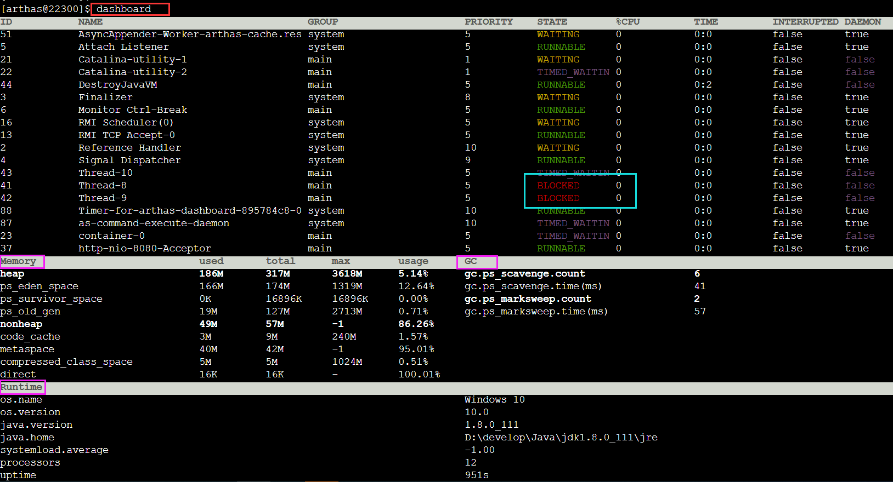

## Arthas 

[Csdn 参考资料](https://blog.csdn.net/u013735734/article/details/102930307?ops_request_misc=%257B%2522request%255Fid%2522%253A%2522165976833616782395334913%2522%252C%2522scm%2522%253A%252220140713.130102334..%2522%257D&request_id=165976833616782395334913&biz_id=0&utm_medium=distribute.pc_search_result.none-task-blog-2~all~top_positive~default-1-102930307-null-null.142^v39^pc_rank_34_queryrelevant25,185^v2^control&utm_term=arthas&spm=1018.2226.3001.4187)

[github - Arthas 用户案例](https://github.com/alibaba/arthas/issues?q=label%3Auser-case)


### 常见问题

1. 是否有一个全局视角来查看系统的运行状况？
2. 为什么 CPU 又升高了，到底是哪里占用了 CPU ？
3. 运行的多线程有死锁吗？有阻塞吗？
4. 程序运行耗时很长，是哪里耗时比较长呢？如何监测呢？
5. 这个类从哪个 jar 包加载的？为什么会报各种类相关的 Exception？
6. 我改的代码为什么没有执行到？难道是我没 commit？分支搞错了？
7. 遇到问题无法在线上 debug，难道只能通过加日志再重新发布吗？
8. 有什么办法可以监控到 JVM 的实时运行状态？


### **dashboard** 

使用 **dashboard** 命令可以概览程序的 线程、内存、GC、运行环境信息。




### CPU 飙高

使用 thread查看所有线程信息，同时会列出每个线程的 CPU 使用率，可以看到图里 ID 为12 的线程 CPU 使用100%。


使用命令 thread 12 查看 CPU 消耗较高的 12 号线程信息，可以看到 CPU 使用较高的方法和行数（这里的行数可能和上面代码里的行数有区别，因为上面的代码在我写文章时候重新排过版了）。


上面是先通过观察总体的线程信息，然后查看具体的线程运行情况。如果只是为了寻找 CPU 使用较高的线程，可以直接使用命令 thread -n [显示的线程个数] ，就可以排列出 CPU 使用率 Top N 的线程。

定位到的 CPU 使用最高的方法。


定位到的 CPU 使用最高的方法。


### 线程池线程状态

定位线程问题之前，先回顾一下线程的几种常见状态：

RUNNABLE 运行中
TIMED_WAITIN 调用了以下方法的线程会进入TIMED_WAITING：

+ Thread#sleep()
+ Object#wait() 并加了超时参数
+ Thread#join() 并加了超时参数
+ LockSupport#parkNanos()
+ LockSupport#parkUntil()

WAITING 当线程调用以下方法时会进入WAITING状态：

+ Object#wait() 而且不加超时参数
+ Thread#join() 而且不加超时参数
+ LockSupport#park()
+ BLOCKED 阻塞，等待锁

上面的模拟代码里，定义了线程池大小为1 的线程池，然后在 cpuHigh 方法里提交了一个线程，在 thread方法再次提交了一个线程，后面的这个线程因为线程池已满，会阻塞下来。

使用 thread | grep pool 命令查看线程池里线程信息。


可以看到线程池有 **WAITING** 的线程。


### 线程死锁

检查到的死锁信息。

使用 thread -b


### 反编译

#### jad

​		上面的代码放到了包 `com`下，假设这是一个线程环境，当怀疑当前运行的代码不是自己想要的代码时，可以直接反编译出代码，也可以选择性的查看类的字段或方法信息。

​		如果怀疑不是自己的代码，可以使用 **jad** 命令直接反编译 class。

~~~bash
jad com.Arthas
~~~


`jad` 命令还提供了一些其他参数：

~~~bash
# 反编译只显示源码
jad --source-only com.Arthas
# 反编译某个类的某个方法
jad --source-only com.Arthas mysql

~~~

#### 查看字段信息

~~~java
使用 **sc -d -f ** 命令查看类的字段信息。
~~~

~~~java
[arthas@20252]$ sc -d -f com.Arthas
sc -d -f com.Arthas
 class-info        com.Arthas
 code-source       /C:/Users/Niu/Desktop/arthas/target/classes/
 name              com.Arthas
 isInterface       false
 isAnnotation      false
 isEnum            false
 isAnonymousClass  false
 isArray           false
 isLocalClass      false
 isMemberClass     false
 isPrimitive       false
 isSynthetic       false
 simple-name       Arthas
 modifier          public
 annotation
 interfaces
 super-class       +-java.lang.Object
 class-loader      +-sun.misc.Launcher$AppClassLoader@18b4aac2
                     +-sun.misc.Launcher$ExtClassLoader@2ef1e4fa
 classLoaderHash   18b4aac2
 fields            modifierfinal,private,static
                   type    org.slf4j.Logger
                   name    log
                   value   Logger[com.Arthas]

                   modifierprivate,static
                   type    java.util.HashSet
                   name    hashSet
                   value   [count1, count2]

                   modifierprivate,static
                   type    java.util.concurrent.ExecutorService
                   name    executorService
                   value   java.util.concurrent.ThreadPoolExecutor@71c03156[Ru
                           nning, pool size = 1, active threads = 1, queued ta
                           sks = 0, completed tasks = 0]


Affect(row-cnt:1) cost in 9 ms.

~~~


#### 查看方法信息

使用 **sm** 命令查看类的方法信息。

~~~bash
[arthas@22180]$ sm com.Arthas
com.Arthas <init>()V
com.Arthas start()V
com.Arthas thread()V
com.Arthas deadThread()V
com.Arthas lambda$cpuHigh$1()V
com.Arthas cpuHigh()V
com.Arthas lambda$thread$3()V
com.Arthas addHashSetThread()V
com.Arthas cpuNormal()V
com.Arthas cpu()V
com.Arthas lambda$addHashSetThread$0()V
com.Arthas lambda$deadThread$4(Ljava/lang/Object;Ljava/lang/Object;)V
com.Arthas lambda$deadThread$5(Ljava/lang/Object;Ljava/lang/Object;)V
com.Arthas lambda$cpuNormal$2()V
Affect(row-cnt:16) cost in 6 ms.

~~~


#### 对变量的值很是好奇

使用 **ognl** 命令，ognl 表达式可以轻松操作想要的信息。

代码还是上面的示例代码，我们查看变量 `hashSet` 中的数据：


1. 查看静态变量 `hashSet` 信息。

~~~java
[arthas@19856]$ ognl '@com.Arthas@hashSet'
@HashSet[
    @String[count1],
    @String[count2],
    @String[count29],
    @String[count28],
    @String[count0],
    @String[count27],
    @String[count5],
    @String[count26],
    @String[count6],
    @String[count25],
    @String[count3],
    @String[count24],

~~~

2. 查看静态变量 hashSet 大小。

~~~bash
[arthas@19856]$ ognl '@com.Arthas@hashSet.size()'
	@Integer[57]
~~~

3. 甚至可以进行操作。

~~~bash
[arthas@19856]$ ognl  '@com.Arthas@hashSet.add("test")'
	@Boolean[true]
[arthas@19856]$
# 查看添加的字符
[arthas@19856]$ ognl  '@com.Arthas@hashSet' | grep test
    @String[test],
[arthas@19856]$

~~~


### 程序有没有问题

#### 运行较慢、耗时较长

+ 使用 trace 命令可以跟踪统计方法耗时
+ 这次换一个模拟代码。一个最基础的 Springboot 项目（当然，不想 Springboot 的话，你也可以直接在 UserController 里 main 方法启动）控制层 getUser 方法调用了 userService.get(uid);，这个方法中分别进行check、service、redis、mysql操作。

模拟代码

~~~java
@RestController
@Slf4j
public class UserController {

    @Autowired
    private UserServiceImpl userService;

    @GetMapping(value = "/user")
    public HashMap<String, Object> getUser(Integer uid) throws Exception {
        // 模拟用户查询
        userService.get(uid);
        HashMap<String, Object> hashMap = new HashMap<>();
        hashMap.put("uid", uid);
        hashMap.put("name", "name" + uid);
        return hashMap;
    }
}

~~~

~~~java
@Service
@Slf4j
public class UserServiceImpl {

    public void get(Integer uid) throws Exception {
        check(uid);
        service(uid);
        redis(uid);
        mysql(uid);
    }

    public void service(Integer uid) throws Exception {
        int count = 0;
        for (int i = 0; i < 10; i++) {
            count += i;
        }
        log.info("service  end {}", count);
    }

    public void redis(Integer uid) throws Exception {
        int count = 0;
        for (int i = 0; i < 10000; i++) {
            count += i;
        }
        log.info("redis  end {}", count);
    }

    public void mysql(Integer uid) throws Exception {
        long count = 0;
        for (int i = 0; i < 10000000; i++) {
            count += i;
        }
        log.info("mysql end {}", count);
    }

 	 public boolean check(Integer uid) throws Exception {
         if (uid == null || uid < 0) {
             log.error("uid不正确，uid:{}", uid);
             throw new Exception("uid不正确");
         }
         return true;
     }
}


~~~

运行 Springboot 之后，使用 **trace ** 命令开始检测耗时情况。

~~~bash
[arthas@6592]$ trace com.UserController getUser
~~~

访问接口 `/getUser` ，可以看到耗时信息，看到 `com.UserServiceImpl:get()`方法耗时较高。


通过 `trace`可以知道是`UserServiceImpl`的`get`方法耗时最长，然后再次进入 `get`方法

~~~bash
trace com.krest.arthas.service.UserServiceImpl get
~~~

很清楚的看到是 `com.UserServiceImpl`的 `mysql`方法耗时是最高的。

~~~bash
Affect(class-cnt:1 , method-cnt:1) cost in 31 ms.
`---ts=2019-10-16 14:40:10;thread_name=http-nio-8080-exec-8;id=1f;is_daemon=true;priority=5;TCCL=org.springframework.boot.web.embedded.tomcat.TomcatEmbeddedWebappClassLoader@23a918c7
    `---[6.792201ms] com.UserServiceImpl:get()
        +---[0.008ms] com.UserServiceImpl:check() #17
        +---[0.076ms] com.UserServiceImpl:service() #18
        +---[0.1089ms] com.UserServiceImpl:redis() #19
        `---[6.528899ms] com.UserServiceImpl:mysql() #20

~~~

#### 统计方法耗时

使用 **monitor** 命令监控统计方法的执行情况。

每5秒统计一次 `com.UserServiceImpl` 类的 `get` 方法执行情况。

~~~bash
monitor -c 5 com.UserServiceImpl get
~~~


### 想观察方法信息

####  watch  观察方法的入参出参信息

使用 **watch** 命令轻松查看输入输出参数以及异常等信息。

~~~bash
watch 命令定义了4个观察事件点，
即
-b 方法调用前
-e 方法异常后，
-s 方法返回后
-f 方法结束后

4个观察事件点 -b、-e、-s 默认关闭，-f 默认打开，
当指定观察点被打开后，在相应事件点会对观察表达式进行求值并输出
这里要注意方法入参和方法出参的区别，
有可能在中间被修改导致前后不一致，
除了 -b 事件点 params 代表方法入参外，
其余事件都代表方法出参
当使用 -b 时，由于观察事件点是在方法调用前，
此时返回值或异常均不存在
~~~


~~~bash
 USAGE:
   watch [-b] [-e] [-x <value>] [-f] [-h] [-n <value>] [-E] [-M <value>] [-s] class-pattern method-pattern express [condition-express]

 SUMMARY:
   Display the input/output parameter, return object, and thrown exception of specified method invocation
   The express may be one of the following expression (evaluated dynamically):
           target : the object
            clazz : the object's class
           method : the constructor or method
           params : the parameters array of method
     params[0..n] : the element of parameters array
        returnObj : the returned object of method
         throwExp : the throw exception of method
         isReturn : the method ended by return
          isThrow : the method ended by throwing exception
            #cost : the execution time in ms of method invocation
 Examples:
   watch -b org.apache.commons.lang.StringUtils isBlank params
   watch -f org.apache.commons.lang.StringUtils isBlank returnObj
   watch org.apache.commons.lang.StringUtils isBlank '{params, target, returnObj}' -x 2
   watch -bf *StringUtils isBlank params
   watch *StringUtils isBlank params[0]
   watch *StringUtils isBlank params[0] params[0].length==1
   watch *StringUtils isBlank params '#cost>100'
   watch -E -b org\.apache\.commons\.lang\.StringUtils isBlank params[0]

 WIKI:
   https://alibaba.github.io/arthas/watch

~~~

常用操作：

~~~java
# 查看入参和出参
$ watch com.Arthas addHashSet '{params[0],returnObj}'
# 查看入参和出参大小
$ watch com.Arthas addHashSet '{params[0],returnObj.size}'
# 查看入参和出参中是否包含 'count10'
$ watch com.Arthas addHashSet '{params[0],returnObj.contains("count10")}'
# 查看入参和出参，出参 toString
$ watch com.Arthas addHashSet '{params[0],returnObj.toString()}'

~~~

查看入参出参。


查看返回的异常信息。


#### stack 观察方法的调用路径

使用 **stack**命令查看方法的调用信息。

```shell
# 观察 类com.UserServiceImpl的 mysql 方法调用路径
stack com.UserServiceImpl mysql
```


#### 方法调用时空隧道

使用 **tt** 命令记录方法执行的详细情况。

> **tt** 命令方法执行数据的时空隧道，记录下指定方法每次调用的入参和返回信息，并能对这些不同的时间下调用进行观测 。

常用操作：

开始记录方法调用信息：tt -t com.UserServiceImpl check


可以看到记录中 INDEX=1001 的记录的 IS-EXP = true ，说明这次调用出现异常。

查看记录的方法调用信息： tt -l


查看调用记录的详细信息（-i 指定 INDEX）： tt -i 1001


可以看到 INDEX=1001 的记录的异常信息。

重新发起调用，使用指定记录，使用 -p 重新调用。

```java
tt -i 1001 -p
```


### 火焰图

#### 启动

`profiler start -e itimer`

#### 获取状态

` profiler getSamples`

### 查看profiler状态

`profiler status`

#### 停止profiler生成`html`格式结果

`profiler stop --file /tmp/result.html`x