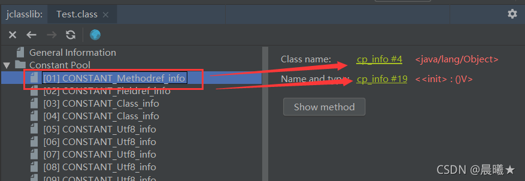
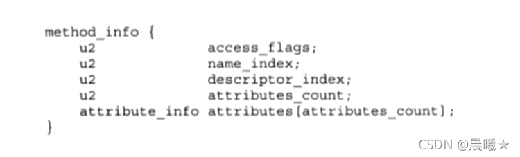

# Class文件解析

## 前言

  我们知道java文件在经过编译之后就会生成字节码文件，即.class文件。随后.class文件就会被对应类加载器加载到内存中。那么是不是存在这么一种可能，我自创一种编程语言，叫做jvav，然后使用自己的编译器将其编译成为JVM所识别的.class文件，是不是也可以运行在JVM中呢？答案是肯定的。
  其实运行在JVM之上的编程语言不止Java一种，还有像groovy、kotlin、scala这些语言都是运行在JVM之上的，这些不同的语言的语法肯定是不同的，但是这些语言在经过各自的编译器进行了编译之后生成的.class文件都是按照相同的规则进行生成的。

​		我们研究.class文件可以对JVM的类加载过程有一个更加清晰的认识。下面我就带大家看看一个.class文件到底是长什么样的。

>  提示：
>   接下的内容会使用到一个idea插件叫做 jclasslib 去查看字节码文件。

首先说明一个.class文件的整体结构，如下图所示：

> 提示：
>   上图中，每个方框前面的小方框表示该内容的大小。u2表示占2字节、u4表示占4字节、！表示大小不定。

然后我们通过一个简单的代码示例来演示我们接下来的内容：

~~~java
public class Test {

    private int a = 10;

    public void method(String a) {
        
    }
}
~~~

这段代码编译了之后的.class文件，我们使用[16进制](https://so.csdn.net/so/search?q=16进制&spm=1001.2101.3001.7020)的方式来打开，内容如下：

现在看起来这一堆16进制内容感觉是晦涩难懂的。别急，我们一块块内容的来解析。

## 魔数

+ 每个Class文件的头4个字节称为魔数（Magic Number）
+ 唯一作用是用于确定这个文件是否为一个能被虚拟机接受的Class文件。
+ Class文件魔数的值为0xCAFEBABE。如果一个文件不是以0xCAFEBABE开头，那它就肯定不是Java class文件。

很多文件存储标准中都使用魔数来进行身份识别，譬如图片格式，如gif或jpeg等在文件头中都存有魔数。在.class文件中的表示如下：

## 版本号

在魔数后面的四个字节存储的是class文件的版本号。5、6字节是次版本号（Minor Version）；7、8两个字节是主版本号（Major Version）。版本号的对照表如下：

主版本号与次版本号在.class文件中的表示如下

可以看到主版本号值为0x0034，对应十进制为52。次版本号为0，因此对应JDK版本就是1.8。

## 常量池

常量池分为两个部分存储。第一部分为常量池大小，第二部分为常量池内容

### 常量池大小

常量池大小是使用2个字节进行表示的，因此常量池中最大的元素个数可以表示到65536。.class文件中的常量池大小表示：

0x0017所表示的十进制数为23，我们再使用jclasslib观察常量池的内容：

可以看到其编号是从1开始的，因此只有22个常量。因此实际的常量个数为.class文件中的表示个数-1。

### 常量池内容

class中的常量池一共有11种类型，每种类型都有一个tag标识其种类，每种类型的tag都只占1字节。如下图所示：

观察我们的字节码文件，可以发现常量池的第一个值为 0X0a，其十进制表示为10。根据上表我们可以看出其类型为**CONSTANT_Methodref_info**，tag后面还有两个index属性。第一个index属性为指向声明方法的类描述符**CONSTANT_Class_info**的索引项，占据两字节；第二个index属性为指向名称及类型描述符**CONSTANT_NameAndType_info**的索引项，占据两个字节。其在.class文件中的表示如下：

第一个index所表示的16进制为0x0004，其十进制为4；第二个index所表示的16进制为0x0013，其十进制为19。
再观察jclasslib中的字节码文件，tag 10表示的是 CONSTANT_Methodref_info，可以发现常量池中第一个常量就是 CONSTANT_Methodref_info，其后有两个index，分别指向4和19（其实就是符号引用）。如下图：

## 类的访问控制权限

类的访问控制权限占据2个字节

其修饰符标志如下图所示：

在.class文件中，标志如下：

可知其为0x0021。0x0021的原因是因为该类的访问修饰符为0x0001 | 0x0020 = 0x0021得到的。

观察jclasslib可以发现其对应的就是public权限：

## 类名

类名分为两部分：本类的类名和父类的类名。这两部分都分别占据两个字节。

本类的类名以及父类类名的字节码表示为：

可知本类类名的16进制为0x0003，对应十进制为3。父类类名的16进制为0x0004，对应十进制为4。观察常量池中第三与第四个常量，如下：

## 接口

接口分为两个部分，第一部分为实现的接口个数，占据2个字节；第二部分为实现的接口。

### 实现的接口个数

占用四个字节，因此最多能够实现的接口个数为 65535 个接口。观察.class字节码文件。可以发现值为0，因为我们并没有实现任何接口。

### 接口内容

一旦接口的个数为0，那么接口内容就会为空。

## 属性

属性也分为两个部分，第一部分为属性的数量，占据2个字节；第二部分为属性的值。

### 属性的数量

占用四个字节，因此一个类的成员属性最多也是 65535 个。0x0001表示只有一个属性。

### 属性的值

字段访问权限标记：

属性在class文件中的存储数据结构：

第一个字段access_flags占据两个字节；第二个字段name_index占据两个字节；第三个字段descriptor_index（描述符）占据两个字节；第四个字段attributes_count（属性数量，因为属性中还会有属性）占据两个字节；第五个字段attributes[attributes_count] 属性内容（如果属性的数量为0，那么这块区域在class文件中也不会存在）。

1、access_flags：0x0002（观察第一张表可知，表示 private）
2、name_index：0x0005（指向常量池，表示属性名）

3、descriptor_index：0x0006（指向常量池，表示属性类型）
这里的值为I，观察第二张表可知，表示为int。

4、attributes_count：0x0000（该属性中没有属性，因此这里长度为0）
5、attributes[attributes_count]（由于attributes_count为0，因此这里没有内容）。其数据结构为：

## 成员方法

方法也分为两个部分，第一部分为方法的数量，占据2个字节；第二部分为方法的值。

### 成员方法数量

使用两个字节表示成员方法的数量，因此最大的成员方法数量也会65535。0x0002表示该类中含有两个方法。

但是可以看到类中只写了1个method方法，这是因为还有一个隐藏着的默认构造方法。（如果该类中含有静态属性，那么在编译时还会生成一个clinit方法，用于给静态字段初始化）

### 成员方法的值

首先说一下方法的组成结构。一个Method由Code和Exception组成，如下图：

方法访问权限和属性标志：

方法的数据结构，与属性的数据结构是一致的：

第一个字段access_flags占据两个字节；第二个字段name_index占据两个字节；第三个字段descriptor_index（描述符）占据两个字节；第四个字段attributes_count（属性数量，包括属性和异常）占据两个字节；第五个字段attributes[attributes_count] 属性内容（如果属性的数量为0，那么这块区域在class文件中也不会存在）。观察示例的class文件：

1、access_flags：0x0001（观察第一张表，表示 public）
2、name_index：0x0007（指向常量池，< init >表示构造方法）

3、descriptor_index：0x0008（指向常量池）
这里值为()V。()表示该方法没有参数；V表示返回值为void

4、attributes_count：0x0001（该方法中只一个属性，由于没有异常因此该属性就是Code）
5、attributes[attributes_count]：（这个就是表示Code）
code的数据结构如下：

u2 attribute_name_index: 00 09(指向常量池，表示Code)

u4 attribute_length: 00 00 00 39（十进制数为57，表示从这里开始到这个方法结束总共会占据57个字节）

u2 max_stack（操作数栈大小）: 00 02

u2 max_locals（局部表大小）: 00 01

可知操作数栈和局部变量表的大小是在编译时期就能够知道了。

u4 code_length: 00 00 00 0b
方法体或者说字节码指令的大小，这里是11个字节

u1 code（方法体或者说字节码指令）: 2ab7 0001 2a10 0ab5 0002 b1（一共11个字节）

对应的就是这六个指令，执行引擎所执行的就是这里的内容。

u2 exception_length：00 00（此例中不存在异常，因此这里的长度就为0，所以异常的区域这里就不存在）

u2 attribute_count: 00 02（这个就是Code的属性，这里数量为2，表示其含有两个属性）

Code的第一个属性叫做LineNumberTable_attribute，就是行号。其数据结构如下：

u2 attr_name_index: 00 0a（对应十进制为10，这里就表示其为LineNumberTable的开始）

对应常量池内容为：

u4 attr_length: 00 00 00 0a（表示该属性的大小，这里占10个字节）

u2 line_number_table_length: 00 02（表示下面结构的个数，有两个这样的结构）

第一个结构的值
[
  u2 start_pc 00 00

 u2 line_number 00 02

]
第二个结构的值
[
  u2 start_pc 00 04

u2 line_number 00 04

]
这两个结构在jclasslib中的表现就是：

Code的第二个属性叫做LocalVariableTable，就是局部变量表。其数据结构如下：

u2 attr_name_index: 00 0b (对应十进制就是11，这里就表示其为LocalVariableTable的开始)

对应常量池内容为：

u4 attr_length: 00 00 00 0c（对应十进制为12，表示该属性的大小，这里是占12个字节）

u2 table_length: 00 01（表示下面结构的个数，有一个这样的结构）

[
  u2 start_pc: 00 00

 u2 length: 00 0b（对应十进制长度就是11）

u2 name_index: 00 0c（对应十进制就是12）

对应常量池属性就是：

  u2 descriptor_index: 00 0d（对应十进制就是13）

对应常量池属性就是：

以上对应的jclasslib中的表示就是：

 u2 index: 00 00

]
到此一个方法的解析就完毕了，方法的解析是整个class文件中最为复杂的。接下来的method方法的解析就省略了。

## 额外属性

额外属性也分为两个部分，一个是额外属性的数量，一个是额外属性的值。

### 额外属性的数量

使用两个字节表示额外属性的数量，因此最大的额外属性数量也会65535。0x0001表示该类中含有一个额外属性。

### 额外属性的值

额外属性在class文件中的存储数据结构：

u2 attr_name_index：0x0011

这里的值为0x0011，其十进制数为17，查看常量池中17对应的值（表示这里是SourceFile的开始）：

u4 attr_length：0x0000 0002（表示该部分所占大小，这里为2字节）

sourcefile_index：0x0012（对应十进制就是18）

对应常量池中的属性如下：

以上两属性对应jclasslib中表示如下：

## 总结

> 到此一个简单的class文件就解析完毕了。其实可以发现，class文件就是按照一定的规则进行生成的，因此解析class文件也就按照这样的规则进行解析就好了。我们去了解class文件的就可以更加清晰地了解到类加载机制中类加载器是如何将一个class文件加载入内存中，同时也可以让我们对于class文件不再那么陌生