 

# 虚拟机(JVM)

## 概诉

​		最好的学习方法就是自己写一个JVM虚拟机

### Java大事件

+ 96年 JDK 1.0
+ 98年 Java SE EE ME 三个版本
+ 2000年 Java 1.3 hotSpot，成为默认的Java虚拟机
+ 2002年 JDK 1.4版本
+ 2003年 Groovy加入Java阵营，JVM作为其他语言的虚拟机平台
+ 2004年 JDK1.5 版本，同时改名为JavaSE 5.0 历史性的版本，新增了很多的新东西
+ 2006年 JDK 6 版本，同时建立了Open JDK，此时有两个JDK ：Sun JDK h和 Open JDK，Java 做了开源
+ 2010年 Oracle收购了Sun，
+ 2011年 JDK 7版本，正式启用了新的垃圾回收器G1
+ 2017年 JDK 9版本，默认是用G1，代替了CMS
+ 2018年JDK 11版本，发布了革命性的ZGC
+ 2019年 JDK 12版本发布


### Jvm 发展历史

+ 1996年，最早的Sun Classic VM，世界上第一款商业的虚拟机，虚拟机中仅仅提供了解释器
+ Exact VM，JDK 1.2 版本虚拟机，可以知道内存中每个位置的数据具体是什么类型，具备了高性能虚拟机的雏形

+ HotSpot ：三大商用虚拟机之一，目前主流的都是hotSpot，hotSpot内置了虚拟机，服务器端、桌面端、嵌入式端都有应用

+ BEA JRockit ： 三大商用虚拟机之一，专注于服务器应用，是世界上最快的JVM

+ IBM J9： 三大商用虚拟机之一，也号称是世界上最快的虚拟器（号称而已），2019年IBM发布了J9 VM，命名为Open J9，主要用于IBM各种Java产品

+ KVM、CDC/CLDC 针对Java ME

+ Azul JVM： 高性能虚拟机中的战斗机，但是需要与特定的硬件平台进行绑定

+ Liquid VM BEA 公司开发，不需要特定的硬件支持，但是随诊JRockit虚拟机终止开发，Liquid VM也停止了

+ Apache Harmony： 他是IBM和Intel联合开发的虚拟机，Sun坚决不让Harmony获取JCP认证，最终在2011年退役

+ Microsoft JVM：为了在IE3 支持Java Applets，后来和Sun公司撕逼，微软停止了VM

+ Taobao JVM ： 基于OpenJDK HotSpot，深度自定义的高性能Java虚拟机，同时基于Open JDK，深度开发了自己定制版本的AlibabaJDK，是整个阿里体系的Java体系的基石

  + 创新的GCIH，将生命周期长的对象移除Heap之外，以此来达到降低GC的回收频率和提升GC的回收效率的目的

  + 实现了多个JVM中对象的共享
  + 针对大数据场景的ZenGC
  + 但是严重依赖Intel的Cpu，损失了兼容性

+ Dalvik VM：谷歌开发，应用与安卓系统，不是Java 虚拟机，不能直接运行Java 的 Class 文件
+ Graal VM：2018年，Oracle开发，想要在HotSpot的基础上，实现跨语言的全栈虚拟机，可以作为任何语言的运行平台，也算是虚拟机的一个未来

### 谈谈你对JVM的理解？

1. 首先JVM是一个虚拟机，Java程序运行在虚拟机之上，而虚拟机可以运行在不同的操作系统，从而实现了Java程序的跨平台执行
2. JVM 最具特点的就是它自带的垃圾回收机制，能够帮助程序员自动清理无用的内存对象，从而实现内存的自动管理功能
3. 目前来说JVM包含了多个版本，当下使用最多的应该是HotSpot；最先进的是GraalVM（格拉尔），它想要在Hotspot的基础上，实现跨语言的全栈虚拟机；另外还有基于GraalVM开发的Quarkus框架，目标是使Java程序在K8s上实现更低的内存占用和更快的运行速度

## JVM内存区域

### JVM 的主要组成部分及其作用？


JVM包含两个子系统和两个组件，两个子系统为Class loader(类装载)、Execution engine(执行引擎)；两个组件为Runtime data area(运行时数据区)、Native Interface(本地接口)。

- Class loader(类装载)：根据给定的全限定名类名(如：java.lang.Object)来装载class文件到Runtime data area中的method area。
- Execution engine（执行引擎）：执行classes中的指令。
- Native Interface(本地接口)：与native libraries交互，是其它编程语言交互的接口。native 方法库主要存放C或者C++方法，例如Thread.start等方法
- Runtime data area(运行时数据区域)：这就是我们常说的JVM的内存。

**作用** ：首先通过编译器把 Java 代码转换成字节码，类加载器（ClassLoader）再把字节码加载到内存中，将其放在运行时数据区（Runtime data area）的方法区内，而字节码文件只是 JVM 的一套指令集规范，并不能直接交给底层操作系统去执行，因此需要特定的命令解析器执行引擎（Execution Engine），将字节码翻译成底层系统指令，再交由 CPU 去执行，而这个过程中需要调用其他语言的本地库接口（Native Interface）来实现整个程序的功能。

**下面是Java程序运行机制详细说明**

Java程序运行机制步骤

- 首先利用IDE集成开发工具编写Java源代码，源文件的后缀为.java；
- 再利用编译器(javac命令)将源代码编译成字节码文件，字节码文件的后缀名为.class；
- 运行字节码的工作是由解释器(java命令)来完成的。

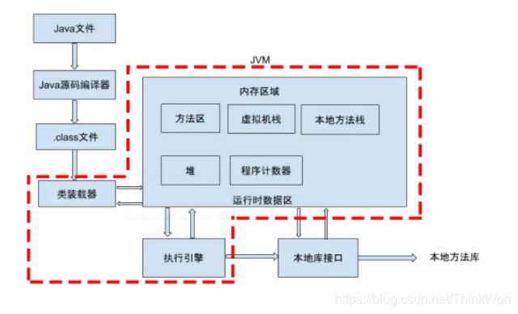

​		从上图可以看，java文件通过编译器变成了.class文件，接下来类加载器又将这些.class文件加载到JVM中。其实可以一句话来解释：类的加载指的是将类的.class文件中的二进制数据读入到内存中，将其放在运行时数据区的方法区内，然后在堆区创建一个 java.lang.Class对象，用来封装类在方法区内的数据结构。


### 说一下 JVM 运行时数据区

​		**Java 虚拟机在执行 Java 程序的过程中会把它所管理的内存区域划分为若干个不同的数据区域**。Java 虚拟机所管理的内存被划分为如下几个区域：

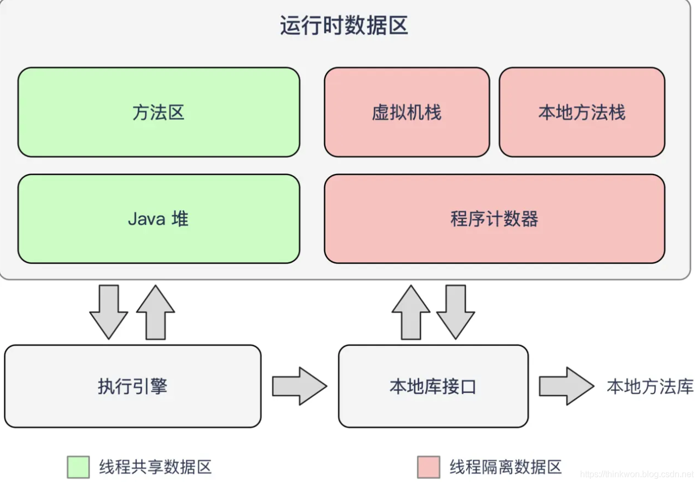


不同虚拟机的运行时数据区可能略微有所不同，但都会遵从 Java 虚拟机规范， Java 虚拟机规范规定的区域分为以下 5 个部分：

- 程序计数器：（字节码解析器的工作是通过改变这个计数器的值，来选取下一条需要执行的字节码指令，分支、循环、跳转、异常处理、线程恢复等基础功能，都需要依赖这个计数器来完成；
- Java 虚拟机栈：用于存储局部变量表、操作数栈、动态链接、方法出口等信息；
- 本地方法栈：与虚拟机栈的作用是一样的，只不过虚拟机栈是服务 Java 方法的，而本地方法栈是为虚拟机调用 Native 方法服务的；
- Java 堆：Java 虚拟机中内存最大的一块，是被所有线程共享的，几乎所有的对象实例都在这里分配内存；
- 方法区：用于存储已被虚拟机加载的类信息、常量、静态变量、即时编译后的代码等数据。

### 说一下堆栈的区别？

1. 物理地址
   + 堆的物理地址分配对对象是不连续的。因此性能慢些。在GC的时候也要考虑到不连续的分配，所以有各种算法。比如，标记-消除，复制，标记-压缩，分代（即新生代使用复制算法，老年代使用标记——压缩）
   + 栈使用的是数据结构中的栈，先进后出的原则，物理地址分配是连续的。所以性能快。

2. 内存分别

   + 堆因为是不连续的，所以分配的内存是在`运行期`确认的，因此大小不固定。一般堆大小远远大于栈。
   + 栈是连续的，所以分配的内存大小要在`编译期`就确认，大小是固定的。

3. 存放的内容

   + 堆存放的是对象的实例和数组。因此该区更关注的是数据的存储
   + 栈存放：局部变量，操作数栈，返回结果。该区更关注的是程序方法的执行。

4. 程序的可见度

   + 堆对于整个应用程序都是共享、可见的。

   + 栈只对于线程是可见的。所以也是线程私有。他的生命周期和线程相同。

PS：

1. 静态变量放在方法区
2. **静态的对象还是放在堆。**


### 队列和栈有什么区别？

队列和栈都是被用来预存储数据的。

- 操作的名称不同。队列的插入称为入队，队列的删除称为出队。栈的插入称为进栈，栈的删除称为出栈。
- 可操作的方式不同。队列是在队尾入队，队头出队，即两边都可操作。而栈的进栈和出栈都是在栈顶进行的，无法对栈底直接进行操作。
- 操作的方法不同。队列是先进先出（FIFO），即队列的修改是依先进先出的原则进行的。新来的成员总是加入队尾（不能从中间插入），每次离开的成员总是队列头上（不允许中途离队）。而栈为后进先出（LIFO）,即每次删除（出栈）的总是当前栈中最新的元素，即最后插入（进栈）的元素，而最先插入的被放在栈的底部，要到最后才能删除。


### JVM 运行文件反编译

​		使用JavaP 对于xxx.class 文件进行再次汇编，然后可以得到xxx.java的源码文件。


### 方法区

####  栈、堆、方法区的数据交换

​		方法区的数据是线程共享的，但是方法区同样也会发生OOM-> out of MemoryError Metaspace，通过调用方法区的数据，导入到堆和栈中。

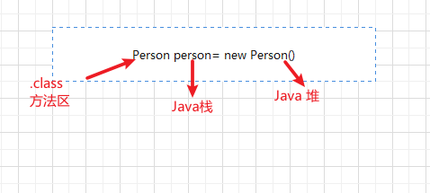

####  方法区的作用

1. 线程之间的数据共享
2. 方法区可以设置大小，也可以动态扩容，
2. 如果加载了太多的第三方jar包或者大量动态的生成反射类，会导致方法区oom
3. 目的与堆分开
4. 可以是不连续的内存空间
5. 关闭Jvm会释放这个区域的内存


#### 方法区的演进

1. JDK7以前，习惯把方法区成为永久代，JDK8以后，元空间取代了永久代
2. 本质上，方法区不等于永久代，JVM虚拟机规范主要针对的是HotSpot
3. 当年使用永久代，不是一个好的idea，因为使用的是虚拟机的空间，反而容易导致OOM-Meta Space
4. 默认的64为 MetaSpace 是21M，超过之后，就会进行方法区的GC，促发GC后，虚拟机会自动提高方法区的大小


#### 方法区的演进细节

1. 只有hotspot才有永久代
2. jdk1.7 ，有永久代，但是已经逐步开始移除永久代，字符串常量池静态变量保存再堆中
3. jdk1.8 以后，无永久代，类型信息、字段、方法、常量保存在本地内存的元空间中，但是字符串常量池、静态变量仍然在堆中


#### 为什么元空间取代了永久代？

​		JRockit 虚拟机是最快的虚拟机，当时HotSpot为了和JRockit融合，所以取消了永久代。（看起来是有点难以理解的......）


#### 配置方法区的大小

~~~bash
-XX:MetaspaceSize=100M
~~~


#### 方法区OOM调优

1. 导出 Dump 文件，要分清除内存泄漏还是内存溢出
2. 如果是内存斜口，可以进一步查看泄露对象套GC Roots 的引用链，确认一下泄露代码的位置，内存泄漏会导致GC无法回收对象，所以，我们要断开引用链
3. 如果不存在内存泄漏，那就是说内存中的对象需要存活着，那我们应带适当调整堆空间的大小，然后调整某些对象的太长的声明周期，比如避免使用静态变量和全局变量，尽量缩短对象的声明周期

#### 方法区的垃圾回收问题

1. Java 虚拟机规范堆方法区垃圾回收的要求比较宽松，可以不要求对方法区进行GC
2. 方法区存放的数据主要是类信息，但是判断一个类是不是被使用，会比较困难，所以，方法区的垃圾回收有时候是一件费力但是可能结果却不太让人满意的情况，属于是一件低成本的事情

#### 全局常量

​		被final修饰的常量，会在代码刚加载的时候就被加载到内存中了，final修饰的变量 甚至会比 static 优先进行编译

#### 反编译Class文件

反编译class文件，生成内容到test.txr中

javap -v -p xxxx.class > test.txt

### 常量池

#### 常量池分类

1. 类文件常量池(Class Constant Pool)

2. 运行时常量池(Runtime Constant Pool)

3. 字符串常量池(String Constant Pool)

在JVM内存区域中他们各自所处的位置：

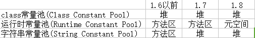

下面分别讲说这三种常量池各自是什么和放什么。

#### 运行时常量池与常量池

1. 方法区，内部包含了运行时常量池
2. 字节码文件中，内部包含了常量池，常量池是字节码文件的一部分，包含了各种字面量（比如String等）和（System.out.println等）对类型、域和方法的符号引用
3. 为什么要有常量池中的符号引用？
   1. 要运行一个简单的程序，也需要加载很多的类，所以符号代替这些加载的类，那么加载的内容就会变得很小了，只有在真正运行的时候，才会去加载被符号引用等代替的类，比如（System.out.println等），所以常量池的作用，很大程度上，会解决程序加载的问题，提升加载速度。简化加载。


#### 类文件常量池

**是什么？**

​		我们写的每一个Java类被编译后，就会形成一份class文件（每个class文件都有一个class常量池）。class文件中除了包含类的版本、字段、方法、接口等描述信息外，还有一项信息就是常量池(constant pool table)，用于存放编译器生成的各种字面量(Literal)和符号引用(Symbolic References)。

**放什么？**

  存放编译器生成的各种字面量(Literal)和符号引用(Symbolic References)。

  **字面量包括：**

1. 文本字符串 
2. 八种基本类型的值 
3. 被声明为final的常量等

  符号引用包括：

1. 类和方法的全限定名 
2. 字段的名称和描述符 
3. 方法的名称和描述符。

#### 运行时常量池

​		运行时常量池存在于内存中，也就是class常量池被加载到内存之后的版本，不同之处是：它的字面量可以动态的添加(String#intern())，符号引用可以被解析为直接引用。JVM在执行某个类的时候，必须经过加载、连接、初始化，而连接又包括验证、准备、解析三个阶段。

​		而当类加载到内存中后，jvm就会将class常量池中的内容存放到运行时常量池中，由此可知，运行时常量池也是每个类都有一个。

​		在解析阶段，会把符号引用替换为直接引用，解析的过程会去查询字符串常量池，也就是我们上面所说的StringTable，以保证运行时常量池所引用的字符串与字符串常量池中是一致的。

**放什么**？

  **class文件元信息描述，编译后的代码数据，引用类型数据，类文件常量池**

#### 字符串常量池

**是什么？**

​		它是一个哈希表，默认值大小长度是1009。这个StringTable在每个HotSpot VM的实例只有一份，被所有的类共享。字符串常量由一个一个字符组成，放在了StringTable上。

**放什么？**

1. 在JDK6.0及之前版本中，String Pool里放的都是字符串常量；
2. 在JDK7.0中，String Pool中也可以存放放于堆内的字符串对象的引用。

**为什么会放在堆空间中**？

​		实际开发中，String会被大量创建，如果放在永久代，就会导致永久代内存不足，所以放在堆中，可以被及时回收，如今也可以说是因为这个原因

## HotSpot虚拟机

### 什么是HotSpot

​		HotSpot里运行着一个监视器（Profile Monitor），用来监视程序的运行状况。

​		 java字节码（class文件）是以解释的方式被加载到虚拟机中(默认启动时解释执行)。 程序运行过程中，那一部分运用频率大，那些对程序的性能影响重要。对程序运行效率影响大的代码，称为热点（hotspot），HotSpot会把这些热点动态地编译成机器码（native code），同时对机器码进行优化，从而提高运行效率。对那些较少运行的代码，HotSpot就不会把他们编译。

​		HotSpot对字节码有三层处理：不编译(字节码加载到虚拟机中时的状态。也就是当虚拟机执行的时候再编译)，编译(把字节码编译成本地代码。虚拟机执行的时候已经编译好了，不要再编译了)，编译并优化（不但把字节码编译成本地代码，而且还进行了优化）。

​		至于那些程序那些不编译，那些编译，那些优化，则是由监视器（Profile Monitor）决定。


### 对象的创建

说到对象的创建，首先让我们看看 `Java` 中提供的几种对象创建方式：

|               Header               |       解释       |
| :--------------------------------: | :--------------: |
|           使用new关键字            |  调用了构造函数  |
|     使用Class的newInstance方法     |  调用了构造函数  |
| 使用Constructor类的newInstance方法 |  调用了构造函数  |
|           使用clone方法            | 没有调用构造函数 |
|            使用反序列化            | 没有调用构造函数 |

下面是对象创建的主要流程:

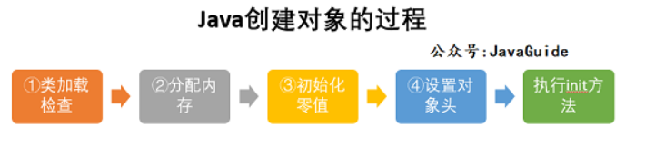

#### [Step1:类加载检查](https://snailclimb.gitee.io/javaguide/#/docs/java/jvm/Java内存区域?id=step1类加载检查)

​		虚拟机遇到一条 new 指令时，首先将去检查这个指令的参数是否能在常量池中定位到这个类的符号引用，并且检查这个符号引用代表的类是否已被加载过、解析和初始化过。如果没有，那必须先执行相应的类加载过程。

#### [Step2:分配内存](https://snailclimb.gitee.io/javaguide/#/docs/java/jvm/Java内存区域?id=step2分配内存)

​		在**类加载检查**通过后，接下来虚拟机将为新生对象**分配内存**。对象所需的内存大小在类加载完成后便可确定，为对象分配空间的任务等同于把一块确定大小的内存从 Java 堆中划分出来。**分配方式**有 **“指针碰撞”** 和 **“空闲列表”** 两种，**选择哪种分配方式由 Java 堆是否规整决定，而 Java 堆是否规整又由所采用的垃圾收集器是否带有压缩整理功能决定**。

#### [Step3:初始化零值](https://snailclimb.gitee.io/javaguide/#/docs/java/jvm/Java内存区域?id=step3初始化零值)

​		内存分配完成后，虚拟机需要将分配到的内存空间都初始化为零值（不包括对象头），这一步操作保证了对象的实例字段在 Java 代码中可以不赋初始值就直接使用，程序能访问到这些字段的数据类型所对应的零值。

#### [Step4:设置对象头](https://snailclimb.gitee.io/javaguide/#/docs/java/jvm/Java内存区域?id=step4设置对象头)

初始化零值完成之后，**虚拟机要对对象进行必要的设置**，例如

1. 这个对象是哪个类的实例、
2. 如何才能找到类的元数据信息、
3. 对象的哈希码、
4. 对象的 GC 分代年龄等信息。 **这些信息存放在对象头中。** 
5. 另外，根据虚拟机当前运行状态的不同，
6. 如是否启用偏向锁等，对象头会有不同的设置方式。


#### 想·Step5:执行 init 方法

​		在上面工作都完成之后，从虚拟机的视角来看，一个新的对象已经产生了，但从 Java 程序的视角来看，对象创建才刚开始，`<init>` 方法还没有执行，所有的字段都还为零。所以一般来说，执行 new 指令之后会接着执行 `<init>` 方法，把对象按照程序员的意愿进行初始化，这样一个真正可用的对象才算完全产生出来。


### Java对象的组成部分

+ 对象头：三部分组成：
  + Mark Word：记录对象和锁的有关信息。当一个对象被 synchronized 关键字加锁之后，围绕锁的操作就都会和MarkWord有关联。MarkWord通常都是 32 bit位大小。会保存一些分代年龄、无锁状态下对象的HashCode、偏向锁的线程ID、轻量级锁指向栈中锁记录的指针、指向重量级锁的指针、锁的标志位等内容。
  + 指向类的指针：大小也通常为32bit，它主要指向类的数据，也就是指向方法区中的位置。
  + 数组长度：只有数组对象才有，在32位或者64位JVM中，长度都是32bit。
+ 实例数据区：该区域主要就存放着实例对象的一些字段属性内容。
+ 对齐填充字节：由于JVM要求Java对象所占的内存大小应该是8bit的倍数，所以这部分主要就是将对象大小补充为8bit的倍数，没有别的功能。


### 一个空的Object对象占多大内存？

+ 在开启压缩指针情况下，会有12个字节，但是为了避免伪共享的问题，JVM会按照8个字节的倍数进行填充，所以会变成16个字节
+ 在关闭压缩指针的情况下，会占用16个字节，且不需要填充


### 为对象分配内存

类加载完成后，接着会在Java堆中划分一块内存分配给对象。内存分配根据Java堆是否规整，有两种方式：

- 指针碰撞：如果Java堆的内存是规整，即所有用过的内存放在一边，而空闲的的放在另一边。分配内存时将位于中间的指针指示器向空闲的内存移动一段与对象大小相等的距离，这样便完成分配内存工作。
- 空闲列表：如果Java堆的内存不是规整的，则需要由虚拟机维护一个列表来记录那些内存是可用的，这样在分配的时候可以从列表中查询到足够大的内存分配给对象，并在分配后更新列表记录。

选择哪种分配方式是由 Java 堆是否规整来决定的，而 Java 堆是否规整又由所采用的垃圾收集器是否带有压缩整理功能决定。

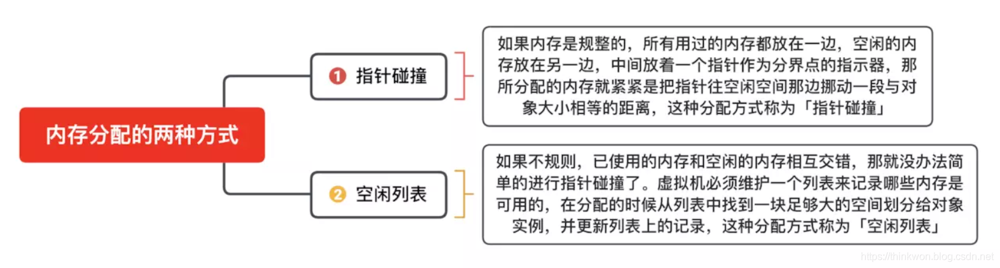

### 处理并发安全问题

对象的创建在虚拟机中是一个非常频繁的行为，哪怕只是修改一个指针所指向的位置，在并发情况下也是不安全的，可能出现正在给对象 A 分配内存，指针还没来得及修改，对象 B 又同时使用了原来的指针来分配内存的情况。解决这个问题有两种方案：

- 对分配内存空间的动作进行同步处理（采用 CAS + 失败重试来保障更新操作的原子性）；
- 把内存分配的动作按照线程划分在不同的空间之中进行，即每个线程在 Java 堆中预先分配一小块内存，称为本地线程分配缓冲（Thread Local Allocation Buffer, TLAB）。哪个线程要分配内存，就在哪个线程的 TLAB 上分配。只有 TLAB 用完并分配新的 TLAB 时，才需要同步锁。通过-XX:+/-UserTLAB参数来设定虚拟机是否使用TLAB。

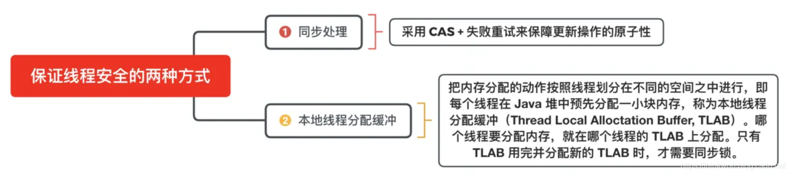

### 对象的访问定位

`Java`程序需要通过 `JVM` 栈上的引用访问堆中的具体对象。对象的访问方式取决于 `JVM` 虚拟机的实现。目前主流的访问方式有 **句柄** 和 **直接指针** 两种方式。

> **指针：** 指向对象，代表一个对象在内存中的起始地址。
>
> **句柄：** 可以理解为指向指针的指针，维护着对象的指针。句柄不直接指向对象，而是指向对象的指针（句柄不发生变化，指向固定内存地址），再由对象的指针指向对象的真实内存地址。

#### 句柄访问

`Java`堆中划分出一块内存来作为**句柄池**，引用中存储对象的**句柄地址**，而句柄中包含了**对象实例数据**与**对象类型数据**各自的**具体地址**信息，具体构造如下图所示：

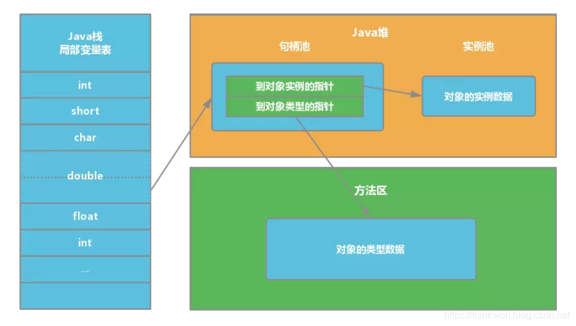

**优势**：引用中存储的是**稳定**的句柄地址，在对象被移动（垃圾收集时移动对象是非常普遍的行为）时只会改变**句柄中**的**实例数据指针**，而**引用**本身不需要修改。

#### 直接指针

如果使用**直接指针**访问，**引用** 中存储的直接就是**对象地址**，那么`Java`堆对象内部的布局中就必须考虑如何放置访问**类型数据**的相关信息。

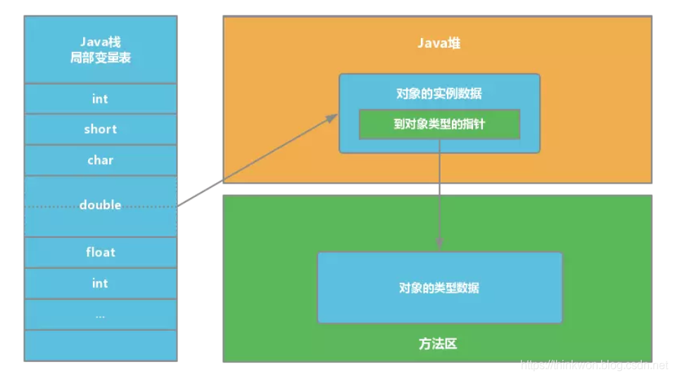

**优势**：速度更**快**，节省了**一次指针定位**的时间开销。由于对象的访问在`Java`中非常频繁，因此这类开销积少成多后也是非常可观的执行成本。HotSpot 中采用的就是这种方式。

### 直接内存

#### 概念

1. 直接内存不是Java虚拟机规范的
2. 是Java堆外的，直接向系统申请的内存空间
3. 元空间使用的就是直接内存
4. 在NIO中，出于性能的考虑，Nio允许Java程序使用直接内存，用于数据缓冲区
5. 使用直接内存的效率比使用堆内存效率会更加高一些

#### OOM

​		如果使用内存超过了系统内存大小，Java程序也会直接报出OOM direct buffer Memery 的异常，而且一般无法使用工具监控直接内存的问题点

#### 缺点

1. 分配回收成本高
2. 不接受JVM的管理

### 直接内存和堆内存

1. 直接内存不是虚拟机运行时数据区的一部分，但是既然是内存，肯定还是受本机总内存（包括RAM以及SWAP区或者分页文件）大小以及处理器寻址空间的限制。
2. 在JDK1.4 中新加入了NIO(New Input/Output)类，引入了一种基于通道(Channel)与缓冲区（Buffer）的I/O 方式，它可以使用native 函数库直接分配堆外内存，然后通脱一个存储在Java堆中的DirectByteBuffer 对象作为这块内存的引用进行操作。这样能在一些场景中显著提高性能，因为避免了在Java堆和Native（本地）堆中来回复制数据。（也就是使用了零拷贝）

**直接内存与堆内存的区别：**

1. 直接内存申请空间耗费很高的性能，堆内存申请空间耗费比较低
2. 直接内存的IO读写的性能要优于堆内存，在多次读写操作的情况相差非常明显

## 垃圾回收

### 内存泄漏与内存溢出

#### 内存泄漏

​		是指程序在申请内存后，无法释放已申请的内存空间，比如锁

​		一次内存泄漏似乎不会有大的影响，但内存泄漏堆积后的后果就是内存溢出。

#### 内存溢出 out of memory 

​		指程序申请内存时，没有足够的内存供申请者使用，或者说，给了你一块存储int类型数据的存储空间，但是你却存储long类型的数据，那么结果就是内存不够用，此时就会报错OOM,即所谓的内存溢出。

#### 两者联系

内存泄漏的堆积最终会导致内存溢出

#### 内存泄漏分类（按发生方式）

1. 常发性内存泄漏。发生内存泄漏的代码会被多次执行到，每次被执行的时候都会导致一块内存泄漏。
2. 偶发性内存泄漏。发生内存泄漏的代码只有在某些特定环境或操作过程下才会发生。常发性和偶发性是相对的。对于特定的环境，偶发性的也许就变成了常发性的。所以测试环境和测试方法对检测内存泄漏至关重要。
3. 一次性内存泄漏。发生内存泄漏的代码只会被执行一次，或者由于算法上的缺陷，导致总会有一块仅且一块内存发生泄漏。比如，在类的构造函数中分配内存，在析构函数中却没有释放该内存，所以内存泄漏只会发生一次。
4. 隐式内存泄漏。程序在运行过程中不停的分配内存，但是直到结束的时候才释放内存。严格的说这里并没有发生内存泄漏，因为最终程序释放了所有申请的内存。但是对于一个服务器程序，需要运行几天，几周甚至几个月，不及时释放内存也可能导致最终耗尽系统的所有内存。所以，我们称这类内存泄漏为隐式内存泄漏。

#### 内存溢出的原因及解决方法：

**原因：**

1. 内存中加载的数据量过于庞大，如一次从数据库取出过多数据；
2. 集合类中有对对象的引用，使用完后未清空，使得JVM不能回收；
3. 代码中存在死循环或循环产生过多重复的对象实体；
4. 使用的第三方软件中的BUG；
5. 启动参数内存值设定的过小

**解决方案：**

1. 修改JVM启动参数，直接增加内存。(-Xms，-Xmx参数一定不要忘记加。)
2. 检查错误日志，查看“OutOfMemory”错误前是否有其 它异常或错误。
3. 对代码进行走查和分析，找出可能发生内存溢出的位置。


### Java会存在内存泄漏吗？

​		内存泄漏是指不再被使用的对象或者变量一直被占据在内存中。理论上来说，Java是有GC垃圾回收机制的，也就是说，不再被使用的对象，会被GC自动回收掉，自动从内存中清除。

​		但是，即使这样，Java也还是存在着内存泄漏的情况，java导致内存泄露的原因很明确：长生命周期的对象持有短生命周期对象的引用就很可能发生内存泄露，尽管短生命周期对象已经不再需要，但是因为长生命周期对象持有它的引用而导致不能被回收，这就是java中内存泄露的发生场景。

### Java垃圾回收机制

​		在JVM中，有一个垃圾回收线程，它是低优先级的，在正常情况下是不会执行的，只有在虚拟机空闲或者当前堆内存不足时，才会触发执行，扫面那些没有被任何引用的对象，并将它们添加到要回收的集合中，进行回收。

### GC是什么

内存处理是编程人员容易出现问题的地方，忘记或者错误的内存回收会导致程序或系统的不稳定甚至崩溃，

Java 提供的 GC 功能可以自动监测对象是否超过作用域从而达到自动回收内存的目的

### 垃圾回收器的基本原理是什么

+ 对于GC来说，当程序员创建对象时，GC就开始监控这个对象的地址、大小以及使用情况。
+ 通常，GC采用有向图的方式记录和管理堆(heap)中的所有对象。通过这种方式确定哪些对象是"可达的"，哪些对象是"不可达的"。当GC确定一些对象为"不可达"时，GC就有责任回收这些内存空间。
+ 程序员可以手动执行System.gc()，通知GC运行，但是并不保证GC一定会执行。

### GC的root节点有哪些？

+ 方法区中的静态属性（静态属性指向一个对象）
+ 方法区的中的常量（常量指向一个对象）
+ 虚拟机中的局部变量（变量指向一个对象）
+ 本地方法栈中JNI（native修饰的方法指向的对象）

### 工具查看GC Root，可以用来查看Dump文件

1. MAT： Memory  Analyzer
2. JProfiler（推荐）：一般来说，回来某一个对象的GC Root，我们称为 GC 溯源

### System.GC 和 Runtime.GC

1. Syste,m.GC ，有一个免责声明，无法保证对于来及收集器的调用
2. System.GC 与 Runtime.getRuntime.GC 作用是一样的
3. 但是我们可以使用System.runFinalization() 会强制调用引用对象的finalize()方法
4. 开发过程中不会主动调用System.GC，因为可能会导致STW


### 垃圾回收的并发与并行

+ 并行：多条垃圾线程并行工作，用户线程需要等待
+ 串行：用户等待垃圾回收完成
+ 并发：用户线程与垃圾线程同时执行，当不一定是并行，可能会交互执行


### 安全点和安全区域

只有在特殊的位置才会执行GC，这些点叫做安全点或者安全区域

一般是：

+ 方法调用
+ 循环跳转
+ 异常跳转


### Java 中都有哪些引用类型？

- 强引用：发生 gc 的时候不会被回收。
- 软引用：有用但不是必须的对象，在发生内存溢出之前会被回收。
- 弱引用：有用但不是必须的对象，在下一次GC时会被回收。
- 虚引用（幽灵引用/幻影引用）：无法通过虚引用获得对象，用 PhantomReference 实现虚引用，虚引用的用途是在 gc 时返回一个通知。


### 怎么判断对象是否可以被回收？

垃圾收集器在做垃圾回收的时候，首先需要判定的就是哪些内存是需要被回收的，哪些对象是「存活」的，是不可以被回收的；哪些对象已经「死掉」了，需要被回收。

一般有两种方法来判断：

- 引用计数器法：为每个对象创建一个引用计数，有对象引用时计数器 +1，引用被释放时计数 -1，当计数器为 0 时就可以被回收。它有一个缺点不能解决循环引用的问题；
- 可达性分析算法：从 GC Roots 开始向下搜索，搜索所走过的路径称为引用链。也就是想找到根引用，然后向下搜索。当一个对象到 GC Roots 没有任何引用链相连时，则证明此对象是可以被回收的。


### 说一下 JVM 有哪些垃圾回收算法？

- 标记-清除算法：标记无用对象，然后进行清除回收。缺点：效率不高，无法清除垃圾碎片。
- 复制算法：按照容量划分二个大小相等的内存区域，当一块用完的时候将活着的对象复制到另一块上，然后再把已使用的内存空间一次清理掉。缺点：内存使用率不高，只有原来的一半。
- 标记-整理算法：标记无用对象，让所有存活的对象都向一端移动，然后直接清除掉端边界以外的内存。
- 分代算法：根据对象存活周期的不同将内存划分为几块，一般是新生代和老年代，新生代基本采用复制算法，老年代采用标记整理算法。


#### 标记-清除算法

标记无用对象，然后进行清除回收。

标记-清除算法（Mark-Sweep）是一种常见的基础垃圾收集算法，它将垃圾收集分为两个阶段：

- 标记阶段：标记出可以回收的对象。
- 清除阶段：回收被标记的对象所占用的空间。

标记-清除算法之所以是基础的，是因为后面讲到的垃圾收集算法都是在此算法的基础上进行改进的。

**优点**：实现简单，不需要对象进行移动。

**缺点**：标记、清除过程效率低，产生大量不连续的内存碎片，提高了垃圾回收的频率。

标记-清除算法的执行的过程如下图所示

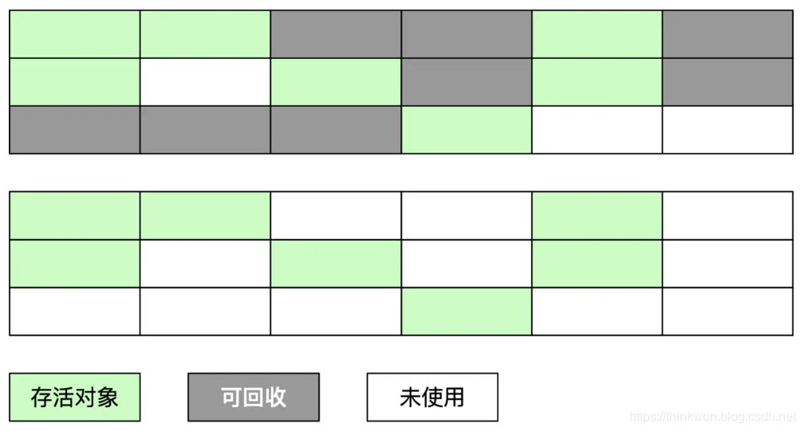

#### 复制算法

为了解决标记-清除算法的效率不高的问题，产生了复制算法。它把内存空间划为两个相等的区域，每次只使用其中一个区域。垃圾收集时，遍历当前使用的区域，把存活对象复制到另外一个区域中，最后将当前使用的区域的可回收的对象进行回收。

**优点**：按顺序分配内存即可，实现简单、运行高效，不用考虑内存碎片。

**缺点**：可用的内存大小缩小为原来的一半，对象存活率高时会频繁进行复制。

复制算法的执行过程如下图所示

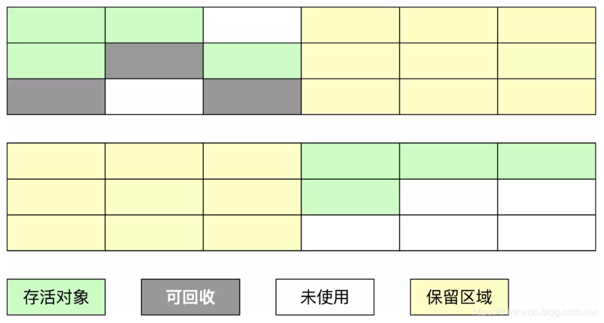

#### 标记-整理算法

在新生代中可以使用复制算法，但是在老年代就不能选择复制算法了，因为老年代的对象存活率会较高，这样会有较多的复制操作，导致效率变低。标记-清除算法可以应用在老年代中，但是它效率不高，在内存回收后容易产生大量内存碎片。因此就出现了一种标记-整理算法（Mark-Compact）算法，与标记-整理算法不同的是，在标记可回收的对象后将所有存活的对象压缩到内存的一端，使他们紧凑的排列在一起，然后对端边界以外的内存进行回收。回收后，已用和未用的内存都各自一边。

**优点**：解决了标记-清理算法存在的内存碎片问题。

**缺点**：仍需要进行局部对象移动，一定程度上降低了效率。

标记-整理算法的执行过程如下图所示

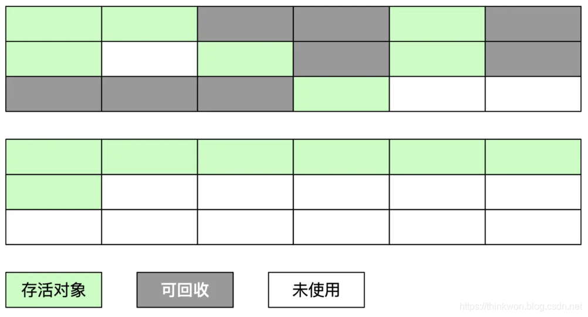

#### 分代收集算法

​		当前商业虚拟机都采用**分代收集**的垃圾收集算法。分代收集算法，顾名思义是根据对象的**存活周期**将内存划分为几块。一般包括**年轻代**、**老年代** 和 **永久代**，如图所示：

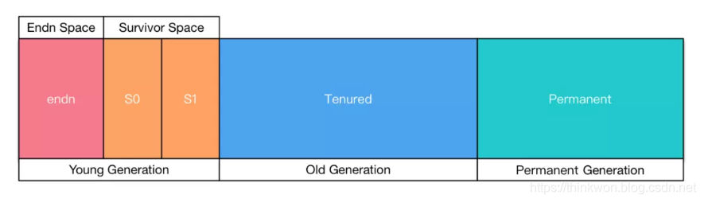


### 触发 FullGC的条件

+ 调用System.gc时，系统建议执行Full GC，但是不必然执行

+ 老年代空间不足
+ 方法去空间不足
+ 通过Minor GC后进入老年代的平均大小大于老年代的可用内存
+ 由Eden区、From Space区向To Space区复制时，对象大小大于To Space可用内存，则把该对象转存到老年代，且老年代的可用内存小于该对象大小


### 说一下 JVM 有哪些垃圾回收器？

下图展示了7种作用于不同分代的收集器，

新生代的收集器包括Serial、PraNew、Parallel Scavenge，

老年代的收集器包括Serial Old、Parallel Old、CMS，

回收整个Java堆的G1收集器。

不同收集器之间的连线表示它们可以搭配使用。

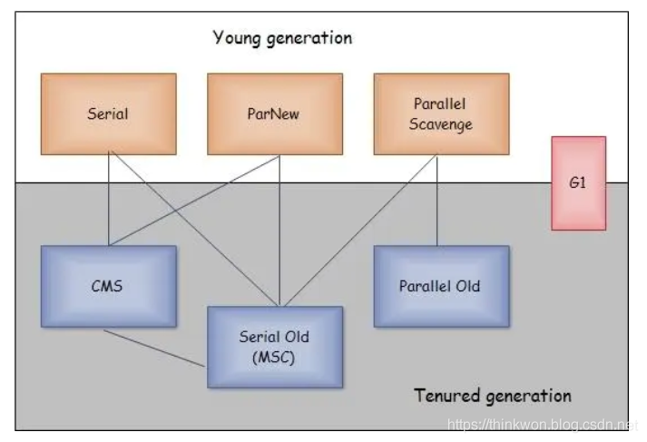

- Serial收集器（复制算法): 新生代单线程收集器，标记和清理都是单线程，优点是简单高效；
- ParNew收集器 (复制算法): 新生代收并行集器，实际上是Serial收集器的多线程版本，在多核CPU环境下有着比Serial更好的表现；
- Parallel Scavenge收集器 (复制算法): 新生代并行收集器，**追求高吞吐量，高效利用 CPU**。吞吐量 = 用户线程时间/(用户线程时间+GC线程时间)，高吞吐量可以高效率的利用CPU时间，尽快完成程序的运算任务，适合后台应用等对交互相应要求不高的场景；
- Serial Old收集器 (标记-整理算法): 老年代单线程收集器，Serial收集器的老年代版本；
- Parallel Old收集器 (标记-整理算法)： **老年代并行收集器，吞吐量优先**，Parallel Scavenge收集器的老年代版本；
- CMS(Concurrent Mark Sweep)收集器（标记-清除算法）： 老年代并行收集器，以获取最短回收停顿时间为目标的收集器，**具有高并发、低停顿的特点，**追求最短GC回收停顿时间。（在JDK14的时候删除了CMS）
- G1(Garbage First)收集器 (标记-整理算法)： Java堆并行收集器，G1收集器是JDK1.7提供的一个新收集器，G1收集器基于“标记-整理”算法实现，也就是说不会产生内存碎片。此外，G1收集器不同于之前的收集器的一个重要特点是：**G1回收的范围是整个Java堆(包括新生代，老年代)，**而前六种收集器回收的范围仅限于新生代或老年代。**（JDK9以后是默认的垃圾回收器）**

### 详细介绍一下 CMS 垃圾回收器？ 

CMS 是英文 Concurrent Mark-Sweep 的简称，是以牺牲吞吐量为代价来获得最短回收停顿时间的垃圾回收器。对于要求服务器响应速度的应用上，这种垃圾回收器非常适合。在启动 JVM 的参数加上“-XX:+UseConcMarkSweepGC”来指定使用 CMS 垃圾回收器。

CMS 不能与Parallel Scavenge 收集器 搭配使用

CMS 使用的是标记-清除的算法实现的，所以在 gc 的时候回产生大量的内存碎片，当剩余内存不能满足程序运行要求时，系统将会出现 Concurrent Mode Failure，临时 CMS 会采用 Serial Old 回收器进行垃圾清除，此时的性能将会被降低。


### CMS 工作流程

+ 初始标记：仅仅只是标记一下 GCRoots 能直接关联到的对象，速度很快，需要停顿（STW-Stoptheworld）。
+ 并发标记：从 GCRoot 开始对堆中对象进行可达性分析，找到存活对象，它在整个回收过程中耗时最长，不需要停顿。
+ 重新标记：为了修正并发标记期间因用户程序继续运作而导致标记产生变动的那一部分对象的标记记录，需要停顿(STW)。这个阶段的停顿时间一般 会比初始标记阶段稍长一些，但远比并发标记的时间短。
+ 并发清除：不需要停顿。


### 三色标记法

概念：代表了CMS标记的进度

颜色代表

1. 黑：自己与成员变量标记结束，不是垃圾
2. 白：自己已经标记完，成员变量未标记
3. 灰：自己未标记完

其他问题：

1. 错误标记
2. 漏标记

解决方案：增量标记


### 新生代垃圾回收器和老年代垃圾回收器都有哪些？有什么区别？

- 新生代回收器：Serial、ParNew、Parallel Scavenge
- 老年代回收器：Serial Old、Parallel Old、CMS
- 整堆回收器：G1

新生代垃圾回收器一般采用的是复制算法，复制算法的优点是效率高，缺点是内存利用率低；老年代回收器一般采用的是标记-整理的算法进行垃圾回收。

### 简述分代垃圾回收器是怎么工作的？

分代回收器有两个分区：老生代和新生代，新生代默认的空间占比总空间的 1/3，老生代的默认占比是 2/3。

新生代使用的是复制算法，新生代里有 3 个分区：Eden、To Survivor、From Survivor，它们的默认占比是 8:1:1，它的执行流程如下：

- 把 Eden + From Survivor 存活的对象放入 To Survivor 区；
- 清空 Eden 和 From Survivor 分区；
- From Survivor 和 To Survivor 分区交换，From Survivor 变 To Survivor，To Survivor 变 From Survivor。

每次在 From Survivor 到 To Survivor 移动时都存活的对象，年龄就 +1，当年龄到达 15（默认配置是 15）时，升级为老生代。大对象也会直接进入老生代。

老生代当空间占用到达某个值之后就会触发全局垃圾收回，一般使用标记整理的执行算法。以上这些循环往复就构成了整个分代垃圾回收的整体执行流程。

### 为什么对象的年龄的默认值是15，才可以升级老年代？

+ 这个15是经过实验得出的值，他可以保证垃圾回收效率的前提下，尽可能的减少移动到老年代中的对象数量
+ 当然我们亦可以通过参数设置这个值，不过不能是负数或0
+ 这个值也有一个最大限制，只能小于等于15，因为对象头中，这个字段给了4bit的大小，而在二进制里面，4bit最大值就是15

### JVM内存参数简述

~~~
#常用的设置
-Xms：初始堆大小，JVM 启动的时候，给定堆空间大小。 
-Xmx：最大堆大小，JVM 运行过程中，如果初始堆空间不足的时候，最大可以扩展到多少。 
-Xmn：设置堆中年轻代大小。整个堆大小=年轻代大小+年老代大小+持久代大小。 
-XX:NewSize=n 设置年轻代初始化大小大小 
-XX:MaxNewSize=n 设置年轻代最大值
-XX:NewRatio=n 设置年轻代和年老代的比值。如: -XX:NewRatio=3，表示年轻代与年老代比值为 1：3，年轻代占整个年轻代+年老代和的 1/4 
-XX:SurvivorRatio=n 年轻代中 Eden 区与两个 Survivor 区的比值。注意 Survivor 区有两个。8表示两个Survivor :eden=2:8 ,即一个Survivor占年轻代的1/10，默认就为8
-Xss：设置每个线程的堆栈大小。JDK5后每个线程 Java 栈大小为 1M，以前每个线程堆栈大小为 256K。
-XX:ThreadStackSize=n 线程堆栈大小
-XX:PermSize=n 设置持久代初始值	
-XX:MaxPermSize=n 设置持久代大小
-XX:MaxTenuringThreshold=n 设置年轻带垃圾对象最大年龄。如果设置为 0 的话，则年轻代对象不经过 Survivor 区，直接进入年老代。

#下面是一些不常用的

-XX:LargePageSizeInBytes=n 设置堆内存的内存页大小
-XX:+UseFastAccessorMethods 优化原始类型的getter方法性能
-XX:+DisableExplicitGC 禁止在运行期显式地调用System.gc()，默认启用	
-XX:+AggressiveOpts 是否启用JVM开发团队最新的调优成果。例如编译优化，偏向锁，并行年老代收集等，jdk6纸之后默认启动
-XX:+UseBiasedLocking 是否启用偏向锁，JDK6默认启用	
-Xnoclassgc 是否禁用垃圾回收
-XX:+UseThreadPriorities 使用本地线程的优先级，默认启用	
等等等......

~~~


### JVM的GC收集器设置

~~~
-XX:+UseSerialGC:设置串行收集器，年轻带收集器 
-XX:+UseParNewGC:设置年轻代为并行收集。可与 CMS 收集同时使用。JDK5.0 以上，JVM 会根据系统配置自行设置，所以无需再设置此值。
-XX:+UseParallelGC:设置并行收集器，目标是目标是达到可控制的吞吐量
-XX:+UseParallelOldGC:设置并行年老代收集器，JDK6.0 支持对年老代并行收集。 
-XX:+UseConcMarkSweepGC:设置年老代并发收集器
-XX:+UseG1GC:设置 G1 收集器，JDK1.9默认垃圾收集器
~~~


### G1 垃圾回收器

**概念**

​		G1采用的是对整个堆进行回收，并且G1使用的分区region思想将内存划分成了许多的分区，G1不使用严格将内存分为年轻代和老年代，但是在逻辑层面G1还是将分区region贴上了标签Eden，Survivor，Old，也是一种分代的思想，并且G1针对于特别大的对象（当一个对象会占据一个分区的一般以上空间G1称为大对象）会将该大对象用一段连续的多个Humongous分区（专门存放大对象）存放。G1的大多数行为都会将Humougous分区判定为老年代看待

​		产生的目的就是在尽可能低延迟的情况下提升垃圾回收的吞吐量

**原理**

1. G1收集器会跟踪每个region里面垃圾堆积的价值（即回收该region所获的空间和所需时间的价值），然后再后台维护一个优先级列表，每次根据该优先级列表进行回收（优先处理优先级高的region），这也是Garbage First的由来
2. 基于标记整理算法 

**基本步骤**

1. 查找内存中不再使用的对象
2. 释放这些对象占用的内存

**工作过程**

+ 初始标记 
+ 并行标记
+ 最终标记（重新标记）
+ 筛选回收（对于每个Region回收价值和成本进行排序，制定回收计划）


**特点**：

停顿时间控制，用户可以自定义停顿时间

1. G1会根据这个时间尽可能的回收垃圾，所以这也是G1是比较全能的原因。
2. G1的一个回收特点：并不是回收全部垃圾，而是尽可能在用户规定得停顿时间内尽可能回收垃圾多的region

**优势**：

1. 并行与并发
   1. 并行：回收期间，利用多核CPU，会触发STW
   2. 并发：回收期间不会完全阻塞应用程序
2. 分代收集
3. 空间整合，当Java堆空间比较大的时候，G1的优势更加明显
4. 可预测的停顿时间模型

**总结**：

1. 相较于CMS，G1并不能够完全碾压，G1回收时占用的内存和负载都会比CMS高
2. 经验上来说，小内存应用上CMS优秀，二者的平衡点在6-8G之间，如果内存中大对象比较多，G1也会更加优秀一点，因为它是基于标记整理算法进行的垃圾回收，所以G1，确实是非常优秀的垃圾回收器

**回收过程**：

1. 年轻代
2. 老年代并发标记
3. 混合回收

**优化建议**：

1. GC的吞吐目标是90%的应用程序事件和10%的垃圾回收时间
2. 暂停时间不要太过于严苛，否则直接影响到吞吐量


### 详解 ZGC

1. ZGC 特点：ZGC 是最新的 JDK1.11 版本中提供的高效垃圾回收算法，ZGC 针对大堆内存设计可以支持 TB 级别的堆，ZGC 非常高效，能够做到 10ms 以下的回收停顿时间。这么快的响应，ZGC 是如何做到的呢？这是由于 ZGC 具有以下特点。
   1. ZGC 使用了着色指针技术，在 64 位平台上，一个指针的可用位是 64 位，ZGC 限制最大支持 4TB 的堆，这样寻址只需要使用 42 位，那么剩下 22 位就可以用来保存额外的信息，着色指针技术就是利用指针的额外信息位，在指针上对对象做着色标记。
   2. 第二个特点是使用读屏障，ZGC 使用读屏障来解决 GC 线程和应用线程可能并发修改对象状态的问题，而不是简单粗暴的通过 STW 来进行全局的锁定。
   3. 使用读屏障只会在单个对象的处理上有概率被减速。由于读屏障的作用，进行垃圾回收的大部分时候都是不需要 STW 的，因此 ZGC 的大部分时间都是并发处理，也就是 ZGC 的第三个特点。
   4. 第四个特点是基于 Region，这与 G1 算法一样，不过虽然也分了 Region，但是并没有进行分代。ZGC 的 Region 不像 G1 那样是固定大小，而是动态地决定 Region 的大小，Region 可以动态创建和销毁。这样可以更好的对大对象进行分配管理。
   5. 第五个特点是压缩整理。CMS 算法清理对象时原地回收，会存在内存碎片问题。ZGC 和 G1 一样，也会在回收后对 Region 中的对象进行移动合并，解决了碎片问题。

2. ZGC 回收过程：虽然 ZGC 的大部分时间是并发进行的，但是还会有短暂的停顿。来看一下 ZGC 的回收过程。如下图所示，使用 ZGC 算法进行回收，从上往下看。初始状态时，整个堆空间被划分为大小不等的许多 Region，即图中绿色的方块。

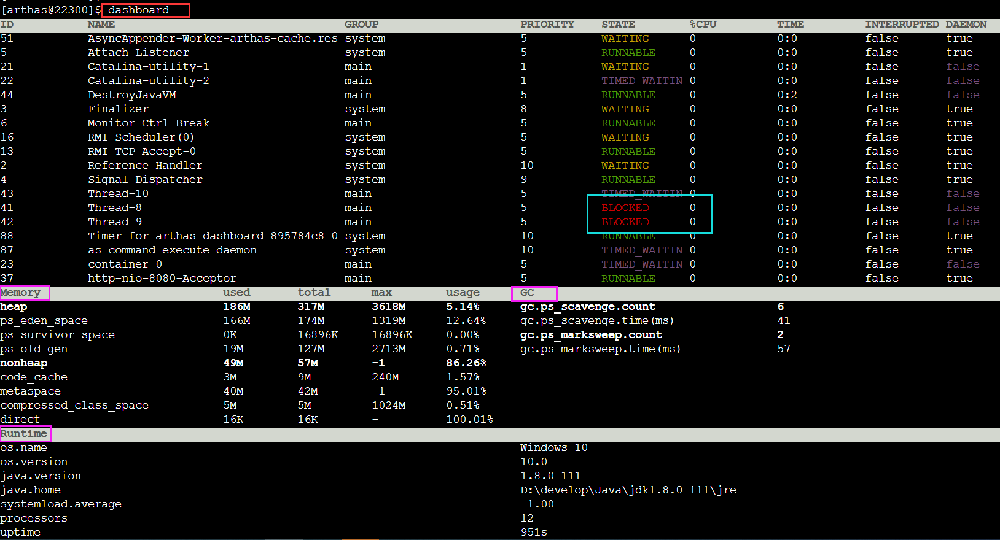  


+ 开始进行回收时，ZGC 首先会进行一个短暂的 STW，来进行 roots 标记。这个步骤非常短，因为 roots 的总数通常比较小。
+ 然后就开始进行并发标记，如上图所示，通过对对象指针进行着色来进行标记，结合读屏障解决单个对象的并发问题。其实，这个阶段在最后还是会有一个非常短的 STW 停顿，用来处理一些边缘情况，这个阶段绝大部分时间是并发进行的，所以没有明显标出这个停顿。
+ 下一个是清理阶段，这个阶段会把标记为不在使用的对象进行回收，如上图所示，把橘色的不在使用的对象进行了回收。
+ 最后一个阶段是重定位，重定位就是对 GC 后存活的对象进行移动，来释放大块的内存空间，解决碎片问题。
+ 重定位最开始会有一个短暂的 STW，用来重定位集合中的 root 对象。暂停时间取决于 root 的数量、重定位集与对象的总活动集的比率。最后是并发重定位，这个过程也是通过读屏障，与应用线程并发进行的。

### Minor GC和Major GC

​			所谓自动内存管理，最终要解决的也就是内存分配和内存回收两个问题。前面我们介绍了内存回收，这里我们再来聊聊内存分配。

​			对象的内存分配通常是在 Java 堆上分配（随着虚拟机优化技术的诞生，某些场景下也会在栈上分配，后面会详细介绍），对象主要分配在新生代的 Eden 区，如果启动了本地线程缓冲，将按照线程优先在 TLAB 上分配。少数情况下也会直接在老年代上分配。总的来说分配规则不是百分百固定的，其细节取决于哪一种垃圾收集器组合以及虚拟机相关参数有关，但是虚拟机对于内存的分配还是会遵循以下几种「普世」规则：

#### 对象优先在 Eden 区分配

​			多数情况，对象都在新生代 Eden 区分配。当 Eden 区分配没有足够的空间进行分配时，虚拟机将会发起一次 Minor GC。如果本次 GC 后还是没有足够的空间，则将启用分配担保机制在老年代中分配内存。

这里我们提到 Minor GC，如果你仔细观察过 GC 日常，通常我们还能从日志中发现 Major GC/Full GC。

- **Minor GC** 是指发生在新生代的 GC，因为 Java 对象大多都是朝生夕死，所有 Minor GC 非常频繁，一般回收速度也非常快；
- **Major GC/Full GC** 是指发生在老年代的 GC，出现了 Major GC 通常会伴随至少一次 Minor GC。Major GC 的速度通常会比 Minor GC 慢 10 倍以上。

#### 大对象直接进入老年代

​			所谓大对象是指需要大量连续内存空间的对象，频繁出现大对象是致命的，会导致在内存还有不少空间的情况下提前触发 GC 以获取足够的连续空间来安置新对象。

​			前面我们介绍过新生代使用的是标记-清除算法来处理垃圾回收的，如果大对象直接在新生代分配就会导致 Eden 区和两个 Survivor 区之间发生大量的内存复制。因此对于大对象都会直接在老年代进行分配。

#### 长期存活对象将进入老年代

​			虚拟机采用分代收集的思想来管理内存，那么内存回收时就必须判断哪些对象应该放在新生代，哪些对象应该放在老年代。因此虚拟机给每个对象定义了一个对象年龄的计数器，如果对象在 Eden 区出生，并且能够被 Survivor 容纳，将被移动到 Survivor 空间中，这时设置对象年龄为 1。对象在 Survivor 区中每「熬过」一次 Minor GC 年龄就加 1，当年龄达到一定程度（默认 15） 就会被晋升到老年代。


## 执行引擎

### 概述

​		它是JVM虚拟机的核心组成部分之一，虚拟机的执行引擎室友软件自行实现的，因此可以不受物理条件的制约，能够执那些不被硬件直接支持的指令集格式

​		执行引擎充当了高级语言的翻译器，翻译成系统可以执行的指令

### 编译执行的过程

1. 执行引擎在执行的过程中究竟需要执行什么样的字节码指令完全依赖于PC寄存器
2. 每当执行玩一项指令后，Pc寄存器就会更新下一条需要被执行的指令地址
3. 当然方法在执行的过程中，执行引擎可能会通过存储在局部变量表中的对象引用准确定位到存储在Java堆区中的对象实例信息，以及通过对象头的元数据指针定位到目标对象的类型信息（也就是找到了方法区）

### 机器码、指令、汇编

机器码： 二进制表示的指令，执行速度最快

指令：特定的指令，执行不同的任务

指令集：指令的集合，不同平台有不同的指令集

汇编：使用一些助记符代替了机器指令的操作码，运行时也需要翻译成机器码

高级语言：比如C、C++

### 编译过程与汇编过程

注意：高级语言需要先翻译成汇编，然后在翻译成机器指令

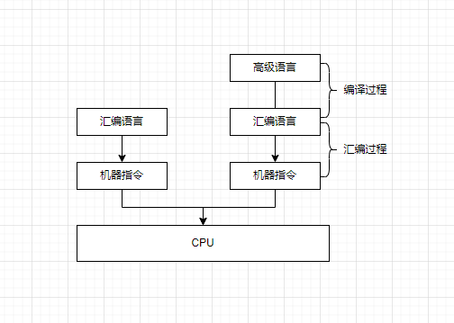

### 解释器

对于字节码采用逐行解释的方式执行，将每条字节码文件中的内容“翻译为”对应平台的本地机器指令执行

### JIT即时编译器，Java为什么解释与编译并行？

1. 将源代码直接编译成和本地机器平台相关的机器语言，
2. 当虚拟机启动的时候，解释器可以先发挥作用，而且不必等到即时编译器全部编译完成再工作，这样子可以省去许多不必要的编译事件，并且随着时间的推移，即时编译器逐渐开始发挥作用，根据热点探测功能，将有价值的字节码编译为本地机器指令，以此换取更高的程序执行效率

### 热点代码探测

1. **前端编译器：** java 转变为class文件的过程（Sun 的Javac）
2. **后端运行编译器：** 将字节码转变为机器码（HotSpot JIT 编译器）
3. **静态提前编译器**：直接将java代码转变为机器码（GUN 的 GCJ编译器）
   1. 优点：运行预热
   2. 缺点：必须为不同的硬件、os编译发行对应的包，目前仅支持Linux x64 java base 

一个多次被调用的方法，就被成为热点代码，一个方法究竟要被调用多少次才算是热点代码，这个主要依靠的是热点探测功能，目前**HotSpot使用的是基于计数器的热点探测**。一种叫做方法调用计数器，另一种叫做回边计数器，如果超过设定的阈值，那么就会提交该方法的代码编译请求。

1. 方法计数器：统计方法调用的次数
2. 回边计数器：统计循环体执行的循环次数


### HotSpot 可以设置程序执行的模式

+ -Xint 完全采用解释器
+ -Xcomp 完全采用即时编译器
+ -Xmixed 采用解释器+即时编译器的混合模式

### JIT 分类

1. Client 模式：（C1）对字节码进行简单和可靠的优化
2. Server模式：（C2）耗时较长，进行激进的优化，但是优化后的代码执行效率更高


## 虚拟机类加载机制

### 简述java类加载机制?

虚拟机把描述类的数据从Class文件加载到内存，并对数据进行校验，解析和初始化，最终形成可以被虚拟机直接使用的java类型。

### 描述一下JVM加载Class文件的原理机制

​		Java中的所有类，都需要由类加载器装载到JVM中才能运行。类加载器本身也是一个类，而它的工作就是把class文件从硬盘读取到内存中。在写程序的时候，我们几乎不需要关心类的加载，因为这些都是隐式装载的，除非我们有特殊的用法，像是反射，就需要显式的加载所需要的类。

类装载方式，有两种 ：

1. 隐式装载， 程序在运行过程中当碰到通过new 等方式生成对象时，隐式调用类装载器加载对应的类到jvm中，

2. 显式装载， 通过class.forname()等方法，显式加载需要的类

Java类的加载是动态的，它并不会一次性将所有类全部加载后再运行，而是保证程序运行的基础类(像是基类)完全加载到jvm中，至于其他类，则在需要的时候才加载。这当然就是为了节省内存开销。


### 什么是类加载器，类加载器有哪些?

实现通过类的权限定名获取该类的二进制字节流的代码块叫做类加载器。

主要有一下四种类加载器:

1. 启动类加载器(Bootstrap ClassLoader)用来加载java核心类库，无法被java程序直接引用。
2. 扩展类加载器(extensions class loader):它用来加载 Java 的扩展库。Java 虚拟机的实现会提供一个扩展库目录。该类加载器在此目录里面查找并加载 Java 类。
3. 系统类加载器（system class loader）：它根据 Java 应用的类路径（CLASSPATH）来加载 Java 类。一般来说，Java 应用的类都是由它来完成加载的。可以通过 ClassLoader.getSystemClassLoader()来获取它。
4. 用户自定义类加载器，通过继承 java.lang.ClassLoader类的方式实现。


### 说一下类装载的执行过程？

类装载分为以下 5 个步骤：

- 加载：根据查找路径找到相应的 class 文件然后导入；
  - 可以从各种地方加载文件：本地、网络、zip文件中、其他文件生成、加密的文件，
- 验证：检查加载的 class 文件的正确性；
  - 四种验证：文件格式验证、元数据验证、字节码验证、符号引用验证
- 准备：虚拟机内部使用的静态存储器和任何数据结构，给类中的静态变量分配内存空间，如果这个过程发生错误，也会抛出异常
- 解析：虚拟机将常量池中的符号引用替换成直接引用的过程。符号引用就理解为一个标示，而在直接引用直接指向内存中的地址；
- 初始化：对静态变量和静态代码块执行初始化工作。


### 类的卸载

当任何一个类的示例可以到达这个类的时候，这个类是不能够被卸载的


### 虚拟机的退出

当两件事情之一发生时，Java虚拟机停止全部动作并退出

1. 所有的非守护线程已经终止
2. 某个线程调用了类似 exit 的方法，并且退出操作得到了安全管理员的许可qz]al 


### 什么是双亲委派模型？

在介绍双亲委派模型之前先说下类加载器。对于任意一个类，都需要由加载它的类加载器和这个类本身一同确立在 JVM 中的唯一性，每一个类加载器，都有一个独立的类名称空间。类加载器就是根据指定全限定名称将 class 文件加载到 JVM 内存，然后再转化为 class 对象。

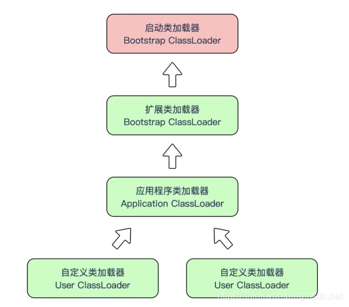

类加载器分类：

- 启动类加载器（Bootstrap ClassLoader），是虚拟机自身的一部分，用来加载Java_HOME/lib/目录中的，或者被 -Xbootclasspath 参数所指定的路径中并且被虚拟机识别的类库；
- 其他类加载器：
- 扩展类加载器（Extension ClassLoader）：负责加载\lib\ext目录或Java. ext. dirs系统变量指定的路径中的所有类库；
- 应用程序类加载器（Application ClassLoader）。负责加载用户类路径（classpath）上的指定类库，我们可以直接使用这个类加载器。一般情况，如果我们没有自定义类加载器默认就是用这个加载器。

双亲委派模型：如果一个类加载器收到了类加载的请求，它首先不会自己去加载这个类，而是把这个请求委派给父类加载器去完成，每一层的类加载器都是如此，这样所有的加载请求都会被传送到顶层的启动类加载器中，只有当父加载无法完成加载请求（它的搜索范围中没找到所需的类）时，子加载器才会尝试去加载类。

当一个类收到了类加载请求时，不会自己先去加载这个类，而是将其委派给父类，由父类去加载，如果此时父类不能加载，反馈给子类，由子类去完成类的加载。

### 双亲委派模型的好处

- 沙箱安全机制：自己写的java.lang.String.class类不会被加载，这样便可以防止核心 API库被随意篡改
- 避免类的重复加载：当父亲已经加载了该类时，就没有必要子ClassLoader再加载一次，保证被加载类的唯一性


### 自定义类加载器

#### 概念

1. 加密：.class文件可以轻易的被[反编译](https://www.baidu.com/s?wd=反编译&tn=44039180_cpr&fenlei=mv6quAkxTZn0IZRqIHcvrjTdrH00T1d9rj6Yuhn3n1b3uWwBn1wb0ZwV5Hcvrjm3rH6sPfKWUMw85HfYnjn4nH6sgvPsT6KdThsqpZwYTjCEQLGCpyw9Uz4Bmy-bIi4WUvYETgN-TLwGUv3EP1R1rjD3njnzPWc1n1RdPW6Y)，如果你需要把自己的代码进行加密以防止反编译，可以先将编译后的代码用某种加密算法加密，类加密后就不能再用Java的ClassLoader去加载类了，这时就需要自定义ClassLoader在加载类的时候先解密类，然后再加载
2. 从非标准的来源加载代码：如果你的.class文件是放在数据库、甚至是在云端，就可以自定义类加载器，从指定的来源加载类。

#### 实现方法

1. 如果你看系统进行类加载的源码,调用loadClass时会先根据双亲委派模型在父加载器中加载，如果加载失败，则会调用当前加载器的findClass来完成加载。
2. 因此我们自定义的类加载器只需要继承ClassLoader，并覆盖findClass方法
3. 其中defineClass方法可以把二进制流字节组成的文件转换为一个java.lang.Class（只要二进制字节流的内容符合Class文件规范）。
4. 例如:我们用自定义的类加载器去加载加密后的class文件

~~~
DES，即Data Encryption Standard的缩写,即数据加密算法。 
3DES也叫 Triple DES,它是DES加密算法的一种模式，
使用3条56位的密钥对数据进行三次加密。简单来说，由于计算机的运算能力的增强，
原版DES密码的密钥容易被暴力破解，3DES即是用来提供一种相对简单的方法，
通过增加DES的密钥长度来避免类似的破解。
~~~


### Tomcat热部署实现原理

​		热部署跟热加载的本质区别是，热部署会重新部署 Web 应用，原来的 Context 对象会整个被销毁掉，因此这个 Context 所关联的一切资源都会被销毁，包括 Session。Host 容器并没有在 backgroundProcess 方法中实现周期性检测的任务，而是通过监听器 HostConfig 来实现的

~~~java
// HostConfig#lifecycleEvent
// 周期性任务
if (event.getType().equals(Lifecycle.PERIODIC_EVENT)) {
    check();
}
protected void check() {
    if (host.getAutoDeploy()) {
        // Check for resources modification to trigger redeployment
        DeployedApplication[] apps = deployed.values().toArray(new DeployedApplication[0]);
        for (DeployedApplication app : apps) {
            if (tryAddServiced(app.name)) {
                try {
                    // 检查 Web 应用目录是否有变化
                    checkResources(app, false);
                } finally {
                    removeServiced(app.name);
                }
            }
        }
        // Check for old versions of applications that can now be undeployed
        if (host.getUndeployOldVersions()) {
            checkUndeploy();
        }

        // Hotdeploy applications
        //热部署
        deployApps();
    }
}
~~~

HostConfig 会检查 webapps 目录下的所有 Web 应用：

+ 如果原来 Web 应用目录被删掉了，就把相应 Context 容器整个销毁掉。
+ 是否有新的 Web 应用目录放进来了，或者有新的 WAR 包放进来了，就部署相应的 Web 应用。

因此 HostConfig 做的事情都是比较“宏观”的，它不会去检查具体类文件或者资源文件是否有变化，而是检查 Web 应用目录级别的变化。


## Debug实现原理

### JPDA

官方文档里这样介绍：

> The Java Platform Debugger Architecture (JPDA) consists of three interfaces designed for use by debuggers in development environments for desktop systems.

我们看到，JPDA由三部分组成：

- JVMTI(Java Virtual Machine Tool Interface)
- JDWP(Java Debugger Wire Protocol)
- JDI(Java Debug Interface)

熟悉`JVM`的朋友可能听说过JVMPI和JVMDI，在JDK1.5他们统一被替换为JVMTI。


### JVMTI

以前的文章里我们提到过Class的**hotSwap**，就是通过**Instrument**实现class的`redefine`和`retransform`。而本质上JVMTI是一个programming interface，主要用在开发和监控上。而且它提供了接口去观察(inspect) 应用状态和控制应用的执行。工具通过它提供的接口，可以进行如下功能的实现：

- profiling
- debuging
- monitoring
- thread analysis
- coverage analysis

可以看到，我们使用到的debug，只是JVMTI提供的众从能力中的一种。


### JDWP

观察过Java debug进程的同学也许有印象，以debug方式启动的JVM进程，看起来是这样的：

> -agentlib:jdwp=transport=dt_socket,address=127.0.0.1:63971,server=y,suspend=n

除了进程名之外，还在启动参数里包含`agentlib:jdwp`这些。这个就是现在要介绍的JDWP。什么是JDWP?

+ Java Debug Wire Protocol，是debugger和它要debug的JVM之间进行通讯的协议。
+ 注意，这仅仅是一个协议的格式，具体的传输实现不是由JDWP来实现的。
+ 我们的debugger执行的操作发送到JDWP的实现上，然后再转给JVMTI来具体控制。


### JDI

​		JDI是三个模块中最高层的一个接口，通过JDI，debugger可以更方便的编写符合JDWP格式的数据，用来进行调试数据传输。JDI的引入，提高了开发debugger的效率。所以，从整体上看，我们可以把JPDA看作一个两个互相通讯的程序，所以我们可以在任意地点很方便的调试另一个JVM上运行的程序。我们每次在IDE里进行代码调试时，实质上是通过IDE里的debugger这个界面执行GUI操作，然后通过JDI发送数据到JDWP，再经过JVMTI最终实现程序的高度。每次我们打开IDE调试一个Java应用的时候，或者远程attach一个Java进程的时候，别忘了这个IDE背后的身影---JPDA。

## 性能优化

### 性能优化的步骤

1. 发现问题
2. 问题排查
3. 解决问题

### 性能评价指标

1. 停顿时间
2. 吞吐量
3. 并发数
4. 内纯占用
5. 相互之间的关系

## JVM 问题排查工具

jps -> 查看正在使用的Java程序

jinfo-> 查看、修改java程序配置的参数

Jmap -> JVM 各个区域的内存使用情况，可以导出为dump文件

jstack -> 打印线程的快照

jstat -> 查看JVM 的统计信息，在没有GUI图形页面时，他是运行期间定位虚拟机问题的首选工具

jhat -> JDK 自带的堆分析文件，目前已经被jvisiual取代了

jstatd -> 远程主机信息收集

jcmd -> 多功能命令，可以用来实现除了jstat之外的所有命令功能

对于已经发生OOM的情况，需要输出dump文件，然后使用Jsisiualvm分析dump文件，定位到问题点。

jvisualvn -> JVM 可视化界面

MAT-> 可视化工具

JProfiler ->

Athas ->  主要是生产中使用的开发神器

### Jps

~~~bash
jps // 正在运行的程序
-q // 只能看到进程id
-l // 显示全部的包名
-m 

~~~

### Jstat 

实际生产比较多

1. class 部分

~~~bash
# 加载类的个数、字节数
jstat -class 2604

# 指定输出统计数据的周期：距离1000ms
jstat -class 2604 1000

# 指定打印的次数，打印10次
jstat -class 2604 1000 10

# 会显示程序执行的时间
jstat -class -t 2604

# -h 每几秒打印一次表头，每隔3秒
jstat -class -t -h3 2604 1000 10
~~~

2. option 部分->垃圾回收

~~~bash
# -gc 显示 GC 的大小
jstat -gc 2604
# -gccapacity
# -gcutil
# igccause
# -gcnew
#

~~~

3. JIT 部分

~~~bash
# 显示编译的结果
jstat -compiler 2604

# 显示编译的方法
jstat -printcompilation 2604
~~~

### jinfo

通常，不知道java 程序的JVm参数，这个时候，就可以使用jinfo，同样也可以修改jvm参数，立即生效

## JVM调优

### 说一下 JVM 调优的工具？

JDK 自带了很多监控工具，都位于 JDK 的 bin 目录下，其中最常用的是 jconsole 和 jvisualvm 这两款视图监控工具。

- jconsole：用于对 JVM 中的内存、线程和类等进行监控；
- jvisualvm：JDK 自带的全能分析工具，可以分析：内存快照、线程快照、程序死锁、监控内存的变化、gc 变化等。
- arthas：阿里的JVM调优软件
- Jprofiler
- Java Filght Recorder


### 常用的 JVM 调优的参数都有哪些？

- -Xms2g：初始化推大小为 2g；
- -Xmx2g：堆最大内存为 2g
- -XX:NewSize 年轻代大小
- -XX:MaxNewSize 年轻代最大值；
- -XX:PermSize 永生代初始值
- -XX:MaxPermSize 永生代最大值
- -XX:NewRatio=4：设置年轻的和老年代的内存比例为 1:4；
- -XX:SurvivorRatio=8：设置新生代 Eden 和 Survivor 比例为 8:2；
- –XX:+UseParNewGC：指定使用 ParNew + Serial Old 垃圾回收器组合；
- -XX:+UseG1
- -XX:+UseParallelOldGC：指定使用 ParNew + ParNew Old 垃圾回收器组合；
- -XX:+UseConcMarkSweepGC：指定使用 CMS + Serial Old 垃圾回收器组合；
- -XX:+PrintGC：开启打印 gc 信息；
- -XX:+PrintGCDetails：打印 gc 详细信息。

### JVM调优原理

1. 在JVM启动参数中，可以设置跟内存、垃圾回收相关的一些参数设置，默认情况不做任何设置JVM会工作的很好，但对一些配置很好的Server和具体的应用必须仔细调优才能获得最佳性能。通过设置我们希望达到一些目标：
   + **GC的时间足够的小** 
   + **GC的次数足够的少**
   + **发生Full GC的周期足够的长** 

2. 前两个目前是相悖的，要想GC时间小必须要一个更小的堆，要保证GC次数足够少，必须保证一个更大的堆，我们只能取其平衡。

3. 针对JVM堆的设置一般，可以通过-Xms -Xmx限定其最小、最大值，为了防止垃圾收集器在最小、最大之间收缩堆而产生额外的时间，**我们通常把最大、最小设置为相同的值** ，最好预留20%，保证空间的安全性

   - -Xms2g：初始化推大小为 2g；

   - -Xmx2g：堆最大内存为 2g；

4. 年轻代和年老代将根据默认的比例（1：2）分配堆内存，可以通过调整二者之间的比率NewRadio来调整二者之间的大小，也可以针对回收代，比如年轻代，通过 -XX:newSize -XX:MaxNewSize来设置其绝对大小。同样，为了防止年轻代的堆收缩，我们通常会把-XX:newSize -XX:MaxNewSize设置为同样大小

5. 年轻代和年老代设置多大才算合理？这个我问题毫无疑问是没有答案的，否则也就不会有调优。我们观察一下二者大小变化有哪些影响

6. 更大的年轻代必然导致更小的年老代，大的年轻代会延长普通GC的周期，但会增加每次GC的时间；小的年老代会导致更频繁的Full GC；更小的年轻代必然导致更大年老代，小的年轻代会导致普通GC很频繁，但每次的GC时间会更短；大的年老代会减少Full GC的频率 

7. 如何选择应该依赖应用程序对象生命周期的分布情况：如果应用存在大量的临时对象，应该选择更大的年轻代；如果存在相对较多的持久对象，年老代应该适当增大。但很多应用都没有这样明显的特性，在抉择时应该根据以下两点：

   1. 本着Full GC尽量少的原则，让年老代尽量缓存常用对象，JVM的默认比例1：2也是这个道理 
   2. 通过观察应用一段时间，看其他在峰值时年老代会占多少内存，在不影响Full GC的前提下，根据实际情况加大年轻代，比如可以把比例控制在1：1。但应该给年老代至少预留1/3的增长空间 

8. 在配置较好的机器上（比如多核、大内存），**可以为年老代选择并行收集算法： -XX:+UseParallelOldGC ，默认为Serial收集**

9. 线程堆栈的设置：**每个线程默认会开启1M的堆栈**，用于存放栈帧、调用参数、局部变量等，对大多数应用而言这个默认值太了，一般256K就足用。理论上，在内存不变的情况下，减少每个线程的堆栈，可以产生更多的线程，但这实际上还受限于操作系统。

10. 可以通过下面的参数打Heap Dump信息 

    + -XX:HeapDumpPath 
    + -XX:+PrintGCDetails 
    + -XX:+PrintGCTimeStamps 
    + -Xloggc:/usr/aaa/dump/heap_trace.txt 
    + 通过下面参数可以控制OutOfMemoryError时打印堆的信息 
      -XX:+HeapDumpOnOutOfMemoryError


#  系统问题

## 引导

个人觉得应该很少有面试官会上来就问JVM调优怎么调，毕竟这显得有点奇怪。大概率会这样问

+ 如果你的系统CPU/内存占用100%了你怎么办？
+ 如果你的系统忽然不能响应了你怎么排查？
+ 如果你的系统压测数据上不去你除了加负载还有没有其他的好办法？

这类问题你要回答的满意，肯定会涉及到怎么使用jmap, jstat，JConsole…balabala这些工具来排查和定位问题。那么接下来的问题就引出了两个，

+ 请说说你上诉说的这些工具的使用方式
+ 比如你定位出了老年代内存一直回收不掉，你应该怎么处理呢？

接下来才会引出JVM调优的问题

+ 你还知道JVM有其他的什么可以调优的参数选项吗？

## 常见系统问题

1. 调整堆大小提高服务的吞吐量
2. 调整垃圾回收器服务提高服务的吞吐量
3. JVM优化值JIT优化
4. G1并发执行线程数对性能的影响
5. 合理配置堆内存
6. 新生代和老生代的比例
7. CPU占用很高问题的排除方案
8. 日均百万级订单交易系统如何设计JVM参数


## 调优实战

### 根据程序的运行状况查看其活跃的数据量

活跃的数据：

1. 应用程序运行于稳定状态时，老年代占用的java堆大小

2. 应用程序运行于稳定状态时，永久代占用的java堆大小

其实就是FullGc后这2个数据的大小

动手测试：

1. 测试代码：

```java
public class A {    
    int[] storage = new int[102400];    
    int[] extra = new int[200000];    
    public int[] execute() {        
        try {           
            Thread.sleep(10);        
        } catch (InterruptedException e) {           
            e.printStackTrace();        
        }        
        return storage;    
    }
}

import java.util.LinkedList;
import java.util.Queue;

public class Test {    
    public static void main(String[] args) {        
        Queue<int[]> queue = new LinkedList<int[]>();        
        while (true) {            
            int[] tmp=new A().execute();            
            if (queue.size() > 1000) {                
                queue.poll();            
            } else {                
                queue.offer(tmp);           
            }        
        }    
    }
}
```

2. 参数配置：

~~~
java -XX:+PrintCommandLineFlags -version   // 查看一下-xx的指令信息java 
-XX:+PrintFlagsInitinal  // 查看所有不稳定指定的默认值java 
-XX:+PrintFlagsFinal
-Xloggc:E:/test/log -XX:+PrintGCDetails
~~~


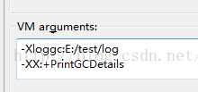

3. 测试的结果

4. 结果分析

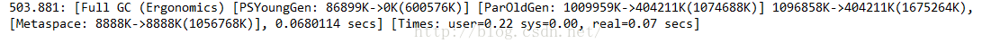

可以看到老年代的大小为404211K，持久代的大小为8888K


###  通过活跃的数据配置堆以及其他参数


通用法则：

将java堆的初始值-Xms和最大值-Xmx设置为老年代活跃数据大小的3~4倍

所以此处就设置 -Xms1600m，-Xmx1600m

在以上的测试结果中可以看到原始的堆大小为1675m左右，是比较接近的。


补充法则：

新生代空间应该为老年代空间活跃数据的1~1.5倍

此处老年代为400m，新生代就为600m


如果java堆的初始值及最大值为活跃数据的3~4倍，新生代为活跃数据的1~1.5倍时，老年代应设置为活跃数据大小的2~3倍

**参考表**

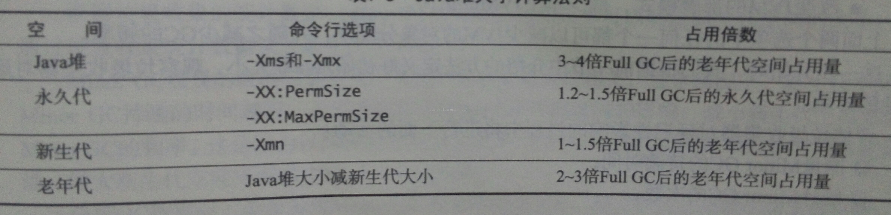


### 日志分析

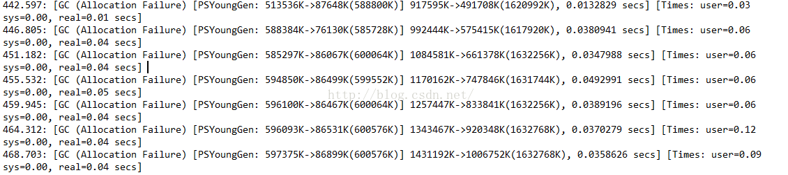

**分析：**

1. 看频率，可以发现基本上是4秒进行一次Gc

2. 看耗时，可以发现基本上是需要0.037秒

当前的虚拟机设置为：

+ 堆：1600M
+ 年轻代：600M
+ 年老代：1000M

**优化**

1. 需求：
   + 要求MinorGc的响应时间小于0.02秒
   + 分析：
     + 需要减少MinorGc的时间，那一定是因为年轻代的容量太大了，以至于一次清理耗时较久。
     + 所以需要较少年轻代的大小，虽然这样会增加MinorGc的频率。
     + 因为目前耗时是0.037，几乎是2倍于目标，所以将年轻代的大小减少为1/2，保持年老带不变。
     + -Xms1300m -Xmx1300m -Xmn300
2. 需求2：
   + 要求MinorGc的响应时间小于0.1秒
   + 分析
     + 既然对响应要求不是那么严格，就可以增大年轻代的空间，减少minorGc的频率。
     + 现在是0.037，目标是0.1。假定是正比，那么可以把年轻代的大小提2.5倍(+900m)。
     + -Xms2500,m -Xmx2500m -Xmn1500m

**准则**

1. 老年代空间大小不应该小于活跃数据大小的1.5倍

2. 新生代空间至少应为Java堆的10%,，通过-Xmx和-Xms可以设定该值。

3. 增大Java堆大小时，需要注意不要超过JVM可用的物理内存数。

​        这个阶段中，如果只考虑minorGc引起的延迟，而调整新生代的大小又无法满足应用程序的平均停顿时间或延迟性要求，就只能修改应用程序或者改变JVM的部署模式，在多个JVM上部署应用程序，或者修改应用程序的平均延迟性要求。

### 计算老年代

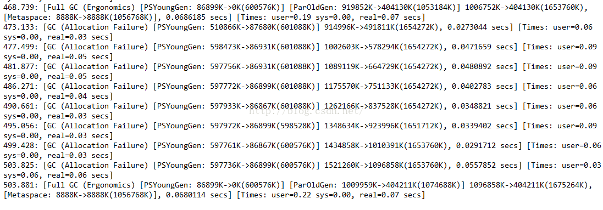

日志图：

1.假如没有FullGc，如何计算老年代需要多少时间装满？

（不看第一条和最后一条数据，分析）通过MinorGc计算每次老年代的增量

老年代的增量 = 堆的总量 - 新生代的剩余量（souvivor区）

这样可以得到几乎每次minorGc老年代增加85m空间，而minorGc每4秒一次。


老年代的总量：

1654272 - 601088 = 1053184k =1028m

那么填满老年区需要

1028 / 85 * 4 = 48s 


# 实战

## 每天100w次登陆请求, 如何设置JVM参数？

### 1. 新系统上线如何规划容量

#### 概述

任何新的业务系统在上线以前都需要去估算服务器配置和JVM的内存参数，这个容量与资源规划并不仅仅是系统架构师的随意估算的，需要根据系统所在业务场景去估算，推断出来一个系统运行模型，评估JVM性能和GC频率等等指标。以下是我结合大牛经验以及自身实践来总结出来的一个建模步骤：

- 计算业务系统每秒钟创建的对象会佔用多大的内存空间，然后计算集群下的每个系统每秒的内存佔用空间（对象创建速度）
- 设置一个机器配置，估算新生代的空间，比较不同新生代大小之下，多久触发一次MinorGC。
- 为了避免频繁GC，就可以重新估算需要多少机器配置，部署多少台机器，给JVM多大内存空间，新生代多大空间。
- 根据这套配置，基本可以推算出整个系统的运行模型，每秒创建多少对象，1s以后成为垃圾，系统运行多久新生代会触发一次GC，频率多高。

#### 以登录系统为例

以登录系统为例模拟一下推演过程：

- 假设每天100w次登陆请求，登陆峰值在早上，预估峰值时期每秒100次登陆请求。
- 假设部署3台服务器，每台机器每秒处理30次登陆请求，假设一个登陆请求需要处理1秒钟，JVM新生代里每秒就要生成30个登陆对象，1s之后请求完毕这些对象成为了垃圾。
- 一个登陆请求对象假设20个字段，一个对象估算500字节，30个登陆佔用大约15kb，考虑到RPC和DB操作，网络通信、写库、写缓存一顿操作下来，可以扩大到20-50倍，大约1s产生几百k-1M数据。
- 假设2C4G机器部署，分配2G堆内存，新生代则只有几百M，按照1s1M的垃圾产生速度，几百秒就会触发一次MinorGC了。
- 假设4C8G机器部署，分配4G堆内存，新生代分配2G，如此需要几个小时才会触发一次MinorGC。

所以，可以粗略的推断出来一个每天100w次请求的登录系统，按照4C8G的3实例集群配置，分配4G堆内存、2G新生代的JVM，可以保障系统的一个正常负载。

基本上把一个新系统的资源评估了出来，所以搭建新系统要每个实例需要多少容量多少配置，集群配置多少个实例等等这些，并不是拍拍脑袋和胸脯就可以决定的下来的。

### 2. 如何进行垃圾回收器的选择？

#### 吞吐量还是响应时间

首先引入两个概念：吞吐量和低延迟

吞吐量 = CPU在用户应用程序运行的时间 / （CPU在用户应用程序运行的时间 + CPU垃圾回收的时间）

响应时间 = 平均每次的GC的耗时

通常，吞吐优先还是响应优先这个在JVM中是一个两难之选。

堆内存增大，gc一次能处理的数量变大，吞吐量大；但是gc一次的时间会变长，导致后面排队的线程等待时间变长；相反，如果堆内存小，gc一次时间短，排队等待的线程等待时间变短，延迟减少，但一次请求的数量变小（并不绝对符合）。

无法同时兼顾，是吞吐优先还是响应优先，这是一个需要权衡的问题。

#### 垃圾回收器设计上的考量

- JVM在GC时不允许一边垃圾回收，一边还创建新对象（就像不能一边打扫卫生，还在一边扔垃圾）。
- JVM需要一段Stop the world的暂停时间，而STW会造成系统短暂停顿不能处理任何请求；
- 新生代收集频率高，性能优先，常用复制算法；老年代频次低，空间敏感，避免复制方式。
- 所有垃圾回收器的涉及目标都是要让GC频率更少，时间更短，减少GC对系统影响！

#### CMS和G1

- 延迟敏感的推荐CMS；
- 大内存服务，要求高吞吐的，采用G1回收器！

### 3. 如何对各个分区的比例、大小进行规划

首先，JVM最重要最核心的参数是去评估内存和分配，第一步需要指定堆内存的大小，这个是系统上线必须要做的，-Xms 初始堆大小，-Xmx 最大堆大小，后台Java服务中一般都指定为系统内存的一半，过大会佔用服务器的系统资源，过小则无法发挥JVM的最佳性能。

其次，需要指定-Xmn新生代的大小，这个参数非常关键，灵活度很大，虽然sun官方推荐为3/8大小，但是要根据业务场景来定，针对于无状态或者轻状态服务（现在最常见的业务系统如Web应用）来说，一般新生代甚至可以给到堆内存的3/4大小；而对于有状态服务（常见如IM服务、网关接入层等系统）新生代可以按照默认比例1/3来设置。服务有状态，则意味著会有更多的本地缓存和会话状态信息常驻内存，应为要给老年代设置更大的空间来存放这些对象。

最后，是设置-Xss栈内存大小，设置单个线程栈大小，默认值和JDK版本、系统有关，一般默认512~1024kb。一个后台服务如果常驻线程有几百个，那麽栈内存这边也会佔用了几百M的大小。

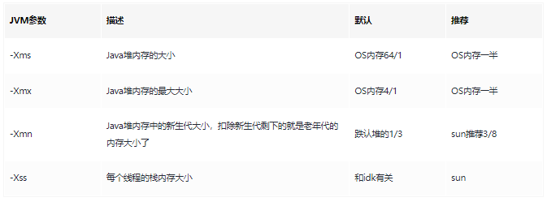

### 4. 栈内存大小多少比较合适

-Xss栈内存大小，设置单个线程栈大小，默认值和JDK版本、系统有关，一般默认512~1024kb。一个后台服务如果常驻线程有几百个，那麽栈内存这边也会佔用了几百M的大小。

### 5. 对象年龄应该为多少才移动到老年代比较合适？

假设一次minor gc要间隔二三十秒，并且，大多数对象一般在几秒内就会变为垃圾，

如果对象这么长时间都没被回收，比如2分钟没有回收，可以认为这些对象是会存活的比较长的对象，从而移动到老年代，而不是继续一直占用survivor区空间。

所以，可以将默认的15岁改小一点，比如改为5，

那么意味着对象要经过5次minor gc才会进入老年代，整个时间也有一两分钟了（5*30s= 150s），和几秒的时间相比，对象已经存活了足够长时间了。

所以：可以适当调整JVM参数如下：

~~~bash
‐Xms3072M 
‐Xmx3072M 
‐Xmn2048M 
‐Xss1M 
‐XX:MetaspaceSize=256M 
‐XX:MaxMetaspaceSize=256M 
‐XX:SurvivorRatio=8 
‐XX:MaxTenuringThreshold=5

~~~

### 6. 多大的对象，可以直接到老年代比较合适？

对于多大的对象直接进入老年代(参数-XX:PretenureSizeThreshold)，一般可以结合自己系统看下有没有什么大对象 生成，预估下大对象的大小，一般来说设置为1M就差不多了，很少有超过1M的大对象，

所以：可以适当调整JVM参数如下：

~~~bash
‐Xms3072M 
‐Xmx3072M 
‐Xmn2048M 
‐Xss1M 
‐XX:MetaspaceSize=256M 
‐XX:MaxMetaspaceSize=256M 
‐XX:SurvivorRatio=8 
‐XX:MaxTenuringThreshold=5
‐XX:PretenureSizeThreshold=1M
~~~

### 7. 垃圾回收器CMS老年代的参数优化

JDK8默认的垃圾回收器是-XX:+UseParallelGC(年轻代)和-XX:+UseParallelOldGC(老年代)，如果内存较大(超过4个G，只是经验 值)，还是建议使用G1.这里是4G以内，又是主打“低延时” 的业务系统，可以使用下面的组合：

~~~bash
ParNew+CMS(-XX:+UseParNewGC -XX:+UseConcMarkSweepGC)
~~~

如下是响应优先的参数调优：

~~~bash
XX:CMSInitiatingOccupancyFraction=70
~~~

设定CMS在对内存占用率达到70%的时候开始GC(因为CMS会有浮动垃圾,所以一般都较早启动GC)

~~~bash
XX:+UseCMSInitiatinpOccupancyOnly
~~~

和上面搭配使用，否则只生效一次

~~~bash
-XX:+AlwaysPreTouch
~~~

强制操作系统把内存真正分配给IVM，而不是用时才分配。

综上，只要年轻代参数设置合理，老年代CMS的参数设置基本都可以用默认值，如下所示：

~~~bash
‐Xms3072M 
‐Xmx3072M 
‐Xmn2048M 
‐Xss1M 
‐XX:MetaspaceSize=256M 
‐XX:MaxMetaspaceSize=256M 
‐XX:SurvivorRatio=8  
‐XX:MaxTenuringThreshold=5 
‐XX:PretenureSizeThreshold=1M 
‐XX:+UseParNewGC 
‐XX:+UseConcMarkSweepGC 
‐XX:CMSInitiatingOccupancyFraction=70 ‐XX:+UseCMSInitiatingOccupancyOnly 
‐XX:+AlwaysPreTouch

~~~

**参数解释**

1.`‐Xms3072M ‐Xmx3072M` 最小最大堆设置为3g，最大最小设置为一致防止内存抖动

2.`‐Xss1M` 线程栈1m

3.`‐Xmn2048M ‐XX:SurvivorRatio=8` 年轻代大小2g，eden与survivor的比例为8:1:1，也就是1.6g:0.2g:0.2g

4.`-XX:MaxTenuringThreshold=5` 年龄为5进入老年代 5.‐`XX:PretenureSizeThreshold=1M` 大于1m的大对象直接在老年代生成

6.`‐XX:+UseParNewGC ‐XX:+UseConcMarkSweepGC` 使用ParNew+cms垃圾回收器组合

7.`‐XX:CMSInitiatingOccupancyFraction=70` 老年代中对象达到这个比例后触发fullgc

8.`‐XX:+UseCMSInitiatinpOccupancyOnly`  老年代中对象达到这个比例后触发fullgc，每次

9.`‐XX:+AlwaysPreTouch` 强制操作系统把内存真正分配给IVM，而不是用时才分配。

### 8. 配置OOM时候的内存dump文件和GC日志

额外增加了GC日志打印、OOM自动dump等配置内容，帮助进行问题排查

```shell
-XX:+HeapDumpOnOutOfMemoryError
```

在Out Of Memory，JVM快死掉的时候，输出Heap Dump到指定文件。

不然开发很多时候还真不知道怎么重现错误。

路径只指向目录，JVM会保持文件名的唯一性，叫java_pid${pid}.hprof。

```shell
-XX:+HeapDumpOnOutOfMemoryError 
-XX:HeapDumpPath=${LOGDIR}/
```

因为如果指向特定的文件，而文件已存在，反而不能写入。

输出4G的HeapDump，会导致IO性能问题，在普通硬盘上，会造成20秒以上的硬盘IO跑满，

需要注意一下，但在容器环境下，这个也会影响同一宿主机上的其他容器。

GC的日志的输出也很重要：

```shell
-Xloggc:/dev/xxx/gc.log 
-XX:+PrintGCDateStamps 
-XX:+PrintGCDetails
```

GC的日志实际上对系统性能影响不大，打日志对排查GC问题很重要。

### 9. JVM参数模版

一般来说，大企业或者架构师团队，都会为项目的业务系统定制一份较为通用的JVM参数模板，但是许多小企业和团队可能就疏于这一块的设计，如果老板某一天突然让你负责定制一个新系统的JVM参数，你上网去搜大量的JVM调优文章或博客，结果发现都是零零散散的、不成体系的JVM参数讲解，根本下不了手，这个时候你就需要一份较为通用的JVM参数模板了，不能保证性能最佳，但是至少能让JVM这一层是稳定可控的，

**基于4C8G系统的ParNew+CMS回收器模板（响应优先），新生代大小根据业务灵活调整！**

~~~Bash
-Xms4g
-Xmx4g
-Xmn2g
-Xss1m
-XX:SurvivorRatio=8
-XX:MaxTenuringThreshold=10
-XX:+UseConcMarkSweepGC
-XX:CMSInitiatingOccupancyFraction=70
-XX:+UseCMSInitiatingOccupancyOnly
-XX:+AlwaysPreTouch
-XX:+HeapDumpOnOutOfMemoryError
-verbose:gc
-XX:+PrintGCDetails
-XX:+PrintGCDateStamps
-XX:+PrintGCTimeStamps
-Xloggc:gc.log
~~~

#### 如果是GC的吞吐优先，推荐使用G1，基于8C16G系统的G1回收器模板：

G1收集器自身已经有一套预测和调整机制了，因此我们首先的选择是相信它，

即调整-`XX:MaxGCPauseMillis=N`参数，这也符合G1的目的——让GC调优尽量简单！

同时也不要自己显式设置新生代的大小（用-Xmn或-XX:NewRatio参数），

如果人为干预新生代的大小，会导致目标时间这个参数失效。

```shell
-Xms8g
-Xmx8g
-Xss1m
-XX:+UseG1GC
-XX:MaxGCPauseMillis=150
-XX:InitiatingHeapOccupancyPercent=40
-XX:+HeapDumpOnOutOfMemoryError
-verbose:gc
-XX:+PrintGCDetails
-XX:+PrintGCDateStamps
-XX:+PrintGCTimeStamps
-Xloggc:gc.log
```

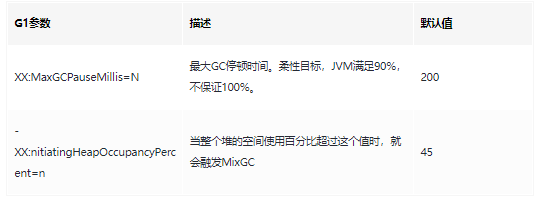

针对`-XX:MaxGCPauseMillis`来说，参数的设置带有明显的倾向性：调低↓：延迟更低，但MinorGC频繁，MixGC回收老年代区减少，增大Full GC的风险。调高↑：单次回收更多的对象，但系统整体响应时间也会被拉长。

针对`InitiatingHeapOccupancyPercent`来说，调参大小的效果也不一样：调低↓：更早触发MixGC，浪费cpu。调高↑：堆积过多代回收region，增大FullGC的风险。

### 10. 调优总结

系统在上线前的综合调优思路：

1、业务预估：根据预期的并发量、平均每个任务的内存需求大小，然后评估需要几台机器来承载，每台机器需要什么样的配置。

2、容量预估：根据系统的任务处理速度，然后合理分配Eden、Surivior区大小，老年代的内存大小。

3、回收器选型：响应优先的系统，建议采用ParNew+CMS回收器；吞吐优先、多核大内存(heap size≥8G)服务，建议采用G1回收器。

4、优化思路：让短命对象在MinorGC阶段就被回收（同时回收后的存活对象<Survivor区域50%，可控制保留在新生代），长命对象尽早进入老年代，不要在新生代来回复制；尽量减少Full GC的频率，避免FGC系统的影响。

5、到目前为止，总结到的调优的过程主要基于上线前的测试验证阶段，所以我们尽量在上线之前，就将机器的JVM参数设置到最优！

JVM调优只是一个手段，但并不一定所有问题都可以通过JVM进行调优解决，大多数的Java应用不需要进行JVM优化，我们可以遵循以下的一些原则：

- 上线之前，应先考虑将机器的JVM参数设置到最优；
- 减少创建对象的数量（代码层面）；
- 减少使用全局变量和大对象（代码层面）；
- 优先架构调优和代码调优，JVM优化是不得已的手段（代码、架构层面）；
- 分析GC情况优化代码比优化JVM参数更好（代码层面）；

通过以上原则，我们发现，其实最有效的优化手段是架构和代码层面的优化，而JVM优化则是最后不得已的手段，也可以说是对服务器配置的最后一次“压榨”。
