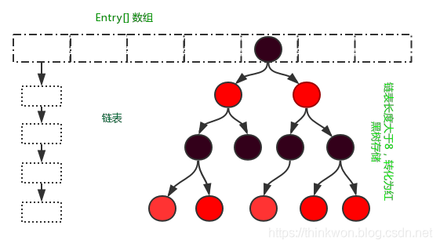

# 集合容器

## 集合容器概述

### 谈谈你对集合容器的理解？

#### 什么是集合框架？

**集合容器**：用于存储数据的容器，同时包含了一系列算法，方便我们对于数据进行操作

集合容器通过提供非常有用的数据结构和算法使你能集中注意力于你的业务程序的上面，它提高了程序开发的速度和质量。

#### 集合框架总结

`Java`集合工具包位于 `Java.util` 包下，包含了很多常用的数据结构，如数组、链表、栈、队列、集合、哈希表等。学习 Java 集合框架下大致可以分为如下五个部分：`List`列表、`Set`集合、`Map`映射、迭代器（`Iterator`、`Enumeration`）、工具类（`Arrays`、`Collections`）。

 `Java`集合类的整体框架如下：


从上图中可以看出，集合类主要分为两大类：`Collection` 和 `Map`。

1. `Collection`是 `List`、`Set` 等集合高度抽象出来的接口，它包含了这些集合的基本操作，它主要又分为两大部分： `List` 和 `Set`。
   1. `List` 接口通常表示一个列表（数组、队列、链表、栈等），其中的元素可以重复，常用实现类为`ArrayList`和`LinkedList`，另外还有不常用的Vector。另外，`LinkedList`还是实现了Queue接口，因此也可以作为队列使用。
      1. `stack` 继承`Vector`
   2. Set 接口通常表示一个集合，其中的元素不允许重复，常用实现类有`HashSet`和`TreeSet`，`HashSet`是通过`Map`中的`HashMap` 实现的，而`TreeSet`是通过`Map`中的`TreeMap`实现的。另外，`TreeSet`还实现了`SortedSet`接口，因此是有序的集合（集合中的元素要实现`Comparable`接口，并覆写`Compartor`函数才行）。
   3. 我们看到，抽象类`AbstractCollection`、`AbstractList`和`AbstractSet`分别实现了`Collection`、`List`和`Set`接口，这就是在Java集合框架中用的很多的适配器设计模式，用这些抽象类去实现接口，在抽象类中实现接口中的若干或全部方法，这样下面的一些类只需直接继承该抽象类，并实现自己需要的方法即可，而不用实现接口中的全部抽象方法。
2. Map是一个映射接口，其中的每个元素都是一个key-value 键值对，同样抽象类`AbstractMap`通过**适配器模式**实现了Map接口中的大部分函数，`TreeMap`、`HashMap`、`WeakHashMap`等实现类都通过继承`AbstractMap`来实现，另外，不常用的`HashTable`直接实现了Map接口，它和Vector都是`JDK1.0`就引入的集合类。
3. Iterator 是遍历集合的迭代器（不能遍历Map，只用来遍历Collection），Collection的实现类都实现了iterator()函数，它返回一个Iterator对象，用来遍历集合，`ListIterator`则专门用来遍历List。而 Enumeration 则是`JDK1.0`时引入的，作用与Iterator相同，但它的功能比Iterator要少，它只能再`Hashtable`、Vector和Stack中使用。
4. Arrays和Collections是用来操作数组、集合的两个工具类，例如在`ArrayList`和Vector中大量调用了`Arrays.Copyof()`方法，而Collections中有很多静态方法可以返回各集合类的synchronized版本，即线程安全的版本，当然了，如果要用线程安全的结合类，首选 Concurrent 并发包下的对应的集合类。

### 集合和数组的区别

- 长度：数组是固定长度的；集合可变长度的。
- 存储类型：数组存储的元素必须是同一个数据类型；集合存储的对象可以是不同数据类型。
- 性能：数组的性能要优于集合

### 常用的集合类有哪些？

Map接口和Collection接口是所有集合框架的父接口：

1. Collection接口的子接口包括：Set接口和List接口
2. Map接口的实现类主要有：`HashMap`、`TreeMap`、`Hashtable`、`ConcurrentHashMap`以及Properties等
3. Set接口的实现类主要有：`HashSet`、`TreeSet`、`LinkedHashSet`等
4. List接口的实现类主要有：`ArrayList`、`LinkedList`、`Stack`以及`Vector`等


### List，Set，Map三者的区别？List、Set、Map 是否继承自 Collection 接口？List、Map、Set 三个接口存取元素时，各有什么特点？



Java 容器分为 Collection 和 Map 两大类，Collection集合的子接口有Set、List、Queue三种子接口。

Collection集合主要有List和Set两大接口

- List：一个有序（元素存入集合的顺序和取出的顺序一致）容器，元素可以重复，可以插入多个null元素，元素都有索引。常用的实现类有 `ArrayList`、`LinkedList` 和 Vector。
- Set：一个无序（存入和取出顺序有可能不一致）容器，不可以存储重复元素，只允许存入一个null元素，必须保证元素唯一性。Set 接口常用实现类是 `HashSet`、`LinkedHashSet `以及 `TreeSet`。

Map是一个键值对集合，存储键、值和之间的映射。 Key无序，唯一；value 不要求有序，允许重复。Map没有继承于Collection接口，从Map集合中检索元素时，只要给出键对象，就会返回对应的值对象。

Map 的常用实现类：`HashMap`、`TreeMap`、`HashTable`、`LinkedHashMap`、`ConcurrentHashMap`

### 集合框架底层数据结构

Collection

1. List

   - `Arraylist`： `Object`数组

   - `Vector`： `Object`数组

   - `LinkedList`： 双向循环链表

2. Set

   - `HashSet`（无序，唯一）：基于 `HashMap` 实现的，底层采用 `HashMap `来保存元素

   - `LinkedHashSet`： `LinkedHashSet` 继承于 `HashSet`，并且其内部是通过 `LinkedHashMap` 来实现的。有点类似于我们之前说的`LinkedHashMap` 其内部是基于 `Hashmap` 实现一样，不过还是有一点点区别的。

   - `TreeSet`（有序，唯一）： 红黑树(自平衡的排序二叉树。

3. Map

   - `HashMap`： `JDK1.8`之前`HashMap`由数组+链表组成的，数组是`HashMap`的主体，链表则是主要为了解决哈希冲突而存在的（“拉链法”解决冲突）.`JDK1.8`以后在解决哈希冲突时有了较大的变化，当链表长度大于阈值（默认为8）且map 中的元素大于 64 时，将链表转化为红黑树，以减少搜索时间

   - `LinkedHashMap`：`LinkedHashMap` 继承自 `HashMap`，所以它的底层仍然是基于拉链式散列结构即由数组和链表或红黑树组成。另外，`LinkedHashMap` 在上面结构的基础上，增加了一条双向链表，使得上面的结构可以保持键值对的插入顺序。同时通过对链表进行相应的操作，实现了访问顺序相关逻辑。

   - `HashTable`： 数组+链表组成的，数组是 `HashMap` 的主体，链表则是主要为了解决哈希冲突而存在的

   - `TreeMap`： 红黑树（自平衡的排序二叉树）


### 线程安全的集合类

- `vector`：就比`arraylist`多了个同步化机制（线程安全），因为效率较低，现在已经不太建议使用。在`web`应用中，特别是前台页面，往往效率（页面响应速度）是优先考虑的。
- `statck`：堆栈类，先进后出。
- `hashtable`：就比`hashmap`多了个线程安全。
- `enumeration`：枚举，相当于迭代器。


### Java集合的快速失败机制 “fail-fast”

​		是java集合的一种错误检测机制，当多个线程对集合进行结构上的改变的操作时，有可能会产生 fail-fast 机制。

​		例如：假设存在两个线程（线程1、线程2），线程1通过Iterator在遍历集合A中的元素，在某个时候线程2修改了集合A的结构（是结构上面的修改，而不是简单的修改集合元素的内容），那么这个时候程序就会抛出 `ConcurrentModificationException` 异常，从而产生fail-fast机制。

​		原因：迭代器在遍历时直接访问集合中的内容，并且在遍历过程中使用一个 modCount 变量。集合在被遍历期间如果内容发生变化，就会改变modCount的值。每当迭代器使用hashNext()/next()遍历下一个元素之前，都会检测modCount变量是否为expectedmodCount值，是的话就返回遍历；否则抛出异常，终止遍历。

解决办法：

1. 在遍历过程中，所有涉及到改变modCount值得地方全部加上synchronized。
2. 使用`CopyOnWriteArrayList`来替换`ArrayList`


### 确保一个集合不能被修改

​		可以使用 Collections. unmodifiableCollection(Collection c) 方法来创建一个只读集合，这样改变集合的任何操作都会抛出 Java. lang. UnsupportedOperationException 异常。

示例代码如下：

```Java
List<String> list = new ArrayList<>();
list. add("x");
Collection<String> clist = Collections. unmodifiableCollection(list);
clist. add("y"); // 运行时此行报错
System. out. println(list. size());
```


## Collection接口

### List接口

#### 迭代器 Iterator 是什么？

​		Iterator 接口提供遍历任何 Collection 的接口。我们可以从一个 Collection 中使用迭代器方法来获取迭代器实例。迭代器取代了 Java 集合框架中的 Enumeration，迭代器允许调用者在迭代过程中移除元素。


#### Iterator 怎么使用？有什么特点？

Iterator 使用代码如下：

```Java
List<String> list = new ArrayList<>();
Iterator<String> it = list. iterator();
while(it. hasNext()){
  String obj = it. next();
  System. out. println(obj);
}
```

Iterator 的特点是只能单向遍历，但是更加安全，因为它可以确保，在当前遍历的集合元素被更改的时候，就会抛出异常。


#### 如何边遍历边移除 Collection 中的元素？

​		边遍历边修改 Collection 的唯一正确方式是使用 Iterator.remove() 方法，如下：

```java
Iterator<Integer> it = list.iterator();
while(it.hasNext()){
   *// do something*
   it.remove();
}
```

一种最常见的**错误**代码如下：

```java
for(Integer i : list){
   list.remove(i)
}
```

Java 一般不允许一个线程在遍历 Collection 时另一个线程修改它。


#### `Iterator` 和` ListIterator `有什么区别？

- Iterator 可以遍历 Set 和 List 集合，而` ListIterator `只能遍历 List。
- Iterator 只能单向遍历，而 ListIterator 可以双向遍历（向前/后遍历）。
- ListIterator 实现 Iterator 接口，然后添加了一些额外的功能，比如添加一个元素、替换一个元素、获取前面或后面元素的索引位置。


#### 遍历一个 List 有哪些不同的方式？每种方法的实现原理是什么？Java 中 List 遍历的最佳实践是什么？

遍历方式有以下几种：

1. for 循环遍历，基于计数器。在集合外部维护一个计数器，然后依次读取每一个位置的元素，当读取到最后一个元素后停止。
2. 迭代器遍历，Iterator。Iterator 是面向对象的一个设计模式，目的是屏蔽不同数据集合的特点，统一遍历集合的接口。Java 在 Collections 中支持了 Iterator 模式。
3. `foreach` 循环遍历。`foreach` 内部也是采用了 Iterator 的方式实现，使用时不需要显式声明 Iterator 或计数器。优点是代码简洁，不易出错；缺点是只能做简单的遍历，不能在遍历过程中操作数据集合，例如删除、替换。

 

#### 说一下` ArrayList `的优缺点

优点如下：

- `ArrayList `底层以数组实现，是一种随机访问模式。`ArrayList `实现了` RandomAccess `接口，因此查找的时候非常快。
- `ArrayList `在顺序添加一个元素的时候非常方便。

缺点如下：

- 删除元素的时候，需要做一次元素复制操作。如果要复制的元素很多，那么就会比较耗费性能。
- 插入元素的时候，也需要做一次元素复制操作，缺点同上。

`ArrayList` 比较适合顺序添加、随机访问的场景。


#### 如何实现数组和 List 之间的转换？

- 数组转 List：使用 `Arrays. asList(array)` 进行转换。
- List 转数组：使用 List 自带的` toArray() `方法。

代码示例：

```Java
// list to array
List<String> list = new ArrayList<String>();
list.add("123");
list.add("456");
list.toArray();

// array to list
String[] array = new String[]{"123","456"};
Arrays.asList(array);

```


#### `ArrayList` 和 `LinkedList` 的区别是什么？

- 数据结构实现：`ArrayList` 是动态数组的数据结构实现，而`LinkedList` 是双向链表的数据结构实现。
- 随机访问效率：`ArrayList` 比 `LinkedList` 在随机访问的时候效率要高，因为 `LinkedList` 是线性的数据存储方式，所以需要移动指针从前往后依次查找。
- 增加和删除效率：在非首尾的增加和删除操作，`LinkedList` 要比 `ArrayList` 效率要高，因为 `ArrayList` 增删操作要影响数组内的其他数据的下标。
- 内存空间占用：`LinkedList` 比 `ArrayList` 更占内存，因为` LinkedList`的节点除了存储数据，还存储了两个引用，一个指向前一个元素，一个指向后一个元素。
- 线程安全：`ArrayList` 和 `LinkedList` 都是不同步的，也就是不保证线程安全；

综合来说，在需要频繁读取集合中的元素时，更推荐使用`ArrayList`，而在插入和删除操作较多时，更推荐使用 `LinkedList`。

补充：**数据结构基础之双向链表**

**双向链表也叫双链表，是链表的一种，它的每个数据结点中都有两个指针，分别指向直接后继和直接前驱。**所以，从双向链表中的任意一个结点开始，都可以很方便地访问它的前驱结点和后继结点。


#### `ArrayList` 和` Vector `的区别是什么？

这两个类都实现了 List 接口（List 接口继承了 Collection 接口），他们都是有序集合

- 线程安全：Vector 使用了 Synchronized 来实现线程同步，是线程安全的，但是一个线程访问Vector的话代码要在同步操作上耗费大量的时间。而 `ArrayList` 是非线程安全的。
- 性能：`ArrayList` 在性能方面要优于 Vector。
- 扩容：ArrayList 和 Vector 都会根据实际的需要动态的调整容量，只不过在 Vector 扩容每次会增加 1 倍，而 ArrayList 只会增加 50%。


#### ArrayList、LinkedList、Vector插入数据时，谁快？

1. ArrayList、LinkedList、Vector 底层的实现都是使用数组方式存储数据。数组元素数大于实际存储的数据以便增加和插入元素，它们都允许直接按序号索引元素，但是插入元素要涉及数组元素移动等内存操作，所以索引数据快而插入数据慢。

2. Vector 中的方法由于加了 synchronized 修饰，因此 **Vector** **是线程安全容器，但性能上较ArrayList差**。

3. LinkedList 使用双向链表实现存储，按序号索引数据需要进行前向或后向遍历，但插入数据时只需要记录当前项的前后项即可，所以 **LinkedList** **插入速度较快**。

   

#### 多线程场景下如何使用 ArrayList？

ArrayList 不是线程安全的，如果遇到多线程场景，可以通过 Collections 的 synchronizedList 方法将其转换成线程安全的容器后再使用。例如像下面这样：

```java
List<String> synchronizedList = Collections.synchronizedList(list);
synchronizedList.add("aaa");
synchronizedList.add("bbb");

for (int i = 0; i < synchronizedList.size(); i++) {
    System.out.println(synchronizedList.get(i));
}
```


#### 为什么 ArrayList 的 elementData 加上 transient 修饰？

ArrayList 中的数组定义如下：

```java
private transient Object[] elementData;
```

再看一下 ArrayList 的定义：

```java
public class ArrayList<E> extends AbstractList<E>
     implements List<E>, RandomAccess, Cloneable, java.io.Serializable
```

​		可以看到 ArrayList 实现了 Serializable 接口，这意味着 ArrayList 支持序列化。transient 的作用是说不希望 elementData 数组被序列化，重写了 writeObject 实现：

```java
private void writeObject(java.io.ObjectOutputStream s) throws java.io.IOException{   
    *// Write out element count, and any hidden stuff*       
        int expectedModCount = modCount;    
    s.defaultWriteObject();    
    *// Write out array length*        
        s.writeInt(elementData.length);    
    *// Write out all elements in the proper order.*        
        for (int i=0; i<size; i++)           
            s.writeObject(elementData[i]);   
    if (modCount != expectedModCount) {        
        throw new ConcurrentModificationException();
    }
```

每次序列化时，先调用 defaultWriteObject() 方法序列化 ArrayList 中的非 transient 元素，然后遍历 elementData，只序列化已存入的元素，这样既加快了序列化的速度，又减小了序列化之后的文件大小。


#### List 和 Set 的区别

1. List , Set 都是继承自Collection 接口
2. List 特点：有序容器，元素可以重复，可以插入多个null元素，元素都有索引。常用的实现类有 ArrayList、LinkedList 和 Vector。和数组类似，List可以动态增长，查找元素效率高，插入删除元素效率低，因为会引起其他元素位置改变
3. Set 特点：一个无序容器，不可以存储重复元素，只允许存入一个null元素，必须保证元素唯一性。Set 接口常用实现类是 HashSet、LinkedHashSet 以及 TreeSet。检索元素效率低下，删除和插入效率高，插入和删除不会引起元素位置改变。
4. 另外 List 支持for循环，也就是通过下标来遍历，也可以用迭代器，但是set只能用迭代，因为他无序，无法用下标来取得想要的值。


### Set接口

#### 说一下 HashSet 的实现原理？

​		HashSet 是基于 HashMap 实现的，HashSet的值存放于HashMap的key上，HashMap的value统一为PRESENT，因此 HashSet 的实现比较简单，相关 HashSet 的操作，基本上都是直接调用底层 HashMap 的相关方法来完成，HashSet 不允许重复的值。


#### HashSet如何检查重复？

​		向HashSet 中add ()元素时，判断元素是否存在的依据，不仅要比较hash值，同时还要结合equles 方法比较。HashSet 中的add ()方法会使用HashMap 的put()方法。

​		

**hashCode（）与equals（）的相关规定**：

1. 如果两个对象相等，则hashcode一定也是相同的
2. 两个对象相等,对两个equals方法返回true
3. 两个对象有相同的hashcode值，它们也不一定是相等的
4. 综上，equals方法被覆盖过，则hashCode方法也必须被覆盖
5. hashCode()的默认行为是对堆上的对象产生独特值。如果没有重写hashCode()，则该class的两个对象无论如何都不会相等（即使这两个对象指向相同的数据）。


**==与equals的区别**

1. ==是判断两个变量或实例是不是指向同一个内存空间 equals是判断两个变量或实例所指向的内存空间的值是不是相同
2. ==是指对内存地址进行比较 equals()是对字符串的内容进行比较3.==指引用是否相同 equals()指的是值是否相同


#### HashSet与HashMap的区别

| HashMap                                                | HashSet                                                      |
| ------------------------------------------------------ | ------------------------------------------------------------ |
| 实现了Map接口                                          | 实现Set接口                                                  |
| 存储键值对                                             | 仅存储对象                                                   |
| 调用put（）向map中添加元素                             | 调用add（）方法向Set中添加元素                               |
| HashMap使用键（Key）计算Hashcode                       | HashSet使用成员对象来计算hashcode值，对于两个对象来说hashcode可能相同，所以equals()方法用来判断对象的相等性，如果两个对象不同的话，那么返回false |
| HashMap相对于HashSet较快，因为它是使用唯一的键获取对象 | HashSet较HashMap来说比较慢                                   |


### Queue

#### `BlockingQueue`是什么？

​		`Java.util.concurrent.BlockingQueue`是一个队列，在进行检索或移除一个元素的时候，它会等待队列变为非空；当在添加一个元素时，它会等待队列中的可用空间。`BlockingQueue`接口是Java集合框架的一部分，主要用于实现生产者-消费者模式。我们不需要担心等待生产者有可用的空间，或消费者有可用的对象，因为它都在`BlockingQueue`的实现类中被处理了。Java提供了集中`BlockingQueue`的实现，比如`ArrayBlockingQueue`、`LinkedBlockingQueue`、`PriorityBlockingQueue`、`SynchronousQueue`等。


#### Queue中的poll()、remove()、take()方法有什么区别？

- 相同点：都是返回第一个元素，并在队列中删除返回的对象。
- 不同点：如果没有元素 poll()会返回 null，而 remove()会直接抛出 NoSuchElementException 异常， take()没有元素的时候则会阻塞在那里。


## Map接口

### 什么是哈希？

​		**Hash，一般翻译为“散列”，也有直接音译为“哈希”的，这就是把任意长度的输入通过散列算法，变换成固定长度的输出，该输出就是散列值（哈希值）**；这种转换是一种压缩映射，也就是，散列值的空间通常远小于输入的空间，不同的输入可能会散列成相同的输出，所以不可能从散列值来唯一的确定输入值。**简单的说就是一种将任意长度的消息压缩到某一固定长度的消息摘要的函数**。

所有散列函数都有如下一个基本特性**：根据同一散列函数计算出的散列值如果不同，那么输入值肯定也不同。但是，根据同一散列函数计算出的散列值如果相同，输入值不一定相同**。

### 什么是哈希冲突？

**当两个不同的输入值，根据同一散列函数计算出相同的散列值的现象，我们就把它叫做碰撞（哈希碰撞）**。

### 解决hash冲突，有哪些什么方式？

1. **拉链法：** 在hash值为k的元素对应的地址上建立一个链表，然后将所有hash值为K的元素都放在此链表上。
   1. 优点：因为是链表这种数据结构所有增删快
   2. 缺点：查询慢
2. **开放定址法**：当通过hash函数H(key)产生一个地址p=H(key)产生了hash冲突时，在p的基础上进行地址的探测得到新地址p2如果p2还产生hash冲突则再以p为基础再次进行探测直到得到不会产生hash冲突的地址。
3. **再哈希法：**使用多个hash函数 当一个函数产生冲突的时候再使用下一个函数再此进行Hash求值如果还产生冲突则再使用下一个函数直到不再产生冲突为止
4. **建立公共溢出区：**存储所有哈希冲突的数据


### 说一下 HashMap 的实现原理？

​		`HashMap`概述： `HashMap`是基于哈希表的Map接口的非同步实现。此实现提供所有可选的映射操作，并允许使用null值和null键。**此类不保证映射的顺序，特别是它不保证该顺序恒久不变。**

​		`HashMap`的数据结构： 在Java编程语言中，最基本的结构就是两种，一个是数组，另外一个是模拟指针（引用），所有的数据结构都可以用这两个基本结构来构造的，`HashMap`也不例外。`HashMap`实际上是一个“链表散列”的数据结构，即数组和链表的结合体。


`HashMap` 基于 Hash 算法实现的

1. 当我们往`Hashmap`中`put`元素时，利用key的`hashCode`重新hash计算出当前对象的元素在数组中的下标
2. 存储时，如果出现hash值相同的key，此时有两种情况。(1)如果key相同，则覆盖原始值；(2)如果key不同（出现冲突），则将当前的key-value放入链表中
3. 获取时，直接找到hash值对应的下标，在进一步判断key是否相同，从而找到对应值。
4. 理解了以上过程就不难明白HashMap是如何解决hash冲突的问题，核心就是使用了数组的存储方式，然后将冲突的key的对象放入链表中，一旦发现冲突就在链表中做进一步的对比。

需要注意Jdk 1.8中对HashMap的实现做了优化，当链表中的节点数据超过八个之后，该链表会转为红黑树来提高查询效率，从原来的O(n)到O(logn)

  

### HashMap在 JDK 1.7 和 JDK 1.8 中有哪些不同？HashMap的底层实现

​		在Java中，保存数据有两种比较简单的数据结构：数组和链表。**数组的特点是：寻址容易，插入和删除困难；链表的特点是：寻址困难，但插入和删除容易；\**所以我们将数组和链表结合在一起，发挥两者各自的优势，使用一种叫做\**拉链法**的方式可以解决哈希冲突。

#### JDK 1.8 之前

​		JDK1.8之前采用的是拉链法。**拉链法**：将链表和数组相结合。也就是说创建一个链表数组，数组中每一格就是一个链表。若遇到哈希冲突，则将冲突的值加到链表中即可。


#### JDK 1.8 之后

​		相比于之前的版本，jdk1.8在解决哈希冲突时有了较大的变化，当链表长度大于阈值（默认为8）时，将链表转化为红黑树，以减少搜索时间。


#### JDK 1.7 VS JDK 1.8 比较

JDK1.8主要解决或优化了一下问题：

1. resize 扩容优化
2. 引入了红黑树，目的是避免单条链表过长而影响查询效率，红黑树算法请参考
3. 解决了多线程死循环问题，但仍是非线程安全的，多线程时可能会造成数据丢失问题。

| 不同                     | JDK 1.7                                                      | JDK 1.8                                                      |
| ------------------------ | ------------------------------------------------------------ | ------------------------------------------------------------ |
| 存储结构                 | 数组 + 链表                                                  | 数组 + 链表 + 红黑树                                         |
| 初始化方式               | 单独函数：`inflateTable()`                                   | 直接集成到了扩容函数`resize()`中                             |
| hash值计算方式           | 扰动处理 = 9次扰动 = 4次位运算 + 5次异或运算                 | 扰动处理 = 2次扰动 = 1次位运算 + 1次异或运算                 |
| 存放数据的规则           | 无冲突时，存放数组；冲突时，存放链表                         | 无冲突时，存放数组；冲突 & 链表长度 < 8：存放单链表；冲突 & 链表长度 > 8：树化并存放红黑树 |
| 插入数据方式             | 头插法（先讲原位置的数据移到后1位，再插入数据到该位置）      | 尾插法（直接插入到链表尾部/红黑树）                          |
| 扩容后存储位置的计算方式 | 全部按照原来方法进行计算（即hashCode ->> 扰动函数 ->> (h&length-1)） | 按照扩容后的规律计算（即扩容后的位置=原位置 or 原位置 + 旧容量） |


### HashMap的put方法的具体流程？

​		计算 `key`的`hash`值，这里调用了 `hash`方法，`hash`方法实际是让`key.hashCode()`与`key.hashCode()>>>16`进行异或操作，高16 bit 补 0，一个数和 0 异或不变，所以 hash 函数大概的作用就是：**高 16 bit 不变，低 16 bit 和高 16 bit 做了一个异或，目的是减少碰撞**。按照函数注释，因为bucket数组大小是2的幂，计算下标`index = (table.length - 1) & hash`，如果不做 hash 处理，相当于散列生效的只有几个低 bit 位，为了减少散列的碰撞，设计者综合考虑了速度、作用、质量之后，使用高 16 bit 和低 16 bit 异或来简单处理减少碰撞，而且 JDK 8 中用了复杂度 O（ log n ）的树结构来提升碰撞下的性能。

put val 方法执行流程图：


1. 判断键值对数组table[i]是否为空或为null，否则执行resize()进行扩容；
2. 根据键值key计算hash值得到插入的数组索引i，如果table[i]==null，直接新建节点添加，转向⑥，如果table[i]不为空，转向③；
3. 判断table[i]的首个元素是否和key一样，如果相同直接覆盖value，否则转向④，这里的相同指的是hashCode以及equals；
4. 判断table[i] 是否为treeNode，即table[i] 是否是红黑树，如果是红黑树，则直接在树中插入键值对，否则转向⑤；
5. 遍历table[i]，判断链表长度是否大于8，大于8的话把链表转换为红黑树，在红黑树中执行插入操作，否则进行链表的插入操作；遍历过程中若发现key已经存在直接覆盖value即可；
6. 插入成功后，判断实际存在的键值对数量size是否超多了最大容量threshold，如果超过，进行扩容。


#### 链表转化红黑树的条件

1. 在putVal()方法中如果链表长度`大于阈值8`；会进入到`treeifyBin()`方法中执行链表转[红黑树](https://so.csdn.net/so/search?q=红黑树&spm=1001.2101.3001.7020)操作；
2. `HashMap`中有个`MIN_TREEIFY_CAPACITY`变量 等于64，表示允许执行`treeifyBin()`链表转红黑树操作时`HashMap`[数组](https://so.csdn.net/so/search?q=数组&spm=1001.2101.3001.7020)的最小容量；如果数组容量容量小于64，则先执行扩容操作

总结：链表长度大于等于8，进入到链表化树，然后判断当前的Map节点数量有没有超过64，如果没有超过，那就先执行扩容操作


### `Hashmap`的遍历方法

~~~java
package com.krest.collection;
import java.util.HashMap;
import java.util.Iterator;
import java.util.Map;

public class HashmapTest {   
    public static void main(String[] args) {    
        Map<Integer,String> map = new HashMap<>(); 
        map.put(1,"aaa");     
        map.put(2,"bbb");   
        map.put(3,"ccc");      
        Iterator<Map.Entry<Integer, String>> it=map.entrySet().iterator();    
        System.out.println("第一种遍历方法");     
        while(it.hasNext()) {         
            Map.Entry<Integer, String> entry = it.next();           
            System.out.println("key=" + entry.getKey() + "\tvalue=" + entry.getValue());    
        }   
        System.out.println("第二种遍历方法");      
        for(Map.Entry<Integer,String> entry:map.entrySet()){       
            System.out.println("key="+entry.getKey()+"\tvalue="+entry.getValue());  
        }  
    }
}
~~~


### `HashMap`的扩容操作是怎么实现的？

1. 在jdk1.8中，resize方法是在hashmap中的键值对大于阀值时或者初始化时，就调用resize方法进行扩容；
2. 每次扩展的时候，都是扩展2倍；
3. 扩展后Node对象的位置要么在原位置，要么移动到原偏移量两倍的位置。
   1. 在putVal()中，我们看到在这个函数里面使用到了2次resize()方法，
   2. resize()方法表示的在进行第一次初始化时会对其进行扩容，
   3. 或者当该数组的实际大小大于其临界值值(第一次为12)
   4. 这个时候在扩容的同时也会伴随的桶上面的元素进行重新分发，这也是`JDK1.8`版本的一个优化的地方，
      1. 在1.7中，扩容之后需要重新去计算其Hash值，根据Hash值对其进行分发，
      2. 但在1.8版本中，则是根据在同一个桶的位置中进行判断(e.hash & oldCap)是否为0，重新进行hash分配后，该元素的位置要么停留在原始位置，要么移动到原始位置+增加的数组大小这个位置上


#### HashMap的数据结构

​		在Java中，保存数据有两种比较简单的数据结构：数组和链表。**数组的特点是：寻址容易，插入和删除困难；链表的特点是：寻址困难，但插入和删除容易**；所以我们将数组和链表结合在一起，发挥两者各自的优势，使用一种叫做**链地址法**的方式可以解决哈希冲突：


这样我们就可以将拥有相同哈希值的对象组织成一个链表放在hash值所对应的bucket下，**但相比于hashCode返回的int类型，我们HashMap初始的容量大小`DEFAULT_INITIAL_CAPACITY = 1 << 4`（即2的四次方16）要远小于int类型的范围，所以我们如果只是单纯的用hashCode取余来获取对应的bucket这将会大大增加哈希碰撞的概率，并且最坏情况下还会将HashMap变成一个单链表**，所以我们还需要对hashCode作一定的优化


#### hash()函数

上面提到的问题，主要是因为如果使用hashCode取余，那么相当于**参与运算的只有hashCode的低位**，高位是没有起到任何作用的，所以我们的思路就是让hashCode取值出的高位也参与运算，进一步降低hash碰撞的概率，使得数据分布更平均，我们把这样的操作称为**扰动**，在**JDK 1.8**中的hash()函数如下：

```java
static final int hash(Object key) {    
    int h;    
    return (key == null) ? 0 : (h = key.hashCode()) ^ (h >>> 16);
    // 与自己右移16位进行异或运算（高低位异或）}
```

这比在**JDK 1.7**中，更为简洁，**相比在1.7中的4次位运算，5次异或运算（9次扰动），在1.8中，只进行了1次位运算和1次异或运算（2次扰动）**；

#### JDK 1.8 新增红黑树


​		通过上面的**链地址法（使用散列表）\**和\**扰动函数**我们成功让我们的数据分布更平均，哈希碰撞减少，但是当我们的HashMap中存在大量数据时，加入我们某个bucket下对应的链表有n个元素，那么遍历时间复杂度就为O(n)，为了针对这个问题，JDK1.8在HashMap中新增了红黑树的数据结构，进一步使得遍历复杂度降低至O(logn)；

#### 总结

**1. 使用链地址法（使用散列表）来链接拥有相同hash值的数据；**
**2. 使用2次扰动函数（hash函数）来降低哈希冲突的概率，使得数据分布更平均；**
**3. 引入红黑树进一步降低遍历的时间复杂度，使得遍历更快；**


### 能否使用任何类作为 Map 的 key？

可以使用任何类作为 Map 的 key，然而在使用之前，需要考虑以下几点：

- 如果类重写了 equals() 方法，也应该重写 hashCode() 方法。
- 类的所有实例需要遵循与 equals() 和 hashCode() 相关的规则。
- 如果一个类没有使用 equals()，不应该在 hashCode() 中使用它。
- 用户自定义 Key 类最佳实践是使之为不可变的，这样 hashCode() 值可以被缓存起来，拥有更好的性能。不可变的类也可以确保 hashCode() 和 equals() 在未来不会改变，这样就会解决与可变相关的问题了。


### 为什么`HashMap`中`String`、`Integer`这样的包装类适合作为`Key`？

答：String、Integer等包装类的特性能够保证Hash值的不可更改性和计算准确性，能够有效的减少Hash碰撞的几率

1. 都是final类型，即不可变性，保证key的不可更改性，不会存在获取hash值不同的情况
2. 内部已重写了`equals()`、`hashCode()`等方法，不容易出现Hash值计算错误的情况；


### 如果使用Object作为`HashMap`的Key，应该怎么办呢？

答：重写`hashCode()`和`equals()`方法

1. **重写`hashCode()`是因为需要计算存储数据的存储位置**，
2. **重写`equals()`方法**，目的是为了保证key在哈希表中的唯一性；


### `HashMap`为什么不直接使用`hashCode()`处理后的哈希值直接作为table的下标？

`hashCode()`方法返回的是int整数类型，约有**40亿**个映射空间，

1. HashMap通常情况下是取不到最大值的，
2. 设备上也难以提供这么多的存储空间；

**那怎么解决呢？**

1. HashMap自己实现了自己的`hash()`方法，通过两次扰动使得它自己的哈希值高低位自行进行异或运算，降低哈希碰撞概率也使得数据分布更平均；
2. 在保证数组长度为2的幂次方的时候，使用`hash()`运算之后的值与运算（&）（数组长度 - 1）来获取数组下标的方式进行存储，这样一来是比取余操作更加有效率，二来也是因为只有当数组长度为2的幂次方时，h&(length-1)才等价于h%length，三来解决了“哈希值与数组大小范围不匹配”的问题；

### HashMap 的长度为什么是2的幂次方

​		为了能让 HashMap 存取高效，尽量较少碰撞，也就是要尽量把数据分配均匀，每个链表/红黑树长度大致相同。这个实现就是把数据存到哪个链表/红黑树中的算法。

**这个算法应该如何设计呢？**

我们首先可能会想到采用%取余的操作来实现。但是，重点来了：“取余(%)操作中如果除数是2的幂次则等价于与其除数减一的与(&)操作（也就是说 hash%length==hash&(length-1)的前提是 length 是2的 n 次方；）。” 并且 采用二进制位操作 &，相对于%能够提高运算效率，这就解释了 HashMap 的长度为什么是2的幂次方。

**那为什么是两次扰动呢？**

答：这样就是加大哈希值低位的随机性，使得分布更均匀，从而提高对应数组存储下标位置的随机性&均匀性，最终减少Hash冲突，两次就够了，已经达到了高位低位同时参与运算的目的；

### HashTable 中，为什么不能放入Null元素？

1. 在 HashTable 中
   1. **当value值为null时主动抛出空指针**
   2. **因为key值会进行哈希计算，如果为null的话，无法调用该方法，还是会抛出空指针异常**
2. 而在 HashMap 中
   1. HashMap在put的时候会调用[hash](https://so.csdn.net/so/search?q=hash&spm=1001.2101.3001.7020)()方法来计算key的hashcode值，
   2. HashMap的hash算法指定了：当key==null时返回的值为 0。
   3. 因此key为null时，hash算法返回值为 0，不会调用key的hashcode方法。


### `HashMap` 与 `HashTable` 有什么区别？

1. **线程安全**： HashMap 是非线程安全的，HashTable 是线程安全的；HashTable 内部的方法基本都经过 `synchronized` 修饰。（如果你要保证线程安全的话就使用 ConcurrentHashMap 吧！）；
2. **效率**： 因为线程安全的问题，HashMap 要比 HashTable 效率高一点。另外，HashTable 基本被淘汰，不要在代码中使用它；
3. **对Null key 和Null value的支持**： HashMap 中，null 可以作为键，这样的键只有一个，可以有一个或多个键所对应的值为 null。但是在 HashTable 中 put 进的键值只要有一个 null，直接抛NullPointerException。
4. **初始容量大小和每次扩充容量大小的不同 **： ①创建时如果不指定容量初始值，Hashtable 默认的初始大小为11，之后每次扩充，容量变为原来的2n+1。HashMap 默认的初始化大小为16。之后每次扩充，容量变为原来的2倍。②创建时如果给定了容量初始值，那么 Hashtable 会直接使用你给定的大小，而 HashMap 会将其扩充为2的幂次方大小。也就是说 HashMap 总是使用2的幂作为哈希表的大小，后面会介绍到为什么是2的幂次方。
5. **底层数据结构**： JDK1.8 以后的 HashMap 在解决哈希冲突时有了较大的变化，当链表长度大于阈值（默认为8）时，将链表转化为红黑树，以减少搜索时间。Hashtable 没有这样的机制。
6. 推荐使用：在 Hashtable 的类注释可以看到，Hashtable 是保留类不建议使用，推荐在单线程环境下使用 HashMap 替代，如果需要多线程使用则用 ConcurrentHashMap 替代。

### 如何决定使用 HashMap 还是 TreeMap？

​		对于在Map中插入、删除和定位元素这类操作，HashMap是最好的选择。然而，假如你需要对一个有序的key集合进行遍历，TreeMap是更好的选择。基于你的collection的大小，也许向HashMap中添加元素会更快，将map换为TreeMap进行有序key的遍历。

### TreeMap插入对象时需要注意什么？

因为通过红黑树实现排序，所以传入的对象需要继承Comparator接口

### HashMap在发生什么操作时，会线程不安全？

+ 多线层Put操作
  + 两个线程A、B都在进行put操作，并且hash函数计算出的插入下标是相同的，当线程A执行完该行判断代码后由于时间片耗尽导致被挂起，而线程B得到时间片后在该下标处插入了元素，完成了正常的插入，然后线程A获得时间片，由于之前已经进行了hash碰撞的判断，所有此时不会再进行判断，而是直接进行插入，这就导致了线程B插入的数据被线程A覆盖了，从而线程不安全。
  + size++， 也是线程不安全的操作
+ 扩容操作

### HashMap 和 ConcurrentHashMap 的区别

1. ConcurrentHashMap对整个桶数组进行了分割分段(Segment)，然后在每一个分段上都用lock锁进行保护，相对于HashTable的synchronized锁的粒度更精细了一些，并发性能更好，而HashMap没有锁机制，不是线程安全的。（JDK1.8之后ConcurrentHashMap启用了一种全新的方式实现,利用CAS算法。）
2. HashMap的键值对允许有null，但是ConCurrentHashMap都不允许。

### ConcurrentHashMap 和 Hashtable 的区别？

ConcurrentHashMap 和 Hashtable 的区别主要体现在实现线程安全的方式上不同。

- **底层数据结构**： JDK1.7的 ConcurrentHashMap 底层采用 **分段的数组+链表** 实现，JDK1.8 采用的数据结构跟HashMap1.8的结构一样，数组+链表/红黑二叉树。Hashtable 和 JDK1.8 之前的 HashMap 的底层数据结构类似都是采用 **数组+链表** 的形式，数组是 HashMap 的主体，链表则是主要为了解决哈希冲突而存在的；
- **实现线程安全的方式（重要）**： ① **在JDK1.7的时候，ConcurrentHashMap（分段锁）** 对整个桶数组进行了分割分段(Segment)，每一把锁只锁容器其中一部分数据，多线程访问容器里不同数据段的数据，就不会存在锁竞争，提高并发访问率。（默认分配16个Segment，比Hashtable效率提高16倍。） **到了 JDK1.8 的时候已经摒弃了Segment的概念，而是直接用 Node 数组+链表+红黑树的数据结构来实现，并发控制使用 synchronized 和 CAS 来操作。（JDK1.6以后 对 synchronized锁做了很多优化）** 整个看起来就像是优化过且线程安全的 HashMap，虽然在JDK1.8中还能看到 Segment 的数据结构，但是已经简化了属性，只是为了兼容旧版本；② **Hashtable(同一把锁)** :使用 synchronized 来保证线程安全，效率非常低下。当一个线程访问同步方法时，其他线程也访问同步方法，可能会进入阻塞或轮询状态，如使用 put 添加元素，另一个线程不能使用 put 添加元素，也不能使用 get，竞争会越来越激烈效率越低。

**两者的对比图**：

HashTable:


JDK1.7的ConcurrentHashMap：


JDK1.8的ConcurrentHashMap（TreeBin: 红黑二叉树节点 Node: 链表节点）：


答：ConcurrentHashMap 结合了 HashMap 和 HashTable 二者的优势。HashMap 没有考虑同步，HashTable 考虑了同步的问题。但是 HashTable 在每次同步执行时都要锁住整个结构。 ConcurrentHashMap 锁的方式是稍微细粒度的。

### ConcurrentHashMap 底层具体实现知道吗？实现原理是什么？

**JDK1.7**

首先将数据分为一段一段的存储，然后给每一段数据配一把锁，当一个线程占用锁访问其中一个段数据时，其他段的数据也能被其他线程访问。

在JDK1.7中，ConcurrentHashMap采用Segment + HashEntry的方式进行实现，结构如下：

一个 ConcurrentHashMap 里包含一个 Segment 数组。Segment 的结构和HashMap类似，是一种数组和链表结构，一个 Segment 包含一个 HashEntry 数组，每个 HashEntry 是一个链表结构的元素，每个 Segment 守护着一个HashEntry数组里的元素，当对 HashEntry 数组的数据进行修改时，必须首先获得对应的 Segment的锁。


1. 该类包含两个静态内部类 HashEntry 和 Segment ；前者用来封装映射表的键值对，后者用来充当锁的角色；
2. Segment 是一种可重入的锁 ReentrantLock，每个 Segment 守护一个HashEntry 数组里得元素，当对 HashEntry 数组的数据进行修改时，必须首先获得对应的 Segment 锁。

**JDK1.8**

在**JDK1.8中，放弃了Segment臃肿的设计，取而代之的是采用Node + CAS + Synchronized来保证并发安全进行实现**，synchronized只锁定当前链表或红黑二叉树的首节点，这样只要hash不冲突，就不会产生并发，效率又提升N倍。

结构如下：


**附加源码，有需要的可以看看**

插入元素过程（建议去看看源码）：

如果相应位置的Node还没有初始化，则调用CAS插入相应的数据；

```java
else if ((f = tabAt(tab, i = (n - 1) & hash)) == null) {    
    if (casTabAt(tab, i, null, new Node<K,V>(hash, key, value, null)))   
        break;              
    // no lock when adding to empty bin}1234
```

如果相应位置的Node不为空，且当前该节点不处于移动状态，则对该节点加synchronized锁，如果该节点的hash不小于0，则遍历链表更新节点或插入新节点；

```java
if (fh >= 0) { 
    binCount = 1;  
    for (Node<K,V> e = f;; ++binCount) {     
        K ek;       
        if (e.hash == hash
            && ((ek = e.key) == key 
            || (ek != null && key.equals(ek)))) {        
            oldVal = e.val;     
            if (!onlyIfAbsent)
                e.val = value;      
            break;      
        }      
        Node<K,V> pred = e;       
        if ((e = e.next) == null) {        
            pred.next = new Node<K,V>(hash, key, value, null);  
            break;   
        }  
    }
}
```

1. 如果该节点是TreeBin类型的节点，说明是红黑树结构，则通过putTreeVal方法往红黑树中插入节点；如果binCount不为0，说明put操作对数据产生了影响，如果当前链表的个数达到8个，则通过treeifyBin方法转化为红黑树，如果oldVal不为空，说明是一次更新操作，没有对元素个数产生影响，则直接返回旧值；
2. 如果插入的是一个新节点，则执行addCount()方法尝试更新元素个数baseCount；

## 辅助工具类

### Array 和 ArrayList 有何区别？

- Array 可以存储基本数据类型和对象，ArrayList 只能存储对象。
- Array 是指定固定大小的，而 ArrayList 大小是自动扩展的。
- Array 内置方法没有 ArrayList 多，比如 addAll、removeAll、iteration 等方法只有 ArrayList 有。

对于基本类型数据，集合使用自动装箱来减少编码工作量。但是，当处理固定大小的基本数据类型的时候，这种方式相对比较慢。


### 如何实现 Array 和 List 之间的转换？

- Array 转 List： Arrays. asList(array) ；
- List 转 Array：List 的 toArray() 方法。


### comparable 和 comparator的区别？

1. `comparable`接口实际上是出自`java.lang`包，它有一个` compareTo(Object obj)`方法用来排序
2. `comparator`接口实际上是出自 `java.util` 包，它有一个`compare(Object obj1, Object obj2)`方法用来排序

​		一般我们需要对一个集合使用自定义排序时，我们就要重写`compareTo`方法或`compare`方法，当我们需要对某一个集合实现两种排序方式，比如一个song对象中的歌名和歌手名分别采用一种排序方法的话，我们可以重写`compareTo`方法和使用自制的Comparator方法或者以两个Comparator来实现歌名排序和歌星名排序，第二种代表我们只能使用两个参数版的`Collections.sort()`.


### Collection 和 Collections 有什么区别？

- java.util.Collection 是一个集合接口（集合类的一个顶级接口）。它提供了对集合对象进行基本操作的通用接口方法。Collection接口在Java 类库中有很多具体的实现。Collection接口的意义是为各种具体的集合提供了最大化的统一操作方式，其直接继承接口有List与Set。
- Collections则是集合类的一个工具类/帮助类，其中提供了一系列静态方法，用于对集合中元素进行排序、搜索以及线程安全等各种操作。


### TreeMap 和 TreeSet 在排序时如何比较元素？Collections 工具类中的 sort()方法如何比较元素？

​		`TreeSet` 要求存放的对象所属的类必须实现 Comparable 接口，该接口提供了比较元素的` compareTo()`方法，当插入元素时会回调该方法比较元素的大小。`TreeMap` 要求存放的键值对映射的键必须实现 Comparable 接口从而根据键对元素进 行排 序。

​		Collections 工具类的 sort 方法有两种重载的形式，

​		第一种要求传入的待排序容器中存放的对象比较实现 Comparable 接口以实现元素的比较；

​		第二种不强制性的要求容器中的元素必须可比较，但是要求传入第二个参数，参数是Comparator 接口的子类型（需要重写 compare 方法实现元素的比较），相当于一个临时定义的排序规则，其实就是通过接口注入比较元素大小的算法，也是对回调模式的应用（Java 中对函数式编程的支持）。


# 迭代器深入理解及使用


## Iterator(迭代器)

​       作为一种设计模式，迭代器可以用于遍历一个对象，对于这个对象的底层结构开发人员不必去了解。 java中的Iterator一般称为“轻量级”对象，创建它的代价是比较小的。这里笔者不会去考究迭代器这种设计模式，仅在JDK代码层面上谈谈迭代器的时候以及使用迭代器的好处。


## Iterator详解

Iterator是作为一个接口存在的，它定义了迭代器所具有的功能。这里我们就以Iterator接口来看，不考 虑起子类ListIterator。其源码如下：    

```java
package java.util;  
public interface Iterator<E> {      
    boolean hasNext();     
    E next();      
    void remove(); 
}  
```

对于这三个方法所实现的功能，字面意义就是了。不过貌似对迭代器的工作“过程”还是迷雾，接下来

​     我们以一个实际例子来看。

```java
List<String> list = new ArrayList<String>();          
list.add("TEST1");          
list.add("TEST2");         
list.add("TEST3");          
list.add("TEST4");          
list.add("TEST6");        
list.add("TEST5");         
Iterator<String> it = list.iterator();          
while(it.hasNext()){             
    System.out.println(it.next());          
}  
```

这段代码的输出结果不用多说，这里的it更像是“游标”，不过这游标具体做了啥，我们还得通过·list.iterator()·好好看看。通过源码了解到该方法产生了一个实现Iterator接口的对象。

```java
private class Itr implements Iterator<E> {         
    int cursor = 0;         
    int lastRet = -1;         
    int expectedModCount = modCount;        
    public boolean hasNext() {             
        return cursor != size();         
    }         
    public E next() {             
        checkForComodification();            
        try {                 
            int i = cursor;                 
            E next = get(i);                 
            lastRet = i;                
            cursor = i + 1;                 
            return next;             
        } catch (IndexOutOfBoundsException e) { 
            checkForComodification();                 
            throw new NoSuchElementException();             
        }         
    }         
    public void remove() {             
        if (lastRet < 0)                 
            throw new IllegalStateException();             
        checkForComodification();             
        try {                 
            AbstractList.this.remove(lastRet);                 
            if (lastRet < cursor)                    
                cursor--;                     
            lastRet = -1;                     
            expectedModCount = modCount;             
        } catch (IndexOutOfBoundsException e) {                 
            throw new ConcurrentModificationException();            
        }         
    }         
    final void checkForComodification() {            
        if (modCount != expectedModCount)                
            throw new ConcurrentModificationException();         
    }     
}  
```


​           对于上述的代码不难看懂，有点疑惑的是`int expectedModCount = modCount;`这句代码其实这是集合迭代中的一种“快速失败”机制，这种机制提供迭代过程中集合的安全性。阅读源码就可以知道`ArrayList`中存在`modCount`对象，增删操作都会使`modCount++`，通过两者的对比。迭代器可以快速的知道迭代过程中是否存在list.add()类似的操作，存在的话快速失败!

​           以一个实际的例子来看，简单的修改下上述代码。     

```java
while(it.hasNext()){             
    System.out.println(it.next());              
    list.add("test");         
}  
```

​           这就会抛出一个下面的异常，迭代终止。

​     

​            对于快速失败机制以前文章中有总结，现摘录过来：  

## Fail-Fast(快速失败)机制

仔细观察上述的各个方法，我们在源码中就会发现一个特别的属性modCount，API解释如下：

~~~
   The number of times this list has been structurally modified. 
   Structural modifications are those  that change the size of the list, 
   or otherwise perturb it in such a fashion that iterations in progress    
   may yield incorrect results.
~~~

记录修改此列表的次数：包括改变列表的结构，改变列表的大小，打乱列表的顺序等使正在进。 迭代产生错误的结果。Tips:仅仅设置元素的值并不是结构的修改。我们知道的是`ArrayList`是线程不安全的，如果在使用迭代器的过程中有其他的线程修改了List就会抛出`ConcurrentModificationException`这就是Fail-Fast机制。  

**那么快速失败究竟是个什么意思呢？**

`ArrayList`类创建迭代器之后，除非通过迭代器自身remove或add对列表结构进行修改，否则在其他线程中以任何形式对列表进行修改，迭代器马上会抛出异常，快速失败。 


## 迭代器的好处

通过上述我们明白了迭代是到底是个什么，迭代器的使用也十分的简单。现在简要的总结下使用迭代器的好处吧。

1. **迭代器可以提供统一的迭代方式。**
2. **迭代器也可以在对客户端透明的情况下，提供各种不同的迭代方式。**
3. **迭代器提供一种快速失败机制，防止多线程下迭代的不安全操作。**

不过对于第三点尚需注意的是：就像上述事例代码一样，我们不能保证迭代过程中出现“快速失败”的都是因为同步造成的，因此为了保证迭代操作的正确性而去依赖此类异常是错误的！


## ` foreach`循环

​      通过阅读源码我们还发现一个`Iterable`接口。它包含了一个产生Iterator对象的iterator()方法，而且将Iterator对象呗`foreach`用来在序列中移动。对于任何实现`Iterable`接口的对象都可以使用`foreach`循环。

​     ` foreach`语法的冒号后面可以有两种类型：一种是数组，另一种是是实现了`Iterable`接口的类，对于数组不做讨论，我们看看实现了`Iterable`的类

```java
package com.iterator; 
import java.util.Iterator;  
public class MyIterable implements Iterable<String> {      
    protected String[] words = ("And that is how "                                 
                                + "we know the Earth to be banana-shaped.").split(" ");     
    public Iterator<String> iterator() {         
        return new Iterator<String>() {             
            private int index = 0;             
            public boolean hasNext() {               
                return index < words.length;            
            }             
            public String next() {                
                return words[index++];            
            }             
            public void remove() {}         
        };      
    }      
    public static void main(String[] args){         
        for(String s:new MyIterable())             
            System.out.print(s+",");      
    } 
```

 输出结果如下:

​         And,that,is,how,we,know,the,Earth,to,be,banana-shaped.,