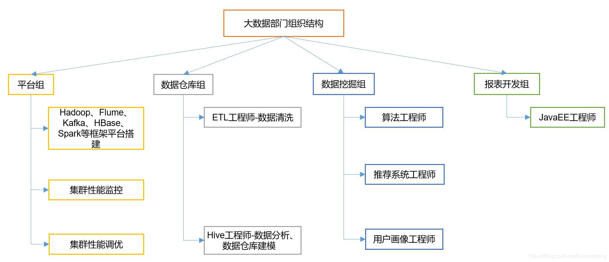

# 大数据

## 大数据入门

### 大数据的概念

​		大数据（big data），IT行业术语，是指无法在一定时间范围内用常规软件工具进行捕捉、管理和处理的数据集合，是需要新处理模式才能具有更强的决策力、洞察发现力和流程优化能力的海量、高增长率和多样化的信息资产。

​		其实大数据可以理解为大的数据。什么叫大的数据，首先数据量大，种类多，增长快，价值密度低，需要分析处理得出有价值的数据。我们技术人员一般讲大数据是指大数据技术，例如Hadoop等技术。

### 大数据的特点有哪些？

1. 数据量大
   数据集合的规模不断扩大，已经从 GB 级增加到 TB 级再增加到 PB 级，近年来，数据量甚至开始以 EB 和 ZB 来计数。例如微信，淘宝等网站的数据，全球几十亿人的数据都要处理。

2. 数据时效性
   加速的原因是数据创建的实时性特点，以及将流数据结合到业务流程和决策过程中的需求。数据处理速度快，处理模式已经开始从批处理转向流处理。例如我们每天都要聊微信，每时每刻都要视频，这个数据都要实时进行传输，时效性在不断加快。

3. 数据多样性

   传统 IT 产业产生和处理的数据类型较为单一，大部分是结构化数据。随着传感器、智能设备、社交网络、物联网、移动计算、在线广告等新的渠道和技术不断涌现，产生的数据类型无以计数。例如图片，视频等非结构化数据，都需要进行存储。

4. 数据价值低
   大数据由于体量不断加大，单位数据的价值密 度在不断降低，然而数据的整体价值在提高。以监控视频为例，在一小时的视频中，有用的数据可能仅仅只有一两秒，但是却会非常重要。现在许多专家已经将大数据等同于黄金和石油，这表示大数据当中蕴含了无限的商业价值。例如淘宝可以利用大数据来做推荐，百度可以利用大数据做竞价排名等

### 工作方向

- 大数据架构
- 组件开发
- 数据挖掘

### 岗位划分

## 开发工具

### Hadoop框架

- 分布式文件管理系统  HDFS
- Hive是一个数据仓库，查找数据的工具，负责从HDFS中找到数据，然后使用相应的  Hive Sql 调用 MapReduce 进行计算，方便了数据的查找 Hive  降低了mapreduce  的使用难度
- 数据计算 MapReduce 离线计算
- Hbase使用 HDFS 作为底层数据的引擎，优点是在于实时计算，实时随机查询
- 消息系统，用作大量数据的传输  Kafka一侧重高吞吐  高负载， flume一追求数据的采集和传输，不直接支持数据持久化，一般两者搭配使用
- Spark 分布式计算框架，大型的低延迟计算框架系统，可以独立运行内存化，微批处理，看作是类似流处理，无限接近流处理
- Flink 所有数据看作流计算，在流式处理上进行了大量的优化，未来也会使用比较多，可能会取代Spark
- 批处理  数据分割为小批次，每一块去处理
- 流处理  可以一直处理数据，源源不断处理数据

### 数据挖掘

- 是一种过程，找到需要的数据，未未来提供预测
- 标准流程  理解需求  理解数据  准备数据  构建模型  模型评估  部署上线

### 算法人工神经网络  

- 机器模仿人思考的过程  神经元传递信息
- 深度学习  大量数据构建神经网络
- 比如分类任务

### 深度学习

- 人类语言
- 文本分类
- 文本生产
- 语音识别
- 机器翻译
- 图像识别

### 推荐系统

- 用户画像  基本属性  行为属性  兴趣属性  价值属性
- 物品画像  基本属性  召回和排序  
- 协同过滤  基于内容推荐  基于知识推荐  混合推荐  
- 冷启动  用户冷启动  物品冷启动  系统冷启动

### 数据化运营

### 实时流计算

#### 业务方向

+ 实时计算统计业务，长时间展示和计算
+ 确认实时流计算的使用方向
+ 使用异步实现流计算

#### 框架

1. spark
2. flink
3. 自定义算法框架

#### 应用场景

金融风控 实时系统交易检测

天气系统  实时监控天气

#### 系统架构

##### 数据采集设计

1. 最简单的  SpringBoot  RestApi 服务，并组织数据
2. 会遇到大量数据，对于nio有较高要求
3. 流计算本身就是异步进行的，Nio和高并发很重要
4. Spring Boot集成Tomcat，以前默认使用BIO，但是针对大数据不合适。不过tomcat8以后默认NIO
   1. 提高IO效率，最好使用多线程 ，也就是 Netty 框架，提升数据采集能力
   2. 为避免异步OOM，每个数据处理步骤之间需要进行限流操作。注意由于上游速度处理比下游快，解决方案  （reactive  stream）
   3. 反向压力方案：下游决定上游传输效率，使用有限队列，捕捉异常，重试放入队列
   4. 流和异步的区别，流计算一定是异步的

##### 数据采集架构

1. 数据采集 
2. 能力分类
   1. 初级  多线程
   2. 中级  线程池  并发容器
   3. 高级  NIO Netty  异步结果捕获  甚至  fiber
3. 高并发是要解决的问题，异步是为了更好有效的利用CPU和 IO  资源，常见的异步模式
   1. premise  异步编程模式  ：java  的  completefuture
   2. actor  模式  游戏用的较多
   3. reactivex  模式
   4. 协程：高级的开发模式

##### 数据采集

1. 数据传输使用Kafka或者RecoketMQ，保持高吞吐、水平扩展等功能

##### 数据处理

###### 流计算框架

原理：最简单  CompleteFuture实现流计算

1. 有向无环图  DAG  
2. 传输  队列
3. 计算  分叉  聚合  forkjoin
4. 异步  completefuture  通过stack  管理调用的任务，  树管理计算结果的依赖关系，常用方法
   1. supplyasync  异步起点
   2. thenapplyasnyc  加工起点数据
   3. thenacceptasync  接受结果数据
   4. thencomposeasync  结果再异步改造，加入另一个新的异步任务
   5. applytoeither  定时超期
   6. allof  等所有异步任务完成
   7. exceptionlly  异步调用异常处理

###### 流计算死锁
1. 流计算一定不能有环，否则一直循环，代码进行多次循环，失败重试最容易造成有环
2. 解决方案
   1. 业务避免有环
   2. 使用多个不同队列

###### 流计划性能优化
1. 追踪最慢的处理时延  减少线程  优化算法
2. 内存优化，长时间维度聚合：最小  最大  最高  最低  求和  等只保留必要的信息，使用额外的空间记录已有的计算结果，再将该结果与新数据进行对比
3. 关联图谱分析，找到关联数据的树关系
4. hyperlog log  数据储存 等等
5. cep  事件序列分析  用户使用app的事件分析 或者 异常事件分析，
6. 只要将事件安装到程序中，流计算就会不同的输出结果
7. flink  cep 等框架

###### 大数据计框架

1. apache  storm    twitte
2. spark
3. Apache  samza  简单
4. flink  最惊艳

###### 案例

1. 风险系统评估  
2. 先设定交易异常的特征
3. 获取交易数据，获取交易的特征
4. 计算后面的评分
5. 分布JVM，使用flink开发微服务系统
6. 穷途末路，使用lambda架构

##### 数据转化

**常用功能**：

1. 过滤  filter
2. 映射  map
3. 聚合  reduce
4. 统计
5. 模式匹配
6. 模型学习  预测

##### 数据储存

**常用存储**：nosql使用会比较多

1. es 
2. redis
3. mongeDB，

##### 数据展示
页面  web页面

## 学习路线

### 第一阶段

1.  Java SE
2. Hadoop
3. Yarn
4. Zookeeper 
5. Hive
6. Flume 
7. Kafka 
8. Hbase 
9. Sqoop 
10. Kylin Azkaban
11. presto

### 第二阶段

1. Scala
2. spark -- 离线
3. Spark Core
4. Spark Streaming
5. Git 
6. Redis
7. ES 

### 第三阶段

1. Flink 实时
2. ClickHouse
3. Hudi（数据湖）
4. doris

### 第四阶段

1. 海量日志采集
2. 亿万级数仓
3. 业务量监控实时系统
4. 指标实时计算系统
5. 用户画像
6. 在线教育

