# Hadoop

## 概述

### Hadoop 解决了什么问题？

1. 数据存储
2. 数据采集

### 理论基础

Google是Hadoop的思想之源（Google在大数据方面的三篇论文）

+ GFS --->HDFS
+ Map-Reduce --->MR
+ BigTable --->HBase

### 历史

+ 2003年 GFS论文，提供可行的解决方案
+ 2004年，MapReduce系统论文诞生，在此基础上设计了Hadoop
+ 2008年1月，Hadoop成为Apache顶级项目，迎来快速的发展期
+ 如今，Hadoop是大数据生态的必备技术

### 通用版本分类

1. 1.X版本：该版本基本已经淘汰
   1. MapReduce（计算+资源调度）
   2. HDFS
   3. Common （辅助工具类）
2. **2.X版本：架构得到了重大变化，引入了 Yarn，是现在的主流版本**
   1. MapReduce 计算
   2. Yarn 分布式计算时的资源调度功能
   3. HDFS
   4. Common
3. 3.X 版本，最新版本（相对与2.X版本改进）
   1. **最低Java版本从7升级到8**
   2. **引入纠删码(Erasure Coding)**：主要解决数据量大到–定程度磁盘空间存储能力不足的问题.
   3. **重写了Shell 脚本**：修改了之前版本长期存在的–些错误，并提供了一些新功能,在尽可能保证兼容性的前提下
   4. **支持超过两个 NN**：HDFS NameNode高可用性的初始实现为单个Active NameNode和单个Standby NameNode,将edits复制到三个JournalNode。该体系结构能够容忍系统中-一个NN或者一个JN故障.但是，某些部署需要更高程序的容错能力，Hadoop3.x允许用户运行一个Active NameNode和多个Standby NameNode
   5. **默认端口改变**


### 发行版本分类

1. Apache 免费版本，版本丰富，但是兼容性稍差
2. 收费版（Cloudera、Hortonworks），在免费版本上进行了修改，商业化软件，兼容性更好

### Hadoop优势

1. 高可靠性： Hadoop底层维护多个数据副本，所以即使Hadoop某个计算元

   素或存储出现故障，也不会导致数据的丢失
2. 高扩展性，在集群间分配任务数据，可方便的扩展数以千计的节点。
3. 高效性：在MapReduce的思想下，Hadoop是并行工作的，以加快任务处

   理速度。
4. 高容错性：能够将失败的任务进行自动迁移


## 生态圈

+ Hadoop是指Hadoop框架本身；
+ hadoop生态系统，不仅包含hadoop，还包括保证hadoop框架正常高效运行其他框架，比如
  + zookeeper、
  + Flume、
  + Hbase、
  + Hive、
  + Sqoop
  + ...等辅助框架。

### 数据传输

1. 结构化数据：Sqoop
2. 半结构化数据： Flume
3. 视频、ppt 等 ： Kafka

### 数据存储

1. HDFS

### 资源调度

1. Yarn

### 数据计算

1. 离线计算
   1. MapReduce
   2. Spark Core --> 基于内存计算，提升计算效率
   3. Hive 数据查询

2. 实时计算
   1. Flink 很流行（重点）
   2. Spark Streaming
   3. Storm 已经过时

### 任务调度

1. Oozie
2. Azkaban

### 组件管理

zookeeper 

## 运行模式

1. 本地（演示目的）
2. 伪分布式（一台机器部署集群）
3. 完全分布式（生产环境）

## 组件介绍

### **HDFS**

Hadoop分布式文件存储系统，处理海量数据

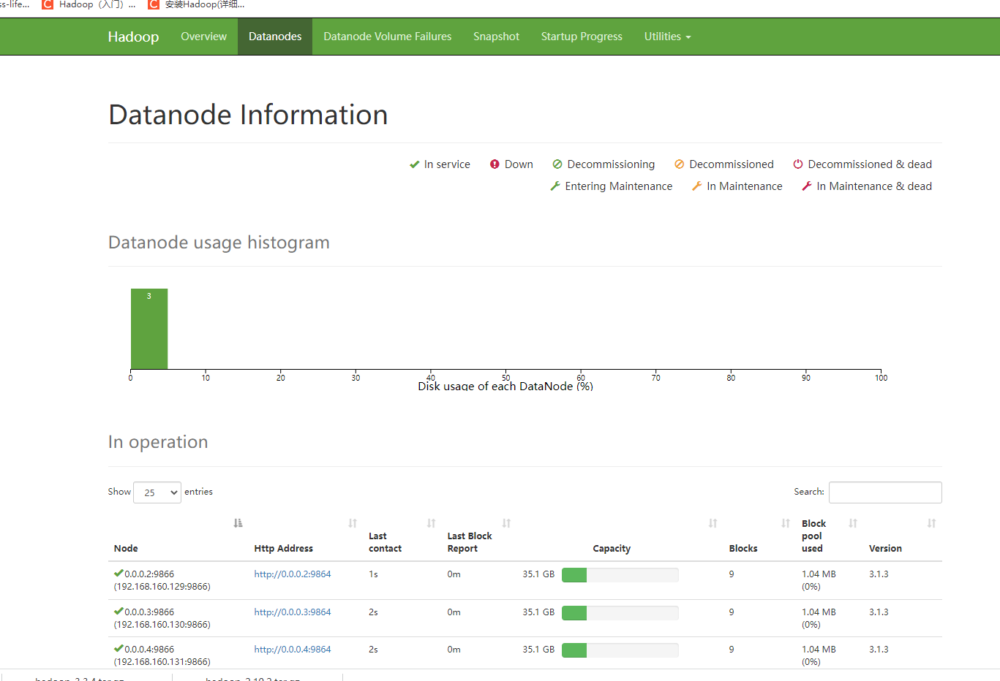

### Yarn

支持多个客户端访问，每个NodeManager 有多个可以运行的容器

1. Resource Manager -- 管理着所有Node Manager
2. Node Manager 管理者本机的资源
3. Application Master 单个任务的老大
4. Container 容器：任务运行的环境，也就是 Docker 了

### MapReduce

Map 阶段：对于大的任务进行拆分

Reduce 阶段：计算结果的汇总

## Hadoop集群架构

1. **NameNode**：它是hadoop中的主服务器，管理文件系统名称空间和对集群中存储的文件的访问，保存有metadate。
2. **SecondaryNameNode**：它不是namenode的冗余守护进程，而是提供周期检查点和清理任务。帮助NN合并editslog，减少NN启动时间。
3. **DataNode**：它负责管理连接到节点的存储（一个集群中可以有多个节点）。每个存储数据的节点运行一个datanode守护进程。
4. **ResourceManager**（JobTracker）：JobTracker负责调度DataNode上的工作。每个DataNode有一个TaskTracker，它们执行实际工作，负责分配资源。
5. **NodeManager**：（TaskTracker）执行主节点分配的任务。
6. **DFSZKFailoverController**：高可用时它负责监控NN的状态，并及时的把状态信息写入ZK。它通过一个独立线程周期性的调用NN上的一个特定接口来获取NN的健康状态。FC也有选择谁作为Active NN的权利，因为最多只有两个节点，目前选择策略还比较简单（先到先得，轮换）。
7. **JournalNode**：高可用情况下存放namenode的editlog文件。

## 默认端口

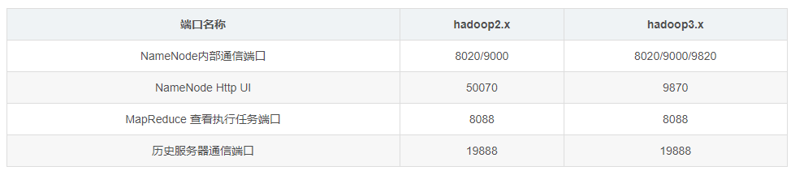


# HDFS

## 概述

随着数据量越来越大，在一个操作系统存不下所有的数据，那么就分配到更多的操作系统管理的磁盘中，但是不方便管理和维护，迫切需要一种系统来管理多台机器上的文件，这就是分布式文件管理系统。HDFS 只是分布式文件管理系统中的一种。

### HDFS的优缺点

1. 优点
   1. 自动多个备份，提高容错
   2. 适合处理大数据
   3. 无关文件大小
   4. 可以构建在廉价的机器上，多副本，提高可靠性
2. 缺点
   1. 不适合低延时的数据访问
   2. 无法高效的存储小文件
   3. 小文件的寻址时间会超过读取时间，违反了HDFS的设计原则
   4. 不支持文件的并发写入、文件随机修改
   5. 仅支持数据追加、不支持文件的随机修改

### HDFS组成架构

架构主要由四个部分组成，分别为HDFS Client、NameNode、DataNode和Secondary NameNode。下面我们分别介绍这四个组成部分。

1. **Client**：就是客户端。
   1. 文件切分。文件上传HDFS的时候，Client将文件切分成一个一个的Block，然后进行存储；
   2. 与NameNode交互，获取文件的位置信息；
   3. 与DataNode交互，读取或者写入数据；
   4. Client提供一些命令来管理HDFS，比如启动或者关闭HDFS；
   5. Client可以通过一些命令来访问HDFS；
2. **NameNode**：就是Master，它是一个主管、管理者。
   1. 管理HDFS的名称空间；
   2. 管理数据块（Block）映射信息；
   3. 配置副本策略；
   4. 处理客户端读写请求。
3. **DataNode**：就是Slave。NameNode下达命令，DataNode执行实际的操作。
   1. 存储实际的数据块；
   2. 执行数据块的读/写操作。
4. **Secondary-NameNode**：并非NameNode的热备。当NameNode挂掉的时候，它并不能马上替换NameNode并提供服务。
   1. 辅助NameNode，分担其工作量；
   2. 定期合并Fsimage和Edits，并推送给NameNode；
   3. 在紧急情况下，可辅助恢复NameNode。

### HDFS的文件块

1. HDFS的文件在物理上是分块存储的，块的大小可以通过配置修改：默认大小Hadoop 2.x 3.x 是128M， 1.x 是64M
3. 如果寻址时间约为10ms， 即查找到目标的时间为10ms
4. 寻址时间为传输时间的1%时，为最佳状态
5. 目前机械磁盘的传输速率普遍为100MB/s，固态磁盘在200~300M
6. 所以文件快的大小 1s*100 MB/s = 100MB（机械盘），如果是固态盘，块大小可以为 256MB

7. 文件块不能设置的太小，也不能设置的太大
   1. 大小，程序会一直在寻址，大文件拆分后，寻址和整合很麻烦
   2. 太大，程序IO会一直阻塞
7. **HDFS块的大小设置主要取决于磁盘传输速率。**

### 文件写入流程（重点）

1. 客户端通过 Distributed FileSystem （分布式的文件系统）模块向NameNode请求上传文件，NameNode检查目标文件是否已存在、父目录是否存在、受否可以创建文件
2. NameNode返回是否可以上传。
3. 客户端请求第一个 Block上传到哪几个DataNode服务器上。
4. NameNode（通过**负载均衡、节点距离**等因素）返回3个DataNode节点，分别为dn1、dn2、dn3。
5. 客户端通过FSDataOutputStream模块请求dn1上传数据，dn1收到请求会继续调用dn2，然后dn2调用dn3，**将这个通信管道建立完成**。dn1、dn2、dn3逐级应答客户端。类似于一个链表的链接通道，为了保证性能，dataNode会在收到文件之后，保存在内存当中，一边写入磁盘，一边发送给下一个DataNode节点
6. 客户端开始往dn1上传第一个Block（先从磁盘读取数据放到一个本地内存缓存），以Packet（64）为单位，dn1收到一个Packet就会传给dn2，dn2传给dn3；dn1每传一个packet会放入一个应答队列等待应答。
7. 内存中还会存在一个Ack缓存，保存在传输数据的副本，当应答成功之后，缓存数据才会被删除
8. 当一个Block传输完成之后，客户端再次请求NameNode上传第二个Block的服务器。（重复执行3-7步）

### 节点距离计算

​		在HDFS写数据的过程中，NameNode会选择**距离待上传数据最近距离的DataNode接收数据**。那么这个最近距离怎么计算呢？

节点距离：**两个节点到达最近的共同祖先的距离总和。类似与树形结构距离的求取**

​		例如，假设有数据中心d1机架r1中的节点n1。该节点可以表示为/d1/r1/n1。利用这种标记，这里给出四种距离描述。

​		大家算一算每两个节点之间的距离。

### 副本节点选择

1. 第一个副本在Clinet所在的节点上，如果客户端在集群外，随机选一个
2. 第二个副本在另一个机架的随机一个节点上
3. 第三个副本在第二个副本所在机架的随机节点

### HDFS读数据（重点）

1. 客户端通过DistributedFileSystem向NameNode请求下载文件，NameNode通过查询元数据，找到文件块所在的DataNode地址。
2. 挑选一台DataNode（负载均衡、就近原则，然后随机）服务器，请求读取数据。
3. DataNode开始传输数据给客户端（从磁盘里面读取数据输入流，以Packet为单位来做校验）。
4. 客户端以Packet为单位接收，先在本地缓存，然后写入目标文件。

### NameNode 元数据

**思考1**：NameNode 中的元数据是存储在哪里的？

首先，我们做个假设，如果存储在 NameNode 节点的磁盘中，因为经常需要进行随机访问，还有响应客户请求，必然是效率过低。因此，元数据需要存放在内存中。但如果只存在内存中，一旦断电，元数据丢失，整个集群就无法工作了。因此产生在磁盘中备份元数据的**FsImage**。

**思考2：**，如果同时更新 FsImage，就会导致效率过低，但如果不更新，就会发生一致性问题，一旦 NameNode 节点断电，就会产生数据丢失。

因此，引入 Edits 文件（只进行追加操作，效率很高）。每当元数据有更新或者添加元数据时，修改内存中的元数据并追加到 Edits 中。这样，一旦 NameNode 节点断电，可以通过 FsImage 和 Edits 的合并，合成元数据。但是，如果长时间添加数据到 Edits 中，会导致该文件数据过大，效率降低，而且一旦断电，恢复元数据需要的时间过长。因此，需要定期进行 FsImage 和 Edits 的合并，如果这个操作由NameNode节点完成，又会效率过低。因此，引入一个新的节点**SecondaryNamenode，专门用于 FsImage 和 Edits 的合并。**

### NN 和2NN 工作机制

1. 第一阶段：NameNode启动
   1. 第一次启动NameNode格式化后，创建fsimage和edits文件。如果不是第一次启动，直接加载编辑日志和镜像文件到内存。
   2. 客户端对元数据进行增删改的请求。
   3. NameNode记录操作日志，更新滚动日志。
   4. NameNode在内存中对数据进行增删改查。
2. 第二阶段：Secondary NameNode工作
   1. Secondary NameNode询问NameNode是否需要checkpoint。直接带回NameNode是否检查结果。
   2. Secondary NameNode请求执行checkpoint。
   3. NameNode滚动正在写的edits日志。
   4. 将滚动前的编辑日志和镜像文件拷贝到Secondary NameNode。
   5. Secondary NameNode加载编辑日志和镜像文件到内存，并合并。
   6. 生成新的镜像文件fsimage.chkpoint。
   7. 拷贝fsimage.chkpoint到NameNode。
   8. NameNode将fsimage.chkpoint重新命名成fsimage。


## Secondary/NameNode 

1. 区别
   1. NameNode负责管理整个文件系统的元数据，以及每一个路径（文件）所对应的数据块信息。
   2. SecondaryNameNode主要用于定期合并命名空间镜像和命名空间镜像的编辑日志。
2. 联系：
   1. SecondaryNameNode中保存了一份和namenode一致的镜像文件（fsimage）和编辑日志（edits）。
   2. 在主namenode发生故障时（假设没有及时备份数据），可以从SecondaryNameNode恢复数据。

### Fsimage

是HDFS系统中元数据的一个永久性的检查点其中包含HDFS中所有的目录和文件的inode的序列化信息

### Edits

存放HDFS文件系统的所有更新操作的路径，文件系统客户端执行的所有写操作都会被记录到Edits中

### Seen_txcid

文件保存的是一个数字，就是最后一个eidts的数字

### Version

记录一些集群当中的信息


## DataNode

### 概述

1. 一个数据块在 DataNode 上以文件形式存储在磁盘上，包括两个文件，一个是数据本身，一个是元数据包括数据块的长度，块数据的校验和，以及时间戳。
2. DataNode 启动后向 NameNode 注册，通过后，周期性（6 小时）的向 NameNode 上报所有的块信息。
3. DN 向 NN 汇报当前解读信息的时间间隔，默认 6 小时；
4. DN 扫描自己节点块信息列表的时间，默认 6 小时
5. 心跳是每 3 秒一次，心跳返回结果带有 NameNode 给该 DataNode 的命令如复制块数据到另一台机器，或删除某个数据块。如果超过 10 分钟没有收到某个 DataNode 的心跳，则认为该节点不可用。
6. 集群运行中可以安全加入和退出一些机器。

### 数据完整性

1. 当 DataNode 读取 Block 的时候，它会计算 CheckSum。
2. 如果计算后的 CheckSum，与 Block 创建时值不一样，说明 Block 已经损坏。
3. Client 读取其他 DataNode 上的 Block。
4. 常见的校验算法 crc（32），md5（128），sha1（160）
5. DataNode 在其文件创建后周期验证 CheckSum。

## 其他 

### block 默认保存几份？

 默认保存3份

### HDFS 默认 BlockSize 是多大？
  在Hadoop2.7版本之前是64MB,之后就改为了128MB

### 负责HDFS数据存储的是哪一部分？
  DataNode负责数据存储

### SecondaryNameNode的目的是什么？
  他的目的使帮助NameNode合并编辑日志，减少NameNode 二次启动时间，备份数据

### 文件块的大小设置，增大或减小会有什么影响？
1. HDFS中的文件在物理上是分块存储（block），块的大小可以通过配置参数( dfs.blocksize)来规定，默认大小在hadoop2.x版本中是128M，老版本中是64M。  
2. 思考：为什么块的大小不能设置的太小，也不能设置的太大? 
   1. HDFS的块比磁盘的块大，其目的是为了最小化寻址开销。如果块设置得足够大，从磁盘传输数据的时间会明显大于定位这个块开始位置所需的时间。
   2. 因而，传输一个由多个块组成的文件的时间取决于磁盘传输速率。
   3. 如果寻址时间约为10ms，而传输速率为100MB/s，为了使寻址时间仅占传输时间的1%，我们要将块大小设置约为100MB。默认的块大小128MB。
      1. 块的大小：10ms×100×100M/s = 100M
      2. 增加文件块大小，需要增加磁盘的传输速率。

### 块大小，从哪个版本开始是128M
  Hadoop1.x都是64M，hadoop2.x开始都是128M。

### HDFS小文件优化方法

1. HDFS小文件弊端：
   1. HDFS上每个文件都要在namenode上建立一个索引，这个索引的大小约为150byte，这样当小文件比较多的时候，就会产生很多的索引文件，一方面会大量占用namenode的内存空间，另一方面就是索引文件过大是的索引速度变慢。
2. 解决的方式：
   1. Hadoop本身提供了一些文件压缩的方案。
   2. 从系统层面改变现有HDFS存在的问题，其实主要还是小文件的合并，然后建立比较快速的索引。
3. Hadoop自带小文件解决方案
   1. Hadoop Archive：
      是一个高效地将小文件放入HDFS块中的文件存档工具，它能够将多个小文件打包成一个HAR文件，这样在减少namenode内存使用的同时。
   2. Sequence file：
      sequence file由一系列的二进制key/value组成，如果为key小文件名，value为文件内容，则可以将大批小文件合并成一个大文件。
   3. combineFileInputFormat：
      CombineFileInputFormat是一种新的inputformat，用于将多个文件合并成一个单独的split，另外，它会考虑数据的存储位置。

### hadoop1与hadoop2 的架构异同

1. 加入了yarn解决了资源调度的问题。
2. 加入了对zookeeper的支持实现比较可靠的高可用。


# MapReduce

## 概述

**MapReduce 是一个分布式运算程序的编程框架**，是用户开发“基于 Hadoop 的数据分析应用”的核心框架。MapReduce 核心功能是将用户编写的业务逻辑代码和自带默认组件整合成一个完整的分布式运算程序，并发运行在一个 Hadoop 集群上。

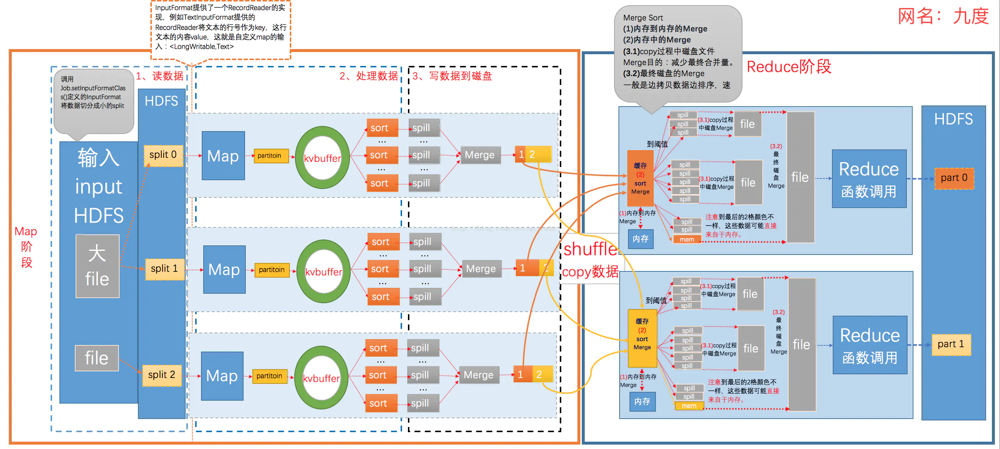

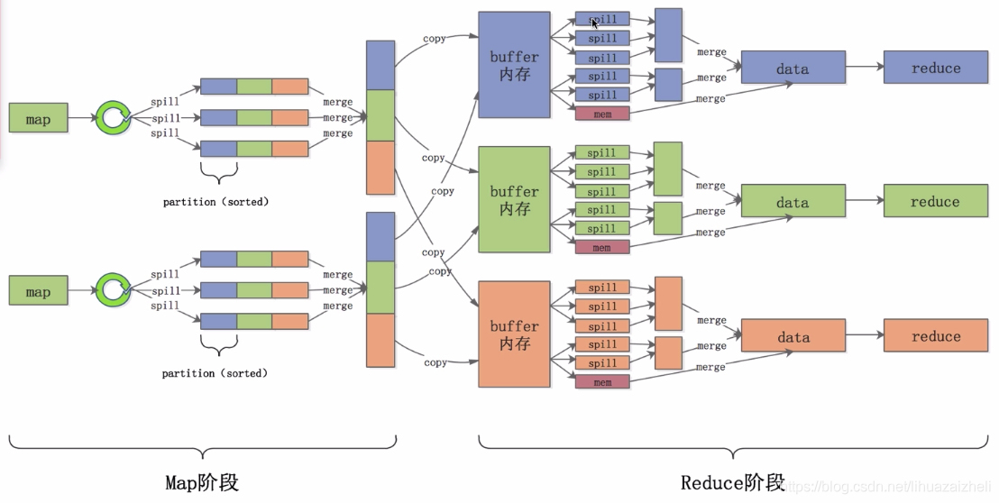

### 优缺点

**优点**：

1. MapReduce易于编程：
2. 它简单的实现一些接口，就可以完成一个分布式程序，这个分布式程序可以分布到大量廉价的PC机器上运行。也就是说你写一个分布式程序，跟写一个简单的串行程序是一模一样的。就是因为这个特点使得MapReduce编程变得非常流行。

2. 良好的扩展性：当你的计算资源不能得到满足的时候，你可以通过简单的增加机器来扩展它的计算能力。

3. 高容错性：MapReduce设计的初衷就是使程序能够部署在廉价的PC机器上，这就要求它具有很高的容错性。比如其中一台机器挂了，它可以把上面的计算任务转移到另外一个节点上运行，不至于这个任务运行失败，而且这个过程不需要人工参与，而完全是由Hadoop内部完成的。

4. 适合PB级以上海量数据的离线处理：可以实现上千台服务器集群并发工作，提供数据处理能力。

**缺点**：

1. 不擅长实时计算，MapReduce 无法像 MySQL 一样，在毫秒或者秒级内返回结果。
2. 不擅长流式计算，而 MapReduce 的输入数据集是静态的，不能动态变化。
3. 不擅长DAG有向无环图计算：Spark 擅长。多个应用程序存在依赖关系，后一个应用程序的输入为前一个的输出。在这种情况下，MapReduce 并不是不能做，而是使用后，每个 MapReduce 作业的输出结果都会写入到磁盘，会造成大量的磁盘 IO，导致性能非常的低下

### 核心思想是什么？

1. 分布式的运算程序往往需要分成至少2个阶段
2. 第一个阶段的MapTask并发实例，完全并行运行，互不相干。
3. 第二个阶段的ReduceTask并发实例互不相干，但是他们的数据依赖于上一个阶段的所有MapTask并发实例的输出。
4. MapReduce编程模型只能包含一个Map阶段和一个Reduce阶段，如果用户的业务逻辑非常复杂，那就只能多个MapReduce程序，串行运行。

### MapReduce进程

 **一个完整的MapReduce程序在分布式运行时有三类实例进程**：

1. **MrAppMaster**：负责整个程序的过程调度及状态协调。
2. **MapTask**：负责Map阶段的整个数据处理流程。
3. **ReduceTask**：负责Reduce阶段的整个数据处理流程。

### MapReduce 编程规范

**Mapper阶段**

1. 用户自定义的Mapper要继承自己的父类
2. Mapper的输入数据是KV对的形式（KV的类型可自定义）
3. Mapper中的业务逻辑写在map()方法中
4. Mapper的输出数据是KV对的形式（KV的类型可自定义）
5. map()方法（MapTask进程）对每一个<K,V>调用一次

**Reducer阶段**

1. 用户自定义的Reducer要继承自己的父类
2. Reducer的输入数据类型对应Mapper的输出数据类型，也是KV
3. Reducer的业务逻辑写在reduce()方法
4. ReduceTask进程对每一组相同k的<k,v>组调用一次reduce()方法

**Driver阶段**

相当于YARN集群的客户端，用于提交我们整个程序到YARN集群，提交的是封装了MapReduce程序相关运行参数的job对象

## 序列化和反序列化

### 基本概念

1. 序列化就是把内存中的对象，转换成字节序列（或其他数据传输协议）以便于存储（持久化）和网络传输。
2. 反序列化就是将收到字节序列（或其他数据传输协议）或者是硬盘的持久化数据，转换成内存中的对象。

### 为什么不用Java序列化？

​		Java的序列化是一个重量级序列化框架（Serializable），一个对象被序列化后，会附带很多额外的信息（各种校验信息，header，继承体系等），不便于在网络中高效传输。所以，hadoop自己开发了一套序列化机制（Writable），精简、高效。


## 框架原理

### 概述

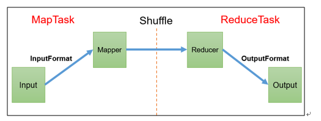

###  数据切片

数据切片只是在逻辑上对输入进行分片，并不会在磁盘上将其切分成片进行存储。数据切片是 MapReduce 程序计算输入数据的单位，一个切片会对应启动一个 MapTask。

1. 一个Job的Map阶段并行度由客户端在提交Job时的切片数决定
2. 每一个Split切片分配一个MapTask并行实例处理
3. 默认情况下，切片大小=BlockSize
4. 切片时不考虑数据集整体，而是逐个针对每一个文件单独切片


### inputFormat

#### TextInputFormat

1. 程序先找到你数据存储的目录
2. 开始遍历处理（规划切片）目录下的每一个文件
3. 遍历第一个文件ss.txt
   1. 获取文件大小fs.sizeOf(ss.txt)
   2. 计算切片大小computeSplitSize(Math.max(minSize,Math.min(maxSize,blocksize)))=blocksize=128M
   3. 默认情况下，切片大小=blocksize
   4. 开始切，形成第1个切片：ss.txt—0:128M 第2个切片ss.txt—128:256M 第3个切片ss.txt—256M:300M（每次切片时，都要判断切完剩下的部分是否大于块的1.1倍，不大于1.1倍就划分一块切片）
   5. 将切片信息写到一个切片规划文件中
   6. 整个切片的核心过程在getSplit()方法中完成
   7. **InputSplit只记录了切片的元数据信息**，比如起始位置、长度以及所在的节点列表等。
4. 提交切片规划文件到YARN上，YARN上的MrAppMaster就可以根据切片规划文件计算开启MapTask个数。

#### 其他

##### FileInputFormat 实现类

在运行 MapReduce 程序时，输入的文件格式包括：基于行的日志文件、二进制格式文件、数据库表等。那么，针对不同的数据类型，MapReduce 是如何读取这些数据的呢？

FileInputFormat 常见的接口实现类包括：TextInputFormat、KeyValueTextInputFormat、NLineInputFormat、CombineTextInputFormat 和自定义 InputFormat 等。


### Shuffle

Map方法之后，Reduce方法之前的数据处理过程称之为Shuffle。

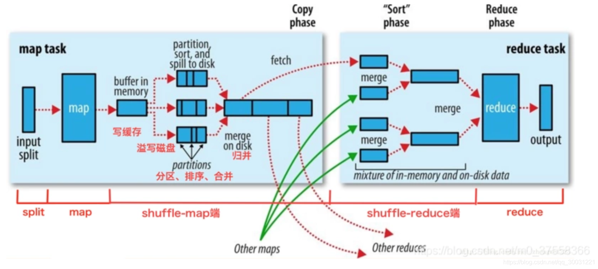

#### 目的：

+ 对Map机器上的数据进行重新分组
+ 让每个Reduce知道它需要的数据分别在每个Map机器的哪里。

+ shuffle阶段分为四个步骤：依次为**：分区，排序，规约（combiner），分组**，其中前三个步骤在map阶段完成，最后一个步骤在reduce阶段完成
+ shuffle 是 Mapreduce 的核心，它分布在 MapReduce 的 map 阶段和 reduce 阶段。一般把从 Map 产生输出开始到 Reduce 取得数据作为输入之前的过程称作 shuffle。
+ shuffle中排序的目的（使用快速排序法）

  + 这样每个Reducer都可以得知自己要处理的数据是哪些，直接拉取和计算对应的数据，避免了大量无用数据的存储和计算

#### Map端shuffle

+ MapTask收集我们的map()方法输出的kv对，放到内存缓冲区中
+ 从内存缓冲区不断溢出到本地磁盘文件，可能会溢出多个文件
+ 多个溢出文件会被合并成大的溢出文件
+ 在溢出过程及合并的过程中，都要调用Partitioner进行分区和针对key进行排序
+ ReduceTask根据自己的分区号，去各个MapTask机器上取相应的结果分区数据
+ ReduceTask会抓取到同一个分区的来自不同MapTask的结果文件，ReduceTask会将这些文件再进行合并（归并排序）
+ 合并成大文件后，Shuffle的过程也就结束了，后面进入ReduceTask的逻辑运算过程（从文件中取出一个一个的键值对Group，调用用户自定义的reduce()方法）

**注意：**

1. Shuffle中的缓冲区大小会影响到MapReduce程序的执行效率，原则上说，缓冲区越大，磁盘io的次数越少，执行速度就越快。
2. 缓冲区的大小可以通过参数调整，参数：mapreduce.task.io.sort.mb默认100M。

#### Reduce端shuffle

+ 复制copy，Reduce 任务通过Http向各个Map任务拖取它所需要的数据。在 ReduceTask 远程复制数据的同时，会在后台开启两个线程对内存到本地的数据文件进行合并操作
+ 归并merge，Map的输出数据已经是有序的，Merge进行一次合并排序，所谓Reduce端的 sort过程就是这个合并的过程。一般Reduce是一边copy一边sort，即copy和sort两个阶段是重叠而不是完全分开的。
+ 优化shuffle：增加combiner，压缩溢写的文件
+ 原则上缓冲区越大，磁盘io的次数越少，执行速度就越快缓冲区的大小可以通过参数调整, mapreduce.task.io.sort.mb 默认100M

#### Partition分区

要求将统计结果按照条件输出到不同文件中（分区）。比如：将统计结果按照手机归属地不同省份输出到不同文件中（分区）。默 认分区是根据key的hashCode对ReduceTasks个数取模得到的。用户没法控制哪个key存储到哪个分区。这个时候我们需要自定义数据的分区规则。

**总结：**

1. 如果ReduceTask的数量> getPartition的结果数，则会多产生几个空的输出文件part-r-000xx；
2. 如果<ReduceTask的数量<getPartition的结果数，则有一部分分区数据无处安放，会Exception；
3. 如 果ReduceTask的数量=1，则不管MapTask端输出多少个分区文件，最终结果都交给这一个ReduceTask，最终也就只会产生一个结果文件 part-r-00000；


### Reduce

### OutputFormat

#### 基本概念

OutputFormat 是MapReduce输出的基类，所有实现MapReduce输出都实现了OutputFormat接口

#### 实现类

OutPutFormat 有多种实现类

默认的输出格式是TextOutputFormat

#### 使用场景

1. 输出数据到Mysql中
2. 输出数据到HBase中
3. 输出数据到ES中
4. 等等


### MapTask工作机制

1. Read阶段：MapTask通过InputFormat获得的RecordReader，从输入InputSplit中解析出一个个key/value。

2. Map阶段：该节点主要是将解析出的key/value交给用户编写map()函数处理，并产生一系列新的key/value。

3. Collect收集阶段：在用户编写map()函数中，当数据处理完成后，一般会调用OutputCollector.collect()输出结果。在该函数内部，它会将生成的key/value分区（调用Partitioner），并写入一个环形内存缓冲区中。

4. Spill阶段：即“溢写”，当环形缓冲区满后，MapReduce会将数据写到本地磁盘上，生成一个临时文件。需要注意的是，将数据写入本地磁盘之前，先要对数据进行一次本地排序，并在必要时对数据进行合并、压缩等操作。

   溢写阶段详情：

   1. 利用快速排序算法对缓存区内的数据进行排序，排序方式是，先按照分区编号Partition进行排序，然后按照key进行排序。这样，经过排序后，数据以分区为单位聚集在一起，且同一分区内所有数据按照key有序。
   2. 按照分区编号由小到大依次将每个分区中的数据写入任务工作目录下的临时文件output/spillN.out（N表示当前溢写次数）中。如果用户设置了Combiner，则写入文件之前，对每个分区中的数据进行一次聚集操作。
   3. 将分区数据的元信息写到内存索引数据结构SpillRecord中，其中每个分区的元信息包括在临时文件中的偏移量、压缩前数据大小和压缩后数据大小。如果当前内存索引大小超过1MB，则将内存索引写到文件output/spillN.out.index中。

5. Merge阶段：当所有数据处理完成后，MapTask对所有临时文件进行一次合并，以确保最终只会生成一个数据文件。

6. 当所有数据处理完后，MapTask会将所有临时文件合并成一个大文件，并保存到文件output/file.out中，同时生成相应的索引文件output/file.out.index。

7. 在进行文件合并过程中，MapTask以分区为单位进行合并。对于某个分区，它将采用多轮递归合并的方式。每轮合并mapreduce.task.io.sort.factor（默认10）个文件，并将产生的文件重新加入待合并列表中，对文件排序后，重复以上过程，直到最终得到一个大文件

8. 让每个MapTask最终只生成一个数据文件，可避免同时打开大量文件和同时读取大量小文件产生的随机读取带来的开销。

### ReduceTask工作机制

1. Copy阶段：ReduceTask从各个MapTask上远程拷贝一片数据，并针对某一片数据，如果其大小超过一定阈值，则写到磁盘上，否则直接放到内存中。
2. Sort阶段：在远程拷贝数据的同时，ReduceTask启动了两个后台线程对内存和磁盘上的文件进行合并，以防止内存使用过多或磁盘上文件过多。按照MapReduce语义，用户编写reduce()函数输入数据是按key进行聚集的一组数据。为了将key相同的数据聚在一起，Hadoop采用了基于排序的策略。由于各个MapTask已经实现对自己的处理结果进行了局部排序，因此，ReduceTask只需对所有数据进行一次归并排序即可。
3. Reduce阶段：reduce()函数将计算结果写到HDFS上。

### Join应用

1. Map端的主要工作：为来自不同表或文件的key/value对，打标签以区别不同来源的记录。然后用连接字段作为key，其余部分和新加的标志作为value，最后进行输出。
2. Reduce端的主要工作：在Reduce端以连接字段作为key的分组已经完成，我们只需要在每一个分组当中将那些来源于不同文件的记录（在Map阶段已经打标志）分开，最后进行合并就ok了。

### MapReduce 开发总结

1. 输入数据接口：InputFormat

   1. 默认使用的实现类是：TextInputFormat
   2. TextInputFormat 的功能逻辑是：一次读一行文本，然后将该行的起始偏移量作为key，行内容作为 value 返回。
   3. CombineTextInputFormat 可以把多个小文件合并成一个切片处理，提高处理效率。

2. 逻辑处理接口：Mapper

   用户根据业务需求实现其中三个方法：map() setup() cleanup () 

3. Partitioner 分区

   1. 有默认实现 HashPartitioner，逻辑是根据 key 的哈希值和 numReduces 来返回一个分区号；key.hashCode()&Integer.MAXVALUE % numReduces
   2. 如果业务上有特别的需求，可以自定义分区。

4. Comparable排序

   1. 当我们用自定义的对象作为 key 来输出时，就必须要实现 WritableComparable 接口，重写其中的 compareTo()方法。
   2. 部分排序：对最终输出的每一个文件进行内部排序。
   3. 全排序：对所有数据进行排序，通常只有一个 Reduce。
   4. 二次排序：排序的条件有两个。

5. Combiner合并

   Combiner 合并可以提高程序执行效率，减少 IO 传输。但是使用时必须不能影响原有的业务处理结果。

6. 逻辑处理接口：Reducer

   用户根据业务需求实现其中三个方法：reduce() setup() cleanup () 

7. 输出数据接口：OutputFormat
   1. 默认实现类是 TextOutputFormat，功能逻辑是：将每一个 KV 对，向目标文本文件输出一行。
   2. 用户还可以自定义 OutputFormat。

## 其他

### shuffle阶段的数据压缩机制了解吗

+ 在shuffle阶段，可以看到数据通过大量的拷贝，从map阶段输出的数据，都要通过网络拷贝，发送到reduce阶段，
+ hadoop当中支持的压缩算法：gzip、bzip2、LZO、LZ4、Snappy，这几种压缩算法综合压缩和解压缩的速率，谷歌的Snappy是最优的，一般都选择Snappy压缩。

### 如何判定一个job的map和reduce的数量?

1. map数量
   1. splitSize=max{minSize,min{maxSize,blockSize}}
   2. map数量由处理的数据分成的block数量决定default_num = total_size / split_size;
2. reduce数量
   1. reduce的数量job.setNumReduceTasks(x);x 为reduce的数量。不设置的话默认为1。

### Maptask的个数由什么决定？

+ 一个job的map阶段MapTask并行度（个数），由客户端提交job时的切片个数决定。

### mapReduce有几种排序及排序发生的阶段

1. 排序的分类：

   1. 部分排序:MapReduce根据输入记录的键对数据集排序。保证输出的每个文件内部排序

   2. 全排序：如何用Hadoop产生一个全局排序的文件？最简单的方法是使用一个分区。但该方法在处理大型文件时效率极低，因为一台机器必须处理所有输出文件，从而完全丧失了MapReduce所提供的并行架构。

      替代方案：首先创建一系列排好序的文件；其次，串联这些文件；最后，生成一个全局排序的文件。主要思路是使用一个分区来描述输出的全局排序。例如：可以为待分析文件创建3个分区，在第一分区中，记录的单词首字母a-g，第二分区记录单词首字母h-n, 第三分区记录单词首字母o-z。

   3. 辅助排序：（GroupingComparator分组）Mapreduce框架在记录到达reducer之前按键对记录排序，但键所对应的值并没有被排序。甚至在不同的执行轮次中，这些值的排序也不固定，因为它们来自不同的map任务且这些map任务在不同轮次中完成时间各不相同。一般来说，大多数MapReduce程序会避免让reduce函数依赖于值的排序。但是，有时也需要通过特定的方法对键进行排序和分组等以实现对值的排序。
   4. 二次排序：在自定义排序过程中，如果compareTo中的判断条件为两个即为二次排序。
   
2. 自定义排序WritableComparabl e

   bean对象实现WritableComparable接口重写compareTo方法，就可以实现排序

~~~bash
@Override  
 public int compareTo(FlowBean o) {  
 // 倒序排列，从大到小  
 return this.sumFlow > o.getSumFlow() ? -1 : 1;  
~~~

3. 排序发生的阶段：
   1. 一个是在map side发生在spill后partition前。
   2. 一个是在reduce side发生在copy后 reduce前。

### MapReduce实现基本SQL操作的原理

**由于Join/GroupBy/OrderBy均需要在Reduce阶段完成**

### Join的实现原理

```
 select u.name, o.orderid from order o join user u on o.uid = u.uid;
```

sql语句中on后面的字段就是key，在map阶段的输出（value）中为不同表的数据打上tag标记，在reduce阶段根据tag判断数据来源。MapReduce的过程如下（这里只是说明最基本的Join的实现，还有其他的实现方式）

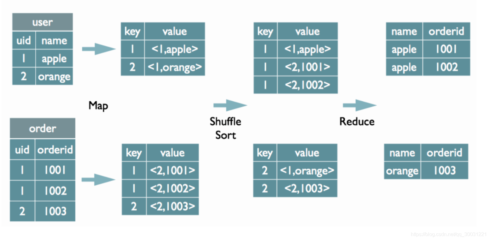

###  Group By的实现原理

~~~Sql
select rank, isonline, count(*) from city group by rank, isonline;
~~~

sql中 group by后面的字段组合(rank 和isonline的组合)作为map的输出key值，利用MapReduce的排序，在reduce阶段保存LastKey区分不同的key。MapReduce的过程如下（当然这里只是说明Reduce端的非Hash聚合过程)

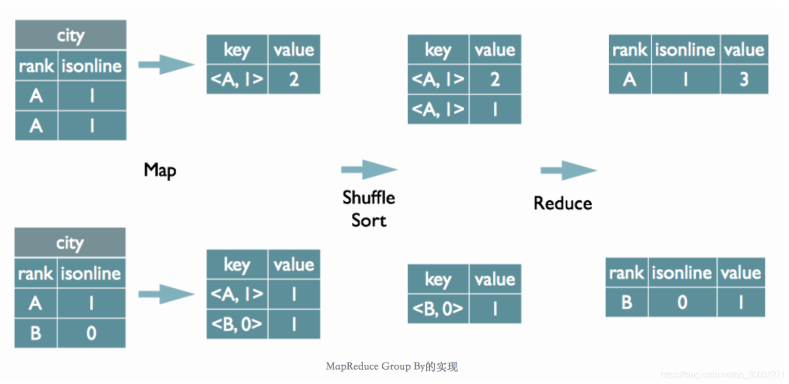

### Distinct的实现原理

~~~sql
 select dealid, count(distinct uid) num from order group by dealid;
~~~


当只有一个distinct字段时，如果不考虑Map阶段的Hash GroupBy，只需要将GroupBy字段和Distinct字段组合为map输出key，利用mapreduce的排序，同时将GroupBy字段作为reduce的key，在reduce阶段保存LastKey即可完成去重

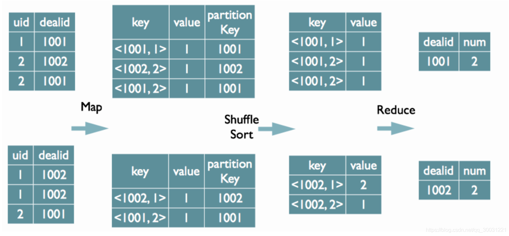

- 如果有多个distinct字段呢，如下面的SQL

~~~sql
 select dealid, count(distinct uid), count(distinct date) from order group by dealid;

~~~

+ 可以对所有的distinct字段编号，每行数据生成n行数据，那么相同字段就会分别排序，这时只需要在reduce阶段记录LastKey即可去重。这种实现方式很好的利用了MapReduce的排序，节省了reduce阶段去重的内存消耗，但是缺点是增加了shuffle的数据量。需要注意的是，在生成reduce value时，除第一个distinct字段所在行需要保留value值，其余distinct数据行value字段均可为空

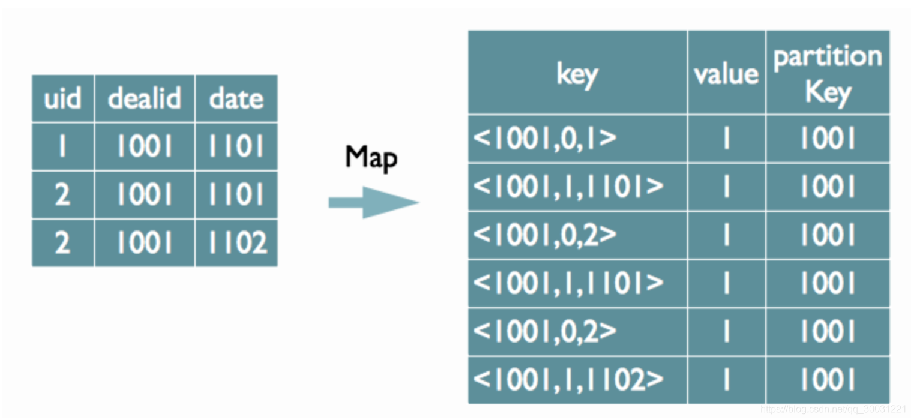

### MapReduce跑得慢的原因？

Mapreduce 程序效率的瓶颈在于两点：

1. 计算机性能
   CPU、内存、磁盘健康、网络
2. I/O 操作优化
   1. 数据倾斜
   2. map和reduce数设置不合理
   3. reduce等待过久
   4. 小文件过多
   5. 大量的不可分块的超大文件
   6. spill次数过多
   7. merge次数过多等

### 什么是数据倾斜

- Hadoop能够进行对海量数据进行批处理的核心，在于它的**分布式思想，也就是多台服务器（节点）组成集群，进行分布式的数据处理**。
- 举例：如果有10亿数据，一台电脑可能要10小时，现在集群有10台，可能1小时就够了，但是有可能大量的数据集中到一台或几台上，要5小时，发生了数据倾斜

### 数据倾斜的表现

1. Mapreduce任务
   1. reduce阶段 卡在99.99%不动
   2. 各种container报错OOM
   3. 读写数据量很大，超过其他正常reduce
2. spark任务
   1. 个别task执行很慢
   2. 单个执行特别久
   3. shuffle出错
   4. sparkstreaming做实时算法使，会有executor出现内存溢出，但是其他的使用率很低

### 发生数据倾斜的原因

+ shuffle是按照key，来进行values的数据的输出、拉取和聚合的，一旦发生shuffle，所有相同key的值就会拉到一个或几个节点上，个别key对应的数据比较多，就容易发生单个节点处理数据量爆增的情况。
+ key分布不均匀
  + 存在大量相同值的数据
  + 存在大量异常值或者空值
+ 业务数据本身的特性
  + 例如某个分公司或某个城市订单量大幅提升几十倍甚至几百倍，对该城市的订单统计聚合时，容易发生数据倾斜。
+ 某些SQL语句本身就有数据倾斜
  + 两个表中关联字段存在大量空值（去除或者加随机数），或是关联字段的数据不统一（方法：把数字类型转为字符串类型，统一大小写）
  + join 一个key集中的小表 （方法：reduce join 改成 map join）
  + group by维度过小 某值的数量过多 （方法：两阶段聚合，放粗粒度）
  + count distinct 某特殊值过多 （方法：用group by）
+ 数据频率倾斜——某一个区域的数据量要远远大于其他区域。
+ 数据大小倾斜——部分记录的大小远远大于平均值。

### 排序选择

+ cluster by: 对同一字段分桶并排序，不能和sort by连用；
+ distribute by + sort by: 分桶，保证同一字段值只存在一个结果文件当中，结合sort by 保证每个reduceTask结果有序；
+ sort by: 单机排序，单个reduce结果有序
+ order by：全局排序，缺陷是只能使用一个reduce


# Yarn 

## 概述

### 什么是Yarn

​		Yarn是一个资源调度平台，负责为运算程序提供服务器运算资源，相当于一个分布式的操作系统平台，而MapReduce等运算程序则相当于运行于操作系统之上的应用程序。

### Yarn 的基本架构

1) **ResourceManager**（RM）：YARN分层结构的本质是ResourceManager。这个实体控制整个集群并管理应用程序向基础计算资源的分配。ResourceManager将各个资源部分（计算、内存、带宽等）精心安排给基础NodeManager（YARN的每节点代理）。ResourceManager还与ApplicationMaster一起分配资源，与NodeManager一起启动和监视它们的基础应用程序。在此上下文中，ApplicationMaster承担了以前的TaskTracker的一些角色；ResourceManager承担了JobTracker 的角色。总的来说，RM有以下作用：
   1) 处理客户端请求
   2) 启动或监控ApplicationMaster
   3) 监控NodeManager
   4) 资源的分配与调度


2) **ApplicationMaster**（AM）：ApplicationMaster管理在YARN内运行的每个应用程序实例。ApplicationMaster负责协调来自ResourceManager的资源，并通过NodeManager监视容器的执行和资源使用（CPU、内存等的资源分配）。请注意，尽管目前的资源更加传统（CPU 核心、内存），但未来会带来基于手头任务的新资源类型（比如图形处理单元或专用处理设备）。从YARN角度讲，ApplicationMaster是用户代码，因此存在潜在的安全问题。YARN假设ApplicationMaster存在错误或者甚至是恶意的，因此将它们当作无特权的代码对待。总的来说,AM有以下作用
   1) 负责数据的切分	
   2) 为应用程序申请资源并分配给内部的任务
   3) 任务的监控与容错


3) **NodeManager**（NM）：NodeManager管理YARN集群中的每个节点。NodeManager提供针对集群中每个节点的服务，从监督对一个容器的终生管理到监视资源和跟踪节点健康。MRv1通过插槽管理Map 和Reduce任务的执行，而NodeManager管理抽象容器，这些容器代表着可供一个特定应用程序使用的针对每个节点的资源。总的来说，NM有以下作用：
   1) 管理单个节点上的资源
   2) 处理来自ResourceManager的命令
   3) 处理来自ApplicationMaster的命令


4) **Container：**是YARN中的资源抽象，它封装了某个节点上的多维度资源，如内存、CPU、磁盘、网络等，当AM向RM申请资源时，RM为AM返回的资源便是用Container表示的。YARN会为每个任务分配一个Container，且该任务只能使用该Container中描述的资源。总的来说，Container有以下作用:
   1) 对任务运行环境进行抽象
   2) 封装CPU、内存等多维度的资源以及环境变量、启动命令等任务运行相关的信息

### 调度器，调度器分类

​		关于Yarn的知识点考察实际上在面试中占的比重并的不多，像面试中常问的无非就Yarn的Job执行流程或者调度器的分类，答案往往也都差不多，以下回答做个参考：

Hadoop调度器主要分为三类：

- FIFO Scheduler：先进先出调度器：优先提交的，优先执行，后面提交的等待【生产环境不会使用】
- Capacity Scheduler：容量调度器：允许看创建多个任务对列，多个任务对列可以同时执行。但是一个队列内部还是先进先出。【Hadoop2.7.2默认的调度器】
- Fair Scheduler：公平调度器：第一个程序在启动时可以占用其他队列的资源（100%占用），当其他队列有任务提交时，占用资源的队列需要将资源还给该任务。还资源的时候，效率比较慢。【CDH版本的yarn调度器默认】


## 工作机制


### Yarn 工作机制

​		这里一共也有两个版本，分别是详细版和简略版，具体使用哪个还是分不同的场合。正常情况下，将简略版的回答清楚了就很OK，详细版的最多做个内容的补充：

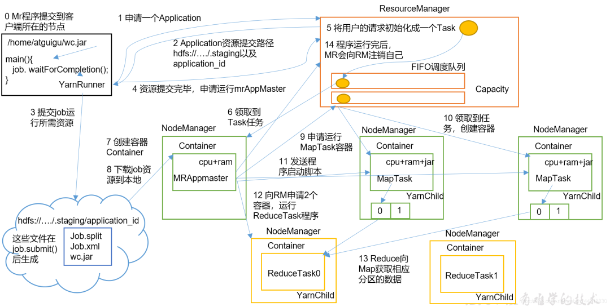

- 简略版

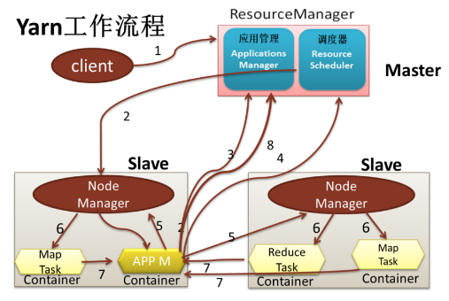

1. MR 程序提交到客户端所在的节点。
2. YarnRunner 向 ResourceManager 申请一个 Application。
3. RM 将该应用程序的资源路径返回给 YarnRunner。
4. 该程序将运行所需资源提交到 HDFS 上。
5. 程序资源提交完毕后，申请运行 mrAppMaster。
6. RM 将用户的请求初始化成一个 Task。
7. 其中一个 NodeManager 领取到 Task 任务。
8. 该 NodeManager 创建容器 Container，并产生 MRAppmaster。
9. Container 从 HDFS 上拷贝资源到本地。
10. MRAppmaster 向 RM 申请运行 MapTask 资源。
11. RM 将运行 MapTask 任务分配给另外两个 NodeManager，另两个 NodeManager 分别领取任务并创建容器。
12. MR 向两个接收到任务的 NodeManager 发送程序启动脚本，这两个 NodeManager分别启动 MapTask，MapTask 对数据分区排序。
13. MrAppMaster 等待所有 MapTask 运行完毕后，向 RM 申请容器，运行 ReduceTask。
14. ReduceTask 向 MapTask 获取相应分区的数据。
15. 程序运行完毕后，MR 会向 RM 申请注销自己

### 作业提交全过程

1. 作业提交

   + 第 1 步：Client 调用 job.waitForCompletion 方法，向整个集群提交 MapReduce 作业。
   + 第 2 步：Client 向 RM 申请一个作业 id。
   + 第 3 步：RM 给 Client 返回该 job 资源的提交路径和作业 id。
   + 第 4 步：Client 提交 jar 包、切片信息和配置文件到指定的资源提交路径。
   + 第 5 步：Client 提交完资源后，向 RM 申请运行 MrAppMaster。

2. 作业初始化

   + 第 6 步：当 RM 收到 Client 的请求后，将该 job 添加到容量调度器中。
   + 第 7 步：某一个空闲的 NM 领取到该 Job。
   + 第 8 步：该 NM 创建 Container，并产生 MRAppmaster。
   + 第 9 步：下载 Client 提交的资源到本地。

3. 任务分配

   + 第 10 步：MrAppMaster 向 RM 申请运行多个 MapTask 任务资源。
   + 第 11 步：RM 将运行 MapTask 任务分配给另外两个 NodeManager，另两个 NodeManager分别领取任务并创建容器。

4. 任务运行

   + 第 12 步：MR 向两个接收到任务的 NodeManager 发送程序启动脚本，这两个NodeManager 分别启动 MapTask，MapTask 对数据分区排序。
   + 第13步：MrAppMaster等待所有MapTask运行完毕后，向RM申请容器，运行ReduceTask。
   + 第 14 步：ReduceTask 向 MapTask 获取相应分区的数据。
   + 第 15 步：程序运行完毕后，MR 会向 RM 申请注销自己。

5. 进度和状态更新：

   YARN 中的任务将其进度和状态(包括 counter)返回给应用管理器, 客户端每秒(通过mapreduce.client.progressmonitor.pollinterval 设置)向应用管理器请求进度更新, 展示给用户。

6. 作业完成

   除了向应用管理器请求作业进度外, 客户端每 5 秒都会通过调用 waitForCompletion()来检查作业是否完成。时间间隔可以通过 mapreduce.client.completion.pollinterval 来设置。作业完成之后, 应用管理器和 Container 会清理工作状态。作业的信息会被作业历史服务器存储以备之后用户核查。

###  Yarn调度器和调度算法

目前，Hadoop 作业调度器主要有三种：FIFO、容量（Capacity Scheduler）和公平（Fair Scheduler）。Apache Hadoop3.1.3 默认的**资源调度器是 Capacity Scheduler。**

+ 先进先出调度器（FIFO）：单队列，根据提交作业的先后顺序，先来先服务。
  + 优点：简单易懂；
  + 缺点：不支持多队列，生产环境很少使用；
+ 容量调度器：是 Yahoo 开发的多用户调度器。
  + 多队列：每个队列可配置一定的资源量，每个队列采用FIFO调度策略。
  + 容量保证：管理员可为每个队列设置资源最低保证和资源使用上限
  + 灵活性：如果一个队列中的资源有剩余，可以暂时共享给那些需要资源的队列，而一旦该队列有新的应用程序提交，则其他队列借调的资源会归还给该队列。
  + 多租户：
    + 支持多用户共享集群和多应用程序同时运行。
    + 为了防止同一个用户的作业独占队列中的资源，该调度器会对同一用户提交的作业所占资源量进行限定
+ 公平调度器（Fair Scheduler）
  + 公平调度器设计目标是：在时间尺度上，所有作业获得公平的资源。某一时刻一个作业应获资源和实际获取资源的差距叫“缺额”
  + 调度器会优先为缺额大的作业分配资源


# HDFS操作

## Shell 相关操作

上传命令

~~~bash
# 建立sanguo文件夹
hadoop fs -mkdir /sanguo

# 上传类
echo 123>>123.txt
# 上传本地文件到HDFS -- 会删除本地文件 
hadoop fs -moveFromLocal ./123.txt /sanguo
# 拷贝本地的文件到HDFS -- 不会删除本地文件
hadoop fs -copyFromLocal ./123.txt /sanguo 
# put 等同于 cpoyFromLocal
# appendToFile  --HDFS仅支持追加，并不支持随机的修改
vim liubei.txt
hadoop fs -appendToFile 123.txt /sanguo/123.txt

~~~

下载命令

~~~bash
hadoop fs -copyToLocal /sanguo/123.txt 12345.txt
hadoop fs -get /sanguo/123.txt ./1234.txt
~~~

直接操作HDFS

~~~bash
# 查看文件夹
hadoop fs -ls /sanguo
hadoop fs -cat /sanguo/123.txt

# 修改权限
hadoop fs -chmod 666 /sanguo/123.txt
# 修改用户组
hadoop fs -chmod krest:krest /sanguo/123.txt

# 拷贝
hadoop fs -cp /sanguo/123.txt /jinguo
# 移动
hadoop fs -mv /sanguo/123.txt /jinguo
# 显示文件末尾1kb的内容
hadoop fs -tail /sanguo/123.txt
# 删除
hadoop fs -rm /sanguo/123.txt
# 删除文件夹及其子文件内容
hadoop fs -rm -r /sanguo

# 统计文件夹的大小信息
hadoop fs -du -s -h /sanguo
# 统计每个文件的大小
hadoop fs -du -s /sanguo
~~~


## HDFS API

### 概述

对文件夹的新增删除

对于文件的新增、删除、移动、追加

### 示例

可以使用 Windows 客户端操作HDFS 文件，

Idea 编写代码操作 HDFS

注意：需要提前配置好windows的hdfs环境才可以

**导入依赖**

~~~xml
 <dependencies>
        <dependency>
            <groupId>org.apache.hadoop</groupId>
            <artifactId>hadoop-client</artifactId>
            <version>3.1.3</version>
        </dependency>
        <dependency>
            <groupId>junit</groupId>
            <artifactId>junit</artifactId>
            <scope>test</scope>
        </dependency>
        <dependency>
            <groupId>org.slf4j</groupId>
            <artifactId>slf4j-log4j12</artifactId>
        </dependency>
    </dependencies>
~~~

**测试代码**

~~~java
package com.krest.hdfs;

import org.apache.hadoop.conf.Configuration;
import org.apache.hadoop.fs.FileSystem;
import org.apache.hadoop.fs.Path;
import org.junit.After;
import org.junit.Before;
import org.junit.Test;

import java.io.IOException;
import java.net.URI;
import java.net.URISyntaxException;


public class HDFSClient {
	
    private FileSystem fs;

    @Before
    public void init() throws URISyntaxException, IOException, InterruptedException {
        URI uri = new URI("hdfs://hadoop102:8020");
        Configuration config = new Configuration();
        String user = "krest";
        fs = FileSystem.get(uri, config, user);

    }

    @After
    public void close() throws IOException {
        fs.close();
    }

    @Test
    public void mkdir() throws URISyntaxException, IOException, InterruptedException {
        fs.mkdirs(new Path("xityou/huaguoshan"));
    }
}
~~~

# MapReduce实例

## 编码规范

### Mapper 阶段

1. 用户自定义的Mapper要继承自己的父类


2. Mapper的输入数据是KV对的形式（KV的类型可自定义）

> p.s. K是这一行的偏移量，V是这一行的内容。

3. Mapper中的业务逻辑写在map()方法中

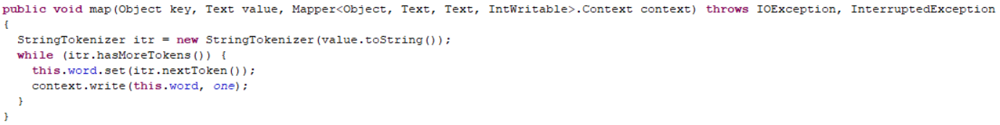

4. Mapper的输出数据是KV对的形式（KV的类型可自定义）
5. map()方法（MapTask进程）对每一个<K,V>调用一次

### Reducer阶段

1. 用户自定义的Reducer要继承自己的父类


2. Reducer的输入数据类型对应Mapper的输出数据类型，也是KV
3. Reducer的业务逻辑写在reduce()方法中

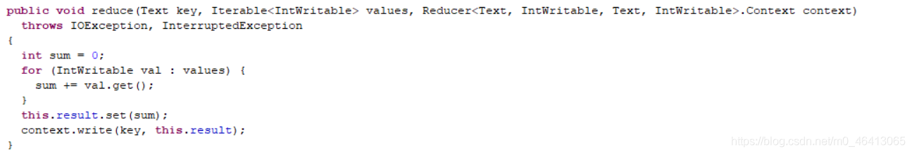

4. ReduceTask进程对每一组相同k的<k,v>组调用一次reduce()方法

### Driver阶段

相当于YARN集群的客户端，用于提交我们整个程序到YARN集群，提交的是封装了MapReduce程序相关运行参数的job对象

## WordCount 实操

### 需求

1. 在给定的文本文件中统计输出每一个单词出现的总次数

### 流程分析

按照 MapReduce 编程规范，分别编写 Mapper，Reducer，Driver。流程分析

1. 输入文本数据

2. Mapper阶段

   1. 将我们的问题内容转化为String

   2. 根据空格将这一行切分为一个个的单词

   3. 将单词输出为KV的形式

      ~~~java
      如 
      atgugui,1
      itheima,1
      ~~~

3. Reducer阶段

   1. 汇总各个Key的个数
   2. 输出该Key的总次数

4. Driver阶段

   1. 获取配置信息，获取Job对象实例
   2. 制定本程序的Jar包所在的本地路径
   3. 关联Mapper、Reduce业务类
   4. 指定Mapper输出数据的KV类型
   5. 指定最终输出的数据的KV类型
   6. 指定Job的输入原始文件所在目录
   7. 指定Job的输出结果所在目录
   8. 提交作业

### 核心代码

#### 创建Maven工程

#### 导入相关依赖

~~~xml
<properties>
        <project.build.sourceEncoding>UTF-8</project.build.sourceEncoding>
        <project.reporting.outputEncoding>UTF-8</project.reporting.outputEncoding>
        <java.version>1.8</java.version>
        <maven.compiler.source>1.8</maven.compiler.source>
        <maven.compiler.target>1.8</maven.compiler.target>
        <encoding>UTF-8</encoding>
</properties>

<dependencies> 
    <dependency> 
        <groupId>org.apache.hadoop</groupId> 
        <artifactId>hadoop-client</artifactId> 
        <version>3.1.3</version> 
    </dependency> 
    <dependency> 
        <groupId>junit</groupId> 
        <artifactId>junit</artifactId> 
        <version>4.12</version> 
    </dependency> 
    <dependency> 
        <groupId>org.slf4j</groupId> 
        <artifactId>slf4j-log4j12</artifactId> 
        <version>1.7.30</version> 
    </dependency> 
</dependencies> 

~~~

#### 编写 Mapper 类

~~~java
package com.leokadia.mapreduce.wordcount;
/**
 * @author sa
 * @create 2021-05-05 10:46
 */
import org.apache.hadoop.io.IntWritable;
import org.apache.hadoop.io.LongWritable;
import org.apache.hadoop.io.Text;
import org.apache.hadoop.mapreduce.Mapper;
import java.io.IOException;

/**
 * KEYIN, map阶段输入的key的类型：LongWritable
 * VALUEIN,map阶段输入value类型：Text
 * KEYOUT,map阶段输出的Key类型：Text
 * VALUEOUT,map阶段输出的value类型：IntWritable
 */
public class WordCountMapper extends Mapper<LongWritable, Text, Text, IntWritable> {
    private Text outK = new Text();
    private IntWritable outV = new IntWritable(1);  //map阶段不进行聚合

    @Override
    protected void map(LongWritable key, Text value, Context context) throws IOException, InterruptedException {

        // 1 获取一行
        // xxxxxx xxxxxx
        String line = value.toString();

        // 2 切割(取决于原始数据的中间分隔符)
        String[] words = line.split(" ");

        // 3 循环写出
        for (String word : words) {
            // 封装outk
            outK.set(word);
            // 写出
            context.write(outK, outV);
        }
    }
}

~~~

#### 编写 Reducer 类

~~~java
package com.leokadia.mapreduce.wordcount;

/**
 * @author sa
 * @create 2021-05-05 10:47
 */
import org.apache.hadoop.io.IntWritable;
import org.apache.hadoop.io.Text;
import org.apache.hadoop.mapreduce.Reducer;

import java.io.IOException;

/**
 * KEYIN, reduce阶段输入的key的类型：Text
 * VALUEIN,reduce阶段输入value类型：IntWritable
 * KEYOUT,reduce阶段输出的Key类型：Text
 * VALUEOUT,reduce阶段输出的value类型：IntWritable
 */
public class WordCountReducer extends Reducer<Text, IntWritable,Text,IntWritable> {
    private IntWritable outV = new IntWritable();

    @Override
    protected void reduce(Text key, Iterable<IntWritable> values, Context context) throws IOException, InterruptedException {

        int sum = 0;
        // xxxxxxx xxxxxxx ->(xxxxxxx,1),(xxxxxxx,1)
        // xxxxxxx, (1,1)
        // 将values进行累加
        for (IntWritable value : values) {
            sum += value.get();
        }

        outV.set(sum);
        // 写出
        context.write(key,outV);
    }
}

~~~

#### 编写 Driver 驱动类

~~~java
package com.leokadia.mapreduce.wordcount;
/**
 * @author sa
 * @create 2021-05-05 10:47
 */
import org.apache.hadoop.conf.Configuration;
import org.apache.hadoop.fs.Path;
import org.apache.hadoop.io.IntWritable;
import org.apache.hadoop.io.Text;
import org.apache.hadoop.mapreduce.Job;
import org.apache.hadoop.mapreduce.lib.input.FileInputFormat;
import org.apache.hadoop.mapreduce.lib.output.FileOutputFormat;

import java.io.IOException;

public class WordCountDriver {

    public static void main(String[] args) throws IOException, ClassNotFoundException, InterruptedException {

        // 1 获取job
        Configuration conf = new Configuration();
        Job job = Job.getInstance(conf);

        // 2 设置jar包路径
        job.setJarByClass(WordCountDriver.class);

        // 3 关联mapper和reducer
        job.setMapperClass(WordCountMapper.class);
        job.setReducerClass(WordCountReducer.class);

        // 4 设置map输出的kv类型
        job.setMapOutputKeyClass(Text.class);
        job.setMapOutputValueClass(IntWritable.class);

        // 5 设置最终输出的kV类型
        job.setOutputKeyClass(Text.class);
        job.setOutputValueClass(IntWritable.class);

        // 6 设置输入路径和输出路径
        FileInputFormat.setInputPaths(job, new Path("D:\\input\\inputword"));
        FileOutputFormat.setOutputPath(job, new Path("D:\\hadoop\\output888"));

        // 7 提交job
        boolean result = job.waitForCompletion(true);

        System.exit(result ? 0 : 1);
    }
}

~~~

#### 本地测试

#### 集群测试


## 序列化

### 程序示例

#### 需求

统计每个手机号耗费的总上行流量、下行流量、总流量

#### 流程分析

1. 输入数据格式

~~~csv
id 手机号码 网络ip  上行流量 下行流量 网络状态码
7 XXXXXX 192.168.1.1 1116 964 200
~~~

2. 输出数据格式

~~~csv
手机号码 上行流量 下行流量 总流量
xxxxxx	1116 	954	   2070
~~~

3. Map阶段
   1. 读取一行数据，切分字段
   2. 抽取数据
   3. 以手机号为Key，bean对象为value输出
   4. Bean对象如果想要被传输，就必须实现序列化
4. Reduce阶段
   1. 累加上行流量与下行流量得到总流量

#### 核心代码

##### 创建Bean对象

~~~java
package com.atguigu.mapreduce.writable;

import org.apache.hadoop.io.Writable;
import java.io.DataInput;
import java.io.DataOutput;
import java.io.IOException;

//1 继承Writable接口
public class FlowBean implements Writable {

    private long upFlow; //上行流量
    private long downFlow; //下行流量
    private long sumFlow; //总流量

    //2 提供无参构造
    public FlowBean() {
    }

    //3 提供三个参数的getter和setter方法
    public long getUpFlow() {
        return upFlow;
    }

    public void setUpFlow(long upFlow) {
        this.upFlow = upFlow;
    }

    public long getDownFlow() {
        return downFlow;
    }

    public void setDownFlow(long downFlow) {
        this.downFlow = downFlow;
    }

    public long getSumFlow() {
        return sumFlow;
    }

    public void setSumFlow(long sumFlow) {
        this.sumFlow = sumFlow;
    }

    public void setSumFlow() {
        this.sumFlow = this.upFlow + this.downFlow;
    }

    //4 实现序列化和反序列化方法,注意顺序一定要保持一致
    @Override
    public void write(DataOutput dataOutput) throws IOException {
        dataOutput.writeLong(upFlow);
        dataOutput.writeLong(downFlow);
        dataOutput.writeLong(sumFlow);
    }

    @Override
    public void readFields(DataInput dataInput) throws IOException {
        this.upFlow = dataInput.readLong();
        this.downFlow = dataInput.readLong();
        this.sumFlow = dataInput.readLong();
    }

    //5 重写ToString
    @Override
    public String toString() {
        return upFlow + "\t" + downFlow + "\t" + sumFlow;
    }
}

~~~

##### 编写Mapper类

~~~java
package com.atguigu.mapreduce.writable;

import org.apache.hadoop.io.LongWritable;
import org.apache.hadoop.io.Text;
import org.apache.hadoop.mapreduce.Mapper;
import java.io.IOException;

public class FlowMapper extends Mapper<LongWritable, Text, Text, FlowBean> {
    private Text outK = new Text();
    private FlowBean outV = new FlowBean();

    @Override
    protected void map(LongWritable key, Text value, Context context) throws IOException, InterruptedException {

        //1 获取一行数据,转成字符串
        String line = value.toString();

        //2 切割数据
        String[] split = line.split("\t");

        //3 抓取我们需要的数据:手机号,上行流量,下行流量
        String phone = split[1];
        String up = split[split.length - 3];
        String down = split[split.length - 2];

        //4 封装outK outV
        outK.set(phone);
        outV.setUpFlow(Long.parseLong(up));
        outV.setDownFlow(Long.parseLong(down));
        outV.setSumFlow();

        //5 写出outK outV
        context.write(outK, outV);
    }
}

~~~


##### 编写Reducer类

~~~java
package com.atguigu.mapreduce.writable;

import org.apache.hadoop.io.Text;
import org.apache.hadoop.mapreduce.Reducer;
import java.io.IOException;

public class FlowReducer extends Reducer<Text, FlowBean, Text, FlowBean> {
    private FlowBean outV = new FlowBean();
    @Override
    protected void reduce(Text key, Iterable<FlowBean> values, Context context) throws IOException, InterruptedException {

        long totalUp = 0;
        long totalDown = 0;

        //1 遍历values,将其中的上行流量,下行流量分别累加
        for (FlowBean flowBean : values) {
            totalUp += flowBean.getUpFlow();
            totalDown += flowBean.getDownFlow();
        }

        //2 封装outKV
        outV.setUpFlow(totalUp);
        outV.setDownFlow(totalDown);
        outV.setSumFlow();

        //3 写出outK outV
        context.write(key,outV);
    }
}

~~~

##### 编写Driver驱动类

~~~java
package com.atguigu.mapreduce.writable;

import java.io.IOException;
import org.apache.hadoop.conf.Configuration;
import org.apache.hadoop.fs.Path;
import org.apache.hadoop.io.Text;
import org.apache.hadoop.mapreduce.Job;
import org.apache.hadoop.mapreduce.lib.input.FileInputFormat;
import org.apache.hadoop.mapreduce.lib.output.FileOutputFormat;

public class FlowDriver {

  public static void main(String[] args)
    throws IOException, ClassNotFoundException, InterruptedException {
    //1 获取job对象
    Configuration conf = new Configuration();
    Job job = Job.getInstance(conf);

    //2 关联本Driver类
    job.setJarByClass(FlowDriver.class);

    //3 关联Mapper和Reducer
    job.setMapperClass(FlowMapper.class);
    job.setReducerClass(FlowReducer.class);

    //4 设置Map端输出KV类型
    job.setMapOutputKeyClass(Text.class);
    job.setMapOutputValueClass(FlowBean.class);

    //5 设置程序最终输出的KV类型
    job.setOutputKeyClass(Text.class);
    job.setOutputValueClass(FlowBean.class);

    //6 设置程序的输入输出路径
    FileInputFormat.setInputPaths(job, new Path("D:\\inputflow"));
    FileOutputFormat.setOutputPath(job, new Path("D:\\flowoutput"));

    //7 提交Job
    boolean b = job.waitForCompletion(true);
    System.exit(b ? 0 : 1);
  }
}

~~~

