# 数据仓库基本理论

## 概论

+ 用于存储、分析、生成报告的数据系统
+ 数据仓库的目的是构建面向分析的集成化数据环境，分析结果为企业提供决策支持
+ 数据仓库不生产数据，它产生的结果供给各个部门进行使用

## 特征

+ 面向主题
+ 集成性：数据很多
+ 非易变性：数据不易发生改变
+ 时变性：随时间而增加

## OLTP、OLAP

OLTP：操作性处理，联机事务处理，MySql，MongoDB等

OLAP：联机分析系统，数据仓库就是一种

## 数据集市

它是一个部门的子集，也就是一个小型的数据仓库

## 分层架构

+ 数据仓库不产生数据，也不消费数据
+ 每个企业根据自己的业务需求可以分成不同的层次：**操作数据层、数据仓库层、数据应用层**
+ ETL：从各种数据源获取数据，抽取过来，放在缓存区，然后将转化为结构化的数据加载到数据仓库中
+ ELT：先抽取数据，然后转存，最后在进行转化

# Hive概述

## 什么是Hive

Hive是基于Hadoop的一个数据仓库工具，可以将结构化的数据文件映射为一张表，并提供类SQL查询功能。本质是：将HQL转化成MapReduce程序。

这样突然发现Hive没啥用，不过是套壳Hadoop罢了。其实不然，Hive的最大的魅力在于用户专注于编写HQL，Hive帮您转换成为MapReduce程序完成对数据的分析。

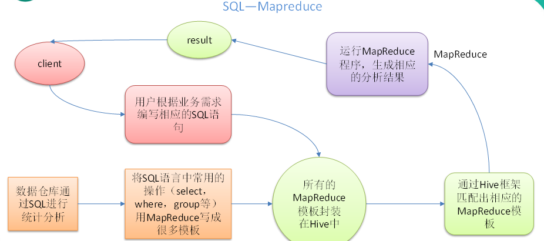

1. Hive处理的数据存储在HDFS
2. Hive分析数据底层的实现是MapReduce
3. 执行程序运行在Yarn上

## 优缺点

### 优点

1. 操作接口采用类SQL语法，提供快速开发的能力（简单、容易上手）。
2. 避免了去写MapReduce，减少开发人员的学习成本。
3. Hive的执行延迟比较高，因此Hive常用于数据分析，对实时性要求不高的场合。
4. Hive优势在于处理大数据，对于处理小数据没有优势，因为Hive的执行延迟比较高。
5. Hive支持用户自定义函数，用户可以根据自己的需求来实现自己的函数。

### 缺点

1. Hive的HQL表达能力有限
   1. 迭代式算法无法表达
   2. 数据挖掘方面不擅长
2. Hive的效率比较低
   1. Hive自动生成的MapReduce作业，通常情况下不够智能化
   2. Hive调优比较困难，粒度较粗

## 架构原理

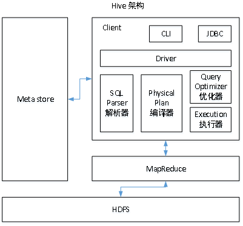

1. 用户接口：Client

   包括 CLI、JDBC/ODBC、WebGUI。其中，CLI(command line interface)为shell命令行；Hive中的Thrift服务器允许外部客户端通过网络与Hive进行交互，类似于JDBC或ODBC协议。WebGUI是通过浏览器访问Hive。

2. 元数据：Metastore

   元数据包括：表名、表所属的数据库（默认是default）、表的拥有者、列/分区字段、表的类型（是否是外部表）、表的数据所在目录等；

​		默认存储在自带的derby数据库中，推荐使用MySQL存储Metastore

3. Hadoop

   使用HDFS进行存储，使用MapReduce进行计算。

4. 驱动器：Driver
   1. 解析器（SQL Parser）：将SQL字符串转换成抽象语法树AST，这一步一般都用第三方工具库完成，比如antlr；对AST进行语法分析，比如表是否存在、字段是否存在、SQL语义是否有误。
   2. 编译器（Physical Plan）：将AST编译生成逻辑执行计划。
   3. 优化器（Query Optimizer）：对逻辑执行计划进行优化。
   4. 执行器（Execution）：把逻辑执行计划转换成可以运行的物理计划。对于Hive来说，就是MR/Spark。

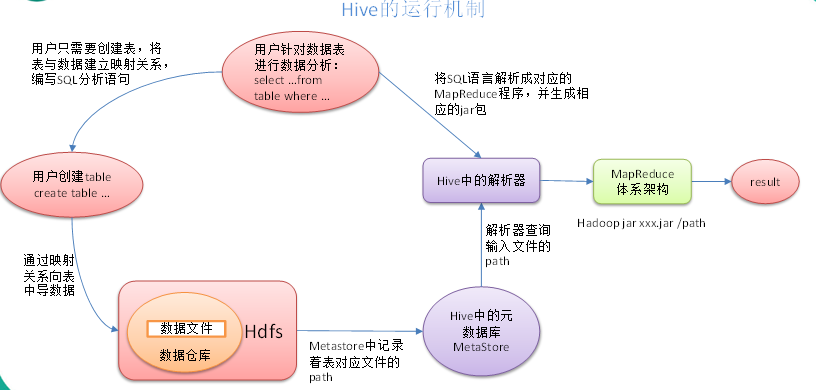


​		Hive通过给用户提供的一系列交互接口，接收到用户的指令(SQL)，使用自己的Driver，结合元数据(MetaStore)，将这些指令翻译成MapReduce，提交到Hadoop中执行，最后，将执行返回的结果输出到用户交互接口。


# Hive数据类型

## 基本数据类型

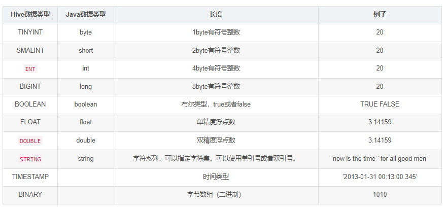
红标为常用的数据类型；

对于Hive的String类型相当于数据库的varchar类型，该类型是一个可变的字符串，不过它不能声明其中最多能存储多少个字符。


## 集合数据类型

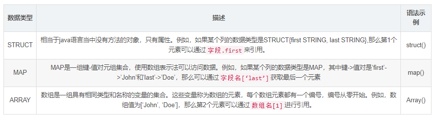

## 类型转化

可以使用CAST操作显示进行数据类型转换

例如CAST(‘1’ AS INT)将把字符串’1’ 转换成整数1；如果强制类型转换失败，如执行CAST(‘X’ AS INT)，表达式返回空值 NULL。


# DDL数据定义

## 创建数据库

创建一个数据库，数据库在HDFS上的默认存储路径是/opt/hive/warehouse/*.db

~~~bash
create database hivetest;
~~~


避免要创建的数据库已经存在错误，增加if not exists判断。（标准写法）

~~~bash
create database if not exists hivetest;
~~~

创建一个数据库，指定数据库在HDFS上存放的位置

~~~bash
create database if not exists hivetest location 'hdfs路径';
~~~


## 查询数据库

显示数据库

~~~bash
show databases;
~~~

避免要创建的数据库已经存在错误，增加if not exists判断。`（标准写法）`

```sql
create database if not exists hivetest;
```

 过滤显示查询的数据库

~~~bash
show databases like 'hivetest*';
~~~

查看数据库详情

~~~bash
desc database hivetest;
~~~

切换当前数据库

~~~bash
use 目标数据库名称;
~~~


## 删除数据库

删除空数据库

~~~bash
drop database 库名;
~~~

如果删除的数据库不存在，最好采用 if exists判断数据库是否存在

~~~bash
drop database if exists 库名;
~~~

如果数据库不为空，可以采用cascade命令，强制删除

~~~bash
drop database 库名 cascade;
~~~


## 创建表

建表语法

~~~bash
CREATE [EXTERNAL] TABLE [IF NOT EXISTS] table_name 
[(col_name data_type [COMMENT col_comment], ...)] 
[COMMENT table_comment] 
[PARTITIONED BY (col_name data_type [COMMENT col_comment], ...)] 
[CLUSTERED BY (col_name, col_name, ...) 
[SORTED BY (col_name [ASC|DESC], ...)] INTO num_buckets BUCKETS] 
[ROW FORMAT row_format] 
[STORED AS file_format] 
[LOCATION hdfs_path]
~~~


字段解释说明

1. CREATE TABLE 创建一个指定名字的表。如果相同名字的表已经存在，则抛出异常；用户可以用 IF NOT EXISTS 选项来忽略这个异常。
2. EXTERNAL关键字可以让用户创建一个外部表，在建表的同时指定一个指向实际数据的路径（LOCATION），Hive创建内部表时，会将数据移动到数据仓库指向的路径；若创建外部表，仅记录数据所在的路径，不对数据的位置做任何改变。在删除表的时候，内部表的元数据和数据会被一起删除，而外部表只删除元数据，不删除数据。
3. COMMENT：为表和列添加注释。
4. PARTITIONED BY创建分区表
5. CLUSTERED BY创建分桶表
6. SORTED BY不常用
7. ROW FORMAT

DELIMITED [FIELDS TERMINATED BY char] [COLLECTION ITEMS TERMINATED BY char]

 [MAP KEYS TERMINATED BY char] [LINES TERMINATED BY char]

| SERDE serde_name [WITH SERDEPROPERTIES (property_name=property_value, property_name=property_value, …)]

用户在建表的时候可以自定义SerDe或者使用自带的SerDe。如果没有指定ROW FORMAT 或者ROW FORMAT DELIMITED，将会使用自带的SerDe。在建表的时候，用户还需要为表指定列，用户在指定表的列的同时也会指定自定义的SerDe，Hive通过SerDe确定表的具体的列的数据。

SerDe是Serialize/Deserilize的简称，目的是用于序列化和反序列化。

8. STORED AS指定存储文件类型

常用的存储文件类型：SEQUENCEFILE（二进制序列文件）、TEXTFILE（文本）、RCFILE（列式存储格式文件）

如果文件数据是纯文本，可以使用STORED AS TEXTFILE。如果数据需要压缩，使用 STORED AS SEQUENCEFILE。

9. LOCATION ：指定表在HDFS上的存储位置。

10. LIKE允许用户复制现有的表结构，但是不复制数据。

### 内部表

​		默认创建的表都是所谓的管理表，有时也被称为内部表。因为这种表，**Hive会（或多或少地）控制着数据的生命周期**。Hive默认情况下会将这些表的数据存储在由配置项hive.metastore.warehouse.dir(例如，/opt/hive/warehouse)所定义的目录的子目录下。 当我们删除一个管理表时，Hive也会删除这个表中数据。管理表不适合和其他工具共享数据。

普通创建表，通过制表符分割字段

~~~sql
create table if not exists student2(id int, name string) 
        row format delimited fields terminated by '\t';
~~~

**复杂分割字段**

~~~sql
create table t_hot_hero_skin_price(
    id int,
    name string,
    win_rate int,
    skin_price map < string,
    int >
) row format delimited fields terminated by ',' --字段之间分隔符
collection items terminated by '-' --集合元素之间分隔符
map keys terminated by ':'; --集合元素kv之间分隔符;
~~~

**默认分割符字段**

~~~sql
create table t_team_ace_player(
    id int,
    team_name string,
    ace_player_name string
);
--没有指定row format语句 此时采用的是默认的\001作为字段的分隔符
~~~

根据查询结果创建表（查询的结果会添加到新创建的表中）

~~~Sql
create table if not exists student3 as select id, name from student;
~~~


根据已经存在的表结构创建表

~~~Sql
create table if not exists student4 like student;
~~~


查询表的类型

~~~sql
desc formatted student2;
~~~


### 外部表

**因为表是外部表，所以Hive并非认为其完全拥有这份数据。删除该表并不会删除掉这份数据，不过描述表的元数据信息会被删除掉。**

管理表和外部表的使用场景
每天将收集到的网站日志定期流入HDFS文本文件。在外部表（原始日志表）的基础上做大量的统计分析，用到的中间表、结果表使用内部表存储，数据通过SELECT+INSERT进入内部表。

案例详解
分别创建employee外部表，并向表中导入数据。

~~~bash
Michael|Montreal,Toronto|Male,30|DB:80|Product:DeveloperLead
Will|Montreal|Male,35|Perl:85|Product:Lead,Test:Lead
Shelley|New York|Female,27|Python:80|Test:Lead,COE:Architect
Lucy|Vancouver|Female,57|Sales:89|Sales:Lead
~~~

建表语句

~~~SQL
--默认情况下 创建的表就是内部表
create table student(
     num int,
     name string,
     sex string,
     age int,
     dept string)
row format delimited
fields terminated by ',';
~~~


创建员工表

~~~sql
create external table if not exists employee(
    name string,
    address array < string >,
    personalInfo array < string >,
    technol map < string,int >,
    jobs map < string,string >
) 
row format delimited fields terminated by '|' 
collection items terminated by ',' 
map keys terminated by ':' 
lines terminated by '\n';
~~~


向外部表中导入数据

~~~bash
load data local inpath '/root/employee.txt' into table employee;
~~~


查询结果

~~~sql
select * from employee;
~~~

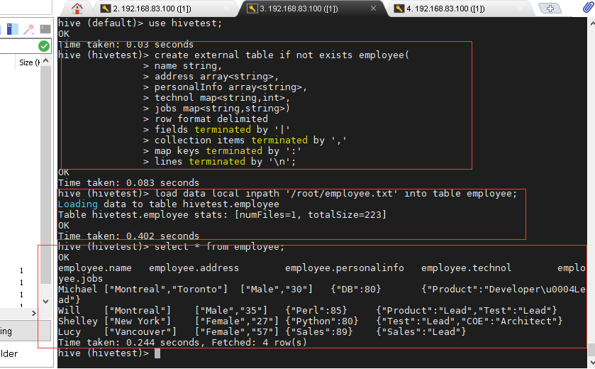


### 管理内部表与外部表的互相转换

修改内部表student2为外部表

~~~sql
alter table student2 set tblproperties('EXTERNAL'='TRUE');
~~~

修改外部表student2为内部表

~~~Sql
alter table student2 set tblproperties('EXTERNAL'='FALSE');
~~~


注意：('EXTERNAL'='TRUE')和('EXTERNAL'='FALSE')为固定写法，区分大小写！

## 分区表（partition）

​		分区表实际上就是对应一个HDFS文件系统上的独立的文件夹，该文件夹下是该分区所有的数据文件。Hive中的分区就是分目录，把一个大的数据集根据业务需要分割成小的数据集。在查询时通过WHERE子句中的表达式选择查询所需要的指定的分区，这样的查询效率会提高很多。

### 静态分区

创建分区表（单分区）

~~~sql
--注意分区表创建语法规则
--分区表建表
create table t_all_hero_part(
   id int,
   name string,
   hp_max int,
   mp_max int,
   attack_max int,
   defense_max int,
   attack_range string,
   role_main string,
   role_assist string
) partitioned by (role string)--注意哦 这里是分区字段
row format delimited
fields terminated by "\t";
~~~

配置静态分区

~~~sql
load data inpath '/user/hive/warehouse/t_all_hero_part/archer.txt' into table t_all_hero_part partition(role='sheshou');
load data inpath '/user/hive/warehouse/t_all_hero_part/assassin.txt' into table t_all_hero_part partition(role='cike');
load data inpath '/user/hive/warehouse/t_all_hero_part/mage.txt' into table t_all_hero_part partition(role='fashi');
load data inpath '/user/hive/warehouse/t_all_hero_part/support.txt' into table t_all_hero_part partition(role='fuzhu');
load data inpath '/user/hive/warehouse/t_all_hero_part/tank.txt' into table t_all_hero_part partition(role='tanke');
load data inpath '/user/hive/warehouse/t_all_hero_part/warrior.txt' into table t_all_hero_part partition(role='zhanshi');
~~~


多重分区

~~~sql
----多重分区表
--单分区表，按省份分区
create table t_user_province (id int, name string,age int) partitioned by (province string);
--双分区表，按省份和市分区
--分区字段之间是一种递进的关系 因此要注意分区字段的顺序 谁在前在后
create table t_user_province_city (id int, name string,age int) partitioned by (province string, city string);
~~~

### 动态分区

~~~sql
--创建一张新的分区表 t_all_hero_part_dynamic
create table t_all_hero_part_dynamic(
    id int,
    name string,
    hp_max int,
    mp_max int,
    attack_max int,
    defense_max int,
    attack_range string,
    role_main string,
    role_assist string
) partitioned by (role string)
row format delimited
fields terminated by "\t";


select * from t_all_hero;

--执行动态分区插入

set hive.exec.dynamic.partition=true;
set hive.exec.dynamic.partition.mode=nonstrict;
-- 设置允许动态分区最大分区数量
Set hive.exec.max.dynamic.partitions=1000;


select * from t_all_hero_part_dynamic;
~~~


### 总结

1. 分区表是一种优化手段，并非必要语法规则，但是分区在企业中的应用会比较多

2. 分区字段不能是表中已经存在的字段，不能重复

3. 分区字段是虚拟字段，其数据并不存储在底层的文件中

4. 分区字段值的确定来自于用户价值收据手动指定（静态分区）或者根据查询结果指定结果位置（动态分区）

5. Hive支持动态分区，也就是在分区的基础上继续分区，划分更细力度

   

### 分区表基本操作

数据

~~~txt
10,ACCOUNTING,NEW YORK
10,ACCOUNTING,NEW YORK
10,ACCOUNTING,NEW YORK
20,RESEARCH,DALLAS
20,RESEARCH,DALLAS
20,RESEARCH,DALLAS
30,SALES,CHICAGO
30,SALES,CHICAGO
~~~

1．引入分区表（需要根据日期对日志进行管理）

~~~bash
/opt/hive/warehouse/log_partition/20170702/20170702.log
/opt/hive/warehouse/log_partition/20170703/20170703.log
/opt/hive/warehouse/log_partition/20170704/20170704.log
~~~

2．创建分区表语 法

~~~sql
create table dept_partition(
deptno int, dname string, loc string
)
partitioned by (month string)
row format delimited fields terminated by ',';
~~~

3．加载数据到分区表中

~~~bash
load data local inpath '/opt/dept.txt' into table default.dept_partition partition(month='201707’);
load data local inpath '/opt/dept.txt' into table default.dept_partition partition(month='201708’);
load data local inpath '/opt/dept.txt' into table default.dept_partition partition(month='201709’);
~~~

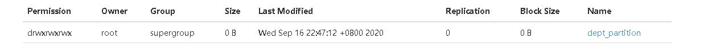

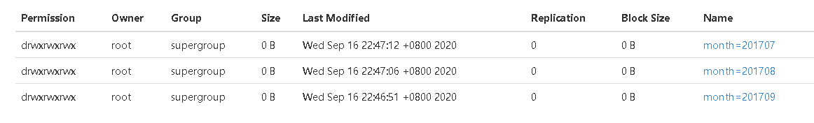

4．查询分区表中数据

单分区查询

~~~sql
select * from dept_partition where month='201709';
~~~

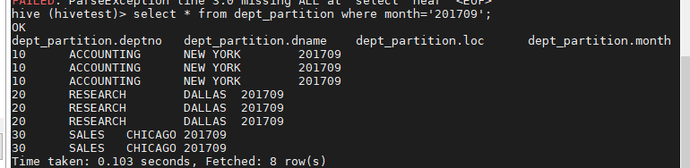


多分区联合查询

~~~sql
select * from dept_partition where month='201709'
union
select * from dept_partition where month='201708'
union
select * from dept_partition where month='201707';
~~~


注意

> Hive 1.2.0之前的版本仅支持UNION ALL，其中重复的行不会被删除。
>
> Hive 1.2.0和更高版本中，UNION的默认行为是从结果中删除重复的行。

5．增加分区

~~~sql
alter table dept_partition add partition(month='201706') ;
~~~

~~~sql
alter table dept_partition add partition(month='201705') partition(month='201704');
~~~

6．删除分区

~~~sql
alter table dept_partition drop partition (month='201704');
~~~

~~~sql
alter table dept_partition drop partition (month='201705'), partition (month='201706')
~~~

7．查看分区表有多少分区

~~~sql
show partitions dept_partition;
~~~

8．查看分区表结构

~~~sql
desc formatted dept_partition;
~~~

## 分桶表

也是查询优化的一种逻辑，理论上就是将文件分割成多个。类似于MapShuffle阶段的文件分片

分桶表，可以在联表查询的时候，大量减少无用关联数据的产生


## 修改表

### 重命名表

语法

~~~sql
ALTER TABLE table_name RENAME TO new_table_name
~~~


实例

~~~sql
alter table dept_partition2 rename to dept_partition3;
~~~


### 增加/修改/替换列信息

语法
更新列

~~~sql
ALTER TABLE table_name CHANGE [COLUMN] col_old_name col_new_name column_type [COMMENT col_comment] [FIRST|AFTER column_name]
~~~


增加和替换列

~~~sql
ALTER TABLE table_name ADD|REPLACE COLUMNS (col_name data_type [COMMENT col_comment], ...) 
~~~


注：ADD是代表新增一字段，字段位置在所有列后面(partition列前)，REPLACE则是表示替换表中所有字段。

案例
添加列

~~~sql
alter table dept_partition add columns(deptdesc string);
~~~


更新列

~~~sql
alter table dept_partition change column deptdesc desc int;
~~~


替换列

~~~sql
alter table dept_partition replace columns(deptno string, dname string, loc string);
~~~

### 删除表

~~~sql
drop table dept_partition;
~~~


注意：外部表不能简单的通过这个命令删除，这个命令只能删除外部表的元数据，没有办法删除hdfs上面的数据，如果需要将外部表彻底删除，有以下方法：

方案一：转换为内部表再删除

~~~sql
ALTER TABLE xxx SET TBLPROPERTIES('EXTERNAL'='False');

drop table xxx;
~~~

方案二：删除元数据，然后使用hdfs删除数据

# DML数据操作

## 数据导入

### 向表中装载数据（Load）

语法

~~~bash
hive> load data [local] inpath '路径' [overwrite] into table 表名 [partition (partcol1=val1,…)];
~~~

1. load data:表示加载数据
2. local:表示从本地加载数据到hive表；否则从HDFS加载数据到hive表
3. inpath:表示加载数据的路径
4. overwrite:表示覆盖表中已有数据，否则表示追加
5. into table:表示加载到哪张表
6. 表名:表示具体的表
7. partition:表示上传到指定分区

### 通过查询语句向表中插入数据（Insert）

案例
基本插入

~~~sql
insert into table  student partition(month='201709') values(1,'wangwu');

insert overwrite table student partition(month='201708') select id, name from student where month='201709';
~~~


多插入

~~~sql
from dept_partition
              insert overwrite table dept_partition partition(month='201707')
              select deptno,dname,loc where month='201709'
              insert overwrite table dept_partition partition(month='201706')
              select deptno,dname,loc  where month='201709';
~~~

### 查询语句中创建表并加载数据（As Select）

根据查询结果创建表（查询的结果会添加到新创建的表中）

~~~sql
create table if not exists student3 as select id, name from student;
~~~

### 创建表时通过Location指定加载数据路径

创建表，并指定在hdfs上的位置

~~~sql
create table if not exists student5(
id int, name string)
row format delimited fields terminated by '\t'
location '/user/hive/warehouse/student5';
~~~


上传数据到hdfs上

~~~bash
dfs -put /opt/datas/student.txt /opt/hive/warehouse/student5;
~~~


### Import数据到指定Hive表中

注意：先用export导出后，再将数据导入。

~~~bash
import table student2 partition(month='201709') from '/opt/hive/warehouse/export/student';
~~~

## 数据导出

### Insert导出

1．将查询的结果导出到本地

~~~sql
insert overwrite local directory '/opt/datas' select * from dept_partition;
~~~

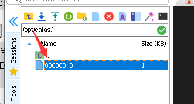

2．将查询的结果格式化导出到本地

~~~sql
insert overwrite local directory '/opt/datas/dept1'
row format delimited
fields terminated by '|'
select * from dept_partition;

~~~


3．将查询的结果导出到HDFS上(没有local)

~~~sql
insert overwrite directory '/opt/datas/dept'
row format delimited
fields terminated by '|'
select * from dept_partition;
~~~

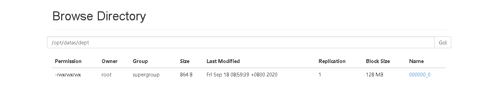

### Hadoop命令导出到本地

~~~bash
dfs -get /opt/hive/warehouse/employee/employee.txt /opt/datas/dept2/dept.txt;
~~~


### Hive Shell 命令导出

基本语法：（hive -f/-e 执行语句或者脚本 > file）

~~~bash
hive -e 'select * from hivetest.dept_partition;' > /opt/datas/dept3/dept.txt;
~~~


注意：需要在shell窗口执行，需要库名.表名，需要本地文件夹存在。

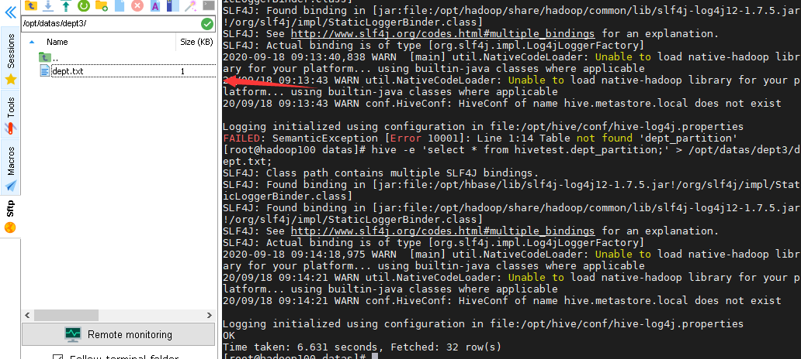

### Export导出到HDFS上

~~~sql
export table hivetest.dept_partition to '/opt/datas/dept2';
~~~

### Sqoop导出

后续

## 清除表中数据（Truncate）

注意：Truncate只能删除管理表，不能删除外部表中数据

~~~sql
truncate table student;
~~~

### 事务表

**概述**

+ Hive对事务的支持并不太好，主要原因是这款软件设计之初就是为了数据分析
+ 可是后来产生了流式传输数据，所以Hive也就可是需要支持事务

**局限性**

+ 不支持 Begin commit Rollback
+ 仅支持ORC文件格式
+ 配置为关闭
+ 表必须是分桶表
+ 表参数Transactional必须为true
+ 外部表不能成为ACID表

### 视图

+ 视图是一种虚拟表，只保存定义，不实际存储数据
+ 通常从真是的物理表查询中创建生成视图，也可以从已经存在的视图中创建行视图
+ 创建视图的同时需要东建视图的架构，如果删除或者更改基础表，则视图将失效
+ 视图是用来简化操作的，不缓存记录，也没有提高查询性能

**Hive 3.0新特性：物化视图**

+ 通过预计算、提高查询性能，当然需要占用一定的存储空间

# 查询

查询语句语法：

~~~sql
[WITH CommonTableExpression (, CommonTableExpression)*]    (Note: Only available
 starting with Hive 0.13.0)
SELECT [ALL | DISTINCT] select_expr, select_expr, ...
  FROM table_reference
  [WHERE where_condition]
  [GROUP BY col_list]
  [ORDER BY col_list]
  [CLUSTER BY col_list
    | [DISTRIBUTE BY col_list] [SORT BY col_list]
  ]
 [LIMIT number]
~~~


## 基本查询（Select…From）

### 全表和特定列查询

~~~sql
select * from emp;
select empno, ename from emp;
~~~


注意：

1. SQL 语言大小写不敏感。
2. SQL 可以写在一行或者多行
3. 关键字不能被缩写也不能分行
4. 各子句一般要分行写。
5. 使用缩进提高语句的可读性。

### 列别名

1. 重命名一个列
2. 便于计算
3. 紧跟列名，可以在列名和别名之间加入关键字‘AS’

~~~bash
select ename AS name, deptno dn from emp;
~~~


### 算术运算符

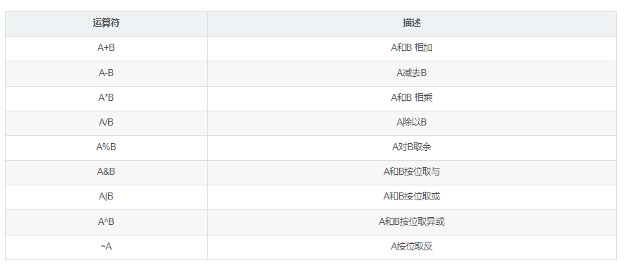

###  常用函数

1. 求总数（count)
2. 求最大值（max）
3. 求最小值（min）
4. 求总和（sum）
5. 求平均值（avg）

~~~sql
select count(*) cnt from emp;
~~~


### Limit语句

典型的查询会返回多行数据。LIMIT子句用于限制返回的行数。

~~~sql
select * from emp limit 5;
~~~

## Where语句

1．使用WHERE子句，将不满足条件的行过滤掉

2．WHERE子句紧随FROM子句

案例：查询出薪水大于1000的所有员工

~~~sql
select * from emp where sal >1000;
~~~


### 比较运算符

下面表中描述了谓词操作符，这些操作符同样可以用于JOIN…ON和HAVING语句中。

1. A=B	基本数据类型	如果A等于B则返回TRUE，反之返回FALSE
2. A<=>B	基本数据类型	如果A和B都为NULL，则返回TRUE，其他的和等号（=）操作符的结果一致，如果任一为NULL则结果为NULL
3. A<>B, A!=B	基本数据类型	A或者B为NULL则返回NULL；如果A不等于B，则返回TRUE，反之返回FALSE
4. A<B	基本数据类型	A或者B为NULL，则返回NULL；如果A小于B，则返回TRUE，反之返回FALSE
5. A<=B	基本数据类型	A或者B为NULL，则返回NULL；如果A小于等于B，则返回TRUE，反之返回FALSE
6. A>B	基本数据类型	A或者B为NULL，则返回NULL；如果A大于B，则返回TRUE，反之返回FALSE
7. A>=B	基本数据类型	A或者B为NULL，则返回NULL；如果A大于等于B，则返回TRUE，反之返回FALSE
8. A [NOT] BETWEEN B AND C	基本数据类型	如果A，B或者C任一为NULL，则结果为NULL。如果A的值大于等于B而且小于或等于C，则结果为TRUE，反之为FALSE。如果使用NOT关键字则可达到相反的效果。
9. A IS NULL	所有数据类型	如果A等于NULL，则返回TRUE，反之返回FALSE
10. A IS NOT NULL	所有数据类型	如果A不等于NULL，则返回TRUE，反之返回FALSE
11. IN(数值1, 数值2)	所有数据类型	使用 IN运算显示列表中的值
12. A [NOT] LIKE B	STRING 类型	B是一个SQL下的简单正则表达式，如果A与其匹配的话，则返回TRUE；反之返回FALSE。B的表达式说明如下：‘x%’表示A必须以字母‘x’开头，‘%x’表示A必须以字母’x’结尾，而‘%x%’表示A包含有字母’x’,可以位于开头，结尾或者字符串中间。如果使用NOT关键字则可达到相反的效果。
13. A RLIKE B, A REGEXP B	STRING 类型	B是一个正则表达式，如果A与其匹配，则返回TRUE；反之返回FALSE。匹配使用的是JDK中的正则表达式接口实现的，因为正则也依据其中的规则。例如，正则表达式必须和整个字符串A相匹配，而不是只需与其字符串匹配。

### 6.2.2 Like和RLike

1. 使用LIKE运算选择类似的值
2. 选择条件可以包含字符或数字:

​		% 代表零个或多个字符(任意个字符)。

​		_ 代表一个字符。

3. RLIKE子句是Hive中这个功能的一个扩展，其可以通过Java的正则表达式这个更强大的语言来指定匹配条件。

案例：

查找以2开头薪水的员工信息

~~~sql
select * from emp where sal LIKE '2%';
~~~


查找第二个数值为2的薪水的员工信息

~~~sql
select * from emp where sal LIKE '_2%';
~~~


查找薪水中含有2的员工信息

~~~sql
select * from emp where sal RLIKE '[2]';
~~~


### 6.2.3 逻辑运算符（And/Or/Not）

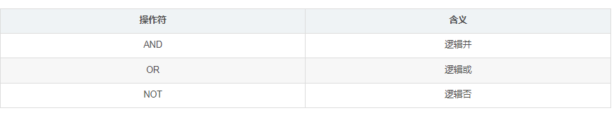
案例：查询薪水大于1000，部门是30

~~~sql
select * from emp where sal>1000 and deptno=30;
~~~


## 分组

### Group By语句

GROUP BY语句通常会和聚合函数一起使用，按照一个或者多个列队结果进行分组，然后对每个组执行聚合操作。

案例：计算emp表每个部门的平均工资

~~~sql
select t.deptno, avg(t.sal) avg_sal from emp t group by t.deptno;
~~~


### Having语句

1. having与where不同点
   1. where针对表中的列发挥作用，查询数据；having针对查询结果中的列发挥作用，筛选数据。
   2. where后面不能写分组函数，而having后面可以使用分组函数。
   3. having只用于group by分组统计语句。

案例：求每个部门的平均薪水大于2000的部门

~~~bash
hive (default)> select deptno, avg(sal) avg_sal from emp group by deptno having avg_sal > 2000;
~~~

## Join语句

### 等值Join

Hive支持通常的SQL JOIN语句，但是只支持等值连接，不支持非等值连接。

~~~sql
select e.empno, e.ename, d.deptno, d.dname from emp e join dept d on e.deptno = d.deptno;
~~~


### 表的别名

1. 好处
   1. 使用别名可以简化查询。
   2. 使用表名前缀可以提高执行效率。

~~~sql
select e.empno, e.ename, d.deptno from emp e join dept d on e.deptno = d.deptno;
~~~


### 内连接

内连接：只有进行连接的两个表中都存在与连接条件相匹配的数据才会被保留下来。

~~~sql
select e.empno, e.ename, d.deptno from emp e join dept d on e.deptno = d.deptno;
~~~


### 左外连接

左外连接：JOIN操作符左边表中符合WHERE子句的所有记录将会被返回。

~~~sql
select e.empno, e.ename, d.deptno from emp e left join dept d on e.deptno = d.deptno;
~~~


### 右外连接

右外连接：JOIN操作符右边表中符合WHERE子句的所有记录将会被返回。

~~~sql
select e.empno, e.ename, d.deptno from emp e right join dept d on e.deptno = d.deptno;
~~~

### 满外连接

满外连接：将会返回所有表中符合WHERE语句条件的所有记录。如果任一表的指定字段没有符合条件的值的话，那么就使用NULL值替代。

~~~sql
 select e.empno, e.ename, d.deptno from emp e full join dept d on e.deptno = d.deptno;
~~~


### 笛卡尔积

1．笛卡尔集会在下面条件下产生

（1）省略连接条件

（2）连接条件无效

（3）所有表中的所有行互相连接

### 连接谓词中不支持or

~~~sql
select e.empno, e.ename, d.deptno from emp e join dept d on e.deptno = d.deptno or e.ename=d.ename;   错误的
~~~

## 排序

### 全局排序（Order By）

Order By：全局排序，一个Reducer

1．使用 ORDER BY 子句排序

ASC（ascend）: 升序（默认）

DESC（descend）: 降序

2．ORDER BY 子句在SELECT语句的结尾

3．案例实操 ：查询员工信息按工资升序排列

~~~sql
select * from emp order by sal;
~~~

### 每个MapReduce内部排序（Sort By）

Sort By：每个Reducer内部进行排序，对全局结果集来说不是排序。丛林

1．设置reduce个数

~~~sql
set mapreduce.job.reduces=3;
~~~

2．查看设置reduce个数

~~~sql
set mapreduce.job.reduces;
~~~

3．根据部门编号降序查看员工信息

~~~sql
select *from dept_partition sort by deptno;
~~~


对于全局结果来说并没有排序，只是对每个reduce的结果进行了排序。

### 分区排序（Distribute By）

Distribute By：类似MR中partition，进行分区，结合sort by使用。

 注意，Hive要求DISTRIBUTE BY语句要写在SORT BY语句之前。

对于distribute by进行测试，一定要分配多reduce进行处理，否则无法看到distribute by的效果。

~~~sql
select *from dept_partition distribute by deptno sort by month;
~~~


~~~sql
insert overwrite  local directory '/opt/datas/dept3' select *from dept_partition distribute by deptno sort by month;
~~~

### Cluster By

当distribute by和sorts by字段相同时，可以使用cluster by方式。

cluster by除了具有distribute by的功能外还兼具sort by的功能。但是排序只能是升序排序，不能指定排序规则为ASC或者DESC。

以下两种方法等价：

~~~sql
select *from dept_partition distribute by deptno sort by deptno;
select *from dept_partition cluster by deptno;
~~~

注意：按照部门编号分区，不一定就是固定死的数值，可以是20号和30号部门分到一个分区里面去。

## 分桶（buckets）及抽样查询

### 分桶表数据存储

分区针对的是数据的存储路径；分桶针对的是数据文件。
分区提供一个隔离数据和优化查询的便利方式。不过，并非所有的数据集都可形成合理的分区，特别是之前所提到过的要确定合适的划分大小这个疑虑。
分桶是将数据集分解成更容易管理的若干部分的另一个技术。

设置分捅属性

~~~sql
set hive.enforce.bucketing=true;
~~~

创建分桶表

~~~sql
create table stu_buck(id int, name string)
clustered by(id) 
into 4 buckets
row format delimited fields terminated by '\t';
~~~


导入数据到分桶表，通过子查询的方式

~~~sql
insert into table stu_buck select id, name from stu;
~~~


分捅表只能通过insert插入数据，load读取数据是无效的。

### 分桶抽样查询

对于非常大的数据集，有时用户需要使用的是一个具有代表性的查询结果而不是全部结果。Hive可以通过对表进行抽样来满足这个需求。

~~~sql
select * from customers_buck1 tablesample(bucket 1 out of 4 on customer_fname);
~~~


注：tablesample是抽样语句，语法：TABLESAMPLE(BUCKET x OUT OF y) 。

y必须是table总bucket数的倍数或者因子。hive根据y的大小，决定抽样的比例。例如，table总共分了4份，当y=2时，抽取(4/2=)2个bucket的数据，当y=8时，抽取(4/8=)1/2个bucket的数据。

==x表示从第几个bucket开始抽取，如果需要取多个分区，以后的分区号为当前分区号加上y。==例如，table总bucket数为4，tablesample(bucket 1 out of 2)，表示总共抽取（4/2=）2个bucket的数据，抽取第1(x)个和第3(x+y)个bucket的数据。

注意：x的值必须小于等于y的值，否则

FAILED: SemanticException [Error 10061]: Numerator should not be bigger than denominator in sample clause for table stu_buck

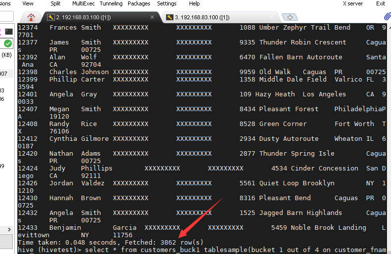

表总共有：

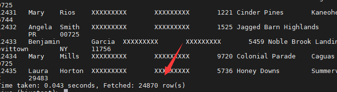

分捅相当于预览了部分数据。

## 其他常用查询函数

### 空字段赋值

1.函数说明
NVL：给值为NULL的数据赋值，它的格式是NVL( string1, replace_with)。它的功能是如果string1为NULL，则NVL函数返回replace_with的值，否则返回string1的值，如果两个参数都为NULL ，则返回NULL。

c表数据：

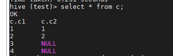

~~~sql
select c1,nvl(c2,1) from c;
~~~


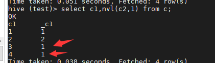

### CASE WHEN

数据准备

~~~txt
name	dept_id	sex
悟空	A	男
大海	A	男
宋宋	B	男
凤姐	A	女
婷姐	B	女
婷婷	B	女
~~~

2．需求

求出不同部门男女各多少人。结果如下：

~~~bash
A     2       1
B     1       2
~~~

3．按需求查询数据

~~~sql
select dept_id,
sum(case when sex='男' then 1 else 0 end) man,
sum(case when sex='女' then 1 else 0 end) woman
from emp_sex group by dept_id;
~~~

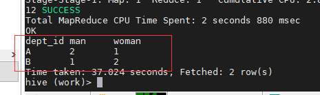

### 行转列

1．相关函数说明

`CONCAT(string A/col, string B/col…`：返回输入字符串连接后的结果，支持任意个输入字符串;

`CONCAT_WS(separator, str1, str2,...)`：它是一个特殊形式的 CONCAT()。第一个参数剩余参数间的分隔符。分隔符可以是与剩余参数一样的字符串。如果分隔符是 NULL，返回值也将为 NULL。这个函数会跳过分隔符参数后的任何 NULL 和空字符串。分隔符将被加到被连接的字符串之间;

`COLLECT_SET(col)`：函数只接受基本数据类型，它的主要作用是将某字段的值进行去重汇总，产生array类型字段。

2．数据准备

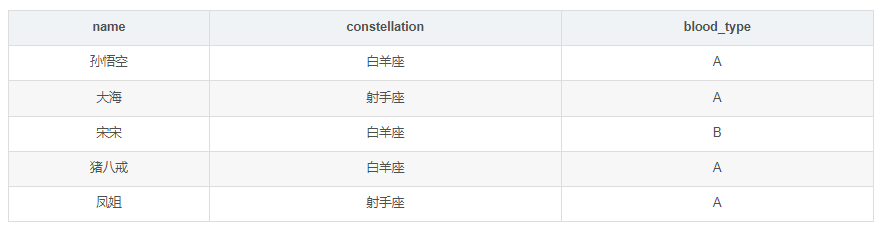
3．需求

把星座和血型一样的人归类到一起。结果如下：

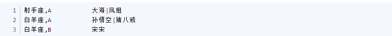
4．按需求查询数据

~~~sql
select
    t1.base,
    concat_ws('|', collect_set(t1.name)) name
from
    (select
        name,
        concat(constellation, ",", blood_type) base
    from
        person_info) t1
group by
    t1.base;
~~~


### 列转行

1．函数说明

EXPLODE(col)：将hive一列中复杂的array或者map结构拆分成多行。

LATERAL VIEW

用法：LATERAL VIEW udtf(expression) tableAlias AS columnAlias

解释：用于和split, explode等UDTF一起使用，它能够将一列数据拆成多行数据，在此基础上可以对拆分后的数据进行聚合。

2．数据准备

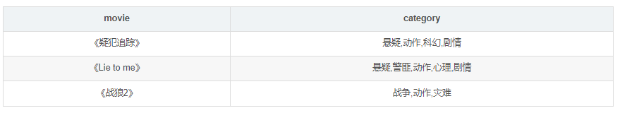
3．需求

将电影分类中的数组数据展开。结果如下：

~~~Txt
《疑犯追踪》      悬疑
《疑犯追踪》      动作
《疑犯追踪》      科幻
《疑犯追踪》      剧情
《Lie to me》   悬疑
《Lie to me》   警匪
《Lie to me》   动作
《Lie to me》   心理
《Lie to me》   剧情
《战狼2》        战争
《战狼2》        动作
《战狼2》        灾难

~~~

4．按需求查询数据

~~~sql
select  movie,category_name from movie_info
 lateral view explode(category) table_tmp  as category_name;
~~~


### 窗口函数

1．相关函数说明

OVER()：指定分析函数工作的数据窗口大小，这个数据窗口大小可能会随着行的变而变化

CURRENT ROW：当前行

n PRECEDING：往前n行数据

n FOLLOWING：往后n行数据

UNBOUNDED：起点，UNBOUNDED PRECEDING 表示从前面的起点， UNBOUNDED FOLLOWING表示到后面的终点

LAG(col,n)：往前第n行数据

LEAD(col,n)：往后第n行数据

NTILE(n)：把有序分区中的行分发到指定数据的组中，各个组有编号，编号从1开始，对于每一行，NTILE返回此行所属的组的编号。注意：n必须为int类型。

2．数据准备：name，orderdate，cost

~~~txt
jack,2017-01-01,10
tony,2017-01-02,15
jack,2017-02-03,23
tony,2017-01-04,29
jack,2017-01-05,46
jack,2017-04-06,42
tony,2017-01-07,50
jack,2017-01-08,55
mart,2017-04-08,62
mart,2017-04-09,68
neil,2017-05-10,12
mart,2017-04-11,75
neil,2017-06-12,80
mart,2017-04-13,94
~~~


3．需求

（1）查询在2017年4月份购买过的顾客及总人数

（2）查询顾客的购买明细及月购买总额

（3）上述的场景,要将cost按照日期进行累加

（4）查询顾客上次的购买时间

（5）查询前20%时间的订单信息

4．按需求查询数据

（1）查询在2017年4月份购买过的顾客及总人数

~~~sql
select name,count(*) over () from business where substring(orderdate,1,7) = '2017-04' group by name;
~~~


（2）查询顾客的购买明细及月购买总额

~~~sql
select name,orderdate,cost,sum(cost) over(partition by month(orderdate)) from business;
~~~


（3）上述的场景,要将cost按照日期进行累加

~~~sql
select name,orderdate,cost, sum(cost) over() as sample1,--所有行相加 sum(cost) over(partition by name) as sample2,--按name分组，组内数据相加 sum(cost) over(partition by name order by orderdate) as sample3,--按name分组，组内数据累加 sum(cost) over(partition by name order by orderdate rows between UNBOUNDED PRECEDING and current row ) as sample4 ,--和sample3一样,由起点到当前行的聚合 sum(cost) over(partition by name order by orderdate rows between 1 PRECEDING and current row) as sample5, --当前行和前面一行做聚合 sum(cost) over(partition by name order by orderdate rows between 1 PRECEDING AND 1 FOLLOWING ) as sample6,--当前行和前边一行及后面一行 sum(cost) over(partition by name order by orderdate rows between current row and UNBOUNDED FOLLOWING ) as sample7 --当前行及后面所有行 from business;
~~~


（4）查看顾客上次的购买时间

~~~sql
select name,orderdate,cost, lag(orderdate,1,'1900-01-01') over(partition by name order by orderdate ) as time1, lag(orderdate,2) over (partition by name order by orderdate) as time2 from business;
~~~


（5）查询前20%时间的订单信息

~~~sql
select * from (  select name,orderdate,cost, ntile(5) over(order by orderdate) sorted  from business) twhere sorted = 1;
~~~


### Rank

1．函数说明

RANK() 排序相同时会重复，总数不会变

DENSE_RANK() 排序相同时会重复，总数会减少

ROW_NUMBER() 会根据顺序计算

2．数据准备

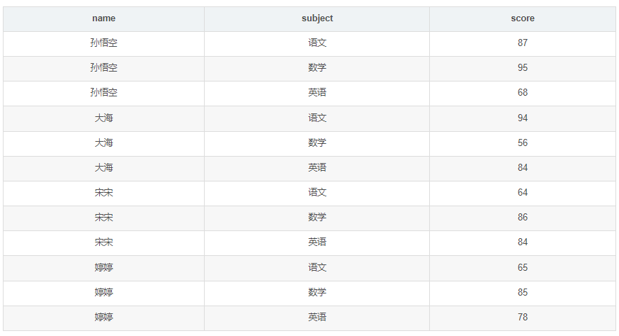
3．需求

计算每门学科成绩排名。

4．按需求查询数据

~~~Sql
select name,
subject,
score,
rank() over(partition by subject order by score desc) rp,
dense_rank() over(partition by subject order by score desc) drp,
row_number() over(partition by subject order by score desc) rmp
from score;
~~~


# 函数

## Hive函数分类

+ 从输入输出角度分类
  + 标准函数：一行数据中的一列或多列为输入，结果为单一值
  + 聚合函数：多行的零列到多列为输入，结果为单一值
  + 表生成函数：零个或多个输入，结果为多列或多行
+ 从实现方式分类
  + 内置函数
  + 自定义函数:
  + UDF：自定义标准函数
  + UDAF：自定义聚合函数
  + UDTF：自定义表生成函数

## 内置函数

Hive提供大量内置函数供开发者使用

+ 标准函数
  字符函数
  类型转换函数
  数学函数
  日期函数
  集合函数
  条件函数
+ 聚合函数
+ 表生成函数

### 字符函数

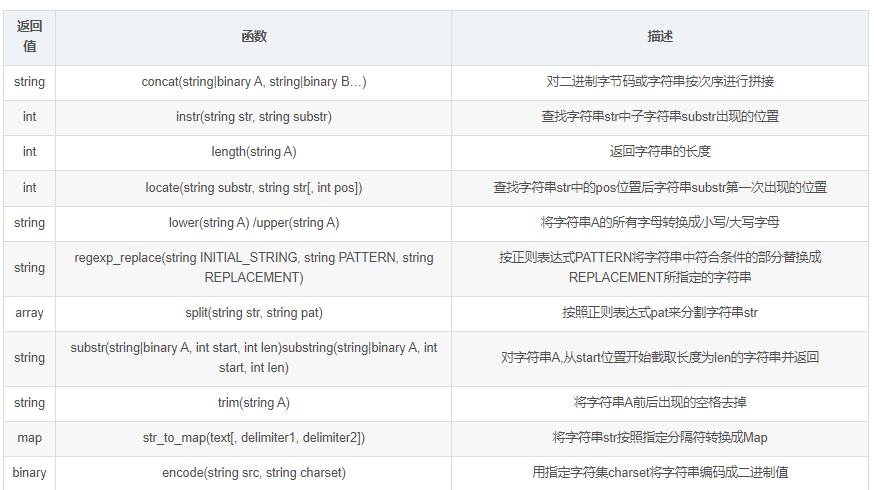

### 类型转换函数和数学函数

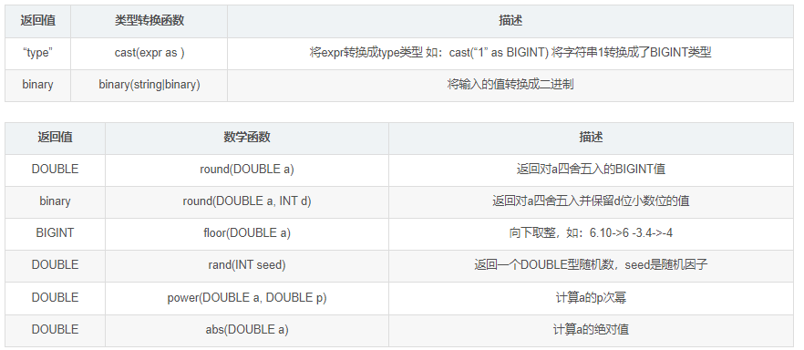

### 日期函数

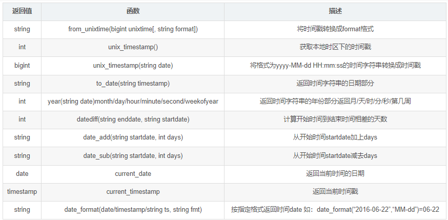

### 集合函数

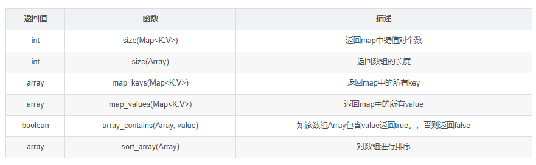

### 条件函数

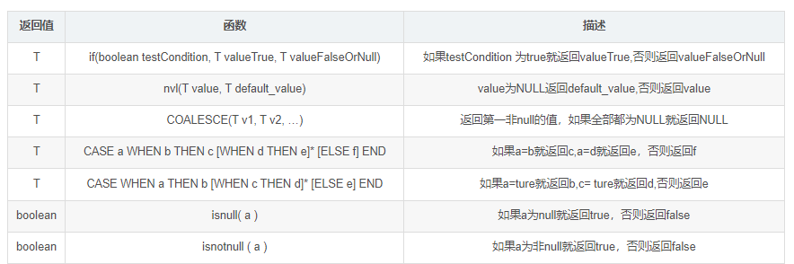

### 聚合函数和表生成函数

聚合函数
count、sum、max、min、avg、var_samp等
表生成函数：输出可以作为表使用
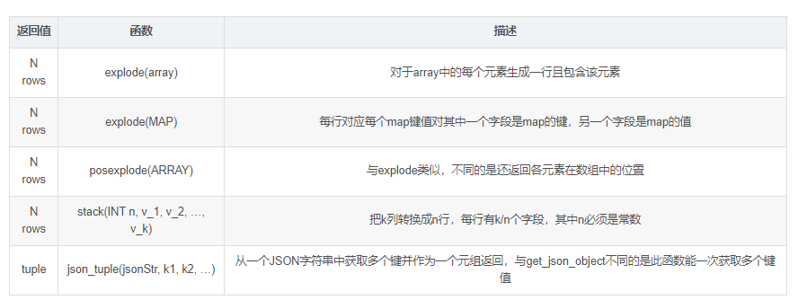

## 自定义UDF函数

Hive UDF开发流程

+ 继承UDF类或GenericUDF类
+ 重写evaluate()方法并实现函数逻辑
+ 编译打包为jar文件
+ 复制到正确的HDFS路径
+ 使用jar创建临时/永久函数
+ 调用函数

1．创建一个Maven工程Hive

https://blog.csdn.net/zmzdmx/article/details/108401283

2．导入依赖

~~~xml

<dependency>
    <groupId>org.apache.hadoop</groupId>
    <artifactId>hadoop-common</artifactId>
    <version>2.6.0</version>
</dependency>
<dependency>
    <groupId>org.apache.hive</groupId>
    <artifactId>hive-exec</artifactId>
    <version>1.2.1</version>
</dependency>
~~~

3．创建一个类

~~~java
package cn.kgc.kb09;

import org.apache.hadoop.hive.ql.exec.UDF;
import org.apache.hadoop.io.Text;


public class TestUDF extends UDF {
    public Text evaluate(Text str){
        if(null==str){
            return null;
        }
        return new Text(str.toString().toUpperCase());
    }
    public static void main(String[] args) {
        TestUDF tu=new TestUDF();
        Text rst = tu.evaluate(new Text());
        System.out.println(rst);
    }

}
~~~


方法一(创建临时函数)：

4．打成jar包上传到服务器/opt/testudf.jar

5．将jar包添加到hive的classpath（linux路径）

~~~bash
add jar /opt/testudf.jar;
~~~

6．创建临时函数与开发好的java class关联

~~~sql
create temporary function mylower as "cn.kgc.kb09.TestUDF";
~~~


方法二（创建永久函数）：

4.在linux命令行使用hdfs命令把jar包上传到hdfs的路径

~~~bash
hdfs dfs -put 路径
~~~

5 .

~~~bash
create function 函数名 as ‘方法的全路径’using as ‘jar包的hdfs路径’
~~~

 7．即可在hql中使用自定义的函数

~~~sql
select ename, mylower(ename) lowername from emp;
~~~


注意

+ 报错在linux执行

报错

java.sql.SQLException: Error while processing statement: FAILED: Execution Error, return code 1 from org.apache.hadoop.hive.ql.exec.FunctionTask
	at org.apache.hive.jdbc.HiveStatement.execute(HiveStatement.java:294)
	at org.apache.commons.dbcp2.DelegatingStatement.execute(DelegatingStatement.java:291)
	at org.apache.commons.dbcp2.DelegatingStatement.execute(DelegatingStatement.java:291)
	at org.apache.zeppelin.jdbc.JDBCInterpreter.executeSql(JDBCInterpreter.java:736)
	at org.apache.zeppelin.jdbc.JDBCInterpreter.interpret(JDBCInterpreter.java:819)
	at org.apache.zeppelin.interpreter.LazyOpenInterpreter.interpret(LazyOpenInterpreter.java:103)
	at org.apache.zeppelin.interpreter.remote.RemoteInterpreterServer$InterpretJob.jobRun(RemoteInterpreterServer.java:632)
	at org.apache.zeppelin.scheduler.Job.run(Job.java:188)
	at org.apache.zeppelin.scheduler.ParallelScheduler$JobRunner.run(ParallelScheduler.java:162)
	at java.util.concurrent.Executors$RunnableAdapter.call(Executors.java:511)
	at java.util.concurrent.FutureTask.run(FutureTask.java:266)
	at java.util.concurrent.ScheduledThreadPoolExecutor$ScheduledFutureTask.access$201(ScheduledThreadPoolExecutor.java:180)
	at java.util.concurrent.ScheduledThreadPoolExecutor$ScheduledFutureTask.run(ScheduledThreadPoolExecutor.java:293)
	at java.util.concurrent.ThreadPoolExecutor.runWorker(ThreadPoolExecutor.java:1149)
	at java.util.concurrent.ThreadPoolExecutor$Worker.run(ThreadPoolExecutor.java:624)
	at java.lang.Thread.run(Thread.java:748)

执行命令，不行就退出hive，再次执行

~~~bash
zip -d testUdf.jar 'META-INF/.SF' 'META-INF/.RSA' 'META-INF/*SF'
~~~


临时函数可以垮库运行，永久函数需要库名.函数名

# 性能优化

## Hive事务

1. 事务（Transaction ）指一组单元化操作，这些操作要么都执行，要么都不执行

2. Hive事务的特点和局限

   + V0.14版本开始支持行级事务
     支持INSERT、DELETE、UPDATE(v2.2.0开始支持Merge)
     文件格式只支持ORC
   + 局限
     表必须是bucketed表
     需要消耗额外的时间、资源和空间
     不支持开始、提交、回滚、桶或分区列上的更新
     锁可以为共享锁或排它锁(串联的而不是并发)
     不允许从一个非ACID连接读写ACID表
     使用较少

3. Hive事务的开启和设置

   通过Hive命令行方式设置,当前session有效
   通过配置文件设置，全局有效
   通过UI工具（如Ambari)设置
   
   

~~~bash
-- 通过命令行方式开启事务
set hive.support.concurrency = true;
set hive.enforce.bucketing = true;
set hive.exec.dynamic.partition.mode = nonstrict;
set hive.txn.manager = org.apache.hadoop.hive.ql.lockmgr.DbTxnManager;
set hive.compactor.initiator.on = true;
set hive.compactor.worker.threads = 1; 
~~~


~~~xml
-- 通过配置文件hive-site.xml
<property> 
<name>hive.support.concurrency</name> 
<value>true</value>
 </property>
 <property> 
<name>hive.txn.manager</name> <value>org.apache.hadoop.hive.ql.lockmgr.DbTxnManager</value>
</property>
~~~


## Hive PLSQL

Hive PLSQL：Hive存储过程（v2.0之后）
支持SparkSQL和Impala
兼容Oracle、DB2、MySQL、TSQL标准
使将现有的过程迁移到Hive变得简单和高效
使编写UDF不需要Java技能
它的性能比Java UDF稍微慢一些
功能较新
在Hive2 bin目录下运行./hplsql

~~~
./hplsql -f plsql_demo.pl
RETURNS STRING 
BEGIN RETURN 'Hello, ' || text || '!'; 
END;
Print hello(' word') 

CREATE PROCEDURE getCount()
BEGIN DECLARE cnt INT = 0;	
SELECT COUNT(*) INTO cnt FROM employee;
PRINT 'Users cnt: ' || cnt;
END;
call getCount();
~~~


## Hive性能调优工具

1.EXPLAIN

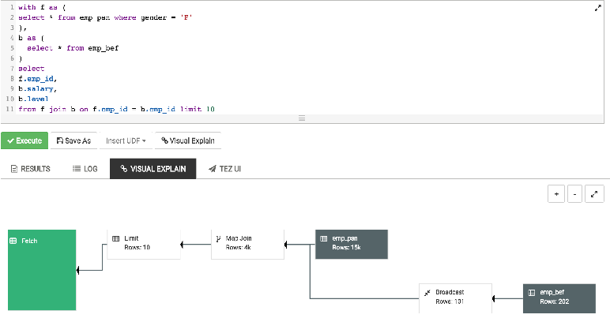


2.ANALYZE

ANALYZE：分析表数据，用于执行计划选择的参考
收集表的统计信息，如行数、最大值等
使用时调用该信息加速查询
语法

~~~sql
ANALYZE TABLE employee COMPUTE STATISTICS; 

ANALYZE TABLE employee_partitioned 
PARTITION(year=2014, month=12) COMPUTE STATISTICS;

ANALYZE TABLE employee_id COMPUTE STATISTICS 
FOR COLUMNS employee_id;

~~~

## Hive优化设计

+ 使用分区表、桶表
+ 使用索引
+ 使用适当的文件格式，如orc, avro, parquet
+ 使用适当的压缩格式，如snappy
+ 考虑数据本地化 - 增加一些副本
+ 避免小文件
+ 使用Tez引擎代替MapReduce
+ 使用Hive LLAP(在内存中读取缓存)
+ 考虑在不需要时关闭并发

## Job优化

1.  本地模式运行

Hive支持将作业自动转换为本地模式运行
当要处理的数据很小时，完全分布式模式的启动时间比作业处理时间要长

-- 通过以下设置开启本地模式

~~~bash
SET hive.exec.mode.local.auto=true; --default false 
SET hive.exec.mode.local.auto.inputbytes.max=50000000; 
SET hive.exec.mode.local.auto.input.files.max=5; --default 4
~~~

+ Job必须满足以下条件才能在本地模式下运行
  Job总输入大小小于 hive.exec.mode.local.auto. inputbytes.max
  map任务总数小于 hive.exec.mode.local.auto. input.files.max
  所需的Reduce任务总数为1或0

2 .  JVM重用（JVM Reuse）

通过JVM重用减少JVM启动的消耗
默认每个Map或Reduce启动一个新的JVM
Map或Reduce运行时间很短时，JVM启动过程占很大开销
通过共享JVM来重用JVM，以串行方式运行MapReduce Job
适用于同一个Job中的Map或Reduce任务
对于不同Job的任务，总是在独立的JVM中运行

~~~bash
-- 通过以下设置开启JVM重用
set mapred.job.reuse.jvm.num.tasks = 5;  -- 默认值为1
~~~


3 . 并行执行

并行执行可提高集群利用率
Hive查询通常被转换成许多按默认顺序执行的阶段
这些阶段并不总是相互依赖的
它们可以并行运行以节省总体作业运行时间
如果集群的利用率已经很高，并行执行帮助不大

~~~bash
-- 通过以下设置开启并行执行
SET hive.exec.parallel=true;  -- default false 
SET hive.exec.parallel.thread.number=16;  -- default 8,定义并行运行的最大数量
~~~


## 查询优化

自动启动Map端Join

+ 防止数据倾斜

~~~bash
set hive.optimize.skewjoin=true;	
~~~

+ 启用CBO(Cost based Optimizer)

~~~bash
set hive.cbo.enable=true; 
set hive.compute.query.using.stats=true; 
set hive.stats.fetch.column.stats=true; 
set hive.stats.fetch.partition.stats=true;	
~~~


+ 启动Vectorization（矢量化）

~~~bash
set hive.vectorized.execution.enabled = true; 
set hive.vectorized.execution.reduce.enabled = true;
~~~


使用CTE、临时表、窗口函数等正确的编码约定

## 压缩算法

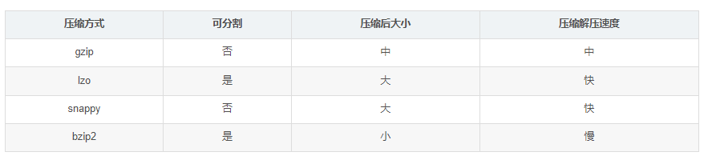

减少传输数据量，会极大提升MapReduce性能
采用数据压缩是减少数据量的很好的方式
常用压缩方法对比
压缩方式	可分割	压缩后大小	压缩解压速度
gzip	否	中	中
lzo	是	大	快
snappy	否	大	快
bzip2	是	小	慢

# Hive安装

## Hive安装

Hive安装教程 : https://blog.csdn.net/zmzdmx/article/details/108588145

## HiveJDBC访问

### 启动hiveserver2服务

~~~bash
hiveserver2
~~~

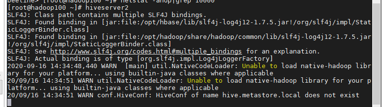

### 连接hiveserver2服务

新建命令窗口，输入以下命令

~~~bash
bin/hive --service beeline


beeline -u "jdbc:hive2://hadoop100:10000"

! connect "jdbc:hive2://hadoop100:10000"
~~~


出现该图代表成功连接

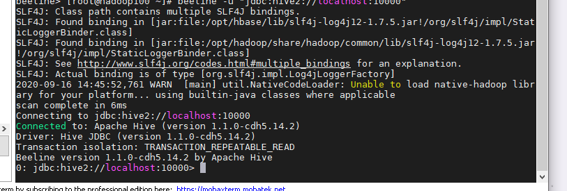

### 注意

这里报错通常是由于权限不够，只需要对tmp和opt文件夹赋权即可

~~~bash 
hadoop fs -chmod -R 777 /tmp
hadoop fs -chmod -R 777 /opt
~~~

## Hive常用交互命令

1．“-e”不进入hive的交互窗口执行sql语句

~~~bash
hive -e "查询语句"
~~~

2．“-f”执行脚本中sql语句

~~~bash
hive -f sql文件路径/sql文件名称
~~~

执行文件中的sql语句并将结果写入文件中

~~~bash
hive -f sql文件路径/sql文件名称  > 保存结果的路径
~~~

## Hive其他命令操作

1.退出hive窗口

~~~bash
exit；
~~~

~~~bash
quit；
~~~

2.在hive cli命令窗口中如何查看hdfs文件系统

~~~bash
dfs -ls /;
~~~

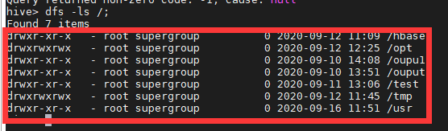

3．在hive cli命令窗口中如何查看本地文件系统

~~~bash
!ls /opt;
~~~

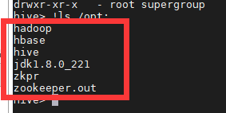

## Hive常见属性配置

### 数据仓库位置配置

修改hive-site.xml文件的value

~~~xml
<property>
<name>hive.metastore.warehouse.dir</name>
<value>/opt/hive/warehouse</value>
</property>
~~~


### 查询后信息显示配置

在hive-site.xml文件中添加如下配置信息，就可以实现显示当前数据库，以及查询表的头信息配置。

~~~xml
<property>
	<name>hive.cli.print.header</name>
	<value>true</value>
</property>

<property>
	<name>hive.cli.print.current.db</name>
	<value>true</value>
</property>
~~~


重新启动hive，对比配置前后差异。

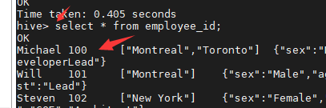

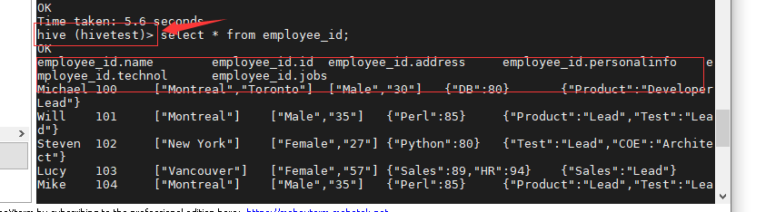

### 运行日志信息配置

+ Hive的log默认存放在/tmp/root/hive.log目录下（root为当前用户名）

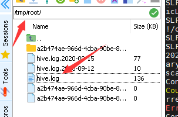

修改hive的log存放日志到/opt/hive/logs

1.修改/opt/hive/conf/hive-log4j.properties.template文件名称为hive-log4j.properties

~~~bash
mv hive-log4j.properties.template hive-log4j.properties
~~~


2.在hive-log4j.properties文件中修改log存放位置

~~~bash
hive.log.dir=/opt/hive/logs
~~~

重启hive

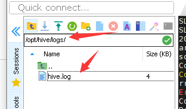