# Sprak

## 前言

### 离线计算

+ 数据计算前已经到位、并且不会发生改变
+ 数据量比较大、计算时间比较、
+ 主要通过批处理的方式进行计算

### 实时计算

+ 局部计算
+ 开发成本较高，数据需要对接多种数据容器
+ 资源成本较高
+ 时效性，计算的过程可能会有一些时间的局限性

### 离线数据架构

1. 数据来源：各类传感器、App等产生的业务数据
2. 数据采集 
   1. 业务系统
      1. Mysql
         1. Maxwell -> Kafka
         2. Sqoop -> HDFS
   2. 日志服务 
      1. ES
      2. Flume -> Kafka -> HDFS 
3. 数据处理 Hive
   1. 数据分层：ods 、dim、dwd...dws、ads 
   2. 计算结果存储到 Mysql 中 或者 OLAP 中
   3. 数据可视化接口、或者BI报表

### 实时数据架构

1. 数据源
   1. 日志服务 -> Flume
   2. 业务数据 -> Mysql-> MaxWell
2. 数据采集 -> Kafkfa
3. 实时计算 ： Sprark Flink
4. OLAP 数据分析库（一般不考虑Mysql了）
   1. ES 
   2. ClickHouse
   3. Kylin
5. BI 报表 或 数据可视化

## 谈谈对于Spark的理解？

### 什么是Spark

Spark 是一种基于内存的快速、通用、可扩展的大数据分析计算引擎。

### Spark and Hadoop

首先从时间节点上来看:

+ Hadoop
  + 2006 年 1 月，Doug Cutting 加入Yahoo，领导Hadoop 的开发
  + 2008 年 1 月，Hadoop 成为 Apache 顶级项目
  + 2011 年 1.0 正式发布
  + 2012 年 3 月稳定版发布
  + **2013 年 10 月发布 2.X (Yarn)版本**

+ Spark
  + 2009 年，Spark 诞生于伯克利大学的AMPLab 实验室
  + 2010 年，伯克利大学正式开源了 Spark 项目
  + **2013 年 6 月，Spark 成为了 Apache 基金会下的项目**
  + 2014 年 2 月，Spark 以飞快的速度成为了 Apache 的顶级项目
  + 2015 年至今，Spark 变得愈发火爆，大量的国内公司开始重点部署或者使用 Spark

然后我们再从功能上来看:

+ Hadoop
  + Hadoop 是由 java 语言编写的，在分布式服务器集群上存储海量数据并运行分布式分析应用的开源框架
  + 作为 Hadoop 分布式文件系统，HDFS 处于 Hadoop 生态圈的最下层，存储着所有的数据， 支持着 Hadoop 的所有服务。 它的理论基础源于 Google 的TheGoogleFileSystem 这篇论文，它是GFS 的开源实现。
  + MapReduce 是一种编程模型，Hadoop 根据 Google 的 MapReduce 论文将其实现， 作为 Hadoop 的分布式计算模型，是 Hadoop 的核心。基于这个框架，分布式并行程序的编写变得异常简单。综合了 HDFS 的分布式存储和 MapReduce 的分布式计算，Hadoop 在处理海量数据时，性能横向扩展变得非常容易。
  + HBase 是对 Google 的 Bigtable 的开源实现，但又和 Bigtable 存在许多不同之处。HBase 是一个基于HDFS 的分布式数据库，擅长实时地随机读/写超大规模数据集。它也是 Hadoop 非常重要的组件。

+ Spark
  + **Spark 是一种由 Scala 语言开发的快速、通用、可扩展的大数据分析引擎**
  + Spark Core 中提供了 Spark 最基础与最核心的功能
  + Spark SQL 是Spark 用来操作结构化数据的组件。通过 Spark SQL，用户可以使用SQL 或者 Apache Hive 版本的 SQL 方言（HQL）来查询数据。
  + Spark Streaming 是 Spark 平台上针对实时数据进行流式计算的组件，提供了丰富的处理数据流的API。

由上面的信息可以获知，Spark 出现的时间相对较晚，并且主要功能主要是用于数据计算， 所以其实 Spark 一直被认为是Hadoop 框架的升级版。

### 为什么使用Spark

Hadoop 的 MR 框架和Spark 框架都是数据处理框架，那么我们在使用时如何选择呢？

+ Hadoop MapReduce 由于其设计初衷**并不是为了满足循环迭代式数据流处理**，因此在多并行运行的数据可复用场景（如：机器学习、图挖掘算法、交互式数据挖掘算法）中存在诸多计算效率等问题。所以 Spark 应运而生，Spark 就是在传统的MapReduce 计算框架的基础上，利用其计算过程的优化，从而大大加快了数据分析、挖掘的运行和读写速度，并将计算单元缩小到更适合并行计算和重复使用的RDD 计算模型。
+ 机器学习中 ALS、凸优化梯度下降等。这些都需要基于数据集或者数据集的衍生数据反复查询反复操作。MR 这种模式不太合适，即使多 MR 串行处理，性能和时间也是一个问题。数据的共享依赖于磁盘。另外一种是交互式数据挖掘，MR 显然不擅长。而Spark 所基于的 scala 语言恰恰擅长函数的处理。
+ Spark 是一个分布式数据快速分析项目。它的核心技术是弹性分布式数据集（Resilient Distributed Datasets），提供了比MapReduce 丰富的模型，可以快速在内存中对数据集进行多次迭代，来支持复杂的数据挖掘算法和图形计算算法。
+ **Spark 和Hadoop 的根本差异是多个作业之间的数据通信问题 : Spark 多个作业之间数据通信是基于内存，而 Hadoop 是基于磁盘。**
+ Spark Task 的启动时间快。Spark 采用 fork 线程的方式，而 Hadoop 采用创建新的进程的方式。
+ Spark 只有在 shuffle 的时候将数据写入磁盘，而 Hadoop 中多个 MR 作业之间的数据交互都要依赖于磁盘交互
+ Spark 的缓存机制比HDFS 的缓存机制高效。

​        经过上面的比较，我们可以看出在绝大多数的数据计算场景中，**Spark 确实会比 MapReduce 更有优势。但是Spark 是基于内存的，所以在实际的生产环境中，由于内存的限制，可能会由于内存资源不够导致 Job 执行失败**，此时，MapReduce 其实是一个更好的选择，所以 **Spark 并不能完全替代 MR。**

### 核心模块

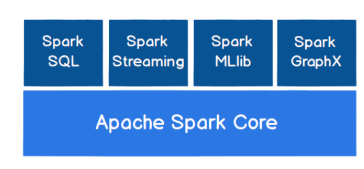

+ **Spark Core**：提供了 Spark 最基础与最核心的功能，Spark 其他的功能如：Spark SQL， Spark Streaming，GraphX, MLlib 都是在 Spark Core 的基础上进行扩展的

+ **Spark SQL**：Spark SQL 是Spark 用来操作结构化数据的组件。通过 Spark SQL，用户可以使用 SQL或者Apache Hive 版本的 SQL 方言（HQL）来查询数据。 

+ **Spark Streaming**：是 Spark 平台上针对实时数据进行流式计算的组件，提供了丰富的处理数据流的API。

+ **Spark MLlib**：MLlib 是 Spark 提供的一个机器学习算法库。MLlib 不仅提供了模型评估、数据导入等额外的功能，还提供了一些更底层的机器学习原语。
+ **Spark GraphX**：GraphX 是 Spark 面向图计算提供的框架与算法库。

## Spark 运行环境

Spark 作为一个数据处理框架和计算引擎，被设计在所有常见的集群环境中运行, 在国内工作中主流的环境为 Yarn，不过逐渐容器式环境也慢慢流行起来。

### Local模式

所谓的Local 模式，就是不需要其他任何节点资源就可以在本地执行 Spark 代码的环境，一般用于教学，调试，演示等， 之前在 IDEA 中运行代码的环境我们称之为开发环境，不太一样。

### Standalone (独立部署模式)

​		local 本地模式毕竟只是用来进行练习演示的，真实工作中还是要将应用提交到对应的集群中去执行，这里只使用 Spark 自身节点运行的集群模式，也就是我们所谓的独立部署（Standalone）模式，Spark 的 Standalone 模式体现了经典的 master-slave 模式。

### Yarn 模式(重要)

​		独立部署（Standalone）模式由 Spark 自身提供计算资源，无需其他框架提供资源。这种方式降低了和其他第三方资源框架的耦合性，独立性非常强。但是你也要记住，**Spark 主要是计算框架，而不是资源调度框架**，所以本身提供的资源调度并不是它的强项，所以还是和其他专业的资源调度框架集成会更靠谱一些。其实是因为**在国内工作中，Yarn 使用的非常多**

### K8S & Mesos 模式

Mesos 是Apache 下的开源分布式资源管理框架，它被称为是分布式系统的内核,在Twitter 得到广泛使用,管理着 Twitter 超过 30,0000 台服务器上的应用部署，**但是在国内，依然使用着传统的Hadoop 大数据框架，所以国内使用 Mesos 框架的并不多**，但是原理其实都差不多，这里我们就不做过多讲解了。

容器化部署是目前业界很流行的一项技术，基于Docker 镜像运行能够让用户更加方便地对应用进行管理和运维。

### Windows 模式

​		Spark 非常暖心地提供了可以在windows 系统下启动本地集群的方式，这样，在不使用虚拟机的情况下，也能学习 Spark 的基本使用

### 部署模式对比

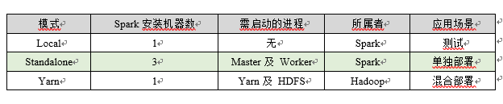

## 运行架构

### 运行架构

​		Spark 框架的核心是一个计算引擎，整体来说，它采用了标准 master-slave 的结构。如下图所示，它展示了一个 Spark 执行时的基本结构。图形中的Driver 表示 master，负责管理整个集群中的作业任务调度。图形中的Executor 则是 slave，负责实际执行任务。

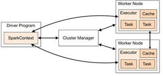

### 核心组件

#### Driver

Spark 驱动器节点，用于执行 Spark 任务中的 main 方法，负责实际代码的执行工作。 Driver 在Spark 作业执行时主要负责：

+ 将用户程序转化为作业（job）
+ 在 Executor 之间调度任务(task)
+ 跟踪Executor 的执行情况
+ 通过UI 展示查询运行情况

实际上，我们无法准确地描述Driver 的定义，因为在整个的编程过程中没有看到任何有关Driver 的字眼。所以简单理解，所谓的 Driver 就是驱使整个应用运行起来的程序，也称之为Driver 类。

#### Executor

​		Spark Executor 是集群中工作节点（Worker）中的一个 JVM 进程，负责在 Spark 作业中运行具体任务（Task），任务彼此之间相互独立。Spark 应用启动时，Executor 节点被同时启动，并且始终伴随着整个 Spark 应用的生命周期而存在。如果有Executor 节点发生了故障或崩溃，Spark 应用也可以继续执行，会将出错节点上的任务调度到其他 Executor 节点上继续运行。

Executor 有两个核心功能： 

+ **负责运行组成 Spark 应用的任务，并将结果返回给驱动器进程**
+ 它们通过自身的块管理器（Block Manager）**为用户程序中要求缓存的 RDD 提供内存式存储**。RDD 是直接缓存在 Executor 进程内的，因此任务可以在运行时充分利用缓存数据加速运算。

#### Master & Worker

​		Spark 集群的独立部署环境中，不需要依赖其他的资源调度框架，自身就实现了资源调度的功能，所以环境中还有其他两个核心组件：Master 和 Worker，

+ **这里的 Master 是一个进程，主要负责资源的调度和分配，并进行集群的监控等职责**，
+ 类似于 Yarn 环境中的 RM, 而Worker 呢，也是进程，**一个 Worker 运行在集群中的一台服务器上，由 Master 分配资源对数据进行并行的处理和计算**，类似于 Yarn 环境中 NodeManager。

#### ApplicationMaster

Hadoop 用户向 YARN 集群提交应用程序时,提交程序中应该包含ApplicationMaster，用于向资源调度器申请执行任务的资源容器 Container，运行用户自己的程序任务 job，监控整个任务的执行，跟踪整个任务的状态，处理任务失败等异常情况。

说的简单点就是，**ResourceManager（资源）和Driver（计算）之间的解耦合靠的就是ApplicationMaster。**

### 核心概念

#### Executor 与 Core

​		Spark Executor 是集群中运行在工作节点（Worker）中的一个 JVM 进程，是整个集群中的专门用于计算的节点。在提交应用中，可以提供参数指定计算节点的个数，以及对应的资源。这里的资源一般指的是工作节点 Executor 的内存大小和使用的虚拟 CPU 核（Core）数量。

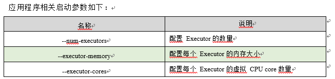

#### 并行度

​		**在分布式计算框架中一般都是多个任务同时执行**，由于任务分布在不同的计算节点进行计算，所以能够真正地实现多任务并行执行，记住，这里是并行，而不是并发。这里**我们将整个集群并行执行任务的数量称之为并行度**。

#### 有向无环图

​		这里所谓的有向无环图，并不是真正意义的图形，而是由 Spark 程序直接映射成的数据流的高级抽象模型。简单理解就是将整个程序计算的执行过程用图形表示出来,这样更直观， 更便于理解，可以用于表示程序的拓扑结构。

​		DAG（Directed Acyclic Graph）有向无环图是由点和线组成的拓扑图形，该图形具有方向，不会闭环。

### 提交流程

​		所谓的提交流程，其实就是我们开发人员根据需求写的应用程序通过 Spark 客户端提交给 Spark 运行环境执行计算的流程。在不同的部署环境中，这个提交过程基本相同，但是又有细微的区别，我们这里不进行详细的比较，但是因为国内工作中，将 Spark 引用部署到Yarn环境中会更多一些，所以本课程中的提交流程是基于 Yarn 环境的。

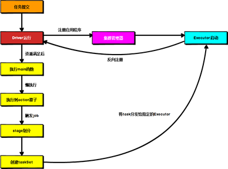

#### Yarn Client模式

Client 模式将用于监控和调度的Driver 模块在客户端执行，而不是在 Yarn 中，所以一般用于测试。

+ Driver 在任务提交的本地机器上运行
+ Driver 启动后会和ResourceManager 通讯申请启动ApplicationMaster
+ ResourceManager 分配 container，在合适的NodeManager 上启动ApplicationMaster，负责向ResourceManager 申请 Executor 内存
+ ResourceManager 接到 ApplicationMaster 的资源申请后会分配 container，然后ApplicationMaster 在资源分配指定的NodeManager 上启动 Executor 进程
+ Executor 进程启动后会向Driver 反向注册，Executor 全部注册完成后Driver 开始执行main 函数
+ 之后执行到 Action 算子时，触发一个 Job，并根据宽依赖开始划分 stage，每个stage 生成对应的TaskSet，之后将 task 分发到各个Executor 上执行。

#### Yarn Cluster模式

Cluster 模式将用于监控和调度的 Driver 模块启动在Yarn 集群资源中执行。一般应用于实际生产环境。

+ 在 YARN Cluster 模式下，任务提交后会和ResourceManager 通讯申请启动ApplicationMaster，
+ 随后ResourceManager 分配 container，在合适的 NodeManager 上启动 ApplicationMaster，此时的 ApplicationMaster 就是Driver。
+ Driver 启动后向 ResourceManager 申请Executor 内存，ResourceManager 接到ApplicationMaster 的资源申请后会分配container，然后在合适的NodeManager 上启动Executor 进程
+ Executor 进程启动后会向Driver 反向注册，Executor 全部注册完成后Driver 开始执行main 函数，
+ 之后执行到 Action 算子时，触发一个 Job，并根据宽依赖开始划分 stage，每个stage 生成对应的TaskSet，之后将 task 分发到各个Executor 上执行。

## Sparck Core

Spark 计算框架为了能够进行高并发和高吞吐的数据处理，封装了三大数据结构，用于处理不同的应用场景。**三大数据结构分别是**：

+ RDD : 弹性分布式数据集
+ 累加器：分布式共享只写变量
+ 广播变量：分布式共享只读变量

### RDD 概述

#### 概念

​		RDD（Resilient Distributed Dataset）叫做**弹性分布式数据集**，是 Spark 中最基本的数据处理模型。代码中是一个抽象类，它代表一个弹性的、不可变、可分区、里面的元素可并行计算的集合。

+ 弹性
  + 存储的弹性：内存与磁盘的自动切换；
  + 容错的弹性：数据丢失可以自动恢复；
  + 计算的弹性：计算出错重试机制；
  + 分片的弹性：可根据需要重新分片。

+ 分布式：数据存储在大数据集群不同节点上
+ 数据集：RDD 封装了计算逻辑，并不保存数据
+ 数据抽象：RDD 是一个抽象类，需要子类具体实现
+ 不可变：RDD 封装了计算逻辑，是不可以改变的，想要改变，只能产生新的RDD，在新的RDD 里面封装计算逻辑
+ 可分区、并行计算

#### 执行原理

+ 从计算的角度来讲，数据处理过程中需要计算资源（内存 & CPU）和计算模型（逻辑）。执行时，需要将计算资源和计算模型进行协调和整合。

+ Spark 框架在执行时，先申请资源，然后将应用程序的数据处理逻辑分解成一个一个的计算任务。然后将任务发到已经分配资源的计算节点上, 按照指定的计算模型进行数据计算。最后得到计算结果。
+ RDD 是 Spark 框架中用于数据处理的核心模型，

### 流程概述

1. 环境准备（Yarn）
   + Driver，Executor
2. 组件通信
   + Driver => Ececutor
   + Ececutor  => Ececutor
   + Executor => Ececutor
3. 应用程序的执行
   + RDD 依赖
   + 阶段的划分
   + 任务的切分
   + 任务的调度
   + 任务的执行
4. Shuffle
   + shuffle 的原理和执行过程
   + Suffle 写磁盘
   + Shuffle 读取磁盘
5. 内存的管理
   + 内存的分类
   + 内存的配置

### RDD 算子

#### 创建方式

+ 内存创建：Spark 主要提供了两个方法：parallelize 和 makeRDD，从底层代码实现来讲，makeRDD 方法其实就是 parallelize 方法
+ **文件创建**：本地的文件系统，所有 Hadoop 支持的数据集，比如 HDFS、HBase 等，支持多种写法
+ 从其他RDD创建（不常用）
+ 直接创建（不常用）

#### 算子

##### 概述

+ 转换：功能补充和封装，将旧的RDD包装程新的RDD
  + 比如：
  + flatMap、Map等方法
+ 行动：触发任务的调度和作业的执行
  + 比如：
  + collect方法

算子分为两类 转换算子和行动算子

##### 转化算子

**种类**

+ **map** ：将处理的数据逐条进行映射转换，这里的转换可以是类型的转换，也可以是值的转换。
+ **mapPartitions**：将待处理的数据以分区为单位发送到计算节点进行处理，这里的处理是指可以进行任意的处理，哪怕是过滤数据。
+ **mapPartitionsWithIndex**：将待处理的数据以分区为单位发送到计算节点进行处理，这里的处理是指可以进行任意的处理，哪怕是过滤数据，在处理时同时可以获取当前分区索引。
+ **flatMap**：将处理的数据进行扁平化后再进行映射处理，所以算子也称之为扁平映射
+ **glom**：将同一个分区的数据直接转换为相同类型的内存数组进行处理，分区不变
+ **groupBy：**将数据根据指定的规则进行分组, 分区默认不变，但是数据会被打乱重新组合，我们将这样的操作称之为 shuffle。极限情况下，数据可能被分在同一个分区中
+ **filter**：将数据根据指定的规则进行筛选过滤，符合规则的数据保留，不符合规则的数据丢弃。当数据进行筛选过滤后，分区不变，但是分区内的数据可能不均衡，生产环境下，可能会出现数据倾斜
+ **distinct**：将数据集中重复的数据去重
+ **coalesce**：根据数据量缩减分区，用于大数据集过滤后，提高小数据集的执行效率
+ **repartition**：该操作内部其实执行的是 coalesce 操作，参数 shuffle 的默认值为 true。无论是将分区数多的RDD 转换为分区数少的 RDD，还是将分区数少的 RDD 转换为分区数多的 RDD，repartition操作都可以完成，因为无论如何都会经 shuffle 过程。
+ **sortBy**：该操作用于排序数据。在排序之前，可以将数据通过 f 函数进行处理，之后按照 f 函数处理的结果进行排序，默认为升序排列。排序后新产生的 RDD 的分区数与原 RDD 的分区数一致。中间存在 shuffle 的过程
+ **intersection**：交集
+ **union**：并集
+ **subtract**：差集
+ **zip**：将两个 RDD 中的元素，以键值对的形式进行合并。其中，键值对中的 Key 为第 1 个 RDD中的元素，Value 为第 2 个 RDD 中的相同位置的元素
+ **partitionBy**：将数据按照指定 Partitioner 重新进行分区。Spark 默认的分区器是 HashPartitioner
+ **reduceByKey**：可以将数据按照相同的 Key 对 Value 进行聚合
+ **groupByKey**：将数据源的数据根据 key 对 value 进行分组
+ **aggregateByKey**：将数据根据不同的规则进行分区内计算和分区间计算
+ **foldByKey**：当分区内计算规则和分区间计算规则相同时，aggregateByKey 就可以简化为 foldByKey
+ **combineByKey**：最通用的对 key-value 型 rdd 进行聚集操作的聚集函数（aggregation function）。类似于aggregate()，combineByKey()允许用户返回值的类型与输入不一致
+ **sortByKey**：在一个(K,V)的 RDD 上调用，K 必须实现 Ordered 接口(特质)，返回一个按照 key 进行排序
+ **join**：在类型为(K,V)和(K,W)的 RDD 上调用，返回一个相同 key 对应的所有元素连接在一起的(K,(V,W))的 RDD
+ **leftOuterJoin**：类似于 SQL 语句的左外连接
+ **cogroup**：在类型为(K,V)和(K,W)的 RDD 上调用，返回一个(K,(Iterable<V>,Iterable<W>))类型的 RDD

**map与mapPartitions两者对比**

+ 数据处理角度：Map 算子是分区内一个数据一个数据的执行，类似于串行操作。而 mapPartitions 算子是以分区为单位进行批处理操作。：
+ 功能的角度：Map 算子主要目的将数据源中的数据进行转换和改变。但是不会减少或增多数据。MapPartitions 算子需要传递一个迭代器，返回一个迭代器，没有要求的元素的个数保持不变，所以可以增加或减少数据
+ 性能的角度：Map 算子因为类似于串行操作，所以性能比较低，而是 mapPartitions 算子类似于批处理，所以性能较高。但是 mapPartitions 算子会长时间占用内存，那么这样会导致内存可能不够用，出现内存溢出的错误。所以在内存有限的情况下，不推荐使用。使用 map 操作。

##### 行动算子

**种类**

+ **reduce**：聚集 RDD 中的所有元素，先聚合分区内数据，再聚合分区间数据
+ **collect**：在驱动程序中，以数组 Array 的形式返回数据集的所有元素
+ **count**：返回 RDD 中元素的个数
+ **first**：返回 RDD 中的第一个元素
+ **take**：返回一个由 RDD 的前 n 个元素组成的数组
+ **takeOrdered**：返回该 RDD 排序后的前 n 个元素组成的数组
+ **aggregate**：分区的数据通过初始值和分区内的数据进行聚合，然后再和初始值进行分区间的数据聚合
+ **fold**：折叠操作，aggregate 的简化版操作
+ **countByKey**：统计每种 key 的个数
+ **save**：将数据保存到不同格式的文件中
+ **foreach**：分布式遍历 RDD 中的每一个元素，调用指定函数

### 序列化

**闭包检查：**检测闭包内的对象是否可以进行序列化，这个操作我们称之为闭包检测

**序列化方法和属性：**Java 的序列化能够序列化任何的类。但是比较重（字节多），序列化后，对象的提交也比较大。Spark 出于性能的考虑，Spark2.0 开始支持另外一种 Kryo 序列化机制。Kryo 速度是 Serializable 的 10 倍。当 RDD 在 Shuffle 数据的时候，简单数据类型、数组和字符串类型已经在 Spark 内部使用 Kryo 来序列化。

**注意：**即使使用 Kryo 序列化，也要继承 Serializable 接口。

### 持久化

#### Cache 缓存

RDD 通过 Cache 或者 Persist 方法将前面的计算结果缓存，默认情况下会把数据以缓存在 JVM 的堆内存中。但是并不是这两个方法被调用时立即缓存，而是触发后面的 action 算子时，该RDD 将会被缓存在计算节点的内存中，并供后面重用。

缓存有可能丢失，或者存储于内存的数据由于内存不足而被删除，RDD 的缓存容错机制保证了即使缓存丢失也能保证计算的正确执行。通过基于 RDD 的一系列转换，丢失的数据会被重算，由于 RDD 的各个 Partition 是相对独立的，因此只需要计算丢失的部分即可，并不需要重算全部 Partition。

Spark 会自动对一些 Shuffle 操作的中间数据做持久化操作(比如：reduceByKey)。这样做的目的是为了当一个节点 Shuffle 失败了避免重新计算整个输入。但是，在实际使用的时候，如果想重用数据，仍然建议调用 persist 或 cache。

#### RDD CheckPoint 检查点

所谓的检查点其实就是通过将 RDD 中间结果写入磁盘由于血缘依赖过长会造成容错成本过高，这样就不如在中间阶段做检查点容错，如果检查点之后有节点出现问题，可以从检查点开始重做血缘，减少了开销。对 RDD 进行 checkpoint 操作并不会马上被执行，必须执行 Action 操作才能触发。

#### 缓存和检查点区别

1. Cache 缓存只是将数据保存起来，不切断血缘依赖。Checkpoint 检查点切断血缘依赖。
2. Cache 缓存的数据通常存储在磁盘、内存等地方，可靠性低。Checkpoint 的数据通常存储在 HDFS 等容错、高可用的文件系统，可靠性高。
3. 建议对 checkpoint()的 RDD 使用 Cache 缓存，这样 checkpoint 的 job 只需从 Cache 缓存中读取数据即可，否则需要再从头计算一次 RDD

##### 数据存储的区别

+ cache：缓存数据保存在内存中，数据可能会丢失
+ persist：将数据临时放在磁盘文件中，进行数据重用，但是涉及到磁盘IO，性能较低，但是数据安全，如果作业执行完毕，那么临时保存的数据文件会丢失
+ checkpoint：可以将数据长久的保存在磁盘文件当中，对数据进行重用，为了保证数据安全，一般情况下，会独立进行作业，所以效率会更低。为了提高效率，一般会联合Cache进行使用。先cache后checkpoint，可以提高效率

### 分区器

对数据进行分区的类，我们同样可以自定义分区器

### 数据读取和保存

通常有三种方式

+ text：text 文件、csv 文件
+ object：对象文件是将对象序列化后保存的文件，采用 Java 的序列化机制。可以通过 objectFile[T:ClassTag](path)函数接收一个路径，读取对象文件，返回对应的 RDD，也可以通过调用saveAsObjectFile()实现对对象文件的输出。因为是序列化所以要指定类型
+ sequence：`SequenceFile` 文件是 Hadoop 用来存储二进制形式的 key-value 对而设计的一种平面文件`(FlatFile)`。

### 累加器

分布式共享只写变量

##### 实现原理

​		累加器用来把Executor 端变量信息聚合到Driver 端。在Driver 程序中定义的变量，在Executor 端的每个Task 都会得到这个变量的一份新的副本，每个 task 更新这些副本的值后， 传回Driver 端进行 merge。

### 广播变量

分布式共享只读变量

##### 实现原理

​		广播变量用来高效分发较大的对象。向所有工作节点发送一个较大的只读值，以供一个或多个 Spark 操作使用。比如，如果你的应用需要向所有节点发送一个较大的只读查询表， 广播变量用起来都很顺手。在多个并行操作中使用同一个变量，但是 Spark 会为每个任务分别发送。  

## Spark Sql

### 概述

#### 概念

​		Spark SQL 是Spark 用于结构化数据(structured data)处理的 Spark 模块。它是基于Spark core 衍生出来的新的模块，目的就是通**过Sql的方式来简化RDD的开发难度**

#### Hive and SparkSQL

​		SparkSQL 的前身是 Shark，给熟悉RDBMS 但又不理解 MapReduce 的技术人员提供快速上手的工具。

​		Hive 是早期唯一运行在Hadoop 上的SQL-on-Hadoop 工具。但是 MapReduce 计算过程中大量的中间磁盘落地过程消耗了大量的 I/O，降低的运行效率，为了提高 SQL-on-Hadoop 的效率，大量的SQL-on-Hadoop 工具开始产生，其中表现较为突出的是：

+ Drill
+ Impala
+ Shark

​        其中 Shark 是伯克利实验室 Spark 生态环境的组件之一，是基于Hive 所开发的工具，它修改了内存管理、物理计划、执行三个模块，并使之能运行在 Spark 引擎上。Shark 的出现，使得SQL-on-Hadoop 的性能比Hive 有了 10-100 倍的提高。

​		但是，随着Spark 的发展，对于野心勃勃的Spark 团队来说，**Shark 对于 Hive 的太多依赖（如采用 Hive 的语法解析器、查询优化器等等），制约了 Spark 的One Stack Rule Them All 的既定方针，制约了 Spark 各个组件的相互集成，所以提出了 SparkSQL 项目。**SparkSQL 抛弃原有 Shark 的代码，汲取了 Shark 的一些优点，如内存列存储（In-Memory Columnar Storage）、Hive 兼容性等，重新开发了SparkSQL 代码；由于摆脱了对Hive 的依赖性，SparkSQL无论在数据兼容、性能优化、组件扩展方面都得到了极大的方便，真可谓“退一步，海阔天空”。2014 年 6 月 1 日 Shark 项目和 SparkSQL 项目的主持人Reynold Xin 宣布：停止对 Shark 的开发，团队将所有资源放SparkSQL 项目上，至此，Shark 的发展画上了句话，但也因此发展出两个支线：**SparkSQL 和 Hive on Spark**。

+ 数据兼容方面 SparkSQL 不但兼容Hive，还可以从RDD、parquet 文件、JSON 文件中获取数据，未来版本甚至支持获取RDBMS 数据以及 cassandra 等NOSQL 数据；
+ 性能优化方面 除了采取 In-Memory Columnar Storage、byte-code generation 等优化技术外、将会引进Cost Model 对查询进行动态评估、获取最佳物理计划等等；
+ 组件扩展方面 无论是 SQL 的语法解析器、分析器还是优化器都可以重新定义，进行扩展。

​        其中 SparkSQL 作为 Spark 生态的一员继续发展，而不再受限于 Hive，只是兼容 Hive；而Hive on Spark 是一个Hive 的发展计划，该计划将 Spark 作为Hive 的底层引擎之一，也就是说，Hive 将不再受限于一个引擎，可以采用 Map-Reduce、Tez、Spark 等引擎。

​		对于开发人员来讲，SparkSQL 可以简化RDD 的开发，提高开发效率，且执行效率非常快，所以实际工作中，基本上采用的就是 SparkSQL。**Spark SQL 为了简化RDD 的开发， 提高开发效率，提供了 2 个编程抽象**，类似Spark Core 中的RDD

+ DataFrame
+ DataSet

#### SparkSql的特点

+ 易整合：无缝的整合了 SQL 查询和 Spark 编程
+ 统一的数据访问：使用相同的方式连接不同的数据源
+ **兼容 Hive**：在已有的仓库上直接运行 SQL 或者 HiveQL
+ 标准数据连接：通过 JDBC 或者 ODBC 来连接

#### DataFrame 是什么

​		在 Spark 中，DataFrame 是一种以 RDD 为基础的分布式数据集，类似于传统数据库中的二维表格。DataFrame 与 RDD 的主要区别在于，前者带有 schema 元信息，即 **DataFrame 所表示的二维表数据集的每一列都带有名称和类型。这使得 Spark SQL 得以洞察更多的结构信息**，从而对藏于 DataFrame 背后的数据源以及作用于 DataFrame 之上的变换进行了针对性的优化，最终达到大幅提升运行时效率的目标。反观 RDD，由于无从得知所存数据元素的具体内部结构，Spark Core 只能在 stage 层面进行简单、通用的流水线优化。

​		同时，与Hive 类似，DataFrame 也支持嵌套数据类型（struct、array 和 map）。从 API 易用性的角度上看，DataFrame API 提供的是一套高层的关系操作，比函数式的 RDD API 要更加友好，门槛更低。

#### DataSet 是什么

​		DataSet 是分布式数据集合。DataSet 是Spark 1.6 中添加的一个新抽象，是DataFrame的一个扩展。它提供了RDD 的优势（强类型，使用强大的 lambda 函数的能力）以及Spark SQL 优化执行引擎的优点。DataSet 也可以使用功能性的转换（操作 map，flatMap，filter等等）。

+ DataSet 是DataFrame API 的一个扩展，是SparkSQL 最新的数据抽象
+ 用户友好的 API 风格，既具有类型安全检查也具有DataFrame 的查询优化特性；
+ 用样例类来对DataSet 中定义数据的结构信息，样例类中每个属性的名称直接映射到

DataSet 中的字段名称；

+ DataSet 是强类型的。比如可以有 DataSet[Car]，DataSet[Person]。
+ DataFrame 是DataSet 的特列，DataFrame=DataSet[Row] ，所以可以通过 as 方法将DataFrame 转换为DataSet。Row 是一个类型，跟 Car、Person 这些的类型一样，所有的表结构信息都用 Row 来表示。获取数据时需要指定顺序

### 编程概念

#### 注意

​		本课件重点学习如何使用 Spark SQL 所提供的 DataFrame 和DataSet 模型进行编程.， 以及了解它们之间的关系和转换，关于具体的SQL 书写不是我们的重点。

#### 新的起点

​		Spark Core 中，如果想要执行应用程序，需要首先构建上下文环境对象 SparkContext， Spark SQL 其实可以理解为对 Spark Core 的一种封装，不仅仅在模型上进行了封装，上下文环境对象也进行了封装。

​		在老的版本中，SparkSQL 提供两种 SQL 查询起始点：一个叫 SQLContext，用于 Spark自己提供的SQL 查询；一个叫HiveContext，用于连接 Hive 的查询。

 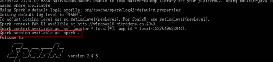

​		SparkSession 是 Spark 最新的 SQL 查询起始点，实质上是 SQLContext 和HiveContext 的组合，所以在 SQLContex 和HiveContext 上可用的API 在 SparkSession 上同样是可以使用的。SparkSession 内部封装了 SparkContext，所以计算实际上是由 sparkContext 完成的。当我们使用 spark-shell 的时候, spark 框架会自动的创建一个名称叫做 spark 的SparkSession 对象, 就像我们以前可以自动获取到一个 sc 来表示 SparkContext 对象一样

#### DataFrame

​		Spark SQL 的DataFrame API 允许我们使用 DataFrame 而不用必须去注册临时表或者生成 SQL 表达式。DataFrame API 既有 transformation 操作也有 action 操作。

##### 创建 DataFrame

在 Spark SQL 中 SparkSession 是创建DataFrame 和执行 SQL 的入口，创建 DataFrame有三种方式：

1. 通过Spark 的数据源进行创建；
2. 从一个存在的RDD 进行转换；
3. 还可以从HiveTable 进行查询返回。

##### SQL 语法

##### DSL 语法

​		DataFrame 提供一个特定领域语言(domain-specific language, DSL)去管理结构化的数据。可以在 Scala, Java, Python 和 R 中使用 DSL，使用 DSL 语法风格不必去创建临时视图了

##### RDD 转换为 DataFrame

​		在 IDEA 中开发程序时，如果需要RDD 与DF 或者DS 之间互相操作，那么需要引入 import spark.implicits._这里的 spark 不是Scala 中的包名，而是创建的 sparkSession 对象的变量名称，所以必须先创建 SparkSession 对象再导入。这里的 spark 对象不能使用var 声明，因为 Scala 只支持val 修饰的对象的引入。

##### DataFrame 转换为 RDD

​		DataFrame 其实就是对RDD 的封装，所以可以直接获取内部的RDD

####  创建 DataSet

#### DataFrame 和 DataSet 转换

​		DataFrame 其实是DataSet 的特例，所以它们之间是可以互相转换的。

#### RDD、DataFrame、DataSet 三者的关系

​		在 SparkSQL 中 Spark 为我们提供了两个新的抽象，分别是 DataFrame 和 DataSet。他们和 RDD 有什么区别呢？首先从版本的产生上来看：

+ Spark1.0 => RDD
+ Spark1.3 => DataFrame
+ Spark1.6 => Dataset

​    如果同样的数据都给到这三个数据结构，他们分别计算之后，都会给出相同的结果。不同是的他们的执行效率和执行方式。**在后期的 Spark 版本中，DataSet 有可能会逐步取代RDD和 DataFrame 成为唯一的API 接口**

##### 共性

+ RDD、DataFrame、DataSet 全都是 spark 平台下的分布式弹性数据集，为处理超大型数据提供便利;
+ 三者都有惰性机制，在进行创建、转换，如 map 方法时，不会立即执行，只有在遇到Action 如 foreach 时，三者才会开始遍历运算;
+ 三者有许多共同的函数，如 filter，排序等;
+  在对DataFrame 和Dataset 进行操作许多操作都需要这个包:import spark.implicits._（在创建好 SparkSession 对象后尽量直接导入）
+ 三者都会根据 Spark 的内存情况自动缓存运算，这样即使数据量很大，也不用担心会内存溢出
+ 三者都有 partition 的概念
+ DataFrame 和DataSet 均可使用模式匹配获取各个字段的值和类型

##### 区别

1. RDD
   1. RDD 一般和 spark mllib 同时使用
   2. RDD 不支持 sparksql 操作
2. DataFrame
   1. 与 RDD 和 Dataset 不同，DataFrame 每一行的类型固定为Row，每一列的值没法直接访问，只有通过解析才能获取各个字段的值
   2. DataFrame 与DataSet 一般不与 spark mllib 同时使用
   3. DataFrame 与DataSet 均支持 SparkSQL 的操作，比如 select，groupby 之类，还能注册临时表/视窗，进行 sql 语句操作
   4. DataFrame 与DataSet 支持一些特别方便的保存方式，比如保存成 csv，可以带上表头，这样每一列的字段名一目了然(后面专门讲解)
3. DataSet
   1. Dataset 和DataFrame 拥有完全相同的成员函数，区别只是每一行的数据类型不同
   2. DataFrame 其实就是DataSet 的一个特例 type DataFrame = Dataset[Row]
   3. DataFrame 也可以叫Dataset[Row],每一行的类型是 Row，不解析，每一行究竟有哪些字段，各个字段又是什么类型都无从得知，只能用上面提到的 getAS 方法或者共性中的第七条提到的模式匹配拿出特定字段。而Dataset 中，每一行是什么类型是不一定的，在自定义了 case class 之后可以很自由的获得每一行的信息

## Spark Streaming

### 概述

#### 概念

​		Spark 流使得构建可扩展的容错流应用程序变得更加容易。

​		Spark Streaming 用于流式数据的处理。Spark Streaming 支持的数据输入源很多，例如：Kafka、 Flume、Twitter、ZeroMQ 和简单的 TCP 套接字等等。数据输入后可以用 Spark 的高度抽象原语如：map、reduce、join、window 等进行运算。而结果也能保存在很多地方，如 HDFS，数据库等。

​		和 Spark 基于 RDD 的概念很相似，Spark Streaming 使用离散化流(discretized stream)作为抽象表示，叫作DStream。DStream 是随时间推移而收到的数据的序列。在内部，每个时间区间收到的数据都作为 RDD 存在，而 DStream 是由这些RDD 所组成的序列(因此得名“离散化”)。所以简单来将，DStream 就是对 RDD 在实时数据处理场景的一种封装。

#### 特点

1. 易用
2. 容错
3. 方便整合到Spark中

#### 架构图

1. 整体架构图

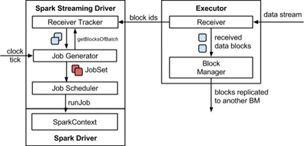

2. Strraming 架构图

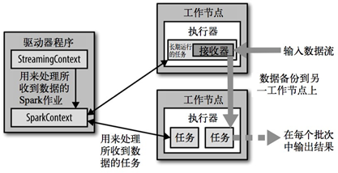

### 结合Kafka

### DStream 转化

Dstream的操作类似于RDD，分为转化和输出

### 无状态输出

在时间周期的的状态进行汇总

### 有状态转化

会有一块内存区域记录所有的时间周期汇总数据，需要设置检查点

### Transform

### Join

两个流之间的 join 需要两个流的批次大小一致，这样才能做到同时触发计算。计算过程就是对当前批次的两个流中各自的 RDD 进行 join，与两个 RDD 的 join 效果相同。

## 快速上手

### Spark Core

#### 创建Maven项目

~~~Xml
<dependencies>
    <dependency>
        <groupId>org.apache.spark</groupId>
        <artifactId>spark-core_2.12</artifactId>
        <version>3.0.0</version>
    </dependency>
</dependencies>
<build>
    <plugins>
        <!-- 该插件用于将 Scala 代码编译成 class 文件 -->
        <plugin>
            <groupId>net.alchim31.maven</groupId>
            <artifactId>scala-maven-plugin</artifactId>
            <version>3.2.2</version>
            <executions>
                <execution>
                    <!-- 声明绑定到 maven 的 compile 阶段 -->
                    <goals>
                        <goal>testCompile</goal>
                    </goals>
                </execution>
            </executions>
        </plugin>
        <plugin>
            <groupId>org.apache.maven.plugins</groupId>
            <artifactId>maven-assembly-plugin</artifactId>
            <version>3.1.0</version>
            <configuration>
                <descriptorRefs>
                    <descriptorRef>jar-with-dependencies</descriptorRef>
                </descriptorRefs>
            </configuration>
            <executions>
                <execution>
                    <id>make-assembly</id>
                    <phase>package</phase>
                    <goals>
                        <goal>single</goal>
                    </goals>
                </execution>
            </executions>
        </plugin>
    </plugins>
</build>
~~~

#### 增加Scala插件

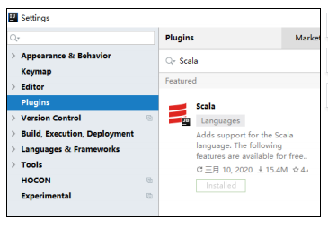

#### WordCount.scala

~~~scala
// 创建 Spark 运行配置对象
val sparkConf = new SparkConf().setMaster("local[*]").setAppName("WordCount")

// 创建 Spark 上下文环境对象（连接对象）
val sc : SparkContext = new SparkContext(sparkConf)

// 读取文件数据
val fileRDD: RDD[String] = sc.textFile("input/word.txt")

// 将文件中的数据进行分词
val wordRDD: RDD[String] = fileRDD.flatMap( _.split(" ") )

// 转换数据结构 word => (word, 1)
val word2OneRDD: RDD[(String, Int)] = wordRDD.map((_,1))

// 将转换结构后的数据按照相同的单词进行分组聚合
val word2CountRDD: RDD[(String, Int)] = word2OneRDD.reduceByKey(_+_)

// 将数据聚合结果采集到内存中
val word2Count: Array[(String, Int)] = word2CountRDD.collect()

// 打印结果
word2Count.foreach(println)

//关闭 Spark 连接
sc.stop()

~~~

#### 配置日志

log4j.properties

~~~properties
log4j.rootCategory=ERROR, console
log4j.appender.console=org.apache.log4j.ConsoleAppender
log4j.appender.console.target=System.err
log4j.appender.console.layout=org.apache.log4j.PatternLayout
log4j.appender.console.layout.ConversionPattern=%d{yy/MM/dd HH:mm:ss} %p %c{1}: %m%n
# Set the default spark-shell log level to ERROR. When running the spark-shell, the
# log level for this class is used to overwrite the root logger's log level, so that
# the user can have different defaults for the shell and regular Spark apps.log4j.logger.org.apache.spark.repl.Main=ERROR
# Settings to quiet third party logs that are too verbose
log4j.logger.org.spark_project.jetty=ERROR
log4j.logger.org.spark_project.jetty.util.component.AbstractLifeCycle=ERROR
log4j.logger.org.apache.spark.repl.SparkIMain$exprTyper=ERROR
log4j.logger.org.apache.spark.repl.SparkILoop$SparkILoopInterpreter=ERROR
log4j.logger.org.apache.parquet=ERROR
log4j.logger.parquet=ERROR
# SPARK-9183: Settings to avoid annoying messages when looking up nonexistent UDFs in SparkSQL with Hive support
log4j.logger.org.apache.hadoop.hive.metastore.RetryingHMSHandler=FATAL
log4j.logger.org.apache.hadoop.hive.ql.exec.FunctionRegistry=ERROR
~~~

#### 异常处理

如果本机操作系统是 Windows，在程序中使用了 Hadoop 相关的东西，比如写入文件到HDFS，则会遇到如下异常：

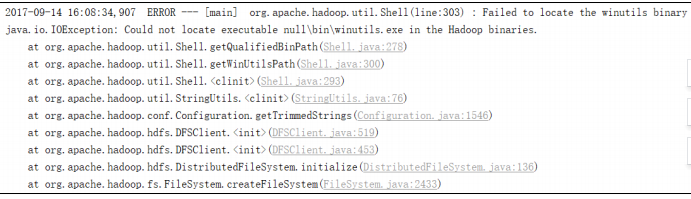

出现这个问题的原因，并不是程序的错误，而是 windows 系统用到了 hadoop 相关的服务，解决办法是通过配置关联到 windows 的系统依赖就可以了

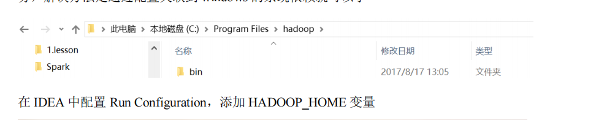

### SparkSQL

#### 添加依赖

~~~xml
<dependency>
    <groupId>org.apache.spark</groupId>
    <artifactId>spark-sql_2.12</artifactId>
    <version>3.0.0</version>
</dependency>

~~~

#### 代码实现

~~~scala
object SparkSQL01_Demo {
    def main(args: Array[String]): Unit = {
        //创建上下文环境配置对象
        val conf: SparkConf = new SparkConf().setMaster("local[*]").setAppName("SparkSQL01_Demo")

        //创建 SparkSession 对象
        val spark: SparkSession = SparkSession.builder().config(conf).getOrCreate()
        //RDD=>DataFrame=>DataSet 转换需要引入隐式转换规则，否则无法转换
        //spark 不是包名，是上下文环境对象名
        import spark.implicits._

        //读取 json 文件 创建 DataFrame {"username": "lisi","age": 18} val df: DataFrame = spark.read.json("input/test.json")
        //df.show()

        //SQL 风格语法
        df.createOrReplaceTempView("user")
        //spark.sql("select avg(age) from user").show

        //DSL 风格语法
        //df.select("username","age").show()

        //*****RDD=>DataFrame=>DataSet*****
        //RDD
        val rdd1: RDD[(Int, String, Int)] = spark.sparkContext
        						.makeRDD(List((1,"zhangsan",30),(2,"lisi",28),(3,"wangwu", 20)))

        //DataFrame
        val df1: DataFrame = rdd1.toDF("id","name","age")
        //df1.show()

        //DateSet
        val ds1: Dataset[User] = df1.as[User]
        //ds1.show()

        //*****DataSet=>DataFrame=>RDD*****
        //DataFrame
        val df2: DataFrame = ds1.toDF()

        //RDD 返回的 RDD 类型为 Row，里面提供的 getXXX 方法可以获取字段值，类似 jdbc 处理结果集， 但是索引从 0 开始
        val rdd2: RDD[Row] = df2.rdd
        //rdd2.foreach(a=>println(a.getString(1)))

        //*****RDD=>DataSet***** rdd1.map{
        case (id,name,age)=>User(id,name,age)
    }.toDS()

        //*****DataSet=>=>RDD***** ds1.rdd

        //释放资源spark.stop()
	}
}
case class User(id:Int,name:String,age:Int)

~~~

### Streaming

1. 添加依赖
2. 编写代码

~~~~scala
object StreamWordCount {

def main(args: Array[String]): Unit = {

    //1.初始化 Spark 配置信息
    val sparkConf = new SparkConf().setMaster("local[*]").setAppName("StreamWordCount")

    //2.初始化 SparkStreamingContext
    val ssc = new StreamingContext(sparkConf, Seconds(3))

    //3.通过监控端口创建 DStream，读进来的数据为一行行
    val lineStreams = ssc.socketTextStream("linux1", 9999)

    //将每一行数据做切分，形成一个个单词
    val wordStreams = lineStreams.flatMap(_.split(" "))

    //将单词映射成元组（word,1）
    val wordAndOneStreams = wordStreams.map((_, 1))

    //将相同的单词次数做统计
    val wordAndCountStreams = wordAndOneStreams.reduceByKey(_+_)

    //打印
    wordAndCountStreams.print()

    //启动 
    SparkStreamingContext ssc.start() ssc.awaitTermination()
    }
}

~~~~

