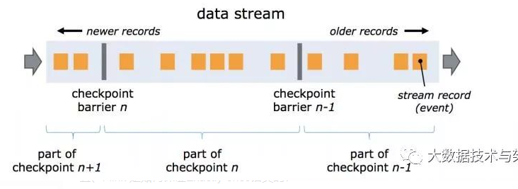

# Flink

## 概述

### 概念

​		Flink 是 Apache 基金会旗下的一个开源大数据处理框架，是一个框架和分布式处理引擎，用于对无界和有界数据流进行有状态计算。并且 Flink 提供了数据分布、容错机制以及资源管理等核心功能


### Flink 历史

​		2019 年是大数据实时计算领域最不平凡的一年，2019 年 1 月阿里巴巴 Blink （内部的 Flink 分支版本）开源，大数据领域一夜间从 Spark 独步天下走向了两强争霸的时代。Flink 因为其天然的流式计算特性以及强大的处理性能成为炙手可热的大数据处理框架。

### 为什么用 Flink

​		主要考虑的是 flink 的低延迟、高吞吐量和对流式数据应用场景更好的支持；另外，flink 可以很好地处理乱序数据，而且可以保证 exactly-once 的状态一致性。总结下来就是：**数据规模大、实时性要求高、确保结果准确、方便扩展、故障后可恢复**

### Flink 的使用场景

1. 电商和市场营销：**实时**数据报表、广告投放、**实时**推荐
2. 物联网（IOT）：传感器**实时**数据采集和显示、**实时**报警，交通运输业
3. 物流配送和服务业：订单状态**实时**更新、通知信息推送
4. 银行和金融业：**实时**结算和通知推送，**实时**检测异常行为

### Flink 的核心特性？

1. 结果的准确性。Flink 提供了事件时间（event-time）和处理时间（processing-time）语义。对于乱序事件流，事件时间语义仍然能提供一致且准确的结果。
2. 高性能：高吞吐和低延迟。每秒处**理数百万个事件**，毫秒级延迟。
3. 丰富的存储生态：可以连接到最常用的存储系统，如 Apache Kafka、Apache Cassandra、Elasticsearch、JDBC、Kinesis 和（分布式）文件系统，如 HDFS 和 S3。
4. 集群高可用：本身高可用的设置，加上与 K8s，YARN 和 Mesos 的紧密集成，再加上从故障中快速恢复和动态扩展任务的能力，Flink 能做到以极少的停机时间 7×24 全天候运行。

### Flink 分层API


1. 底层APIs：最底层级的抽象仅仅提供了有状态流，
2.  DataStream API：大多数应用并不需要上述的底层抽象，而是直接针对核心 API（Core APIs） 进行编程，比如 DataStream API（用于处理有界或无界流数据）以及 DataSet API（用于处理有界数据集）。
3. Table API ：是以表为中心的声明式编程，其中表在表达流数据时会动态变化。Table API 遵循关系模型：表有二维数据结构（schema）（类似于关系数据库中的表），同时 API 提供可比较的操作，例如 select、join、group-by、aggregate 等。尽管 Table API 可以通过多种类型的用户自定义函数（UDF）进行扩展，仍不如核心 API更具表达能力，但是使用起来代码量更少，更加简洁
4. SQL：Flink 提供的最高层级的抽象是 SQL。这一层抽象在语法与表达能力上与 Table API 类似，但是是以 SQL 查询表达式的形式表现程序。SQL 抽象与 Table API 交互密切，同时 SQL 查询可以直接在 Table API 定义的表上执行。

总结：目前 Flink SQL 和 Table API 还在开发完善的过程中，很多大厂都会二次开发符合自己需要的工具包。而 DataSet 作为批处理 API 实际应用较少，2020 年 12 月 8 日发布的新版本 1.12.0, 已经完全实现了真正的流批一体，DataSet API 已处于软性弃用（soft deprecated）的状态。用Data Stream API 写好的一套代码, 即可以处理流数据, 也可以处理批数据，只需要设置不同的行模式。这与之前版本处理有界流的方式是不一样的，Flink 已专门对批处理数据做了优化处理。本书中以介绍 DataStream API 为主，采用的是目前最新版本 Flink 1.13.0。


### 对比Spark

​		因为两个框架的不同点非常之多。但是在面试时有非常重要的一点一定要回答出来：Flink 是标准的实时处理引擎，基于事件驱动。而 Spark Streaming 是微批（Micro-Batch）的模型。

1. 架构模型
   1. Spark Streaming 在运行时的主要角色包括：Master、Worker、Driver、Executor，
   2. Flink 在运行时主要包含：Jobmanager、Taskmanager和Slot。

2. 任务调度
   1. Spark Streaming 连续不断的生成微小的数据批次，构建有向无环图DAG，Spark Streaming 会依次创建 DStreamGraph、JobGenerator、JobScheduler。
   2. Flink 根据用户提交的代码生成 StreamGraph，经过优化生成 JobGraph，然后提交给 JobManager进行处理，JobManager 会根据 JobGraph 生成 ExecutionGraph，ExecutionGraph 是 Flink 调度最核心的数据结构，JobManager 根据 ExecutionGraph 对 Job 进行调度。
3. 时间机制
   1. Spark Streaming 支持的时间机制有限，只支持处理时间。 Flink 支持了流处理程序在时间上的三个定义：处理时间、事件时间、注入时间。同时也支持 watermark 机制来处理滞后数据。
4. 容错机制
   1. 对于 Spark Streaming 任务，我们可以设置 checkpoint，然后假如发生故障并重启，我们可以从上次 checkpoint 之处恢复，但是这个行为只能使得数据不丢失，可能会重复处理，不能做到恰好一次处理语义。
   2. Flink 则使用两阶段提交协议来解决这个问题。
5. Github Star
   1. 目前Spark 仍然是主流：33.1 K，spark 的生态会更加成熟
   2. Flink 后来居上，目前：19.1 K

## 基本概念

### 源数据类型

+ 批处理：原本的文本文件处理（DataSet Api - Flink1.12后处于软弃用状态）
+ 流处理文件：将文件看成是有界（DataStream Api， 通过流的方式处理文件）

### Flink 组件

到 Flink 中的几个关键组件：客户端（Client）、作业管理器（JobManager）和任务管理器（TaskManager）。

我们的代码，实际上是由客户端获取并做转换，之后提交给JobManger 的。所以 JobManager 就是 Flink 集群里的“管事人”，对作业进行中央调度管理；而它获取到要执行的作业后，会进一步处理转换，然后分发任务给众多的 TaskManager。这里的 TaskManager，就是真正“干活的人”，数据的处理操作都是它们来做的。

### 部署模式

+  会话模式（Session Mode）
   +  需要先启动一个集群，保持一个会话，在这个会话中通过客户端提交作业，集群的生命周期是超越于作业之上
   +  集群启动时所有资源就都已经确定，所以所有提交的作业会竞争集群中的资源
   +  比较适合于单个规模小、执行时间短的大量作业
   +  但是：会话模式因为资源共享会导致很多问题

+  单作业模式（Per-Job Mode）
   +  严格的一对一，集群只为这个作业而生。同样由客户端运行应用程序，然后启动集群，作业被提交给 JobManager，进而分发给 TaskManager 执行。作业作业完成后，集群就会关闭，所有资源也会释放
   +  以是实际应用的首选模式；需要注意的是，Flink 本身无法直接这样运行，所以单作业模式一般需要借助一些资源管理框架来启动集群，比如 YARN、Kubernetes。

+  应用模式（Application Mode）
   +  不要客户端了，直接把应用提交到 JobManger 上运行。而这也就代表着，我们需要为每一个提交的应用单独启动一个 JobManager，也就是创建一个集群。这个 JobManager 只为执行这一个应用而存在，执行结束之后 JobManager 也就关闭了，这就是所谓的应用模式
   +  而应用模式下，是直接由 JobManager 执行应用程序的，并且即使应用包含了多个作业，也只创建一个集群。


### 独立模式

独立模式（Standalone）是部署 Flink 最基本也是最简单的方式：所需要的所有 Flink 组件，都只是操作系统上运行的一个 JVM 进程。独立模式是独立运行的，不依赖任何外部的资源管理平台；当然独立也是有代价的：如果资源不足，或者出现故障，没有自动扩展或重分配资源的保证，必须手动处理。

### YARN模式

Flink 是大数据计算框架，不是资源调度框架，这并不是它的强项；国内应用最为广泛的资源管理平台就是 YARN了。整体来说，YARN 上部署的过程是：客户端把 Flink 应用提交给 Yarn 的 ResourceManager,Yarn 的 ResourceManager 会向 Yarn 的 NodeManager 申请容器。在这些容器上，Flink 会部署JobManager 和 TaskManager 的实例，从而启动集群。Flink 会根据运行在 JobManger 上的作业所需要的 Slot 数量动态分配 TaskManager 资源

### K8S模式

容器化部署是如今业界流行的一项技术，基于 Docker 镜像运行能够让用户更加方便地对应用进行管理和运维。容器管理工具中最为流行的就是 Kubernetes（k8s），而 Flink 也在最近的版本中支持了 k8s 部署模式。基本原理与 YARN 是类似

#### 总结 

基于Yarn的单作业模式或者会话模式中的其中一个

## 架构

### 运行时架构


JobManager 和 TaskManagers 可以以不同的方式启动：

+ 作为独立（Standalone）集群的进程，直接在机器上启动
+ 在容器中启动
+ 由资源管理平台调度启动，比如 YARN、K8S

这其实就对应着不同的部署方式。

TaskManager 启动之后，JobManager 会与它建立连接，并将作业图（JobGraph）转换成可执行的“执行图”（ExecutionGraph）分发给可用的 TaskManager，然后就由 TaskManager 具体执行任务。接下来，我们就具体介绍一下 JobManger 和 TaskManager 在整个过程中扮演的角色。

#### 作业管理器（JobManager）

JobManager 是一个 Flink 集群中任务管理和调度的核心，是控制应用执行的主进程。也就是说，每个应用都应该被唯一的 JobManager 所控制执行。当然，在高可用（HA）的场景下，可能会出现多个 JobManager；这时只有一个是正在运行的领导节点（leader），其他都是备用节点（standby）。JobManger 又包含 3 个不同的组件，下面我们一一讲解

+  JobMaster：JobMaster 是 JobManager 中最核心的组件，负责处理单独的作业（Job）。所以 JobMaster和具体的 Job 是一一对应的，多个 Job 可以同时运行在一个 Flink 集群中, 每个 Job 都有一个自己的 JobMaster。
+ ResourceManager：在 Flink 集群中只有一个。所谓“资源”，主要是指 TaskManager 的任务槽（task slots）。任务槽就是 Flink 集群中的资源调配单元，包含了机器用来执行计算的一组 CPU 和内存资源。每一个任务（Task）都需要分配到一个 slot 上执行。这里注意要把 Flink 内置的 ResourceManager 和其他资源管理平台（比如 YARN）的ResourceManager 区分开。
+ 分发器（Dispatcher）：Dispatcher 主要负责提供一个 REST 接口，用来提交应用，并且负责为每一个新提交的作业启动一个新的 JobMaster 组件

#### 任务管理器（TaskManager）

TaskManager 是 Flink 中的工作进程，数据流的具体计算就是它来做的，所以也被称为“Worker”。Flink 集群中必须至少有一个 TaskManager

### 作业提交流程

#### 高层级抽象视角

本土主要展示作业提交时宏观上各组件是怎样交互协作的


具体步骤如下：

1. 一般情况下，由客户端（App）通过分发器提供的 REST 接口，将作业提交给JobManager。
2. 由分发器启动 JobMaster，并将作业（包含 JobGraph）提交给 JobMaster。
3. JobMaster 将 JobGraph 解析为可执行的 ExecutionGraph，得到所需的资源数量，然后向资源管理器请求资源（slots）。
4. 资源管理器判断当前是否由足够的可用资源；如果没有，启动新的 TaskManager。
5. TaskManager 启动之后，向 ResourceManager 注册自己的可用任务槽（slots）
6. 资源管理器通知 TaskManager 为新的作业提供 slots。
7. TaskManager 连接到对应的 JobMaster，提供 slots。
8. JobMaster 将需要执行的任务分发给 TaskManager。
9. TaskManager 执行任务，互相之间可以交换数据。

注意：**如果部署模式不同，或者集群环境不同（例如 Standalone、YARN、K8S 等），其中一些步骤可能会不同或被省略，也可能有些组件会运行在同一个 JVM 进程中。**

### 一些重要概念

#### 数据流图

Flink 是流式计算框架。它的程序结构，其实就是定义了一连串的处理操作，每一个数据输入之后都会依次调用每一步计算。在 Flink 代码中，我们定义的每一个处理转换操作都叫作“算子”（Operator），所以我们的程序可以看作是一串算子构成的管道，数据则像水流一样有序地流过。比如在之前的 WordCount 代码中，基于执行环境调用的 socketTextStream()方法，就是一个读取文本流的算子；而后面的 flatMap()方法，则是将字符串数据进行分词、转换成二元组的算子。

所有的 Flink 程序都可以归纳为由三部分构成：Source、Transformation 和 Sink。

+ Source 表示“源算子”，负责读取数据源。
+ Transformation 表示“转换算子”，利用各种算子进行处理加工。
+ Sink 表示“下沉算子”，负责数据的输出。

在运行时，Flink 程序会被映射成所有算子按照逻辑顺序连接在一起的一张图，这被称为“逻辑数据流”（logical dataflow），或者叫“数据流图”（dataflow graph）。我们提交作业之后，打开 Flink 自带的 Web UI，点击作业就能看到对应的 dataflow。


####  并行度

+ **并行计算：**多条数据同时到来，我们应该可以同时读入，同时在不同节点执行 flatMap 操作
+ **并行子任务和并行度：**我们把一个算子操作，“复制”多份到多个节点，数据来了之后就可以到其中任意一个执行。这样一来，**一个算子任务就被拆分成了多个并行的“子任务”（subtasks），再将它们分发到不同节点，就真正实现了并行计算**。在 Flink 执行过程中，每一个算子（operator）可以包含一个或多个子任务（operator subtask），这些子任务在不同的线程、不同的物理机或不同的容器中完全独立地执行。

#### 算子链

算子任务之间数据传输方式。

+ 一对一：这种模式下，数据流维护着分区以及元素的顺序
+ 重分区：在这种模式下，数据流的分区会发生改变。

合并算子链：并行度相同的一对一（one to one）算子操作，可以直接链接在一起形成一个“大”的任务（task），这样原来的算子就成为了真正任务里的一部分。

Flink 为什么要有算子链这样一个设计呢？这是因为将算子链接成 task 是非常有效的优化：可以减少线程之间的切换和基于缓存区的数据交换，在减少时延的同时提升吞吐量。Flink 默认会按照算子链的原则进行链接合并，如果我们想要禁止合并或者自行定义，也可以在代码中对算子做一些特定的设置。

#### 任务和任务槽

Flink 中每一个 worker(也就是 TaskManager)都是一个 JVM 进程，它可以启动多个独立的线程，来并行执行多个子任务（subtask）。而在 TaskManager 中，我们可以设置多个 slot。

Flink 默认是允许 slot 共享的，如果希望某个算子对应的任务完全独占一个 slot，或者只有某一部分算子共享 slot，我们也可以通过设置“slot 共享组”手动指定。

**任务槽和并行度的关系：**

Slot 和并行度确实都跟程序的并行执行有关，但两者是完全不同的概念。简单来说，task slot 是 静 态 的 概 念 ， 是 指 TaskManager 具 有 的 并 发 执 行 能 力 ， 可 以 通 过 参 数taskmanager.numberOfTaskSlots 进行配置；而并行度（parallelism）是动态概念，也就是TaskManager 运行程序时实际使用的并发能力，可以通过参数 parallelism.default 进行配置。换句话说，并行度如果小于等于集群中可用 slot 的总数，程序是可以正常执行的，因为 slot 不一定要全部占用，有十分力气可以只用八分；而如果并行度大于可用 slot 总数，导致超出了并行能力上限，那么心有余力不足，程序就只好等待资源管理器分配更多的资源了。


## DataStream API

### 概述

Flink 有非常灵活的分层 API 设计，其中的核心层就是 DataStream/DataSet API。由于新版本已经实现了流批一体，DataSet API 将被弃用，官方推荐统一使用 DataStream API 处理流数据和批数据。

### 执行环境

+ getExecutionEnvironment：根据当前运行的上下文直接得到正确的结果：如果程序是独立运行的，就返回一个本地执行环境；如果是创建了 jar包，然后从命令行调用它并提交到集群执行，那么就返回集群的执行环境
+ createLocalEnvironment：这个方法返回一个本地执行环境。可以在调用时传入一个参数，指定默认的并行度
+ createRemoteEnvironment：这个方法返回集群执行环境。需要在调用时指定 JobManager 的主机名和端口号，并指定要在集群中运行的 Jar 包。

### 执行模式

~~~java
// 批处理环境
ExecutionEnvironment batchEnv = ExecutionEnvironment.getExecutionEnvironment();
// 流处理环境
StreamExecutionEnvironment env = StreamExecutionEnvironment.getExecutionEnvironment();
~~~

从 1.12.0 版本起，Flink 实现了 API 上的流批统一。DataStream API 新增了一个重要特性：可以支持不同的“执行模式”（execution mode），通过简单的设置就可以让一段 Flink 程序在流处理和批处理之间切换。这样一来，DataSet API 也就没有存在的必要了。


### 源算子

#### 概述

一般将数据的输入来源称为数据源(data source)，而读取数据的算子就是源算子，所以，source就是我们整个处理程序的输入端

#### 案例

+ 从集合中读取数据

~~~~java
DataStream<Event> stream = env.fromCollection(clicks);
~~~~

+ 从文件读取数据

~~~java
DataStream<String> stream = env.readTextFile("clicks.csv");
~~~

+ 从 Socket 读取数据

~~~java
DataStream<String> stream = env.socketTextStream("localhost", 7777);
~~~

+ 从 Kafka 读取数据
+ 自定义 Source 

### 转换算子

#### 概述


它是 Flink 程序的核心，其实就是所有的转换操作，它们决定了处理的业务逻辑。我们可以针对一条流进行转换处理，也可以进行分流、合流等多流转换操作，从而组合成复杂的数据流拓扑。

#### 转换算子案例

+ map：用于将数据流中的数据进行转换，形成新的数据流
+ filter：顾名思义是对数据流执行一个过滤，通过一个布尔条件表达式设置过滤条件，对于每一个流内元素进行判断，若为 true 则元素正常输出，若为 false 则元素被过滤掉，
+ flatMap：作又称为扁平映射，主要是将数据流中的整体（一般是集合类型）拆分成一个一个的个体使用

#### 聚合算子案例

+ keyBy：DataStream 是没有直接进行聚合的 API 的。因为我们对海量数据做聚合肯定要进行分区并行处理，这样才能提高效率。所以在 Flink 中，要做聚合，需要先进行分区；这个操作就是通过 keyBy 来完成的。
+ 简单聚合
  +  sum()：在输入流上，对指定的字段做叠加求和的操作。
  + min()：在输入流上，对指定的字段求最小值。
  + max()：在输入流上，对指定的字段求最大值。
  +  minBy()：与 min()类似，在输入流上针对指定字段求最小值。不同的是min()只计算指定字段的最小值，其他字段会保留最初第一个数据的值；而minBy()则会返回包含字段最小值的整条数据。
  + maxBy()：与 max()类似，在输入流上针对指定字段求最大值。两者区别与min()/minBy()完全一致。
+ 归约聚合：reduce 同简单聚合算子一样，也要针对每一个 key 保存状态。因为状态不会清空，所以我们需要将 reduce 算子作用在一个有限 key 的流上。
+ 用户自定义函数（UDF）
  + 函数类（Function Classes）
  + 匿名函数（Lambda）
  + 富函数类（Rich Function Classes）

### 物理分区

顾名思义，“分区”（partitioning）操作就是要将数据进行重新分布，传递到不同的流分区去进行下一步处理。其实我们对分区操作并不陌生，前面介绍聚合算子时，已经提到了 keyBy，它就是一种按照键的哈希值来进行重新分区的操作。只不过这种分区操作只能保证把数据按key“分开”，至于分得均不均匀、每个 key 的数据具体会分到哪一区去，这些是完全无从控制的。

有些时候，我们还需要手动控制数据分区分配策略。常见的物理分区策略有随机分配（Random）、轮询分配（Round-Robin）、重缩放（Rescale）和广播（Broadcast）

+  随机分区：可以把流中的数据随机打乱，均匀地传递到下游任务分区
+ 轮询分区：按照先后顺序将数据做依次分发
+ 重缩放分区：底层也是使用 Round-Robin算法进行轮询，但是只会将数据轮询发送到下游并行任务的一部分中
+ 广播：这种方式其实不应该叫做“重分区”，因为经过广播之后，数据会在不同的分区都保留一份，可能进行重复处理


### 输出算子

+ 输出到文件
+ 输出到Redis
+ 输出到Kafka
+ 输出到Es
+ 输出到Mysql
+ 自定义输出源

## 时间和窗口

###  Flink 中的时间语义

+ 处理时间：指执行处理操作的机器的系统时间。
+ 事件时间：是指每个事件在对应的设备上发生的时间，也就是数据生成的时间。

###  水位线

它其实就是用来度量事件时间的。在事件时间语义下，我们不依赖系统时间，而是基于数据自带的时间戳去定义了一个时钟，用来表示当前时间的进展。于是每个并行子任务都会有一个自己的逻辑时钟，它的前进是靠数据的时间戳来驱动的。

+ **有序流中的水位线：**在理想状态下，数据应该按照它们生成的先后顺序、排好队进入流中；也就是说，它们处理的过程会保持原先的顺序不变，遵守先来后到的原则。
+ **乱序流中的水位线：** 
  + 在分布式系统中，数据在节点间传输，会因为网络传输延迟的不确定性，导致顺序发生改变，这就是所谓的“乱序数据”。
+ **水位线的特性：**
  + 水位线是插入到数据流中的一个标记，可以认为是一个特殊的数据
  + 水位线主要的内容是一个时间戳，用来表示当前事件时间的进展
  + 水位线是基于数据的时间戳生成的
  + 水位线的时间戳必须单调递增，以确保任务的事件时间时钟一直向前推进
  + 水位线可以通过设置延迟，来保证正确处理乱序数据
  + 一个水位线 Watermark(t)，表示在当前流中事件时间已经达到了时间戳 t, 这代表 t 之前的所有数据都到齐了，之后流中不会出现时间戳 t’ ≤ t 的数据
+ **生成水位线**
  + 生成水位线的总体原则：如果我们希望处理得更快、实时性更强，那么可以将水位线延迟设得低一些。这种情况下，可能很多迟到数据会在水位线之后才到达，就会导致窗口遗漏数据，计算结果不准确。对于这些 “漏网之鱼”，Flink 另外提供了窗口处理迟到数据的方法。Flink 中的水位线，其实是流处理中对低延迟和结果正确性的一个权衡机制，而且把控制的权力交给了程序员，我们可以在代码中定义水位线的生成策略
  + 水位线生成策略（Watermark Strategies）
    +  Flink 内置水位线生成器
    + 自定义水位线策略
    + 在自定义数据源中发送水位线

+ **水位线的传递**


### 窗口

#### 缘由

我们已经了解了 Flink 中事件时间和水位线的概念，那它们有什么具体应用呢？当然是做基于时间的处理计算了。其中最常见的场景，就是窗口聚合计算。

在流处理中，我们往往需要面对的是连续不断、无休无止的无界流，不可能等到所有所有数据都到齐了才开始处理。所以聚合计算其实只能针对当前已有的数据——之后再有数据到来，就需要继续叠加、再次输出结果。但现实中大量数据一般会同时到来，需要并行处理，这样频繁地更新结果就会给系统带来很大负担了。

更加高效的做法是，把无界流进行切分，每一段数据分别进行聚合，结果只输出一次。这就相当于将无界流的聚合转化为了有界数据集的聚合，这就是所谓的“窗口”（Window）聚合操作。

#### 窗口概念

在 Flink 中，窗口其实并不是一个“框”，流进来的数据被框住了就只能进这一个窗口。相比之下，我们应该把窗口理解成一个“桶”，如图 6-15 所示。在 Flink 中，窗口可以把流切割成有限大小的多个“存储桶”（bucket)；每个数据都会分发到对应的桶中，当到达窗口结束时间时，就对每个桶中收集的数据进行计算处理。


窗口的处理过程：

+ 第一个数据时间戳为 2，判断之后创建第一个窗口[0, 10），并将 2 秒数据保存进去；
+ 后续数据依次到来，时间戳均在 [0, 10）范围内，所以全部保存进第一个窗口；
+ 11 秒数据到来，判断它不属于[0, 10）窗口，所以创建第二个窗口[10, 20），并将 11秒的数据保存进去。由于水位线设置延迟时间为 2 秒，所以现在的时钟是 9 秒，第一个窗口也没有到关闭时间；
+ 之后又有 9 秒数据到来，同样进入[0, 10）窗口中；
+ 12 秒数据到来，判断属于[10, 20）窗口，保存进去。这时产生的水位线推进到了 10秒，所以 [0, 10）窗口应该关闭了。第一个窗口收集到了所有的 7 个数据，进行处理计算后输出结果，并将窗口关闭销毁；
+ 同样的，之后的数据依次进入第二个窗口，遇到 20 秒的数据时会创建第三个窗口[20,30）并将数据保存进去；遇到 22 秒数据时，水位线达到了 20 秒，第二个窗口触发计算，输出结果并关闭。

####  窗口的分类

+ 按照驱动类型分类
  + 时间窗口
  + 计数窗口
+ 按照窗口分配数据的规则分类
  + 滚动窗口
  + 滑动窗口
  + 会话窗口
  + 全局窗口

### 窗口函数

+ 增量聚合函数
  + **ReduceFunction**：将窗口中收集到的数据两两进行归约
  + **AggregateFunction**：直接基于 WindowedStream 调用.aggregate()方法，就可以定义更加灵活的窗口聚合操作
    + createAccumulator：创建一个累加器，这就是为聚合创建了一个初始状态，每个聚合任务只会调用一次
    + add()：将输入的元素添加到累加器中。
    + getResult()：从累加器中提取聚合的输出结果。
    + merge()：合并两个累加器，
+ 全窗口函数：窗口操作中的另一大类就是全窗口函数。与增量聚合函数不同，全窗口函数需要先收集窗口中的数据，并在内部缓存起来，等到窗口要输出结果的时候再取出数据进行计算。
  + **ProcessWindowFunction**
  + 增量聚合和全窗口函数的结合使用

### 窗口的生命周期

+ 窗口的创建
+ 窗口计算的触发
+ 窗口的销毁

窗口 API 调用总结


Window API 首先按照时候按键分区分成两类。keyBy 之后的 KeyedStream，可以调用.window()方法声明按键分区窗口（Keyed Windows）；而如果不做 keyBy,DataStream 也可以直接调用.windowAll()声明非按键分区窗口。之后的方法调用就完全一样了。

接下来首先是通过.window()/.windowAll()方法定义窗口分配器，得到 WindowedStream；然 后 通 过 各 种 转 换 方 法 （ reduce/aggregate/apply/process ） 给 出 窗 口 函 数(ReduceFunction/AggregateFunction/ProcessWindowFunction)，定义窗口的具体计算处理逻辑，转换之后重新得到 DataStream。这两者必不可少，是窗口算子（WindowOperator）最重要的组成部分。

此外，在这两者之间，还可以基于 WindowedStream 调用.trigger()自定义触发器、调用.evictor()定义移除器、调用.allowedLateness()指定允许延迟时间、调用.sideOutputLateData()将迟到数据写入侧输出流，这些都是可选的 API，一般不需要实现。而如果定义了侧输出流可以基于窗口聚合之后的 DataStream 调用.getSideOutput()获取侧输出流

### 迟到数据的处理

+ 设置水位线延迟时间
+ 允许窗口处理迟到数据
+ 将迟到数据放入窗口侧输出流


## 处理函数

处理函数主要是定义数据流的转换操作，所以也可以把它归到转换算子中。我们知道在Flink 中几乎所有转换算子都提供了对应的函数类接口，处理函数也不例外；它所对应的函数类，就叫作 ProcessFunction。

处理函数提供了一个“定时服务”（TimerService），我们可以通过它访问流中的事件（event）、时间戳（timestamp）、水位线（watermark），甚至可以注册“定时事件”。而且处理函数继承了 AbstractRichFunction 抽象类，所以拥有富函数类的所有特性，同样可以访问状态（state）和其他运行时信息。此外，处理函数还可以直接将数据输出到侧输出流（side output）中。所以，处理函数是最为灵活的处理方法，可以实现各种自定义的业务逻辑；同时也是整个 DataStream API 的底层基础。


### 分类

+ ProcessFunction：最基本的处理函数，基于 DataStream 直接调用.process()时作为参数传入
+ **KeyedProcessFunction**：对流按键分区后的处理函数，基于 KeyedStream 调用.process()时作为参数传入。要想使用定时器，比如基于 KeyedStream。
+ **ProcessWindowFunction**：开窗之后的处理函数，也是全窗口函数的代表。基于 WindowedStream 调用.process()时作为参数传入。
+ ProcessAllWindowFunction：同样是开窗之后的处理函数，基于 AllWindowedStream 调用.process()时作为参数传入。
+ CoProcessFunction：合并（connect）两条流之后的处理函数，基于 ConnectedStreams 调用.process()时作为参数传入。
+ ProcessJoinFunction：间隔连接（interval join）两条流之后的处理函数，基于 IntervalJoined 调用.process()时作为参数传入。
+ BroadcastProcessFunction：广播连接流处理函数，基于BroadcastConnectedStream 调用.process()时作为参数传入。这里的“广播连接流”BroadcastConnectedStream，是一个未 keyBy 的普通 DataStream 与一个广播流（BroadcastStream）做连接（conncet）之后的产物。
+ KeyedBroadcastProcessFunction：按键分区的广播连接流处理函数，同样是基于 BroadcastConnectedStream 调用.process()时作为参数传入。与 BroadcastProcessFunction 不同的是，这时的广播连接流，是一个KeyedStream与广播流（BroadcastStream）做连接之后的产物。

## 多流转换

Flink 中对多条流进行转换的操作。简单划分的话，多流转换可以分为“分流”和“合流”两大类

## 状态编程

## 容错机制

## Table API 和 Sql

## CEP

# 相关面试题

#### Flink 的运行必须依赖 Hadoop组件吗

​		Flink可以完全独立于Hadoop，在不依赖Hadoop组件下运行。但是做为大数据的基础设施，Hadoop体系是任何大数据框架都绕不过去的。Flink可以集成众多Hadooop 组件，例如Yarn、Hbase、HDFS等等。例如，Flink可以和Yarn集成做资源调度，也可以读写HDFS，或者利用HDFS做检查点。

#### Flink集群有哪些角色？各自有什么作用？

Flink 程序在运行时主要有 TaskManager，JobManager，Client三种角色。


其中：

1. JobManager扮演着集群中的管理者Master的角色，它是整个集群的协调者，负责接收Flink Job，协调检查点，Failover 故障恢复等，同时管理Flink集群中从节点TaskManager。
2. TaskManager是实际负责执行计算的Worker，在其上执行Flink Job的一组Task，每个TaskManager负责管理其所在节点上的资源信息，如内存、磁盘、网络，在启动的时候将资源的状态向JobManager汇报。
3. Client是Flink程序提交的客户端，当用户提交一个Flink程序时，会首先创建一个Client，该Client首先会对用户提交的Flink程序进行预处理，并提交到Flink集群中处理，所以Client需要从用户提交的Flink程序配置中获取JobManager的地址，并建立到JobManager的连接，将Flink Job提交给JobManager。

#### Flink 资源管理中 Task Slot 的概念


​		在Flink架构角色中我们提到，TaskManager是实际负责执行计算的Worker，TaskManager 是一个 JVM 进程，并会以独立的线程来执行一个task或多个subtask。为了控制一个 TaskManager 能接受多少个 task，Flink 提出了 Task Slot 的概念。

​		简单的说，TaskManager会将自己节点上管理的资源分为不同的Slot：固定大小的资源子集。这样就避免了不同Job的Task互相竞争内存资源，但是需要主要的是，Slot只会做内存的隔离。没有做CPU的隔离。

#### 作业提交流程

高层级抽象视角


1.  一般情况下，由客户端（App）通过分发器提供的 REST 接口，将作业提交给JobManager。
2. 由分发器启动 JobMaster，并将作业（包含 JobGraph）提交给 JobMaster。
3. JobMaster 将 JobGraph 解析为可执行的 ExecutionGraph，得到所需的资源数量，然后向资源管理器请求资源（slots）。
4. 资源管理器判断当前是否由足够的可用资源；如果没有，启动新的 TaskManager
5. TaskManager 启动之后，向 ResourceManager 注册自己的可用任务槽（slots）。
6. 资源管理器通知 TaskManager 为新的作业提供 slots。
7. TaskManager 连接到对应的 JobMaster，提供 slots。
8. JobMaster 将需要执行的任务分发给 TaskManager。
9. TaskManager 执行任务，互相之间可以交换数据。

如果部署模式不同，或者集群环境不同（例如 Standalone、YARN、K8S 等），其中一些步骤可能会不同或被省略，也可能有些组件会运行在同一个 JVM 进程中。比如独立集群环境的会话模式，就是需要先启动集群，如果资源不够，只能等待资源释放，而不会直接启动新的TaskManager。

#### 数据流转图

Flink 是流式计算框架。它的程序结构，其实就是定义了一连串的处理操作，每一个数据输入之后都会依次调用每一步计算。在 Flink 代码中，我们定义的每一个处理转换操作都叫作“算子”（Operator），所以我们的程序可以看作是一串算子构成的管道，数据则像水流一样有序地流过。比如在之前的 WordCount 代码中，基于执行环境调用的 socketTextStream()方法，就是一个读取文本流的算子；而后面的 flatMap()方法，则是将字符串数据进行分词、转换成二元组的算子。

所有的 Flink 程序都可以归纳为由三部分构成：Source、Transformation 和 Sink。

+ Source 表示“源算子”，负责读取数据源。
+ Transformation 表示“转换算子”，利用各种算子进行处理加工。
+ Sink 表示“下沉算子”，负责数据的输出。

在运行时，Flink 程序会被映射成所有算子按照逻辑顺序连接在一起的一张图，这被称为“逻辑数据流”（logical dataflow），或者叫“数据流图”（dataflow graph）。我们提交作业之后，打开 Flink 自带的 Web UI，点击作业就能看到对应的 dataflow，

数据流图类似于任意的有向无环图（DAG），这一点与 Spark 等其他框架是一致的。每一条数据流（dataflow）以一个或多个 source 算子开始，以一个或多个 sink 算子结束。

#### Flink的并行度了解吗？Flink的并行度设置是怎样的？

Flink中的任务被分为多个并行任务来执行，其中每个并行的实例处理一部分数据。这些并行实例的数量被称为并行度。

我们在实际生产环境中可以从四个不同层面设置并行度：

- 操作算子层面(Operator Level)
- 执行环境层面(Execution Environment Level)
- 客户端层面(Client Level)
- 系统层面(System Level)

需要注意的优先级：算子层面>环境层面>客户端层面>系统层面。

#### Flink 的常用算子？

Flink 最常用的常用算子包括：

+ Map：DataStream → DataStream，输入一个参数产生一个参数，map的功能是对输入的参数进行转换操作。
+ Filter：过滤掉指定条件的数据。
+ KeyBy：按照指定的key进行分组。
+ Reduce：用来进行结果汇总合并。
+ Window：窗口函数，根据某些特性将每个key的数据进行分组（例如：在5s内到达的数据）

####  Flink 的组件栈有哪些？

根据 Flink 官网描述，Flink 是一个分层架构的系统，每一层所包含的组件都提供了特定的抽象，用来服务于上层组件。


图片来源于：https://flink.apache.org

自下而上，每一层分别代表：

1. Deploy 层：该层主要涉及了Flink的部署模式，在上图中我们可以看出，Flink 支持包括local、Standalone、Cluster、Cloud等多种部署模式。
2. Runtime 层：Runtime层提供了支持 Flink 计算的核心实现，比如：支持分布式 Stream 处理、JobGraph到ExecutionGraph的映射、调度等等，为上层API层提供基础服务。
3. API层：API 层主要实现了面向流（Stream）处理和批（Batch）处理API，其中面向流处理对应DataStream API，面向批处理对应DataSet API，后续版本，Flink有计划将DataStream和DataSet API进行统一。
4. Libraries层：该层称为Flink应用框架层，根据API层的划分，在API层之上构建的满足特定应用的实现计算框架，也分别对应于面向流处理和面向批处理两类。面向流处理支持：CEP（复杂事件处理）、基于SQL-like的操作（基于Table的关系操作）；面向批处理支持：FlinkML（机器学习库）、Gelly（图处理）。

#### 基本数据类型

对于常见的 Java 和 Scala 数据类型，Flink 都是支持的。Flink 在内部，Flink对支持不同的类型进行了划分，这些类型可以在 Types 工具类中找到：

1. 基本类型：所有 Java 基本类型及其包装类，再加上 Void、String、Date、BigDecimal 和 BigInteger。
2. 数组类型：包括基本类型数组（PRIMITIVE_ARRAY）和对象数组(OBJECT_ARRAY)
3. 复合数据类型：
   + Java 元组类型（TUPLE）：这是 Flink 内置的元组类型，是 Java API 的一部分。最多25 个字段，也就是从 Tuple0~Tuple25，不支持空字段
   +  Scala 样例类及 Scala 元组：不支持空字段
   + 行类型（ROW）：可以认为是具有任意个字段的元组,并支持空字段
   + POJO：Flink 自定义的类似于 Java bean 模式的类
4. 辅助类型：Option、Either、List、Map 等
5. 泛型类型（GENERIC）
6. Flink 对 POJO 类型的要求如下：
   + 类是公共的（public）和独立的（standalone，也就是说没有非静态的内部类）；
   + 类有一个公共的无参构造方法；
   + 类中的所有字段是 public 且非 final 的；或者有一个公共的 getter 和 setter 方法，这些方法需要符合 Java bean 的命名规范

#### Flink分区策略？

分区策略是用来决定数据如何发送至下游。目前 Flink 支持了8中分区策略的实现。

1. GlobalPartitioner 数据会被分发到下游算子的第一个实例中进行处理。
2. ShufflePartitioner 数据会被随机分发到下游算子的每一个实例中进行处理。
3. RebalancePartitioner 数据会被循环发送到下游的每一个实例中进行处理。
4. RescalePartitioner 这种分区器会根据上下游算子的并行度，循环的方式输出到下游算子的每个实例。这里有点难以理解，假设上游并行度为2，编号为A和B。下游并行度为4，编号为1，2，3，4。那么A则把数据循环发送给1和2，B则把数据循环发送给3和4。假设上游并行度为4，编号为A，B，C，D。下游并行度为2，编号为1，2。那么A和B则把数据发送给1，C和D则把数据发送给2。
5. BroadcastPartitioner 广播分区会将上游数据输出到下游算子的每个实例中。适合于大数据集和小数据集做Jion的场景。
6. ForwardPartitioner ForwardPartitioner 用于将记录输出到下游本地的算子实例。它要求上下游算子并行度一样。简单的说，ForwardPartitioner用来做数据的控制台打印。
7. KeyGroupStreamPartitioner Hash分区器。会将数据按 Key 的 Hash 值输出到下游算子实例中。
8. CustomPartitionerWrapper 用户自定义分区器。需要用户自己实现Partitioner接口，来定义自己的分区逻辑。例如：

```go
static classCustomPartitionerimplementsPartitioner<String> {
      @Override
      publicintpartition(String key, int numPartitions) {
          switch (key){
              case "1":
                  return 1;
              case "2":
                  return 2;
              case "3":
                  return 3;
              default:
                  return 4;
          }
      }
  }
 
```


#### Flink有没有重启策略？说说有哪几种？

Flink 实现了多种重启策略。

- 固定延迟重启策略（Fixed Delay Restart Strategy）
- 故障率重启策略（Failure Rate Restart Strategy）
- 没有重启策略（No Restart Strategy）
- Fallback重启策略（Fallback Restart Strategy）


#### Flink中的广播变量，使用时需要注意什么？

​		我们知道Flink是并行的，计算过程可能不在一个 Slot 中进行，那么有一种情况即：当我们需要访问同一份数据。那么Flink中的广播变量就是为了解决这种情况。

​		我们可以把广播变量理解为是一个公共的共享变量，我们可以把一个dataset 数据集广播出去，然后不同的task在节点上都能够获取到，这个数据在每个节点上只会存在一份。


#### Flink中的窗口？

来一张官网经典的图：


Flink 支持两种划分窗口的方式，按照time和count。如果根据时间划分窗口，那么它就是一个time-window 如果根据数据划分窗口，那么它就是一个count-window。

flink支持窗口的两个重要属性（size和interval）

如果size=interval,那么就会形成tumbling-window(无重叠数据) 如果size>interval,那么就会形成sliding-window(有重叠数据) 如果size< interval, 那么这种窗口将会丢失数据。比如每5秒钟，统计过去3秒的通过路口汽车的数据，将会漏掉2秒钟的数据。

通过组合可以得出四种基本窗口：

- time-tumbling-window 无重叠数据的时间窗口，设置方式举例：timeWindow(Time.seconds(5))
- time-sliding-window 有重叠数据的时间窗口，设置方式举例：timeWindow(Time.seconds(5), Time.seconds(3))
- count-tumbling-window无重叠数据的数量窗口，设置方式举例：countWindow(5)
- count-sliding-window 有重叠数据的数量窗口，设置方式举例：countWindow(5,3)


#### Flink中的状态存储？

link在做计算的过程中经常需要存储中间状态，来避免数据丢失和状态恢复。选择的状态存储策略不同，会影响状态持久化如何和 checkpoint 交互。

Flink提供了三种状态存储方式：

+ MemoryStateBackend、
+ FsStateBackend、
+ RocksDBStateBackend。


#### Flink 中的时间有哪几类

Flink 中的时间和其他流式计算系统的时间一样分为三类：**事件时间，摄入时间，处理时间**三种。

+ 如果以 EventTime 为基准来定义时间窗口将形成EventTimeWindow,要求消息本身就应该携带EventTime。
+ 如果以 IngesingtTime 为基准来定义时间窗口将形成 IngestingTimeWindow,以 source 的systemTime为准。
+ 如果以 ProcessingTime 基准来定义时间窗口将形成 ProcessingTimeWindow，以 operator 的systemTime 为准。

#### Flink 中水印是什么概念，起到什么作用？

Watermark 是 Apache Flink 为了处理 EventTime 窗口计算提出的一种机制, 本质上是一种时间戳。 一般来讲Watermark经常和Window一起被用来处理乱序事件。

#### Flink Table & SQL 熟悉吗？TableEnvironment这个类有什么作用

TableEnvironment是Table API和SQL集成的核心概念。

这个类主要用来：

- 在内部catalog中注册表
- 注册外部catalog
- 执行SQL查询
- 注册用户定义（标量，表或聚合）函数
- 将DataStream或DataSet转换为表
- 持有对ExecutionEnvironment或StreamExecutionEnvironment的引用


#### Flink SQL的实现原理是什么？是如何实现 SQL 解析的呢？

首先大家要知道 Flink 的SQL解析是基于Apache Calcite这个开源框架。


基于此，一次完整的SQL解析过程如下：

- 用户使用对外提供Stream SQL的语法开发业务应用
- 用calcite对StreamSQL进行语法检验，语法检验通过后，转换成calcite的逻辑树节点；最终形成calcite的逻辑计划
- 采用Flink自定义的优化规则和calcite火山模型、启发式模型共同对逻辑树进行优化，生成最优的Flink物理计划
- 对物理计划采用janino codegen生成代码，生成用低阶API DataStream 描述的流应用，提交到Flink平台执行


### 应用架构

#### Yarn Session

##### **公司怎么提交的实时任务，有多少 Job Manager、Task Manager？**

我们使用 yarn session 模式提交任务；另一种方式是每次提交都会创建一个新的 Flink 集群，为每一个 job 提供资源，任务之间互相独立，互不影响，方便管理。任务执行完成之后创建的集群也会消失。线上命令脚本如下：

~~~bash
bin/yarn-session.sh -n 7 -s 8 -jm 3072 -tm 32768 -qu root.*.* -nm *-* -d
~~~

其中申请 7 个 taskManager，每个 8 核，每个 taskmanager 有 32768M 内存。

集群默认只有一个 Job Manager。但为了防止单点故障，我们配置了高可用。对于 standlone 模式，我们公司一般配置一个主 Job Manager，两个备用 Job Manager，然后结合 ZooKeeper 的使用，来达到高可用；对于 yarn 模式，yarn 在Job Mananger 故障会自动进行重启，所以只需要一个，我们配置的最大重启次数是10 次。


#### K8s 部署

#### Flink是如何支持批流一体的？


本道面试题考察的其实就是一句话：Flink的开发者认为批处理是流处理的一种特殊情况。批处理是有限的流处理。Flink 使用一个引擎支持了DataSet API 和 DataStream API。


#### Flink是如何做到高效的数据交换的？

​		在一个Flink Job中，数据需要在不同的task中进行交换，整个数据交换是有 TaskManager 负责的，TaskManager 的网络组件首先从缓冲buffer中收集records，然后再发送。Records 并不是一个一个被发送的，二是积累一个批次再发送，batch 技术可以更加高效的利用网络资源。


#### Flink是如何做容错的？

​		Flink 实现容错主要靠强大的CheckPoint机制和State机制。Checkpoint 负责定时制作分布式快照、对程序中的状态进行备份；State 用来存储计算过程中的中间状态。


#### Flink 分布式快照的原理是什么？

Flink的分布式快照是根据Chandy-Lamport算法量身定做的。简单来说就是持续创建分布式数据流及其状态的一致快照。



#### Flink 是如何保证Exactly-once语义的？

Flink通过实现两阶段提交和状态保存来实现端到端的一致性语义。 分为以下几个步骤：

- 开始事务（beginTransaction）创建一个临时文件夹，来写把数据写入到这个文件夹里面
- 预提交（preCommit）将内存中缓存的数据写入文件并关闭
- 正式提交（commit）将之前写完的临时文件放入目标目录下。这代表着最终的数据会有一些延迟
- 丢弃（abort）丢弃临时文件

若失败发生在预提交成功后，正式提交前。可以根据状态来提交预提交的数据，也可删除预提交的数据。


#### Flink 的 kafka 连接器有什么特别的地方？

Flink源码中有一个独立的connector模块，所有的其他connector都依赖于此模块，Flink 在1.9版本发布的全新kafka连接器，摒弃了之前连接不同版本的kafka集群需要依赖不同版本的connector这种做法，只需要依赖一个connector即可。

#### 说说 Flink的内存管理是如何做的?

Flink 并不是将大量对象存在堆上，而是将对象都序列化到一个预分配的内存块上。此外，Flink大量的使用了堆外内存。如果需要处理的数据超出了内存限制，则会将部分数据存储到硬盘上。Flink 为了直接操作二进制数据实现了自己的序列化框架。

理论上Flink的内存管理分为三部分：

- Network Buffers：这个是在TaskManager启动的时候分配的，这是一组用于缓存网络数据的内存，每个块是32K，默认分配2048个，可以通过“taskmanager.network.numberOfBuffers”修改
- Memory Manage pool：大量的Memory Segment块，用于运行时的算法（Sort/Join/Shuffle等），这部分启动的时候就会分配。下面这段代码，根据配置文件中的各种参数来计算内存的分配方法。（heap or off-heap，这个放到下节谈），内存的分配支持预分配和lazy load，默认懒加载的方式。
- User Code，这部分是除了Memory Manager之外的内存用于User code和TaskManager本身的数据结构。

#### 说说 Flink的序列化如何做的?

Java本身自带的序列化和反序列化的功能，但是辅助信息占用空间比较大，在序列化对象时记录了过多的类信息。

Apache Flink摒弃了Java原生的序列化方法，以独特的方式处理数据类型和序列化，包含自己的类型描述符，泛型类型提取和类型序列化框架。

TypeInformation 是所有类型描述符的基类。它揭示了该类型的一些基本属性，并且可以生成序列化器。TypeInformation 支持以下几种类型：

- BasicTypeInfo: 任意Java 基本类型或 String 类型
- BasicArrayTypeInfo: 任意Java基本类型数组或 String 数组
- WritableTypeInfo: 任意 Hadoop Writable 接口的实现类
- TupleTypeInfo: 任意的 Flink Tuple 类型(支持Tuple1 to Tuple25)。Flink tuples 是固定长度固定类型的Java Tuple实现
- CaseClassTypeInfo: 任意的 Scala CaseClass(包括 Scala tuples)
- PojoTypeInfo: 任意的 POJO (Java or Scala)，例如，Java对象的所有成员变量，要么是 public 修饰符定义，要么有 getter/setter 方法
- GenericTypeInfo: 任意无法匹配之前几种类型的类

针对前六种类型数据集，Flink皆可以自动生成对应的TypeSerializer，能非常高效地对数据集进行序列化和反序列化。

#### Flink中的Window出现了数据倾斜，你有什么解决办法？

window产生数据倾斜指的是数据在不同的窗口内堆积的数据量相差过多。本质上产生这种情况的原因是数据源头发送的数据量速度不同导致的。出现这种情况一般通过两种方式来解决：

- 在数据进入窗口前做预聚合
- 重新设计窗口聚合的key

#### Flink中在使用聚合函数 GroupBy、Distinct、KeyBy 等函数时出现数据热点该如何解决？

数据倾斜和数据热点是所有大数据框架绕不过去的问题。处理这类问题主要从3个方面入手：

- 在业务上规避这类问题

例如一个假设订单场景，北京和上海两个城市订单量增长几十倍，其余城市的数据量不变。这时候我们在进行聚合的时候，北京和上海就会出现数据堆积，我们可以单独数据北京和上海的数据。

- Key的设计上

把热key进行拆分，比如上个例子中的北京和上海，可以把北京和上海按照地区进行拆分聚合。

- 参数设置

Flink 1.9.0 SQL(Blink Planner) 性能优化中一项重要的改进就是升级了微批模型，即 MiniBatch。原理是缓存一定的数据后再触发处理，以减少对State的访问，从而提升吞吐和减少数据的输出量。

#### Flink任务延迟高，想解决这个问题，你会如何入手？

在Flink的后台任务管理中，我们可以看到Flink的哪个算子和task出现了反压。最主要的手段是资源调优和算子调优。资源调优即是对作业中的Operator的并发数（parallelism）、CPU（core）、堆内存（heap_memory）等参数进行调优。作业参数调优包括：并行度的设置，State的设置，checkpoint的设置。

#### Flink是如何处理反压的？

Flink 内部是基于 producer-consumer 模型来进行消息传递的，Flink的反压设计也是基于这个模型。Flink 使用了高效有界的分布式阻塞队列，就像 Java 通用的阻塞队列（BlockingQueue）一样。下游消费者消费变慢，上游就会受到阻塞。

#### Flink的反压和Strom有哪些不同？

Storm 是通过监控 Bolt 中的接收队列负载情况，如果超过高水位值就会将反压信息写到 Zookeeper ，Zookeeper 上的 watch 会通知该拓扑的所有 Worker 都进入反压状态，最后 Spout 停止发送 tuple。

Flink中的反压使用了高效有界的分布式阻塞队列，下游消费变慢会导致发送端阻塞。

二者最大的区别是Flink是逐级反压，而Storm是直接从源头降速。

#### Operator Chains（算子链）这个概念你了解吗？

为了更高效地分布式执行，Flink会尽可能地将operator的subtask链接（chain）在一起形成task。每个task在一个线程中执行。将operators链接成task是非常有效的优化：它能减少线程之间的切换，减少消息的序列化/反序列化，减少数据在缓冲区的交换，减少了延迟的同时提高整体的吞吐量。这就是我们所说的算子链。

#### Flink什么情况下才会把Operator chain在一起形成算子链？

两个operator chain在一起的的条件：

- 上下游的并行度一致
- 下游节点的入度为1 （也就是说下游节点没有来自其他节点的输入）
- 上下游节点都在同一个 slot group 中（下面会解释 slot group）
- 下游节点的 chain 策略为 ALWAYS（可以与上下游链接，map、flatmap、filter等默认是ALWAYS）
- 上游节点的 chain 策略为 ALWAYS 或 HEAD（只能与下游链接，不能与上游链接，Source默认是HEAD）
- 两个节点间数据分区方式是 forward（参考理解数据流的分区）
- 用户没有禁用 chain

#### 说说Flink1.9的新特性？

- 支持hive读写，支持UDF
- Flink SQL TopN和GroupBy等优化
- Checkpoint跟savepoint针对实际业务场景做了优化
- Flink state查询

#### 消费kafka数据的时候，如何处理脏数据？

可以在处理前加一个fliter算子，将不符合规则的数据过滤出去。

### 源码篇

#### Flink所谓"三层图"结构是哪几个"图"？

一个Flink任务的DAG生成计算图大致经历以下三个过程：

- StreamGraph 最接近代码所表达的逻辑层面的计算拓扑结构，按照用户代码的执行顺序向StreamExecutionEnvironment添加StreamTransformation构成流式图。
- JobGraph 从StreamGraph生成，将可以串联合并的节点进行合并，设置节点之间的边，安排资源共享slot槽位和放置相关联的节点，上传任务所需的文件，设置检查点配置等。相当于经过部分初始化和优化处理的任务图。
- ExecutionGraph 由JobGraph转换而来，包含了任务具体执行所需的内容，是最贴近底层实现的执行图。

#### JobManger在集群中扮演了什么角色？

JobManager 负责整个 Flink 集群任务的调度以及资源的管理，从客户端中获取提交的应用，然后根据集群中 TaskManager 上 TaskSlot 的使用情况，为提交的应用分配相应的 TaskSlot 资源并命令 TaskManager 启动从客户端中获取的应用。

JobManager 相当于整个集群的 Master 节点，且整个集群有且只有一个活跃的 JobManager ，负责整个集群的任务管理和资源管理。

JobManager 和 TaskManager 之间通过 Actor System 进行通信，获取任务执行的情况并通过 Actor System 将应用的任务执行情况发送给客户端。

同时在任务执行的过程中，Flink JobManager 会触发 Checkpoint 操作，每个 TaskManager 节点 收到 Checkpoint 触发指令后，完成 Checkpoint 操作，所有的 Checkpoint 协调过程都是在 Fink JobManager 中完成。

当任务完成后，Flink 会将任务执行的信息反馈给客户端，并且释放掉 TaskManager 中的资源以供下一次提交任务使用。

#### JobManger在集群启动过程中起到什么作用？

JobManager的职责主要是接收Flink作业，调度Task，收集作业状态和管理TaskManager。它包含一个Actor，并且做如下操作：

- RegisterTaskManager: 它由想要注册到JobManager的TaskManager发送。注册成功会通过AcknowledgeRegistration消息进行Ack。
- SubmitJob: 由提交作业到系统的Client发送。提交的信息是JobGraph形式的作业描述信息。
- CancelJob: 请求取消指定id的作业。成功会返回CancellationSuccess，否则返回CancellationFailure。
- UpdateTaskExecutionState: 由TaskManager发送，用来更新执行节点(ExecutionVertex)的状态。成功则返回true，否则返回false。
- RequestNextInputSplit: TaskManager上的Task请求下一个输入split，成功则返回NextInputSplit，否则返回null。
- JobStatusChanged： 它意味着作业的状态(RUNNING, CANCELING, FINISHED,等)发生变化。这个消息由ExecutionGraph发送。

#### TaskManager在集群中扮演了什么角色？

TaskManager 相当于整个集群的 Slave 节点，负责具体的任务执行和对应任务在每个节点上的资源申请和管理。

客户端通过将编写好的 Flink 应用编译打包，提交到 JobManager，然后 JobManager 会根据已注册在 JobManager 中 TaskManager 的资源情况，将任务分配给有资源的 TaskManager节点，然后启动并运行任务。

TaskManager 从 JobManager 接收需要部署的任务，然后使用 Slot 资源启动 Task，建立数据接入的网络连接，接收数据并开始数据处理。同时 TaskManager 之间的数据交互都是通过数据流的方式进行的。

可以看出，Flink 的任务运行其实是采用多线程的方式，这和 MapReduce 多 JVM 进行的方式有很大的区别，Flink 能够极大提高 CPU 使用效率，在多个任务和 Task 之间通过 TaskSlot 方式共享系统资源，每个 TaskManager 中通过管理多个 TaskSlot 资源池进行对资源进行有效管理。

#### TaskManager在集群启动过程中起到什么作用？

TaskManager的启动流程较为简单： 启动类：org.apache.flink.runtime.taskmanager.TaskManager 核心启动方法 ： selectNetworkInterfaceAndRunTaskManager 启动后直接向JobManager注册自己，注册完成后，进行部分模块的初始化。

#### Flink 计算资源的调度是如何实现的？

TaskManager中最细粒度的资源是Task slot，代表了一个固定大小的资源子集，每个TaskManager会将其所占有的资源平分给它的slot。

通过调整 task slot 的数量，用户可以定义task之间是如何相互隔离的。每个 TaskManager 有一个slot，也就意味着每个task运行在独立的 JVM 中。每个 TaskManager 有多个slot的话，也就是说多个task运行在同一个JVM中。

而在同一个JVM进程中的task，可以共享TCP连接（基于多路复用）和心跳消息，可以减少数据的网络传输，也能共享一些数据结构，一定程度上减少了每个task的消耗。 每个slot可以接受单个task，也可以接受多个连续task组成的pipeline，如下图所示，FlatMap函数占用一个taskslot，而key Agg函数和sink函数共用一个taskslot：


#### 简述Flink的数据抽象及数据交换过程

Flink 为了避免JVM的固有缺陷例如java对象存储密度低，FGC影响吞吐和响应等，实现了自主管理内存。MemorySegment就是Flink的内存抽象。默认情况下，一个MemorySegment可以被看做是一个32kb大的内存块的抽象。这块内存既可以是JVM里的一个byte[]，也可以是堆外内存（DirectByteBuffer）。

在MemorySegment这个抽象之上，Flink在数据从operator内的数据对象在向TaskManager上转移，预备被发给下个节点的过程中，使用的抽象或者说内存对象是Buffer。

对接从Java对象转为Buffer的中间对象是另一个抽象StreamRecord。


## 快速上手

### 创建Maven工程

### 导入依赖

~~~xml
<properties>
    <flink.version>1.13.0</flink.version>
    <java.version>1.8</java.version>
    <scala.binary.version>2.12</scala.binary.version>
    <slf4j.version>1.7.30</slf4j.version>
</properties>

<dependencies>
    <dependency>
        <groupId>org.apache.flink</groupId>
        <artifactId>flink-java</artifactId>
        <version>${flink.version}</version>
    </dependency>
    <dependency>
        <groupId>org.apache.flink</groupId>
        <artifactId>flink-streaming-java_${scala.binary.version}</artifactId>
        <version>${flink.version}</version>
    </dependency>
    <dependency>
        <groupId>org.apache.flink</groupId>
        <artifactId>flink-clients_${scala.binary.version}</artifactId>
        <version>${flink.version}</version>
    </dependency>
    <!-- 引入日志管理相关依赖-->
    <dependency>
        <groupId>org.slf4j</groupId>
        <artifactId>slf4j-api</artifactId>
        <version>${slf4j.version}</version>
    </dependency>
    <dependency>
        <groupId>org.slf4j</groupId>
        <artifactId>slf4j-log4j12</artifactId>
        <version>${slf4j.version}</version>
    </dependency>
    <dependency>
        <groupId>org.apache.logging.log4j</groupId>
        <artifactId>log4j-to-slf4j</artifactId>
        <version>2.14.0</version>
    </dependency>
</dependencies>
~~~

### 基本配置

1. 日志配置 log4j.properties

~~~properties
log4j.rootLogger=error, stdout
log4j.appender.stdout=org.apache.log4j.ConsoleAppender
log4j.appender.stdout.layout=org.apache.log4j.PatternLayout
log4j.appender.stdout.layout.ConversionPattern=%-4r [%t] %-5p %c %x - %m%n
~~~

### 测试文件

words.txt

~~~txt
hello world
hello flink
hello java
~~~


### 示例代码

#### 批处理

计算wordcount

~~~java
import org.apache.flink.api.common.typeinfo.Types;
import org.apache.flink.api.java.ExecutionEnvironment;
import org.apache.flink.api.java.operators.AggregateOperator;
import org.apache.flink.api.java.operators.DataSource;
import org.apache.flink.api.java.operators.FlatMapOperator;
import org.apache.flink.api.java.operators.UnsortedGrouping;
import org.apache.flink.api.java.tuple.Tuple2;
import org.apache.flink.util.Collector;

public class BatchWordCount {
    public static void main(String[] args) throws Exception {
        // 1. 创建执行环境
        ExecutionEnvironment env = ExecutionEnvironment.getExecutionEnvironment();
        // 2. 从文件读取数据 按行读取(存储的元素就是每行的文本)
        DataSource<String> lineDS = env.readTextFile("input/words.txt");
        // 3. 转换数据格式
        FlatMapOperator<String, Tuple2<String, Long>> wordAndOne = lineDS
            .flatMap((String line, Collector<Tuple2<String, Long>> out) -> {
                String[] words = line.split(" ");
                for (String word : words) {
                  out.collect(Tuple2.of(word, 1L));
                }
        }).returns(Types.TUPLE(Types.STRING, Types.LONG)); 
        //当 Lambda 表达式使用 Java 泛型的时候, 由于泛型擦除的存在, 需要显示的声明类型信息
        // 4. 按照 word 进行分组
        UnsortedGrouping<Tuple2<String,  Long>>  wordAndOneUG  =wordAndOne.groupBy(0);
        // 5. 分组内聚合统计
        AggregateOperator<Tuple2<String, Long>> sum = wordAndOneUG.sum(1);
        // 6. 打印结果
        sum.print();    
    }
}
~~~

#### 有界流处理

wordcount

~~~java
import org.apache.flink.api.common.typeinfo.Types;
import org.apache.flink.api.java.tuple.Tuple2;
import org.apache.flink.streaming.api.datastream.DataStreamSource;
import org.apache.flink.streaming.api.datastream.KeyedStream;
import org.apache.flink.streaming.api.datastream.SingleOutputStreamOperator;
import org.apache.flink.streaming.api.environment.StreamExecutionEnvironment;
import org.apache.flink.util.Collector;
import java.util.Arrays;

public class BoundedStreamWordCount {
    public static void main(String[] args) throws Exception {
        // 1. 创建流式执行环境
        StreamExecutionEnvironment env = StreamExecutionEnvironment.getExecutionEnvironment();
        // 2. 读取文件
        DataStreamSource<String> lineDSS = env.readTextFile("input/words.txt");
        // 3. 转换数据格式
        SingleOutputStreamOperator<Tuple2<String, Long>> wordAndOne = lineDSS
                .flatMap((String line, Collector<String> words) -> {
                    Arrays.stream(line.split(" ")).forEach(words::collect);
                }).returns(Types.STRING)
                .map(word -> Tuple2.of(word, 1L))
                .returns(Types.TUPLE(Types.STRING, Types.LONG));
        // 4. 分组
        KeyedStream<Tuple2<String, Long>, String> wordAndOneKS = wordAndOne
                .keyBy(t -> t.f0);
        // 5. 求和
        SingleOutputStreamOperator<Tuple2<String, Long>> result = wordAndOneKS
                .sum(1);
        // 6. 打印
        result.print();
        // 7. 执行
        env.execute();
    }
}
~~~


#### 无界流

​		在实际的生产环境中，真正的数据流其实是无界的，有开始却没有结束，这就要求我们需要保持一个监听事件的状态，持续地处理捕获的数据。为了模拟这种场景，我们就不再通过读取文件来获取数据了，而是监听数据发送端主机的指定端口，统计发送来的文本数据中出现过的单词的个数。具体实现上，我们只要对BoundedStreamWordCount 代码中读取数据的步骤稍做修改，就可以实现对真正无界流的处理。

1. 新建一个 Java 类 StreamWordCount，将 BoundedStreamWordCount 代码中读取文件数据的 readTextFile 方法，替换成读取socket 文本流的方法 socketTextStream。具体代码实现如下：

~~~java
import org.apache.flink.api.common.typeinfo.Types;
import org.apache.flink.api.java.tuple.Tuple2;
import org.apache.flink.streaming.api.datastream.DataStreamSource;
import org.apache.flink.streaming.api.datastream.KeyedStream;
import org.apache.flink.streaming.api.datastream.SingleOutputStreamOperator;
import org.apache.flink.streaming.api.environment.StreamExecutionEnvironment;
import org.apache.flink.util.Collector;
import java.util.Arrays;

public class StreamWordCount {
    public static void main(String[] args) throws Exception {
        // 1. 创建流式执行环境
        StreamExecutionEnvironment env = StreamExecutionEnvironment.getExecutionEnvironment();
        // 2. 读取文本流
        DataStreamSource<String> lineDSS = env.socketTextStream("hadoop102",7777);
        // 3. 转换数据格式
        SingleOutputStreamOperator<Tuple2<String, Long>> wordAndOne = lineDSS
                .flatMap((String line, Collector<String> words) -> {
                    Arrays.stream(line.split(" ")).forEach(words::collect);
                })
                .returns(Types.STRING).map(word -> Tuple2.of(word, 1L))
                .returns(Types.TUPLE(Types.STRING, Types.LONG));
        // 4. 分组
        KeyedStream<Tuple2<String, Long>, String> wordAndOneKS = wordAndOne
                .keyBy(t -> t.f0);
        // 5. 求和
        SingleOutputStreamOperator<Tuple2<String, Long>> result = wordAndOneKS
                .sum(1);
        // 6. 打印
        result.print();
        // 7. 执行
        env.execute();
    }
}
~~~

代码说明和注意事项：

+ socket 文本流的读取需要配置两个参数：发送端主机名和端口号。这里代码中指定了主机“hadoop102”的 7777 端口作为发送数据的 socket 端口，读者可以根据测试环境自行配置。

+ 在实际项目应用中，主机名和端口号这类信息往往可以通过配置文件，或者传入程序运行参数的方式来指定。

+ socket文本流数据的发送，可以通过Linux系统自带的netcat工具进行模拟。

2. 在 Linux 环境的主机 hadoop102 上，执行下列命令，发送数据进行测试：

   ~~~Bash
   [atguigu@hadoop102 ~]$ nc -lk 7777
   ~~~

3. 启动 StreamWordCount 程序我们会发现程序启动之后没有任何输出、也不会退出。这是正常的——因为 Flink 的流处理是事件驱动的，当前程序会一直处于监听状态，只有接收到数据才会执行任务、输出统计结果。

4. 从 hadoop100 发送数据：

   ~~~bash
   hello flink
   hello world
   hello java
   
   ~~~

5. 可以看到控制台输出结果如下：

~~~bash
4> (flink,1)
2> (hello,1)
3> (world,1)
2> (hello,2)
2> (hello,3)
1> (java,1)
~~~

6. 我们会发现，输出的结果与之前读取文件的流处理非常相似。而且可以非常明显地看到，每输入一条数据，就有一次对应的输出。具体对应关系是：输入“hello flink”，就会输出两条统计结果（flink，1）和（hello，1）；之后再输入“hello world”，同样会将 hello 和 world 的个28数统计输出，hello 的个数会对应增长为 2。

## 项目

### 电商用户行分析

#### 概括

根据场景决定使用技术

功能

#### 用户行为分析

+ 统计分析
  1. 点击、浏览
  2. 热门商品、近期热门商品、流量统计
+ 偏好统计
  1. 收藏、喜欢、评分、打标签
  2. 用户画像、推荐列表
+ 风险控制
  1. 下订单、支付、登陆
  2. 刷单监控、订单失效监控、恶意登陆

#### 模块设计原理

+ 对于数据时效要求比较高的场景
  + 数据的统计分析
  + 分线控制
+ 批处理情况
  + 用户画像

#### 项目模块设计

1. 实时热门商品统计
2. 流量统计： PV、UV
3. 市场营销指标
4. 恶意登陆
5. 订单支付

#### 热门商品统计模块

##### 需求

实时热门商品统计

1. 基本需求
   1. 统计最近1小时内的热门商品，每5分钟更新一次
   2. 热门度用浏览次数（PV）来衡量
2. 解决思路
   1. 在所有用户行为数据中，过滤出浏览（PV）行为进行统计
   2. 构建滑动窗口，窗口长度为1小时，滑动距离为5分钟


##### 流程设计

元数据 -> 数据分区：数据分组-> 分散操作：统计每个窗口内数据的商品PV -> 聚合信息+排序：商品、PV、窗口信息

1. 商品分区
   1. 根据商品id进行分区
2. 设计窗口每5分钟一个窗口，一共12个窗口，窗口是一个左闭右开的区间
3. 定义一个输出的数据类型
   1. 商品id
   2. 窗口结束时间
   3. PV值
4. 排序
   1. 难点：如何等到所有数据，具体等多少时间？
   2. 解决
      1. 设计状态编程
      2. 设计一个集合，将所有的数据根据时间进行编组
      3. 注册一个定时器，windowEnd + 100 ms， 当定时器触发的时候，可以认为这个窗口已经收集到了所有的数据，然后从集合中读取数据

#### 流量统计 -- 热门页面

类似于热门商品

基本需求

1. 从埋点日志中统计实时PV 和 UV
2. 统计每小时的访问量（PV），并且对相同的用户进行去重

解决思路

1. 统计埋点日志的PV行为，利用Set去重
2. 对于超大规模数据，使用布隆过滤器

#### 市场营销指标--页面广告统计

基本需求

1. 从埋点日志中，统计每小时页面广告的点击量，每5秒刷新一次，并按照不同省份进行划分
2. 对于刷单式的频繁点击行为进行过滤，并将该用户加入黑名单

解决思路

1. 根据省份进行分组，创建长度为1小时，滑动距离为5秒的时间窗口进行统计
2. 可以用process function进行黑名单过滤，检测用户对同一广告的点击量。如果超过上限则将用户信息一侧输出流输出到黑名单当中

#### 恶意登陆

基本需求

1. 用户在短时间内频繁登录失败，有恶意程序攻击的可能
2. 同一用户（不同IP）在2S内连续登录失败两次，需要报警

解决思路

1. 将用户的登陆失败行为存入ListState，设定定时器2S后触发，查看ListState中有几次失败登录
2. 更加精确的检测，可以从CEP库实现事件流的模式匹配

#### 订单支付

基本需求

1. 用户下单后，应该设置订单失效时间，以提高用户支付的意愿，并降低系统风险
2. 用户下单后15分钟未支付，则输出监控信息

解决思路

1. 利用Cep库进行事件流的模式匹配，并设定匹配的时间间隔
2. 也可以利用状态编程，用process function实现处理逻辑


#### 订单支付实时对账

1. 基本需求
   1. 用户下单并支付后，应查询到账细腻，进行实时对账
   2. 如果有不匹配的支付信息或者到账信息，则输出提示信息
2. 解决思路
   1. 从两条流中分别读取订单支付信息和到账信息，合并处理
   2. 用connect连接合并两条流，用CoProcessFunction做匹配处理


