# 推荐算法

## 概述

### 目的

+ 信息过载所采用的措施，面对海量的数据信息，从中快速推荐出符合用户特点的物品
+ 让用户更快更好的获取到自己需要的内容
+ 让网站（平台）更有效的保留用户资源

### 基本思想

+ 利用用户和物品的特征信息，给用户推荐那些具有用户喜欢的特征的物品。
+ 利用用户喜欢过的物品，给用户推荐与他喜欢过的物品相似的物品。
+ 利用和用户相似的其他用户，给用户推荐那些和他们兴趣爱好相似的其他用户喜欢的物品。

### 推荐系统的数据分析

+ 要推荐物品或内容的元数据，例如关键字，分类标签，基因描述等；
+ 系统用户的基本信息，例如性别，年龄，兴趣标签等
+ 用户的行为数据，可以转化为对物品或者信息的偏好，根据应用本身的不同，可能包括用户对物品的评分，用户查看物品的记录，用户的购买记录等。这些用户的偏好信息可以分为两类：
  + 显式的用户反馈：这类是用户在网站上自然浏览或者使用网站以外，显式的提供
    反馈信息，例如用户对物品的评分，或者对物品的评论。
  + 隐式的用户反馈：这类是用户在使用网站是产生的数据，隐式的反应了用户对物
    品的喜好，例如用户购买了某物品，用户查看了某物品的信息等等。

### 算法简介

+ 基于人口统计学的推荐
+ 基于内容的推荐
+ 基于协同过滤的推荐
+ 混合推荐：网站的推荐系统往往都不是单纯只采用了某一种推荐的机制和策略，往往是将多个方法混合在一起，从而达到更好的推荐效果。比较流行的组合方法有：
  + 加权混合：– 用线性公式（linear formula）将几种不同的推荐按照一定权重组合起来，具体权重的值需要在测试数据集上反复实验，从而达到最好的推荐效果
  + 切换混合：– 切换的混合方式，就是允许在不同的情况（数据量，系统运行状况，用户和物品的数目等）下，选择最为合适的推荐机制计算推荐
  + 分区混合：– 采用多种推荐机制，并将不同的推荐结果分不同的区显示给用户
  + 分层混合：采用多种推荐机制，并将一个推荐机制的结果作为另一个的输入，从而综合各个推荐机制的优缺点，得到更加准确的推荐

### 相关度量标准

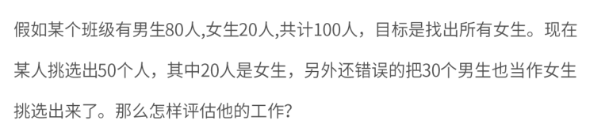

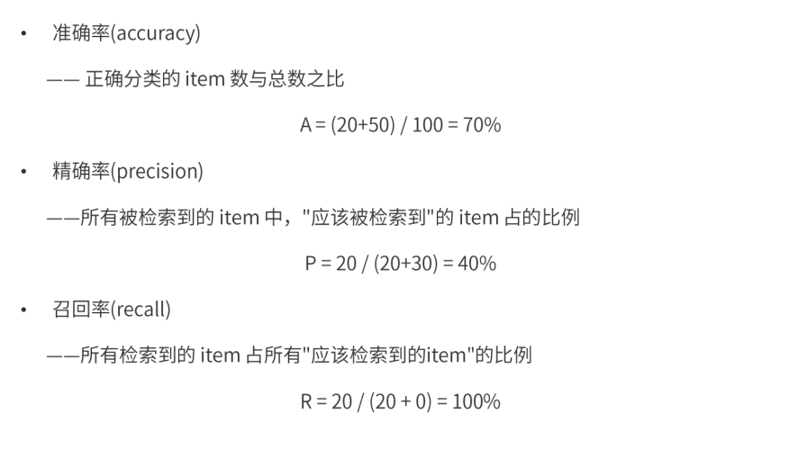

## 机器学习

### 过程

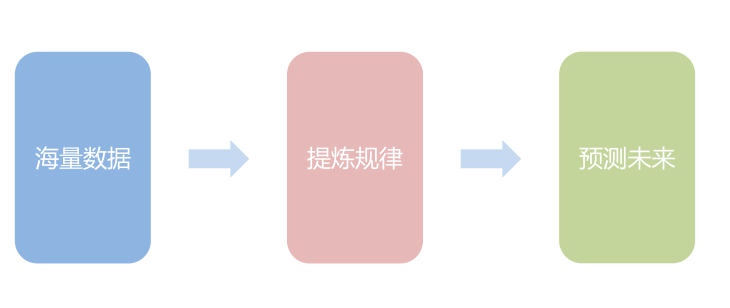

### 分类

+ 监督学习：提供数据和对应的结果，主要包括分类和回归
  + 主要是预测，比如预测房屋的出售情况
+ 无监督学习应用：提供数据但不提供结果
  + 常见的是聚类分析
  + 比如：新闻分类
+ 强化学习：通过与环境交互，并且获取延时返回进而改进行为的学习过程

### 监督学习

#### 三要素

+ 模型：总结数据的内在规律
+ 策略：选择最优模型的评价准则
+ 算法：选择最优模型的具体方法

#### 实现步骤

1. 得到一个有限的训练集
2. 确定学习模型的集合
3. 确定选择的准职责，也就是学习策略
4. 实现求解最优模型的算法
5. 通过学习算法选择最优模型
6. 理由模型，对新数据进行预测和分析

#### 相关概念

+ 损失函数：用来衡量模型预测误差的大小，损失函数的值越小，模型越好
+ 经验风险：训练数据集的平时损失成为经验风险
+ 训练误差：训练集的平均损失
+ 测试误差：测试集的平均损失，也被称泛化能力
+ 欠拟合：数据量太小，不能很好的分辨事物
+ 过拟合：训练太彻底，导致模型的泛华能力太差。所以模型复杂不是越大越好，因为数据越多，就可能会发生过拟合的情况，所以数据模型应该适当。
+ 正则化：为了防止过拟合而提出的一个策略，它是一个单调递增函数，也就是模型越复杂，正则化越大，
+ 奥卡姆剃刀：如果没有必要，勿增实体，也就是利用好结构简单的数据，不要一味的追去数据或者模型的复杂
+ 交叉验证
  + 数据集一般氛围：训练集、验证集、测试集
  + 但数据不充足的时候，可以重复的利用数据进行交叉验证
+ 监督学习的两大任务：分类问题、回归问题
  + 分类问题：就是对数据进行分类
  + 回归问体：可以理解成预测一个数值，比如给出房屋的一些特征，进而预测房价
+ 分类器的性能指标：精确率和召回率
  + 精确率：所有的预测正，预测正确的比例
  + 召回率：所有的数据中，被正确预测找出的比例
+ 回归问题：用来预测输入变量和输出变量之间的关系
  + 按照输入变量的个数分类：一元回归和多元回归
  + 按照模型类型：线性回归和非线性回归
  + 损失函数：平方损失函数

## 机器学习模型

### 监督学习

#### 回归模型

一元线性回归：输入和输出之间存在一个线性关系：y=ax+b

多元线性回归：有多个输入参数，被称为多元线性回归

+ 最小二乘法:

  + 基于均方差进行求解

  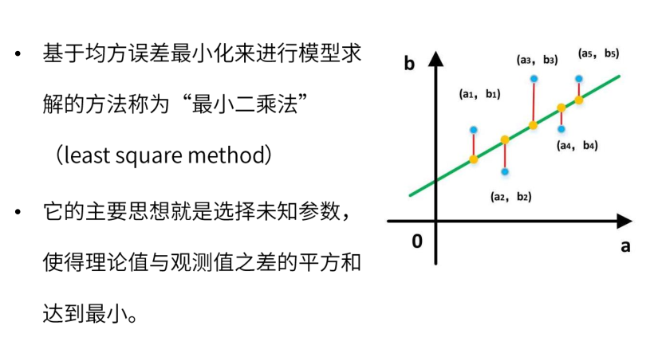

+ 梯队下降法：

  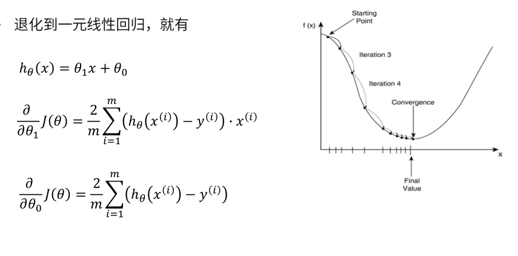

+ 对比

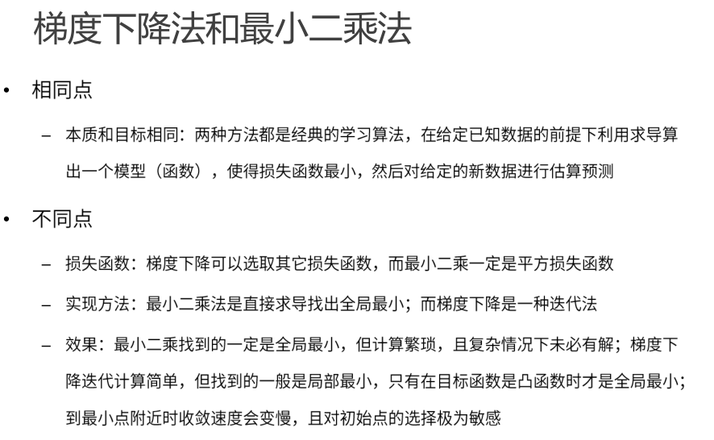

#### 分类模型

##### K近邻

K-nearest neighbour， 也就是KNN算法：是一种基本的分类方法，通过测量不同特征值之间的距离进行分类，其中K通常是不大于20的整数

算法描述：

1. 计算测试数据和各个训练数据之间的距离
2. 按照距离的递增关系进行排序
3. 选取距离最小的K个点
4. 确定前K个点所在类别的出现频率
5. 返回前K个点中出现频率最高的类别作为测试数据的预测分类

##### 决策树

决策树书一种简单高效并且具有强解释性的模型，广泛用于数据分析领域，其本质是一颗自上而下的 有多个判断节点组成的数

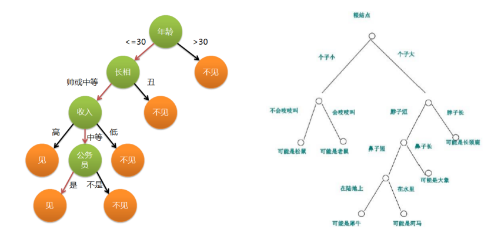

决策树与if-then规则

+ 决策树可以看作是一个if-then规则的集合
+ 有决策树的根节点到叶节点的每一条路径，构建一条规则，路径上内部节点的特征对应着规则的条件，叶节点对应规则的结论
+ 决策树的if-then规则集合有一个重要性质：互斥并且完备。这就是说，每一条实例都被一条规则所覆盖，并且只被一条规则覆盖

决策树的目标

+ 从训练接种归纳出一组if-then规则
+ 从所有可能的情况中选择最优决策树，得到一个次最优解

决策树的生成算法

+ ID3：找到信息增益最大的特征，然后按照特征进行分类，然后再找到各类型自己种信息增益最大的特征，然后再进行分类，最终的到符合要求的模型
+ C4.5：实在ID3的基础上进行了改善，通过信息增益比来选择特征

##### 逻辑斯蒂回归

Sigmiod函数（压缩函数）

### 无监督学习

####  聚类

##### K均值

核心思想：有用户指定K个初始质心，以作为聚类的类别，重复迭代直至算法收敛

#### 降维

## 推荐算法详解

### 基于人口统计学的推荐和用户画像

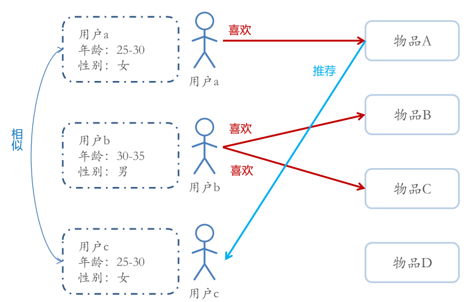

#### 概述

1. 是最容易实现的一种推荐方法，只是简单的根据用户的基本信息发现用户的相关程度，延后用相似用户喜爱的其他物品推荐给当前用户
2. 对于每一明月含义的用户信息，可以通过聚类等手段给用户打上分类标签
3. 用户信息标签化的过程一般又被成为用户画像

#### 用户画像

1. 企业通过手机和分析消费者的社会属性、生活习惯、消费行为等之后，完美抽象出一个用户的商业全貌，作为企业应用大数据技术的基本方式
2. 用户画像能够帮助企业快速定为用户的需求
3. 作为大数据的根据，提供了数据基础

### 基于内容的推荐和特征工程

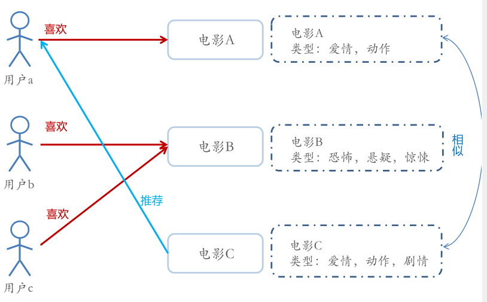

#### 概述

1. 根据推荐物品与内容的元数据，发现物品的相关性，在基于用户过去的喜好记录，为用户推荐相似的物品
2. 通过抽取物品内在或者外在的特征值，实现相似度计算
3. 将用户个人信息的特征，和物品的特征进行匹配，就能够的到用户对于物品的感兴趣程度

#### 相似度计算

1. 相似度的判断，可以用距离表示，而一般更常用的就是"余弦相似度"

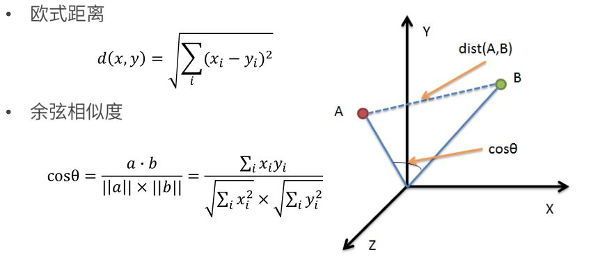

**具体实现**

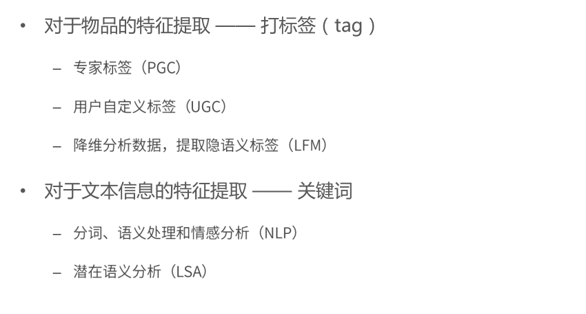

**更高层次-特征工程**

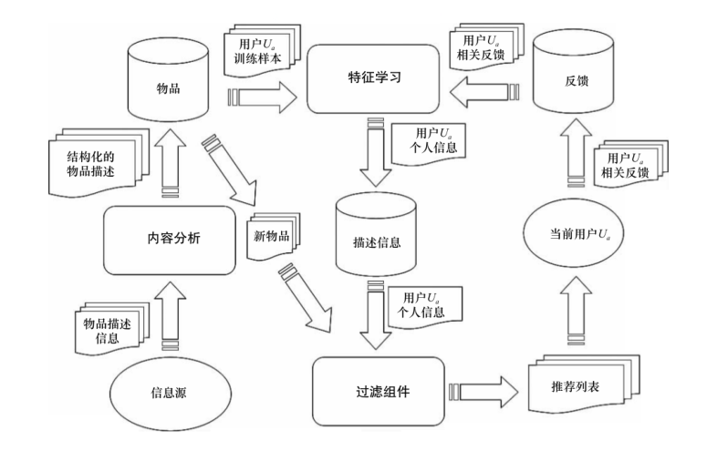

**特征工程-概念**

+ 特征：数据中抽取出来的对结果预测有用的信息

+ 特正的个数就是数据的观测维度

+ 特征工程一般包括特征清洗（采样、清洗异常样本），特征处理和特征选择

+ 特征按照不同的数据特征分类，有不同的特征处理方法

  + 数值型

    + 归一化

      + 特征与特征之间应该是平等的，数值输入到相同的模型后，由于本身的幅度值不同告知产生不同的效果，这样是不合理的

    + 离散化

      + 将原始连续值切断，转化为离散值

      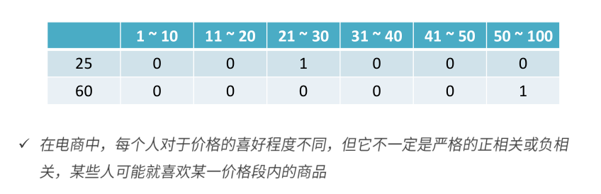

      + 离散化的两种方式
        + 等步长：简单但不一定有效
        + 等频：min -> 25% -> 75% -> max
        + 对比：等频不固定，但是精准，等步长固定，简单

  + 类别型

    + 类别性数据本身没有大小关系，需要将他们编码为数字
    + One-Hot编码：将所有类别性数据平行的展开，也就是说，经过One-hot，这个特征的空间会膨胀

    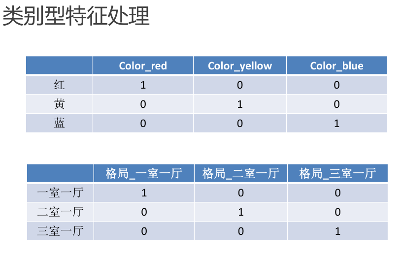

    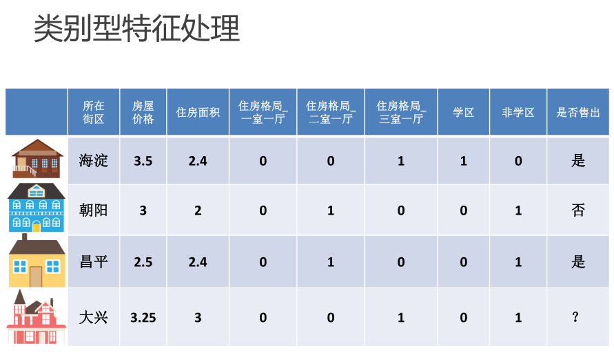

    

  + 时间型

    + 可以做连续值，又可以看作离散值
    + 连续值：
      + 持续时间（网页浏览的时长）
      + 间隔时间（上次购买离现在的时间间隔）
    + 离散值
      + 一天中有那个时间段、一周中的星期几

  + 统计型

    + 加减平均：商品价格高于平均价格的多少
    + 分位线：商品属于售出商品价格的分位线处
    + 次序性：商品出于热门商品第几位
    + 比例类：电商中商品的好/中/差比例

    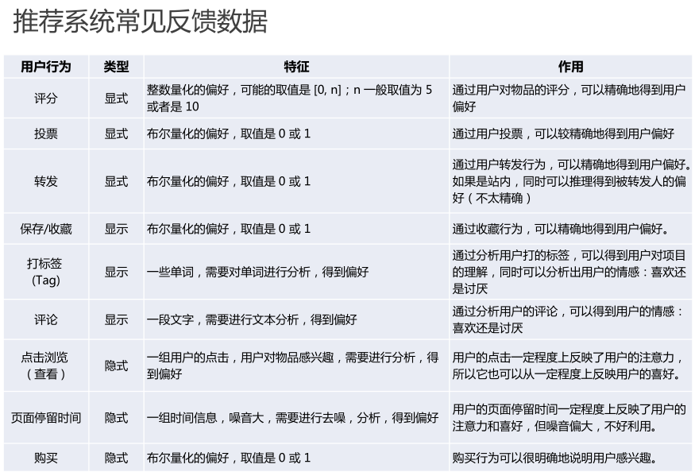

    + 基于UGC简单推荐的问题
      + 原理：直接将用户打出标签的次数和物品得到的标签次数相乘，可以简单的标签出用户对于物品某个特征的兴趣
      + 这种方法倾向于（比如：大片、搞笑等等），如果一个热门物品同时对应着热门标签，那么他就会霸榜，推荐的个性化、新颖度就会降低
    + TF-IDF：词频-逆文档频率，是一种用于咨询检索和文本哇局的常用加权技术
      + 它是一种统计方法，评估一个字词对于一个文件集或者一个预料库中的其中一份文件的重要成都
      + 原理：如果某个词在一篇文章中出现的频率很高，并且在其他文章中很少出现，就可以人为这个次或者短语具有很好的类别区分能力，适合用来分类
      + 通常被各类搜索引擎应用

### 基于协同过滤的推荐

#### 概述

基于内容：主要利用的是用户评价过的物品的内容特征，二该方法还可以利用其他用户评分过的物品内容

**而协同过滤的推荐可以解决基于内容推荐的一些局限**

+ 物品内容不完整或那一获得是，依然可以通过其他用户的反馈给出推荐
+ 协同过滤基于用户之间对物品的评价质量，避免了后者仅依赖内用可能造成的对物品质量判断的干扰
+ 协同过滤不收内容限制，只要其他类似用户给出了对不同物品的兴趣，协同过滤就可以给用户推荐出内容差异很大的物品（但是有某种内在联系）

**分为两类：基于近邻和基于模型**

#### 基于近邻

+ 基于近邻的推荐系统根据的是相同”口碑“原则

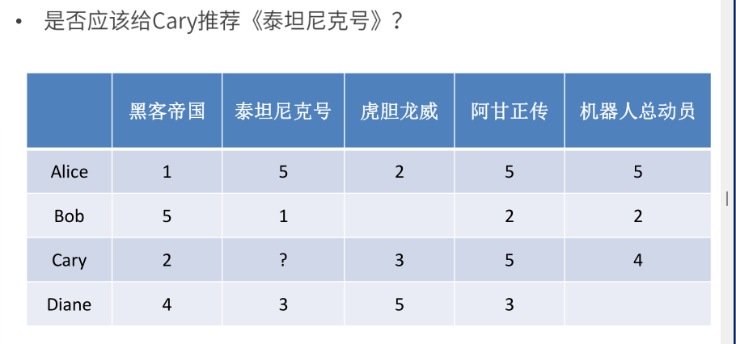

#### 基于用户的协同过滤

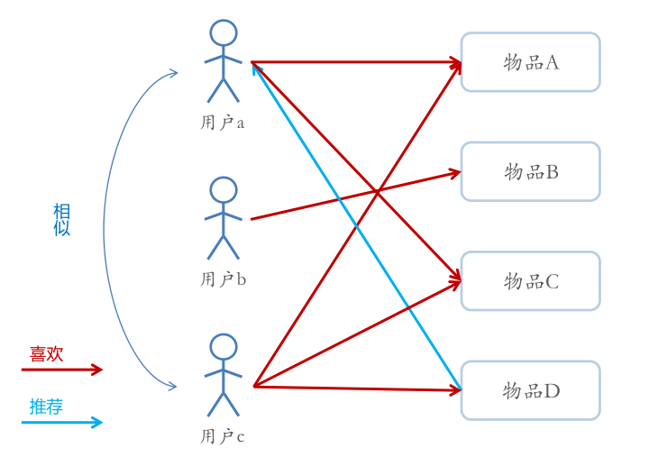

+ 根据所有用户对物品的偏好，发现与当前用户口味和偏好相思的”邻居“用户群，并推荐近邻偏好的物品
+ 在一般的应用中采用计算”K-近邻“的算法，基于K个邻居的历史喜好信息，为当前用户进行推荐

#### 基于物品的协同过滤

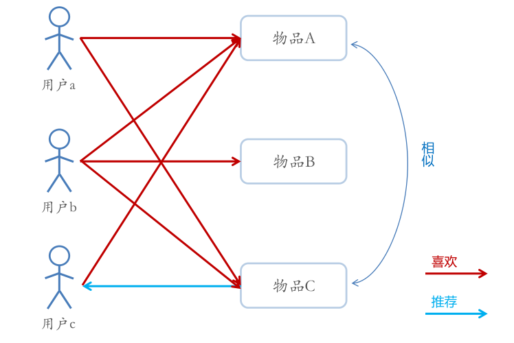

**优点：**

+ 不需要对物品和用户进行严格的缄默，可以发现用户潜在的兴趣偏好

**缺点:**

+ 该方法基于历史数据，存在冷启动问题
+ 推荐的效果依赖于用户历史偏好数据的多少和准确性

#### 基于模型的协同过滤

##### 基本思想：

+ 用戶具有一定的特征，决定着它的偏好
+ 物品具有一定的特征，影响着用户是否选择它
+ 用户之所以算则某个商品，实用为用户的特征和物品的特征相互匹配

基于这种思想，模型的建立相当于从行为数据中提取特征，为物品和用户同时打上标签，有显性特征的时候，可以直接推荐；没有的时候，可以根据已有的偏好数据，发现隐藏的特征，这个时候需要用到**隐语义模型（LFM）**

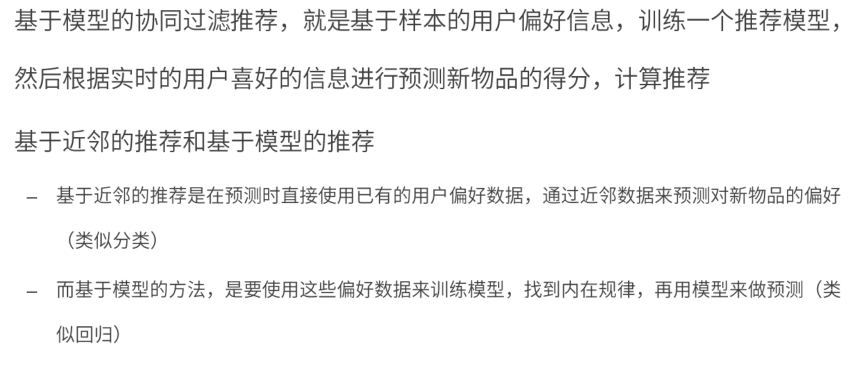

#### **重点-隐语义模型**（LFM）

##### 概述

原理：

+ 揭开隐藏的特征，这些特征能够解释为什么给出对应的预测评分
+ 这些特征可能是无法直接用语言解释描述的，事实上我门并不需要知道，类似玄学

通过矩阵分解进行降维分析

+ 协同过滤算法非常依赖历史数据，而一般的推荐系统中，偏好数据有比较稀疏，这就需要队员是数据进行降维处理
+ 分解之后的矩阵就代表了用户和物品的隐藏特征

隐语义模型的实例

+ 基于概率的隐语义分析（PLSA）
+ 隐式迪利克雷分拨模型（LDA）
+ 矩阵因子分解模型（基于奇异值分解的模型，SVD）

##### LFM降维方法-矩阵因子分解

##### LFM的进一步理解

##### 模型的求解-损失函数

##### 模型的求解算法-ALS

# 电影推荐系统设计

