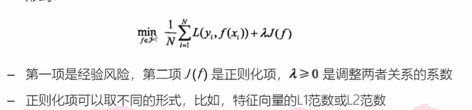
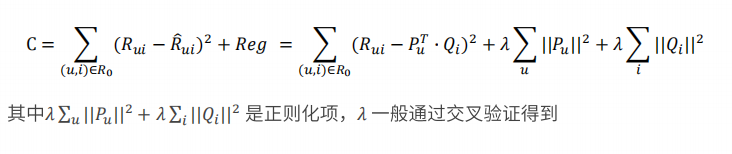
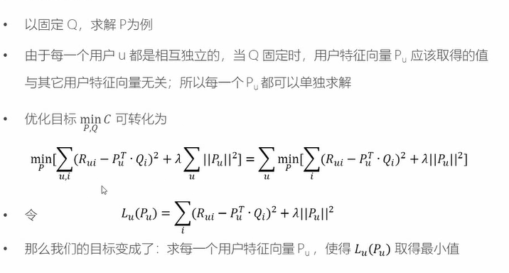
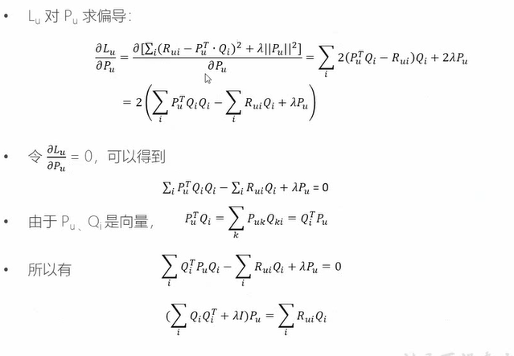
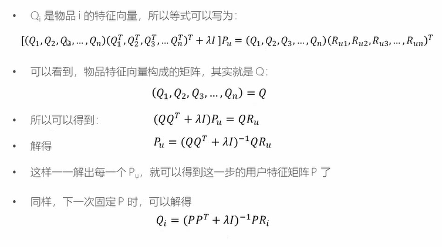
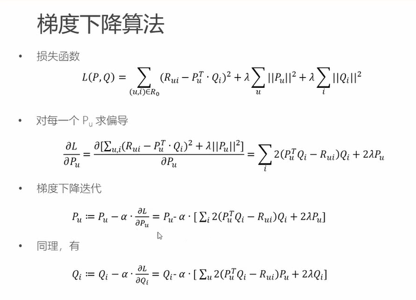

# 推荐算法

## 概述

### 目的

+ 信息过载所采用的措施，面对海量的数据信息，从中快速推荐出符合用户特点的物品
+ 让用户更快更好的获取到自己需要的内容
+ 让网站（平台）更有效的保留用户资源

### 基本思想

+ 利用用户和物品的特征信息，给用户推荐那些具有用户喜欢的特征的物品。
+ 利用用户喜欢过的物品，给用户推荐与他喜欢过的物品相似的物品。
+ 利用和用户相似的其他用户，给用户推荐那些和他们兴趣爱好相似的其他用户喜欢的物品。

### 推荐系统的数据分析

+ 要推荐物品或内容的元数据，例如关键字，分类标签，基因描述等；
+ 系统用户的基本信息，例如性别，年龄，兴趣标签等
+ 用户的行为数据，可以转化为对物品或者信息的偏好，根据应用本身的不同，可能包括用户对物品的评分，用户查看物品的记录，用户的购买记录等。这些用户的偏好信息可以分为两类：
  + 显式的用户反馈：这类是用户在网站上自然浏览或者使用网站以外，显式的提供
    反馈信息，例如用户对物品的评分，或者对物品的评论。
  + 隐式的用户反馈：这类是用户在使用网站是产生的数据，隐式的反应了用户对物
    品的喜好，例如用户购买了某物品，用户查看了某物品的信息等等。

### 算法简介

+ 基于人口统计学的推荐
+ 基于内容的推荐
+ 基于协同过滤的推荐
+ 混合推荐：网站的推荐系统往往都不是单纯只采用了某一种推荐的机制和策略，往往是将多个方法混合在一起，从而达到更好的推荐效果。比较流行的组合方法有：
  + 加权混合：– 用线性公式（linear formula）将几种不同的推荐按照一定权重组合起来，具体权重的值需要在测试数据集上反复实验，从而达到最好的推荐效果
  + 切换混合：– 切换的混合方式，就是允许在不同的情况（数据量，系统运行状况，用户和物品的数目等）下，选择最为合适的推荐机制计算推荐
  + 分区混合：– 采用多种推荐机制，并将不同的推荐结果分不同的区显示给用户
  + 分层混合：采用多种推荐机制，并将一个推荐机制的结果作为另一个的输入，从而综合各个推荐机制的优缺点，得到更加准确的推荐

### 相关度量标准

## 机器学习

### 过程

### 分类

+ **监督学习**：提供数据和对应的结果，主要包括**分类**和**回归**
  + 主要是预测，比如预测房屋的出售情况
+ 无监督学习应用：提供数据但不提供结果
  + 常见的是**聚类**分析、关联规则学习、降维
  + 比如：新闻分类
+ 强化学习：通过与环境交互，获得奖励或者惩罚，进而改进行为的学习过程
+ 深度学习：神经网络与深度学习
+ 集成学习：把多个学习器集成到一起，变为一个混合的学习器

### 监督学习

#### 概诉

主要包括 分类和回归，作用是预测房屋的出售情况

#### 三要素

+ 模型：总结数据的内在规律
+ 策略：选择最优模型的评价准则
+ 算法：选择最优模型的具体方法

#### 实现步骤

1. 得到一个有限的训练集
2. 确定学习模型的集合
3. 确定选择的准职责，也就是学习策略
4. 实现求解最优模型的算法
5. 通过学习算法选择最优模型
6. 理由模型，对新数据进行预测和分析

#### 相关概念

+ 损失函数：用来衡量模型预测误差的大小（也就是实际结果和模型结果的差值，它是一组连续的数，不同模型之间，损失函数的结果也会不同），**损失函数的值越小，模型越好**

  + 常见损失函数
    + 0-1 损失函数：最简单的损失函数，0代表没有偏差，1代表有偏差
    + 平方损失函数：最常见的损失函数：（y-f(x)）的平方，因为可能有正负，所以这里加入平方.
    + 绝对损失函数：|y-f(x)|
    + 对数损失函数：-logP(y|x)

+ 经验风险：训练数据集的平时损失成为经验风险（所有损失值累加处于训练集的个数）

+ 经验风险最小模型：这一个策略认为，经验风险最小的模型就是最优的模型，但是样本比较小的时候，训练的结果可能会有问题

+ 训练误差：训练集的平均损失，可以判断给定的问题是否容易学习

+ 测试误差：测试集的平均损失（计算公示与训练），也被称泛化能力，真正反应了模型对未知数据的预测能力

+ 欠拟合：数据量太小，不能很好的分辨事物

+ 过拟合：训练太彻底，导致模型的泛华能力太差。所以模型复杂不是越大越好，因为数据越多，就可能会发生过拟合的情况，所以数据模型应该适当。

+ 正则化：为了防止过拟合而提出的一个策略，它是一个单调递增函数，也就是模型越复杂，正则化越大，计算公示是经验风险+正则化

  + 特征向量：就是一个数据分解的维度越多，特征向量越大，
  + L1 范数就是绝对值求和
  + L2 范数是平方求和然后开根号
  + 模型越复杂，特征向量越大，带入到正则化中，惩罚也就越大，对应的经验风险也就越大

  

+ 奥卡姆剃刀：如果没有必要，勿增实体，也就是利用好结构简单的数据，不要一味的追去数据或者模型的复杂

+ 交叉验证
  + 数据集一般氛围：训练集、验证集、测试集
    + 如果样本数比较充足，可以是随机的将数据进行切分：训练集、验证集、测试集
  + 但数据不充足的时候，可以重复的利用数据进行交叉验证
    + 简单交叉验证：70%的训练集，30%的测试集
    + S折交叉验证：随机的划分为S个互不相交，相同大小的子集，s-1个做训练集，剩下一个做测试集，重复进行训练集和测试集的选取，所以会有S中可能的选择
    + 留一交叉验证（数据量非常小的时候）：最后只留下一个数据进行验证

+ 监督学习的两大任务：分类问题、回归问题。如果预测的结果是离散，那么就是分类，如果测试的结果是连续的，那么就是回归问题
  + 分类问题：就是对数据进行分类
  + 回归问体：可以理解成预测一个数值，比如给出房屋的一些特征，进而预测房价
+ 分类器的性能指标：精确率和召回率。（关注的是正类，不关注的负类）
  + 精确率：所有的预测中，预测正确的比例
  + 召回率：所有的数据中，被正确预测找出的比例
+ 回归问题：用来预测输入变量和输出变量之间的关系
  + 按照输入变量的个数分类：一元回归和多元回归
  + 按照模型类型：线性回归和非线性回归
  + 损失函数：平方损失函数，这个时候，回归问题可以用著名的最小二乘法来求解

## 机器学习模型

### 监督学习

#### 回归模型

一元线性回归：输入和输出之间存在一个线性关系：y=ax+b

多元线性回归：有多个输入参数，被称为多元线性回归

+ 最小二乘法:

  + 基于均方差进行求解

  

+ 梯队下降法：

  

+ 对比

#### 分类模型

##### K近邻

K-nearest neighbour， 也就是KNN算法：是一种基本的分类方法，通过测量不同特征值之间的距离进行分类，其中K通常是不大于20的整数

算法描述：

1. 计算测试数据和各个训练数据之间的距离
2. 按照距离的递增关系进行排序
3. 选取距离最小的K个点
4. 确定前K个点所在类别的出现频率
5. 返回前K个点中出现频率最高的类别作为测试数据的预测分类

##### 决策树

决策树书一种简单高效并且具有强解释性的模型，广泛用于数据分析领域，其本质是一颗自上而下的 有多个判断节点组成的数

决策树与if-then规则

+ 决策树可以看作是一个if-then规则的集合
+ 有决策树的根节点到叶节点的每一条路径，构建一条规则，路径上内部节点的特征对应着规则的条件，叶节点对应规则的结论
+ 决策树的if-then规则集合有一个重要性质：互斥并且完备。这就是说，每一条实例都被一条规则所覆盖，并且只被一条规则覆盖

决策树的目标

+ 从训练接种归纳出一组if-then规则
+ 从所有可能的情况中选择最优决策树，得到一个次最优解

决策树的生成算法

+ ID3：找到信息增益最大的特征，然后按照特征进行分类，然后再找到各类型自己种信息增益最大的特征，然后再进行分类，最终的到符合要求的模型
+ C4.5：实在ID3的基础上进行了改善，通过信息增益比来选择特征

##### 逻辑斯蒂回归

Sigmiod函数（压缩函数）

### 无监督学习

####  聚类

##### K均值

核心思想：有用户指定K个初始质心，以作为聚类的类别，重复迭代直至算法收敛

#### 降维

## 推荐算法详解

### 基于人口统计学的推荐和用户画像

#### 概述

1. 是最容易实现的一种推荐方法，只是简单的根据用户的基本信息发现用户的相关程度，延后用相似用户喜爱的其他物品推荐给当前用户
2. 对于每一明月含义的用户信息，可以通过聚类等手段给用户打上分类标签
3. 用户信息标签化的过程一般又被成为用户画像

#### 用户画像

1. 企业通过手机和分析消费者的社会属性、生活习惯、消费行为等之后，完美抽象出一个用户的商业全貌，作为企业应用大数据技术的基本方式
2. 用户画像能够帮助企业快速定为用户的需求
3. 作为大数据的根据，提供了数据基础

### 基于内容的推荐和特征工程

#### 概述

1. 根据推荐物品与内容的元数据，发现物品的相关性，在基于用户过去的喜好记录，为用户推荐相似的物品
2. 通过抽取物品内在或者外在的特征值，实现相似度计算
3. 将用户个人信息的特征，和物品的特征进行匹配，就能够的到用户对于物品的感兴趣程度

#### 相似度计算

1. 相似度的判断，可以用距离表示，而一般更常用的就是"**余弦相似度**"

#### 具体实现

#### 更高层次-特征工程

#### 特征工程-概念

+ 特征：数据中抽取出来的对结果预测有用的信息

+ 特正的个数就是数据的观测维度

+ 特征工程一般包括特征清洗（采样、清洗异常样本），特征处理和特征选择

+ 特征按照不同的数据特征分类，有不同的特征处理方法

  + 数值型

    + 归一化

      + 特征与特征之间应该是平等的，数值输入到相同的模型后，由于本身的幅度值不同告知产生不同的效果，这样是不合理的

    + 离散化

      + 将原始连续值切断，转化为离散值

      

      + 离散化的两种方式
        + 等步长：简单但不一定有效
        + 等频：min -> 25% -> 75% -> max
        + 对比：等频不固定，但是精准，等步长固定，简单

  + 类别型

    + 类别性数据本身没有大小关系，需要将他们编码为数字
    + One-Hot编码：将所有类别性数据平行的展开，也就是说，经过One-hot，这个特征的空间会膨胀

    

    

    

  + 时间型

    + 可以做连续值，又可以看作离散值
    + 连续值：
      + 持续时间（网页浏览的时长）
      + 间隔时间（上次购买离现在的时间间隔）
    + 离散值
      + 一天中有那个时间段、一周中的星期几

  + 统计型

    + 加减平均：商品价格高于平均价格的多少
    + 分位线：商品属于售出商品价格的分位线处
    + 次序性：商品出于热门商品第几位
    + 比例类：电商中商品的好/中/差比例

    

#### 基于UGC简单推荐的问题

+ 原理：直接将用户打出标签的次数和物品得到的标签次数相乘，可以简单的标签出用户对于物品某个特征的兴趣
+ 这种方法倾向于（比如：大片、搞笑等等），如果一个热门物品同时对应着热门标签，那么他就会霸榜，推荐的个性化、新颖度就会降低

#### TF-IDF词频-逆文档频率

是一种用于咨询检索和文本哇局的常用加权技术

+ 它是一种统计方法，评估一个字词对于一个文件集或者一个预料库中的其中一份文件的重要成都
+ 原理：如果某个词在一篇文章中出现的频率很高，并且在其他文章中很少出现，就可以人为这个次或者短语具有很好的类别区分能力，适合用来分类
+ 通常被各类搜索引擎应用

### 基于协同过滤的推荐

#### 概述

基于内容：主要利用的是用户评价过的物品的内容特征，二该方法还可以利用其他用户评分过的物品内容

**而协同过滤的推荐可以解决基于内容推荐的一些局限**

+ 物品内容不完整或那一获得是，依然可以通过其他用户的反馈给出推荐
+ 协同过滤基于用户之间对物品的评价质量，避免了后者仅依赖内用可能造成的对物品质量判断的干扰
+ 协同过滤不收内容限制，只要其他类似用户给出了对不同物品的兴趣，协同过滤就可以给用户推荐出内容差异很大的物品（但是有某种内在联系）

**分为两类：基于近邻和基于模型**

#### 基于近邻（CF）

+ 基于近邻的推荐系统根据的是相同”口碑“原则

##### 基于用户的协同过滤（User-CF）

+ 根据所有用户对物品的偏好，发现与当前用户口味和偏好相思的”邻居“用户群，并推荐近邻偏好的物品
+ 在一般的应用中采用计算”K-近邻“的算法，基于K个邻居的历史喜好信息，为当前用户进行推荐

##### 基于物品的协同过滤(Item-CF)

**优点：**

+ 不需要对物品和用户进行严格的缄默，可以发现用户潜在的兴趣偏好

**缺点:**

+ 该方法基于历史数据，存在冷启动问题
+ 推荐的效果依赖于用户历史偏好数据的多少和准确性

##### 基于模型的协同过滤

**基本思想**：

+ 用戶具有一定的特征，决定着它的偏好
+ 物品具有一定的特征，影响着用户是否选择它
+ 用户之所以算则某个商品，实用为用户的特征和物品的特征相互匹配

基于这种思想，模型的建立相当于从行为数据中提取特征，为物品和用户同时打上标签，有显性特征的时候，可以直接推荐；没有的时候，可以根据已有的偏好数据，发现隐藏的特征，这个时候需要用到**隐语义模型（LFM）**

#### **重点-隐语义模型**（LFM）

##### 概述

原理：

+ 揭开隐藏的特征，这些特征能够解释为什么给出对应的预测评分
+ 这些特征可能是无法直接用语言解释描述的，事实上我门并不需要知道，类似玄学

**通过矩阵分解进行降维分析，提取特征**

+ 协同过滤算法非常依赖历史数据，而一般的推荐系统中，偏好数据有比较稀疏，这就需要队员是数据进行降维处理
+ 分解之后的矩阵就代表了用户和物品的隐藏特征

隐语义模型的实例

+ 基于概率的隐语义分析（PLSA）
+ 隐式迪利克雷分拨模型（LDA）
+ 矩阵因子分解模型（基于奇异值分解的模型，SVD）

##### LFM降维方法-矩阵因子分解

+ 假设用户物品评分矩阵为R，现在有m个用户，n个物品
+ 我们想要发现K个隐类，我们的任务就是找到两个矩阵P和Q，使这两个举证的成绩近视等于R，即将用户物品评分矩阵R分解为两个低纬度矩阵相乘
  + 这两个低纬度就是用户矩阵和电影矩阵
  + 用户矩阵就是一个m*k的矩阵
  + 物品矩阵就是一个k*n的举证

##### LFM的进一步理解

+ 我们可以认为，用户之所以给电影打出这样的分数，是有内在因素的，我们可以挖掘出影响用户打分的因素，进而根据未频分电影与这些隐藏因素的关联程度，决定为评分电影的预测评分
+ 因为用户看过一个电影，就会有一个相应的打分，但是一个用户不可能看过所有的电影，对于没有看多的电影是没有评分的，因此用户评分矩阵大部分项是空的，是一个**稀疏矩阵**
+ 如果我们能够根据用户给已有电影的打分推测出每户给没有看过电影的打分，那么就可以根据预测结果给用户推荐他可能打高分的电影

##### 模型的求解-损失函数

+ 现在的问题是如何得到两个低维度的矩阵？
+ 也就是矩阵分解的预测评分矩阵会与原来的评分矩阵可能存在一些误差，我们的目标时找到一个最好的分解方式，让分解之后的预测评分矩阵总误差最小
+ 所以损失函数选择平方损失函数，并且加入正则化，以防止过拟合

##### 模型的求解算法-ALS

+ 现在矩阵因子分解的问题已经转化为了一个标准的优化问题，需要求解，P、Q，使目标损失函数取最小值
+ 最小化过程的求解，一般采用随机梯度下降算法或者交替最小二乘法来实现
+ 交替最小二乘（ALS）
  + 由于两个矩阵P、Q都未知，且通过矩阵乘法耦合在一起，为了使他们解耦，可以先固定Q，把P当作变量，通过损失函数最小话求出P，这是一个经典的最小二乘法问题，然后在反过来，固定P，把Q当作变量，求接触Q，如此交替执行，直到误差满足阈值条件，或者到达迭代上限
+ 具体过程
  1. 为Q指定一个初始值Q-0，可以是全0或者全局平均矩阵
  2. 固定当前Q-0值，求解P-0，
  3. 固定当前P-0值，求解Q-0，
  4. 固定当前Q-0值，求解P-1，
  5. ....
  6. 知道损失函数的值C收敛，然后跌打结束
+ 实际求解过程

​	

# 电影推荐系统设计

