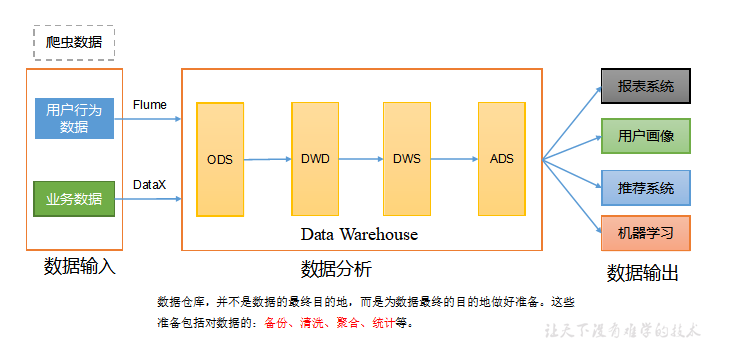
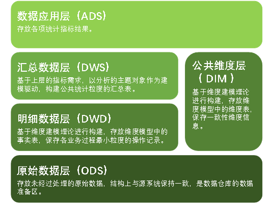
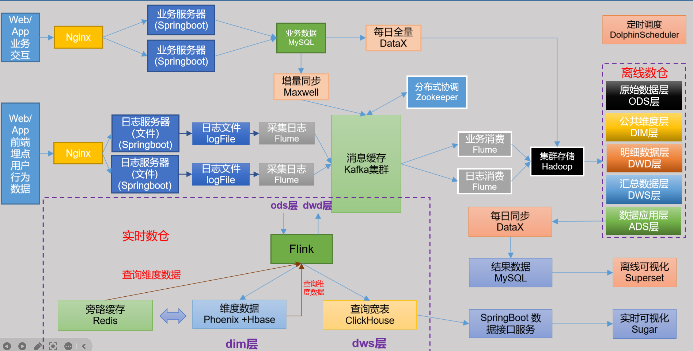
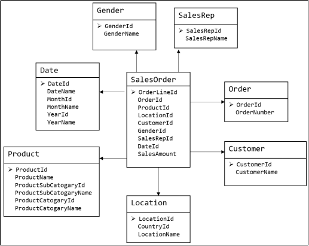
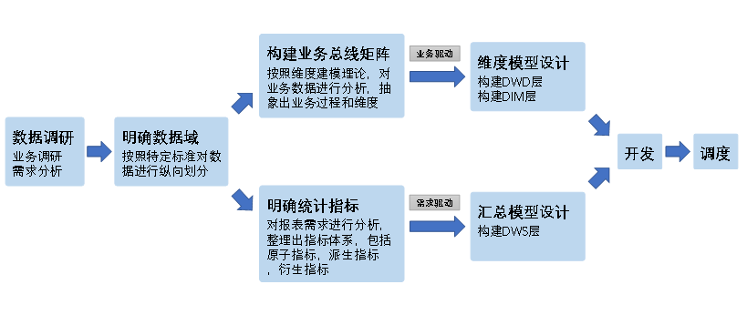
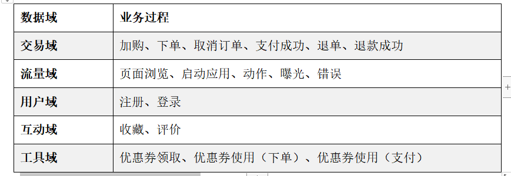
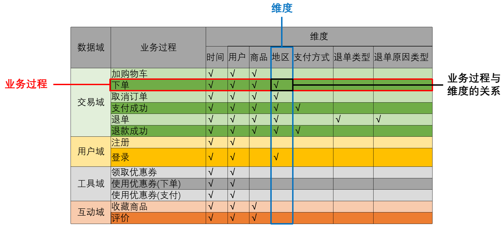
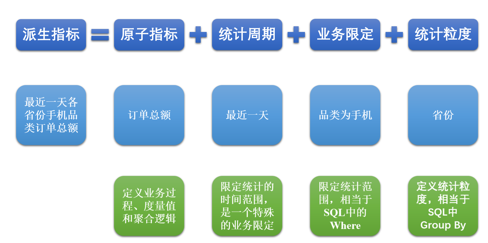
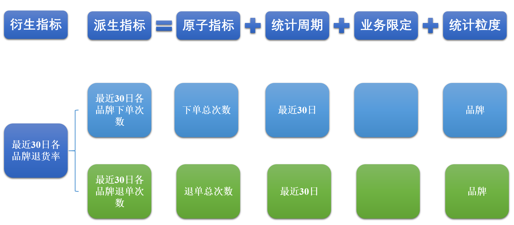

# 电商数仓

## 数据仓库

### 概念

数据仓库的输入数据通常包括：业务数据、用户行为数据和爬虫数据等

+ 业务数据：就是各行业在处理事务过程中产生的数据
+ 用户行为数据：用户在使用产品过程中，通过埋点收集与客户端产品交互过程中产生的数据，并发往日志服务器进行保存
+ 爬虫数据：通常是通过技术手段获取其他公司网站的数据

### 数据分层架构

## 系统架构

### 数据流转图

说明:

+ 数据采集
  + log数据：采用Flume+kafka的形式，Flume监听日志Log，发送给Kafka，另一端同样有Flume消费数据，同步到Kafka
  + db数据：采用全量同步和增量同步两种形式
    + 全量同步：DataX，每天同步全量数据到Hdfs
    + 增量同步：MaxWell，首次同步时，需要用布历史全部数据到Hdfs

### 技术版本-2022

+ Hadoop：3.1.3
+ Zookeeper：3.5.7
+ Mysql：5.7.16
+ Hive：3.1.2
+ Flume：1.9.0
+ Kafka：3.0.0
+ Spark：3.0.0
+ Datax：3.0.0
+ SuperSet：1.3.2
+ DplphinScheduler：2.0.3（该应用会比较吃内存）
+ MaxWell：1.29.2
+ Flink：1.13.0
+ Redis：6.0.8
+ Hbase：2.0.5
+ ClickHouse：20.4.5.36-2

### 数据同步策略

+ 全量同步
  + 小数据量，无关变化多少，最好是全量同步
+ 增量同步
  + 大数据量，变化不多的情况下， 使用增量同步

## 数据建模

### 建模的意义

数据模型就是数据组织和存储方法，它强调从业务、数据存取和使用角度合理存储数据。只有将数据有序的组织和存储起来之后，数据才能得到高性能、低成本、高效率、高质量的使用。

+ 高性能：良好的数据模型能够帮助我们快速查询所需要的数据。
+ 低成本：良好的数据模型能减少重复计算，实现计算结果的复用，降低计算成本。
+ 高效率：良好的数据模型能极大的改善用户使用数据的体验，提高使用数据的效率。
+ 高质量：良好的数据模型能改善数据统计口径的混乱，减少计算错误的可能性。

### 方法论

#### ER模型

数据仓库之父Bill Inmon提出的建模方法是从全企业的高度，用实体关系（Entity Relationship，ER）模型来描述企业业务，并用规范化的方式表示出来，在范式理论上符合3NF。

#### 维度模型

维度模型将复杂的业务通过事实和维度两个概念进行呈现。事实通常对应业务过程，而维度通常对应业务过程发生时所处的环境。

**注**：业务过程可以概括为一个个不可拆分的行为事件，例如电商交易中的下单，取消订单，付款，退单等，都是业务过程。

下图为一个典型的维度模型，其中位于中心的SalesOrder为事实表，其中保存的是下单这个业务过程的所有记录。位于周围每张表都是维度表，包括Date（日期），Customer（顾客），Product（产品），Location（地区）等，这些维度表就组成了每个订单发生时所处的环境，即何人、何时、在何地下单了何种产品。从图中可以看出，模型相对清晰、简洁。

维度建模以数据分析作为出发点，为数据分析服务，因此它关注的重点的用户如何更快的完成需求分析以及如何实现较好的大规模复杂查询的响应性能。

### 维度建模

#### 事实表

##### 概述

紧紧围绕着业务过程来设计。其包含与该业务过程有关的维度引用（维度表外键）以及该业务过程的度量（通常是可累加的数字类型字段）

##### 事务型事实表

最细粒度的操作事件。粒度是指事实表中一行数据所表达的业务细节程度。

##### 周期型快照事实表

以具有规律性的、可预见的时间间隔来记录事实，主要用于分析一些存量型（例如商品库存，账户余额）或者状态型（空气温度，行驶速度）指标。

##### 累积型快照事实表

累计快照事实表是基于一个业务流程中的多个关键业务过程联合处理而构建的事实表，如交易流程中的下单、支付、发货、确认收货业务过程。

累积型快照事实表通常具有多个日期字段，每个日期对应业务流程中的一个关键业务过程。

#### 维度表

##### 概述

而维度表则围绕业务过程所处的环境进行设计。维度表主要包含一个主键和各种维度字段，维度字段称为维度属性。

#####　设计步骤

1. 确认维度
2. 确认主维表和相关维表
3. 确认维度
   1. 尽可能生成丰富的维度属性
   2. 尽量不使用编码，而使用明确的文字说明，一般可以编码和文字共存
   3. 尽量沉淀出通用的维度属性

##### 维度变化

1. 全量快照表
   + 离线数据仓库的计算周期通常为每天一次，所以可以每天保存一份全量的维度数据。这种方式的优点和缺点都很明显。
   + 优点是简单而有效，开发和维护成本低，且方便理解和使用。
   + 缺点是浪费存储空间，尤其是当数据的变化比例比较低时。
2. 拉链表

## 数据仓库设计

### 构建流程

### 明确数据域

通常可以根据业务过程或者部门进行划分，本项目根据业务过程进行划分，需要注意的是一个业务过程只能属于一个数据域。下面是本数仓项目所需的所有业务过程及数据域划分详情。

### 构建业务总线矩阵

业务总线矩阵中包含维度模型所需的所有事实（业务过程）以及维度，以及各业务过程与各维度的关系。矩阵的行是一个个业务过程，矩阵的列是一个个的维度，行列的交点表示业务过程与维度的关系。

一个业务过程对应维度模型中一张事务型事实表，一个维度则对应维度模型中的一张维度表。所以构建业务总线矩阵的过程就是设计维度模型的过程。但是需要注意的是，总线矩阵中通常只包含事务型事实表，另外两种类型的事实表需单独设计。

按照事务型事实表的设计流程，选择业务过程声明粒度确认维度确认事实，得到的最终的业务总线矩阵

### 明确统计指标

#### 原子指标

原子指标基于某一业务过程的度量值，是业务定义中不可再拆解的指标

#### 派生指标

派生指标基于原子指标，其与原子指标的关系如下图所示。与原子指标不同，派生指标通常会对应实际的统计需求。请从图中的例子中，体会指标定义标准化的含义。

#### 衍生指标

衍生指标是在一个或多个派生指标的基础上，通过各种逻辑运算复合而成的。例如比率、比例等类型的指标。衍生指标也会对应实际的统计需求。

### 维度模型设计

维度模型的设计参照上述得到的业务总线矩阵即可。事实表存储在DWD层，维度表存储在DIM层。

### **汇总模型设计**

汇总模型的设计参考上述整理出的指标体系（主要是派生指标）即可。汇总表与派生指标的对应关系是，一张汇总表通常包含业务过程相同、统计周期相同、统计粒度相同的多个派生指标。

## 离线数仓

### 技术选型

1. Flume，
   1. 从磁盘中读取log日志，发送到Kafka
   2. 可以从kafka中读取db数据，然后发送到Hdfs中
   3. 可以从kafka中读取log数据，然后发送到Hdfs中

2. kafka：大数据量传输
3. MaxWell：从binlog中读取日志数据，然后发送Json数据到Kafka中，经过Flume采集到Hdfs当中，所以增量表中的数据，可以是Json文本数据
4. DataX：数据库全量数据复制，进行导入导出
5. Hadoop：大数据文件存储
6. Hive：HQL执行分布式计算
7. Spark：计算引擎
8. DolphinScheduler：调度器
9. Mysql：业务数据存储、报告数据存储
10. SuperSet：数据可视化工具

## 实时数仓

### 技术选型

1. 分层存储：
2. 计算框架：flink，消息队列Kafka
3. ODS：Kafka
4. DIM： HBASE 或者 Mysql
5. DWD：ClickHouse
6. ADS：Mysql
