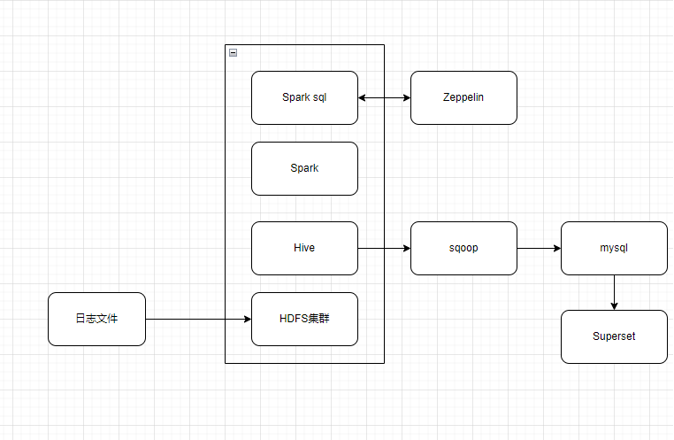

# 项目

## 项目介绍

滴滴出行业务数据分析

## 技术架构

+ HDFS：分布式文件存储
+ Hive：数据仓库
+ Spark：流计算引擎
+ Zeppelin：操作Hive平台，进行数据交互
+ Sqoop： 数据导出
+ Superset：数据可视化

## 数据仓库构架

### 数据仓库分层

1. 原始日志数据放在哪里
2. 预处理数据放在哪里
3. 处理结果的数据放在哪里

| 数据类别     | 数据库 | 分层名             |
| ------------ | ------ | ------------------ |
| 原始日志数据 | ods    | 临时存储           |
| 预处理       | dw     | 数据仓库层         |
| 分析结果层   | app    | 应用层建三个数据库 |

1. 创建三个仓库
2. 根据订单创建、订单取消、订单支付、用户评价生成四张数据表
3. 表数据加载
   1. 实时处理
   2. 离线处理： T+1 模式
4. 数据的预处理
   1. 过滤数据
   2. 合并数据
   3. 处理不便于理解的数据
   4. 新增其他字段便于分析
   5. 格式统一