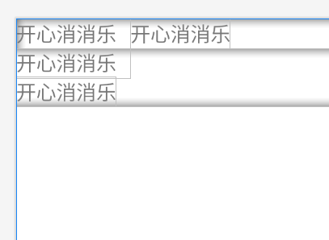
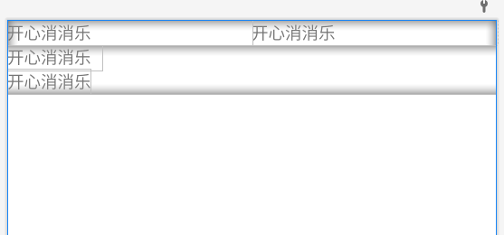
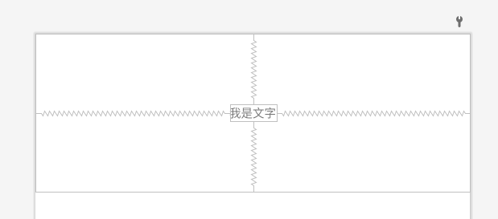
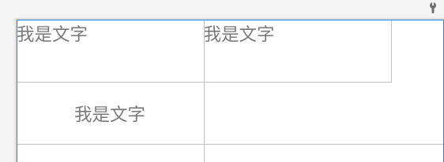
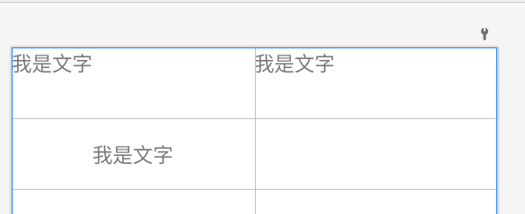
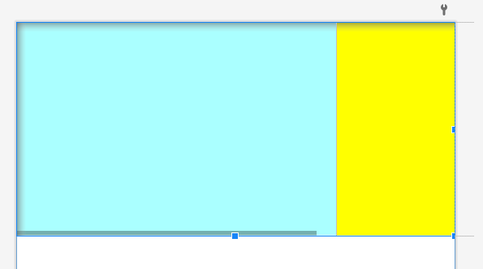
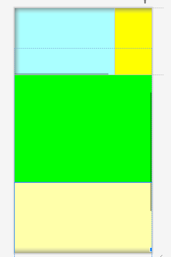
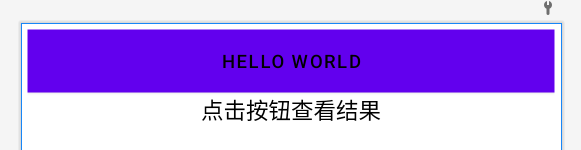
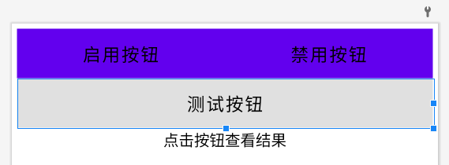

## 布局

### 线性布局

~~~bash
layout_width 宽度
layout_height 高度
paddingRight 右边距
layout_weight 权重宽度
layout_width 0dp， 需要结合 权重来使用
gravity 页面位置
~~~

~~~xml
<?xml version="1.0" encoding="utf-8"?>
<LinearLayout xmlns:android="http://schemas.android.com/apk/res/android"
    android:layout_width="match_parent"
    android:layout_height="match_parent"
    android:orientation="vertical">

    <LinearLayout
        android:layout_width="match_parent"
        android:layout_height="wrap_content">
        <TextView
            android:layout_width="wrap_content"
            android:layout_height="match_parent"
            android:paddingRight="10dp"
            android:text="开心消消乐" />

        <TextView
            android:layout_width="wrap_content"
            android:layout_height="match_parent"
            android:text="开心消消乐" />
    </LinearLayout>

    <LinearLayout
        android:layout_width="match_parent"
        android:layout_height="wrap_content"
        android:orientation="vertical">
        <TextView
            android:layout_width="wrap_content"
            android:layout_height="wrap_content"
            android:paddingRight="10dp"
            android:text="开心消消乐" />

        <TextView
            android:layout_width="wrap_content"
            android:layout_height="wrap_content"
            android:text="开心消消乐" />
    </LinearLayout>

</LinearLayout>
~~~

~~~xml
<?xml version="1.0" encoding="utf-8"?>
<LinearLayout xmlns:android="http://schemas.android.com/apk/res/android"
    android:layout_width="match_parent"
    android:layout_height="match_parent"
    android:orientation="vertical">

    <LinearLayout
        android:layout_width="match_parent"
        android:layout_height="wrap_content">
        <TextView
            android:layout_width="0dp"
            android:layout_weight="1"
            android:layout_height="match_parent"
            android:paddingRight="10dp"
            android:text="开心消消乐" />

        <TextView
            android:layout_width="0dp"
            android:layout_weight="1"
            android:layout_height="match_parent"
            android:text="开心消消乐" />
    </LinearLayout>

    <LinearLayout
        android:layout_width="match_parent"
        android:layout_height="wrap_content"
        android:orientation="vertical">
        <TextView
            android:layout_width="wrap_content"
            android:layout_height="wrap_content"
            android:paddingRight="10dp"
            android:text="开心消消乐" />

        <TextView
            android:layout_width="wrap_content"
            android:layout_height="wrap_content"
            android:text="开心消消乐" />
    </LinearLayout>

</LinearLayout>
~~~

### 相对布局

~~~bash
android:layout_centerInParent="true" 垂直、水平居中
android:layout_centerHorizontal="true" 水平居中
android:layout_centerVertical="true" 垂直居中
~~~

~~~xml
<?xml version="1.0" encoding="utf-8"?>
<RelativeLayout xmlns:android="http://schemas.android.com/apk/res/android"
    android:layout_width="match_parent"
    android:layout_height="150dp">

    <TextView
        android:layout_width="wrap_content"
        android:layout_height="wrap_content"
        android:background="#ffffff"
        android:layout_centerInParent="true"
        android:text="我是文字"
        android:textSize="11sp"/>

</RelativeLayout>
~~~

### 网格布局

~~~xml
<?xml version="1.0" encoding="utf-8"?>
<GridLayout xmlns:android="http://schemas.android.com/apk/res/android"
    android:layout_width="match_parent"
    android:layout_height="match_parent"
    android:columnCount="2"
    android:rowCount="2">

    <TextView
        android:layout_width="180dp"
        android:layout_height="60dp"
        android:background="#ffffff"
        android:layout_centerVertical="true"
        android:text="我是文字"
        android:textSize="17sp"/>

    <TextView
        android:layout_width="180dp"
        android:layout_height="60dp"
        android:background="#ffffff"
        android:layout_centerVertical="true"
        android:text="我是文字"
        android:textSize="17sp"/>
    <TextView
        android:layout_width="180dp"
        android:layout_height="60dp"
        android:background="#ffffff"
        android:layout_centerVertical="true"
        android:text="我是文字"
        android:gravity="center"
        android:textSize="17sp"/>

</GridLayout>
~~~

~~~xml
<?xml version="1.0" encoding="utf-8"?>
<GridLayout xmlns:android="http://schemas.android.com/apk/res/android"
    android:layout_width="match_parent"
    android:layout_height="match_parent"
    android:columnCount="2"
    android:rowCount="2">

    <TextView
        android:layout_width="0dp"
        android:layout_columnWeight="1"
        android:layout_height="60dp"
        android:background="#ffffff"
        android:layout_centerVertical="true"
        android:text="我是文字"
        android:textSize="17sp"/>

    <TextView
        android:layout_width="0dp"
        android:layout_columnWeight="1"
        android:layout_height="60dp"
        android:background="#ffffff"
        android:layout_centerVertical="true"
        android:text="我是文字"
        android:textSize="17sp"/>
    <TextView
        android:layout_width="0dp"
        android:layout_columnWeight="1"
        android:layout_height="60dp"
        android:background="#ffffff"
        android:layout_centerVertical="true"
        android:text="我是文字"
        android:gravity="center"
        android:textSize="17sp"/>

</GridLayout>
~~~

### 滚动视图（重点）

#### ScrollView（垂直）

#### HorizontalScrollView（水平）

~~~xml
<?xml version="1.0" encoding="utf-8"?>
<LinearLayout xmlns:android="http://schemas.android.com/apk/res/android"
    android:layout_width="match_parent"
    android:layout_height="match_parent"
    android:orientation="vertical">

    <HorizontalScrollView
        android:layout_width="wrap_content"
        android:layout_height="200dp">
        <LinearLayout
            android:layout_width="wrap_content"
            android:layout_height="match_parent"
            android:orientation="horizontal">

            <View
                android:layout_width="300dp"
                android:layout_height="match_parent"
                android:background="#aaffff" />

            <View
                android:layout_width="300dp"
                android:layout_height="match_parent"
                android:background="#ffff00"/>

        </LinearLayout>
    </HorizontalScrollView>

</LinearLayout>
~~~

~~~xml
<?xml version="1.0" encoding="utf-8"?>
<LinearLayout xmlns:android="http://schemas.android.com/apk/res/android"
    android:layout_width="match_parent"
    android:layout_height="match_parent"
    android:orientation="vertical">

    <HorizontalScrollView
        android:layout_width="wrap_content"
        android:layout_height="200dp">
        <LinearLayout
            android:layout_width="wrap_content"
            android:layout_height="match_parent"
            android:orientation="horizontal">

            <View
                android:layout_width="300dp"
                android:layout_height="match_parent"
                android:background="#aaffff" />

            <View
                android:layout_width="300dp"
                android:layout_height="match_parent"
                android:background="#ffff00"/>

        </LinearLayout>
    </HorizontalScrollView>
    
    <ScrollView
        android:layout_width="match_parent"
        android:layout_height="wrap_content">

        <LinearLayout
            android:layout_width="wrap_content"
            android:layout_height="match_parent"
            android:orientation="vertical">

            <View
                android:layout_width="match_parent"
                android:layout_height="400dp"
                android:background="#00ff00" />

            <View
                android:layout_width="match_parent"
                android:layout_height="400dp"
                android:background="#ffffaa"/>

        </LinearLayout>
    </ScrollView>

</LinearLayout>
~~~

## 组件

### 按钮

#### onClick

~~~xml
<?xml version="1.0" encoding="utf-8"?>
<LinearLayout xmlns:android="http://schemas.android.com/apk/res/android"
    android:layout_width="match_parent"
    android:layout_height="match_parent"
    android:orientation="vertical"
    android:padding="5dp">

    <Button
        android:layout_width="match_parent"
        android:layout_height="wrap_content"
        android:background="#FFAFA2A2"
        android:onClick="doClick"
        android:text="hello world"
        android:textColor="@color/black" />

    <TextView
        android:id="@+id/bt_click"
        android:layout_width="match_parent"
        android:layout_height="wrap_content"
        android:gravity="center"
        android:text="点击按钮查看结果"
        android:textColor="@color/black"
        android:textSize="17sp" />

</LinearLayout>
~~~

~~~java
package com.krest.app;

import androidx.appcompat.app.AppCompatActivity;

import android.os.Bundle;
import android.view.View;
import android.widget.TextView;

import com.krest.app.ui.main.MainFragment;

import java.time.LocalDate;
import java.time.LocalDateTime;

public class MainActivity extends AppCompatActivity {
    TextView bt_click;
    @Override
    protected void onCreate(Bundle savedInstanceState) {
        super.onCreate(savedInstanceState);
        setContentView(R.layout.activity_main);
        bt_click = findViewById(R.id.bt_click);

    }

    public void doClick(View view) {
        bt_click.setText(LocalDateTime.now().toString());
    }
}
~~~

#### 监听事件

~~~xml
<?xml version="1.0" encoding="utf-8"?>
<LinearLayout xmlns:android="http://schemas.android.com/apk/res/android"
    android:layout_width="match_parent"
    android:layout_height="match_parent"
    android:orientation="vertical"
    android:padding="5dp">

    <Button
        android:id="@+id/bt_click"
        android:layout_width="match_parent"
        android:layout_height="wrap_content"
        android:background="#FFAFA2A2"
        android:text="hello world"
        android:textColor="@color/black" />

    <TextView
        android:id="@+id/bt_click_result"
        android:layout_width="match_parent"
        android:layout_height="wrap_content"
        android:gravity="center"
        android:text="点击按钮查看结果"
        android:textColor="@color/black"
        android:textSize="17sp" />

</LinearLayout>
~~~

第一种写法

~~~java
package com.krest.app;

import androidx.appcompat.app.AppCompatActivity;

import android.os.Bundle;
import android.view.View;
import android.widget.Button;
import android.widget.TextView;

import com.krest.app.ui.main.MainFragment;

import java.time.LocalDate;
import java.time.LocalDateTime;

public class MainActivity extends AppCompatActivity {
    Button bt_click;
    TextView bt_click_result;

    @Override
    protected void onCreate(Bundle savedInstanceState) {
        super.onCreate(savedInstanceState);
        setContentView(R.layout.activity_main);
        bt_click = findViewById(R.id.bt_click);
        bt_click_result = findViewById(R.id.bt_click_result);
        // 设置监听器的方式
  
        bt_click.setOnClickListener(new ClickListener(bt_click_result));
    }

    static class ClickListener implements View.OnClickListener {

        private final TextView bt_click_result;

        public ClickListener(TextView view) {
            this.bt_click_result = view;
        }

        @Override
        public void onClick(View view) {
            LocalDateTime now = LocalDateTime.now();
            this.bt_click_result.setText(now.toString());
        }
    }
}
~~~

第二种写法（全局监听，一个监听器支持多种事件）

~~~java
package com.krest.app;

import androidx.appcompat.app.AppCompatActivity;

import android.os.Bundle;
import android.view.View;
import android.widget.Button;
import android.widget.TextView;

import com.krest.app.ui.main.MainFragment;

import java.time.LocalDate;
import java.time.LocalDateTime;
import java.time.LocalTime;

public class MainActivity extends AppCompatActivity implements View.OnClickListener {
    Button bt_click;
    TextView bt_click_result;

    @Override
    protected void onCreate(Bundle savedInstanceState) {
        super.onCreate(savedInstanceState);
        setContentView(R.layout.activity_main);
        bt_click = findViewById(R.id.bt_click);
        bt_click_result = findViewById(R.id.bt_click_result);
        bt_click. (this);
    }

    @Override
    public void onClick(View view) {
        if (view.getId() == R.id.bt_click) {
            bt_click_result.setText(LocalTime.now().toString());
        }
    }
}
~~~

#### 长按监听时间

~~~xml
 package com.krest.app;

import androidx.appcompat.app.AppCompatActivity;

import android.os.Bundle;
import android.view.View;
import android.widget.Button;
import android.widget.TextView;

import com.krest.app.ui.main.MainFragment;

import java.time.LocalDate;
import java.time.LocalDateTime;
import java.time.LocalTime;

public class MainActivity extends AppCompatActivity {
    Button bt_click;
    TextView bt_click_result;

    @Override
    protected void onCreate(Bundle savedInstanceState) {
        super.onCreate(savedInstanceState);
        setContentView(R.layout.activity_main);
        bt_click = findViewById(R.id.bt_click);
        bt_click_result = findViewById(R.id.bt_click_result);
        bt_click.setOnLongClickListener(view -> {
            // 返回 true 自己消費事件
            bt_click_result.setText(LocalTime.now().toString());
            return true;
        });
    }

}
~~~

#### 交互设计

### 视图

~~~xml
<?xml version="1.0" encoding="utf-8"?>
<LinearLayout xmlns:android="http://schemas.android.com/apk/res/android"
    android:layout_width="match_parent"
    android:layout_height="match_parent"
    android:orientation="vertical"
    android:padding="5dp">
    <ImageView
        android:layout_width="match_parent"
        android:layout_height="220dp"
        android:scaleType="centerInside"
        android:layout_marginTop="5dp"
        android:src="@drawable/krest"/>
</LinearLayout>
~~~

### 图像按钮

ImageButton 只能显示图片，但是可以设置 图片的大小

~~~xml
<?xml version="1.0" encoding="utf-8"?>
<LinearLayout xmlns:android="http://schemas.android.com/apk/res/android"
    android:layout_width="match_parent"
    android:layout_height="match_parent"
    android:orientation="vertical"
    android:padding="5dp">
    <ImageButton
        android:layout_width="match_parent"
        android:layout_height="80dp"
        android:scaleType="fitCenter"
        android:layout_marginTop="5dp"
        android:src="@drawable/krest"/>
</LinearLayout>
~~~

### 组合布局

~~~xml
<?xml version="1.0" encoding="utf-8"?>
<LinearLayout xmlns:android="http://schemas.android.com/apk/res/android"
    android:layout_width="match_parent"
    android:layout_height="match_parent"
    android:orientation="vertical"
    android:padding="5dp">
    <Button
        android:layout_width="wrap_content"
        android:layout_height="100dp"
        android:text="图像在左"
        android:layout_marginTop="5dp"
        android:background="#FFFFFFF"
        android:drawableLeft="@drawable/house"
        android:drawablePadding="5dp"/>
</LinearLayout>
~~~

